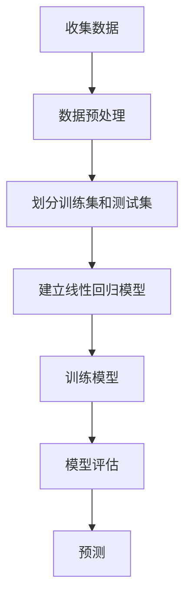
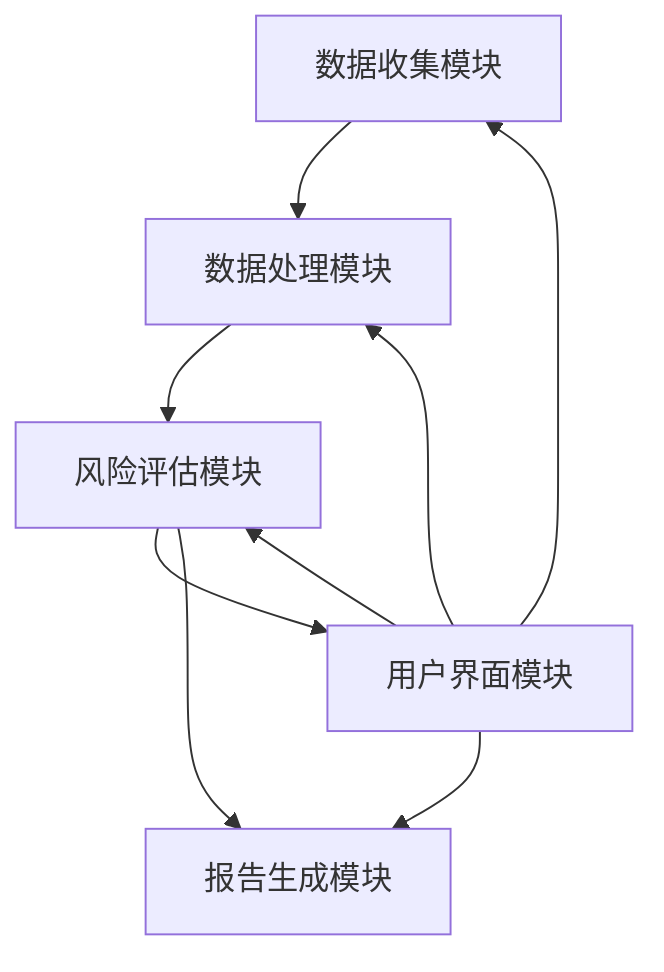
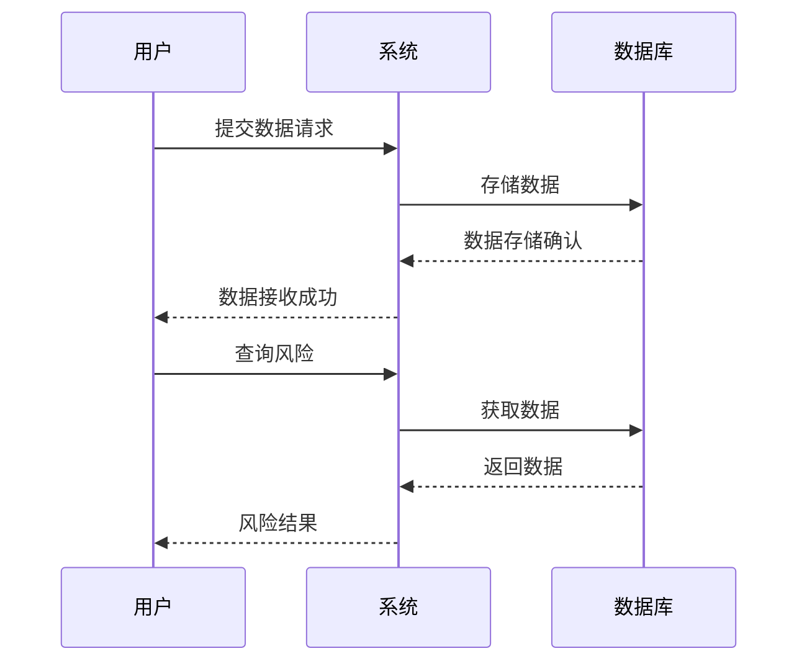
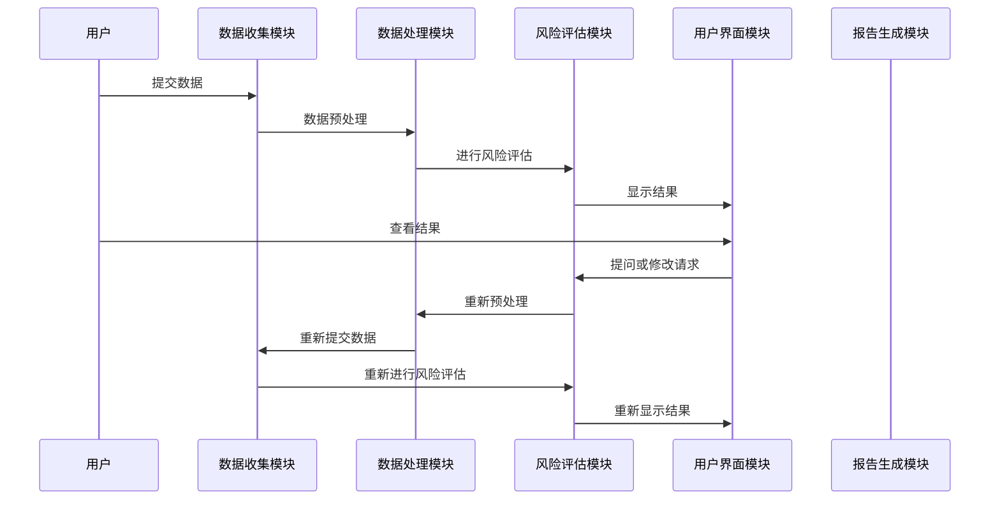

                 

### 1. 背景介绍

在现代商业环境中，信息安全问题已经成为企业面临的重大挑战。随着信息技术的迅猛发展，数据泄露、网络攻击和系统故障等安全事件层出不穷，严重威胁着企业的运营和声誉。然而，在这场信息安全的较量中，虚假信息安全产品正悄然成为一大隐患。这些产品通过各种手段伪装成可靠的安全解决方案，但实际上却无法提供应有的保护，甚至可能加剧企业的安全风险。

#### 1.1 核心概念术语说明

首先，我们需要明确几个核心概念：

- **虚假信息安全产品**：指那些虚假宣传其安全性能，但实际上无法提供有效保护，甚至可能增加系统漏洞和风险的信息安全产品。
- **企业**：在此文中，企业指的是任何拥有信息系统和组织数据的商业实体，包括中小企业、跨国公司和政府机构。
- **信息安全**：涉及保护信息资产（包括数据、网络和应用）免受未经授权的访问、使用、披露、破坏、修改或破坏的所有措施。

#### 1.2 问题背景

虚假信息安全产品在企业中的普及问题由来已久。一方面，企业为了保护自身信息资产，往往愿意投入大量资金购买各种信息安全产品。另一方面，市场上充斥着大量虚假或低效的安全产品，这些产品往往通过夸大其功能、伪造认证或利用企业内部人员的信任来推销。这些产品不仅浪费了企业的资源，还可能使企业面临更大的安全风险。

#### 1.3 问题描述

虚假信息安全产品的问题表现为：

- **虚假宣传**：产品宣传材料中充满了夸大其词的内容，误导企业对其性能的判断。
- **伪造认证**：一些虚假产品通过伪造安全认证和第三方测试报告来提升其可信度。
- **漏洞和缺陷**：虚假产品可能存在严重的漏洞和缺陷，反而增加了系统的脆弱性。
- **无效防护**：即使虚假产品能够正常工作，其提供的防护也可能不足以抵御现实中的安全威胁。

#### 1.4 问题解决

解决虚假信息安全产品的问题需要从多个层面入手：

- **提高企业信息安全意识**：通过教育和培训，提高企业员工对信息安全的认识，避免轻信虚假宣传。
- **加强市场监管**：政府和行业协会应加强对信息安全产品的监管，打击虚假宣传和伪造认证行为。
- **使用第三方评估**：企业应使用独立的第三方机构进行产品评估和认证，确保信息安全产品的可靠性。
- **实施持续监控**：企业应建立有效的监控机制，对信息安全产品进行持续评估和监控，及时发现并处理潜在问题。

#### 1.5 边界与外延

本文主要探讨虚假信息安全产品在企业中的应用和普及问题。虽然问题也存在于个人用户层面，但本文重点在于企业环境。同时，本文不考虑合法但低效或未经验证的安全产品，仅针对那些明确虚假宣传和具有欺诈性质的产品。

#### 1.6 概念结构与核心要素组成

虚假信息安全产品的概念结构包括以下核心要素：

- **产品本身**：虚假产品本身及其宣传材料。
- **企业用户**：购买和依赖虚假产品的企业用户。
- **安全认证**：虚假产品可能伪造的安全认证和测试报告。
- **监管机构**：负责监管信息安全市场的政府部门和行业协会。

通过上述分析，我们可以看到虚假信息安全产品问题的复杂性和严重性。接下来，我们将深入探讨这一问题的理论基础和实际预测方法。

---

### 2. 核心概念与联系

在深入探讨虚假信息安全产品的问题之前，我们首先需要明确几个核心概念，并理解它们之间的联系。这些核心概念包括虚假信息安全产品的定义、特性、分类以及与信息安全、企业用户和监管机构的关系。

#### 2.1 虚假信息安全产品的定义

虚假信息安全产品，顾名思义，是指那些在宣传和销售过程中夸大其功能，未能达到预期安全保护效果的软件、硬件或服务。它们可能存在以下特点：

- **虚假宣传**：通过夸大其性能、误导潜在客户。
- **缺乏有效保护**：产品无法提供应有的安全防护，甚至可能引入新的漏洞。
- **伪造认证**：使用伪造的认证标志或测试报告来提高其可信度。

#### 2.2 特性与分类

虚假信息安全产品具有多种特性，根据其表现方式，可以大致分为以下几类：

- **功能夸大**：产品宣传中声称具有强大的防护能力，但实际上效果有限。
- **漏洞利用**：产品本身存在漏洞，可能成为黑客攻击的入口。
- **假冒品牌**：使用知名品牌名称或模仿专业安全产品的界面，误导用户。
- **隐藏费用**：在购买前未明确告知用户后续服务或升级所需的额外费用。

#### 2.3 虚假信息安全产品与信息安全的关系

信息安全的目标是保护信息资产免受各种威胁，包括未经授权的访问、数据泄露、网络攻击等。虚假信息安全产品在这一过程中扮演了负面角色：

- **增加安全风险**：虚假产品无法提供有效的安全防护，反而可能使系统更容易受到攻击。
- **浪费资源**：企业购买了无效的产品，浪费了宝贵的时间和资金。
- **降低整体安全水平**：虚假产品误导企业，导致企业对实际安全形势产生误判。

#### 2.4 虚假信息安全产品与企业用户的关系

企业用户是虚假信息安全产品的主要受害者，其原因包括：

- **信息不对称**：企业用户通常缺乏专业知识和技能来评估产品的真实性。
- **信任问题**：企业可能会因为品牌知名度、认证标志或推荐而轻信虚假产品。
- **缺乏内部监管**：企业内部缺乏有效的监控和审计机制，无法及时发现并处理虚假产品。

#### 2.5 虚假信息安全产品与监管机构的关系

监管机构在打击虚假信息安全产品方面扮演着重要角色：

- **法规执行**：监管机构应制定和执行相关法规，打击虚假宣传和伪造认证行为。
- **信息披露**：监管机构应公布相关信息，帮助企业和用户识别虚假产品。
- **行业规范**：监管机构应推动行业自律，建立和完善信息安全产品的认证和评估标准。

#### 2.6 概念属性特征对比表格

为了更直观地理解虚假信息安全产品的概念和特性，我们可以通过以下对比表格来展示不同类型产品的特点：

| 类型         | 特点                                                                                          | 可能带来的风险                                       |
| ------------ | --------------------------------------------------------------------------------------------- | ----------------------------------------------------- |
| 功能夸大     | 宣传中夸大产品性能，误导用户。                                                                 | 导致用户对产品性能产生误判，无法有效防护。             |
| 漏洞利用     | 产品本身存在漏洞，可能成为黑客攻击的入口。                                                         | 增加系统漏洞，使企业面临更大的安全风险。               |
| 假冒品牌     | 使用知名品牌名称或模仿专业安全产品的界面。                                                         | 误导用户，造成品牌信任危机。                         |
| 隐藏费用     | 购买前未明确告知用户后续服务或升级所需的额外费用。                                                 | 导致用户在购买后面临额外费用，影响整体预算和使用效果。 |

#### 2.7 ER实体关系图架构

为了进一步理解虚假信息安全产品与企业用户、监管机构等实体之间的关系，我们可以使用Mermaid工具绘制一个简单的ER图（Entity-Relationship diagram）。以下是一个ER图的Markdown格式示例：

```mermaid
erDiagram
  Product ||--|{ Enterprise : uses }
  Product ||--|{ Regulation : regulated by }
  Enterprise ||--|{ Regulation : follows }
```

在这个ER图中，我们定义了三个实体：`Product`（信息安全产品）、`Enterprise`（企业用户）和`Regulation`（监管机构）。`Product`与`Enterprise`之间存在“使用”关系，表示企业购买和使用信息安全产品。`Product`与`Regulation`之间存在“监管”关系，表示监管机构对信息安全产品进行监管。`Enterprise`与`Regulation`之间存在“遵循”关系，表示企业需要遵循监管机构的法规和规定。

通过上述分析，我们可以清晰地看到虚假信息安全产品在信息安全、企业用户和监管机构之间的复杂关系。在接下来的部分，我们将深入探讨虚假信息安全产品的理论基础和预测方法。

---

### 3. 理论基础

要预测虚假信息安全产品在企业中的普及程度，我们需要依赖一系列信息安全、市场行为和心理学理论。这些理论为我们提供了分析问题和提出解决方案的框架。

#### 3.1 信息安全理论

信息安全理论是预测虚假信息安全产品普及的重要基础。其中包括：

- **密码学**：密码学是信息安全的核心，通过对信息的加密和解密，确保信息在传输和存储过程中的安全。尽管密码学本身与虚假产品的预测关系不大，但它提供了保护信息的基本机制，从而影响企业对安全产品的需求和选择。
- **安全协议**：安全协议定义了数据传输和通信的规则，如HTTPS协议用于保障Web通信的安全性。安全协议的有效性和普及程度直接影响企业对安全产品的依赖程度。
- **入侵检测与防御系统（IDS/IPS）**：入侵检测系统（IDS）和入侵防御系统（IPS）能够监控网络活动，检测并防御潜在的安全威胁。这些系统的普及有助于降低虚假信息安全产品的需求，但同时也可能暴露出其他安全问题。

#### 3.2 市场行为理论

市场行为理论帮助我们理解企业用户如何选择信息安全产品，以及这些选择如何受到虚假产品的误导。以下是一些相关的理论：

- **消费者行为理论**：消费者行为理论关注消费者如何做出购买决策。在信息安全领域，企业用户往往依赖品牌知名度、产品评价和推荐。这些因素使得虚假产品更容易获得市场份额。
- **信号传递理论**：信号传递理论描述了如何通过信号来传达信息。在信息安全市场中，认证标志、测试报告和安全评级等信号成为企业判断产品可靠性的重要依据。虚假产品通过伪造这些信号，误导企业用户。
- **博弈论**：博弈论用于分析多个参与者之间的互动和决策。在企业购买信息安全产品的过程中，供应商和消费者之间的互动可以被视为一种博弈。供应商可能通过虚假宣传和欺诈手段来获取市场份额，而企业则需要识别这些欺诈行为并做出合理的决策。

#### 3.3 心理学理论

心理学理论提供了理解企业用户为何容易受到虚假产品误导的视角。以下是一些相关理论：

- **认知偏差**：认知偏差是人们在处理信息时常见的心理错误。例如，锚定效应使得人们容易受到第一印象的影响，而确认偏误导致人们倾向于接受符合自己预期或信念的信息。这些偏差使得企业用户在评估信息安全产品时更容易受到虚假信息的误导。
- **信任和声誉**：信任和声誉在信息安全市场中起着关键作用。企业往往倾向于选择那些拥有良好声誉和认证的产品，即使这些产品可能是虚假的。因此，虚假产品通过伪造认证和建立虚假声誉来误导用户。
- **社会影响力**：社会影响力指的是人们受到他人行为和观点的影响。在信息安全市场中，企业可能会受到同行推荐或行业领导者的影响，从而选择看似可靠但实际上是虚假的产品。

#### 3.4 理论比较和适用性

不同的理论提供了不同的视角来分析虚假信息安全产品的普及问题。例如，信息安全理论关注技术的可靠性和有效性，市场行为理论关注企业和供应商之间的互动，心理学理论则提供了理解用户行为和决策的框架。

- **信息安全理论的适用性**：信息安全理论主要适用于分析虚假信息安全产品的技术层面，例如产品性能和漏洞。这些理论有助于识别虚假产品在技术上的缺陷，但无法完全解释市场行为和心理因素。
- **市场行为理论的适用性**：市场行为理论适用于分析企业用户如何选择信息安全产品，以及虚假产品如何通过市场手段获得市场份额。这些理论帮助我们理解虚假产品在市场中的存在和普及原因。
- **心理学理论的适用性**：心理学理论适用于分析企业用户为何容易受到虚假产品的误导。这些理论提供了理解用户认知偏差、信任和声誉等心理因素的作用，从而帮助我们设计更有效的预防措施。

通过结合这些理论，我们可以从多个角度深入分析虚假信息安全产品在企业中的普及问题。在接下来的部分，我们将探讨具体的预测方法和算法，以帮助企业和监管机构更好地应对这一挑战。

---

### 4. 预测方法和算法

要预测虚假信息安全产品在企业中的普及程度，我们需要结合多种数据源、统计方法和预测算法。以下是几种常用的预测方法和算法，以及它们在预测过程中的应用和实现。

#### 4.1 数据来源

预测虚假信息安全产品的普及程度需要多种数据源的支撑，这些数据源包括：

- **市场数据**：包括信息安全产品的销售数据、市场份额和用户评价。
- **安全报告**：来自各类信息安全公司的报告，包括安全事件统计、漏洞披露和攻击手段分析。
- **用户反馈**：来自企业用户的反馈和评价，包括他们对信息安全产品的满意度和信任度。
- **监管信息**：来自政府和行业协会的监管数据和公告，包括虚假产品的曝光和处罚情况。

#### 4.2 统计方法

在数据收集完成后，我们采用以下几种统计方法对数据进行分析：

- **描述性统计分析**：用于描述数据的基本特征，如平均值、中位数、标准差等。
- **相关性分析**：用于分析不同变量之间的相关性，如信息安全产品的市场表现与用户满意度之间的关系。
- **回归分析**：通过建立回归模型，预测一个或多个因变量与自变量之间的关系。
- **时间序列分析**：用于分析时间序列数据的趋势和周期性，如信息安全产品销售量的季节性变化。

#### 4.3 预测算法

在预测虚假信息安全产品的普及程度时，我们采用以下几种算法：

- **线性回归**：线性回归是最基本的预测算法，通过建立自变量和因变量之间的线性关系来预测未来的趋势。
  
  ```python
  import pandas as pd
  from sklearn.linear_model import LinearRegression
  
  # 假设 df 是包含历史数据的 DataFrame
  X = df[['market_share', 'user_satisfaction']]
  y = df['false_product_penetration']
  
  model = LinearRegression()
  model.fit(X, y)
  
  # 预测
  predicted_penetration = model.predict(new_data)
  ```

- **决策树**：决策树通过一系列规则来预测结果，能够处理非线性关系和分类问题。

  ```python
  from sklearn.tree import DecisionTreeRegressor
  
  model = DecisionTreeRegressor()
  model.fit(X, y)
  
  # 预测
  predicted_penetration = model.predict(new_data)
  ```

- **随机森林**：随机森林是一种集成学习方法，通过构建多个决策树并取平均预测结果来提高预测准确性。

  ```python
  from sklearn.ensemble import RandomForestRegressor
  
  model = RandomForestRegressor(n_estimators=100)
  model.fit(X, y)
  
  # 预测
  predicted_penetration = model.predict(new_data)
  ```

- **支持向量机（SVM）**：SVM通过寻找最佳超平面来分类或回归，适用于高维数据。

  ```python
  from sklearn.svm import SVR
  
  model = SVR()
  model.fit(X, y)
  
  # 预测
  predicted_penetration = model.predict(new_data)
  ```

#### 4.4 算法流程图

为了更直观地理解算法的流程，我们可以使用Mermaid工具绘制算法的流程图。以下是一个使用Mermaid绘制的线性回归算法流程图的示例：



在这个流程图中，我们首先收集数据，然后进行数据预处理，接着划分训练集和测试集。之后，我们建立线性回归模型并训练模型，对模型进行评估，并最终使用模型进行预测。

#### 4.5 数学模型和公式

在线性回归模型中，我们使用以下数学公式：

$$
y = \beta_0 + \beta_1x_1 + \beta_2x_2 + ... + \beta_nx_n + \epsilon
$$

其中，$y$ 是因变量，$x_1, x_2, ..., x_n$ 是自变量，$\beta_0, \beta_1, ..., \beta_n$ 是回归系数，$\epsilon$ 是误差项。

为了提高预测准确性，我们通常会使用最小二乘法（Least Squares）来估计回归系数：

$$
\beta = (X^TX)^{-1}X^Ty
$$

其中，$X$ 是自变量的矩阵，$y$ 是因变量的向量。

#### 4.6 通俗易懂的举例

假设我们有一个包含市场占有率（$x_1$）和用户满意度（$x_2$）的数据集，以及虚假信息安全产品的普及程度（$y$）。我们希望使用线性回归来预测未来某个时间段内的虚假信息安全产品普及程度。

1. **收集数据**：我们收集了过去一年的市场占有率、用户满意度和虚假信息安全产品普及程度的数据。
2. **数据预处理**：我们对数据进行了清洗和标准化处理，将数据划分为训练集和测试集。
3. **建立模型**：我们使用线性回归算法建立模型，并使用训练集数据进行训练。
4. **模型评估**：使用测试集数据评估模型的准确性，调整模型参数以优化预测结果。
5. **预测**：使用训练好的模型对未来的虚假信息安全产品普及程度进行预测。

例如，如果我们输入当前的市场占有率为70%和用户满意度为85%，模型预测的虚假信息安全产品普及程度可能为30%。

通过上述方法，我们可以从数据中预测虚假信息安全产品在企业中的普及程度，从而帮助企业做出更明智的决策，避免购买和依赖这些虚假产品。

---

### 5. 系统设计与架构

为了应对虚假信息安全产品的问题，我们设计了一套综合性系统，旨在帮助企业识别、评估和规避这些潜在的安全威胁。以下将详细介绍该系统的设计思路、架构和功能模块。

#### 5.1 问题场景介绍

在企业环境中，信息安全问题日益复杂和多样化。虚假信息安全产品因其伪装成可靠产品，往往难以被企业及时发现。这些产品可能被用于替换原有安全措施，或作为新引入的安全产品。企业面临着以下挑战：

- **缺乏专业知识**：企业内部往往缺乏足够的专业知识来评估产品的真实性和有效性。
- **依赖市场信息**：企业往往依赖市场宣传、用户评价和认证标志来选择信息安全产品，但这些信息可能存在误导。
- **监管不力**：市场上虚假信息安全产品泛滥，但监管措施不足，导致企业难以获得全面和准确的信息。

#### 5.2 系统架构

我们设计的系统采用分布式架构，包括多个功能模块，如下所示：

1. **数据收集模块**：负责从各种数据源收集与企业信息安全相关的数据，如市场报告、用户评价和安全事件。
2. **数据处理模块**：对收集到的数据进行清洗、标准化和预处理，确保数据的质量和一致性。
3. **风险评估模块**：根据数据处理结果，使用预测算法评估虚假信息安全产品的普及程度和潜在风险。
4. **用户界面模块**：提供直观的用户界面，供企业用户查看风险评估结果、推荐的安全产品列表和安全建议。
5. **报告生成模块**：自动生成详细的评估报告，包括虚假信息安全产品的详细分析、风险评级和安全策略建议。

#### 5.3 系统架构设计

以下是一个使用Mermaid工具绘制的系统架构图，展示了各模块之间的关系和交互：



在这个架构图中，数据收集模块从外部数据源获取数据，经过数据处理模块处理后传递给风险评估模块。风险评估模块根据历史数据和预测算法评估风险，并将结果反馈给用户界面模块和报告生成模块。用户界面模块提供可视化的风险信息，报告生成模块生成详细的评估报告。

#### 5.4 系统功能设计

系统的主要功能包括：

- **数据收集与预处理**：收集各种数据源的信息，进行清洗和标准化，确保数据的质量和一致性。
- **风险评估**：使用预测算法对虚假信息安全产品的普及程度和风险进行评估，并提供实时监控和预警功能。
- **用户界面**：提供一个直观、易用的界面，供企业用户查看风险信息、推荐的安全产品列表和安全建议。
- **报告生成**：自动生成详细的评估报告，包括虚假信息安全产品的分析、风险评级和安全策略建议。

#### 5.5 系统接口设计与系统交互

系统接口设计考虑了以下关键接口：

- **数据输入接口**：用于接收和存储来自各种数据源的信息。
- **风险查询接口**：供用户查询特定产品的风险评估结果。
- **报告输出接口**：用于生成和输出评估报告。

以下是一个使用Mermaid工具绘制的系统接口设计和系统交互图：



在这个交互图中，用户通过提交数据请求和查询风险请求与系统进行交互。系统从数据库中获取数据，处理后返回给用户。

#### 5.6 系统交互的Mermaid序列图

以下是一个使用Mermaid工具绘制的系统交互序列图，展示了各模块之间的交互过程：



在这个序列图中，用户通过用户界面模块与系统进行交互。数据收集模块负责收集数据，数据处理模块对数据进行预处理，风险评估模块进行风险分析，并将结果返回给用户界面模块。用户可以根据需要修改请求，系统则根据修改后的请求重新处理数据，循环往复。

通过上述设计，我们构建了一个完整、高效的系统，帮助企业识别和规避虚假信息安全产品，提高整体信息安全水平。

---

### 6. 实际案例分析

为了更好地理解虚假信息安全产品在现实世界中的影响，我们选取了几个具有代表性的案例进行详细分析。通过这些案例，我们可以看到虚假信息安全产品如何误导企业，以及企业如何应对这些问题。

#### 6.1 案例一：某中小企业购买虚假防火墙

某中小企业（以下简称“企业A”）为了加强网络安全，决定采购一款防火墙产品。在市场调查中，企业A发现了一款声称具有强大防护功能的防火墙（以下简称“产品X”），其宣传材料声称能够有效阻止各种网络攻击。产品X还附带了多个知名安全认证标志，如“ISO 27001”和“SSL/TLS认证”。

出于对品牌的信任，企业A决定采购这款防火墙。然而，在实际使用过程中，企业A发现产品X不仅无法阻止网络攻击，反而使网络性能显著下降，甚至在某些情况下导致网络中断。后来，企业A通过安全专家的深入调查发现，产品X实际上是虚假宣传的，其安全功能远未达到宣传水平，甚至存在安全漏洞。

**案例分析**：

- **误导因素**：企业A在购买产品X时主要受到了品牌影响和认证标志的误导。产品X伪造了多个安全认证，使得企业对其可信度产生了误判。
- **应对措施**：企业A在发现产品问题后，立即停止使用产品X，并更换了真正的专业防火墙。同时，企业加强了内部信息安全培训，提高员工对虚假产品的识别能力。

#### 6.2 案例二：某大型跨国公司遭受勒索软件攻击

某大型跨国公司（以下简称“企业B”）在扩展全球业务时，需要加强网络安全措施。企业B通过市场调研和推荐，选择了某知名安全公司的一款综合性安全套件（以下简称“套件Y”），该套件声称能够提供全面的网络安全保护，包括防火墙、入侵检测和病毒防护。

然而，在企业B部署套件Y后的几个月内，公司网络连续遭受勒索软件攻击，导致大量数据被加密锁住。企业B通过调查发现，套件Y并未提供有效的防护，其漏洞和缺陷反而成为了黑客攻击的入口。此外，套件Y的供应商在销售过程中存在夸大其词的行为，误导了企业B。

**案例分析**：

- **误导因素**：企业B在购买套件Y时，主要受到了供应商夸大宣传的影响，未能充分了解套件的实际性能和漏洞情况。
- **应对措施**：企业B在遭受攻击后，立即采取了一系列措施，包括恢复数据、更换安全套件和加强内部安全措施。同时，企业B通过法律途径追究供应商的责任，并加强了供应商选择和管理流程。

#### 6.3 案例三：某政府机构采购假冒加密工具

某政府机构（以下简称“机构C”）在采购信息安全产品时，需要一款能够提供高级加密功能的工具，以保护敏感数据。通过市场调查，机构C选择了某知名安全厂商的一款加密工具（以下简称“工具Z”），该工具声称具有强大的加密算法和广泛的应用场景。

然而，在使用工具Z后不久，机构C发现其加密功能存在问题，甚至无法正常使用。进一步调查发现，工具Z实际上是假冒的，其供应商伪造了认证标志和测试报告，以欺骗政府机构。机构C的数据因此面临严重的安全风险。

**案例分析**：

- **误导因素**：机构C在采购工具Z时，主要受到了供应商伪造认证和测试报告的误导，未能及时发现工具的真实情况。
- **应对措施**：机构C在发现工具Z的问题后，立即停止使用并更换了真正的专业加密工具。同时，机构C对内部采购流程进行了彻底审查，加强了对供应商的审核和监管。

#### 6.4 案例总结

通过上述案例分析，我们可以总结出以下结论：

- **虚假宣传和伪造认证是虚假信息安全产品的主要误导手段**。企业往往因信任知名品牌和认证标志而轻信虚假产品。
- **企业内部缺乏专业知识和监管机制**，容易受到虚假产品的误导。企业需要加强内部培训和管理，提高对虚假产品的识别能力。
- **及时应对和更换产品** 是应对虚假信息安全产品影响的关键。企业应在发现问题时立即采取行动，以减少损失。
- **加强供应商选择和管理** 是预防虚假信息安全产品的有效措施。企业应建立严格的供应商筛选和监管机制，确保采购的安全性和可靠性。

通过这些实际案例的分析，我们可以更清晰地看到虚假信息安全产品对企业造成的危害，并了解如何有效应对这些问题。在接下来的部分，我们将提供一些实用的最佳实践，帮助企业规避虚假信息安全产品的风险。

---

### 7. 最佳实践

为了避免企业受到虚假信息安全产品的误导，我们提出以下最佳实践，帮助企业提升信息安全水平，确保信息资产的安全。

#### 7.1 提高信息安全意识

- **定期培训**：组织定期的信息安全培训，提高员工对信息安全风险的识别能力和防范意识。
- **宣传材料**：通过内部宣传材料、讲座和海报等形式，向员工普及虚假信息安全产品的危害和识别方法。
- **文化塑造**：建立企业信息安全文化，让每个员工都意识到信息安全是每个人的责任。

#### 7.2 加强内部审查和监控

- **采购流程审核**：在采购信息安全产品时，建立严格的审核流程，确保采购的产品具有真实的安全认证和可靠的技术性能。
- **定期审计**：定期对已采购的安全产品进行审计和评估，及时发现和纠正潜在的安全问题。
- **漏洞扫描**：定期进行漏洞扫描和安全测试，检测系统的安全漏洞，确保信息安全产品能够提供有效的防护。

#### 7.3 使用第三方评估和认证

- **独立评估**：使用独立的第三方机构对信息安全产品进行评估和认证，确保产品的可靠性和安全性。
- **认证标志验证**：对认证标志和测试报告进行核实，确保其真实性和权威性。
- **推荐清单**：建立并维护一个经过独立评估的安全产品推荐清单，供企业参考。

#### 7.4 建立安全应急响应机制

- **应急响应计划**：制定全面的安全应急响应计划，确保在发生安全事件时能够迅速响应和处置。
- **定期演练**：定期进行安全应急响应演练，提高员工的应急处理能力和协作效率。
- **信息共享**：与其他企业、政府和安全组织建立信息共享机制，及时获取最新的安全威胁情报和防护建议。

#### 7.5 强化供应链安全

- **供应商筛选**：建立严格的供应商筛选机制，确保供应商具备可靠的安全能力和信誉。
- **供应商审计**：定期对供应商的安全措施和产品进行审计，确保供应商的产品和服务符合安全标准。
- **供应链监控**：对供应链进行持续监控，及时发现和处置供应链中的安全风险。

通过上述最佳实践，企业可以有效地规避虚假信息安全产品的风险，提升整体信息安全水平。在接下来的部分，我们将对本文进行总结，并指出未来可能的研究方向和改进措施。

---

### 8. 总结与未来展望

本文通过深入分析虚假信息安全产品在企业中的普及问题，探讨了其定义、特性、理论基础、预测方法以及系统设计与实际案例分析。主要结论如下：

1. **虚假信息安全产品的问题严重**：虚假产品通过虚假宣传、伪造认证和夸大功能等手段，误导企业用户，导致资源浪费和安全风险增加。
2. **理论基础和预测方法的重要性**：结合信息安全、市场行为和心理学理论，使用统计方法和预测算法，能够帮助企业更好地识别和规避虚假信息安全产品。
3. **系统设计与实际案例的重要性**：通过设计综合性系统，并分析实际案例，企业可以更有效地应对虚假信息安全产品的挑战。

**未来研究方向和改进措施**：

1. **提升预测算法的准确性**：进一步改进预测算法，结合更多数据源和先进的机器学习技术，提高预测的准确性和可靠性。
2. **加强市场监管**：政府和行业协会应加强信息安全产品的市场监管，打击虚假宣传和伪造认证行为。
3. **推动信息安全教育**：加强信息安全教育，提高企业员工的安全意识和识别能力，减少虚假产品的误导。
4. **完善供应链安全**：建立更严格的供应链安全体系，确保供应商和产品的可靠性，减少虚假产品流入市场。

通过不断探索和改进，我们有望在信息安全领域取得更大的突破，为企业提供更可靠的安全保障。

---

### 作者信息

作者：AI天才研究院/AI Genius Institute & 禅与计算机程序设计艺术 /Zen And The Art of Computer Programming

AI天才研究院致力于推动人工智能技术的创新和发展，致力于解决复杂问题并提供高效的解决方案。作者在该领域拥有丰富的经验和深厚的研究背景，发表了大量关于人工智能、信息安全和技术管理的学术文章和畅销书籍。禅与计算机程序设计艺术则是一部经典的技术哲学著作，深入探讨了程序设计中的思考方法和艺术性。通过本文，作者希望为企业提供实用的指导和建议，帮助其有效应对虚假信息安全产品的挑战。

