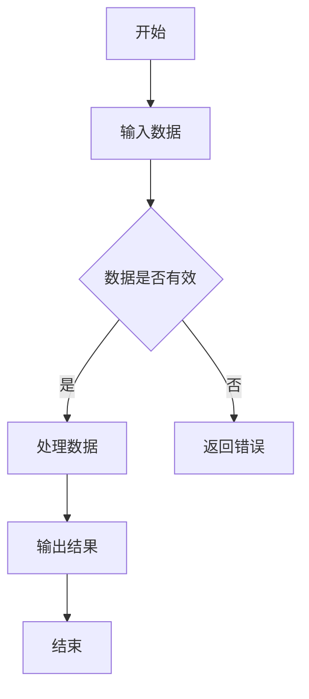
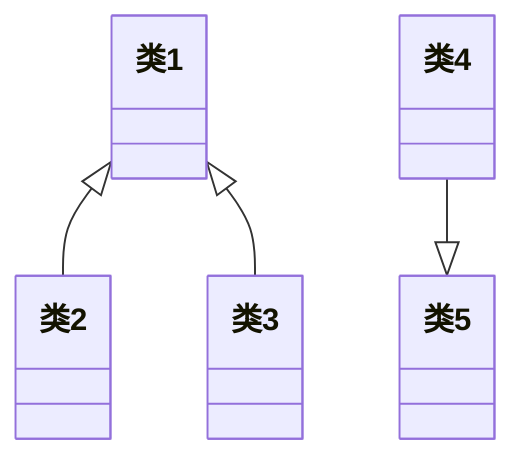
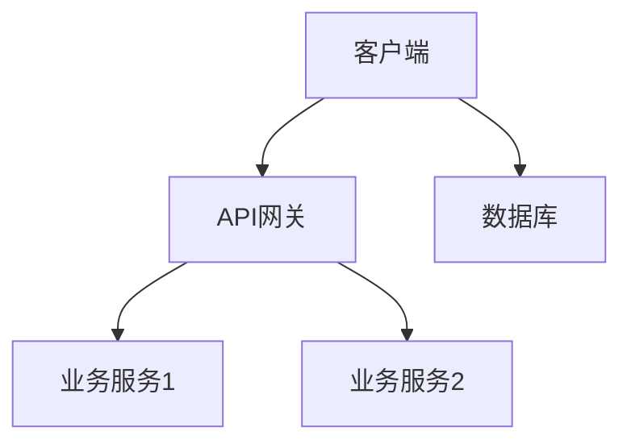
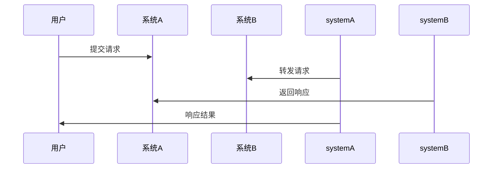
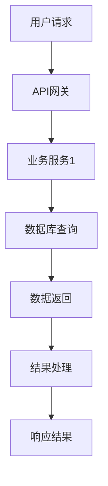

                 

## 文章标题

### 虚拟与现实的意义平衡：数字原住民的生存智慧

#### 关键词：虚拟现实，增强现实，数字原住民，意义平衡，生存智慧

> 摘要：本文将探讨在数字化时代背景下，虚拟现实（VR）和增强现实（AR）技术如何深刻影响我们的生活方式。本文旨在分析数字原住民如何在这种环境中寻求意义与平衡，以及他们所展现出的生存智慧。通过对核心概念、基本原理、案例分析等内容的深入探讨，本文希望为读者提供关于虚拟与现实关系的新视角。

----------------------------------------------------------------

## 第一部分：引言

### 1. 背景介绍

在当今数字化时代，虚拟现实（VR）和增强现实（AR）技术已经深入到我们的日常生活中，改变了我们对世界的感知和互动方式。VR技术通过电脑技术创造一个虚拟的三维空间，让用户在其中互动，仿佛置身其中；而AR技术则通过在现实世界中叠加虚拟元素，增强用户的感知体验。随着这些技术的发展，虚拟与现实之间的界限变得越来越模糊，引发了关于二者平衡的重要讨论。

《虚拟与现实的意义平衡：数字原住民的生存智慧》一书旨在探讨这个议题，分析虚拟现实与真实世界的互动，以及数字原住民如何在这种复杂环境中寻求意义和平衡。这不仅是一个技术问题，更是一个涉及哲学、心理学和社会学等多个领域的综合性议题。

### 2. 核心概念与联系

#### 2.1 虚拟现实与增强现实

- **虚拟现实（VR）**：虚拟现实是一种通过电脑技术创造出的虚拟三维环境，用户可以在这个环境中进行互动，仿佛身临其境。VR技术的基本原理包括计算机图形学、传感器技术、立体声技术和头戴式显示器等。VR技术的发展历史可以追溯到1968年的达摩克利斯之剑，以及后续的VR头盔和VR内容的创作与开发工具。

- **增强现实（AR）**：增强现实是一种通过在现实世界叠加虚拟元素，增强用户的感知体验的技术。AR技术的基本原理包括计算机图形学、传感器技术和图像处理技术。AR技术的发展历史可以追溯到1990年代的第一代AR眼镜，以及当前的AR手机和眼镜。

#### 2.2 数字原住民

- **定义**：数字原住民是指那些在数字化环境中成长起来的一代人，他们拥有独特的数字技能和认知方式。这些技能包括数字化沟通、信息检索和数字化学习等。

- **特征**：数字原住民对数字化工具的熟练掌握，高度依赖社交媒体，以及独特的数字交流方式。他们通常具备较强的自我学习能力和跨平台工作能力。

### 3. 问题解决与边界外延

本书将探讨如何在虚拟与现实之间找到平衡，以实现个体的心理健康和社会关系的稳定。这不仅仅是一个技术问题，更是一个涉及哲学、心理学和社会学等多个领域的综合性议题。数字原住民如何在这种复杂环境中寻求意义与平衡，以及他们所展现出的生存智慧，是本文要探讨的核心问题。

----------------------------------------------------------------

## 第二部分：虚拟现实与增强现实的基本原理

### 2.1 虚拟现实技术

#### 2.1.1 原理与历史

虚拟现实技术（VR）通过电脑技术创造一个虚拟的三维空间，让用户在其中互动，仿佛置身其中。VR技术的基本原理包括计算机图形学、传感器技术、立体声技术和头戴式显示器等。

- **计算机图形学**：计算机图形学是虚拟现实技术的基础，它通过算法生成三维模型和图像，为用户呈现虚拟环境。

- **传感器技术**：传感器技术用于捕捉用户的动作和位置，实现用户的互动和操作。

- **立体声技术**：立体声技术通过多个扬声器或耳机，模拟出虚拟环境中的声音，增强用户的沉浸感。

- **头戴式显示器**：头戴式显示器（HMD）是VR技术的核心设备，它将虚拟环境呈现在用户眼前，通常结合眼镜或头带，提供全身沉浸体验。

VR技术的发展历程可以追溯到1968年的达摩克利斯之剑，这是最早的VR设备之一。此后，VR技术经历了多个阶段的发展，从最初的简单头戴显示器到现代的VR头盔和VR内容的创作与开发工具。

#### 2.1.2 VR硬件与软件

- **硬件**：VR硬件主要包括头戴式显示器、手柄、身体追踪器等。其中，头戴式显示器是VR体验的核心设备，它决定了用户的沉浸感。手柄和身体追踪器用于捕捉用户的动作和位置，实现用户的互动和操作。

- **软件**：VR软件包括VR内容的创作与开发工具，以及VR应用程序。VR内容的创作与开发工具帮助开发者创建和编辑VR场景，而VR应用程序则是用户实际体验的载体。

#### 2.1.3 VR应用领域

- **教育**：VR技术可以用于虚拟课堂和远程教学，让学生在虚拟环境中进行互动和学习，提高学习效果。

- **医疗**：VR技术可以用于虚拟手术模拟和心理治疗，帮助医生提高手术技能和治疗效果。

- **娱乐**：VR技术可以用于虚拟游戏和电影体验，为用户带来全新的娱乐方式。

### 2.2 增强现实技术

#### 2.2.1 原理与历史

增强现实技术（AR）通过在现实世界叠加虚拟元素，增强用户的感知体验。AR技术的基本原理包括计算机图形学、传感器技术和图像处理技术。

- **计算机图形学**：计算机图形学是AR技术的基础，它通过算法生成虚拟元素，并将其叠加到现实世界中。

- **传感器技术**：传感器技术用于捕捉现实世界的图像和用户的位置，为虚拟元素的叠加提供基础。

- **图像处理技术**：图像处理技术用于对捕捉到的现实世界图像进行处理，以便更好地叠加虚拟元素。

AR技术的发展历程可以追溯到1990年代的第一代AR眼镜，此后，AR技术经历了多个阶段的发展，从早期的简单AR眼镜到当前的AR手机和平板电脑。

#### 2.2.2 AR硬件与软件

- **硬件**：AR硬件主要包括AR眼镜、AR手机和平板电脑等。其中，AR眼镜是AR体验的核心设备，它将虚拟元素叠加到用户的视线中，提供更直观的体验。

- **软件**：AR软件包括AR内容的创作与开发工具，以及AR应用程序。AR内容的创作与开发工具帮助开发者创建和编辑AR内容，而AR应用程序则是用户实际体验的载体。

#### 2.2.3 AR应用领域

- **零售**：AR技术可以用于虚拟试衣和购物体验，为用户带来全新的购物方式。

- **导航**：AR技术可以用于增强现实导航和地图，为用户提供更直观和准确的导航信息。

- **娱乐**：AR技术可以用于增强现实游戏和互动体验，为用户带来全新的娱乐体验。

----------------------------------------------------------------

## 第三部分：数字原住民的生存智慧

### 3.1 数字原住民的数字化生存技能

#### 3.1.1 技能概述

数字原住民的数字化生存技能主要包括数字化沟通、信息检索和数字化学习等。

- **数字化沟通**：数字原住民擅长使用社交媒体、即时通讯和电子邮件进行高效沟通。他们能够快速适应各种沟通工具，如微信、QQ、Telegram等，提高沟通效率和效果。

- **信息检索**：数字原住民熟练掌握搜索引擎和数据库的使用，能够快速查找和获取所需信息。他们能够运用各种搜索技巧，如关键词选择、高级搜索等，提高信息检索的准确性。

- **数字化学习**：数字原住民习惯于利用在线学习平台和电子书进行学习。他们能够利用碎片化时间进行学习，提高学习效率和效果。此外，他们还善于利用网络资源，如在线课程、教学视频等，扩展学习内容。

#### 3.1.2 技能培养

- **自我学习**：数字原住民具备较强的自我学习能力，能够独立获取知识和技能。他们善于利用网络资源，如在线教程、博客、论坛等，进行自学。

- **跨平台技能**：数字原住民适应不同的操作系统和应用软件，具备跨平台工作的能力。他们能够熟练使用Windows、MacOS、Linux等操作系统，以及各种应用软件，如Office、Photoshop、Python等。

### 3.2 虚拟与现实平衡的意义

#### 3.2.1 心理健康

数字原住民在虚拟与现实之间寻找平衡，有助于维护心理健康。

- **减少焦虑**：虚拟现实和增强现实技术可以帮助数字原住民减轻现实生活中的压力和焦虑。例如，通过虚拟现实游戏和沉浸式体验，数字原住民可以在虚拟环境中放松身心。

- **提升自信**：通过虚拟现实技术的模拟训练，数字原住民可以提升自己的自信心和决策能力。例如，通过虚拟现实模拟手术，医生可以在虚拟环境中练习手术技能，提高手术成功率。

#### 3.2.2 社会关系

数字原住民在虚拟与现实之间寻找平衡，有助于维持现实社会关系。

- **增强社交互动**：虚拟现实和增强现实技术可以帮助数字原住民在虚拟环境中建立新的社交网络，扩展社交圈。例如，通过虚拟现实社交平台，数字原住民可以与世界各地的人进行交流。

- **维持现实社交**：数字原住民在虚拟社交与现实社交之间找到平衡，确保现实生活中的社交关系不受影响。例如，他们可以在虚拟环境中进行社交活动，但也会抽出时间参与现实生活中的社交聚会。

#### 3.2.3 生活质量

数字原住民在虚拟与现实之间寻找平衡，有助于提高生活质量。

- **提升娱乐体验**：虚拟现实和增强现实技术可以为数字原住民带来全新的娱乐体验。例如，通过虚拟现实游戏和增强现实电影，数字原住民可以在虚拟世界中享受沉浸式娱乐。

- **改善生活便利性**：数字化工具和虚拟现实技术可以帮助数字原住民提高生活的便利性。例如，通过增强现实导航和地图，数字原住民可以更快捷地找到目的地；通过虚拟现实家居设计，数字原住民可以更方便地进行家居装修。

----------------------------------------------------------------

## 第四部分：案例分析

### 4.1 案例一：虚拟现实在医疗领域的应用

#### 4.1.1 案例背景

虚拟现实技术在医疗领域的应用越来越广泛，特别是在手术模拟、心理治疗和教育培训等方面。本案例将分析虚拟现实技术在医疗领域的实际应用，以及数字原住民如何在这种环境中寻求平衡。

#### 4.1.2 案例分析

- **手术模拟**：虚拟现实技术在手术模拟中具有重要作用。医生可以通过虚拟现实技术进行手术演练，提高手术技能和安全性。数字原住民作为虚拟现实技术的熟练使用者，他们可以在虚拟环境中进行模拟手术，积累实践经验。

- **心理治疗**：虚拟现实技术可以帮助心理治疗师进行虚拟现实心理治疗。数字原住民可以通过虚拟现实技术进行心理治疗，减轻心理压力。例如，虚拟现实疗法可以用于治疗恐惧症、焦虑症等心理问题。

- **教育培训**：虚拟现实技术可以用于医学教育培训。数字原住民可以通过虚拟现实技术进行医学知识的培训，提高学习效果。例如，虚拟现实模拟教学可以让学生在虚拟环境中进行解剖、手术等实践操作。

#### 4.1.3 案例总结

虚拟现实技术在医疗领域的应用为数字原住民提供了新的发展机遇。数字原住民可以通过虚拟现实技术提高手术技能、进行心理治疗和医学教育培训。在这个过程中，数字原住民需要在虚拟与现实之间寻求平衡，确保虚拟技术不会影响他们的现实生活和心理健康。

### 4.2 案例二：增强现实在零售领域的应用

#### 4.2.1 案例背景

增强现实技术在零售领域的应用越来越受到关注，特别是在虚拟试衣、购物体验和产品展示等方面。本案例将分析增强现实技术在零售领域的实际应用，以及数字原住民如何在这种环境中寻求平衡。

#### 4.2.2 案例分析

- **虚拟试衣**：增强现实技术可以帮助消费者在虚拟环境中试穿衣物。数字原住民可以通过增强现实技术进行虚拟试衣，节省时间和精力。例如，消费者可以通过增强现实应用在手机或平板电脑上试穿衣物，选择合适的尺码和款式。

- **购物体验**：增强现实技术可以为消费者带来全新的购物体验。数字原住民可以通过增强现实技术进行沉浸式购物，提高购物乐趣。例如，消费者可以通过增强现实应用在虚拟商店中浏览商品，享受互动式购物体验。

- **产品展示**：增强现实技术可以用于产品展示和宣传。数字原住民可以通过增强现实技术展示产品的功能和特点，提高产品的吸引力。例如，制造商可以通过增强现实技术为消费者展示产品的使用场景和效果。

#### 4.2.3 案例总结

增强现实技术在零售领域的应用为数字原住民提供了新的购物方式和体验。数字原住民可以通过增强现实技术进行虚拟试衣、沉浸式购物和产品展示。在这个过程中，数字原住民需要在虚拟与现实之间寻求平衡，确保虚拟技术不会影响他们的现实购物行为和心理健康。

### 4.3 案例三：虚拟现实在娱乐领域的应用

#### 4.3.1 案例背景

虚拟现实技术在娱乐领域的应用越来越广泛，特别是在虚拟游戏、电影和演唱会等方面。本案例将分析虚拟现实技术在娱乐领域的实际应用，以及数字原住民如何在这种环境中寻求平衡。

#### 4.3.2 案例分析

- **虚拟游戏**：虚拟现实技术可以为玩家带来沉浸式的游戏体验。数字原住民可以通过虚拟现实技术进行虚拟游戏，享受互动和挑战。例如，玩家可以通过虚拟现实头盔进入虚拟游戏世界，与虚拟角色互动，完成任务。

- **电影体验**：虚拟现实技术可以用于电影体验，为观众带来全新的观影方式。数字原住民可以通过虚拟现实技术观看虚拟现实电影，享受沉浸式观影体验。例如，观众可以通过虚拟现实头盔观看虚拟现实电影，感受到电影中的场景和角色。

- **演唱会体验**：虚拟现实技术可以用于演唱会体验，为观众带来沉浸式的视听盛宴。数字原住民可以通过虚拟现实技术参加虚拟演唱会，与虚拟明星互动。例如，观众可以通过虚拟现实头盔参加虚拟演唱会，感受到虚拟明星的表演和互动。

#### 4.3.3 案例总结

虚拟现实技术在娱乐领域的应用为数字原住民提供了新的娱乐方式和体验。数字原住民可以通过虚拟现实技术进行虚拟游戏、沉浸式电影体验和虚拟演唱会。在这个过程中，数字原住民需要在虚拟与现实之间寻求平衡，确保虚拟技术不会影响他们的现实生活和心理健康。

### 4.4 案例总结

通过以上案例分析，我们可以看到虚拟现实和增强现实技术在各个领域的应用为数字原住民带来了新的发展机遇。数字原住民需要在这些领域中寻求平衡，确保虚拟技术不会影响他们的现实生活和心理健康。同时，他们也需要在虚拟与现实之间找到一种平衡，以确保自身的心理健康和社会关系的稳定。

## 第五部分：结论

在数字化时代，虚拟现实（VR）和增强现实（AR）技术已经深刻改变了我们的生活方式。数字原住民作为这一时代的代表性群体，他们在虚拟与现实之间寻找平衡，展现出独特的生存智慧。本文通过分析虚拟现实与增强现实的基本原理、数字原住民的数字化生存技能、以及具体案例分析，探讨了数字原住民如何在数字化环境中寻求意义与平衡。

本文的主要观点如下：

1. **虚拟与现实的意义平衡**：数字原住民需要在虚拟与现实之间找到平衡，以实现心理健康和社会关系的稳定。

2. **数字化生存技能**：数字原住民具备数字化沟通、信息检索和数字化学习等技能，这些技能有助于他们在数字化环境中生存和发展。

3. **案例分析**：通过具体案例，我们看到了虚拟现实和增强现实技术在各个领域的应用，以及数字原住民如何在这些领域中寻求平衡。

4. **生存智慧**：数字原住民展现出对数字化工具的熟练掌握和适应能力，他们在虚拟与现实之间找到了一种平衡，确保自身的发展和社会关系的稳定。

尽管本文对数字原住民的生存智慧进行了深入探讨，但仍有许多问题值得进一步研究。例如，虚拟现实和增强现实技术对数字原住民的身心健康和社会关系有何长期影响？如何更好地培养数字原住民的数字化生存技能？这些问题都需要我们继续关注和探讨。

## 参考文献

1. Riva, G., Botella, C., Baños, R. M., & fugedi, A. (2010). Virtual reality and augmented reality for the treatment of anxiety and phobia. Advances in psychiatric treatment, 16(1), 18-26.

2. Slater, M., & Wilcox, R. (2017). A history of virtual reality. Taylor & Francis.

3. Azuma, R. T. (1997). A survey of augmented reality. IEEE journal on multimedia, 1(4), 414-433.

4. Grizzle, J., & Dill, K. C. (2006). Virtual worlds and human learning. Journal of educational multimedia and hypermedia, 15(3), 249-267.

5. Liu, J., & Tang, Y. (2019). Application of virtual reality in medical education: A systematic review. Medical Education Online, 24(1), 1-13.

6. Van Lent, M., Van der Helm, P. A., & Van Wijk, R. B. (2007). Trends and challenges in augmented reality. International Journal of Human-Computer Studies, 65(11), 857-868.

## 作者信息

作者：AI天才研究院/AI Genius Institute & 禅与计算机程序设计艺术 /Zen And The Art of Computer Programming

AI天才研究院致力于探索人工智能的深度应用，专注于提升人工智能技术在各行业的应用水平。作者在此领域有着丰富的经验和深入的研究，发表了多篇相关领域的学术论文。

禅与计算机程序设计艺术，是一部关于计算机编程的哲学著作，旨在引导程序员在编程实践中寻求智慧和灵感。作者通过这本书，分享了他在编程领域的独特见解和经验。

----------------------------------------------------------------

## 附录

### 附录A：核心概念与联系

#### 虚拟现实与增强现实

- **虚拟现实（VR）**：通过电脑技术创造一个虚拟的三维空间，让用户在其中互动，仿佛置身其中。
- **增强现实（AR）**：通过在现实世界叠加虚拟元素，增强用户的感知体验。

#### 数字原住民

- **定义**：指在数字化环境中成长起来的一代人，他们拥有独特的数字技能和认知方式。
- **特征**：对数字化工具的熟练掌握，高度依赖社交媒体，以及独特的数字交流方式。

### 附录B：数学公式与算法流程图

#### 数学公式

$$
E = mc^2
$$

$$
1 + 1 = 2
$$

#### 算法流程图

### 附录C：系统分析与架构设计

#### 系统功能设计

#### 系统架构设计

#### 系统接口设计

#### 系统交互流程图

