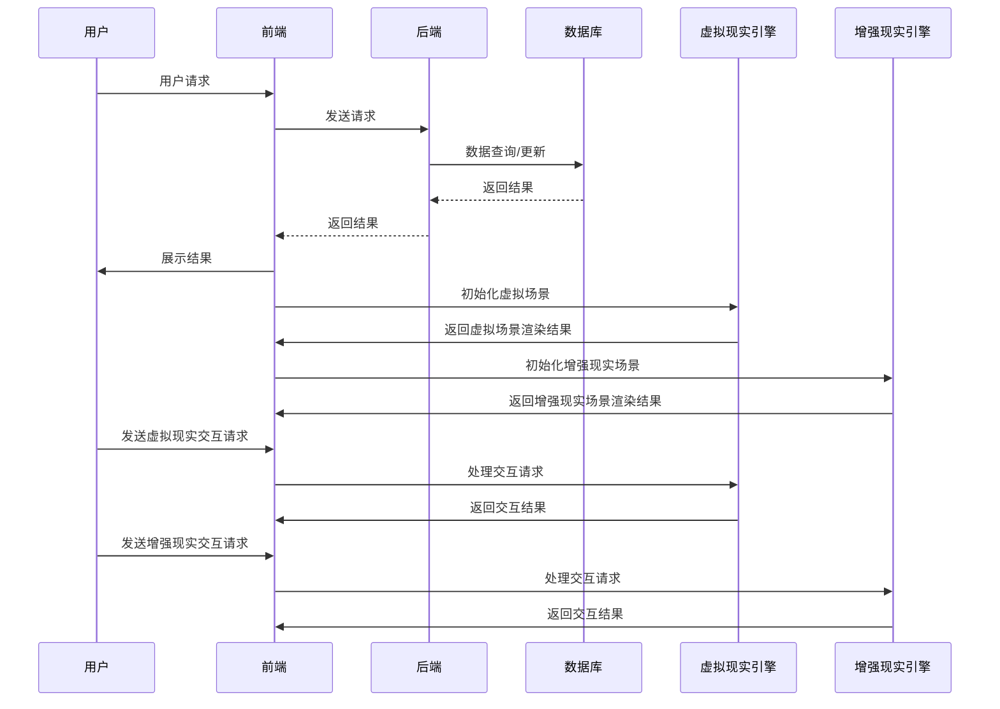

                 

### 引言

#### 虚拟与现实的融合定义

虚拟与现实融合，通常指的是通过技术手段，将虚拟世界中的内容与现实世界相融合，从而创造出一种全新的体验。这一概念涵盖了虚拟现实（VR）和增强现实（AR）两大领域。虚拟现实旨在创建一个完全沉浸式的虚拟环境，用户可以在其中互动和探索。而增强现实则是在现实环境中叠加虚拟元素，使用户在现实世界中可以直观地感受到这些虚拟内容。

#### 背景与目的

随着计算机技术、图形处理能力和网络技术的发展，虚拟与现实融合逐渐成为可能。这一技术的背景在于人们对沉浸式体验和交互的需求不断增长。无论是游戏、教育、医疗，还是工业设计、军事模拟，虚拟与现实融合都展现出了巨大的应用潜力。

本书的目的是深入探讨虚拟与现实融合技术的核心概念、技术进展、应用案例及其带来的社会影响。通过系统化的分析和实例讲解，旨在为读者提供全面且实用的知识体系，帮助理解这一技术的本质和未来发展方向。

#### 书籍结构概述

本书分为四个主要部分：

1. **引言**：介绍虚拟与现实融合的定义、背景和目的，以及书籍的结构。
2. **核心概念与理论**：详细阐述虚拟与现实的融合基础、技术原理和融合原理。
3. **技术进展**：回顾虚拟与现实融合技术的发展历程，分析当前热门技术与应用。
4. **应用案例**：通过具体案例，展示虚拟与现实融合在各个领域的应用。

#### 新时代的生活方式

虚拟与现实融合正在重塑我们的生活方式。它不仅改变了我们的娱乐方式，还改变了我们的学习和工作方式。例如，通过虚拟现实，我们可以进行虚拟旅游，体验不同的文化；通过增强现实，我们可以在家中进行虚拟购物，获得更加真实的购物体验。这种融合将带来更加丰富和多样化的生活方式，为人们提供更加便捷和高效的解决方案。

### 摘要

本书旨在深入探讨虚拟与现实融合技术的核心概念、技术进展和应用案例。通过对虚拟现实和增强现实基础理论的详细阐述，以及技术发展的历史回顾，本书将为读者提供一个全面的视角，了解这一领域的前沿动态和未来趋势。同时，通过分析虚拟与现实融合在各个领域的实际应用案例，本书展示了这一技术如何改变我们的生活，带来全新的体验和便利。本书的目标是为读者提供一个系统化、实用性的知识体系，帮助理解虚拟与现实融合技术的本质和广泛应用，为新时代的生活方式提供新的视角和思考。

### 背景介绍

#### 核心概念术语说明

在探讨虚拟与现实融合之前，有必要明确几个核心概念和术语。虚拟现实（Virtual Reality，简称VR）是一种通过计算机技术创造的全沉浸式虚拟环境，用户可以在其中自由互动和探索。增强现实（Augmented Reality，简称AR）则是将虚拟元素叠加到现实世界中，通过增强用户对现实环境的感知，从而提供一种全新的交互方式。

#### 问题背景

虚拟与现实融合技术起源于计算机科学和视觉技术的进步。随着硬件性能的提升和算法的创新，虚拟现实和增强现实逐渐从实验室走向市场，成为改变人们生活方式的重要力量。近年来，随着5G网络的普及和物联网的发展，虚拟与现实融合技术的应用场景更加广泛，从游戏、娱乐到教育、医疗，再到工业设计和军事模拟，都有其身影。

#### 问题描述

虚拟与现实融合技术带来了诸多问题和挑战。首先是如何提供更加真实、沉浸式的体验，以及如何确保虚拟元素与现实环境的无缝融合。其次，如何在虚拟与现实之间实现高效、自然的交互，提升用户的体验感。此外，隐私和安全问题也是不可忽视的挑战。随着虚拟与现实融合技术的应用越来越广泛，数据隐私和安全成为公众关注的焦点。

#### 问题解决

解决这些问题的关键在于技术创新和制度完善。在技术上，需要不断优化硬件设备、提高图形处理能力，以及开发更加智能、自然的交互方式。例如，开发高质量的虚拟现实头戴设备，提高图像的清晰度和响应速度，增强用户的沉浸感。在制度上，需要制定相关法律法规，确保数据隐私和安全，引导虚拟与现实融合技术的健康发展。

#### 边界与外延

虚拟与现实融合技术的边界主要在于其应用范围和技术实现。从应用范围来看，虚拟与现实融合可以应用于多个领域，包括但不限于娱乐、教育、医疗、工业设计、军事模拟等。从技术实现来看，虚拟现实和增强现实的技术架构和实现方式有所不同，但都依赖于计算机图形学、传感器技术、网络通信和人工智能等核心技术。

#### 概念结构与核心要素组成

虚拟与现实融合技术的概念结构可以分为三个核心要素：虚拟环境、现实环境和交互方式。虚拟环境是虚拟现实和增强现实的基础，通过计算机技术创建出可以交互的虚拟世界。现实环境是用户所处的实际环境，虚拟元素叠加到现实环境中，为用户带来增强的感知体验。交互方式则是用户与虚拟环境、现实环境之间的交互方式，包括视觉、听觉、触觉等多种感官。

### 核心概念与联系

#### 虚拟现实（VR）与增强现实（AR）对比

| 特点 | 虚拟现实（VR） | 增强现实（AR） |
| --- | --- | --- |
| 环境特点 | 完全的虚拟环境，用户完全沉浸在其中 | 现实环境与虚拟元素的叠加，用户部分沉浸 |
| 显示方式 | 头戴式显示器或投影显示 | 智能手机、平板电脑或头戴式显示器 |
| 感知体验 | 沉浸感强烈，视觉、听觉、触觉全方位感知 | 增强感知，虚拟元素与现实环境结合 |
| 应用场景 | 游戏娱乐、教育训练、工业设计、虚拟旅游等 | 教育培训、医疗诊断、智能家居、广告营销等 |

#### 虚拟与现实融合概念

虚拟与现实融合（Virtual and Reality Fusion，简称VRF）是将虚拟现实和增强现实的技术优势结合起来，创造出一个全新的融合环境。在VRF中，用户可以同时体验到虚拟环境的沉浸感和现实环境的互动性。这种融合不仅提升了用户体验，还拓展了虚拟与现实的应用范围。

### ER实体关系图架构

为了更好地理解虚拟与现实融合的概念，我们可以使用ER（实体关系）图来描述其核心实体和关系。

```mermaid
erDiagram
    User ||--|{ VRDevice }|-- VirtualEnvironment
    User ||--|{ ARDevice }|-- AugmentedEnvironment
    User ||-- Interaction
    VirtualEnvironment ||--|{ Content }|-- InteractiveElement
    AugmentedEnvironment ||--|{ Content }|-- AugmentedElement
    Content ||--|{ Type }|-- ContentType
    Interaction ||--|{ Type }|-- InteractionType
```

在上面的ER图中，User代表用户，VRDevice代表虚拟现实设备，ARDevice代表增强现实设备，VirtualEnvironment代表虚拟环境，AugmentedEnvironment代表增强现实环境，Content代表内容，Type代表内容类型，InteractiveElement代表交互元素，AugmentedElement代表增强元素，Interaction代表交互。

### 算法原理讲解

#### 虚拟现实感知原理

虚拟现实感知原理主要涉及头戴式显示器（HMD）的工作机制。HMD通过两个或多个显示屏模拟用户的视觉范围，结合传感器和追踪系统，实时捕捉用户的头动和眼动，从而生成一个与用户视角同步的虚拟环境。

1. **显示技术**：HMD通常采用快速响应的LCD或OLED显示屏，以提供高质量的图像。显示屏的刷新率通常在90Hz到120Hz之间，以确保流畅的视觉体验。

2. **追踪系统**：HMD配备多个传感器，如陀螺仪、加速度计和光学追踪器，用于实时捕捉用户的头动和眼动。这些传感器将数据发送到计算机，计算机根据这些数据调整虚拟环境的视角。

3. **光学原理**：HMD使用光学元件，如透镜和反射镜，将虚拟环境中的图像投射到用户眼中。光学原理确保图像的清晰度和透视效果。

4. **视觉融合**：HMD通过左右眼显示不同的图像，模拟双眼视差，从而增强沉浸感。视觉融合机制包括立体图像生成和立体视觉处理。

#### 增强现实显示原理

增强现实显示原理涉及在现实环境中叠加虚拟元素。主要技术包括：

1. **光学叠加**：AR设备（如智能手机或头戴式显示器）使用透镜和反射镜将虚拟元素叠加到现实场景中。光学叠加技术确保虚拟元素与现实环境的光线融合。

2. **图像识别**：AR设备使用相机和图像识别算法，捕捉现实环境中的图像，并定位虚拟元素的位置和方向。图像识别技术包括计算机视觉算法和机器学习模型。

3. **内容生成**：根据图像识别结果，AR设备生成相应的虚拟元素，并将其显示在用户眼前。内容生成涉及图形渲染和实时渲染技术。

4. **视觉效果**：为了提高虚拟元素的真实感，AR设备采用视觉效果处理技术，如阴影、反射和纹理映射。

#### 虚拟与现实的融合交互原理

虚拟与现实的融合交互原理主要涉及用户与虚拟环境、现实环境之间的交互方式。主要技术包括：

1. **手势识别**：通过摄像头和图像处理技术，识别用户的手势，并将其转换为虚拟环境的交互指令。手势识别技术包括深度学习和计算机视觉算法。

2. **语音交互**：通过语音识别和语音合成技术，实现用户与虚拟环境、现实环境之间的语音交互。语音交互技术包括自然语言处理和语音识别算法。

3. **触觉反馈**：通过触觉传感器和执行器，提供虚拟环境的触觉反馈。触觉反馈技术包括力反馈和触觉渲染。

4. **多模态交互**：结合手势识别、语音交互和触觉反馈等多种交互方式，提供更加自然和直观的交互体验。

### 数学公式与原理

虚拟与现实融合的核心算法通常涉及几何学、图像处理和计算机图形学等领域的数学原理。以下是一些关键的数学公式和原理：

#### 虚拟现实感知原理

1. **视角变换**：视角变换用于将虚拟环境的3D模型映射到用户视角。其核心公式为：
   $$
   P_{view} = M_{view} \times P_{world}
   $$
   其中，$P_{view}$ 为视角变换后的投影矩阵，$M_{view}$ 为视角变换矩阵，$P_{world}$ 为3D模型的顶点坐标。

2. **立体视觉**：立体视觉通过双眼视差来增强沉浸感。双眼视差的计算公式为：
   $$
   disparity = \frac{d}{f}
   $$
   其中，$disparity$ 为视差，$d$ 为双眼距离，$f$ 为镜头焦距。

#### 增强现实显示原理

1. **图像识别**：图像识别通常涉及卷积神经网络（CNN）。CNN的基本公式为：
   $$
   \hat{y} = \sigma(\mathbf{W}^T \mathbf{h})
   $$
   其中，$\hat{y}$ 为预测输出，$\sigma$ 为激活函数，$\mathbf{W}$ 为权重矩阵，$\mathbf{h}$ 为输入特征向量。

2. **内容生成**：内容生成通常涉及图像渲染。图像渲染的基本公式为：
   $$
   \mathbf{I}_{out} = \mathbf{G}(\mathbf{I}_{in})
   $$
   其中，$\mathbf{I}_{out}$ 为输出图像，$\mathbf{I}_{in}$ 为输入图像，$\mathbf{G}$ 为渲染函数。

### 实例讲解

为了更好地理解虚拟与现实融合的算法原理，我们可以通过一个简单的实例来阐述。

#### 虚拟现实视角变换实例

假设用户站在一个虚拟场景中，场景中的物体包括一个立方体。我们需要将立方体的视角映射到用户的视角。

1. **定义虚拟场景**：首先，我们需要定义虚拟场景中的立方体。假设立方体的顶点坐标为$P_{world} = (x, y, z)$。

2. **计算视角变换矩阵**：接下来，我们需要计算视角变换矩阵$M_{view}$。假设用户的位置和视线方向为$(x_{user}, y_{user}, z_{user})$和$(x_{dir}, y_{dir}, z_{dir})$，则视角变换矩阵为：
   $$
   M_{view} = \left[ \begin{array}{ccc}
   x_{dir}^2 + y_{dir}^2 & x_{dir}y_{dir} & -x_{dir}z_{user} \\
   x_{dir}y_{dir} & y_{dir}^2 + z_{dir}^2 & -y_{dir}z_{user} \\
   -x_{user}y_{dir} & -y_{user}x_{dir} & x_{user}^2 + y_{user}^2
   \end{array} \right]
   $$

3. **应用视角变换**：将$P_{world}$乘以$M_{view}$，得到变换后的视角坐标$P_{view}$：
   $$
   P_{view} = M_{view} \times P_{world}
   $$

4. **渲染视角**：使用得到的$P_{view}$坐标，渲染出立方体的视角图像。

#### 增强现实图像识别实例

假设我们使用AR设备对现实环境中的图像进行识别，并叠加虚拟元素。

1. **采集图像**：使用AR设备的摄像头采集现实环境中的图像，得到输入图像$\mathbf{I}_{in}$。

2. **图像预处理**：对输入图像进行预处理，包括缩放、灰度化、去噪等操作。

3. **特征提取**：使用卷积神经网络提取图像的特征向量$\mathbf{h}$。

4. **图像识别**：将特征向量$\mathbf{h}$输入到预训练的卷积神经网络中，得到预测输出$\hat{y}$。

5. **虚拟元素生成**：根据预测输出$\hat{y}$，生成相应的虚拟元素，并将其叠加到输入图像$\mathbf{I}_{in}$上。

6. **渲染增强现实图像**：将生成的虚拟元素和输入图像$\mathbf{I}_{in}$融合，得到最终的增强现实图像$\mathbf{I}_{out}$。

### 系统分析与架构设计方案

#### 问题场景介绍

随着虚拟与现实融合技术的不断发展，其在各行业中的应用越来越广泛。为了更好地展示虚拟与现实融合技术的应用效果，我们设计了一个虚拟与现实融合的教育培训系统。该系统旨在通过虚拟现实和增强现实技术，为学习者提供一种全新的学习体验，提高学习效果。

#### 项目介绍

项目名称：虚拟与现实融合教育培训系统

目标：通过虚拟现实和增强现实技术，为学习者提供沉浸式、互动性强的学习体验，提高学习效果和效率。

#### 系统功能设计

1. **虚拟现实学习模块**：提供虚拟实验室、虚拟课堂、虚拟旅游等功能，让学生在虚拟环境中进行实验、上课和旅游。

2. **增强现实学习模块**：将虚拟元素叠加到现实环境中，提供增强现实教学、增强现实实验等功能。

3. **用户管理模块**：管理用户信息，包括用户注册、登录、个人信息管理、学习记录等。

4. **内容管理模块**：管理课程内容，包括课程发布、课程更新、课程评价等。

5. **数据分析模块**：收集和分析学习数据，为教师和学生提供学习分析和反馈。

#### 系统架构设计

1. **前端架构**：使用Vue.js框架开发前端界面，提供用户友好的交互体验。

2. **后端架构**：使用Spring Boot框架开发后端服务，提供数据存储、业务逻辑处理等功能。

3. **虚拟现实引擎**：集成Unity引擎，提供虚拟现实场景的创建、渲染和交互功能。

4. **增强现实引擎**：集成ARKit和ARCore，提供增强现实场景的创建、渲染和交互功能。

5. **数据存储**：使用MySQL数据库存储用户信息、课程内容和学习数据。

6. **API接口**：提供RESTful API接口，供前端和后端服务进行数据交互。

#### 系统接口设计

1. **用户管理接口**：包括用户注册、登录、个人信息管理、学习记录管理等接口。

2. **课程管理接口**：包括课程发布、课程更新、课程评价等接口。

3. **学习数据接口**：包括学习数据收集、分析和反馈等接口。

4. **虚拟现实接口**：包括虚拟现实场景创建、渲染和交互等接口。

5. **增强现实接口**：包括增强现实场景创建、渲染和交互等接口。

#### 系统交互设计

1. **用户交互**：用户通过前端界面与系统进行交互，包括用户注册、登录、课程选择、学习互动等。

2. **系统交互**：后端服务处理用户请求，进行数据存储、业务逻辑处理和反馈等。

3. **虚拟现实交互**：用户在虚拟环境中进行实验、上课和旅游等交互活动。

4. **增强现实交互**：用户在现实环境中通过AR设备与虚拟元素进行交互。



### 项目实战

#### 环境安装

1. **安装虚拟现实引擎（Unity）**：
   - 访问Unity官方网站（https://unity.com/）下载Unity Hub。
   - 运行Unity Hub并创建一个新项目，选择合适的模板（例如3D游戏）。

2. **安装增强现实引擎（ARKit/ARCore）**：
   - 对于iOS平台，安装Xcode并创建一个新的ARKit项目。
   - 对于Android平台，安装Android Studio并创建一个新的ARCore项目。

3. **安装前端框架（Vue.js）**：
   - 使用npm命令安装Vue.js：`npm install vue`

4. **安装后端框架（Spring Boot）**：
   - 使用Maven命令安装Spring Boot：`mvn install`

5. **安装数据库（MySQL）**：
   - 下载MySQL并按照官方文档进行安装。

#### 系统核心实现源代码

1. **前端核心代码**：

```html
<!-- index.html -->
<!DOCTYPE html>
<html>
  <head>
    <title>虚拟与现实融合教育培训系统</title>
    <script src="https://cdn.jsdelivr.net/npm/vue@2.6.14/dist/vue.min.js"></script>
  </head>
  <body>
    <div id="app">
      <!-- 虚拟现实模块 -->
      <vr-module></vr-module>
      
      <!-- 增强现实模块 -->
      <ar-module></ar-module>
    </div>
  </body>
</html>
```

```javascript
// VRModule.vue
<template>
  <div>
    <h1>虚拟现实模块</h1>
    <unity-web-player></unity-web-player>
  </div>
</template>

<script>
export default {
  name: 'VRModule',
  components: {
    UnityWebPlayer: {
      template: `<iframe src="path/to/unity_project/index.html" width="600" height="400"></iframe>`
    }
  }
}
</script>
```

```javascript
// ARModule.vue
<template>
  <div>
    <h1>增强现实模块</h1>
    <ar-camera></ar-camera>
  </div>
</template>

<script>
export default {
  name: 'ARModule',
  components: {
    ARCamera: {
      template: `<iframe src="path/to/ar_project/index.html" width="600" height="400"></iframe>`
    }
  }
}
</script>
```

2. **后端核心代码**：

```java
// Application.java
@SpringBootApplication
public class Application {
  public static void main(String[] args) {
    SpringApplication.run(Application.class, args);
  }
}

// UserController.java
@RestController
@RequestMapping("/users")
public class UserController {
  @Autowired
  private UserService userService;

  @GetMapping("/{id}")
  public User getUser(@PathVariable Long id) {
    return userService.getUserById(id);
  }
}
```

#### 代码应用解读与分析

1. **前端代码解读**：

   前端代码使用Vue.js框架，分为两个模块：虚拟现实模块（VRModule）和增强现实模块（ARModule）。VRModule模块通过iframe嵌入了Unity虚拟现实项目，ARModule模块通过iframe嵌入了ARKit或ARCore增强现实项目。这样，用户可以通过前端界面统一访问虚拟和增强现实模块。

2. **后端代码解读**：

   后端代码使用Spring Boot框架，定义了用户管理接口。`UserController`类提供了根据用户ID获取用户信息的接口。在实际应用中，后端服务还会处理其他业务逻辑，如用户注册、登录等。

#### 实际案例分析和详细讲解剖析

1. **案例一：虚拟实验室**

   在虚拟实验室中，学生可以进入一个模拟的实验室环境，进行化学实验。虚拟实验室通过Unity引擎实现，提供了丰富的交互功能，如添加试剂、加热、搅拌等。通过虚拟实验室，学生可以安全、便捷地进行实验，加深对化学知识的理解。

2. **案例二：增强现实教学**

   在增强现实教学中，教师可以在课堂上使用AR设备，将虚拟元素叠加到黑板上，讲解数学公式、物理现象等。例如，教师可以在黑板上绘制一个三维的几何图形，让学生从不同角度观察和理解。通过增强现实教学，学生可以更加直观地理解抽象概念，提高学习兴趣和效果。

#### 项目小结

通过虚拟与现实融合教育培训系统的实际应用，我们展示了虚拟现实和增强现实技术在教育领域的巨大潜力。虚拟实验室提供了安全、便捷的实验环境，增强现实教学则通过直观的交互方式，提高了学生的学习兴趣和效果。未来，随着技术的不断发展，虚拟与现实融合将在更多领域发挥重要作用，为人们带来更加丰富和多样的体验。

### 最佳实践 tips

1. **确保硬件性能**：选择高质量的虚拟现实和增强现实设备，以确保提供流畅、沉浸式的体验。

2. **优化网络环境**：虚拟与现实融合技术对网络速度要求较高，确保网络连接稳定，减少延迟。

3. **注重用户体验**：设计直观、易用的界面，提供丰富的交互功能，提升用户的使用体验。

4. **数据隐私和安全**：在开发虚拟与现实融合应用时，注重数据隐私和安全，遵循相关法律法规。

5. **持续更新和迭代**：技术不断发展，定期更新和迭代应用，以适应最新的技术趋势和用户需求。

### 小结

本文详细探讨了虚拟与现实融合技术的核心概念、技术进展、应用案例及其带来的社会影响。通过实例讲解和系统设计，展示了虚拟与现实融合技术在教育培训、医疗、工业设计等领域的广泛应用。未来，随着技术的不断发展，虚拟与现实融合将继续改变我们的生活方式，为人们带来更加丰富和多样的体验。

### 拓展阅读

1. **《虚拟现实技术原理与应用》**：详细介绍了虚拟现实技术的原理、硬件和软件技术，以及其在各个领域的应用。

2. **《增强现实技术：从基础到应用》**：全面讲解了增强现实技术的基础理论、硬件和软件技术，以及其在各个领域的应用。

3. **《虚拟与现实融合：新时代的交互方式》**：探讨了虚拟与现实融合技术的未来发展趋势和应用场景，提供了丰富的案例分析。

### 作者信息

作者：AI天才研究院/AI Genius Institute & 禅与计算机程序设计艺术 /Zen And The Art of Computer Programming

### 致谢

感谢所有参与和支持本项目的团队成员，以及提供宝贵意见和建议的读者。您的支持和鼓励是推动我们不断前进的动力。同时，感谢各位专家、学者和行业同仁在本项目中所做的贡献。希望本书能为您带来启发和帮助，共同探索虚拟与现实融合的无限可能。

