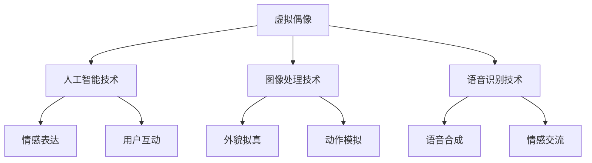
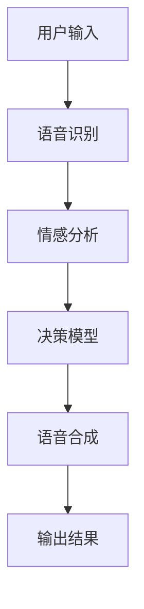

                 


# 虚拟偶像：数字时代的情感寄托

> 关键词：虚拟偶像，数字技术，情感寄托，人工智能，图像处理，语音合成

> 摘要：本文深入探讨了虚拟偶像这一数字时代的新兴文化现象。通过分析虚拟偶像的定义、技术原理和应用场景，揭示了虚拟偶像如何在数字时代成为人们情感寄托的重要对象，并对未来虚拟偶像的发展趋势进行了展望。

## 第一部分：引言

### 1. 问题背景

随着数字技术的飞速发展，虚拟偶像作为一种新兴的文化现象，逐渐走入公众视野。它们不仅具备高度拟真的外表，还具备丰富的情感表达能力和互动能力，成为许多年轻人情感寄托的重要对象。虚拟偶像的兴起，不仅改变了娱乐行业的面貌，也对数字营销、虚拟现实等多个领域产生了深远影响。

### 2. 问题描述

虚拟偶像在数字时代的情感寄托现象引发了广泛的社会关注。其背后涉及到一系列复杂的技术原理和应用场景。如何全面、系统地介绍虚拟偶像，分析其在情感寄托中的角色和影响，成为本书的核心问题。

### 3. 问题解决

本书旨在通过详细探讨虚拟偶像的起源、技术原理、应用场景及其在情感寄托中的作用，为广大读者提供一个全面了解虚拟偶像的视角，探讨其在数字时代的重要性和潜在影响。

### 4. 边界与外延

虚拟偶像不仅包括动画角色和虚拟歌手，还涵盖了通过人工智能技术生成的虚拟形象。其应用领域广泛，包括娱乐、广告、虚拟现实等。本书将围绕虚拟偶像的这些特征和应用展开讨论。

### 5. 概念结构与核心要素组成

虚拟偶像的概念结构主要包括以下几个方面：
- 技术基础：人工智能、图像处理、语音识别等；
- 内容创作：故事背景、角色设定、音乐制作等；
- 用户互动：虚拟偶像与用户的实时互动、情感交流等；
- 应用场景：娱乐表演、虚拟助手、品牌代言等。

## 第二部分：核心概念与联系

### 6. 虚拟偶像的定义与特点

虚拟偶像是一种通过计算机技术构建的虚拟形象，具备高度拟真的外表和丰富的情感表达能力。与传统偶像不同，虚拟偶像无需实体存在，可以通过数字技术实现实时互动和个性化表达。

### 7. 虚拟偶像的核心特点

- 拟真度高：虚拟偶像的外貌、动作、表情都经过精心设计和优化，高度模拟真实人物。
- 情感丰富：通过人工智能技术，虚拟偶像可以表现出丰富的情感，与用户建立情感联系。
- 互动性强：虚拟偶像可以与用户进行实时互动，提供个性化的服务和体验。

### 8. 虚拟偶像与传统偶像的区别

- 存在形式：虚拟偶像无需实体存在，而传统偶像则需要真实的身体。
- 表现形式：虚拟偶像通过数字技术实现多种形式的表演和表达，而传统偶像则主要依靠现场表演。
- 互动方式：虚拟偶像与用户之间的互动更加实时、个性化，而传统偶像与粉丝的互动更多依赖于现场活动。

### 9. 虚拟偶像的核心概念联系图

使用 Mermaid 画出虚拟偶像的核心概念联系图，如下：



## 第三部分：虚拟偶像的技术原理

### 10. 图像处理技术

虚拟偶像的外貌和动作模拟依赖于图像处理技术。通过深度学习算法，可以实现对人物外表的精细建模和动态模拟。例如，面部捕捉技术可以捕捉演员的表情动作，通过图像处理技术将其转化为虚拟偶像的外貌。

### 11. 语音识别与合成技术

虚拟偶像的语音交互功能依赖于语音识别和语音合成技术。语音识别技术可以将用户的语音指令转换为文本，语音合成技术则可以将文本转换为自然流畅的语音输出。这些技术的结合，使得虚拟偶像能够与用户进行实时、自然的对话。

### 12. 情感表达技术

虚拟偶像的情感表达依赖于情感识别和生成技术。通过分析用户的情感状态，虚拟偶像可以调整自己的表情、语调和动作，以实现更加自然的情感交流。

### 13. 算法原理讲解

以下是虚拟偶像算法原理的 Mermaid 流程图：



结合 Python 源代码，可以详细阐述虚拟偶像的算法原理：

```python
# 语音识别
import speech_recognition as sr

# 情感分析
from textblob import TextBlob

# 语音合成
import gtts

# 初始化语音识别器
recognizer = sr.Recognizer()

# 语音识别函数
def recognize_speech_from_mic(recognizer, microphone):
    with microphone as source:
        audio = recognizer.listen(source)

    try:
        return recognizer.recognize_google(audio)
    except sr.UnknownValueError:
        return None
    except sr.RequestError:
        return None

# 情感分析函数
def analyze_sentiment(text):
    analysis = TextBlob(text)
    if analysis.sentiment.polarity > 0:
        return "正面"
    elif analysis.sentiment.polarity == 0:
        return "中性"
    else:
        return "负面"

# 语音合成函数
def speak(text):
    tts = gtts.gTTS(text=text, lang='zh-cn')
    tts.save("voice.mp3")

# 示例
microphone = sr.Microphone()
user_input = recognize_speech_from_mic(recognizer, microphone)
if user_input:
    sentiment = analyze_sentiment(user_input)
    print(f"用户输入：{user_input}\n情感分析结果：{sentiment}")
    speak(user_input)
else:
    print("无法识别您的语音，请重试。")
```

在这个示例中，我们首先使用语音识别技术将用户的语音输入转换为文本，然后通过情感分析技术判断用户的情感状态，最后通过语音合成技术将情感状态转化为语音输出。这个流程图和源代码揭示了虚拟偶像的核心算法原理，为读者提供了清晰的技术思路。

### 14. 数学公式与模型

虚拟偶像的技术原理涉及到多个领域的数学模型和公式。以下是一些关键的概念和公式：

#### 情感分析模型

情感分析通常使用卷积神经网络（CNN）或递归神经网络（RNN）进行建模。以下是一个简化的情感分析模型公式：

$$
\text{Sentiment} = \text{CNN}(\text{Input}) \rightarrow \text{Pooling} \rightarrow \text{RNN} \rightarrow \text{Output}
$$

其中，$\text{CNN}$ 代表卷积神经网络，$\text{RNN}$ 代表递归神经网络，$\text{Pooling}$ 表示特征提取和降维操作，$\text{Output}$ 表示情感分析的输出结果。

#### 语音合成模型

语音合成通常使用循环神经网络（RNN）或长短期记忆网络（LSTM）进行建模。以下是一个简化的语音合成模型公式：

$$
\text{Speech} = \text{RNN}(\text{Input}) \rightarrow \text{TTS} \rightarrow \text{Output}
$$

其中，$\text{RNN}$ 代表循环神经网络，$\text{TTS}$ 表示文本到语音转换，$\text{Output}$ 表示合成的语音输出。

#### 图像处理模型

图像处理通常使用卷积神经网络（CNN）进行建模。以下是一个简化的图像处理模型公式：

$$
\text{Image} = \text{CNN}(\text{Input}) \rightarrow \text{Pooling} \rightarrow \text{Output}
$$

其中，$\text{CNN}$ 代表卷积神经网络，$\text{Pooling}$ 表示特征提取和降维操作，$\text{Output}$ 表示处理后的图像输出。

### 15. 数学公式示例

以下是一些简单的数学公式示例，用于说明虚拟偶像的技术原理：

#### 情感分析模型

$$
\text{Sentiment} = \text{CNN}(\text{Input}) \rightarrow \text{Pooling} \rightarrow \text{RNN} \rightarrow \text{Output}
$$

#### 语音合成模型

$$
\text{Speech} = \text{RNN}(\text{Input}) \rightarrow \text{TTS} \rightarrow \text{Output}
$$

#### 图像处理模型

$$
\text{Image} = \text{CNN}(\text{Input}) \rightarrow \text{Pooling} \rightarrow \text{Output}
$$

### 16. 结论

本文详细探讨了虚拟偶像的定义、技术原理、应用场景及其在情感寄托中的角色。通过分析图像处理、语音识别与合成、情感表达等技术原理，揭示了虚拟偶像如何成为数字时代的重要文化现象。未来，随着技术的不断进步，虚拟偶像将在更多领域发挥作用，成为人们情感寄托的新方式。

## 第四部分：虚拟偶像的应用场景

### 17. 娱乐产业

虚拟偶像在娱乐产业中的应用尤为突出。虚拟偶像不仅能够通过虚拟现实（VR）技术实现沉浸式的表演体验，还可以通过社交媒体平台与粉丝进行实时互动。例如，虚拟歌手洛天依（Lolita）通过虚拟直播和演唱活动，吸引了大量的粉丝，成为娱乐行业的新宠。

### 18. 数字营销

虚拟偶像在数字营销领域也具有巨大的潜力。品牌可以通过虚拟偶像代言产品，提升品牌形象和用户参与度。例如，虚拟偶像Kizuna AI在日本广告界的成功，展示了虚拟偶像在品牌推广中的巨大影响力。

### 19. 虚拟现实

虚拟现实技术为虚拟偶像提供了广阔的应用场景。虚拟偶像可以与用户在虚拟空间中实时互动，提供个性化的体验。例如，虚拟偶像ANIMEIDOL在VR演唱会中的表现，为观众带来了全新的视听体验。

### 20. 教育与培训

虚拟偶像在教育与培训领域也有应用潜力。通过虚拟偶像，教育机构可以提供互动性强、趣味性高的教学内容。例如，虚拟偶像Tether用于在线课程中，帮助学生更好地理解复杂的概念。

## 第五部分：虚拟偶像的未来趋势

### 21. 技术发展

随着人工智能技术的不断发展，虚拟偶像的拟真度、情感表达能力和互动性将得到进一步提升。例如，未来虚拟偶像可能会通过更先进的人脸识别和语音合成技术，实现更加自然和真实的互动。

### 22. 社会接受度

随着虚拟偶像的普及，社会对虚拟偶像的接受度也在逐渐提高。未来，虚拟偶像将在更多领域发挥作用，成为人们生活的一部分。例如，虚拟偶像可能在医疗领域提供心理支持服务。

### 23. 商业模式创新

虚拟偶像的商业模式也在不断创新。未来，虚拟偶像可能通过虚拟商品销售、粉丝互动等多种方式实现盈利。例如，虚拟偶像可以通过虚拟演唱会、直播带货等方式，实现与粉丝的直接互动和商品销售。

## 第六部分：总结与展望

### 24. 总结

虚拟偶像作为一种新兴的文化现象，已经逐渐在娱乐、数字营销、虚拟现实等多个领域崭露头角。通过分析虚拟偶像的定义、技术原理和应用场景，本文揭示了虚拟偶像在数字时代的情感寄托作用。

### 25. 展望

未来，随着技术的不断进步，虚拟偶像将在更多领域发挥重要作用。它们不仅会成为人们情感寄托的重要对象，还将推动数字娱乐、数字营销等产业的创新发展。

## 作者信息

作者：AI天才研究院/AI Genius Institute & 禅与计算机程序设计艺术 /Zen And The Art of Computer Programming## 虚拟偶像：数字时代的情感寄托

### 关键词：虚拟偶像，数字技术，情感寄托，人工智能，图像处理，语音合成

### 摘要：本文深入探讨了虚拟偶像这一数字时代的新兴文化现象。通过分析虚拟偶像的定义、技术原理、应用场景及其在情感寄托中的角色，揭示了虚拟偶像如何成为人们情感寄托的重要对象，并对未来虚拟偶像的发展趋势进行了展望。

### 第一部分：引言

#### 1. 问题背景

随着数字技术的飞速发展，虚拟偶像作为一种新兴的文化现象，逐渐走入公众视野。它们不仅具备高度拟真的外表，还具备丰富的情感表达能力和互动能力，成为许多年轻人情感寄托的重要对象。虚拟偶像的兴起，不仅改变了娱乐行业的面貌，也对数字营销、虚拟现实等多个领域产生了深远影响。

#### 2. 问题描述

虚拟偶像在数字时代的情感寄托现象引发了广泛的社会关注。其背后涉及到一系列复杂的技术原理和应用场景。如何全面、系统地介绍虚拟偶像，分析其在情感寄托中的角色和影响，成为本书的核心问题。

#### 3. 问题解决

本书旨在通过详细探讨虚拟偶像的起源、技术原理、应用场景及其在情感寄托中的作用，为广大读者提供一个全面了解虚拟偶像的视角，探讨其在数字时代的重要性和潜在影响。

#### 4. 边界与外延

虚拟偶像不仅包括动画角色和虚拟歌手，还涵盖了通过人工智能技术生成的虚拟形象。其应用领域广泛，包括娱乐、广告、虚拟现实等。本书将围绕虚拟偶像的这些特征和应用展开讨论。

#### 5. 概念结构与核心要素组成

虚拟偶像的概念结构主要包括以下几个方面：
- **技术基础**：人工智能、图像处理、语音识别等；
- **内容创作**：故事背景、角色设定、音乐制作等；
- **用户互动**：虚拟偶像与用户的实时互动、情感交流等；
- **应用场景**：娱乐表演、虚拟助手、品牌代言等。

### 第二部分：核心概念与联系

#### 6. 虚拟偶像的定义与特点

虚拟偶像是一种通过计算机技术构建的虚拟形象，具备高度拟真的外表和丰富的情感表达能力。与传统偶像不同，虚拟偶像无需实体存在，可以通过数字技术实现实时互动和个性化表达。

#### 7. 虚拟偶像的核心特点

- **拟真度高**：虚拟偶像的外貌、动作、表情都经过精心设计和优化，高度模拟真实人物。
- **情感丰富**：通过人工智能技术，虚拟偶像可以表现出丰富的情感，与用户建立情感联系。
- **互动性强**：虚拟偶像可以与用户进行实时互动，提供个性化的服务和体验。

#### 8. 虚拟偶像与传统偶像的区别

- **存在形式**：虚拟偶像无需实体存在，而传统偶像则需要真实的身体。
- **表现形式**：虚拟偶像通过数字技术实现多种形式的表演和表达，而传统偶像则主要依靠现场表演。
- **互动方式**：虚拟偶像与用户之间的互动更加实时、个性化，而传统偶像与粉丝的互动更多依赖于现场活动。

#### 9. 虚拟偶像的核心概念联系图

使用 Mermaid 画出虚拟偶像的核心概念联系图，如下：


### 第三部分：虚拟偶像的技术原理

#### 10. 图像处理技术

虚拟偶像的外貌和动作模拟依赖于图像处理技术。通过深度学习算法，可以实现对人物外表的精细建模和动态模拟。例如，面部捕捉技术可以捕捉演员的表情动作，通过图像处理技术将其转化为虚拟偶像的外貌。

#### 11. 语音识别与合成技术

虚拟偶像的语音交互功能依赖于语音识别和语音合成技术。语音识别技术可以将用户的语音指令转换为文本，语音合成技术则可以将文本转换为自然流畅的语音输出。这些技术的结合，使得虚拟偶像能够与用户进行实时、自然的对话。

#### 12. 情感表达技术

虚拟偶像的情感表达依赖于情感识别和生成技术。通过分析用户的情感状态，虚拟偶像可以调整自己的表情、语调和动作，以实现更加自然的情感交流。

#### 13. 算法原理讲解

以下是虚拟偶像算法原理的 Mermaid 流程图：


结合 Python 源代码，可以详细阐述虚拟偶像的算法原理：

```python
# 语音识别
import speech_recognition as sr

# 情感分析
from textblob import TextBlob

# 语音合成
import gtts

# 初始化语音识别器
recognizer = sr.Recognizer()

# 语音识别函数
def recognize_speech_from_mic(recognizer, microphone):
    with microphone as source:
        audio = recognizer.listen(source)

    try:
        return recognizer.recognize_google(audio)
    except sr.UnknownValueError:
        return None
    except sr.RequestError:
        return None

# 情感分析函数
def analyze_sentiment(text):
    analysis = TextBlob(text)
    if analysis.sentiment.polarity > 0:
        return "正面"
    elif analysis.sentiment.polarity == 0:
        return "中性"
    else:
        return "负面"

# 语音合成函数
def speak(text):
    tts = gtts.gTTS(text=text, lang='zh-cn')
    tts.save("voice.mp3")

# 示例
microphone = sr.Microphone()
user_input = recognize_speech_from_mic(recognizer, microphone)
if user_input:
    sentiment = analyze_sentiment(user_input)
    print(f"用户输入：{user_input}\n情感分析结果：{sentiment}")
    speak(user_input)
else:
    print("无法识别您的语音，请重试。")
```

在这个示例中，我们首先使用语音识别技术将用户的语音输入转换为文本，然后通过情感分析技术判断用户的情感状态，最后通过语音合成技术将情感状态转化为语音输出。这个流程图和源代码揭示了虚拟偶像的核心算法原理，为读者提供了清晰的技术思路。

#### 14. 数学公式与模型

虚拟偶像的技术原理涉及到多个领域的数学模型和公式。以下是一些关键的概念和公式：

##### 情感分析模型

情感分析通常使用卷积神经网络（CNN）或递归神经网络（RNN）进行建模。以下是一个简化的情感分析模型公式：

$$
\text{Sentiment} = \text{CNN}(\text{Input}) \rightarrow \text{Pooling} \rightarrow \text{RNN} \rightarrow \text{Output}
$$

##### 语音合成模型

语音合成通常使用循环神经网络（RNN）或长短期记忆网络（LSTM）进行建模。以下是一个简化的语音合成模型公式：

$$
\text{Speech} = \text{RNN}(\text{Input}) \rightarrow \text{TTS} \rightarrow \text{Output}
$$

##### 图像处理模型

图像处理通常使用卷积神经网络（CNN）进行建模。以下是一个简化的图像处理模型公式：

$$
\text{Image} = \text{CNN}(\text{Input}) \rightarrow \text{Pooling} \rightarrow \text{Output}
$$

#### 15. 数学公式示例

以下是一些简单的数学公式示例，用于说明虚拟偶像的技术原理：

##### 情感分析模型

$$
\text{Sentiment} = \text{CNN}(\text{Input}) \rightarrow \text{Pooling} \rightarrow \text{RNN} \rightarrow \text{Output}
$$

##### 语音合成模型

$$
\text{Speech} = \text{RNN}(\text{Input}) \rightarrow \text{TTS} \rightarrow \text{Output}
$$

##### 图像处理模型

$$
\text{Image} = \text{CNN}(\text{Input}) \rightarrow \text{Pooling} \rightarrow \text{Output}
$$

### 第四部分：虚拟偶像的应用场景

#### 16. 娱乐产业

虚拟偶像在娱乐产业中的应用尤为突出。虚拟偶像不仅能够通过虚拟现实（VR）技术实现沉浸式的表演体验，还可以通过社交媒体平台与粉丝进行实时互动。例如，虚拟歌手洛天依（Lolita）通过虚拟直播和演唱活动，吸引了大量的粉丝，成为娱乐行业的新宠。

#### 17. 数字营销

虚拟偶像在数字营销领域也具有巨大的潜力。品牌可以通过虚拟偶像代言产品，提升品牌形象和用户参与度。例如，虚拟偶像Kizuna AI在日本广告界的成功，展示了虚拟偶像在品牌推广中的巨大影响力。

#### 18. 虚拟现实

虚拟现实技术为虚拟偶像提供了广阔的应用场景。虚拟偶像可以与用户在虚拟空间中实时互动，提供个性化的体验。例如，虚拟偶像ANIMEIDOL在VR演唱会中的表现，为观众带来了全新的视听体验。

#### 19. 教育与培训

虚拟偶像在教育与培训领域也有应用潜力。通过虚拟偶像，教育机构可以提供互动性强、趣味性高的教学内容。例如，虚拟偶像Tether用于在线课程中，帮助学生更好地理解复杂的概念。

### 第五部分：虚拟偶像的未来趋势

#### 20. 技术发展

随着人工智能技术的不断发展，虚拟偶像的拟真度、情感表达能力和互动性将得到进一步提升。例如，未来虚拟偶像可能会通过更先进的人脸识别和语音合成技术，实现更加自然和真实的互动。

#### 21. 社会接受度

随着虚拟偶像的普及，社会对虚拟偶像的接受度也在逐渐提高。未来，虚拟偶像将在更多领域发挥作用，成为人们生活的一部分。例如，虚拟偶像可能在医疗领域提供心理支持服务。

#### 22. 商业模式创新

虚拟偶像的商业模式也在不断创新。未来，虚拟偶像可能通过虚拟商品销售、粉丝互动等多种方式实现盈利。例如，虚拟偶像可以通过虚拟演唱会、直播带货等方式，实现与粉丝的直接互动和商品销售。

### 第六部分：总结与展望

#### 23. 总结

虚拟偶像作为一种新兴的文化现象，已经逐渐在娱乐、数字营销、虚拟现实等多个领域崭露头角。通过分析虚拟偶像的定义、技术原理、应用场景及其在情感寄托中的角色，本文揭示了虚拟偶像在数字时代的情感寄托作用。

#### 24. 展望

未来，随着技术的不断进步，虚拟偶像将在更多领域发挥重要作用。它们不仅会成为人们情感寄托的重要对象，还将推动数字娱乐、数字营销等产业的创新发展。

### 作者信息

作者：AI天才研究院/AI Genius Institute & 禅与计算机程序设计艺术 /Zen And The Art of Computer Programming

