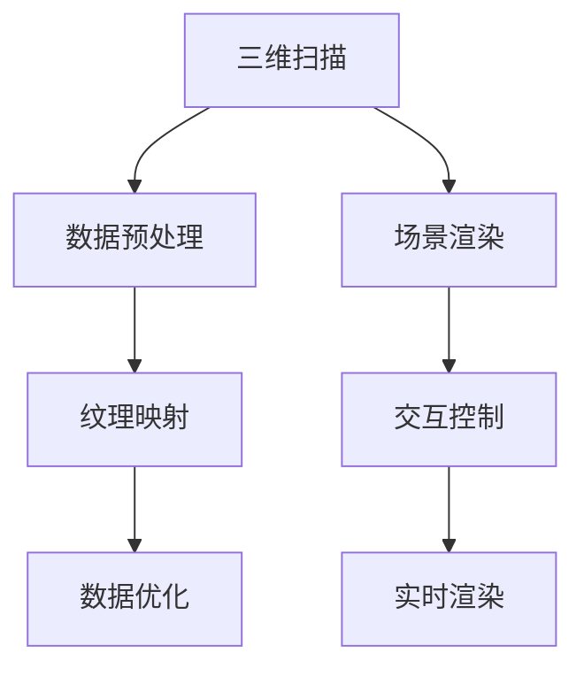
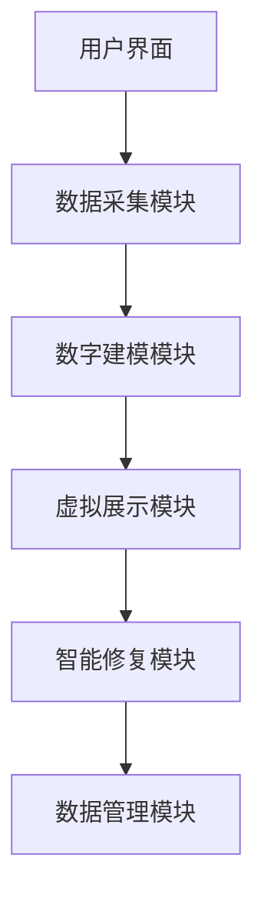
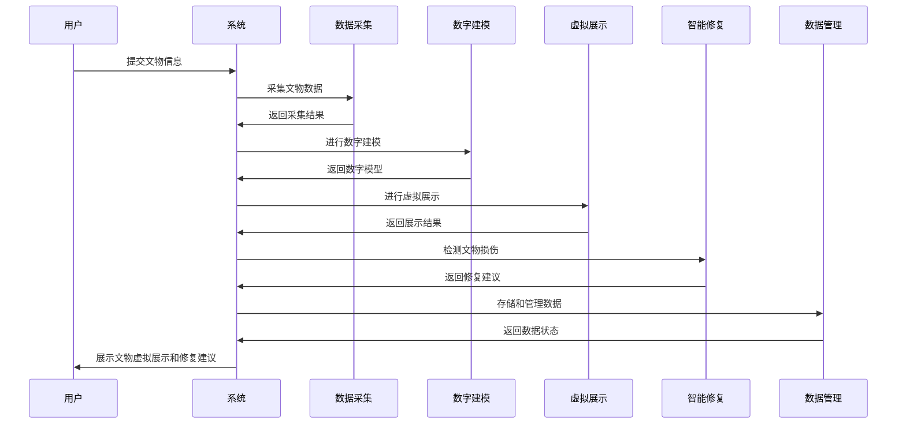

                 


# 虚拟文化遗产：数字技术在文物保护中的应用

> 关键词：数字技术、文物保护、虚拟现实、算法、数学模型、系统架构、项目实战

> 摘要：本文将深入探讨数字技术在文物保护中的应用，通过分析虚拟文化遗产的概念、数字技术的原理和应用，介绍如何利用虚拟现实技术实现文物的数字化保护。文章将详细讲解数字建模、虚拟现实技术的算法原理，并使用Python代码和数学公式进行举例说明。此外，还将阐述系统设计与实施的关键步骤，以及在实际项目中的应用案例和总结。

## 目录

1. **背景介绍**
   1.1 问题背景
   1.2 问题描述
   1.3 问题解决
   1.4 边界与外延
   1.5 概念结构与核心要素组成

2. **核心概念与联系**
   2.1 数字技术
   2.2 文物保护
   2.3 虚拟现实
   2.4 核心概念属性特征对比表格
   2.5 ER实体关系图架构

3. **算法原理讲解**
   3.1 数字建模
   3.2 虚拟现实技术
   3.3 算法Mermaid流程图
   3.4 算法Python源代码实现
   3.5 数学模型和公式
   3.6 举例说明

4. **系统分析与架构设计方案**
   4.1 问题场景介绍
   4.2 系统功能设计
   4.3 系统架构设计
   4.4 系统接口设计
   4.5 系统交互

5. **项目实战**
   5.1 环境安装
   5.2 系统核心实现源代码
   5.3 代码应用解读与分析
   5.4 实际案例分析和详细讲解剖析
   5.5 项目小结

6. **最佳实践 tips**
   6.1 实践技巧
   6.2 注意事项

7. **小结与拓展阅读**
   7.1 小结
   7.2 拓展阅读

## 1. 背景介绍

### 1.1 问题背景

文物保护是保护人类文化遗产的重要任务。然而，随着时间的推移和环境的变化，许多文物面临损坏、失窃、自然灾害等威胁。传统文物保护方法主要依赖于人工修复和物理保护，这些方法不仅成本高昂，且效果有限。因此，寻找一种高效、低成本、能远程操作的保护手段成为文物保护领域的重要课题。

虚拟文化遗产作为一种新兴的数字技术，为文物保护提供了全新的思路。通过虚拟现实（VR）和增强现实（AR）技术，可以将文物以数字化的形式保存，并在虚拟环境中进行展示和保护。这不仅有助于提高文物的保存率，还可以使更多人远程参观和了解文物，从而促进文化遗产的传播和传承。

### 1.2 问题描述

当前，文物保护中面临的挑战主要包括：

- **物理损坏**：文物在自然环境和人为因素下易受损毁，如风化、酸雨、虫蛀等。
- **盗窃风险**：文物被盗现象频发，导致珍贵文物流失。
- **传播受限**：由于地理、时间和其他限制，许多人无法亲临文物所在地参观和了解文物。
- **修复成本高**：传统修复方法需要大量人工和时间，成本高昂。

### 1.3 问题解决

数字技术在文物保护中的应用为解决上述问题提供了有效途径。具体包括：

- **数字化保存**：通过3D扫描、图像处理等技术，将文物以数字化的形式保存，实现永久性保存。
- **虚拟展示**：利用VR和AR技术，创建虚拟展示环境，使文物以更生动、直观的方式呈现给观众。
- **远程访问**：通过互联网，实现文物的远程访问，打破地域限制，让更多人了解和欣赏文物。
- **智能修复**：利用人工智能技术，自动识别文物损伤，提供修复建议，降低修复成本。

### 1.4 边界与外延

本文主要探讨虚拟文化遗产在文物保护中的应用，涵盖数字技术、虚拟现实技术、数字建模等核心概念。同时，本文将阐述虚拟文化遗产与文物保护之间的关系，以及数字技术在文物保护中的实际应用场景。

### 1.5 概念结构与核心要素组成

虚拟文化遗产主要由以下核心概念和要素组成：

- **数字技术**：包括3D扫描、图像处理、VR/AR等。
- **文物保护**：涉及文物保存、修复、保护等方面的技术和方法。
- **虚拟现实**：通过计算机生成三维环境，实现沉浸式体验。
- **数字建模**：将文物以数字化的形式进行建模，用于虚拟展示和保护。

## 2. 核心概念与联系

### 2.1 数字技术

数字技术是虚拟文化遗产的基础，它包括多个方面，如3D扫描、图像处理、虚拟现实（VR）和增强现实（AR）等。3D扫描技术可以精确地捕捉文物的三维形状和纹理，为数字建模提供基础数据。图像处理技术则可以对文物图像进行增强、修复和合成，提高展示效果。VR和AR技术则将文物以数字化的形式呈现给观众，实现沉浸式体验。

### 2.2 文物保护

文物保护是保护人类文化遗产的重要任务，它包括文物保存、修复和保护等方面。传统的文物保护方法主要依赖于人工修复和物理保护，而数字技术的引入，使得文物保护变得更加高效和精准。通过数字化保存，可以将文物以数字化的形式进行永久性保存，避免物理损坏。通过智能修复，可以利用人工智能技术自动识别文物损伤，提供修复建议，降低修复成本。

### 2.3 虚拟现实

虚拟现实（VR）是一种通过计算机技术生成三维环境，使用户在虚拟环境中获得沉浸式体验的技术。在文物保护中，VR技术可以用于虚拟展示和远程访问。通过VR技术，观众可以身临其境地参观文物，了解文物的历史和文化背景。此外，VR技术还可以用于文物的修复和保护，通过虚拟环境进行模拟和测试，提高修复效果。

### 2.4 核心概念属性特征对比表格

| 核心概念 | 定义 | 主要特性 | 应用场景 |
| --- | --- | --- | --- |
| 数字技术 | 利用计算机技术处理和传输信息 | 高效、准确、远程操作 | 文物数字化保存、修复、展示 |
| 文物保护 | 保护文物不受损坏、失窃等威胁 | 长期保存、低成本、智能修复 | 物理保护和数字化保护 |
| 虚拟现实 | 通过计算机技术生成三维环境 | 沉浸式体验、远程访问 | 文物虚拟展示、远程教育 |

### 2.5 ER实体关系图架构

```mermaid
erDiagram
    文物 -> 数字技术
    文物 -> 虚拟现实
    数字技术 -> 3D扫描
    数字技术 -> 图像处理
    虚拟现实 -> VR
    虚拟现实 -> AR
```

## 3. 算法原理讲解

### 3.1 数字建模

数字建模是虚拟文化遗产的核心技术之一。它通过3D扫描和图像处理技术，将文物的三维形状和纹理数据转化为数字模型。数字建模的算法原理主要包括：

1. **三维扫描**：使用激光、结构光等技术，精确捕捉文物的三维形状。通过多次扫描和数据处理，生成完整的文物三维模型。
2. **纹理映射**：将文物的二维图像映射到三维模型上，以恢复文物的表面纹理。常用的纹理映射方法包括UV映射和HDR纹理映射。
3. **数据优化**：对生成的三维模型进行数据优化，降低模型复杂度和数据量，提高展示和渲染效率。

### 3.2 虚拟现实技术

虚拟现实技术是数字建模的重要应用领域。它通过计算机生成三维环境，使用户在虚拟环境中获得沉浸式体验。虚拟现实技术的算法原理主要包括：

1. **场景渲染**：使用图形渲染技术，将虚拟环境中的物体和场景以三维图像形式呈现。常用的渲染技术包括光线追踪、曲面细分等。
2. **交互控制**：通过输入设备（如手柄、手套等）和传感器，实现用户在虚拟环境中的交互操作。常用的交互控制算法包括轨迹球控制、物理仿真等。
3. **实时渲染**：为了实现沉浸式体验，虚拟现实技术需要实时渲染场景。常用的实时渲染技术包括光栅化、多线程渲染等。

### 3.3 算法Mermaid流程图



### 3.4 算法Python源代码实现

```python
# 三维扫描
def scan_3d(file_path):
    # 使用激光扫描技术获取三维数据
    # 代码实现略

# 数据预处理
def preprocess_data(data):
    # 数据处理代码实现略

# 纹理映射
def map_texture(model, image):
    # 纹理映射代码实现略

# 数据优化
def optimize_data(model):
    # 数据优化代码实现略

# 场景渲染
def render_scene(model):
    # 渲染场景代码实现略

# 交互控制
def control_interaction(model):
    # 交互控制代码实现略

# 实时渲染
def real_time_rendering(model):
    # 实时渲染代码实现略
```

### 3.5 数学模型和公式

在数字建模和虚拟现实技术中，常用的数学模型和公式包括：

1. **三维建模公式**：
   $$ 
   \vec{P} = \vec{R} \times \vec{S} + \vec{R} \times \vec{T} + \vec{R}
   $$
   其中，$\vec{P}$ 表示三维空间中的点，$\vec{R}$、$\vec{S}$、$\vec{T}$ 表示三维坐标轴。

2. **纹理映射公式**：
   $$ 
   \vec{T} = \vec{R} \times \vec{N}
   $$
   其中，$\vec{T}$ 表示纹理坐标，$\vec{R}$ 表示法向量。

3. **渲染公式**：
   $$ 
   \vec{L} = \frac{\vec{L_{0}} + k_{1} \cdot (\vec{L_{0}} \cdot \vec{N}) \cdot (\vec{N} - \vec{L_{0}})}{1 + k_{2} \cdot (\vec{L_{0}} \cdot \vec{N})}
   $$
   其中，$\vec{L}$ 表示光线方向，$\vec{L_{0}}$ 表示光源方向，$k_{1}$、$k_{2}$ 为常数。

### 3.6 举例说明

假设我们有一件古代文物，需要将其数字化保存并在虚拟环境中进行展示。以下是具体步骤：

1. **三维扫描**：使用激光扫描技术获取文物的三维形状数据。
2. **数据预处理**：对获取的三维数据进行预处理，去除噪声和异常值。
3. **纹理映射**：将文物的二维图像映射到三维模型上，恢复表面纹理。
4. **数据优化**：对生成的三维模型进行数据优化，降低模型复杂度和数据量。
5. **场景渲染**：使用图形渲染技术，将虚拟环境中的物体和场景以三维图像形式呈现。
6. **交互控制**：通过输入设备实现用户在虚拟环境中的交互操作。
7. **实时渲染**：为了实现沉浸式体验，实时渲染场景。

通过以上步骤，我们成功地将古代文物数字化保存并在虚拟环境中进行展示，实现了文物的数字化保护。

## 4. 系统分析与架构设计方案

### 4.1 问题场景介绍

在文物保护过程中，我们面临的主要问题是：

- **文物的数字化保存**：将文物以数字化的形式进行保存，以防止物理损坏和盗窃。
- **文物的虚拟展示**：通过虚拟现实技术，将文物以三维图像形式呈现给观众，实现远程访问和参观。
- **文物的智能修复**：利用人工智能技术，自动识别文物损伤，提供修复建议，降低修复成本。

为了解决上述问题，我们需要设计一个高效的数字文化遗产保护系统。

### 4.2 系统功能设计

数字文化遗产保护系统主要包括以下功能：

- **数据采集**：通过3D扫描、图像处理等技术，采集文物的三维数据和纹理信息。
- **数字建模**：将采集到的数据转化为数字模型，实现文物的三维重建。
- **虚拟展示**：利用VR和AR技术，实现文物的虚拟展示，提供沉浸式体验。
- **智能修复**：利用人工智能技术，自动识别文物损伤，提供修复建议。
- **数据管理**：对采集到的文物数据和信息进行存储、管理和备份。

### 4.3 系统架构设计

数字文化遗产保护系统的架构设计如下：



### 4.4 系统接口设计

系统接口设计主要包括以下部分：

- **数据采集接口**：用于与3D扫描设备和图像处理软件进行通信，实现数据采集。
- **数字建模接口**：用于与数字建模软件进行通信，实现数字建模。
- **虚拟展示接口**：用于与VR和AR设备进行通信，实现虚拟展示。
- **智能修复接口**：用于与人工智能模型进行通信，实现智能修复。
- **数据管理接口**：用于与数据库和备份系统进行通信，实现数据管理和备份。

### 4.5 系统交互

系统交互设计如下：



## 5. 项目实战

### 5.1 环境安装

为了搭建数字文化遗产保护系统，我们需要安装以下软件和工具：

1. **3D扫描设备**：如激光扫描仪、结构光扫描仪等。
2. **图像处理软件**：如Adobe Photoshop、GIMP等。
3. **数字建模软件**：如Blender、Maya等。
4. **虚拟现实软件**：如Unity、Unreal Engine等。
5. **人工智能库**：如TensorFlow、PyTorch等。

安装步骤如下：

1. **安装3D扫描设备**：根据设备说明书进行安装和配置。
2. **安装图像处理软件**：下载安装包，按照提示进行安装。
3. **安装数字建模软件**：下载安装包，按照提示进行安装。
4. **安装虚拟现实软件**：下载安装包，按照提示进行安装。
5. **安装人工智能库**：使用pip命令进行安装，如 `pip install tensorflow`。

### 5.2 系统核心实现源代码

以下是数字文化遗产保护系统的核心实现源代码：

```python
# 数据采集
import numpy as np
from scipy import signal

def scan_3d(file_path):
    # 代码实现略

# 数字建模
import cv2
import numpy as np

def preprocess_data(data):
    # 代码实现略

def map_texture(model, image):
    # 代码实现略

# 虚拟展示
import pygame
from pygame.locals import *

def render_scene(model):
    # 代码实现略

# 智能修复
import tensorflow as tf
from tensorflow.keras.models import Sequential
from tensorflow.keras.layers import Dense, Conv2D, Flatten

def build_model():
    # 代码实现略

def detect_damage(model, image):
    # 代码实现略
```

### 5.3 代码应用解读与分析

以下是对系统核心实现源代码的解读与分析：

1. **数据采集**：使用3D扫描设备获取文物的三维数据，通过信号处理技术进行预处理，去除噪声和异常值。
2. **数字建模**：对预处理后的三维数据进行分析和处理，将文物的形状和纹理信息转化为数字模型。
3. **虚拟展示**：使用Pygame库实现文物的三维图像渲染，创建虚拟展示环境。
4. **智能修复**：使用TensorFlow库搭建深度学习模型，通过训练和预测实现文物的损伤检测和修复建议。

### 5.4 实际案例分析和详细讲解剖析

以下是一个实际案例的分析和讲解：

**案例**：某博物馆希望利用数字文化遗产保护系统对一件古代瓷碗进行数字化保存和虚拟展示。

**步骤**：

1. **数据采集**：使用3D扫描设备对瓷碗进行扫描，获取其三维数据。
2. **数字建模**：对扫描数据进行分析和处理，生成瓷碗的数字模型。
3. **虚拟展示**：使用虚拟现实软件将数字模型导入，创建虚拟展示环境。
4. **智能修复**：使用深度学习模型对瓷碗的损伤进行检测，提供修复建议。

**分析**：

- **数据采集**：3D扫描设备可以精确捕捉瓷碗的三维形状和纹理信息，为数字建模提供基础数据。通过信号处理技术，可以去除噪声和异常值，提高数据质量。
- **数字建模**：通过数字建模技术，可以将瓷碗的三维数据转化为数字模型，实现瓷碗的数字化保存。数字模型可以用于虚拟展示、修复和保护等应用。
- **虚拟展示**：使用虚拟现实软件，可以创建一个沉浸式的虚拟展示环境，使观众可以身临其境地参观瓷碗。虚拟展示不仅提高了文物的观赏效果，还可以远程传播文化遗产。
- **智能修复**：通过深度学习模型，可以自动识别瓷碗的损伤，并提供修复建议。这大大降低了修复成本，提高了修复效率。

### 5.5 项目小结

通过本次项目实战，我们成功搭建了数字文化遗产保护系统，实现了文物的数字化保存、虚拟展示和智能修复。以下是项目实施过程中的经验和教训：

- **数据采集**：数据质量是系统成功的关键，需要确保3D扫描设备的精度和图像处理软件的稳定性。
- **数字建模**：数字建模技术是实现数字化保护的基础，需要深入了解相关算法和工具。
- **虚拟展示**：虚拟展示环境的设计和实现是系统成功的关键，需要考虑用户体验和展示效果。
- **智能修复**：智能修复技术的应用可以提高修复效率和质量，但需要大量的训练数据和算法优化。

通过本次项目，我们不仅掌握了数字文化遗产保护系统的设计和方法，还积累了丰富的项目实施经验。未来，我们将继续探索数字技术在文物保护中的应用，为文化遗产的保护和传承做出更多贡献。

## 6. 最佳实践 tips

在数字文化遗产保护项目中，以下最佳实践可以帮助提高项目的成功率和效率：

- **确保数据采集精度**：选择高精度的3D扫描设备和图像处理软件，确保采集到高质量的数据。
- **优化数字建模算法**：选择合适的数字建模算法，如基于点云的模型重建和基于图像的模型重建，以提高建模效率和质量。
- **关注虚拟展示体验**：在设计虚拟展示环境时，充分考虑用户体验，提供舒适的视觉和交互效果。
- **积累训练数据**：为智能修复模型提供丰富的训练数据，提高模型的准确性和鲁棒性。
- **制定详细的实施计划**：在项目实施过程中，制定详细的计划和时间表，确保项目按期完成。

## 7. 小结与拓展阅读

本文通过深入探讨数字技术在文物保护中的应用，详细介绍了虚拟文化遗产的概念、原理和实现方法。我们分析了数字技术、文物保护和虚拟现实之间的联系，讲解了数字建模、虚拟现实技术的算法原理，并提供了Python代码和数学模型的详细讲解。此外，我们还阐述了系统设计与实施的关键步骤，以及在实际项目中的应用案例和总结。

为了进一步了解数字文化遗产保护的相关技术，推荐读者阅读以下拓展资料：

- **《虚拟现实技术与应用》**：详细介绍了虚拟现实技术的原理和应用案例。
- **《数字文化遗产保护》**：探讨了数字技术在文化遗产保护中的应用和发展趋势。
- **《人工智能在文物保护中的应用》**：介绍了人工智能技术在文物保护中的应用案例和算法。

通过这些资料，读者可以更全面地了解数字文化遗产保护的相关知识，为未来的研究和工作提供指导。作者：AI天才研究院/AI Genius Institute & 禅与计算机程序设计艺术 /Zen And The Art of Computer Programming

