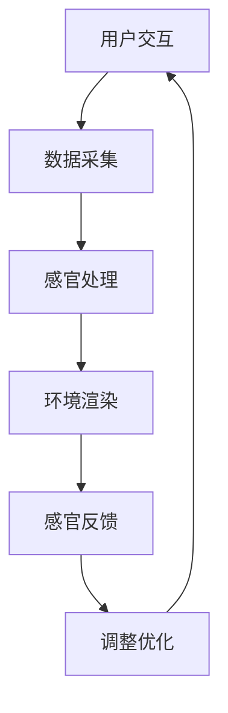

                 

# 虚拟现实体验：科技如何扩展我们的感知世界

## 关键词
虚拟现实，感知扩展，沉浸感，实时渲染，多感官融合

## 摘要
本文将探讨虚拟现实（VR）技术如何通过科技手段扩展我们的感知世界。我们将分析虚拟现实体验面临的挑战，并提出一系列解决方案，包括多感官融合、实时渲染技术、光学与显示技术、个性化内容创作和降低成本提升易用性。本文旨在为读者提供对虚拟现实技术及其应用的深度理解和见解。

---

**Step 1: 背景介绍**

### 虚拟现实体验：科技如何扩展我们的感知世界

#### 1.1 问题背景
虚拟现实（VR）技术近年来取得了显著的进展，它不仅改变了娱乐和游戏行业的面貌，也在教育、医疗、设计等多个领域展现出巨大的潜力。随着技术的不断进步，如何优化虚拟现实体验、扩展用户的感知世界成为了学术界和工业界共同关注的焦点。

#### 1.2 问题描述
当前虚拟现实体验面临的主要挑战包括沉浸感不足、感知延迟、视觉疲劳、设备成本高以及用户接受度低等。为了解决这些问题，需要从多个方面入手，包括感知扩展技术的研发、硬件设备的优化、内容创作的提升等。

#### 1.3 问题解决
虚拟现实体验的优化和感知世界的扩展可以通过以下几种方式实现：
- **多感官融合**：结合视觉、听觉、触觉等多种感官刺激，提高用户的沉浸感。
- **实时渲染技术**：提升画面质量和渲染速度，减少感知延迟。
- **光学与显示技术**：采用先进的显示技术和材料，减少视觉疲劳。
- **个性化内容创作**：根据用户特点和需求，定制个性化的虚拟现实内容。
- **降低成本和提升易用性**：通过技术创新和产业链整合，降低设备成本，提高用户接受度。

#### 1.4 边界与外延
虚拟现实体验的扩展不仅仅局限于娱乐和游戏，它还可以应用于教育、医疗、工业设计、军事训练等领域。因此，研究虚拟现实体验的扩展具有重要的实际意义和广泛的应用前景。

#### 1.5 概念结构与核心要素组成
虚拟现实体验的扩展涉及到以下核心要素：
- **感知扩展技术**：包括多感官融合技术、实时渲染技术等。
- **硬件设备**：包括头戴显示器（HMD）、手套、体感控制器等。
- **内容创作**：包括虚拟现实应用的开发、内容设计等。
- **用户体验**：包括用户研究、用户反馈等。

**Step 2: 核心概念与联系**

### 2.1 虚拟现实（VR）

#### 2.1.1 定义
虚拟现实（Virtual Reality，VR）是一种通过计算机生成模拟环境，利用传感设备和头戴显示器等硬件设备让用户沉浸其中的技术。

#### 2.1.2 特点
- **沉浸感**：用户感觉自己置身于虚拟环境中。
- **交互性**：用户可以通过手势、语音等与虚拟环境进行互动。
- **沉浸感**：通过多种感官刺激，如视觉、听觉、触觉等，增强用户体验。

#### 2.1.3 与增强现实（AR）的区别
虚拟现实（VR）与增强现实（AR）的区别在于：
- **虚拟现实**：完全取代用户眼前的现实世界，提供全新的虚拟环境。
- **增强现实**：在现实世界中叠加虚拟元素，增强用户对现实世界的感知。

### 2.2 感知扩展技术

#### 2.2.1 定义
感知扩展技术是一种通过增强用户感官体验，提高虚拟现实体验质量的技术。

#### 2.2.2 主要类型
- **多感官融合技术**：结合视觉、听觉、触觉等多种感官刺激，提高沉浸感。
- **实时渲染技术**：提升画面质量和渲染速度，减少感知延迟。

#### 2.2.3 关键技术
- **光学技术**：如LED显示技术、OLED显示技术等。
- **显示技术**：如头戴显示器（HMD）、增强现实眼镜等。

**Step 3: 算法原理讲解**

### 3.1 多感官融合算法

#### 3.1.1 Mermaid 流程图


#### 3.1.2 Python 源代码
```python
# 假设我们使用Python模拟一个多感官融合系统

# 初始化系统
def init_system():
    print("初始化系统")

# 数据采集
def collect_data():
    print("采集用户交互数据")

# 感官处理
def process_sensory_data(data):
    print(f"处理感官数据：{data}")

# 环境渲染
def render_environment():
    print("渲染虚拟环境")

# 感官反馈
def provide_sensory_feedback():
    print("提供感官反馈")

# 调整优化
def adjust_and_optimize():
    print("调整系统参数")

# 主函数
def main():
    init_system()
    while True:
        collect_data()
        process_sensory_data(data)
        render_environment()
        provide_sensory_feedback()
        adjust_and_optimize()

# 运行主函数
main()
```

#### 3.1.3 算法原理详细讲解
多感官融合算法的核心思想是通过整合视觉、听觉、触觉等多感官信息，提高虚拟现实体验的沉浸感和真实感。以下是算法原理的详细讲解：

1. **用户交互**：系统首先与用户进行交互，收集用户的输入数据，如手势、语音等。
2. **数据采集**：系统通过传感器和设备采集用户的交互数据，例如头戴显示器的姿态数据、手部动作数据等。
3. **感官处理**：系统对采集到的数据进行处理，包括姿态校正、手势识别、声音处理等，确保数据准确性和实时性。
4. **环境渲染**：根据处理后的数据，系统生成虚拟环境，并在头戴显示器上渲染出来。这一步需要实时渲染技术，确保画面的流畅性和真实感。
5. **感官反馈**：系统将渲染的虚拟环境以视觉、听觉、触觉的形式反馈给用户，增强用户的沉浸感。
6. **调整优化**：系统根据用户反馈和性能数据，调整系统参数，优化用户体验。

#### 3.1.4 数学模型和公式
多感官融合算法中的核心数学模型包括传感器数据滤波、姿态估计、声音处理等。以下是这些模型的公式和解释：

1. **传感器数据滤波**：假设我们使用卡尔曼滤波器对传感器数据进行滤波，公式如下：
   $$ x_{k+1} = A x_k + B u_k $$
   $$ P_{k+1} = A P_k A^T + Q $$
   其中，$x_k$表示状态向量，$P_k$表示状态协方差矩阵，$A$表示状态转移矩阵，$B$表示控制输入矩阵，$u_k$表示控制输入向量，$Q$表示过程噪声协方差矩阵。

2. **姿态估计**：使用滑动平均滤波器进行姿态估计，公式如下：
   $$ \hat{x}_{k} = \frac{1}{2} (\hat{x}_{k-1} + x_{k}) $$
   其中，$\hat{x}_k$表示估计的姿态向量，$x_k$表示实际姿态向量。

3. **声音处理**：使用双耳效应模型处理声音，公式如下：
   $$ \theta = \frac{v}{v_d} $$
   其中，$\theta$表示声音到达时间差，$v$表示声音速度，$v_d$表示耳朵之间的距离。

#### 3.1.5 举例说明
假设一个用户在使用虚拟现实系统观看一个虚拟电影院，以下是一个简单的例子：

1. **用户交互**：用户通过手势选择了电影院的座位。
2. **数据采集**：系统采集用户的手势数据，并使用卡尔曼滤波器进行滤波。
3. **感官处理**：系统对采集到的数据进行处理，包括手势识别和姿态估计。
4. **环境渲染**：系统根据处理后的数据，渲染出用户选择的座位和周围的环境。
5. **感官反馈**：系统将渲染的虚拟环境以视觉和触觉的形式反馈给用户，例如显示在头戴显示器上，并通过触觉手套提供震动反馈。
6. **调整优化**：系统根据用户的反馈和性能数据，调整渲染参数和滤波器参数，以优化用户体验。

通过上述例子，我们可以看到多感官融合算法在虚拟现实体验中的应用，它通过整合多感官信息，为用户提供了更加真实和沉浸的体验。

---

在接下来的文章中，我们将继续探讨实时渲染技术、光学与显示技术、个性化内容创作、降低成本和提升易用性等解决方案，以及虚拟现实在不同领域中的应用和未来发展趋势。敬请期待！

---

作者：AI天才研究院/AI Genius Institute & 禅与计算机程序设计艺术 /Zen And The Art of Computer Programming

