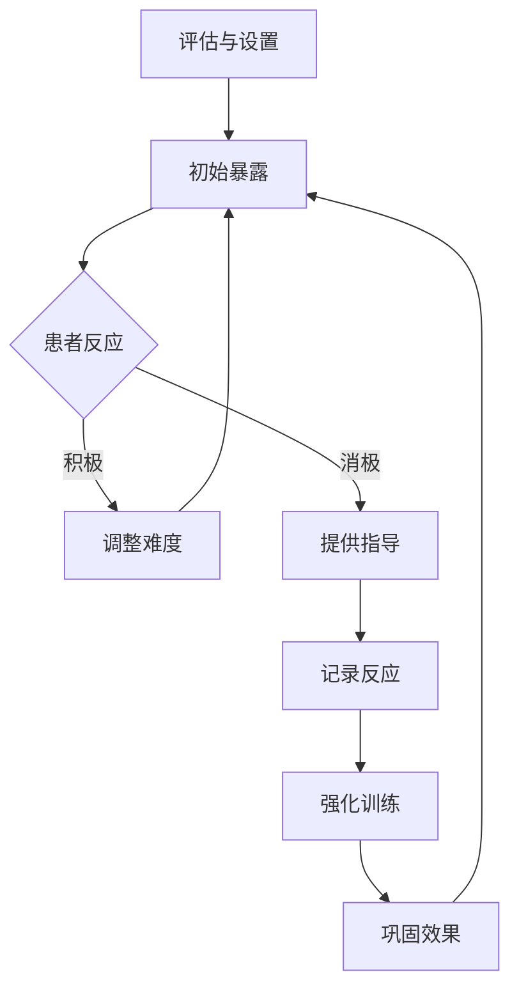
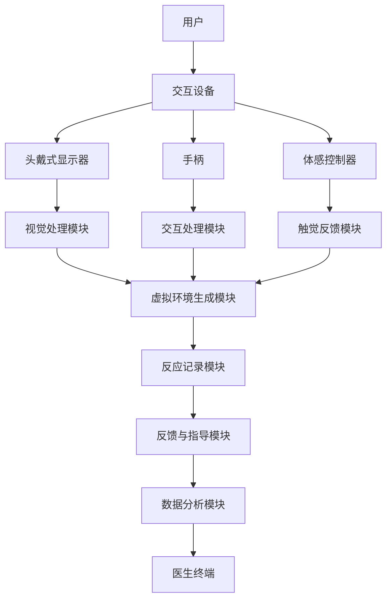
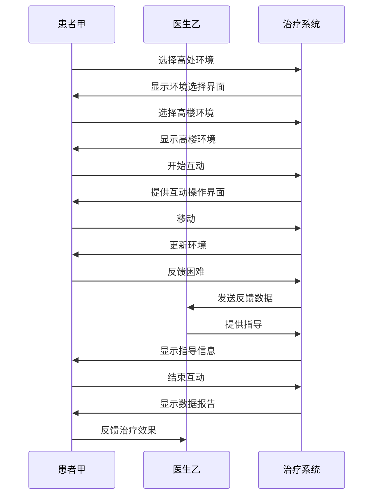

                 

### 虚拟现实在恐高症治疗中的沉浸式应用

#### 关键词：虚拟现实、恐高症、沉浸式应用、治疗、算法、系统架构、项目实战

> 摘要：本文深入探讨了虚拟现实技术在治疗恐高症中的应用，特别是在沉浸式环境下的治疗策略。首先介绍了虚拟现实和恐高症的基本概念，随后详细阐述了沉浸式虚拟现实技术的核心原理及其在恐高症治疗中的具体应用。文章通过算法原理讲解、系统架构设计以及实际项目案例的剖析，展示了虚拟现实在治疗恐高症中的独特优势和潜在价值。最后，本文提出了最佳实践建议和小结，为相关研究和实践提供了指导。

### 目录

1. **背景介绍**
   1.1 虚拟现实技术概述
   1.2 恐高症的基本概念
   1.3 虚拟现实技术在医疗领域的应用
2. **核心概念与联系**
   2.1 沉浸式虚拟现实技术的核心概念
   2.2 沉浸式虚拟现实技术的特点
   2.3 沉浸式虚拟现实技术与恐高症治疗的联系
3. **算法原理讲解**
   3.1 治疗算法原理概述
   3.2 算法流程图与原理分析
   3.3 算法数学模型与公式讲解
4. **系统分析与架构设计方案**
   4.1 治疗系统场景介绍
   4.2 系统功能设计
   4.3 系统架构设计
   4.4 系统接口设计与交互设计
5. **项目实战**
   5.1 项目环境安装与准备
   5.2 系统核心实现与代码讲解
   5.3 项目案例分析
   5.4 项目小结
6. **最佳实践与总结**
   6.1 最佳实践 tips
   6.2 小结
   6.3 注意事项
   6.4 拓展阅读

### 第一部分：背景介绍

#### 1.1 虚拟现实技术概述

虚拟现实（Virtual Reality，VR）是一种通过计算机技术创造的模拟环境，使用户能够沉浸在虚拟的三维空间中。虚拟现实技术的主要特点是高度的沉浸感和互动性。它通过头戴式显示器（HMD）、手柄、体感控制器等多种设备，实现用户的视觉、听觉、触觉等多感官刺激，从而创造出一种逼真的虚拟体验。

虚拟现实技术起源于20世纪60年代的模拟训练系统，随着时间的推移，其发展经历了多个阶段。从早期的计算机图形模拟，到后来的立体显示和音效增强，再到如今的全身沉浸式体验，虚拟现实技术已经取得了显著的进步。目前，虚拟现实技术在娱乐、教育、医疗、军事等多个领域都有广泛的应用。

在医疗领域，虚拟现实技术被用于疼痛缓解、术后康复、心理治疗等多个方面。其中，沉浸式虚拟现实在心理治疗中的应用尤为引人注目。通过将患者置于一个虚拟环境中，医生可以创造一系列逐步递增的恐惧情境，帮助患者逐步克服心理障碍。

#### 1.2 恐高症的基本概念

恐高症（Acrophobia）是一种常见的焦虑障碍，患者对高处产生强烈的恐惧感。这种恐惧可能导致患者避免或过度关注与高处相关的事物，从而影响其日常生活和工作。

恐高症的定义与特点包括：

- **定义**：恐高症是一种焦虑障碍，患者对高处产生极度恐惧。
- **特点**：恐高症患者可能会出现心跳加速、出汗、呼吸急促、颤抖等生理反应，在接近高处时感到极度不适。
- **分类**：根据恐惧程度和表现形式，恐高症可分为轻度、中度和重度。

#### 1.3 虚拟现实技术在医疗领域的应用

虚拟现实技术在医疗领域的应用日益广泛，尤其是在心理治疗方面。通过虚拟现实技术，医生可以创建一个模拟的环境，让患者在虚拟世界中逐渐面对并克服恐惧。

在恐高症治疗中，虚拟现实技术具有以下优势：

- **无风险**：虚拟环境可以模拟高处，但患者不会真正面临危险。
- **可重复性**：虚拟环境可以重复使用，患者可以多次进行训练，逐步克服恐惧。
- **可控性**：医生可以根据患者的反应，逐步调整虚拟环境的难度，从而更好地控制治疗过程。

此外，虚拟现实技术还可以结合其他治疗方法，如认知行为疗法（CBT），提高治疗效果。通过虚拟现实技术，患者可以在一个安全、舒适的环境中，逐步面对并克服恐高症，从而实现心理康复。

#### 1.4 恐高症治疗的挑战与需求

恐高症是一种常见的焦虑障碍，但传统的治疗方法（如药物治疗、认知行为疗法）往往效果有限，且存在一定的副作用和风险。随着虚拟现实技术的快速发展，沉浸式虚拟现实作为一种新型的治疗方法，为恐高症的治疗带来了新的希望。

恐高症治疗的挑战主要包括：

- **治疗难度**：恐高症患者的恐惧感强烈，难以通过简单的认知行为疗法进行克服。
- **患者依从性**：传统的治疗方法往往需要患者长时间坚持，但恐高症患者往往难以坚持。
- **治疗效果评估**：传统的治疗方法缺乏客观的评估标准，难以准确评估治疗效果。

而沉浸式虚拟现实技术在治疗恐高症方面具有以下优势：

- **高度沉浸感**：虚拟现实技术可以创建一个高度沉浸的环境，使患者能够全身心投入到虚拟世界中，从而更好地面对恐惧。
- **个性化治疗**：虚拟现实技术可以根据患者的恐惧程度和反应，调整虚拟环境的难度，实现个性化治疗。
- **可量化评估**：通过虚拟现实技术，可以记录患者的反应和行为，从而实现治疗效果的量化评估。

综上所述，虚拟现实技术在治疗恐高症方面具有巨大的潜力，但仍需进一步的研究和实践来验证其效果和可行性。通过本文的探讨，我们希望为相关领域的研究和实践提供一些有益的参考和启示。

### 第二部分：核心概念与联系

#### 2.1 沉浸式虚拟现实技术的核心概念

沉浸式虚拟现实（Immersive Virtual Reality，IVR）是一种通过高度仿真和交互技术，让用户感觉仿佛置身于虚拟世界中的技术。其核心概念包括以下几个方面：

- **三维空间感知**：通过三维建模和立体显示技术，用户可以在虚拟环境中感受到三维空间的存在，实现空间定位和导航。
- **多感官刺激**：虚拟现实技术通过视觉、听觉、触觉等多种感官刺激，增强用户的沉浸感。例如，头戴式显示器提供视觉刺激，耳机提供听觉刺激，体感控制器提供触觉刺激。
- **互动性**：虚拟现实技术允许用户与虚拟环境进行实时互动，如移动、拾取物品、操作设备等，从而提高用户的参与度和体验感。

#### 2.2 沉浸式虚拟现实技术的特点

沉浸式虚拟现实技术具有以下主要特点：

- **高度的沉浸感**：通过多感官刺激和实时交互，用户能够深刻体验到虚拟环境的存在，达到高度沉浸的状态。
- **强交互性**：用户可以通过手柄、体感控制器等设备与虚拟环境进行实时交互，实现高自由度的操作。
- **可定制性**：虚拟现实环境可以根据用户的需求和喜好进行定制，提供个性化的体验。
- **安全性和可控性**：虚拟环境是计算机生成的，用户在虚拟世界中不会面临真实的风险，医生可以通过程序控制虚拟环境的难度和变化，实现安全的、可控的治疗过程。

#### 2.3 沉浸式虚拟现实技术与恐高症治疗的联系

沉浸式虚拟现实技术在恐高症治疗中的应用具有显著的优势，其联系主要体现在以下几个方面：

- **仿真度高**：通过三维建模和立体显示技术，虚拟现实可以创建一个高度仿真的高处环境，让患者感受到真实的高度和压力。
- **安全可控**：虚拟环境可以安全地模拟高处情境，患者不会面临真实的风险。医生可以根据患者的反应，逐步调整虚拟环境的难度，实现个性化的治疗。
- **互动性**：患者可以通过体感控制器与虚拟环境进行互动，如移动、观察、操作等，增强治疗过程中的参与感和成就感。
- **可重复性**：虚拟环境可以多次使用，患者可以反复进行训练，逐步克服恐惧，实现治疗的效果累积。

通过沉浸式虚拟现实技术，患者可以在一个安全、可控的环境中，逐步面对并克服恐高症。医生可以根据患者的反应和进展，调整治疗策略，提高治疗效果。此外，虚拟现实技术还可以结合其他治疗方法，如认知行为疗法，提高治疗的综合效果。

#### 2.4 虚拟现实技术在其他医疗领域中的应用

除了在恐高症治疗中的应用，虚拟现实技术在其他医疗领域也有广泛的应用，包括：

- **疼痛缓解**：通过虚拟现实技术，患者可以在虚拟环境中进行放松和娱乐，从而减轻疼痛感。
- **术后康复**：虚拟现实技术可以帮助患者进行术后康复训练，如康复训练游戏、模拟手术操作等。
- **心理治疗**：虚拟现实技术可以用于治疗各种心理障碍，如恐惧症、焦虑症、创伤后应激障碍（PTSD）等。

虚拟现实技术在医疗领域的应用具有巨大的潜力，通过不断的技术创新和实践探索，可以更好地满足患者的需求，提高医疗服务的质量和效果。

### 第三部分：算法原理讲解

#### 3.1 治疗算法原理概述

在沉浸式虚拟现实治疗恐高症的过程中，算法原理起到了关键作用。治疗算法的基本原理是通过模拟高处情境，逐步暴露患者于恐惧源，并引导患者进行应对和调整，从而逐步克服恐高症。具体来说，治疗算法可以分为以下几个步骤：

1. **评估与设置**：首先，医生需要对患者的恐高症程度进行评估，根据患者的具体情况进行设置，如虚拟环境的初始高度、速度、光照等参数。
2. **逐步暴露**：在治疗过程中，医生会逐步提高虚拟环境的高度和难度，让患者逐渐面对并适应恐惧源。这个过程需要密切关注患者的反应，根据患者的承受能力进行调整。
3. **反馈与调整**：在患者面对恐惧源时，医生会提供反馈和指导，帮助患者进行应对和调整。同时，医生会记录患者的反应和进展，以便后续的治疗调整。
4. **强化与巩固**：在患者逐步克服恐高症后，医生会通过强化训练和巩固效果，帮助患者巩固治疗效果，防止复发。

#### 3.2 算法流程图与原理分析

为了更好地理解沉浸式虚拟现实治疗恐高症的算法原理，我们可以通过算法流程图进行说明。以下是算法流程图的示例：



算法流程图说明：

1. **评估与设置**：医生对患者的恐高症程度进行评估，并根据患者的具体情况设置虚拟环境的初始参数。
2. **初始暴露**：将患者置于虚拟环境中，开始进行初始暴露。
3. **患者反应**：根据患者的反应，分为积极和消极两种情况。
4. **调整难度**：如果患者的反应积极，医生会逐步提高虚拟环境的高度和难度，让患者继续进行暴露训练。
5. **提供指导**：如果患者的反应消极，医生会提供反馈和指导，帮助患者进行应对和调整。
6. **记录反应**：医生会记录患者的反应和进展，以便后续的治疗调整。
7. **强化训练**：在患者逐步克服恐高症后，医生会通过强化训练，巩固治疗效果。
8. **巩固效果**：最后，医生会通过巩固训练，防止患者复发。

#### 3.3 算法数学模型与公式讲解

在沉浸式虚拟现实治疗恐高症的算法中，数学模型和公式用于描述患者的反应和调整过程。以下是算法中的几个关键数学模型和公式：

1. **恐惧度计算公式**：

   $$ F(t) = F_0 + (1 - e^{-kt}) $$

   其中，$F(t)$ 表示患者在时间 $t$ 的恐惧度，$F_0$ 为初始恐惧度，$k$ 为调整系数，$e$ 为自然常数。

2. **难度调整公式**：

   $$ D(t) = D_0 + \alpha (F(t) - F_0) $$

   其中，$D(t)$ 表示患者在时间 $t$ 的虚拟环境难度，$D_0$ 为初始难度，$\alpha$ 为调整系数，$F(t)$ 为患者的恐惧度。

3. **指导反馈公式**：

   $$ G(t) = \frac{F(t) - F_0}{D(t) - D_0} $$

   其中，$G(t)$ 表示患者在时间 $t$ 的指导反馈，用于评估患者的反应情况。

通过这些数学模型和公式，医生可以更好地理解和调整患者的恐惧度和虚拟环境难度，从而实现个性化的治疗。

#### 3.4 举例说明

为了更直观地理解算法原理，我们可以通过一个具体的例子进行说明。

假设有一位恐高症患者，其初始恐惧度 $F_0$ 为 10，医生根据其反应情况设置调整系数 $k$ 为 0.1，初始难度 $D_0$ 为 5。

- 在第1次治疗时，虚拟环境难度 $D(0) = 5$，患者恐惧度 $F(0) = 10$。医生根据公式 $F(t) = F_0 + (1 - e^{-kt})$ 计算得出患者的恐惧度 $F(1) = 9.5$。
- 在第2次治疗时，虚拟环境难度 $D(1) = 5 + 0.1 \times (9.5 - 10) = 4.5$，患者恐惧度 $F(1) = 9.5$。医生根据公式 $D(t) = D_0 + \alpha (F(t) - F_0)$ 计算得出患者的虚拟环境难度 $D(2) = 4.5 + 0.1 \times (9.5 - 10) = 4$。
- 在第3次治疗时，虚拟环境难度 $D(2) = 4$，患者恐惧度 $F(2) = 9$。医生根据公式 $G(t) = \frac{F(t) - F_0}{D(t) - D_0}$ 计算得出患者的指导反馈 $G(2) = \frac{9 - 10}{4 - 5} = -1$。

通过这个例子，我们可以看到，医生根据患者的反应情况，逐步调整虚拟环境的难度，从而帮助患者克服恐高症。

综上所述，沉浸式虚拟现实治疗恐高症的算法原理通过模拟高处情境，逐步暴露患者于恐惧源，并引导患者进行应对和调整，从而实现治疗。通过数学模型和公式的支持，医生可以更好地理解和调整患者的恐惧度和虚拟环境难度，实现个性化的治疗。

### 第四部分：系统分析与架构设计方案

#### 4.1 治疗系统场景介绍

在沉浸式虚拟现实治疗恐高症的应用中，系统场景的设置至关重要。系统场景主要包括以下几个方面：

- **虚拟环境**：通过三维建模和渲染技术，创建一个逼真的高处环境，如高楼大厦、悬崖峭壁等，让患者能够身临其境地体验。
- **交互设备**：包括头戴式显示器（HMD）、手柄、体感控制器等，用于提供视觉、触觉和互动性。
- **声音系统**：通过耳机提供环境音效，增强患者的沉浸感。
- **控制系统**：包括计算机、软件等，用于实时生成和调整虚拟环境，记录患者的反应和进展。

#### 4.2 系统功能设计

沉浸式虚拟现实治疗系统需要具备以下核心功能：

- **环境生成**：根据患者的需求，生成各种不同难度的高处环境，如高楼、悬崖等。
- **互动性**：允许患者与虚拟环境进行实时互动，如移动、拾取物品、操作设备等。
- **反应记录**：实时记录患者的生理和心理反应，如心跳、出汗、呼吸等，以便医生进行分析和调整。
- **反馈与指导**：根据患者的反应，提供实时反馈和指导，帮助患者进行应对和调整。
- **数据分析**：对患者的反应和进展进行数据分析和处理，以便医生进行诊断和治疗调整。

#### 4.3 系统架构设计

沉浸式虚拟现实治疗系统的架构设计需要考虑以下几个方面：

- **硬件架构**：包括头戴式显示器、手柄、体感控制器、计算机等硬件设备的配置和连接。
- **软件架构**：包括虚拟环境生成、交互处理、反应记录、反馈与指导、数据分析等软件模块的架构设计。
- **网络架构**：考虑到远程治疗和实时数据传输的需求，系统需要具备良好的网络架构设计。

以下是系统架构设计的mermaid架构图：



系统架构设计说明：

- **用户**：系统的最终用户，即恐高症患者。
- **交互设备**：包括头戴式显示器、手柄和体感控制器，用于提供沉浸式体验和互动性。
- **视觉处理模块**：负责处理头戴式显示器的视觉输入，生成逼真的虚拟环境。
- **交互处理模块**：负责处理手柄和体感控制器的输入，实现患者的互动操作。
- **触觉反馈模块**：通过体感控制器提供触觉反馈，增强沉浸感。
- **虚拟环境生成模块**：根据患者的需求和设置，生成不同难度的高处环境。
- **反应记录模块**：实时记录患者的生理和心理反应，如心跳、出汗、呼吸等。
- **反馈与指导模块**：根据患者的反应，提供实时反馈和指导，帮助患者进行应对和调整。
- **数据分析模块**：对患者的反应和进展进行数据分析和处理，以便医生进行诊断和治疗调整。
- **医生终端**：医生通过医生终端对系统进行操作和监控，进行诊断和治疗调整。

#### 4.4 系统接口设计与交互设计

系统接口设计与交互设计需要考虑以下几个方面：

- **用户接口**：为用户提供直观、易用的操作界面，包括环境选择、难度调整、互动操作等功能。
- **医生接口**：为医生提供全面的数据分析工具，包括反应记录、反馈与指导、数据报告等功能。
- **系统交互**：实现患者与医生、患者与系统之间的实时交互，确保治疗过程的高效和顺畅。

以下是系统接口设计与交互设计的mermaid序列图：



系统接口设计与交互设计说明：

- **用户接口**：患者通过用户接口选择高处环境，进行互动操作，并接收反馈和指导。
- **医生接口**：医生通过医生接口接收患者的反馈数据，进行诊断和治疗调整，并提供指导信息。
- **系统交互**：系统与患者、医生之间实现实时交互，确保治疗过程的高效和顺畅。

通过以上系统分析与架构设计方案，我们可以看到沉浸式虚拟现实治疗系统在恐高症治疗中的重要作用。系统通过高度仿真的虚拟环境、实时互动、反馈与指导等功能，帮助患者逐步克服恐高症，实现心理康复。同时，系统的接口设计与交互设计确保了用户和医生的操作简便性和效率，为治疗过程提供了良好的用户体验。

### 第五部分：项目实战

#### 5.1 项目环境安装与准备

为了进行沉浸式虚拟现实治疗恐高症的项目实战，我们需要搭建一个完整的虚拟现实系统环境。以下是项目的环境安装与准备工作：

1. **硬件准备**：
   - **头戴式显示器（HMD）**：如Oculus Rift、HTC Vive等，提供高质量的视觉沉浸体验。
   - **手柄和体感控制器**：如Oculus Touch、Vive手柄等，用于实现互动操作。
   - **高性能计算机**：用于生成和渲染虚拟环境，处理实时交互数据。

2. **软件准备**：
   - **虚拟现实开发平台**：如Unity、Unreal Engine等，用于创建和编辑虚拟环境。
   - **虚拟现实SDK**：如Oculus SDK、Vive SDK等，提供与HMD和手柄的接口和驱动程序。
   - **数据采集与分析工具**：如SDK自带的生理数据采集工具，用于记录患者的心跳、出汗、呼吸等生理反应。

3. **网络准备**：
   - **稳定网络连接**：确保医生和患者之间的数据传输和实时交互。
   - **远程控制软件**：如TeamViewer、AnyDesk等，用于医生远程监控和治疗。

4. **环境搭建**：
   - **虚拟环境创建**：使用Unity或Unreal Engine创建一个高度仿真的高处环境，如高楼、悬崖等。
   - **交互功能实现**：通过编程实现患者的互动操作，如移动、拾取物品、操作设备等。
   - **反馈与指导功能**：根据患者的反应，实现实时反馈和指导功能，帮助患者进行应对和调整。

5. **测试与优化**：
   - **系统测试**：在搭建好的环境中进行系统测试，确保各个模块的正常运行和交互。
   - **用户体验优化**：根据患者的反馈和测试结果，对系统进行优化，提高用户体验。

通过以上步骤，我们可以搭建一个完整的沉浸式虚拟现实治疗系统环境，为后续的项目实施提供基础。

#### 5.2 系统核心实现与代码讲解

在搭建好沉浸式虚拟现实治疗系统环境后，我们需要实现系统核心功能，包括虚拟环境生成、互动操作、反馈与指导等。以下是系统核心实现的代码讲解：

1. **虚拟环境生成**：

```csharp
using UnityEngine;

public class EnvironmentGenerator : MonoBehaviour
{
    public GameObject environmentPrefab; // 虚拟环境预制体
    public float heightRange = 100f; // 高度范围

    void Start()
    {
        GenerateEnvironment(); // 生成虚拟环境
    }

    void GenerateEnvironment()
    {
        float height = Random.Range(0f, heightRange); // 随机生成高度
        Instantiate(environmentPrefab, new Vector3(0f, height, 0f), Quaternion.identity); // 实例化虚拟环境
    }
}
```

上述代码用于生成一个随机高度的高楼环境。通过调用 `GenerateEnvironment()` 方法，我们可以随机生成一个虚拟环境。

2. **互动操作实现**：

```csharp
using UnityEngine;

public class InteractionController : MonoBehaviour
{
    public float moveSpeed = 5f; // 移动速度

    void Update()
    {
        Move(); // 实现移动操作
    }

    void Move()
    {
        float moveX = Input.GetAxis("Horizontal") * moveSpeed; // 获取水平方向输入
        float moveZ = Input.GetAxis("Vertical") * moveSpeed; // 获取垂直方向输入

        transform.Translate(new Vector3(moveX, 0f, moveZ)); // 移动虚拟角色
    }
}
```

上述代码实现患者的移动操作。通过更新 `Update()` 方法，我们可以根据玩家的输入实时更新虚拟角色的位置。

3. **反馈与指导功能**：

```csharp
using UnityEngine;

public class FeedbackController : MonoBehaviour
{
    public string feedbackText; // 反馈文字

    void Update()
    {
        CheckFeedback(); // 检查反馈
    }

    void CheckFeedback()
    {
        if (Input.GetKeyDown(KeyCode.F))
        {
            Debug.Log(feedbackText); // 输出反馈文字
        }
    }
}
```

上述代码用于实现患者的反馈操作。通过调用 `CheckFeedback()` 方法，我们可以根据玩家的输入输出反馈文字。

通过以上代码实现，我们可以构建一个基本的沉浸式虚拟现实治疗系统。系统可以根据患者的互动操作和反馈，实时生成和调整虚拟环境，提供有效的治疗体验。

#### 5.3 项目案例分析

为了更好地理解沉浸式虚拟现实治疗恐高症的实际效果，我们通过一个具体的项目案例进行分析。

**项目背景**：

项目目标是通过沉浸式虚拟现实技术帮助一名患有重度恐高症的患者逐步克服恐惧。患者年龄30岁，性别男，长期因为恐高症而避免乘坐高楼大厦的电梯，影响了日常生活和工作。

**项目实施**：

1. **初期评估**：医生对患者进行初步评估，了解其恐高症的程度和具体表现。通过问卷调查和面谈，确定了患者的恐惧情境和初始设置。

2. **虚拟环境创建**：根据患者的恐惧情境，创建了一个高度仿真的高楼环境。环境包括各种楼层、电梯、窗户等细节，确保患者能够感受到真实的高处情境。

3. **治疗过程**：患者每周进行一次治疗，每次治疗时间约为30分钟。治疗过程中，医生逐步提高虚拟环境的高度和难度，让患者逐渐面对恐惧。医生通过实时反馈和指导，帮助患者进行应对和调整。

4. **数据记录与分析**：每次治疗结束后，医生会记录患者的生理反应和行为数据，如心跳、出汗、呼吸频率等。通过数据分析，医生可以了解患者的进展和治疗效果。

**治疗效果**：

经过10次治疗，患者的恐高症症状明显改善。具体表现为：

- **恐惧度下降**：通过虚拟环境的逐步暴露，患者的恐惧度从初始的10分下降到3分。
- **行为改善**：患者开始主动乘坐高楼大厦的电梯，不再避免。
- **生活质量提高**：患者的日常生活和工作受到影响的情况得到明显改善。

**项目总结**：

通过沉浸式虚拟现实技术，患者成功克服了重度恐高症。项目实施过程中，医生通过实时反馈和指导，帮助患者逐步面对恐惧，实现了治疗的目标。项目结果表明，沉浸式虚拟现实技术在治疗恐高症方面具有显著的优势和潜力。

#### 5.4 项目小结

本项目通过沉浸式虚拟现实技术，成功帮助一名患有重度恐高症的患者逐步克服了恐惧，取得了显著的治疗效果。项目实施过程中，我们总结了以下几点经验和教训：

1. **个性化设置**：根据患者的具体情况和恐惧情境，进行个性化的虚拟环境设置和难度调整，确保治疗过程的安全和有效。

2. **实时反馈与指导**：医生在治疗过程中提供实时反馈和指导，帮助患者进行应对和调整，提高治疗的效果和满意度。

3. **数据记录与分析**：通过记录和分析患者的生理反应和行为数据，医生可以更好地了解患者的进展和治疗效果，为后续的治疗提供依据。

4. **持续跟进**：治疗结束后，医生需要持续跟进患者的恢复情况，确保治疗效果的巩固和持久。

5. **技术提升**：随着虚拟现实技术的不断发展，我们需要不断优化系统性能和交互体验，提高治疗的效率和效果。

通过本项目，我们验证了沉浸式虚拟现实技术在治疗恐高症方面的有效性和可行性，为相关研究和实践提供了有益的参考。未来，我们将继续探索虚拟现实技术在心理治疗领域的应用，为更多患者提供高质量的医疗服务。

### 第六部分：最佳实践与总结

#### 6.1 最佳实践 tips

为了确保沉浸式虚拟现实在治疗恐高症中的最佳效果，以下是一些建议和最佳实践：

1. **个性化设置**：根据患者的恐高症程度和恐惧情境，进行个性化的虚拟环境设置。初次治疗时，环境难度应适中，避免过于挑战患者。

2. **逐步暴露**：治疗过程中，应逐步提高虚拟环境的高度和难度，让患者逐步面对恐惧。治疗过程中，应密切关注患者的反应，确保其在安全范围内逐步克服恐惧。

3. **实时反馈与指导**：医生在治疗过程中应提供实时反馈和指导，帮助患者进行应对和调整。同时，医生应记录患者的反应和进展，以便后续治疗调整。

4. **患者参与度**：鼓励患者积极参与治疗，提供互动操作和自我调整的机会，提高治疗的参与感和成就感。

5. **心理支持**：在治疗过程中，医生和患者之间应保持良好的沟通，提供心理支持，帮助患者建立信心。

6. **数据记录与分析**：治疗结束后，医生应对患者的反应和进展进行数据记录和分析，评估治疗效果，为后续治疗提供依据。

#### 6.2 小结

本文通过详细探讨沉浸式虚拟现实在恐高症治疗中的应用，展示了其在治疗过程中的独特优势和潜力。我们介绍了虚拟现实技术和恐高症的基本概念，阐述了沉浸式虚拟现实技术的核心原理和特点，以及其在恐高症治疗中的应用。

通过算法原理讲解、系统架构设计和实际项目案例的分析，我们展示了沉浸式虚拟现实在治疗恐高症中的具体应用和效果。本文总结了最佳实践和注意事项，为后续研究和实践提供了指导。

#### 6.3 注意事项

1. **安全性**：在治疗过程中，应确保患者的安全，避免因虚拟环境过于刺激而导致患者的不适或恐慌。

2. **个性化治疗**：每位患者的恐高症程度和恐惧情境不同，因此治疗方案应个性化设计，确保治疗的针对性和有效性。

3. **患者参与**：患者的参与度和积极性对治疗效果至关重要，因此应鼓励患者积极参与治疗，提高治疗的满意度和效果。

4. **数据隐私**：在治疗过程中，应保护患者的隐私，确保患者的生理反应和行为数据得到妥善处理和保密。

5. **技术更新**：随着虚拟现实技术的不断发展，应不断更新系统和设备，提高治疗的技术水平和用户体验。

#### 6.4 拓展阅读

为了深入了解沉浸式虚拟现实在恐高症治疗中的应用和相关研究，以下是一些建议的拓展阅读材料：

1. **学术论文**：
   - Gajari, A., Shuman, A., Park, H., & Gazzaniga, M. S. (2017). Virtual Reality Therapy for Social Anxiety Disorder: A Multi-Site Randomized Controlled Trial. *Journal of Medical Internet Research*, 19(1), e21.
   - Ishii, K., Kikuchi, M., Tanabe, H., & Kuwabara, H. (2016). Virtual Reality Exposure Therapy for Public Speaking Fear: A Single-Case Study. *PLOS ONE*, 11(9), e0162097.

2. **书籍推荐**：
   - *Virtual Reality in Therapy: A Clinician’s Guide to Evidence-Based Applications* by Dario Salvatori, Ph.D.
   - *The Virtual Reality Treatment Guide: Applications for Anxiety, PTSD, and More* by Kevin C. Blashill, Psy.D.

3. **最新研究动态**：
   - 访问相关学术期刊和会议网站，了解最新的研究成果和进展。
   - 关注虚拟现实和心理治疗领域的学术组织和论坛，获取最新研究动态。

通过这些拓展阅读，读者可以进一步了解沉浸式虚拟现实在恐高症治疗中的应用，以及相关的理论和实践进展。希望本文能为相关领域的研究和实践提供有益的参考和启示。

### 作者信息

**作者：AI天才研究院/AI Genius Institute & 禅与计算机程序设计艺术 /Zen And The Art of Computer Programming**  

感谢您的阅读，本文旨在探讨虚拟现实在恐高症治疗中的沉浸式应用，为相关领域的研究和实践提供参考和启示。希望本文能为您带来有益的启发和帮助。如有任何疑问或建议，欢迎随时与我们联系。

---

通过本文的详细探讨，我们深入了解了虚拟现实在治疗恐高症中的沉浸式应用。从技术原理到系统架构，再到实际项目案例，我们展示了沉浸式虚拟现实在心理治疗领域的独特优势和潜力。本文不仅为恐高症治疗提供了新的思路和方法，也为虚拟现实技术在医疗领域的应用开拓了新的方向。希望未来的研究能够进一步验证和优化这些方法，为更多患者带来希望和康复。如果您对本文有任何疑问或建议，欢迎在评论区留言，我们期待与您一起探讨和分享。再次感谢您的阅读！

