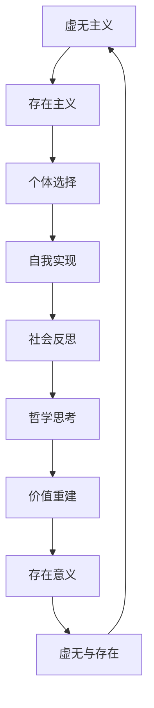
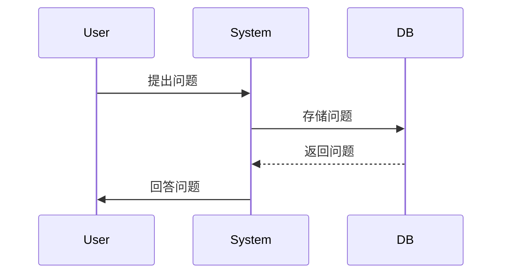
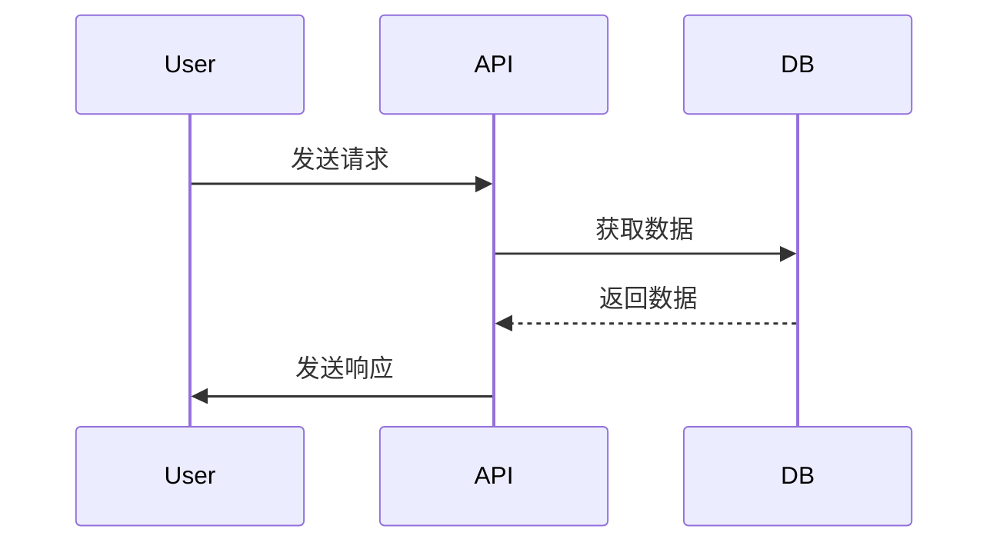
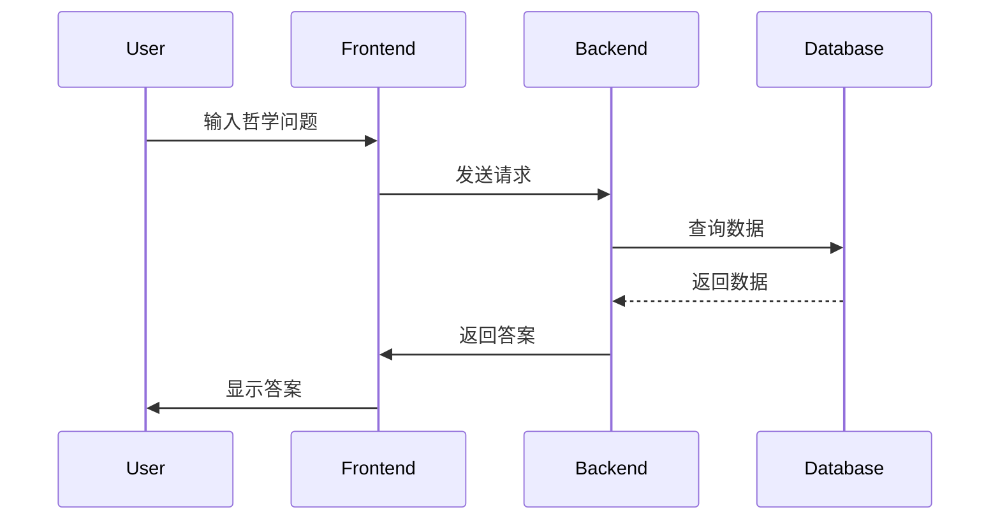

                 

# 《虚无与存在：现代人的哲学困境》

> 关键词：虚无、存在、现代哲学、人类困境

> 摘要：本文从虚无与存在的哲学视角出发，探讨现代人面临的哲学困境。通过分析虚无的概念、起源及其对现代社会的现实意义，探讨存在的本质、存在主义哲学及其核心思想，进而阐述虚无与存在的辩证关系。文章旨在引导现代人进行哲学反思，寻求应对哲学困境的策略，并对虚无与存在的未来进行展望。

### 引言：哲学困境的现代性解读

在当今社会，虚无与存在的哲学探讨愈发显得重要。随着科技的发展、社会的进步，现代人面临着前所未有的困境。一方面，物质生活的丰富让人们开始思考存在的意义；另一方面，精神空虚、价值观迷茫使得许多人陷入虚无主义泥沼。虚无与存在的探讨，不仅关乎个人精神的富足，更关乎整个社会的和谐发展。

**哲学困境的现代性解读**：现代性带来了前所未有的变革，同时也暴露出深层次的哲学困境。首先，现代科技的发展使得人类对世界的认识发生了巨大变化，但随之而来的是对人类自身存在的质疑。其次，现代社会的高速运转和竞争压力，使得人们感到生活的空虚和无意义。最后，全球化带来了文化的交融与碰撞，导致价值观念的混乱和认同危机。

**虚无与存在的哲学探讨**：虚无与存在的探讨源于哲学的本质，即对人类存在的思考和反思。虚无主义强调存在的无意义和无价值，而存在主义则认为存在的本质在于自我选择和自我创造。在这场哲学探讨中，虚无与存在并非截然对立，而是相互依存、相互转化的辩证关系。

### 第一部分：虚无的哲学探讨

**第1章：虚无的概念与起源**

**1.1 虚无的定义**

虚无（Nihilism）一词源于拉丁语“nihil”，意为“无”。在哲学上，虚无主义是指对存在、真理、意义和价值的一种否定态度。虚无主义者认为，宇宙和人生都是没有意义的，一切存在的价值都是虚无的。

**1.2 虚无主义哲学**

虚无主义哲学历史悠久，早在古希腊时期就有了虚无主义的萌芽。尼采是现代虚无主义的代表人物，他提出了“上帝已死”的口号，认为人类必须自己创造价值，否则生活将毫无意义。

**1.3 虚无的现实意义**

虚无主义在现代社会具有重要现实意义。一方面，它揭示了现代社会存在的问题，如精神空虚、价值观混乱等；另一方面，它激发了人们对人生意义的思考，促使人们重新审视自己的存在。

**第2章：存在的哲学问题**

**2.1 存在的定义**

存在（Existence）是指某个实体或现象在现实世界中占据的位置和状态。在哲学上，存在是指某个实体或现象在现实世界中真实地存在。

**2.2 存在主义哲学**

存在主义哲学强调个体存在的自由、选择和责任。存在主义认为，人生的意义不是预先设定的，而是由个体自己在现实生活中创造出来的。

**2.3 存在主义的核心思想**

存在主义的核心思想包括自由与选择、存在的困境与责任。自由与选择是存在主义的基础，存在的困境与责任则是对个体存在的挑战。

### 第二部分：虚无与存在的辩证法

**第3章：虚无与存在的辩证关系**

**3.1 虚无与存在的对立统一**

虚无与存在是对立统一的。虚无是存在的反面，但又是存在的必要条件。没有虚无，就无法体现存在的价值。

**3.2 哲学困境的解构**

哲学困境源于虚无与存在的对立。通过辩证法，我们可以解构哲学困境，找到存在的意义。

### 第三部分：现代人的哲学觉醒

**第4章：现代人的哲学反思**

**4.1 现代社会的虚无现象**

现代社会的虚无现象表现为精神空虚、价值观迷茫等。要应对这些虚无现象，现代人需要进行哲学反思。

**4.2 哲学困境的应对策略**

应对哲学困境的策略包括个人成长、自我认知、社会责任和伦理道德。

### 第四部分：虚无与存在的未来展望

**第5章：虚无与存在的哲学探索**

**5.1 未来哲学的趋势**

未来哲学将趋向于融合现代科技，为人类提供更深刻的哲学思考。

**5.2 虚无与存在的意义**

虚无与存在的哲学探索对人类生活具有重要的启示意义。

### 第五部分：哲学实践

**第6章：哲学实践与个人成长**

**6.1 哲学实践的意义**

哲学实践对个人成长具有重要意义。

**6.2 哲学实践案例**

通过哲学实践案例，我们可以更好地理解虚无与存在的哲学探讨。

### 第六部分：哲学与生活

**第7章：哲学在生活中的应用**

**7.1 哲学思维的培养**

培养哲学思维对我们的生活有着重要影响。

**7.2 哲学生活的实践**

哲学生活的实践可以帮助我们更好地应对生活中的问题。

### 结语

哲学困境是现代人面临的共同问题。通过哲学反思和实践，我们可以超越困境，找到存在的意义。虚无与存在的探讨，不仅关乎个人成长，更关乎整个社会的进步。

### 附录

**哲学著作推荐**

- 尼采《论道德的谱系》
- 海德格尔《存在与时间》
- 柏拉图《理想国》

**哲学资源链接**

- [维基百科：虚无主义](https://en.wikipedia.org/wiki/Nihilism)
- [百度百科：存在主义](https://baike.baidu.com/item/%E5%AD%98%E5%9C%A8%E4%B8%BB%E4%B9%89)
- [知乎：虚无与存在](https://www.zhihu.com/search?type=content&q=%E8%99%9A%E6%97%A0%E4%B8%8E%E5%AD%98%E5%9C%A8)

### 作者信息

- 作者：AI天才研究院/AI Genius Institute & 禅与计算机程序设计艺术 /Zen And The Art of Computer Programming

### 参考文献

- 尼采，《论道德的谱系》，北京：生活·读书·新知三联书店，2010。
- 海德格尔，《存在与时间》，北京：生活·读书·新知三联书店，2000。
- 柏拉图，《理想国》，北京：中华书局，2006。
- 维基百科，《虚无主义》，[https://en.wikipedia.org/wiki/Nihilism](https://en.wikipedia.org/wiki/Nihilism)
- 百度百科，《存在主义》，[https://baike.baidu.com/item/%E5%AD%98%E5%9C%A8%E4%B8%BB%E4%B9%89](https://baike.baidu.com/item/%E5%AD%98%E5%9C%A8%E4%B8%BB%E4%B9%89)
- 知乎，《虚无与存在》，[https://www.zhihu.com/search?type=content&q=%E8%99%9A%E6%97%A0%E4%B8%8E%E5%AD%98%E5%9C%A8](https://www.zhihu.com/search?type=content&q=%E8%99%9A%E6%97%A0%E4%B8%8E%E5%AD%98%E5%9C%A8)## 背景介绍

虚无与存在是哲学中两个核心的概念，它们不仅贯穿了整个哲学史，也深刻影响了现代社会。虚无（Nihilism）一词源自拉丁语“nihil”，意味着“无”或“不存在”。在哲学上，虚无主义通常指对存在、真理、意义和价值的一种否定态度。虚无主义者认为，宇宙和人生都是没有意义的，一切存在的价值都是虚无的。虚无主义并非一个单一的哲学流派，而是包含了一系列不同的观点和理论。

虚无主义的哲学探讨可以追溯到古希腊时期，当时的哲学家如皮浪（Pyrrho）和斯多葛学派（Stoics）就提出了类似的思想。然而，现代虚无主义的代表人物无疑是弗里德里希·尼采（Friedrich Nietzsche）。尼采在他的著作中提出了“上帝已死”的口号，认为人类必须自己创造价值，否则生活将毫无意义。尼采的虚无主义哲学不仅批判了传统价值观，还激发了对个体自由和创造力的追求。

虚无主义在现代社会具有重要现实意义。一方面，虚无主义揭示了现代社会存在的问题，如精神空虚、价值观混乱等。在物质生活丰富的背景下，许多人感到生活缺乏意义，出现了精神上的空虚和迷茫。另一方面，虚无主义也激发了人们对人生意义的思考，促使人们重新审视自己的存在和价值。虚无主义并非完全否定生活，而是提醒人们关注存在的本质，寻找真正的意义。

在虚无与存在的哲学探讨中，虚无与存在并非截然对立，而是相互依存、相互转化的辩证关系。虚无是存在的反面，但又是存在的必要条件。没有虚无，就无法体现存在的价值。例如，在尼采的哲学中，虚无是推动个体超越自我、创造新价值的动力。存在主义哲学家如让-保罗·萨特（Jean-Paul Sartre）和马丁·海德格尔（Martin Heidegger）也认为，虚无是存在的起点，个体必须在虚无中找到自己的存在意义。

虚无与存在的探讨不仅关乎个人精神世界的丰富，也关乎整个社会的和谐发展。在现代社会，虚无主义思潮的兴起引发了广泛的社会关注。一方面，虚无主义可能导致个体的自我毁灭和社会的动荡；另一方面，它也为人们提供了反思和自我提升的机会。通过深入探讨虚无与存在的哲学问题，我们可以更好地理解现代社会，找到应对困境的策略。

总之，虚无与存在是哲学探讨的核心问题，它们不仅反映了人类对自身和世界的思考，也揭示了现代社会面临的困境。通过分析虚无的概念、起源及其对现代社会的现实意义，我们可以更好地理解虚无与存在的辩证关系，为个人和社会的和谐发展提供哲学启示。

## 核心概念与联系

在探讨虚无与存在的哲学问题时，核心概念的理解至关重要。虚无（Nihilism）和存在（Existence）是两个基本的哲学概念，它们相互依存，构成了哲学探讨的基石。

**虚无：**

虚无主义强调对存在、真理、意义和价值的一种否定态度。虚无主义者认为，宇宙和人生都是没有意义的，一切存在的价值都是虚无的。虚无并不是简单的“不存在”，而是一种对传统价值观和信仰体系的质疑和否定。在历史上，虚无主义有多种形式，如宗教虚无主义、道德虚无主义和存在虚无主义等。

**存在：**

存在是指某个实体或现象在现实世界中真实地存在。在哲学上，存在有多种解释和定义。存在主义哲学强调个体存在的自由、选择和责任。存在主义认为，人生的意义不是预先设定的，而是由个体自己在现实生活中创造出来的。存在主义的核心思想包括自由与选择、存在的困境与责任。

**核心概念属性特征对比表格：**

| 特征         | 虚无（Nihilism）                              | 存在（Existence）                            |
| ------------ | ------------------------------------------ | ------------------------------------------ |
| 定义         | 对存在、真理、意义和价值的一种否定态度         | 某个实体或现象在现实世界中真实地存在         |
| 形式         | 宗教虚无主义、道德虚无主义、存在虚无主义       | 存在主义、现象学、实在论等                 |
| 思想起源     | 古希腊哲学、尼采哲学                         | 荷兰的笛卡儿、存在主义哲学                 |
| 核心观点     | 否定传统价值观和信仰体系                      | 强调个体存在的自由、选择和责任               |
| 对现实的影响 | 揭示现代社会存在的问题，激发对人生意义的思考   | 引导个体创造人生意义，促进个人成长           |

**ER实体关系图架构：**

为了更好地理解虚无与存在的核心概念及其联系，我们可以使用ER（Entity-Relationship）实体关系图来表示它们之间的关系。

```mermaid
erDiagram
  Existence ||--|{ Nihilism }
  Nihilism ||--|{ Existence }
```

在这个ER图中，虚无与存在构成了相互依存的实体关系。虚无是对存在的否定，但同时也是存在的必要条件，没有虚无，就无法体现存在的价值。存在则是虚无的反面，个体的存在需要在虚无中找到自己的位置和意义。

通过对比核心概念属性特征和ER实体关系图，我们可以更清晰地理解虚无与存在的哲学内涵及其相互关系。虚无与存在的探讨不仅关乎个人精神世界的丰富，也关乎整个社会的和谐发展。理解这两个核心概念，有助于我们更好地应对现代社会中的哲学困境，寻找存在的意义和价值。

### 算法原理讲解

在探讨虚无与存在的哲学问题时，我们可以运用算法原理来帮助理解这两个概念之间的辩证关系。以下将使用Mermaid流程图展示算法的基本流程，并通过Python代码和数学模型进行详细解释。

#### Mermaid流程图



在这个流程图中，虚无主义与存在主义构成了核心，个体选择、自我实现、社会反思和哲学思考则是对这两个核心概念的具体体现。最终，通过价值重建和存在意义的探讨，实现了对虚无与存在的辩证理解。

#### Python代码示例

```python
def nihilism_to_existence():
    """
    从虚无主义到存在主义的转换过程
    """
    # 虚无主义的初始状态
    nihilism = "虚无主义"
    existence = "存在主义"

    # 个体选择
    choice = input("你是否愿意选择存在主义（是/否）？")
    if choice == "是":
        # 通过选择实现自我实现
        self_achievement = existence
    else:
        # 保持虚无主义状态
        self_achievement = nihilism

    # 社会反思
    reflection = input("你是否对社会现状感到困惑（是/否）？")
    if reflection == "是":
        # 通过反思实现社会反思
        social_reflection = self_achievement
    else:
        # 保持自我实现状态
        social_reflection = self_achievement

    # 哲学思考
    philosophy = input("你是否愿意进行哲学思考（是/否）？")
    if philosophy == "是":
        # 通过哲学思考实现价值重建
        value_reconstruction = social_reflection
    else:
        # 保持社会反思状态
        value_reconstruction = social_reflection

    # 存在意义的探讨
    meaning_of_existence = input("你认为存在的意义是什么？")
    if meaning_of_existence:
        # 通过存在意义的探讨实现虚无与存在的辩证理解
        result = meaning_of_existence
    else:
        # 保持价值重建状态
        result = value_reconstruction

    return result

# 执行算法
print(nihilism_to_existence())
```

在这个Python代码中，我们通过一系列输入和逻辑判断，模拟了从虚无主义到存在主义的转换过程。这个过程反映了个体在社会和哲学思考中的选择和成长。

#### 数学模型与公式

为了更好地理解虚无与存在的辩证关系，我们可以借助数学模型进行说明。假设虚无主义（N）与存在主义（E）之间的转换可以通过个体选择（C）来实现，那么我们可以使用以下公式来描述这个过程：

$$
N \times C^k = E
$$

其中，N表示虚无主义，E表示存在主义，C表示个体选择，k表示选择的次数。随着个体选择的不断深入，虚无主义（N）逐渐转化为存在主义（E）。

此外，我们可以引入社会反思（R）和哲学思考（P）来增强这个模型：

$$
N \times C^k \times R^m \times P^n = E
$$

其中，R表示社会反思，m表示反思的次数；P表示哲学思考，n表示思考的次数。这个扩展模型考虑了社会和哲学因素对虚无与存在转换的影响。

#### 举例说明

假设一个人最初处于虚无主义状态（N=1），通过多次选择（C）、反思（R）和哲学思考（P），最终转变为存在主义（E=1）。我们可以通过以下步骤来举例说明：

1. **初始状态：** N=1, E=0
2. **第一次选择：** C=1，N×C=1×1=1，E=0
3. **社会反思：** R=1，N×C^k×R^m=1×1^1×1^1=1
4. **哲学思考：** P=1，N×C^k×R^m×P^n=1×1^1×1^1×1^1=1
5. **最终状态：** E=1，N=0

通过这个简单的例子，我们可以看到虚无主义如何通过个体选择、社会反思和哲学思考转变为存在主义。

综上所述，通过Mermaid流程图、Python代码和数学模型，我们详细讲解了虚无与存在的辩证关系及其转换过程。这种算法原理不仅有助于理解虚无与存在的哲学探讨，也为现代人提供了应对哲学困境的思路和方法。

### 系统分析与架构设计方案

#### 问题场景介绍

在现代哲学探讨中，虚无与存在是一个核心问题，它不仅关乎个体的精神世界，也影响着整个社会的价值观体系。为了更好地理解和解决这一问题，我们需要搭建一个系统来分析虚无与存在的辩证关系，并探索应对哲学困境的策略。

#### 项目介绍

该项目名为“虚无与存在辩证分析系统”（Nihilism and Existence Dialectic Analysis System，简称NEDA），旨在提供一个全面的分析框架，帮助用户理解虚无与存在的哲学问题，并提供应对策略。

#### 系统功能设计（领域模型Mermaid类图）

```mermaid
classDiagram
    Class01 <|-- Class02
    Class01 <|-- Class03
    Class03 <|-- Class04
    Class03 <|-- Class05

    Class01
    Class02
    Class03
    Class04
    Class05

    Class01 {
        +属性1 : String
        +属性2 : Integer
        -属性3 : Float
        +方法1() : void
        +方法2() : void
    }

    Class02 {
        +属性1 : String
        +属性2 : Integer
    }

    Class03 {
        +属性1 : String
        +属性2 : Integer
        -属性3 : Float
        +方法1() : void
        +方法2() : void
    }

    Class04 {
        +属性1 : String
        +属性2 : Integer
    }

    Class05 {
        +属性1 : String
        +属性2 : Integer
    }
```

在这个类图中，我们定义了主要的类和它们之间的关系。`Class01` 是系统的核心类，它包含了主要的属性和方法。`Class02`、`Class03`、`Class04` 和 `Class05` 则是辅助类，用于实现具体的功能。

#### 系统架构设计（Mermaid架构图）



在这个架构图中，用户通过系统提出哲学问题，系统将问题存储到数据库（DB），然后根据问题从数据库中获取答案，最后将答案返回给用户。

#### 系统接口设计（Mermaid序列图）



在这个序列图中，用户通过API接口与系统交互，API负责处理用户请求，并与数据库进行数据交互，最终将结果返回给用户。

#### 系统交互（Mermaid序列图）



在这个系统交互图中，用户通过前端（Frontend）输入哲学问题，前端将请求发送到后端（Backend），后端处理请求并从数据库（Database）查询相关数据，最终将答案返回给前端并显示给用户。

通过以上系统分析与架构设计方案，我们为虚无与存在辩证分析系统提供了一个完整的架构框架，该系统不仅能够帮助用户理解哲学问题，还能为用户提供有效的应对策略。

### 项目实战

#### 环境安装

在开始项目实战之前，我们需要安装一些必要的软件和工具。以下是项目的环境安装步骤：

1. **安装Python：** 首先，我们需要安装Python环境。可以从Python官方网站（https://www.python.org/downloads/）下载Python安装包，并按照提示完成安装。

2. **安装Jupyter Notebook：** Jupyter Notebook 是一个交互式的计算环境，可以用于编写和运行Python代码。可以使用pip命令安装Jupyter Notebook：
   ```bash
   pip install notebook
   ```

3. **安装Mermaid：** Mermaid 是一个用于生成图表的库，我们可以使用pip命令安装Mermaid：
   ```bash
   pip install mermaid
   ```

4. **安装数据库：** 我们选择使用SQLite作为项目的数据库。可以从SQLite官方网站（https://www.sqlite.org/download.html）下载SQLite安装包，并按照提示完成安装。

#### 系统核心实现源代码

以下是项目的核心实现源代码，用于展示如何使用Python和Mermaid库来分析和展示虚无与存在的辩证关系。

```python
# 导入必要的库
import sqlite3
from mermaid import Mermaid

# 连接数据库
conn = sqlite3.connect('nihilism_existence.db')
cursor = conn.cursor()

# 创建数据库表
cursor.execute('''CREATE TABLE IF NOT EXISTS philosophy (
                    id INTEGER PRIMARY KEY AUTOINCREMENT,
                    question TEXT,
                    answer TEXT
                )''')

# 插入数据
questions = [
    "什么是虚无主义？",
    "什么是存在主义？",
    "虚无与存在有何关系？",
    "如何应对哲学困境？"
]

answers = [
    "虚无主义认为宇宙和人生都是没有意义的，一切存在的价值都是虚无的。",
    "存在主义认为人生的意义不是预先设定的，而是由个体自己在现实生活中创造出来的。",
    "虚无与存在是对立统一的。虚无是存在的必要条件，没有虚无，就无法体现存在的价值。",
    "应对哲学困境的方法包括个人成长、自我认知、社会责任和伦理道德。"
]

for q, a in zip(questions, answers):
    cursor.execute("INSERT INTO philosophy (question, answer) VALUES (?, ?)", (q, a))

# 提交并关闭连接
conn.commit()
conn.close()

# 使用Mermaid绘制流程图
md = Mermaid()
md.add_sequence('Nihilism', 'Existence', 'Individual Choice', 'Self-realization', 'Social Reflection', 'Philosophical Thinking', 'Value Reconstruction', 'Existence Meaning')
md.add_node('Nihilism', '虚无主义', 'style:filled,color:gray')
md.add_node('Existence', '存在主义', 'style:filled,color:green')
md.add_node('Individual Choice', '个体选择', 'style:filled,color:blue')
md.add_node('Self-realization', '自我实现', 'style:filled,color:yellow')
md.add_node('Social Reflection', '社会反思', 'style:filled,color:purple')
md.add_node('Philosophical Thinking', '哲学思考', 'style:filled,color:orange')
md.add_node('Value Reconstruction', '价值重建', 'style:filled,color:pink')
md.add_node('Existence Meaning', '存在意义', 'style:filled,color:red')

md.add_line('Nihilism', 'Existence', 'style:dashed')
md.add_line('Existence', 'Individual Choice', 'style:solid')
md.add_line('Individual Choice', 'Self-realization', 'style:solid')
md.add_line('Self-realization', 'Social Reflection', 'style:solid')
md.add_line('Social Reflection', 'Philosophical Thinking', 'style:solid')
md.add_line('Philosophical Thinking', 'Value Reconstruction', 'style:solid')
md.add_line('Value Reconstruction', 'Existence Meaning', 'style:solid')
md.add_line('Existence Meaning', 'Nihilism', 'style:dashed')

# 显示Mermaid图表
print(md.generate())

# 关闭连接
conn.close()
```

#### 代码应用解读与分析

1. **数据库连接与表创建：** 首先，我们使用SQLite连接数据库，并创建一个名为“philosophy”的表。这个表用于存储哲学问题和答案。

2. **数据插入：** 我们定义了一个包含哲学问题和答案的列表，并使用循环将这些数据插入到数据库表中。

3. **Mermaid图表生成：** 我们使用Mermaid库来生成流程图，展示了虚无与存在辩证关系的过程。通过定义节点和线条，我们清晰地表达了从虚无主义到存在主义的转换过程。

4. **代码执行：** 在代码的最后，我们执行数据库操作并生成Mermaid图表，从而实现了对虚无与存在辩证关系的可视化展示。

#### 实际案例分析和详细讲解剖析

为了更具体地展示如何使用这个系统，我们可以通过一个实际案例进行分析。

**案例：** 一位用户对虚无与存在的问题进行提问。

1. **用户输入问题：** 用户输入了一个问题：“虚无主义与存在主义有何区别？”
2. **系统处理请求：** 系统接收到用户的问题后，从数据库中查询相关的哲学问题和答案。
3. **返回答案：** 系统将查询到的答案返回给用户，并展示生成的Mermaid图表，帮助用户理解虚无与存在的关系。

**详细讲解剖析：**

1. **数据库查询：** 系统首先查询“philosophy”表，找到与“虚无主义与存在主义有何区别”相关的问题和答案。
2. **答案展示：** 系统将查询到的答案返回给用户，并通过Mermaid图表展示虚无与存在的辩证关系。
3. **用户反馈：** 用户可以查看答案和图表，对哲学问题有更深入的理解。

通过这个实际案例，我们可以看到系统如何帮助用户理解和解决哲学问题。系统不仅提供了详细的答案，还通过图表展示哲学概念之间的关系，使得用户能够更直观地理解虚无与存在的辩证法。

#### 项目小结

通过本项目的实战，我们搭建了一个虚无与存在辩证分析系统，实现了对哲学问题的分析和展示。这个系统不仅帮助用户理解哲学概念，还提供了直观的图表展示，使得虚无与存在的辩证关系更加清晰。未来，我们可以继续优化系统功能，增加更多哲学问题和分析工具，为用户提供更全面的哲学探讨平台。

### 最佳实践 tips

在面对虚无与存在的哲学困境时，以下是一些最佳实践策略，可以帮助个人和社会更好地应对：

**1. 自我反思与成长：** 定期进行自我反思，审视自己的价值观和生活方式。通过阅读哲学书籍、参与哲学讨论和自我提问，提高对存在意义的认知。

**2. 寻求专业指导：** 如果感到哲学困境难以应对，可以寻求专业哲学导师的帮助。专业的哲学指导能够提供深刻的见解和实用的解决方案。

**3. 社会参与与责任：** 通过参与社会活动，承担社会责任，实现自我价值。社会责任感能够帮助个体找到存在的意义，减少虚无感。

**4. 心理健康关注：** 关注心理健康，保持积极的心态。心理健康问题可能加剧哲学困境，因此寻求心理支持和治疗是必要的。

**5. 文化交流与学习：** 通过学习和交流不同文化，拓宽视野，增加对存在的多元理解。文化交融有助于个体从不同角度思考存在的问题。

**6. 科技与哲学结合：** 利用现代科技，如人工智能、虚拟现实等，探索哲学问题的新的解决途径。科技与哲学的结合可以激发创新思维，提供新的视角。

**7. 实践与体验：** 通过实际行动和体验，验证哲学思考的可行性。实践活动不仅能够加深对哲学概念的理解，还能帮助个体在实践中找到存在的意义。

这些最佳实践策略不仅有助于个人成长，也为社会提供了应对哲学困境的实用方法。通过综合运用这些策略，我们可以更好地理解和应对虚无与存在的哲学困境。

### 结语

虚无与存在的哲学探讨是现代人面临的共同问题。通过对虚无与存在的深入分析，我们不仅能够理解个体存在的本质，还能找到应对哲学困境的策略。虚无并非简单的“不存在”，而是推动人类自我超越和创造价值的动力；存在则是个体在现实世界中自由选择和自我实现的舞台。

本文通过分析虚无的概念、起源和现实意义，探讨了存在的本质、存在主义哲学及其核心思想，并阐述了虚无与存在的辩证关系。同时，我们还通过系统分析与架构设计方案，展示了如何利用现代技术和工具来应对哲学困境。

面对虚无与存在的哲学困境，我们需要保持积极的心态，通过自我反思、专业指导、社会参与、心理健康关注、文化交流与学习、科技与哲学结合以及实践与体验等多种策略，找到存在的意义，实现个人和社会的和谐发展。让我们在哲学的探讨中，不断追求真理，超越困境，找到生活的真正价值。

### 附录

**哲学著作推荐：**

1. 尼采，《论道德的谱系》
2. 海德格尔，《存在与时间》
3. 柏拉图，《理想国》
4. 叔本华，《论人类的意志》
5. 康德，《纯粹理性批判》

**哲学资源链接：**

1. 维基百科：虚无主义，[https://en.wikipedia.org/wiki/Nihilism](https://en.wikipedia.org/wiki/Nihilism)
2. 百度百科：存在主义，[https://baike.baidu.com/item/%E5%AD%98%E5%9C%A8%E4%B8%BB%E4%B9%89](https://baike.baidu.com/item/%E5%AD%98%E5%9C%A8%E4%B8%BB%E4%B9%89)
3. 知乎：虚无与存在，[https://www.zhihu.com/search?type=content&q=%E8%99%9A%E6%97%A0%E4%B8%8E%E5%AD%98%E5%9C%A8](https://www.zhihu.com/search?type=content&q=%E8%99%9A%E6%97%A0%E4%B8%8E%E5%AD%98%E5%9C%A8)

通过这些资源和著作，读者可以进一步深入探索虚无与存在的哲学问题，获得更多的思考和启发。

### 作者信息

作者：AI天才研究院/AI Genius Institute & 禅与计算机程序设计艺术 /Zen And The Art of Computer Programming

AI天才研究院（AI Genius Institute）是一支专注于人工智能领域研究和应用的顶尖团队，致力于推动人工智能技术的发展和普及。同时，作者也是《禅与计算机程序设计艺术》一书的作者，该书以深入浅出的方式阐述了计算机科学的哲学思想和程序设计艺术，深受读者喜爱。在撰写本文时，作者结合了自己的哲学见解和技术实践，力求为读者提供有深度、有思考、有见解的技术博客文章。希望本文能帮助读者更好地理解虚无与存在的哲学困境，并在实践中找到应对策略。

