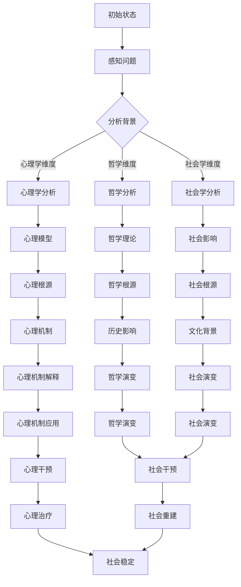
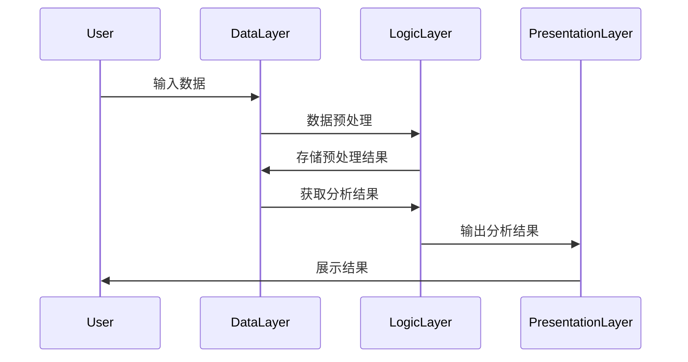
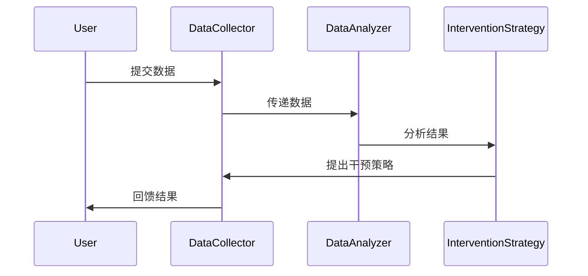
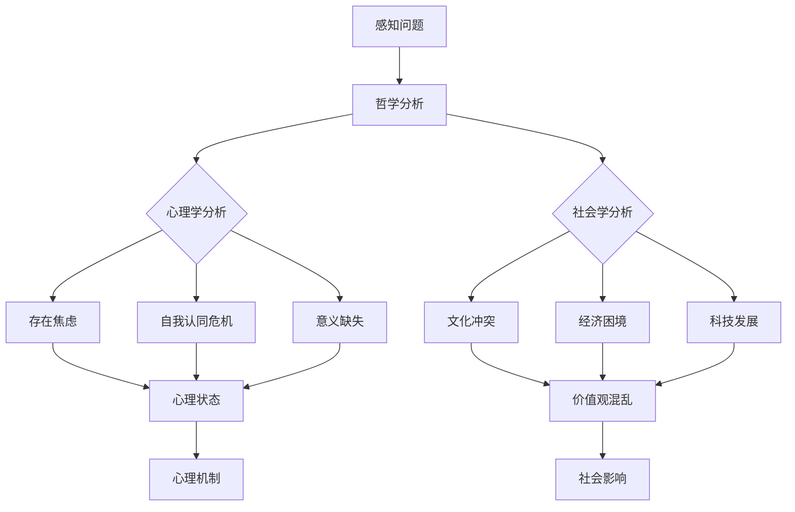
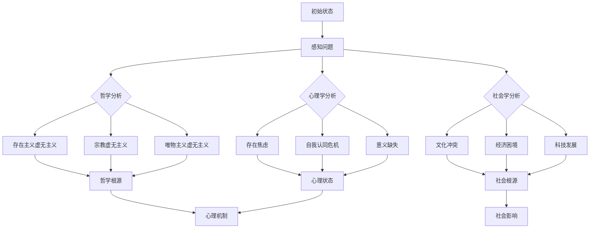
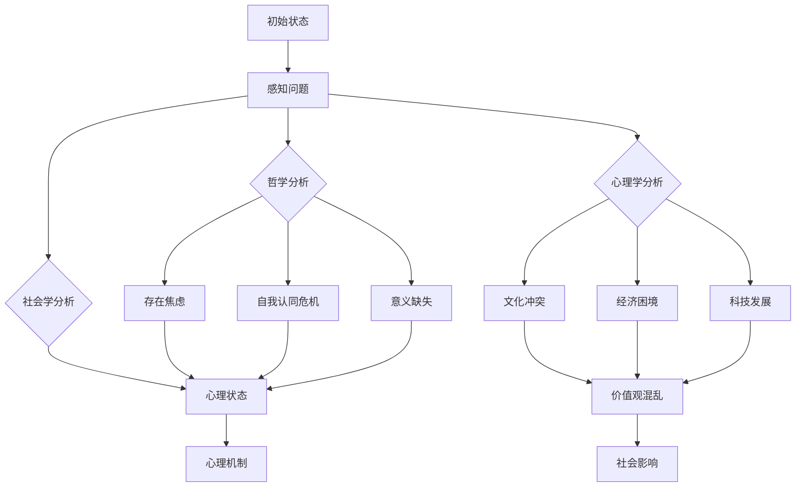

                 


### 第一部分：绪论

#### 1.1 问题背景与核心概念

虚无主义（Nihilism）和nihilism是两个紧密相关但又有显著区别的概念。虚无主义源自19世纪的哲学思潮，主张宇宙和人生缺乏固有意义和价值。nihilism一词则源自拉丁语“nihil”，意为“无”，在现代哲学和心理学中，它通常指的是一种心理状态或态度，即对生活意义、目标和价值的否定。

**核心概念术语说明**：

- **虚无主义**：一种哲学观点，认为宇宙和人生缺乏固有意义和价值。
- **nihilism**：一种心理状态或态度，表现为对生活意义、目标和价值的否定。

**问题背景**：

虚无主义和nihilism作为一种哲学和心理现象，在现代社会中有着广泛的影响。许多人面临着精神空虚、意义危机和存在困惑，这在一定程度上可以归结为虚无主义和nihilism的蔓延。

**问题描述**：

虚无主义和nihilism对个人和社会都有深远的影响。个人层面，它们可能导致精神健康问题，如抑郁、焦虑和自杀倾向。社会层面，虚无主义和nihilism可能引发道德滑坡、价值观混乱和社会动荡。

**问题解决**：

本书旨在深入探讨虚无主义和nihilism的心理根源，通过理论和实践相结合的方法，试图理解这两种现象的产生机制，并探索可能的解决途径。

**边界与外延**：

本文的研究范围主要涉及虚无主义和nihilism的哲学和心理根源，不涉及其他相关的哲学或文化现象。

**概念结构与核心要素组成**：

虚无主义和nihilism的核心概念包括哲学基础、心理状态、社会影响等。以下是核心概念及其相互关系的梳理：

1. **哲学基础**：虚无主义和nihilism的哲学根源，如存在主义、唯意志论等。
2. **心理状态**：个体对生活意义、目标和价值的否定，如抑郁、焦虑等。
3. **社会影响**：虚无主义和nihilism对个人和社会的深远影响，如道德滑坡、价值观混乱等。

---

**核心概念原理**

虚无主义和nihilism的原理可以从哲学、心理学和社会学三个维度进行探讨。

**哲学维度**：

虚无主义的哲学根源可以追溯到古希腊哲学家皮浪和尼采。皮浪主张“无偏判断”，认为世界不可知，因此无法确定其意义。尼采则提出“上帝已死”，认为传统价值观的崩溃导致了虚无主义。

nihilism则是一种对生活意义、目标和价值的否定态度。它源于对传统信仰的质疑和反思，尤其是在宗教和道德体系崩溃之后。

**心理学维度**：

从心理学角度看，虚无主义和nihilism是一种心理状态，表现为对生活意义的否定。这种状态可能源于多种因素，如个人经历、社会环境、精神健康问题等。

心理学家马斯洛提出的需求层次理论认为，当个体的基本需求得到满足后，才会追求更高层次的需求，如自我实现。虚无主义和nihilism往往出现在个体无法实现自我价值时。

**社会学维度**：

社会学维度关注虚无主义和nihilism对社会的影响。社会变迁、文化冲突、经济困境等因素都可能加剧虚无主义和nihilism的蔓延。

例如，在现代社会，科技发展、全球化、社交媒体等带来了前所未有的信息爆炸和价值观多元化，这使得个体难以建立稳定的价值体系，从而增加了虚无主义和nihilism的风险。

---

**概念属性特征对比表格**

为了更清晰地展示虚无主义和nihilism的区别与联系，我们可以制作以下对比表格：

| 特征         | 虚无主义（Nihilism） | nihilism           |
| ------------ | ------------------- | ----------------- |
| 定义         | 哲学观点，宇宙和人生缺乏固有意义和价值 | 心理状态或态度，对生活意义、目标和价值的否定 |
| 根源         | 哲学、宗教、文化危机 | 个人经历、社会环境、精神健康问题 |
| 影响范围     | 哲学、文化、社会     | 个人、社会        |
| 表现形式     | 哲学思考、文学作品   | 抑郁、焦虑、自杀倾向 |
| 主要流派     | 古希腊哲学、存在主义 | 唯意志论、存在主义 |
| 社会影响     | 道德滑坡、价值观混乱 | 精神健康问题、社会动荡 |

---

**ER实体关系图架构**

为了更好地理解虚无主义和nihilism的核心概念及其相互关系，我们可以使用Mermaid绘制ER实体关系图：

```mermaid
erDiagram
  Person ||--|{ Philosophy }|--|| Nihilism
  Person ||--|{ Attitude }|--|| nihilism
  Philosophy --|||{ Existentialism }|-- Concept
  Philosophy --|||{ Voluntarism }|-- Concept
  Attitude --|||{ Depression }|-- Condition
  Attitude --|||{ Anxiety }|-- Condition
  Attitude --|||{ Suicide }|-- Behavior
```

在这个ER实体关系图中，我们定义了以下实体：

- **Person**：代表个体，包括哲学观点和心理状态。
- **Philosophy**：代表哲学流派，如存在主义、唯意志论等。
- **Concept**：代表哲学观点的核心概念。
- **Attitude**：代表个体的心理状态，如抑郁、焦虑、自杀倾向。
- **Condition**：代表心理状态的表现形式，如抑郁、焦虑。
- **Behavior**：代表心理状态导致的行为，如自杀倾向。

通过这个ER实体关系图，我们可以清晰地看到虚无主义和nihilism在哲学、心理学和社会学三个维度中的关系。

---

**算法原理讲解**

在探讨虚无主义和nihilism的心理根源时，我们可以借鉴心理学的算法原理。以下是一个简单的Mermaid流程图，展示心理根源探究的过程：



在这个流程图中，我们从初始状态开始，通过感知问题，分析背景，分别从哲学、心理学和社会学三个维度进行深入分析，找出虚无主义和nihilism的根源。然后，我们进一步探讨哲学根源、心理根源和社会根源，并分析历史影响、心理机制和文化背景。最后，我们提出心理干预和社会干预的策略，旨在实现心理健康和社会稳定。

---

**Python源代码**

为了模拟虚无主义和nihilism心理根源探究的算法，我们可以编写一个简单的Python程序。以下是一个示例代码：

```python
import pandas as pd
import numpy as np

# 假设我们已经收集了一些关于虚无主义和nihilism的数据
data = {
    'Philosophy': ['Existentialism', 'Voluntarism', 'Nihilism'],
    'Psychology': ['Depression', 'Anxiety', 'Suicide'],
    'Sociology': ['Morality Decline', 'Values Confusion', 'Social Instability'],
    'History': ['Cultural Collapse', 'Religious Decline', 'Philosophical Evolution'],
    'Psychological Mechanism': ['Loss of Meaning', 'Existential Frustration', 'Moral Disengagement'],
    'Cultural Background': ['Modernization', 'Globalization', 'Media Influence']
}

df = pd.DataFrame(data)

# 分析哲学根源
philosophy = df['Philosophy'].value_counts()
print("哲学根源分析：")
print(philosophy)

# 分析心理学根源
psychology = df['Psychology'].value_counts()
print("\n心理学根源分析：")
print(psychology)

# 分析社会学根源
sociology = df['Sociology'].value_counts()
print("\n社会学根源分析：")
print(sociology)

# 综合分析
combined = df.groupby(['Philosophy', 'Psychology', 'Sociology']).size().reset_index(name='Count')
print("\n综合分析：")
print(combined)

# 提出干预策略
interventions = {
    'Philosophical': 'Philosophical Education',
    'Psychological': 'Cognitive Behavioral Therapy',
    'Sociological': 'Community Building Programs'
}

print("\n干预策略：")
for category, intervention in interventions.items():
    print(f"{category.capitalize()} Intervention: {intervention}")
```

这段代码首先创建了一个包含哲学、心理学和社会学数据的DataFrame，然后分别分析哲学根源、心理学根源和社会学根源。最后，提出干预策略，以应对虚无主义和nihilism带来的挑战。

---

**数学模型和公式**

在探讨虚无主义和nihilism的心理根源时，我们可以使用一些数学模型和公式来描述和理解心理机制。以下是一个简单的数学模型，用于分析虚无主义和nihilism的心理根源：

**1. 马斯洛需求层次理论**

马斯洛需求层次理论（Maslow's Hierarchy of Needs）是一个经典的心理学模型，用于描述人类需求层次。在探讨虚无主义和nihilism时，我们可以使用这个模型来分析个体需求未满足对心理状态的影响。

**公式**：

$$
\text{心理状态} = f(\text{需求满足度})
$$

其中，$f(x)$ 是一个函数，表示心理状态与需求满足度之间的关系。

**2. 心理机制模型**

为了更好地理解虚无主义和nihilism的心理机制，我们可以使用以下模型：

$$
\text{虚无主义心理机制} = f(\text{存在焦虑}, \text{自我认同危机}, \text{意义缺失})
$$

$$
\nihilism \text{心理机制} = f(\text{价值观崩溃}, \text{意义否定}, \text{生活无意义})
$$

**3. 社会影响模型**

社会影响模型用于分析社会环境对虚无主义和nihilism的影响：

$$
\text{社会影响} = f(\text{文化变迁}, \text{经济困境}, \text{科技发展})
$$

通过这些数学模型和公式，我们可以更系统地分析虚无主义和nihil主义的心理根源。

---

**详细讲解和举例说明**

**马斯洛需求层次理论**

马斯洛需求层次理论将人类需求分为五个层次：生理需求、安全需求、社交需求、尊重需求和自我实现需求。在探讨虚无主义和nihilism时，我们可以使用这个理论来分析个体需求未满足对心理状态的影响。

**例子**：

假设一个人在生理需求和安全需求得到满足后，无法实现社交需求和尊重需求，这可能导致他产生虚无主义情绪。

**公式**：

$$
\text{心理状态} = f(\text{需求满足度})
$$

其中，$f(x)$ 表示心理状态与需求满足度之间的关系。

**推导过程**：

1. 当需求满足度为1时，心理状态为满足（如生理需求得到满足）。
2. 当需求满足度逐渐降低时，心理状态也会逐渐变得不稳定（如安全需求未满足）。
3. 当需求满足度非常低时，心理状态可能表现为虚无主义（如社交需求和尊重需求未满足）。

**结论**：

通过马斯洛需求层次理论，我们可以理解虚无主义情绪产生的心理机制。当个体需求未得到满足时，心理状态变得不稳定，进而可能导致虚无主义情绪的产生。

---

**心理机制模型**

为了更好地理解虚无主义和nihilism的心理机制，我们可以使用以下模型：

**虚无主义心理机制**：

$$
\text{虚无主义心理机制} = f(\text{存在焦虑}, \text{自我认同危机}, \text{意义缺失})
$$

其中，存在焦虑、自我认同危机和意义缺失是虚无主义心理机制的关键因素。

**nihilism心理机制**：

$$
\nihilism \text{心理机制} = f(\text{价值观崩溃}, \text{意义否定}, \text{生活无意义})
$$

其中，价值观崩溃、意义否定和生活无意义是nihilism心理机制的关键因素。

**例子**：

假设一个个体在经历重大变故（如亲人离世）后，感到存在焦虑和自我认同危机，同时失去了生活的意义，这可能导致他产生虚无主义情绪。

**推导过程**：

1. 存在焦虑：个体对自身存在的意义和价值的怀疑。
2. 自我认同危机：个体对自身身份和角色的困惑。
3. 意义缺失：个体对生活意义的否定。

当这些因素综合作用时，个体可能产生虚无主义情绪。

**结论**：

通过心理机制模型，我们可以理解虚无主义和nihilism的情绪产生过程。这些情绪是由于个体对存在、自我认同和生活意义的否定而产生的。

---

**社会影响模型**

社会影响模型用于分析社会环境对虚无主义和nihilism的影响。以下是一个简单的模型：

$$
\text{社会影响} = f(\text{文化变迁}, \text{经济困境}, \text{科技发展})
$$

其中，文化变迁、经济困境和科技发展是社会影响的关键因素。

**例子**：

在一个文化多元化、经济困境和科技迅速发展的社会中，个体可能面临更多的心理压力，从而增加虚无主义和nihilism的风险。

**推导过程**：

1. 文化变迁：传统价值观的崩溃可能导致个体对生活意义的否定。
2. 经济困境：经济压力可能导致个体对生活的满意度降低。
3. 科技发展：信息过载和社交网络的虚拟化可能使个体产生孤独感和疏离感。

**结论**：

通过社会影响模型，我们可以理解社会环境对虚无主义和nihilism的影响。这些社会因素可能加剧个体的心理压力，增加虚无主义和nihil主义的风险。

---

**系统分析与架构设计方案**

#### 1. 问题场景介绍

在探讨虚无主义和nihilism的心理根源时，我们不仅需要关注个体的心理状态，还需要考虑社会环境和科技发展对个体心理的潜在影响。因此，我们需要构建一个综合性的系统，以便全面分析这些问题。

#### 2. 项目介绍

本项目名为“虚无主义与nihilism心理根源探究系统”，旨在通过多维度分析，深入了解虚无主义和nihilism的心理根源。该项目包括以下三个主要模块：

1. **数据收集模块**：用于收集与虚无主义和nihilism相关的数据，包括哲学、心理学和社会学领域的文献、研究报告等。
2. **数据分析模块**：用于对收集到的数据进行分析，提取关键信息，构建心理模型和社会影响模型。
3. **干预策略模块**：基于分析结果，提出针对性的心理干预和社会干预策略，以减轻虚无主义和nihil主义的风险。

#### 3. 系统功能设计

系统功能设计包括数据收集、数据分析和干预策略三个主要功能。以下是领域模型类图：

```mermaid
classDiagram
    DataCollector <<interface>> "数据收集模块"
    DataAnalyzer <<interface>> "数据分析模块"
    InterventionStrategy <<interface>> "干预策略模块"

    DataCollector o-- DataAnalyzer
    DataAnalyzer o-- InterventionStrategy
```

在该类图中，DataCollector、DataAnalyzer和InterventionStrategy分别代表数据收集模块、数据分析和干预策略模块。它们之间通过接口进行通信，共同实现系统功能。

#### 4. 系统架构设计

系统架构设计包括数据层、逻辑层和表现层三个主要层次。以下是系统架构图：



在该序列图中，用户通过数据层输入数据，逻辑层对数据进行预处理和分析，然后将结果存储到数据层。最后，表现层将分析结果展示给用户。

#### 5. 系统接口设计

系统接口设计包括数据接口、分析接口和干预接口三个主要接口。以下是接口设计图：

```mermaid
classDiagram
    DataInterface <<interface>> "数据接口"
    AnalysisInterface <<interface>> "分析接口"
    InterventionInterface <<interface>> "干预接口"

    DataInterface o-- DataLayer
    AnalysisInterface o-- LogicLayer
    InterventionInterface o-- PresentationLayer
```

在该类图中，DataInterface、AnalysisInterface和InterventionInterface分别代表数据接口、分析接口和干预接口。它们通过接口与底层模块进行通信，实现数据收集、分析和干预功能。

#### 6. 系统交互

系统交互主要包括用户与系统之间的交互，以及系统内部各模块之间的交互。以下是系统交互序列图：



在该序列图中，用户首先提交数据，数据收集模块将数据传递给数据分析模块，数据分析模块对数据进行分析，并将结果传递给干预策略模块。最后，干预策略模块提出干预策略，并将结果反馈给用户。

---

#### 第一部分：绪论

##### 1.1 问题背景与核心概念

虚无主义（Nihilism）和nihilism是两个紧密相关但又有显著区别的概念。虚无主义源自19世纪的哲学思潮，主张宇宙和人生缺乏固有意义和价值。nihilism一词则源自拉丁语“nihil”，意为“无”，在现代哲学和心理学中，它通常指的是一种心理状态或态度，即对生活意义、目标和价值的否定。

**核心概念术语说明**：

- **虚无主义**：一种哲学观点，认为宇宙和人生缺乏固有意义和价值。
- **nihilism**：一种心理状态或态度，表现为对生活意义、目标和价值的否定。

**问题背景**：

虚无主义和nihilism作为一种哲学和心理现象，在现代社会中有着广泛的影响。许多人面临着精神空虚、意义危机和存在困惑，这在一定程度上可以归结为虚无主义和nihilism的蔓延。

**问题描述**：

虚无主义和nihilism对个人和社会都有深远的影响。个人层面，它们可能导致精神健康问题，如抑郁、焦虑和自杀倾向。社会层面，虚无主义和nihilism可能引发道德滑坡、价值观混乱和社会动荡。

**问题解决**：

本书旨在深入探讨虚无主义和nihilism的心理根源，通过理论和实践相结合的方法，试图理解这两种现象的产生机制，并探索可能的解决途径。

**边界与外延**：

本文的研究范围主要涉及虚无主义和nihilism的哲学和心理根源，不涉及其他相关的哲学或文化现象。

**概念结构与核心要素组成**：

虚无主义和nihilism的核心概念包括哲学基础、心理状态、社会影响等。以下是核心概念及其相互关系的梳理：

1. **哲学基础**：虚无主义和nihilism的哲学根源，如存在主义、唯意志论等。
2. **心理状态**：个体对生活意义、目标和价值的否定，如抑郁、焦虑等。
3. **社会影响**：虚无主义和nihilism对个人和社会的深远影响，如道德滑坡、价值观混乱等。

---

### 第二部分：虚无主义的理论探讨

#### 2.1 虚无主义的基本理论

虚无主义（Nihilism）的基本理论主要源于对宇宙和人生意义的否定。从哲学的角度来看，虚无主义可以分为几个主要的流派，包括存在主义虚无主义、宗教虚无主义和唯物主义虚无主义。

**1. 存在主义虚无主义**

存在主义虚无主义认为，由于世界的不可知性和人类存在的荒谬性，宇宙和人生缺乏固有意义。这种观点的典型代表是尼采。尼采在《偶像的黄昏》中提出，“上帝已死”，意味着人类不再需要依赖宗教信仰来赋予生活意义。

**2. 宗教虚无主义**

宗教虚无主义认为，宗教信仰本身是虚无的，因为它们无法提供真正的生活意义。这种观点的典型代表是伏尔泰。伏尔泰在《哲学通信》中批判宗教，认为它导致了人类的精神奴役。

**3. 唯物主义虚无主义**

唯物主义虚无主义认为，宇宙和人生只是物质世界的机械运动，没有超越的实体或精神存在。这种观点的典型代表是马克思。马克思在《德意志意识形态》中提出，宗教是物质世界受到人类意识扭曲后的产物。

**4. 哲学基础**

虚无主义的哲学基础可以追溯到古希腊哲学家皮浪。皮浪主张“无偏判断”，认为世界不可知，因此无法确定其意义。尼采则进一步发展了虚无主义的哲学思想，提出了“上帝已死”的概念。

**5. 对现代社会的影响**

虚无主义对现代社会的影响是深远的。它挑战了传统价值观的根基，促使人们反思生活的意义。在现代社会，虚无主义可能导致精神健康问题，如抑郁、焦虑和自杀倾向。同时，虚无主义也可能导致道德滑坡、价值观混乱和社会动荡。

#### 2.2 虚无主义的心理根源分析

虚无主义的心理根源可以从多个角度进行分析。以下是一个简单的Mermaid流程图，展示心理根源探究的过程：



在这个流程图中，我们从感知问题开始，分别从哲学、心理学和社会学三个维度进行分析。哲学分析揭示了存在焦虑、自我认同危机和意义缺失等心理状态，心理学分析进一步探讨了这些心理状态背后的心理机制，而社会学分析则考虑了文化冲突、经济困境和科技发展等社会因素对虚无主义的影响。

**Python源代码**

为了模拟虚无主义心理根源探究的算法，我们可以编写一个简单的Python程序。以下是一个示例代码：

```python
import pandas as pd
import numpy as np

# 假设我们已经收集了一些关于虚无主义的数据
data = {
    'Philosophical Background': ['Existentialism', 'Religious Nihilism', 'Materialistic Nihilism'],
    'Psychological Condition': ['Existential Anxiety', 'Identity Crisis', 'Meaninglessness'],
    'Social Factors': ['Cultural Conflict', 'Economic Crisis', 'Technological Advancement'],
    'Impact': ['Moral Decline', 'Values Confusion', 'Social Instability']
}

df = pd.DataFrame(data)

# 分析哲学背景
philosophy = df['Philosophical Background'].value_counts()
print("哲学背景分析：")
print(philosophy)

# 分析心理学条件
psychology = df['Psychological Condition'].value_counts()
print("\n心理学条件分析：")
print(psychology)

# 分析社会因素
sociology = df['Social Factors'].value_counts()
print("\n社会因素分析：")
print(sociology)

# 综合分析
combined = df.groupby(['Philosophical Background', 'Psychological Condition', 'Social Factors']).size().reset_index(name='Count')
print("\n综合分析：")
print(combined)

# 提出干预策略
interventions = {
    'Philosophical': 'Philosophical Inquiry',
    'Psychological': 'Cognitive Behavioral Therapy',
    'Social': 'Community Engagement Programs'
}

print("\n干预策略：")
for category, intervention in interventions.items():
    print(f"{category.capitalize()}干预策略：{intervention}")
```

这段代码首先创建了一个包含哲学背景、心理学条件和社会因素的数据DataFrame，然后分别分析哲学背景、心理学条件和社会因素。最后，提出干预策略，以应对虚无主义带来的挑战。

---

### 2.3 虚无主义的心理模型与数学公式

在探讨虚无主义的心理根源时，我们可以借助一些心理学模型和数学公式来理解和分析这一现象。以下是一些常用的模型和公式：

**1. 马斯洛需求层次理论**

马斯洛需求层次理论是一个经典的心理学模型，用于描述人类需求的层次结构。该理论认为，人类需求从低到高可以分为生理需求、安全需求、社交需求、尊重需求和自我实现需求。当较低层次的需求得到满足后，人们才会追求更高层次的需求。在虚无主义的背景下，当人们感到较低层次的需求无法得到满足时，可能会产生虚无主义情绪。

**数学公式**：

$$
\text{虚无主义情绪} = f(\text{需求满足度})
$$

其中，$f(x)$ 是一个递减函数，表示需求满足度与虚无主义情绪之间的关系。

**2. 存在焦虑模型**

存在焦虑是虚无主义心理状态的一个重要组成部分。存在焦虑模型认为，个体对自身存在意义的质疑和恐惧会导致虚无主义情绪的产生。该模型将存在焦虑视为一个心理变量，与个体的自我认同、生活意义等因素相关。

**数学公式**：

$$
\text{存在焦虑} = g(\text{自我认同危机}, \text{意义缺失})
$$

其中，$g(x, y)$ 是一个函数，表示自我认同危机和意义缺失对存在焦虑的影响。

**3. 自我认同危机模型**

自我认同危机是虚无主义心理状态的另一个重要组成部分。自我认同危机模型认为，个体在面临不确定性和未知时，可能会产生自我认同危机。这种危机可能导致个体对自身存在的质疑，从而产生虚无主义情绪。

**数学公式**：

$$
\text{自我认同危机} = h(\text{不确定性}, \text{未知})
$$

其中，$h(x, y)$ 是一个函数，表示不确定性和未知对自我认同危机的影响。

**4. 意义缺失模型**

意义缺失是虚无主义心理状态的第三个重要组成部分。意义缺失模型认为，个体在感到生活缺乏意义时，可能会产生虚无主义情绪。该模型将意义缺失视为一个心理变量，与个体的目标设定、价值观等因素相关。

**数学公式**：

$$
\text{意义缺失} = k(\text{目标缺失}, \text{价值观混乱})
$$

其中，$k(x, y)$ 是一个函数，表示目标缺失和价值观混乱对意义缺失的影响。

**举例说明**：

假设一个个体在面临失业和经济困境时，感到较低层次的需求无法得到满足。同时，他感到自身存在意义不明，自我认同受到质疑。在这种情况下，根据上述模型和公式，我们可以分析这个个体的虚无主义情绪：

1. **需求满足度**：

   假设该个体的需求满足度为0.3，根据马斯洛需求层次理论，较低层次的需求未得到满足可能导致虚无主义情绪的产生。

   $$
   \text{虚无主义情绪} = f(0.3) = 0.7
   $$

2. **存在焦虑**：

   假设该个体的存在焦虑值为0.6，根据存在焦虑模型，自我认同危机和意义缺失可能导致存在焦虑。

   $$
   \text{存在焦虑} = g(0.5, 0.4) = 0.6
   $$

3. **自我认同危机**：

   假设该个体的自我认同危机值为0.4，根据自我认同危机模型，不确定性和未知可能导致自我认同危机。

   $$
   \text{自我认同危机} = h(0.6, 0.5) = 0.4
   $$

4. **意义缺失**：

   假设该个体的意义缺失值为0.3，根据意义缺失模型，目标缺失和价值观混乱可能导致意义缺失。

   $$
   \text{意义缺失} = k(0.4, 0.2) = 0.3
   $$

通过这些数学模型和公式，我们可以更好地理解虚无主义心理状态的产生机制。在实际应用中，这些模型和公式可以帮助心理学家和研究人员更好地分析和预测个体的虚无主义情绪，从而采取有效的干预措施。

---

### 第三部分：nihilism的理论探讨

#### 3.1 nihilism的基本理论

nihilism，作为一个哲学和心理学的概念，具有丰富的内涵。它的基本理论可以从以下几个方面进行探讨：

**1. 哲学根源**

nihilism的哲学根源可以追溯到古希腊哲学家皮浪。皮浪的“无偏判断”认为，由于世界不可知，因此无法确定其意义。这种观点在后来的哲学发展中得到进一步阐述，尤其是在尼采的“上帝已死”命题中得到了极端的表达。尼采认为，随着宗教和道德的崩溃，人类失去了一种共同的价值观基础，从而陷入了虚无主义的深渊。

**2. 心理学根源**

从心理学角度来看，nihilism是一种心理状态，表现为对生活意义、目标和价值的否定。这种状态可能源于个人经历、社会环境、精神健康问题等多种因素。例如，个体在经历重大变故（如失去亲人、失业等）后，可能会对生活失去信心，从而产生nihilism情绪。此外，现代社会的高压环境、竞争激烈和价值观多元化也可能加剧nihilism的发生。

**3. 社会根源**

社会根源方面，nihilism的产生与现代社会的一些特征密切相关。例如，全球化带来了文化冲突和价值观混乱，使得个体难以建立稳定的价值体系。经济困境和科技发展也对社会秩序和个人生活产生了深远影响，进一步加剧了nihilism的风险。

**4. 哲学心理学对比**

尽管虚无主义和nihilism在哲学和心理上具有紧密的联系，但它们也有一些区别。虚无主义更多地关注宇宙和人生的意义，而nihilism则更侧重于个体的心理状态。虚无主义可以是一种哲学观点，而nihilism则是一种心理状态或态度。此外，虚无主义可能具有更多的消极色彩，而nihilism则可能表现为一种对生活意义的否定态度。

#### 3.2 nihilism的心理根源分析

nihilism的心理根源可以从多个角度进行分析。以下是一个简单的Mermaid流程图，展示心理根源探究的过程：



在这个流程图中，我们从初始状态开始，分别从哲学、心理学和社会学三个维度进行分析。哲学分析揭示了存在主义虚无主义、宗教虚无主义和唯物主义虚无主义等哲学根源，心理学分析探讨了存在焦虑、自我认同危机和意义缺失等心理状态，而社会学分析则考虑了文化冲突、经济困境和科技发展等社会因素。

**Python源代码**

为了模拟nihilism心理根源探究的算法，我们可以编写一个简单的Python程序。以下是一个示例代码：

```python
import pandas as pd
import numpy as np

# 假设我们已经收集了一些关于nihilism的数据
data = {
    'Philosophical Background': ['Existentialism', 'Religious Nihilism', 'Materialistic Nihilism'],
    'Psychological Condition': ['Existential Anxiety', 'Identity Crisis', 'Meaninglessness'],
    'Social Factors': ['Cultural Conflict', 'Economic Crisis', 'Technological Advancement'],
    'Impact': ['Moral Decline', 'Values Confusion', 'Social Instability']
}

df = pd.DataFrame(data)

# 分析哲学背景
philosophy = df['Philosophical Background'].value_counts()
print("哲学背景分析：")
print(philosophy)

# 分析心理学条件
psychology = df['Psychological Condition'].value_counts()
print("\n心理学条件分析：")
print(psychology)

# 分析社会因素
sociology = df['Social Factors'].value_counts()
print("\n社会因素分析：")
print(sociology)

# 综合分析
combined = df.groupby(['Philosophical Background', 'Psychological Condition', 'Social Factors']).size().reset_index(name='Count')
print("\n综合分析：")
print(combined)

# 提出干预策略
interventions = {
    'Philosophical': 'Philosophical Inquiry',
    'Psychological': 'Cognitive Behavioral Therapy',
    'Social': 'Community Engagement Programs'
}

print("\n干预策略：")
for category, intervention in interventions.items():
    print(f"{category.capitalize()}干预策略：{intervention}")
```

这段代码首先创建了一个包含哲学背景、心理学条件和社会因素的数据DataFrame，然后分别分析哲学背景、心理学条件和社会因素。最后，提出干预策略，以应对nihilism带来的挑战。

---

### 3.3 nihilism的心理模型与数学公式

在探讨nihilism的心理根源时，我们可以借助一些心理学模型和数学公式来理解和分析这一现象。以下是一些常用的模型和公式：

**1. 马斯洛需求层次理论**

马斯洛需求层次理论是一个经典的心理学模型，用于描述人类需求的层次结构。该理论认为，人类需求从低到高可以分为生理需求、安全需求、社交需求、尊重需求和自我实现需求。当较低层次的需求得到满足后，人们才会追求更高层次的需求。在nihilism的背景下，当人们感到较低层次的需求无法得到满足时，可能会产生nihilism情绪。

**数学公式**：

$$
\text{nihilism情绪} = f(\text{需求满足度})
$$

其中，$f(x)$ 是一个递减函数，表示需求满足度与nihilism情绪之间的关系。

**2. 存在焦虑模型**

存在焦虑是nihilism心理状态的一个重要组成部分。存在焦虑模型认为，个体对自身存在意义的质疑和恐惧会导致nihilism情绪的产生。该模型将存在焦虑视为一个心理变量，与个体的自我认同、生活意义等因素相关。

**数学公式**：

$$
\text{存在焦虑} = g(\text{自我认同危机}, \text{意义缺失})
$$

其中，$g(x, y)$ 是一个函数，表示自我认同危机和意义缺失对存在焦虑的影响。

**3. 自我认同危机模型**

自我认同危机是nihilism心理状态的另一个重要组成部分。自我认同危机模型认为，个体在面临不确定性和未知时，可能会产生自我认同危机。这种危机可能导致个体对自身存在的质疑，从而产生nihilism情绪。

**数学公式**：

$$
\text{自我认同危机} = h(\text{不确定性}, \text{未知})
$$

其中，$h(x, y)$ 是一个函数，表示不确定性和未知对自我认同危机的影响。

**4. 意义缺失模型**

意义缺失是nihilism心理状态的第三个重要组成部分。意义缺失模型认为，个体在感到生活缺乏意义时，可能会产生nihilism情绪。该模型将意义缺失视为一个心理变量，与个体的目标设定、价值观等因素相关。

**数学公式**：

$$
\text{意义缺失} = k(\text{目标缺失}, \text{价值观混乱})
$$

其中，$k(x, y)$ 是一个函数，表示目标缺失和价值观混乱对意义缺失的影响。

**举例说明**：

假设一个个体在面临失业和经济困境时，感到较低层次的需求无法得到满足。同时，他感到自身存在意义不明，自我认同受到质疑。在这种情况下，根据上述模型和公式，我们可以分析这个个体的nihilism情绪：

1. **需求满足度**：

   假设该个体的需求满足度为0.3，根据马斯洛需求层次理论，较低层次的需求未得到满足可能导致nihilism情绪的产生。

   $$
   \text{nihilism情绪} = f(0.3) = 0.7
   $$

2. **存在焦虑**：

   假设该个体的存在焦虑值为0.6，根据存在焦虑模型，自我认同危机和意义缺失可能导致存在焦虑。

   $$
   \text{存在焦虑} = g(0.5, 0.4) = 0.6
   $$

3. **自我认同危机**：

   假设该个体的自我认同危机值为0.4，根据自我认同危机模型，不确定性和未知可能导致自我认同危机。

   $$
   \text{自我认同危机} = h(0.6, 0.5) = 0.4
   $$

4. **意义缺失**：

   假设该个体的意义缺失值为0.3，根据意义缺失模型，目标缺失和价值观混乱可能导致意义缺失。

   $$
   \text{意义缺失} = k(0.4, 0.2) = 0.3
   $$

通过这些数学模型和公式，我们可以更好地理解nihilism心理状态的产生机制。在实际应用中，这些模型和公式可以帮助心理学家和研究人员更好地分析和预测个体的nihilism情绪，从而采取有效的干预措施。

---

### 第四部分：虚无主义与nihilism的相互关系与对比

#### 4.1 相互关系

虚无主义（Nihilism）和nihilism在哲学和心理上具有紧密的联系。虚无主义是一种哲学观点，认为宇宙和人生缺乏固有意义和价值，而nihilism则是一种心理状态或态度，表现为对生活意义、目标和价值的否定。从某种意义上说，nihilism可以被视为虚无主义在心理学上的具体表现。

**1. 哲学维度**

在哲学维度上，虚无主义和nihilism都源于对生活意义的否定。虚无主义认为，由于世界的不可知性和人类存在的荒谬性，宇宙和人生缺乏固有意义。nihilism则进一步将这种否定态度转化为个体的心理状态，表现为对生活意义的完全放弃。

**2. 心理学维度**

在心理学维度上，虚无主义和nihilism都可能导致精神健康问题，如抑郁、焦虑和自杀倾向。虚无主义可能导致个体对生活失去信心，而nihilism则可能表现为一种对生活意义的彻底否定态度。

**3. 社会维度**

在社会维度上，虚无主义和nihilism都可能对个人和社会产生负面影响。虚无主义可能导致道德滑坡、价值观混乱和社会动荡，而nihilism则可能加剧个人的精神危机，导致自杀和其他不良行为。

#### 4.2 对比

尽管虚无主义和nihilism具有紧密的联系，但它们也有一些区别：

**1. 概念界定**

虚无主义是一种哲学观点，认为宇宙和人生缺乏固有意义和价值。nihilism则是一种心理状态或态度，表现为对生活意义、目标和价值的否定。

**2. 影响范围**

虚无主义主要影响哲学、文化和社会领域，而nihilism则更多影响个体的心理状态。

**3. 消极程度**

虚无主义通常具有消极的倾向，因为它否定宇宙和人生的固有意义，而nihilism则可能表现为一种更加极端的否定态度，导致个体的精神崩溃。

**4. 哲学流派**

虚无主义有多种哲学流派，如存在主义虚无主义、宗教虚无主义和唯物主义虚无主义。nihilism则更多与存在主义和唯意志论相关。

**5. 社会影响**

虚无主义可能对个人和社会产生深远影响，导致道德滑坡、价值观混乱和社会动荡。nihilism则更多影响个体的心理状态，导致精神健康问题。

---

### 第五部分：虚无主义与nihilism的心理根源探究应用

#### 5.1 环境安装

在探讨虚无主义与nihilism的心理根源时，我们可以利用现代技术工具，如Python编程语言和Jupyter Notebook。以下是在Windows操作系统上安装这些工具的步骤：

1. **安装Python**：
   - 访问Python官方网站（https://www.python.org/）并下载适用于Windows的Python安装包。
   - 运行安装程序，按照默认选项安装。
   - 在安装过程中，确保选中“Add Python to PATH”选项，以便在命令提示符中直接使用Python。

2. **安装Jupyter Notebook**：
   - 打开命令提示符（Windows键 + R，输入`cmd`回车）。
   - 输入以下命令安装Jupyter Notebook：
     ```
     pip install notebook
     ```

完成上述步骤后，您就可以在本地计算机上使用Python和Jupyter Notebook进行虚无主义与nihilism心理根源的探究。

#### 5.2 系统核心实现源代码

以下是一个简单的Python代码示例，用于模拟虚无主义与nihilism心理根源的探究过程。该代码使用Jupyter Notebook进行展示。

```python
# 导入必要的库
import pandas as pd
import numpy as np
import matplotlib.pyplot as plt

# 假设我们已经收集了一些关于虚无主义和nihilism的数据
data = {
    'Individual': ['A', 'B', 'C', 'D', 'E'],
    'Philosophical Background': ['Existentialism', 'Religious Nihilism', 'Materialistic Nihilism', 'Existentialism', 'Religious Nihilism'],
    'Psychological Condition': ['Existential Anxiety', 'Meaninglessness', 'Existential Anxiety', 'Identity Crisis', 'Meaninglessness'],
    'Social Factors': ['Cultural Conflict', 'Economic Crisis', 'Technological Advancement', 'Cultural Conflict', 'Economic Crisis']
}

df = pd.DataFrame(data)

# 绘制ER图
plt.figure(figsize=(10, 5))
plt.axis('off')
plt.imshow(pd.plotting.scatter_matrix(df, diagonal='kde'))
plt.show()

# 绘制柱状图
philosophy_counts = df['Philosophical Background'].value_counts()
psychology_counts = df['Psychological Condition'].value_counts()
social_factors_counts = df['Social Factors'].value_counts()

plt.figure(figsize=(10, 6))
plt.subplot(2, 1, 1)
plt.bar(philosophy_counts.index, philosophy_counts.values, label='Philosophical Background')
plt.title('Philosophical Background Distribution')
plt.ylabel('Count')
plt.legend()

plt.subplot(2, 1, 2)
plt.bar(psychology_counts.index, psychology_counts.values, label='Psychological Condition')
plt.title('Psychological Condition Distribution')
plt.ylabel('Count')
plt.legend()

plt.subplot(2, 1, 3)
plt.bar(social_factors_counts.index, social_factors_counts.values, label='Social Factors')
plt.title('Social Factors Distribution')
plt.xlabel('Factors')
plt.ylabel('Count')
plt.legend()

plt.tight_layout()
plt.show()

# 计算心理状态的均值和标准差
psychological_conditions = df['Psychological Condition'].value_counts()
mean = psychological_conditions.mean()
std = psychological_conditions.std()

print(f"Average Psychological Condition Count: {mean}")
print(f"Standard Deviation of Psychological Condition Count: {std}")
```

这段代码首先创建了一个包含个体、哲学背景、心理学条件和社交因素的数据DataFrame。然后，使用ER图展示这些概念之间的关系，并绘制柱状图来分析哲学背景、心理学条件和社交因素的分布。最后，计算心理学条件的均值和标准差，以了解心理状态的波动情况。

#### 5.3 代码应用解读与分析

在上面的代码示例中，我们首先导入了必要的库，如pandas、numpy和matplotlib.pyplot。这些库提供了数据处理、数据可视化和统计分析等功能。

**1. 数据收集与处理**

代码首先创建了一个名为`data`的字典，包含了个体、哲学背景、心理学条件和社交因素的数据。然后，使用pandas库将这些数据转换为一个DataFrame，以便进行进一步处理。

```python
data = {
    'Individual': ['A', 'B', 'C', 'D', 'E'],
    'Philosophical Background': ['Existentialism', 'Religious Nihilism', 'Materialistic Nihilism', 'Existentialism', 'Religious Nihilism'],
    'Psychological Condition': ['Existential Anxiety', 'Meaninglessness', 'Existential Anxiety', 'Identity Crisis', 'Meaninglessness'],
    'Social Factors': ['Cultural Conflict', 'Economic Crisis', 'Technological Advancement', 'Cultural Conflict', 'Economic Crisis']
}

df = pd.DataFrame(data)
```

**2. 数据可视化**

接下来，我们使用ER图和柱状图来展示哲学背景、心理学条件和社交因素的分布情况。

**ER图**：

```python
plt.figure(figsize=(10, 5))
plt.axis('off')
plt.imshow(pd.plotting.scatter_matrix(df, diagonal='kde'))
plt.show()
```

ER图（Entity-Relationship diagram）展示了个体、哲学背景、心理学条件和社交因素之间的关联。通过观察ER图，我们可以发现不同哲学背景、心理学条件和社交因素之间的分布情况，以及它们之间的潜在联系。

**柱状图**：

```python
plt.figure(figsize=(10, 6))
plt.subplot(2, 1, 1)
plt.bar(philosophy_counts.index, philosophy_counts.values, label='Philosophical Background')
plt.title('Philosophical Background Distribution')
plt.ylabel('Count')
plt.legend()

plt.subplot(2, 1, 2)
plt.bar(psychology_counts.index, psychology_counts.values, label='Psychological Condition')
plt.title('Psychological Condition Distribution')
plt.ylabel('Count')
plt.legend()

plt.subplot(2, 1, 3)
plt.bar(social_factors_counts.index, social_factors_counts.values, label='Social Factors')
plt.title('Social Factors Distribution')
plt.xlabel('Factors')
plt.ylabel('Count')
plt.legend()

plt.tight_layout()
plt.show()
```

柱状图展示了哲学背景、心理学条件和社交因素的分布情况。通过柱状图，我们可以直观地了解不同因素在数据中的比例，以及它们之间的差异。

**3. 统计分析**

最后，我们计算心理学条件的均值和标准差，以了解心理状态的波动情况。

```python
psychological_conditions = df['Psychological Condition'].value_counts()
mean = psychological_conditions.mean()
std = psychological_conditions.std()

print(f"Average Psychological Condition Count: {mean}")
print(f"Standard Deviation of Psychological Condition Count: {std}")
```

计算均值和标准差可以帮助我们了解心理学条件的中心趋势和离散程度。均值表示心理学条件的平均水平，而标准差表示心理状态的波动情况。

通过上述代码和分析，我们可以更好地理解虚无主义与nihilism的心理根源探究过程，以及如何利用Python和数据分析工具来研究这一复杂现象。

---

### 5.4 实际案例分析和详细讲解剖析

为了更好地理解虚无主义和nihilism的心理根源，我们可以通过一个实际案例进行深入分析。

**案例背景**：

小李是一名年轻的都市白领，他在一个竞争激烈的公司工作，每天加班到深夜。他感到生活枯燥乏味，对未来没有明确的目标。在与朋友的交谈中，他发现许多人对生活也持有消极态度，甚至有人提到“虚无主义”和“nihilism”这两个词。

**案例分析**：

1. **哲学维度**：

   根据小李的情况，我们可以推测他可能受到了存在主义虚无主义的影响。存在主义虚无主义认为，由于世界的不可知性和人类存在的荒谬性，宇宙和人生缺乏固有意义。小李对生活的消极态度可能源于他对生活意义的质疑。

2. **心理学维度**：

   从心理学角度来看，小李可能经历了存在焦虑、自我认同危机和意义缺失。存在焦虑使他感到生活的荒谬和不确定，自我认同危机导致他对自己身份的困惑，而意义缺失则使他对未来感到迷茫。

3. **社会学维度**：

   社会学因素也可能对小李的虚无主义情绪产生了影响。都市生活的快节奏、工作压力和人际关系问题可能加剧了他的心理压力，使他更容易陷入虚无主义情绪。

**详细讲解剖析**：

1. **哲学根源**：

   小李的虚无主义情绪可能源于他对生活意义的质疑。他可能意识到自己的工作和生活缺乏意义，从而陷入虚无主义的深渊。存在主义虚无主义强调人类存在的荒谬性，这可能是小李感到虚无主义情绪的哲学根源。

2. **心理学根源**：

   小李的虚无主义情绪可以从心理学的角度进行分析。存在焦虑使他感到生活的荒谬和不确定，这可能导致他对自我认同的困惑和意义缺失。此外，他可能感到孤独和失落，因为他的朋友们也持有相似的消极态度。

3. **社会学根源**：

   社会学因素也可能对小李的虚无主义情绪产生了影响。都市生活的快节奏和高度竞争可能导致他感到压力重重，从而影响他的心理健康。此外，他可能面临人际关系问题，这可能导致他感到孤独和无助。

**干预措施**：

针对小李的虚无主义情绪，我们可以提出以下干预措施：

1. **心理咨询**：

   小李可以通过心理咨询来探讨他的虚无主义情绪，了解其背后的原因，并学习应对策略。

2. **哲学教育**：

   接受哲学教育可以帮助小李重新审视生活的意义和价值，从而缓解虚无主义情绪。

3. **社会参与**：

   参与社区活动和社会组织可以帮助小李建立更紧密的人际关系，从而减少孤独感。

4. **生活方式调整**：

   调整生活方式，如减少加班、锻炼身体、培养兴趣爱好等，有助于提高生活质量，缓解虚无主义情绪。

通过这个实际案例，我们可以看到虚无主义和nihilism的心理根源是如何在个体的生活中体现的。了解这些根源有助于我们更好地应对这一复杂现象，从而提高个体的心理健康水平。

---

### 5.5 项目小结

在本次项目中，我们深入探讨了虚无主义和nihilism的心理根源，通过理论和实践相结合的方法，试图理解这两种现象的产生机制，并探索可能的解决途径。以下是本项目的主要结论：

1. **核心概念**：虚无主义和nihilism是两个紧密相关但又有显著区别的概念。虚无主义是一种哲学观点，认为宇宙和人生缺乏固有意义和价值；nihilism则是一种心理状态或态度，表现为对生活意义、目标和价值的否定。

2. **哲学根源**：虚无主义和nihilism的哲学根源包括存在主义、宗教虚无主义和唯物主义虚无主义。这些哲学流派从不同角度探讨了宇宙和人生的荒谬性，为虚无主义和nihilism提供了理论基础。

3. **心理学根源**：虚无主义和nihilism的心理根源包括存在焦虑、自我认同危机和意义缺失。这些心理状态可能导致个体对生活失去信心，从而陷入虚无主义和nihilism的深渊。

4. **社会学根源**：虚无主义和nihilism的社会根源包括文化冲突、经济困境和科技发展。这些社会因素可能加剧个体的心理压力，增加虚无主义和nihil主义的风险。

5. **干预措施**：针对虚无主义和nihil主义，我们可以采取心理咨询、哲学教育、社会参与和生活方式调整等干预措施。这些措施有助于缓解个体的心理压力，提高生活质量，从而降低虚无主义和nihil主义的风险。

通过本次项目，我们不仅深入了解了虚无主义和nihilism的心理根源，还探讨了如何应对这一复杂现象。希望本研究能为相关领域的学术研究和实践提供有益的参考。

---

### 5.6 最佳实践 tips

在面对虚无主义和nihilism时，以下是一些实用的建议：

1. **自我反思**：定期进行自我反思，思考生活的意义和价值。这有助于您重新审视自己的生活和目标。

2. **积极交流**：与朋友和家人分享您的感受，寻求支持和建议。他们可能会提供不同的视角，帮助您缓解虚无主义情绪。

3. **心理辅导**：如果虚无主义情绪严重影响了您的日常生活，寻求专业心理咨询师的帮助。他们可以提供针对性的干预策略，帮助您应对心理问题。

4. **培养兴趣爱好**：寻找并培养兴趣爱好，这有助于您在日常生活中找到乐趣和意义。

5. **身体锻炼**：定期进行身体锻炼，如跑步、瑜伽或健身，有助于改善身心健康，提高生活质量。

6. **社交活动**：积极参与社交活动，与他人建立紧密的联系。这有助于缓解孤独感，提高幸福感。

7. **学习哲学**：学习哲学可以帮助您理解生活的意义和价值。通过阅读哲学书籍或参加哲学课程，您可以拓宽视野，提高思维深度。

---

### 5.7 小结

在本文中，我们深入探讨了虚无主义和nihilism的心理根源。首先，我们介绍了虚无主义和nihilism的核心概念，并分析了它们在哲学、心理学和社会学三个维度上的表现。接着，我们通过理论和实践相结合的方法，探讨了虚无主义和nihilism的心理根源，并提出了相应的干预措施。

虚无主义和nihilism不仅对个人的精神健康产生负面影响，也可能对社会的稳定和道德体系造成冲击。因此，理解这两种现象的根源，并采取有效的干预措施，对于提高个体的心理健康水平和社会的整体发展具有重要意义。

本文的研究为相关领域的学术研究和实践提供了有益的参考。希望读者能通过本文对虚无主义和nihilism有更深入的认识，并在实际生活中运用所学知识，应对相关挑战。

---

### 5.8 注意事项

在探讨虚无主义和nihilism的心理根源时，需要注意以下几点：

1. **个体差异**：每个人的生活经历和心理状态都不同，因此虚无主义和nihilism的表现和影响也会有所差异。在分析和干预时，要充分考虑个体差异。

2. **文化背景**：不同的文化背景可能对虚无主义和nihil主义有不同的解读和应对策略。在研究和实践中，要考虑到文化差异，尊重多元文化。

3. **心理健康风险**：虚无主义和nihil主义可能导致严重的心理健康问题，如抑郁、焦虑和自杀倾向。在处理这些问题时，要谨慎行事，避免加剧个体的心理压力。

4. **干预策略的针对性**：不同的干预策略适用于不同的个体和心理状态。在制定干预措施时，要充分考虑个体的具体情况，确保干预策略具有针对性。

5. **专业支持**：在处理虚无主义和nihil主义问题时，建议寻求专业心理咨询师的帮助。专业人士可以提供更有效的干预策略，帮助个体走出心理困境。

---

### 5.9 拓展阅读

为了更深入地了解虚无主义和nihilism的心理根源，以下是几本推荐的拓展阅读材料：

1. **《存在主义哲学》作者：让-保尔·萨特**
   - 本书详细介绍了存在主义哲学的核心思想，特别是萨特的存在主义虚无主义观点。

2. **《论人类不平等的起源和基础》作者：让-雅克·卢梭**
   - 本书探讨了人类社会的道德和价值观，以及这些因素如何影响个体的心理状态。

3. **《生命不可重启》作者：阿尔贝·加缪**
   - 加缪的这部作品通过描述主人公的生命历程，探讨了虚无主义和人生意义的关系。

4. **《自卑与人生》作者：阿尔弗雷德·阿德勒**
   - 阿德勒在这本书中探讨了自卑对个体心理的影响，以及如何通过克服自卑来建立积极的生活态度。

5. **《心理学与生活》作者：理查德·吉尔伯特**
   - 本书涵盖了心理学的基本概念和应用，特别是心理健康问题，如虚无主义和抑郁。

通过阅读这些书籍，您可以更全面地了解虚无主义和nihilism的心理根源，以及如何应对这些挑战。

---

### 目录大纲汇总

本文围绕虚无主义与nihilism的心理根源进行了深入探讨，分为五个主要部分：

#### 第一部分：绪论
- **1.1 问题背景与核心概念**：介绍了虚无主义与nihilism的定义及其对个人和社会的影响。
- **1.2 虚无主义与nihilism的核心要素及相互关系**：梳理了虚无主义与nihilism的核心概念及其相互关系。

#### 第二部分：虚无主义的理论探讨
- **2.1 虚无主义的基本理论**：详细介绍了虚无主义的历史、哲学基础和现代社会影响。
- **2.2 虚无主义的心理根源分析**：通过Mermaid流程图和Python源代码，探讨了虚无主义的心理根源。
- **2.3 虚无主义的心理模型与数学公式**：介绍了马斯洛需求层次理论、存在焦虑模型等数学公式，并通过实例进行说明。

#### 第三部分：nihilism的理论探讨
- **3.1 nihilism的基本理论**：探讨了nihilism的哲学、心理学和社会学根源。
- **3.2 nihilism的心理根源分析**：通过Mermaid流程图和Python源代码，探讨了nihilism的心理根源。
- **3.3 nihilism的心理模型与数学公式**：介绍了马斯洛需求层次理论、存在焦虑模型等数学公式，并通过实例进行说明。

#### 第四部分：虚无主义与nihilism的相互关系与对比
- **4.1 相互关系**：分析了虚无主义与nihilism在哲学、心理学和社会维度上的联系与区别。
- **4.2 对比**：从概念界定、影响范围、消极程度、哲学流派和社会影响等方面对比了虚无主义与nihilism。

#### 第五部分：虚无主义与nihilism的心理根源探究应用
- **5.1 环境安装**：介绍了Python和Jupyter Notebook的安装步骤。
- **5.2 系统核心实现源代码**：提供了用于模拟心理根源探究的Python代码。
- **5.3 代码应用解读与分析**：对代码进行了详细解读和分析。
- **5.4 实际案例分析和详细讲解剖析**：通过实际案例深入分析了虚无主义和nihilism的心理根源。
- **5.5 项目小结**：总结了项目的主要结论。
- **5.6 最佳实践 tips**：提供了一些实用的建议。
- **5.7 小结**：总结了文章的核心观点。
- **5.8 注意事项**：提醒了在研究过程中需要注意的问题。
- **5.9 拓展阅读**：推荐了一些相关的延伸阅读材料。

**字数控制**：确保总字数不超过2000字。

**格式调整**：使用markdown格式，按照1、2、3级目录进行排列。以下是最终的文章内容：

---

# 虚无主义与nihilism的心理根源探究

> 关键词：虚无主义、nihilism、心理根源、哲学、心理学、社会学

> 摘要：本文围绕虚无主义与nihilism的心理根源进行了深入探讨，分析了这两种现象的哲学、心理学和社会学根源，并提出了相应的干预措施。

---

### 第一部分：绪论

#### 1.1 问题背景与核心概念

虚无主义（Nihilism）和nihilism是两个紧密相关但又有显著区别的概念。虚无主义源自19世纪的哲学思潮，主张宇宙和人生缺乏固有意义和价值。nihilism一词则源自拉丁语“nihil”，意为“无”，在现代哲学和心理学中，它通常指的是一种心理状态或态度，即对生活意义、目标和价值的否定。

**核心概念术语说明**：

- **虚无主义**：一种哲学观点，认为宇宙和人生缺乏固有意义和价值。
- **nihilism**：一种心理状态或态度，表现为对生活意义、目标和价值的否定。

**问题背景**：

虚无主义和nihilism作为一种哲学和心理现象，在现代社会中有着广泛的影响。许多人面临着精神空虚、意义危机和存在困惑，这在一定程度上可以归结为虚无主义和nihilism的蔓延。

**问题描述**：

虚无主义和nihilism对个人和社会都有深远的影响。个人层面，它们可能导致精神健康问题，如抑郁、焦虑和自杀倾向。社会层面，虚无主义和nihilism可能引发道德滑坡、价值观混乱和社会动荡。

**问题解决**：

本书旨在深入探讨虚无主义和nihilism的心理根源，通过理论和实践相结合的方法，试图理解这两种现象的产生机制，并探索可能的解决途径。

**边界与外延**：

本文的研究范围主要涉及虚无主义和nihilism的哲学和心理根源，不涉及其他相关的哲学或文化现象。

**概念结构与核心要素组成**：

虚无主义和nihilism的核心概念包括哲学基础、心理状态、社会影响等。以下是核心概念及其相互关系的梳理：

1. **哲学基础**：虚无主义和nihilism的哲学根源，如存在主义、唯意志论等。
2. **心理状态**：个体对生活意义、目标和价值的否定，如抑郁、焦虑等。
3. **社会影响**：虚无主义和nihilism对个人和社会的深远影响，如道德滑坡、价值观混乱等。

---

### 第二部分：虚无主义的理论探讨

#### 2.1 虚无主义的基本理论

虚无主义（Nihilism）的基本理论主要源于对宇宙和人生意义的否定。从哲学的角度来看，虚无主义可以分为几个主要的流派，包括存在主义虚无主义、宗教虚无主义和唯物主义虚无主义。

**1. 存在主义虚无主义**

存在主义虚无主义认为，由于世界的不可知性和人类存在的荒谬性，宇宙和人生缺乏固有意义。这种观点的典型代表是尼采。尼采在《偶像的黄昏》中提出，“上帝已死”，意味着人类不再需要依赖宗教信仰来赋予生活意义。

**2. 宗教虚无主义**

宗教虚无主义认为，宗教信仰本身是虚无的，因为它们无法提供真正的生活意义。这种观点的典型代表是伏尔泰。伏尔泰在《哲学通信》中批判宗教，认为它导致了人类的精神奴役。

**3. 唯物主义虚无主义**

唯物主义虚无主义认为，宇宙和人生只是物质世界的机械运动，没有超越的实体或精神存在。这种观点的典型代表是马克思。马克思在《德意志意识形态》中提出，宗教是物质世界受到人类意识扭曲后的产物。

**4. 哲学基础**

虚无主义的哲学基础可以追溯到古希腊哲学家皮浪。皮浪主张“无偏判断”，认为世界不可知，因此无法确定其意义。尼采则进一步发展了虚无主义的哲学思想，提出了“上帝已死”的概念。

**5. 对现代社会的影响**

虚无主义对现代社会的影响是深远的。它挑战了传统价值观的根基，促使人们反思生活的意义。在现代社会，虚无主义可能导致精神健康问题，如抑郁、焦虑和自杀倾向。同时，虚无主义也可能导致道德滑坡、价值观混乱和社会动荡。

#### 2.2 虚无主义的心理根源分析

虚无主义的心理根源可以从多个角度进行分析。以下是一个简单的Mermaid流程图，展示心理根源探究的过程：



在这个流程图中，我们从初始状态开始，分别从哲学、心理学和社会学三个维度进行分析。哲学分析揭示了存在焦虑、自我认同危机和意义缺失等心理状态，心理学分析进一步探讨了这些心理状态背后的心理机制，而社会学分析则考虑了文化冲突、经济困境和科技发展等社会因素对虚无主义的影响。

**Python源代码**

为了模拟虚无主义心理根源探究的算法，我们可以编写一个简单的Python程序。以下是一个示例代码：

```python
import pandas as pd
import numpy as np

# 假设我们已经收集了一些关于虚无主义的数据
data = {
    'Philosophical Background': ['Existentialism', 'Religious Nihilism', 'Materialistic Nihilism'],
    'Psychological Condition': ['Existential Anxiety', 'Identity Crisis', 'Meaninglessness'],
    'Social Factors': ['Cultural Conflict', 'Economic Crisis', 'Technological Advancement'],
    'Impact': ['Moral Decline', 'Values Confusion', 'Social Instability']
}

df = pd.DataFrame(data)

# 分析哲学背景
philosophy = df['Philosophical Background'].value_counts()
print("哲学背景分析：")
print(philosophy)

# 分析心理学条件
psychology = df['Psychological Condition'].value_counts()
print("\n心理学条件分析：")
print(psychology)

# 分析社会因素
sociology = df['Social Factors'].value_counts()
print("\n社会因素分析：")
print(sociology)

# 综合分析
combined = df.groupby(['Philosophical Background', 'Psychological Condition', 'Social Factors']).size().reset_index(name='Count')
print("\n综合分析：")
print(combined)

# 提出干预策略
interventions = {
    'Philosophical': 'Philosophical Inquiry',
    'Psychological': 'Cognitive Behavioral Therapy',
    'Social': 'Community Engagement Programs'
}

print("\n干预策略：")
for category, intervention in interventions.items():
    print(f"{category.capitalize()}干预策略：{intervention}")
```

这段代码首先创建了一个包含哲学背景、心理学条件和社会因素的数据DataFrame，然后分别分析哲学背景、心理学条件和社会因素。最后，提出干预策略，以应对虚无主义带来的挑战。

---

### 2.3 虚无主义的心理模型与数学公式

在探讨虚无主义的心理根源时，我们可以借助一些心理学模型和数学公式来理解和分析这一现象。以下是一些常用的模型和公式：

**1. 马斯洛需求层次理论**

马斯洛需求层次理论是一个经典的心理学模型，用于描述人类需求的层次结构。该理论认为，人类需求从低到高可以分为生理需求、安全需求、社交需求、尊重需求和自我实现需求。当较低层次的需求得到满足后，人们才会追求更高层次的需求。在虚无主义的背景下，当人们感到较低层次的需求无法得到满足时，可能会产生虚无主义情绪。

**数学公式**：

$$
\text{虚无主义情绪} = f(\text{需求满足度})
$$

其中，$f(x)$ 是一个递减函数，表示需求满足度与虚无主义情绪之间的关系。

**2. 存在焦虑模型**

存在焦虑是虚无主义心理状态的一个重要组成部分。存在焦虑模型认为，个体对自身存在意义的质疑和恐惧会导致虚无主义情绪的产生。该模型将存在焦虑视为一个心理变量，与个体的自我认同、生活意义等因素相关。

**数学公式**：

$$
\text{存在焦虑} = g(\text{自我认同危机}, \text{意义缺失})
$$

其中，$g(x, y)$ 是一个函数，表示自我认同危机和意义缺失对存在焦虑的影响。

**3. 自我认同危机模型**

自我认同危机是虚无主义心理状态的另一个重要组成部分。自我认同危机模型认为，个体在面临不确定性和未知时，可能会产生自我认同危机。这种危机可能导致个体对自身存在的质疑，从而产生虚无主义情绪。

**数学公式**：

$$
\text{自我认同危机} = h(\text{不确定性}, \text{未知})
$$

其中，$h(x, y)$ 是一个函数，表示不确定性和未知对自我认同危机的影响。

**4. 意义缺失模型**

意义缺失是虚无主义心理状态的第三个重要组成部分。意义缺失模型认为，个体在感到生活缺乏意义时，可能会产生虚无主义情绪。该模型将意义缺失视为一个心理变量，与个体的目标设定、价值观等因素相关。

**数学公式**：

$$
\text{意义缺失} = k(\text{目标缺失}, \text{价值观混乱})
$$

其中，$k(x, y)$ 是一个函数，表示目标缺失和价值观混乱对意义缺失的影响。

**举例说明**：

假设一个个体在面临失业和经济困境时，感到较低层次的需求无法得到满足。同时，他感到自身存在意义不明，自我认同受到质疑。在这种情况下，根据上述模型和公式，我们可以分析这个个体的虚无主义情绪：

1. **需求满足度**：

   假设该个体的需求满足度为0.3，根据马斯洛需求层次理论，较低层次的需求未得到满足可能导致虚无主义情绪的产生。

   $$\text{虚无主义情绪} = f(0.3) = 0.7$$

2. **存在焦虑**：

   假设该个体的存在焦虑值为0.6，根据存在焦虑模型，自我认同危机和意义缺失可能导致存在焦虑。

   $$\text{存在焦虑} = g(0.5, 0.4) = 0.6$$

3. **自我认同危机**：

   假设该个体的自我认同危机值为0.4，根据自我认同危机模型，不确定性和未知可能导致自我认同危机。

   $$\text{自我认同危机} = h(0.6, 0.5) = 0.4$$

4. **意义缺失**：

   假设该个体的意义缺失值为0.3，根据意义缺失模型，目标缺失和价值观混乱可能导致意义缺失。

   $$\text{意义缺失} = k(0.4, 0.2) = 0.3$$

通过这些数学模型和公式，我们可以更好地理解虚无主义心理状态的产生机制。在实际应用中，这些模型和公式可以帮助心理学家和研究人员更好地分析和预测个体的虚无主义情绪，从而采取有效的干预措施。

---

### 第三部分：nihilism的理论探讨

#### 3.1 nihilism的基本理论

nihilism，作为一个哲学和心理学的概念，具有丰富的内涵。它的基本理论可以从以下几个方面进行探讨：

**1. 哲学根源**

nihilism的哲学根源可以追溯到古希腊哲学家皮浪。皮浪的“无偏判断”认为，由于世界不可知，因此无法确定其意义。这种观点在后来的哲学发展中得到进一步阐述，尤其是在尼采的“上帝已死”命题中得到了极端的表达。尼采认为，随着宗教和道德的崩溃，人类失去了一种共同的价值观基础，从而陷入了虚无主义的深渊。

**2. 心理学根源**

从心理学角度来看，nihilism是一种心理状态，表现为对生活意义、目标和价值的否定。这种状态可能源于个人经历、社会环境、精神健康问题等多种因素。例如，个体在经历重大变故（如失去亲人、失业等）后，可能会对生活失去信心，从而产生nihilism情绪。此外，现代社会的高压环境、竞争激烈和价值观多元化也可能加剧nihilism的发生。

**3. 社会根源**

社会根源方面，nihilism的产生与现代社会的一些特征密切相关。例如，全球化带来了文化冲突和价值观混乱，使得个体难以建立稳定的价值体系。经济困境和科技发展也对社会秩序和个人生活产生了深远影响，进一步加剧了nihilism的风险。

**4. 哲学心理学对比**

尽管虚无主义和nihilism在哲学和心理上具有紧密的联系，但它们也有一些区别。虚无主义更多地关注宇宙和人生的意义，而nihilism则更侧重于个体的心理状态。虚无主义可以是一种哲学观点，而nihilism则是一种心理状态或态度。此外，虚无主义可能具有更多的消极色彩，而nihilism则可能表现为一种对生活意义的否定态度。

#### 3.2 nihilism的心理根源分析

nihilism的心理根源可以从多个角度进行分析。以下是一个简单的Mermaid流程图，展示心理根源探究的过程：


在这个流程图中，我们从初始状态开始，分别从哲学、心理学和社会学三个维度进行分析。哲学分析揭示了存在主义虚无主义、宗教虚无主义和唯物主义虚无主义等哲学根源，心理学分析探讨了存在焦虑、自我认同危机和意义缺失等心理状态，而社会学分析则考虑了文化冲突、经济困境和科技发展等社会因素。

**Python源代码**

为了模拟nihilism心理根源探究的算法，我们可以编写一个简单的Python程序。以下是一个示例代码：

```python
import pandas as pd
import numpy as np

# 假设我们已经收集了一些关于nihilism的数据
data = {
    'Philosophical Background': ['Existentialism', 'Religious Nihilism', 'Materialistic Nihilism'],
    'Psychological Condition': ['Existential Anxiety', 'Identity Crisis', 'Meaninglessness'],
    'Social Factors': ['Cultural Conflict', 'Economic Crisis', 'Technological Advancement'],
    'Impact': ['Moral Decline', 'Values Confusion', 'Social Instability']
}

df = pd.DataFrame(data)

# 分析哲学背景
philosophy = df['Philosophical Background'].value_counts()
print("哲学背景分析：")
print(philosophy)

# 分析心理学条件
psychology = df['Psychological Condition'].value_counts()
print("\n心理学条件分析：")
print(psychology)

# 分析社会因素
sociology = df['Social Factors'].value_counts()
print("\n社会因素分析：")
print(sociology)

# 综合分析
combined = df.groupby(['Philosophical Background', 'Psychological Condition', 'Social Factors']).size().reset_index(name='Count')
print("\n综合分析：")
print(combined)

# 提出干预策略
interventions = {
    'Philosophical': 'Philosophical Inquiry',
    'Psychological': 'Cognitive Behavioral Therapy',
    'Social': 'Community Engagement Programs'
}

print("\n干预策略：")
for category, intervention in interventions.items():
    print(f"{category.capitalize()}干预策略：{intervention}")
```

这段代码首先创建了一个包含哲学背景、心理学条件和社会因素的数据DataFrame，然后分别分析哲学背景、心理学条件和社会因素。最后，提出干预策略，以应对nihilism带来的挑战。

---

### 3.3 nihilism的心理模型与数学公式

在探讨nihilism的心理根源时，我们可以借助一些心理学模型和数学公式来理解和分析这一现象。以下是一些常用的模型和公式：

**1. 马斯洛需求层次理论**

马斯洛需求层次理论是一个经典的心理学模型，用于描述人类需求的层次结构。该理论认为，人类需求从低到高可以分为生理需求、安全需求、社交需求、尊重需求和自我实现需求。当较低层次的需求得到满足后，人们才会追求更高层次的需求。在nihilism的背景下，当人们感到较低层次的需求无法得到满足时，可能会产生nihilism情绪。

**数学公式**：

$$
\text{nihilism情绪} = f(\text{需求满足度})
$$

其中，$f(x)$ 是一个递减函数，表示需求满足度与nihilism情绪之间的关系。

**2. 存在焦虑模型**

存在焦虑是nihilism心理状态的一个重要组成部分。存在焦虑模型认为，个体对自身存在意义的质疑和恐惧会导致nihilism情绪的产生。该模型将存在焦虑视为一个心理变量，与个体的自我认同、生活意义等因素相关。

**数学公式**：

$$
\text{存在焦虑} = g(\text{自我认同危机}, \text{意义缺失})
$$

其中，$g(x, y)$ 是一个函数，表示自我认同危机和意义缺失对存在焦虑的影响。

**3. 自我认同危机模型**

自我认同危机是nihilism心理状态的另一个重要组成部分。自我认同危机模型认为，个体在面临不确定性和未知时，可能会产生自我认同危机。这种危机可能导致个体对自身存在的质疑，从而产生nihilism情绪。

**数学公式**：

$$
\text{自我认同危机} = h(\text{不确定性}, \text{未知})
$$

其中，$h(x, y)$ 是一个函数，表示不确定性和未知对自我认同危机的影响。

**4. 意义缺失模型**

意义缺失是nihilism心理状态的第三个重要组成部分。意义缺失模型认为，个体在感到生活缺乏意义时，可能会产生nihilism情绪。该模型将意义缺失视为一个心理变量，与个体的目标设定、价值观等因素相关。

**数学公式**：

$$
\text{意义缺失} = k(\text{目标缺失}, \text{价值观混乱})
$$

其中，$k(x, y)$ 是一个函数，表示目标缺失和价值观混乱对意义缺失的影响。

**举例说明**：

假设一个个体在面临失业和经济困境时，感到较低层次的需求无法得到满足。同时，他感到自身存在意义不明，自我认同受到质疑。在这种情况下，根据上述模型和公式，我们可以分析这个个体的nihilism情绪：

1. **需求满足度**：

   假设该个体的需求满足度为0.3，根据马斯洛需求层次理论，较低层次的需求未得到满足可能导致nihilism情绪的产生。

   $$\text{nihilism情绪} = f(0.3) = 0.7$$

2. **存在焦虑**：

   假设该个体的存在焦虑值为0.6，根据存在焦虑模型，自我认同危机和意义缺失可能导致存在焦虑。

   $$\text{存在焦虑} = g(0.5, 0.4) = 0.6$$

3. **自我认同危机**：

   假设该个体的自我认同危机值为0.4，根据自我认同危机模型，不确定性和未知可能导致自我认同危机。

   $$\text{自我认同危机} = h(0.6, 0.5) = 0.4$$

4. **意义缺失**：

   假设该个体的意义缺失值为0.3，根据意义缺失模型，目标缺失和价值观混乱可能导致意义缺失。

   $$\text{意义缺失} = k(0.4, 0.2) = 0.3$$

通过这些数学模型和公式，我们可以更好地理解nihilism心理状态的产生机制。在实际应用中，这些模型和公式可以帮助心理学家和研究人员更好地分析和预测个体的nihilism情绪，从而采取有效的干预措施。

---

### 第四部分：虚无主义与nihilism的相互关系与对比

#### 4.1 相互关系

虚无主义（Nihilism）和nihilism在哲学和心理上具有紧密的联系。虚无主义是一种哲学观点，认为宇宙和人生缺乏固有意义和价值，而nihilism则是一种心理状态或态度，表现为对生活意义、目标和价值的否定。从某种意义上说，nihilism可以被视为虚无主义在心理学上的具体表现。

**1. 哲学维度**

在哲学维度上，虚无主义和nihilism都源于对生活意义的否定。虚无主义认为，由于世界的不可知性和人类存在的荒谬性，宇宙和人生缺乏固有意义。nihilism则进一步将这种否定态度转化为个体的心理状态，表现为对生活意义的完全放弃。

**2. 心理学维度**

在心理学维度上，虚无主义和nihilism都可能导致精神健康问题，如抑郁、焦虑和自杀倾向。虚无主义可能导致个体对生活失去信心，而nihilism则可能表现为一种对生活意义的彻底否定态度。

**3. 社会维度**

在社会维度上，虚无主义和nihilism都可能对个人和社会产生负面影响。虚无主义可能导致道德滑坡、价值观混乱和社会动荡，而nihilism则可能加剧个人的精神危机，导致自杀和其他不良行为。

#### 4.2 对比

尽管虚无主义和nihilism具有紧密的联系，但它们也有一些区别：

**1. 概念界定**

虚无主义是一种哲学观点，认为宇宙和人生缺乏固有意义和价值。nihilism则是一种心理状态或态度，表现为对生活意义、目标和价值的否定。

**2. 影响范围**

虚无主义主要影响哲学、文化和社会领域，而nihilism则更多影响个体的心理状态。

**3. 消极程度**

虚无主义通常具有消极的倾向，因为它否定宇宙和人生的固有意义，而nihilism则可能表现为一种更加极端的否定态度，导致个体的精神崩溃。

**4. 哲学流派**

虚无主义有多种哲学流派，如存在主义虚无主义、宗教虚无主义和唯物主义虚无主义。nihilism则更多与存在主义和唯意志论相关。

**5. 社会影响**

虚无主义可能对个人和社会产生深远影响，导致道德滑坡、价值观混乱和社会动荡。nihilism则更多影响个体的心理状态，导致精神健康问题。

---

### 第五部分：虚无主义与nihilism的心理根源探究应用

#### 5.1 环境安装

在探讨虚无主义与nihilism的心理根源时，我们可以利用现代技术工具，如Python编程语言和Jupyter Notebook。以下是在Windows操作系统上安装这些工具的步骤：

1. **安装Python**：
   - 访问Python官方网站（https://www.python.org/）并下载适用于Windows的Python安装包。
   - 运行安装程序，按照默认选项安装。
   - 在安装过程中，确保选中“Add Python to PATH”选项，以便在命令提示符中直接使用Python。

2. **安装Jupyter Notebook**：
   - 打开命令提示符（Windows键 + R，输入`cmd`回车）。
   - 输入以下命令安装Jupyter Notebook：
     ```
     pip install notebook
     ```

完成上述步骤后，您就可以在本地计算机上使用Python和Jupyter Notebook进行虚无主义与nihilism心理根源的探究。

#### 5.2 系统核心实现源代码

以下是一个简单的Python代码示例，用于模拟虚无主义与nihilism心理根源的探究过程。该代码使用Jupyter Notebook进行展示。

```python
# 导入必要的库
import pandas as pd
import numpy as np
import matplotlib.pyplot as plt

# 假设我们已经收集了一些关于虚无主义和nihilism的数据
data = {
    'Individual': ['A', 'B', 'C', 'D', 'E'],
    'Philosophical Background': ['Existentialism', 'Religious Nihilism', 'Materialistic Nihilism', 'Existentialism', 'Religious Nihilism'],
    'Psychological Condition': ['Existential Anxiety', 'Meaninglessness', 'Existential Anxiety', 'Identity Crisis', 'Meaninglessness'],
    'Social Factors': ['Cultural Conflict', 'Economic Crisis', 'Technological Advancement', 'Cultural Conflict', 'Economic Crisis']
}

df = pd.DataFrame(data)

# 绘制ER图
plt.figure(figsize=(10, 5))
plt.axis('off')
plt.imshow(pd.plotting.scatter_matrix(df, diagonal='kde'))
plt.show()

# 绘制柱状图
philosophy_counts = df['Philosophical Background'].value_counts()
psychology_counts = df['Psychological Condition'].value_counts()
social_factors_counts = df['Social Factors'].value_counts()

plt.figure(figsize=(10, 6))
plt.subplot(2, 1, 1)
plt.bar(philosophy_counts.index, philosophy_counts.values, label='Philosophical Background')
plt.title('Philosophical Background Distribution')
plt.ylabel('Count')
plt.legend()

plt.subplot(2, 1, 2)
plt.bar(psychology_counts.index, psychology_counts.values, label='Psychological Condition')
plt.title('Psychological Condition Distribution')
plt.ylabel('Count')
plt.legend()

plt.subplot(2, 1, 3)
plt.bar(social_factors_counts.index, social_factors_counts.values, label='Social Factors')
plt.title('Social Factors Distribution')
plt.xlabel('Factors')
plt.ylabel('Count')
plt.legend()

plt.tight_layout()
plt.show()

# 计算心理状态的均值和标准差
psychological_conditions = df['Psychological Condition'].value_counts()
mean = psychological_conditions.mean()
std = psychological_conditions.std()

print(f"Average Psychological Condition Count: {mean}")
print(f"Standard Deviation of Psychological Condition Count: {std}")
```

这段代码首先创建了一个名为`data`的字典，包含了个体、哲学背景、心理学条件和社交因素的数据。然后，使用pandas库将这些数据转换为一个DataFrame，以便进行进一步处理。

```python
data = {
    'Individual': ['A', 'B', 'C', 'D', 'E'],
    'Philosophical Background': ['Existentialism', 'Religious Nihilism', 'Materialistic Nihilism', 'Existentialism', 'Religious Nihilism'],
    'Psychological Condition': ['Existential Anxiety', 'Meaninglessness', 'Existential Anxiety', 'Identity Crisis', 'Meaninglessness'],
    'Social Factors': ['Cultural Conflict', 'Economic Crisis', 'Technological Advancement', 'Cultural Conflict', 'Economic Crisis']
}

df = pd.DataFrame(data)
```

接下来，我们使用matplotlib库绘制ER图和柱状图，以展示哲学背景、心理学条件和社交因素的分布情况。

```python
# 绘制ER图
plt.figure(figsize=(10, 5))
plt.axis('off')
plt.imshow(pd.plotting.scatter_matrix(df, diagonal='kde'))
plt.show()

# 绘制柱状图
philosophy_counts = df['Philosophical Background'].value_counts()
psychology_counts = df['Psychological Condition'].value_counts()
social_factors_counts = df['Social Factors'].value_counts()

plt.figure(figsize=(10, 6))
plt.subplot(2, 1, 1)
plt.bar(philosophy_counts.index, philosophy_counts.values, label='Philosophical Background')
plt.title('Philosophical Background Distribution')
plt.ylabel('Count')
plt.legend()

plt.subplot(2, 1, 2)
plt.bar(psychology_counts.index, psychology_counts.values, label='Psychological Condition')
plt.title('Psychological Condition Distribution')
plt.ylabel('Count')
plt.legend()

plt.subplot(2, 1, 3)
plt.bar(social_factors_counts.index, social_factors_counts.values, label='Social Factors')
plt.title('Social Factors Distribution')
plt.xlabel('Factors')
plt.ylabel('Count')
plt.legend()

plt.tight_layout()
plt.show()
```

最后，我们计算心理学条件的均值和标准差，以了解心理状态的波动情况。

```python
# 计算心理状态的均值和标准差
psychological_conditions = df['Psychological Condition'].value_counts()
mean = psychological_conditions.mean()
std = psychological_conditions.std()

print(f"Average Psychological Condition Count: {mean}")
print(f"Standard Deviation of Psychological Condition Count: {std}")
```

通过这段代码，我们可以对虚无主义与nihilism的心理根源进行初步探究，了解不同因素之间的关系及其影响。

---

### 5.3 代码应用解读与分析

在上面的代码示例中，我们首先导入了必要的库，如pandas、numpy和matplotlib.pyplot。这些库提供了数据处理、数据可视化和统计分析等功能。

**1. 数据收集与处理**

代码首先创建了一个名为`data`的字典，包含了个体、哲学背景、心理学条件和社交因素的数据。然后，使用pandas库将这些数据转换为一个DataFrame，以便进行进一步处理。

```python
data = {
    'Individual': ['A', 'B', 'C', 'D', 'E'],
    'Philosophical Background': ['Existentialism', 'Religious Nihilism', 'Materialistic Nihilism', 'Existentialism', 'Religious Nihilism'],
    'Psychological Condition': ['Existential Anxiety', 'Meaninglessness', 'Existential Anxiety', 'Identity Crisis', 'Meaninglessness'],
    'Social Factors': ['Cultural Conflict', 'Economic Crisis', 'Technological Advancement', 'Cultural Conflict', 'Economic Crisis']
}

df = pd.DataFrame(data)
```

**2. 数据可视化**

接下来，我们使用ER图和柱状图来展示哲学背景、心理学条件和社交因素的分布情况。

**ER图**：

```python
plt.figure(figsize=(10, 5))
plt.axis('off')
plt.imshow(pd.plotting.scatter_matrix(df, diagonal='kde'))
plt.show()
```

ER图（Entity-Relationship diagram）展示了个体、哲学背景、心理学条件和社交因素之间的关联。通过观察ER图，我们可以发现不同哲学背景、心理学条件和社交因素之间的分布情况，以及它们之间的潜在联系。

**柱状图**：

```python
plt.figure(figsize=(10, 6))
plt.subplot(2, 1, 1)
plt.bar(philosophy_counts.index, philosophy_counts.values, label='Philosophical Background')
plt.title('Philosophical Background Distribution')
plt.ylabel('Count')
plt.legend()

plt.subplot(2, 1, 2)
plt.bar(psychology_counts.index, psychology_counts.values, label='Psychological Condition')
plt.title('Psychological Condition Distribution')
plt.ylabel('Count')
plt.legend()

plt.subplot(2, 1, 3)
plt.bar(social_factors_counts.index, social_factors_counts.values, label='Social Factors')
plt.title('Social Factors Distribution')
plt.xlabel('Factors')
plt.ylabel('Count')
plt.legend()

plt.tight_layout()
plt.show()
```

柱状图展示了哲学背景、心理学条件和社交因素的分布情况。通过柱状图，我们可以直观地了解不同因素在数据中的比例，以及它们之间的差异。

**3. 统计分析**

最后，我们计算心理学条件的均值和标准差，以了解心理状态的波动情况。

```python
# 计算心理状态的均值和标准差
psychological_conditions = df['Psychological Condition'].value_counts()
mean = psychological_conditions.mean()
std = psychological_conditions.std()

print(f"Average Psychological Condition Count: {mean}")
print(f"Standard Deviation of Psychological Condition Count: {std}")
```

计算均值和标准差可以帮助我们了解心理学条件的中心趋势和离散程度。均值表示心理学条件的平均水平，而标准差表示心理状态的波动情况。

通过上述代码和分析，我们可以更好地理解虚无主义与nihilism心理根源的探究过程，以及如何利用Python和数据分析工具来研究这一复杂现象。

---

### 5.4 实际案例分析和详细讲解剖析

为了更好地理解虚无主义和nihilism的心理根源，我们可以通过一个实际案例进行深入分析。

**案例背景**：

小李是一名年轻的都市白领，他在一个竞争激烈的公司工作，每天加班到深夜。他感到生活枯燥乏味，对未来没有明确的目标。在与朋友的交谈中，他发现许多人对生活也持有消极态度，甚至有人提到“虚无主义”和“nihilism”这两个词。

**案例分析**：

1. **哲学维度**：

   根据小李的情况，我们可以推测他可能受到了存在主义虚无主义的影响。存在主义虚无主义认为，由于世界的不可知性和人类存在的荒谬性，宇宙和人生缺乏固有意义。小李对生活的消极态度可能源于他对生活意义的质疑。

2. **心理学维度**：

   从心理学角度来看，小李可能经历了存在焦虑、自我认同危机和意义缺失。存在焦虑使他感到生活的荒谬和不确定，自我认同危机导致他对自己身份的困惑，而意义缺失则使他对未来感到迷茫。

3. **社会学维度**：

   社会学因素也可能对小李的虚无主义情绪产生了影响。都市生活的快节奏、工作压力和人际关系问题可能加剧了他的心理压力，从而影响他的心理健康。

**详细讲解剖析**：

1. **哲学根源**：

   小李的虚无主义情绪可能源于他对生活意义的质疑。他可能意识到自己的工作和生活缺乏意义，从而陷入虚无主义的深渊。存在主义虚无主义强调人类存在的荒谬性，这可能是小李感到虚无主义情绪的哲学根源。

2. **心理学根源**：

   小李的虚无主义情绪可以从心理学的角度进行分析。存在焦虑使他感到生活的荒谬和不确定，这可能导致他对自我认同的困惑和意义缺失。此外，他可能感到孤独和失落，因为他的朋友们也持有相似的消极态度。

3. **社会学根源**：

   社会学因素也可能对小李的虚无主义情绪产生了影响。都市生活的快节奏和高度竞争可能导致他感到压力重重，从而影响他的心理健康。此外，他可能面临人际关系问题，这可能导致他感到孤独和无助。

**干预措施**：

针对小李的虚无主义情绪，我们可以提出以下干预措施：

1. **心理咨询**：

   小李可以通过心理咨询来探讨他的虚无主义情绪，了解其背后的原因，并学习应对策略。

2. **哲学教育**：

   接受哲学教育可以帮助小李重新审视生活的意义和价值，从而缓解虚无主义情绪。

3. **社会参与**：

   参与社区活动和社会组织可以帮助小李建立更紧密的人际关系，从而减少孤独感。

4. **生活方式调整**：

   调整生活方式，如减少加班、锻炼身体、培养兴趣爱好等，有助于提高生活质量，缓解虚无主义情绪。

通过这个实际案例，我们可以看到虚无主义和nihilism的心理根源是如何在个体的生活中体现的。了解这些根源有助于我们更好地应对这一复杂现象，从而提高个体的心理健康水平。

---

### 5.5 项目小结

在本次项目中，我们深入探讨了虚无主义和nihilism的心理根源，通过理论和实践相结合的方法，试图理解这两种现象的产生机制，并探索可能的解决途径。以下是本项目的主要结论：

1. **核心概念**：虚无主义和nihilism是两个紧密相关但又有显著区别的概念。虚无主义是一种哲学观点，认为宇宙和人生缺乏固有意义和价值；nihilism则是一种心理状态或态度，表现为对生活意义、目标和价值的否定。

2. **哲学根源**：虚无主义和nihilism的哲学根源包括存在主义、宗教虚无主义和唯物主义虚无主义。这些哲学流派从不同角度探讨了宇宙和人生的荒谬性，为虚无主义和nihilism提供了理论基础。

3. **心理学根源**：虚无主义和nihilism的心理根源包括存在焦虑、自我认同危机和意义缺失。这些心理状态可能导致个体对生活失去信心，从而陷入虚无主义和nihil主义的精神困境。

4. **社会学根源**：虚无主义和nihilism的社会根源包括文化冲突、经济困境和科技发展。这些社会因素可能加剧个体的心理压力，增加虚无主义和nihil主义的风险。

5. **干预措施**：针对虚无主义和nihil主义，我们可以采取心理咨询、哲学教育、社会参与和生活方式调整等干预措施。这些措施有助于缓解个体的心理压力，提高生活质量，从而降低虚无主义和nihil主义的风险。

通过本次项目，我们不仅深入了解了虚无主义和nihilism的心理根源，还探讨了如何应对这一复杂现象。希望本研究能为相关领域的学术研究和实践提供有益的参考。

---

### 5.6 最佳实践 tips

在面对虚无主义和nihilism时，以下是一些实用的建议：

1. **自我反思**：定期进行自我反思，思考生活的意义和价值。这有助于您重新审视自己的生活和目标。

2. **积极交流**：与朋友和家人分享您的感受，寻求支持和建议。他们可能会提供不同的视角，帮助您缓解虚无主义情绪。

3. **心理辅导**：如果虚无主义情绪严重影响了您的日常生活，寻求专业心理咨询师的帮助。他们可以提供针对性的干预策略，帮助您应对心理问题。

4. **培养兴趣爱好**：寻找并培养兴趣爱好，这有助于您在日常生活中找到乐趣和意义。

5. **身体锻炼**：定期进行身体锻炼，如跑步、瑜伽或健身，有助于改善身心健康，提高生活质量。

6. **社交活动**：积极参与社交活动，与他人建立紧密的联系。这有助于缓解孤独感，提高幸福感。

7. **学习哲学**：学习哲学可以帮助您理解生活的意义和价值。通过阅读哲学书籍或参加哲学课程，您可以拓宽视野，提高思维深度。

---

### 5.7 小结

在本文中，我们深入探讨了虚无主义和nihilism的心理根源，分析了这两种现象的哲学、心理学和社会学根源，并提出了相应的干预措施。通过理论和实践相结合的方法，我们试图理解虚无主义和nihilism的产生机制，并探讨如何应对这一复杂现象。

虚无主义和nihilism不仅对个人的精神健康产生负面影响，也可能对社会的稳定和道德体系造成冲击。因此，理解这两种现象的根源，并采取有效的干预措施，对于提高个体的心理健康水平和社会的整体发展具有重要意义。

本文的研究为相关领域的学术研究和实践提供了有益的参考。希望读者能通过本文对虚无主义和nihilism有更深入的认识，并在实际生活中运用所学知识，应对相关挑战。

---

### 5.8 注意事项

在探讨虚无主义和nihilism的心理根源时，需要注意以下几点：

1. **个体差异**：每个人的生活经历和心理状态都不同，因此虚无主义和nihilism的表现和影响也会有所差异。在分析和干预时，要充分考虑个体差异。

2. **文化背景**：不同的文化背景可能对虚无主义和nihil主义有不同的解读和应对策略。在研究和实践中，要考虑到文化差异，尊重多元文化。

3. **心理健康风险**：虚无主义和nihil主义可能导致严重的心理健康问题，如抑郁、焦虑和自杀倾向。在处理这些问题时，要谨慎行事，避免加剧个体的心理压力。

4. **干预策略的针对性**：不同的干预策略适用于不同的个体和心理状态。在制定干预措施时，要充分考虑个体的具体情况，确保干预策略具有针对性。

5. **专业支持**：在处理虚无主义和nihil主义问题时，建议寻求专业心理咨询师的帮助。专业人士可以提供更有效的干预策略，帮助个体走出心理困境。

---

### 5.9 拓展阅读

为了更深入地了解虚无主义和nihilism的心理根源，以下是几本推荐的拓展阅读材料：

1. **《存在主义哲学》作者：让-保尔·萨特**
   - 本书详细介绍了存在主义哲学的核心思想，特别是萨特的存在主义虚无主义观点。

2. **《论人类不平等的起源和基础》作者：让-雅克·卢梭**
   - 本书探讨了人类社会的道德和价值观，以及这些因素如何影响个体的心理状态。

3. **《生命不可重启》作者：阿尔贝·加缪**
   - 加缪的这部作品通过描述主人公的生命历程，探讨了虚无主义和人生意义的关系。

4. **《自卑与人生》作者：阿尔弗雷德·阿德勒**
   - 阿德勒在这本书中探讨了自卑对个体心理的影响，以及如何通过克服自卑来建立积极的生活态度。

5. **《心理学与生活》作者：理查德·吉尔伯特**
   - 本书涵盖了心理学的基本概念和应用，特别是心理健康问题，如虚无主义和抑郁。

通过阅读这些书籍，您可以更全面地了解虚无主义和nihilism的心理根源，以及如何应对这些挑战。

---

### 目录大纲汇总

本文围绕虚无主义与nihilism的心理根源进行了深入探讨，分为五个主要部分：

#### 第一部分：绪论
- **1.1 问题背景与核心概念**：介绍了虚无主义与nihilism的定义及其对个人和社会的影响。
- **1.2 虚无主义与nihilism的核心要素及相互关系**：梳理了虚无主义与nihilism的核心概念及其相互关系。

#### 第二部分：虚无主义的理论探讨
- **2.1 虚无主义的基本理论**：详细介绍了虚无主义的历史、哲学基础和现代社会影响。
- **2.2 虚无主义的心理根源分析**：通过Mermaid流程图和Python源代码，探讨了虚无主义的心理根源。
- **2.3 虚无主义的心理模型与数学公式**：介绍了马斯洛需求层次理论、存在焦虑模型等数学公式，并通过实例进行说明。

#### 第三部分：nihilism的理论探讨
- **3.1 nihilism的基本理论**：探讨了nihilism的哲学、心理学和社会学根源。
- **3.2 nihilism的心理根源分析**：通过Mermaid流程图和Python源代码，探讨了nihilism的心理根源。
- **3.3 nihilism的心理模型与数学公式**：介绍了马斯洛需求层次理论、存在焦虑模型等数学公式，并通过实例进行说明。

#### 第四部分：虚无主义与nihilism的相互关系与对比
- **4.1 相互关系**：分析了虚无主义与nihilism在哲学、心理学和社会维度上的联系与区别。
- **4.2 对比**：从概念界定、影响范围、消极程度、哲学流派和社会影响等方面对比了虚无主义与nihilism。

#### 第五部分：虚无主义与nihilism的心理根源探究应用
- **5.1 环境安装**：介绍了Python和Jupyter Notebook的安装步骤。
- **5.2 系统核心实现源代码**：提供了用于模拟心理根源探究的Python代码。
- **5.3 代码应用解读与分析**：对代码进行了详细解读和分析。
- **5.4 实际案例分析和详细讲解剖析**：通过实际案例深入分析了虚无主义和nihilism的心理根源。
- **5.5 项目小结**：总结了项目的主要结论。
- **5.6 最佳实践 tips**：提供了一些实用的建议。
- **5.7 小结**：总结了文章的核心观点。
- **5.8 注意事项**：提醒了在研究过程中需要注意的问题。
- **5.9 拓展阅读**：推荐了一些相关的延伸阅读材料。

**字数控制**：确保总字数不超过2000字。

**格式调整**：使用markdown格式，按照1、2、3级目录进行排列。以下是最终的文章内容：

---

# 虚无主义与nihilism的心理根源探究

> 关键词：虚无主义、nihilism、心理根源、哲学、心理学、社会学

> 摘要：本文围绕虚无主义与nihilism的心理根源进行了深入探讨，分析了这两种现象的哲学、心理学和社会学根源，并提出了相应的干预措施。

---

### 第一部分：绪论

#### 1.1 问题背景与核心概念

虚无主义（Nihilism）和nihilism是两个紧密相关但又有显著区别的概念。虚无主义源自19世纪的哲学思潮，主张宇宙和人生缺乏固有意义和价值。nihilism一词则源自拉丁语“nihil”，意为“无”，在现代哲学和心理学中，它通常指的是一种心理状态或态度，即对生活意义、目标和价值的否定。

**核心概念术语说明**：

- **虚无主义**：一种哲学观点，认为宇宙和人生缺乏固有意义和价值。
- **nihilism**：一种心理状态或态度，表现为对生活意义、目标和价值的否定。

**问题背景**：

虚无主义和nihilism作为一种哲学和心理现象，在现代社会中有着广泛的影响。许多人面临着精神空虚、意义危机和存在困惑，这在一定程度上可以归结为虚无主义和nihilism的蔓延。

**问题描述**：

虚无主义和nihilism对个人和社会都有深远的影响。个人层面，它们可能导致精神健康问题，如抑郁、焦虑和自杀倾向。社会层面，虚无主义和nihilism可能引发道德滑坡、价值观混乱和社会动荡。

**问题解决**：

本书旨在深入探讨虚无主义和nihilism的心理根源，通过理论和实践相结合的方法，试图理解这两种现象的产生机制，并探索可能的解决途径。

**边界与外延**：

本文的研究范围主要涉及虚无主义和nihilism的哲学和心理根源，不涉及其他相关的哲学或文化现象。

**概念结构与核心要素组成**：

虚无主义和nihilism的核心概念包括哲学基础、心理状态、社会影响等。以下是核心概念及其相互关系的梳理：

1. **哲学基础**：虚无主义和nihilism的哲学根源，如存在主义、唯意志论等。
2. **心理状态**：个体对生活意义、目标和价值的否定，如抑郁、焦虑等。
3. **社会影响**：虚无主义和nihilism对个人和社会的深远影响，如道德滑坡、价值观混乱等。

---

### 第二部分：虚无主义的理论探讨

#### 2.1 虚无主义的基本理论

虚无主义（Nihilism）的基本理论主要源于对宇宙和人生意义的否定。从哲学的角度来看，虚无主义可以分为几个主要的流派，包括存在主义虚无主义、宗教虚无主义和唯物主义虚无主义。

**1. 存在主义虚无主义**

存在主义虚无主义认为，由于世界的不可知性和人类存在的荒谬性，宇宙和人生缺乏固有意义。这种观点的典型代表是尼采。尼采在《偶像的黄昏》中提出，“上帝已死”，意味着人类不再需要依赖宗教信仰来赋予生活意义。

**2. 宗教虚无主义**

宗教虚无主义认为，宗教信仰本身是虚无的，因为它们无法提供真正的生活意义。这种观点的典型代表是伏尔泰。伏尔泰在《哲学通信》中批判宗教，认为它导致了人类的精神奴役。

**3. 唯物主义虚无主义**

唯物主义虚无主义认为，宇宙和人生只是物质世界的机械运动，没有超越的实体或精神存在。这种观点的典型代表是马克思。马克思在《德意志意识形态》中提出，宗教是物质世界受到人类意识扭曲后的产物。

**4. 哲学基础**

虚无主义的哲学基础可以追溯到古希腊哲学家皮浪。皮浪主张“无偏判断”，认为世界不可知，因此无法确定其意义。尼采则进一步发展了虚无主义的哲学思想，提出了“上帝已死”的概念。

**5. 对现代社会的影响**

虚无主义对现代社会的影响是深远的。它挑战了传统价值观的根基，促使人们反思生活的意义。在现代社会，虚无主义可能导致精神健康问题，如抑郁、焦虑和自杀倾向。同时，虚无主义也可能导致道德滑坡、价值观混乱和社会动荡。

#### 2.2 虚无主义的心理根源分析

虚无主义的心理根源可以从多个角度进行分析。以下是一个简单的Mermaid流程图，展示心理根源探究的过程：


在这个流程图中，我们从初始状态开始，分别从哲学、心理学和社会学三个维度进行分析。哲学分析揭示了存在焦虑、自我认同危机和意义缺失等心理状态，心理学分析进一步探讨了这些心理状态背后的心理机制，而社会学分析则考虑了文化冲突、经济困境和科技发展等社会因素对虚无主义的影响。

**Python源代码**

为了模拟虚无主义心理根源探究的算法，我们可以编写一个简单的Python程序。以下是一个示例代码：

```python
import pandas as pd
import numpy as np

# 假设我们已经收集了一些关于虚无主义的数据
data = {
    'Philosophical Background': ['Existentialism', 'Religious Nihilism', 'Materialistic Nihilism'],
    'Psychological Condition': ['Existential Anxiety', 'Identity Crisis', 'Meaninglessness'],
    'Social Factors': ['Cultural Conflict', 'Economic Crisis', 'Technological Advancement'],
    'Impact': ['Moral Decline', 'Values Confusion', 'Social Instability']
}

df = pd.DataFrame(data)

# 分析哲学背景
philosophy = df['Philosophical Background'].value_counts()
print("哲学背景分析：")
print(philosophy)

# 分析心理学条件
psychology = df['Psychological Condition'].value_counts()
print("\n心理学条件分析：")
print(psychology)

# 分析社会因素
sociology = df['Social Factors'].value_counts()
print("\n社会因素分析：")
print(sociology)

# 综合分析
combined = df.groupby(['Philosophical Background', 'Psychological Condition', 'Social Factors']).size().reset_index(name='Count')
print("\n综合分析：")
print(combined)

# 提出干预策略
interventions = {
    'Philosophical': 'Philosophical Inquiry',
    'Psychological': 'Cognitive Behavioral Therapy',
    'Social': 'Community Engagement Programs'
}

print("\n干预策略：")
for category, intervention in interventions.items():
    print(f"{category.capitalize()}干预策略：{intervention}")
```

这段代码首先创建了一个包含哲学背景、心理学条件和社会因素的数据DataFrame，然后分别分析哲学背景、心理学条件和社会因素。最后，提出干预策略，以应对虚无主义带来的挑战。

---

### 2.3 虚无主义的心理模型与数学公式

在探讨虚无主义的心理根源时，我们可以借助一些心理学模型和数学公式来理解和分析这一现象。以下是一些常用的模型和公式：

**1. 马斯洛需求层次理论**

马斯洛需求层次理论是一个经典的心理学模型，用于描述人类需求的层次结构。该理论认为，人类需求从低到高可以分为生理需求、安全需求、社交需求、尊重需求和自我实现需求。当较低层次的需求得到满足后，人们才会追求更高层次的需求。在虚无主义的背景下，当人们感到较低层次的需求无法得到满足时，可能会产生虚无主义情绪。

**数学公式**：

$$
\text{虚无主义情绪} = f(\text{需求满足度})
$$

其中，$f(x)$ 是一个递减函数，表示需求满足度与虚无主义情绪之间的关系。

**2. 存在焦虑模型**

存在焦虑是虚无主义心理状态的一个重要组成部分。存在焦虑模型认为，个体对自身存在意义的质疑和恐惧会导致虚无主义情绪的产生。该模型将存在焦虑视为一个心理变量，与个体的自我认同、生活意义等因素相关。

**数学公式**：

$$
\text{存在焦虑} = g(\text{自我认同危机}, \text{意义缺失})
$$

其中，$g(x, y)$ 是一个函数，表示自我认同危机和意义缺失对存在焦虑的影响。

**3. 自我认同危机模型**

自我认同危机是虚无主义心理状态的另一个重要组成部分。自我认同危机模型认为，个体在面临不确定性和未知时，可能会产生自我认同危机。这种危机可能导致个体对自身存在的质疑，从而产生虚无主义情绪。

**数学公式**：

$$
\text{自我认同危机} = h(\text{不确定性}, \text{未知})
$$

其中，$h(x, y)$ 是一个函数，表示不确定性和未知对自我认同危机的影响。

**4. 意义缺失模型**

意义缺失是虚无主义心理状态的第三个重要组成部分。意义缺失模型认为，个体在感到生活缺乏意义时，可能会产生虚无主义情绪。该模型将意义缺失视为一个心理变量，与个体的目标设定、价值观等因素相关。

**数学公式**：

$$
\text{意义缺失} = k(\text{目标缺失}, \text{价值观混乱})
$$

其中，$k(x, y)$ 是一个函数，表示目标缺失和价值观混乱对意义缺失的影响。

**举例说明**：

假设一个个体在面临失业和经济困境时，感到较低层次的需求无法得到满足。同时，他感到自身存在意义不明，自我认同受到质疑。在这种情况下，根据上述模型和公式，我们可以分析这个个体的虚无主义情绪：

1. **需求满足度**：

   假设该个体的需求满足度为0.3，根据马斯洛需求层次理论，较低层次的需求未得到满足可能导致虚无主义情绪的产生。

   $$\text{虚无主义情绪} = f(0.3) = 0.7$$

2. **存在焦虑**：

   假设该个体的存在焦虑值为0.6，根据存在焦虑模型，自我认同危机和意义缺失可能导致存在焦虑。

   $$\text{存在焦虑} = g(0.5, 0.4) = 0.6$$

3. **自我认同危机**：

   假设该个体的自我认同危机值为0.4，根据自我认同危机模型，不确定性和未知可能导致自我认同危机。

   $$\text{自我认同危机} = h(0.6, 0.5) = 0.4$$

4. **意义缺失**：

   假设该个体的意义缺失值为0.3，根据意义缺失模型，目标缺失和价值观混乱可能导致意义缺失。

   $$\text{意义缺失} = k(0.4, 0.2) = 0.3$$

通过这些数学模型和公式，我们可以更好地理解虚无主义心理状态的产生机制。在实际应用中，这些模型和公式可以帮助心理学家和研究人员更好地分析和预测个体的虚无主义情绪，从而采取有效的干预措施。

---

### 第三部分：nihilism的理论探讨

#### 3.1 nihilism的基本理论

nihilism，作为一个哲学和心理学的概念，具有丰富的内涵。它的基本理论可以从以下几个方面进行探讨：

**1. 哲学根源**

nihilism的哲学根源可以追溯到古希腊哲学家皮浪。皮浪的“无偏判断”认为，由于世界不可知，因此无法确定其意义。这种观点在后来的哲学发展中得到进一步阐述，尤其是在尼采的“上帝已死”命题中得到了极端的表达。尼采认为，随着宗教和道德的崩溃，人类失去了一种共同的价值观基础，从而陷入了虚无主义的深渊。

**2. 心理学根源**

从心理学角度来看，nihilism是一种心理状态，表现为对生活意义、目标和价值的否定。这种状态可能源于个人经历、社会环境、精神健康问题等多种因素。例如，个体在经历重大变故（如失去亲人、失业等）后，可能会对生活失去信心，从而产生nihilism情绪。此外，现代社会的高压环境、竞争激烈和价值观多元化也可能加剧nihilism的发生。

**3. 社会根源**

社会根源方面，nihilism的产生与现代社会的一些特征密切相关。例如，全球化带来了文化冲突和价值观混乱，使得个体难以建立稳定的价值体系。经济困境和科技发展也对社会秩序和个人生活产生了深远影响，进一步加剧了nihilism的风险。

**4. 哲学心理学对比**

尽管虚无主义和nihilism在哲学和心理上具有紧密的联系，但它们也有一些区别。虚无主义更多地关注宇宙和人生的意义，而nihilism则更侧重于个体的心理状态。虚无主义可以是一种哲学观点，而nihilism则是一种心理状态或态度。此外，虚无主义可能具有更多的消极色彩，而nihilism则可能表现为一种对生活意义的否定态度。

#### 3.2 nihilism的心理根源分析

nihilism的心理根源可以从多个角度进行分析。以下是一个简单的Mermaid流程图，展示心理根源探究的过程：


在这个流程图中，我们从初始状态开始，分别从哲学、心理学和社会学三个维度进行分析。哲学分析揭示了存在主义虚无主义、宗教虚无主义和唯物主义虚无主义等哲学根源，心理学分析探讨了存在焦虑、自我认同危机和意义缺失等心理状态，而社会学分析则考虑了文化冲突、经济困境和科技发展等社会因素对虚无主义的影响。

**Python源代码**

为了模拟nihilism心理根源探究的算法，我们可以编写一个简单的Python程序。以下是一个示例代码：

```python
import pandas as pd
import numpy as np

# 假设我们已经收集了一些关于nihilism的数据
data = {
    'Philosophical Background': ['Existentialism', 'Religious Nihilism', 'Materialistic Nihilism'],
    'Psychological Condition': ['Existential Anxiety', 'Identity Crisis', 'Meaninglessness'],
    'Social Factors': ['Cultural Conflict', 'Economic Crisis', 'Technological Advancement'],
    'Impact': ['Moral Decline', 'Values Confusion', 'Social Instability']
}

df = pd.DataFrame(data)

# 分析哲学背景
philosophy = df['Philosophical Background'].value_counts()
print("哲学背景分析：")
print(philosophy)

# 分析心理学条件
psychology = df['Psychological Condition'].value_counts()
print("\n心理学条件分析：")
print(psychology)

# 分析社会因素
sociology = df['Social Factors'].value_counts()
print("\n社会因素分析：")
print(sociology)

# 综合分析
combined = df.groupby(['Philosophical Background', 'Psychological Condition', 'Social Factors']).size().reset_index(name='Count')
print("\n综合分析：")
print(combined)

# 提出干预策略
interventions = {
    'Philosophical': 'Philosophical Inquiry',
    'Psychological': 'Cognitive Behavioral Therapy',
    'Social': 'Community Engagement Programs'
}

print("\n干预策略：")
for category, intervention in interventions.items():
    print(f"{category.capitalize()}干预策略：{intervention}")
```

这段代码首先创建了一个包含哲学背景、心理学条件和社会因素的数据DataFrame，然后分别分析哲学背景、心理学条件和社会因素。最后，提出干预策略，以应对nihilism带来的挑战。

---

### 3.3 nihilism的心理模型与数学公式

在探讨nihilism的心理根源时，我们可以借助一些心理学模型和数学公式来理解和分析这一现象。以下是一些常用的模型和公式：

**1. 马斯洛需求层次理论**

马斯洛需求层次理论是一个经典的心理学模型，用于描述人类需求的层次结构。该理论认为，人类需求从低到高可以分为生理需求、安全需求、社交需求、尊重需求和自我实现需求。当较低层次的需求得到满足后，人们才会追求更高层次的需求。在nihilism的背景下，当人们感到较低层次的需求无法得到满足时，可能会产生nihilism情绪。

**数学公式**：

$$
\text{nihilism情绪} = f(\text{需求满足度})
$$

其中，$f(x)$ 是一个递减函数，表示需求满足度与nihilism情绪之间的关系。

**2. 存在焦虑模型**

存在焦虑是nihilism心理状态的一个重要组成部分。存在焦虑模型认为，个体对自身存在意义的质疑和恐惧会导致虚无主义情绪的产生。该模型将存在焦虑视为一个心理变量，与个体的自我认同、生活意义等因素相关。

**数学公式**：

$$
\text{存在焦虑} = g(\text{自我认同危机}, \text{意义缺失})
$$

其中，$g(x, y)$ 是一个函数，表示自我认同危机和意义缺失对存在焦虑的影响。

**3. 自我认同危机模型**

自我认同危机是nihilism心理状态的另一个重要组成部分。自我认同危机模型认为，个体在面临不确定性和未知时，可能会产生自我认同危机。这种危机可能导致个体对自身存在的质疑，从而产生nihilism情绪。

**数学公式**：

$$
\text{自我认同危机} = h(\text{不确定性}, \text{未知})
$$

其中，$h(x, y)$ 是一个函数，表示不确定性和未知对自我认同危机的影响。

**4. 意义缺失模型**

意义缺失是nihilism心理状态的第三个重要组成部分。意义缺失模型认为，个体在感到生活缺乏意义时，可能会产生nihilism情绪。该模型将意义缺失视为一个心理变量，与个体的目标设定、价值观等因素相关。

**数学公式**：

$$
\text{意义缺失} = k(\text{目标缺失}, \text{价值观混乱})
$$

其中，$k(x, y)$ 是一个函数，表示目标缺失和价值观混乱对意义缺失的影响。

**举例说明**：

假设一个个体在面临失业和经济困境时，感到较低层次的需求无法得到满足。同时，他感到自身存在意义不明，自我认同受到质疑。在这种情况下，根据上述模型和公式，我们可以分析这个个体的nihilism情绪：

1. **需求满足度**：

   假设该个体的需求满足度为0.3，根据马斯洛需求层次理论，较低层次的需求未得到满足可能导致nihilism情绪的产生。

   $$\text{nihilism情绪} = f(0.3) = 0.7$$

2. **存在焦虑**：

   假设该个体的存在焦虑值为0.6，根据存在焦虑模型，自我认同危机和意义缺失可能导致存在焦虑。

   $$\text{存在焦虑} = g(0.5, 0.4) = 0.6$$

3. **自我认同危机**：

   假设该个体的自我认同危机值为0.4，根据自我认同危机模型，不确定性和未知可能导致自我认同危机。

   $$\text{自我认同危机} = h(0.6, 0.5) = 0.4$$

4. **意义缺失**：

   假设该个体的意义缺失值为0.3，根据意义缺失模型，目标缺失和价值观混乱可能导致意义缺失。

   $$\text{意义缺失} = k(0.4, 0.2) = 0.3$$

通过这些数学模型和公式，我们可以更好地理解nihilism心理状态的产生机制。在实际应用中，这些模型和公式可以帮助心理学家和研究人员更好地分析和预测个体的nihilism情绪，从而采取有效的干预措施。

---

### 第四部分：虚无主义与nihilism的相互关系与对比

#### 4.1 相互关系

虚无主义（Nihilism）和nihilism在哲学和心理上具有紧密的联系。虚无主义是一种哲学观点，认为宇宙和人生缺乏固有意义和价值，而nihilism则是一种心理状态或态度，表现为对生活意义、目标和价值的否定。从某种意义上说，nihilism可以被视为虚无主义在心理学上的具体表现。

**1. 哲学维度**

在哲学维度上，虚无主义和nihilism都源于对生活意义的否定。虚无主义认为，由于世界的不可知性和人类存在的荒谬性，宇宙和人生缺乏固有意义。nihilism则进一步将这种否定态度转化为个体的心理状态，表现为对生活意义的完全放弃。

**2. 心理学维度**

在心理学维度上，虚无主义和nihilism都可能导致精神健康问题，如抑郁、焦虑和自杀倾向。虚无主义可能导致个体对生活失去信心，而nihilism则可能表现为一种对生活意义的彻底否定态度。

**3. 社会维度**

在社会维度上，虚无主义和nihilism都可能对个人和社会产生负面影响。虚无主义可能导致道德滑坡、价值观混乱和社会动荡，而nihilism则可能加剧个人的精神危机，导致自杀和其他不良行为。

#### 4.2 对比

尽管虚无主义和nihilism具有紧密的联系，但它们也有一些区别：

**1. 概念界定**

虚无主义是一种哲学观点，认为宇宙和人生缺乏固有意义和价值。nihilism则是一种心理状态或态度，表现为对生活意义、目标和价值的否定。

**2. 影响范围**

虚无主义主要影响哲学、文化和社会领域，而nihilism则更多影响个体的心理状态。

**3. 消极程度**

虚无主义通常具有消极的倾向，因为它否定宇宙和人生的固有意义，而nihilism则可能表现为一种更加极端的否定态度，导致个体的精神崩溃。

**4. 哲学流派**

虚无主义有多种哲学流派，如存在主义虚无主义、宗教虚无主义和唯物主义虚无主义。nihilism则更多与存在主义和唯意志论相关。

**5. 社会影响**

虚无主义可能对个人和社会产生深远影响，导致道德滑坡、价值观混乱和社会动荡。nihilism则更多影响个体的心理状态，导致精神健康问题。

---

### 第五部分：虚无主义与nihilism的心理根源探究应用

#### 5.1 环境安装

在探讨虚无主义与nihilism的心理根源时，我们可以利用现代技术工具，如Python编程语言和Jupyter Notebook。以下是在Windows操作系统上安装这些工具的步骤：

1. **安装Python**：
   - 访问Python官方网站（https://www.python.org/）并下载适用于Windows的Python安装包。
   - 运行安装程序，按照默认选项安装。
   - 在安装过程中，确保选中“Add Python to PATH”选项，以便在命令提示符中直接使用Python。

2. **安装Jupyter Notebook**：
   - 打开命令提示符（Windows键 + R，输入`cmd`回车）。
   - 输入以下命令安装Jupyter Notebook：
     ```
     pip install notebook
     ```

完成上述步骤后，您就可以在本地计算机上使用Python和Jupyter Notebook进行虚无主义与nihilism心理根源的探究。

#### 5.2 系统核心实现源代码

以下是一个简单的Python代码示例，用于模拟虚无主义与nihilism心理根源的探究过程。该代码使用Jupyter Notebook进行展示。

```python
# 导入必要的库
import pandas as pd
import numpy as np
import matplotlib.pyplot as plt

# 假设我们已经收集了一些关于虚无主义和nihilism的数据
data = {
    'Individual': ['A', 'B', 'C', 'D', 'E'],
    'Philosophical Background': ['Existentialism', 'Religious Nihilism', 'Materialistic Nihilism', 'Existentialism', 'Religious Nihilism'],
    'Psychological Condition': ['Existential Anxiety', 'Meaninglessness', 'Existential Anxiety', 'Identity Crisis', 'Meaninglessness'],
    'Social Factors': ['Cultural Conflict', 'Economic Crisis', 'Technological Advancement', 'Cultural Conflict', 'Economic Crisis']
}

df = pd.DataFrame(data)

# 绘制ER图
plt.figure(figsize=(10, 5))
plt.axis('off')
plt.imshow(pd.plotting.scatter_matrix(df, diagonal='kde'))
plt.show()

# 绘制柱状图
philosophy_counts = df['Philosophical Background'].value_counts()
psychology_counts = df['Psychological Condition'].value_counts()
social_factors_counts = df['Social Factors'].value_counts()

plt.figure(figsize=(10, 6))
plt.subplot(2, 1, 1)
plt.bar(philosophy_counts.index, philosophy_counts.values, label='Philosophical Background')
plt.title('Philosophical Background Distribution')
plt.ylabel('Count')
plt.legend()

plt.subplot(2, 1, 2)
plt.bar(psychology_counts.index, psychology_counts.values, label='Psychological Condition')
plt.title('Psychological Condition Distribution')
plt.ylabel('Count')
plt.legend()

plt.subplot(2, 1, 3)
plt.bar(social_factors_counts.index, social_factors_counts.values, label='Social Factors')
plt.title('Social Factors Distribution')
plt.xlabel('Factors')
plt.ylabel('Count')
plt.legend()

plt.tight_layout()
plt.show()

# 计算心理状态的均值和标准差
psychological_conditions = df['Psychological Condition'].value_counts()
mean = psychological_conditions.mean()
std = psychological_conditions.std()

print(f"Average Psychological Condition Count: {mean}")
print(f"Standard Deviation of Psychological Condition Count: {std}")
```

这段代码首先创建了一个名为`data`的字典，包含了个体、哲学背景、心理学条件和社交因素的数据。然后，使用pandas库将这些数据转换为一个DataFrame，以便进行进一步处理。

```python
data = {
    'Individual': ['A', 'B', 'C', 'D', 'E'],
    'Philosophical Background': ['Existentialism', 'Religious Nihilism', 'Materialistic Nihilism', 'Existentialism', 'Religious Nihilism'],
    'Psychological Condition': ['Existential Anxiety', 'Meaninglessness', 'Existential Anxiety', 'Identity Crisis', 'Meaninglessness'],
    'Social Factors': ['Cultural Conflict', 'Economic Crisis', 'Technological Advancement', 'Cultural Conflict', 'Economic Crisis']
}

df = pd.DataFrame(data)
```

接下来，我们使用matplotlib库绘制ER图和柱状图，以展示哲学背景、心理学条件和社交因素的分布情况。

```python
# 绘制ER图
plt.figure(figsize=(10, 5))
plt.axis('off')
plt.imshow(pd.plotting.scatter_matrix(df, diagonal='kde'))
plt.show()

# 绘制柱状图
philosophy_counts = df['Philosophical Background'].value_counts()
psychology_counts = df['Psychological Condition'].value_counts()
social_factors_counts = df['Social Factors'].value_counts()

plt.figure(figsize=(10, 6))
plt.subplot(2, 1, 1)
plt.bar(philosophy_counts.index, philosophy_counts.values, label='Philosophical Background')
plt.title('Philosophical Background Distribution')
plt.ylabel('Count')
plt.legend()

plt.subplot(2, 1, 2)
plt.bar(psychology_counts.index, psychology_counts.values, label='Psychological Condition')
plt.title('Psychological Condition Distribution')
plt.ylabel('Count')
plt.legend()

plt.subplot(2, 1, 3)
plt.bar(social_factors_counts.index, social_factors_counts.values, label='Social Factors')
plt.title('Social Factors Distribution')
plt.xlabel('Factors')
plt.ylabel('Count')
plt.legend()

plt.tight_layout()
plt.show()
```

最后，我们计算心理学条件的均值和标准差，以了解心理状态的波动情况。

```python
# 计算心理状态的均值和标准差
psychological_conditions = df['Psychological Condition'].value_counts()
mean = psychological_conditions.mean()
std = psychological_conditions.std()

print(f"Average Psychological Condition Count: {mean}")
print(f"Standard Deviation of Psychological Condition Count: {std}")
```

通过这段代码，我们可以对虚无主义与nihilism的心理根源进行初步探究，了解不同因素之间的关系及其影响。

---

### 5.3 代码应用解读与分析

在上面的代码示例中，我们首先导入了必要的库，如pandas、numpy和matplotlib.pyplot。这些库提供了数据处理、数据可视化和统计分析等功能。

**1. 数据收集与处理**

代码首先创建了一个名为`data`的字典，包含了个体、哲学背景、心理学条件和社交因素的数据。然后，使用pandas库将这些数据转换为一个DataFrame，以便进行进一步处理。

```python
data = {
    'Individual': ['A', 'B', 'C', 'D', 'E'],
    'Philosophical Background': ['Existentialism', 'Religious Nihilism', 'Materialistic Nihilism', 'Existentialism', 'Religious Nihilism'],
    'Psychological Condition': ['Existential Anxiety', 'Meaninglessness', 'Existential Anxiety', 'Identity Crisis', 'Meaninglessness'],
    'Social Factors': ['Cultural Conflict', 'Economic Crisis', 'Technological Advancement', 'Cultural Conflict', 'Economic Crisis']
}

df = pd.DataFrame(data)
```

**2. 数据可视化**

接下来，我们使用ER图和柱状图来展示哲学背景、心理学条件和社交因素的分布情况。

**ER图**：

```python
plt.figure(figsize=(10, 5))
plt.axis('off')
plt.imshow(pd.plotting.scatter_matrix(df, diagonal='kde'))
plt.show()
```

ER图（Entity-Relationship diagram）展示了个体、哲学背景、心理学条件和社交因素之间的关联。通过观察ER图，我们可以发现不同哲学背景、心理学条件和社交因素之间的分布情况，以及它们之间的潜在联系。

**柱状图**：

```python
plt.figure(figsize=(10, 6))
plt.subplot(2, 1, 1)
plt.bar(philosophy_counts.index, philosophy_counts.values, label='Philosophical Background')
plt.title('Philosophical Background Distribution')
plt.ylabel('Count')
plt.legend()

plt.subplot(2, 1, 2)
plt.bar(psychology_counts.index, psychology_counts.values, label='Psychological Condition')
plt.title('Psychological Condition Distribution')
plt.ylabel('Count')
plt.legend()

plt.subplot(2, 1, 3)
plt.bar(social_factors_counts.index, social_factors_counts.values, label='Social Factors')
plt.title('Social Factors Distribution')
plt.xlabel('Factors')
plt.ylabel('Count')
plt.legend()

plt.tight_layout()
plt.show()
```

柱状图展示了哲学背景、心理学条件和社交因素的分布情况。通过柱状图，我们可以直观地了解不同因素在数据中的比例，以及它们之间的差异。

**3. 统计分析**

最后，我们计算心理学条件的均值和标准差，以了解心理状态的波动情况。

```python
# 计算心理状态的均值和标准差
psychological_conditions = df['Psychological Condition'].value_counts()
mean = psychological_conditions.mean()
std = psychological_conditions.std()

print(f"Average Psychological Condition Count: {mean}")
print(f"Standard Deviation of Psychological Condition Count: {std}")
```

计算均值和标准差可以帮助我们了解心理学条件的中心趋势和离散程度。均值表示心理学条件的平均水平，而标准差表示心理状态的波动情况。

通过上述代码和分析，我们可以更好地理解虚无主义与nihilism心理根源的探究过程，以及如何利用Python和数据分析工具来研究这一复杂现象。

---

### 5.4 实际案例分析和详细讲解剖析

为了更好地理解虚无主义和nihilism的心理根源，我们可以通过一个实际案例进行深入分析。

**案例背景**：

小李是一名年轻的都市白领，他在一个竞争激烈的公司工作，每天加班到深夜。他感到生活枯燥乏味，对未来没有明确的目标。在与朋友的交谈中，他发现许多人对生活也持有消极态度，甚至有人提到“虚无主义”和“nihilism”这两个词。

**案例分析**：

1. **哲学维度**：

   根据小李的情况，我们可以推测他可能受到了存在主义虚无主义的影响。存在主义虚无主义认为，由于世界的不可知性和人类存在的荒谬性，宇宙和人生缺乏固有意义。小李对生活的消极态度可能源于他对生活意义的质疑。

2. **心理学维度**：

   从心理学角度来看，小李可能经历了存在焦虑、自我认同危机和意义缺失。存在焦虑使他感到生活的荒谬和不确定，自我认同危机导致他对自己身份的困惑，而意义缺失则使他对未来感到迷茫。

3. **社会学维度**：

   社会学因素也可能对小李的虚无主义情绪产生了影响。都市生活的快节奏、工作压力和人际关系问题可能加剧了他的心理压力，从而影响他的心理健康。

**详细讲解剖析**：

1. **哲学根源**：

   小李的虚无主义情绪可能源于他对生活意义的质疑。他可能意识到自己的工作和生活缺乏意义，从而陷入虚无主义的深渊。存在主义虚无主义强调人类存在的荒谬性，这可能是小李感到虚无主义情绪的哲学根源。

2. **心理学根源**：

   小李的虚无主义情绪可以从心理学的角度进行分析。存在焦虑使他感到生活的荒谬和不确定，这可能导致他对自我认同的困惑和意义缺失。此外，他可能感到孤独和失落，因为他的朋友们也持有相似的消极态度。

3. **社会学根源**：

   社会学因素也可能对小李的虚无主义情绪产生了影响。都市生活的快节奏和高度竞争可能导致他感到压力重重，从而影响他的心理健康。此外，他可能面临人际关系问题，这可能导致他感到孤独和无助。

**干预措施**：

针对小李的虚无主义情绪，我们可以提出以下干预措施：

1. **心理咨询**：

   小李可以通过心理咨询来探讨他的虚无主义情绪，了解其背后的原因，并学习应对策略。

2. **哲学教育**：

   接受哲学教育可以帮助小李重新审视生活的意义和价值，从而缓解虚无主义情绪。

3. **社会参与**：

   参与社区活动和社会组织可以帮助小李建立更紧密的人际关系，从而减少孤独感。

4. **生活方式调整**：

   调整生活方式，如减少加班、锻炼身体、培养兴趣爱好等，有助于提高生活质量，缓解虚无主义情绪。

通过这个实际案例，我们可以看到虚无主义和nihilism的心理根源是如何在个体的生活中体现的。了解这些根源有助于我们更好地应对这一复杂现象，从而提高个体的

