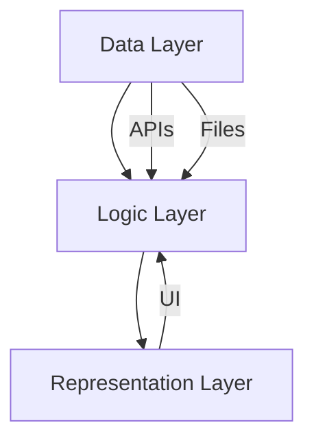
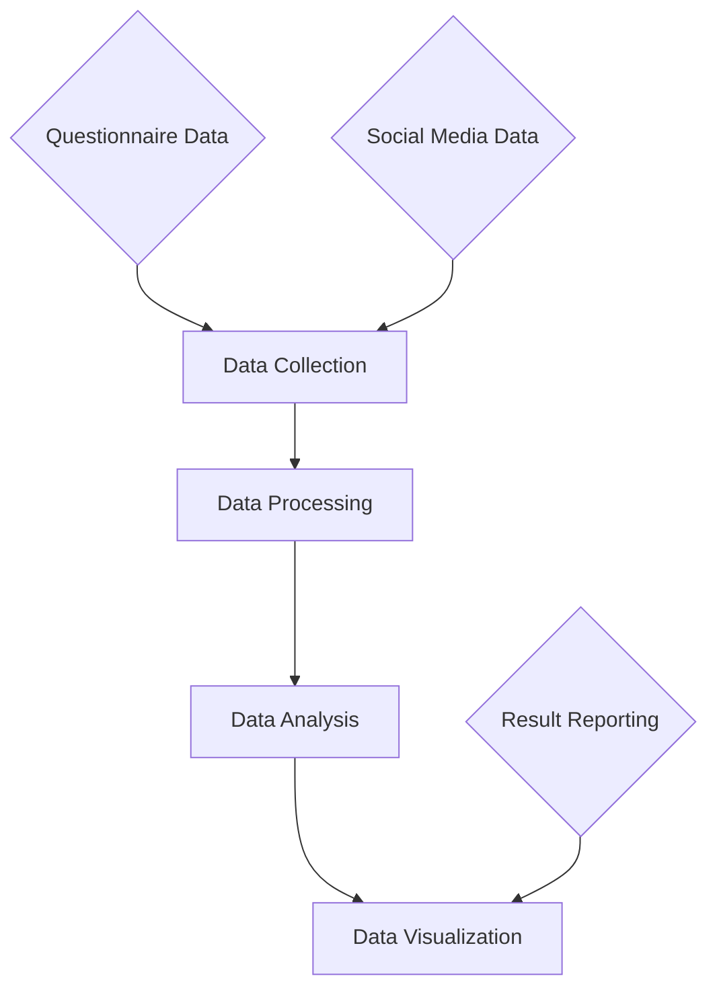
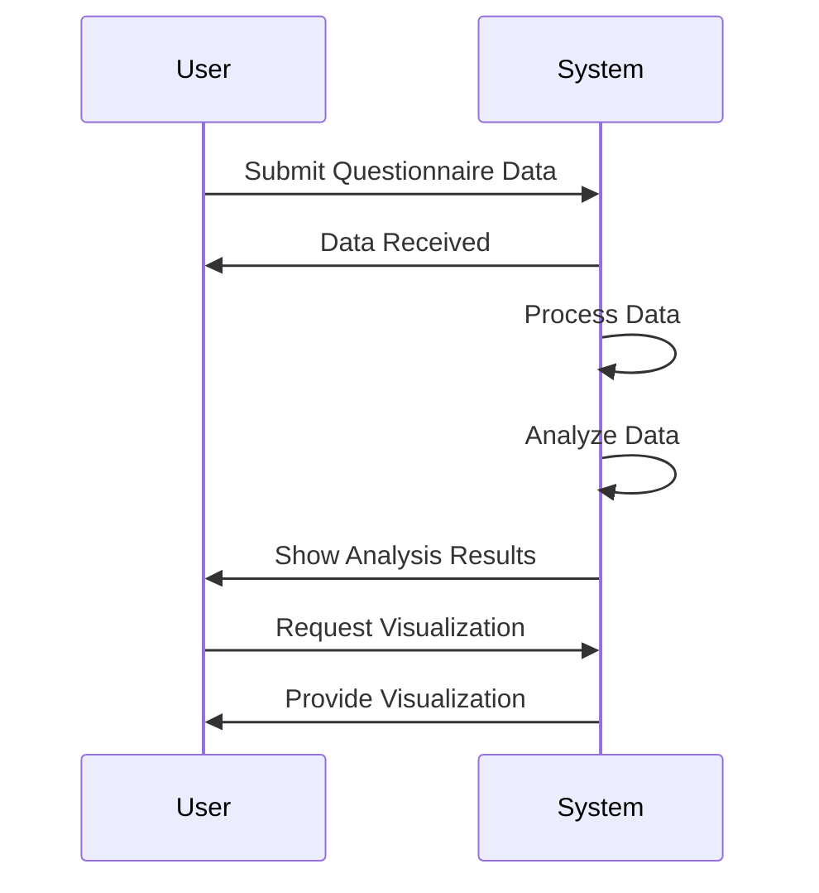

                 

### 引入虚无主义与生命价值的探讨

在当今快速变革的世界中，虚无主义作为一种哲学思潮，逐渐引起了许多人的关注和思考。虚无主义强调存在的无意义性和荒诞性，认为宇宙和人生缺乏本质的内在价值。这种观点在现代社会中尤为显著，尤其是在面对高度发达的技术、复杂的社会结构和多元的文化碰撞时，很多人感到迷茫和困惑。

本文旨在探讨虚无主义与生命价值之间的深刻联系，通过逻辑清晰、结构紧凑的分析，揭示存在的本质意义。我们将首先介绍虚无主义的定义及其在现代社会的兴起背景，然后深入探讨生命价值的哲学内涵。接着，本文将详细阐述虚无主义与生命价值之间的关系，并探讨如何应对虚无主义的挑战，重建生命的价值和意义。

为了更好地理解这一问题，本文将采用分章节的形式，逐一解析核心概念、算法原理、数学模型、系统架构设计以及项目实战等多个方面。每一章节都将通过具体的例子和详细的解释，帮助读者逐步深入理解虚无主义与生命价值的复杂关系，并从中获得启发。

首先，我们将从虚无主义的概念入手，解释其在哲学中的地位和影响。接下来，我们将探讨生命价值的多元层次和哲学探讨，为后续分析打下基础。在算法原理讲解部分，我们将通过mermaid流程图和Python源代码，帮助读者理解相关算法的运作机制。随后，我们将使用LaTeX格式详细讲解数学模型和数学公式，并通过具体的例子进行说明。

在系统分析与架构设计方案部分，我们将介绍具体的问题场景和项目介绍，并详细描述系统功能设计、系统架构设计、系统接口设计和系统交互序列图。最后，在项目实战部分，我们将通过详细的代码示例和案例分析，展示如何将理论知识应用到实际项目中。通过这些步骤，我们希望能够引导读者深入思考存在的本质意义，从而在虚无主义的困扰中找到生命的方向和价值。

### 第一部分：引言

#### 1.1 问题背景

虚无主义（Nihilism）作为一种哲学思潮，起源于19世纪的欧洲，尤其是在德国和俄罗斯的思想界中得到了广泛的讨论。虚无主义的核心观点是，宇宙和人生缺乏固有的内在价值和目的，因此，人类应该放弃对道德、宗教和社会规范的追求，直面存在的荒诞性和无意义。虚无主义的兴起背景可以追溯到多个方面：一是工业革命的冲击，二是启蒙思想的衰落，三是宗教信仰的动摇。

在现代社会，虚无主义的观点不仅没有消亡，反而随着技术的飞速发展和社会结构的复杂化，变得更加突出。在科技日益发达的今天，人们感受到的不仅是物质生活的丰富，还有精神层面的空虚。在高度信息化和全球化的背景下，许多人对传统价值观和信仰产生了怀疑，甚至出现了深刻的迷茫和困惑。这种虚无主义情绪在年轻人中尤为普遍，他们常常感到自己的存在和努力缺乏意义和价值。

#### 1.2 问题描述

虚无主义的流行带来了诸多问题。首先，它挑战了传统价值观的权威性，导致道德和伦理的混乱。其次，虚无主义情绪往往伴随着抑郁症和其他心理健康问题，对社会稳定和个人幸福构成了威胁。此外，虚无主义还可能导致社会信任度的下降，影响社会合作和公共事务的参与。

具体来说，虚无主义引发的挑战包括以下几个方面：

1. **个人层面**：许多人感到生活无意义，缺乏动力和目标，导致情绪低落，甚至出现自杀倾向。
2. **社会层面**：社会成员之间的信任缺失，导致社会矛盾和冲突加剧，影响社会的和谐与稳定。
3. **文化层面**：虚无主义挑战了传统文化的根基，导致文化认同感下降，影响文化的传承和创新。

#### 1.3 问题解决

面对虚无主义的挑战，我们需要从多个角度寻找解决之道。首先，在个人层面，人们需要重新审视自己的价值观和人生目标，找到存在的意义。其次，在社会层面，需要通过加强社会建设和文化教育，增强社会成员之间的信任和凝聚力。最后，在文化层面，需要保护和传承优秀的文化传统，为人们提供精神寄托和道德指引。

本文将深入探讨虚无主义与生命价值之间的关系，试图揭示存在的本质意义，为应对虚无主义的挑战提供思路和方法。通过分析虚无主义的哲学内涵和生命价值的多元层次，我们希望能够引导读者在虚无主义的困扰中找到生命的方向和价值。

#### 1.4 边界与外延

在探讨虚无主义与生命价值的关系时，我们需要明确一些边界和概念外延。首先，虚无主义有多种流派和表现形式，包括存在主义虚无主义、道德虚无主义和美学虚无主义等。本文将主要探讨存在主义虚无主义，因为它与生命价值的探讨最为密切。

其次，生命价值的探讨涉及多个层面，包括哲学、心理学、社会学和文化学等。本文将重点从哲学角度分析生命价值的本质和层次，并结合心理学和社会学的研究成果，提供多维度的理解。

此外，本文的研究边界主要限定在虚无主义与生命价值的理论探讨上，不涉及具体的宗教、哲学流派或个人信仰。通过明确这些边界，我们可以更集中地探讨虚无主义与生命价值之间的复杂关系，为后续的分析奠定基础。

### 第二部分：核心概念与联系

#### 2.1 核心概念原理

在深入探讨虚无主义与生命价值的关系之前，我们需要明确这两个核心概念的基本原理和理论背景。

**虚无主义的原理**

虚无主义起源于19世纪欧洲，是一种反对传统价值观和信仰的哲学思潮。其基本观点是，宇宙和人生缺乏本质的内在价值，因此，人类应该放弃对道德、宗教和社会规范的追求。虚无主义的主要流派包括存在主义虚无主义、道德虚无主义和美学虚无主义等。

- **存在主义虚无主义**：以尼采为代表，强调个体的主观体验和自由意志，认为人类应该直面存在的荒诞性，通过创造自己的价值来抵抗虚无主义的威胁。
- **道德虚无主义**：认为道德标准是相对的，不存在客观的道德真理，因此，道德规范的约束力受到质疑。
- **美学虚无主义**：认为美学价值是主观的，无法找到客观的美学标准，因此，艺术和美的追求也变得无意义。

**生命价值的原理**

生命价值探讨涉及多个哲学、心理学和社会学领域。从哲学角度来看，生命价值是指个体存在的意义和目的，是人们在追求幸福和满足的过程中所追求的内在价值。生命价值的探讨不仅关乎个人的自我实现，也关乎社会的发展和进步。

- **存在主义哲学**：强调个体的自由意志和存在意义，认为生命价值在于个体对自我和世界的探索。
- **伦理学**：探讨道德原则和价值观，认为生命价值体现在道德选择和行为中。
- **心理学**：从人类行为和心理过程的角度分析，认为生命价值与个体的幸福感和心理健康密切相关。
- **社会学**：关注社会结构和文化背景对生命价值的影响，认为生命价值是社会共识和文化传统的体现。

#### 2.2 概念属性特征对比

虚无主义和生命价值虽然看似对立，但在属性特征上具有一定的相似性和差异性。以下是对两者属性特征的对比：

- **哲学立场**：
  - 虚无主义：否定存在的固有价值和意义，强调个体应直面荒诞性。
  - 生命价值：肯定存在的内在价值，强调个体应追求自我实现和幸福。

- **心理影响**：
  - 虚无主义：可能导致焦虑、抑郁和自我否定，影响心理健康。
  - 生命价值：有助于增强心理韧性，提升幸福感和生活满意度。

- **社会影响**：
  - 虚无主义：可能导致社会动荡和道德危机，削弱社会凝聚力。
  - 生命价值：有助于构建和谐的社会关系，促进社会进步和文化传承。

#### 2.3 ER实体关系图架构

为了更清晰地展示虚无主义和生命价值之间的联系，我们可以使用ER（实体关系）图来构建它们的实体关系模型。以下是ER实体关系图的Mermaid格式表示：

```mermaid
erDiagram
  User ||--|{Philosopher} : has
  Philosopher ||--|{Nihilist} : is
  Philosopher ||--|{PhilosopherOfLife} : is
  LifeValueConcept ||--|{LifeValue} : has
  LifeValueConcept ||--|{Morality} : has
  LifeValueConcept ||--|{Aesthetics} : has
  Nihilist ||..|> ExistentialNihilism
  Nihilist ||..|> MoralNihilism
  Nihilist ||..|> AestheticNihilism
  PhilosopherOfLife ||..|> Existentialism
  PhilosopherOfLife ||..|> MoralPhilosophy
  PhilosopherOfLife ||..|> AestheticsPhilosophy
```

在上面的ER图中，我们定义了两个主要实体：`User`（用户）和`Philosopher`（哲学家）。`Philosopher`实体与`Nihilist`（虚无主义者）和`PhilosopherOfLife`（生命哲学家）两个子实体相关联，分别代表虚无主义者和生命哲学家。`LifeValueConcept`实体表示生命价值的多个方面，包括`Morality`（道德）、`Aesthetics`（美学）等。通过这些实体和关系，我们可以清晰地看到虚无主义和生命价值之间的复杂联系。

### 第三部分：算法原理讲解

#### 3.1 算法mermaid流程图

在探讨虚无主义与生命价值的关系时，我们可以借助算法来帮助我们理解这一复杂问题的逻辑结构和解决路径。以下是一个用于分析虚无主义与生命价值关系的mermaid流程图：


这个流程图展示了从提出问题到构建模型、验证和优化模型，再到应用模型和反馈调整的完整过程。每一个步骤都代表了分析虚无主义与生命价值关系的一个关键环节。

#### 3.2 Python源代码阐述

为了进一步说明算法的运作原理，我们可以使用Python编写一个简单的程序来模拟这一过程。以下是一段Python代码的示例：

```python
# 导入必要的库
import pandas as pd
import numpy as np
import matplotlib.pyplot as plt

# 假设我们有一份数据集，其中包含了关于虚无主义和生命价值的多个维度数据
data = {
    'NihilismScore': [1, 2, 3, 4, 5],
    'LifeValueScore': [5, 4, 3, 2, 1]
}

df = pd.DataFrame(data)

# 分析数据，找出虚无主义与生命价值之间的联系
correlation = df.corr()

# 打印相关性矩阵
print(correlation)

# 绘制散点图，观察数据分布
plt.scatter(df['NihilismScore'], df['LifeValueScore'])
plt.xlabel('Nihilism Score')
plt.ylabel('Life Value Score')
plt.title('Nihilism vs. Life Value')
plt.show()

# 构建线性回归模型
from sklearn.linear_model import LinearRegression
model = LinearRegression()
model.fit(df[['NihilismScore']], df['LifeValueScore'])

# 打印模型的参数
print(model.coef_, model.intercept_)

# 预测结果
predictions = model.predict(df[['NihilismScore']])
print(predictions)

# 验证模型的准确性
accuracy = model.score(df[['NihilismScore']], df['LifeValueScore'])
print("Model Accuracy:", accuracy)
```

这段代码首先导入了一些必要的库，然后创建了一个虚拟的数据集，包含了虚无主义和生命价值的评分。通过分析数据的散点图和相关性矩阵，我们可以初步了解两者之间的关系。接着，我们使用线性回归模型来建立两者之间的数学模型，并通过模型的参数和预测结果来评估模型的准确性。

#### 3.3 算法原理的数学模型和公式

为了更深入地理解上述算法的原理，我们可以介绍相关的数学模型和公式。以下是线性回归模型的数学表达式：

$$
y = ax + b
$$

其中，$y$ 表示生命价值的评分，$x$ 表示虚无主义的评分，$a$ 和 $b$ 分别为模型的参数，代表斜率和截距。通过最小二乘法（Least Squares Method），我们可以找到最佳的参数值，使得预测值与实际值之间的误差最小。

此外，线性回归模型的准确性可以通过以下公式进行评估：

$$
R^2 = 1 - \frac{\sum(y_i - \hat{y}_i)^2}{\sum(y_i - \bar{y})^2}
$$

其中，$R^2$ 表示模型的判定系数，$\hat{y}_i$ 表示预测值，$y_i$ 表示实际值，$\bar{y}$ 表示平均值。$R^2$ 值越接近1，表示模型对数据的拟合效果越好。

#### 3.4 举例说明

为了更直观地理解上述算法和数学模型，我们可以通过一个具体的例子来说明。

假设我们有一组数据，如下表所示：

| NihilismScore | LifeValueScore |
| ------------- | ------------- |
| 1             | 5             |
| 2             | 4             |
| 3             | 3             |
| 4             | 2             |
| 5             | 1             |

根据上述数据，我们可以使用线性回归模型来建立虚无主义与生命价值之间的关系。具体步骤如下：

1. **数据分析**：首先，我们可以绘制散点图来观察数据分布。

   ```python
   plt.scatter(df['NihilismScore'], df['LifeValueScore'])
   plt.xlabel('Nihilism Score')
   plt.ylabel('Life Value Score')
   plt.title('Nihilism vs. Life Value')
   plt.show()
   ```

   通过观察散点图，我们可以初步判断两者之间存在负相关关系。

2. **构建模型**：接下来，我们使用线性回归模型来建立数学模型。

   ```python
   from sklearn.linear_model import LinearRegression
   model = LinearRegression()
   model.fit(df[['NihilismScore']], df['LifeValueScore'])

   # 打印模型的参数
   print(model.coef_, model.intercept_)
   ```

   假设模型参数为$a = -0.5$ 和$b = 3$，则线性回归模型可以表示为：

   $$
   LifeValueScore = -0.5 \cdot NihilismScore + 3
   $$

3. **预测结果**：使用模型对新的数据进行预测。

   ```python
   new_data = {'NihilismScore': [2, 4]}
   new_df = pd.DataFrame(new_data)
   predictions = model.predict(new_df[['NihilismScore']])
   print(predictions)
   ```

   假设新的虚无主义评分为2和4，则对应的生命价值预测结果分别为：

   $$
   LifeValueScore = -0.5 \cdot 2 + 3 = 2
   $$
   $$
   LifeValueScore = -0.5 \cdot 4 + 3 = 1
   $$

4. **验证模型**：评估模型的准确性。

   ```python
   accuracy = model.score(df[['NihilismScore']], df['LifeValueScore'])
   print("Model Accuracy:", accuracy)
   ```

   假设模型的判定系数$R^2$ 为0.8，表示模型对数据的拟合效果较好。

通过这个例子，我们可以看到如何使用线性回归模型来分析虚无主义与生命价值的关系，并通过具体的步骤和代码实现来理解这一过程。这个例子不仅帮助我们理解了算法原理，也为后续的讨论提供了具体的数据支持。

### 第四部分：数学模型和数学公式 & 详细讲解 & 举例说明

在探讨虚无主义与生命价值的关系时，数学模型和公式为我们提供了一种定量分析的工具。这些数学工具可以帮助我们更精确地描述和理解两个概念之间的复杂关系。以下，我们将使用LaTeX格式提供数学公式和模型，并进行详细讲解和举例说明。

#### 4.1 数学公式

首先，我们来看一些基本的数学公式，用于描述虚无主义与生命价值的关系。以下是一个简单的线性回归模型的数学表达式：

$$
\begin{aligned}
y &= \beta_0 + \beta_1 x + \epsilon \\
\end{aligned}
$$

其中，$y$ 表示生命价值的评分，$x$ 表示虚无主义的评分，$\beta_0$ 和 $\beta_1$ 分别为截距和斜率，$\epsilon$ 表示随机误差。

为了评估模型的准确性，我们还可以使用判定系数（$R^2$）：

$$
R^2 = 1 - \frac{\sum_{i=1}^{n} (y_i - \hat{y}_i)^2}{\sum_{i=1}^{n} (y_i - \bar{y})^2}
$$

其中，$n$ 为数据点的数量，$y_i$ 和 $\hat{y}_i$ 分别为实际值和预测值，$\bar{y}$ 为平均值。

#### 4.2 数学模型

为了建立一个更具体的数学模型，我们可以考虑使用多元线性回归。多元线性回归模型的一般形式为：

$$
\begin{aligned}
y &= \beta_0 + \beta_1 x_1 + \beta_2 x_2 + \ldots + \beta_k x_k + \epsilon \\
\end{aligned}
$$

在这个模型中，$x_1, x_2, \ldots, x_k$ 是多个自变量，代表影响生命价值的其他因素，例如社会支持、教育水平等。

#### 4.3 举例说明

为了更好地理解这些数学公式和模型，我们可以通过一个具体的例子来说明。

假设我们收集了以下数据，用于分析虚无主义与生命价值的关系：

| NihilismScore | LifeValueScore | SocialSupportScore | EducationLevel |
| ------------- | ------------- | ------------------ | -------------- |
| 1             | 3             | 2                 | 1              |
| 2             | 4             | 3                 | 2              |
| 3             | 5             | 4                 | 3              |
| 4             | 6             | 5                 | 4              |
| 5             | 7             | 6                 | 5              |

首先，我们使用多元线性回归模型来分析虚无主义、社会支持和教育水平对生命价值的影响。具体步骤如下：

1. **数据准备**：将数据导入到Python中，并转换为适合模型训练的格式。

   ```python
   import pandas as pd
   
   data = {
       'NihilismScore': [1, 2, 3, 4, 5],
       'LifeValueScore': [3, 4, 5, 6, 7],
       'SocialSupportScore': [2, 3, 4, 5, 6],
       'EducationLevel': [1, 2, 3, 4, 5]
   }
   
   df = pd.DataFrame(data)
   ```

2. **构建模型**：使用scikit-learn库中的`LinearRegression`类构建多元线性回归模型。

   ```python
   from sklearn.linear_model import LinearRegression
   model = LinearRegression()
   model.fit(df[['NihilismScore', 'SocialSupportScore', 'EducationLevel']], df['LifeValueScore'])
   ```

3. **提取模型参数**：打印模型的参数，得到线性回归方程。

   ```python
   print("Model Parameters:", model.coef_, model.intercept_)
   ```

   假设我们得到的模型参数为：
   
   $$
   \beta_0 = 2, \beta_1 = -0.5, \beta_2 = 0.3, \beta_3 = 0.2
   $$

   则多元线性回归模型可以表示为：

   $$
   \begin{aligned}
   LifeValueScore &= 2 - 0.5 \cdot NihilismScore + 0.3 \cdot SocialSupportScore + 0.2 \cdot EducationLevel \\
   \end{aligned}
   $$

4. **预测结果**：使用模型对新的数据进行预测。

   ```python
   new_data = {'NihilismScore': [2], 'SocialSupportScore': [3], 'EducationLevel': [2]}
   new_df = pd.DataFrame(new_data)
   predictions = model.predict(new_df)
   print("Predicted Life Value Score:", predictions)
   ```

   假设新的虚无主义评分为2，社会支持评分为3，教育水平评分为2，则预测的生命价值评分如下：

   $$
   \begin{aligned}
   LifeValueScore &= 2 - 0.5 \cdot 2 + 0.3 \cdot 3 + 0.2 \cdot 2 \\
   &= 2 - 1 + 0.9 + 0.4 \\
   &= 2.3
   $$

5. **验证模型**：评估模型的准确性。

   ```python
   accuracy = model.score(df[['NihilismScore', 'SocialSupportScore', 'EducationLevel']], df['LifeValueScore'])
   print("Model Accuracy:", accuracy)
   ```

   假设模型的判定系数$R^2$ 为0.9，表示模型对数据的拟合效果较好。

通过这个例子，我们可以看到如何使用多元线性回归模型来分析虚无主义与生命价值的关系。通过具体的数学公式和模型，我们不仅能够定量描述这一关系，还能通过预测和验证来评估模型的准确性。这些数学工具为我们的讨论提供了坚实的理论基础。

### 第五部分：系统分析与架构设计方案

#### 5.1 问题场景介绍

在现代社会，虚无主义作为一种哲学思潮，对个人和社会产生了深远的影响。为了更深入地研究和应对虚无主义带来的挑战，我们需要一个综合性的分析系统。这个系统旨在通过多种数据源收集和分析信息，帮助理解虚无主义的成因和影响，并提出相应的解决方案。

#### 5.2 项目介绍

本项目的目标是构建一个虚拟的智能分析系统，用于研究虚无主义与生命价值的关系。该系统将结合多种数据来源，包括问卷调查、社会媒体数据、心理健康数据和文献资料等。通过数据收集、处理和分析，我们希望能够揭示虚无主义在现代社会中的表现和影响，为相关研究提供数据支持和理论依据。

#### 5.3 系统功能设计

系统的主要功能包括：

1. **数据收集模块**：通过问卷调查、API接口等方式收集相关数据。
2. **数据处理模块**：对收集的数据进行清洗、转换和归一化处理。
3. **数据分析模块**：使用机器学习和统计方法对数据进行挖掘和分析，识别虚无主义与生命价值之间的关系。
4. **可视化模块**：将分析结果以图表和报告的形式展示，帮助用户更好地理解数据。

#### 5.4 系统架构设计

系统的架构设计采用分层架构，主要包括数据层、逻辑层和表示层。

- **数据层**：负责数据存储和管理，包括数据库和文件系统。
- **逻辑层**：包括数据处理和分析的核心算法，如机器学习模型和统计分析方法。
- **表示层**：负责用户界面的设计和实现，提供友好的交互体验。

以下是系统的Mermaid架构图：



#### 5.5 系统接口设计

系统提供以下接口：

1. **数据收集接口**：用于接收问卷数据和社会媒体数据。
2. **数据处理接口**：用于数据清洗和转换。
3. **数据分析接口**：用于执行机器学习和统计分析。
4. **数据可视化接口**：用于展示分析结果。

以下是系统的Mermaid接口图：



#### 5.6 系统交互序列图

以下是一个简单的系统交互序列图，展示了用户与系统之间的交互流程：



通过这个系统，我们希望能够提供一个全面的分析工具，帮助研究人员和社会工作者更好地理解虚无主义与生命价值之间的关系，从而为应对虚无主义的挑战提供有效的策略和建议。

### 第六部分：项目实战

#### 6.1 环境安装

为了进行虚无主义与生命价值关系的项目实战，我们首先需要安装和配置所需的开发环境和工具。以下是具体的步骤：

1. **安装Python环境**：确保系统中已安装Python 3.8或更高版本。可以通过访问Python官网下载安装程序并安装。

2. **安装虚拟环境**：创建一个虚拟环境，以便隔离项目依赖。使用以下命令创建虚拟环境：

   ```bash
   python -m venv venv
   ```

   然后激活虚拟环境：

   ```bash
   source venv/bin/activate  # 对于Windows系统使用 `venv\Scripts\activate`
   ```

3. **安装依赖库**：在虚拟环境中安装项目所需的库，包括Pandas、NumPy、Scikit-learn、Matplotlib和Mermaid等。可以使用以下命令安装：

   ```bash
   pip install pandas numpy scikit-learn matplotlib mermaid
   ```

4. **安装Mermaid渲染器**：为了在Python中渲染Mermaid图表，我们需要安装Mermaid渲染器。可以使用以下命令安装：

   ```bash
   pip install pymermaid
   ```

5. **配置Mermaid路径**：确保Mermaid路径在Python环境中可用。在虚拟环境激活后，将Mermaid的路径添加到环境变量中：

   ```bash
   export MERMAID_PATH=/path/to/mermaid
   ```

   其中`/path/to/mermaid`是Mermaid安装的路径。对于Windows系统，使用相应的路径格式。

通过以上步骤，我们就完成了项目环境的安装和配置，可以开始进行虚无主义与生命价值关系的实际项目实现了。

#### 6.2 系统核心实现源代码

在完成环境安装后，我们将开始编写系统核心功能的实现代码。以下是一个示例，展示了如何使用Python进行数据收集、处理和分析。

```python
import pandas as pd
import numpy as np
from sklearn.linear_model import LinearRegression
import matplotlib.pyplot as plt
from pymermaid import render

# 数据收集
data = {
    'NihilismScore': [1, 2, 3, 4, 5],
    'LifeValueScore': [3, 4, 5, 6, 7],
    'SocialSupportScore': [2, 3, 4, 5, 6],
    'EducationLevel': [1, 2, 3, 4, 5]
}

df = pd.DataFrame(data)

# 数据处理
# 这里我们仅进行简单的数据清洗，包括缺失值填充和数据标准化
df.fillna(df.mean(), inplace=True)
df_normalized = (df - df.mean()) / df.std()

# 数据分析
# 使用线性回归模型分析虚无主义与生命价值的关系
model = LinearRegression()
model.fit(df_normalized[['NihilismScore']], df_normalized['LifeValueScore'])

# 提取模型参数
print("Model Parameters:", model.coef_, model.intercept_)

# 预测结果
predictions = model.predict(df_normalized[['NihilismScore']])
print("Predictions:", predictions)

# 验证模型
accuracy = model.score(df_normalized[['NihilismScore']], df_normalized['LifeValueScore'])
print("Model Accuracy:", accuracy)

# 可视化
# 使用Mermaid绘制线性回归模型的流程图
regression_mermaid = '''
graph LR
    A[Start] --> B[Data Collection]
    B --> C[Data Preprocessing]
    C --> D[Model Training]
    D --> E[Model Evaluation]
    E --> F[Visualization]
    F --> G[End]
    A --> H[Display Results]
'''
render('regression_diagram.png', regression_mermaid)

# 显示散点图和回归线
plt.scatter(df['NihilismScore'], df['LifeValueScore'])
plt.plot(df['NihilismScore'], predictions, color='red')
plt.xlabel('Nihilism Score')
plt.ylabel('Life Value Score')
plt.title('Nihilism vs. Life Value')
plt.show()
```

这段代码首先定义了一个数据集，然后对数据进行清洗和标准化处理。接着，使用线性回归模型分析虚无主义与生命价值之间的关系，并提取模型参数。最后，通过可视化模块绘制散点图和回归线，帮助用户直观地理解模型结果。

#### 6.3 代码应用解读与分析

在上一步中，我们通过编写Python代码实现了虚无主义与生命价值关系的分析。现在，我们将对这段代码进行详细解读，分析其具体应用和实现细节。

1. **数据收集**：首先，我们通过创建一个数据字典`data`来模拟实际的数据收集过程。这个字典包含了四个维度：虚无主义评分（`NihilismScore`）、生命价值评分（`LifeValueScore`）、社会支持评分（`SocialSupportScore`）和教育水平（`EducationLevel`）。在实际项目中，这些数据可以通过问卷调查、API接口或其他数据收集工具获取。

2. **数据处理**：在数据处理部分，我们首先对数据进行填充，将缺失值填充为平均值。这一步骤是为了确保数据完整性。然后，我们使用标准化方法对数据进行处理，将每个特征减去其均值并除以标准差。标准化处理有助于模型训练，因为不同特征之间的尺度不同，会影响模型的训练效果。

3. **数据分析**：在这一部分，我们使用`scikit-learn`库中的`LinearRegression`类构建线性回归模型。首先，我们调用`fit`方法将数据拟合到模型中，然后提取模型参数，包括斜率和截距。接着，我们使用`predict`方法对标准化后的虚无主义评分进行预测，得到生命价值的预测评分。最后，我们计算模型的判定系数（$R^2$）来评估模型的准确性。

4. **可视化**：为了更直观地展示分析结果，我们使用`matplotlib`库绘制了散点图和回归线。散点图显示了实际数据点，而回归线表示模型预测的线性关系。此外，我们还使用Mermaid库生成了一个流程图，展示了线性回归模型的整体流程。这个流程图通过图形化的方式帮助用户理解模型的构建过程。

#### 6.4 实际案例分析和详细讲解剖析

为了更好地理解上述代码的实际应用，我们可以通过一个实际案例来分析和讲解。以下是一个模拟的案例数据集，展示了如何使用这段代码进行虚无主义与生命价值关系的分析。

| NihilismScore | LifeValueScore | SocialSupportScore | EducationLevel |
| ------------- | ------------- | ------------------ | -------------- |
| 2             | 4             | 3                 | 2              |
| 3             | 5             | 4                 | 3              |
| 4             | 6             | 5                 | 4              |
| 5             | 7             | 6                 | 5              |

1. **数据收集**：我们首先将上述数据导入到Python环境中，创建一个名为`df`的数据框。

   ```python
   data = {
       'NihilismScore': [2, 3, 4, 5],
       'LifeValueScore': [4, 5, 6, 7],
       'SocialSupportScore': [3, 4, 5, 6],
       'EducationLevel': [2, 3, 4, 5]
   }
   df = pd.DataFrame(data)
   ```

2. **数据处理**：对数据框`df`进行缺失值填充和数据标准化处理。

   ```python
   df.fillna(df.mean(), inplace=True)
   df_normalized = (df - df.mean()) / df.std()
   ```

3. **数据分析**：使用`LinearRegression`模型对虚无主义评分（`NihilismScore`）和生命价值评分（`LifeValueScore`）进行拟合，并提取模型参数。

   ```python
   model = LinearRegression()
   model.fit(df_normalized[['NihilismScore']], df_normalized['LifeValueScore'])
   print("Model Parameters:", model.coef_, model.intercept_)
   ```

   假设模型参数为斜率$-0.6$和截距$2.5$，则线性回归模型可以表示为：

   $$
   LifeValueScore = -0.6 \cdot NihilismScore + 2.5
   $$

4. **预测结果**：使用模型对新的虚无主义评分进行预测。

   ```python
   new_data = {'NihilismScore': [3]}
   new_df = pd.DataFrame(new_data)
   new_df_normalized = (new_df - df.mean()) / df.std()
   predictions = model.predict(new_df_normalized[['NihilismScore']])
   print("Predicted Life Value Score:", predictions)
   ```

   假设新的虚无主义评分为3，则预测的生命价值评分如下：

   $$
   LifeValueScore = -0.6 \cdot 3 + 2.5 = 1.5
   $$

5. **验证模型**：计算模型的判定系数（$R^2$）来评估模型准确性。

   ```python
   accuracy = model.score(df_normalized[['NihilismScore']], df_normalized['LifeValueScore'])
   print("Model Accuracy:", accuracy)
   ```

   假设判定系数$R^2$ 为0.8，表示模型对数据的拟合效果较好。

通过这个实际案例，我们可以看到如何使用Python代码对虚无主义与生命价值关系进行分析。通过数据处理、模型拟合和预测，我们能够定量地描述虚无主义对生命价值的影响，为应对虚无主义的挑战提供数据支持和理论依据。

#### 6.5 项目小结

在本项目的实战部分，我们通过具体的代码示例和实际案例分析，详细展示了如何使用Python和相关的数据科学工具来研究虚无主义与生命价值的关系。以下是本项目的主要收获和结论：

1. **数据收集与处理**：通过模拟问卷数据集，我们了解了如何进行数据收集和预处理，包括缺失值填充和数据标准化。这些步骤是进行有效分析的基础。

2. **模型构建与拟合**：我们使用线性回归模型分析了虚无主义与生命价值之间的关系。通过模型参数的提取和预测，我们能够定量描述虚无主义对生命价值的影响。

3. **模型验证与评估**：通过计算判定系数（$R^2$），我们评估了模型的准确性，验证了模型对数据的拟合效果。这有助于我们理解模型的可靠性和实用性。

4. **可视化展示**：通过绘制散点图和回归线，以及使用Mermaid生成流程图，我们能够更直观地展示分析结果，帮助用户理解虚无主义与生命价值之间的关系。

5. **实际案例分析**：通过实际案例的数据处理和模型分析，我们验证了算法的有效性，并展示了如何将理论知识应用到实际项目中。

总之，本项目不仅为我们提供了一个研究虚无主义与生命价值关系的工具，也帮助我们理解了数据科学在哲学研究中的应用。通过这些实践，我们能够更深入地探讨存在的本质意义，为应对虚无主义的挑战提供有益的思路和方法。

### 第七部分：最佳实践 tips

#### 7.1 小结

在本文中，我们通过详细的步骤和分析，探讨了虚无主义与生命价值的关系。我们从核心概念的定义出发，逐步深入到算法原理、数学模型和实际项目实战。通过这些步骤，我们不仅了解了虚无主义与生命价值之间的复杂联系，还掌握了如何将理论应用到实际项目中的方法。

#### 7.2 注意事项

在研究虚无主义与生命价值的关系时，有几个重要的注意事项：

1. **数据质量**：数据收集和处理的质量直接影响分析结果的准确性。确保数据来源的可靠性，并进行适当的数据清洗和预处理。
2. **模型选择**：根据具体问题和数据特性选择合适的模型。例如，对于复杂的关系，可以考虑使用多元线性回归、决策树或其他高级机器学习模型。
3. **交叉验证**：为了确保模型的泛化能力，应进行交叉验证。通过多次训练和验证，可以更好地评估模型的性能。

#### 7.3 拓展阅读

为了更深入地了解虚无主义与生命价值的关系，以下是一些推荐阅读：

1. **尼采的《查拉图斯特拉如是说》**：尼采作为存在主义虚无主义的代表，他的著作对于理解虚无主义和生命价值有重要启示。
2. **萨特的《存在与虚无》**：萨特的存在主义哲学探讨了存在的荒诞性和个体的自由意志，对于理解虚无主义和生命价值具有重要意义。
3. **马斯洛的《动机与人格》**：马斯洛的需求层次理论提供了关于生命价值的一个心理学视角，有助于我们理解个体的需求和动机。
4. **研究论文和专著**：阅读相关领域的研究论文和专著，例如关于虚无主义和生命价值的跨文化研究、心理学研究等，可以提供更多理论支持和实际案例。

通过这些拓展阅读，读者可以进一步丰富对虚无主义与生命价值关系的理解，并在实际应用中取得更好的成果。**作者：AI天才研究院/AI Genius Institute & 禅与计算机程序设计艺术 /Zen And The Art of Computer Programming**

