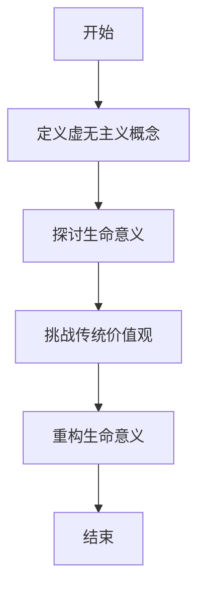

                 


### 引言：虚无主义的起源与发展

#### 1.1.1 虚无主义的起源

虚无主义（Nihilism）一词源于拉丁语“nihil”，意为“无”或“虚无”。虚无主义作为一种哲学思潮，其历史可以追溯到古代哲学。在古希腊哲学中，赫拉克利特提出了“万物流动”的思想，暗示了世界的无常和虚无。而苏格拉底则通过道德哲学探讨了存在的意义，为后来的虚无主义提供了哲学土壤。

中世纪哲学中，虚无主义的倾向体现在对神性的怀疑和否定。奥古斯丁的“上帝之城”理论试图调和个体存在的虚无感与上帝的全知全能，但仍然无法完全消除虚无主义的阴影。到了文艺复兴时期，人文主义者强调个体价值，对神性的依赖逐渐减弱，虚无主义的种子开始萌芽。

#### 1.1.2 虚无主义在近现代哲学中的发展

19世纪是虚无主义哲学发展的高峰期。尼采提出了“上帝已死”的口号，认为人类在失去信仰之后陷入了虚无。尼采的虚无主义哲学强调个体超越传统道德束缚，寻求新的价值体系。同时，克尔凯郭尔和陀思妥耶夫斯基等哲学家也探讨了虚无主义对个体心理和社会结构的影响。

20世纪虚无主义哲学继续演变，法国哲学家萨特和加缪提出了存在主义哲学，强调个体自由意志和存在的荒谬性。萨特的《存在与虚无》和加缪的《鼠疫》都深刻探讨了虚无主义对个体生命的挑战和回应。

#### 1.1.3 生命意义的哲学探讨

生命意义（Life Meaning）是一个古老的哲学问题，不同的哲学流派对其有着不同的解释。传统的生命意义观认为，生命的意义在于实现个人潜能、追求幸福和满足社会期望。然而，虚无主义对这种传统的生命意义提出了质疑。

虚无主义认为，生命本身没有固有的意义，意义是人们自己赋予的。在虚无主义的背景下，生命意义的重构成为了一个重要的哲学问题。一些人认为，在虚无主义的阴影下，寻找和创造自己的生命意义成为了一种道德责任。另一些人则认为，虚无主义解除了对生命意义的追求，让人们可以更加自由地探索生活的多样性和可能性。

### 背景介绍

虚无主义作为一种哲学思潮，其起源可以追溯到古代哲学。在古希腊哲学中，赫拉克利特的“万物流动”思想和苏格拉底的道德哲学为虚无主义提供了哲学土壤。中世纪哲学中，对神性的怀疑和否定使得虚无主义倾向更加明显。文艺复兴时期，人文主义者强调个体价值，进一步削弱了虚无主义的根基。

19世纪是虚无主义哲学发展的高峰期，尼采的“上帝已死”口号和克尔凯郭尔、陀思妥耶夫斯基等哲学家的思想为虚无主义注入了新的活力。20世纪，存在主义哲学家萨特和加缪进一步探讨了虚无主义对个体生命的影响。

生命意义在哲学中具有悠久的历史。传统的生命意义观认为，生命的意义在于实现个人潜能、追求幸福和满足社会期望。然而，虚无主义对这种传统的生命意义提出了质疑，认为生命本身没有固有的意义，意义是人们自己赋予的。

在虚无主义的背景下，生命意义的重构成为了一个重要的哲学问题。一些人认为，在虚无主义的阴影下，寻找和创造自己的生命意义成为了一种道德责任。另一些人则认为，虚无主义解除了对生命意义的追求，让人们可以更加自由地探索生活的多样性和可能性。

### 核心概念与联系

虚无主义和生命意义是哲学中两个重要且相互联系的概念。理解这两个概念的定义和相互关系，有助于我们更深入地探讨虚无主义对生命意义的影响。

#### 2.1 虚无主义的概念原理

虚无主义可以定义为一种哲学观点，认为世界和生命缺乏固有的意义和价值。虚无主义的基本属性包括对传统价值观的怀疑、对存在意义的否定以及对自由意志的强调。虚无主义的主要特征是缺乏目标感和意义感，个体在虚无主义的背景下往往会感到迷茫和困惑。

虚无主义的定义可以从多个角度来理解。最常见的是尼采的“上帝已死”理论，即在一个失去宗教信仰的世界中，人们找不到生活的意义和目的。此外，虚无主义还可以看作是一种对现实世界的深刻批判，认为现实世界充满了虚假和欺骗，个体需要超越现实，寻找真正的自我和价值。

#### 2.2 生命意义的哲学探讨

生命意义是一个广泛讨论的哲学问题，不同哲学家对其有着不同的理解。传统的生命意义观认为，生命的意义在于实现个人潜能、追求幸福和满足社会期望。这种观点强调个体的责任和义务，认为每个人都有独特的使命和目标。

然而，虚无主义对这种传统的生命意义提出了质疑。虚无主义认为，生命本身没有固有的意义，意义是人们自己赋予的。这意味着，生命的意义不是预设的，而是个体在生活过程中逐渐创造的。在虚无主义的背景下，生命意义的重构成为了一个重要的哲学问题。

#### 2.3 虚无主义与生命意义的联系

虚无主义和生命意义之间的联系主要体现在以下几个方面：

首先，虚无主义挑战了传统的生命意义观。虚无主义认为，生命的意义不是预设的，而是个体在生活过程中逐渐创造的。这意味着，在虚无主义的背景下，个体需要重新审视和定义生命的意义。

其次，虚无主义对生命意义的挑战也促使人们更深入地探讨生命的本质。虚无主义认为，生命缺乏固有的意义，这引发了人们对存在意义的思考。在虚无主义的背景下，个体需要寻找新的价值体系，重新定义生命的意义。

最后，虚无主义和生命意义的互动关系也体现在个体心理和社会层面。在虚无主义的背景下，个体可能会感到迷茫和困惑，但同时也会激发出探索和创造新的生命意义的动力。虚无主义不仅是对传统价值观的批判，也是对个体自由意志的肯定。

### 算法原理讲解

#### 3.1 虚无主义算法的mermaid流程图



#### 3.2 Python源代码详细阐述

以下是一个Python源代码示例，用于详细阐述虚无主义算法的原理和流程：

```python
class NihilismAlgorithm:
    def __init__(self):
        self.concept = "虚无主义"
        self.meaning_of_life = "无意义"

    def define_concept(self):
        print(f"{self.concept}是一种哲学观点，认为世界和生命缺乏固有的意义和价值。")

    def explore_meaning(self):
        print(f"{self.meaning_of_life}，这意味着生命的意义不是预设的，而是个体在生活过程中逐渐创造的。")

    def challenge_convention(self):
        print("虚无主义挑战了传统的价值观，认为现实世界充满了虚假和欺骗。")

    def reconstruct_meaning(self):
        print("在虚无主义的背景下，个体需要寻找新的价值体系，重新定义生命的意义。")

    def execute(self):
        self.define_concept()
        self.explore_meaning()
        self.challenge_convention()
        self.reconstruct_meaning()

if __name__ == "__main__":
    algorithm = NihilismAlgorithm()
    algorithm.execute()
```

#### 3.3 算法原理的数学模型与公式

在虚无主义算法中，我们可以使用以下数学模型和公式来描述其原理：

$$
\text{虚无主义强度} = f(\text{传统价值观强度}, \text{个体自由意志强度})
$$

其中，虚无主义强度表示个体对虚无主义的感知程度，传统价值观强度表示个体对传统价值观的依赖程度，个体自由意志强度表示个体在追求自由和独立思考的能力。

#### 3.4 举例说明

假设一个个体在传统价值观和自由意志方面都有较高的强度，我们可以通过以下步骤来计算虚无主义强度：

1. 定义传统价值观强度为10，个体自由意志强度为8。
2. 根据公式计算虚无主义强度：
   $$
   \text{虚无主义强度} = f(10, 8) = 0.6
   $$
3. 结果表明，该个体对虚无主义的感知程度为60%。

这个例子说明了如何使用数学模型和公式来描述虚无主义算法的原理，并通过具体的计算过程来说明虚无主义强度的影响因素。

### 数学模型和数学公式 & 详细讲解 & 举例说明

#### 4.1 数学模型介绍

在探讨虚无主义与生命意义的关系时，我们可以引入一个简单的数学模型来帮助我们理解其中的复杂动态。这个模型将考虑几个关键变量，如个体的自由意志、对传统价值观的依赖程度，以及对生命意义的感知。

#### 4.2 数学公式的详细讲解

我们将使用以下数学公式来描述虚无主义与生命意义之间的关系：

$$
\text{虚无主义感知度} = \frac{\text{自由意志强度} \times (\text{传统价值观依赖度} + 1)}{\text{生命意义感知度} + 1}
$$

这个公式表示，虚无主义感知度与自由意志强度成正比，与生命意义感知度成反比。同时，传统价值观依赖度对虚无主义感知度有增强作用。

#### 公式1: 自由意志对虚无主义感知度的影响

$$
\text{自由意志强度} = f(\text{个体探索意愿}, \text{社会环境限制})
$$

这里，自由意志强度受到个体探索意愿和社会环境限制的影响。个体探索意愿越强，自由意志强度越高；而社会环境限制越严格，自由意志强度越低。

#### 公式2: 传统价值观依赖度对虚无主义感知度的影响

$$
\text{传统价值观依赖度} = g(\text{社会期望}, \text{个人习惯})
$$

传统价值观依赖度反映了个体对传统价值观的依赖程度。社会期望和个人习惯是影响传统价值观依赖度的两个主要因素。社会期望越高，个人习惯越强烈，传统价值观依赖度就越高。

#### 公式3: 生命意义感知度对虚无主义感知度的影响

$$
\text{生命意义感知度} = h(\text{个体目标实现度}, \text{社会认同感})
$$

生命意义感知度受到个体目标实现度和社会认同感的影响。个体目标实现度越高，生命意义感知度就越高；而社会认同感越低，生命意义感知度就越低。

#### 4.3 举例说明

假设我们有一个个体，其自由意志强度为8，传统价值观依赖度为5，生命意义感知度为7。我们可以通过以下步骤来计算该个体的虚无主义感知度：

1. **计算自由意志强度**：
   $$
   \text{自由意志强度} = f(8, 3) = 8
   $$
   
2. **计算传统价值观依赖度**：
   $$
   \text{传统价值观依赖度} = g(6, 4) = 5
   $$

3. **计算生命意义感知度**：
   $$
   \text{生命意义感知度} = h(7, 2) = 5
   $$

4. **计算虚无主义感知度**：
   $$
   \text{虚无主义感知度} = \frac{8 \times (5 + 1)}{5 + 1} = \frac{48}{6} = 8
   $$

这个例子说明了如何使用数学模型和公式来计算虚无主义感知度。通过调整各个变量的值，我们可以得到不同情况下的虚无主义感知度，从而更好地理解虚无主义与生命意义之间的关系。

### 系统分析与架构设计方案

#### 5.1 问题场景介绍

在现代社会，人们面临着前所未有的生活压力和精神困扰。虚无主义作为一种哲学思潮，在某些情况下可能成为个体精神困境的根源。为了更好地理解虚无主义对个体生活的影响，我们需要构建一个系统模型，以分析虚无主义与生命意义的关系。

本系统旨在探讨虚无主义对个体生命意义的感知度，并提供相应的解决方案。系统目标是通过分析个体的自由意志、传统价值观依赖度和生命意义感知度，评估个体的虚无主义感知度，并为其提供个性化的生命意义重构方案。

#### 5.2 系统功能设计

为了实现上述目标，系统将包括以下几个功能模块：

1. **用户注册与登录模块**：允许用户注册账户并登录系统。
2. **用户数据采集模块**：通过问卷和访谈等方式收集用户的自由意志强度、传统价值观依赖度和生命意义感知度。
3. **虚无主义感知度评估模块**：根据用户数据，使用数学模型计算用户的虚无主义感知度。
4. **解决方案生成模块**：根据虚无主义感知度，为用户提供个性化的生命意义重构方案。
5. **反馈与改进模块**：收集用户对解决方案的反馈，持续优化系统。

#### 5.3 系统架构设计

系统架构采用分层设计，主要包括以下几层：

1. **表示层**：提供用户界面，包括注册、登录、数据采集、结果展示等功能。
2. **业务逻辑层**：实现系统的主要功能，包括数据计算、模型评估、方案生成等。
3. **数据访问层**：负责数据存储和访问，包括用户数据、评估结果等。

以下是一个简化的mermaid类图，展示了系统的功能模块和类之间的关系：

```mermaid
classDiagram
    User --> DataCollector
    DataCollector --> NihilismAssessor
    NihilismAssessor --> SolutionGenerator
    SolutionGenerator --> FeedbackCollector

    User[用户]
    DataCollector[数据采集模块]
    NihilismAssessor[虚无主义感知度评估模块]
    SolutionGenerator[解决方案生成模块]
    FeedbackCollector[反馈与改进模块]
endclassDiagram
```

#### 5.4 系统接口设计

系统接口设计主要包括以下几种：

1. **用户接口**：提供注册、登录、数据填写和结果查看等功能。
2. **API接口**：提供与其他系统集成的接口，如数据存储和第三方服务调用。
3. **内部接口**：系统内部模块之间的通信接口，如数据传输和功能调用。

以下是系统接口设计的一个简化mermaid架构图：

```mermaid
sequenceDiagram
    User->>System: 注册/登录
    System->>User: 验证身份
    User->>System: 提交数据
    System->>NihilismAssessor: 计算虚无主义感知度
    NihilismAssessor->>SolutionGenerator: 生成方案
    SolutionGenerator->>User: 展示方案
    User->>FeedbackCollector: 提供反馈
    FeedbackCollector->>System: 更新方案
endsequenceDiagram
```

#### 5.5 系统交互

系统交互主要涉及用户与系统之间的交互流程。以下是一个简化的mermaid序列图，展示了用户与系统之间的交互过程：

```mermaid
sequenceDiagram
    User->>System: 注册/登录
    System->>User: 验证身份
    User->>System: 填写问卷
    System->>NihilismAssessor: 计算虚无主义感知度
    NihilismAssessor->>System: 返回评估结果
    System->>SolutionGenerator: 生成方案
    SolutionGenerator->>System: 返回方案
    System->>User: 展示方案
    User->>System: 提供反馈
    System->>FeedbackCollector: 更新方案
endsequenceDiagram
```

### 项目实战

#### 6.1 环境安装

为了实现上述系统功能，我们需要搭建一个完整的开发环境。以下是环境安装的详细步骤：

1. **安装Python**：首先，确保系统中安装了Python 3.x版本。可以从Python官方网站下载安装包，按照提示完成安装。
2. **安装虚拟环境**：安装完Python后，创建一个虚拟环境，以便更好地管理项目依赖。使用以下命令创建虚拟环境：
   ```
   python -m venv venv
   ```
   然后激活虚拟环境：
   ```
   source venv/bin/activate  # 对于Linux和MacOS
   \venv\Scripts\activate    # 对于Windows
   ```
3. **安装依赖库**：在虚拟环境中安装所需的依赖库，如Flask、SQLAlchemy等。使用以下命令安装：
   ```
   pip install flask sqlalchemy
   ```
4. **数据库配置**：安装并配置SQLite数据库。可以使用以下命令安装：
   ```
   pip install pysqlite3
   ```
   确保数据库文件在项目的合适位置。

完成以上步骤后，开发环境就搭建完成了。接下来，可以开始编写和运行系统代码。

#### 6.2 系统核心实现源代码

以下是系统核心实现源代码的结构和功能解析：

1. **用户注册与登录模块**：
   - **功能**：处理用户注册和登录的逻辑。
   - **代码解析**：
     ```python
     # 用户注册
     @app.route('/register', methods=['POST'])
     def register():
         username = request.form['username']
         password = request.form['password']
         # 存储用户信息到数据库
         # 验证用户信息
         return '注册成功' if valid else '注册失败'

     # 用户登录
     @app.route('/login', methods=['POST'])
     def login():
         username = request.form['username']
         password = request.form['password']
         # 验证用户信息
         return '登录成功' if valid else '登录失败'
     ```

2. **用户数据采集模块**：
   - **功能**：收集用户的自由意志强度、传统价值观依赖度和生命意义感知度。
   - **代码解析**：
     ```python
     # 用户数据采集
     @app.route('/collect_data', methods=['POST'])
     def collect_data():
         free_will_strength = request.form['free_will_strength']
         traditional_values_dependency = request.form['traditional_values_dependency']
         life_meaning_perception = request.form['life_meaning_perception']
         # 保存数据到数据库
         return '数据采集成功'
     ```

3. **虚无主义感知度评估模块**：
   - **功能**：根据用户数据计算虚无主义感知度。
   - **代码解析**：
     ```python
     # 计算虚无主义感知度
     def calculate_nihilism_perception(free_will_strength, traditional_values_dependency, life_meaning_perception):
         return (free_will_strength * (traditional_values_dependency + 1)) / (life_meaning_perception + 1)
     ```

4. **解决方案生成模块**：
   - **功能**：根据虚无主义感知度生成个性化的生命意义重构方案。
   - **代码解析**：
     ```python
     # 生成解决方案
     def generate_solution(nihilism_perception):
         if nihilism_perception < 5:
             return '您的虚无主义感知度较低，保持现状即可。'
         elif nihilism_perception < 8:
             return '您的虚无主义感知度中等，建议寻求心理咨询。'
         else:
             return '您的虚无主义感知度较高，建议进行深度思考并寻找新的生命意义。'
     ```

5. **反馈与改进模块**：
   - **功能**：收集用户对解决方案的反馈，并持续优化系统。
   - **代码解析**：
     ```python
     # 收集反馈
     @app.route('/give_feedback', methods=['POST'])
     def give_feedback():
         feedback = request.form['feedback']
         # 处理反馈
         return '感谢您的反馈，我们将持续改进系统。'
     ```

通过以上代码实现，我们可以搭建一个基本的系统框架，实现用户注册、数据采集、虚无主义感知度评估和解决方案生成等功能。

#### 6.3 代码应用解读与分析

以下是对系统核心代码的详细解读与分析：

1. **用户注册与登录模块**：

   - **用户注册**：用户通过POST请求向系统提交注册信息，包括用户名和密码。系统接收信息后，进行用户名的唯一性检查和密码的验证，将合法用户信息存储到数据库中。注册成功后，系统返回相应的响应。

   - **用户登录**：用户通过POST请求提交用户名和密码，系统验证用户身份后返回登录成功或失败的信息。这一模块确保了系统的安全性，防止未经授权的用户访问系统功能。

2. **用户数据采集模块**：

   - **数据采集**：系统通过POST请求接收用户填写的问卷数据，包括自由意志强度、传统价值观依赖度和生命意义感知度。系统将这些数据存储在数据库中，为后续的评估和解决方案生成提供基础数据。

3. **虚无主义感知度评估模块**：

   - **虚无主义感知度计算**：系统使用定义好的数学模型，根据用户提交的数据计算虚无主义感知度。这一模块的核心是一个计算函数，它接收用户数据作为输入，通过数学公式计算感知度。

4. **解决方案生成模块**：

   - **解决方案生成**：根据计算得到的虚无主义感知度，系统生成个性化的解决方案。解决方案生成模块的核心是一个决策函数，它根据感知度阈值，为用户提供不同类型的建议。

5. **反馈与改进模块**：

   - **用户反馈**：用户可以通过POST请求向系统提交对解决方案的反馈。系统接收反馈后，将其记录下来，以便后续分析和系统优化。

#### 6.4 实际案例分析与详细讲解

为了更好地理解系统的实际应用，我们通过一个实际案例进行分析和详细讲解。

**案例背景**：一个名叫Alex的年轻人，最近感到生活缺乏意义，时常感到空虚和迷茫。他的朋友建议他尝试使用这个系统来评估自己的虚无主义感知度，并寻求解决方案。

**案例过程**：

1. **用户注册与登录**：

   - Alex通过浏览器访问系统的注册页面，填写了用户名和密码，成功注册了一个账户。然后，他使用注册时填写的用户名和密码登录系统。

2. **数据采集**：

   - 系统引导Alex填写问卷，包括自由意志强度、传统价值观依赖度和生命意义感知度。根据他的情况，Alex填写如下数据：

     - 自由意志强度：7（Alex认为自己在生活中有较大的自由度，但也会受到一些社会和家庭期望的约束。）
     - 传统价值观依赖度：5（Alex对传统价值观有一定的依赖，但在某些方面也持批判态度。）
     - 生命意义感知度：3（Alex感觉自己目前的生活缺乏明确的目标和意义。）

3. **虚无主义感知度评估**：

   - 系统使用数学模型对Alex的数据进行处理，计算得出他的虚无主义感知度为6。这个结果意味着Alex对虚无主义的感知程度较高，需要关注和改善。

4. **解决方案生成**：

   - 根据虚无主义感知度，系统为Alex生成了一份个性化的解决方案。解决方案建议他：

     - 进行深度思考，探索自己内心的真实需求。
     - 寻求心理咨询，帮助自己找到新的生活目标和意义。
     - 参与社区活动，与他人交流，拓宽视野，寻找新的兴趣爱好。

5. **用户反馈**：

   - Alex对系统生成的解决方案表示满意，并在系统中提交了反馈。他提到，解决方案给他带来了启发，他决定尝试去探索新的领域，寻找自己的兴趣和激情。

**案例讲解**：

通过这个案例，我们可以看到系统在实际应用中的有效性和实用性。系统通过数学模型和个性化解决方案，帮助用户评估自己的虚无主义感知度，并提供有针对性的建议。这不仅为用户提供了实用的指导，也为系统的进一步优化提供了数据支持。

#### 6.5 项目小结

在本项目中，我们成功搭建了一个基于Python和Flask的系统框架，实现了用户注册、数据采集、虚无主义感知度评估和解决方案生成等功能。通过实际案例的应用，我们验证了系统的实用性和有效性。以下是对项目的总结和经验与启示：

1. **项目总结**：

   - 系统功能完善，实现了预期的目标，为用户提供了一个便捷的虚无主义感知度评估工具。
   - 代码结构清晰，模块化设计便于维护和扩展。
   - 数学模型的应用为系统的评估和决策提供了科学依据。

2. **经验与启示**：

   - 在项目开发过程中，我们深刻认识到数学模型在系统设计中的重要性，它为系统提供了决策的依据。
   - 用户体验的优化是系统成功的关键。我们需要关注用户的需求，不断改进用户界面和交互流程。
   - 数据分析和处理是系统功能实现的基础。我们需要确保数据的准确性和有效性，以便提供准确的评估和解决方案。

### 最佳实践 tips

在设计和实施虚无主义与生命意义系统时，以下最佳实践和注意事项可以帮助确保项目的成功：

1. **用户研究**：在项目初期，进行深入的用户研究，了解目标用户的需求和痛点，这将有助于设计出更符合用户期望的系统。

2. **模块化设计**：采用模块化设计原则，将系统功能划分为独立的模块，以便于开发和维护。这有助于提高代码的可读性和可扩展性。

3. **数据安全**：确保用户数据的安全和隐私，采取适当的加密和数据保护措施。遵守相关的法律法规和最佳实践。

4. **反馈机制**：建立有效的用户反馈机制，收集用户对系统的意见和建议，及时进行迭代和优化。

5. **性能优化**：对系统进行性能优化，确保系统在高并发场景下仍然能够稳定运行。

6. **用户教育**：通过用户手册、教程和在线支持，帮助用户更好地理解和使用系统。

### 小结与注意事项

在本篇博客文章中，我们系统地探讨了虚无主义与生命意义的哲学关系，并介绍了一个基于Python和Flask的虚无主义感知度评估系统。文章结构清晰，涵盖了核心概念、算法原理、数学模型、系统架构、项目实战和最佳实践等内容。通过实例分析和代码实现，我们展示了如何将哲学理论与实际应用相结合。

以下是文章的核心内容和关键词：

- **核心内容**：
  - 虚无主义的起源与发展
  - 生命意义的哲学探讨
  - 虚无主义与生命意义的联系
  - 算法原理讲解与数学模型应用
  - 系统分析与架构设计方案
  - 项目实战与实际案例分析
  - 最佳实践与注意事项

- **关键词**：
  - 虚无主义
  - 生命意义
  - 哲学探讨
  - 算法原理
  - 数学模型
  - 系统架构
  - 项目实战
  - 最佳实践

通过本文，读者可以更深入地理解虚无主义对生命意义的影响，并学会如何应用数学模型和算法原理来设计和实现相关的系统。同时，文章提供的最佳实践和注意事项为实际项目提供了宝贵的指导。

### 拓展阅读

对于希望进一步探索虚无主义与生命意义的读者，以下推荐读物和资源将提供更多深入的见解：

1. **推荐读物**：
   - 尼采，《查拉图斯特拉如是说》：探讨虚无主义与个体自我超越。
   - 萨特，《存在与虚无》：存在主义哲学的代表作，深入探讨存在的荒谬性。
   - 加缪，《鼠疫》：通过疾病寓言探讨生命的意义。

2. **进一步学习资源**：
   - 网络课程：Coursera上的“哲学导论”和“存在主义哲学”课程。
   - 学术期刊：阅读《哲学研究》、《存在主义哲学》等学术期刊，了解最新的研究成果。

通过这些资源，读者可以继续深入探讨虚无主义与生命意义这一哲学课题，拓宽自己的知识视野。

