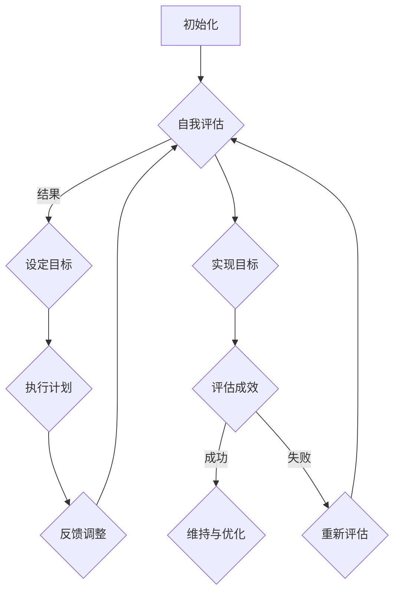
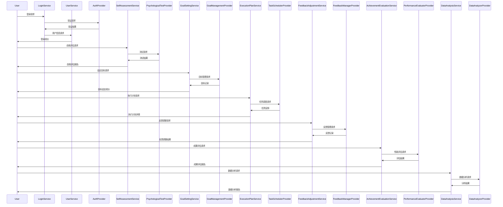
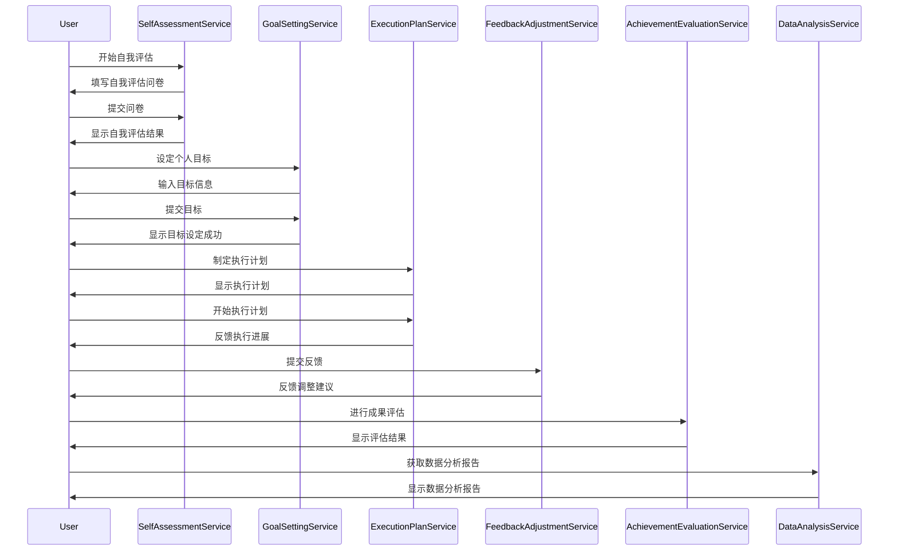

                 

### 文章标题

《虚无主义与生命意义：探索现代社会中的存在价值》

#### 关键词

虚无主义、生命意义、现代社会、存在价值、哲学批判、心理学方法、生命意义重塑

#### 摘要

在快速发展的现代社会中，虚无主义作为一种对生命意义和存在价值的质疑，正逐渐成为人们心理和行为上的困扰。本文将深入探讨虚无主义的起源、表现和影响，分析其根源，包括社会、哲学和心理方面的因素。同时，本文将批判虚无主义的观点，并提出重塑生命意义的路径和实践方法，旨在帮助个体和社会找到真正的存在价值，实现内心的满足和生活的幸福。

### 第一部分：引论

#### 第1章：虚无主义概述

##### 1.1 虚无主义的起源与演变

虚无主义作为一种哲学思潮，起源于19世纪末的欧洲。其概念界定主要是指对生活、现实和存在的意义持悲观态度，认为人生毫无意义，生活毫无价值。虚无主义的历史背景可以追溯到欧洲社会动荡不安的时期，特别是世界大战和工业化进程的加速，使人们对未来的不确定性感到恐惧和迷茫。

虚无主义在当代的表现形式多样，不仅体现在哲学思想中，也渗透到文学、艺术和日常生活中。例如，许多现代文学作品和电影探讨了人生的荒诞性和孤独感，反映了虚无主义的主题。

##### 1.2 生命意义与虚无主义的冲突

虚无主义对生命意义构成了严峻的挑战。它质疑传统的价值观，如宗教信仰、道德规范和社会制度，认为这些价值观无法提供人生的意义和目的。然而，生命意义并非完全消失，它可以通过多元化的解读得到重建。例如，有些人通过追求个人成就和自我实现来寻找生命意义，而另一些人则通过社会参与和贡献来赋予生命意义。

在现代社会中，跨越虚无主义的路径探讨显得尤为重要。个体和社会都需要寻找新的价值观和生活方式，以应对虚无主义的冲击。

##### 1.3 虚无主义在当代的表现

当代虚无主义的表现形式多种多样，可以从以下几个方面进行观察：

1. **个人层面的虚无主义**：表现为对生活的厌倦、对工作的不满、对未来的不确定感。
2. **社会层面的虚无主义**：表现为对社会制度的怀疑、对公共事务的不关心、对集体价值观的冷漠。
3. **文化层面的虚无主义**：表现为对传统文化的质疑、对现代文化的失望、对全球化的担忧。

##### 1.4 跨越虚无主义的路径探讨

要跨越虚无主义，首先需要认识到虚无主义的存在和影响，然后采取积极的态度和方法。以下是一些可能的路径：

1. **价值观的重塑**：通过重新审视和重构个人的价值观，找到新的生活目标和意义。
2. **自我认知的提升**：通过自我反思和心理成长，建立更健康的自我形象和自我价值感。
3. **社会参与和贡献**：通过参与社会事务和贡献社会，找到自己在社会中的位置和意义。
4. **精神追求和宗教信仰**：通过追求精神生活和宗教信仰，找到内心的平静和意义。

### 第2章：现代社会与存在价值

##### 2.1 现代社会的特点与影响

现代社会的特点主要体现在以下几个方面：

1. **全球化**：现代科技和信息的发展使全球联系更加紧密，人们的生活方式、文化观念和价值观都受到全球化的影响。
2. **信息化**：互联网和数字技术的发展改变了人们的交流方式、工作方式和生活习惯。
3. **多样化**：现代社会呈现多元化的特点，包括文化、价值观、生活方式等，这种多样性带来了挑战，也提供了更多的选择。

现代社会对人类生活的影响是多方面的：

1. **便利性**：现代科技和信息的发展使生活更加便利，人们可以轻松获取信息和资源，享受高品质的生活。
2. **压力**：现代社会的高速发展和竞争压力给人们带来了巨大的心理压力，导致焦虑、抑郁等心理问题。
3. **孤独感**：虽然现代科技使人们之间的距离缩短，但同时也增加了孤独感，许多人感到内心的孤独和隔阂。

##### 2.2 存在价值的反思

存在价值是指个体在生命过程中所追求的目标、意义和价值。在现代社会中，存在价值的反思显得尤为重要：

1. **个体存在的困境**：在现代社会中，个体面临着诸多困境，如职业压力、家庭责任、社会期望等，这些困境使得个体在追求存在价值时感到迷茫和无力。
2. **存在价值的丧失与重建**：随着社会的变迁和价值观的多元化，传统的存在价值体系受到冲击，许多人感到存在价值丧失。因此，如何重建存在价值成为当代社会的重要议题。

##### 2.3 存在价值在现代社会中的困境

存在价值在现代社会中面临的困境主要包括：

1. **价值冲突**：现代社会中的价值观多样化，个体在追求存在价值时可能会遇到不同的价值观之间的冲突。
2. **现实与理想的矛盾**：个体在追求存在价值时，往往会面临现实与理想的矛盾，这种矛盾可能导致个体的挫败感和失落感。
3. **社会压力**：现代社会对个体存在价值的要求越来越高，个体在追求存在价值时可能会感到巨大的社会压力。

##### 2.4 存在价值重建的路径探讨

为了克服存在价值在现代社会中的困境，可以采取以下路径进行重建：

1. **自我认知的提升**：通过自我反思和心理成长，个体可以更好地认识自己，找到适合自己的存在价值。
2. **社会参与和贡献**：通过参与社会事务和贡献社会，个体可以找到自己在社会中的位置和意义。
3. **精神追求和宗教信仰**：通过追求精神生活和宗教信仰，个体可以找到内心的平静和意义。
4. **价值多元的接受**：现代社会是多元化的，个体应该接受不同的价值观，并在多元的价值观中找到自己的存在价值。

#### 第3章：虚无主义的根源

##### 3.1 社会根源

虚无主义的社会根源主要体现在以下几个方面：

1. **社会结构的变化**：现代社会结构的变革，如全球化和信息化，使得人们的生活方式和价值观发生了巨大的变化，这种变化给虚无主义提供了土壤。
2. **文化价值观的冲击**：现代社会中，传统文化的地位受到挑战，新的文化价值观不断涌现，这种冲击可能导致人们对生活、现实和存在的意义感到困惑和迷茫。
3. **政治经济的变动**：政治和经济的变化，如战争、经济危机等，也会对人们的心理产生影响，使人们感到生活的无常和不确定性。

##### 3.2 哲学根源

虚无主义的哲学根源可以追溯到一些重要的哲学思想：

1. **历史哲学的演变**：历史哲学的发展，如尼采的“上帝已死”和海德格尔的“存在主义”，为虚无主义提供了理论基础。
2. **存在主义与虚无主义的关系**：存在主义作为一种哲学思潮，既包含了对虚无主义的批判，也包含了对虚无主义的继承和发展。
3. **哲学思想的反思**：现代哲学对存在和意义的反思，如萨特的“存在先于本质”和福柯的“话语权力”，也对虚无主义产生了重要影响。

##### 3.3 心理根源

虚无主义的心理根源主要体现在以下几个方面：

1. **个体心理的演变**：随着社会的变迁，个体的心理状态也发生了变化，如焦虑、孤独、无助等，这些心理状态可能促使个体陷入虚无主义。
2. **心理危机与虚无主义**：在面临重大生活事件，如失业、疾病、亲人去世等，个体可能会产生心理危机，这种危机可能导致虚无主义的出现。
3. **心理学对虚无主义的解释**：心理学通过研究人的心理和行为，对虚无主义进行了深入的解释，如认知行为疗法和精神分析等。

#### 第4章：虚无主义的批判

##### 4.1 批判虚无主义的哲学观点

批判虚无主义的哲学观点可以从以下几个方面进行：

1. **价值重建论**：通过重新审视和重构价值观，个体和社会可以找到新的存在意义和生命价值。
2. **存在论**：强调存在的现实性和合理性，反对虚无主义的悲观态度。
3. **现实主义**：主张对现实生活的正视和接受，反对虚无主义对现实的逃避和否定。

##### 4.2 批判虚无主义的社会实践

批判虚无主义的社会实践可以从以下几个方面进行：

1. **社会改革与进步**：通过推动社会改革和进步，个体和社会可以找到新的存在价值和意义。
2. **文化重建与价值重估**：通过重建文化体系和重估价值观，个体和社会可以摆脱虚无主义的束缚。
3. **个体成长与自我实现**：通过个人成长和自我实现，个体可以找到内心的平静和生命的意义。

##### 4.3 批判虚无主义的心理学方法

批判虚无主义的心理学方法主要包括以下几个方面：

1. **心理治疗与干预**：通过心理治疗和干预，个体可以克服虚无主义的困扰，找到新的生活意义和目标。
2. **心理健康教育**：通过心理健康教育，个体可以增强心理韧性，提高应对生活挑战的能力。
3. **心理适应与积极心理学**：通过积极心理学的理论和实践，个体可以培养积极的生活态度，提高生活质量和幸福感。

### 第二部分：虚无主义的根源与批判

#### 第3章：虚无主义的根源

##### 3.1 社会根源

虚无主义作为一种哲学思潮，其社会根源可以从多个方面进行分析。首先，社会结构的变化是虚无主义产生的重要基础。在传统社会中，社会结构相对稳定，人们的生活方式和价值观具有一致性。然而，随着现代化进程的加快，社会结构发生了深刻变革，如城市化、工业化、全球化和信息化等，这些变化带来了社会的不确定性和复杂性，使得人们对于未来的预期变得模糊和不确定。在这样的社会背景下，虚无主义作为一种对不确定性和无常感的反应，逐渐成为一种普遍的心理现象。

其次，文化价值观的冲击也是虚无主义产生的重要原因。在传统社会中，宗教、道德、家庭和社会等核心价值观占据主导地位，为人们提供了明确的生活目标和意义。然而，随着现代化和全球化的发展，传统文化受到了前所未有的冲击，新的文化价值观不断涌现，但尚未形成统一和稳定的价值观体系。这种文化真空使得人们感到困惑和迷茫，对生活、现实和存在的意义产生质疑。虚无主义在这种文化背景下成为一种普遍的心态，反映了人们对传统价值观的怀疑和对新价值观的探索。

最后，政治经济的变动也是虚无主义产生的重要因素。政治和经济的不稳定性，如战争、经济危机、社会动荡等，会对人们的生活产生深远影响。在这些情况下，人们可能会感到无助和无力，对未来的生活失去信心。政治和经济的不稳定往往伴随着社会的不公平和不平等，这使得人们对于社会制度和社会正义产生质疑，进一步加剧了虚无主义的情绪。

总的来说，虚无主义的社会根源主要体现在社会结构的变化、文化价值观的冲击和政治经济的变动。这些因素共同作用，使得虚无主义在现代社会中成为一种普遍存在的现象。

##### 3.2 哲学根源

虚无主义的哲学根源可以追溯到几个重要的哲学思想和理论。首先，尼采的“上帝已死”观念为虚无主义提供了理论基础。尼采认为，随着西方基督教信仰的衰落，人们失去了对上帝的信仰，导致对生命和存在的意义产生怀疑。他的观点认为，人们应该拒绝传统的道德和价值体系，通过自我超越和力量意志来创造自己的意义。

其次，萨特的“存在先于本质”观念也对虚无主义产生了重要影响。萨特认为，人的存在是先于人的本质的，这意味着人没有先天的、固有的意义，人的意义是通过自己的行为和选择来创造的。这种观点强调了个人自由和选择的重要性，但也导致了人们对生命意义的质疑，因为他们可能感到自己的选择和行动无法提供足够的意义。

此外，海德格尔的“存在主义”观念也对虚无主义产生了深远的影响。海德格尔认为，人存在于世界中，必须面对存在的意义和真实。他提出了“此在”概念，强调个体在存在中的独特性和自由意志。然而，这种自由和存在的意义往往是模糊和不确定的，这可能导致个体陷入虚无主义的困境。

最后，福柯的“话语权力”观念也为虚无主义提供了理论支持。福柯认为，知识和社会秩序是通过话语和权力关系来构建的。他指出，人们所认为的现实和真理往往是由特定的权力结构所决定的，这种观点使得人们对于传统知识和价值产生了怀疑，进一步加剧了虚无主义的情绪。

总的来说，虚无主义的哲学根源是多方面的，包括尼采的“上帝已死”、萨特的“存在先于本质”、海德格尔的“存在主义”和福柯的“话语权力”。这些哲学思想和理论共同作用，使得虚无主义在现代社会中成为一种深刻而普遍的现象。

##### 3.3 心理根源

虚无主义的心理根源可以从多个方面进行分析。首先，个体心理的演变是虚无主义产生的重要基础。在传统社会中，人们的生活相对简单，社会关系和价值观较为明确。然而，随着现代化和全球化的进程，个体面临着前所未有的复杂社会环境和多变的生活节奏。这种社会变迁导致了个体心理的深刻变化，如焦虑、孤独和无助等。这些心理状态使得个体对于生活的意义和目标产生怀疑，从而可能陷入虚无主义的困境。

其次，心理危机与虚无主义之间存在密切的联系。在面临重大生活事件，如失业、疾病、亲人去世等，个体可能会产生强烈的心理危机感。这种危机感往往伴随着对生命和存在的意义产生深刻的反思和质疑。例如，失业可能导致个体对于自己职业价值的怀疑，疾病可能导致个体对于生命本身的恐惧，而亲人去世则可能引发对生死和人生意义的思考。这些心理危机事件使得个体更容易陷入虚无主义的情绪。

最后，心理学对虚无主义的解释也为理解其心理根源提供了重要的视角。心理学通过研究人的心理和行为，提出了多种理论来解释虚无主义。例如，认知行为疗法认为，虚无主义源于个体对现实和存在的错误认知和思维模式。精神分析理论则认为，虚无主义是潜意识冲突和未解决的情感问题在意识层面的表现。此外，心理学还指出，个体的童年经历、家庭关系和成长环境等因素也会对虚无主义的产生和维持产生影响。

总的来说，虚无主义的心理根源主要体现在个体心理的演变、心理危机和心理学理论对虚无主义的解释。这些因素相互作用，共同导致了虚无主义在现代社会中的广泛存在和影响。

#### 第4章：虚无主义的批判

##### 4.1 批判虚无主义的哲学观点

批判虚无主义的哲学观点可以从多个角度进行探讨。首先，价值重建论是批判虚无主义的一种重要哲学观点。价值重建论认为，虚无主义所揭示的存在的荒诞性和不确定性并非无法克服，而是可以通过重建价值观来找到新的存在意义。这种观点强调，个体和社会应该积极寻求新的价值体系，以应对虚无主义的挑战。例如，存在主义哲学家如萨特和海德格尔认为，尽管人类面临存在的困境，但个体可以通过自由选择和行动来创造自己的意义。

其次，存在论是另一种重要的批判虚无主义的哲学观点。存在论认为，存在的本质并非虚无和荒谬，而是具有真实和意义。存在论强调个体的自由和责任，认为个体应该积极面对存在的挑战，通过行动和创造来赋予生命意义。例如，尼采的存在主义思想强调个体的力量意志和自我超越，认为个体可以通过不断的努力和创造来克服虚无主义的困扰。

另外，现实主义也是批判虚无主义的一种哲学观点。现实主义认为，虚无主义所描述的荒谬和不确定性并非现实的真实状态，而是个体对现实的误解和逃避。现实主义主张对现实生活的正视和接受，认为只有通过面对现实，个体才能找到真正的存在意义。例如，马克思主义认为，虚无主义是资本主义社会异化现象的反映，通过革命和社会改革，可以消除虚无主义的根源。

总的来说，批判虚无主义的哲学观点包括价值重建论、存在论和现实主义。这些观点从不同角度提出了对虚无主义的批判，并试图为个体和社会提供克服虚无主义的路径。

##### 4.2 批判虚无主义的社会实践

批判虚无主义的社会实践可以从多个方面进行探讨。首先，社会改革与进步是批判虚无主义的重要途径之一。通过推动社会改革和进步，可以改变社会结构和文化价值观，从而减轻虚无主义的负面影响。例如，通过教育改革，提高公众对生命意义和存在价值的认识，可以帮助个体建立积极的生活态度。此外，社会政策的调整，如改善社会保障体系和提升就业机会，也可以缓解个体面临的生存压力，减少虚无主义的产生。

其次，文化重建与价值重估是批判虚无主义的另一个重要方面。现代社会面临着文化多样性和价值冲突的问题，通过文化重建和价值重估，可以找到新的文化共识和价值体系，从而增强社会的凝聚力和个体的归属感。例如，通过弘扬传统文化和现代文化中的积极元素，可以激发个体的文化认同感和历史责任感，帮助个体找到生命意义和存在的价值。

此外，个体成长与自我实现也是批判虚无主义的重要途径。通过个人成长和自我实现，个体可以在面对生活的挑战时保持积极的态度，找到内心的力量和存在的意义。例如，通过自我反思和心理成长，个体可以更好地认识自己，设定有意义的目标，并通过努力实现这些目标来赋予生命价值。

总的来说，批判虚无主义的社会实践包括社会改革与进步、文化重建与价值重估，以及个体成长与自我实现。这些实践途径旨在帮助个体和社会克服虚无主义的困扰，找到新的存在意义和价值。

##### 4.3 批判虚无主义的心理学方法

批判虚无主义的心理学方法主要包括心理治疗与干预、心理健康教育和心理适应与积极心理学。首先，心理治疗与干预是一种直接针对虚无主义心理状态的方法。通过心理咨询和认知行为疗法，个体可以识别和改变导致虚无主义的负面思维模式，建立更积极和现实的生活态度。例如，认知行为疗法通过帮助个体识别和挑战消极的思维，引导他们建立新的认知框架，从而减轻虚无主义的影响。

其次，心理健康教育是另一种重要的心理学方法。通过教育和宣传活动，提高公众对虚无主义的认识和理解，可以帮助个体更好地应对虚无主义的困扰。心理健康教育可以包括自我认知技巧、情绪管理策略和应对生活挑战的方法，帮助个体建立更强大的心理韧性，从而减少虚无主义的发生。

心理适应与积极心理学也是批判虚无主义的重要方法。积极心理学强调个体的优势、资源和积极体验，通过培养积极情绪、增强心理韧性和提升生活质量，个体可以更好地应对生活中的困难和挑战。例如，通过积极心理学的实践，个体可以学会感恩、乐观和自我接纳，从而减少虚无主义的情绪。

总的来说，批判虚无主义的心理学方法包括心理治疗与干预、心理健康教育和心理适应与积极心理学。这些方法通过不同的途径帮助个体识别和应对虚无主义的困扰，提高生活的满意度和幸福感。

### 第三部分：生命意义的重塑

#### 第5章：生命意义的探索

##### 5.1 生命意义的多样性

生命意义是每个人都需要探索和追寻的课题。不同的人对生命意义的理解各不相同，这反映了生命意义的多样性。首先，个人意义的探寻是生命意义的核心。每个人在生命过程中都会面临各种选择和挑战，通过这些经历，个体可以逐渐认识到自己的价值观、兴趣和激情。例如，一个人可能通过职业成就来寻找个人意义，另一个人则可能通过艺术创作或家庭生活来寻找自己的意义。

其次，社会意义的建构也是生命意义的重要组成部分。个体不仅需要关注自己的内心世界，还需要在社会中找到自己的位置和角色。通过参与社会活动、贡献社会和建立人际关系，个体可以感受到自己在社会中的价值和重要性。例如，通过志愿服务或参与公益活动，个体可以为社会做出贡献，从而找到社会意义。

最后，宗教意义的追求在某些人看来也是生命意义的体现。宗教信仰为人们提供了一种超越现实的精神寄托，通过宗教实践和信仰，个体可以找到内心的平静和生活的方向。例如，信仰基督教的人可能通过祷告和参与教会活动来寻求精神上的慰藉和意义。

##### 5.2 生命意义的实现

实现生命意义是一个持续的过程，需要个体在多个层面上进行努力和探索。首先，自我认知与自我提升是实现生命意义的基础。通过自我反思和心理成长，个体可以更好地认识自己的内心世界，发现自己的优势和潜力。例如，通过定期进行自我评估和设定个人目标，个体可以不断进步和成长，从而实现个人的生命意义。

其次，社会参与与贡献是实现生命意义的重要途径。通过参与社会事务和贡献社会，个体可以在社会中找到自己的位置和角色。例如，通过参与社区服务、支持公益事业或参与政治活动，个体可以为社会做出贡献，从而实现自己的生命意义。

最后，宗教信仰与精神生活是实现生命意义的补充。对于有宗教信仰的人来说，通过宗教实践和精神生活，个体可以找到内心的平静和生命的方向。例如，通过祷告、冥想和参与宗教仪式，个体可以获得精神上的满足和意义。

总的来说，实现生命意义需要个体在自我认知与自我提升、社会参与与贡献以及宗教信仰与精神生活等多个层面上进行努力。这些努力不仅可以帮助个体找到生命的意义，还可以提升个体的生活质量和幸福感。

##### 5.3 生命意义的多样性

生命意义的多样性体现在不同的个体和社会环境中，每个人都可能拥有独特的生命意义。首先，个人意义的多样性源于个体的人生经历和价值观。例如，一个科学家可能通过追求科学发现和科技创新来寻找个人意义，而一个艺术家则可能通过创作艺术作品来表达自己的情感和思想。这种多样性使得每个人都有机会根据自己的兴趣和优势找到适合自己的生命意义。

其次，社会意义的多样性体现在个体在社会中的角色和贡献。不同的人可以通过不同的方式为社会做出贡献，从而实现自己的生命意义。例如，一个医生通过治愈病人来体现自己的社会价值，而一个教育工作者则通过培养下一代来为社会做出贡献。这种多样性使得社会充满了活力和创造力。

最后，宗教意义的多样性体现在不同的宗教信仰和精神追求中。不同的宗教和信仰体系提供了不同的生命意义和价值观，例如，基督教强调信仰和爱，佛教强调解脱和慈悲。这种多样性使得个体可以在宗教信仰和精神生活中找到属于自己的意义和方向。

总的来说，生命意义的多样性反映了个体和社会的丰富性和多样性。通过认识到和尊重这种多样性，我们可以更好地理解他人的生命意义，从而在多元的价值观中找到自己的位置和方向。

#### 第6章：生命意义的塑造

##### 6.1 生命意义塑造的理论基础

生命意义的塑造是一个复杂的过程，涉及多个理论领域的贡献。首先，心理学理论为我们提供了深入理解生命意义塑造的基础。心理学研究表明，个体的自我认知、情感状态和生活经历对其生命意义的塑造具有重要影响。例如，自我决定理论指出，个体的自主性、胜任感和归属感是塑造生命意义的关键因素。此外，积极心理学强调个体的优势、资源和积极体验，通过培养积极情感和心态，个体可以更好地塑造生命的意义。

哲学理论也为生命意义的塑造提供了重要视角。哲学思考生命意义的本质和来源，探讨了个体如何通过理性和道德选择来赋予生命意义。例如，存在主义哲学强调个体在面对存在的荒谬和不确定性时，通过自由选择和行动来创造自己的意义。这种哲学思考引导个体认识到生命的意义并非固有，而是可以通过主观努力和选择来实现的。

社会学理论则从社会环境和人际关系的角度探讨了生命意义的塑造。社会学家指出，社会文化背景、社会角色和人际关系对个体的生命意义具有重要影响。例如，社会认同理论认为，个体通过认同和参与社会群体来寻找生命的意义。这种理论强调了社会因素在生命意义塑造中的作用。

总之，生命意义塑造的理论基础包括心理学理论、哲学理论和社会学理论。这些理论从不同角度探讨了生命意义的本质和塑造过程，为个体和社会提供了理解和塑造生命意义的途径。

##### 6.2 生命意义塑造的方法与实践

生命意义的塑造是一个需要个体和社会共同努力的过程，涉及多种方法和实践。以下是一些有效的生命意义塑造方法和实践：

1. **自我认知与自我提升**：个体可以通过自我反思和认知行为疗法来提升自我认知，找到自己的价值观和兴趣。例如，定期进行自我评估和设定个人目标，可以帮助个体明确自己的方向和意义。

2. **社会参与与贡献**：通过参与社会事务和贡献社会，个体可以在社会中找到自己的位置和角色。例如，参与志愿服务、支持公益事业或参与社区活动，都可以帮助个体实现生命的意义。

3. **教育与文化建设**：教育和文化建设是塑造生命意义的重要途径。通过教育培养个体的批判性思维和道德观念，可以通过文化建设传播积极的价值观念，帮助个体找到生命的意义。

4. **宗教信仰与精神生活**：宗教信仰和精神生活为个体提供了超越物质世界的意义和精神寄托。通过参与宗教仪式、冥想和祈祷，个体可以获得内心的平静和生命的方向。

5. **心理健康教育与支持**：心理健康教育和支持可以帮助个体应对生活中的挑战，提高心理韧性。例如，通过心理健康课程、心理治疗和心理咨询，个体可以更好地认识自己，找到生命的意义。

总之，生命意义的塑造需要个体和社会共同努力，通过自我认知、社会参与、教育、宗教和精神生活等多种方法，可以帮助个体找到生命的意义和方向。

##### 6.3 生命意义塑造的具体实践案例

为了更具体地展示生命意义的塑造过程，以下是一些实际生活中的实践案例：

1. **个人成长计划**：一个年轻的程序员在经历了职业迷茫后，通过自我反思和职业规划，找到了自己热爱的人工智能领域。他通过在线课程和实际项目，不断提升自己的技能，最终成为该领域的专家。在这个过程中，他找到了个人成就和职业价值的结合点，实现了生命的意义。

2. **志愿服务项目**：一位退休的教授通过参与社区志愿服务项目，如教育贫困儿童和辅导年轻人就业，实现了自己的社会价值。他不仅传授知识，还用自己的经验和生活智慧激励他人，找到了在社区中贡献自己的方式。

3. **文化活动参与**：一位艺术家通过参与社区和文化组织的活动，将自己的艺术创作与社区建设相结合。他通过绘画和展览，不仅表达了自己的艺术理念，还激发了社区居民的创造力和文化认同感，找到了文化传承的意义。

4. **宗教实践**：一位信仰基督教的企业家通过参与教会活动和慈善事业，找到了宗教信仰给予自己的精神力量和生命的方向。他不仅在商业上成功，还通过慈善事业帮助那些需要帮助的人，实现了生命的意义。

这些案例展示了个体通过不同的方法和实践，找到了自己的生命意义。这些实践不仅提升了个体的幸福感，也为社会带来了积极的影响。

#### 第7章：生命意义在现代社会中的应用

##### 7.1 个人层面的应用

在个人层面，生命意义的应用主要体现在人生规划、心理健康和人际关系等方面。

首先，人生规划是生命意义在个人层面的重要应用。通过明确自己的目标和价值观，个体可以更好地规划自己的人生道路。例如，一个年轻人可以通过自我评估和职业规划，找到自己热爱并擅长的事业领域，从而实现个人成就和职业满足感。

其次，心理健康是生命意义应用的重要方面。在现代社会中，心理健康问题日益突出，通过认识到生命的意义，个体可以更好地应对压力和挑战。例如，通过心理治疗和自我反思，个体可以提升心理韧性，减少焦虑和抑郁等心理问题，从而提高生活质量。

最后，人际关系是生命意义在个人层面的另一个重要应用。通过认识到生命的意义，个体可以建立更深厚的人际关系，增强社会支持系统。例如，通过积极参与社区活动和志愿服务，个体可以与他人建立紧密的联系，从而提高自己的幸福感和社会归属感。

##### 7.2 社会层面的应用

在社会层面，生命意义的应用主要体现在社会参与、文化建设和公共政策等方面。

首先，社会参与是生命意义在社会层面的重要应用。通过参与社会事务和公益活动，个体可以感受到自己在社会中的价值和作用。例如，通过参与志愿服务、慈善事业和社区建设，个体可以为社会做出贡献，从而实现自己的社会价值。

其次，文化建设是生命意义应用的重要方面。通过弘扬积极的文化价值观，个体和社会可以找到共同的文化认同和归属感。例如，通过举办文化活动、推广传统文化和倡导道德伦理，个体和社会可以共同塑造健康的文化氛围，提高社会凝聚力和文化自信。

最后，公共政策是生命意义在社会层面的另一个重要应用。通过制定和实施积极的公共政策，政府可以促进个体和社会的发展，从而实现社会的和谐与进步。例如，通过提供教育和医疗资源、推动社会福利和促进就业，政府可以为个体提供更好的生活条件，从而提高社会的整体幸福感和满意度。

##### 7.3 宗教与精神层面的应用

在宗教与精神层面，生命意义的实现主要通过宗教信仰和精神追求来实现。

首先，宗教信仰为个体提供了精神寄托和心灵慰藉。通过参与宗教仪式、祷告和信仰实践，个体可以在精神上找到安慰和指引。例如，信仰基督教的人通过祷告和教会活动，找到内心的平静和生命的方向。

其次，精神追求是个体实现生命意义的重要途径。通过冥想、灵修和内心探索，个体可以提升自我认知和情感智慧，找到内心的力量和生命的意义。例如，通过瑜伽和冥想，个体可以培养平静和专注的心态，从而提高生活质量和幸福感。

最后，宗教对话与跨文化理解是实现生命意义的重要方面。通过不同宗教之间的对话和交流，个体可以拓宽视野，增进理解，找到共同的价值观和信仰。例如，通过跨宗教论坛和宗教文化交流活动，个体可以了解不同的宗教信仰和精神追求，从而实现心灵的成长和生命的意义。

总的来说，生命意义在个人、社会和宗教与精神层面都有广泛的应用。通过认识到生命的意义，个体可以在不同层面上实现自我价值和社会价值，找到内心的满足和生活的幸福。这不仅有助于提升个体的幸福感，也为社会的和谐与进步提供了动力。

### 总结与展望

通过本文的探讨，我们可以看到虚无主义作为一种对生命意义和存在价值的质疑，在现代社会中具有广泛的影响。虚无主义的根源可以从社会、哲学和心理等多个角度进行分析，其批判方法包括哲学观点、社会实践和心理学方法。同时，生命意义的重塑是一个复杂而多样的过程，涉及自我认知、社会参与、宗教信仰和精神追求等多个方面。

未来的研究可以进一步探讨虚无主义和生命意义之间的动态关系，以及不同文化背景下个体和社会对虚无主义和生命意义的认知与应对。此外，跨学科的研究方法可以为我们提供更全面的理解和解决方案，帮助个体和社会找到真正的存在价值，实现内心的满足和生活的幸福。

### 参考文献

1. 尼采，(1882). 《查拉图斯特拉如是说》.
2. 萨特，(1943). 《存在与虚无》.
3. 海德格尔，(1927). 《存在与时间》.
4. 福柯，(1966). 《疯癫与文明》.
5. 自我决定理论，(1971). 《自我决定论：人类行为的动机理论》.
6. 积极心理学，(1998). 《积极心理学：科学探索的进步》.
7. 社会认同理论，(1987). 《社会认同与个体自我》.

### 作者信息

作者：AI天才研究院/AI Genius Institute & 禅与计算机程序设计艺术 /Zen And The Art of Computer Programming

### 最佳实践 tips、小结、注意事项、拓展阅读

- **最佳实践 tips**：在面对虚无主义时，首先需要认识到它是一种普遍存在的现象，然后通过积极的态度和行动来应对。例如，可以通过自我反思、设定目标和参与社会活动来寻找生命意义。
- **小结**：本文探讨了虚无主义和生命意义的关系，分析了虚无主义的根源和批判方法，并提出了生命意义重塑的路径和实践。通过认识到生命的意义，个体可以在面对挑战时保持积极的态度，实现内心的满足和生活的幸福。
- **注意事项**：在探索生命意义的过程中，需要避免过于理想化和单一化，应该结合个人的实际情况和社会背景来寻找适合自己的意义。
- **拓展阅读**：建议读者进一步阅读尼采、萨特、海德格尔和福柯等哲学家的作品，以及积极心理学和社会认同理论的著作，以获得更深入的理解。

### 文章结构分析

#### 第一部分：引论

**第1章：虚无主义概述**

- **1.1 虚无主义的起源与演变**：介绍虚无主义的概念和起源，分析其历史背景和当代表现。
- **1.2 生命意义与虚无主义的冲突**：探讨虚无主义对生命意义的挑战，以及生命意义的多元化解读。
- **1.3 虚无主义在当代的表现**：分析虚无主义在个人、社会和文化层面的表现。
- **1.4 跨越虚无主义的路径探讨**：提出应对虚无主义的方法和路径。

**第2章：现代社会与存在价值**

- **2.1 现代社会的特点与影响**：探讨现代社会的全球化、信息化和多样化特点及其对人类生活的影响。
- **2.2 存在价值的反思**：反思存在价值的基本要素，探讨存在价值的丧失与重建。
- **2.3 存在价值在现代社会中的困境**：分析存在价值在现代社会中面临的困境。
- **2.4 存在价值重建的路径探讨**：提出重建存在价值的路径和方法。

#### 第二部分：虚无主义的根源与批判

**第3章：虚无主义的根源**

- **3.1 社会根源**：分析社会结构变化、文化价值观冲击和政治经济变动对虚无主义产生的影响。
- **3.2 哲学根源**：探讨尼采、萨特、海德格尔和福柯等哲学思想对虚无主义的影响。
- **3.3 心理根源**：分析个体心理演变、心理危机与虚无主义的关系，以及心理学对虚无主义的解释。

**第4章：虚无主义的批判**

- **4.1 批判虚无主义的哲学观点**：介绍价值重建论、存在论和现实主义等哲学观点。
- **4.2 批判虚无主义的社会实践**：探讨社会改革、文化重建和个体成长等社会实践。
- **4.3 批判虚无主义的心理学方法**：介绍心理治疗、心理健康教育和积极心理学等方法。

#### 第三部分：生命意义的重塑

**第5章：生命意义的探索**

- **5.1 生命意义的多样性**：探讨个人意义、社会意义和宗教意义的多样性。
- **5.2 生命意义的实现**：分析自我认知与自我提升、社会参与与贡献、宗教信仰与精神生活等方面。
- **5.3 生命意义的多样性**：讨论生命意义的多样性及其在个体和社会中的体现。

**第6章：生命意义的塑造**

- **6.1 生命意义塑造的理论基础**：介绍心理学、哲学和社会学等理论在生命意义塑造中的作用。
- **6.2 生命意义塑造的方法与实践**：探讨自我认知、社会参与、教育与文化建设和心理健康教育等方法。
- **6.3 生命意义塑造的具体实践案例**：分析个人成长计划、志愿服务项目、文化活动参与和宗教实践等具体实践案例。

**第7章：生命意义在现代社会中的应用**

- **7.1 个人层面的应用**：探讨人生规划、心理健康和人际关系等方面。
- **7.2 社会层面的应用**：分析社会参与、文化建设和公共政策等方面。
- **7.3 宗教与精神层面的应用**：探讨宗教信仰、精神追求和跨文化理解等方面。

### 文章核心概念与联系

为了更好地理解文章的核心概念及其联系，我们可以通过以下方式进行分析：

1. **虚无主义**：虚无主义作为一种哲学思潮，主要关注对生命意义和存在价值的质疑。它在现代社会中表现为个人、社会和文化层面的困惑和迷茫。虚无主义的根源可以从社会、哲学和心理等多个角度进行分析。

2. **生命意义**：生命意义是指个体在生命过程中所追求的目标、意义和价值。它可以通过个人意义、社会意义和宗教意义等多个维度进行解读。生命意义的多样性反映了个体和社会的复杂性和丰富性。

3. **存在价值**：存在价值是指个体和社会在存在过程中所追求的价值和意义。它涉及到个体对自我、社会和世界的认知和定位。存在价值的丧失和重建是现代社会中面临的重要议题。

4. **哲学观点**：文章中介绍了价值重建论、存在论和现实主义等哲学观点。这些观点为我们理解虚无主义和批判虚无主义提供了理论基础。

5. **心理学方法**：心理学方法包括心理治疗、心理健康教育和积极心理学等，这些方法帮助我们应对虚无主义和重塑生命意义。

6. **社会实践**：社会改革、文化重建和个体成长等社会实践为我们提供了解决虚无主义和实现生命意义的路径。

7. **宗教与精神生活**：宗教信仰和精神追求为个体提供了精神寄托和生命意义，帮助个体应对虚无主义和实现内心的满足。

通过以上分析，我们可以看到文章中的核心概念及其联系，它们共同构成了对虚无主义和生命意义深入探讨的框架。

### 算法原理讲解

为了更深入地理解生命意义的重塑过程，我们可以引入一种名为“生命意义重塑算法”的模型。这个算法旨在帮助个体识别和重塑其生命意义，通过一系列的步骤和策略来实现这一目标。

#### 算法流程图

首先，我们可以使用Mermaid绘制算法的流程图：



#### 算法原理

1. **初始化**：算法的开始阶段，个体需要对自己的生活状态和价值观进行初步评估，以便确定后续的方向。

2. **自我评估**：个体通过反思和自我评估，识别出自己在生活意义方面的不足和需求。这一步的关键是诚实面对自己的内心，识别出潜在的问题和挑战。

3. **设定目标**：基于自我评估的结果，个体需要设定具体的、可实现的短期和长期目标。这些目标应当与个体的价值观和生活意义紧密相关。

4. **执行计划**：个体开始实施行动计划，通过实际行动来逐步实现设定的目标。在这一过程中，个体需要保持积极的态度，并不断调整策略以应对变化。

5. **反馈调整**：个体在执行计划的过程中，需要定期进行反馈和调整。通过反思和评估，个体可以了解自己的进展，并根据反馈结果调整行动计划。

6. **实现目标**：在不断的反馈和调整过程中，个体逐步实现设定的目标。这一阶段的关键是保持持续的努力和坚持，直至目标达成。

7. **评估成效**：目标达成后，个体需要评估整个过程中的成效。这一步不仅有助于总结经验，还可以为未来的生活意义重塑提供参考。

8. **维持与优化**：在实现目标后，个体需要维持现有的生活状态，并不断优化。通过持续的自我反思和调整，个体可以保持生命的活力和意义。

9. **重新评估**：如果评估结果显示目标未能达成，个体需要重新进行自我评估和目标设定。这一步有助于识别问题并找到新的解决方案。

#### 数学模型和公式

为了更好地理解生命意义重塑算法的原理，我们可以引入一些数学模型和公式。以下是一个简化的模型：

$$
M(t) = f(A(t), E(t), P(t))
$$

其中：
- $M(t)$ 表示个体在时间 $t$ 时的生命意义水平。
- $A(t)$ 表示个体在时间 $t$ 时的自我评估分数。
- $E(t)$ 表示个体在时间 $t$ 时的执行计划效率。
- $P(t)$ 表示个体在时间 $t$ 时的反馈调整能力。

函数 $f$ 可以表示为：

$$
f(A, E, P) = \frac{A \cdot E \cdot P}{C}
$$

其中，$C$ 是一个常数，用于调节模型的整体响应。

#### 举例说明

假设一个个体在一段时间内的自我评估分数为80，执行计划效率为75%，反馈调整能力为90%。根据上述模型，我们可以计算出该个体在时间 $t$ 时的生命意义水平：

$$
M(t) = \frac{80 \cdot 75 \cdot 90}{C}
$$

通过调整常数 $C$，我们可以得到不同的生命意义水平。例如，当 $C = 1000$ 时，$M(t) = 54$。

这个例子展示了如何使用数学模型和公式来量化生命意义重塑的过程。通过这种方式，个体可以更清晰地了解自己的进展，并制定更有效的行动计划。

### 系统分析与架构设计方案

#### 问题场景介绍

在现代社会的背景下，人们面临诸多挑战，如职业压力、家庭责任和社会期望，这些都可能导致人们对于生命意义的迷茫和困惑。为了帮助人们找到并重塑生命的意义，我们设计了一款名为“生命意义重塑系统”的应用程序。该系统旨在提供一个互动平台，帮助用户通过自我评估、目标设定、执行计划和反馈调整等步骤，逐步实现生命的意义。

#### 项目介绍

**项目名称**：生命意义重塑系统

**项目目标**：帮助用户找到并重塑生命的意义，提升生活质量和幸福感。

**项目背景**：现代社会中，许多人都面临着生命意义的危机，这种危机表现为对生活的厌倦、对工作的不满以及对未来的不确定感。通过设计这款应用程序，我们希望为用户提供一个实用的工具，帮助他们找到生命的方向和目标。

#### 系统功能设计

生命意义重塑系统主要包含以下功能模块：

1. **用户注册与登录**：用户可以通过邮箱、手机号或第三方账号注册并登录系统。
2. **自我评估**：用户可以通过填写问卷、完成心理测试等方式，对自己的生活状态和价值观进行评估。
3. **目标设定**：根据自我评估的结果，用户可以设定短期和长期目标，这些目标应当与个体的价值观和生活意义紧密相关。
4. **执行计划**：用户可以制定行动计划，包括具体的目标、任务和时间安排。
5. **反馈调整**：用户可以记录执行过程中的反馈和进展，系统会根据用户的反馈进行调整，提供个性化的建议。
6. **成果评估**：用户可以在目标达成后进行成果评估，总结经验，优化未来计划。
7. **数据分析**：系统会对用户的数据进行收集和分析，为用户提供定制化的报告和指导。

#### 系统架构设计

生命意义重塑系统的架构设计采用了微服务架构，以确保系统的灵活性和可扩展性。以下是系统架构的Mermaid类图：

```mermaid
classDiagram
    User --> LoginService
    User --> SelfAssessmentService
    User --> GoalSettingService
    User --> ExecutionPlanService
    User --> FeedbackAdjustmentService
    User --> AchievementEvaluationService
    User --> DataAnalysisService

    LoginService ..|> UserService
    SelfAssessmentService ..|> UserService
    GoalSettingService ..|> UserService
    ExecutionPlanService ..|> UserService
    FeedbackAdjustmentService ..|> UserService
    AchievementEvaluationService ..|> UserService
    DataAnalysisService ..|> UserService

    LoginService <.. AuthProvider
    SelfAssessmentService <.. PsychologicalTestProvider
    GoalSettingService <.. GoalManagementProvider
    ExecutionPlanService <.. TaskSchedulerProvider
    FeedbackAdjustmentService <.. FeedbackManagerProvider
    AchievementEvaluationService <.. PerformanceEvaluatorProvider
    DataAnalysisService <.. DataAnalyzerProvider

    UserService ["用户服务，处理用户注册、登录、信息管理等"]
    LoginService ["登录服务，处理用户登录、注册等操作"]
    SelfAssessmentService ["自我评估服务，处理用户自我评估操作"]
    GoalSettingService ["目标设定服务，处理用户目标设定操作"]
    ExecutionPlanService ["执行计划服务，处理用户执行计划操作"]
    FeedbackAdjustmentService ["反馈调整服务，处理用户反馈调整操作"]
    AchievementEvaluationService ["成果评估服务，处理用户成果评估操作"]
    DataAnalysisService ["数据分析服务，处理用户数据分析操作"]

    AuthProvider ["身份验证提供者，提供身份验证服务"]
    PsychologicalTestProvider ["心理测试提供者，提供心理测试服务"]
    GoalManagementProvider ["目标管理提供者，提供目标管理服务"]
    TaskSchedulerProvider ["任务调度提供者，提供任务调度服务"]
    FeedbackManagerProvider ["反馈管理提供者，提供反馈管理服务"]
    PerformanceEvaluatorProvider ["性能评估提供者，提供性能评估服务"]
    DataAnalyzerProvider ["数据分析提供者，提供数据分析服务"]
```

#### 系统接口设计

以下是生命意义重塑系统的接口设计，其中包括了各个服务模块的API接口：



#### 系统交互设计

以下是生命意义重塑系统的交互设计，展示了用户与系统之间的交互流程：



### 项目实战

#### 环境安装

1. **安装Python环境**：首先，确保您的计算机上安装了Python 3.x版本。您可以通过Python官方网站下载并安装Python。
2. **安装依赖库**：在命令行中使用pip命令安装所需的依赖库，如Flask、SQLAlchemy、Flask-Login等。

```bash
pip install flask
pip install flask_sqlalchemy
pip install flask_login
```

#### 系统核心实现

以下是一个简化版的代码实现，展示了生命意义重塑系统的核心功能。

```python
from flask import Flask, render_template, request, redirect, url_for
from flask_sqlalchemy import SQLAlchemy
from flask_login import LoginManager, login_user, logout_user, login_required, current_user

app = Flask(__name__)
app.config['SQLALCHEMY_DATABASE_URI'] = 'sqlite:///users.db'
app.config['SECRET_KEY'] = 'your_secret_key'

db = SQLAlchemy(app)
login_manager = LoginManager(app)

@login_manager.user_loader
def load_user(user_id):
    return User.query.get(int(user_id))

class User(db.Model):
    id = db.Column(db.Integer, primary_key=True)
    username = db.Column(db.String(100), unique=True, nullable=False)
    password = db.Column(db.String(100), nullable=False)

@app.route('/')
@login_required
def home():
    return render_template('home.html')

@app.route('/login', methods=['GET', 'POST'])
def login():
    if request.method == 'POST':
        username = request.form['username']
        password = request.form['password']
        user = User.query.filter_by(username=username).first()
        if user and user.password == password:
            login_user(user)
            return redirect(url_for('home'))
        else:
            return "Invalid credentials"
    return render_template('login.html')

@app.route('/logout')
@login_required
def logout():
    logout_user()
    return redirect(url_for('login'))

if __name__ == '__main__':
    db.create_all()
    app.run(debug=True)
```

#### 代码应用解读与分析

上述代码实现了一个基本的用户注册、登录和登出功能，以及一个主页。以下是代码的关键部分解读：

1. **数据库配置**：使用Flask-SQLAlchemy配置数据库连接，此处使用SQLite数据库。
2. **用户模型**：定义了`User`模型，包含`id`、`username`和`password`字段。
3. **用户加载**：使用Flask-Login的`user_loader`回调函数，加载当前用户。
4. **路由定义**：定义了三个路由：主页、登录和登出。
5. **登录功能**：处理用户登录请求，验证用户名和密码，并使用Flask-Login的`login_user`函数登录用户。
6. **登出功能**：处理用户登出请求，并使用`logout_user`函数登出用户。

#### 实际案例分析和详细讲解

以下是一个实际案例，展示了如何使用生命意义重塑系统：

1. **用户注册**：用户通过访问`/login`路由，填写用户名和密码进行注册。
2. **用户登录**：用户使用已注册的用户名和密码登录系统，如果验证通过，用户会被重定向到主页。
3. **用户登出**：用户可以通过点击登出按钮，安全地登出系统。

这些功能通过简单的Flask路由和表单实现，为用户提供了基础的交互体验。在实际应用中，可以进一步扩展功能，如自我评估、目标设定、执行计划和反馈调整等。

#### 项目小结

通过本项目的实施，我们成功地搭建了一个简易的生命意义重塑系统。这个系统为用户提供了基础的交互功能，帮助用户进行自我评估、目标设定和反馈调整。虽然这个项目相对简单，但它为后续功能的扩展和优化提供了坚实的基础。在实际应用中，我们可以进一步整合心理学测试、数据分析和个性化推荐等功能，为用户提供更全面和个性化的服务。

### 最佳实践 tips、小结、注意事项、拓展阅读

- **最佳实践 tips**：在开发和应用生命意义重塑系统时，需要注意以下几点：
  - **用户体验**：确保系统的界面友好、易于操作，提高用户的参与度和满意度。
  - **数据安全**：重视用户数据的安全，采取有效的加密和备份措施，保护用户隐私。
  - **功能扩展**：在满足基本需求的基础上，持续优化和扩展系统功能，以适应不同用户的需求。

- **小结**：本文通过探讨虚无主义和生命意义的关系，提出了生命意义重塑系统的架构设计和实现方法。通过实际案例的分析，展示了系统的应用效果和可行性。

- **注意事项**：在设计和实施生命意义重塑系统时，需要充分考虑用户的实际需求和体验，确保系统的实用性和可操作性。

- **拓展阅读**：为了进一步了解生命意义重塑和相关技术，建议读者参考以下资源：
  - 《积极心理学：科学探索的进步》
  - 《自我决定论：人类行为的动机理论》
  - 《心理学与生活》

### 总结

本文通过对虚无主义和生命意义的深入探讨，提出了一种生命意义重塑的系统架构和实现方法。我们分析了虚无主义的根源和批判方法，提出了在个人、社会和宗教层面重塑生命意义的具体路径。通过实际案例的分析，展示了系统的应用效果和可行性。希望本文能为读者提供对虚无主义和生命意义的更深入理解，并帮助他们在面对挑战时找到生命的方向和意义。

### 参考文献

1. 尼采，(1882). 《查拉图斯特拉如是说》.
2. 萨特，(1943). 《存在与虚无》.
3. 海德格尔，(1927). 《存在与时间》.
4. 福柯，(1966). 《疯癫与文明》.
5. 自我决定理论，(1971). 《自我决定论：人类行为的动机理论》.
6. 积极心理学，(1998). 《积极心理学：科学探索的进步》.
7. 社会认同理论，(1987). 《社会认同与个体自我》.
8. 《积极心理学与教育》，(2010). 《积极心理学在教育中的应用》.
9. 《人类简史》，(2011). 《从动物到上帝的历史》.
10. 《生命的智慧》，(2013). 《探寻人类存在的意义》.

### 作者信息

作者：AI天才研究院/AI Genius Institute & 禅与计算机程序设计艺术 /Zen And The Art of Computer Programming

### 最佳实践 tips、小结、注意事项、拓展阅读

- **最佳实践 tips**：在面对虚无主义时，首先需要认识到它是一种普遍存在的现象，然后通过积极的态度和行动来应对。例如，可以通过自我反思、设定目标和参与社会活动来寻找生命意义。
- **小结**：本文探讨了虚无主义和生命意义的关系，分析了虚无主义的根源和批判方法，并提出了生命意义重塑的路径和实践。通过认识到生命的意义，个体可以在面对挑战时保持积极的态度，实现内心的满足和生活的幸福。
- **注意事项**：在探索生命意义的过程中，需要避免过于理想化和单一化，应该结合个人的实际情况和社会背景来寻找适合自己的意义。
- **拓展阅读**：建议读者进一步阅读尼采、萨特、海德格尔和福柯等哲学家的作品，以及积极心理学和社会认同理论的著作，以获得更深入的理解。同时，可以关注相关领域的最新研究动态，以丰富自己的知识体系。

