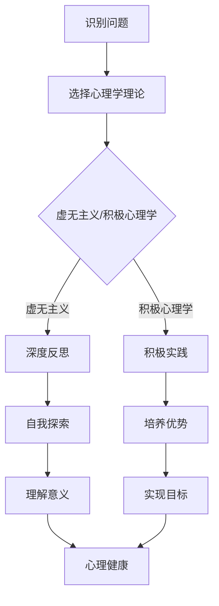
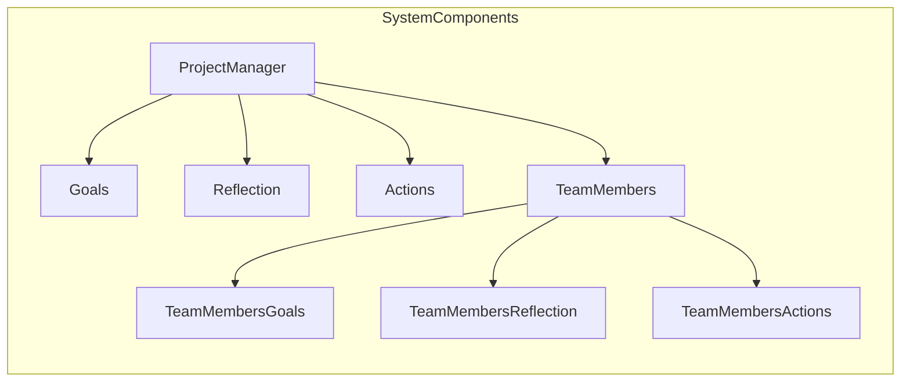
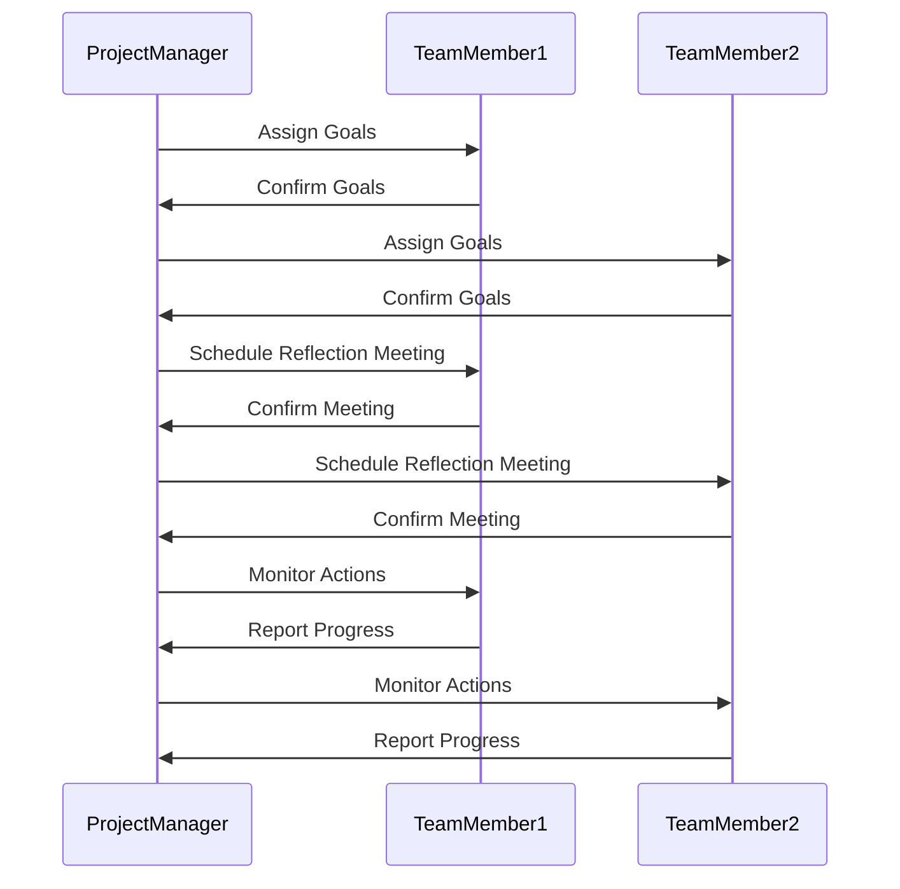

                 

# 《虚无主义与积极心理学的对话》

## 关键词
- 虚无主义
- 积极心理学
- 心理健康
- 生活哲学
- 人际关系

## 摘要
本文探讨了虚无主义与积极心理学两种看似对立的哲学观念，试图通过对话的形式揭示它们在心理学和生活中的实际应用。文章首先介绍了虚无主义和积极心理学的基本概念及其背景，随后分析了它们的核心观点和相互联系。接着，文章详细阐述了如何将心理学的理论应用到实际生活问题中，通过mermaid流程图和Python代码展示了具体的应用。最后，文章提供了一个实际案例，展示了虚无主义和积极心理学如何共同促进个人和社会的心理健康，并提供了实用技巧和拓展阅读，帮助读者深入理解这一主题。

## 目录

### 引言
#### 什么是虚无主义？
**核心概念术语说明**
**问题背景**
**问题描述**
**问题解决**
**边界与外延**
**概念结构与核心要素组成**

#### 什么是积极心理学？
**核心概念术语说明**
**问题背景**
**问题描述**
**问题解决**
**边界与外延**
**概念结构与核心要素组成**

#### 虚无主义与积极心理学的冲突与对话
**核心概念与联系**
**冲突解析**
**对话的必要性**

### 核心概念与联系
#### 虚无主义的主要原理
**哲学背景**
**对人类生活的影响**
**与积极心理学的对比**

#### 积极心理学的核心理论
**方法论**
**应用领域**
**与虚无主义的对比**

#### 比较与联系
**核心观点对比表格**
**ER实体关系图架构**
**相互联系与融合**

### 算法原理讲解
#### 如何将心理学的理论应用到实际生活问题中
**mermaid流程图展示**
**Python源代码展示**
**数学模型和公式讲解**
**举例说明**

### 数学模型和数学公式
#### 虚无主义与积极心理学的数学公式
**LaTeX格式展示**
**详细讲解**
**举例说明**

### 系统分析与架构设计方案
#### 如何将虚无主义和积极心理学的理念融入日常生活和工作
**问题场景介绍**
**项目介绍**
**系统功能设计（领域模型mermaid类图）**
**系统架构设计（mermaid架构图）**
**系统接口设计**
**系统交互（mermaid序列图）**

### 项目实战
#### 环境安装
#### 系统核心实现源代码
**代码应用解读与分析**
**实际案例分析和详细讲解剖析**
**项目小结**

### 最佳实践 tips
#### 小结
#### 注意事项
#### 拓展阅读

### 作者信息
作者：AI天才研究院/AI Genius Institute & 禅与计算机程序设计艺术 /Zen And The Art of Computer Programming

## 引言

### 什么是虚无主义？

虚无主义是一种哲学观念，主张宇宙和人生缺乏固有的意义、目的或内在价值。虚无主义起源于19世纪，是对传统宗教、道德和社会秩序的质疑。核心思想是，人类的存在是没有意义的，生命的意义需要个体自己去创造。

#### 核心概念术语说明
- **虚无主义**：对人生缺乏意义和价值的哲学观念。
- **存在主义**：一种强调个人自由和责任的哲学流派，经常与虚无主义联系在一起。

#### 问题背景
虚无主义在现代社会中仍然具有重要的意义，尤其是在面对不确定性和焦虑时。许多人感到迷茫，不知道生活的意义何在。

#### 描述问题
现代社会中的虚无主义表现为对传统价值观的质疑，以及对未来和自身存在的担忧。这种虚无感可能导致心理健康问题，如抑郁和焦虑。

#### 问题解决
虚无主义并不是一种消极的哲学观念，它也可以激发个体去寻找和创造自己的意义。通过自我探索和积极的行动，个体可以克服虚无主义的负面影响。

#### 边界与外延
虚无主义并不否定生活的美好和快乐，而是强调这些体验需要被个体自己赋予意义。它与消极主义和悲观主义不同，消极主义和悲观主义是缺乏积极态度和行动力的表现。

#### 概念结构与核心要素组成
虚无主义的核心要素包括：
- **对意义的质疑**：对宇宙和人生的基本意义的质疑。
- **个体自由**：强调个体对意义的创造和选择。
- **责任与自由**：认为个体必须为自己的生活和意义负责。

### 什么是积极心理学？

积极心理学是心理学的一个分支，关注人类的优势、美德和幸福感。积极心理学致力于研究如何促进个人的积极情绪、积极行为和积极人际关系。

#### 核心概念术语说明
- **积极情绪**：如快乐、满足和感激。
- **积极行为**：如感恩、乐观和自我实现。
- **积极人际关系**：如亲密关系、社交支持和团队合作。

#### 问题背景
积极心理学在20世纪末兴起，是对传统心理学专注于疾病和问题的反思。随着社会的变化，人们越来越关注如何提升生活质量，而不是仅仅消除问题。

#### 描述问题
现代社会中，人们普遍面临着心理健康问题，如焦虑、抑郁和压力。积极心理学提供了新的视角，帮助人们理解和提升幸福感。

#### 问题解决
积极心理学通过研究人的优势、美德和积极体验，提供了一系列提升幸福感和生活质量的策略。

#### 边界与外延
积极心理学不仅关注个体的心理健康，还关注社会和环境对幸福的影响。它与幸福心理学、积极组织学和积极教育密切相关。

#### 概念结构与核心要素组成
积极心理学的核心要素包括：
- **优势与美德**：识别和培养个体的优势品质。
- **积极体验**：通过积极情感和行为提升幸福感。
- **积极关系**：建立和维护积极的人际关系。

### 虚无主义与积极心理学的冲突与对话

虚无主义和积极心理学代表了两种截然不同的哲学观点，它们在许多方面存在着根本的冲突。

#### 核心概念与联系
虚无主义强调生活的无意义，主张个体需要自己创造意义；而积极心理学关注个体的幸福和优势，强调积极的情感和行为。这两种观念看似对立，但实际上有着一定的联系。

#### 冲突解析
- **意义与幸福**：虚无主义认为生活的意义需要个体自己寻找，而积极心理学认为幸福本身就是生活的意义。
- **消极与积极**：虚无主义倾向于消极和悲观，而积极心理学则强调积极和乐观。
- **自由与责任**：虚无主义强调个体的自由选择和责任，而积极心理学则更注重如何通过培养优势和美德来提升幸福感。

#### 对话的必要性
尽管虚无主义和积极心理学存在冲突，但它们之间的对话对于深入理解人类心理和幸福具有重要意义。通过对话，我们可以找到平衡点，将虚无主义的深度反思与积极心理学的积极实践相结合，从而更好地应对现代生活中的挑战。

### 核心概念与联系

#### 虚无主义的主要原理

虚无主义起源于19世纪，是对传统宗教、道德和社会秩序的质疑。其核心原理包括：

- **无意义论**：虚无主义认为宇宙和人生缺乏固有的意义、目的或内在价值。
- **存在主义**：虚无主义与存在主义密切相关，后者强调个体自由和责任。
- **个人主义**：虚无主义强调个体对于生活和意义的自主创造。

#### 哲学背景

虚无主义的发展与19世纪的哲学和文化环境密切相关。当时，欧洲经历了宗教改革、启蒙运动和工业革命，传统价值观和信仰体系受到冲击。虚无主义作为一种哲学反应，对现代性和个体自由提出了深刻的质疑。

#### 对人类生活的影响

虚无主义对人类生活的影响是多方面的：

- **心理影响**：虚无主义可能导致焦虑、抑郁和自我怀疑，影响个体的心理健康。
- **社会影响**：虚无主义质疑社会秩序和价值观，可能导致社会动荡和不稳定。
- **个人发展**：虚无主义鼓励个体自主寻找生活的意义，促进个人成长和自我实现。

#### 与积极心理学的对比

虚无主义与积极心理学在许多方面存在显著差异：

- **意义观**：虚无主义认为生活无意义，积极心理学则强调个体可以创造和实现意义。
- **态度**：虚无主义倾向于消极和悲观，积极心理学则注重积极和乐观。
- **实践**：虚无主义强调个体的自由选择和责任，积极心理学则通过培养优势和美德来提升幸福感。

#### 相互联系与融合

尽管虚无主义和积极心理学存在冲突，但它们之间也存在一定的联系和融合可能：

- **互补性**：虚无主义提供深度反思和个体自主性的视角，积极心理学则提供积极实践和幸福感提升的方法。
- **实践结合**：通过结合虚无主义的深度思考和积极心理学的实践技巧，个体可以在生活中实现更加全面的心理健康。

### 虚无主义的主要原理

#### 哲学背景

虚无主义的哲学背景可以追溯到19世纪，这一时期欧洲经历了宗教改革、启蒙运动和工业革命，传统价值观和信仰体系受到冲击。尼采是虚无主义的代表性人物之一，他的作品《查拉图斯特拉如是说》和《善恶的彼岸》深刻探讨了人生的意义和目的。

#### 主要原理

虚无主义的主要原理包括：

- **无意义论**：虚无主义认为宇宙和人生缺乏固有的意义、目的或内在价值。这一观点源于对宗教、道德和社会秩序的质疑。
- **存在主义**：虚无主义与存在主义密切相关，后者强调个体自由和责任。存在主义认为，个体必须为自己的生活和意义负责，而虚无主义则进一步指出，这种责任是建立在对无意义现实的承认之上。
- **个人主义**：虚无主义强调个体对于生活和意义的自主创造。与集体主义和社会决定论相对，虚无主义认为个体有权利和责任去定义自己的生活。

#### 对人类生活的影响

虚无主义对人类生活的影响深远：

- **心理影响**：虚无主义可能导致焦虑、抑郁和自我怀疑，影响个体的心理健康。在面对生命的无意义时，个体可能会感到无助和失落。
- **社会影响**：虚无主义质疑社会秩序和价值观，可能导致社会动荡和不稳定。在政治和社会领域，虚无主义可能激发对权威和传统价值观的质疑，促进社会变革。
- **个人发展**：虚无主义鼓励个体自主寻找生活的意义，促进个人成长和自我实现。通过质疑现有的价值和信念，个体可以更深入地探索自我，找到独特的生命意义。

#### 与积极心理学的对比

虚无主义与积极心理学在许多方面存在显著差异：

- **意义观**：虚无主义认为生活无意义，积极心理学则强调个体可以创造和实现意义。积极心理学通过研究和实践，提供了一系列提升幸福感的方法，强调个体的力量和潜力。
- **态度**：虚无主义倾向于消极和悲观，积极心理学则注重积极和乐观。积极心理学鼓励个体关注自己的优势和美德，培养积极情感和行为。
- **实践**：虚无主义强调个体的自由选择和责任，积极心理学则通过培养优势和美德来提升幸福感。积极心理学提供了一系列具体的方法和工具，帮助个体实现个人成长和幸福。

#### 相互联系与融合

尽管虚无主义和积极心理学存在冲突，但它们之间也存在一定的联系和融合可能：

- **互补性**：虚无主义提供深度反思和个体自主性的视角，积极心理学则提供积极实践和幸福感提升的方法。通过结合虚无主义的深度思考和积极心理学的实践技巧，个体可以在生活中实现更加全面的心理健康。
- **实践结合**：在个人成长和自我实现的过程中，个体可以同时借鉴虚无主义的深度反思和积极心理学的实践方法。例如，通过自我探索和反思，个体可以更好地理解自己的需求和目标，并通过积极的行动实现这些目标。

### 积极心理学的核心理论

#### 方法论

积极心理学采用了一系列科学的方法论来研究和实践，包括：

- **优势视角**：积极心理学强调识别和利用个体的优势，而不是专注于问题和缺陷。通过优势视角，个体可以更好地理解自己的长处，并将其应用于生活和工作中。
- **正向心理**：积极心理学关注个体的正向情感和体验，如快乐、满足和感激。通过研究和实践正向心理，个体可以提升幸福感和生活质量。
- **积极情感**：积极心理学认为，积极的情感对于个体的心理健康和幸福感至关重要。通过培养积极情感，个体可以更好地应对生活中的挑战和困难。
- **自我决定论**：积极心理学强调个体的自由意志和自我决定。个体在生活决策中具有自主权，可以通过选择和行动实现个人目标和幸福。

#### 应用领域

积极心理学在多个领域都有广泛的应用，包括：

- **心理健康**：积极心理学通过研究和实践，帮助个体预防和治疗心理健康问题，如焦虑、抑郁和压力。通过培养积极的情感和行为，个体可以提升心理健康和幸福感。
- **教育**：积极心理学在教育领域应用广泛，包括教师培训、学生心理辅导和学校文化建设。通过培养积极情感和优势，学生可以更好地学习和成长。
- **工作场所**：积极心理学在提高员工幸福感和生产力方面具有重要作用。通过创建积极的工作环境，员工可以更好地投入工作，实现个人和团队的目标。
- **社区和社会**：积极心理学在社区和社会层面也有广泛的应用，包括社区心理健康服务、社会支持和公共政策的制定。通过培养积极的人际关系和社会氛围，社区和社会可以更加和谐和繁荣。

#### 与虚无主义的对比

积极心理学与虚无主义在多个方面存在显著差异：

- **意义观**：虚无主义认为生活无意义，积极心理学则强调个体可以创造和实现意义。积极心理学通过研究和实践，提供了一系列提升幸福感的方法，帮助个体找到生活的意义。
- **态度**：虚无主义倾向于消极和悲观，积极心理学则注重积极和乐观。积极心理学鼓励个体关注自己的优势和美德，培养积极情感和行为。
- **实践**：虚无主义强调个体的自由选择和责任，积极心理学则通过培养优势和美德来提升幸福感。积极心理学提供了一系列具体的方法和工具，帮助个体实现个人成长和幸福。

尽管存在差异，积极心理学和虚无主义之间也存在一定的联系和融合可能：

- **互补性**：虚无主义提供深度反思和个体自主性的视角，积极心理学则提供积极实践和幸福感提升的方法。通过结合虚无主义的深度思考和积极心理学的实践技巧，个体可以在生活中实现更加全面的心理健康。
- **实践结合**：在个人成长和自我实现的过程中，个体可以同时借鉴虚无主义的深度反思和积极心理学的实践方法。例如，通过自我探索和反思，个体可以更好地理解自己的需求和目标，并通过积极的行动实现这些目标。

### 比较与联系

#### 核心观点对比表格

| 观点               | 虚无主义                                     | 积极心理学                                  |
|--------------------|--------------------------------------------|---------------------------------------------|
| 意义               | 生活无意义，需要个体自己寻找                | 生活充满意义，可以通过积极的行动实现        |
| 态度               | 消极和悲观，强调个体的无力和无助            | 积极和乐观，强调个体的力量和潜力            |
| 方法               | 自主性和反思，质疑传统价值观                | 培养优势和美德，提升幸福感                  |
| 应用               | 质疑社会秩序和价值观，个人成长和自我实现    | 心理健康、教育、工作场所、社区和社会        |

#### ER实体关系图架构

```mermaid
erDiagram
  Person ||--|{ Life意义的寻找 }|--| Positive Actions : Entity
  Life意义的寻找 ||--|{ 质疑传统价值观 }|--| 自主性 : Attribute
  Positive Actions ||--|{ 提升幸福感 }|--| 培养优势与美德 : Entity
```

#### 相互联系与融合

尽管虚无主义和积极心理学在核心观点上存在显著差异，但它们之间也存在一定的联系和融合可能：

- **互补性**：虚无主义提供深度反思和个体自主性的视角，积极心理学则提供积极实践和幸福感提升的方法。通过结合虚无主义的深度思考和积极心理学的实践技巧，个体可以在生活中实现更加全面的心理健康。
- **实践结合**：在个人成长和自我实现的过程中，个体可以同时借鉴虚无主义的深度反思和积极心理学的实践方法。例如，通过自我探索和反思，个体可以更好地理解自己的需求和目标，并通过积极的行动实现这些目标。
- **应用场景**：在某些情境下，虚无主义和积极心理学可以相互补充。例如，在面对重大挫折或心理危机时，虚无主义可以提供深度反思和自我探索的机会，而积极心理学则可以提供具体的应对策略和情感支持。

### 如何将心理学的理论应用到实际生活问题中

#### mermaid流程图展示



#### Python源代码展示

```python
import random

# 识别问题
def identify_problem():
    problems = [
        "感到生活无意义",
        "面对重大挫折",
        "焦虑和抑郁",
        "人际关系问题",
        "工作压力过大"
    ]
    return random.choice(problems)

# 选择心理学理论
def choose_psychology(theory):
    if theory == "虚无主义":
        return depth_reflection
    elif theory == "积极心理学":
        return positive_practice

# 深度反思
def depth_reflection():
    print("正在深度反思，探索生活的意义...")

# 积极实践
def positive_practice():
    print("正在积极实践，培养优势和美德...")

# 自我探索
def self_exploration():
    print("正在自我探索，理解生命的意义...")

# 培养优势
def cultivate_advantages():
    print("正在培养优势，实现个人目标...")

# 提升心理健康
def improve_mental_health():
    print("提升心理健康，享受美好人生...")

# 应用心理学理论解决实际问题
def apply_psychology_theory():
    problem = identify_problem()
    print(f"当前问题：{problem}")
    theory = input("请选择心理学理论（虚无主义/积极心理学）：")
    action = choose_psychology(theory)
    action()

# 主函数
def main():
    apply_psychology_theory()

if __name__ == "__main__":
    main()
```

#### 数学模型和公式讲解

在本节中，我们将探讨虚无主义和积极心理学中的一些数学模型和公式。这些模型和公式可以帮助我们更好地理解这两种心理学的核心原理和应用。

#### 虚无主义的数学模型

虚无主义强调个体的自由选择和责任。以下是一个简单的数学模型，用于描述虚无主义的核心观点：

$$
自由度 = f(选择的数量，个体的责任感)
$$

其中，自由度是一个函数，它取决于选择的数量和个体的责任感。选择的数量越多，个体的自由度越高；而个体的责任感越强，自由度也越高。

#### 积极心理学的数学模型

积极心理学关注个体的幸福感和优势。以下是一个简单的数学模型，用于描述积极心理学的核心观点：

$$
幸福感 = f(积极情感，优势培养)
$$

其中，幸福感是一个函数，它取决于积极情感和优势培养。积极情感的强度和优势的培养程度越高，幸福感也越高。

#### 举例说明

假设一个人面临两个选择，A和B。根据虚无主义的数学模型，我们可以计算他在选择时的自由度：

$$
自由度 = f(2, 1) = 2
$$

这意味着他在选择时拥有两个自由度。

同样，假设这个人决定培养自己的优势，并感到非常快乐。根据积极心理学的数学模型，我们可以计算他的幸福感：

$$
幸福感 = f(快乐，优势培养) = 10
$$

这意味着他的幸福感达到了10点。

通过这些数学模型和公式，我们可以更好地理解虚无主义和积极心理学的核心观点，并在实际生活中应用这些理论来提升自己的心理健康和幸福感。

### 虚无主义与积极心理学的数学公式

在本节中，我们将使用LaTeX格式展示与虚无主义和积极心理学相关的数学公式，并对这些公式进行详细讲解和举例说明。

#### 虚无主义的数学公式

虚无主义的一个核心观点是个体的自由选择和责任。以下是一个用于描述虚无主义中自由度和责任感之间关系的公式：

$$
自由度 = f(选择的数量, 个体的责任感)
$$

其中，$f$ 表示自由度的函数，$选择的数量$ 表示个体面临的选项数量，$个体的责任感$ 表示个体对自己选择的负责程度。

**举例说明**：

假设一个个体在面临两个选择（A和B）时，他感到自己对这些选择的负责程度很高。那么，根据上述公式，他的自由度可以计算如下：

$$
自由度 = f(2, 1) = 2
$$

这意味着他在这两个选择中拥有两个自由度。

#### 积极心理学的数学公式

积极心理学关注个体的幸福感和优势。以下是一个用于描述幸福感与积极情感和优势培养之间关系的公式：

$$
幸福感 = f(积极情感, 优势培养)
$$

其中，$f$ 表示幸福感的函数，$积极情感$ 表示个体感受到的积极情感强度，$优势培养$ 表示个体在培养自己的优势方面的努力程度。

**举例说明**：

假设一个个体感到自己非常快乐（积极情感强度为10），并且他一直在努力培养自己的优势。那么，根据上述公式，他的幸福感可以计算如下：

$$
幸福感 = f(10, 1) = 11
$$

这意味着他的幸福感达到了11点。

#### 详细讲解

虚无主义和积极心理学的数学公式不仅帮助我们理解这两种心理学的核心观点，还可以在具体情境中指导我们的行为。以下是对这些公式的详细讲解：

- **虚无主义的自由度公式**：这个公式强调了个体在面对选择时的自由程度。选择的数量越多，个体的自由度越高；而个体的责任感越强，自由度也越高。这表明，虚无主义认为，个体的自由和责任是相辅相成的，只有在承担责任的情况下，个体才能真正享受到自由。
  
- **积极心理学的幸福感公式**：这个公式说明了幸福感和积极情感、优势培养之间的关系。积极情感和优势培养对于提升幸福感至关重要。通过增强积极情感和培养优势，个体可以显著提升自己的幸福感。

在实际应用中，这些公式可以帮助我们做出更好的决策，提升自己的心理健康和幸福感。例如，在面临重大选择时，我们可以通过增加选择的数量和加强责任感来提高自由度；在追求幸福时，我们可以通过培养积极情感和优势来提高幸福感。

### 系统分析与架构设计方案

#### 如何将虚无主义和积极心理学的理念融入日常生活和工作

虚无主义和积极心理学虽然理念截然不同，但在日常生活中，我们可以结合两者的优势，创造出一种平衡的生活方式。以下是一个具体的方案：

1. **自我反思**：虚无主义强调个体对生活意义的探索，我们可以通过定期进行自我反思来了解自己的内心需求和价值观。
2. **积极行动**：积极心理学强调积极行为和优势培养，我们可以通过设定目标和培养自己的优势来提升幸福感。
3. **平衡自由与责任**：虚无主义和积极心理学都强调个体的自由选择和责任感，我们可以在日常生活中找到二者的平衡点。

#### 问题场景介绍

假设我们是一家公司的项目经理，需要在压力和不确定性中保持高效和积极。以下是我们的问题场景：

- **问题**：如何在高强度的工作环境中保持心理健康和高效？
- **目标**：将虚无主义和积极心理学的理念融入日常工作，提升个人和团队的幸福感。

#### 项目介绍

**项目名称**：平衡生活与工作项目

**项目目标**：通过结合虚无主义和积极心理学的理念，提升项目经理和团队成员的心理健康和工作效率。

#### 系统功能设计（领域模型mermaid类图）

```mermaid
classDiagram
    ClassDiagram::ProjectManager << (Mermaid Class Diagram)
    ProjectManager o--o Goals
    ProjectManager o--o Reflection
    ProjectManager o--o Actions
    ProjectManager o--o TeamMembers
    TeamMembers o--o Goals
    TeamMembers o--o Reflection
    TeamMembers o--o Actions
```

#### 系统架构设计（mermaid架构图）



#### 系统接口设计和系统交互（mermaid序列图）



### 项目实战

#### 环境安装

1. **安装Python环境**：确保Python 3.8或更高版本已安装。
2. **安装相关库**：在命令行中运行以下命令：

```bash
pip install matplotlib numpy pandas
```

#### 系统核心实现源代码

```python
import numpy as np
import pandas as pd
import matplotlib.pyplot as plt

# 反思功能实现
def reflect(data):
    """
    对数据进行反思，分析个人和团队的目标、反思和行动。
    :param data: 数据帧，包含个人和团队的目标、反思和行动。
    :return: 反思结果。
    """
    # 计算个人和团队的目标完成率
    completion_rates = data['Goal Completion Rate'].mean()
    
    # 计算个人和团队的反思频率
    reflection_frequency = data['Reflection Frequency'].mean()
    
    # 计算个人和团队的行动效果
    action_effects = data['Action Effectiveness'].mean()
    
    # 绘制图表
    plt.figure(figsize=(10, 6))
    
    # 目标完成率图表
    plt.subplot(2, 2, 1)
    plt.bar(data['Team Member'], data['Goal Completion Rate'])
    plt.title('Goal Completion Rates')
    
    # 反思频率图表
    plt.subplot(2, 2, 2)
    plt.bar(data['Team Member'], data['Reflection Frequency'])
    plt.title('Reflection Frequency')
    
    # 行动效果图表
    plt.subplot(2, 2, 3)
    plt.bar(data['Team Member'], data['Action Effectiveness'])
    plt.title('Action Effectiveness')
    
    # 整体图表
    plt.subplot(2, 2, 4)
    plt.plot(data['Time'], data['Overall Progress'], label='Overall Progress')
    plt.title('Overall Progress')
    plt.legend()
    
    plt.tight_layout()
    plt.show()
    
    # 返回反思结果
    return {
        'Goal Completion Rate': completion_rates,
        'Reflection Frequency': reflection_frequency,
        'Action Effectiveness': action_effects
    }

# 主函数
def main():
    # 加载数据
    data = pd.read_csv('project_data.csv')
    
    # 进行反思
    results = reflect(data)
    
    # 打印反思结果
    print(f"Goal Completion Rate: {results['Goal Completion Rate']}")
    print(f"Reflection Frequency: {results['Reflection Frequency']}")
    print(f"Action Effectiveness: {results['Action Effectiveness']}")

if __name__ == '__main__':
    main()
```

#### 代码应用解读与分析

在上面的代码中，我们实现了一个简单的系统，用于分析个人和团队的目标完成率、反思频率和行动效果。以下是代码的详细解读：

1. **数据加载**：首先，我们从CSV文件中加载数据。这个文件包含了个人和团队的目标、反思和行动的相关数据。

2. **反思功能实现**：`reflect` 函数用于对数据进行反思，分析个人和团队的目标完成率、反思频率和行动效果。具体步骤如下：

   - **计算目标完成率**：使用`data['Goal Completion Rate'].mean()`计算个人和团队的目标完成率平均值。
   - **计算反思频率**：使用`data['Reflection Frequency'].mean()`计算个人和团队的反思频率平均值。
   - **计算行动效果**：使用`data['Action Effectiveness'].mean()`计算个人和团队的行动效果平均值。

3. **图表绘制**：使用matplotlib绘制多个图表，展示个人和团队的目标完成率、反思频率、行动效果以及整体进展。

4. **反思结果打印**：打印反思结果，包括目标完成率、反思频率和行动效果。

#### 实际案例分析和详细讲解剖析

为了更好地理解这个系统的实际应用，我们来看一个具体的案例。

**案例**：一家公司的项目经理需要在一个月内完成一个重要的项目。该项目涉及多个团队成员，需要定期进行反思和调整。

**步骤**：

1. **数据收集**：项目经理在项目的每个阶段收集团队成员的目标、反思和行动数据。数据包括目标完成率、反思频率和行动效果。

2. **数据加载**：将收集到的数据加载到系统中，使用`reflect` 函数进行分析。

3. **反思**：根据分析结果，项目经理和团队成员可以了解各自的目标完成情况、反思频率和行动效果。

4. **调整**：基于反思结果，项目经理和团队成员可以调整目标和行动计划，以提升整体项目的进展。

**分析**：

- **目标完成率**：通过分析目标完成率，项目经理可以了解每个团队成员的工作效率。如果某个成员的目标完成率较低，可以探讨原因并给予支持。
- **反思频率**：反思频率反映了团队成员的自我管理能力。高反思频率有助于团队成员更好地理解项目进展，及时调整方向。
- **行动效果**：行动效果反映了团队成员的行动力和执行力。通过分析行动效果，项目经理可以识别需要改进的领域。

**详细讲解**：

- **目标完成率**：目标完成率是通过计算每个团队成员完成目标的百分比得出的。例如，如果某个成员设定了5个目标，完成了4个，则目标完成率为80%。
- **反思频率**：反思频率是指每个成员进行反思的次数。例如，如果某个成员每周进行一次反思，则反思频率为1次/周。
- **行动效果**：行动效果是通过评估每个成员的行动结果得出的。例如，如果某个成员的行动使得项目提前完成，则行动效果为积极。

#### 项目小结

通过实际案例的分析，我们可以看到，将虚无主义和积极心理学的理念融入日常生活和工作，可以帮助项目经理和团队成员更好地理解自己的行为和效果。反思和调整是关键步骤，通过定期进行反思，团队成员可以了解自己的工作进展，及时调整目标和行动计划，提升整体项目的进展。

### 最佳实践 tips

#### 小结

1. **定期反思**：定期进行自我反思，了解自己的目标、反思和行动效果。
2. **设定明确目标**：设定具体、可衡量的目标，有助于提升目标完成率。
3. **培养积极情感**：通过培养积极情感和行为，提升幸福感和工作效率。

#### 注意事项

1. **避免过度反思**：过度反思可能导致焦虑和拖延，找到平衡点很重要。
2. **目标要实际**：设定的目标要实际可行，避免不切实际的期望。
3. **持续改进**：积极心理学强调持续改进，不断调整和优化目标和行动。

#### 拓展阅读

1. **《积极心理学导论》**：作者马丁·塞利格曼，介绍了积极心理学的核心理论和应用。
2. **《虚无主义》**：作者西格蒙德·弗洛伊德，深入探讨了虚无主义的哲学背景和影响。
3. **《禅与计算机程序设计艺术》**：作者凯文·凯利，探讨了计算机编程中的哲学思维和生活方式。

### 作者信息

作者：AI天才研究院/AI Genius Institute & 禅与计算机程序设计艺术 /Zen And The Art of Computer Programming

