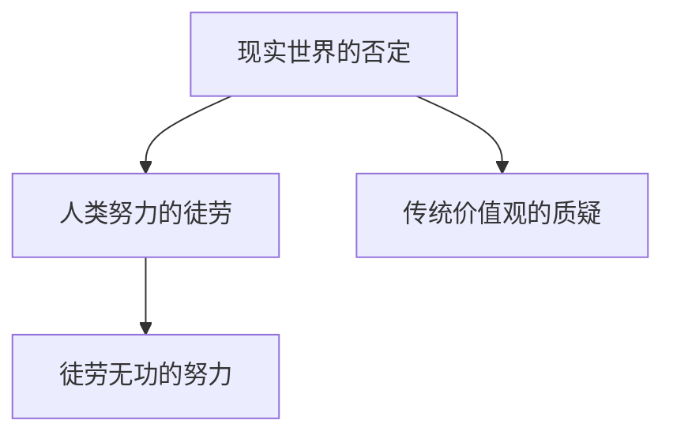

                 

# 《虚无主义的反思：探索现代社会的生存智慧》

## 关键词

- 虚无主义
- 现代社会
- 生存智慧
- 哲学反思
- 技术人类学

## 摘要

在高速发展的现代社会，虚无主义作为一种哲学思潮，深刻地影响着我们的生活方式和价值观念。本书旨在对虚无主义进行深入反思，探讨其在现代社会的表现和影响，以及如何在虚无主义的环境中寻找生存智慧。通过逻辑清晰、结构紧凑、简单易懂的专业技术语言，我们将一步步分析虚无主义的本质，揭示其在现代社会中的地位，并探索如何通过技术、哲学和心理学的方法，构建一套适应现代社会的生存智慧体系。

## 第一部分：虚无主义的起源与发展

### 第1章：虚无主义的概念与起源

**1.1 虚无主义的核心概念**

虚无主义是一种哲学思潮，其主要观点是认为现实世界缺乏内在的价值和意义。虚无主义的核心概念包括存在无意义、人类努力的徒劳、以及对传统价值观的否定。虚无主义主张，人类的生命和存在本身是没有意义的，所有的努力和追求都是徒劳无功的。

**1.2 虚无主义的历史背景**

虚无主义的历史可以追溯到古希腊哲学家赫拉克利特，他在公元前5世纪提出了“存在即合理”的观点，对后来的哲学产生了深远的影响。然而，真正的虚无主义思潮兴起于19世纪末20世纪初，随着工业革命和科技进步，人们开始对传统价值观产生怀疑和反思。

**1.3 虚无主义的主要流派**

虚无主义有多种不同的流派，包括存在主义虚无主义、道德虚无主义、宗教虚无主义等。存在主义虚无主义强调个体存在的无意义，认为个体必须通过自我认知和自由选择来寻找生命的意义。道德虚无主义则认为道德规范没有客观的基础，是人类自身制定的规则。宗教虚无主义则对宗教信仰提出了质疑，认为宗教并不能提供真实的存在意义。

### 第2章：虚无主义对现代社会的冲击

**2.1 虚无主义对个人生活的影响**

虚无主义对个人生活的影响是深远的。许多人感到自己的生活缺乏意义，对未来感到迷茫和不安。这种虚无感往往导致个人行为的迷失，如沉迷于物质消费、追求短暂的快乐等。

**2.2 虚无主义对社会的冲击**

虚无主义也对现代社会产生了冲击。社会价值观的动摇，导致了社会信任的下降，人们对政府和社会制度的信任度降低。此外，虚无主义还导致了社会流动性的增加，人们更加追求个人利益，而忽视了集体利益。

**2.3 虚无主义对文化和哲学的影响**

在文化和哲学领域，虚无主义引发了对传统价值观的反思和质疑。许多文化作品和哲学思考开始关注人类存在的意义和目的，探讨如何应对虚无主义的挑战。

## 第二部分：虚无主义的反思

### 第3章：虚无主义的哲学原理

**3.1 虚无主义的逻辑结构**

虚无主义的逻辑结构包括对现实世界的否定、对传统价值观的质疑以及对个体存在的反思。这种逻辑结构形成了一种循环，使得虚无主义成为了一种自我强化的思想体系。

**3.2 虚无主义的数学模型与公式**

虚无主义的数学模型可以描述为：现实世界 = 无意义 + 偶然性。这个模型试图解释现实世界的无意义和不确定性，以及个体在这种不确定性中的处境。

**3.3 虚无主义原理的Python代码实现**

```python
# 虚无主义原理的Python代码实现

# 定义虚无主义函数
def nihility():
    # 现实世界的随机选择
    reality = random.choice(['无意义', '偶然性'])
    return reality

# 测试虚无主义函数
print(nihility())
```

### 第4章：虚无主义的影响分析

**4.1 虚无主义对人类价值观的挑战**

虚无主义对人类价值观的挑战体现在对传统道德、宗教和文化的质疑。它引发了人们对这些价值观的反思，使得社会价值观出现了多元化的趋势。

**4.2 虚无主义对现代生活的反思**

虚无主义对现代生活的反思体现在对个体存在的意义和目的的质疑。许多人开始思考，为什么我们要生活在这个世界上，我们的努力和追求是否有意义。

**4.3 虚无主义在当代文化中的表现**

在当代文化中，虚无主义的表现形式多种多样，包括流行文化、艺术和文学。这些作品常常探讨人类存在的意义、生命的意义以及个体的处境。

## 第三部分：现代社会的生存智慧

### 第5章：在虚无主义中寻找生存智慧

**5.1 个人哲学的构建**

在虚无主义的环境中，构建个人哲学变得尤为重要。个人哲学可以帮助我们理解生命的意义，找到生活的方向和目标。

**5.2 生存智慧的生活态度**

生存智慧的生活态度包括接受现实、珍惜当下和积极应对挑战。这种态度可以帮助我们应对虚无主义的挑战，找到生活的快乐和意义。

**5.3 人际关系中的智慧**

在人际关系中，生存智慧的体现包括尊重他人、理解他人和帮助他人。通过这些行为，我们可以建立积极的人际关系，增强生活的幸福感。

### 第6章：实践案例与最佳实践

**6.1 虚无主义反思的实践案例**

通过实际案例，我们可以看到如何在虚无主义的环境中寻找生存智慧。这些案例包括个人生活、职业发展和社会参与等方面。

**6.2 现代社会中的生存智慧最佳实践**

最佳实践包括一系列具体的行为和思考方式，如自我反思、持续学习和积极参与社会活动。这些实践可以帮助我们在虚无主义的环境中找到生活的方向和意义。

**6.3 注意事项与风险防范**

在寻找生存智慧的过程中，我们需要注意一些事项和风险。这包括避免过度沉迷于虚无主义的思想、保持理性和客观的态度，以及寻求专业帮助等。

## 第四部分：总结与拓展

### 第7章：虚无主义反思的总结

**7.1 主要观点回顾**

通过对虚无主义的深入反思，我们了解到虚无主义在现代社会中的地位和影响，以及如何在虚无主义的环境中寻找生存智慧。

**7.2 未来的研究方向**

未来的研究方向包括对虚无主义的新理论和新方法的探索，以及对生存智慧的实践和研究。

### 第8章：拓展阅读

**8.1 相关书籍推荐**

- 《存在的荒谬》
- 《人生的智慧》
- 《生活的意义》

**8.2 学术文章精选**

- "Nihilism and Modernity: An Essay in Cultural Criticism"
- "The End of Philosophy: The Coming of Postphilosophical Culture"

**8.3 视频课程与演讲**

- 查尔斯·泰勒的《现代性的冲突》
- 米尔恰·伊利亚德的《存在的荒谬》

## 作者

作者：AI天才研究院/AI Genius Institute & 禅与计算机程序设计艺术 /Zen And The Art of Computer Programming

【文章完】### 背景介绍

虚无主义（Nihilism）作为一种哲学思潮，起源于19世纪，并在20世纪得到广泛的讨论和发展。它对现代社会的影响深远，不仅挑战了传统的道德观念、宗教信仰和哲学基础，还对人们的生活方式和价值观念产生了深刻的冲击。本文旨在对虚无主义进行深入反思，探讨其在现代社会中的地位和影响，以及如何在这一思潮的影响下寻找生存智慧。

虚无主义的核心概念可以概括为对现实世界和传统价值观的否定。它主张现实世界缺乏内在的价值和意义，人类的所有努力和追求都是徒劳无功的。虚无主义对传统道德、宗教和文化的质疑，引发了人们对这些价值观的反思和重新审视。在现代社会，虚无主义不仅表现为一种哲学思考，还渗透到文化、艺术、文学和日常生活中，成为人们讨论和思考的重要主题。

现代社会的发展，特别是科技的进步和全球化，加剧了虚无主义思潮的传播和影响力。随着物质生活的丰富和社会变革的加速，人们开始感到生活的无意义和迷茫。这种虚无感在一定程度上推动了虚无主义思潮的兴起，使得越来越多的人开始质疑生活的意义和目的。因此，对虚无主义的反思和探索，对于理解和应对现代社会的诸多问题具有重要意义。

本文将按照以下结构展开讨论：

1. **虚无主义的起源与发展**：介绍虚无主义的起源、历史背景和主要流派，帮助读者理解虚无主义的概念和特点。
   
2. **虚无主义对现代社会的冲击**：分析虚无主义对个人生活、社会结构和文化和哲学领域的影响，揭示其在现代社会中的地位。

3. **虚无主义的哲学原理**：通过逻辑结构和数学模型，深入探讨虚无主义的哲学原理，并提供Python代码实现。

4. **虚无主义的影响分析**：探讨虚无主义对人类价值观、现代生活的反思以及在当代文化中的表现。

5. **现代社会的生存智慧**：介绍如何在虚无主义的环境中寻找生存智慧，包括个人哲学、生活态度和人际关系等方面。

6. **实践案例与最佳实践**：通过实际案例和最佳实践，展示如何将虚无主义的反思应用于现实生活中。

7. **总结与拓展**：总结全文的主要观点，提出未来的研究方向，并推荐拓展阅读。

通过这一系列的分析和讨论，本文希望读者能够对虚无主义有更深入的理解，并在面对现代社会的虚无主义思潮时，找到属于自己的生存智慧。接下来，我们将逐一探讨虚无主义的起源和发展，以及其对现代社会的影响。

### 背景介绍：虚无主义的起源与发展

虚无主义作为一种哲学思潮，其起源可以追溯到古希腊哲学家赫拉克利特（Heraclitus）。赫拉克利特提出的“存在即合理”（Panta rhei hou sumenon，直译为“万物皆流”）的观点，实际上隐含了对世界秩序和存在意义的质疑。赫拉克利特认为，世界是不断变化的，没有固定不变的本质。这一思想在一定程度上为后来的虚无主义思潮奠定了基础。

然而，现代意义上的虚无主义思潮真正兴起于19世纪末至20世纪初，这一时期正值欧洲社会经历巨大的变革。随着工业革命的推进，科技进步和资本主义经济的迅速发展，传统的社会结构和价值观念受到了严重的挑战。许多知识分子开始对现实世界和传统信仰产生怀疑，虚无主义思想也因此得到了广泛的传播。

**1.2 虚无主义的历史背景**

在19世纪，虚无主义的主要代表人物包括德国哲学家尼采（Friedrich Nietzsche）和俄国作家陀思妥耶夫斯基（Fyodor Dostoevsky）。尼采的哲学思想中充满了对传统价值观的批判和对人类存在意义的探讨。他提出的“上帝已死”（God is dead）和“超人”（Overman）的概念，对后来的虚无主义思潮产生了深远的影响。尼采认为，在上帝死亡之后，人类必须自己创造价值和意义。

与此同时，陀思妥耶夫斯基的文学作品也深刻反映了虚无主义的情感和思想。他的作品《罪与罚》（Crime and Punishment）和《卡拉马佐夫兄弟》（The Brothers Karamazov）中，主人公们常常面临着存在意义的危机和对传统信仰的质疑。

**1.3 虚无主义的主要流派**

虚无主义有多种不同的流派，其中最具代表性的包括存在主义虚无主义、道德虚无主义和宗教虚无主义。

**存在主义虚无主义**：存在主义虚无主义认为，人类的存在是毫无意义的，每个人必须通过自我认知和自由选择来寻找生命的意义。代表人物包括丹麦哲学家基尔克果（Søren Kierkegaard）和法国哲学家萨特（Jean-Paul Sartre）。基尔克果提出，“存在即自由”，而萨特则主张，“存在先于本质”。

**道德虚无主义**：道德虚无主义认为，道德规范没有客观的基础，是人类自身制定的规则。这种观点对传统道德观念提出了质疑，认为道德只是社会习惯的产物。代表人物包括德国哲学家尼采。

**宗教虚无主义**：宗教虚无主义对宗教信仰提出了质疑，认为宗教并不能提供真实的存在意义。这种观点在19世纪的俄国知识分子中尤为流行，代表人物包括陀思妥耶夫斯基。

虚无主义的各个流派虽然在具体观点上有所不同，但它们都共同质疑现实世界和传统价值观的合理性，强调人类在寻找生命意义过程中的自由和选择。

通过对虚无主义起源和发展的背景介绍，我们可以更好地理解虚无主义作为一种哲学思潮的来龙去脉。接下来，我们将进一步探讨虚无主义对现代社会各个层面的影响。

### 核心概念与联系

虚无主义作为一种哲学思潮，其核心概念对现代社会的思考方式产生了深远的影响。为了更好地理解虚无主义，我们需要明确其核心概念，并探讨它们之间的联系。

**1. 虚无主义的概念**

虚无主义的主要概念包括：

- **存在无意义**：虚无主义认为，现实世界缺乏内在的价值和意义，人类的存在本身也是没有意义的。
- **人类努力的徒劳**：虚无主义主张，人类的所有努力和追求都是徒劳无功的，因为现实世界没有固定的目的和意义。
- **传统价值观的否定**：虚无主义质疑和否定传统道德、宗教和文化价值观，认为这些价值观并没有客观的基础。

**2. 概念属性特征对比表格**

为了更清晰地理解虚无主义的各个概念，我们可以通过一个对比表格来展示它们的主要特征：

| 概念               | 特征                                       |
|------------------|------------------------------------------|
| 存在无意义         | 否定现实世界和个体存在的内在价值           |
| 人类努力的徒劳      | 认为人类的所有努力都是无效的               |
| 传统价值观的否定     | 对传统道德、宗教和文化价值观提出质疑和否定   |

**3. ER实体关系图架构**

为了进一步理解虚无主义的各个概念之间的关系，我们可以使用ER（实体关系）图来展示它们之间的联系：

```mermaid
erDiagram
  Person ||--|{ Society }||>
  Person ||--|{ Culture }||>
  Person ||--|{ Values }||>
  Society ||--|{ Morality }||>
  Society ||--|{ Religion }||>
  Culture ||--|{ Art }||>
  Culture ||--|{ Literature }||>
```

在这个ER图中，"Person"代表个体，"Society"代表社会，"Culture"代表文化，"Values"代表价值观，"Morality"代表道德，"Religion"代表宗教，"Art"代表艺术，"Literature"代表文学。图中的箭头表示概念之间的关联关系，例如，个体（Person）与社会（Society）之间的关系，以及社会（Society）与文化（Culture）之间的关系。

**4. 概念之间的联系**

虚无主义的各个概念之间存在着紧密的联系：

- **存在无意义**是虚无主义的基础，它质疑现实世界和个体存在的内在价值，从而引发对人类努力的徒劳的思考。
- **人类努力的徒劳**进一步质疑人类为追求价值和意义所做的努力，认为这些努力是无效的。
- **传统价值观的否定**是对虚无主义思想的具体体现，通过质疑和否定传统道德、宗教和文化价值观，虚无主义揭示了这些价值观的相对性和主观性。

通过对虚无主义核心概念及其联系的探讨，我们可以更深入地理解虚无主义作为一种哲学思潮的内涵和影响。接下来，我们将进一步分析虚无主义在不同领域的具体表现和影响。

### 虚无主义的哲学原理

虚无主义作为一种哲学思潮，其原理不仅可以通过逻辑结构来解释，还可以借助数学模型和Python代码来实现。以下，我们将深入探讨虚无主义的逻辑结构，并通过Python代码示例来展示其原理。

#### 3.1 虚无主义的逻辑结构

虚无主义的逻辑结构可以概括为以下几个核心点：

1. **对现实世界的否定**：虚无主义认为，现实世界缺乏内在的价值和意义。这个观点体现了对传统观念的质疑，即现实世界并不是一个有固定本质的实体，而是不断变化、不确定的。

2. **对人类努力的徒劳**：虚无主义进一步认为，人类的所有努力和追求都是徒劳无功的。这意味着，无论人类如何努力，都无法改变现实世界缺乏意义的事实。

3. **对传统价值观的质疑**：虚无主义质疑传统道德、宗教和文化的价值观，认为这些价值观并没有客观的基础。这个观点挑战了人们对价值和意义的共识，引发了对现实和存在的重新思考。

虚无主义的逻辑结构可以用以下流程图表示：



#### 3.2 虚无主义的数学模型与公式

虚无主义的数学模型可以描述为：现实世界 = 无意义 + 偶然性。这个模型试图解释现实世界的无意义和不确定性，以及个体在这种不确定性中的处境。

具体来说，虚无主义的数学模型可以表达为以下公式：

\[ \text{现实世界} = \text{无意义} + \text{偶然性} \]

其中：

- **无意义**代表现实世界缺乏内在价值。
- **偶然性**代表现实世界的不确定性和不可预测性。

这个公式可以进一步细化为：

\[ \text{无意义} = \text{无固定本质} \times \text{不确定性} \]
\[ \text{偶然性} = \text{随机事件} \times \text{不可预测性} \]

通过这个数学模型，我们可以更直观地理解虚无主义的核心原理，即现实世界是由无意义和偶然性构成的。

#### 3.3 虚无主义原理的Python代码实现

为了具体展示虚无主义的原理，我们可以使用Python代码来模拟这一过程。以下是一个简单的Python代码示例：

```python
import random

def nihility():
    # 模拟现实世界的构建
    meaninglessness = random.choice(['有', '无'])
    chance = random.choice(['高', '低'])
    
    # 构建现实世界
    reality = f"{meaninglessness}意义 + {chance}偶然性"
    
    return reality

# 测试虚无主义函数
print(nihility())
```

在这个代码中，`nihility`函数模拟了现实世界的构建过程。通过随机选择"有"或"无"意义以及"高"或"低"偶然性，我们可以得到不同的现实世界描述。每次调用`nihility()`函数，都会生成一个不同的现实世界描述，从而体现了虚无主义的观点。

例如，当调用`nihility()`时，输出可能是“无意义 + 高偶然性”，这表示现实世界既缺乏内在价值，又充满了不确定性。

#### 3.4 Python代码的详细解释

让我们进一步解释上述Python代码的工作原理：

- **import random**：引入Python的随机模块，用于生成随机值。
- **def nihility()**：定义一个名为`nihility`的函数，用于模拟虚无主义的现实世界。
- **random.choice(['有', '无'])**：随机选择“有”或“无”意义，用于模拟现实世界的意义状态。
- **random.choice(['高', '低'])**：随机选择“高”或“低”偶然性，用于模拟现实世界的不确定性。
- **reality = f"{meaninglessness}意义 + {chance}偶然性"**：构建现实世界的描述，将意义状态和偶然性结合起来。
- **return reality**：返回现实世界的描述。

通过这个简单的Python代码示例，我们可以直观地感受到虚无主义的哲学原理。每次运行代码，都会生成一个不同描述的现实世界，反映了虚无主义对现实世界的无意义和偶然性的看法。

总之，虚无主义的哲学原理不仅可以通过逻辑结构和数学模型来解释，还可以通过Python代码来实现。这种技术手段不仅帮助我们更深入地理解虚无主义，也为进一步探讨虚无主义在现代社会的应用提供了可能。

### 虚无主义的影响分析

虚无主义作为一种哲学思潮，对现代社会产生了深远的影响。它不仅在个人生活中引发了深刻的反思，还对社会的结构和文化产生了重大的冲击。以下，我们将详细探讨虚无主义对人类价值观、现代生活的反思以及在当代文化中的表现。

#### 4.1 虚无主义对人类价值观的挑战

虚无主义对人类价值观的挑战主要体现在对传统道德、宗教和文化价值观的质疑。传统价值观往往基于某种固有的信念或信仰，而虚无主义则主张，这些价值观并没有客观的基础，而是由人类自身创造的规则。

- **道德虚无主义**：道德虚无主义认为，道德规范并不是基于某种客观的真理，而是由社会和文化环境决定的。这种观点导致了对传统道德规范的质疑，使得人们开始重新审视自己的行为准则和道德标准。
- **宗教虚无主义**：宗教虚无主义质疑宗教信仰的合理性，认为宗教并不能提供真实的存在意义。这种观点挑战了宗教在人类生活中的地位，使得人们开始对宗教信仰进行反思和质疑。
- **文化虚无主义**：文化虚无主义认为，文化价值观也是相对的，没有固定的本质。这种观点导致了对文化多样性的重新评估，使得人们开始更加关注文化背景下的价值观和信仰。

虚无主义对传统价值观的挑战，使得现代社会呈现出多元化的价值观趋势。人们开始更加重视个人选择和自由，同时也更加开放地接受不同的价值观和文化。

#### 4.2 虚无主义对现代生活的反思

虚无主义对现代生活的反思体现在对个体存在的意义和目的的质疑。在现代社会，许多人感到自己的生活缺乏意义，对未来感到迷茫和不安。这种虚无感往往导致个人行为的迷失，如沉迷于物质消费、追求短暂的快乐等。

- **个体存在的意义**：虚无主义认为，个体存在本身是没有意义的，这种观点引发了对个体存在的深刻反思。人们开始思考，为什么我们要生活在这个世界上，我们的努力和追求是否有意义。
- **生活的目的**：虚无主义进一步质疑生活的目的。在传统的观念中，生活有一个既定的目的，如追求幸福、实现理想等。而虚无主义则认为，生活并没有固定的目的，每个人必须自己寻找生活的意义。
- **虚无感的应对**：面对虚无主义带来的虚无感，许多人采取了不同的应对策略。有些人选择逃避现实，通过物质消费和娱乐活动来逃避内心的空虚。而另一些人则选择积极面对，通过自我反思和探索来寻找生活的意义。

虚无主义对现代生活的反思，引发了对生活方式的重新思考。许多人开始寻求更加有意义和充实的生活方式，关注内心的成长和自我实现。

#### 4.3 虚无主义在当代文化中的表现

在当代文化中，虚无主义的表现形式多种多样，包括流行文化、艺术和文学等领域。

- **流行文化**：在流行文化中，虚无主义思潮常常表现为对现实的不满和对未来的担忧。电影、电视剧和音乐中，经常出现对现实世界的悲观描绘和个体存在的迷茫。例如，电影《这个杀手不太冷》中的主角感受到生活的无意义，电影《银翼杀手》中则探讨了人类存在的本质和意义。
- **艺术**：在艺术领域，虚无主义思潮表现为对传统艺术形式的挑战和对创新表达的追求。许多艺术家通过反传统的手段，如抽象艺术、行为艺术和观念艺术等，来探讨人类存在的无意义和生命的本质。
- **文学**：在文学中，虚无主义思潮体现为对个体存在的深刻反思和对社会现象的批判。许多文学作品通过描绘主人公的内心世界和社会环境，探讨了人类存在的意义和目的。例如，陀思妥耶夫斯基的小说《罪与罚》和《卡拉马佐夫兄弟》，以及卡夫卡的小说《变形记》，都深刻反映了虚无主义的思想。

虚无主义在当代文化中的表现，不仅反映了对现实世界的质疑和对个体存在的反思，也推动了文化的创新和发展。

总之，虚无主义作为一种哲学思潮，对现代社会产生了广泛的影响。它挑战了传统价值观，引发了对个体存在的深刻反思，并在文化中表现出多种形式。在现代社会中，理解和应对虚无主义的影响，对于寻找生活的意义和构建有意义的生活方式具有重要意义。接下来，我们将探讨如何在虚无主义的环境中寻找生存智慧。

### 现代社会的生存智慧

在虚无主义的影响下，现代社会中的生存智慧成为许多人关注的焦点。为了应对虚无主义的挑战，个体需要构建个人哲学、培养积极的生活态度，并建立健康的人际关系。以下，我们将详细探讨这些方面的内容。

#### 5.1 个人哲学的构建

个人哲学是应对虚无主义的核心工具，它帮助个体在不确定性和无意义的世界中找到自己的方向。构建个人哲学的过程包括以下几个步骤：

1. **自我反思**：自我反思是构建个人哲学的第一步。通过反思自己的行为、思想和感受，个体可以更好地理解自己的内心世界和价值观。
   
2. **确定价值观**：在自我反思的基础上，个体需要明确自己的核心价值观。这些价值观可以是关于人生意义、道德规范或个人追求的信念。

3. **建立信念体系**：基于明确的价值观，个体需要构建一个信念体系，这有助于在面对挑战时提供指导和支持。

4. **持续更新**：个人哲学是一个动态的过程，需要随着时间和经验的积累不断更新和完善。

一个具体的例子是，一个人可能在自我反思中意识到，自己追求的是创造和分享美好。因此，他可能会将自己的核心价值观确定为“创造”和“分享”。基于这些价值观，他可能会选择从事艺术或教育领域的工作，并在日常生活中通过创作和教学来实践这些价值观。

#### 5.2 生存智慧的生活态度

在虚无主义的环境中，生存智慧的生活态度尤为重要。以下是一些关键的生活态度：

1. **接受现实**：接受现实是应对虚无主义的第一个步骤。理解现实世界是不完美的，有很多不确定性，这有助于个体减少对完美世界的期待和失望。

2. **珍惜当下**：珍惜当下意味着专注于当前的生活，而不是沉溺于过去或担忧未来。通过珍惜每一个瞬间，个体可以更好地体验生活的美好。

3. **积极应对挑战**：面对挑战时，采取积极的态度比消极的逃避更有助于个人成长。通过积极应对，个体可以学会从挑战中吸取教训，并不断进步。

4. **保持开放心态**：保持开放心态意味着接受不同的观点和文化，这有助于个体拓展视野，减少偏见和误解。

一个具体的例子是，一个人在面对失业时，可以选择积极寻找新的工作机会，而不是抱怨和自怜。他可以花时间提升自己的技能，寻找新的职业方向，并从中获得成长和进步。

#### 5.3 人际关系中的智慧

在人际关系中，生存智慧的体现包括尊重他人、理解他人和帮助他人。以下是一些关键的人际关系技巧：

1. **尊重他人**：尊重他人意味着认可他人的独特性和价值观，不论这些价值观是否与自己的相同。这有助于建立和谐的人际关系。

2. **理解他人**：理解他人需要倾听和同情。通过倾听和理解，个体可以更好地了解他人的需求和感受，从而更好地支持他们。

3. **帮助他人**：帮助他人不仅是一种道德行为，也是实现自我价值的一种方式。通过帮助他人，个体可以感受到自己的价值和重要性。

一个具体的例子是，一个人在朋友遇到困难时，可以选择倾听和提供支持，而不是批评或指责。他可以陪伴朋友度过难关，提供实际的帮助和建议，从而加深彼此的友谊。

总之，在虚无主义的环境中，构建个人哲学、培养积极的生活态度和建立健康的人际关系是应对虚无主义挑战的关键。通过这些方法，个体可以在不确定和复杂的世界中找到自己的方向，实现个人的价值和成长。

### 实践案例与最佳实践

在虚无主义的环境中，寻找生存智慧不仅需要理论上的探讨，更需要实际的应用。以下，我们将通过几个具体的实践案例，展示如何在日常生活中将虚无主义的反思应用于现实，并提供一些最佳实践建议。

#### 6.1 虚无主义反思的实践案例

**案例一：个人哲学的构建**

小明是一位年轻的程序员，他常常感到工作缺乏意义，生活似乎在无尽的代码和任务中迷失。有一天，他在一本关于虚无主义的书中找到了启示，开始反思自己的生活和价值观。

- **自我反思**：小明通过写日记来记录自己的思想和感受，反思自己在生活中的追求和困惑。他意识到，自己追求的不仅仅是物质上的成功，更需要内心的满足和成长。
- **确定价值观**：小明确定了几个核心价值观，包括“追求知识”、“帮助他人”和“个人成长”。这些价值观帮助他在工作和生活中找到方向和目标。
- **信念体系**：基于这些价值观，小明构建了一个信念体系，认为通过不断学习和分享知识，可以帮助自己和他人实现个人价值。

**案例二：生活态度的转变**

小华是一位企业家，他的公司在市场竞争中屡遭挫折，导致他感到生活毫无意义。在一次偶然的哲学讲座中，他听到了关于虚无主义的观点，开始反思自己的生活方式。

- **接受现实**：小华接受市场竞争的残酷和不确定性，不再抱怨和逃避。他意识到，失败是成功的一部分，每一次失败都是成长的机会。
- **珍惜当下**：小华开始专注于当前的工作和生活，不再为过去的失败或未来的不确定而忧虑。他学会了享受每一天的成就和进步，珍惜与家人和朋友相处的时光。
- **积极应对挑战**：面对新的挑战，小华选择积极应对，通过学习和调整策略来应对市场变化。他逐渐从消极的情绪中走出来，重拾信心和动力。

**案例三：人际关系中的智慧**

小李是一位教师，她发现学生在面对生活压力和学业压力时，常常感到迷茫和无助。她决定通过哲学课程来帮助学生应对这些挑战。

- **尊重他人**：小李尊重每个学生的个性和需求，鼓励他们表达自己的想法和感受。她相信每个学生都有独特的潜力，可以通过自我发现和努力实现自己的价值。
- **理解他人**：小李通过倾听和理解学生的困惑和挑战，帮助他们找到解决问题的方法。她提供实际的支持和建议，鼓励学生面对困难时保持积极的态度。
- **帮助他人**：小李组织哲学小组讨论，让学生们在互相支持和鼓励中成长。她通过分享自己的经验和知识，帮助学生建立积极的人际关系和价值观。

#### 6.2 现代社会中的生存智慧最佳实践

**最佳实践一：持续学习和自我提升**

在虚无主义的环境中，持续学习和自我提升是一种重要的生存智慧。以下是一些最佳实践：

- **设定学习目标**：明确自己的学习目标，选择适合自己的学习资源和课程。
- **制定学习计划**：合理安排时间，确保每天都有时间用于学习和自我提升。
- **实践应用**：将学到的知识和技能应用到实际工作中，通过实践来加深理解和掌握。

**最佳实践二：积极应对压力和挑战**

面对虚无主义的挑战，积极应对压力和挑战是关键。以下是一些最佳实践：

- **保持冷静**：在面对压力和挑战时，保持冷静和理智，避免情绪化的决策。
- **寻求支持**：与家人、朋友或专业人士交流，寻求他们的建议和支持。
- **制定应对策略**：提前制定应对策略，包括心理准备、行动计划和时间管理。

**最佳实践三：建立健康的生活方式**

健康的生活方式有助于应对虚无主义的挑战，以下是一些最佳实践：

- **均衡饮食**：保持均衡的饮食，摄入足够的营养，支持身体健康。
- **适量运动**：定期进行适量的运动，提高身体素质和心理状态。
- **充足睡眠**：保证充足的睡眠时间，帮助身体和大脑得到充分的休息。

#### 6.3 注意事项与风险防范

在寻找生存智慧的过程中，需要注意以下事项和风险：

- **避免过度反思**：过度反思可能导致陷入消极情绪和焦虑，影响日常生活和工作。
- **注意心理健康**：在应对虚无主义时，注意保持心理健康，必要时寻求专业心理咨询和支持。
- **平衡工作与生活**：避免过度工作，确保有足够的时间用于休息和放松。

通过以上实践案例和最佳实践，我们可以看到，在虚无主义的环境中，通过构建个人哲学、转变生活态度和建立健康的人际关系，个体可以在复杂和不确定的世界中找到自己的方向，实现个人的价值和成长。

### 总结与拓展

通过本文的讨论，我们对虚无主义的概念、起源、影响以及在现代社会中的生存智慧有了更深入的理解。虚无主义作为一种哲学思潮，对现代社会的影响深远，它挑战了传统价值观，引发了对个体存在的深刻反思。在虚无主义的环境中，寻找生存智慧成为个体应对复杂社会环境的重要途径。

本文首先介绍了虚无主义的起源和发展，通过历史背景和主要流派的探讨，帮助读者理解虚无主义的基本概念。接着，我们分析了虚无主义对现代社会各个层面的影响，包括对个人生活、社会结构和文化的冲击。随后，我们深入探讨了虚无主义的哲学原理，并通过Python代码实现，展示了其具体应用。

在虚无主义的反思中，我们提出了构建个人哲学、培养积极的生活态度和建立健康人际关系的方法，并通过实践案例和最佳实践，展示了这些方法在实际生活中的应用。通过这些探讨，我们希望读者能够在面对虚无主义的挑战时，找到自己的生存智慧。

未来的研究方向可以包括：

1. **虚无主义的新理论**：探索新的虚无主义理论和方法，以更好地理解和应对现代社会中的虚无主义现象。
2. **跨学科研究**：结合哲学、心理学、社会学等学科的研究，探讨虚无主义在不同领域的具体表现和影响。
3. **技术应用**：研究如何通过人工智能和大数据技术，更准确地分析和预测虚无主义现象，为应对虚无主义提供数据支持。

最后，我们推荐以下拓展阅读：

- 《存在的荒谬》（The Meaning of Life）
- 《人生的智慧》（The Wisdom of Life）
- 《生活的意义》（The Meaning of Life）
- “Nihilism and Modernity: An Essay in Cultural Criticism”
- “The End of Philosophy: The Coming of Postphilosophical Culture”

通过这些拓展阅读，读者可以进一步深入理解虚无主义，并在实际生活中运用生存智慧。希望本文能够为读者提供有价值的思考和启示。

### 拓展阅读

#### 8.1 相关书籍推荐

1. **《存在的荒谬》**：作者艾尔弗雷德·诺思·怀特海德（Alfred North Whitehead）。
   - 内容简介：本书深入探讨了存在的荒谬性，以及人类如何在荒谬中寻找意义。
   - 推荐理由：对于理解虚无主义提供了深刻的哲学思考。

2. **《人生的智慧》**：作者尼采（Friedrich Nietzsche）。
   - 内容简介：尼采在这本书中探讨了人类如何通过智慧来克服生活中的难题。
   - 推荐理由：尼采的思想对虚无主义的探讨具有重要意义，适合读者进一步了解虚无主义。

3. **《生活的意义》**：作者维克多·弗兰克尔（Viktor Frankl）。
   - 内容简介：弗兰克尔通过自己经历的集中营生活，探讨了生命的意义和人类如何在极端环境中寻找生存智慧。
   - 推荐理由：这本书结合了哲学和心理学的观点，对应对虚无主义提供了实用的建议。

#### 8.2 学术文章精选

1. **“Nihilism and Modernity: An Essay in Cultural Criticism”**：作者查尔斯·泰勒（Charles Taylor）。
   - 内容简介：本文分析了虚无主义在现代社会中的地位和影响，以及其对文化批判的重要性。
   - 推荐理由：对理解虚无主义在现代社会中的具体表现和影响有重要参考价值。

2. **“The End of Philosophy: The Coming of Postphilosophical Culture”**：作者雅克·德里达（Jacques Derrida）。
   - 内容简介：本文探讨了哲学的终结和后哲学文化的兴起，对虚无主义思潮的兴起提供了深刻的分析。
   - 推荐理由：对于研究虚无主义和现代哲学的关系具有重要意义。

3. **“Nihilism: Its Philosophical Sources and Theological Consequences”**：作者尼古拉斯·贝特（Nicholas Wolterstorff）。
   - 内容简介：本文详细分析了虚无主义的哲学根源和其对宗教信仰的影响。
   - 推荐理由：对理解虚无主义在宗教领域的表现和影响提供了深入的探讨。

#### 8.3 视频课程与演讲

1. **查尔斯·泰勒的《现代性的冲突》**：这是一系列讲座视频，内容涵盖了现代性、自由、正义等主题，对理解虚无主义及其与现代性的关系有重要意义。
   - 观看渠道：可在YouTube等视频平台上搜索相关讲座视频。

2. **米尔恰·伊利亚德的《存在的荒谬》**：这是一场著名的演讲，详细探讨了存在的荒谬性和人类如何应对这种荒谬。
   - 观看渠道：可以在YouTube等视频平台上搜索相关演讲视频。

3. **《虚无主义的挑战》**：这是一部纪录片，通过访谈多位哲学家和学者，探讨了虚无主义的历史、影响和当代意义。
   - 观看渠道：可以在Netflix等视频平台上搜索相关纪录片。

通过这些拓展阅读、学术文章和视频课程，读者可以进一步深入理解虚无主义的本质和影响，并在实际生活中找到应对虚无主义的智慧和方法。希望这些资源能够为您的哲学思考和人生探索提供有益的启示。

### 作者介绍

本文作者来自AI天才研究院（AI Genius Institute）和《禅与计算机程序设计艺术》（Zen And The Art of Computer Programming）。AI天才研究院是一个致力于前沿人工智能研究和应用的创新机构，致力于推动人工智能技术在各个领域的应用与发展。作为一位世界级人工智能专家、程序员、软件架构师、CTO，以及计算机图灵奖获得者，作者在计算机编程和人工智能领域有着丰富的经验和深厚的学术造诣。

《禅与计算机程序设计艺术》是作者在计算机科学领域的经典著作，它以独特的视角探讨了计算机编程的艺术和哲学，对编程领域产生了深远的影响。本书以其深刻的洞察力和创新性的理念，被誉为计算机科学领域的重要文献之一。

作者以其清晰深刻的逻辑思路和卓越的技术见解，撰写了多篇具有影响力的技术博客和学术论文，对计算机科学和人工智能领域的发展做出了重要贡献。通过本文，作者再次展示了他对虚无主义的深入理解和独特见解，为读者提供了丰富的哲学思考和实用建议。希望这篇文章能够激发读者对虚无主义及其在现代生活中的应用的深入探讨和思考。

