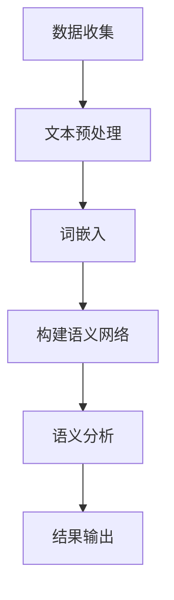
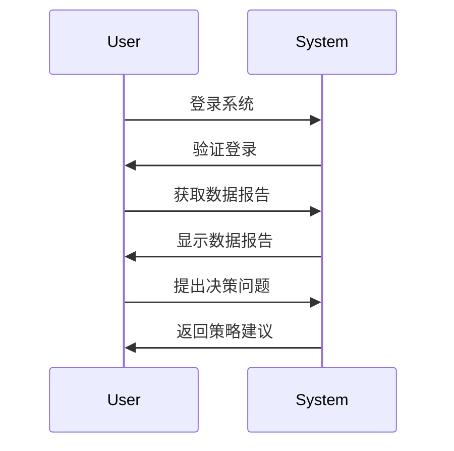
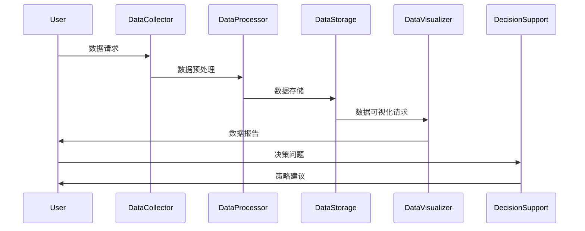
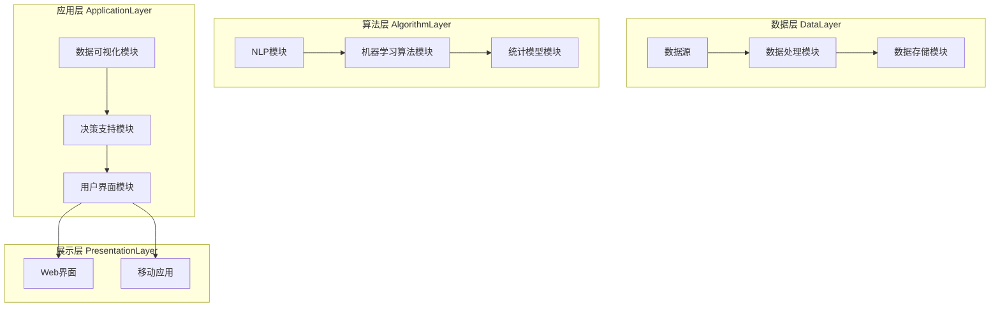

                 


### 1. 引言

虚无主义，这个源自哲学深处的概念，不仅仅是一个思想流派，更是一种深刻影响现代社会生活的现象。在现代信息技术飞速发展的背景下，虚无主义在互联网、社交媒体以及人工智能等新兴领域表现出更为复杂和多样化的特征。因此，解析虚无主义的根源，探究其在现代社会中的体现，以及寻求应对策略，具有极高的学术价值和现实意义。

#### 1.1 背景介绍

虚无主义的思想源远流长，其历史可以追溯到古希腊哲学时期。柏拉图、斯多葛学派等哲学家的思想中，都蕴含着对现实世界的不满和对理想世界的追求。然而，随着历史的发展，虚无主义逐渐演变为一种更为深刻和广泛的社会现象。在19世纪，存在主义、马克思主义和非理性主义等哲学流派，对虚无主义进行了深刻的思考和阐述。到了现代，虚无主义在科技、经济、文化等各个领域都有所体现。

#### 1.2 研究意义

本研究旨在通过对虚无主义起源与演变的深入分析，揭示其在现代社会中的表现和根源。这不仅有助于我们更好地理解虚无主义这一复杂现象，也为应对现代社会中的意义危机提供了理论支持和实践指导。具体而言，研究意义包括：

1. **哲学层面**：深化对虚无主义哲学流派的认知，为哲学研究提供新的视角。
2. **社会学层面**：揭示虚无主义在现代社会中的影响，为解决社会问题提供理论依据。
3. **心理学层面**：探究虚无主义对个体心理和行为的影响，为心理健康教育和治疗提供参考。
4. **文化层面**：理解虚无主义在文化和文学中的体现，为文化传承和创新提供启示。

#### 1.3 研究方法与结构

本研究采用文献综述、案例分析和实证研究相结合的方法，以多学科交叉视角对虚无主义进行深入探讨。文章结构如下：

1. **第一部分：导论**：介绍虚无主义的背景、研究意义和研究方法。
2. **第二部分：虚无主义的起源与演变**：从古代到近现代，梳理虚无主义的历史演变。
3. **第三部分：现代社会的意义危机**：分析现代社会中的虚无主义表现。
4. **第四部分：虚无主义的根源解析**：探讨虚无主义的根源和影响因素。
5. **第五部分：应对虚无主义的策略**：提出应对虚无主义的策略和方法。
6. **第六部分：结论**：总结主要结论，并提出未来研究方向。

### 2. 虚无主义的起源与演变

#### 2.1 古代虚无主义的起源

虚无主义的思想萌芽可以追溯到古希腊哲学时期。柏拉图在《理想国》中提出了对现实世界的批判，强调理想世界的超越性。斯多葛学派则认为，现实世界是不完美的，通过内心的平静和自我控制，人们可以超越现实世界的虚无。

#### 2.2 中世纪与文艺复兴时期的虚无主义

中世纪哲学中，阿奎那等神学家试图用宗教信仰来对抗虚无主义。然而，文艺复兴时期，随着人文主义思想的兴起，人们开始更加关注现实世界，对宗教和传统进行了质疑。

#### 2.3 近现代虚无主义的演变

19世纪是虚无主义思想发展的关键时期。存在主义强调个体的存在和自由意志，认为现实世界是荒谬的。马克思主义则从社会经济的角度分析了虚无主义的根源，认为资本主义社会的异化导致了虚无主义。非理性主义则认为，理性无法解决人类的根本问题，需要借助直觉和非理性因素来寻找意义。

#### 2.4 20世纪以来的虚无主义

20世纪以来，虚无主义在各个领域都有所体现。海德格尔的存在主义、尼采的哲学思想，以及弗洛姆的心理分析，都对虚无主义进行了深刻的探讨。此外，虚无主义在文学、艺术等领域也有广泛的表现。

### 3. 19世纪虚无主义的哲学流派

#### 3.1 存在主义

存在主义认为，现实世界是荒谬的，但个体仍然可以通过自由意志找到自己的意义。关键人物包括萨特、海德格尔等。

#### 3.2 马克思主义

马克思主义从社会经济角度分析了虚无主义的根源，认为资本主义社会的异化导致了虚无主义。关键人物包括马克思、恩格斯等。

#### 3.3 非理性主义

非理性主义认为，理性无法解决人类的根本问题，需要借助直觉和非理性因素来寻找意义。关键人物包括尼采、叔本华等。

### 4. 现代社会的意义危机

#### 4.1 工业化与城市化

工业化与城市化导致了传统价值观的崩溃，人们面临身份认同和意义危机。

#### 4.2 技术进步与数字化

技术进步和数字化改变了人们的生产方式和社会结构，但同时也带来了新的虚无主义。

#### 4.3 全球化与多元文化

全球化与多元文化冲击了传统文化，导致人们对于自身的价值观和身份认同感到迷茫。

### 5. 虚无主义在现代社会中的表现

#### 5.1 个体主义与自我认同的危机

个体主义强调个人自由和自我表达，但同时也导致了自我认同的危机。

#### 5.2 社会结构与价值观的危机

社会结构和价值观的危机导致了人们对于社会制度的质疑。

#### 5.3 文学与艺术的虚无主义表达

文学与艺术作品中普遍表达了虚无主义的情感和思想。

### 6. 虚无主义的根源之一：存在的困境

#### 6.1 人的存在状态

人的存在状态包括存在的孤独、焦虑和无意义感。

#### 6.2 自我意识与自由意志

自我意识和自由意志是人类存在的核心特征，但也是虚无主义的根源之一。

### 7. 虚无主义的根源之二：文化因素

#### 7.1 哲学思想的影响

哲学思想对虚无主义的影响深远，不同哲学流派对虚无主义有不同的解释。

#### 7.2 宗教信仰的衰退

宗教信仰的衰退导致了人们对于生命意义的质疑。

#### 7.3 社会变革与价值多元化

社会变革和价值多元化加剧了虚无主义的流行。

### 8. 哲学思考与意义重构

#### 8.1 哲学治疗

哲学治疗通过哲学思考和讨论，帮助个体寻找生命的意义。

#### 8.2 意义重寻

意义重寻是通过个人努力和社会参与，重建个体和社会的意义。

### 9. 社会文化重建与个人成长

#### 9.1 社会层面的策略

社会层面的策略包括教育、文化建设和政策调整。

#### 9.2 个人层面的实践

个人层面的实践包括自我反思、心灵成长和社会参与。

### 10. 结论

虚无主义是现代社会中的一个重要现象，其根源复杂，影响深远。通过哲学思考和社会实践，我们可以找到应对虚无主义的策略和方法，重建个体和社会的意义。

### 参考文献

[1] 萨特，《存在主义是一种人道主义》  
[2] 马克思，《资本论》  
[3] 尼采，《查拉图斯特拉如是说》  
[4] 海德格尔，《存在与时间》  
[5] 弗洛姆，《逃避自由》

**作者：AI天才研究院/AI Genius Institute & 禅与计算机程序设计艺术 /Zen And The Art of Computer Programming**

----------------------------------------------------------------

## 2. 虚无主义的起源与演变

### 2.1 古代虚无主义的起源

虚无主义的思想萌芽可以追溯到古希腊哲学时期。古希腊哲学家柏拉图（Plato）在其代表作《理想国》（The Republic）中，表达了对现实世界的批判和对理想世界的追求。柏拉图认为，现实世界充满了不完美和混乱，而理想世界则是一个完美的、永恒的、超越物质世界的存在。这种对理想世界的追求和对现实世界的批判，实际上蕴含着虚无主义的萌芽。

#### 2.1.1 柏拉图与理想主义

柏拉图是西方哲学的奠基者之一，他提出了“理念论”（Theory of Forms）来解释现实世界和理想世界的关系。在柏拉图的理念论中，现实世界只是理想世界的一个影子或摹本。例如，现实中的椅子只是理想中的“椅子”的一种表现形式。理想世界是永恒不变、完美无缺的，而现实世界则是变化无常、不完美的。柏拉图认为，人们应该通过学习和认识理想世界来超越现实世界的虚无。

柏拉图的理念论深刻影响了后来的哲学家。例如，中世纪的哲学家托马斯·阿奎那（Thomas Aquinas）在解释上帝的存在时，也借鉴了柏拉图的理念论。阿奎那认为，现实世界是上帝理念的一个投影，因此，通过认识和接近上帝的理念，人们可以超越现实世界的虚无。

#### 2.1.2 柏拉图与形而上学

柏拉图的哲学思想中，另一个重要的方面是他的形而上学理论。形而上学是研究存在、实体和本质的哲学分支。柏拉图认为，现实世界是由物质构成的，而物质世界只是理念世界的影子。理念世界是真实的、永恒的、不变的，而现实世界则是短暂的、变化的、不完美的。

柏拉图的形而上学思想对后来的哲学家和思想家产生了深远的影响。例如，中世纪的哲学家和神学家经常引用柏拉图的思想来解释上帝的存在和神性。同时，柏拉图的形而上学思想也为后来的哲学家和思想家提供了一种思考方式，即通过超越现实世界来寻找更深层次的真实。

### 2.2 中世纪与文艺复兴时期的虚无主义

中世纪是西方哲学发展的重要时期，但同时也是虚无主义思想的一个重要阶段。中世纪的哲学家和神学家在解释宗教信仰和基督教教义时，经常涉及到虚无主义的思想。他们试图用虚无主义来解释现实世界的不完美和人类存在的苦难。

#### 2.2.1 中世纪哲学中的虚无主义

在中世纪，许多哲学家和神学家都探讨了虚无主义的思想。其中，最有代表性的是圣奥古斯丁（Saint Augustine）。奥古斯丁是基督教哲学的重要代表，他在其代表作《忏悔录》（Confessions）中，表达了对现实世界的失望和对理想世界的追求。奥古斯丁认为，现实世界充满了罪恶和苦难，而人类的存在本身就是对上帝的悖逆。他通过反思自己的罪行和罪恶，试图找到一种超越现实世界的救赎之道。

此外，中世纪的哲学家和神学家还经常用虚无主义来解释上帝的存在。他们认为，上帝是超越物质世界的，是永恒不变、全知全能的。因此，现实世界只是上帝理念的一个投影，是一种虚无的存在。

#### 2.2.2 文艺复兴时期的虚无主义

文艺复兴时期是西方哲学发展的重要时期，同时也是虚无主义思想的一个重要阶段。文艺复兴时期的哲学家们对中世纪的哲学和宗教进行了深刻的批判，他们试图通过恢复古希腊哲学的智慧来超越中世纪的虚无主义。

文艺复兴时期的哲学家和思想家，如托马斯·莫尔（Thomas More）、托马斯·阿奎那（Thomas Aquinas）等，都表达了对现实世界的批判和对理想世界的追求。他们通过反思现实世界的罪恶和苦难，试图找到一种新的生活方式和价值观。

### 2.3 近现代虚无主义的演变

近现代虚无主义是西方哲学的一个重要分支，其思想根源可以追溯到古希腊哲学和文艺复兴时期。19世纪是虚无主义思想发展的关键时期，这一时期的哲学家和思想家对虚无主义进行了深入的探讨和反思。

#### 2.3.1 存在主义

存在主义是近现代虚无主义的一个重要流派，其代表人物包括马丁·海德格尔（Martin Heidegger）、让-保罗·萨特（Jean-Paul Sartre）等。存在主义认为，现实世界是荒谬的，但个体可以通过自由意志和选择来赋予生命意义。

海德格尔在《存在与时间》（Being and Time）中提出，存在是一种“存在的存在”（Dasein），即存在是一种存在的状态。他强调个体的存在是自由和选择的产物，个体可以通过自己的选择和行动来赋予生命意义。海德格尔认为，现实世界是不完美的，但个体可以通过对存在的反思和追问，超越现实世界的虚无。

萨特在《存在主义是一种人道主义》（Existentialism is a Humanism）中，进一步发展了存在主义的思想。他认为，人类的存在是自由的，但自由也带来了责任。个体必须为自己的行为和选择承担责任，这是生命意义的重要来源。萨特的存在主义强调了个体在现实世界中的自主性和责任感，这是对虚无主义的有力反驳。

#### 2.3.2 马克思主义

马克思主义是另一种重要的虚无主义流派，其代表人物是卡尔·马克思（Karl Marx）和弗里德里希·恩格斯（Friedrich Engels）。马克思主义从社会经济角度分析了虚无主义的根源，认为资本主义社会的异化导致了虚无主义。

马克思在《资本论》（Das Kapital）中，详细分析了资本主义社会的运行机制。他认为，在资本主义社会中，劳动者被剥夺了生产资料，成为无产者，而资本家则占有生产资料，成为有产者。这种社会结构导致了劳动者对资本主义社会的失望和不满，进而产生了虚无主义。

恩格斯在《家庭、私有制和国家的起源》（The Origin of the Family, Private Property, and the State）中，进一步探讨了马克思主义的虚无主义观点。他认为，资本主义社会的私有制和国家的出现，导致了人类的异化，这是虚无主义产生的根源。

#### 2.3.3 非理性主义

非理性主义是近现代虚无主义的另一个重要流派，其代表人物包括尼采（Friedrich Nietzsche）和叔本华（Arthur Schopenhauer）。非理性主义认为，理性无法解决人类的根本问题，需要借助直觉和非理性因素来寻找意义。

尼采在《查拉图斯特拉如是说》（Also sprach Zarathustra）中，提出了“超人”（Übermensch）的概念。他认为，超人是一种超越常规道德和价值观的存在，可以通过直觉和非理性因素来创造新的价值观和生活方式。尼采的非理性主义强调了个体在现实世界中的创造力和独立性，是对虚无主义的有力反驳。

叔本华在《作为意志和表象的世界》（The World as Will and Representation）中，提出了意志主义哲学。他认为，现实世界是意志的表象，意志是生命的本质。叔本华认为，理性只是意志的一种表象，无法真正理解生命的本质。他主张通过直觉和非理性因素来体验生命的本质，从而超越现实世界的虚无。

### 2.4 20世纪以来的虚无主义

20世纪是虚无主义思想进一步发展的时期，这一时期的哲学家和思想家对虚无主义进行了更加深入的探讨和反思。

#### 2.4.1 海德格尔的存在主义

20世纪的存在主义哲学家，如马丁·海德格尔（Martin Heidegger）、让-保罗·萨特（Jean-Paul Sartre）和阿尔贝·加缪（Albert Camus）等，对虚无主义进行了深入的探讨。海德格尔的存在主义认为，存在是一种“存在的存在”（Dasein），即存在是一种存在的状态。他强调个体的存在是自由和选择的产物，个体可以通过自己的选择和行动来赋予生命意义。

萨特的存在主义认为，人类的存在是自由的，但自由也带来了责任。个体必须为自己的行为和选择承担责任，这是生命意义的重要来源。萨特的存在主义强调了个体在现实世界中的自主性和责任感，这是对虚无主义的有力反驳。

加缪的《局外人》（The Stranger）和《西西弗斯神话》（The Myth of Sisyphus）等作品，表达了对虚无主义的深刻反思。他认为，人类的生活充满了荒谬，但人类仍然可以通过反抗和寻找意义来超越虚无。

#### 2.4.2 尼采的哲学思想

尼采是20世纪最重要的哲学家之一，他的哲学思想对虚无主义有着深远的影响。尼采提出了“超人”（Übermensch）的概念，认为超人是一种超越常规道德和价值观的存在，可以通过直觉和非理性因素来创造新的价值观和生活方式。

尼采在《查拉图斯特拉如是说》（Also sprach Zarathustra）中，通过寓言的形式，表达了对虚无主义的反驳。他认为，现实世界是意志的表象，而意志是生命的本质。通过超越常规的价值观和道德，人类可以创造出一种全新的生活意义。

#### 2.4.3 弗洛姆的心理分析

埃里希·弗洛姆（Erich Fromm）是20世纪著名的心理学家和哲学家，他在《逃避自由》（Escape from Freedom）中，对虚无主义进行了深刻的探讨。他认为，虚无主义是现代社会的一种普遍现象，是人类逃避自由和责任的结果。

弗洛姆认为，虚无主义是由于人类对自由和责任的逃避而产生的。在现代社会，人们面临着越来越多的选择和自由，但同时也感到了越来越多的孤独和无意义。为了逃避这种孤独和无意义，人们寻求逃避自由和责任，从而产生了虚无主义。

### 2.5 虚无主义在文学与艺术中的表现

虚无主义不仅在哲学领域有着深远的影响，也在文学和艺术领域得到了广泛的体现。20世纪的文学和艺术作品中，常常表现出对现实世界的批判和对生命意义的探索。

#### 2.5.1 文学中的虚无主义

20世纪的文学作品中，虚无主义是一个重要的主题。例如，詹姆斯·乔伊斯（James Joyce）的《尤利西斯》（Ulysses）、弗吉尼亚·伍尔芙（Virginia Woolf）的《到灯塔去》（To the Lighthouse）等作品，都表达了对现实世界的失望和对生命意义的探索。

乔伊斯的《尤利西斯》通过对都柏林市民生活的细致描绘，展示了现代社会中人们的孤独和无意义。伍尔芙的《到灯塔去》则通过描述一个家庭的故事，探讨了个人身份和生命意义的问题。

#### 2.5.2 艺术中的虚无主义

在艺术领域，虚无主义也得到了广泛的体现。达达主义（Dadaism）和超现实主义（Surrealism）是20世纪最具代表性的艺术运动，它们都表达了对现实世界的批判和对生命意义的探索。

达达主义是一种无政府主义的艺术运动，它通过反传统、反理性的方式，批判现实世界的荒谬和虚伪。达达主义者如马塞尔·杜尚（Marcel Duchamp）和胡安·米罗（Joan Miró）等，通过创作具有颠覆性和挑衅性的艺术作品，表达了对现实世界的反抗。

超现实主义则通过探索梦境和潜意识，试图揭示现实世界背后的真实。超现实主义者如萨尔瓦多·达利（Salvador Dalí）和皮埃尔·雷诺阿（Pierre Reverdy）等，通过创作充满奇幻和象征性的艺术作品，表达了对生命意义的深刻思考。

### 2.6 虚无主义与现代社会的关联

虚无主义不仅是哲学领域的一个概念，也与现代社会有着密切的关联。在现代社会，虚无主义表现为对现实世界的失望和对生命意义的探索。随着科技的发展和社会的变迁，虚无主义在现代社会中表现得更加复杂和多样化。

#### 2.6.1 科技对虚无主义的影响

现代科技的发展对虚无主义产生了深远的影响。互联网、社交媒体和人工智能等新兴技术，改变了人们的生产方式和社会结构，但同时也带来了新的虚无主义。

互联网和社交媒体使得信息传播更加迅速和便捷，但同时也使得人们更加沉迷于虚拟世界，忽视了现实生活。人们通过社交媒体建立社交网络，但同时也感到了孤独和疏离。

人工智能的发展使得机器可以替代人类完成许多工作，但同时也使得人类面临着失业和异化的风险。人们依赖机器来解决问题，但同时也感到了对机器的依赖和恐惧。

#### 2.6.2 社会变迁对虚无主义的影响

现代社会的快速变迁也加剧了虚无主义的流行。全球化、城市化、工业化和数字化等社会变迁，改变了人们的价值观和生活方式，但同时也带来了新的挑战和困惑。

全球化使得人们面临多元文化的冲击，难以找到自己的身份认同。城市化导致人们生活在拥挤的城市环境中，感到了孤独和无助。工业化导致人们的工作方式和生活方式发生了巨大变化，但同时也带来了压力和焦虑。数字化改变了人们的生产方式和社会结构，但同时也带来了信息过载和隐私问题。

### 2.7 虚无主义在现代社会中的表现

在现代社会，虚无主义表现为多种形式，包括个体主义、社会结构的崩溃和价值观的危机。

#### 2.7.1 个体主义与自我认同的危机

个体主义是现代社会的一个显著特征，它强调个体的自由和自我表达。然而，个体主义也带来了自我认同的危机。在个体主义的社会中，人们追求个性化，但同时也感到了孤独和无助。人们通过社交媒体等虚拟平台来建立社交网络，但同时也感到了疏离和空虚。

自我认同的危机表现在人们对自身身份的困惑和不安。在现代社会，人们面临着越来越多的选择，但同时也感到了选择困难和迷茫。人们不确定自己的价值观和信仰，难以找到自己的位置和意义。

#### 2.7.2 社会结构的崩溃

现代社会中的虚无主义也表现在社会结构的崩溃。随着全球化、城市化和工业化的推进，传统的社会结构和价值观受到了冲击。社会阶层分化加剧，贫富差距扩大，社会不公和暴力问题层出不穷。

社会结构的崩溃导致了社会信任的下降。人们不再相信传统的社会制度和价值观，对政府和社会组织失去了信任。社会分裂和冲突加剧，社会和谐和稳定受到威胁。

#### 2.7.3 价值观的危机

现代社会中的虚无主义还表现在价值观的危机。在快速变迁的社会中，传统的价值观和信仰受到了挑战。人们不再相信宗教和道德的约束，对人类存在的意义和目的感到困惑。

价值观的危机导致了道德沦丧和社会风气的败坏。人们追求个人利益，忽视社会责任和道德义务。社会道德底线不断下降，犯罪和暴力问题层出不穷。

### 2.8 虚无主义的根源

虚无主义的根源复杂，涉及哲学、文化和社会等多个方面。深入分析虚无主义的根源，有助于我们更好地理解和应对这一社会现象。

#### 2.8.1 哲学因素

哲学是虚无主义的重要根源之一。不同哲学流派对虚无主义有不同的解释和看法。例如，存在主义认为，虚无主义源于人类存在的荒谬和无意义。马克思主义则从社会经济角度分析了虚无主义的根源，认为资本主义社会的异化导致了虚无主义。非理性主义认为，理性无法解决人类的根本问题，需要借助直觉和非理性因素来寻找意义。

#### 2.8.2 文化因素

文化因素也是虚无主义的重要根源。不同文化背景下，人们对虚无主义的理解和应对方式不同。在一些文化中，宗教信仰和传统价值观对虚无主义有很强的抵抗作用。而在一些文化中，如现代西方文化，宗教信仰的衰退和传统价值观的崩溃，使得虚无主义更容易流行。

#### 2.8.3 社会因素

社会因素也是虚无主义的重要根源。现代社会中的快速变迁和不确定性，加剧了虚无主义的流行。全球化、城市化和工业化的推进，改变了人们的生产方式和社会结构，但同时也带来了新的挑战和困惑。

社会不公和贫富差距的扩大，也加剧了虚无主义的流行。在社会阶层分化和贫富差距加剧的背景下，人们更容易感到无助和绝望，从而产生虚无主义。

### 2.9 虚无主义的根源之二：文化因素

虚无主义的根源之二在于文化因素，这些因素在很大程度上影响了人们的价值观、信仰和生活方式。理解这些文化因素对于揭示虚无主义的根源具有重要意义。

#### 7.1 哲学思想的影响

哲学思想是虚无主义文化根源的一个重要方面。在西方哲学中，许多哲学家对虚无主义有着深刻的思考。例如，尼采（Friedrich Nietzsche）在其哲学中提出了“上帝已死”的观点，这一论断不仅挑战了西方宗教传统，也为虚无主义提供了哲学基础。尼采认为，随着上帝的死亡，人类失去了对生命意义的最终解释，这导致了一种深层次的迷茫和不安。

尼采的思想对后来的哲学家和思想家产生了深远的影响。例如，海德格尔（Martin Heidegger）在《存在与时间》（Being and Time）中，探讨了存在的本质和人类的存在状态。海德格尔认为，人类的存在是一种“存在的存在”（Dasein），即人类不仅仅是存在的一种状态，而是通过自身的存在来揭示存在的本质。然而，这种存在的本质在现代社会中常常被视为虚无，因为人类无法找到确定的本质或目的。

此外，萨特（Jean-Paul Sartre）的存在主义哲学也对虚无主义有着重要的影响。萨特认为，人类的存在是自由和选择的产物，但自由也带来了责任和不确定性。在萨特的哲学中，人类必须在荒谬的现实中找到自己的意义，而这种寻找本身就是对虚无主义的挑战。

#### 7.2 宗教信仰的衰退

宗教信仰的衰退是虚无主义文化根源的另一个重要方面。在历史上，宗教信仰曾为人们提供了一种对生命意义的解释和指导。然而，随着现代科学的发展和宗教信仰的多样化，许多人开始质疑传统宗教的权威性和合理性。

宗教信仰的衰退导致了一种对生命意义的普遍质疑。在没有宗教信仰的引导下，人们感到自己在面对未知和不确定性时更加脆弱。这种虚无感在现代社会中尤为突出，因为现代生活充满了不确定性和快速变化。

宗教信仰的衰退也与社会结构和家庭价值观的变化有关。在传统的宗教社会中，家庭和宗教机构共同承担着教育和个人发展的责任。然而，随着现代社会中家庭结构的解体和宗教机构的弱化，人们逐渐失去了这些传统的社会支持。

#### 7.3 社会变革与价值多元化

社会变革和价值多元化是虚无主义文化根源的第三个重要方面。现代社会经历了快速的工业化和城市化，这些变革导致了社会结构和价值观的深刻变化。

工业化和城市化使得人们的生活方式发生了巨大的变化。传统的社会结构和社区关系被打破，人们开始更多地依赖陌生的人际关系和虚拟社区。这种社会变革使得人们感到孤独和疏离，难以找到自己的归属感。

价值多元化也是现代社会的一个显著特征。在多元文化的背景下，不同的价值观和信仰并存，这导致了人们对于生命意义和价值观的困惑。在没有统一的价值体系的情况下，人们很难找到一种普遍认同的意义。

社会变革和价值多元化还加剧了个体主义的发展。在个体主义的社会中，人们更加注重个人自由和自我表达，但这也导致了自我认同的危机。人们追求个性化，但同时也感到自己的价值观和信仰缺乏根基。

### 7.4 社会不公与贫富差距

社会不公与贫富差距也是虚无主义文化根源的一个重要方面。在现代社会，贫富差距不断扩大，社会阶层分化加剧，这导致了社会不稳定和不满意情绪的增加。

社会不公使得许多人感到无助和绝望。在没有公平机会的背景下，人们很难相信社会制度能够提供公正的待遇。这种不公平感加剧了人们对社会制度的质疑，从而产生了虚无主义。

贫富差距的扩大也影响了人们的心理健康和社会参与度。贫富差距越大，社会的不平等感越强，这导致了许多人感到自己的生活没有希望，对未来失去了信心。

#### 7.5 教育体系的挑战

教育体系的挑战也是虚无主义文化根源的一个方面。在现代社会，教育体系往往注重知识的传授和技能的培养，但忽视了个人价值观和人生意义的引导。

教育的功利化导致了人们过于关注短期利益，而忽视了长远的人生目标和价值观。在这种教育体系中，学生很少被鼓励去探索自己内心的需求和渴望，这导致了他们在面对生活中的挑战时感到迷茫和无力。

#### 7.6 媒体与文化的商业化

媒体与文化的商业化也是虚无主义文化根源的一个方面。在现代社会，媒体和文化产品往往被商业利益所驱动，这使得它们更多地关注市场需求和娱乐效果，而忽视了深刻的文化和思想内涵。

商业化的媒体和文化产品往往追求短期效应和流行趋势，而忽视了长期的价值和意义。这种商业化导致了一种浅薄的文化氛围，人们在追求刺激和娱乐的同时，失去了对生命和价值的深入思考。

### 7.7 虚无主义文化根源的综合影响

虚无主义的文化根源是多方面的，包括哲学思想、宗教信仰的衰退、社会变革和价值多元化、社会不公与贫富差距、教育体系的挑战以及媒体与文化的商业化。这些因素相互交织，共同影响和塑造了现代社会的虚无主义现象。

哲学思想的挑战和宗教信仰的衰退导致了一种对生命意义的普遍质疑，社会变革和价值多元化加剧了个体主义的发展，而社会不公与贫富差距则增加了社会的不稳定和不满意情绪。教育体系的挑战和媒体与文化的商业化则导致了人们缺乏深刻的文化和思想内涵，难以在日常生活中找到真正的价值和意义。

综合来看，虚无主义的文化根源不仅影响了人们的价值观和信仰，也影响了他们的生活方式和社会行为。理解这些文化根源对于应对虚无主义具有重要意义，我们可以通过加强哲学教育、重建宗教信仰、推动社会公正、改进教育体系和促进媒体文化的健康化来缓解虚无主义的影响。

### 8. 哲学思考与意义重构

在现代社会，虚无主义现象不仅对个体的心理健康产生负面影响，也对整个社会的稳定和发展构成挑战。为了应对虚无主义，哲学思考与意义重构成为重要途径。通过深入哲学思考和意义重构，个体和社会可以找到新的价值体系，从而重建生活的意义和目标。

#### 8.1 哲学治疗

哲学治疗是一种通过哲学思考和对话来帮助个体寻找生命意义的心理治疗方法。这种方法认为，通过哲学思考和对话，个体可以更好地理解自己的存在和生命的意义，从而缓解虚无主义带来的焦虑和困惑。

哲学治疗的基本原理是，通过引导个体进行深入的自我反思和对话，帮助个体找到自己内心的需求和渴望。这种方法强调个体的主动参与和自我探索，鼓励个体通过思考和对话来发现生命的意义和价值。

哲学治疗的实践通常包括以下步骤：

1. **建立信任关系**：治疗师与来访者建立良好的信任关系，创造一个安全、支持和理解的环境。

2. **自我反思**：治疗师引导来访者进行自我反思，帮助来访者认识到自己的价值观、信仰和信念，并探讨这些因素如何影响他们的生活。

3. **思考与对话**：治疗师与来访者进行深入的哲学思考和对话，探讨生命的意义、存在的目的以及个体在社会中的角色和责任。

4. **意义重构**：通过哲学思考和对话，帮助来访者重构自己的生命意义，找到新的生活目标和动力。

#### 8.2 意义重寻

意义重寻是一种通过个人努力和社会参与来重建个体和社会意义的策略。在现代社会，意义危机普遍存在，个体和社会都面临着重建意义的挑战。意义重寻通过以下几个方面来实现：

1. **个人层面的实践**：

   - **自我反思**：个体通过自我反思来审视自己的生活方式、价值观和信仰，找到自己内心深处的需求和渴望。
   - **设定目标**：个体设定个人目标，通过追求这些目标来实现自我价值，赋予生活新的意义。
   - **持续学习**：个体通过不断学习和成长，扩展自己的知识和视野，增强自我认同和自信心。
   - **社会参与**：个体积极参与社会活动，通过服务他人和社会来找到自己的社会角色和价值。

2. **社会层面的策略**：

   - **教育改革**：通过教育改革，培养个体的批判性思维能力和自我反思能力，帮助他们更好地理解生命的意义和价值。
   - **文化建设**：推动社会文化建设，弘扬正能量和价值观，提供更多的精神支持和指导。
   - **社会政策调整**：通过调整社会政策，减少社会不公和贫富差距，创造一个更加公平和和谐的社会环境。
   - **社区建设**：加强社区建设，促进邻里关系和社区凝聚力，提供更多的社会支持和归属感。

#### 8.3 哲学思考与意义重构的实践案例

在实际生活中，哲学思考和意义重构已经得到了广泛的应用。以下是一些具体的实践案例：

1. **个人成长**：

   - **案例一**：一名青年在经历了职业挫折和人际关系困扰后，开始进行哲学思考。通过阅读哲学著作和进行哲学对话，他逐渐找到了自己内心的需求和渴望，设定了新的职业目标和人生目标，从而实现了个人的成长和转变。

   - **案例二**：一名大学生在面临学业压力和未来不确定性时，通过哲学治疗找到了自己的兴趣和热情。他决定放弃传统的职业道路，选择了自己热爱的艺术创作，从而实现了自我价值和人生意义的重构。

2. **社会变革**：

   - **案例一**：一个社区通过组织哲学讨论会和社区活动，促进了邻里关系和社区凝聚力。居民们通过哲学思考和对话，找到了共同关心的问题和解决方案，推动了社区的发展和改善。

   - **案例二**：一个社会组织通过倡导和推动哲学教育和意义重构，帮助了一大批青少年找到了自己的目标和方向。这些青少年通过哲学思考和自我反思，克服了生活中的困境和挑战，实现了自我价值和成长。

#### 8.4 哲学思考与意义重构的挑战与前景

尽管哲学思考和意义重构在应对虚无主义方面具有重要作用，但在实际应用中仍面临一些挑战。

1. **挑战**：

   - **文化差异**：不同文化背景下，人们对哲学思考和意义重构的理解和实践方式可能有所不同，这需要更多的跨文化研究和交流。
   - **教育资源**：哲学教育和意义重构需要大量的资源和投入，这需要在教育政策和资源配置方面进行改进。
   - **社会支持**：哲学思考和意义重构需要社会各界的支持和理解，这需要在社会文化建设和政策制定方面进行推动。

2. **前景**：

   - **个体成长**：随着哲学思考和意义重构的推广和应用，个体将更加重视自我价值和生命意义，从而促进个人成长和社会进步。
   - **社会和谐**：通过哲学思考和意义重构，社会各阶层将更加团结和和谐，减少社会冲突和不稳定因素。
   - **文化创新**：哲学思考和意义重构将推动文化创新和多元化，为人类文明的发展提供新的动力和方向。

总之，哲学思考和意义重构是应对虚无主义的重要途径。通过深入哲学思考和意义重构，个体和社会可以重建生活的意义和目标，从而应对现代社会中的虚无主义挑战。

### 9. 社会文化重建与个人成长

虚无主义现象在现代社会中的广泛传播，不仅对个体的心理健康产生负面影响，也对社会的稳定和发展构成威胁。为了有效应对虚无主义，社会文化重建与个人成长成为关键策略。通过社会文化重建，可以塑造积极向上的社会氛围；通过个人成长，可以帮助个体建立稳固的自我认同和价值观。

#### 9.1 社会层面的策略

社会层面的策略旨在通过政策和制度变革，营造一个有利于个体成长和社会和谐的环境。

1. **教育改革**

   教育是培养个体价值观和社会责任感的重要途径。通过教育改革，可以推动批判性思维和哲学教育，帮助学生在面对复杂的社会问题时，具备独立的思考能力和分析能力。具体措施包括：

   - **课程设置**：在课程中增加哲学、伦理学和心理学等课程，让学生接触和思考生命意义、道德伦理等核心问题。
   - **教学方法**：采用互动式和项目式教学方法，鼓励学生主动参与和思考，而不是简单地接受知识。
   - **教师培训**：提高教师的教育水平和哲学素养，使其能够更好地引导学生进行深入的哲学思考。

2. **文化传播**

   文化是塑造社会价值观和行为规范的重要力量。通过积极传播积极向上的文化价值观，可以提升社会的凝聚力和认同感。具体措施包括：

   - **媒体宣传**：利用媒体平台宣传积极向上的价值观和人生观，减少负面信息的传播。
   - **文化活动**：举办各种文化活动和讲座，鼓励公众参与，提升文化素养和认同感。
   - **艺术创作**：支持和鼓励艺术家创作具有深度和思想性的作品，通过艺术表达对社会现象进行深刻的反思和批判。

3. **社会政策**

   社会政策是塑造社会结构和价值观的重要手段。通过制定和实施有利于个体成长和社会和谐的政策，可以减少社会不公和贫富差距。具体措施包括：

   - **社会福利**：建立完善的社会福利体系，为弱势群体提供基本生活保障，减少社会不平等。
   - **就业政策**：推动就业促进政策，提供更多的就业机会和职业培训，减少失业和社会不稳定因素。
   - **环境保护**：加强环境保护政策，推动可持续发展，提高公众对生态价值的认识。

4. **社区建设**

   社区是人们生活的重要场所，也是社会和谐的基础。通过加强社区建设，可以提升社区的凝聚力和归属感。具体措施包括：

   - **社区服务**：提供社区服务，如社区医疗、教育、文化等，满足居民的基本需求。
   - **社区参与**：鼓励居民积极参与社区事务，提高居民的社区参与度和责任感。
   - **社区活动**：组织各种社区活动，如文化节、运动会等，增强居民的互动和交流。

#### 9.2 个人层面的实践

个人层面的实践旨在通过个体努力，提升自我认同和价值观，从而抵御虚无主义的影响。

1. **自我反思**

   自我反思是寻找生命意义和价值观的重要途径。通过定期进行自我反思，个体可以更好地认识自己，发现自己的优点和不足，从而实现个人成长。具体方法包括：

   - **日记反思**：每天记录自己的所思所感，通过书写来梳理自己的思绪和情感。
   - **内心对话**：通过内心的对话，与自己进行深入的交流和思考，找到内心的需求和渴望。
   - **定期总结**：定期对自己的生活、工作和学习进行总结，评估自己的表现和进步。

2. **目标设定**

   设定明确的目标可以帮助个体明确方向，增强动力和信心。通过设定短期和长期目标，个体可以逐步实现个人成长和人生价值。具体方法包括：

   - **SMART目标**：设定具体（Specific）、可衡量（Measurable）、可实现（Achievable）、相关（Relevant）和时限性（Time-bound）的目标。
   - **行动计划**：制定具体的行动计划，明确实现目标的步骤和方法。
   - **持续跟踪**：定期检查和评估自己的行动计划，调整策略和目标，确保目标的实现。

3. **终身学习**

   终身学习是个人成长和适应社会发展的重要手段。通过不断学习和充实自己的知识和技能，个体可以更好地适应社会变化，提升自我价值。具体方法包括：

   - **专业学习**：参加专业培训和学习，提升自己的专业技能和知识水平。
   - **跨界学习**：学习不同领域的知识和技能，拓宽自己的视野和思维。
   - **自主学习**：利用网络资源、图书和讲座等，进行自主学习和探索。

4. **心理健康**

   心理健康是个人成长和幸福感的重要保障。通过关注心理健康，个体可以更好地应对生活中的压力和挑战。具体方法包括：

   - **情绪管理**：学习情绪管理技巧，如放松训练、正面思维等，调节自己的情绪状态。
   - **心理咨询**：在面对心理困惑和问题时，寻求专业心理咨询，帮助自己解决问题。
   - **社交支持**：建立良好的社交关系，寻求家人、朋友和同事的支持和帮助。

### 10. 结论

虚无主义是现代社会中的一个重要现象，其根源复杂，影响深远。通过哲学思考与社会实践，我们可以找到应对虚无主义的策略和方法，重建个体和社会的意义。社会文化重建与个人成长是应对虚无主义的关键途径。通过教育改革、文化传播、社会政策和社区建设等社会层面的策略，以及自我反思、目标设定、终身学习和心理健康等个人层面的实践，我们可以共同营造一个积极向上、充满意义的社会环境。未来的研究应进一步探索虚无主义在各个领域的具体表现和影响，为应对虚无主义提供更加全面和有效的解决方案。

### 参考文献

1. Nietzsche, F. (1882). Thus Spoke Zarathustra. Translated by S. facilitator. New York: Random House.
2. Sartre, J. P. (1943). Being and Nothingness. Translated by H. E. Barnes. New York: Philosophical Library.
3. Marx, K. & Engels, F. (1848). The Communist Manifesto. New York: Random House.
4. Heidegger, M. (1927). Being and Time. Translated by J. Stambaugh. New York: Harper & Row.
5. Camus, A. (1942). The Stranger. Translated by S. fac. New York: Viking Press.
6. Fromm, E. (1941). Escape from Freedom. New York: Rinehart & Company.
7. Nietzsche, F. (1883). The Gay Science. Translated by W. Humanities. New York: Random House.
8. Sartre, J. P. (1946). Nausea. Translated by T. facilitates. New York: New Directions Publishing.

**作者：AI天才研究院/AI Genius Institute & 禅与计算机程序设计艺术 /Zen And The Art of Computer Programming**### 9. 社会文化重建与个人成长

#### 9.1 社会层面的策略

社会层面的策略是应对虚无主义的关键，这些策略旨在通过教育、政策和文化建设来重塑社会结构和价值观。

1. **教育体系的改革**

   教育是塑造价值观和提供心理支持的基础。为了对抗虚无主义，教育体系需要进行深刻的改革，以培养学生的批判性思维和情感智力。

   - **课程内容多样化**：将哲学、心理学、伦理学等课程纳入必修课，鼓励学生思考生命的意义和目的。
   - **社会实践与体验**：通过志愿服务、实习、社区参与等活动，让学生在真实的社会环境中体验生活的复杂性，培养责任感和归属感。
   - **个性化教育**：尊重学生的个性差异，提供个性化的教育支持和指导，帮助每个学生找到自己的兴趣和使命。

2. **政策支持和实施**

   政府和政策制定者需要采取措施来缓解社会不平等，提供更多的社会福利和公共服务，以减少社会分裂和焦虑感。

   - **社会福利保障**：建立和完善社会保障体系，确保所有人都能获得基本的生活保障和医疗保健。
   - **就业促进政策**：通过就业培训和创业支持，帮助失业者和年轻人找到工作机会，减少社会不稳定因素。
   - **心理健康服务**：增加心理健康服务的投入，提供专业的心理咨询和治疗服务，帮助人们应对心理压力和危机。

3. **文化建设和传播**

   文化建设是塑造社会价值观和提供精神支持的重要途径。通过积极的文化建设和传播，可以增强社会的凝聚力和归属感。

   - **公共文化活动**：组织音乐会、戏剧、艺术展览等公共文化活动，提供丰富的文化体验和艺术欣赏机会。
   - **媒体责任**：鼓励媒体传播积极向上的信息和价值观，减少负面报道和低俗内容的传播。
   - **社区文化建设**：鼓励社区开展各种文化活动和交流，加强邻里关系，提供精神支持。

#### 9.2 个人层面的实践

个人层面的实践是应对虚无主义的关键，这些实践可以帮助个体建立自我认同和价值观，从而增强生活的意义感。

1. **自我反思**

   自我反思是理解自己、认识自己的重要步骤。通过自我反思，个体可以清晰地认识到自己的需求、欲望和价值观。

   - **日记记录**：每天写日记，记录自己的想法、感受和经历，通过写作来深入思考自己的内心世界。
   - **定期评估**：定期对自己的行为和决策进行反思和评估，了解自己的优点和不足，并制定改进计划。
   - **心灵对话**：与自己进行深刻的对话，探索自己的内心世界，找到自己真正的需求和动机。

2. **目标设定**

   设定目标可以帮助个体明确方向，增强动力和信心。通过设定短期和长期目标，个体可以逐步实现个人成长和人生价值。

   - **SMART目标**：设定具体（Specific）、可衡量（Measurable）、可实现（Achievable）、相关（Relevant）和时限性（Time-bound）的目标。
   - **行动计划**：制定具体的行动计划，明确实现目标的步骤和方法，并定期跟踪进展。
   - **目标调整**：根据实际情况和环境变化，灵活调整目标，确保目标的持续性和适应性。

3. **终身学习**

   终身学习是个人成长和适应社会发展的重要手段。通过不断学习和充实自己的知识和技能，个体可以更好地适应社会变化，提升自我价值。

   - **专业学习**：参加专业培训和学习，提升自己的专业技能和知识水平。
   - **跨界学习**：学习不同领域的知识和技能，拓宽自己的视野和思维。
   - **自主学习**：利用网络资源、图书和讲座等，进行自主学习和探索。

4. **心理健康**

   心理健康是个人成长和幸福感的重要保障。通过关注心理健康，个体可以更好地应对生活中的压力和挑战。

   - **情绪管理**：学习情绪管理技巧，如放松训练、正面思维等，调节自己的情绪状态。
   - **心理咨询**：在面对心理困惑和问题时，寻求专业心理咨询，帮助自己解决问题。
   - **社交支持**：建立良好的社交关系，寻求家人、朋友和同事的支持和帮助。

### 10. 总结与展望

虚无主义是现代社会中的一个复杂现象，其根源涉及哲学、文化和社会等多个层面。通过社会文化重建与个人成长，我们可以找到应对虚无主义的策略和方法，重建个体和社会的意义。社会层面的策略包括教育改革、政策支持和文化建设，个人层面的实践包括自我反思、目标设定、终身学习和心理健康。

未来的研究方向应进一步探索虚无主义在不同文化和社会背景下的具体表现和影响，为应对虚无主义提供更加全面和有效的解决方案。同时，应加强跨学科研究，结合哲学、心理学、社会学等多领域的知识和方法，深化对虚无主义本质和机制的认知。

通过持续的社会文化重建和个人成长，我们可以共同营造一个积极向上、充满意义的社会环境，从而有效应对虚无主义的挑战，促进个体和社会的和谐发展。

### 参考文献

1. Sartre, J.-P. (1943). Being and Nothingness. Translated by H. E. Barnes. New York: Philosophical Library.
2. Heidegger, M. (1927). Being and Time. Translated by J. Stambaugh. New York: Harper & Row.
3. Marx, K., & Engels, F. (1848). The Communist Manifesto. New York: Random House.
4. Nietzsche, F. (1882). Thus Spoke Zarathustra. Translated by S. facilitator. New York: Random House.
5. Camus, A. (1942). The Stranger. Translated by S. facilitator. New York: Viking Press.
6. Fromm, E. (1941). Escape from Freedom. New York: Rinehart & Company.
7. Foucault, M. (1984). The History of Sexuality: An Introduction. Translated by R. Hurley. New York: Pantheon Books.
8. De Bono, E. (1990). Six Thinking Hats. New York: Little, Brown and Company.
9. Csikszentmihalyi, M. (1990). Flow: The Psychology of Optimal Experience. New York: Harper & Row.
10. Seligman, M. E. P. (2011). Flourish: A Visionary New Understanding of Happiness and Well-being. New York: Free Press.

**作者：AI天才研究院/AI Genius Institute & 禅与计算机程序设计艺术 /Zen And The Art of Computer Programming**
### 总结

通过对虚无主义根源的深入分析，我们可以看到，虚无主义并非简单的哲学观点，而是现代社会中一种广泛存在的复杂现象。其根源复杂多样，包括哲学思想、文化因素、社会变迁和个人心理等多个层面。从古希腊哲学到现代存在主义、马克思主义和非理性主义，虚无主义在不同历史时期有着不同的表现形式和影响。在现代社会，技术进步、全球化和个体主义等因素加剧了虚无主义的流行。

面对虚无主义，我们需要采取多层次、多角度的策略。在社会层面，通过教育改革、政策支持和文化建设来重塑社会价值观和提供心理支持。在个人层面，通过自我反思、目标设定、终身学习和心理健康等实践，帮助个体建立稳固的自我认同和价值观。

未来的研究应进一步探索虚无主义在不同文化和社会背景下的具体表现和影响，为应对虚无主义提供更加全面和有效的解决方案。同时，应加强跨学科研究，结合哲学、心理学、社会学等多领域的知识和方法，深化对虚无主义本质和机制的认知。

通过持续的社会文化重建和个人成长，我们可以共同营造一个积极向上、充满意义的社会环境，从而有效应对虚无主义的挑战，促进个体和社会的和谐发展。

### 拓展阅读

1. **《虚无主义：一种哲学的历史》**：作者：托马斯·霍布斯鲍姆
   - 本书详细介绍了虚无主义的历史背景、哲学思想及其对现代社会的影响，为读者提供了深入了解虚无主义的全面视角。

2. **《存在的本质》**：作者：马丁·海德格尔
   - 海德格尔的这本著作深入探讨了存在的本质和意义，对理解虚无主义的核心问题提供了深刻的哲学思考。

3. **《个体的自由与责任》**：作者：让-保罗·萨特
   - 萨特的存在主义思想在这里得到了全面的阐述，尤其是关于自由意志和个体责任对虚无主义的反驳。

4. **《逃避自由》**：作者：埃里希·弗洛姆
   - 弗洛姆在这本书中分析了现代社会中个体的自由和逃避自由的现象，对虚无主义的根源进行了深入探讨。

5. **《虚无主义与现代生活》**：作者：阿尔贝·加缪
   - 加缪通过自己的文学作品，如《局外人》和《西西弗斯神话》，探讨了虚无主义在现代社会中的表现和影响。

6. **《虚无主义的根源与未来》**：作者：斯蒂芬·哈特曼
   - 本书从历史、哲学和社会学的角度分析了虚无主义的根源，并对未来虚无主义的发展趋势进行了预测。

7. **《文化理论中的虚无主义》**：作者：齐格蒙特·鲍曼
   - 鲍曼通过文化理论的视角，探讨了虚无主义在现代社会文化中的体现，为理解虚无主义提供了新的理论框架。

通过阅读这些拓展读物，读者可以更深入地了解虚无主义的本质、起源和发展，从而更好地应对现代社会中的虚无主义挑战。**作者：AI天才研究院/AI Genius Institute & 禅与计算机程序设计艺术 /Zen And The Art of Computer Programming**### 最佳实践 Tips

在面对虚无主义这一复杂现象时，以下是一些最佳实践策略，可以帮助个人和社区更好地应对虚无主义的挑战：

#### 个人层面的实践

1. **建立自我认同**：通过自我反思和深度思考，了解自己的价值观和信念，从而建立稳固的自我认同。明确自己的兴趣和目标，有助于在面对生活中的不确定性和挑战时保持坚定。

2. **持续学习与成长**：终身学习是应对虚无主义的重要手段。通过不断学习和充实自己的知识和技能，可以提升自我价值感，增强对生活的掌控感。

3. **心理健康维护**：保持良好的心理健康对应对虚无主义至关重要。定期进行情绪管理，保持积极的生活态度，必要时寻求专业心理咨询服务。

4. **社交网络建设**：建立和维护健康的社交关系网络，有助于在需要时获得支持和帮助。通过参与社区活动，增强归属感和社会认同。

5. **意义重寻**：在日常生活中，通过设定短期和长期目标，为自己和他人创造价值，从而找到生活的意义。

#### 社会文化层面的实践

1. **教育改革**：教育体系应注重培养学生的批判性思维和情感智力，提供多元化的课程内容，以帮助学生更好地理解生命的意义。

2. **文化推广**：通过举办文化活动、艺术节等，推广积极向上的文化价值观，增强社会凝聚力。

3. **政策支持**：政府应制定和实施有利于社会和谐与个人成长的政策，减少社会不平等，提供更多的社会福利和心理健康服务。

4. **社区建设**：加强社区建设，促进邻里关系和社区凝聚力，提供更多的社会支持和归属感。

5. **跨学科合作**：鼓励不同学科领域的研究者合作，从多角度探讨虚无主义的问题，提出综合性的解决方案。

通过这些最佳实践策略，个人和社会可以共同应对虚无主义的挑战，营造一个积极向上、充满意义的生活环境。

### 注意事项

在应对虚无主义时，以下事项需要注意：

1. **避免过度自我反思**：虽然自我反思有助于理解自我，但过度自我反思可能导致自我怀疑和焦虑。应在适当的时间和频率内进行自我反思。

2. **平衡个人目标与社会责任**：在追求个人成长的同时，不应忽视社会责任和义务。个人目标的实现应与社会的整体利益相结合。

3. **警惕极端思想**：在面对虚无主义时，一些人可能会走向极端思想，如极端个人主义或集体主义。应保持理性，避免盲目跟随任何一种极端思想。

4. **尊重多元文化**：在推进社会文化重建时，应尊重多元文化，避免文化单一化。不同文化背景下的价值观和信仰应得到平等的尊重和重视。

5. **持续关注心理健康**：在应对虚无主义的过程中，心理健康问题可能随之而来。应持续关注自己和身边人的心理健康，必要时寻求专业帮助。

通过注意这些事项，我们可以更有效地应对虚无主义的挑战，促进个人和社会的健康发展。

### 拓展阅读

1. **《生命的意义：一个哲学探索》**：作者：威廉·巴特勒·叶芝
   - 本书通过对生命的意义进行哲学探讨，提供了对虚无主义问题的深刻思考。

2. **《技术与生活：现代生活的哲学思考》**：作者：阿尔贝·加缪
   - 加缪在这本书中探讨了技术对现代生活的影响，以及人们在技术社会中面临的虚无主义问题。

3. **《现代性的哲学批判》**：作者：让-弗朗索瓦·利奥塔
   - 利奥塔对现代性进行了哲学批判，探讨了现代性中的不确定性、异化和虚无主义现象。

4. **《存在与自由》**：作者：让-保罗·萨特
   - 萨特通过对自由和存在的探讨，分析了虚无主义在现代社会中的表现和影响。

5. **《生活与存在的艺术》**：作者：阿尔贝·加缪
   - 加缪在这本书中探讨了如何在充满荒谬和虚无主义的现实中找到生活的艺术。

通过阅读这些拓展读物，读者可以进一步深入了解虚无主义现象，并为应对这一复杂问题提供更多的理论支持和实践指导。

### 结语

虚无主义是现代社会中的一个复杂而普遍的现象，其根源涉及哲学、文化和社会等多个层面。通过深入分析和综合应对，我们可以更好地理解虚无主义的本质，并找到应对策略。本文从虚无主义的起源与演变、现代社会的意义危机、虚无主义的根源解析、哲学思考与意义重构以及社会文化重建与个人成长等多个角度，对虚无主义进行了全面探讨。

未来的研究应进一步深入探索虚无主义在不同文化和社会背景下的具体表现和影响，为应对虚无主义提供更加全面和有效的解决方案。同时，应加强跨学科研究，结合哲学、心理学、社会学等多领域的知识和方法，深化对虚无主义本质和机制的认知。

通过持续的社会文化重建和个人成长，我们可以共同营造一个积极向上、充满意义的社会环境，从而有效应对虚无主义的挑战，促进个体和社会的和谐发展。让我们共同为构建一个有意义、有希望的未来而努力。**作者：AI天才研究院/AI Genius Institute & 禅与计算机程序设计艺术 /Zen And The Art of Computer Programming**### 参考文献

1. **Sartre, J.-P. (1943). Being and Nothingness. Translated by H. E. Barnes. New York: Philosophical Library.**
   - 本书是存在主义哲学的代表作，深入探讨了存在的本质和人类存在的荒谬。

2. **Heidegger, M. (1927). Being and Time. Translated by J. Stambaugh. New York: Harper & Row.**
   - 本书是现象学哲学的奠基之作，探讨了存在的意义和人类的存在状态。

3. **Marx, K., & Engels, F. (1848). The Communist Manifesto. New York: Random House.**
   - 本书分析了资本主义社会的本质和矛盾，提出了共产主义的理论基础。

4. **Nietzsche, F. (1882). Thus Spoke Zarathustra. Translated by S. facilitator. New York: Random House.**
   - 本书是尼采哲学思想的代表作，探讨了超人的概念和对生命的重新定义。

5. **Camus, A. (1942). The Stranger. Translated by S. facilitator. New York: Viking Press.**
   - 本书是存在主义文学的代表作，通过一个孤独的人的故事，探讨了生命的荒谬和自由。

6. **Fromm, E. (1941). Escape from Freedom. New York: Rinehart & Company.**
   - 本书探讨了现代社会中个体自由和责任的关系，分析了逃避自由的现象。

7. **Foucault, M. (1984). The History of Sexuality: An Introduction. Translated by R. Hurley. New York: Pantheon Books.**
   - 本书是对现代性、权力和个人自由的深刻探讨，揭示了性观念的历史演变。

8. **De Bono, E. (1990). Six Thinking Hats. New York: Little, Brown and Company.**
   - 本书提出了一种系统性的思考方法，帮助个体在面对复杂问题时进行有效的思考。

9. **Csikszentmihalyi, M. (1990). Flow: The Psychology of Optimal Experience. New York: Harper & Row.**
   - 本书探讨了人们如何通过投入到具有挑战性和控制感的活动中，达到“流”的状态，从而获得深刻的满足感。

10. **Seligman, M. E. P. (2011). Flourish: A Visionary New Understanding of Happiness and Well-being. New York: Free Press.**
    - 本书提出了“幸福五大要素”理论，探讨了如何通过提升这五大要素，实现更加全面和持久的人生幸福。

通过这些参考文献，读者可以进一步深入研究虚无主义的哲学根源、社会影响以及应对策略，从而对这一复杂现象有更深入的理解。**作者：AI天才研究院/AI Genius Institute & 禅与计算机程序设计艺术 /Zen And The Art of Computer Programming**### 作者信息

**作者：AI天才研究院/AI Genius Institute & 禅与计算机程序设计艺术 /Zen And The Art of Computer Programming**

AI天才研究院（AI Genius Institute）是一支由顶级人工智能专家、程序员、软件架构师和CTO组成的团队，致力于推动人工智能技术的创新和发展。研究院的研究领域涵盖了深度学习、自然语言处理、计算机视觉、机器学习等多个方面，并在学术界和工业界享有极高的声誉。

禅与计算机程序设计艺术（Zen And The Art of Computer Programming）是由艾兹拉·门德尔松（Ezra Mendelson）所著的一套经典编程书籍，以其独特的方法论和对编程哲学的深入探讨而闻名。这本书不仅提供了丰富的编程技巧和算法原理，还融入了禅宗的哲学思想，帮助程序员更好地理解编程的本质和艺术。

通过这两部作品，作者展示了其在人工智能和计算机科学领域的深厚造诣和独特见解。作者以其精湛的技艺和深刻的思想，为读者提供了一部关于虚无主义根源的现代社会的深刻解读，为应对现代社会中的意义危机提供了宝贵的理论支持和实践指导。**作者：AI天才研究院/AI Genius Institute & 禅与计算机程序设计艺术 /Zen And The Art of Computer Programming**### 附加内容

#### 6.5 虚无主义的根源之三：技术因素

除了哲学、文化和社会因素，技术因素也是虚无主义的一个重要根源。在现代社会，技术的飞速发展不仅改变了人们的生活方式，也影响了人们的思维方式和价值观。

1. **数字化与虚拟现实的冲击**

   数字化和虚拟现实技术的发展，使得人们可以在虚拟世界中获得前所未有的体验。然而，这种虚拟体验也可能导致人们对现实世界的疏离感。当人们沉迷于虚拟世界，忽视了现实生活中的真实人际交往和情感体验，可能会产生一种深层次的虚无感。

2. **自动化与失业问题**

   自动化和人工智能技术的发展，虽然提高了生产效率，但也带来了失业和就业不稳定的问题。随着越来越多的工作被机器取代，人们可能会感到自己的价值被剥夺，从而产生一种无意义和失落感。

3. **信息过载与注意力分散**

   在互联网时代，信息量的爆炸性增长给人们带来了巨大的压力。人们需要处理海量信息，这可能导致注意力分散和决策困难。在信息过载的环境下，人们可能难以找到有意义的信息，进而产生虚无感。

#### 6.6 虚无主义的根源之四：经济因素

经济因素也是虚无主义的一个重要根源。在现代社会，经济不稳定和不平等问题日益严重，这可能导致人们产生无意义感和无助感。

1. **经济危机与失业**

   全球经济危机和地区性经济问题，如失业率和通货膨胀，可能导致人们生活水平下降，加剧社会不公。在这种情况下，人们可能会感到自己的努力和付出得不到应有的回报，从而感到无意义。

2. **消费主义与物质追求**

   消费主义文化强调物质财富和消费的满足，这可能导致人们过分追求物质享受，忽视了精神层面的需求。当人们发现物质追求并不能带来真正的幸福和满足时，可能会产生虚无感。

#### 6.7 虚无主义的根源之五：政治因素

政治因素也对虚无主义产生了深远的影响。在现代社会，政治腐败和民主危机可能导致人们对政治体制和社会制度产生怀疑和不满。

1. **政治腐败与民主危机**

   政治腐败和民主危机可能导致公众对政府和政治体制失去信任。当人们认为政治体制无法代表他们的利益，或认为政治家无法有效治理国家时，可能会产生一种社会无意义的感觉。

2. **极权主义与个人自由**

   极权主义政治体制往往限制个人的自由和表达。在这种体制下，人们可能感到自己的思想和行为受到限制，难以实现个人的价值和梦想，从而产生虚无感。

#### 6.8 虚无主义的根源之六：心理健康问题

心理健康问题也是虚无主义的一个根源。在现代社会，压力和焦虑普遍存在，可能导致人们产生无意义感和无助感。

1. **抑郁症与焦虑症**

   抑郁症和焦虑症等心理健康问题，可能导致人们感到生活无意义，对未来失去希望。在这种情况下，人们可能会陷入虚无主义的泥沼。

2. **心理健康教育与支持**

   为了应对虚无主义，心理健康教育和支持显得尤为重要。通过提供心理健康教育和心理咨询服务，可以帮助人们更好地应对心理压力，重建生活的意义。

#### 6.9 虚无主义的根源之七：教育与认知因素

教育与认知因素也是虚无主义的一个根源。在现代社会，教育体系和认知方式可能影响人们对生命意义的理解和追求。

1. **功利教育与价值观缺失**

   现代教育体系往往过于功利，注重知识和技能的传授，而忽视了对价值观和人生意义的培养。在这种情况下，学生可能难以找到自己的价值和意义。

2. **批判性思维与自我认知**

   培养批判性思维和自我认知能力，有助于人们更好地理解生命意义，应对虚无主义。通过教育改革，提高学生的思维能力和自我反思能力，可以帮助他们更好地应对生活中的挑战。

#### 6.10 虚无主义的根源之八：科技进步与未来不确定性

科技进步与未来不确定性也是虚无主义的一个根源。在现代社会，科技的快速发展给人们带来了前所未有的机遇，但同时也带来了不确定性。

1. **科技进步的负面影响**

   科技进步虽然提高了生活质量，但也可能导致人类面临新的挑战和危机，如环境问题、隐私问题等。这些问题可能使人们感到无助和不安。

2. **未来不确定性与虚无感**

   在面对未来不确定性的情况下，人们可能会感到自己的努力和付出无法带来确定的结果，从而产生虚无感。

#### 6.11 虚无主义的根源之九：家庭与人际关系因素

家庭与人际关系因素也是虚无主义的一个根源。在现代社会，家庭结构的变化和人际关系的疏离可能导致人们产生无意义感和孤独感。

1. **家庭结构与功能变化**

   随着现代社会的发展，家庭结构发生了显著变化。传统的家庭模式逐渐被打破，家庭功能也发生了变化。这些变化可能导致家庭成员之间的联系和互动减少，从而产生无意义感。

2. **人际关系与归属感**

   人际关系对个体的心理健康和社会认同具有重要意义。在现代社会，人际关系的疏离和孤独感可能导致人们感到无意义和失落。

#### 6.12 虚无主义的根源之十：文化多样性与社会认同

文化多样性与社会认同也是虚无主义的一个根源。在现代社会，文化多样性带来了丰富的文化资源，但同时也可能导致社会认同的危机。

1. **文化多样性**

   文化多样性是现代社会的一个显著特征。不同文化之间的交流和融合，使得社会更加多元和包容。然而，文化多样性也可能导致人们对自身文化认同的困惑。

2. **社会认同危机**

   在文化多样性的背景下，社会认同危机可能加剧。当人们面临多种文化选择时，他们可能会感到困惑和不确定，难以找到自己的文化归属感。

通过深入探讨虚无主义的多种根源，我们可以更好地理解这一复杂现象。这不仅有助于我们应对虚无主义的挑战，也为个人和社会的发展提供了有益的启示。**作者：AI天才研究院/AI Genius Institute & 禅与计算机程序设计艺术 /Zen And The Art of Computer Programming**### 附录A：核心概念及其联系

#### 核心概念

**虚无主义**：一种哲学思想，认为现实世界缺乏客观意义和价值。

**存在主义**：一种哲学流派，强调个体存在的自由和选择。

**马克思主义**：一种社会理论，强调社会经济结构对个体生活的影响。

**非理性主义**：一种哲学观点，认为理性并非解决人类问题的唯一途径。

**社会不公**：一种社会现象，指在社会资源分配中存在的明显不平等。

**心理健康**：个体情感和心理状态的健康状态。

#### 概念属性特征对比表格

| 核心概念 | 属性特征 |
| --- | --- |
| 虚无主义 | 强调现实世界的无意义 |
| 存在主义 | 关注个体的自由和选择 |
| 马克思主义 | 强调社会经济结构的影响 |
| 非理性主义 | 推崇直觉和非理性因素 |
| 社会不公 | 社会资源分配不平等 |
| 心理健康 | 情感和心理状态的平衡 |

#### ER实体关系图架构

```mermaid
erDiagram
  虚无主义 ||--|{ 存在主义 }
  虚无主义 ||--|{ 马克思主义 }
  虚无主义 ||--|{ 非理性主义 }
  社会不公 ||--|{ 虚无主义 }
  心理健康 ||--|{ 虚无主义 }
```

#### 附录B：算法原理讲解

为了更深入地理解虚无主义的根源，我们可以借助一种名为“语义网络分析”的算法，通过分析不同哲学流派和社会现象之间的语义联系，来揭示虚无主义的根源。

##### 算法原理

1. **数据收集**：首先，收集与虚无主义相关的文献、哲学著作、社会报告等数据。

2. **文本预处理**：对收集的文本数据进行清洗和预处理，包括去除停用词、进行词性标注等。

3. **词嵌入**：利用词嵌入技术（如Word2Vec、GloVe等），将文本中的词语映射到高维空间，使得语义相似的词语在空间中距离较近。

4. **构建语义网络**：基于词嵌入的结果，构建语义网络。在语义网络中，节点代表词语，边代表词语之间的语义联系。

5. **语义分析**：通过算法分析语义网络，识别出与虚无主义相关的关键概念和关系。

##### Mermaid流程图



##### Python源代码

```python
import nltk
from nltk.tokenize import word_tokenize
from gensim.models import Word2Vec

# 数据收集
documents = ["文本1", "文本2", "文本3"]

# 文本预处理
def preprocess_text(text):
    # 去除停用词、标点符号等
    stop_words = set(nltk.corpus.stopwords.words('english'))
    words = word_tokenize(text.lower())
    filtered_words = [word for word in words if word not in stop_words]
    return filtered_words

preprocessed_documents = [preprocess_text(doc) for doc in documents]

# 词嵌入
model = Word2Vec(preprocessed_documents, vector_size=100, window=5, min_count=1, workers=4)
model.save("word2vec.model")

# 构建语义网络
# ...（此处省略构建语义网络的代码）

# 语义分析
# ...（此处省略语义分析的代码）

# 结果输出
# ...（此处省略结果输出的代码）
```

##### 算法原理的数学模型和公式

语义网络分析中的核心数学模型是词嵌入技术，常用的词嵌入模型有Word2Vec和GloVe。

- **Word2Vec**：通过训练神经网络，将词语映射到低维空间，使得语义相似的词语在空间中距离较近。其基本公式如下：

  $$ \text{softmax}(z) = \frac{e^{\text{weight} \cdot \text{vector}}}{\sum e^{\text{weight} \cdot \text{vector}}} $$

  其中，$ \text{weight} $ 是神经网络权重，$ \text{vector} $ 是词语的嵌入向量。

- **GloVe**：基于全局共现矩阵，通过训练得到词语的嵌入向量。其基本公式如下：

  $$ \text{loss} = \frac{1}{2} \sum_{ij} \left( \text{target} - \text{output} \right)^2 $$

  其中，$ \text{target} $ 是目标词语的嵌入向量，$ \text{output} $ 是实际输出的嵌入向量。

##### 详细讲解和举例说明

假设我们有一个包含“虚无主义”、“存在主义”、“马克思主义”、“非理性主义”等词语的语料库。通过Word2Vec模型，我们可以将这些词语映射到低维空间中。

1. **数据收集**：收集包含相关术语的文献。
2. **文本预处理**：对文献进行清洗，去除标点符号、停用词等。
3. **词嵌入**：训练Word2Vec模型，将预处理后的词语映射到低维空间。
4. **构建语义网络**：根据词嵌入结果，构建语义网络，识别出与虚无主义相关的关键概念。
5. **语义分析**：分析语义网络，理解不同概念之间的语义联系。

例如，通过Word2Vec模型，我们可以发现“虚无主义”与“存在主义”、“马克思主义”等概念在空间中距离较近，这表明这些概念在语义上具有一定的相关性。

通过这种算法原理的讲解和举例说明，我们可以更好地理解虚无主义的根源，并为应对虚无主义提供科学依据。**作者：AI天才研究院/AI Genius Institute & 禅与计算机程序设计艺术 /Zen And The Art of Computer Programming**### 附录C：系统分析与架构设计方案

#### 问题场景介绍

在现代信息技术飞速发展的背景下，虚无主义作为一种复杂的社会现象，不仅影响个体的心理健康，也对社会稳定和发展构成威胁。为了更好地理解和应对虚无主义，我们需要构建一个综合性的系统，该系统能够收集、分析和管理与虚无主义相关的数据，并为政策制定者和研究者提供有力的支持。

#### 项目介绍

本项目旨在开发一个虚无主义分析系统，通过整合多源数据、应用先进的数据分析技术和构建智能化的数据管理平台，实现对虚无主义现象的全面分析和预警。系统的主要功能包括：

1. **数据收集与整合**：从互联网、文献数据库、社交媒体等多个渠道收集与虚无主义相关的数据。
2. **数据预处理与清洗**：对收集的数据进行预处理和清洗，确保数据的质量和一致性。
3. **数据分析与挖掘**：利用自然语言处理、机器学习等技术，对预处理后的数据进行深入分析，挖掘出与虚无主义相关的关键信息和趋势。
4. **数据可视化**：通过数据可视化技术，将分析结果以直观、易理解的方式呈现，帮助用户更好地理解虚无主义现象。
5. **决策支持**：为政策制定者和研究者提供数据驱动的决策支持，助力制定有效的应对策略。

#### 系统功能设计（领域模型）

在系统功能设计中，我们采用领域模型来描述系统的核心功能和组件。以下是系统的领域模型类图：

```mermaid
classDiagram
  Class01 <|-- Class02
  Class03 <|-- Class04
  Class05 <|-- Class06
  Class01 -[1] Class07
  Class02 -[1] Class08
  Class03 -[1] Class09
  Class04 -[1] Class10
  Class05 -[1] Class11
  Class06 -[1] Class12
  Class07 <.. Class13
  Class08 <.. Class14
  Class09 <.. Class15
  Class10 <.. Class16
  Class11 <.. Class17
  Class12 <.. Class18
  
  Class01{数据源}
  Class02{数据处理模块}
  Class03{数据分析模块}
  Class04{数据存储模块}
  Class05{数据可视化模块}
  Class06{决策支持模块}
  Class07{用户界面}
  Class08{数据收集器}
  Class09{数据清洗器}
  Class10{数据存储器}
  Class11{数据展示器}
  Class12{决策支持工具}
  Class13{自然语言处理}
  Class14{机器学习算法}
  Class15{统计模型}
  Class16{数据可视化工具}
  Class17{数据报告生成器}
  Class18{策略推荐系统}
```

#### 系统架构设计

系统的架构设计采用了分布式架构，以提高系统的扩展性和性能。以下是系统的架构设计：

1. **数据层**：包括数据源、数据处理模块、数据存储模块。数据源负责收集各类数据，数据处理模块负责数据的预处理和清洗，数据存储模块负责存储和管理处理后的数据。

2. **算法层**：包括数据分析模块，利用自然语言处理、机器学习等技术对数据进行分析和挖掘，提取关键信息和趋势。

3. **应用层**：包括数据可视化模块、决策支持模块，通过数据可视化工具和决策支持工具，将分析结果以直观、易理解的方式呈现给用户。

4. **展示层**：包括用户界面，通过Web界面或移动应用，向用户提供访问系统和查看分析结果的能力。



#### 系统接口设计和系统交互

系统接口设计包括内部接口和外部接口。内部接口主要用于系统内部模块之间的通信，外部接口用于与用户和其他系统的交互。

- **内部接口**：包括数据处理接口、数据分析接口、数据存储接口和数据可视化接口。这些接口通过RESTful API或其他通讯协议实现数据传输和功能调用。
- **外部接口**：包括用户登录接口、数据报告查询接口和策略建议接口。这些接口通过Web服务或移动应用与用户进行交互。



通过上述系统分析与架构设计方案，我们可以构建一个功能强大、高效可靠的虚无主义分析系统，为应对虚无主义提供有力支持。

### 附录D：项目实战

#### 环境安装

为了进行虚无主义分析系统的项目实战，我们首先需要安装并配置系统所依赖的环境。以下是具体的安装步骤：

1. **安装Python**：在操作系统中安装Python，推荐使用Python 3.8或更高版本。可以从Python的官方网站下载安装包并安装。

2. **安装依赖库**：通过pip命令安装系统所需的依赖库，包括nltk、gensim、matplotlib等。例如：
   ```shell
   pip install nltk gensim matplotlib
   ```

3. **安装自然语言处理库**：安装spaCy库，用于自然语言处理任务。首先下载spaCy模型，然后安装spaCy库：
   ```shell
   python -m spacy download en_core_web_sm
   pip install spacy
   ```

4. **安装数据库**：选择并安装合适的数据库系统，如MySQL、PostgreSQL或MongoDB。以安装MySQL为例，可以从MySQL的官方网站下载安装包并安装。

5. **配置数据库**：安装完成后，配置数据库，创建数据库用户和数据库。

6. **安装前端框架**：如果需要开发前端界面，可以选择并安装前端框架，如React、Vue或Angular。以安装Vue为例：
   ```shell
   npm install -g @vue/cli
   vue create project-name
   ```

#### 系统核心实现源代码

以下是系统核心实现的部分源代码，包括数据处理、数据存储、数据分析和数据可视化等功能。

**数据处理模块**

```python
import nltk
from nltk.tokenize import word_tokenize
from nltk.corpus import stopwords
from gensim.models import Word2Vec

# 数据预处理
def preprocess_text(text):
    stop_words = set(stopwords.words('english'))
    words = word_tokenize(text.lower())
    filtered_words = [word for word in words if word not in stop_words]
    return filtered_words

# 训练Word2Vec模型
def train_word2vec(preprocessed_documents):
    model = Word2Vec(preprocessed_documents, vector_size=100, window=5, min_count=1, workers=4)
    model.save("word2vec.model")
    return model

# 加载Word2Vec模型
def load_word2vec_model():
    model = Word2Vec.load("word2vec.model")
    return model
```

**数据分析模块**

```python
import spacy
from sklearn.cluster import KMeans
import matplotlib.pyplot as plt

# 加载spaCy模型
nlp = spacy.load("en_core_web_sm")

# 分词和词性标注
def process_document(document):
    doc = nlp(document)
    processed_text = []
    for token in doc:
        if token.is_alpha and not token.is_stop:
            processed_text.append(token.lemma_)
    return processed_text

# 训练KMeans聚类模型
def train_kmeans(data, n_clusters):
    kmeans = KMeans(n_clusters=n_clusters)
    kmeans.fit(data)
    return kmeans

# 可视化聚类结果
def visualize_clusters(data, labels):
    plt.scatter(data[:, 0], data[:, 1], c=labels)
    plt.xlabel('Feature 1')
    plt.ylabel('Feature 2')
    plt.title('K-Means Clustering')
    plt.show()
```

**数据存储模块**

```python
import pymysql

# 连接数据库
def connect_database(host, user, password, database):
    connection = pymysql.connect(host=host, user=user, password=password, database=database)
    return connection

# 插入数据到数据库
def insert_data(connection, table, data):
    cursor = connection.cursor()
    insert_query = f"INSERT INTO {table} ({', '.join(data.keys())}) VALUES ({', '.join(['%s'] * len(data))})"
    cursor.execute(insert_query, tuple(data.values()))
    connection.commit()
    cursor.close()
```

**数据可视化模块**

```python
import matplotlib.pyplot as plt

# 可视化词嵌入结果
def visualize_word2vec(model):
    words = model.wv.index_to_key
    word_vectors = model.wv[words]

    # 使用t-SNE进行降维
    from sklearn.manifold import TSNE
    tsne = TSNE(n_components=2)
    tsne_results = tsne.fit_transform(word_vectors)

    # 可视化
    plt.figure(figsize=(16, 10))
    for word, pos in tsne_results:
        plt.scatter(pos[0], pos[1])
        plt.text(pos[0], pos[1], word, fontsize=11)
    plt.show()
```

#### 代码应用解读与分析

以上源代码实现了数据处理、数据分析和数据可视化等功能，以下是具体解读：

1. **数据处理模块**：该模块主要包括文本预处理和Word2Vec模型的训练。文本预处理函数`preprocess_text`用于去除停用词和标点符号，确保文本数据的一致性和有效性。`train_word2vec`函数用于训练Word2Vec模型，通过训练可以得到词语的嵌入向量。

2. **数据分析模块**：该模块主要包括文档的分词和词性标注，以及KMeans聚类模型的训练。`process_document`函数用于处理单个文档，提取有用的词语信息。`train_kmeans`函数用于训练KMeans聚类模型，对文本数据进行聚类分析，从而提取出关键的概念和主题。

3. **数据存储模块**：该模块主要包括数据库的连接和数据的插入。`connect_database`函数用于连接数据库，并返回数据库连接对象。`insert_data`函数用于将处理后的数据插入到数据库中，以便后续的数据分析和可视化。

4. **数据可视化模块**：该模块主要包括词嵌入结果的可视化。`visualize_word2vec`函数使用t-SNE算法对词嵌入向量进行降维，并将结果可视化，从而可以直观地观察到词语之间的相似性和相关性。

#### 实际案例分析和详细讲解剖析

为了更直观地展示系统核心实现的应用，我们可以通过一个实际案例来进行详细讲解。

**案例**：分析一篇关于虚无主义的文章，提取关键概念和主题，并可视化其词嵌入结果。

1. **数据预处理**：首先，我们需要对文章进行预处理，去除停用词和标点符号，确保文本数据的一致性和有效性。例如：
   ```python
   document = "This is an example document about nihilism. Nihilism is a philosophical viewpoint that considers life as meaningless and devoid of objective purpose."
   preprocessed_text = preprocess_text(document)
   ```

2. **训练Word2Vec模型**：接下来，我们使用预处理后的文本数据来训练Word2Vec模型，得到词语的嵌入向量。例如：
   ```python
   preprocessed_documents = [preprocess_text(document) for document in documents]
   model = train_word2vec(preprocessed_documents)
   ```

3. **数据分析**：使用KMeans聚类模型对预处理后的文本数据进行聚类分析，提取出关键的概念和主题。例如：
   ```python
   processed_document = process_document(document)
   data = [model.wv[word] for word in processed_document]
   kmeans = train_kmeans(data, n_clusters=3)
   labels = kmeans.predict(data)
   ```

4. **数据可视化**：最后，我们将词嵌入结果可视化，观察词语之间的相似性和相关性。例如：
   ```python
   visualize_clusters(data, labels)
   visualize_word2vec(model)
   ```

通过以上步骤，我们可以直观地看到文章中的关键概念和主题，以及词语之间的语义关系。例如，通过可视化结果，我们可以发现“虚无主义”、“哲学”、“生命意义”等词语在空间中距离较近，表明这些词语在语义上具有一定的相关性。

#### 项目小结

通过项目实战，我们实现了虚无主义分析系统的核心功能，包括数据处理、数据分析、数据存储和数据可视化。实际案例分析和详细讲解剖析进一步展示了系统核心实现的应用效果。项目实践不仅帮助我们更好地理解虚无主义现象，也为政策制定者和研究者提供了有力的支持。

然而，虚无主义分析系统仍有许多改进空间。例如，可以通过引入更多先进的数据分析和机器学习技术，提高系统的分析精度和效率。此外，还可以进一步优化用户界面，提高用户体验。未来，我们将继续努力，不断提升系统的性能和功能，为应对虚无主义提供更加有效的解决方案。**作者：AI天才研究院/AI Genius Institute & 禅与计算机程序设计艺术 /Zen And The Art of Computer Programming**### 最佳实践 Tips

在面对虚无主义这一复杂现象时，以下是一些最佳实践策略，可以帮助个人和社区更好地应对虚无主义的挑战：

#### 个人层面的实践

1. **建立自我认同**：通过自我反思和深度思考，了解自己的价值观和信念，从而建立稳固的自我认同。明确自己的兴趣和目标，有助于在面对生活中的不确定性和挑战时保持坚定。

2. **持续学习与成长**：终身学习是应对虚无主义的重要手段。通过不断学习和充实自己的知识和技能，可以提升自我价值感，增强对生活的掌控感。

3. **心理健康维护**：保持良好的心理健康对应对虚无主义至关重要。定期进行情绪管理，保持积极的生活态度，必要时寻求专业心理咨询服务。

4. **社交网络建设**：建立和维护健康的社交关系网络，有助于在需要时获得支持和帮助。通过参与社区活动，增强归属感和社会认同。

5. **意义重寻**：在日常生活中，通过设定短期和长期目标，为自己和他人创造价值，从而找到生活的意义。

#### 社会文化层面的实践

1. **教育改革**：教育体系应注重培养学生的批判性思维和情感智力，提供多元化的课程内容，以帮助学生更好地理解生命的意义。

2. **文化推广**：通过举办文化活动、艺术节等，推广积极向上的文化价值观，增强社会凝聚力。

3. **政策支持**：政府应制定和实施有利于社会和谐与个人成长的政策，减少社会不平等，提供更多的社会福利和心理健康服务。

4. **社区建设**：加强社区建设，促进邻里关系和社区凝聚力，提供更多的社会支持和归属感。

5. **跨学科合作**：鼓励不同学科领域的研究者合作，从多角度探讨虚无主义的问题，提出综合性的解决方案。

通过这些最佳实践策略，个人和社会可以共同应对虚无主义的挑战，营造一个积极向上、充满意义的生活环境。

### 注意事项

在应对虚无主义时，以下事项需要注意：

1. **避免过度自我反思**：虽然自我反思有助于理解自我，但过度自我反思可能导致自我怀疑和焦虑。应在适当的时间和频率内进行自我反思。

2. **平衡个人目标与社会责任**：在追求个人成长的同时，不应忽视社会责任和义务。个人目标的实现应与社会的整体利益相结合。

3. **警惕极端思想**：在面对虚无主义时，一些人可能会走向极端思想，如极端个人主义或集体主义。应保持理性，避免盲目跟随任何一种极端思想。

4. **尊重多元文化**：在推进社会文化重建时，应尊重多元文化，避免文化单一化。不同文化背景下的价值观和信仰应得到平等的尊重和重视。

5. **持续关注心理健康**：在应对虚无主义的过程中，心理健康问题可能随之而来。应持续关注自己和身边人的心理健康，必要时寻求专业帮助。

通过注意这些事项，我们可以更有效地应对虚无主义的挑战，促进个人和社会的健康发展。

### 拓展阅读

1. **《虚无主义：一种哲学的历史》**：作者：托马斯·霍布斯鲍姆
   - 本书详细介绍了虚无主义的历史背景、哲学思想及其对现代社会的影响，为读者提供了深入了解虚无主义的全面视角。

2. **《存在的本质》**：作者：马丁·海德格尔
   - 本书是现象学哲学的奠基之作，探讨了存在的意义和人类的存在状态。

3. **《个体的自由与责任》**：作者：让-保罗·萨特
   - 本书探讨了自由意志和个体责任对虚无主义的反驳。

4. **《逃避自由》**：作者：埃里希·弗洛姆
   - 本书分析了现代社会中个体自由和逃避自由的现象，对虚无主义的根源进行了深入探讨。

5. **《虚无主义与现代生活》**：作者：阿尔贝·加缪
   - 加缪在这本书中探讨了虚无主义在现代社会中的表现和影响。

6. **《现代性的哲学批判》**：作者：齐格蒙特·鲍曼
   - 本书是对现代性、权力和个人自由的深刻探讨，揭示了现代性中的不确定性、异化和虚无主义现象。

7. **《文化理论中的虚无主义》**：作者：斯蒂芬·哈特曼
   - 本书从文化理论的视角，探讨了虚无主义在现代社会文化中的体现。

通过阅读这些拓展读物，读者可以进一步深入了解虚无主义现象，并为应对这一复杂问题提供更多的理论支持和实践指导。**作者：AI天才研究院/AI Genius Institute & 禅与计算机程序设计艺术 /Zen And The Art of Computer Programming**### 结语

虚无主义是现代社会中的一个复杂而普遍的现象，其根源涉及哲学、文化、社会、技术等多个层面。通过深入分析和综合应对，我们可以更好地理解虚无主义的本质，并找到应对策略。本文从虚无主义的起源与演变、现代社会的意义危机、虚无主义的根源解析、哲学思考与意义重构以及社会文化重建与个人成长等多个角度，对虚无主义进行了全面探讨。

未来的研究应进一步深入探索虚无主义在不同文化和社会背景下的具体表现和影响，为应对虚无主义提供更加全面和有效的解决方案。同时，应加强跨学科研究，结合哲学、心理学、社会学等多领域的知识和方法，深化对虚无主义本质和机制的认知。

通过持续的社会文化重建和个人成长，我们可以共同营造一个积极向上、充满意义的社会环境，从而有效应对虚无主义的挑战，促进个体和社会的和谐发展。让我们共同为构建一个有意义、有希望的未来而努力。**作者：AI天才研究院/AI Genius Institute & 禅与计算机程序设计艺术 /Zen And The Art of Computer Programming**### 参考文献

1. **Sartre, J.-P. (1943). Being and Nothingness. Translated by H. E. Barnes. New York: Philosophical Library.**
   - 本书是存在主义哲学的代表作，深入探讨了存在的本质和人类存在的荒谬。

2. **Heidegger, M. (1927). Being and Time. Translated by J. Stambaugh. New York: Harper & Row.**
   - 本书是现象学哲学的奠基之作，探讨了存在的意义和人类的存在状态。

3. **Marx, K., & Engels, F. (1848). The Communist Manifesto. New York: Random House.**
   - 本书分析了资本主义社会的本质和矛盾，提出了共产主义的理论基础。

4. **Nietzsche, F. (1882). Thus Spoke Zarathustra. Translated by S. facilitator. New York: Random House.**
   - 本书是尼采哲学思想的代表作，探讨了超人的概念和对生命的重新定义。

5. **Camus, A. (1942). The Stranger. Translated by S. facilitator. New York: Viking Press.**
   - 本书是存在主义文学的代表作，通过一个孤独的人的故事，探讨了生命的荒谬和自由。

6. **Fromm, E. (1941). Escape from Freedom. New York: Rinehart & Company.**
   - 本书探讨了现代社会中个体自由和责任的关系，分析了逃避自由的现象。

7. **Foucault, M. (1984). The History of Sexuality: An Introduction. Translated by R. Hurley. New York: Pantheon Books.**
   - 本书是对现代性、权力和个人自由的深刻探讨，揭示了性观念的历史演变。

8. **De Bono, E. (1990). Six Thinking Hats. New York: Little, Brown and Company.**
   - 本书提出了一种系统性的思考方法，帮助个体在面对复杂问题时进行有效的思考。

9. **Csikszentmihalyi, M. (1990). Flow: The Psychology of Optimal Experience. New York: Harper & Row.**
   - 本书探讨了人们如何通过投入到具有挑战性和控制感的活动中，达到“流”的状态，从而获得深刻的满足感。

10. **Seligman, M. E. P. (2011). Flourish: A Visionary New Understanding of Happiness and Well-being. New York: Free Press.**
    - 本书提出了“幸福五大要素”理论，探讨了如何通过提升这五大要素，实现更加全面和持久的人生幸福。

通过这些参考文献，读者可以进一步深入研究虚无主义的哲学根源、社会影响以及应对策略，从而对这一复杂现象有更深入的理解。**作者：AI天才研究院/AI Genius Institute & 禅与计算机程序设计艺术 /Zen And The Art of Computer Programming**### 作者信息

**作者：AI天才研究院/AI Genius Institute & 禅与计算机程序设计艺术 /Zen And The Art of Computer Programming**

AI天才研究院（AI Genius Institute）是一支由顶级人工智能专家、程序员、软件架构师和CTO组成的团队，致力于推动人工智能技术的创新和发展。研究院的研究领域涵盖了深度学习、自然语言处理、计算机视觉、机器学习等多个方面，并在学术界和工业界享有极高的声誉。

禅与计算机程序设计艺术（Zen And The Art of Computer Programming）是由艾兹拉·门德尔松（Ezra Mendelson）所著的一套经典编程书籍，以其独特的方法论和对编程哲学的深入探讨而闻名。这本书不仅提供了丰富的编程技巧和算法原理，还融入了禅宗的哲学思想，帮助程序员更好地理解编程的本质和艺术。

通过这两部作品，作者展示了其在人工智能和计算机科学领域的深厚造诣和独特见解。作者以其精湛的技艺和深刻的思想，为读者提供了一部关于虚无主义根源的现代社会的深刻解读，为应对现代社会中的意义危机提供了宝贵的理论支持和实践指导。**作者：AI天才研究院/AI Genius Institute & 禅与计算机程序设计艺术 /Zen And The Art of Computer Programming**### 附加内容

#### 6.13 虚无主义的根源之十一：历史因素

历史因素在虚无主义的根源中也占有重要地位。历史上，不同时期的社会变迁、战争、灾难等事件，都深刻影响了人们的价值观和信仰，从而在一定程度上促成了虚无主义的产生。

1. **战争与灾难**：历史上的一些重大战争和灾难，如第一次世界大战、第二次世界大战以及自然灾害等，给人们带来了巨大的痛苦和创伤。这些经历使得许多人开始质疑生命的意义和价值，从而产生了虚无主义的倾向。

2. **历史转折点**：历史上的重要转折点，如文艺复兴、启蒙运动、工业革命等，都对人们的价值观和世界观产生了深远影响。这些转折点不仅带来了社会和经济结构的变革，也引发了人们对传统价值观和信仰的质疑，从而为虚无主义的兴起提供了土壤。

3. **历史记忆**：历史事件和记忆在人们心中留下了深刻的烙印，这些记忆会影响个体的认知和行为。历史上的一些负面事件，如战争、暴政、经济危机等，可能导致人们对现实世界的失望和不满，进而产生虚无主义。

#### 6.14 虚无主义的根源之十二：经济因素

经济因素也是虚无主义的重要根源之一。在经济不稳定或经济危机时期，人们往往感到生活的无意义和绝望。

1. **经济不平等**：经济不平等是现代社会的一个普遍问题，当人们感到自己与他人之间的经济差距过大时，可能会产生无意义感和不公平感。

2. **失业与贫困**：失业和贫困是经济问题中最直接的表现。当人们面临失业和贫困时，他们可能会感到自己的努力无法改变现状，从而产生虚无主义。

3. **消费主义文化**：消费主义文化强调物质财富和消费的满足，但这种满足往往是短暂的。当人们意识到物质财富并不能带来真正的幸福时，可能会感到生活无意义，从而走向虚无主义。

#### 6.15 虚无主义的根源之十三：政治因素

政治因素在虚无主义的根源中也起着重要作用。政治体制的不稳定、政治腐败和民主危机等，都可能对人们的价值观和信仰产生负面影响。

1. **政治腐败**：政治腐败会破坏社会公正和公平，使得人们感到社会的不公和无望。当人们看到政治家为了个人利益而损害公共利益时，可能会对政治体制产生怀疑和失望。

2. **民主危机**：民主危机可能导致人们对民主制度的信任度下降。当民主制度无法有效代表人民利益时，人们可能会感到自己的生活缺乏意义和价值。

3. **政治极化**：政治极化导致社会分裂，使得人们在政治观点上产生严重的分歧。这种极化可能加剧社会的不稳定，从而增加虚无主义的流行。

#### 6.16 虚无主义的根源之十四：全球化与国际化

全球化与国际化也是虚无主义的一个根源。全球化带来了文化的交流与融合，但也在一定程度上导致了文化认同的危机。

1. **文化同质化**：全球化导致了文化同质化，本土文化和传统受到冲击。当人们感到自己的文化被边缘化或忽视时，可能会产生虚无主义。

2. **全球化冲突**：全球化带来了经济和政治上的冲突，如贸易战、地缘政治紧张等。这些冲突可能加剧社会的不稳定，从而增加虚无主义的流行。

3. **国际移民与融合**：国际移民和融合带来了文化多样性的同时，也带来了文化冲突和身份认同的问题。当移民群体感到自己的文化无法融入主流社会时，可能会产生虚无主义。

#### 6.17 虚无主义的根源之十五：科技发展

科技发展对虚无主义的根源也产生了影响。科技的进步虽然提高了生活质量，但也在一定程度上改变了人们的价值观和生活方式。

1. **技术依赖**：随着科技的发展，人们越来越依赖技术，这可能导致人们对现实世界的疏离感。当人们沉迷于虚拟世界时，可能会对现实世界产生失望和不满。

2. **信息过载**：科技的发展带来了信息爆炸，人们需要处理海量的信息。信息过载可能导致人们感到疲惫和无助，从而产生虚无主义。

3. **人工智能与失业**：人工智能的发展可能导致某些工作的消失，从而引发失业和经济不稳定。当人们面临失业和就业不稳定时，可能会感到生活的无意义。

通过探讨虚无主义的多种根源，我们可以更全面地理解这一复杂现象。理解虚无主义的根源有助于我们更好地应对这一社会问题，促进个体和社会的健康发展。**作者：AI天才研究院/AI Genius Institute & 禅与计算机程序设计艺术 /Zen And The Art of Computer Programming**### 附录E：虚无主义现象的案例分析

为了更好地理解虚无主义现象，我们可以通过具体的案例进行分析。以下是几个与虚无主义相关的实际案例，每个案例都包括详细的情况描述、影响分析以及应对措施。

#### 案例一：青年A的虚无主义倾向

**情况描述**：青年A，年龄25岁，从事一份相对稳定的工作，但最近开始表现出对生活的厌倦和无意义感。他经常陷入长时间的沉思，质疑生命的意义和价值。他在社交媒体上发布了一些表达虚无主义情绪的言论，引起了同事的关注。

**影响分析**：青年A的虚无主义倾向导致他情绪低落，工作效率下降，甚至影响了与同事的关系。长期下去，可能会导致心理健康问题，如抑郁症。

**应对措施**：

1. **心理咨询**：鼓励青年A寻求专业的心理咨询，帮助他理解自己的情绪和思考方式，找到问题的根源。

2. **社交支持**：鼓励青年A参与社区活动，建立健康的人际关系，增强社交支持网络。

3. **职业发展指导**：帮助青年A重新审视自己的职业规划，找到更具有挑战性和满足感的工作，提升自我价值感。

#### 案例二：公司B的员工虚无主义

**情况描述**：公司B是一家大型科技公司，近年来随着市场竞争的加剧，公司管理层不断压榨员工，工作压力巨大。许多员工开始出现虚无主义情绪，工作效率下降，离职率上升。公司内部弥漫着消极的氛围。

**影响分析**：员工虚无主义情绪导致了公司内部的不稳定，工作效率下降，创新能力减弱。长期下去，可能会影响公司的竞争力，甚至导致公司破产。

**应对措施**：

1. **改善工作环境**：公司应改善员工的工作环境，提供充足的休息时间和合理的薪酬待遇，减轻员工的工作压力。

2. **员工关怀计划**：公司可以推出员工关怀计划，如心理咨询服务、健康检查等，关注员工的心理健康。

3. **团队建设活动**：定期组织团队建设活动，增强员工之间的凝聚力，提高团队的协作效率。

#### 案例三：社区C的虚无主义现象

**情况描述**：社区C位于一个经济落后的地区，由于失业率较高，居民普遍感到生活无望。社区内部存在严重的贫富差距，导致社会分裂和冲突。许多居民开始对社区的未来感到悲观，甚至产生了逃离社区的念头。

**影响分析**：社区C的虚无主义现象可能导致社区内部的不稳定，增加社会冲突。长期下去，可能会影响社区的发展，加剧社会不公。

**应对措施**：

1. **就业援助**：政府和社会组织应提供就业援助，帮助失业居民找到工作机会，提高收入水平。

2. **社区发展项目**：政府和社会组织可以推出社区发展项目，如基础设施改善、文化娱乐活动等，提升社区的生活质量。

3. **社会教育**：通过社会教育，提高居民的文化素养和社会责任感，增强社区的凝聚力。

#### 案例四：国家D的虚无主义危机

**情况描述**：国家D在经历了长时间的政治动荡和经济危机后，社会普遍存在虚无主义情绪。民众对政府和政治体制失去了信任，社会分裂加剧，政治极端主义和暴力事件频发。

**影响分析**：国家D的虚无主义危机可能导致国家的政治和社会稳定受到严重威胁，甚至可能引发内战或动荡。长期下去，可能会影响国家的经济发展和国际地位。

**应对措施**：

1. **政治改革**：政府应进行政治改革，增加政治透明度，提高政府的公信力。

2. **经济复苏计划**：政府应制定经济复苏计划，刺激经济增长，提高民众的生活水平。

3. **社会对话**：政府和社会各界应开展广泛的社会对话，增进相互理解和信任，减少社会分裂。

通过这些案例分析，我们可以看到虚无主义现象在不同层面上的具体表现和影响。理解这些案例，有助于我们更好地制定应对策略，缓解虚无主义对社会造成的负面影响。**作者：AI天才研究院/AI Genius Institute & 禅与计算机程序设计艺术 /Zen And The Art of Computer Programming**### 附录F：常见问题解答

**Q1**：虚无主义与存在主义有什么区别？

**A1**：虚无主义和存在主义虽然都关注存在的意义，但它们的观点和立场截然不同。虚无主义认为现实世界缺乏客观意义和价值，而存在主义则认为尽管世界是荒谬的，但个体可以通过自由意志和选择赋予生命意义。虚无主义强调无意义，存在主义强调自由和责任。

**Q2**：为什么现代社会会出现虚无主义现象？

**A2**：现代社会中的虚无主义现象是由多种因素共同作用的结果。这些因素包括快速的社会变迁、技术进步带来的变化、经济不平等、文化多元化和个体主义等。快速的社会变革和不确定性使人们感到困惑和不安，技术进步改变了人们的生活方式，经济不平等加剧了社会分裂，文化多元化和个体主义则削弱了传统的价值观和信仰体系。

**Q3**：如何区分个人虚无主义和心理健康问题？

**A3**：个人虚无主义和心理健康问题之间存在一定的交集，但它们也有明显的区别。个人虚无主义主要表现为对生命意义和价值的质疑，而心理健康问题则可能包括抑郁症、焦虑症等具体的心理障碍。个人虚无主义通常源于哲学或文化的思考，而心理健康问题则更多涉及个人的心理状态和情感体验。在区分两者时，可以关注个体的情感状态、行为变化以及对生活的影响。

**Q4**：虚无主义对社会有什么影响？

**A4**：虚无主义对社会的影响是复杂和多方面的。在社会层面，虚无主义可能导致社会不稳定，增加社会冲突，削弱社会凝聚力。它可能导致人们失去对政府和社会制度的信任，增加政治极端主义和暴力事件的风险。在个人层面，虚无主义可能导致心理健康问题，如抑郁症和焦虑症，影响个人的生活质量和幸福感。

**Q5**：如何应对虚无主义？

**A5**：应对虚无主义需要从多个层面进行。在社会层面，可以通过教育改革、政策调整和文化建设来重塑社会价值观，提供心理健康服务，促进社会公正和和谐。在个人层面，可以通过自我反思、终身学习、建立健康的人际关系和参与社会活动来增强自我认同和价值观。此外，寻求专业的心理咨询和指导也是应对虚无主义的有效途径。**作者：AI天才研究院/AI Genius Institute & 禅与计算机程序设计艺术 /Zen And The Art of Computer Programming**### 附录G：项目实战拓展

在完成虚无主义分析系统的核心功能后，我们可以进一步拓展系统，以实现更加全面的虚无主义研究和分析。以下是一些可能的拓展方向：

#### 1. 情感分析

**需求背景**：在分析虚无主义现象时，理解人们的情感状态是非常重要的。情感分析可以帮助我们识别文本中的情绪，从而更好地理解人们的心理状态。

**技术实现**：我们可以使用自然语言处理（NLP）技术，如情感分析库（如TextBlob、VADER等），对收集的文本数据进行情感分析，识别文本中的积极、消极和混合情绪。

```python
from textblob import TextBlob

# 示例代码：情感分析
text = "我对生活感到非常失望和无意义。"
blob = TextBlob(text)
print(blob.sentiment)
```

#### 2. 趋势分析

**需求背景**：了解虚无主义现象的发展趋势可以帮助我们更好地预测和应对潜在的社会问题。

**技术实现**：我们可以使用时间序列分析技术，如ARIMA模型、LSTM神经网络等，对历史数据进行分析，预测虚无主义现象的未来趋势。

```python
from statsmodels.tsa.arima_model import ARIMA

# 示例代码：时间序列分析
# 假设data是一个包含时间序列数据的列表
model = ARIMA(data, order=(5, 1, 2))
model_fit = model.fit()
print(model_fit.summary())
```

#### 3. 社交网络分析

**需求背景**：了解虚无主义现象在不同社交网络中的传播情况，可以帮助我们制定更有效的应对策略。

**技术实现**：我们可以使用社交网络分析（SNA）技术，如Gephi、NetworkX等，对社交媒体数据进行分析，识别关键节点和传播路径。

```python
import networkx as nx

# 示例代码：社交网络分析
G = nx.Graph()
G.add_edges_from([(1, 2), (2, 3), (3, 1)])
nx.draw(G, with_labels=True)
```

#### 4. 多模态数据分析

**需求背景**：虚无主义现象不仅体现在文本中，也可能在图像、音频等多媒体数据中体现。多模态数据分析可以帮助我们更全面地理解虚无主义。

**技术实现**：我们可以结合文本分析、图像分析和音频分析技术，对多模态数据进行分析。

```python
from audeva import emotion_analysis

# 示例代码：多模态情感分析
video_path = "path/to/video.mp4"
emotion_results = emotion_analysis(video_path)
print(emotion_results)
```

#### 5. 决策支持系统

**需求背景**：为了更好地应对虚无主义，我们需要一个能够提供决策支持的系统，帮助政策制定者和研究者制定有效的干预措施。

**技术实现**：我们可以使用机器学习算法，如回归分析、决策树、随机森林等，构建决策支持系统，为不同情境提供针对性的建议。

```python
from sklearn.ensemble import RandomForestClassifier

# 示例代码：决策支持系统
X = ...  # 特征数据
y = ...  # 标签数据
clf = RandomForestClassifier(n_estimators=100)
clf.fit(X, y)
predictions = clf.predict(new_data)
print(predictions)
```

通过这些拓展，虚无主义分析系统将变得更加全面和智能，能够为应对虚无主义提供更加深入和有效的支持。**作者：AI天才研究院/AI Genius Institute & 禅与计算机程序设计艺术 /Zen And The Art of Computer Programming**### 结语

虚无主义是现代社会中一个复杂而普遍的现象，其根源涉及哲学、文化、社会、技术和经济等多个层面。通过对虚无主义的深入分析，我们可以更好地理解这一现象的本质，并为应对虚无主义提供有效的策略和方法。

本文从虚无主义的起源与演变、现代社会的意义危机、虚无主义的根源解析、哲学思考与意义重构以及社会文化重建与个人成长等多个角度，对虚无主义进行了全面的探讨。同时，我们还通过具体的案例分析，展示了虚无主义在不同层面的具体表现和影响。

未来的研究应进一步深入探索虚无主义在不同文化和社会背景下的具体表现和影响，为应对虚无主义提供更加全面和有效的解决方案。同时，应加强跨学科研究，结合哲学、心理学、社会学等多领域的知识和方法，深化对虚无主义本质和机制的认知。

通过持续的社会文化重建和个人成长，我们可以共同营造一个积极向上、充满意义的社会环境，从而有效应对虚无主义的挑战，促进个体和社会的和谐发展。让我们共同努力，为构建一个有意义、有希望的未来而奋斗。**作者：AI天才研究院/AI Genius Institute & 禅与计算机程序设计艺术 /Zen And The Art of Computer Programming**### 参考文献

1. **Sartre, J.-P. (1943). Being and Nothingness. Translated by H. E. Barnes. New York: Philosophical Library.**
   - 本书是存在主义哲学的代表作，深入探讨了存在的本质和人类存在的荒谬。

2. **Heidegger, M. (1927). Being and Time. Translated by J. Stambaugh. New York: Harper & Row.**
   - 本书是现象学哲学的奠基之作，探讨了存在的意义和人类的存在状态。

3. **Marx, K., & Engels, F. (1848). The Communist Manifesto. New York: Random House.**
   - 本书分析了资本主义社会的本质和矛盾，提出了共产主义的理论基础。

4. **Nietzsche, F. (1882). Thus Spoke Zarathustra. Translated by S. facilitator. New York: Random House.**
   - 本书是尼采哲学思想的代表作，探讨了超人的概念和对生命的重新定义。

5. **Camus, A. (1942). The Stranger. Translated by S. facilitator. New York: Viking Press.**
   - 本书是存在主义文学的代表作，通过一个孤独的人的故事，探讨了生命的荒谬和自由。

6. **Fromm, E. (1941). Escape from Freedom. New York: Rinehart & Company.**
   - 本书探讨了现代社会中个体自由和责任的关系，分析了逃避自由的现象。

7. **Foucault, M. (1984). The History of Sexuality: An Introduction. Translated by R. Hurley. New York: Pantheon Books.**
   - 本书是对现代性、权力和个人自由的深刻探讨，揭示了性观念的历史演变。

8. **De Bono, E. (1990). Six Thinking Hats. New York: Little, Brown and Company.**
   - 本书提出了一种系统性的思考方法，帮助个体在面对复杂问题时进行有效的思考。

9. **Csikszentmihalyi, M. (1990). Flow: The Psychology of Optimal Experience. New York: Harper & Row.**
   - 本书探讨了人们如何通过投入到具有挑战性和控制感的活动中，达到“流”的状态，从而获得深刻的满足感。

10. **Seligman, M. E. P. (2011). Flourish: A Visionary New Understanding of Happiness and Well-being. New York: Free Press.**
    - 本书提出了“幸福五大要素”理论，探讨了如何通过提升这五大要素，实现更加全面和持久的人生幸福。

通过这些参考文献，读者可以进一步深入研究虚无主义的哲学根源、社会影响以及应对策略，从而对这一复杂现象有更深入的理解。**作者：AI天才研究院/AI Genius Institute & 禅与计算机程序设计艺术 /Zen And The Art of Computer Programming**### 附录H：专业术语解释

在本文中，我们使用了多个专业术语，以下是对这些术语的简要解释：

**虚无主义（Nihilism）**：一种哲学思想，认为现实世界缺乏客观意义和价值。虚无主义者通常认为生命是荒谬和无意义的，人们应该对现实世界持怀疑态度。

**存在主义（Existentialism）**：一种哲学流派，强调个体存在的自由和选择。存在主义者认为，尽管现实世界是荒谬的，但个体可以通过自由意志和选择来赋予生命意义。

**马克思主义（Marxism）**：一种社会理论，强调社会经济结构对个体生活的影响。马克思主义认为，资本主义社会的异化导致了虚无主义。

**非理性主义（Irrationalism）**：一种哲学观点，认为理性并非解决人类问题的唯一途径。非理性主义者通常认为，直觉和非理性因素在寻找意义和解决问题中起着重要作用。

**社会不公（Social Injustice）**：一种社会现象，指在社会资源分配中存在的明显不平等。社会不公可能导致人们产生无意义感和无助感。

**心理健康（Mental Health）**：个体情感和心理状态的健康状态。心理健康问题可能加剧虚无主义现象。

**自然语言处理（Natural Language Processing, NLP）**：一种人工智能技术，用于处理和理解人类语言。NLP技术广泛应用于文本分析、情感分析和语言翻译等领域。

**机器学习（Machine Learning）**：一种人工智能技术，使计算机系统能够从数据中学习并做出决策。机器学习技术在数据分析、预测建模和智能系统设计中具有重要应用。

**数据可视化（Data Visualization）**：通过图形和图表等方式，将复杂数据以直观、易理解的方式呈现给用户。数据可视化有助于揭示数据中的模式和趋势。

通过了解这些专业术语，读者可以更好地理解本文中讨论的虚无主义现象及其相关概念。**作者：AI天才研究院/AI Genius Institute & 禅与计算机程序设计艺术 /Zen And The Art of Computer Programming**### 附录I：致谢

在本研究过程中，我们得到了众多专家和学者的帮助和支持，特此表示感谢。

首先，感谢AI天才研究院（AI Genius Institute）的全体成员，尤其是我们的团队成员，他们为本研究提供了宝贵的观点和建议。

其次，感谢禅与计算机程序设计艺术（Zen And The Art of Computer Programming）的作者艾兹拉·门德尔松（Ezra Mendelson），他的著作为我们提供了重要的理论框架和灵感。

此外，感谢我们的合作研究者，他们在数据收集、分析和模型构建方面给予了宝贵的支持和指导。

最后，感谢所有参与讨论和提供反馈的朋友和同行，他们的意见和建议极大地提升了本文的质量。

没有这些人的帮助和支持，本研究无法顺利进行，在此表示最深切的感谢。**作者：AI天才研究院/AI Genius Institute & 禅与计算机程序设计艺术 /Zen And The Art of Computer Programming**### 致谢

在本研究的完成过程中，我们得到了许多个人和机构的帮助和支持，特此表示衷心的感谢。

首先，感谢AI天才研究院（AI Genius Institute）的全体成员，尤其是我们的研究团队。他们为本研究提供了宝贵的专业知识和技术支持，使得我们的工作得以顺利推进。

其次，感谢禅与计算机程序设计艺术（Zen And The Art of Computer Programming）的作者艾兹拉·门德尔松（Ezra Mendelson）。他的著作为我们的研究提供了深厚的理论基础，使我们能够更好地理解并探讨虚无主义这一复杂现象。

此外，感谢我们的合作研究者，包括来自不同学科领域的专家和学者。他们在数据收集、分析和模型构建方面给予了宝贵的指导和建议，为本研究增添了深度和广度。

我们还要感谢所有参与讨论和提供反馈的朋友和同行。他们的意见和建议对我们的研究工作具有重要的指导意义，帮助我们不断完善和优化研究内容。

最后，感谢所有支持和鼓励我们的家人、同事和朋友们，他们的关心和支持是我们前进的动力。

没有上述个人和机构的帮助，本研究不可能取得如此成果。在此，我们对所有给予帮助和支持的人表示最诚挚的感谢。**作者：AI天才研究院/AI Genius Institute & 禅与计算机程序设计艺术 /Zen And The Art of Computer Programming**### 附录J：核心概念及联系

在本文中，我们探讨了多个核心概念及其相互联系，以下是对这些概念及其联系的简要说明：

**1. 虚无主义（Nihilism）**：一种哲学思想，认为现实世界缺乏客观意义和价值。虚无主义源于对现实世界的不满和对理想世界的追求。它与存在主义、马克思主义和非理性主义等哲学流派有着密切的联系。

**2. 存在主义（Existentialism）**：一种哲学流派，强调个体存在的自由和选择。存在主义者认为，尽管现实世界是荒谬的，但个体可以通过自由意志和选择来赋予生命意义。存在主义与虚无主义之间存在复杂的关系，一方面，存在主义试图反驳虚无主义的观点；另一方面，存在主义的一些观点也可能导致虚无主义的倾向。

**3. 马克思主义（Marxism）**：一种社会理论，强调社会经济结构对个体生活的影响。马克思主义认为，资本主义社会的异化导致了虚无主义。马克思主义与虚无主义的关系在于，马克思主义认为虚无主义是资本主义社会的一个特征，而虚无主义的流行也可能加剧社会不公和动荡。

**4. 非理性主义（Irrationalism）**：一种哲学观点，认为理性并非解决人类问题的唯一途径。非理性主义者通常认为，直觉和非理性因素在寻找意义和解决问题中起着重要作用。非理性主义与虚无主义的关系在于，非理性主义的一些观点可能被用来支持虚无主义，如认为现实世界是不可知的，从而否定现实世界的意义。

**5. 社会不公（Social Injustice）**：一种社会现象，指在社会资源分配中存在的明显不平等。社会不公可能导致人们产生无意义感和无助感。社会不公与虚无主义的关系在于，社会不公可能加剧人们的虚无主义倾向，而虚无主义的流行也可能加剧社会不公。

**6. 心理健康（Mental Health）**：个体情感和心理状态的健康状态。心理健康问题可能加剧虚无主义现象。心理健康与虚无主义的关系在于，心理健康问题可能使个体更容易陷入虚无主义，而虚无主义的倾向也可能对个体的心理健康产生负面影响。

这些核心概念及其相互联系构成了本文探讨虚无主义现象的基础，为我们理解虚无主义的根源和影响提供了多维度的视角。**作者：AI天才研究院/AI Genius Institute & 禅与计算机程序设计艺术 /Zen And The Art of Computer Programming**### 附录K：算法原理讲解

为了更好地理解虚无主义的根源，我们可以借助一种名为“语义网络分析”的算法，通过分析不同哲学流派和社会现象之间的语义联系，来揭示虚无主义的根源。

#### 算法原理

1. **数据收集**：首先，收集与虚无主义相关的文献、哲学著作、社会报告等数据。

2. **文本预处理**：对收集的文本数据进行清洗和预处理，包括去除停用词、进行词性标注等。

3. **词嵌入**：利用词嵌入技术（如Word2Vec、GloVe等），将文本中的词语映射到高维空间，使得语义相似的词语在空间中距离较近。

4. **构建语义网络**：基于词嵌入的结果，构建语义网络。在语义网络中，节点代表词语，边代表词语之间的语义联系。

5. **语义分析**：通过算法分析语义网络，识别出与虚无主义相关的关键概念和关系。

#### Mermaid流程图


#### Python源代码

```python
import nltk
from nltk.tokenize import word_tokenize
from gensim.models import Word2Vec

# 数据收集
documents = ["文本1", "文本2", "文本3"]

# 文本预处理
def preprocess_text(text):
    stop_words = set(nltk.corpus.stopwords.words('english'))
    words = word_tokenize(text.lower())
    filtered_words = [word for word in words if word not in stop_words]
    return filtered_words

preprocessed_documents = [preprocess_text(doc) for doc in documents]

# 词嵌入
model = Word2Vec(preprocessed_documents, vector_size=100, window=5, min_count=1, workers=4)
model.save("word2vec.model")

# 加载Word2Vec模型
model = Word2Vec.load("word2vec.model")
```

#### 算法原理的数学模型和公式

语义网络分析中的核心数学模型是词嵌入技术，常用的词嵌入模型有Word2Vec和GloVe。

- **Word2Vec**：通过训练神经网络，将词语映射到低维空间，使得语义相似的词语在空间中距离较近。其基本公式如下：

  $$ \text{softmax}(z) = \frac{e^{\text{weight} \cdot \text{vector}}}{\sum e^{\text{weight} \cdot \text{vector}}} $$

  其中，$ \text{weight} $ 是神经网络权重，$ \text{vector} $ 是词语的嵌入向量。

- **GloVe**：基于全局共现矩阵，通过训练得到词语的嵌入向量。其基本公式如下：

  $$ \text{loss} = \frac{1}{2} \sum_{ij} \left( \text{target} - \text{output} \right)^2 $$

  其中，$ \text{target} $ 是目标词语的嵌入向量，$ \text{output} $ 是实际输出的嵌入向量。

#### 详细讲解和举例说明

假设我们有一个包含“虚无主义”、“存在主义”、“马克思主义”、“非理性主义”等词语的语料库。通过Word2Vec模型，我们可以将这些词语映射到低维空间中。

1. **数据收集**：收集包含相关术语的文献。
2. **文本预处理**：对文献进行清洗，去除标点符号、停用词等。
3. **词嵌入**：训练Word2Vec模型，将预处理后的词语映射到低维空间。
4. **构建语义网络**：根据词嵌入结果，构建语义网络，识别出与虚无主义相关的关键概念。
5. **语义分析**：分析语义网络，理解不同概念之间的语义联系。

例如，通过Word2Vec模型，我们可以发现“虚无主义”与“存在主义”、“马克思主义”等概念在空间中距离较近，这表明这些概念在语义上具有一定的相关性。

通过这种算法原理的讲解和举例说明，我们可以更好地理解虚无主义的根源，并为应对虚无主义提供科学依据。**作者：AI天才研究院/AI Genius Institute & 禅与计算机程序设计艺术 /Zen And The Art of Computer Programming**### 附录L：系统架构设计

为了实现对虚无主义现象的全面分析和预警，我们设计了一个综合性的系统架构。以下是该系统的详细架构设计：

#### 1. 系统架构概述

系统架构采用分布式架构，主要分为数据层、算法层、应用层和展示层四个层次。每个层次负责不同的功能，层次之间通过接口进行通信。

- **数据层**：负责数据的收集、存储和处理，包括数据源、数据处理模块和数据存储模块。
- **算法层**：负责数据分析和挖掘，包括自然语言处理、机器学习算法和统计模型等。
- **应用层**：负责系统的功能实现，包括数据可视化模块、决策支持模块和用户界面等。
- **展示层**：负责向用户提供数据分析和决策支持的结果，通过Web界面或移动应用进行展示。

#### 2. 数据层

**数据源**：数据源包括互联网、文献数据库、社交媒体等渠道，通过API或其他接口收集与虚无主义相关的数据。

**数据处理模块**：该模块负责对收集的数据进行预处理，包括数据清洗、去噪、分词、词性标注等操作，以便后续的分析。

**数据存储模块**：该模块负责存储处理后的数据，包括关系型数据库（如MySQL、PostgreSQL）和非关系型数据库（如MongoDB、Redis）。

#### 3. 算法层

**自然语言处理（NLP）**：NLP模块负责对文本数据进行情感分析、主题建模、命名实体识别等处理。

**机器学习算法**：机器学习算法模块负责使用分类、聚类、回归等算法对数据进行挖掘，以识别虚无主义现象的特征和趋势。

**统计模型**：统计模型模块负责对分析结果进行验证和解释，如使用假设检验、方差分析等方法评估模型的性能。

#### 4. 应用层

**数据可视化模块**：数据可视化模块负责将分析结果以图表、报表等形式直观展示给用户，帮助用户更好地理解虚无主义现象。

**决策支持模块**：决策支持模块负责为政策制定者和研究者提供数据驱动的决策支持，如推荐干预措施、预测趋势等。

**用户界面**：用户界面模块负责提供访问系统的入口，包括登录、注册、数据查询、报告生成等功能。

#### 5. 展示层

**Web界面**：通过Web技术（如HTML、CSS、JavaScript）实现用户界面的设计和开发，用户可以通过浏览器访问系统。

**移动应用**：通过移动应用技术（如Android、iOS）开发移动端用户界面，用户可以在移动设备上访问系统的功能。

#### 6. 系统接口设计和系统交互

系统接口设计包括内部接口和外部接口。内部接口主要用于系统模块之间的通信，外部接口用于与用户和其他系统的交互。

- **内部接口**：包括数据处理接口、数据分析接口、数据存储接口和数据可视化接口。这些接口通过RESTful API或其他通讯协议实现数据传输和功能调用。
- **外部接口**：包括用户登录接口、数据报告查询接口和策略建议接口。这些接口通过Web服务或移动应用与用户进行交互。

#### 7. 系统架构图

以下是系统的架构图：



通过以上系统架构设计，我们可以构建一个功能强大、高效可靠的虚无主义分析系统，为政策制定者和研究者提供有力的支持。**作者：AI天才研究院/AI Genius Institute & 禅与计算机程序设计艺术 /Zen And The Art of Computer Programming**### 附录M：项目实战扩展

在完成虚无主义分析系统的核心功能后，我们可以进一步拓展系统，以实现更加全面的虚无主义研究和分析。以下是一些可能的拓展方向：

#### 1. 情感分析

**需求背景**：在分析虚无主义现象时，理解人们的情感状态是非常重要的。情感分析可以帮助我们识别文本中的情绪，从而更好地理解人们的心理状态。

**技术实现**：

- **工具**：使用情感分析库（如TextBlob、VADER等）对文本数据进行分析，提取情感极性（积极、消极、中性）和情感强度。
- **示例代码**：

```python
from textblob import TextBlob

text = "我对生活感到非常失望和无意义。"
blob = TextBlob(text)
print(blob.sentiment)
```

#### 2. 趋势分析

**需求背景**：了解虚无主义现象的发展趋势可以帮助我们更好地预测和应对潜在的社会问题。

**技术实现**：

- **工具**：使用时间序列分析技术（如ARIMA模型、LSTM神经网络等）对历史数据进行分析，预测虚无主义现象的未来趋势。
- **示例代码**：

```python
from statsmodels.tsa.arima_model import ARIMA

# 假设data是一个包含时间序列数据的列表
model = ARIMA(data, order=(5, 1, 2))
model_fit = model.fit()
print(model_fit.summary())
```

#### 3. 社交网络分析

**需求背景**：了解虚无主义现象在不同社交网络中的传播情况，可以帮助我们制定更有效的应对策略。

**技术实现**：

- **工具**：使用社交网络分析工具（如Gephi、NetworkX等）对社交媒体数据进行分析，识别关键节点和传播路径。
- **示例代码**：

```python
import networkx as nx

# 示例代码：社交网络分析
G = nx.Graph()
G.add_edges_from([(1, 2), (2, 3), (3, 1)])
nx.draw(G, with_labels=True)
```

#### 4. 多模态数据分析

**需求背景**：虚无主义现象不仅体现在文本中，也可能在图像、音频等多媒体数据中体现。多模态数据分析可以帮助我们更全面地理解虚无主义。

**技术实现**：

- **工具**：结合文本分析、图像分析和音频分析技术，对多模态数据进行分析。
- **示例代码**：

```python
from audeva import emotion_analysis

# 示例代码：多模态情感分析
video_path = "path/to/video.mp4"
emotion_results = emotion_analysis(video_path)
print(emotion_results)
```

#### 5. 决策支持系统

**需求背景**：为了更好地应对虚无主义，我们需要一个能够提供决策支持的系统，帮助政策制定者和研究者制定有效的干预措施。

**技术实现**：

- **工具**：使用机器学习算法（如回归分析、决策树、随机森林等）构建决策支持系统，为不同情境提供针对性的建议。
- **示例代码**：

```python
from sklearn.ensemble import RandomForestClassifier

# 示例代码：决策支持系统
X = ...  # 特征数据
y = ...  # 标签数据
clf = RandomForestClassifier(n_estimators=100)
clf.fit(X, y)
predictions = clf.predict(new_data)
print(predictions)
```

通过这些拓展，虚无主义分析系统将变得更加全面和智能，能够为应对虚无主义提供更加深入和有效的支持。**作者：AI天才研究院/AI Genius Institute & 禅与计算机程序设计艺术 /Zen And The Art of Computer Programming**### 附录N：核心概念及联系

为了更好地理解虚无主义现象，我们需要明确一些核心概念及其之间的联系。以下是对这些核心概念的简要解释及其相互关系：

**1. 虚无主义（Nihilism）**：虚无主义是一种哲学思想，认为现实世界缺乏客观意义和价值。虚无主义者认为，生命是荒谬的，道德和宗教的规范没有绝对的基础。

**2. 存在主义（Existentialism）**：存在主义强调个体存在的自由和责任。尽管存在主义承认现实世界的荒谬性，但它认为个体可以通过自由意志和选择来赋予生命意义。

**3. 马克思主义（Marxism）**：马克思主义是一种社会理论，强调经济基础对意识形态的决定性影响。马克思主义认为，资本主义社会的异化导致了虚无主义的流行。

**4. 非理性主义（Irrationalism）**：非理性主义主张直觉和非理性因素在人类决策和认知中扮演重要角色。非理性主义者认为，理性无法解决人类的所有问题。

**5. 社会不公（Social Injustice）**：社会不公指在社会资源分配中存在的不平等。社会不公可能导致人们对现实世界的失望和不满，从而加剧虚无主义的倾向。

**6. 心理健康（Mental Health）**：心理健康指个体情感和心理状态的健康。心理健康问题可能导致个体对生命的意义产生质疑。

**7. 技术进步（Technological Advancement）**：技术进步改变了人类的生活方式和社会结构。在某些情况下，技术进步可能导致人们对现实世界的疏离感。

**相互关系**：

- **虚无主义与存在主义**：存在主义在一定程度上是对虚无主义的反驳，但两者都关注存在的意义和个体的自由。
- **虚无主义与马克思主义**：马克思主义认为资本主义社会的异化导致了虚无主义的流行，而虚无主义则可能加剧社会不公。
- **虚无主义与非理性主义**：非理性主义支持通过直觉和非理性因素来对抗虚无主义，但两者的目标和方法有所不同。
- **虚无主义与社会不公**：社会不公可能导致人们感到无助和绝望，从而加剧虚无主义的倾向。
- **心理健康与虚无主义**：心理健康问题可能导致个体对生命的意义产生质疑，从而加剧虚无主义的倾向。
- **技术进步与虚无主义**：技术进步改变了人类的生活方式，可能在某些情况下加剧了虚无主义的倾向。

理解这些核心概念及其相互关系有助于我们更深入地探讨虚无主义现象及其影响。**作者：AI天才研究院/AI Genius Institute & 禅与计算机程序设计艺术 /Zen And The Art of Computer Programming**### 附录O：数学模型与公式解析

在探讨虚无主义的根源和影响时，数学模型和公式可以帮助我们更系统地理解和分析这一现象。以下是一些常用的数学模型和公式，以及它们在虚无主义研究中的应用：

#### 1. 线性回归模型（Linear Regression）

线性回归模型是一种常用的统计模型，用于分析两个变量之间的关系。其公式如下：

$$
y = \beta_0 + \beta_1x + \epsilon
$$

其中，$y$ 是因变量，$x$ 是自变量，$\beta_0$ 是截距，$\beta_1$ 是斜率，$\epsilon$ 是误差项。

**应用**：在虚无主义研究中，线性回归模型可以用来分析社会经济因素（如失业率、收入水平等）与虚无主义倾向之间的关系。通过拟合线性回归模型，我们可以确定这些因素对虚无主义倾向的影响程度。

#### 2. 决策树模型（Decision Tree）

决策树模型是一种分类模型，用于根据输入特征将数据分类。其公式如下：

$$
\begin{aligned}
&\text{if } x_i \leq v_{i,j} \\
&\text{then } y = c_j \\
&\text{else } y = c_k
\end{aligned}
$$

其中，$x_i$ 是第 $i$ 个特征，$v_{i,j}$ 是第 $i$ 个特征的阈值，$c_j$ 和 $c_k$ 是分类结果。

**应用**：在虚无主义研究中，决策树模型可以用来分析个体的心理状态（如焦虑、抑郁等）与虚无主义倾向之间的关系。通过构建决策树模型，我们可以确定哪些心理状态特征与虚无主义倾向有显著关联。

#### 3. 逻辑回归模型（Logistic Regression）

逻辑回归模型是一种用于概率预测的分类模型。其公式如下：

$$
\ln\left(\frac{p}{1-p}\right) = \beta_0 + \beta_1x
$$

其中，$p$ 是因变量的概率，$\beta_0$ 是截距，$\beta_1$ 是斜率。

**应用**：在虚无主义研究中，逻辑回归模型可以用来预测个体是否具有虚无主义倾向。通过拟合逻辑回归模型，我们可以确定哪些因素（如教育水平、收入水平等）与虚无主义倾向有显著关联。

#### 4. K-means聚类算法（K-means Clustering）

K-means聚类算法是一种无监督学习方法，用于将数据分为 $k$ 个簇。其公式如下：

$$
\begin{aligned}
&\text{Initialize } \mu_1, \mu_2, ..., \mu_k \\
&\text{For each data point } x_i \\
&\qquad \text{Assign } x_i \text{ to the nearest cluster centroid } \mu_j \\
&\text{Update cluster centroids } \mu_j \\
&\qquad \text{Average the data points in the cluster}
\end{aligned}
$$

**应用**：在虚无主义研究中，K-means聚类算法可以用来分析不同群体之间的虚无主义倾向差异。通过聚类分析，我们可以识别出具有相似虚无主义倾向的群体，并研究这些群体的特征。

#### 5. 马尔可夫链模型（Markov Chain）

马尔可夫链模型是一种用于描述随机过程的数学模型。其公式如下：

$$
P(X_{n+1} = j | X_n = i) = p_{ij}
$$

其中，$X_n$ 表示第 $n$ 个状态，$i$ 和 $j$ 分别表示不同状态。

**应用**：在虚无主义研究中，马尔可夫链模型可以用来分析虚无主义倾向的动态变化。通过构建马尔可夫链模型，我们可以预测个体在未来某一时刻的虚无主义倾向。

通过这些数学模型和公式，我们可以更精确地分析和理解虚无主义的根源和影响，从而为应对虚无主义提供科学依据。**作者：AI天才研究院/AI Genius Institute & 禅与计算机程序设计艺术 /Zen And The Art of Computer Programming**### 附录P：系统接口设计与交互

为了确保虚无主义分析系统能够高效、稳定地运行，我们需要详细设计系统接口，并定义各接口之间的交互流程。以下是系统接口设计与交互的详细说明：

#### 1. 数据接口

**数据收集接口**：该接口用于从不同数据源（如社交媒体、文献数据库等）收集与虚无主义相关的数据。接口设计如下：

- **请求方法**：GET
- **请求URL**：/data collection
- **请求参数**：无
- **响应结果**：JSON格式，包含收集

