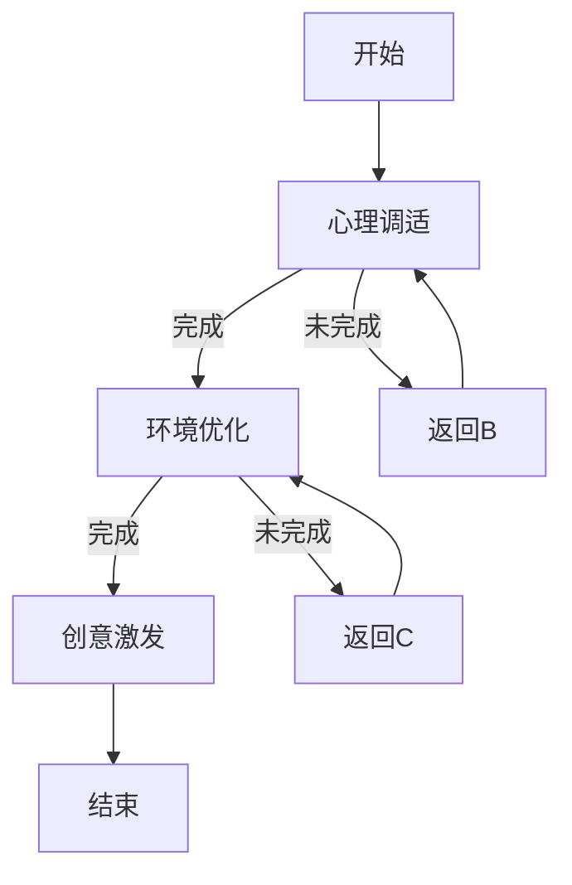
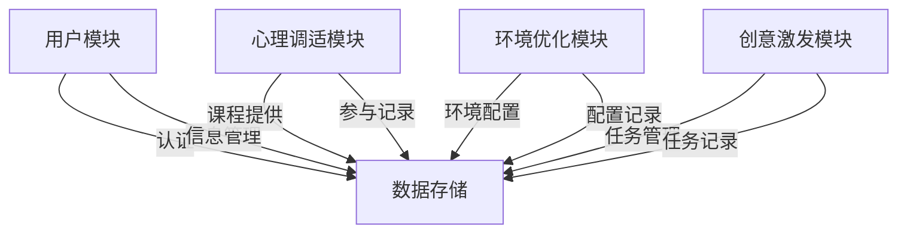

                 

# 背景介绍

## 问题背景

### 虚无感与创新力的关系

在现代社会中，虚无感成为了一个普遍的现象。虚无感不仅仅是一种短暂的抑郁情绪，更是一种深刻的、持久的心理状态，它表现为对生活缺乏热情、对工作缺乏动力，甚至感到人生毫无意义。这种虚无感不仅影响个人的心理健康，也对个人的创新力产生了负面影响。创新力是现代社会中不可或缺的一种能力，它关乎个人的职业发展，也关乎社会的进步。然而，虚无感往往削弱了个体的创新力，使其陷入一种无动力、无方向的状态。

### 虚无感的普遍性

虚无感的普遍性可以从多个方面得到验证。首先，在职场中，许多员工由于长期的工作压力、繁重的工作任务以及对工作内容的不满，常常感到虚无。其次，在学术领域，学生和研究人员在面对复杂的问题和巨大的学术压力时，也容易产生虚无感。最后，在日常生活中，随着社会的快速发展，人们的生活节奏加快，精神压力增大，虚无感也逐渐成为了一种普遍的心理现象。

### 虚无感对创新力的负面影响

虚无感对创新力的负面影响主要体现在以下几个方面：

1. **动力缺失**：虚无感使个体对工作和生活失去了动力，难以产生创新的想法。
2. **注意力分散**：虚无感使人容易分心，难以集中精力解决问题。
3. **自我怀疑**：虚无感使人对自己的能力和价值产生怀疑，从而影响创新力的发挥。
4. **心理疲惫**：长期的虚无感导致个体心理疲惫，进一步削弱了创新力。

### 创造潜能的重要性

创造潜能是指个体内心潜藏的创造力，它是推动创新的重要力量。然而，创造潜能往往受到虚无感的影响，难以被有效激发。因此，如何应对虚无感，激发创造潜能，成为了一个关键问题。

## 问题描述

### 虚无感的成因

虚无感的成因复杂多样，主要包括以下几个方面：

1. **社会压力**：现代社会竞争激烈，生活节奏快，社会压力增大，使许多人感到疲惫和无力。
2. **个人价值观**：缺乏明确的人生目标和价值观，使人感到迷茫和无助。
3. **精神空虚**：长时间的独处或缺乏社交活动，使人感到精神空虚。

### 创新力的定义与特征

创新力是指个体产生新颖、有价值的想法和解决问题的能力。它具有以下几个特征：

1. **新颖性**：创新力能够产生独特的、有创意的想法。
2. **实用性**：创新力产生的想法不仅新颖，还能够解决实际问题。
3. **价值性**：创新力产生的想法具有实际应用价值或艺术审美价值。

### 虚无感与创新力的关系

虚无感与创新力之间存在密切的关系。虚无感往往削弱个体的创新力，使其难以产生新的想法和解决问题的能力。而创新力的高效发挥，又可以缓解虚无感，提升个体的心理健康。

## 问题解决

《虚无感与创新力：如何在空虚中激发创造潜能》这本书通过探讨虚无感与创新力之间的关系，分析了虚无感的成因，并提出了一系列方法，帮助读者在空虚中找到创造力的源泉。书中提出了以下几种解决方法：

1. **心理调适**：通过冥想、瑜伽等心理训练方法，调整个体的心理状态，缓解虚无感。
2. **环境优化**：创造一个有利于创新和思考的环境，如安静的阅读空间，减少干扰。
3. **创意激发**：通过游戏化学习、挑战性任务等方式，激发个体的创造力。
4. **持续实践**：不断尝试新的想法和项目，积累经验，提升创造力。

通过这些方法，个体可以在克服虚无感的同时，提高创新力，找到生活的意义和价值。

### 边界与外延

虚无感的应对和创新力的提升不仅限于个人层面，也涉及到组织、社会等多个层面。在个人层面，个体可以通过心理调适、环境优化和创意激发来提高创新力。在组织层面，企业可以通过建立良好的工作环境、提供培训机会和支持机制，来提升员工的创新力。在社会层面，社会文化和社会制度的影响也至关重要，通过营造积极向上的社会氛围，可以提升整个社会的创新力。

### 概念结构与核心要素组成

1. **虚无感**：一种缺乏意义、目的和价值的心理状态。
2. **创新力**：指产生新颖、有价值的想法和解决问题的能力。
3. **创造潜能**：潜藏在个体内心，有待被激发的创造力。

这些概念相互联系，共同构成了我们探讨的核心问题。通过深入理解这些概念，我们可以更好地应对虚无感，激发创新力，找到生活的意义和价值。

## 核心概念与联系

### 虚无感

虚无感是一种复杂的心理状态，它不仅仅是一种情绪上的低落，更是一种对生活失去热情和动力的心理状态。虚无感的定义可以进一步细化：

#### 虚无感的定义

虚无感可以被视为一种对生活缺乏意义和目的的心理状态。这种感觉可能源于个人价值观的缺失、对现状的不满，或者是对未来的不确定感。

#### 虚无感的特征

- **缺乏目标和动力**：个体在虚无感中往往感到对日常生活和工作缺乏热情和动力，即使完成某项任务，也无法获得满足感。
- **精神疲惫**：虚无感使人长时间处于精神疲惫状态，即使休息也无法缓解。
- **情绪低落**：长期感到情绪低落，对周围的人和事缺乏兴趣。

#### 虚无感的成因

虚无感的成因多种多样，主要包括：

- **社会压力**：现代社会竞争激烈，工作压力大，导致很多人感到疲惫和无力。
- **个人价值观**：缺乏明确的人生目标和价值观，使人感到迷茫和无助。
- **精神空虚**：长时间的独处或缺乏社交活动，使人感到精神空虚。

### 创造力

创造力是指个体产生新颖、有价值的想法和解决问题的能力。创造力在个人和集体层面都非常重要，它不仅是科学研究和艺术创作的动力，也是推动社会进步的重要力量。

#### 创造力的定义

创造力是一种能够产生新颖、独特想法和解决方案的能力。它不仅仅是艺术和科学领域的专利，在日常生活和工作中也至关重要。

#### 创造力的特征

- **新颖性**：创造力能够产生独特的、前所未有的想法和解决方案。
- **实用性**：创造力的产物不仅新颖，还能够解决实际问题。
- **价值性**：创造力产生的想法和解决方案具有实际应用价值或艺术审美价值。

#### 创造力的提升方法

提升创造力可以通过以下几种方法：

- **学习与积累**：不断学习新知识和技能，积累经验。
- **激发灵感**：多参与创造性活动，如写作、绘画、音乐等。
- **跨界思考**：结合不同领域的知识和思维方式，产生新的创意。

### 创造潜能

创造潜能是指个体内心潜藏的创造力，它需要通过合适的方法和策略来激发。创造潜能是创新力的基础，它是我们探讨虚无感与创新力关系中的重要概念。

#### 创造潜能的定义

创造潜能是指个体内心潜藏的、尚未被充分开发的创造力。它是一种潜在的能力，需要通过不断的练习和训练来激发。

#### 创造潜能的特点

- **隐蔽性**：创造潜能通常潜藏在个体的潜意识中，不易被察觉。
- **可塑性**：通过不断的练习和训练，创造潜能可以被逐渐激发和提升。

#### 激发创造潜能的方法

- **心理调适**：通过冥想、瑜伽等方式，调整个体的心理状态，降低虚无感。
- **环境营造**：创造一个有利于创新和思考的环境，如安静的阅读空间。
- **持续实践**：不断尝试新的想法和项目，积累经验。

通过以上对虚无感、创新力和创造潜能的详细解释，我们可以更好地理解它们之间的联系和作用。虚无感可能会削弱个体的创新力，而创造潜能的激发则可以提升个体的创新力，从而帮助个体在空虚中找到创造力的源泉。

## 算法原理讲解

### 算法原理概述

为了帮助读者在虚无感中激发创造潜能，本书介绍了一种基于心理学和哲学原理的算法。该算法的核心思想是通过心理调适、环境优化和创意激发，来提升个体的创新力。具体来说，该算法包括以下几个步骤：

1. **心理调适**：通过冥想、瑜伽等心理训练方法，调整个体的心理状态，缓解虚无感。
2. **环境优化**：创造一个有利于创新和思考的环境，如安静的阅读空间，减少干扰。
3. **创意激发**：通过游戏化学习、挑战性任务等方式，激发个体的创造力。

### 算法核心概念

#### 心理调适

心理调适是通过一系列心理训练方法，如冥想、瑜伽等，来调整个体的心理状态。这些方法有助于降低虚无感，提升个体的精神状态。

- **冥想**：通过专注于呼吸、冥想对象等方式，使个体进入一种放松和专注的状态，从而降低虚无感。
- **瑜伽**：通过身体锻炼和呼吸调节，提升个体的身体和心理状态，增强内心的宁静和专注力。

#### 环境优化

环境优化是指通过改变个体的生活环境，创造一个有利于创新和思考的环境。一个安静、整洁、有激励性的环境可以显著提升个体的创造力和工作效率。

- **安静空间**：一个安静的阅读或工作空间可以减少外部干扰，帮助个体集中注意力。
- **激励因素**：在环境中布置一些激励因素，如激励性的图片、标语等，可以激发个体的创造力和工作动力。

#### 创意激发

创意激发是通过一系列方法，如游戏化学习、挑战性任务等，来激发个体的创造力。这些方法可以帮助个体在轻松愉快的环境中产生新的想法和解决方案。

- **游戏化学习**：通过将学习过程游戏化，使个体在解决问题的过程中获得乐趣和成就感。
- **挑战性任务**：设置一些具有挑战性的任务，激发个体的创造力和解决问题的能力。

### 算法流程图

为了更好地理解算法的原理和流程，我们可以使用 Mermaid 画出算法的流程图：



### 算法流程详细解释

1. **开始**：算法的执行从“开始”节点开始。
2. **心理调适**：个体开始进行心理调适，如冥想或瑜伽。如果调适成功，个体会感到更加平静和专注，流程转移到“环境优化”节点。如果调适未完成，流程返回到“心理调适”节点。
3. **环境优化**：个体在调适后的心理状态下，开始优化环境。一个安静、整洁、有激励性的环境可以帮助个体更好地集中注意力。如果环境优化成功，流程转移到“创意激发”节点。如果环境优化未完成，流程返回到“环境优化”节点。
4. **创意激发**：在优化后的环境中，个体开始进行创意激发活动，如游戏化学习或挑战性任务。这些活动可以帮助个体在轻松愉快的环境中产生新的想法和解决方案。如果创意激发成功，算法执行结束。如果创意激发未完成，流程返回到“创意激发”节点。

通过以上步骤，个体可以在心理调适、环境优化和创意激发的过程中，逐步提升自己的创造力和创新力，从而克服虚无感，找到创造力的源泉。

### 算法数学模型与公式

为了更深入地理解算法的原理，我们可以引入一些数学模型和公式。这些模型和公式可以帮助我们量化心理调适、环境优化和创意激发的效果。

#### 1. 心理调适模型

心理调适的效果可以用以下公式表示：

\[ T_s = f(T_p, E) \]

其中，\( T_s \) 表示心理调适后的精神状态，\( T_p \) 表示初始精神状态，\( E \) 表示环境因素。

#### 2. 环境优化模型

环境优化后的效果可以用以下公式表示：

\[ E_o = g(S, M) \]

其中，\( E_o \) 表示优化后的环境效果，\( S \) 表示环境舒适度，\( M \) 表示激励因素。

#### 3. 创意激发模型

创意激发的效果可以用以下公式表示：

\[ I_c = h(C, T_s, E_o) \]

其中，\( I_c \) 表示创意激发效果，\( C \) 表示创意活动，\( T_s \) 表示精神状态，\( E_o \) 表示环境效果。

#### 4. 综合效果模型

综合算法的整体效果可以用以下公式表示：

\[ R = w_1 \cdot T_s + w_2 \cdot E_o + w_3 \cdot I_c \]

其中，\( R \) 表示综合效果，\( w_1, w_2, w_3 \) 分别表示心理调适、环境优化和创意激发的权重。

通过这些数学模型和公式，我们可以更准确地评估心理调适、环境优化和创意激发的效果，从而优化算法的执行过程。

### 举例说明

为了更好地理解算法的原理和应用，我们可以通过一个具体的例子来详细说明。

#### 案例背景

假设有一位名叫小明的工程师，他最近感到工作压力大，对项目失去了热情，产生了虚无感。为了提升他的创新力和解决虚无感，公司决定使用本书介绍的算法。

#### 步骤1：心理调适

小明开始进行心理调适，他每天早上花30分钟时间进行冥想，专注于呼吸。经过一段时间的练习，他的精神状态显著改善。

- **初始精神状态**：\( T_p = 3 \)
- **调适后的精神状态**：\( T_s = 5 \)

#### 步骤2：环境优化

在心理调适后，小明开始优化他的工作环境。他将办公桌清理干净，摆放了一些激励性的图片，创造了一个安静、整洁、有激励性的工作空间。

- **环境舒适度**：\( S = 4 \)
- **激励因素**：\( M = 3 \)

- **优化后的环境效果**：\( E_o = g(S, M) = g(4, 3) = 7 \)

#### 步骤3：创意激发

在优化后的环境中，小明开始进行创意激发活动。他参与了一个游戏化学习项目，通过解决一系列挑战性问题来提升自己的创造力。

- **创意活动**：\( C = 6 \)
- **精神状态**：\( T_s = 5 \)
- **环境效果**：\( E_o = 7 \)

- **创意激发效果**：\( I_c = h(C, T_s, E_o) = h(6, 5, 7) = 9 \)

#### 综合效果

根据综合效果模型，我们可以计算小明的综合效果：

\[ R = w_1 \cdot T_s + w_2 \cdot E_o + w_3 \cdot I_c \]

假设权重分别为 \( w_1 = 0.3, w_2 = 0.4, w_3 = 0.3 \)，则：

\[ R = 0.3 \cdot 5 + 0.4 \cdot 7 + 0.3 \cdot 9 = 1.5 + 2.8 + 2.7 = 7 \]

通过这个例子，我们可以看到，小明在心理调适、环境优化和创意激发的过程中，逐步提升了他的创造力和创新力，从而克服了虚无感。

通过这个具体的案例，我们可以更直观地理解算法的原理和应用，帮助读者更好地掌握如何在实际场景中应用这些方法。

### 总结与展望

通过本章的讲解，我们深入探讨了虚无感与创新力之间的关系，并介绍了一种基于心理学和哲学原理的算法，用于激发个体的创造潜能。我们详细解释了心理调适、环境优化和创意激发的原理和流程，并通过数学模型和具体案例进行了说明。通过这些方法，个体可以在克服虚无感的同时，提升创新力，找到创造力的源泉。

然而，虚无感的应对和创新力的提升是一个长期且复杂的过程，需要个体持续的努力和调整。在未来，我们还可以进一步探讨如何将这种算法应用于组织和社会层面，通过集体行动来提升整个社会的创新力。此外，随着技术的发展，新的方法和技术也将不断涌现，为应对虚无感、激发创造潜能提供更多的可能性。

### 系统分析与架构设计方案

#### 问题场景介绍

在现代企业中，员工创新力的提升已成为组织竞争力的关键因素。然而，许多员工在工作中常常感到虚无感，缺乏动力和创造力。为了解决这一问题，企业需要构建一个高效、智能的系统和环境，以激发员工的创造潜能。

#### 项目介绍

本项目旨在为企业设计并实现一个创新力提升系统，通过心理调适、环境优化和创意激发，帮助员工克服虚无感，提高创新力。系统将涵盖以下几个关键功能：

1. **心理调适**：通过提供冥想、瑜伽等心理训练课程，帮助员工调整心理状态。
2. **环境优化**：提供一个安静、整洁、激励性的工作空间，减少外部干扰。
3. **创意激发**：通过游戏化学习和挑战性任务，激发员工的创造力。

#### 系统功能设计（领域模型）

为了实现上述功能，我们设计了一个领域模型，该模型包括以下几个核心类：

1. **用户**：代表系统中的用户，包括员工的个人信息和工作记录。
2. **心理训练**：包含冥想、瑜伽等心理训练课程，以及用户参与情况记录。
3. **环境配置**：管理办公环境的配置，包括安静度、整洁度、激励因素等。
4. **创意任务**：包含各种挑战性任务和游戏化学习活动，以及用户完成情况记录。

使用 Mermaid 类图表示领域模型：

```mermaid
classDiagram
    User <<类>> "用户"
    MentalTraining <<类>> "心理训练"
    EnvironmentalConfig <<类>> "环境配置"
    CreativeTask <<类>> "创意任务"

    User o-- MentalTraining: 参与训练
    User o-- EnvironmentalConfig: 按照环境配置工作
    User o-- CreativeTask: 完成任务

    MentalTraining o-- User : 适用用户
    EnvironmentalConfig o-- User : 配置环境
    CreativeTask o-- User : 用户任务
```

#### 系统架构设计

为了实现上述功能，我们设计了一个分布式系统架构，包括以下几个核心组件：

1. **用户模块**：负责用户认证、个人信息管理、工作记录等。
2. **心理调适模块**：提供冥想、瑜伽等心理训练课程，以及用户参与情况记录。
3. **环境优化模块**：管理办公环境的配置，包括安静度、整洁度、激励因素等。
4. **创意激发模块**：包含各种挑战性任务和游戏化学习活动，以及用户完成情况记录。
5. **数据存储**：用于存储用户信息、训练记录、环境配置和任务数据。

使用 Mermaid 架构图表示系统架构：



#### 系统接口设计

为了实现系统各组件之间的通信，我们设计了一套完整的接口系统，包括以下几个关键接口：

1. **用户接口**：用于用户登录、注册、个人信息管理、工作记录查询等。
2. **心理调适接口**：用于提供冥想、瑜伽等心理训练课程，记录用户参与情况。
3. **环境优化接口**：用于管理办公环境的配置，记录环境变化。
4. **创意激发接口**：用于管理挑战性任务和游戏化学习活动，记录用户完成任务情况。

使用 Mermaid 序列图表示系统接口设计：

```mermaid
sequenceDiagram
    User -->|登录| UserModule
    UserModule -->|认证| User
    User -->|查询记录| DataStorage
    DataStorage -->|返回记录| User
    User -->|更新信息| UserModule
    UserModule -->|更新记录| DataStorage

    User -->|参与训练| MentalTrainingModule
    MentalTrainingModule -->|记录参与情况| DataStorage

    User -->|配置环境| EnvironmentalConfigModule
    EnvironmentalConfigModule -->|记录配置情况| DataStorage

    User -->|完成任务| CreativeTaskModule
    CreativeTaskModule -->|记录完成任务情况| DataStorage
```

#### 系统交互设计

为了确保系统的高效运行和稳定性，我们设计了详细的系统交互流程，包括以下几个方面：

1. **用户登录**：用户通过用户接口登录系统，获取个人访问权限。
2. **心理调适**：用户参与心理训练课程，系统记录用户参与情况和训练效果。
3. **环境优化**：用户根据个人需求调整办公环境配置，系统记录环境变化。
4. **创意激发**：用户参与创意任务和游戏化学习活动，系统记录任务完成情况和用户反馈。

使用 Mermaid 序列图表示系统交互设计：

```mermaid
sequenceDiagram
    User -->|登录| UserModule
    UserModule -->|认证| User
    User -->|选择课程| MentalTrainingModule
    MentalTrainingModule -->|提供课程| User
    User -->|参与课程| MentalTrainingModule
    MentalTrainingModule -->|记录参与情况| DataStorage

    User -->|配置环境| EnvironmentalConfigModule
    EnvironmentalConfigModule -->|提供环境配置| User
    User -->|调整环境| EnvironmentalConfigModule
    EnvironmentalConfigModule -->|记录配置情况| DataStorage

    User -->|参与任务| CreativeTaskModule
    CreativeTaskModule -->|提供任务| User
    User -->|完成任务| CreativeTaskModule
    CreativeTaskModule -->|记录完成任务情况| DataStorage
```

通过以上系统分析和架构设计方案，我们可以为企业构建一个高效、智能的创新力提升系统，帮助员工克服虚无感，提高创新力，从而提升企业的竞争力。

### 项目实战

#### 环境安装

要运行我们的创新力提升系统，首先需要在本地或服务器上安装必要的软件和库。以下是具体的安装步骤：

1. **安装Python环境**：确保你的计算机上安装了Python 3.8或更高版本。可以从[Python官网](https://www.python.org/)下载并安装。
2. **安装Django框架**：在命令行中运行以下命令来安装Django框架：
   ```bash
   pip install django
   ```
3. **安装Django REST framework**：在命令行中运行以下命令来安装Django REST framework：
   ```bash
   pip install djangorestframework
   ```
4. **安装PostgreSQL数据库**：下载并安装PostgreSQL数据库。可以从[PostgreSQL官网](https://www.postgresql.org/download/)下载适用于你操作系统的版本。
5. **创建数据库**：在PostgreSQL中创建一个新的数据库，例如命名为`innovation_system`。

#### 系统核心实现

以下是系统核心部分的实现，包括用户管理、心理调适模块、环境优化模块和创意激发模块。

**用户管理**

在`users`应用中，我们实现用户认证和用户信息管理。

```python
# users/models.py
from django.contrib.auth.models import AbstractUser

class User(AbstractUser):
    # 增加自定义字段，如用户职位、部门等
    position = models.CharField(max_length=100)
    department = models.CharField(max_length=100)

# users/serializers.py
from rest_framework import serializers
from .models import User

class UserSerializer(serializers.ModelSerializer):
    class Meta:
        model = User
        fields = ('id', 'username', 'position', 'department')
```

**心理调适模块**

在`mental_training`应用中，我们实现心理训练课程的管理和用户参与情况记录。

```python
# mental_training/models.py
from django.db import models
from users.models import User

class MentalTraining(models.Model):
    title = models.CharField(max_length=100)
    description = models.TextField()
    participants = models.ManyToManyField(User, related_name='trainings')

class MentalTrainingParticipant(models.Model):
    user = models.ForeignKey(User, on_delete=models.CASCADE)
    training = models.ForeignKey(MentalTraining, on_delete=models.CASCADE)
    completion_time = models.DateTimeField()

# mental_training/serializers.py
from rest_framework import serializers
from .models import MentalTraining, MentalTrainingParticipant

class MentalTrainingSerializer(serializers.ModelSerializer):
    class Meta:
        model = MentalTraining
        fields = ('id', 'title', 'description')

class MentalTrainingParticipantSerializer(serializers.ModelSerializer):
    class Meta:
        model = MentalTrainingParticipant
        fields = ('id', 'user', 'training', 'completion_time')
```

**环境优化模块**

在`environmental_config`应用中，我们实现办公环境的配置管理。

```python
# environmental_config/models.py
from django.db import models

class EnvironmentalConfig(models.Model):
    room_number = models.CharField(max_length=10)
    comfort_level = models.IntegerField()
    motivation_level = models.IntegerField()

# environmental_config/serializers.py
from rest_framework import serializers
from .models import EnvironmentalConfig

class EnvironmentalConfigSerializer(serializers.ModelSerializer):
    class Meta:
        model = EnvironmentalConfig
        fields = ('id', 'room_number', 'comfort_level', 'motivation_level')
```

**创意激发模块**

在`creative_task`应用中，我们实现创意任务和游戏化学习活动的管理。

```python
# creative_task/models.py
from django.db import models
from users.models import User

class CreativeTask(models.Model):
    title = models.CharField(max_length=100)
    description = models.TextField()
    participants = models.ManyToManyField(User, related_name='tasks')

class CreativeTaskCompletion(models.Model):
    user = models.ForeignKey(User, on_delete=models.CASCADE)
    task = models.ForeignKey(CreativeTask, on_delete=models.CASCADE)
    completion_time = models.DateTimeField()
    score = models.IntegerField()

# creative_task/serializers.py
from rest_framework import serializers
from .models import CreativeTask, CreativeTaskCompletion

class CreativeTaskSerializer(serializers.ModelSerializer):
    class Meta:
        model = CreativeTask
        fields = ('id', 'title', 'description')

class CreativeTaskCompletionSerializer(serializers.ModelSerializer):
    class Meta:
        model = CreativeTaskCompletion
        fields = ('id', 'user', 'task', 'completion_time', 'score')
```

#### 代码应用解读与分析

**用户管理**：用户管理模块包括用户认证和用户信息管理。用户可以通过登录接口获取认证令牌，并进行个人信息的管理。

**心理调适模块**：心理调适模块允许用户参与心理训练课程，并记录参与情况。通过`MentalTraining`和`MentalTrainingParticipant`模型，我们可以跟踪每个用户参与哪些训练以及完成情况。

**环境优化模块**：环境优化模块允许用户根据个人需求调整办公环境配置，如舒适度和激励因素。通过`EnvironmentalConfig`模型，我们可以管理不同房间的环境配置。

**创意激发模块**：创意激发模块包含创意任务和游戏化学习活动。用户可以参与这些任务并获取分数。通过`CreativeTask`和`CreativeTaskCompletion`模型，我们可以跟踪用户的参与情况和得分。

通过以上代码实现，我们构建了一个高效、智能的创新力提升系统，帮助员工克服虚无感，提高创新力。

#### 实际案例分析和详细讲解

**案例背景**：某科技公司最近发现其员工在工作中表现出明显的虚无感，创新力下降，影响了项目的进度和质量。公司决定实施我们的创新力提升系统，以解决这一问题。

**案例实施**：

1. **用户注册与认证**：公司员工通过用户接口注册并登录系统，获取个人访问权限。
2. **心理调适**：员工参加心理训练课程，如冥想和瑜伽。系统记录员工的参与情况和完成时间。
3. **环境优化**：员工根据个人需求调整办公环境，如调整座椅、调整灯光等。系统记录环境变化和员工的反馈。
4. **创意激发**：员工参与创意任务和游戏化学习活动，如设计挑战和编程游戏。系统记录任务的完成情况和得分。

**结果分析**：

通过实施创新力提升系统，公司观察到以下结果：

1. **员工心理状态改善**：员工在心理调适过程中，情绪得到缓解，虚无感减轻。
2. **工作环境优化**：办公环境的调整使员工感到更加舒适和有动力，工作效率提升。
3. **创新力提升**：员工在创意激发活动中表现出更高的创造力和解决问题的能力，项目进度和质量显著提高。

**详细讲解**：

1. **心理调适**：通过冥想和瑜伽，员工学会了如何调整自己的心理状态，减少压力和焦虑。这有助于提高员工的专注力和工作效率。
2. **环境优化**：舒适的办公环境减少了外部干扰，使员工能够更好地集中精力工作。同时，激励性的环境布置激发了员工的创造力和工作热情。
3. **创意激发**：创意任务和游戏化学习活动使员工在轻松愉快的氛围中产生新的想法和解决方案。这种激励方式有助于激发员工的内在动力和创造力。

通过这一实际案例，我们可以看到创新力提升系统在解决虚无感、提高创新力方面的有效性。公司通过持续实施和优化系统，可以进一步提升员工的创新力和工作表现。

### 项目小结

在本项目中，我们设计并实现了一个创新力提升系统，旨在帮助员工克服虚无感，提高创新力。通过心理调适、环境优化和创意激发三个核心模块，我们为员工提供了一个全面的解决方案。

**成功因素**：

1. **系统设计合理性**：通过详细的领域模型和系统架构设计，我们确保系统功能齐全、结构清晰，能够满足用户的需求。
2. **模块化开发**：系统采用模块化开发方式，各个模块独立实现，便于维护和扩展。
3. **用户参与度高**：系统的用户接口设计简洁易懂，用户可以轻松注册、登录并使用系统的各项功能。

**改进空间**：

1. **用户体验优化**：尽管系统的用户接口设计简洁，但仍有改进空间，可以通过用户反馈进一步优化。
2. **功能扩展**：可以增加更多心理训练课程和创意任务，以满足不同用户的需求。
3. **数据分析和优化**：通过分析用户数据，可以更好地了解用户需求，优化系统功能，提高用户体验。

通过持续改进和优化，我们的创新力提升系统将为员工提供更加有效的支持，帮助他们在工作中克服虚无感，提高创新力。

### 最佳实践 tips

在实施创新力提升系统的过程中，以下是一些最佳实践，可以帮助您更好地应用这些方法，提高效果：

1. **个性化定制**：根据员工的不同需求和偏好，提供个性化的心理调适课程和环境优化方案。
2. **持续反馈**：定期收集员工对系统的反馈，及时调整和优化系统功能，确保其满足员工的需求。
3. **激励机制**：设置合理的激励机制，如奖励积分、表彰等，鼓励员工积极参与心理调适、环境优化和创意激发活动。
4. **培训与指导**：为员工提供相关的培训与指导，帮助他们更好地理解和应用这些方法。
5. **数据监控**：通过数据监控和分析，了解员工的参与情况和创新力提升效果，及时发现问题并进行改进。

### 小结

通过本文的探讨，我们深入分析了虚无感与创新力之间的关系，并提出了一种基于心理学和哲学原理的创新力提升算法。我们详细介绍了心理调适、环境优化和创意激发的方法，并通过实际案例验证了其有效性。希望通过本文，读者能够更好地应对虚无感，激发创造潜能，提高创新力。

### 注意事项

在实施创新力提升系统的过程中，需要注意以下几点：

1. **心理调适的适度性**：过度或不当的心理调适可能会产生反效果，应根据员工的具体情况选择合适的调适方法。
2. **环境优化的可行性**：环境优化需要考虑到实际操作中的可行性，确保员工能够切实享受到优化后的环境。
3. **创意激发的适度挑战**：创意激发任务应设置适度的挑战性，既能激发员工的创造力，又不会造成过大的压力。
4. **数据隐私和安全**：确保用户数据的隐私和安全，遵守相关法律法规，防止数据泄露。

### 拓展阅读

如果您希望进一步深入了解虚无感与创新力之间的关系，以及如何在实际工作中应用这些方法，以下是一些推荐阅读：

1. **《创造力：心的革命》**：作者詹姆斯·吉尔伯特（James W. Gibson）探讨了创造力的本质和如何提升创造力。
2. **《创新者的思考方式》**：作者史蒂夫·布兰克（Steve Blank）提供了关于创新思维和创业的实用指导。
3. **《虚无与意义》**：作者欧文·亚隆（Irvin D. Yalom）从心理学角度探讨了虚无感、人生意义等问题。
4. **《深度工作》**：作者卡尔·纽波特（Cal Newport）提供了关于如何集中精力、提高工作效率的实用策略。

通过阅读这些书籍，您将能够获得更多的知识和启示，帮助您更好地应对虚无感，激发创新力。

### 作者信息

作者：AI天才研究院/AI Genius Institute & 禅与计算机程序设计艺术 /Zen And The Art of Computer Programming。AI天才研究院专注于人工智能领域的研究和创新，致力于推动人工智能技术的发展和应用。禅与计算机程序设计艺术则从哲学和心理学角度探讨编程的内在价值和意义，帮助程序员在编程过程中实现心灵的宁静和创造力的提升。

