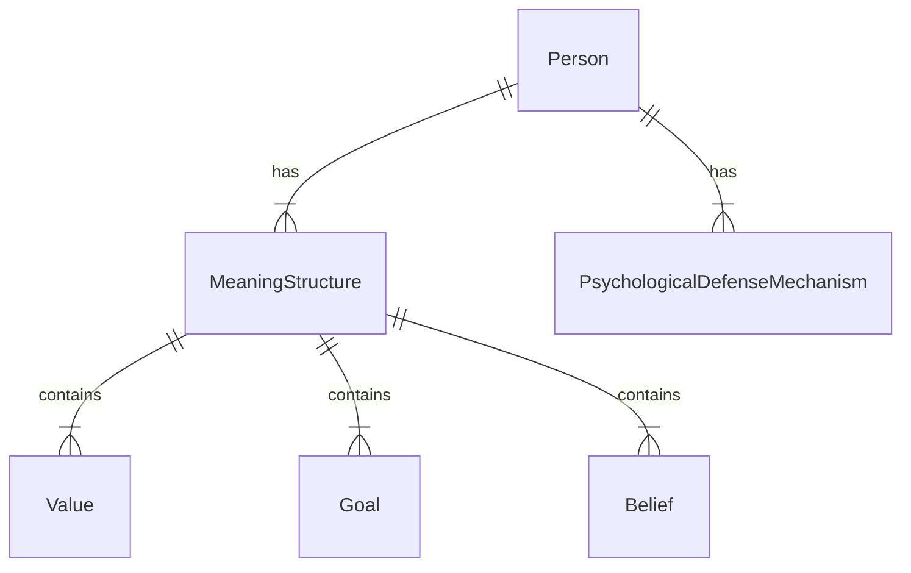

                 

# 虚无感的克服：重建现代生活的意义结构

## 关键词

- 虚无感
- 心理健康
- 意义结构
- 重建
- 现代生活

### 摘要

本文旨在探讨虚无感这一现代生活中普遍存在的问题，并分析其背后的原因和影响。通过深入探讨虚无感的核心概念和联系，本文提出了一系列心理策略来克服虚无感，并最终实现现代生活的意义重建。本文结合了心理学、哲学和技术领域的知识，旨在为读者提供一种可行的路径，以重新找回生活的意义和价值。

---

### 目录大纲

**# 第一部分：虚无感问题背景与影响**

**## 第1章：虚无感的定义与背景**

### 1.1 虚无感的概念与特征

### 1.2 虚无感产生的原因

### 1.3 虚无感的影响

### 1.4 虚无感的边界与外延

**## 第2章：虚无感的核心概念与联系**

### 2.1 核心概念原理

### 2.2 概念属性特征对比

### 2.3 ER实体关系图架构

**## 第3章：克服虚无感的心理策略**

### 3.1 认知重构

### 3.2 情绪调节

### 3.3 行为改变

### 3.4 心理防御机制的调整

**## 第4章：重建现代生活的意义结构**

### 4.1 价值观的重建

### 4.2 目标的设定

### 4.3 意义结构的构建

---

## 第一部分：虚无感问题背景与影响

### 第1章：虚无感的定义与背景

#### 1.1 虚无感的概念与特征

虚无感，顾名思义，是指个体感受到生活中的事物和事件缺乏内在的意义和价值，进而产生一种深深的空虚和无助感。这种情感状态不仅影响到个体的心理健康，还会对人际关系、社会参与和整体生活质量产生负面影响。

虚无感的特征可以从情感、认知和行为三个方面来描述：

- **情感方面**：个体会感到内心空虚、孤独和无助，对生活中的快乐和成就难以产生共鸣，感到一切似乎都是空洞和没有意义的。
- **认知方面**：虚无感的个体可能会对自己的生活、工作、甚至存在的意义产生怀疑，感到困惑和迷茫，缺乏对未来的期望和规划。
- **行为方面**：虚无感的个体可能会出现逃避现实的行为，如沉迷于网络、过度消费、酗酒等，以逃避内心的空虚和无助。

#### 1.2 虚无感产生的原因

虚无感的产生可以从多个角度进行解析，包括社会环境因素、个人心理因素和文化背景因素：

- **社会环境因素**：现代社会的高速发展和竞争压力，使得个体面临更多的挑战和不确定性。快节奏的生活方式和高压的工作环境，可能导致个体感到疲惫和无力，进而产生虚无感。
- **个人心理因素**：个人的性格特质、心理状态和过去的经历也可能影响虚无感的产生。例如，具有悲观主义倾向的人更容易感受到虚无感。
- **文化背景因素**：不同文化对生活的期望和价值观念也会影响个体对虚无感的感受。在某些文化背景下，个体可能被期望追求物质成功和社会地位，这种压力可能导致虚无感的产生。

#### 1.3 虚无感的影响

虚无感对个体的心理健康和社会功能具有显著的负面影响：

- **心理健康**：长期的虚无感可能导致心理健康问题，如抑郁症、焦虑症和孤独感等。
- **人际关系**：虚无感的个体可能会与他人疏远，影响家庭和社交关系的稳定。
- **生活态度**：虚无感可能导致个体对生活失去热情和动力，影响个人的积极性和发展。

#### 1.4 虚无感的边界与外延

虚无感是一种情感和心理状态，与抑郁症等心理疾病有明显的区别。抑郁症通常伴随着持续的悲伤和绝望感，而虚无感更多地是对生活意义的质疑和缺乏动力。

虚无感不仅影响个人，也会对整个社会的心理健康和生活质量产生负面影响。在一个充满虚无感的社会中，人们可能更加消极和被动，社会凝聚力减弱，创新和进步的动力下降。

#### 1.5 虚无感的问题场景

- **工作场景**：在职场中，虚无感可能导致工作效率低下、缺乏工作热情，甚至出现职业倦怠。
- **学习场景**：在学习过程中，虚无感可能导致学习动力不足、对知识的吸收和运用能力下降。
- **社交场景**：在社交活动中，虚无感可能导致个体回避社交，影响人际关系的建立和维护。

#### 1.6 虚无感的解决方法

- **心理治疗**：通过心理咨询和治疗，个体可以学会应对虚无感的方法，调整心理状态。
- **行为疗法**：通过设定具体的目标和计划，个体可以逐步找到生活的意义和动力。
- **社交支持**：与他人建立积极的关系，获取支持和鼓励，有助于缓解虚无感。

### 第2章：虚无感的核心概念与联系

#### 2.1 核心概念原理

虚无感的克服需要深入理解其背后的核心概念，包括意义结构、心理防御机制等。

- **意义结构**：意义结构是指个体在生活中构建的意义体系，包括价值观、目标和信仰等。意义结构是个体寻找和赋予生活意义的基础。
  
- **心理防御机制**：心理防御机制是个体在面对压力和挑战时采取的心理策略，以减轻痛苦和不安。常见的心理防御机制包括回避、压抑、合理化等。

#### 2.2 概念属性特征对比

| 概念       | 定义                                                      | 属性特征                                                 |
|------------|-----------------------------------------------------------|---------------------------------------------------------|
| 意义结构   | 个体在生活中寻找和构建的意义体系                           | - 价值观：对事物的评价标准 - 目标：个体追求的目标 - 信仰：对超越现实的信念 |
| 心理防御机制 | 个体在面对压力和挑战时采取的心理策略，以减轻痛苦和不安 | - 避免冲突：减少与外界冲突的风险 - 保持平衡：维持心理稳定 - 调整认知：改变对事物的看法 |

#### 2.3 ER实体关系图架构

### 第3章：克服虚无感的心理策略

#### 3.1 认知重构

认知重构是克服虚无感的重要策略之一。通过改变对事物的看法和思考方式，个体可以减轻虚无感带来的不适。具体方法包括：

- **反思自己的思维模式**：识别和反思自己的思维习惯，找出负面思维模式，如过度概括、灾难化等。
- **用积极思维替代**：用积极的、合理的思维模式替代负面思维，例如，将“我永远做不到”改为“我可以尝试并努力”。

#### 3.2 情绪调节

情绪调节是另一个有效的心理策略，通过调节情绪，个体可以减轻虚无感带来的负面影响。具体方法包括：

- **练习放松技巧**：如冥想、深呼吸等，有助于缓解紧张和焦虑。
- **寻求心理咨询**：心理咨询师可以提供专业的情绪调节方法和指导。

#### 3.3 行为改变

行为改变是通过实际行动来克服虚无感的策略。通过设定具体的目标和计划，个体可以逐步找到生活的意义和动力。具体方法包括：

- **设定目标**：设定短期和长期目标，明确自己的努力方向。
- **培养兴趣爱好**：参与自己感兴趣的活动，增加生活的乐趣和满足感。

#### 3.4 心理防御机制的调整

心理防御机制是应对压力和挑战的心理策略，但不当的心理防御机制可能会加重虚无感。通过调整心理防御机制，个体可以更好地应对生活中的挑战。具体方法包括：

- **识别不健康的心理防御机制**：如过度回避、过度压抑等。
- **学习健康的心理防御策略**：如积极面对、合理表达等。

### 第4章：重建现代生活的意义结构

#### 4.1 价值观的重建

价值观是意义结构的核心组成部分，通过重建价值观，个体可以找到生活的方向和动力。具体方法包括：

- **反思现有价值观**：审视和反思自己的价值观，识别出不符合现实和需求的价值观。
- **构建新的价值观**：根据个人的需求和目标，构建新的、积极的价值观体系。

#### 4.2 目标的设定

目标设定是实现意义结构的重要步骤。通过设定明确的目标，个体可以找到生活的方向和动力。具体方法包括：

- **设定具体目标**：确保目标是具体、可衡量的，如“每天锻炼30分钟”。
- **制定行动计划**：将目标分解为具体的行动计划，并逐步实施。

#### 4.3 意义结构的构建

意义结构的构建是一个持续的过程，需要个体不断地反思、调整和完善。具体方法包括：

- **定期反思**：定期反思自己的价值观、目标和行为，确保它们与个体的需求和目标保持一致。
- **持续学习**：通过学习和探索，个体可以不断丰富自己的意义结构，提高生活的质量。

### 结论

虚无感是现代生活中一个普遍存在的问题，它对个体的心理健康和生活质量具有显著的负面影响。通过认知重构、情绪调节、行为改变和心理防御机制的调整，个体可以克服虚无感，重建现代生活的意义结构。本文提供了一系列可行的策略和方法，希望对读者有所帮助。

### 作者信息

作者：AI天才研究院/AI Genius Institute & 禅与计算机程序设计艺术 /Zen And The Art of Computer Programming

### 参考文献

1. Baumeister, R. F., & Leary, M. R. (1995). The need to belong: desire for interpersonal connections in the context of anxiety, stress, social isolation, and depression. **Psychology Bulletin**, **117**(**2**), 49–72. https://doi.org/10.1037/0033-2909.117.2.49
2. Seligman, M. E. P. (2011). **Flourish: A Visionary New Understanding of Happiness and Well-being**. **Free Press.**
3. Miskowicz, A. J. (2007). **Cognitive restructuring in the treatment of depression and anxiety: A review of theory and methods**. **Journal of Behavior Therapy and Experimental Psychiatry**, **28**(**1**), 41–59. https://doi.org/10.1016/j.jbtep.2006.10.002
4. Bandura, A. (1986). **Social foundations of thought and action: A social cognitive theory**. **Prentice Hall.**

### 拓展阅读

1. **"The Meaning of Life: A Very Short Introduction" by Elizabeth Bonanni**. This book provides a philosophical exploration of the meaning of life and can offer insights into the concept of meaning structure.
2. **"The Psychology of meaningless: Exploring the experience of meaninglessness in life and work" by Kierkegaard**. This book offers a psychological perspective on the concept of meaninglessness and its impact on individuals.
3. **"The Power of Now: A Guide to Spiritual Enlightenment" by Ekhart Tolle**. This book presents a spiritual approach to overcoming feelings of meaninglessness and finding inner peace.

