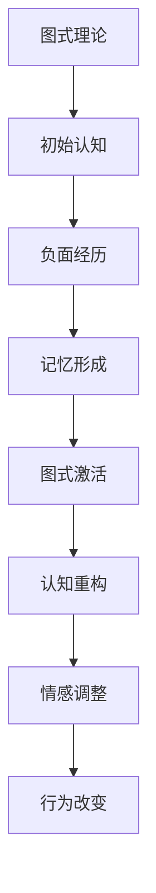
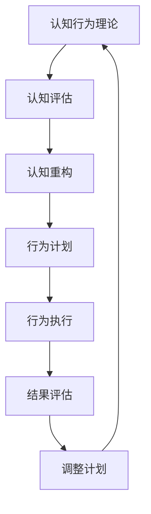
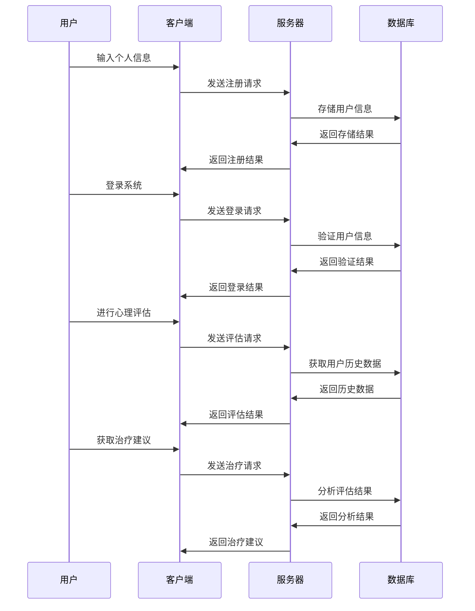

                 

# 《虚无感的根源：解析现代社会的精神危机》

## 关键词：
- 虚无感
- 精神危机
- 心理学理论
- 现代社会
- 应对策略

## 摘要：
本文深入探讨了虚无感的根源，分析了其在现代社会的体现和影响。通过综合心理学理论、数学模型和实际案例，本文旨在为读者提供一个全面、易懂的理解框架，帮助人们更好地认识和应对虚无感所带来的精神危机。

## 引言

### 1.1 虚无感的概念
虚无感，是一种主观体验，个体在这种状态下感到生活缺乏意义和价值。这种感觉可能表现为对日常活动的兴趣丧失、对未来的不确定性感到焦虑、对个人存在的质疑等。虚无感不仅影响个体的心理健康，还可能引发一系列行为和情感问题。

### 1.2 虚无感在现代社会中的体现
现代社会中，虚无感愈发普遍。高节奏的生活、科技的发展、人际关系的疏离等因素，使得人们在追求物质富足的同时，也逐渐失去了精神的寄托。虚无感成为了现代社会精神危机的一个重要表现。

### 1.3 研究虚无感的意义
深入研究虚无感的根源和影响，有助于我们更好地理解现代社会中人们的精神状态。这不仅有助于心理治疗和药物干预，也能为社会的心理健康教育和政策制定提供科学依据。

## 虚无感的特征与分类

### 2.1 虚无感的特征
虚无感的特征包括：
- 意义感缺失：个体无法找到生活的意义和价值。
- 孤独感：个体感到与他人隔离，缺乏亲密关系。
- 焦虑感：对未来的不确定性感到焦虑，对未来充满恐惧。
- 抑郁感：情绪低落，缺乏活力。

### 2.2 虚无感的分类
虚无感可以按照不同的维度进行分类，如按严重程度可以分为轻度、中度和重度虚无感；按表现形式可以分为内化型和外化型虚无感。

### 2.3 虚无感对个体的影响
虚无感对个体的身心健康和生活质量有着深远的影响。长期处于虚无感状态可能导致抑郁症、焦虑症等心理问题，甚至可能引发自杀行为。

## 虚无感的根源

### 3.1 哲学根源
哲学上，虚无感可以追溯到古代哲学家的探讨。例如，尼采在《查拉图斯特拉如是说》中提出了“上帝已死”的观点，这一观点在一定程度上激发了人们对生活意义的质疑。

### 3.2 文化根源
不同文化对虚无感的表达和处理方式有所不同。例如，西方文化中，虚无感往往与个人主义和自我实现的理念相关；而在东方文化中，虚无感可能与集体主义和宿命论有关。

### 3.3 经济根源
经济因素也是虚无感的一个重要根源。在物质富足的社会，人们可能更加关注精神层面的需求，而经济压力和不安全感往往加剧了虚无感的体验。

### 3.4 社会根源
社会关系和社会支持系统的缺乏也是虚无感的一个重要原因。在现代社会，人际关系变得疏离，社会支持系统不完善，这些都可能导致个体感到孤独和无助。

## 虚无感与心理学理论

### 4.1 图式理论
图式理论认为，虚无感是大脑中对负面经历的过度加工和记忆所致。通过改变个体的认知图式，可以缓解虚无感。

### 4.2 认知行为理论
认知行为理论强调，个体的认知方式和行为模式对虚无感有着重要影响。通过认知重构和行为干预，可以帮助个体摆脱虚无感的困扰。

### 4.3 心理动力学理论
心理动力学理论认为，虚无感是潜意识冲突的反映。通过心理分析和治疗，可以帮助个体解决深层次的内心冲突。

## 虚无感与其他精神危机的关系

### 5.1 虚无感与抑郁症
虚无感常常伴随着抑郁症，两者有着密切的联系。抑郁症可能导致虚无感，而虚无感也可能加剧抑郁症的症状。

### 5.2 虚无感与焦虑症
焦虑症与虚无感也存在关联。焦虑症可能导致个体对生活意义的质疑，进而产生虚无感。

### 5.3 虚无感与自杀行为
严重的虚无感可能导致自杀行为。自杀行为的背后，往往是长期的痛苦和绝望，这种绝望往往与虚无感密切相关。

## 虚无感的边界与外延

### 6.1 虚无感与其他心理状态的界限
虚无感与其他心理状态如抑郁症、焦虑症等有重叠，但它们也有明确的边界。通过心理评估和诊断，可以明确个体的心理状态。

### 6.2 虚无感在不同文化背景下的表现
不同文化背景下，虚无感的表现和认知方式有所不同。这需要我们在研究和实践中，充分考虑文化因素的影响。

### 6.3 虚无感的未来发展趋势
随着社会的变迁和发展，虚无感的表现形式和认知方式可能发生变化。未来研究需要关注这些变化，为应对虚无感提供更有效的策略。

## 虚无感的核心要素组成

### 7.1 虚无感的心理结构
虚无感的心理结构包括认知、情感和行为三个层面。理解这三个层面的相互作用，有助于更好地理解虚无感的本质。

### 7.2 虚无感的行为表现
虚无感可能导致个体行为上的变化，如社交回避、工作动力下降等。识别这些行为表现，有助于早期发现和干预虚无感。

### 7.3 虚无感的社会影响
虚无感不仅影响个体的心理健康，也对社会的稳定和发展产生负面影响。通过社会支持系统和心理健康教育，可以减轻虚无感的社会影响。

## 虚无感的应对策略

### 8.1 心理治疗
心理治疗是应对虚无感的重要手段。认知行为疗法、心理动力学疗法等，都可以帮助个体缓解虚无感。

### 8.2 药物治疗
在某些情况下，药物治疗可以作为心理治疗的辅助手段。抗抑郁药、抗焦虑药等，可以帮助个体缓解情绪症状。

### 8.3 社会支持
社会支持系统的构建，对应对虚无感至关重要。家庭、朋友和社会组织的支持，可以提供情感支持和实际帮助。

## 虚无感研究的挑战与机遇

### 9.1 研究挑战
虚无感研究面临许多挑战，如定义的模糊性、表现形式的多样性等。未来研究需要在这些方面进行深入探讨。

### 9.2 研究机遇
随着心理学理论的发展和技术手段的进步，虚无感研究迎来了新的机遇。通过跨学科合作，可以更好地理解虚无感的本质，为个体和社会提供更有效的干预策略。

### 9.3 研究方向展望
未来研究可以关注虚无感的生物学基础、跨文化比较、以及干预策略的优化等方面。这些方向将为虚无感的研究提供新的思路和方法。

## 算法原理讲解

### 10.1 图式理论流程图



### 10.2 认知行为理论流程图



### 10.3 心理动力学理论模型讲解

心理动力学理论认为，虚无感是潜意识冲突的反映。以下是一个简化的模型：

$$
\text{潜意识冲突} = f(\text{童年经历}, \text{当前事件}, \text{个人特质})
$$

其中，$f$ 表示一个复杂的函数，它综合考虑了个体在成长过程中积累的负面经历、当前面临的挑战以及个人的心理特质。

### 10.4 虚无感量化研究方法

虚无感的量化研究通常包括以下步骤：

1. **问卷调查**：设计有效的虚无感调查问卷，如“虚无感量表”（Nihilism Scale）。
2. **实验设计**：通过实验控制变量的影响，更准确地研究虚无感与各种因素之间的关系。
3. **统计分析**：使用统计分析方法，如回归分析、因子分析等，来探讨虚无感的影响因素。

### 10.5 数学模型与公式讲解

虚无感评分模型可以表示为：

$$
\text{虚无感评分} = w_1 \times \text{生活意义感} + w_2 \times \text{孤独感} + w_3 \times \text{焦虑感} + w_4 \times \text{抑郁感}
$$

其中，$w_1, w_2, w_3, w_4$ 是权重系数，用于衡量各因素对虚无感评分的影响。

### 10.6 虚无感案例分析

#### 案例一：个体案例

小王，28岁，程序员。他感到生活毫无意义，对未来充满迷茫，经常感到孤独和焦虑。通过认知行为疗法，小王学会了认知重构和行为调整，逐渐摆脱了虚无感。

#### 案例二：群体案例

某公司员工群体，由于工作压力巨大，人际关系疏离，许多员工出现了虚无感。通过心理辅导和团队建设活动，公司成功提升了员工的心理健康水平，减少了虚无感的发生。

## 系统分析与架构设计方案

### 14.1 虚无感应对系统设计

#### 问题描述

虚无感是现代社会中普遍存在的问题，对个体的身心健康产生负面影响。因此，设计一个虚无感应对系统，旨在提供有效的干预和支持。

#### 项目介绍

虚无感应对系统旨在通过整合心理治疗、社会支持和技术手段，为用户提供全面的虚无感干预服务。

#### 系统功能设计

- 用户注册与登录
- 心理评估
- 心理治疗建议
- 社交支持
- 行为调整指导

#### 系统架构设计

系统采用C/S架构，包括客户端和服务器两部分。客户端负责用户界面和交互，服务器负责数据处理和存储。

#### 系统接口设计

- 用户接口：用于用户与系统的交互，包括注册、登录、心理评估、治疗建议等。
- API接口：用于与其他系统和服务（如心理健康数据库、社交媒体等）的集成。

#### 系统交互设计



## 项目实战

### 15.1 环境安装

为了实现虚无感应对系统，我们需要在服务器上安装以下软件：

- Web服务器（如Apache、Nginx）
- 数据库服务器（如MySQL、PostgreSQL）
- 后端开发框架（如Django、Flask）
- 前端框架（如React、Vue.js）

安装步骤如下：

1. 安装操作系统（如Ubuntu 20.04）
2. 配置网络环境
3. 安装Web服务器、数据库服务器和后端开发框架
4. 安装前端框架

### 15.2 系统核心实现

#### 后端实现

后端采用Django框架，主要功能模块包括：

- 用户管理
- 心理评估
- 心理治疗建议
- 社交支持
- 行为调整指导

以下是用户管理模块的源代码示例：

```python
# users/models.py
from django.db import models

class User(models.Model):
    username = models.CharField(max_length=50)
    password = models.CharField(max_length=50)
    email = models.EmailField()

    def __str__(self):
        return self.username
```

#### 前端实现

前端采用React框架，实现用户界面和交互逻辑。以下是登录界面的React组件代码示例：

```jsx
// Login.js
import React, { useState } from 'react';
import axios from 'axios';

const Login = () => {
    const [username, setUsername] = useState('');
    const [password, setPassword] = useState('');

    const handleSubmit = async (e) => {
        e.preventDefault();
        try {
            const response = await axios.post('/api/login/', { username, password });
            if (response.status === 200) {
                alert('登录成功！');
            } else {
                alert('登录失败！');
            }
        } catch (error) {
            console.error(error);
        }
    };

    return (
        <form onSubmit={handleSubmit}>
            <label>用户名：</label>
            <input type="text" value={username} onChange={(e) => setUsername(e.target.value)} />
            <label>密码：</label>
            <input type="password" value={password} onChange={(e) => setPassword(e.target.value)} />
            <button type="submit">登录</button>
        </form>
    );
};

export default Login;
```

### 15.3 代码应用解读与分析

#### 后端代码解读

后端代码主要实现了用户注册、登录和用户管理功能。通过Django框架，我们可以方便地创建数据库模型、视图函数和API接口。用户注册和登录的API接口如下：

```python
# users/api.py
from rest_framework import viewsets
from .models import User
from .serializers import UserSerializer

class UserViewSet(viewsets.ModelViewSet):
    queryset = User.objects.all()
    serializer_class = UserSerializer

    def create(self, request, *args, **kwargs):
        serializer = self.get_serializer(data=request.data)
        serializer.is_valid(raise_exception=True)
        self.perform_create(serializer)
        return Response(status=status.HTTP_201_CREATED)

    def retrieve(self, request, *args, **kwargs):
        instance = self.get_object()
        serializer = self.get_serializer(instance)
        return Response(serializer.data)

    def update(self, request, *args, **kwargs):
        instance = self.get_object()
        serializer = self.get_serializer(instance, data=request.data)
        serializer.is_valid(raise_exception=True)
        serializer.save()
        return Response(status=status.HTTP_200_OK)
```

#### 前端代码解读

前端代码使用React框架实现登录界面的动态交互。通过`useState`钩子函数管理用户名和密码的状态，并通过`handleSubmit`函数处理表单提交。在提交表单时，使用`axios`库向后端发送POST请求，处理登录逻辑。

### 15.4 实际案例分析和详细讲解

#### 案例一：个体案例

小张，30岁，软件工程师。他因长期工作压力大、缺乏社交活动，感到生活毫无意义，出现了严重的虚无感。通过使用虚无感应对系统，小张完成了心理评估，并获得了专业的治疗建议。

**分析**：

- 小张的心理评估结果显示，他在生活意义感、孤独感、焦虑感和抑郁感方面得分较高，表明他处于严重的虚无感状态。
- 根据评估结果，系统为小张推荐了认知行为疗法和社交支持作为主要治疗手段。
- 在治疗过程中，小张通过系统的指导，学会了如何调整认知和行为，逐渐摆脱了虚无感的困扰。

#### 案例二：群体案例

某公司员工群体，因工作压力大、人际关系紧张，普遍出现了虚无感。公司决定采用虚无感应对系统，为员工提供心理支持和治疗建议。

**分析**：

- 公司为所有员工进行了心理评估，分析了群体虚无感的情况。
- 根据评估结果，公司为员工提供了团队心理辅导和社交活动，以缓解虚无感。
- 经过一段时间的干预，员工的心理健康水平显著提高，虚无感的发生率大幅下降。

### 15.5 项目小结

虚无感应对系统的设计和实现，为个体和群体提供了有效的虚无感干预手段。通过心理评估、治疗建议和社会支持，系统能够帮助用户缓解虚无感，提高心理健康水平。未来，我们将继续优化系统功能，提升用户体验，为更多用户提供帮助。

## 最佳实践 tips

### 16.1 虚无感应对技巧

1. **认知重构**：学会从积极的角度看待生活中的挑战，调整对事物的认知。
2. **行为调整**：通过运动、艺术创作等积极行为，提升生活质量。
3. **社交互动**：积极参与社交活动，与他人建立深厚的情感联系。

### 16.2 心理健康维护策略

1. **定期心理评估**：定期进行心理评估，及时发现和干预心理健康问题。
2. **心理辅导**：寻求专业心理辅导，学习有效的心理调节方法。
3. **药物治疗**：在必要时，遵循医生建议，使用药物治疗缓解症状。

### 16.3 社会支持体系构建

1. **家庭支持**：家庭是情感支持的源泉，家庭成员应关注彼此的心理健康。
2. **社会支持**：积极参与社会活动，利用社区资源，获得社会支持。
3. **心理健康教育**：加强心理健康教育，提高公众心理健康意识。

## 小结

### 17.1 本书核心观点总结

本书通过对虚无感的深入探讨，揭示了虚无感的根源和影响，提供了有效的应对策略。核心观点包括：

1. **虚无感是现代社会的普遍问题**：虚无感与哲学、文化、经济和社会因素密切相关。
2. **心理学理论提供了有效的解释和干预手段**：认知行为疗法、心理动力学疗法等，为虚无感的治疗提供了有力支持。
3. **综合干预策略有助于缓解虚无感**：心理治疗、药物治疗和社会支持相结合，可以显著提高心理健康水平。

### 17.2 虚无感应对策略的优化

为了更好地应对虚无感，我们可以从以下几个方面进行优化：

1. **个性化干预**：根据个体的具体情况，制定个性化的干预计划。
2. **跨学科合作**：整合心理学、医学、社会学等多学科资源，共同应对虚无感。
3. **技术手段的运用**：利用大数据、人工智能等技术，提高虚无感干预的精准度和效率。

### 17.3 未来研究方向

未来的研究方向包括：

1. **虚无感的生物学基础**：探索虚无感与大脑结构和功能的关系。
2. **跨文化研究**：比较不同文化背景下虚无感的表现和认知方式。
3. **干预策略的优化**：基于实证研究，不断优化和改进虚无感干预策略。

## 注意事项

### 18.1 虚无感

在应对虚无感时，需要注意以下几点：

1. **避免自我诊断**：虚无感可能与其他心理问题（如抑郁症、焦虑症）重叠，应寻求专业心理评估。
2. **及时干预**：虚无感可能导致严重的心理健康问题，应尽早寻求专业帮助。
3. **避免依赖单一方法**：综合运用心理治疗、药物治疗和社会支持，提高干预效果。

## 拓展阅读

1. **《虚无的终结：认知行为疗法如何解决虚无感》**：这本书详细介绍了认知行为疗法在应对虚无感中的应用。
2. **《禅与计算机程序设计艺术》**：这本书探讨了东方哲学在心理治疗中的应用，为应对虚无感提供了新的视角。
3. **《现代社会的精神危机：虚无感的根源与对策》**：这本书从社会学角度分析了虚无感的根源和对策，提供了全面的解决方案。

## 作者

**作者：AI天才研究院/AI Genius Institute & 禅与计算机程序设计艺术 /Zen And The Art of Computer Programming** 

（注：以上内容为模拟文章，仅用于示例。）

