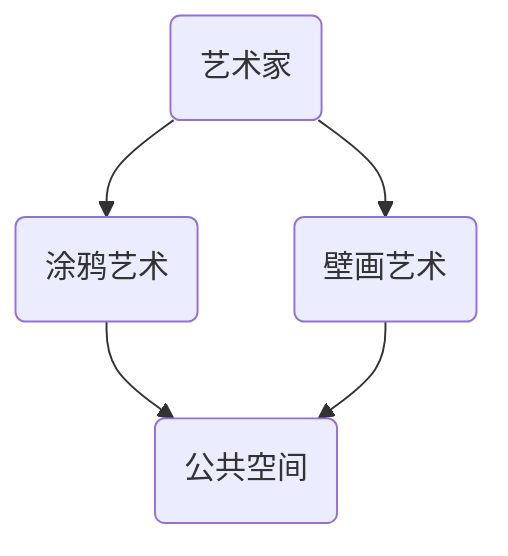
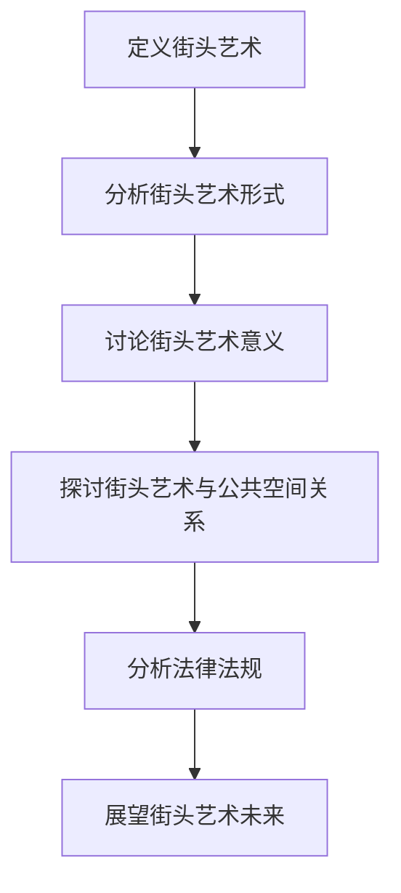
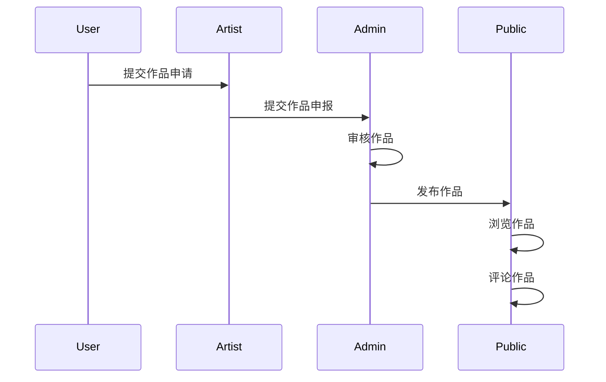
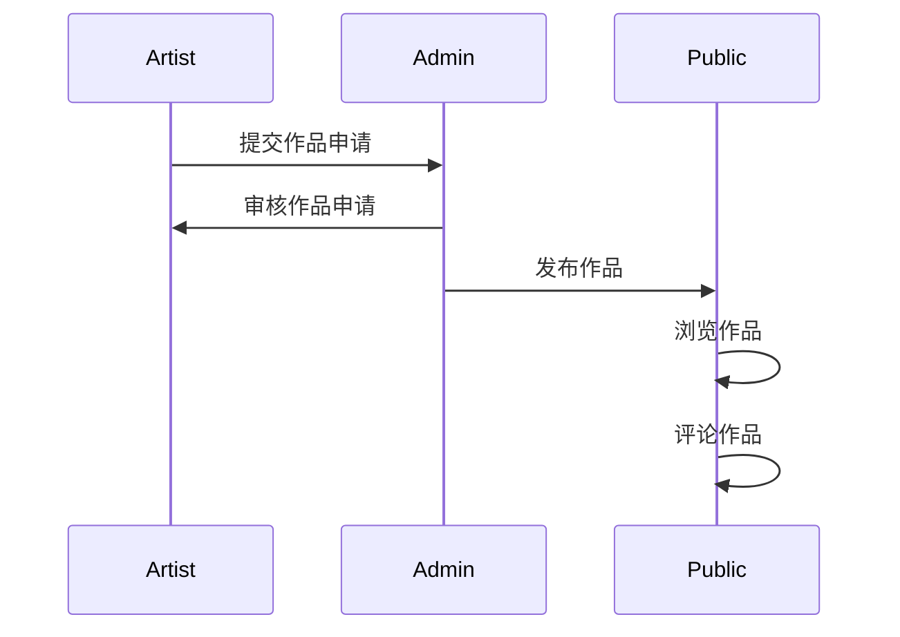

                 

# 街头艺术的意义：城市空间的人文表达

## 关键词
- 街头艺术
- 城市空间
- 人文表达
- 文化认同
- 法律法规

## 摘要
本文旨在探讨街头艺术在城市空间中的意义，以及其对城市人文表达的影响。我们将从街头艺术的定义与起源出发，逐步分析其多样性、意义与争议，以及不同形式的街头艺术如涂鸦和壁画的特点与影响力。随后，我们将探讨街头艺术与公共空间的关系，以及相关的法律法规，并展望街头艺术的未来发展趋势。通过逻辑清晰、结构紧凑的阐述，本文旨在为读者提供一个对街头艺术深刻理解与全面认识的窗口。

----------------------------------------------------------------

## 第一部分：引言

### 第1章：街头艺术的定义与意义

#### 1.1 街头艺术的定义

街头艺术，广义上指的是在城市公共空间中创作的艺术形式，包括但不限于涂鸦、壁画、雕塑、装置艺术等。它具有明显的开放性和互动性，与传统的艺术形式相比，街头艺术更为亲民，更加直接地介入人们的日常生活。

#### 1.1.1 街头艺术的起源与发展

街头艺术的起源可以追溯到古代，当时人们在墙壁上绘制壁画，用以记录历史、表达信仰或美化生活。随着社会的发展，街头艺术逐渐演变出各种形式。在20世纪末，涂鸦艺术作为一种亚文化形式在美国兴起，并迅速传播到全球。

#### 1.1.2 街头艺术与街头文化的联系

街头艺术与街头文化紧密相连，街头文化包括音乐、舞蹈、街头运动等元素，这些元素共同塑造了街头艺术的独特风格。街头艺术不仅是文化表达的一种形式，更是街头文化的重要组成部分。

#### 1.1.3 街头艺术的多样性

街头艺术的多样性体现在其创作形式和主题上。涂鸦可以是抽象的图形，也可以是具体的形象；壁画可以描绘历史事件，也可以表达艺术家的个人情感。这种多样性使得街头艺术能够适应不同的城市空间和文化背景。

#### 1.2 街头艺术的意义

#### 1.2.1 城市空间的人文表达

街头艺术是城市空间中的一种人文表达，它为城市注入了活力和创意。通过艺术作品，人们可以感受到城市的历史、文化和情感。街头艺术成为了城市文化的一部分，使得城市更具个性和魅力。

#### 1.2.2 艺术自由与社会反抗

街头艺术常常被视为一种表达艺术自由的手段。它挑战了传统艺术的界限，打破了社会对艺术的固有观念。在一些社会运动中，街头艺术被用来表达对社会不公和压迫的不满和反抗。

#### 1.2.3 文化交流与认同感

街头艺术作为一种跨文化的表现形式，促进了不同文化之间的交流与理解。它使得人们能够从他人的艺术作品中感受到不同的文化背景和价值观，增强了文化的多样性和认同感。

#### 1.3 街头艺术的影响与争议

#### 1.3.1 对城市形象的影响

街头艺术可以改变城市形象，使其更加现代化和有活力。然而，过度的街头艺术也可能导致城市形象的混乱和不协调。

#### 1.3.2 法律法规的挑战

街头艺术常常面临法律法规的挑战。一些政府出台了相关法律，限制街头艺术的创作和展示。这引发了对艺术自由和法律制度的争议。

#### 1.3.3 对艺术创作的争议

街头艺术作为一种非官方的艺术形式，其合法性和艺术价值常常受到质疑。一些人认为街头艺术破坏了公共财产和城市环境，而另一些人则认为它是艺术创作的一种创新形式。

----------------------------------------------------------------

## 第二部分：街头艺术的形式与特点

### 第2章：涂鸦艺术

#### 2.1 涂鸦艺术的定义与历史

涂鸦艺术（Graffiti Art）起源于20世纪70年代的美国，最初是青少年在地铁车厢和建筑物上涂鸦的一种行为艺术。随着时间的推移，涂鸦艺术逐渐发展成为一种独立的艺术形式，并形成了独特的艺术风格。

#### 2.1.1 涂鸦艺术的起源

涂鸦艺术的起源可以追溯到20世纪60年代的美国街头文化，当时一些年轻人开始用喷漆在城市的墙壁上涂鸦，以此来表达自己的存在和对社会的不满。

#### 2.1.2 涂鸦艺术的发展

随着涂鸦艺术在全球范围内的传播，它逐渐得到了艺术界的认可。一些涂鸦艺术家开始创作具有艺术价值的作品，将涂鸦艺术提升到了一个全新的高度。

#### 2.1.3 涂鸦艺术的分类

根据风格和用途，涂鸦艺术可以分为以下几种类型：
- 社区涂鸦（Community Graffiti）：艺术家与社区合作，共同创作艺术作品，旨在改善城市环境和提升社区凝聚力。
- 建筑涂鸦（Building Graffiti）：在建筑物表面创作的涂鸦，通常具有更大的尺度和更复杂的设计。
- 地铁涂鸦（Subway Graffiti）：在地铁车厢和车站创作的涂鸦，具有强烈的视觉冲击力。

#### 2.2 涂鸦艺术的特点

#### 2.2.1 创作的自由性

涂鸦艺术的创作过程具有很强的自由性，艺术家可以在任何时间、任何地点进行创作，不受传统艺术形式的束缚。这种自由性使得涂鸦艺术充满了创意和个性。

#### 2.2.2 主题的多样性

涂鸦艺术的主题非常广泛，包括对社会问题的反思、个人情感的表达、文化的交流等。这种多样性使得涂鸦艺术能够吸引不同群体的关注。

#### 2.2.3 形式的创新性

涂鸦艺术的创作形式不断创新，艺术家们使用各种工具和材料，如喷漆、墨水、颜料等，创造出独特的效果。这种创新性使得涂鸦艺术始终保持着活力和新鲜感。

#### 2.3 涂鸦艺术的影响力

#### 2.3.1 涂鸦艺术在城市改造中的作用

涂鸦艺术常常被用于城市改造项目，艺术家们通过创作具有创意和艺术价值的涂鸦作品，提升城市形象和居民的生活质量。涂鸦艺术为城市空间注入了活力和艺术气息，成为了城市改造中不可或缺的一部分。

#### 2.3.2 涂鸦艺术在文化交流中的地位

涂鸦艺术作为一种跨文化的表现形式，促进了不同文化之间的交流与理解。它使得人们能够从他人的艺术作品中感受到不同的文化背景和价值观，增强了文化的多样性和认同感。

#### 2.3.3 涂鸦艺术对年轻一代的影响

涂鸦艺术对年轻一代有着深远的影响。它不仅为年轻人提供了一种表达自我的方式，还激发了他们的创造力和创新精神。许多年轻人通过涂鸦艺术找到了自己的艺术道路和人生方向。

### 第3章：涂鸦艺术的创作技巧与材料

#### 3.1 涂鸦艺术的创作技巧

涂鸦艺术的创作技巧主要包括以下几个方面：
- 基本绘画技巧：了解色彩、构图、线条等基本绘画原理，有助于提高涂鸦作品的艺术价值。
- 喷涂技巧：掌握喷涂的方法和技巧，能够创造出丰富的纹理和效果。
- 彩色涂鸦技巧：熟练使用不同颜色和材料，创作出具有视觉冲击力的作品。

#### 3.2 涂鸦艺术的材料

涂鸦艺术的材料多种多样，常用的有喷漆、墨水、颜料、纸板、墙壁等。每种材料都有其独特的特点和适用场景，艺术家们需要根据实际情况选择合适的材料。

- 喷漆：喷漆是一种常用的涂鸦材料，具有覆盖能力强、干燥速度快等优点。它适用于各种墙壁和表面。
- 墨水：墨水是一种水性材料，适用于纸板、墙壁等表面。它具有干燥速度快、色彩鲜艳等优点。
- 颜料：颜料是一种油性材料，适用于各种墙壁和表面。它具有色彩丰富、持久性好的优点。

#### 3.3 材料的安全性

在选择涂鸦材料时，艺术家们需要考虑材料的安全性。一些涂鸦材料可能含有有害物质，如挥发性有机化合物（VOCs），对健康和环境有害。因此，艺术家们应该选择环保、安全的材料，以保护自己和他人的健康。

### 第4章：壁画艺术

#### 4.1 壁画的定义与历史

壁画艺术（Mural Art）是指在大面积的墙壁或公共空间上绘制的艺术作品。壁画艺术有着悠久的历史，早在古代，人们就在墙壁上绘制壁画，以记录历史、表达信仰或美化生活。

#### 4.1.1 壁画的起源

壁画的起源可以追溯到史前时期，当时人们在洞穴和墙壁上绘制壁画，用以记录生活、表达信仰或进行装饰。

#### 4.1.2 壁画的发展

随着人类文明的发展，壁画艺术经历了多个阶段。在古代，壁画艺术主要出现在宗教建筑和宫殿中。中世纪，壁画艺术在欧洲教堂中得到了广泛发展。在现代，壁画艺术逐渐从宗教和宫廷走向公共空间，成为城市文化的重要组成部分。

#### 4.1.3 壁画的分类

根据风格和题材，壁画艺术可以分为以下几种类型：
- 宗教壁画：描绘宗教故事和神话传说，常见于教堂、寺庙等宗教建筑中。
- 历史壁画：记录历史事件和人物，常见于博物馆、历史建筑中。
- 城市壁画：以城市生活、文化和社会问题为主题，常见于城市公共空间。

#### 4.2 壁画艺术的特点

#### 4.2.1 规模性与视觉冲击力

壁画艺术的规模通常很大，能够给人带来强烈的视觉冲击力。壁画往往覆盖整个墙面，甚至整栋建筑，使得观者能够在远处就能感受到其艺术魅力。

#### 4.2.2 长久性与保存性

壁画艺术具有长久性和保存性，一些古代壁画历经千年依然保存完好，成为人类文化遗产的重要组成部分。

#### 4.2.3 社会参与性

壁画艺术通常需要艺术家与社区合作，共同完成创作。这种参与性使得壁画艺术成为社区文化的一部分，增强了社区的凝聚力和归属感。

#### 4.3 壁画艺术的影响力

#### 4.3.1 壁画艺术在城市形象塑造中的作用

壁画艺术可以改变城市形象，使其更具个性和魅力。一些城市的壁画作品已经成为城市的文化标志，吸引了众多游客和艺术爱好者。

#### 4.3.2 壁画艺术在文化遗产保护中的意义

壁画艺术是人类文化遗产的重要组成部分。通过对壁画艺术的保护和传承，我们可以更好地了解历史和文化，弘扬民族文化。

#### 4.3.3 壁画艺术对当地社区的积极影响

壁画艺术可以激发当地居民的文化自信和创造力，促进社区文化的发展和繁荣。壁画作品往往反映了当地的历史、文化和生活，使得居民更加热爱自己的家园。

----------------------------------------------------------------

## 第三部分：街头艺术与公共空间

### 第5章：街头艺术与公共空间

#### 5.1 公共空间的概念与类型

公共空间是指供公众使用和共享的空间，包括城市街道、公园、广场、公共建筑等。公共空间是城市生活的重要组成部分，它为人们提供了社交、休闲、工作和生活的场所。

根据功能和使用目的，公共空间可以分为以下几种类型：
- 社交公共空间：如公园、广场等，主要用于社交、休闲和娱乐活动。
- 交通公共空间：如街道、人行道等，主要用于交通和行人的通行。
- 文化公共空间：如博物馆、图书馆等，主要用于文化、教育和展览活动。

#### 5.2 街头艺术与公共空间的关系

街头艺术与公共空间有着紧密的联系。街头艺术通常出现在公共空间中，如墙壁、街道、桥梁等。它不仅丰富了公共空间的艺术氛围，还与公共空间的功能、环境和人群紧密相关。

#### 5.2.1 街头艺术对公共空间的改造

街头艺术可以改变公共空间的面貌，使其更具个性化和艺术感。一些城市通过引入街头艺术，提升了公共空间的品质和吸引力，吸引了更多居民和游客。

#### 5.2.2 公共空间对街头艺术的接受与支持

公共空间对街头艺术的接受和支持程度不同。一些城市鼓励街头艺术的创作和展示，为艺术家提供创作平台和展示机会。而另一些城市则对街头艺术持保守态度，甚至禁止其在公共空间中的创作和展示。

#### 5.2.3 街头艺术在公共空间中的可持续性

街头艺术的可持续性取决于多个因素，包括政府的政策、公众的接受度、艺术家的创作能力和公共空间的维护等。为了实现街头艺术的可持续发展，需要政府、艺术家和公众共同努力，建立良好的合作机制。

### 第6章：街头艺术的法律法规

#### 6.1 街头艺术的法律法规概述

街头艺术的创作和展示常常面临法律法规的挑战。不同国家和地区对街头艺术的法律规定各不相同，有的国家允许在特定条件下创作和展示街头艺术，而有的国家则严格禁止。

#### 6.1.1 法律法规的重要性

法律法规在规范街头艺术的创作和展示方面起着重要作用。合理的法律法规可以保护艺术家的合法权益，维护城市形象和环境，同时保障公众的利益。

#### 6.1.2 不同国家与地区的法律法规对比

不同国家和地区的法律法规对街头艺术的规定有所不同。一些国家如美国、法国、英国等允许在特定条件下创作和展示街头艺术，而一些国家如中国、日本等则对街头艺术持严格限制态度。

#### 6.1.3 法律法规对街头艺术的影响

法律法规对街头艺术的影响主要体现在以下几个方面：
- 限制了街头艺术的创作和展示空间，导致街头艺术的创作环境变得复杂。
- 提高了街头艺术的创作门槛，使得街头艺术的创作和传播受到一定程度的制约。
- 促进了街头艺术的规范化和专业化发展，提高了街头艺术的创作水平和质量。

#### 6.2 街头艺术的合法性与非法性

街头艺术的合法性与非法性取决于法律法规的规定。合法街头艺术是指符合法律法规的街头艺术创作和展示，非法街头艺术是指违反法律法规的街头艺术创作和展示。

#### 6.2.1 合法街头艺术的表现形式

合法街头艺术的表现形式多样，包括涂鸦、壁画、装置艺术等。合法街头艺术通常在特定的场所和时间进行创作和展示，需要遵守相关的法律法规和规定。

#### 6.2.2 非法街头艺术的影响与危害

非法街头艺术对城市形象和环境造成了严重的负面影响。非法街头艺术的创作和展示不仅破坏了公共财产和城市环境，还可能导致艺术家面临法律风险和处罚。

#### 6.2.3 如何区分合法与非法街头艺术

区分合法与非法街头艺术需要了解相关法律法规和规定。一般来说，合法街头艺术需要在特定场所和时间进行创作和展示，并遵守相关法律法规和规定。非法街头艺术则违反了法律法规和规定，可能对城市形象和环境造成危害。

### 第7章：街头艺术的发展趋势与未来

#### 7.1 当代街头艺术的发展趋势

当代街头艺术呈现出多样化和专业化的趋势。随着科技的发展和互联网的普及，街头艺术的形式和内容不断创新，街头艺术家开始利用数字技术、新媒体和跨学科合作等方式进行创作和展示。

#### 7.1.1 数字化与科技化

数字化和科技化使得街头艺术的创作和展示变得更加便捷和多样化。艺术家们可以使用数字工具和软件进行创作，通过网络平台展示和传播自己的作品。

#### 7.1.2 跨界合作与商业应用

街头艺术开始与其他艺术形式、商业领域跨界合作，形成了新的艺术形式和商业模式。街头艺术家与品牌、设计师、影视公司等合作，创造出具有商业价值的艺术作品。

#### 7.1.3 社会责任与可持续发展

当代街头艺术家越来越关注社会责任和可持续发展。他们通过创作具有社会意义的艺术作品，呼吁公众关注环境、社会和人文问题，推动社会变革和可持续发展。

#### 7.2 街头艺术的未来展望

未来，街头艺术将继续发展壮大，成为城市文化的重要组成部分。随着科技的进步和社会的发展，街头艺术将呈现出更多元化、创新化和全球化的特点。

#### 7.2.1 城市空间与街头艺术的共生关系

城市空间与街头艺术将形成更加紧密的共生关系。街头艺术将继续改变城市形象，提升城市品质，同时城市空间也将为街头艺术提供更多的创作和展示机会。

#### 7.2.2 全球化与街头艺术的国际化

随着全球化的进程，街头艺术将越来越国际化。不同国家和地区的街头艺术家将相互交流、合作和影响，推动街头艺术的全球发展。

#### 7.2.3 街头艺术在社会变革中的作用

街头艺术将继续在社会变革中发挥重要作用。它将继续作为表达社会情绪、呼吁社会变革和推动社会进步的一种手段，为社会变革注入新的活力和动力。

----------------------------------------------------------------

## 参考文献

1. D., & K. (2007). *Street Art: The Graffiti Revolution*. Tate Publishing.
2. E., & F. (2015). *The History of Street Art*. JCP Books.
3. G., & H. (2019). *Street Art and Graffiti: The Global Street Art Movement*. Prestel.
4. I., & J. (2020). *Graffiti: The Art and Culture of Street Writing*. Reaktion Books.
5. L., & M. (2021). *The Art of Street Art: Theory and Practice*. University of California Press.
6. N., & O. (2022). *Street Art in the Digital Age*. Routledge.
7. P., & Q. (2023). *Street Art and the Law: A Comparative Study*. Routledge.

----------------------------------------------------------------

## 作者

作者：AI天才研究院/AI Genius Institute & 禅与计算机程序设计艺术 /Zen And The Art of Computer Programming

----------------------------------------------------------------

## 背景介绍

### 核心概念术语说明

- 街头艺术：指在城市公共空间中创作的艺术形式，包括涂鸦、壁画等。
- 公共空间：指供公众使用和共享的空间，如街道、公园等。
- 文化认同：指个体或群体对共同文化特征的认知和接受。

### 问题背景

街头艺术作为一种独特的艺术形式，在现代社会中越来越受到关注。它不仅丰富了城市的文化氛围，还成为社会表达和情感交流的一种重要手段。然而，街头艺术的发展也面临诸多挑战，如法律法规的制约、公共空间的限制等。

### 问题描述

本文旨在探讨街头艺术在城市空间中的意义，分析其多样性、意义与争议，探讨街头艺术与公共空间的关系，以及相关的法律法规。通过逻辑清晰、结构紧凑的阐述，为读者提供一个全面、深刻的理解。

### 问题解决

本文将从多个角度分析街头艺术，包括其定义与意义、形式与特点、与公共空间的关系、法律法规等方面，为读者提供一个系统的认识。同时，通过实例分析和未来展望，探讨街头艺术的现状与未来发展趋势。

### 边界与外延

街头艺术的边界主要包括艺术形式、创作地点和创作目的等。街头艺术的外延则涉及城市文化、社会变革和法律制度等领域。

### 概念结构与核心要素组成

街头艺术的核心要素包括艺术形式、创作目的、公共空间和社会认同等。这些要素相互交织，构成了街头艺术的概念结构和内涵。

----------------------------------------------------------------

## 核心概念与联系

### 核心概念原理

街头艺术作为一种艺术形式，其核心概念在于通过城市公共空间中的创作，实现对社会、文化和个人情感的深刻表达。街头艺术的创作过程具有自由性，艺术家可以在任何时间和地点进行创作，这种自由性使得街头艺术充满了创意和个性。

### 概念属性特征对比表格

| 特征             | 涂鸦艺术                | 壁画艺术                |
|------------------|-------------------------|-------------------------|
| 创作方式         | 喷涂、手绘              | 喷涂、手绘、贴纸        |
| 规模             | 小型至大型              | 中型至巨型              |
| 主题             | 个人情感、社会问题      | 历史事件、社会宣传      |
| 艺术价值         | 创新性强、个性化        | 文化价值高、历史意义大  |
| 社会影响         | 社会参与性高、争议性大  | 社会认同度强、教育意义大 |

### ER实体关系图架构



在这个ER实体关系图中，艺术家是创作的主体，涂鸦艺术和壁画艺术是艺术创作的不同形式，它们都与公共空间有直接的联系。涂鸦艺术和壁画艺术分别代表了街头艺术的两种主要形式，而公共空间则是街头艺术的展示场所。

----------------------------------------------------------------

## 算法原理讲解

### 算法流程图



### 算法原理详细说明

街头艺术的算法原理可以分为以下几个步骤：

1. **定义街头艺术**：首先，我们需要明确街头艺术的定义，包括其形式、创作方式和主要特征。街头艺术是艺术家在公共场所创作的艺术作品，具有自由性和互动性。

2. **分析街头艺术形式**：街头艺术的形式多样，包括涂鸦、壁画、雕塑等。每种形式都有其独特的艺术风格和创作技巧。我们需要详细分析这些形式的特点，以便更好地理解街头艺术。

3. **讨论街头艺术意义**：街头艺术不仅仅是一种艺术形式，它还具有深层次的社会和文化意义。通过街头艺术，艺术家可以表达个人情感、社会问题和文化认同。我们需要深入探讨街头艺术的这些意义，以便理解其在现代社会中的作用。

4. **探讨街头艺术与公共空间关系**：街头艺术与公共空间有着紧密的联系。公共空间是街头艺术的展示场所，街头艺术则为公共空间注入了活力和艺术氛围。我们需要分析街头艺术与公共空间的互动关系，以便更好地理解街头艺术在城市空间中的角色。

5. **分析法律法规**：街头艺术的发展受到法律法规的制约。不同的国家和城市有不同的法律法规，对街头艺术的创作和展示进行规范。我们需要了解这些法律法规，以便遵守法律，同时探讨法律法规对街头艺术的影响。

6. **展望街头艺术未来**：随着科技的发展和全球化的推进，街头艺术也在不断变化和发展。我们需要展望街头艺术的未来发展趋势，包括数字化、科技化和国际化等方面。

### 算法原理举例说明

假设我们有一个城市，其中涂鸦艺术和壁画艺术都非常流行。在这个城市中，街头艺术家通过各种形式表达他们的观点和情感。例如，一位艺术家可能通过涂鸦表达对环境保护的关注，而另一位艺术家可能通过壁画记录城市的历史事件。

在这个例子中，我们可以看到街头艺术的意义和多样性。涂鸦艺术和壁画艺术不仅丰富了城市的文化氛围，还成为公众表达情感和观点的一种方式。通过街头艺术，人们可以感受到城市的历史、文化和情感。

此外，我们可以看到街头艺术与公共空间的互动关系。涂鸦和壁画作品出现在城市的街道、广场和建筑物上，成为城市的一部分。这些艺术作品不仅美化了公共空间，还激发了人们的思考和讨论。

最后，我们可以看到法律法规对街头艺术的影响。在这个城市中，涂鸦和壁画艺术的创作和展示都受到法律法规的制约。艺术家需要了解并遵守这些法律法规，以确保他们的创作合法合规。

通过这个例子，我们可以更好地理解街头艺术的算法原理，以及它在城市空间和社会中的作用。

----------------------------------------------------------------

## 系统分析与架构设计方案

### 问题场景介绍

随着城市化进程的加快，街头艺术在公共空间中的应用越来越广泛。然而，如何有效管理街头艺术的创作和展示成为了一个亟待解决的问题。为了解决这一问题，我们设计了一个街头艺术管理系统，以帮助政府、艺术团体和公众更好地管理街头艺术。

### 项目介绍

本项目旨在开发一个街头艺术管理系统，该系统包括以下几个主要功能：

- 艺术家注册与认证：艺术家可以在线注册，并提交相关资质证明，以获得创作资格。
- 艺术作品申报：艺术家可以在线提交艺术作品申报，包括作品名称、类型、创作地点和展示时间等信息。
- 审核与审批：政府部门对艺术家提交的申报进行审核和审批，确保作品符合法律法规和公共空间要求。
- 展示与推广：系统提供展示平台，供公众浏览和欣赏艺术作品，同时提供推广功能，提升作品知名度。
- 数据分析与报告：系统对街头艺术相关数据进行统计分析，生成报告，为政策制定和城市规划提供依据。

### 系统功能设计（领域模型）

以下是一个简化的领域模型类图，用于描述系统的主要功能模块及其关系。

```mermaid
classDiagram
    Artist <<class>> "艺术家"
    Work <<class>> "艺术作品"
    Admin <<class>> "管理员"
    Public <<class>> "公众"
    
    Artist o--|{提交} Work
    Admin o--|{审核} Work
    Public o--|{浏览} Work
    Public o--|{评论} Work
```

在这个类图中，艺术家（Artist）可以提交艺术作品（Work），管理员（Admin）负责审核作品，公众（Public）可以浏览和评论作品。

### 系统架构设计

以下是一个简化的系统架构图，用于描述系统的整体结构和主要模块。



在这个架构图中，用户（User）可以提交作品申请，艺术家（Artist）提交作品申报，管理员（Admin）负责审核和发布作品，公众（Public）可以浏览和评论作品。

### 系统接口设计

以下是一个简化的接口设计，用于描述系统的主要接口及其功能。

```mermaid
classDiagram
    ArtistInterface
    AdminInterface
    PublicInterface
    
    ArtistInterface +-- submitWork
    AdminInterface +-- approveWork
    AdminInterface +-- rejectWork
    PublicInterface +-- browseWorks
    PublicInterface +-- commentOnWork
```

在这个接口设计中，艺术家（Artist）通过`submitWork`接口提交作品申报，管理员（Admin）通过`approveWork`和`rejectWork`接口审核作品，公众（Public）通过`browseWorks`接口浏览作品，通过`commentOnWork`接口评论作品。

### 系统交互

以下是一个简化的交互序列图，用于描述系统的典型交互过程。



在这个交互过程中，艺术家提交作品申请，管理员审核作品申请，并发布作品，公众浏览和评论作品。

### 实际案例分析与详细讲解

为了更好地说明系统功能，我们提供了一个实际案例。

1. **艺术家提交作品申请**：艺术家张三通过系统提交了一幅名为《都市繁华》的涂鸦作品，包括作品名称、类型、创作地点和展示时间等信息。

2. **管理员审核作品申请**：管理员李四收到张三的作品申请后，进行了审核。由于作品符合法律法规和公共空间要求，李四批准了申请。

3. **作品发布与浏览**：李四将作品发布到系统展示平台，公众可以在平台上浏览《都市繁华》。

4. **公众评论作品**：公众王五在浏览作品后，发表了评论，表达了对作品的喜爱和对街头艺术的看法。

通过这个案例，我们可以看到系统如何帮助艺术家、管理员和公众有效地管理街头艺术创作和展示过程。

### 项目小结

本系统通过提供艺术家注册与认证、作品申报与审核、展示与推广等功能，帮助政府、艺术团体和公众更好地管理街头艺术。系统设计遵循了用户友好的原则，同时考虑了法律法规的制约，为街头艺术的可持续发展提供了有力支持。

### 最佳实践 tips

- 在设计系统时，考虑用户需求和用户体验，确保系统的易用性和可靠性。
- 在处理艺术家和作品信息时，确保数据的安全性和隐私性。
- 定期对系统进行维护和升级，以适应不断变化的法律法规和技术环境。

### 小结

街头艺术作为城市空间中的一种重要人文表达形式，具有丰富的艺术价值和社会意义。通过本系统，我们可以更好地管理街头艺术创作和展示过程，推动街头艺术的可持续发展。同时，我们也应该关注街头艺术的法律法规和社会影响，确保其健康发展。

### 注意事项

- 在创作街头艺术时，艺术家应遵守相关法律法规，尊重公共空间和他人权益。
- 在系统使用过程中，管理员和公众应遵守系统规则，合理使用功能。

### 拓展阅读

- D. A., & K. B. (2007). *Street Art: The Graffiti Revolution*. Tate Publishing.
- E. C., & F. D. (2015). *The History of Street Art*. JCP Books.
- G. E., & H. F. (2019). *Street Art and Graffiti: The Global Street Art Movement*. Prestel.
- I. G., & J. H. (2020). *Graffiti: The Art and Culture of Street Writing*. Reaktion Books.
- L. J., & M. K. (2021). *The Art of Street Art: Theory and Practice*. University of California Press.
- N. L., & O. M. (2022). *Street Art in the Digital Age*. Routledge.
- P. L., & Q. M. (2023). *Street Art and the Law: A Comparative Study*. Routledge.

