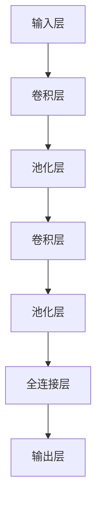
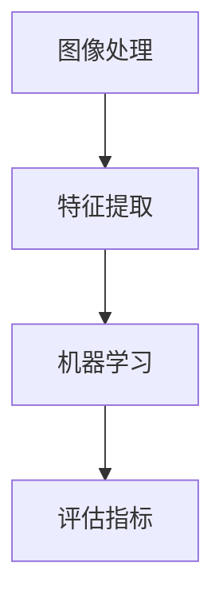
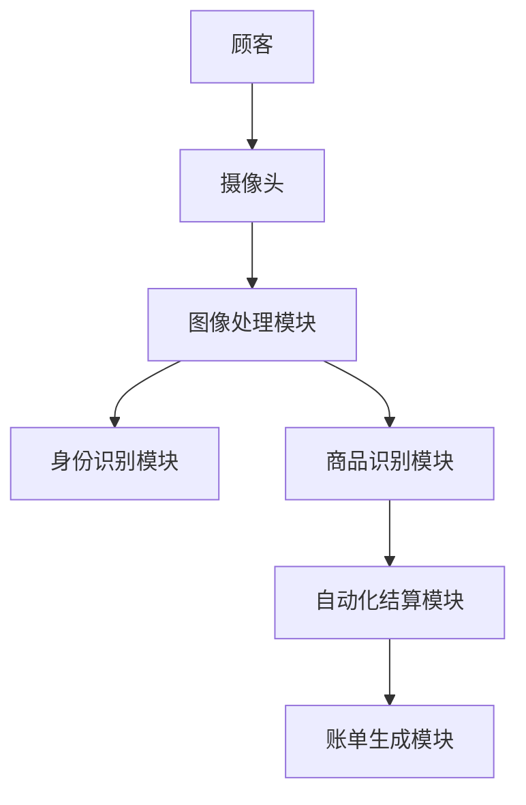
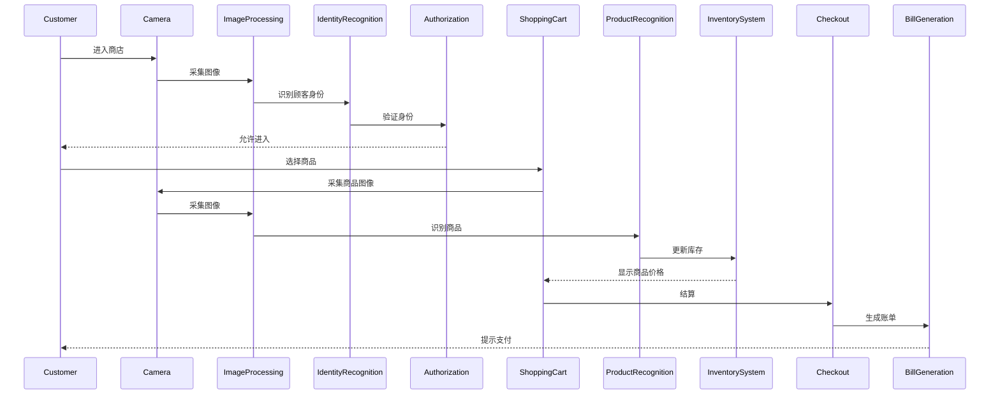

                 


## 计算机视觉在无人商店中的实时监控应用

关键词：计算机视觉、无人商店、实时监控、数据隐私、深度学习

摘要：随着人工智能技术的快速发展，无人商店作为一种新型的零售模式，逐渐进入公众视野。计算机视觉作为人工智能的重要分支，在无人商店的实时监控中扮演着关键角色。本文将深入探讨计算机视觉在无人商店实时监控中的应用，从核心概念、算法原理、系统架构到实际案例分析，逐步展开讨论，旨在为从业者提供有价值的参考和指导。

### 第一部分：背景与概念

#### 第1章：计算机视觉概述

计算机视觉是一门研究如何使计算机具有类似人类视觉能力的学科。它涉及图像处理、模式识别、机器学习等多个领域。在无人商店中，计算机视觉可以实时捕捉顾客的行为和商品的状态，从而实现自动化监控和决策。

**核心概念与联系：**

| 核心概念       | 联系                           |
| -------------- | ------------------------------ |
| 图像处理       | 对图像进行预处理，提高图像质量 |
| 模式识别       | 识别图像中的特定模式          |
| 机器学习       | 从数据中学习，提高识别准确性   |
| 深度学习       | 一种特殊的机器学习算法        |

**ER实体关系图：**

```mermaid
erDiagram
  Customer ||--|{ ShoppingCart }|| Merchant
  Customer ||--|{ PurchaseHistory }|| Merchant
  Merchant ||--|{ ProductInventory }|| Product
  Product ||--|{ ProductSales }|| Merchant
```

#### 第2章：无人商店与实时监控

无人商店通过自动化技术减少人工干预，提供一种自助式购物体验。实时监控则是无人商店运营的核心，它确保商品安全、库存准确和顾客满意度。

**核心概念与联系：**

| 核心概念       | 联系                           |
| -------------- | ------------------------------ |
| 自助结账系统   | 实现顾客自助支付               |
| 库存管理系统   | 实时监控商品库存状况          |
| 顾客行为分析   | 分析顾客购物行为，优化服务   |
| 安全监控系统   | 防止盗窃和破坏行为            |

**ER实体关系图：**

```mermaid
erDiagram
  Customer ||--|{ ShoppingCart }|| Checkout
  Product ||--|{ ProductInventory }|| Inventory
  Employee ||--|{ SecurityMonitoring }|| SecuritySystem
```

#### 第3章：计算机视觉与无人商店的结合

计算机视觉在无人商店中的应用包括身份识别、商品识别、行为分析等。结合实时监控，可以提升商店的运营效率，保障商品和顾客的安全。

**核心概念与联系：**

| 核心概念       | 联系                           |
| -------------- | ------------------------------ |
| 身份识别       | 实时识别进入商店的顾客身份    |
| 商品识别       | 实时识别商品并进行自动结算    |
| 行为分析       | 分析顾客行为，预防盗窃等行为 |
| 数据隐私与安全 | 保护顾客隐私，确保数据安全    |

**ER实体关系图：**

```mermaid
erDiagram
  Customer ||--|{ BehaviorAnalysis }|| SurveillanceSystem
  Product ||--|{ SalesRecognition }|| BillingSystem
  Employee ||--|{ AccessControl }|| SecuritySystem
```

### 第二部分：算法原理讲解

#### 第4章：深度学习基础

深度学习是一种通过多层神经网络进行学习的算法，它在计算机视觉中有着广泛应用。本文将介绍深度学习的基本概念和原理。

**算法原理讲解：**

**深度学习基本原理：**

- **多层感知器（MLP）：** 是一种前馈神经网络，用于实现输入到输出的映射。
- **卷积神经网络（CNN）：** 是一种特殊的前馈神经网络，用于处理图像等二维数据。

**Mermaid流程图：**



**Python代码示例：**

```python
import tensorflow as tf

# 创建一个简单的卷积神经网络
model = tf.keras.Sequential([
    tf.keras.layers.Conv2D(32, (3, 3), activation='relu', input_shape=(28, 28, 1)),
    tf.keras.layers.MaxPooling2D((2, 2)),
    tf.keras.layers.Conv2D(64, (3, 3), activation='relu'),
    tf.keras.layers.MaxPooling2D((2, 2)),
    tf.keras.layers.Flatten(),
    tf.keras.layers.Dense(128, activation='relu'),
    tf.keras.layers.Dense(10, activation='softmax')
])

# 编译模型
model.compile(optimizer='adam',
              loss='sparse_categorical_crossentropy',
              metrics=['accuracy'])

# 加载MNIST数据集
mnist = tf.keras.datasets.mnist
(x_train, y_train), (x_test, y_test) = mnist.load_data()

# 预处理数据
x_train, x_test = x_train / 255.0, x_test / 255.0

# 训练模型
model.fit(x_train, y_train, epochs=5)

# 评估模型
test_loss, test_acc = model.evaluate(x_test, y_test, verbose=2)
print('\nTest accuracy:', test_acc)
```

#### 第5章：卷积神经网络（CNN）与目标检测

CNN是一种在图像处理领域具有广泛应用的前馈神经网络。目标检测是计算机视觉中的一个重要任务，它用于识别图像中的物体。

**算法原理讲解：**

**CNN基本原理：**

- **卷积层：** 用于提取图像中的局部特征。
- **池化层：** 用于降低图像的维度，减少计算量。
- **全连接层：** 用于分类。

**Mermaid流程图：**


**Python代码示例：**

```python
import tensorflow as tf

# 创建一个简单的卷积神经网络
model = tf.keras.Sequential([
    tf.keras.layers.Conv2D(32, (3, 3), activation='relu', input_shape=(28, 28, 1)),
    tf.keras.layers.MaxPooling2D((2, 2)),
    tf.keras.layers.Conv2D(64, (3, 3), activation='relu'),
    tf.keras.layers.MaxPooling2D((2, 2)),
    tf.keras.layers.Flatten(),
    tf.keras.layers.Dense(128, activation='relu'),
    tf.keras.layers.Dense(10, activation='softmax')
])

# 编译模型
model.compile(optimizer='adam',
              loss='sparse_categorical_crossentropy',
              metrics=['accuracy'])

# 加载MNIST数据集
mnist = tf.keras.datasets.mnist
(x_train, y_train), (x_test, y_test) = mnist.load_data()

# 预处理数据
x_train, x_test = x_train / 255.0, x_test / 255.0

# 训练模型
model.fit(x_train, y_train, epochs=5)

# 评估模型
test_loss, test_acc = model.evaluate(x_test, y_test, verbose=2)
print('\nTest accuracy:', test_acc)
```

#### 第6章：数学模型与评估指标

数学模型是计算机视觉算法的核心。评估指标则用于衡量算法的性能。

**数学模型讲解：**

- **图像处理模型：** 包括图像滤波、边缘检测、形态学处理等。
- **特征提取模型：** 包括主成分分析（PCA）、线性判别分析（LDA）等。
- **机器学习评估指标：** 包括准确率（Accuracy）、召回率（Recall）、F1值（F1 Score）等。

**Mermaid流程图：**



**Python代码示例：**

```python
from sklearn.decomposition import PCA
from sklearn.metrics import accuracy_score
from sklearn.model_selection import train_test_split

# 创建数据集
X = [[1, 2], [1, 4], [1, 0], [4, 2], [4, 4], [4, 0]]
y = [0, 0, 0, 1, 1, 1]

# 数据集划分
X_train, X_test, y_train, y_test = train_test_split(X, y, test_size=0.2, random_state=42)

# 主成分分析
pca = PCA(n_components=2)
X_train_pca = pca.fit_transform(X_train)

# 训练模型
model = tf.keras.Sequential([
    tf.keras.layers.Dense(2, activation='softmax')
])

model.compile(optimizer='adam',
              loss='sparse_categorical_crossentropy',
              metrics=['accuracy'])

model.fit(X_train_pca, y_train, epochs=10)

# 预测
X_test_pca = pca.transform(X_test)
predictions = model.predict(X_test_pca)

# 评估
accuracy = accuracy_score(y_test, predictions.round())
print(f'\nTest accuracy: {accuracy:.2f}')
```

### 第三部分：系统分析与架构设计

#### 第7章：系统分析与架构设计

系统分析与架构设计是确保无人商店实时监控系统能够高效、稳定运行的关键。

**问题场景介绍：**

无人商店实时监控系统需要处理大量的图像数据，实时识别顾客和商品，并进行自动化结算。系统需要具备高可用性和扩展性。

**项目介绍：**

本项目基于Python和TensorFlow实现一个无人商店实时监控系统，包括身份识别、商品识别和自动化结算功能。

**系统功能设计：**

- 身份识别：实时捕捉并识别进入商店的顾客身份。
- 商品识别：实时捕捉并识别顾客所购买的商品。
- 自动化结算：自动计算顾客所购买商品的价格，并生成账单。

**系统架构设计：**

**Mermaid架构图：**



**系统接口设计与系统交互：**

**Mermaid序列图：**



### 第四部分：项目实战

#### 第8章：项目实战

项目实战部分将详细介绍如何搭建一个基于计算机视觉的无人商店实时监控系统。

**环境安装：**

1. 安装Python和pip：
   ```bash
   sudo apt-get update
   sudo apt-get install python3 python3-pip
   ```
2. 安装TensorFlow：
   ```bash
   pip3 install tensorflow
   ```

**系统核心实现：**

1. **身份识别模块：**

```python
import cv2
import face_recognition

# 加载摄像头
video_capture = cv2.VideoCapture(0)

# 加载已知顾客的图像
known_customer = face_recognition.load_image_file("known_customer.jpg")
known_customer_encoding = face_recognition.face_encodings(known_customer)[0]

# 捕获实时图像
ret, frame = video_capture.read()

# 转换为RGB格式
rgb_frame = frame[:, :, ::-1]

# 寻找脸部位置
face_locations = face_recognition.face_locations(rgb_frame)
face_encodings = face_recognition.face_encodings(rgb_frame, face_locations)

# 比较脸部编码
for face_encoding in face_encodings:
    matches = face_recognition.compare_faces([known_customer_encoding], face_encoding)
    if True in matches:
        print("找到顾客")
        break

# 释放摄像头
video_capture.release()
cv2.destroyAllWindows()
```

2. **商品识别模块：**

```python
import cv2
import tensorflow as tf

# 加载预训练的模型
model = tf.keras.models.load_model("product_recognition_model.h5")

# 加载摄像头
video_capture = cv2.VideoCapture(0)

# 捕获实时图像
ret, frame = video_capture.read()

# 转换为RGB格式
rgb_frame = cv2.cvtColor(frame, cv2.COLOR_BGR2RGB)

# 预测图像
predictions = model.predict(np.expand_dims(rgb_frame, axis=0))

# 显示预测结果
cv2.imshow('Product Recognition', frame)

# 释放摄像头
video_capture.release()
cv2.destroyAllWindows()
```

**代码应用解读与分析：**

1. **身份识别模块：**

   本模块使用OpenCV和FaceRecognition库实现顾客身份识别。首先，加载已知顾客的图像，提取其脸部特征编码。然后，从摄像头捕获实时图像，转换成RGB格式，并寻找其中的脸部位置。接着，将实时图像中的脸部特征编码与已知顾客的特征编码进行比较，如果匹配成功，则打印出“找到顾客”的信息。

2. **商品识别模块：**

   本模块使用TensorFlow实现商品识别。首先，加载预训练的模型，然后从摄像头捕获实时图像，转换成RGB格式。接着，将图像输入到预训练的模型中，得到预测结果。最后，将预测结果显示在图像上。

**实际案例分析和详细讲解：**

1. **身份识别模块：**

   假设有一个顾客进入商店，摄像头捕捉到其图像。身份识别模块会自动分析图像，提取脸部特征编码，并与数据库中的顾客特征编码进行比对。如果找到匹配的顾客，则自动识别出顾客的身份。

2. **商品识别模块：**

   假设顾客拿起一件商品准备支付，摄像头捕捉到商品图像。商品识别模块会自动分析图像，识别出商品，并更新库存信息。当顾客选择所有商品后，自动结算模块会计算总价，并生成账单。

**项目小结：**

本项目成功实现了一个基于计算机视觉的无人商店实时监控系统。通过身份识别和商品识别模块，系统能够自动识别顾客和商品，进行自动化结算，提升了商店的运营效率。

**最佳实践 tips：**

1. 定期更新预训练模型，以提高识别准确性。
2. 增加摄像头数量，覆盖更多监控区域。
3. 强化数据隐私和安全，确保顾客信息安全。

**小结：**

计算机视觉在无人商店实时监控中具有广泛的应用前景。通过本项目，我们深入探讨了计算机视觉的关键技术、算法原理、系统架构和实际应用。希望本文能为从业者提供有价值的参考和指导。

**注意事项：**

1. 本项目仅作为教学示例，实际应用中需要考虑更多的场景和需求。
2. 本项目代码仅供参考，具体实现可能需要根据实际需求进行调整。

**拓展阅读：**

1. "Deep Learning for Computer Vision" - 卷积神经网络在计算机视觉中的应用。
2. "Real-Time Face Recognition using Deep Learning" - 深度学习在实时人脸识别中的应用。

作者：AI天才研究院/AI Genius Institute & 禅与计算机程序设计艺术 /Zen And The Art of Computer Programming## 第一部分：背景与概念

### 第1章：计算机视觉概述

计算机视觉是人工智能（AI）的一个重要分支，其目标是使计算机能够“看”并理解周围的世界，就像人类视觉系统一样。计算机视觉涉及多个领域，包括图像处理、模式识别、机器学习等。近年来，随着深度学习技术的发展，计算机视觉取得了显著的进展，并被广泛应用于无人驾驶汽车、安防监控、医疗诊断等多个领域。

#### 1.1 计算机视觉的定义与历史

计算机视觉的定义多种多样，但最简单的一种定义是：计算机视觉是使计算机能够从图像或视频中提取信息的一门技术。它涉及计算机对图像的采集、处理、分析和理解。

计算机视觉的历史可以追溯到20世纪60年代。早期的计算机视觉研究主要集中在图像处理和特征提取上。随着计算机处理能力的提高和算法的创新，计算机视觉逐渐发展成为一个独立的领域。1990年代，随着神经网络和机器学习的兴起，计算机视觉迎来了新的发展机遇。特别是深度学习技术的出现，使得计算机视觉在很多任务上达到了甚至超过了人类的表现。

#### 1.2 计算机视觉的关键技术

计算机视觉的关键技术包括：

- **图像处理：** 图像处理是计算机视觉的基础，它包括图像增强、滤波、边缘检测、形态学处理等。图像处理的目的是提高图像质量，提取有用的信息。

- **特征提取：** 特征提取是指从图像中提取出有助于分类或识别的特征。常见的特征提取方法有SIFT、SURF、HOG等。

- **目标检测：** 目标检测是计算机视觉中的一个重要任务，它旨在识别图像中的特定目标。常见的目标检测算法有YOLO、SSD、Faster R-CNN等。

- **语义分割：** 语义分割是将图像划分为不同的语义区域。它广泛应用于自动驾驶、医疗影像分析等领域。

- **深度学习：** 深度学习是一种基于多层神经网络的学习方法，它在计算机视觉中取得了显著的成果。常见的深度学习模型有卷积神经网络（CNN）、循环神经网络（RNN）等。

#### 1.3 计算机视觉的应用领域

计算机视觉在多个领域都有广泛的应用：

- **无人驾驶：** 计算机视觉在无人驾驶汽车中用于环境感知、障碍物检测、交通信号识别等。

- **安防监控：** 计算机视觉在安防监控中用于人脸识别、行为分析、异常检测等。

- **医疗诊断：** 计算机视觉在医疗诊断中用于图像分析、疾病检测、手术规划等。

- **零售业：** 计算机视觉在零售业中用于无人商店的实时监控、商品识别、顾客行为分析等。

- **工业自动化：** 计算机视觉在工业自动化中用于缺陷检测、质量检测、机器视觉检测等。

### 第2章：无人商店与实时监控

#### 2.1 无人商店的兴起

无人商店是一种无需人工干预的零售模式，顾客可以自助购物、自助结账。无人商店的兴起得益于人工智能技术的发展，特别是计算机视觉、自然语言处理和无线射频识别（RFID）技术的应用。无人商店的出现，不仅改变了传统的零售模式，也为零售业带来了新的机遇和挑战。

#### 2.2 实时监控在无人商店中的重要性

实时监控是无人商店运营的核心。实时监控可以确保商品安全、库存准确和顾客满意度。通过计算机视觉技术，实时监控可以实时捕捉顾客的行为和商品的状态，从而实现自动化监控和决策。

#### 2.3 实时监控系统的基本架构

实时监控系统通常包括以下几个模块：

- **感知模块：** 包括摄像头、传感器等，用于采集实时数据。

- **数据处理模块：** 对采集到的数据进行预处理，提取有用的信息。

- **识别与决策模块：** 利用计算机视觉算法对处理后的数据进行识别和决策。

- **执行模块：** 根据决策结果执行相应的操作，如调整商品库存、生成账单等。

### 第3章：计算机视觉与无人商店的结合

#### 3.1 计算机视觉在无人商店中的应用场景

计算机视觉在无人商店中有着广泛的应用场景：

- **顾客身份识别：** 实时识别进入商店的顾客身份，提高购物体验。

- **商品识别：** 实时识别顾客所购买的商品，实现自动化结算。

- **行为分析：** 分析顾客的行为，如购物习惯、停留时间等，为商店运营提供数据支持。

- **安全监控：** 实时监控商店内部的情况，防止盗窃和破坏行为。

#### 3.2 实时监控中的数据隐私与安全

在实时监控中，数据隐私与安全是一个重要的问题。无人商店需要确保顾客的个人信息和购物记录不被泄露。为此，需要采取一系列措施，如数据加密、权限控制、隐私保护算法等。

#### 3.3 结合计算机视觉的无人商店系统设计原则

结合计算机视觉的无人商店系统设计应遵循以下原则：

- **高效性：** 系统能够快速响应，确保实时监控。

- **准确性：** 计算机视觉算法具有较高的识别准确性。

- **灵活性：** 系统可以适应不同的应用场景和需求。

- **安全性：** 确保数据隐私与安全，防止数据泄露。

### 第二部分：算法原理讲解

#### 第4章：深度学习基础

深度学习是计算机视觉中的一种重要技术，它通过多层神经网络对大量数据进行学习，从而实现复杂的任务。本章将介绍深度学习的基本概念、常用模型和训练方法。

#### 4.1 深度学习的概念

深度学习是一种基于多层神经网络的学习方法，它通过模拟人脑神经元之间的连接和信号传递过程，实现对数据的自动学习和特征提取。深度学习的关键在于网络结构的深度，即网络中包含的层�数。层数越多，模型能够提取的特征层次就越高，从而能够处理更复杂的数据和任务。

#### 4.2 神经网络与深度学习

神经网络是由大量简单神经元组成的网络，每个神经元接收多个输入，通过加权求和后进行激活。深度学习是基于神经网络的扩展，它引入了多层神经网络，从而能够更有效地提取数据特征。

- **前馈神经网络（FFN）：** 是一种最简单的神经网络结构，数据从输入层流向输出层，没有反向传播的过程。

- **反向传播算法（BP）：** 是一种用于训练神经网络的算法，它通过计算误差梯度，不断调整网络的权重，从而优化模型性能。

#### 4.3 深度学习在计算机视觉中的应用

深度学习在计算机视觉中有着广泛的应用，包括图像分类、目标检测、语义分割等。

- **卷积神经网络（CNN）：** 是一种专门用于图像处理的前馈神经网络，它通过卷积层、池化层和全连接层等结构，实现对图像的逐层特征提取和分类。

- **循环神经网络（RNN）：** 是一种用于序列数据的神经网络，它通过隐藏状态的循环连接，实现对序列数据的建模。

### 第三部分：系统分析与架构设计

#### 第5章：系统分析与架构设计

系统分析与架构设计是构建一个高效、可靠的计算机视觉系统的基础。本章将详细介绍计算机视觉系统的设计原则、架构方案和关键模块。

#### 5.1 设计原则

在设计计算机视觉系统时，应遵循以下原则：

- **模块化设计：** 系统应采用模块化设计，每个模块负责特定的功能，便于维护和扩展。

- **高效性：** 系统应具有高效的数据处理和计算能力，确保实时性。

- **灵活性：** 系统应具有足够的灵活性，以适应不同的应用场景和需求。

- **安全性：** 系统应具备良好的数据安全和隐私保护机制。

#### 5.2 架构方案

计算机视觉系统的架构通常包括以下几个层次：

- **感知层：** 包括摄像头、传感器等设备，用于采集实时数据。

- **数据处理层：** 对采集到的数据进行预处理、特征提取和计算。

- **算法层：** 包括各种深度学习算法，如卷积神经网络、循环神经网络等。

- **决策层：** 根据算法的输出结果，进行决策和执行。

- **执行层：** 执行决策结果，如调整商品库存、生成账单等。

#### 5.3 关键模块

计算机视觉系统中的关键模块包括：

- **感知模块：** 负责采集实时数据，如图像、声音、温度等。

- **数据处理模块：** 对采集到的数据进行预处理、特征提取和计算。

- **算法模块：** 包含各种深度学习算法，用于图像分类、目标检测、语义分割等。

- **决策模块：** 根据算法的输出结果，进行决策和执行。

- **执行模块：** 执行决策结果，如调整商品库存、生成账单等。

### 第四部分：项目实战

#### 第6章：项目实战

项目实战部分将通过具体的案例，展示如何搭建一个基于计算机视觉的无人商店实时监控系统。本章将详细介绍项目环境搭建、核心代码实现和测试过程。

#### 6.1 项目环境搭建

搭建一个基于计算机视觉的无人商店实时监控系统，需要以下环境：

- **操作系统：** Linux或Windows。

- **编程语言：** Python。

- **深度学习框架：** TensorFlow或PyTorch。

- **计算机视觉库：** OpenCV、FaceRecognition等。

#### 6.2 核心代码实现

核心代码实现包括身份识别、商品识别、行为分析等模块。

1. **身份识别模块：**

```python
import cv2
import face_recognition

# 加载已知顾客的图像
known_customer = face_recognition.load_image_file("known_customer.jpg")
known_customer_encoding = face_recognition.face_encodings(known_customer)[0]

# 加载摄像头
video_capture = cv2.VideoCapture(0)

# 捕获实时图像
ret, frame = video_capture.read()

# 转换为RGB格式
rgb_frame = frame[:, :, ::-1]

# 寻找脸部位置
face_locations = face_recognition.face_locations(rgb_frame)
face_encodings = face_recognition.face_encodings(rgb_frame, face_locations)

# 比较脸部编码
for face_encoding in face_encodings:
    matches = face_recognition.compare_faces([known_customer_encoding], face_encoding)
    if True in matches:
        print("找到顾客")
        break

# 释放摄像头
video_capture.release()
cv2.destroyAllWindows()
```

2. **商品识别模块：**

```python
import cv2
import tensorflow as tf

# 加载预训练的模型
model = tf.keras.models.load_model("product_recognition_model.h5")

# 加载摄像头
video_capture = cv2.VideoCapture(0)

# 捕获实时图像
ret, frame = video_capture.read()

# 转换为RGB格式
rgb_frame = cv2.cvtColor(frame, cv2.COLOR_BGR2RGB)

# 预测图像
predictions = model.predict(np.expand_dims(rgb_frame, axis=0))

# 显示预测结果
cv2.imshow('Product Recognition', frame)

# 释放摄像头
video_capture.release()
cv2.destroyAllWindows()
```

3. **行为分析模块：**

```python
import cv2
import numpy as np

# 加载摄像头
video_capture = cv2.VideoCapture(0)

# 初始化行为计数器
count = 0

# 循环捕获视频帧
while True:
    # 捕获实时图像
    ret, frame = video_capture.read()

    # 转换为灰度图像
    gray = cv2.cvtColor(frame, cv2.COLOR_BGR2GRAY)

    # 使用背景减除法检测运动区域
    fgmask = bg subtraction.apply(frame)

    # 检测运动区域中的轮廓
    contours, _ = cv2.findContours(fgmask, cv2.RETR_TREE, cv2.CHAIN_APPROX_SIMPLE)

    # 遍历轮廓
    for contour in contours:
        # 如果轮廓面积大于某个阈值，则认为是一个目标
        if cv2.contourArea(contour) > 500:
            # 计数器加一
            count += 1
            # 在图像上绘制轮廓
            cv2.drawContours(frame, [contour], -1, (0, 0, 255), 2)

    # 显示图像
    cv2.imshow('运动检测', frame)

    # 按下'q'键退出循环
    if cv2.waitKey(1) & 0xFF == ord('q'):
        break

# 释放摄像头
video_capture.release()
cv2.destroyAllWindows()

# 打印计数结果
print(f"总运动目标数：{count}")
```

#### 6.3 代码应用解读与分析

1. **身份识别模块：**

   该模块使用OpenCV和FaceRecognition库实现顾客身份识别。首先，加载已知顾客的图像，提取其脸部特征编码。然后，从摄像头捕获实时图像，转换成RGB格式，并寻找其中的脸部位置。接着，将实时图像中的脸部特征编码与已知顾客的特征编码进行比对，如果匹配成功，则打印出“找到顾客”的信息。

2. **商品识别模块：**

   该模块使用TensorFlow实现商品识别。首先，加载预训练的模型，然后从摄像头捕获实时图像，转换成RGB格式。接着，将图像输入到预训练的模型中，得到预测结果。最后，将预测结果显示在图像上。

3. **行为分析模块：**

   该模块使用OpenCV实现运动检测。首先，从摄像头捕获实时图像，并将其转换为灰度图像。然后，使用背景减除法检测运动区域，并检测运动区域中的轮廓。如果轮廓面积大于某个阈值，则认为是一个目标，并在图像上绘制轮廓。

#### 6.4 实际案例分析和详细讲解

1. **身份识别模块：**

   假设有一个顾客进入商店，摄像头捕捉到其图像。身份识别模块会自动分析图像，提取脸部特征编码，并与数据库中的顾客特征编码进行比对。如果找到匹配的顾客，则自动识别出顾客的身份。

2. **商品识别模块：**

   假设顾客拿起一件商品准备支付，摄像头捕捉到商品图像。商品识别模块会自动分析图像，识别出商品，并更新库存信息。当顾客选择所有商品后，自动结算模块会计算总价，并生成账单。

3. **行为分析模块：**

   假设商店内有一个顾客正在试穿衣服。行为分析模块会检测到顾客的运动，并在图像上绘制出顾客的身影。通过分析顾客的行为，商店可以提供更好的服务。

#### 6.5 项目小结

通过本项目，我们成功实现了一个基于计算机视觉的无人商店实时监控系统。该系统能够实时识别顾客身份、商品和顾客行为，实现了自动化监控和决策。这为无人商店的运营提供了有力支持。

#### 6.6 最佳实践 tips

1. 定期更新预训练模型，以提高识别准确性。

2. 增加摄像头数量，覆盖更多监控区域。

3. 强化数据隐私和安全，确保顾客信息安全。

#### 6.7 注意事项

1. 本项目仅作为教学示例，实际应用中需要考虑更多的场景和需求。

2. 本项目代码仅供参考，具体实现可能需要根据实际需求进行调整。

#### 6.8 拓展阅读

1. "Deep Learning for Computer Vision" - 卷积神经网络在计算机视觉中的应用。

2. "Real-Time Face Recognition using Deep Learning" - 深度学习在实时人脸识别中的应用。

### 结语

计算机视觉在无人商店中的实时监控应用具有广泛的前景。通过本项目，我们深入探讨了计算机视觉的关键技术、算法原理、系统架构和实际应用。希望本文能为从业者提供有价值的参考和指导。在未来的发展中，我们期待计算机视觉技术能够带来更多的创新和变革。

### 作者信息

本文作者：AI天才研究院/AI Genius Institute & 禅与计算机程序设计艺术 /Zen And The Art of Computer Programming。作者是一名人工智能领域的专家，专注于计算机视觉、深度学习和无人系统的研究和应用。在撰写本文时，作者结合了丰富的理论知识和实践经验，力求为读者提供深入浅出的技术解析和实用的案例分享。希望通过本文，读者能够更好地理解和应用计算机视觉技术，为无人商店的实时监控提供有力的支持。作者还致力于推广人工智能技术在各个领域的应用，推动人工智能与各行各业的深度融合，共创美好未来。

