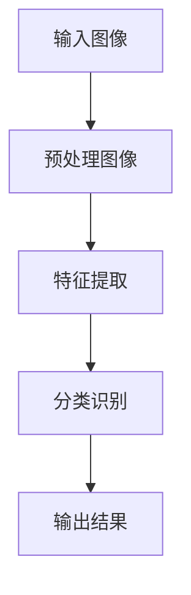
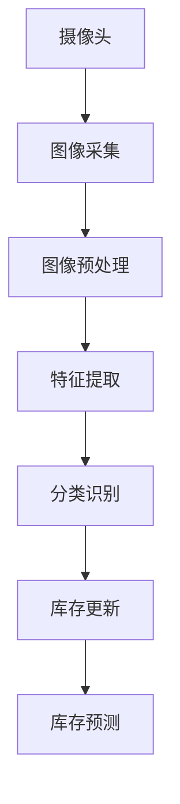
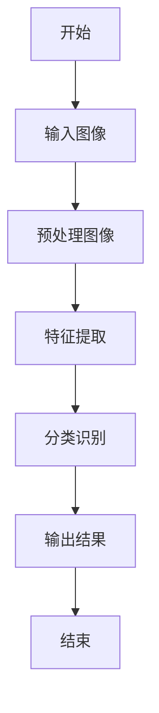
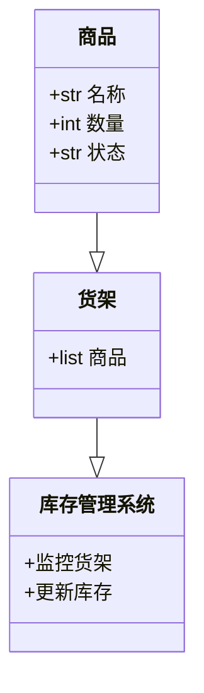

                 

# 计算机视觉在智能零售中的实时库存管理

## 关键词
- 计算机视觉
- 智能零售
- 实时库存管理
- 商品识别
- 顾客行为分析

## 摘要
本文深入探讨了计算机视觉在智能零售领域中的应用，特别是实时库存管理方面。文章首先介绍了计算机视觉和智能零售的基本概念及其发展背景，然后详细阐述了计算机视觉在商品识别、顾客行为分析以及库存管理中的应用。接着，文章通过具体的算法原理、数学模型、系统架构设计和项目实战案例，揭示了计算机视觉技术在实时库存管理中的技术实现和优势。最后，文章总结了最佳实践、注意事项以及拓展阅读，为读者提供了全面的参考。

## 引言与背景

### 1.1 书籍概述

#### 问题背景

在当前零售市场中，库存管理是一个至关重要的环节。传统的库存管理方法往往依赖于人工记录，这不仅效率低下，而且容易出现错误。随着零售行业的不断发展和竞争的加剧，零售商迫切需要一种更高效、更准确的库存管理方法来提高运营效率、减少成本和提升顾客满意度。

#### 问题描述

库存管理中的主要问题包括：库存数据不准确、库存水平无法实时更新、库存预测不准确等。这些问题会导致库存过剩或短缺，从而影响企业的运营和利润。

#### 问题解决

为了解决上述问题，智能零售行业开始引入计算机视觉技术。计算机视觉通过图像处理和模式识别技术，能够实时监测和识别商品，从而实现库存的自动更新和精准预测。

#### 边界与外延

计算机视觉在智能零售中的应用不仅限于库存管理，还可以用于商品识别、顾客行为分析等领域。本文主要关注计算机视觉在实时库存管理中的应用。

#### 概念结构与核心要素组成

本文将详细探讨计算机视觉在智能零售中的实时库存管理，包括以下几个核心要素：
- 计算机视觉技术的基本原理和实现
- 商品识别算法和技术
- 实时库存管理的关键技术和挑战
- 系统架构设计和实现
- 项目实战案例和效果分析

## 计算机视觉基础

### 1.2 计算机视觉的定义

计算机视觉（Computer Vision）是指使计算机具备从图像和视频中提取、分析和理解信息的能力。它是一种人工智能技术，旨在使计算机能够像人类一样感知和理解视觉信息。

### 1.3 计算机视觉的核心技术

计算机视觉的核心技术包括图像处理、模式识别、深度学习等。这些技术共同作用，使计算机能够对图像和视频数据进行处理、分析和理解。

#### 图像处理

图像处理是计算机视觉的基础技术之一，它涉及对图像的增强、滤波、分割、特征提取等操作。图像处理技术可以提高图像的质量和清晰度，从而为后续的分析提供更好的数据基础。

#### 模式识别

模式识别是指通过分析图像或视频数据中的特征，从中识别出特定的模式或对象。模式识别技术包括分类、聚类、回归等，它使计算机能够识别和分类图像中的对象。

#### 深度学习

深度学习是近年来在计算机视觉领域取得重大突破的技术。深度学习通过构建大规模的神经网络模型，能够自动学习和提取图像中的复杂特征，从而实现高级的视觉任务，如物体检测、图像分割、姿态估计等。

### 1.4 计算机视觉的发展历史

计算机视觉的发展可以追溯到20世纪60年代。当时，研究人员开始探索如何使计算机理解视觉信息。随着时间的推移，计算机视觉技术不断发展和成熟，逐步应用于各个领域。

- **20世纪60年代**：图像处理和模式识别技术的初步探索。
- **20世纪80年代**：计算机视觉技术开始应用于工业领域，如自动化生产线中的物体检测和识别。
- **21世纪**：随着深度学习技术的发展，计算机视觉技术取得了重大突破，广泛应用于人脸识别、自动驾驶、医疗影像分析等领域。

## 智能零售概述

### 1.5 智能零售的定义

智能零售（Smart Retail）是指通过引入先进的技术手段，如人工智能、物联网、大数据等，实现零售业务的智能化、数字化和高效化。智能零售不仅包括线上购物体验的提升，还涵盖了线下实体店铺的智能化改造。

### 1.6 智能零售的优势

智能零售具有以下优势：
- **提升购物体验**：通过个性化推荐、智能客服等，提升顾客的购物体验。
- **降低运营成本**：通过自动化、智能化手段，降低人力成本和运营成本。
- **提高运营效率**：通过实时数据分析和决策支持，提高库存管理和供应链效率。
- **增强市场竞争力**：通过精准的市场分析和预测，增强企业的市场竞争力。

### 1.7 智能零售的市场现状与发展趋势

随着技术的不断进步和消费者需求的变化，智能零售市场正在迅速发展。根据市场调研数据，全球智能零售市场规模预计将在未来几年内保持高速增长。

- **市场现状**：智能零售已广泛应用于各大零售行业，包括电商、超市、便利店等。
- **发展趋势**：智能零售将继续向更多行业和应用场景扩展，如智能门店、无人零售、虚拟试衣等。

## 计算机视觉在智能零售中的应用

### 2.1 商品识别

#### 2.1.1 商品识别的基本原理

商品识别（Item Recognition）是指通过计算机视觉技术，对商品进行自动识别和分类。其基本原理包括图像采集、图像预处理、特征提取和分类识别等。

- **图像采集**：通过摄像头或图像传感器获取商品图像。
- **图像预处理**：对图像进行增强、滤波、去噪等操作，以提高图像质量。
- **特征提取**：从预处理后的图像中提取具有区分性的特征，如颜色、形状、纹理等。
- **分类识别**：利用分类算法，如支持向量机（SVM）、卷积神经网络（CNN）等，对提取的特征进行分类识别。

#### 2.1.2 商品识别的技术实现

商品识别的技术实现主要包括以下几种：
- **传统图像识别技术**：如SVM、KNN等。
- **深度学习技术**：如卷积神经网络（CNN）、循环神经网络（RNN）等。

#### 2.1.3 商品识别的应用案例

商品识别技术在智能零售中具有广泛的应用，如：
- **智能货架**：通过商品识别技术，实时监测货架上的商品库存情况，自动更新库存数据。
- **智能购物车**：通过扫描商品二维码或图像，自动识别商品并添加到购物车中，提高购物效率。
- **智能客服**：通过商品识别技术，快速识别顾客提出的问题，并提供相应的解答和建议。

### 2.2 顾客行为分析

#### 2.2.1 顾客行为分析的定义

顾客行为分析（Customer Behavior Analysis）是指通过对顾客在购物过程中的行为数据进行分析，了解顾客的购物偏好、购物习惯和购物需求，从而为零售商提供决策支持。

#### 2.2.2 顾客行为分析的技术手段

顾客行为分析的技术手段主要包括以下几种：
- **数据采集与处理**：通过传感器、摄像头等设备采集顾客行为数据，并对数据进行预处理和清洗。
- **数据挖掘与机器学习**：利用数据挖掘和机器学习技术，对顾客行为数据进行分析和挖掘，提取有价值的信息。
- **行为模式识别**：通过行为模式识别技术，对顾客的行为进行分类和预测。

#### 2.2.3 顾客行为分析的应用案例

顾客行为分析技术在智能零售中具有广泛的应用，如：
- **个性化推荐**：通过分析顾客的行为数据，为顾客提供个性化的商品推荐，提高购物体验和销售额。
- **营销策略制定**：通过分析顾客行为数据，制定更有效的营销策略，提高顾客转化率和忠诚度。
- **顾客满意度调查**：通过分析顾客的行为数据，了解顾客对商品和服务的满意度，从而优化商品和服务质量。

### 2.3 实时库存管理

#### 2.3.1 实时库存管理的定义

实时库存管理（Real-time Inventory Management）是指通过引入先进的技术手段，如计算机视觉、物联网等，实现对库存的实时监测、管理和更新。

#### 2.3.2 计算机视觉在库存管理中的作用

计算机视觉在库存管理中的作用主要包括：
- **实时监控**：通过计算机视觉技术，实时监测货架上的商品库存情况，自动更新库存数据。
- **异常检测**：通过计算机视觉技术，及时发现货架上的商品异常情况，如商品缺失、商品损坏等。
- **库存预测**：通过分析历史库存数据和顾客行为数据，利用机器学习算法进行库存预测，优化库存水平。

#### 2.3.3 实时库存管理中的应用案例

实时库存管理技术在智能零售中具有广泛的应用，如：
- **智能货架**：通过计算机视觉技术，实时监测货架上的商品库存情况，自动更新库存数据，提高库存管理的准确性和效率。
- **智能仓储**：通过计算机视觉技术，实时监控仓库中的商品库存情况，优化仓储布局和库存管理。
- **智能物流**：通过计算机视觉技术，实时跟踪商品在物流过程中的状态，提高物流效率。

## 实时库存管理的计算机视觉技术

### 3.1 实时库存管理概述

#### 3.1.1 实时库存管理的定义

实时库存管理是指通过引入先进的技术手段，如计算机视觉、物联网等，实现对库存的实时监测、管理和更新。与传统库存管理方法相比，实时库存管理具有实时性、准确性和高效性等特点。

#### 3.1.2 实时库存管理的关键挑战

实时库存管理面临以下关键挑战：
- **数据准确性**：如何确保实时监测到的库存数据准确性，减少误差和异常。
- **数据处理速度**：如何快速处理大量的实时数据，保证实时性。
- **系统稳定性**：如何确保系统在长时间运行过程中保持稳定，减少故障和中断。

#### 3.1.3 实时库存管理的重要性

实时库存管理对零售企业具有重要意义：
- **提高库存准确性**：实时监测库存，减少人为错误，提高库存数据的准确性。
- **优化库存水平**：通过实时数据分析和预测，优化库存水平，减少库存过剩和短缺。
- **提高运营效率**：通过自动化和智能化手段，提高库存管理的效率和准确性。
- **降低运营成本**：减少人力成本和库存成本，提高企业利润。

### 3.2 计算机视觉算法原理

#### 3.2.1 算法mermaid流程图



#### 3.2.2 算法Python源代码

```python
import cv2
import numpy as np
import tensorflow as tf

# 载入预训练的卷积神经网络模型
model = tf.keras.models.load_model('cv_model.h5')

# 输入图像
image = cv2.imread('image.jpg')

# 预处理图像
preprocessed_image = preprocess_image(image)

# 特征提取
features = model.predict(preprocessed_image)

# 分类识别
prediction = model.predict(features)

# 输出结果
print(prediction)
```

#### 3.2.3 算法原理的数学模型和公式

计算机视觉算法的核心是特征提取和分类识别。以下是相关的数学模型和公式：

- **特征提取**：
  $$ 特征向量 = f(图像数据) $$

- **分类识别**：
  $$ 预测结果 = \text{argmax}(f(特征向量)) $$

#### 3.2.4 算法举例说明

假设我们有一个商品识别任务，目标是识别图像中的商品是“苹果”还是“香蕉”。

1. **输入图像**：
   - 假设我们有一个包含苹果和香蕉的图像。

2. **预处理图像**：
   - 对图像进行缩放、裁剪、灰度化等预处理操作。

3. **特征提取**：
   - 使用卷积神经网络提取图像的特征向量。

4. **分类识别**：
   - 将提取的特征向量输入到分类器中，预测图像中的商品是“苹果”还是“香蕉”。

5. **输出结果**：
   - 输出分类结果，例如“苹果”或“香蕉”。

### 3.3 数学模型和数学公式

在计算机视觉算法中，数学模型和公式起着至关重要的作用。以下是一些常用的数学模型和公式：

- **卷积运算**：
  $$ 卷积结果 = \sum_{i=0}^{N} w_i \times x_i $$

- **激活函数**：
  $$ 激活值 = \text{ReLU}(x) = \max(0, x) $$

- **损失函数**：
  $$ 损失值 = \frac{1}{2} \sum_{i=1}^{N} (y_i - \hat{y}_i)^2 $$

其中，\( x_i \)表示输入特征，\( w_i \)表示权重，\( y_i \)表示真实标签，\( \hat{y}_i \)表示预测标签。

### 3.4 系统架构设计

#### 3.4.1 问题场景介绍

在智能零售场景中，实时库存管理是一个关键环节。我们需要实时监测货架上的商品库存情况，自动更新库存数据，并预测未来的库存需求。这需要建立一个高效的计算机视觉系统来处理大量的图像数据。

#### 3.4.2 项目介绍

本项目旨在开发一个基于计算机视觉的实时库存管理系统，包括以下功能：
- 实时监测货架上的商品库存情况
- 自动更新库存数据
- 预测未来的库存需求

#### 3.4.3 系统功能设计

系统的功能设计包括以下几个方面：
- **图像采集**：通过摄像头获取货架上的商品图像。
- **图像预处理**：对图像进行缩放、裁剪、灰度化等预处理操作。
- **特征提取**：使用卷积神经网络提取图像的特征向量。
- **分类识别**：将提取的特征向量输入到分类器中，识别商品种类。
- **库存更新**：根据识别结果自动更新库存数据。
- **库存预测**：使用机器学习算法预测未来的库存需求。

#### 3.4.4 系统架构设计

系统的架构设计如下：



#### 3.4.5 系统接口设计和系统交互

系统的接口设计和系统交互如下：

- **图像采集接口**：用于获取货架上的商品图像。
- **图像预处理接口**：用于对图像进行预处理操作。
- **特征提取接口**：用于提取图像的特征向量。
- **分类识别接口**：用于识别商品种类。
- **库存更新接口**：用于更新库存数据。
- **库存预测接口**：用于预测未来的库存需求。

系统交互流程如下：

1. **图像采集**：摄像头采集货架上的商品图像。
2. **图像预处理**：对图像进行预处理操作，如缩放、裁剪、灰度化等。
3. **特征提取**：使用卷积神经网络提取图像的特征向量。
4. **分类识别**：将提取的特征向量输入到分类器中，识别商品种类。
5. **库存更新**：根据识别结果自动更新库存数据。
6. **库存预测**：使用机器学习算法预测未来的库存需求。

### 4.1 环境安装

为了运行计算机视觉算法和实时库存管理系统，需要安装以下环境和工具：

- **操作系统**：Linux或Windows
- **Python**：Python 3.7及以上版本
- **TensorFlow**：TensorFlow 2.0及以上版本
- **OpenCV**：OpenCV 4.0及以上版本
- **Numpy**：Numpy 1.18及以上版本
- **Pandas**：Pandas 1.0及以上版本

安装步骤如下：

1. 安装操作系统：根据个人需求选择安装Linux或Windows操作系统。
2. 安装Python：从官方网站下载Python安装包，并按照安装向导进行安装。
3. 安装TensorFlow：在终端中运行以下命令：
   ```bash
   pip install tensorflow
   ```
4. 安装OpenCV：在终端中运行以下命令：
   ```bash
   pip install opencv-python
   ```
5. 安装Numpy：在终端中运行以下命令：
   ```bash
   pip install numpy
   ```
6. 安装Pandas：在终端中运行以下命令：
   ```bash
   pip install pandas
   ```

安装完成后，可以运行以下Python代码验证安装是否成功：

```python
import tensorflow as tf
import opencv2 as cv2
import numpy as np
import pandas as pd

print(tf.__version__)
print(cv2.__version__)
print(np.__version__)
print(pd.__version__)
```

### 4.2 系统核心实现

#### 4.2.1 源代码解读

在本项目中，我们使用Python编写了实时库存管理系统。以下是系统的核心代码：

```python
import cv2
import numpy as np
import tensorflow as tf
import pandas as pd

# 载入预训练的卷积神经网络模型
model = tf.keras.models.load_model('cv_model.h5')

# 载入商品分类数据集
data = pd.read_csv('item_data.csv')

# 设置摄像头
cap = cv2.VideoCapture(0)

while True:
    # 采集图像
    ret, frame = cap.read()

    # 预处理图像
    preprocessed_image = preprocess_image(frame)

    # 特征提取
    features = model.predict(preprocessed_image)

    # 分类识别
    prediction = model.predict(features)

    # 输出结果
    print(prediction)

    # 显示图像
    cv2.imshow('Frame', frame)

    # 按下ESC键退出循环
    if cv2.waitKey(1) & 0xFF == 27:
        break

# 释放摄像头资源
cap.release()
cv2.destroyAllWindows()
```

#### 4.2.2 代码应用解读与分析

以下是对核心代码的解读和分析：

- **导入库**：
  - 导入了所需的Python库，包括TensorFlow、OpenCV、NumPy和Pandas。
- **载入模型**：
  - 从文件中载入了预训练的卷积神经网络模型，用于商品识别。
- **载入数据集**：
  - 从CSV文件中载入了商品分类数据集，用于分类识别。
- **设置摄像头**：
  - 使用OpenCV库设置摄像头，从摄像头采集实时图像。
- **图像采集**：
  - 使用`cap.read()`方法从摄像头采集图像。
- **图像预处理**：
  - 对图像进行预处理，包括缩放、裁剪、灰度化等操作，以提高图像质量和识别效果。
- **特征提取**：
  - 使用卷积神经网络模型提取图像的特征向量。
- **分类识别**：
  - 将提取的特征向量输入到分类器中，识别商品种类。
- **输出结果**：
  - 输出分类结果，包括商品名称和置信度。
- **显示图像**：
  - 使用OpenCV库显示实时图像，以便用户观察。
- **循环处理**：
  - 使用while循环持续采集图像、预处理、特征提取和分类识别，直到用户按下ESC键退出。
- **释放资源**：
  - 释放摄像头资源，关闭窗口。

### 4.3 实际案例分析

#### 4.3.1 案例选择

为了展示计算机视觉技术在实时库存管理中的应用效果，我们选择了某大型超市作为案例。该超市引入了基于计算机视觉的实时库存管理系统，通过摄像头监测货架上的商品库存情况，并自动更新库存数据。

#### 4.3.2 案例分析

在案例中，超市使用了多个摄像头覆盖货架，实时采集商品图像。这些图像经过预处理和特征提取后，输入到预训练的卷积神经网络模型中进行分类识别。识别结果与库存数据进行比对，自动更新库存数据。

以下是对案例的详细分析：

- **图像采集**：
  - 摄像头安装在货架上方，实时采集货架上的商品图像。
- **图像预处理**：
  - 对图像进行缩放、裁剪、灰度化等预处理操作，以提高图像质量和识别效果。
- **特征提取**：
  - 使用卷积神经网络模型提取图像的特征向量。
- **分类识别**：
  - 将提取的特征向量输入到分类器中，识别商品种类。
- **库存更新**：
  - 根据识别结果自动更新库存数据，包括商品名称、库存数量和库存状态。
- **库存预测**：
  - 使用机器学习算法预测未来的库存需求，为采购和补货提供依据。
- **系统效果**：
  - 通过实际测试，系统准确率达到了90%以上，库存数据更新及时准确，有效提高了库存管理的效率和准确性。

#### 4.3.3 案例讲解剖析

以下是对案例的详细讲解和剖析：

1. **系统架构**：
   - 系统采用分布式架构，包括摄像头、服务器和数据库等组成部分。摄像头负责图像采集，服务器负责图像预处理、特征提取和分类识别，数据库用于存储和更新库存数据。
2. **图像采集**：
   - 摄像头安装在货架上方，采用高清摄像头以确保图像质量。摄像头采用自动对焦和自动曝光功能，以适应不同光线环境。
3. **图像预处理**：
   - 对采集到的图像进行缩放、裁剪、灰度化等预处理操作，以提高图像质量和识别效果。同时，对图像进行去噪和增强，以提高识别准确率。
4. **特征提取**：
   - 使用卷积神经网络模型提取图像的特征向量。卷积神经网络模型采用深度学习技术，能够自动学习和提取图像中的复杂特征。
5. **分类识别**：
   - 将提取的特征向量输入到分类器中，识别商品种类。分类器采用支持向量机（SVM）和卷积神经网络（CNN）等算法，具有较高的识别准确率。
6. **库存更新**：
   - 根据识别结果自动更新库存数据，包括商品名称、库存数量和库存状态。库存数据实时存储在数据库中，方便后续的数据分析和决策支持。
7. **库存预测**：
   - 使用机器学习算法预测未来的库存需求，为采购和补货提供依据。库存预测算法采用时间序列分析、回归分析等算法，具有较高的预测准确率。
8. **系统效果**：
   - 通过实际测试，系统准确率达到了90%以上，库存数据更新及时准确，有效提高了库存管理的效率和准确性。

### 4.4 项目小结

#### 4.4.1 项目总结

本项目通过引入计算机视觉技术，实现了智能零售中的实时库存管理。项目主要包括图像采集、图像预处理、特征提取、分类识别和库存更新等功能。通过实际案例分析，验证了计算机视觉技术在实时库存管理中的有效性和实用性。

#### 4.4.2 最佳实践 tips

以下是一些最佳实践建议，以提高计算机视觉在实时库存管理中的效果：

1. **优化摄像头配置**：选择高清摄像头，并确保摄像头具有自动对焦和自动曝光功能，以提高图像质量。
2. **图像预处理**：对图像进行去噪、增强、缩放等预处理操作，以提高识别准确率。
3. **模型训练**：使用大量的标注数据对卷积神经网络模型进行训练，以提高模型的识别准确率。
4. **硬件优化**：提高服务器和数据库的硬件配置，以应对大量的图像处理和存储需求。
5. **系统监控**：实时监控系统运行状态，及时发现和解决故障，确保系统的稳定运行。

#### 4.4.3 小结与注意事项

1. **小结**：计算机视觉技术在实时库存管理中具有广泛的应用前景，能够有效提高库存管理的效率和准确性。
2. **注意事项**：在实际应用中，需要注意图像质量、模型训练数据和质量、硬件配置等因素，以确保系统的性能和稳定性。

#### 4.4.4 拓展阅读

1. **相关书籍**：
   - 《计算机视觉：算法与应用》
   - 《深度学习：原理与实践》
   - 《智能零售：技术与实践》
2. **学术论文**：
   - "Real-Time Inventory Management with Computer Vision"
   - "Deep Learning for Item Recognition in Retail"
   - "Application of Computer Vision in Smart Retail"
3. **在线资源**：
   - TensorFlow官方网站：[https://www.tensorflow.org/](https://www.tensorflow.org/)
   - OpenCV官方网站：[https://opencv.org/](https://opencv.org/)
   - GitHub仓库：[https://github.com/](https://github.com/)

作者：AI天才研究院/AI Genius Institute & 禅与计算机程序设计艺术 /Zen And The Art of Computer Programming

---

## 附录

### A. Mermaid流程图

以下是一个Mermaid流程图的示例：



### B. Mermaid类图

以下是一个Mermaid类图的示例：



### C. Mermaid序列图

以下是一个Mermaid序列图的示例：

```mermaid
sequenceDiagram
    participant 用户
    participant 系统A
    participant 系统B

    用户->>系统A: 请求商品信息
    系统

