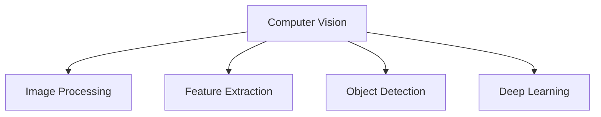

                 

### Step 1: Introducing the Main Topic

**Title**: Computer Vision in Industrial Quality Inspection Applications

**Keywords**: Computer Vision, Industrial Automation, Quality Inspection, AI Technologies, Machine Learning

**Abstract**: 
This article delves into the application of computer vision in industrial quality inspection. It explores the evolution of computer vision, its foundational theories, and advanced algorithms used in the field. The article highlights practical case studies and discusses future trends and challenges in integrating computer vision into industrial processes to enhance quality control.

### Step 2: Establishing Background

**Introduction to Computer Vision**

**Background Information:**
Computer vision is a subfield of artificial intelligence that enables computers to interpret and understand visual data from various sources, such as images and videos. It has seen rapid advancements over the past few decades, driven by improvements in hardware, algorithms, and machine learning techniques.

**Core Concepts and Relationships:**

- **Core Concepts:**
  - Image processing
  - Feature extraction
  - Object detection and recognition
  - Deep learning

- **ER Entity Relationship Diagram (in Markdown format with Mermaid):**

**Comparative Table of Core Concepts and Properties:**

| Concept | Definition | Properties |
| --- | --- | --- |
| Image Processing | Manipulating digital images | Filters, Enhancements, Compression |
| Feature Extraction | Extracting key features from data | Edge detection, Texture analysis |
| Object Detection | Identifying and classifying objects | Real-time applications, High accuracy |
| Deep Learning | Neural networks with many layers | Complex pattern recognition, Adaptability |

### Step 3: Exploring the Role and Implementation of Computer Vision in Quality Inspection

**Challenges in Industrial Quality Inspection**

**Background:**
Traditional methods of quality inspection in industrial environments have been limited by their speed, accuracy, and scalability. These methods often require manual inspection, which is time-consuming and prone to human error.

**Advantages of Computer Vision:**
Computer vision offers several advantages over traditional methods:
- **Speed:** Automated inspection processes can operate at high speeds, significantly reducing inspection time.
- **Accuracy:** Computer vision systems can detect defects with a higher level of precision than human inspectors.
- **Scalability:** These systems can easily be scaled to handle large volumes of products.

**Implementation Steps:**

1. **Data Collection and Preprocessing:**
   - Collect images or videos of the products.
   - Preprocess the data to enhance the quality and remove noise.

2. **Feature Extraction:**
   - Extract relevant features from the images that are critical for identifying defects.

3. **Object Detection and Recognition:**
   - Use algorithms to detect and classify objects in the images.

4. **Decision-Making:**
   - Analyze the results to make decisions about whether a product meets the required quality standards.

5. **Feedback Loop:**
   - Incorporate feedback to improve the accuracy of the system over time.

### Step 4: Detailed Discussion of Core Computer Vision Technologies

**Basic Theories and Algorithms**

**Basic Theories:**
- **Image Processing:** Techniques to improve image quality, such as filtering, enhancement, and compression.
- **Feature Extraction:** Methods to identify and isolate key characteristics of an image, such as edges, textures, and shapes.

**Algorithms:**
- **Convolutional Neural Networks (CNNs):** Deep learning models specifically designed for processing visual data.
- **Generative Adversarial Networks (GANs):** Advanced algorithms that can generate new images based on existing data.

**Frameworks and Tools:**
- **OpenCV:** A powerful open-source computer vision library.
- **TensorFlow:** An open-source machine learning library.
- **PyTorch:** Another open-source machine learning library known for its flexibility and ease of use.

### Step 5: Applications of Computer Vision in Industrial Quality Inspection

**Application Scenarios:**
- **Defect Detection in Mechanical Components:**
  - Inspecting for cracks, dents, or misalignments.
- **Quality Control in Electronics Manufacturing:**
  - Identifying defects on circuit boards or components.
- **Quality Monitoring in Food Processing:**
  - Detecting foreign objects or contaminants in food products.

**Case Studies:**
- **Case 1: Quality Inspection System in an Automotive Factory:**
  - How computer vision is used to inspect vehicle parts for defects.
- **Case 2: Flaw Detection System in an Electronics Factory:**
  - The implementation of computer vision for real-time defect detection on circuit boards.
- **Case 3: Quality Control in a Food Processing Plant:**
  - Using computer vision to monitor the quality of food products during processing.

### Step 6: Challenges and Solutions

**Data Collection and Annotation:**
- **Challenge:** Collecting and annotating large datasets for training models.
- **Solution:** Utilizing semi-supervised learning and transfer learning techniques to reduce the dependency on large labeled datasets.

**Algorithm Optimization and Performance Improvement:**
- **Challenge:** Ensuring high accuracy and speed in real-time applications.
- **Solution:** Continuous model training and optimization using techniques like model ensembling and hyperparameter tuning.

**Balancing Real-time Performance and Robustness:**
- **Challenge:** Achieving a balance between speed and accuracy.
- **Solution:** Implementing real-time processing algorithms and robust error handling mechanisms.

### Step 7: Future Trends and Recommendations

**Future Trends:**
- **Influence of New Technologies:** The impact of emerging technologies like augmented reality (AR) and edge computing on industrial quality inspection.
- **Standardization:** The importance of developing industry-wide standards for computer vision applications.
- **Industry Ecosystem:** Building a supportive ecosystem for the adoption and development of computer vision in industry.

**Potential Research Directions:**
- **Multi-modal Data Fusion:** Integrating data from different modalities (e.g., images, audio, and sensors) to enhance detection capabilities.
- **Intelligent Interaction and Automation:** Developing systems that can interact with human inspectors and automate decision-making processes.
- **Applications in Emerging Industries:** Expanding the use of computer vision in industries beyond traditional manufacturing, such as healthcare and logistics.

### Step 8: Conclusion and Recommendations

**Summary of Key Findings:**
- The integration of computer vision in industrial quality inspection offers significant advantages over traditional methods.
- Challenges such as data annotation and algorithm optimization need to be addressed for broader adoption.

**Future Outlook:**
- Continued advancements in AI and machine learning will drive further improvements in computer vision technology.
- Collaboration between industry and academia will be key to overcoming current limitations.

**Recommendations:**
- Invest in research and development to enhance the performance and reliability of computer vision systems.
- Foster partnerships to develop standardized protocols and tools for industrial applications.

### Final Thoughts

Computer vision is revolutionizing industrial quality inspection by providing faster, more accurate, and scalable solutions. As technology continues to evolve, the potential for computer vision in industry is vast, with numerous opportunities for innovation and growth. By addressing the current challenges and leveraging emerging technologies, we can look forward to a future where computer vision plays a central role in ensuring the quality of products across all industries.

