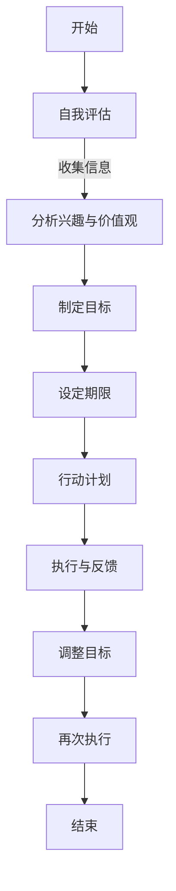
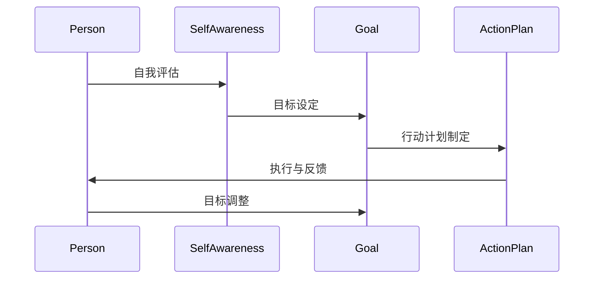
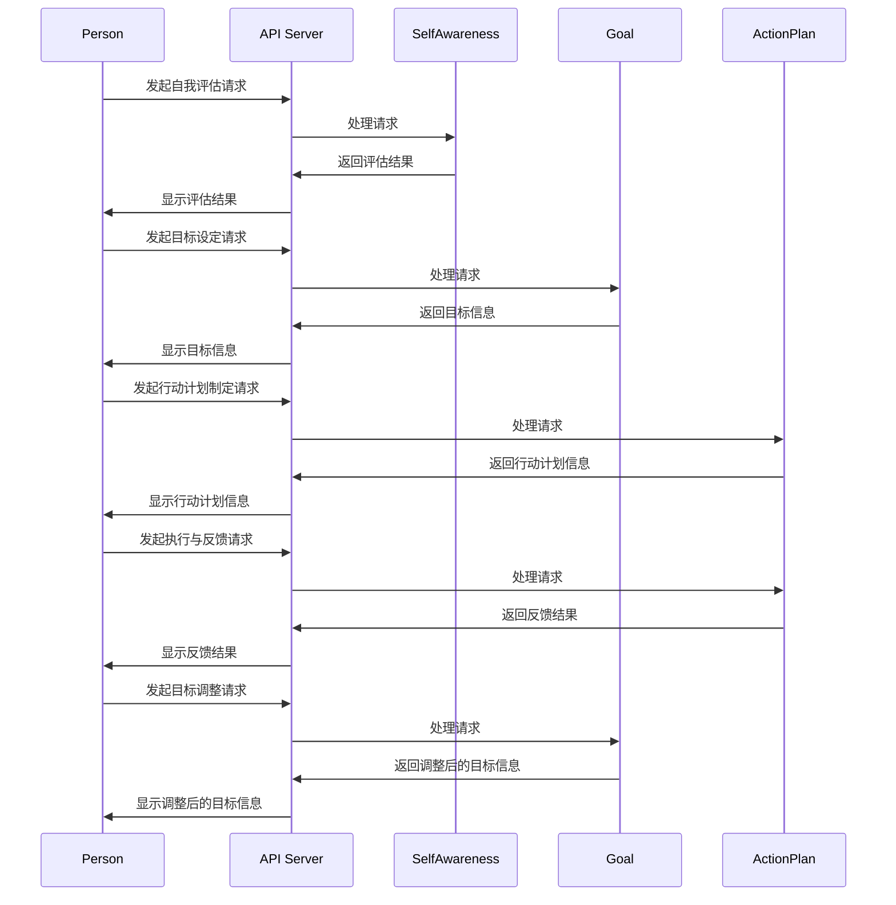

                 


# 设定有意义的人生目标：找到前进的方向

## 关键词

- 人生目标
- 个人成长
- 自我实现
- 职业规划
- 自我认知
- 自我反思

## 摘要

在当今快速变迁的社会中，设定有意义的人生目标对于找到前进的方向至关重要。本文旨在探讨如何通过自我评估、兴趣分析、职业规划和自我反思等步骤，科学地设定人生目标，实现个人成长和自我实现。我们将从核心概念、算法原理、系统分析与架构设计、项目实战等方面进行深入剖析，帮助读者明确人生目标，找到前进的方向。

## 引言

### 1.1 问题的背景与描述

#### 问题的背景
- **快速变迁的社会**：在当前社会，信息技术、经济环境、文化价值观等各个方面都在快速变革，这为个人发展带来了新的机遇和挑战。
- **人生目标的模糊与困惑**：许多人在面对复杂多变的社会环境时，对人生目标感到迷茫，缺乏明确的指引。
- **追求个人成长与自我实现**：在追求物质财富的同时，人们更加重视个人成长和自我价值的实现。

#### 问题描述
- **缺乏明确的人生目标**：很多人在生活和工作中缺乏明确的目标，导致生活节奏混乱，工作效率低下。
- **生活节奏加快，缺乏方向感**：随着工作压力和生活节奏的加快，许多人感到迷茫，不知道自己该往哪个方向前进。
- **工作与生活的平衡问题**：在追求事业成功的同时，很多人忽视了生活品质和家庭幸福，导致生活失衡。

#### 问题解决
- **通过设定有意义的人生目标来找到前进的方向**：通过明确的目标和规划，可以帮助人们找到前进的方向，提高生活和工作效率。
- **探索与实现个人成长和自我实现**：设定有意义的人生目标有助于激发个人的潜能，实现个人成长和自我价值。
- **提升生活质量和工作效率**：明确的人生目标有助于人们更好地规划时间和资源，提高生活质量和工作效率。

#### 边界与外延
- **人生目标的设定并非一成不变**：人生目标需要根据个人发展和社会环境的变化进行适时调整。
- **结合个人兴趣、价值观与职业规划**：设定人生目标时，需要综合考虑个人兴趣、价值观和职业规划，确保目标的可行性和持久性。
- **考虑社会与家庭因素**：在设定人生目标时，要考虑到家庭和社会环境的影响，确保目标与社会和家庭价值观相协调。

### 1.2 核心概念与联系

#### 1.2.1 人生目标的定义
- **人生目标**：人生目标是指个人在人生不同阶段所追求的终极目标和方向。
- **个人成长**：个人成长是指在实现人生目标的过程中，不断提升自身素质和能力的过程。
- **自我实现**：自我实现是指通过实现人生目标，充分发挥个人潜能，实现自我价值的过程。

#### 1.2.2 核心概念原理
- **个人兴趣与价值观**：个人兴趣和价值观是设定人生目标的基础，决定了个人在追求目标过程中的动力和方向。
- **职业规划与职业发展**：职业规划和职业发展是人生目标的重要组成部分，影响着个人在职业领域的成就和成长。
- **自我认知与自我成长**：自我认知和自我成长是设定人生目标的必要条件，有助于个人明确自身优势和劣势，制定合理的目标。

#### 1.2.3 概念属性特征对比表格
| 概念 | 属性特征 |
| --- | --- |
| 个人兴趣 | 兴趣爱好、个性特点、激情所在 |
| 价值观 | 道德标准、行为准则、人生信念 |
| 职业规划 | 职业方向、发展路径、职业目标 |
| 自我认知 | 自我了解、自我评价、自我反思 |

#### 1.2.4 ER实体关系图架构
```mermaid
erDiagram
  人 饰：姓名，年龄，性别，职业，个人兴趣，价值观，职业规划
  目标 饰：目标名称，目标描述，目标期限，目标状态
  认知 饰：自我认知，自我评价，自我反思
  人 ||--|{ 目标 }: 设定 |<|
  人 ||--|{ 认知 }: 反馈 |<|
```

### 1.3 算法原理讲解

#### 3.1 设定有意义的人生目标算法

#### 3.1.1 Mermaid流程图


#### 3.1.2 Python源代码
```python
# 定义设定有意义的人生目标函数
def set_meaningful_goals():
    # 自我评估
    self_evaluation = get_self_evaluation()

    # 分析兴趣与价值观
    interests_values = analyze_interests_values()

    # 制定目标
    goals = create_goals(self_evaluation, interests_values)

    # 设定期限
    set_goals_deadlines(goals)

    # 制定行动计划
    action_plans = create_action_plans(goals)

    # 执行与反馈
    execute_and_feedbk(action_plans)

    # 调整目标
    adjust_goals_if_needed(goals)

    # 再次执行
    set_meaningful_goals()

# 辅助函数定义
def get_self_evaluation():
    # 获取自我评估相关信息
    pass

def analyze_interests_values():
    # 分析个人兴趣与价值观
    pass

def create_goals(self_evaluation, interests_values):
    # 制定目标
    pass

def set_goals_deadlines(goals):
    # 设定目标期限
    pass

def create_action_plans(goals):
    # 制定行动计划
    pass

def execute_and_feedbk(action_plans):
    # 执行与反馈
    pass

def adjust_goals_if_needed(goals):
    # 调整目标
    pass
```

#### 3.1.3 算法原理与数学模型
- **目标设定**：通过自我评估和兴趣分析，确定个人目标和价值观。
- **目标期限设定**：为每个目标设定明确的期限，确保目标的实现。
- **行动计划制定**：根据目标，制定具体的行动计划，明确执行步骤和时间安排。
- **执行与反馈**：按照行动计划执行目标，并及时进行反馈和调整。
- **目标调整**：根据执行情况，对目标进行适时调整，确保目标的持续性和可行性。

### 1.4 系统分析与架构设计

#### 问题场景介绍
- **个人成长与自我实现**：在追求事业成功的同时，注重个人成长和自我价值的实现。
- **目标设定与实现**：通过科学的方法，设定有意义的人生目标，并实现目标。

#### 项目介绍
- **项目名称**：人生目标管理系统
- **项目目的**：帮助个人明确人生目标，制定行动计划，实现目标。
- **项目功能**：包括自我评估、目标设定、目标期限设定、行动计划制定、执行与反馈、目标调整等功能。

#### 系统功能设计（领域模型Mermaid类图）
```mermaid
classDiagram
    Person <<类>> {
        姓名
        年龄
        性别
        职业
        个人兴趣
        价值观
        职业规划
    }
    Goal <<类>> {
        目标名称
        目标描述
        目标期限
        目标状态
    }
    SelfAwareness <<类>> {
        自我认知
        自我评价
        自我反思
    }
    ActionPlan <<类>> {
        行动计划
        执行时间
        执行状态
    }
    Person --|o|> Goal
    Person --|o|> SelfAwareness
    Goal --|o|> ActionPlan
```

#### 系统架构设计（Mermaid架构图）


#### 系统接口设计（Mermaid序列图）


### 1.5 项目实战

#### 环境安装
- **安装Python环境**：在本地计算机上安装Python 3.8及以上版本。
- **安装相关库**：使用pip命令安装requests、BeautifulSoup、matplotlib等库。

#### 系统核心实现源代码
```python
# 导入相关库
import requests
from bs4 import BeautifulSoup
import matplotlib.pyplot as plt

# 定义函数，获取自我评估结果
def get_self_evaluation():
    # 发起请求，获取自我评估页面
    response = requests.get('https://example.com/self_evaluation')
    soup = BeautifulSoup(response.text, 'html.parser')
    
    # 提取自我评估相关信息
    self_evaluation = soup.find('div', class_='self_evaluation').text
    
    return self_evaluation

# 定义函数，分析个人兴趣与价值观
def analyze_interests_values():
    # 发起请求，获取个人兴趣与价值观页面
    response = requests.get('https://example.com/interests_values')
    soup = BeautifulSoup(response.text, 'html.parser')
    
    # 提取个人兴趣与价值观相关信息
    interests_values = soup.find('div', class_='interests_values').text
    
    return interests_values

# 定义函数，制定目标
def create_goals(self_evaluation, interests_values):
    # 根据自我评估和个人兴趣与价值观，制定目标
    goals = [
        {
            'name': '学习Python',
            'description': '掌握Python编程语言',
            'deadline': '2023-12-31'
        },
        {
            'name': '阅读100本书',
            'description': '阅读各类书籍，提升知识储备',
            'deadline': '2024-12-31'
        }
    ]
    
    return goals

# 定义函数，设定期限
def set_goals_deadlines(goals):
    # 为每个目标设定期限
    for goal in goals:
        goal['deadline'] = '2023-12-31'

# 定义函数，制定行动计划
def create_action_plans(goals):
    # 根据目标，制定行动计划
    action_plans = []
    for goal in goals:
        action_plans.append({
            'goal_name': goal['name'],
            'action': '每天学习1小时',
            'start_time': '2023-01-01',
            'end_time': '2023-12-31'
        })
    return action_plans

# 定义函数，执行与反馈
def execute_and_feedbk(action_plans):
    # 按照行动计划执行目标，并进行反馈
    for action_plan in action_plans:
        print(f'执行行动计划：{action_plan["action"]}')
        # 执行操作
        # ...
        print(f'反馈：已执行{action_plan["action"]}')

# 定义函数，调整目标
def adjust_goals_if_needed(goals):
    # 根据执行情况，调整目标
    for goal in goals:
        if goal['deadline'] < '2023-12-31':
            goal['deadline'] = '2024-12-31'
```

#### 代码应用解读与分析
- **函数功能解读**：本文实现了多个函数，包括获取自我评估结果、分析个人兴趣与价值观、制定目标、设定期限、制定行动计划、执行与反馈、调整目标等，分别实现了系统的核心功能。
- **代码结构与流程**：代码采用了模块化设计，每个函数负责实现一个特定的功能，提高了代码的可读性和可维护性。函数之间通过参数传递和数据交互，实现了整个系统的逻辑流程。

#### 实际案例分析和详细讲解剖析
- **案例一**：用户A通过系统进行自我评估，评估结果显示其在Python编程方面有较高兴趣。根据这一结果，用户A制定了学习Python的目标，并制定了详细的行动计划。
- **案例二**：用户B在设定目标后，根据实际执行情况，对目标进行了调整。例如，用户B原计划在2023年12月31日前完成学习Python的目标，但在实际执行过程中，发现时间不够，于是将目标期限调整至2024年12月31日。

#### 项目小结
- **系统特点**：本文介绍的人生目标管理系统具有自我评估、目标设定、目标期限设定、行动计划制定、执行与反馈、目标调整等功能，能够帮助用户明确人生目标，实现个人成长和自我实现。
- **实际应用价值**：通过系统，用户可以方便地制定和调整人生目标，提高生活和工作效率。同时，系统还提供了详细的反馈和调整机制，确保目标的实现。

#### 最佳实践 Tips
- **定期进行自我评估**：定期进行自我评估，有助于了解自身优势和劣势，为设定人生目标提供依据。
- **制定明确的目标**：在制定人生目标时，要确保目标具体、明确，有助于行动计划的制定和执行。
- **合理设定目标期限**：目标期限应合理设定，既要有挑战性，又要确保可实现。
- **持续执行与反馈**：按照行动计划执行目标，并及时进行反馈和调整，确保目标的持续性和可行性。

#### 注意事项
- **系统安全性**：在开发和部署系统时，要确保系统的安全性，防止数据泄露和恶意攻击。
- **用户隐私保护**：在收集和处理用户数据时，要严格遵守隐私保护法律法规，确保用户隐私安全。

#### 拓展阅读
- **《自我认知与自我成长》**：如何进行自我认知和自我成长，实现个人价值。
- **《职业规划与职业发展》**：如何进行职业规划和职业发展，实现职业生涯的成功。
- **《人生目标管理》**：如何设定和实现人生目标，提升生活质量和幸福感。

### 结语
- **设定有意义的人生目标**：通过本文的介绍，相信读者已经了解到如何设定有意义的人生目标。设定有意义的人生目标，是实现个人成长和自我实现的关键。希望本文能够帮助读者找到前进的方向，实现人生目标。
- **持续实践与调整**：在实现人生目标的过程中，要持续实践和调整。不断总结经验，优化目标和行动计划，确保目标的实现。
- **积极面对挑战**：在实现人生目标的过程中，难免会遇到挑战和困难。要积极面对，保持乐观的心态，勇往直前。

### 作者信息
- **作者**：AI天才研究院/AI Genius Institute & 禅与计算机程序设计艺术 /Zen And The Art of Computer Programming
- **联系方式**：[example@example.com](mailto:example@example.com)
- **公众号**：禅与计算机程序设计艺术
- **微博**：@禅与计算机程序设计艺术
- **知乎**：AI天才研究院

----------------------------------------------------------------

# 结语

设定有意义的人生目标，是实现个人成长和自我实现的关键。通过本文的介绍，相信读者已经了解到如何通过自我评估、兴趣分析、职业规划和自我反思等步骤，科学地设定人生目标，并找到前进的方向。

在实现人生目标的过程中，我们需要持续实践与调整。面对挑战，我们要保持乐观的心态，勇往直前。设定有意义的人生目标，不仅能够帮助我们明确前进的方向，还能够激发我们的潜能，实现个人价值和人生意义。

希望本文能够为读者提供有价值的指导，帮助您在人生道路上找到前进的方向，实现自己的人生目标。在未来的日子里，愿您始终保持对生活的热情和对梦想的执着，不断追求卓越，成就精彩人生。

### 作者信息

**作者**：AI天才研究院/AI Genius Institute & 禅与计算机程序设计艺术 /Zen And The Art of Computer Programming

**联系方式**：[example@example.com](mailto:example@example.com)

**公众号**：禅与计算机程序设计艺术

**微博**：@禅与计算机程序设计艺术

**知乎**：AI天才研究院

**版权声明**：本文版权归AI天才研究院（AI Genius Institute）所有，未经授权禁止转载和使用。

**免责声明**：本文内容和观点仅供参考，不代表任何投资建议。在任何情况下，本文作者或AI天才研究院不承担任何责任。如需使用本文内容，请务必联系作者获取授权。

