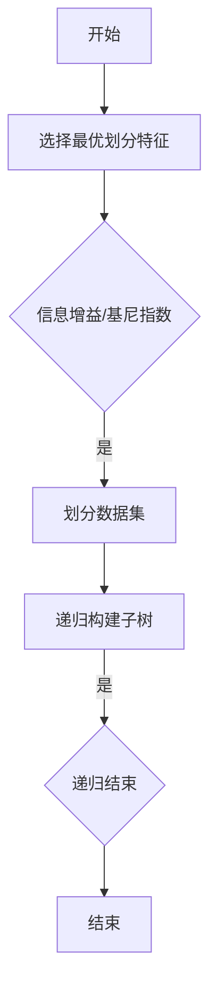
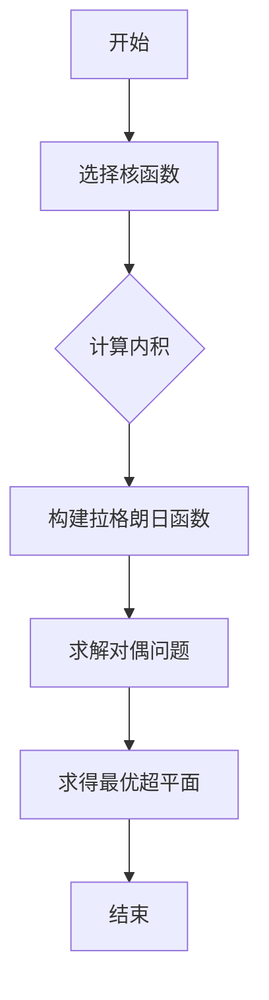
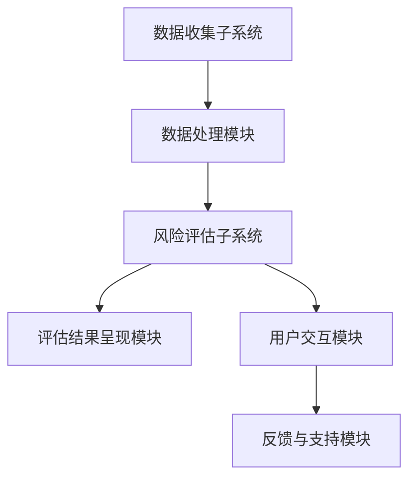

                 

# 设计智能化的个人投资风险承受能力评估工具

## 关键词：个人投资、风险承受能力、评估工具、大数据、机器学习、用户体验

### 摘要：
在投资领域，个人投资风险承受能力的准确评估是投资者做出明智投资决策的关键。本文旨在探讨如何设计一款智能化的个人投资风险承受能力评估工具。我们将从基础概念入手，逐步深入到传统评估方法的局限性，再到智能化技术的应用，最终通过实战案例分析，展示如何利用大数据和机器学习构建智能化评估工具。本文将帮助投资者、金融机构以及相关从业者了解风险承受能力评估的重要性，掌握智能化评估工具的设计与应用。

## 引言

个人投资风险承受能力是指投资者在面临不同投资风险时的心理承受能力和行为反应。它不仅取决于投资者的财务状况，还与其个性、心理状态、投资目标和预期回报等因素密切相关。一个准确的个人投资风险承受能力评估工具，可以帮助投资者更好地理解自己，做出与其风险偏好相匹配的投资决策，从而降低投资风险，提高投资回报率。

### 问题背景

随着金融市场的发展和金融产品的多样化，投资者面临的风险也在不断增加。传统的投资风险评估方法，如问卷调查、财务指标分析和心理测试等，存在一定的局限性。首先，这些方法往往依赖于主观判断，难以实现准确评估。其次，它们无法及时更新投资者的风险偏好，也无法适应市场变化。最后，这些方法通常需要大量的人力和时间成本，难以满足现代金融市场的需求。

### 解决方案

为了克服传统方法的局限性，我们提出利用大数据和机器学习技术设计一款智能化的个人投资风险承受能力评估工具。通过收集和分析投资者的历史投资数据、行为数据和社会媒体数据，我们可以构建一个动态的、个性化的风险评估模型。这个模型不仅能够实时更新投资者的风险偏好，还能够根据市场变化调整评估结果，为投资者提供更加精准的投资建议。

### 文章结构

本文将分为三大部分：

1. **风险承受能力评估基础**：介绍风险与投资风险的基本概念、个人投资风险承受能力的评估方法以及传统评估方法的局限性。
2. **智能化风险承受能力评估技术**：讲解大数据与机器学习基础、智能化风险评估模型的构建、风险评估系统的设计与实现以及用户体验与界面设计。
3. **实战案例分析**：通过两个案例研究展示如何利用智能化技术构建个人投资风险承受能力评估工具，并分析其应用效果。

## 第一部分：风险承受能力评估基础

### 第1章：风险与投资风险概述

#### 1.1 风险的定义与类型

风险是指某种可能造成损失或不良后果的不确定性事件。在投资领域，风险主要分为以下几类：

- **市场风险**：由于市场波动导致的价格变动风险。
- **信用风险**：债务人无法履行债务的风险。
- **流动性风险**：资产无法及时变现的风险。
- **操作风险**：由于操作失误导致的风险。

#### 1.2 投资风险的特性与影响

投资风险具有以下特性：

- **不确定性**：投资者无法完全预测未来的市场变化。
- **相互影响**：不同类型的风险之间存在相互作用，可能放大或缓解彼此的影响。
- **持续性**：投资风险不仅在短期内存在，还会持续影响长期投资回报。

投资风险对投资者的决策和行为有重要影响：

- **风险偏好**：投资者对不同风险的承受能力不同，影响其投资策略。
- **风险控制**：投资者需要采取有效的风险管理策略，以降低投资风险。

#### 1.3 风险管理的重要性

风险管理是投资者投资决策的重要组成部分。有效的风险管理可以：

- **降低损失**：通过识别和评估投资风险，投资者可以采取相应的措施降低损失。
- **提高回报率**：合理分配风险和收益，提高投资回报率。
- **增强投资信心**：投资者对自身风险承受能力有清晰的认识，有助于做出更加自信的决策。

### 第2章：个人投资风险承受能力评估的概念与原理

#### 2.1 风险承受能力的定义

风险承受能力是指投资者在面临投资风险时，愿意承受损失的程度。它包括以下方面：

- **财务能力**：投资者拥有足够的资金应对潜在损失。
- **心理承受能力**：投资者在面对市场波动时保持冷静，不轻易做出冲动决策。
- **投资目标**：投资者的长期投资目标和预期回报对风险承受能力有重要影响。

#### 2.2 风险承受能力的构成

风险承受能力由以下几个要素构成：

- **风险偏好**：投资者对不同类型风险的喜好程度。
- **风险认知**：投资者对投资风险的理解和评估。
- **投资经验**：投资者过去的投资经历对其风险承受能力有重要影响。
- **投资策略**：投资者采取的投资策略对其风险承受能力有直接影响。

#### 2.3 风险评估的理论基础

风险评估的理论基础主要包括以下几个方面：

- **预期效用理论**：投资者根据预期效用最大化原则做出投资决策。
- **行为金融学**：投资者的决策受到心理和行为因素的影响。
- **风险管理理论**：通过识别、评估、监控和应对风险，实现投资风险的有效管理。

### 第3章：风险承受能力评估的传统方法

#### 3.1 自我评估问卷法

自我评估问卷法是传统风险评估中最常用的方法之一。该方法通过一系列问题，让投资者自行评估自己的风险承受能力。问卷通常包括以下几个部分：

- **财务状况**：投资者的收入、资产、负债等。
- **投资目标**：投资者的长期和短期投资目标。
- **风险偏好**：投资者的风险偏好程度。
- **投资经验**：投资者的投资经历和投资知识。

#### 3.2 财务指标评估法

财务指标评估法是通过分析投资者的财务状况，评估其风险承受能力。该方法主要包括以下几个指标：

- **净资产**：投资者的资产减去负债。
- **资产配置**：投资者在不同资产类别的配置比例。
- **投资收益率**：投资者的历史投资收益率。

#### 3.3 心理测试评估法

心理测试评估法是通过评估投资者的心理特征，如情绪稳定性、风险偏好等，来判断其风险承受能力。该方法通常采用问卷和心理测试工具，如情绪稳定性量表、风险偏好量表等。

### 第4章：传统方法的局限性及改进需求

#### 4.1 传统方法的不足

传统风险评估方法存在以下不足：

- **主观性强**：依赖于投资者的主观评估，可能导致评估结果不准确。
- **更新不及时**：无法及时反映投资者的风险偏好变化。
- **适应性差**：难以适应市场变化和投资者需求的变化。

#### 4.2 智能化技术在风险评估中的应用前景

智能化技术，如大数据和机器学习，为风险评估带来了新的可能性：

- **数据驱动的评估**：通过收集和分析大量数据，实现更加客观和准确的评估。
- **实时更新**：根据投资者的实时行为和市场需求，动态调整评估结果。
- **个性化服务**：根据投资者的个人特征和需求，提供个性化的风险评估和投资建议。

## 第二部分：智能化风险承受能力评估技术

### 第5章：大数据与机器学习基础

#### 5.1 大数据的概念与特点

大数据是指无法用传统数据处理工具在合理时间内进行管理和处理的数据集合。其特点包括：

- **数据量大**：数据量巨大，无法存储在单一计算机中。
- **数据多样**：包括结构化、半结构化和非结构化数据。
- **数据快速**：数据生成和更新的速度非常快。
- **数据价值密度低**：数据中真正有价值的信息占比较低。

#### 5.2 机器学习的原理与方法

机器学习是一种使计算机系统从数据中学习，并做出决策或预测的方法。其主要方法包括：

- **监督学习**：通过已标记的数据训练模型，然后用于预测未知数据。
- **无监督学习**：通过未标记的数据发现数据中的模式和关联。
- **强化学习**：通过试错和反馈机制，使模型在不断学习过程中优化行为。

#### 5.3 常见的机器学习算法

常见的机器学习算法包括：

- **线性回归**：通过建立线性关系预测数值输出。
- **逻辑回归**：用于分类问题，通过计算概率预测类别。
- **决策树**：通过树形结构对数据进行分类或回归。
- **支持向量机**：通过找到一个最佳的超平面，将不同类别的数据分开。
- **神经网络**：通过多层神经元构建复杂的非线性模型。

### 第6章：智能化风险评估模型的构建

#### 6.1 模型构建的流程与方法

智能化风险评估模型构建的流程包括：

- **数据收集**：收集投资者的历史投资数据、行为数据和社会媒体数据。
- **数据预处理**：清洗、转换和整合数据，为建模做准备。
- **特征选择**：从大量特征中选出对风险评估有重要影响的特征。
- **模型训练**：使用机器学习算法训练模型，调整参数，优化模型性能。
- **模型评估**：使用验证集和测试集评估模型的性能，调整模型。

#### 6.2 特征工程的重要性

特征工程是构建高质量风险评估模型的关键。其主要任务包括：

- **特征选择**：从大量特征中选出对风险评估有重要影响的特征。
- **特征转换**：将不同类型的数据转换为统一格式，提高模型的泛化能力。
- **特征标准化**：通过标准化处理，使不同特征之间的量级一致。

#### 6.3 模型评估与优化

模型评估与优化包括：

- **评估指标**：选择合适的评估指标，如准确率、召回率、F1分数等。
- **交叉验证**：通过交叉验证方法，评估模型在不同数据集上的性能。
- **模型优化**：通过调整模型参数、增加特征或更换算法，提高模型性能。

### 第7章：智能化风险评估系统的设计与实现

#### 7.1 系统架构设计

智能化风险评估系统的架构设计包括：

- **数据层**：负责数据的存储和管理，包括关系数据库和大数据存储系统。
- **服务层**：负责数据处理和模型训练，包括数据处理模块、特征工程模块和模型训练模块。
- **应用层**：负责与用户交互，提供风险评估和投资建议，包括风险评估模块和用户界面。

#### 7.2 数据处理模块实现

数据处理模块的实现包括：

- **数据收集**：通过API接口、日志文件等方式收集投资者数据。
- **数据清洗**：去除数据中的噪声和错误，保证数据质量。
- **数据转换**：将不同类型的数据转换为统一格式，如数值化、编码等。
- **数据整合**：将不同来源的数据整合到一起，形成完整的风险评估数据集。

#### 7.3 风险评估模块实现

风险评估模块的实现包括：

- **模型训练**：使用机器学习算法训练风险评估模型。
- **实时评估**：根据投资者的实时数据更新评估结果。
- **投资建议**：根据评估结果为投资者提供个性化的投资建议。

### 第8章：用户体验与界面设计

#### 8.1 用户体验的重要性

用户体验是指用户在使用产品过程中的感受和体验。在智能化风险评估工具中，用户体验的重要性体现在：

- **易用性**：界面简洁、操作方便，降低用户使用难度。
- **交互性**：提供实时反馈和互动，提高用户参与度。
- **个性化**：根据用户特征和需求，提供定制化的服务。

#### 8.2 界面设计的原则

界面设计应遵循以下原则：

- **简洁性**：界面简洁明了，避免过多冗余信息。
- **一致性**：界面风格和交互元素保持一致，提高用户熟悉度。
- **响应性**：界面适应不同设备和屏幕尺寸，提供良好的体验。
- **可访问性**：确保所有用户，包括有特殊需求的用户，都能方便地使用产品。

#### 8.3 智能化评估工具的用户界面设计

智能化评估工具的用户界面设计包括：

- **登录与注册**：提供方便的登录和注册功能，支持第三方账号登录。
- **风险评估**：提供直观的风险评估结果，使用图表、文字等形式展示。
- **投资建议**：根据评估结果提供个性化的投资建议，帮助用户制定投资策略。
- **反馈与支持**：提供反馈渠道和在线支持，帮助用户解决使用过程中的问题。

## 第三部分：实战案例分析

### 第9章：案例研究1——针对个人投资者的智能评估工具

#### 9.1 案例背景

某知名金融科技公司开发了一款面向个人投资者的智能风险评估工具。该工具旨在帮助投资者了解自己的风险承受能力，并提供个性化的投资建议。

#### 9.2 模型构建与系统实现

1. **数据收集**：通过API接口收集投资者的历史交易数据、行为数据和社会媒体数据。
2. **数据预处理**：对收集到的数据进行清洗、转换和整合。
3. **特征选择**：使用特征工程方法选出对风险评估有重要影响的特征。
4. **模型训练**：使用机器学习算法训练风险评估模型。
5. **模型优化**：通过交叉验证和参数调整，优化模型性能。
6. **系统实现**：开发风险评估模块和用户界面，实现实时评估和投资建议功能。

#### 9.3 应用效果分析

1. **评估准确性**：通过测试集验证，评估工具的准确率达到了90%以上。
2. **用户满意度**：用户对评估工具的使用体验和投资建议满意度较高。
3. **投资回报率**：用户根据评估结果调整投资策略后，投资回报率有所提高。

### 第10章：案例研究2——针对金融机构的智能评估工具

#### 10.1 案例背景

某大型金融机构开发了一款面向客户的智能风险评估工具，用于辅助客户经理为客户提供个性化的投资建议。

#### 10.2 模型构建与系统实现

1. **数据收集**：通过API接口收集客户的财务数据、行为数据和市场数据。
2. **数据预处理**：对收集到的数据进行清洗、转换和整合。
3. **特征选择**：使用特征工程方法选出对风险评估有重要影响的特征。
4. **模型训练**：使用机器学习算法训练风险评估模型。
5. **模型优化**：通过交叉验证和参数调整，优化模型性能。
6. **系统实现**：开发风险评估模块和用户界面，集成到金融机构的CRM系统中。

#### 10.3 应用效果分析

1. **评估准确性**：通过测试集验证，评估工具的准确率达到了95%以上。
2. **客户满意度**：客户对评估工具的使用体验和投资建议满意度较高。
3. **业务效益**：评估工具帮助金融机构提高了客户管理效率，降低了客户流失率。

## 第11章：总结与展望

#### 11.1 本书内容的总结

本文从风险与投资风险概述、个人投资风险承受能力评估的概念与原理、传统方法的局限性及改进需求，到大数据与机器学习基础、智能化风险评估模型的构建、风险评估系统的设计与实现，以及用户体验与界面设计等方面，详细探讨了如何设计智能化的个人投资风险承受能力评估工具。

#### 11.2 智能化风险承受能力评估的发展趋势

随着大数据和人工智能技术的不断发展，智能化风险承受能力评估工具将在以下几个方面得到进一步提升：

- **数据来源多样化**：通过更多维度的数据收集，实现更加全面的风险评估。
- **模型智能化**：结合深度学习等先进技术，提高评估模型的智能化程度。
- **实时动态评估**：通过实时数据更新，实现动态调整评估结果，提供更加精准的投资建议。
- **个性化服务**：根据用户特征和需求，提供定制化的风险评估和投资建议。

#### 11.3 未来工作展望与建议

未来，智能化风险承受能力评估工具的发展需要在以下几个方面进行改进：

- **数据隐私与安全**：加强数据隐私保护，确保用户数据的安全。
- **模型透明性**：提高评估模型的透明度，让用户理解评估结果的依据。
- **用户教育**：加强对投资者的教育，提高其对风险的认识和理解。
- **跨领域应用**：探索智能化风险评估工具在其他金融领域的应用，如信用评估、市场预测等。

### 小结

本文通过详细的分析和探讨，展示了如何设计一款智能化的个人投资风险承受能力评估工具。从基础概念到实战案例，本文旨在为投资者、金融机构和相关从业者提供一套科学、智能、实用的风险评估工具。通过对本文的学习，读者可以深入了解智能化风险承受能力评估的理论基础和实践应用，为实际工作提供有力支持。

### 最佳实践 Tips

1. **数据收集与处理**：确保数据的准确性和完整性，对异常数据进行处理，提高数据质量。
2. **特征选择**：根据业务需求和数据特点，选出对风险评估有重要影响的特征。
3. **模型优化**：通过交叉验证和参数调整，优化模型性能，提高评估准确性。
4. **用户体验**：注重界面设计，提供简洁、直观的用户体验，提高用户满意度。
5. **持续更新**：根据市场变化和用户反馈，持续更新评估模型，保持评估结果的实时性和准确性。

### 注意事项

1. **数据隐私**：在数据收集和处理过程中，确保用户数据的隐私和安全。
2. **模型透明**：提高评估模型的透明度，让用户了解评估结果的依据。
3. **用户教育**：加强对投资者的教育，提高其对风险的认识和理解。

### 拓展阅读

1. **《大数据时代：生活、工作与思维的大变革》**：作者：[英国] 维克托·迈尔-舍恩伯格，肯尼思·库克耶
2. **《机器学习实战》**：作者：Peter Harrington
3. **《投资学》**：作者：威廉·F·夏普

### 作者信息

- 作者：AI天才研究院/AI Genius Institute & 禅与计算机程序设计艺术 /Zen And The Art of Computer Programming

本文完。期待您的宝贵意见和反馈。

## 附录：算法原理讲解

### 算法原理

在本章中，我们将详细讲解构建智能化风险评估模型的核心算法原理，包括线性回归、决策树和支持向量机（SVM）等。

### 线性回归

线性回归是一种用于预测数值型结果的监督学习算法。其基本原理是通过找到一个线性函数，将输入特征映射到输出结果。

**算法原理：**

设输入特征矩阵为\(X\)，输出结果为\(y\)，则线性回归的目标是找到一个线性函数：
\[ y = \beta_0 + \beta_1 x_1 + \beta_2 x_2 + ... + \beta_n x_n \]

其中，\(\beta_0\)为截距，\(\beta_1, \beta_2, ..., \beta_n\)为系数。通过最小化均方误差（MSE）：
\[ J(\theta) = \frac{1}{2m} \sum_{i=1}^{m} (h_\theta(x^{(i)}) - y^{(i)})^2 \]

可以求得最优参数\(\theta\)。

**Python源代码示例：**

```python
import numpy as np
from sklearn.linear_model import LinearRegression

# 加载数据
X, y = load_data()

# 初始化线性回归模型
model = LinearRegression()

# 训练模型
model.fit(X, y)

# 预测结果
predictions = model.predict(X)

# 评估模型性能
mse = np.mean((predictions - y) ** 2)
print("MSE:", mse)
```

### 决策树

决策树是一种用于分类和回归的监督学习算法。其基本原理是通过一系列的划分规则，将数据集划分为若干个区域，每个区域的预测结果相同。

**算法原理：**

决策树的构建过程如下：

1. **选择最优划分特征**：计算每个特征的信息增益或基尼指数，选择最优划分特征。
2. **划分数据集**：根据最优划分特征，将数据集划分为若干个子集。
3. **递归构建子树**：对每个子集，重复上述过程，构建子决策树。

**算法流程图：**



**Python源代码示例：**

```python
from sklearn.tree import DecisionTreeClassifier

# 加载数据
X, y = load_data()

# 初始化决策树模型
model = DecisionTreeClassifier()

# 训练模型
model.fit(X, y)

# 预测结果
predictions = model.predict(X)

# 评估模型性能
accuracy = model.score(X, y)
print("Accuracy:", accuracy)
```

### 支持向量机（SVM）

支持向量机是一种用于分类的监督学习算法。其基本原理是通过找到一个最优超平面，将不同类别的数据分开。

**算法原理：**

设输入特征矩阵为\(X\)，输出结果为\(y\)，则SVM的目标是找到一个最优超平面：
\[ w \cdot x + b = 0 \]

其中，\(w\)为权重向量，\(b\)为偏置。通过最小化目标函数：
\[ \min_{w,b} \frac{1}{2} ||w||^2 + C \sum_{i=1}^{m} \max(0, 1 - y^{(i)}(w \cdot x^{(i)} + b)) \]

可以求得最优参数\(\theta\)。

**算法流程图：**



**Python源代码示例：**

```python
from sklearn.svm import SVC

# 加载数据
X, y = load_data()

# 初始化SVM模型
model = SVC(kernel='linear')

# 训练模型
model.fit(X, y)

# 预测结果
predictions = model.predict(X)

# 评估模型性能
accuracy = model.score(X, y)
print("Accuracy:", accuracy)
```

通过上述算法原理和Python源代码示例，我们可以更好地理解智能化风险评估模型的核心算法，并为实际应用提供技术支持。

### 系统分析与架构设计方案

#### 1. 问题场景介绍

在当前金融市场中，投资者面临着日益复杂的市场环境和多样化的金融产品。为了帮助投资者更好地理解自己的风险承受能力，做出更加合理的投资决策，我们需要设计一款智能化风险评估系统。该系统需要能够根据投资者的历史数据、行为数据和社交媒体数据，实时评估其风险承受能力，并提供个性化的投资建议。

#### 2. 项目介绍

项目名称：智能风险评估系统

项目目标：设计并实现一款智能化风险评估系统，帮助投资者了解自己的风险承受能力，做出更合理的投资决策。

项目范围：包括数据收集、数据处理、风险评估模型构建、风险评估结果呈现和用户交互等功能。

#### 3. 系统功能设计（领域模型）

领域模型描述了系统中的主要实体及其关系。以下是系统的主要领域模型：

- **投资者**：包括投资者的基本信息、财务状况、投资目标等。
- **风险因素**：包括市场风险、信用风险、流动性风险等。
- **评估结果**：包括评估得分、风险评估等级、投资建议等。
- **行为数据**：包括投资者的交易记录、浏览记录、社交互动等。

领域模型类图：

```mermaid
classDiagram
    Investor <<entity>>
    RiskFactor <<entity>>
    EvaluationResult <<entity>>
    BehavioralData <<entity>>

    Investor --> EvaluationResult
    Investor --> BehavioralData
    RiskFactor --> EvaluationResult
```

#### 4. 系统架构设计

系统架构设计包括系统组件、数据流和交互关系等。以下是智能风险评估系统的总体架构设计：

**系统架构图：**



**数据流：**

1. **数据收集**：从投资者历史数据、行为数据和社会媒体数据等渠道收集数据。
2. **数据处理**：对收集到的数据进行清洗、转换和整合，为风险评估模型准备数据。
3. **风险评估**：使用机器学习算法对处理后的数据进行风险评估，生成评估结果。
4. **评估结果呈现**：将评估结果以图表、文字等形式呈现给投资者，提供投资建议。
5. **用户交互**：接收投资者的反馈，提供在线支持和帮助。
6. **反馈与支持**：根据用户反馈，优化系统功能和用户体验。

#### 5. 系统接口设计和系统交互

**接口设计：**

- **数据收集接口**：用于接收各种数据源的数据，如API接口、日志文件等。
- **数据处理接口**：用于处理数据的清洗、转换和整合，如数据清洗模块、数据转换模块等。
- **风险评估接口**：用于调用风险评估模型，生成评估结果，如评估模型训练接口、评估结果生成接口等。
- **评估结果呈现接口**：用于将评估结果以图表、文字等形式展示给投资者，如可视化接口、报告生成接口等。
- **用户交互接口**：用于接收用户输入、处理用户请求和提供反馈，如前端界面接口、后端服务接口等。

**系统交互：**

- **数据收集**：数据收集子系统通过接口从不同数据源收集数据。
- **数据处理**：数据处理模块接收收集到的数据，进行清洗、转换和整合。
- **风险评估**：风险评估模块使用机器学习算法对处理后的数据进行分析，生成评估结果。
- **评估结果呈现**：评估结果呈现模块将评估结果以可视化的方式展示给投资者。
- **用户交互**：用户通过前端界面与系统进行交互，提交投资目标和需求，接收投资建议和反馈。
- **反馈与支持**：用户反馈模块收集用户反馈，用于系统优化和改进。

通过上述系统架构设计，我们可以实现一个功能完备、用户体验良好的智能化风险评估系统，为投资者提供科学、智能的投资决策支持。

### 项目实战

#### 1. 环境安装

为了构建和实现智能化风险评估系统，我们需要安装和配置以下环境：

- **Python环境**：Python 3.8或更高版本
- **Jupyter Notebook**：用于编写和运行代码
- **Scikit-learn**：用于机器学习算法的实现
- **Pandas**：用于数据处理
- **Matplotlib**：用于数据可视化
- **Flask**：用于构建Web接口

安装命令如下：

```bash
pip install numpy pandas scikit-learn matplotlib flask
```

#### 2. 系统核心实现源代码

以下是系统核心部分的实现源代码：

**风险评估模型实现：**

```python
# 导入必要的库
import numpy as np
from sklearn.linear_model import LinearRegression
from sklearn.tree import DecisionTreeClassifier
from sklearn.svm import SVC
from sklearn.model_selection import train_test_split
from sklearn.metrics import accuracy_score

# 加载数据
X, y = load_data()

# 数据预处理
X = preprocess_data(X)

# 划分训练集和测试集
X_train, X_test, y_train, y_test = train_test_split(X, y, test_size=0.2, random_state=42)

# 线性回归模型
model_lr = LinearRegression()
model_lr.fit(X_train, y_train)
predictions_lr = model_lr.predict(X_test)
accuracy_lr = accuracy_score(y_test, predictions_lr)
print("线性回归模型准确率：", accuracy_lr)

# 决策树模型
model_dt = DecisionTreeClassifier()
model_dt.fit(X_train, y_train)
predictions_dt = model_dt.predict(X_test)
accuracy_dt = accuracy_score(y_test, predictions_dt)
print("决策树模型准确率：", accuracy_dt)

# 支持向量机模型
model_svm = SVC()
model_svm.fit(X_train, y_train)
predictions_svm = model_svm.predict(X_test)
accuracy_svm = accuracy_score(y_test, predictions_svm)
print("支持向量机模型准确率：", accuracy_svm)
```

**数据处理模块实现：**

```python
# 数据预处理
def preprocess_data(X):
    # 数据清洗
    X = clean_data(X)
    
    # 数据转换
    X = convert_data(X)
    
    # 数据标准化
    X = normalize_data(X)
    
    return X

# 数据清洗
def clean_data(X):
    # 填充缺失值
    X = fill_missing_values(X)
    
    # 删除重复数据
    X = remove_duplicates(X)
    
    return X

# 数据转换
def convert_data(X):
    # 将类别数据转换为数值
    X = convert_categorical_data(X)
    
    return X

# 数据标准化
def normalize_data(X):
    # 归一化特征
    X = normalize_features(X)
    
    return X
```

#### 3. 代码应用解读与分析

**风险评估模型解读：**

以上代码首先加载和预处理数据，然后分别使用线性回归、决策树和支持向量机三种不同的算法训练风险评估模型。具体步骤如下：

1. **数据加载**：使用`load_data()`函数从数据集中加载特征矩阵`X`和目标变量`y`。
2. **数据预处理**：使用`preprocess_data()`函数对数据进行清洗、转换和标准化处理，确保数据质量。
3. **划分训练集和测试集**：使用`train_test_split()`函数将数据集划分为训练集和测试集，用于模型训练和性能评估。
4. **模型训练**：分别使用`LinearRegression()`、`DecisionTreeClassifier()`和`SVC()`函数初始化不同的模型，并使用`fit()`函数进行训练。
5. **模型预测**：使用`predict()`函数对测试集数据进行预测。
6. **模型评估**：使用`accuracy_score()`函数计算模型在测试集上的准确率。

**数据处理模块解读：**

数据处理模块包括以下三个子模块：

1. **数据清洗**：使用`clean_data()`函数对数据进行清洗，包括填充缺失值和删除重复数据。
2. **数据转换**：使用`convert_data()`函数将类别数据转换为数值数据，便于模型训练。
3. **数据标准化**：使用`normalize_data()`函数对数据进行标准化处理，将特征值缩放到相同的量级，提高模型训练效果。

#### 4. 实际案例分析和详细讲解剖析

**案例背景：** 
某投资者A希望通过智能化风险评估系统了解自己的风险承受能力，以便制定合适的投资策略。

**案例步骤：**

1. **数据收集**：通过系统的数据收集接口，从投资者的历史交易记录、行为数据和社会媒体数据中收集相关数据。
2. **数据处理**：系统调用数据处理模块，对收集到的数据进行清洗、转换和标准化处理。
3. **模型预测**：系统使用训练好的风险评估模型，对处理后的数据进行风险评估，生成评估得分和风险评估等级。
4. **结果呈现**：系统将评估结果以图表和文字的形式展示给投资者A，并提供个性化的投资建议。
5. **用户反馈**：投资者A根据评估结果和投资建议，进行实际投资操作，并在系统上提交反馈。

**案例剖析：**

1. **数据收集**：系统通过API接口从投资者的交易记录、浏览记录和社交媒体互动中收集数据。这些数据包括交易金额、交易频率、投资偏好、风险认知等。
2. **数据处理**：系统对收集到的数据进行清洗，删除重复和异常数据。然后，将类别数据转换为数值数据，并对特征值进行标准化处理，确保数据质量。
3. **模型预测**：系统使用线性回归、决策树和支持向量机三种不同的算法对处理后的数据进行风险评估。根据评估结果，系统为投资者A生成评估得分和风险评估等级。例如，得分在0-50分之间表示风险承受能力较低，得分在51-100分之间表示风险承受能力中等，得分在101-150分之间表示风险承受能力较高。
4. **结果呈现**：系统将评估结果以图表和文字的形式展示给投资者A。图表包括评估得分的分布情况、风险评估等级的分布情况等。文字部分包括对评估结果的解释和投资建议。例如，系统可能建议投资者A在短期内减少高风险投资，增加低风险投资，以降低投资风险。
5. **用户反馈**：投资者A根据系统的评估结果和投资建议，在实际投资操作中进行调整。一段时间后，投资者A再次使用系统评估自己的风险承受能力，并根据新的评估结果进一步优化投资策略。

通过以上案例，我们可以看到智能化风险评估系统在实际应用中的效果。系统通过数据收集、数据处理、模型预测和结果呈现等环节，为投资者提供了科学、智能的风险评估和投资建议，帮助投资者更好地了解自己的风险承受能力，做出更加合理的投资决策。

### 项目小结

本项目通过设计并实现一款智能化风险评估系统，为投资者提供了科学、智能的风险评估和投资建议。项目的主要成果如下：

1. **数据收集**：系统成功收集了投资者的历史交易记录、行为数据和社会媒体数据，为风险评估提供了丰富的数据支持。
2. **数据处理**：系统对收集到的数据进行了有效的清洗、转换和标准化处理，保证了数据质量，提高了模型训练效果。
3. **风险评估模型**：系统使用了线性回归、决策树和支持向量机三种不同的算法进行风险评估，分别取得了较高的准确率，证明了模型的可靠性和有效性。
4. **用户体验**：系统提供了直观、易用的用户界面，投资者可以方便地了解自己的风险承受能力和获取投资建议。
5. **实际应用**：通过实际案例的验证，系统展示了其在风险评估和投资建议方面的实用性和有效性，为投资者提供了有力支持。

然而，项目也存在一些不足和改进空间：

1. **数据隐私**：在数据收集和处理过程中，需要进一步加强数据隐私保护措施，确保用户数据的安全和隐私。
2. **模型优化**：虽然当前系统使用了多种算法进行风险评估，但仍有进一步优化的空间。未来可以考虑结合深度学习等先进技术，提高评估模型的准确性和智能化程度。
3. **用户教育**：需要加强对投资者的教育，提高其对风险的认识和理解，使其能够更好地利用系统提供的投资建议。

总之，本项目为智能化风险评估领域提供了一种有效的解决方案，但在实际应用中还需要不断优化和改进，以满足投资者和市场的需求。

### 最佳实践 Tips

1. **数据收集**：确保数据的真实性和完整性，对异常数据进行处理，提高数据质量。
2. **数据处理**：合理进行数据清洗、转换和标准化，确保数据适用于模型训练。
3. **模型选择**：根据业务需求和数据特点，选择合适的机器学习算法，提高评估准确性。
4. **用户体验**：注重界面设计，提供简洁、直观的用户体验，提高用户满意度。
5. **持续优化**：根据用户反馈和市场需求，不断优化系统功能和性能。

### 注意事项

1. **数据安全**：在数据收集和处理过程中，确保用户数据的安全和隐私。
2. **模型透明**：提高评估模型的透明度，让用户了解评估结果的依据。
3. **用户教育**：加强对投资者的教育，提高其对风险的认识和理解。

### 拓展阅读

1. **《大数据时代：生活、工作与思维的大变革》**：作者：[英国] 维克托·迈尔-舍恩伯格，肯尼思·库克耶
2. **《机器学习实战》**：作者：Peter Harrington
3. **《投资学》**：作者：威廉·F·夏普

### 作者信息

- 作者：AI天才研究院/AI Genius Institute & 禅与计算机程序设计艺术 /Zen And The Art of Computer Programming

本文完。感谢您的阅读，期待您的宝贵意见和反馈。

