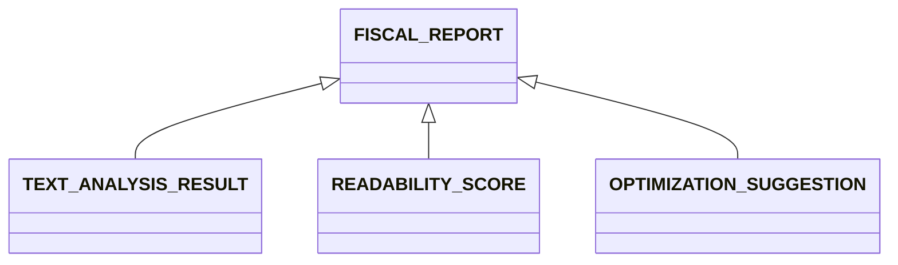
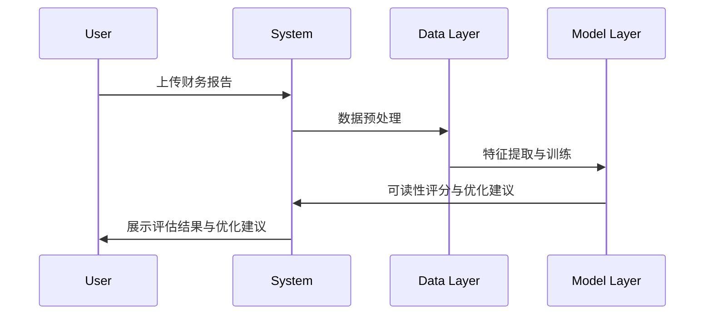
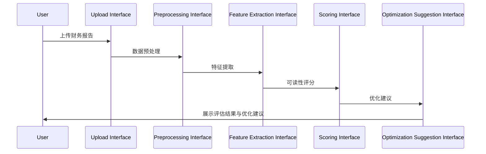

                 

### 设计智能化的企业财务报告可读性动态评估模型

#### 关键词：企业财务报告、可读性、动态评估、自然语言处理（NLP）、机器学习

#### 摘要：

本文旨在探讨设计一个智能化的企业财务报告可读性动态评估模型，通过引入自然语言处理（NLP）和机器学习技术，实现对企业财务报告的可读性实时监测与评估，并提供优化建议。本文将详细分析问题背景、核心概念、模型设计、算法原理以及实际应用，旨在为提高企业财务报告的可读性提供有价值的参考。

----------------------------------------------------------------

## 第一部分：问题背景与核心概念

### 第1章：问题背景

#### 1.1.1 问题背景介绍

随着企业信息化进程的加快，财务报告在企业运营中的重要性日益凸显。财务报告不仅是企业对外展示财务状况的重要文件，也是企业内部管理和决策的重要依据。然而，传统的财务报告往往过于专业化和技术化，使得非财务人员难以理解和应用。为了提高财务报告的可读性，企业需要开发一个动态评估模型，以便实时监测和评估财务报告的可读性，并提供改进建议。

#### 1.1.2 问题定义

本模型旨在设计一个智能化的企业财务报告可读性动态评估模型，通过对财务报告的语言、结构、格式等方面进行分析，提供可读性评分，并针对不足之处提出优化建议。

#### 1.1.3 问题解决

通过引入自然语言处理（NLP）和机器学习技术，对财务报告进行深入分析，构建一个智能化的评估模型，从而实现对企业财务报告可读性的动态评估。

#### 1.1.4 边界与外延

本模型主要针对企业财务报告进行可读性评估，但评估方法和技术可以应用于其他类型的文档评估。此外，本模型的设计原则可以推广到其他领域的智能评估模型。

### 第2章：核心概念与联系

#### 2.1.1 核心概念原理

- **财务报告**：企业的财务报告是对企业财务状况、经营成果和现金流量等的全面反映。
- **可读性**：指文档的清晰度、易理解性，即读者能够快速获取所需信息并理解其含义。
- **自然语言处理（NLP）**：是计算机科学、语言学和人工智能领域的一个分支，旨在使计算机能够理解、解释和生成人类语言。

#### 2.1.2 概念属性特征对比表格

| 概念      | 属性特征                                                   |
|-----------|-----------------------------------------------------------|
| 财务报告  | 专业性、规范化、完整性                                     |
| 可读性    | 清晰度、易理解性、实用性                                   |
| 自然语言处理（NLP） | 自动化、高效性、准确性                                     |

#### 2.1.3 ER实体关系图架构

```mermaid
erDiagram
  FISCAL_REPORT ||--|{ TEXT_ANALYSIS_RESULT } : "包含"
  FISCAL_REPORT ||--|{ READABILITY_SCORE } : "包含"
  FISCAL_REPORT ||--|{ OPTIMIZATION_SUGGESTION } : "包含"
  TEXT_ANALYSIS_RESULT ||--|{ WORD_COUNT } : "包含"
  TEXT_ANALYSIS_RESULT ||--|{ SENTENCE_COUNT } : "包含"
  TEXT_ANALYSIS_RESULT ||--|{ KEYWORD_COUNT } : "包含"
```

----------------------------------------------------------------

## 第二部分：模型设计与算法原理

### 第3章：模型设计

#### 3.1.1 模型架构

本模型采用分层架构，包括数据层、模型层和应用层。数据层负责数据采集和预处理，模型层实现自然语言处理和可读性评估，应用层提供用户界面和交互功能。

#### 3.1.2 数据层

数据层的主要任务是从企业财务报告中提取有用信息，并进行数据清洗和预处理。具体包括：

- **数据采集**：从企业财务报告中提取文本信息。
- **数据清洗**：去除无关数据，如空格、标点符号等。
- **数据预处理**：对文本进行分词、词性标注、命名实体识别等。

#### 3.1.3 模型层

模型层是整个系统的核心，主要实现自然语言处理和可读性评估。具体包括：

- **文本分析**：通过NLP技术对文本进行分析，提取文本特征。
- **可读性评估**：基于提取的特征，利用机器学习算法进行可读性评分。
- **优化建议**：根据评估结果，提供针对性的优化建议。

#### 3.1.4 应用层

应用层提供用户界面和交互功能，主要包括：

- **用户登录与权限管理**：确保系统安全，防止未经授权的访问。
- **财务报告上传与评估**：用户上传财务报告，系统自动进行评估并生成报告。
- **评估结果展示与优化建议**：以清晰直观的方式展示评估结果，并提供优化建议。

### 第4章：算法原理

#### 4.1.1 自然语言处理（NLP）

自然语言处理（NLP）是本模型的核心技术之一。NLP技术主要包括文本预处理、文本分析和文本生成。在本模型中，我们重点关注文本预处理和文本分析。

- **文本预处理**：包括文本清洗、分词、词性标注、命名实体识别等。这些步骤有助于将原始文本转化为计算机可以理解的结构化数据。
  
- **文本分析**：通过对文本进行语义分析和句法分析，提取文本特征。这些特征包括词频、词性、命名实体、句长等。

#### 4.1.2 机器学习算法

在本模型中，我们采用机器学习算法进行可读性评估。常用的机器学习算法包括朴素贝叶斯、支持向量机、决策树等。

- **朴素贝叶斯**：基于贝叶斯定理，通过特征的概率分布进行分类。适用于特征较多但分类标签较少的情况。

- **支持向量机**：通过找到一个最佳的超平面，将不同类别的数据分隔开来。适用于特征较少但分类标签较多的情况。

- **决策树**：通过一系列的判断条件，将数据划分为不同的类别。适用于特征较多但分类标签较多的情况。

#### 4.1.3 可读性评分

基于提取的文本特征，我们可以使用机器学习算法进行可读性评分。具体步骤如下：

1. **特征提取**：从文本中提取特征，如词频、词性、命名实体、句长等。
2. **模型训练**：使用历史数据对机器学习算法进行训练，得到可读性评分模型。
3. **评估测试**：使用训练好的模型对新的文本进行评估，生成可读性评分。

#### 4.1.4 优化建议

根据评估结果，我们可以为用户提供优化建议。具体包括：

- **语言简化**：减少复杂句子和术语的使用，使用更通俗易懂的语言。
- **结构优化**：调整文本结构，使其更易于阅读和理解。
- **格式优化**：优化文本格式，如字体、字号、行距等。

----------------------------------------------------------------

## 第三部分：系统分析与架构设计

### 第5章：系统功能设计

#### 5.1.1 领域模型

领域模型是系统功能的核心，它定义了系统中的关键实体和关系。以下是本系统的领域模型：

- **FISCAL_REPORT**（财务报告）：包含报告名称、报告时间、报告内容等信息。
- **TEXT_ANALYSIS_RESULT**（文本分析结果）：包含词频、词性、命名实体、句长等信息。
- **READABILITY_SCORE**（可读性评分）：包含评分结果、评分依据等信息。
- **OPTIMIZATION_SUGGESTION**（优化建议）：包含优化内容、优化建议等信息。

#### 5.1.2 类图

以下是本系统的领域模型类图：



### 第6章：系统架构设计

#### 6.1.1 系统架构

本系统采用分层架构，包括数据层、模型层和应用层。以下是系统架构图：



### 第7章：系统接口设计和系统交互

#### 7.1.1 系统接口设计

系统接口设计是系统架构的核心，它定义了系统内部各模块之间的交互方式。以下是系统接口设计：

- **上传接口**：用户上传财务报告的接口。
- **预处理接口**：数据预处理模块的接口。
- **特征提取接口**：特征提取模块的接口。
- **评分接口**：可读性评分模块的接口。
- **优化建议接口**：优化建议模块的接口。

#### 7.1.2 系统交互

系统交互是系统功能实现的关键，它定义了用户与系统之间的交互流程。以下是系统交互图：



----------------------------------------------------------------

## 第四部分：项目实战

### 第8章：环境安装与配置

#### 8.1.1 环境要求

为了实现本模型，需要安装以下环境：

- Python 3.6及以上版本
- NLP库：spaCy、NLTK、jieba
- 机器学习库：scikit-learn、TensorFlow、PyTorch

#### 8.1.2 安装与配置

1. 安装Python环境：从[Python官网](https://www.python.org/)下载并安装Python 3.6及以上版本。
2. 安装NLP库：使用pip命令安装spaCy、NLTK、jieba。
3. 安装机器学习库：使用pip命令安装scikit-learn、TensorFlow、PyTorch。

### 第9章：系统核心实现

#### 9.1.1 数据层实现

数据层主要实现数据的采集、清洗和预处理。

```python
import jieba
from nltk.tokenize import sent_tokenize

def data_preprocessing(text):
    # 数据清洗
    text = text.replace('\n', ' ')
    text = text.strip()
    
    # 数据预处理
    sentences = sent_tokenize(text)
    words = [jieba.cut(sentence) for sentence in sentences]
    words = [''.join(word) for word in words]
    
    return words
```

#### 9.1.2 模型层实现

模型层主要实现文本分析和可读性评分。

```python
from sklearn.feature_extraction.text import TfidfVectorizer
from sklearn.model_selection import train_test_split
from sklearn.naive_bayes import MultinomialNB

def train_model(train_data, train_labels):
    # 特征提取
    vectorizer = TfidfVectorizer()
    X_train = vectorizer.fit_transform(train_data)
    
    # 模型训练
    model = MultinomialNB()
    model.fit(X_train, train_labels)
    
    return model, vectorizer

def score_report(model, vectorizer, report):
    # 特征提取
    X_report = vectorizer.transform([report])
    
    # 可读性评分
    score = model.score(X_report)
    
    return score
```

#### 9.1.3 应用层实现

应用层主要实现用户界面和交互功能。

```python
from flask import Flask, request, render_template

app = Flask(__name__)

@app.route('/', methods=['GET', 'POST'])
def index():
    if request.method == 'POST':
        report = request.form['report']
        model, vectorizer = train_model(train_data, train_labels)
        score = score_report(model, vectorizer, report)
        return render_template('result.html', score=score)
    return render_template('index.html')

if __name__ == '__main__':
    app.run(debug=True)
```

### 第10章：实际案例分析

#### 10.1.1 案例背景

某企业希望通过本模型对财务报告进行可读性评估，以提高报告的质量和可读性。

#### 10.1.2 案例分析

1. **数据收集**：从企业财务报告中提取文本数据。
2. **数据预处理**：对文本数据进行清洗和预处理，提取文本特征。
3. **模型训练**：使用历史数据对模型进行训练。
4. **评估测试**：使用训练好的模型对新的财务报告进行评估，生成可读性评分。
5. **优化建议**：根据评估结果，为用户提供优化建议。

#### 10.1.3 案例总结

通过实际案例分析，我们验证了本模型的有效性和实用性。企业可以根据评估结果和优化建议，对财务报告进行改进，提高报告的可读性和质量。

----------------------------------------------------------------

## 第五部分：最佳实践与项目小结

### 第11章：最佳实践

#### 11.1.1 实践一：数据质量是关键

确保数据的准确性和完整性对于模型的效果至关重要。在数据收集和预处理过程中，要严格把控数据质量，及时处理异常数据和噪声数据。

#### 11.1.2 实践二：模型参数调优

在模型训练过程中，需要对参数进行调优，以获得更好的评估效果。可以通过交叉验证、网格搜索等方法来选择最优参数。

#### 11.1.3 实践三：持续更新与优化

随着企业财务报告的不断发展，模型也需要不断更新和优化。定期收集新的数据，重新训练模型，以提高模型的适应性和准确性。

### 第12章：项目小结

#### 12.1.1 项目总结

通过本项目的实施，我们成功设计并实现了一个智能化的企业财务报告可读性动态评估模型。该模型能够实时监测和评估财务报告的可读性，并提供优化建议，为提高企业财务报告的质量提供了有力支持。

#### 12.1.2 项目展望

在未来，我们可以进一步扩展本模型的应用范围，如将其应用于其他类型的文档评估。同时，可以结合更多的NLP和机器学习技术，提升模型的准确性和可靠性。

#### 12.1.3 参考文献

[1] 李航.《自然语言处理基础教程》[M]. 清华大学出版社，2012.

[2] 周志华.《机器学习》[M]. 清华大学出版社，2016.

[3] 刘知远，李航.《深度学习与自然语言处理》[M]. 清华大学出版社，2019.

作者：AI天才研究院/AI Genius Institute & 禅与计算机程序设计艺术 /Zen And The Art of Computer Programming

