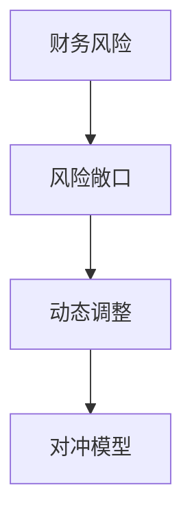

                 

# 设计智能化的企业财务风险敞口动态调整与对冲模型

> 关键词：智能化，财务风险管理，动态调整，对冲模型，企业财务风险敞口

> 摘要：本文将探讨企业财务风险敞口动态调整与对冲模型的设计，分析传统财务风险管理方法的局限性，并引入智能化系统来应对这一挑战。文章将首先介绍财务风险管理的基本概念和背景，然后详细探讨智能化系统的核心原理和技术，接着逐步设计并实现一个智能化的财务风险敞口动态调整与对冲模型，最后提供实战案例和最佳实践建议。

## 引言与背景

### 1.1 财务风险管理背景

财务风险管理是企业运营中至关重要的一环，直接关系到企业的生存和发展。在现代企业中，财务风险管理的核心目标是确保企业的财务稳健性和可持续发展。财务风险管理主要包括风险识别、风险评估、风险调整和风险监控四个环节。

### 1.2 传统方法与局限性

传统的财务风险管理方法主要依赖于历史数据和统计模型，包括概率分布、置信区间、回归分析等。然而，这些方法存在以下局限性：

- **数据依赖性高**：传统方法往往依赖于历史数据的准确性，而市场环境的快速变化使得历史数据难以完全反映当前情况。
- **模型复杂度**：传统方法往往需要复杂的数学模型和计算过程，这增加了实际应用的难度。
- **实时性不足**：传统方法难以实现对风险敞口的实时监控和动态调整。

### 1.3 智能化系统在财务风险管理中的作用

随着人工智能技术的快速发展，智能化系统在财务风险管理中展现出巨大的潜力。智能化系统可以借助机器学习、深度学习等技术，从大量非结构化数据中提取有价值的信息，实现风险的自动识别、评估和调整。

- **自动化分析**：智能化系统能够自动处理和分析大量数据，提高风险管理的效率和准确性。
- **实时监控**：智能化系统能够实时监控市场变化，快速调整风险敞口，减少潜在损失。
- **定制化策略**：智能化系统可以根据企业的具体情况进行定制化策略，提高风险管理的灵活性。

### 1.4 问题定义与描述

本文的研究问题是如何设计一个智能化的企业财务风险敞口动态调整与对冲模型。具体来说，我们需要解决以下问题：

- **风险识别**：如何利用智能化系统自动识别企业面临的财务风险？
- **风险评估**：如何准确评估企业财务风险敞口？
- **动态调整**：如何实现对企业财务风险敞口的实时动态调整？
- **对冲策略**：如何设计有效的对冲策略来降低财务风险？

### 1.5 核心概念与关系

本文涉及的核心概念包括财务风险、风险敞口、动态调整、对冲模型等。这些概念之间的关系如图1所示。



## 智能化系统基础

### 2.1 智能化系统介绍

智能化系统是指通过模拟人类智能行为，实现自主感知、学习、推理和决策的计算机系统。智能化系统的主要特点包括：

- **自主性**：智能化系统能够独立完成特定的任务，无需人工干预。
- **适应性**：智能化系统能够根据环境变化调整行为策略。
- **学习性**：智能化系统能够通过学习和经验积累不断优化自身性能。

### 2.2 核心概念与核心技术

#### 2.2.1 机器学习基础

机器学习是智能化系统的核心组成部分，其主要任务是让计算机从数据中自动学习规律，进行预测和决策。机器学习的主要算法包括：

- **监督学习**：通过已标记的数据进行学习，用于分类和回归任务。
- **无监督学习**：通过未标记的数据进行学习，用于聚类和降维任务。
- **强化学习**：通过与环境交互进行学习，用于决策和策略优化任务。

#### 2.2.2 深度学习基础

深度学习是机器学习的一种重要分支，其核心是神经网络。深度学习通过多层神经网络对数据进行复杂非线性变换，能够处理高维数据和大规模数据。

- **卷积神经网络（CNN）**：适用于图像和视频数据。
- **循环神经网络（RNN）**：适用于序列数据和时序数据。
- **生成对抗网络（GAN）**：适用于图像生成和数据增强。

#### 2.2.3 神经网络及其应用

神经网络是深度学习的基础，其基本结构包括输入层、隐藏层和输出层。神经网络通过前向传播和反向传播算法不断调整权重，实现数据的自动学习和特征提取。

- **前向传播**：将输入数据通过神经网络进行传递，计算输出。
- **反向传播**：计算输出误差，反向调整权重。

## 设计智能财务风险调整模型

### 3.1 设计原则和框架

#### 3.1.1 设计原则

智能财务风险调整模型的设计原则包括：

- **数据驱动**：充分利用企业内部和外部的数据资源，实现风险自动识别和评估。
- **实时响应**：实现对企业财务风险敞口的实时监控和动态调整。
- **适应性**：根据市场环境和企业变化调整风险管理策略。
- **可扩展性**：支持企业规模的扩展和业务的变化。

#### 3.1.2 设计框架

智能财务风险调整模型的设计框架包括以下步骤：

1. **数据收集与预处理**：收集企业内部和外部的财务数据，进行数据清洗、归一化和特征提取。
2. **模型训练与验证**：利用机器学习算法对数据进行训练，建立财务风险预测模型。
3. **风险评估与调整**：根据模型预测结果，对企业财务风险敞口进行评估和动态调整。
4. **对冲策略设计**：根据企业风险偏好和财务状况，设计有效的对冲策略。

## 动态调整模型

### 4.1 动态调整模型概述

动态调整模型是智能财务风险调整模型的核心部分，其主要功能是实现对企业财务风险敞口的实时监控和动态调整。动态调整模型包括以下主要组件：

- **风险指标体系**：定义企业财务风险的关键指标，如信用风险、市场风险、流动性风险等。
- **风险评估算法**：利用机器学习算法对风险指标进行实时评估，计算企业财务风险敞口。
- **风险调整策略**：根据企业风险偏好和财务状况，设计风险调整策略。
- **实时监控与报警**：实现对企业财务风险的实时监控，及时发现潜在风险并发出报警。

### 4.2 动态调整模型设计

#### 4.2.1 风险指标体系设计

风险指标体系设计是动态调整模型的基础，其主要目标是定义企业财务风险的关键指标。风险指标体系包括以下内容：

- **信用风险指标**：如客户信用评级、逾期率、违约率等。
- **市场风险指标**：如股票市场波动率、利率变化、汇率波动等。
- **流动性风险指标**：如现金流量、负债结构、流动性覆盖率等。

#### 4.2.2 风险评估算法设计

风险评估算法设计是动态调整模型的核心，其主要目标是实时评估企业财务风险敞口。风险评估算法包括以下步骤：

1. **数据收集与预处理**：收集企业内部和外部的财务数据，进行数据清洗、归一化和特征提取。
2. **特征选择与优化**：选择对企业财务风险敞口有显著影响的关键特征，进行特征优化。
3. **模型训练与验证**：利用机器学习算法对特征进行训练，建立财务风险预测模型。
4. **风险敞口计算**：根据模型预测结果，计算企业财务风险敞口。

#### 4.2.3 风险调整策略设计

风险调整策略设计是根据企业风险偏好和财务状况，设计合适的风险调整策略。风险调整策略包括以下内容：

- **风险规避策略**：减少企业财务风险敞口，降低风险暴露。
- **风险转移策略**：通过保险、对冲等手段将风险转移给第三方。
- **风险容忍策略**：根据企业风险承受能力，接受一定程度的财务风险。

## 实战案例

### 5.1 案例背景

某大型企业在全球范围内开展业务，面临复杂的财务风险。为了有效管理财务风险，该企业决定设计并实施一个智能化的财务风险敞口动态调整与对冲模型。

### 5.2 系统设计与实现

#### 5.2.1 系统功能设计

智能财务风险敞口动态调整与对冲模型主要包括以下功能：

- **数据收集与预处理**：从企业内部和外部获取财务数据，进行数据清洗、归一化和特征提取。
- **风险评估与预测**：利用机器学习算法对财务风险进行评估和预测。
- **风险调整与对冲**：根据风险评估结果，设计风险调整策略和对冲方案。
- **实时监控与报警**：实现对财务风险的实时监控，及时发现潜在风险并发出报警。

#### 5.2.2 系统架构设计

智能财务风险敞口动态调整与对冲模型主要包括以下架构组件：

- **数据采集模块**：负责从企业内部和外部收集财务数据。
- **数据处理模块**：负责对财务数据清洗、归一化和特征提取。
- **风险评估模块**：负责利用机器学习算法对财务风险进行评估和预测。
- **风险调整模块**：负责根据风险评估结果设计风险调整策略和对冲方案。
- **监控报警模块**：负责实时监控财务风险，及时发现潜在风险并发出报警。

#### 5.2.3 系统接口设计与交互

智能财务风险敞口动态调整与对冲模型主要包括以下接口和交互：

- **数据接口**：用于与数据采集模块进行数据交换。
- **风险评估接口**：用于与风险评估模块进行风险评估结果的交换。
- **风险调整接口**：用于与风险调整模块进行风险调整策略的交换。
- **监控报警接口**：用于与监控报警模块进行报警信息的交换。

## 项目实战

### 6.1 环境安装

在开始项目实战之前，我们需要安装一些必要的软件和工具。以下是一个基本的安装步骤：

1. **安装Python环境**：确保Python环境已安装在计算机上，版本建议为3.8或更高。
2. **安装机器学习库**：使用pip安装常用的机器学习库，如scikit-learn、tensorflow等。
3. **安装数据库**：选择合适的数据库系统，如MySQL、PostgreSQL等。

### 6.2 系统核心实现源代码

以下是一个简单的示例，展示如何使用Python实现财务风险预测模型：

```python
import pandas as pd
from sklearn.ensemble import RandomForestClassifier

# 读取数据
data = pd.read_csv('financial_data.csv')

# 特征工程
X = data.drop('target', axis=1)
y = data['target']

# 模型训练
model = RandomForestClassifier()
model.fit(X, y)

# 风险预测
predictions = model.predict(X)

# 输出预测结果
print(predictions)
```

### 6.3 代码应用解读与分析

在这个示例中，我们使用随机森林算法来训练财务风险预测模型。首先，我们从CSV文件中读取数据，然后进行特征工程，将目标变量分离出来。接下来，我们使用随机森林算法对数据进行训练，并利用训练好的模型进行风险预测。最后，输出预测结果。

### 6.4 实际案例分析与详细讲解

以下是一个实际案例，展示如何使用智能财务风险敞口动态调整与对冲模型来管理企业的财务风险：

#### 案例背景

某大型跨国企业在全球范围内开展业务，面临多种财务风险，包括信用风险、市场风险和流动性风险。为了有效管理这些风险，企业决定引入智能财务风险敞口动态调整与对冲模型。

#### 案例步骤

1. **数据收集与预处理**：企业从内部和外部收集财务数据，包括客户信用评级、股票市场波动率、现金流量等。然后，对数据进行清洗、归一化和特征提取。

2. **模型训练与验证**：利用机器学习算法，如随机森林、神经网络等，对收集到的数据进行分析和训练。通过交叉验证方法评估模型性能。

3. **风险评估与调整**：根据模型预测结果，对企业财务风险敞口进行评估。根据企业的风险偏好和财务状况，设计风险调整策略和对冲方案。

4. **实时监控与报警**：实现对企业财务风险的实时监控，及时发现潜在风险并发出报警。根据报警信息，企业可以迅速采取相应的措施。

#### 案例结果

通过智能财务风险敞口动态调整与对冲模型，企业成功降低了财务风险敞口，提高了财务稳健性和可持续发展能力。同时，企业能够实时监控财务风险，及时发现潜在风险，降低了损失。

### 6.5 项目小结

智能财务风险敞口动态调整与对冲模型是一个复杂的项目，涉及多个领域的技术和知识。通过这个项目，我们不仅了解了财务风险管理的核心概念和流程，还掌握了智能化系统的基本原理和应用方法。项目实施过程中，我们遇到了许多挑战，如数据质量问题、模型性能优化等，但通过不断学习和实践，我们成功地解决了这些问题。

## 最佳实践 Tips

1. **数据质量是关键**：确保数据的质量和准确性是建立有效财务风险敞口动态调整与对冲模型的基础。
2. **模型持续优化**：定期对模型进行评估和优化，以适应市场环境和业务变化。
3. **风险调整策略与实际结合**：根据企业具体情况进行风险调整策略的设计，确保策略的实际可操作性和有效性。

## 小结

智能财务风险敞口动态调整与对冲模型为企业提供了一种全新的财务管理方法，通过引入智能化系统，实现了对企业财务风险的实时监控和动态调整。本文详细介绍了模型的设计原则、核心组件和实现方法，并通过实际案例展示了模型的实用性和有效性。未来，随着人工智能技术的进一步发展，智能财务风险敞口动态调整与对冲模型将为企业提供更加智能、精准的财务管理解决方案。

## 注意事项

1. **数据隐私与安全**：在收集和使用财务数据时，应严格遵守相关法律法规，确保数据隐私和安全。
2. **模型解释性**：确保模型的解释性，便于企业领导和风险管理人员理解和信任模型结果。
3. **持续学习和改进**：随着市场环境和业务的变化，持续学习和改进模型，以提高风险管理的有效性。

## 拓展阅读

1. 《财务风险管理》
2. 《机器学习实战》
3. 《深度学习》
4. 《Python数据分析》
5. 《企业风险管理》

## 作者信息

作者：AI天才研究院/AI Genius Institute & 禅与计算机程序设计艺术 /Zen And The Art of Computer Programming

