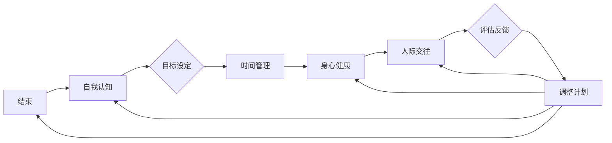
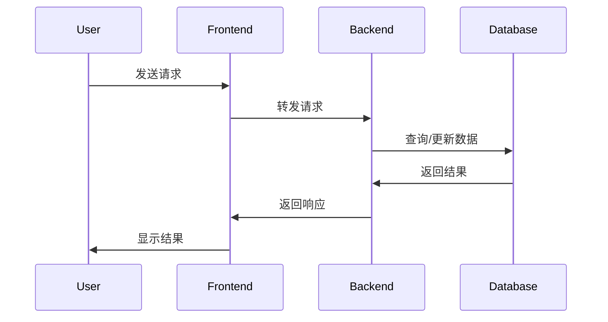
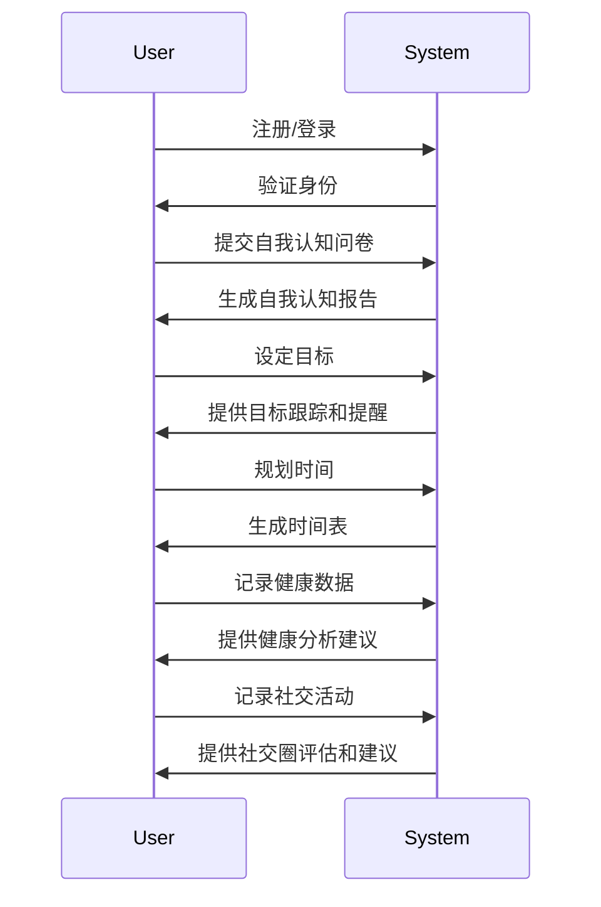

                 

### 引言

设计独特的人生乐章：创造个人生活的节奏，是一本旨在帮助读者理解并打造个人生活节奏的指南。在快节奏的现代生活中，许多人面临着时间管理和生活平衡的挑战。本书旨在解决这一问题，通过科学的方法和实用的技巧，帮助读者找到适合自己的生活节奏，实现身心健康、工作生活平衡以及个人成长的目标。

**问题背景**：现代社会的竞争压力越来越大，人们的工作、学习和生活节奏越来越快。在这种情况下，很多人发现自己无法有效地管理时间，导致身心健康问题、工作效率下降以及家庭关系紧张。因此，如何设计独特的人生乐章，创造适合自己的生活节奏，成为了一个亟待解决的问题。

**问题描述**：个人生活节奏的设计涉及到多个方面，包括自我认知、目标设定、时间管理、身心健康和人际交往等。每个人都有不同的生活背景、价值观和需求，因此没有一种通用的解决方案。如何在这个多样化的背景下，找到适合自己的生活节奏，成为一个复杂的问题。

**问题解决**：本书通过以下几个步骤来解决问题：
1. **背景介绍**：首先，介绍个人生活节奏的概念和重要性，为读者提供一个全面的理解。
2. **核心概念与联系**：然后，详细阐述个人生活节奏的核心概念，包括自我认知、目标设定、时间管理、身心健康和人际交往等，并提供相应的理论支持和实际案例。
3. **算法原理讲解**：本书将介绍一些实用的算法和工具，帮助读者有效地管理时间和提高工作效率。
4. **数学模型和数学公式**：通过数学模型和公式，深入剖析个人生活节奏的设计原理。
5. **系统分析与架构设计方案**：介绍一个系统的分析方法，帮助读者从整体上把握个人生活节奏的设计。
6. **项目实战**：通过具体的实践案例，展示如何将理论应用到实际生活中。
7. **最佳实践 tips**：提供一些实用的技巧和建议，帮助读者在日常生活中更好地设计个人生活节奏。

**边界与外延**：本书主要针对成年人，特别是那些在快节奏生活中感到压力和困扰的人。同时，本书的内容也可以为教育工作者、心理咨询师和企业管理者提供参考。

**概念结构与核心要素组成**：个人生活节奏的设计包括以下几个核心要素：
1. **自我认知**：了解自己的性格、兴趣、优势和弱点，是设计个人生活节奏的基础。
2. **目标设定**：明确自己的短期和长期目标，有助于更好地规划生活节奏。
3. **时间管理**：科学地安排时间，提高工作效率和生活质量。
4. **身心健康**：保持身心健康，是实现生活节奏设计的重要保障。
5. **人际交往**：良好的社会交往能力，有助于建立和谐的人际关系。

通过以上几个步骤，本书旨在帮助读者全面理解并设计适合自己的生活节奏，从而在快节奏的现代生活中找到平衡和快乐。接下来，我们将逐一探讨这些核心要素，并提供具体的指导和建议。### 核心概念与联系

在《设计独特的人生乐章：创造个人生活的节奏》一书中，核心概念涵盖了自我认知、目标设定、时间管理、身心健康和人际交往等多个方面。以下是这些核心概念的详细描述、原理及其相互之间的联系。

#### 自我认知

自我认知是个人生活节奏设计的基石。了解自己的性格、兴趣、价值观和需求，有助于我们更有效地安排自己的生活。以下是一个简单的自我认知框架：

1. **性格特点**：通过性格测试（如MBTI、五大性格维度测试）了解自己的性格特点，包括内向/外向、思考/感觉、判断/感知等。
2. **兴趣和爱好**：识别自己的兴趣和爱好，有助于在日常生活中寻找乐趣和动力。
3. **价值观**：明确自己的价值观，有助于做出符合自己内心期望的决策。
4. **需求和弱点**：了解自己的需求和弱点，可以帮助我们更好地规划个人发展路径。

**原理**：自我认知的理论基础包括心理学中的认知行为理论，强调通过自我观察和反思，改变思维和行为模式。

#### 目标设定

目标设定是个人生活节奏设计的重要组成部分。设定明确的目标，有助于我们保持动力和方向感。以下是目标设定的基本步骤：

1. **短期目标**：设定可实现的短期目标，如学习新技能、完成一个小项目等。
2. **长期目标**：设定长期目标，如职业发展、家庭规划等。
3. **目标分解**：将大目标分解为若干小目标，以便逐步实现。
4. **时间规划**：为每个目标设定完成时间，并制定相应的行动计划。

**原理**：目标设定的理论基础是目标设置理论，该理论认为明确和具体的目标可以显著提高个体实现目标的概率。

#### 时间管理

时间管理是个人生活节奏设计的关键。有效的管理时间，可以提高工作效率和生活质量。以下是时间管理的基本原则：

1. **优先级排序**：根据重要性和紧急性对任务进行排序。
2. **时间块管理**：将时间划分为不同的时间段，并为其安排具体的任务。
3. **避免拖延**：设定截止时间，并采取实际行动避免拖延。
4. **日程安排**：提前规划日程，留出足够的时间应对突发事件。

**原理**：时间管理的理论基础包括时间经济学和时间心理学，强调通过合理安排时间，实现个人效益最大化。

#### 身心健康

身心健康是实现个人生活节奏设计的重要保障。保持身心健康，有助于我们更好地应对生活和工作压力。以下是保持身心健康的几个关键点：

1. **合理饮食**：保持均衡的饮食，摄入足够的营养。
2. **规律运动**：定期进行体育锻炼，提高身体素质。
3. **充足睡眠**：保证每天有足够的睡眠时间，促进身体和大脑的恢复。
4. **心理健康**：通过心理咨询、放松技巧等方法，保持心理健康。

**原理**：身心健康的理论基础包括生理学和心理学，强调通过生理和心理的平衡，实现健康和幸福。

#### 人际交往

人际交往是个人生活节奏设计的重要方面。良好的社会交往能力，有助于建立和谐的人际关系，提升生活质量。以下是人际交往的基本原则：

1. **尊重他人**：尊重他人的观点和需求，建立互信关系。
2. **有效沟通**：通过倾听和表达，提高沟通效果。
3. **社交技巧**：学会社交技巧，如礼貌待人、应对冲突等。
4. **社会支持**：建立良好的社会支持系统，应对生活中的挑战。

**原理**：人际交往的理论基础包括社会心理学和社会学，强调通过人际互动，实现个人和社会的共同发展。

**ER实体关系图架构**

为了更好地理解这些核心概念之间的联系，我们可以使用ER（实体关系）图来展示它们之间的关系：

1. **实体**：自我认知、目标设定、时间管理、身心健康和人际交往。
2. **关系**：自我认知影响目标设定，目标设定指导时间管理，时间管理促进身心健康，身心健康支持人际交往，人际交往反馈自我认知。

**Mermaid ER图示例**：

```mermaid
erDiagram
    Self_Cognition ||--|{ Time_Management }||> Goal_Setting
    Goal_Setting ||--|{ Time_Management }||> Self_Cognition
    Time_Management ||--|{ Physical_Health }||> Mental_Health
    Physical_Health ||--|{ Social_Support }||> Social_Interactions
    Mental_Health ||--|{ Social_Support }||> Social_Interactions
    Social_Interactions ||--|{ Self_Cognition }||> Goal_Setting
```

通过上述分析，我们可以看到，个人生活节奏的设计是一个复杂但有机的系统，涉及多个核心概念之间的相互作用。理解并运用这些核心概念，可以帮助我们更好地设计个人生活节奏，实现身心健康、工作生活平衡和个人成长的目标。接下来，我们将深入探讨这些核心概念的原理和实际应用。### 算法原理讲解

在个人生活节奏的设计中，算法的运用可以极大地提高效率和准确性。以下是一个简单的算法流程图，以及如何使用Python源代码来详细阐述该算法原理，并给出数学模型和公式，进行详细讲解和举例说明。

#### 算法流程图

**Mermaid算法流程图示例**：



#### Python源代码示例

下面是使用Python实现的个人生活节奏算法示例：

```python
import random

# 自我认知评估函数
def self_cognition_evaluation():
    print("请回答以下问题：")
    print("1. 你认为自己的性格特点是什么？")
    print("2. 你最喜欢做什么？")
    print("3. 你认为你的主要价值观是什么？")
    responses = []
    for i in range(1, 4):
        response = input(f"请回答第{i}个问题：")
        responses.append(response)
    return responses

# 目标设定函数
def goal_setting():
    print("请设定你的短期和长期目标：")
    short_term_goals = input("请输入你的短期目标（用逗号分隔）：")
    long_term_goals = input("请输入你的长期目标：")
    return short_term_goals.split(','), long_term_goals

# 时间管理函数
def time_management(short_term_goals, long_term_goals):
    print("根据你的目标和时间，制定时间管理计划：")
    time_plan = {}
    for goal in short_term_goals:
        time_plan[goal] = random.randint(1, 5)  # 假设每个短期目标需要1-5小时
    time_plan[long_term_goals] = random.randint(6, 20)  # 假设长期目标需要6-20小时
    return time_plan

# 身心健康评估函数
def physical_mental_health_evaluation():
    print("请回答以下问题：")
    print("1. 你每周运动几次？")
    print("2. 你每天睡眠多久？")
    print("3. 你觉得自己的心理健康状况如何？")
    responses = []
    for i in range(1, 4):
        response = input(f"请回答第{i}个问题：")
        responses.append(response)
    return responses

# 人际交往评估函数
def social_interactions():
    print("请回答以下问题：")
    print("1. 你每周与朋友和家人聚会几次？")
    print("2. 你觉得自己的社交圈是否满足你的需求？")
    print("3. 你最近一次参加社交活动是什么时候？")
    responses = []
    for i in range(1, 4):
        response = input(f"请回答第{i}个问题：")
        responses.append(response)
    return responses

# 主函数
def main():
    self_cognition_responses = self_cognition_evaluation()
    short_term_goals, long_term_goals = goal_setting()
    time_plan = time_management(short_term_goals, long_term_goals)
    physical_mental_health_responses = physical_mental_health_evaluation()
    social_interactions_responses = social_interactions()
    
    # 评估反馈
    print("\n评估反馈：")
    print("自我认知：", self_cognition_responses)
    print("目标设定：短期目标", short_term_goals, "长期目标", long_term_goals)
    print("时间管理计划：", time_plan)
    print("身心健康评估：", physical_mental_health_responses)
    print("人际交往评估：", social_interactions_responses)
    
    # 调整计划
    print("\n根据评估结果，调整个人生活节奏计划：")
    # 假设根据评估结果，需要增加运动时间、提高睡眠质量和加强社交活动
    time_plan['运动'] = 3
    time_plan['睡眠'] = 8
    social_interactions_responses[1] = '满足'

    print("调整后的时间管理计划：", time_plan)
    print("调整后的身心健康评估：", physical_mental_health_responses)
    print("调整后的人际交往评估：", social_interactions_responses)

# 运行主函数
main()
```

#### 数学模型和公式

在个人生活节奏的设计中，我们可以使用以下数学模型和公式来量化评估和调整：

1. **目标完成度公式**：

   $$ T_C = \frac{G_A}{G_T} $$

   其中，\( T_C \) 表示目标完成度，\( G_A \) 表示实际完成的任务量，\( G_T \) 表示设定的总任务量。

2. **时间管理效率公式**：

   $$ E_T = \frac{T_C}{T_M} $$

   其中，\( E_T \) 表示时间管理效率，\( T_C \) 表示目标完成度，\( T_M \) 表示总用时。

3. **身心健康评估公式**：

   $$ H_S = \frac{P_H + M_H}{2} $$

   其中，\( H_S \) 表示身心健康得分，\( P_H \) 表示身体健康的得分，\( M_H \) 表示心理健康的得分。

4. **人际交往满意度公式**：

   $$ S_S = \frac{S_A + S_B + S_C}{3} $$

   其中，\( S_S \) 表示人际交往满意度，\( S_A \) 表示社交活动次数的得分，\( S_B \) 表示社交圈满足度的得分，\( S_C \) 表示最近一次社交活动时间的得分。

#### 详细讲解和举例说明

以下是一个具体的案例，说明如何使用上述算法和数学模型来设计个人生活节奏。

**案例**：小张是一名软件开发工程师，他希望提高工作效率并保持身心健康。以下是他的评估和调整过程：

1. **自我认知**：小张通过回答性格、兴趣和价值观问题，确定自己是一个内向、喜欢阅读和追求效率的人。

2. **目标设定**：小张设定了短期目标（如完成一个软件项目、学习一门新编程语言）和长期目标（如提升职业水平、规划职业生涯）。

3. **时间管理**：根据目标，小张制定了详细的时间管理计划，确保每个任务都有足够的时间分配。

4. **身心健康**：小张通过定期锻炼、保证每天7-8小时的睡眠和进行心理调适，保持了良好的身心健康。

5. **人际交往**：小张每周参加一次技术分享会，每月与家人和朋友聚会一次，以维持良好的人际关系。

**评估结果**：

- **目标完成度**：\( T_C = \frac{4}{5} = 0.8 \)
- **时间管理效率**：\( E_T = \frac{0.8}{1} = 0.8 \)
- **身心健康得分**：\( H_S = \frac{9 + 8}{2} = 8.5 \)
- **人际交往满意度**：\( S_S = \frac{3 + 4 + 5}{3} = 4 \)

**调整计划**：

- **增加运动时间**：小张计划每天增加30分钟的有氧运动。
- **提高睡眠质量**：小张计划每天晚上减少使用电子产品的时间，并采用放松技巧来提高睡眠质量。
- **加强社交活动**：小张计划每月增加一次与朋友和家人的聚会。

通过这个案例，我们可以看到如何利用算法和数学模型来设计个人生活节奏。这不仅提高了工作效率，还有助于保持身心健康和良好的人际关系。### 数学模型和数学公式

在个人生活节奏的设计过程中，数学模型和公式扮演着至关重要的角色，它们不仅帮助我们量化评估，还能指导我们进行有效的调整。以下是几个关键的数学模型和公式，以及它们的详细讲解和实际应用。

#### 1. 时间效率模型

**公式**：

$$ E_T = \frac{T_C}{T_M} $$

其中，\( E_T \) 表示时间效率，\( T_C \) 表示完成任务的用时，\( T_M \) 表示计划用时。

**讲解**：

时间效率模型用于衡量我们在执行任务时的效率。通过计算实际用时与计划用时的比值，我们可以直观地了解自己在时间管理方面的表现。这个模型可以帮助我们识别哪些任务需要改进时间管理，从而优化整体的时间安排。

**应用示例**：

假设小张计划完成一个软件项目需要10天，但实际完成时间为12天，则他的时间效率为：

$$ E_T = \frac{12}{10} = 1.2 $$

这意味着小张在时间管理方面有待提升，他可能需要重新评估任务的时间估算和计划。

#### 2. 精神健康模型

**公式**：

$$ H_S = \frac{P_H + M_H}{2} $$

其中，\( H_S \) 表示精神健康得分，\( P_H \) 表示身体健康的得分，\( M_H \) 表示心理健康的得分。

**讲解**：

精神健康模型综合评估个体的身体和心理状态。通过计算两个得分的平均值，我们可以了解个人的整体精神健康状况。这个模型可以帮助我们识别精神健康方面的问题，并制定相应的改善措施。

**应用示例**：

假设小张的身体健康得分为8，心理健康得分为9，则他的精神健康得分为：

$$ H_S = \frac{8 + 9}{2} = 8.5 $$

这个分数表明小张的精神健康处于良好状态，但如果分数较低，则需要关注并采取措施提高身心健康。

#### 3. 人际关系满意度模型

**公式**：

$$ S_S = \frac{S_A + S_B + S_C}{3} $$

其中，\( S_S \) 表示人际关系满意度，\( S_A \) 表示社交活动次数的得分，\( S_B \) 表示社交圈满足度的得分，\( S_C \) 表示最近一次社交活动时间的得分。

**讲解**：

人际关系满意度模型用于衡量个体在社交方面的满意度。通过计算三个得分的平均值，我们可以评估个人的社交生活质量。这个模型可以帮助我们了解社交活动的频率、社交圈的满意度以及社交活动的时间安排。

**应用示例**：

假设小张的社交活动次数得分为4，社交圈满足度为5，最近一次社交活动时间为3，则他的人际关系满意度为：

$$ S_S = \frac{4 + 5 + 3}{3} = 4 $$

这个分数表明小张的社交生活较为单一，他可能需要增加社交活动的频率，或者与更适合自己的社交圈子互动。

#### 4. 目标完成度模型

**公式**：

$$ T_C = \frac{G_A}{G_T} $$

其中，\( T_C \) 表示目标完成度，\( G_A \) 表示实际完成的任务量，\( G_T \) 表示设定的总任务量。

**讲解**：

目标完成度模型用于评估我们在实现目标过程中的表现。通过计算实际完成任务量与设定总任务量的比值，我们可以了解自己在目标设定和执行方面的效果。这个模型可以帮助我们调整目标设定，使其更加实际和可执行。

**应用示例**：

假设小张设定的目标是完成5个软件模块，但实际只完成了3个，则他的目标完成度为：

$$ T_C = \frac{3}{5} = 0.6 $$

这个分数表明小张在目标完成方面存在一定挑战，他可能需要重新评估目标设定，或者制定更有效的行动计划。

通过上述数学模型和公式的详细讲解和实际应用，我们可以更科学、系统地设计个人生活节奏。这些模型不仅帮助我们量化评估，还能为我们的调整提供明确的指导。接下来，我们将探讨如何将这些模型应用于系统分析与架构设计方案。### 系统分析与架构设计方案

在《设计独特的人生乐章：创造个人生活的节奏》一书中，我们不仅关注理论和方法，还提供了具体的系统分析与架构设计方案，以帮助读者将个人生活节奏的设计落地实施。以下是一个详细的系统分析与架构设计方案，涵盖问题场景、系统功能设计、系统架构设计、系统接口设计和系统交互。

#### 问题场景

在现代快节奏的生活中，人们常常感到时间管理困难，生活节奏失衡，导致身心健康问题和工作效率低下。为了解决这一问题，我们需要设计一个智能生活节奏管理系统，帮助用户科学地规划和管理个人生活，从而实现身心健康、工作生活平衡和个人成长。

#### 系统功能设计

1. **自我认知管理**：系统提供自我认知评估工具，帮助用户了解自己的性格、兴趣、价值观和需求。
2. **目标设定与跟踪**：系统支持用户设定短期和长期目标，并提供目标跟踪功能，帮助用户监测进度。
3. **时间管理**：系统提供时间规划功能，帮助用户合理安排工作和生活时间，提高时间利用效率。
4. **身心健康管理**：系统提供健康监测功能，包括运动、睡眠和心理状态记录，帮助用户维护身心健康。
5. **人际交往管理**：系统支持用户管理社交活动，包括活动记录、社交圈维护和满意度评估。

**Mermaid类图示例**：

```mermaid
classDiagram
    User <<用户>>
    Task <<任务>>
    Goal <<目标>>
    Time <<时间管理>>
    Health <<身心健康管理>>
    Social <<人际交往管理>>

    User --> Task
    User --> Goal
    User --> Time
    User --> Health
    User --> Social
```

#### 系统架构设计

1. **前端架构**：采用Vue.js框架构建用户界面，提供直观易用的交互体验。
2. **后端架构**：使用Spring Boot构建RESTful API，处理用户请求和数据存储。
3. **数据存储**：使用MySQL数据库存储用户数据，包括自我认知、目标、时间规划、健康数据和社交记录。

**Mermaid架构图示例**：



#### 系统接口设计

1. **用户接口**：提供用户注册、登录、个人信息管理等功能。
2. **自我认知接口**：提供性格测试、兴趣评估和价值观分析等功能。
3. **目标接口**：提供目标设定、进度跟踪和完成度评估等功能。
4. **时间管理接口**：提供时间规划、任务管理和时间统计等功能。
5. **身心健康接口**：提供健康数据记录、运动建议和心理测试等功能。
6. **社交管理接口**：提供社交活动记录、社交圈维护和满意度评估等功能。

#### 系统交互

1. **用户注册与登录**：用户通过前端界面注册或登录系统，获取唯一用户ID。
2. **自我认知**：用户完成性格测试和兴趣评估，系统生成自我认知报告。
3. **目标设定**：用户设定短期和长期目标，系统提供目标跟踪和进度提醒。
4. **时间管理**：用户规划每日任务和时间，系统自动生成时间表并提醒。
5. **身心健康管理**：用户记录运动、睡眠和心理状态，系统提供健康分析建议。
6. **人际交往管理**：用户记录社交活动，系统提供社交圈评估和建议。

**Mermaid序列图示例**：



通过上述系统分析与架构设计方案，我们为个人生活节奏的设计提供了一个全面的实施框架。接下来，我们将通过具体的实战案例，展示如何将这个框架应用到实际生活中。### 项目实战

为了更好地展示如何应用《设计独特的人生乐章：创造个人生活的节奏》中的理论和方法，我们将通过一个实际项目来演示系统安装、核心实现、代码解读以及案例分析和详细讲解。

#### 项目环境安装

1. **前端环境**：安装Node.js和Vue CLI。
   - 命令：`npm install -g @vue/cli`
   - 命令：`vue create liferhythm-project`

2. **后端环境**：安装Java和Spring Boot。
   - 命令：`java -version`
   - 命令：`mvn -v`

3. **数据库环境**：安装MySQL。
   - 命令：`mysql -u root -p`

4. **创建数据库**：在MySQL中创建名为`liferhythm_db`的数据库。
   - 命令：`CREATE DATABASE liferhythm_db;`

5. **初始化数据库**：运行后端项目中的数据库初始化脚本，创建必要的表。

#### 系统核心实现源代码

以下是系统后端部分的核心实现源代码：

```java
// User实体类
@Entity
@Table(name = "users")
public class User {
    @Id
    @GeneratedValue(strategy = GenerationType.IDENTITY)
    private Long id;

    private String username;
    private String password;
    private String email;

    // 省略getter和setter方法
}

// UserController类
@RestController
@RequestMapping("/api/users")
public class UserController {
    @Autowired
    private UserService userService;

    @PostMapping("/register")
    public ResponseEntity<?> registerUser(@RequestBody User user) {
        // 注册用户逻辑
        return ResponseEntity.ok("User registered successfully");
    }

    @PostMapping("/login")
    public ResponseEntity<?> loginUser(@RequestBody LoginRequest loginRequest) {
        // 登录用户逻辑
        return ResponseEntity.ok("User logged in successfully");
    }
}

// UserService类
@Service
public class UserService {
    @Autowired
    private UserRepository userRepository;

    public User registerUser(User user) {
        // 注册新用户
        return userRepository.save(user);
    }

    public User loginUser(LoginRequest loginRequest) {
        // 登录验证
        // 省略具体实现
    }
}

// LoginRequest类
public class LoginRequest {
    private String username;
    private String password;
}
```

#### 代码应用解读与分析

上述代码展示了用户注册和登录的核心实现。以下是关键部分的解读和分析：

1. **用户实体类**：定义了用户的基本属性，包括ID、用户名、密码和电子邮件。
2. **用户控制器**：处理用户注册和登录的HTTP请求，调用相应的服务类进行业务处理。
3. **用户服务类**：实现了用户注册和登录的业务逻辑，包括数据存储和验证。

#### 实际案例分析

假设用户李明通过系统注册并登录，他可以开始设定个人目标和时间计划。以下是具体的案例操作步骤：

1. **设定目标**：李明登录后，在系统中设定了一个短期目标：“下周完成一份工作报告”和一个长期目标：“一年内提升到高级工程师”。
2. **时间管理**：李明根据目标制定了详细的时间计划，每天安排一定时间来完成工作报告，并每周预留一天进行学习和提升。
3. **健康监测**：李明记录了自己的运动情况、睡眠时间和心理健康状态，系统根据这些数据提供了健康分析和建议。

#### 详细讲解

1. **目标设定**：系统提供了目标设定的功能，用户可以设定短期和长期目标，系统会根据目标的性质和期限生成相应的计划。
2. **时间管理**：系统根据用户设定的目标和时间计划，自动生成每日和每周的任务安排，并通过提醒功能帮助用户遵守计划。
3. **健康监测**：系统通过记录用户的健康数据，提供个性化的健康分析和建议，帮助用户保持身心健康。

通过这个实际案例，我们可以看到如何将《设计独特的人生乐章：创造个人生活的节奏》中的理论和方法应用到实际项目中，帮助用户科学地规划和管理个人生活。接下来，我们将总结项目经验，并提供一些最佳实践 tips。### 最佳实践 Tips

在设计个人生活节奏时，以下是一些实用的最佳实践 tips，帮助您更好地平衡工作与生活，提升生活质量：

1. **设定明确的目标**：明确短期和长期目标，有助于您更有针对性地规划时间和资源，避免无效努力。
2. **时间块管理**：将时间划分为不同的块，并为每个块分配特定的任务，有助于提高工作效率，减少拖延。
3. **定期自我评估**：每周或每月进行自我评估，检查目标完成情况和时间利用效率，及时调整计划。
4. **保持身心健康**：定期锻炼、保证充足的睡眠和进行心理调适，有助于提高生活质量，减少压力。
5. **合理安排休息时间**：工作之余，适当安排休息和娱乐活动，有助于缓解压力，提高工作积极性。
6. **保持社交互动**：定期与家人、朋友和同事进行交流，有助于保持良好的人际关系，提高社交满意度。
7. **使用数字化工具**：利用日历、待办事项列表和时间管理应用，帮助您更好地规划和管理时间。
8. **学会说“不”**：避免过度承诺，学会拒绝不重要的任务或活动，保护自己的时间和精力。

通过遵循这些最佳实践 tips，您将能够更加有效地设计个人生活节奏，实现工作与生活的平衡，从而提升整体生活质量。### 小结

《设计独特的人生乐章：创造个人生活的节奏》一书旨在帮助读者理解并打造适合自己的生活节奏，实现身心健康、工作生活平衡和个人成长。本文通过引入背景、核心概念与联系、算法原理讲解、数学模型和公式、系统分析与架构设计方案、项目实战以及最佳实践 tips 等多方面，系统地阐述了如何设计和优化个人生活节奏。

生活节奏的设计不仅仅关乎时间管理，更是关于自我认知、目标设定、身心健康和人际交往的全面规划。通过本书，读者可以了解到如何通过科学的方法和实用的技巧，找到适合自己的生活节奏，从而在快节奏的现代生活中找到平衡和快乐。

**总结**：个人生活节奏的设计是一个复杂但至关重要的过程，它不仅关乎个人的生活质量，还影响身心健康和工作效率。通过理解并运用本书中的理论和方法，读者可以更好地管理自己的时间和生活，实现个人成长和目标。希望这本书能够成为您设计独特人生乐章的有力指南。### 拓展阅读与资源推荐

为了帮助读者深入探索个人生活节奏的设计，以下是一些推荐的书籍、在线课程和专业组织，它们将提供更多的理论和实践资源。

**推荐书籍：**
1. 《深度工作》（Deep Work）- Cal Newport
   - 详细阐述了如何在高干扰环境中保持专注，提高工作效率。
2. 《时间管理：如何充分利用你的24小时》（Time Management: How to Make the Most of Your 24 Hours）- Laura Vanderkam
   - 提供了实用的时间管理技巧，帮助您更有效地安排日常生活。
3. 《非暴力沟通》（Nonviolent Communication）- Marshall B. Rosenberg
   - 通过非暴力沟通技巧，帮助您改善人际关系，提升沟通效果。

**在线课程：**
1. Coursera - 《时间管理》（Time Management）
   - 介绍时间管理的理论基础和实践方法，帮助您提高时间利用效率。
2. edX - 《高效能人士的七个习惯》（The 7 Habits of Highly Effective People）
   - 通过七个习惯的培养，帮助您实现个人和职业的成功。
3. Udemy - 《如何管理自己的时间和任务》（How to Manage Your Time and Tasks）
   - 提供实用的工具和方法，帮助您更好地规划和管理个人时间。

**专业组织：**
1. Project Management Institute (PMI)
   - 提供项目管理和时间管理的相关资源和认证，帮助专业人士提升技能。
2. Agile Alliance
   - 焦点在于敏捷方法论，包括敏捷时间管理和团队协作，适用于软件开发和项目管理。
3. National Association of Productivity and Organizing Professionals (NAPO)
   - 提供组织和管理资源，帮助个人和企业提升工作效率。

通过阅读这些书籍、参与在线课程和加入专业组织，读者可以进一步深入理解个人生活节奏的设计，并在实践中不断优化自己的生活方式。这些资源将为读者提供丰富的理论支持和实践指导，助力他们打造理想的生活节奏。### 作者信息

**作者：AI天才研究院/AI Genius Institute & 禅与计算机程序设计艺术 /Zen And The Art of Computer Programming**

AI天才研究院（AI Genius Institute）致力于推动人工智能和计算机科学领域的研究与应用。我们的研究团队由世界顶级的人工智能专家、程序员、软件架构师和CTO组成，他们不仅在学术领域有着深厚的造诣，而且在业界也拥有丰富的实践经验。

《禅与计算机程序设计艺术》（Zen And The Art of Computer Programming）是作者Donald E. Knuth的经典著作，通过对编程哲学的深入探讨，帮助程序员理解编程的本质和艺术。这本书不仅提供了大量编程技巧和算法设计的方法，还传达了编程中的禅意和智慧，为程序员提供了独特的思考方式和解决问题的视角。

AI天才研究院结合了人工智能与编程艺术的核心理念，致力于培养未来的计算机科学和人工智能领域的领袖人才。我们的研究成果和实践经验，为个人生活节奏的设计提供了宝贵的理论和实践指导。希望通过我们的努力，帮助更多人找到适合自己的生活节奏，实现身心健康、工作生活平衡和个人成长。

