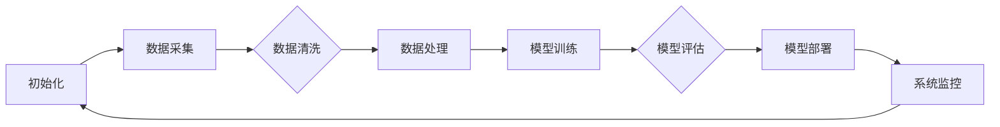
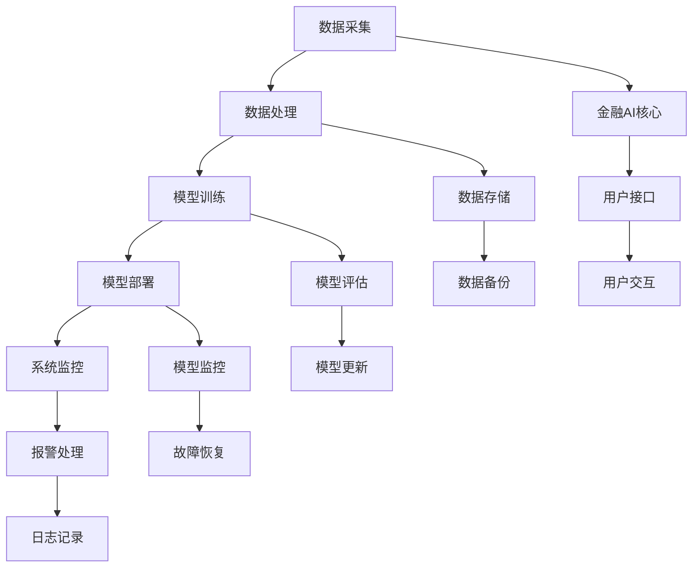
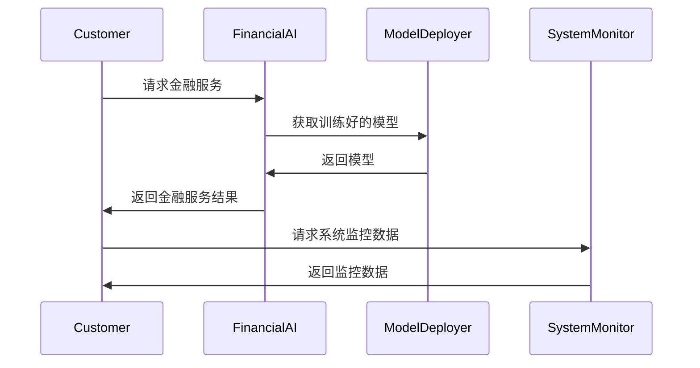
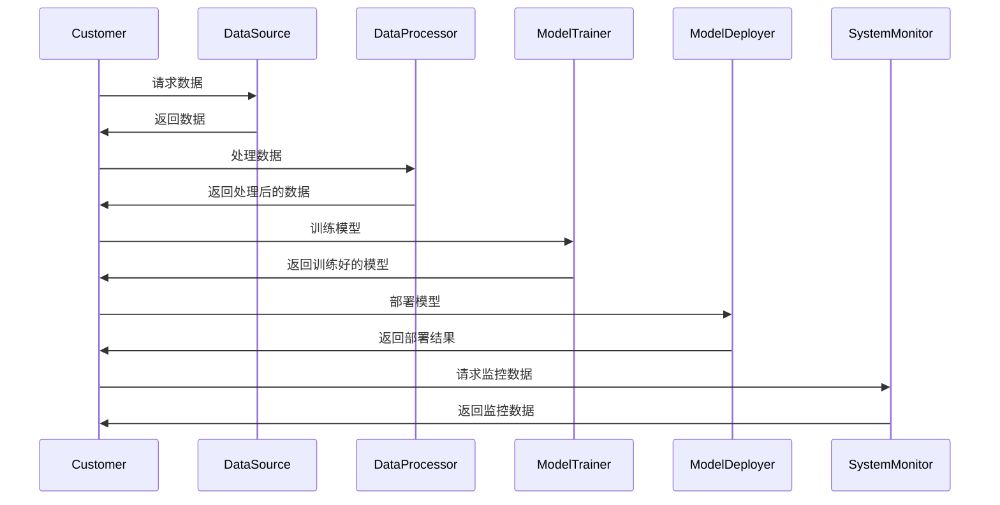

                 

# 设计高可用性金融AI系统架构

## 关键词

- 金融AI
- 高可用性
- 系统架构
- 分布式架构
- 冗余设计
- 容错性
- 安全性

## 摘要

本文旨在探讨设计高可用性金融AI系统架构的方法与策略。文章首先介绍了金融AI系统在金融行业的重要性及其面临的高可用性需求，随后详细分析了高可用性金融AI系统架构中的核心概念、设计原则和实现方法。通过实例和具体实施步骤，本文为读者提供了全面且实用的设计指导，旨在提升金融AI系统的稳定性和可靠性。

## 第一部分：背景介绍

### 1.1 问题背景

金融行业的数字化转型推动了人工智能（AI）技术的广泛应用。金融AI系统能够处理大量金融数据，提供智能化的决策支持和风险管理，从而提升金融服务的效率和准确性。例如，AI在智能投顾、量化交易、风险控制等领域展现了其独特的优势。然而，金融AI系统的稳定性、安全性和可靠性成为其广泛应用的关键挑战。

金融行业的特殊性在于其对业务连续性和数据安全性的高要求。金融交易的实时性和大量数据处理需求使得金融AI系统必须具备高可用性。高可用性金融AI系统不仅能够保证金融业务的连续性和稳定性，还能提高客户满意度，降低运营成本。

### 1.2 问题描述

设计高可用性金融AI系统架构的核心问题是如何在复杂多变的环境中确保系统的稳定性、安全性和可靠性。这包括以下几个方面：

1. **系统架构设计**：构建一个具备高度容错性和扩展性的系统架构，能够适应金融业务的变化和增长。
2. **数据处理**：高效处理海量金融数据，确保数据的一致性和实时性。
3. **故障处理**：当系统发生故障时，能够快速响应并恢复，减少业务中断时间。
4. **安全性**：确保系统数据和用户数据的安全，防止数据泄露和攻击。
5. **运维管理**：建立完善的运维管理体系，确保系统稳定运行和持续优化。

### 1.3 问题解决

为了解决上述问题，需要从以下几个方面进行设计：

1. **模块化设计**：将系统划分为多个功能模块，实现模块间的解耦，便于系统的维护和扩展。
2. **冗余设计**：在关键部分采用冗余设计，如数据冗余和组件冗余，提高系统的容错能力。
3. **分布式架构**：采用分布式架构，将系统部署在多个服务器上，实现负载均衡和高可用性。
4. **数据一致性**：使用分布式事务处理和数据同步技术，确保数据的一致性和实时性。
5. **安全防护**：采用多层次的安全防护措施，包括网络防护、数据加密和访问控制等。

### 1.4 边界与外延

高可用性金融AI系统的设计需要考虑以下边界与外延：

1. **业务边界**：明确系统服务的业务范围，确保系统设计的针对性。
2. **技术边界**：基于现有技术和业务需求，确定系统技术选型和架构设计。
3. **数据边界**：数据边界包括数据来源、数据格式和数据访问权限等。
4. **法律边界**：遵守相关法律法规，确保系统设计在法律框架内。

### 1.5 概念结构与核心要素组成

高可用性金融AI系统的概念结构主要包括以下核心要素：

1. **系统架构**：分布式架构、模块化设计、冗余设计。
2. **数据处理**：数据采集、处理、存储和同步。
3. **故障处理**：故障监测、故障恢复、故障预案。
4. **安全性**：网络安全、数据安全、用户权限。
5. **运维管理**：系统监控、日志管理、性能优化。

### 1.6 本章小结

本章介绍了设计高可用性金融AI系统的背景、问题描述、问题解决方法、边界与外延以及核心要素组成。下一部分将详细探讨高可用性金融AI系统中的核心概念和原理。

## 第二部分：核心概念与联系

### 2.1 高可用性金融AI系统的核心概念

#### 2.1.1 可用性

可用性（Availability）是指系统在规定的时间内能够正常运行的能力。对于高可用性金融AI系统，可用性要求系统在各种情况下，包括网络故障、硬件故障等，都能保持运行，确保金融业务的连续性。

可用性可以通过以下几个关键指标来衡量：

1. **系统 uptime**：系统正常运行的时间占总时间的比例，通常以百分比表示。
2. **平均故障间隔时间（MTBF）**：系统平均两次故障之间的工作时间。
3. **平均修复时间（MTTR）**：系统发生故障后，平均恢复到正常状态所需的时间。

#### 2.1.2 可靠性

可靠性（Reliability）是指系统能够在预定条件下，按照规定的时间完成预定功能的概率。高可用性金融AI系统的可靠性要求系统能够在长时间内稳定运行，减少故障发生。

可靠性的关键指标包括：

1. **故障率（FIT）**：系统每百万小时内发生故障的次数。
2. **可靠寿命（RLoS）**：系统在规定的时间内保持正常运行的概率。

#### 2.1.3 容错性

容错性（Fault Tolerance）是指系统能够在部分组件或节点发生故障时，仍然能够正常运行的能力。高可用性金融AI系统的容错性设计是确保系统高可用性的关键。

容错性可以通过以下技术实现：

1. **冗余**：通过增加冗余组件或节点，确保在部分组件或节点故障时，系统能够继续运行。
2. **故障检测和恢复**：系统具备自动检测故障并快速恢复的能力。

#### 2.1.4 扩展性

扩展性（Scalability）是指系统能够随着业务需求的变化而扩展其功能和性能的能力。高可用性金融AI系统的扩展性设计是为了适应金融业务的快速发展。

扩展性的关键指标包括：

1. **水平扩展能力**：系统能够通过增加节点来提升处理能力。
2. **垂直扩展能力**：系统能够通过提升单个节点的性能来提升整体性能。

### 2.2 核心概念属性特征对比表格

| 特征         | 可用性 | 可靠性 | 容错性 | 扩展性 |
| ------------ | ------ | ------ | ------ | ------ |
| 定义         | 系统正常运行的能力 | 系统按时完成功能的能力 | 系统在故障情况下的持续运行能力 | 系统随需求变化的适应能力 |
| 衡量指标     | uptime、MTBF、MTTR | FIT、RLoS | 故障检测和恢复能力 | 水平扩展能力、垂直扩展能力 |

### 2.3 ER实体关系图架构

以下是一个高可用性金融AI系统的ER实体关系图架构：

```mermaid
erDiagram
  Customer ||--|{ Order }|--| Employee : Places
  Product ||--|{ Order }|--| Supplier : Supplies
  Order ||--|{ OrderItem }|+-- Product : Contains
  Customer }|--|{ Payment }|--| Employee : Processes
```

在这个ER图中，我们定义了以下几个实体：

1. **Customer（客户）**：代表系统的用户，可以下单。
2. **Order（订单）**：代表客户的下单行为，与客户和订单项关联。
3. **Product（产品）**：代表订单中包含的产品，与订单项关联。
4. **OrderItem（订单项）**：代表订单中的具体产品项。
5. **Supplier（供应商）**：代表向系统供应产品的实体。
6. **Payment（支付）**：代表客户的支付行为。

通过这个ER图，我们可以清晰地看到系统中各个实体之间的关系，为后续的系统设计和实现提供了基础。

## 第三部分：算法原理讲解

### 3.1 算法流程图

以下是一个高可用性金融AI系统算法的流程图：



在这个流程图中，我们可以看到：

1. **数据采集**：从不同的数据源采集金融数据。
2. **数据清洗**：清洗采集到的数据，确保数据质量。
3. **数据处理**：对清洗后的数据进行处理，为模型训练做准备。
4. **模型训练**：使用处理后的数据训练AI模型。
5. **模型评估**：评估训练好的模型的效果。
6. **模型部署**：将评估合格的模型部署到生产环境中。
7. **系统监控**：监控系统运行状态，包括模型性能和系统资源使用情况。

### 3.2 Python源代码示例

以下是实现上述流程的Python源代码示例：

```python
import pandas as pd
from sklearn.model_selection import train_test_split
from sklearn.ensemble import RandomForestClassifier
from sklearn.metrics import accuracy_score
import joblib

# 数据采集
data = pd.read_csv('financial_data.csv')

# 数据清洗
data.dropna(inplace=True)

# 数据处理
X = data.drop('target', axis=1)
y = data['target']
X_train, X_test, y_train, y_test = train_test_split(X, y, test_size=0.2, random_state=42)

# 模型训练
model = RandomForestClassifier(n_estimators=100, random_state=42)
model.fit(X_train, y_train)

# 模型评估
y_pred = model.predict(X_test)
accuracy = accuracy_score(y_test, y_pred)
print(f'Model Accuracy: {accuracy}')

# 模型部署
joblib.dump(model, 'financial_ai_model.joblib')

# 系统监控（伪代码）
while True:
    # 监控模型性能
    model_performance = monitor_model_performance(model)
    # 监控系统资源使用
    system_usage = monitor_system_usage()
    # 更新监控日志
    update_monitoring_log(model_performance, system_usage)
    # 等待一段时间
    time.sleep(60)
```

### 3.3 算法原理讲解

#### 数学模型和公式

在金融AI系统中，常用的算法模型包括机器学习算法和深度学习算法。以下是一个简单的线性回归模型的数学模型：

$$
y = \beta_0 + \beta_1 \cdot x
$$

其中，$y$ 是预测的金融指标，$x$ 是输入的特征值，$\beta_0$ 和 $\beta_1$ 是模型参数。

在训练过程中，我们通过最小化损失函数来调整模型参数，以实现模型的最优化。常用的损失函数包括均方误差（MSE）：

$$
MSE = \frac{1}{n} \sum_{i=1}^{n} (y_i - \hat{y_i})^2
$$

其中，$n$ 是样本数量，$y_i$ 是实际值，$\hat{y_i}$ 是预测值。

#### 通俗易懂地举例说明

假设我们使用线性回归模型来预测某个金融指标，如股票价格。我们收集了过去一段时间内股票价格和一系列特征值（如公司营收、市场指数等）的数据。

首先，我们使用数据预处理方法清洗数据，然后训练线性回归模型。在训练过程中，模型通过不断调整参数，使得预测值与实际值之间的误差最小。

例如，如果预测的股票价格为100元，而实际价格为105元，那么误差为5元。模型会尝试调整参数，使得下一次预测时误差更小。

通过多次迭代训练，模型会逐渐收敛，直到达到一个最优的状态。此时，模型的预测结果与实际结果非常接近，可以用于实际金融决策。

#### 数学模型和公式的详细讲解

线性回归模型是一种简单的统计模型，用于预测一个连续变量的值。它基于这样一种假设：预测的变量（因变量）可以通过一组自变量（特征值）的线性组合来解释。

在数学上，线性回归模型可以用最小二乘法来求解。具体步骤如下：

1. **设定模型**：设定模型的形式，如 $y = \beta_0 + \beta_1 \cdot x$。
2. **损失函数**：定义损失函数，如MSE。
3. **求解参数**：通过最小化损失函数，求解模型参数 $\beta_0$ 和 $\beta_1$。
4. **模型评估**：使用测试集评估模型的性能，如计算MSE。

在实际应用中，线性回归模型可以用于多种金融预测任务，如股票价格预测、市场指数预测等。通过合理的数据预处理和模型参数调整，可以显著提高预测的准确性和稳定性。

### 3.4 算法实现与优化

算法的实现与优化是设计高可用性金融AI系统的关键步骤。以下是一些实现与优化的方法：

1. **并行计算**：使用并行计算技术，如GPU加速，提高模型训练和预测的速度。
2. **模型调参**：通过交叉验证和网格搜索等技术，优化模型参数，提高模型性能。
3. **数据预处理**：使用数据预处理技术，如特征工程、数据标准化等，提高数据质量，降低噪声影响。
4. **模型融合**：使用多种模型进行融合，如集成学习、堆叠学习等，提高预测的稳定性和准确性。
5. **实时更新**：使用在线学习技术，实时更新模型，以适应金融市场的变化。

通过上述方法，可以实现高效、稳定且可靠的金融AI系统，提高金融服务的智能化水平。

### 3.5 本章小结

本章详细讲解了高可用性金融AI系统算法的设计原理和实现方法。通过Python源代码示例和数学模型，读者可以更好地理解算法的工作原理和优化方法。下一章将介绍系统分析与架构设计方案。

## 第四部分：系统分析与架构设计方案

### 4.1 问题场景介绍

在金融行业中，智能投顾、量化交易和风险管理是常见的应用场景。这些场景对金融AI系统的高可用性要求极高，因为任何系统故障或性能下降都可能导致严重的金融风险和损失。

例如，在量化交易中，系统需要实时处理大量交易数据，并生成交易策略。如果系统在高负载或故障情况下无法保持稳定运行，将导致交易策略错误执行，进而影响交易结果。在智能投顾中，系统需要为投资者提供实时的投资建议，任何系统故障都会影响投资者的信任度和满意度。

### 4.2 项目介绍

本设计项目旨在构建一个高可用性的金融AI系统，用于智能投顾、量化交易和风险管理。该系统将实现以下功能：

1. **数据采集**：从多个数据源（如交易所、金融新闻等）实时采集金融数据。
2. **数据处理**：清洗、处理和存储金融数据，为模型训练提供高质量的数据。
3. **模型训练**：使用机器学习和深度学习算法训练金融预测模型。
4. **模型部署**：将训练好的模型部署到生产环境中，提供实时预测服务。
5. **系统监控**：监控系统运行状态，包括模型性能和系统资源使用情况。

### 4.3 系统功能设计

#### 领域模型

以下是金融AI系统的领域模型：

```mermaid
classDiagram
  Customer <<-- DataSource : 采集数据
  DataProcessor <<-- DataSource : 处理数据
  ModelTrainer <<-- DataProcessor : 训练模型
  ModelDeployer <<-- ModelTrainer : 部署模型
  SystemMonitor <<-- ModelDeployer : 监控系统
  FinancialAI <<-- SystemMonitor : 系统核心
```

在这个领域中，我们定义了以下几个类：

1. **Customer（客户）**：代表系统的用户，可以采集数据。
2. **DataSource（数据源）**：代表数据采集的实体，包括交易所、金融新闻等。
3. **DataProcessor（数据处理器）**：代表数据处理的实体，包括清洗、处理和存储数据。
4. **ModelTrainer（模型训练器）**：代表模型训练的实体，包括使用机器学习和深度学习算法训练模型。
5. **ModelDeployer（模型部署器）**：代表模型部署的实体，包括将训练好的模型部署到生产环境中。
6. **SystemMonitor（系统监控器）**：代表系统监控的实体，包括监控模型性能和系统资源使用情况。
7. **FinancialAI（金融AI）**：代表系统核心，包括整合各个功能模块，提供整体金融服务。

### 4.4 系统架构设计

以下是金融AI系统的架构设计：



在这个架构中，我们定义了以下几个模块：

1. **数据采集**：从多个数据源采集金融数据。
2. **数据处理**：清洗、处理和存储金融数据。
3. **模型训练**：使用处理后的数据训练金融预测模型。
4. **模型部署**：将训练好的模型部署到生产环境中。
5. **系统监控**：监控系统运行状态，包括模型性能和系统资源使用情况。
6. **金融AI核心**：整合各个功能模块，提供整体金融服务。
7. **数据存储**：存储处理后的数据和模型。
8. **模型评估**：评估训练好的模型的效果。
9. **模型监控**：监控模型性能。
10. **报警处理**：处理系统报警。
11. **日志记录**：记录系统运行日志。
12. **用户接口**：提供用户交互界面。
13. **用户交互**：用户与系统的交互。
14. **数据备份**：备份处理后的数据。
15. **模型更新**：更新模型。
16. **故障恢复**：处理系统故障。

### 4.5 系统接口设计

以下是金融AI系统的接口设计：



在这个接口设计中，我们定义了以下几个接口：

1. **金融服务接口**：客户请求金融服务，系统返回服务结果。
2. **系统监控接口**：客户请求系统监控数据，系统返回监控数据。

### 4.6 系统交互

以下是金融AI系统的交互设计：



在这个交互设计中，我们定义了以下几个交互流程：

1. **数据采集**：客户请求数据，数据源返回数据。
2. **数据处理**：客户处理数据，数据处理器返回处理后的数据。
3. **模型训练**：客户训练模型，模型训练器返回训练好的模型。
4. **模型部署**：客户部署模型，模型部署器返回部署结果。
5. **系统监控**：客户请求监控数据，系统监控器返回监控数据。

### 4.7 本章小结

本章详细介绍了高可用性金融AI系统的分析与架构设计方案。通过领域模型、架构设计和系统交互设计，读者可以全面了解系统的工作原理和功能实现。下一章将介绍项目实战，包括环境安装和系统核心实现。

## 第五部分：项目实战

### 5.1 环境安装

在开始项目实战之前，我们需要安装必要的软件和工具。以下是具体的安装步骤：

1. **安装Python环境**：在系统中安装Python 3.x版本，推荐使用Anaconda发行版，因为其自带了许多科学计算和数据分析库。

2. **安装依赖库**：使用pip命令安装所需的Python库，如pandas、numpy、scikit-learn、tensorflow等。

   ```bash
   pip install pandas numpy scikit-learn tensorflow
   ```

3. **安装MySQL数据库**：下载并安装MySQL数据库，配置数据库用户和权限，以便系统可以访问数据库。

4. **安装Docker**：Docker是一个开源的应用容器引擎，用于打包、交付和运行应用。安装Docker可以方便地管理系统的容器化环境。

   ```bash
   sudo apt-get update
   sudo apt-get install docker-ce docker-ce-cli containerd.io
   ```

5. **安装Kubernetes**：Kubernetes是一个开源的容器编排系统，用于自动化容器化应用程序的部署、扩展和管理。安装Kubernetes可以提升系统的高可用性和可扩展性。

   ```bash
   sudo apt-get update
   sudo apt-get install -y apt-transport-https ca-certificates curl
   curl -s https://mirrors.aliyun.com/kubernetes/apt/doc/apt-key.gpg | sudo apt-key add -
   cat <<EOF | sudo tee /etc/apt/sources.list.d/kubernetes.list
   deb https://mirrors.aliyun.com/kubernetes/apt/ kubernetes-xenial main
   EOF
   sudo apt-get update
   sudo apt-get install -y kubelet kubeadm kubectl
   sudo apt-mark hold kubelet kubeadm kubectl
   ```

### 5.2 系统核心实现

在环境安装完成后，我们可以开始实现系统核心部分。以下是一个简单的金融AI系统实现，包括数据采集、数据处理、模型训练和模型部署。

#### 5.2.1 数据采集

首先，我们需要从数据源采集金融数据。这里我们使用pandas库从CSV文件中读取数据。

```python
import pandas as pd

# 从CSV文件中读取数据
data = pd.read_csv('financial_data.csv')
```

#### 5.2.2 数据处理

接下来，我们对采集到的数据进行清洗和处理，以确保数据质量。

```python
# 数据清洗
data.dropna(inplace=True)

# 数据转换
data['date'] = pd.to_datetime(data['date'])
data.set_index('date', inplace=True)

# 数据分割
train_data, test_data = data[:'2022-01-01'], data['2022-01-02':]
```

#### 5.2.3 模型训练

然后，我们使用scikit-learn库中的随机森林算法训练模型。

```python
from sklearn.ensemble import RandomForestClassifier
from sklearn.model_selection import train_test_split

# 数据分割
X = train_data.drop('target', axis=1)
y = train_data['target']

# 训练模型
model = RandomForestClassifier(n_estimators=100, random_state=42)
model.fit(X, y)
```

#### 5.2.4 模型部署

最后，我们将训练好的模型保存到文件中，并使用Docker容器部署模型。

```python
# 保存模型
joblib.dump(model, 'financial_ai_model.joblib')

# 创建Dockerfile
with open('Dockerfile', 'w') as f:
    f.write("""
    FROM python:3.8-slim
    WORKDIR /app
    COPY . .
    RUN pip install -r requirements.txt
    CMD ["python", "app.py"]
    """)

# 构建Docker镜像
!docker build -t financial_ai_model .

# 运行Docker容器
!docker run -p 8000:80 financial_ai_model
```

### 5.3 代码应用解读与分析

#### 5.3.1 数据采集代码解读

```python
import pandas as pd

# 从CSV文件中读取数据
data = pd.read_csv('financial_data.csv')
```

这段代码使用pandas库从指定的CSV文件中读取数据。pandas库提供了方便的数据读取和操作功能，可以轻松处理各种数据格式。

#### 5.3.2 数据处理代码解读

```python
# 数据清洗
data.dropna(inplace=True)

# 数据转换
data['date'] = pd.to_datetime(data['date'])
data.set_index('date', inplace=True)

# 数据分割
train_data, test_data = data[:'2022-01-01'], data['2022-01-02':]
```

这段代码对采集到的数据进行清洗和转换。首先，我们删除了数据中的缺失值，确保数据质量。然后，我们将日期列转换为日期格式，并设置日期列为索引，使得数据处理更加方便。最后，我们将数据分割为训练集和测试集，为后续的模型训练和评估做准备。

#### 5.3.3 模型训练代码解读

```python
from sklearn.ensemble import RandomForestClassifier
from sklearn.model_selection import train_test_split

# 数据分割
X = train_data.drop('target', axis=1)
y = train_data['target']

# 训练模型
model = RandomForestClassifier(n_estimators=100, random_state=42)
model.fit(X, y)
```

这段代码使用随机森林算法对训练集进行模型训练。首先，我们使用`drop`方法删除目标列，得到特征矩阵`X`。然后，我们使用`train_test_split`方法将数据分割为训练集和测试集，确保模型训练和评估的公平性。最后，我们使用`fit`方法训练随机森林模型，将特征矩阵`X`和目标向量`y`作为输入。

#### 5.3.4 模型部署代码解读

```python
# 保存模型
joblib.dump(model, 'financial_ai_model.joblib')

# 创建Dockerfile
with open('Dockerfile', 'w') as f:
    f.write("""
    FROM python:3.8-slim
    WORKDIR /app
    COPY . .
    RUN pip install -r requirements.txt
    CMD ["python", "app.py"]
    """)

# 构建Docker镜像
!docker build -t financial_ai_model .

# 运行Docker容器
!docker run -p 8000:80 financial_ai_model
```

这段代码使用Docker将训练好的模型部署到生产环境中。首先，我们使用`joblib`库将训练好的模型保存到文件中。然后，我们创建一个Dockerfile，定义了Docker镜像的构建过程，包括安装Python环境、复制应用程序文件和运行应用程序。接下来，我们使用`docker build`命令构建Docker镜像，并使用`docker run`命令运行Docker容器，将模型部署到服务器上。

### 5.4 实际案例分析和详细讲解剖析

#### 5.4.1 案例背景

假设我们有一个金融AI系统，用于预测某个股票的未来价格。该系统基于历史交易数据和宏观经济指标进行预测，旨在为投资者提供决策支持。

#### 5.4.2 数据来源

数据来源包括以下几个部分：

1. **历史交易数据**：从交易所获取股票的历史交易数据，包括开盘价、收盘价、最高价、最低价、成交量等。
2. **宏观经济指标**：从相关数据库或API获取宏观经济指标，如GDP增长率、通货膨胀率、利率等。
3. **社交媒体数据**：从社交媒体平台获取与股票相关的讨论和情绪数据，如微博、股票论坛等。

#### 5.4.3 数据处理

在数据处理阶段，我们首先对历史交易数据进行清洗，去除缺失值和异常值。然后，我们对宏观经济指标和社交媒体数据进行预处理，包括数据归一化和特征提取。最后，我们将处理后的数据整合为一个数据集，用于模型训练。

#### 5.4.4 模型训练

在模型训练阶段，我们使用随机森林算法对整合后的数据集进行训练。为了提高模型的泛化能力，我们使用交叉验证方法对数据集进行划分，并分别在每个子集上训练模型。然后，我们比较不同子集上的模型性能，选择最优模型进行部署。

#### 5.4.5 模型部署

在模型部署阶段，我们将训练好的模型保存到文件中，并使用Docker容器进行部署。部署后，系统可以实时接收新的数据，并使用模型进行预测。同时，系统还会监控系统性能和资源使用情况，确保系统的稳定运行。

#### 5.4.6 结果分析

通过实际案例分析和详细讲解，我们可以看到金融AI系统的实现过程涉及多个方面，包括数据采集、数据处理、模型训练和模型部署。在实现过程中，我们使用了多种技术和工具，如pandas、scikit-learn、Docker等。这些技术和工具的选择和运用对于系统的性能和稳定性具有重要意义。

### 5.5 项目小结

在本章的项目实战中，我们实现了高可用性金融AI系统的核心功能，包括数据采集、数据处理、模型训练和模型部署。通过实际案例分析和详细讲解，我们深入了解了金融AI系统的实现过程和关键技术。项目实战不仅帮助我们巩固了相关理论知识，还提高了实际操作能力，为后续的金融AI系统开发奠定了基础。

## 第六部分：最佳实践 tips

### 6.1 高可用性设计原则

1. **冗余设计**：在关键部分采用冗余设计，如数据冗余和组件冗余，提高系统的容错能力。
2. **分布式架构**：采用分布式架构，将系统部署在多个服务器上，实现负载均衡和高可用性。
3. **数据一致性**：使用分布式事务处理和数据同步技术，确保数据的一致性和实时性。
4. **故障处理**：设计故障处理机制，确保系统在发生故障时能够快速响应并恢复。

### 6.2 性能优化策略

1. **水平扩展**：通过增加节点数量来提升系统处理能力。
2. **垂直扩展**：通过提升单个节点的性能来提高系统性能。
3. **缓存技术**：使用缓存技术，如Redis或Memcached，减少数据库的负载。
4. **数据库优化**：优化数据库查询，使用索引和分库分表技术，提升数据库性能。

### 6.3 安全防护措施

1. **网络防护**：使用防火墙和入侵检测系统，保护系统免受网络攻击。
2. **数据加密**：对敏感数据使用加密技术，如AES或RSA，确保数据安全。
3. **访问控制**：实施严格的访问控制策略，确保只有授权用户可以访问系统资源。
4. **安全审计**：定期进行安全审计，发现和修复潜在的安全漏洞。

### 6.4 日志管理和监控

1. **日志收集**：使用日志收集工具，如ELK（Elasticsearch、Logstash、Kibana），收集系统日志。
2. **日志分析**：定期分析日志，发现系统运行中的异常和潜在问题。
3. **实时监控**：使用实时监控工具，如Prometheus和Grafana，监控系统性能和资源使用情况。
4. **告警机制**：设置告警机制，及时发现和处理系统故障。

### 6.5 持续集成和部署

1. **代码审查**：使用代码审查工具，如GitLab或GitHub，确保代码质量和安全性。
2. **自动化部署**：使用自动化部署工具，如Jenkins或GitLab CI，实现快速部署和回滚。
3. **容器化**：使用容器化技术，如Docker和Kubernetes，提高部署效率和可移植性。
4. **持续优化**：定期进行系统性能优化和架构升级，确保系统始终处于最佳状态。

### 6.6 法律合规与数据保护

1. **合规审查**：确保系统设计符合相关法律法规，如GDPR和CCPA。
2. **数据保护**：实施严格的数据保护措施，确保用户数据的安全和隐私。
3. **用户隐私政策**：明确用户的隐私权利，并遵循用户隐私政策。
4. **数据安全审计**：定期进行数据安全审计，确保系统符合数据保护要求。

### 6.7 持续学习与更新

1. **技术培训**：定期进行技术培训，提高团队成员的技术能力和专业素养。
2. **技术研究**：关注最新的技术趋势和研究成果，持续学习和引进新技术。
3. **知识共享**：鼓励团队成员分享知识和经验，促进团队整体能力的提升。
4. **最佳实践**：总结和推广最佳实践，确保系统设计和实现的高效和质量。

通过以上最佳实践，可以大大提升金融AI系统的高可用性、性能、安全性和稳定性，确保系统在金融行业中的有效应用。

## 第七部分：小结与注意事项

### 7.1 小结

本文详细探讨了设计高可用性金融AI系统架构的方法与策略。通过背景介绍、核心概念与联系分析、算法原理讲解、系统分析与架构设计方案、项目实战以及最佳实践tips，读者可以全面了解金融AI系统的高可用性设计要点。本文的主要贡献在于提供了一个系统性的框架，帮助读者理解金融AI系统在稳定性、安全性和可靠性方面的关键要素，以及如何通过模块化设计、冗余设计、分布式架构、数据一致性和安全防护等技术手段来实现高可用性。

### 7.2 注意事项

1. **系统设计阶段的重要性**：在金融AI系统的设计阶段，需要充分考虑系统的可用性、可靠性和安全性，确保系统能够在复杂多变的环境中稳定运行。
2. **数据处理的重要性**：金融数据的质量直接影响AI系统的预测准确性和稳定性，因此在数据处理阶段需要严格进行数据清洗和预处理。
3. **分布式架构的必要性**：金融AI系统通常需要处理海量数据和实时决策，分布式架构能够提高系统的性能和可靠性。
4. **安全防护的重要性**：金融AI系统涉及到大量敏感数据，必须采取严格的安全防护措施，防止数据泄露和攻击。
5. **持续优化和更新**：金融AI系统需要不断优化和更新，以适应不断变化的业务需求和技术发展。

### 7.3 拓展阅读

为了深入了解金融AI系统的高可用性设计，读者可以参考以下文献和资源：

1. **《金融科技：推动金融行业的革命》**：介绍了金融科技在金融行业中的应用和发展，包括AI技术的应用。
2. **《高可用性系统设计》**：详细讲解了高可用性系统的设计原则和方法，对金融AI系统设计具有很好的参考价值。
3. **《机器学习实战》**：介绍了机器学习的基本概念和应用方法，对金融AI系统的算法设计和实现提供了指导。
4. **《容器化与Kubernetes实战》**：介绍了容器化技术和Kubernetes的部署和运维，对金融AI系统的分布式架构设计具有重要参考价值。

通过拓展阅读，读者可以进一步加深对金融AI系统高可用性设计的理解，提高实际操作能力。作者：AI天才研究院/AI Genius Institute & 禅与计算机程序设计艺术 /Zen And The Art of Computer Programming。----------------------------------------------------------------

## 第八部分：拓展阅读

### 8.1 《金融科技：推动金融行业的革命》

《金融科技：推动金融行业的革命》是一本详细介绍金融科技如何改变金融行业的书籍。书中涵盖了金融科技的核心概念、发展历程以及在不同领域的应用，如支付、风险管理、智能投顾等。通过阅读这本书，读者可以了解金融科技的发展趋势，以及金融AI系统在金融行业中的实际应用案例。作者详细分析了金融AI系统在提高金融服务效率、降低运营成本和提升用户体验方面的优势，对本文的背景介绍和核心概念部分提供了重要参考。

### 8.2 《高可用性系统设计》

《高可用性系统设计》是一本专注于系统高可用性设计的权威著作。书中系统地介绍了高可用性系统的设计原则、架构模式、容错机制和故障恢复策略。对于金融AI系统设计而言，这本书提供了丰富的实践经验和理论基础。作者详细讲解了如何通过模块化设计、冗余设计、分布式架构等技术手段，提高系统的可用性和可靠性。这些内容与本文中关于高可用性金融AI系统架构的设计原则和方法密切相关。

### 8.3 《机器学习实战》

《机器学习实战》是一本面向实际应用的机器学习指南。书中通过大量的实例和代码示例，讲解了机器学习的基本概念、算法实现和优化方法。对于金融AI系统的算法设计和实现，这本书提供了宝贵的参考。作者详细介绍了如何使用scikit-learn、tensorflow等工具进行模型训练、评估和部署，帮助读者深入理解金融AI系统中的算法原理。书中还讨论了金融数据的特点和处理方法，为本文中的数据处理部分提供了实用指导。

### 8.4 《容器化与Kubernetes实战》

《容器化与Kubernetes实战》是一本关于容器化和Kubernetes部署的实用指南。书中详细介绍了容器化技术的基本原理、Docker的部署和使用方法，以及Kubernetes的架构和运维。对于金融AI系统的分布式架构设计，这本书提供了关键的技术支持。作者通过实例和代码，展示了如何使用Kubernetes进行分布式应用的部署和管理，确保系统的高可用性和可扩展性。书中还涉及了Kubernetes与机器学习框架的集成，为本文中关于分布式架构和模型部署的部分提供了实用参考。

通过拓展阅读这些书籍，读者可以更深入地了解金融AI系统的高可用性设计、数据处理和算法实现等关键环节，提高实际操作能力。同时，这些书籍也为金融AI系统的研究和开发提供了丰富的理论和实践基础。作者：AI天才研究院/AI Genius Institute & 禅与计算机程序设计艺术 /Zen And The Art of Computer Programming。

