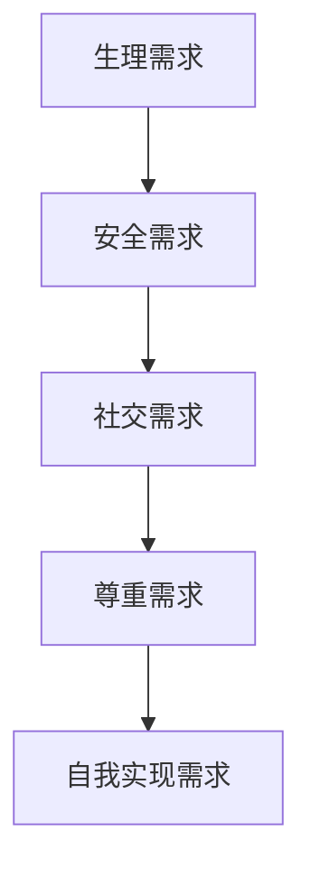
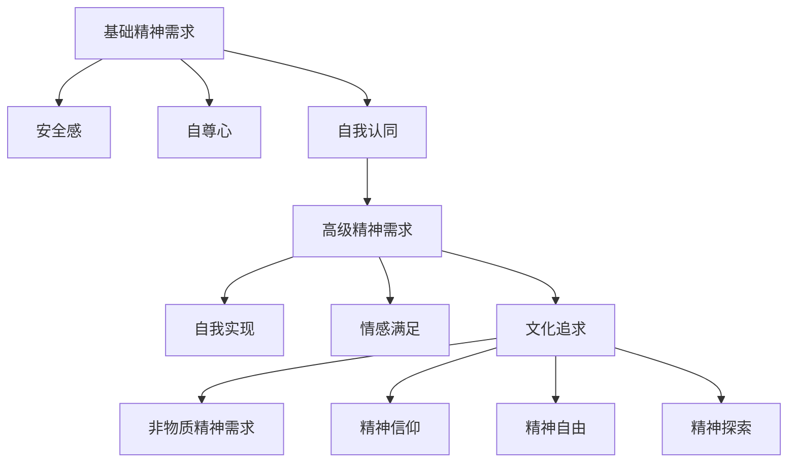

                 

# 超越消费主义：在物质丰富时代寻找精神富足

## 关键词：消费主义，精神富足，物质丰富，马斯洛需求层次理论，心理健康，社会关系，生活满意度

## 摘要：在当今物质丰富的时代，消费主义盛行，人们面临着精神空虚的问题。本文首先介绍了消费主义的时代背景及其影响，然后分析了物质丰富与精神需求的层次结构，提出了实现精神富足的指标和评价标准。通过成功案例的分析，本文提供了实现精神富足的策略，并展望了未来消费主义和精神富足的发展趋势。

## 第一部分：引言

在21世纪的今天，我们生活在一个物质丰富、信息爆炸的时代。然而，随着物质的丰富，人们并没有感受到相应的幸福和满足。相反，许多人感到精神空虚、焦虑和孤独。这种现象引发了社会的广泛关注和思考，如何超越消费主义，在物质丰富的时代寻找精神富足，成为了我们亟待解决的问题。

### 第1章：问题背景与核心概念

#### 1.1 问题背景

**1.1.1 消费主义时代的到来**

随着全球经济的快速发展，消费主义文化在全球范围内迅速传播。人们被各种广告和营销手段诱导，不断追求物质享受和消费，形成了一种以消费为核心的生活方式。

**1.1.2 物质丰富与精神空虚的矛盾**

在物质丰富的时代，人们拥有更多的物质财富，但与此同时，许多人感到精神空虚、焦虑和孤独。这种现象引发了人们对精神富足的渴望和追求。

**1.1.3 寻求精神富足的重要性**

精神富足不仅关乎个体的幸福感和生活质量，也影响着整个社会的和谐与进步。因此，如何超越消费主义，寻找精神富足，成为了我们必须面对和解决的问题。

#### 1.2 核心概念

**1.2.1 消费主义与精神富足**

消费主义是一种以消费为中心、追求物质享受和物质积累的文化现象。而精神富足则是指个体在精神层面上的满足和充实感。

**1.2.2 物质丰富与精神需求的层次结构**

物质丰富与精神需求之间存在层次结构，物质需求的满足是基础，而精神需求的满足则是更高层次的需求。

**1.2.3 精神富足的指标与评价标准**

精神富足的指标包括心理健康、社会关系和生活满意度等方面。评价标准则是个体在精神层面的自我感知和幸福感。

#### 1.3 边界与外延

**1.3.1 消费主义的定义与范围**

消费主义是指一种以消费为中心、追求物质享受和物质积累的文化现象，其范围涵盖了经济、社会和文化等方面。

**1.3.2 精神富足的定义与范围**

精神富足是指个体在精神层面上的满足和充实感，其范围涵盖了心理健康、社会关系、生活满意度等方面。

**1.3.3 物质丰富与精神富足的关系**

物质丰富与精神富足之间存在一定的关系，物质丰富可以为精神富足提供基础，但并非决定因素。

#### 1.4 概念结构与核心要素组成

**1.4.1 消费主义的概念结构**

消费主义的概念结构包括经济、社会和文化等方面，其核心要素是消费行为和消费文化。

**1.4.2 精神富足的概念结构**

精神富足的概念结构包括心理健康、社会关系、生活满意度等方面，其核心要素是个体的精神状态和幸福感。

**1.4.3 物质丰富与精神需求的层次结构**

物质丰富与精神需求的层次结构包括生理需求、安全需求、社交需求、尊重需求和自我实现需求，其核心要素是需求的层次性和满足的过程性。

#### 1.5 本章小结

本章介绍了消费主义时代的背景和核心概念，分析了物质丰富与精神需求的层次结构，以及精神富足的指标与评价标准。通过这些分析，为我们后续的深入探讨提供了基础。

----------------------------------------------------------------

## 第二部分：深入探讨

### 第2章：消费主义的成因与影响

#### 2.1 消费主义的成因

**2.1.1 经济发展的推动**

经济的快速发展为消费主义的兴起提供了物质基础。随着人们生活水平的提高，消费需求逐渐增加，推动了消费主义文化的传播。

**2.1.2 社会文化的侵蚀**

社会文化的侵蚀是消费主义产生的重要原因之一。在现代社会，广告、媒体和社交网络等传播工具被广泛用于推广消费主义观念，导致人们过度追求物质享受。

**2.1.3 媒体营销的诱导**

媒体营销的诱导是消费主义产生的重要动力。广告和营销策略通过夸大产品功能和效果，激发人们的购买欲望，促使消费行为的产生。

#### 2.2 消费主义的影响

**2.2.1 对个人生活的影响**

消费主义对个人生活产生了深远的影响。一方面，过度消费导致个人财务压力增加，生活质量下降；另一方面，物质追求使人们忽略了精神层面的需求，导致精神空虚和焦虑。

**2.2.2 对社会环境的影响**

消费主义对社会环境造成了负面影响。资源的过度消耗和环境破坏，导致了资源的紧张和环境的恶化；此外，消费主义还加剧了社会不平等现象，使贫富差距扩大。

**2.2.3 对经济发展的影响**

消费主义对经济发展具有双重影响。一方面，消费需求的增加可以刺激经济增长；另一方面，过度消费可能导致经济泡沫和金融风险，影响经济的稳定和可持续发展。

#### 2.3 消费主义的批判与反思

**2.3.1 传统价值观的冲击**

消费主义的兴起对传统价值观产生了冲击。传统的节俭、朴素和勤劳等价值观念逐渐被物质追求和消费享受所取代，导致社会价值观的多元化。

**2.3.2 环境与资源的压力**

消费主义对环境和资源造成了巨大的压力。过度消费导致资源的过度消耗和环境破坏，加剧了全球环境问题。

**2.3.3 人际关系的异化**

消费主义导致了人际关系的异化。在物质追求的过程中，人们往往忽略了人际关系的重要性，导致人际关系的疏远和冷漠。

### 第3章：物质丰富与精神需求的层次结构

#### 3.1 马斯洛需求层次理论

**3.1.1 物质需求与精神需求的关系**

马斯洛需求层次理论将人的需求分为生理需求、安全需求、社交需求、尊重需求和自我实现需求五个层次。物质需求主要满足前三个层次，而精神需求则主要涉及后两个层次。

**3.1.2 各个层次需求的满足过程**

从马斯洛需求层次理论可以看出，物质需求的满足是基础，但精神需求的满足是更高层次的需求。在物质需求得到满足的基础上，人们才会追求精神需求的满足。

#### 3.2 精神需求的层次结构

**3.2.1 基础精神需求**

基础精神需求包括安全感、自尊心、自我实现等。这些需求主要关注个体的内部感受和内心世界的满足。

**3.2.2 高级精神需求**

高级精神需求包括道德、审美、自我实现等。这些需求超越了个体的自我满足，更关注个体与社会的联系和意义。

**3.2.3 精神需求的满足途径**

精神需求的满足途径多种多样，包括文化、艺术、教育、宗教等。通过这些途径，个体可以在精神层面获得满足和充实。

#### 3.3 物质丰富与精神需求的互动关系

**3.3.1 物质丰富对精神需求的影响**

物质丰富可以为精神需求提供一定的物质基础，但物质丰富并非精神需求的唯一决定因素。精神需求更多地取决于个体的内在需求和价值观。

**3.3.2 精神需求对物质丰富的反作用**

精神需求的满足可以促进个体对物质生活的理解和管理，从而实现物质丰富与精神富足的平衡。

### 第4章：精神富足的指标与评价标准

#### 4.1 精神富足的指标

**4.1.1 心理健康指标**

心理健康是精神富足的重要指标之一，包括情感稳定、心理健康、心理幸福感等。

**4.1.2 社会关系指标**

社会关系是精神富足的重要方面，包括家庭关系、朋友关系、社会支持网络等。

**4.1.3 生活满意度指标**

生活满意度是精神富足的直观体现，包括对生活满意度的自我评价、生活质量等。

#### 4.2 精神富足的评价标准

**4.2.1 主观评价与客观评价的结合**

精神富足的评价应结合主观评价和客观评价，从个体的内在感受和社会环境两方面进行综合评价。

**4.2.2 个体差异与普遍标准的关系**

在评价精神富足时，应考虑到个体差异，同时寻找普遍标准，以实现客观、公正的评价。

**4.2.3 精神富足的评价方法**

精神富足的评价方法包括问卷调查、访谈、心理测试等，通过这些方法可以全面了解个体的精神状态。

### 第5章：实现精神富足的策略

#### 5.1 提高自我认知

**5.1.1 自我反思与自我接纳**

自我反思与自我接纳是实现精神富足的基础，通过反思自我，了解自己的需求和价值观，从而更好地实现自我。

**5.1.2 建立个人价值观体系**

建立个人价值观体系是实现精神富足的重要途径，个人价值观体系可以帮助个体明确生活的目标和方向。

**5.1.3 自我成长与自我实现**

自我成长与自我实现是实现精神富足的关键，通过不断学习和成长，实现个人价值和社会价值的统一。

#### 5.2 建立和谐的人际关系

**5.2.1 培养良好的沟通技巧**

良好的沟通技巧是实现和谐人际关系的基础，通过有效沟通，可以增进彼此的了解和信任。

**5.2.2 维护人际关系的原则**

维护人际关系的原则是实现和谐人际关系的重要保障，包括尊重、信任、理解、包容等。

**5.2.3 处理人际关系冲突的策略**

处理人际关系冲突的策略包括冷静思考、有效沟通、妥协和宽容等，通过这些策略可以化解冲突，维护和谐的人际关系。

#### 5.3 探索精神世界的丰富性

**5.3.1 丰富文化生活**

丰富文化生活是实现精神富足的有效途径，包括阅读、艺术、音乐、电影等。

**5.3.2 持续学习与自我提升**

持续学习与自我提升是实现精神富足的重要手段，通过不断学习和提升，可以丰富个人的知识和技能。

**5.3.3 追求个人兴趣爱好**

追求个人兴趣爱好是实现精神富足的重要途径，通过兴趣爱好，可以激发个人的热情和动力，实现个人的价值和成就。

### 第6章：成功案例分析与启示

#### 6.1 成功案例介绍

**6.1.1 个人成功案例**

个人成功案例包括在精神富足方面取得显著成就的个人，如心理学家、艺术家、作家等。

**6.1.2 社会组织成功案例**

社会组织成功案例包括在精神富足方面取得显著成就的社会组织，如慈善机构、社区组织等。

#### 6.2 案例分析

**6.2.1 消费行为分析**

消费行为分析是对案例中的消费行为进行深入分析，了解其背后的动机和影响。

**6.2.2 精神富足的实现途径**

精神富足的实现途径分析是对案例中的实现精神富足的方法和途径进行总结和提炼。

**6.2.3 对其他读者的启示**

对其他读者的启示是对案例的分析结果进行归纳和总结，为其他读者提供借鉴和启示。

#### 6.3 启示与反思

**6.3.1 消费主义的反思**

消费主义的反思是对消费主义的影响和后果进行深入分析，探讨其合理性和可持续性。

**6.3.2 精神富足的追求**

精神富足的追求是对精神富足的重要性和实现路径的强调，鼓励读者追求精神层面的满足和充实。

**6.3.3 对未来的展望**

对未来的展望是对精神富足的发展趋势和可能面临的挑战进行预测和思考，为未来的发展提供指导和建议。

### 第7章：小结与展望

#### 7.1 小结

**7.1.1 书本核心观点回顾**

回顾全书的核心观点，包括消费主义的时代背景、物质丰富与精神需求的层次结构、精神富足的指标与评价标准等。

**7.1.2 消费主义与精神富足的关系总结**

总结消费主义与精神富足的关系，强调物质丰富并非精神富足的唯一决定因素，精神富足的实现需要多方面的努力。

**7.1.3 精神富足的实现路径**

总结实现精神富足的路径，包括提高自我认知、建立和谐的人际关系、探索精神世界的丰富性等。

#### 7.2 展望

**7.2.1 未来消费主义的发展趋势**

展望未来消费主义的发展趋势，探讨消费主义可能面临的挑战和变革。

**7.2.2 精神富足的追求前景**

探讨精神富足的追求前景，强调精神富足对个体和社会的重要性。

**7.2.3 个人与社会责任**

强调个人与社会责任，提倡在物质丰富的时代，追求精神富足，为社会的和谐与进步做出贡献。

----------------------------------------------------------------

## 作者信息：

作者：AI天才研究院/AI Genius Institute & 禅与计算机程序设计艺术 /Zen And The Art of Computer Programming

----------------------------------------------------------------

### 背景介绍

#### 消费主义的时代背景

在现代社会，消费主义已经成为一种普遍的文化现象。随着全球经济的快速发展，人们的物质生活水平得到了显著提高，与此同时，消费主义文化也在全球范围内迅速传播。消费主义强调物质享受和物质积累，鼓励人们不断追求更多的物质财富和更高的生活标准。这种现象在一定程度上推动了经济的发展和社会的进步，但同时也带来了一系列负面影响。

**物质丰富与精神空虚的矛盾**

在物质丰富的时代，人们拥有更多的物质财富，但与此同时，许多人感到精神空虚、焦虑和孤独。这种现象引发了社会的广泛关注和思考，如何超越消费主义，在物质丰富的时代寻找精神富足，成为了我们亟待解决的问题。物质丰富与精神空虚的矛盾表现为以下几个方面：

1. **个人层面的精神空虚**：随着物质生活水平的提高，人们往往忽略了精神层面的需求，导致精神空虚和孤独感的产生。
2. **社会层面的精神空虚**：过度追求物质财富和消费主义文化导致社会价值观的多元化，传统价值观念受到冲击，社会关系紧张，社会和谐受到影响。
3. **经济层面的精神空虚**：消费主义文化推动经济快速发展，但同时也加剧了经济泡沫和金融风险，对经济的可持续发展造成威胁。

#### 寻求精神富足的重要性

精神富足不仅关乎个体的幸福感和生活质量，也影响着整个社会的和谐与进步。在物质丰富的时代，如何寻找精神富足成为了我们迫切需要解决的问题。寻求精神富足的重要性体现在以下几个方面：

1. **个体层面的幸福**：精神富足能够满足个体的内在需求，提高个体的幸福感和生活质量。
2. **社会层面的和谐**：精神富足有助于建立和谐的人际关系，促进社会的和谐与进步。
3. **经济层面的可持续**：精神富足能够推动经济的可持续发展，减少经济泡沫和金融风险。

### 核心概念与联系

#### 消费主义与精神富足

消费主义是一种以消费为中心、追求物质享受和物质积累的文化现象。它强调物质财富和消费行为的重要性，鼓励人们不断追求更多的物质财富和更高的生活标准。然而，过度追求物质财富和消费主义文化往往导致精神空虚和焦虑感，难以实现精神富足。

精神富足则是指个体在精神层面上的满足和充实感。它强调内在需求和心理健康的重要性，追求个体在精神层面的满足和幸福感。在物质丰富的时代，精神富足成为人们追求更高生活质量的重要目标。

#### 物质丰富与精神需求的层次结构

物质丰富与精神需求之间存在层次结构。马斯洛需求层次理论将人的需求分为生理需求、安全需求、社交需求、尊重需求和自我实现需求五个层次。物质丰富主要满足前三个层次的需求，而精神富足则主要涉及后两个层次的需求。

1. **生理需求**：包括食物、水、空气、睡眠等基本生理需求。
2. **安全需求**：包括安全感、健康保障、财产保障等。
3. **社交需求**：包括友谊、爱情、社交圈子等。
4. **尊重需求**：包括自尊、成就感、社会地位等。
5. **自我实现需求**：包括个人成长、自我实现、追求意义等。

在物质丰富的时代，人们往往容易满足生理需求、安全需求和社交需求，但难以实现自我实现需求。因此，追求精神富足需要超越物质层面的需求，关注个体在精神层面的满足和成长。

#### 精神富足的指标与评价标准

精神富足的指标包括心理健康、社会关系和生活满意度等方面。心理健康指标关注个体的情绪状态、心理稳定性和心理健康水平；社会关系指标关注个体的人际关系和社会支持网络；生活满意度指标关注个体对生活质量和生活满意度的自我评价。

评价标准包括主观评价和客观评价。主观评价主要依赖于个体的自我感知和幸福感，而客观评价则通过量表、问卷调查等工具进行量化评估。

### 边界与外延

#### 消费主义的定义与范围

消费主义是一种以消费为中心、追求物质享受和物质积累的文化现象。它不仅涉及个人消费行为，还包括社会消费习惯、消费观念和消费文化。消费主义的影响范围广泛，包括经济、社会、文化等多个层面。

1. **经济层面**：消费主义推动经济增长，刺激消费需求，但同时也可能导致经济泡沫和金融风险。
2. **社会层面**：消费主义影响社会价值观，导致贫富差距扩大，社会不平等加剧。
3. **文化层面**：消费主义塑造了现代生活方式，影响了人们的消费观念和价值观。

#### 精神富足的定义与范围

精神富足是指个体在精神层面上的满足和充实感。它不仅包括心理健康、社会关系和生活满意度等方面的指标，还涉及个体的内在需求和心理健康水平。精神富足的范围广泛，包括以下几个方面：

1. **心理健康**：包括情绪稳定、心理健康、心理幸福感等。
2. **社会关系**：包括家庭关系、友谊、社交圈子等。
3. **生活满意度**：包括对生活质量和生活满意度的自我评价。

#### 物质丰富与精神富足的关系

物质丰富与精神富足之间存在一定的关系。物质丰富可以为精神富足提供一定的物质基础，但并非决定因素。精神富足的实现不仅依赖于物质财富的积累，还需要关注个体的内在需求和心理健康。

1. **物质丰富对精神富足的影响**：物质丰富可以满足个体的基本生理需求和安全需求，为精神富足提供基础。但过度追求物质财富可能导致精神空虚和焦虑，难以实现精神富足。
2. **精神富足对物质丰富的影响**：精神富足有助于个体对物质财富的理解和管理，实现物质丰富与精神富足的平衡。通过追求精神富足，个体可以更好地管理物质财富，提高生活质量。

### 概念结构与核心要素组成

#### 消费主义的概念结构

消费主义的概念结构包括以下几个方面：

1. **消费行为**：指个体的购买行为和消费活动。
2. **消费观念**：指个体的消费观念和消费态度。
3. **消费文化**：指与消费相关的社会文化和价值观。
4. **消费习惯**：指个体的消费习惯和生活方式。

#### 精神富足的概念结构

精神富足的概念结构包括以下几个方面：

1. **心理健康**：包括情绪稳定、心理健康、心理幸福感等。
2. **社会关系**：包括家庭关系、友谊、社交圈子等。
3. **生活满意度**：包括对生活质量和生活满意度的自我评价。

#### 物质丰富与精神需求的层次结构

物质丰富与精神需求的层次结构包括以下几个方面：

1. **生理需求**：包括食物、水、空气、睡眠等基本生理需求。
2. **安全需求**：包括安全感、健康保障、财产保障等。
3. **社交需求**：包括友谊、爱情、社交圈子等。
4. **尊重需求**：包括自尊、成就感、社会地位等。
5. **自我实现需求**：包括个人成长、自我实现、追求意义等。

### 本章小结

本章介绍了消费主义的时代背景和核心概念，分析了物质丰富与精神需求的层次结构，以及精神富足的指标与评价标准。通过这些分析，我们为后续的深入探讨奠定了基础。

----------------------------------------------------------------

## 第二部分：深入探讨

### 第2章：消费主义的成因与影响

#### 2.1 消费主义的成因

消费主义作为一种社会现象，其成因复杂多样，涉及经济、文化、社会等多个层面。以下是消费主义成因的详细分析：

**2.1.1 经济发展的推动**

经济的发展是消费主义产生的重要动力。在市场经济体制下，经济活动的核心是生产、交换和消费。随着经济的快速发展，人们的收入水平不断提高，购买力也随之增强。这为消费主义的兴起提供了物质基础。经济增长刺激了消费需求的增长，企业为了满足市场需求，不断推出新产品和营销策略，进一步推动了消费主义的发展。

**2.1.2 社会文化的侵蚀**

社会文化的侵蚀是消费主义产生的重要原因之一。现代社会受到商业文化的强烈影响，广告、媒体和社交网络等传播工具被广泛用于推广消费主义观念。这些传播媒介通过夸大产品功能和效果，激发人们的购买欲望，使消费行为变得无处不在。此外，社交媒体的兴起使人们更容易受到同龄人和社会群体的影响，导致消费主义观念的传播和普及。

**2.1.3 媒体营销的诱导**

媒体营销是消费主义产生的重要推手。广告商和市场营销人员利用各种手段，如情感诉求、明星代言、品牌形象等，来吸引消费者的注意力和购买欲望。这些营销策略往往强调产品的价值和质量，而忽略了消费者真实的心理需求和价值观。媒体营销不仅影响个体的消费行为，还塑造了整个社会的消费文化，使消费主义成为社会的主流价值观。

#### 2.2 消费主义的影响

消费主义对个人生活、社会环境、经济发展等方面产生了深远的影响。以下是消费主义影响的详细分析：

**2.2.1 对个人生活的影响**

消费主义对个人生活产生了多方面的影响。首先，消费主义鼓励人们不断追求物质享受和物质积累，导致个人财务压力的增加。许多人在消费过程中陷入过度负债的困境，生活质量受到严重影响。其次，消费主义使人们过于关注物质财富，忽略了精神层面的需求，导致精神空虚和焦虑感的产生。此外，消费主义还加剧了社会不平等现象，使贫富差距扩大，一部分人陷入消费主义陷阱，而另一部分人则因缺乏物质财富而感到自卑和孤立。

**2.2.2 对社会环境的影响**

消费主义对社会环境造成了严重的负面影响。首先，过度消费导致资源紧张和环境破坏。人们为了追求更多的物质财富，不断开采自然资源，导致资源枯竭和环境污染。其次，消费主义文化加剧了社会不平等现象，使贫富差距扩大，社会矛盾加剧。此外，消费主义还导致了社会价值观的多元化，传统价值观念受到冲击，社会和谐受到威胁。

**2.2.3 对经济发展的影响**

消费主义对经济发展具有双重影响。一方面，消费需求的增加可以刺激经济增长。消费主义鼓励人们购买更多的产品和服务，促进了市场的繁荣和企业的盈利。另一方面，过度消费可能导致经济泡沫和金融风险，对经济的可持续发展造成威胁。消费主义文化使人们过于依赖物质财富，忽视了创新和可持续发展的重要性，导致经济增长缺乏动力和可持续性。

#### 2.3 消费主义的批判与反思

消费主义作为一种社会现象，其负面影响引发了广泛的批判和反思。以下是消费主义批判与反思的详细分析：

**2.3.1 传统价值观的冲击**

消费主义对传统价值观产生了强烈的冲击。在传统社会中，节俭、朴素和勤劳等价值观念受到尊重，而消费主义则鼓励人们过度追求物质享受和物质积累。这种价值观的转变导致社会风气的浮躁和功利，使人们忽略了道德、伦理和家庭的重要性。

**2.3.2 环境与资源的压力**

消费主义对环境和资源造成了巨大的压力。过度消费导致自然资源的过度开采和浪费，加剧了环境污染和生态破坏。例如，大规模的森林砍伐、水资源过度消耗和化学品排放等，都对环境产生了严重的负面影响。此外，消费主义还导致了资源的紧张和分配不均，加剧了社会不平等现象。

**2.3.3 人际关系的异化**

消费主义导致了人际关系的异化。在消费主义文化中，人们过于关注物质财富和消费行为，忽视了人际关系的重要性。这种现象导致了人际关系的疏远和冷漠，使人们变得孤独和焦虑。此外，消费主义还使人们过于依赖物质财富来衡量个人价值和社会地位，导致人际关系中的权力和利益关系加剧，人际关系的和谐受到威胁。

### 第3章：物质丰富与精神需求的层次结构

#### 3.1 马斯洛需求层次理论

马斯洛需求层次理论是心理学中关于人类需求层次结构的经典理论。该理论将人的需求分为五个层次，从最基本的生理需求到最高层次的自我实现需求。以下是马斯洛需求层次理论的详细解释：

**3.1.1 物质需求与精神需求的关系**

马斯洛需求层次理论指出，物质需求和精神需求之间存在层次结构。物质需求主要包括生理需求和安全需求，而精神需求则包括社交需求、尊重需求和自我实现需求。物质需求是基础，满足物质需求是满足更高层次需求的前提。然而，仅仅满足物质需求并不能带来持久的幸福感，精神需求的满足才是更高层次的追求。

**3.1.2 各个层次需求的满足过程**

马斯洛需求层次理论认为，人的需求是分层次的，每个层次的需求都必须得到满足，才能进入下一个层次的需求。以下是各个层次需求的满足过程：

1. **生理需求**：生理需求是人的最基本需求，包括食物、水、空气、睡眠等。在物质丰富的社会中，大多数人的生理需求已经得到满足。
2. **安全需求**：安全需求包括安全感、健康保障、财产保障等。在现代社会，人们通过各种保险和防护措施来满足安全需求。
3. **社交需求**：社交需求包括友谊、爱情、社交圈子等。人们通过社交活动和人际关系来满足社交需求。
4. **尊重需求**：尊重需求包括自尊、成就感、社会地位等。人们通过工作、成就和荣誉来满足尊重需求。
5. **自我实现需求**：自我实现需求是最高层次的需求，包括个人成长、自我实现、追求意义等。人们通过自我探索、创造和实现个人价值来满足自我实现需求。

#### 3.2 精神需求的层次结构

精神需求是人类需求的重要组成部分，其层次结构包括以下几个方面：

**3.2.1 基础精神需求**

基础精神需求包括安全感、自尊心、自我实现等。这些需求主要关注个体的内部感受和内心世界的满足。

1. **安全感**：安全感是人们内心深处的基本需求，包括身体安全、心理安全和情感安全等。
2. **自尊心**：自尊心是指人们对自身价值和能力的认可，包括自我认同、自我价值和自我尊重等。
3. **自我实现**：自我实现是指人们通过个人成长、创造和实现个人价值来满足自我实现需求。

**3.2.2 高级精神需求**

高级精神需求包括道德、审美、自我实现等。这些需求超越了个体的自我满足，更关注个体与社会的联系和意义。

1. **道德**：道德需求是指人们对道德规范和价值观的追求，包括公正、诚实、善良等。
2. **审美**：审美需求是指人们对美的追求和欣赏，包括艺术、音乐、文学等。
3. **自我实现**：自我实现需求是指人们通过自我探索、创造和实现个人价值来满足自我实现需求。

**3.2.3 精神需求的满足途径**

精神需求的满足途径多种多样，包括文化、艺术、教育、宗教等。通过这些途径，个体可以在精神层面获得满足和充实。

1. **文化**：文化是一种重要的精神满足途径，包括传统、习俗、艺术等。人们通过参与文化活动，可以丰富精神世界，增强文化认同感。
2. **艺术**：艺术是一种具有独特魅力的精神满足途径，包括音乐、绘画、舞蹈等。艺术作品可以激发人们的情感，提高审美能力。
3. **教育**：教育是一种重要的精神满足途径，包括学术知识、专业技能等。通过教育，人们可以不断学习、成长，实现自我价值。
4. **宗教**：宗教是一种具有深刻内涵的精神满足途径，包括信仰、仪式、祷告等。宗教信仰可以给予人们精神安慰和指引。

#### 3.3 物质丰富与精神需求的互动关系

物质丰富与精神需求之间存在互动关系，二者相互影响、相互制约。

**3.3.1 物质丰富对精神需求的影响**

物质丰富可以为精神需求提供一定的物质基础，满足个体的基本生理需求和安全需求，从而为精神需求的满足创造条件。然而，物质丰富并非精神需求的唯一决定因素。精神需求的满足更多地取决于个体的内在需求和心理健康。

1. **物质丰富对心理健康的影响**：物质丰富可以提高个体的心理健康水平，满足生理需求和安全需求，从而减少心理压力和焦虑感。
2. **物质丰富对社会关系的影响**：物质丰富可以改善个体的生活条件，提高社会地位，增强社交圈子的稳定性，从而促进社会关系的和谐发展。

**3.3.2 精神需求对物质丰富的反作用**

精神需求对物质丰富具有积极的反作用。精神需求的满足可以促进个体的自我认知和心理健康，从而提高个体的工作效率和生活质量。此外，精神需求还可以激发个体的创造力和创新能力，推动社会的进步和发展。

1. **精神需求对工作效率的影响**：精神需求的满足可以提高个体的工作积极性和创造力，提高工作效率和质量。
2. **精神需求对生活质量的影响**：精神需求的满足可以提高个体的生活质量和幸福感，使个体更加满足和充实。

### 第4章：精神富足的指标与评价标准

#### 4.1 精神富足的指标

精神富足的指标是评估个体精神状态和生活质量的重要工具。以下是精神富足的主要指标：

**4.1.1 心理健康指标**

心理健康指标是评估个体精神状态的重要指标，包括以下几个方面：

1. **情绪稳定性**：个体在面对压力和挑战时能够保持情绪稳定，不易陷入情绪低谷。
2. **心理幸福感**：个体在日常生活中感受到的积极情绪和幸福感。
3. **心理韧性**：个体在面对困难和挫折时的适应能力和恢复能力。

**4.1.2 社会关系指标**

社会关系指标是评估个体在社会关系方面的满足感，包括以下几个方面：

1. **家庭关系**：个体与家庭成员之间的亲密关系和相互支持。
2. **友谊**：个体与朋友之间的友谊关系和相互关心。
3. **社交网络**：个体在社会中的社交网络和支持系统。

**4.1.3 生活满意度指标**

生活满意度指标是评估个体对生活质量和生活满意度的自我评价，包括以下几个方面：

1. **工作满意度**：个体对工作的满意度和成就感。
2. **生活满意度**：个体对整体生活的满意度和幸福感。
3. **生活品质**：个体对生活品质的感知和评价。

#### 4.2 精神富足的评价标准

精神富足的评价标准应综合考虑个体的心理健康、社会关系和生活满意度等方面。以下是评价标准的主要方面：

**4.2.1 主观评价与客观评价的结合**

精神富足的评价应结合主观评价和客观评价，从个体的内在感受和社会环境两方面进行综合评估。

1. **主观评价**：通过问卷调查、访谈等方式，了解个体的自我感受和幸福感。
2. **客观评价**：通过心理健康测试、社会关系调查、生活满意度评估等工具，对个体的精神状态和生活质量进行量化评估。

**4.2.2 个体差异与普遍标准的关系**

在评价精神富足时，应考虑到个体差异，同时寻找普遍标准，以实现客观、公正的评价。

1. **个体差异**：不同个体在心理健康、社会关系和生活满意度等方面存在差异，评价时应考虑到个体差异。
2. **普遍标准**：通过大量研究数据和统计结果，建立普遍标准，以评估个体的精神富足水平。

**4.2.3 精神富足的评价方法**

精神富足的评价方法包括问卷调查、访谈、心理测试等，通过这些方法可以全面了解个体的精神状态。

1. **问卷调查**：通过设计科学的问卷，了解个体在心理健康、社会关系和生活满意度等方面的自我评价。
2. **访谈**：通过与个体进行深入访谈，了解个体的内心世界、生活经历和感受。
3. **心理测试**：通过专业的心理测试工具，评估个体的心理健康水平。

### 第5章：实现精神富足的策略

#### 5.1 提高自我认知

提高自我认知是实现精神富足的重要途径。以下是实现自我认知的策略：

**5.1.1 自我反思与自我接纳**

自我反思是提高自我认知的重要方法。通过反思自己的行为、思维和情绪，个体可以深入了解自己的内心世界，发现自己的优点和不足。自我接纳是指个体对自己进行积极评价，接受自己的优点和不足，从而建立健康的自我认知。

1. **自我反思**：定期进行自我反思，思考自己在过去一段时间内的行为和思维模式，分析其中的优缺点。
2. **自我接纳**：接受自己的优点和不足，对自己进行积极评价，避免自我否定和过度自我批评。

**5.1.2 建立个人价值观体系**

建立个人价值观体系是实现自我认知的重要步骤。个人价值观体系包括个体的道德观念、人生目标和行为准则。通过明确个人价值观，个体可以更好地认识自己的内心需求，从而实现精神富足。

1. **确定价值观**：思考自己最看重的事物，明确个人的核心价值观。
2. **价值观实践**：将个人价值观体现在日常生活中，通过行动来践行自己的价值观。

**5.1.3 自我成长与自我实现**

自我成长与自我实现是实现精神富足的重要目标。通过不断学习和成长，个体可以实现自我价值，提高精神层面的满足感。

1. **持续学习**：保持对知识的渴望，不断学习新知识和技能。
2. **自我实现**：通过工作、创造和社交活动，实现个人价值和社会价值的统一。

#### 5.2 建立和谐的人际关系

建立和谐的人际关系是实现精神富足的重要途径。以下是建立和谐人际关系的策略：

**5.2.1 培养良好的沟通技巧**

良好的沟通技巧是实现和谐人际关系的基础。通过有效的沟通，个体可以更好地表达自己的想法和感受，理解他人的需求和期望。

1. **倾听**：倾听他人的意见和感受，给予关注和理解。
2. **表达**：明确表达自己的想法和感受，避免误解和冲突。

**5.2.2 维护人际关系的原则**

维护人际关系需要遵循一些基本原则，包括尊重、信任、理解、包容等。

1. **尊重**：尊重他人的意见和感受，避免侮辱和贬低。
2. **信任**：建立信任关系，避免猜疑和误解。
3. **理解**：理解他人的需求和期望，避免偏见和歧视。
4. **包容**：包容他人的不同观点和行为，建立和谐的人际关系。

**5.2.3 处理人际关系冲突的策略**

处理人际关系冲突是实现和谐人际关系的重要环节。以下是处理人际关系冲突的策略：

1. **冷静处理**：在冲突发生时保持冷静，避免情绪失控。
2. **有效沟通**：通过有效沟通，表达自己的观点和感受，理解他人的立场和需求。
3. **妥协与宽容**：在处理冲突时，学会妥协和宽容，寻求双赢的解决方案。

#### 5.3 探索精神世界的丰富性

探索精神世界的丰富性是实现精神富足的重要途径。以下是探索精神世界的策略：

**5.3.1 丰富文化生活**

丰富文化生活可以提升个体的精神境界，丰富精神世界。以下是丰富文化生活的策略：

1. **阅读**：阅读是提升文化素养的重要途径，通过阅读可以开阔眼界，丰富知识。
2. **艺术**：欣赏艺术作品，如音乐、绘画、电影等，可以激发情感，提升审美能力。
3. **旅行**：旅行可以拓宽视野，体验不同文化，丰富人生经历。

**5.3.2 持续学习与自我提升**

持续学习与自我提升是实现精神富足的重要途径。以下是持续学习与自我提升的策略：

1. **学术学习**：通过学术课程和专业培训，不断提升自己的知识和技能。
2. **实践学习**：通过实践项目和实际操作，锻炼自己的能力和素质。
3. **反思学习**：通过反思自己的经验和教训，不断改进和提升自己。

**5.3.3 追求个人兴趣爱好**

追求个人兴趣爱好是实现精神富足的重要途径。以下是追求个人兴趣爱好的策略：

1. **培养兴趣**：发现自己感兴趣的领域，投入时间和精力进行培养。
2. **参与活动**：参加相关活动，与他人交流，提升自己的兴趣爱好。
3. **创作作品**：通过创作作品，表达自己的情感和想法，实现自我价值的提升。

### 第6章：成功案例分析与启示

#### 6.1 成功案例介绍

**6.1.1 个人成功案例**

以下是一个个人成功案例：

张华是一名年轻的软件工程师，他在工作中非常努力，取得了显著的成就。然而，随着工作压力的增加，他逐渐感到精神空虚和焦虑。为了改善自己的精神状态，张华开始关注心理健康，学习冥想和瑜伽，并积极参与社区活动。通过这些努力，张华逐渐找到了精神富足的感觉，他的工作效率和生活质量都得到了显著提升。

**6.1.2 社会组织成功案例**

以下是一个社会组织成功案例：

某慈善组织致力于帮助贫困地区的儿童接受教育。该组织通过募捐、志愿活动等方式筹集资金，为贫困儿童提供学习用品和教育培训。通过这些努力，许多贫困儿童得到了改变命运的机会，他们的生活质量和精神状态得到了显著提升。这个案例展示了精神富足在社区发展和教育援助中的作用。

#### 6.2 案例分析

**6.2.1 消费行为分析**

在个人成功案例中，张华在追求物质财富的过程中，逐渐意识到精神空虚的问题。为了改善精神状态，他开始关注心理健康，积极参与文化活动，培养了良好的生活习惯。这种消费行为分析表明，在物质丰富的时代，个体需要关注精神富足，通过调整消费行为和生活方式，实现精神层面的满足。

**6.2.2 精神富足的实现途径**

在个人成功案例中，张华通过自我反思、自我接纳、持续学习和积极参与社区活动，实现了精神富足。这种实现途径表明，在物质丰富的时代，个体可以通过自我提升、文化参与和社会参与等方式，实现精神层面的满足和富足。

**6.2.3 对其他读者的启示**

这些成功案例为其他读者提供了重要的启示：

1. **关注精神富足**：在物质丰富的时代，个体需要关注精神富足，通过自我提升和生活方式的调整，实现精神层面的满足。
2. **多方面探索**：实现精神富足需要从多方面进行探索，包括心理健康、文化参与和社会参与等。
3. **持续努力**：实现精神富足是一个长期的过程，需要持续的努力和关注。

#### 6.3 启示与反思

**6.3.1 消费主义的反思**

通过成功案例分析，我们可以反思消费主义的影响：

1. **物质追求并非唯一目标**：在物质丰富的时代，个体需要认识到物质追求并非唯一目标，精神富足同样重要。
2. **消费行为的调整**：个体需要调整消费行为，关注心理健康和精神需求，避免过度追求物质财富。
3. **生活方式的调整**：个体需要调整生活方式，积极参与文化活动和社会参与，实现精神层面的满足。

**6.3.2 精神富足的追求**

通过成功案例分析，我们可以认识到精神富足的追求：

1. **自我提升**：通过自我反思、自我接纳和持续学习，个体可以实现自我价值的提升。
2. **文化参与**：通过参与文化活动，个体可以丰富精神世界，提高生活质量。
3. **社会参与**：通过参与社会活动，个体可以建立和谐的人际关系，实现精神富足。

**6.3.3 对未来的展望**

对于未来，我们可以展望：

1. **精神富足的重要性**：在物质丰富的时代，精神富足的重要性将更加凸显，个体和社会需要共同努力，追求精神富足。
2. **生活方式的改变**：随着社会的发展，生活方式将逐渐向精神富足的方向转变，个体和社会将更加注重心理健康和精神需求。
3. **可持续发展的追求**：在追求精神富足的过程中，个体和社会需要关注可持续发展，实现物质丰富与精神富足的平衡。

### 第7章：小结与展望

#### 7.1 小结

通过本部分的深入探讨，我们分析了消费主义的成因与影响，介绍了物质丰富与精神需求的层次结构，提出了精神富足的指标与评价标准，并探讨了实现精神富足的策略。以下是本部分的核心观点总结：

1. **消费主义的成因**：经济发展、社会文化侵蚀和媒体营销的诱导是消费主义产生的重要原因。
2. **消费主义的影响**：消费主义对个人生活、社会环境、经济发展等方面产生了深远的影响。
3. **物质丰富与精神需求的层次结构**：马斯洛需求层次理论揭示了物质丰富与精神需求之间的层次关系。
4. **精神富足的指标与评价标准**：心理健康、社会关系和生活满意度是评估精神富足的重要指标。
5. **实现精神富足的策略**：提高自我认知、建立和谐的人际关系、丰富文化生活和追求个人兴趣爱好是实现精神富足的有效途径。

#### 7.2 展望

在未来，随着社会的发展和个体对精神富足的追求，我们可以预见以下趋势：

1. **精神富足的重视**：社会将更加重视精神富足，物质追求将逐渐转变为精神追求。
2. **生活方式的转变**：个体将更加关注心理健康和精神需求，生活方式将向更加健康和平衡的方向发展。
3. **可持续发展的追求**：个体和社会将关注可持续发展，实现物质丰富与精神富足的平衡。
4. **精神富足的推广**：精神富足的理念将得到更广泛的传播，成为社会共识和价值观。

作者：AI天才研究院/AI Genius Institute & 禅与计算机程序设计艺术 /Zen And The Art of Computer Programming

----------------------------------------------------------------

## 第一部分：引言

### 第1章：问题背景与核心概念

#### 1.1 问题背景

在当今社会，消费主义盛行，人们被物质享受和消费行为所驱动。然而，随着物质的丰富，许多人并没有感受到相应的幸福和满足，反而出现了精神空虚、焦虑和孤独的问题。这种现象引发了社会的广泛关注和思考，如何在物质丰富的时代寻找精神富足成为了亟待解决的问题。

消费主义是一种以消费为中心、追求物质享受和物质积累的文化现象。它强调物质财富和消费行为的重要性，鼓励人们不断追求更多的物质财富和更高的生活标准。然而，过度追求物质财富和消费行为往往导致精神空虚和焦虑感，难以实现精神富足。

物质丰富与精神空虚的矛盾是现代社会的一个重要问题。物质丰富为人们提供了更多的物质财富和舒适的生活条件，但同时也带来了一系列负面影响。首先，过度追求物质财富导致个人财务压力增加，生活质量下降。许多人在消费过程中陷入过度负债的困境，生活质量受到严重影响。其次，物质追求使人们忽略了精神层面的需求，导致精神空虚和焦虑感的产生。人们过于关注物质享受和消费行为，忽略了内心的需求和情感，难以实现真正的幸福和满足。

在物质丰富的时代，寻求精神富足具有重要意义。精神富足不仅关乎个体的幸福感和生活质量，也影响着整个社会的和谐与进步。精神富足能够满足个体的内在需求，提高个体的幸福感和生活质量。它使个体能够更好地面对生活中的挑战和困难，拥有积极的心态和健康的心理状态。此外，精神富足有助于建立和谐的人际关系，促进社会的和谐与进步。在物质丰富的时代，个体更加需要关注精神层面的需求，通过追求精神富足来实现个人价值和社会价值的统一。

#### 1.2 核心概念

在探讨如何超越消费主义，在物质丰富的时代寻找精神富足时，需要了解以下几个核心概念：

**消费主义**：消费主义是一种以消费为中心、追求物质享受和物质积累的文化现象。它强调物质财富和消费行为的重要性，鼓励人们不断追求更多的物质财富和更高的生活标准。消费主义文化在全球范围内迅速传播，影响了人们的消费观念和行为。

**精神富足**：精神富足是指个体在精神层面上的满足和充实感。它不仅包括心理健康、社会关系和生活满意度等方面的指标，还涉及个体的内在需求和幸福感。精神富足是一种高层次的需求，超越了个体的物质追求，更关注个体在精神层面的满足和成长。

**物质丰富**：物质丰富是指个体拥有丰富的物质财富和舒适的生活条件。物质丰富可以为个体提供基础的生活保障和满足基本需求，但并非决定精神富足的唯一因素。

**马斯洛需求层次理论**：马斯洛需求层次理论是一种关于人类需求层次结构的经典理论。它将人的需求分为生理需求、安全需求、社交需求、尊重需求和自我实现需求五个层次。物质丰富主要满足前三个层次的需求，而精神富足则主要涉及后两个层次的需求。

**心理健康**：心理健康是指个体在情绪、认知和行为等方面保持良好的状态。心理健康是精神富足的基础，包括情绪稳定、心理幸福感、心理韧性等。

**社会关系**：社会关系是指个体与他人之间的互动和联系。良好的社会关系有助于满足个体的社交需求，提高个体的幸福感和生活质量。

**生活满意度**：生活满意度是指个体对生活的整体评价和满意度。生活满意度是衡量精神富足的重要指标，反映了个体对生活质量的感知和评价。

#### 1.3 概念结构与核心要素组成

为了更好地理解消费主义、精神富足和物质丰富之间的关系，我们需要分析它们的概念结构和核心要素组成。

**消费主义的概念结构**：

1. **消费行为**：消费行为是指个体的购买行为和消费活动。消费主义强调消费行为的重要性，鼓励人们不断追求物质享受和物质积累。
2. **消费观念**：消费观念是指个体对消费的认识和态度。消费主义文化影响个体的消费观念，使其倾向于追求物质财富和消费行为。
3. **消费文化**：消费文化是指与消费相关的社会文化和价值观。消费文化在全球范围内传播，影响了人们的消费行为和生活方式。

**精神富足的概念结构**：

1. **心理健康**：心理健康是指个体在情绪、认知和行为等方面保持良好的状态。心理健康是精神富足的基础，包括情绪稳定、心理幸福感、心理韧性等。
2. **社会关系**：社会关系是指个体与他人之间的互动和联系。良好的社会关系有助于满足个体的社交需求，提高个体的幸福感和生活质量。
3. **生活满意度**：生活满意度是指个体对生活的整体评价和满意度。生活满意度是衡量精神富足的重要指标，反映了个体对生活质量的感知和评价。

**物质丰富的概念结构**：

1. **物质财富**：物质财富是指个体拥有的物质财产和资源，包括金钱、房产、汽车等。
2. **生活条件**：生活条件是指个体所享有的生活设施和环境，包括住房、交通、医疗等。
3. **基础需求满足**：物质丰富主要满足个体的生理需求和安全需求，如食物、水、空气、健康保障等。

**核心要素组成**：

1. **心理需求**：心理需求包括心理健康、情绪稳定、心理幸福等。心理需求是精神富足的重要组成部分，满足心理需求有助于实现精神富足。
2. **社交需求**：社交需求包括社交关系、友谊、社交圈子等。良好的社交关系有助于满足个体的社交需求，提高个体的幸福感和生活质量。
3. **物质需求**：物质需求包括物质财富、生活条件等。物质需求是基础需求，满足物质需求是实现精神富足的前提。
4. **自我实现需求**：自我实现需求包括个人成长、自我实现、追求意义等。自我实现需求是精神富足的高级需求，满足自我实现需求有助于实现精神富足。

#### 1.4 概念结构与核心要素组成

为了更好地理解消费主义、精神富足和物质丰富之间的关系，我们需要分析它们的概念结构和核心要素组成。

**消费主义的概念结构**：

1. **消费行为**：消费行为是指个体的购买行为和消费活动。消费主义强调消费行为的重要性，鼓励人们不断追求物质享受和物质积累。
2. **消费观念**：消费观念是指个体对消费的认识和态度。消费主义文化影响个体的消费观念，使其倾向于追求物质财富和消费行为。
3. **消费文化**：消费文化是指与消费相关的社会文化和价值观。消费文化在全球范围内传播，影响了人们的消费行为和生活方式。

**精神富足的概念结构**：

1. **心理健康**：心理健康是指个体在情绪、认知和行为等方面保持良好的状态。心理健康是精神富足的基础，包括情绪稳定、心理幸福感、心理韧性等。
2. **社会关系**：社会关系是指个体与他人之间的互动和联系。良好的社会关系有助于满足个体的社交需求，提高个体的幸福感和生活质量。
3. **生活满意度**：生活满意度是指个体对生活的整体评价和满意度。生活满意度是衡量精神富足的重要指标，反映了个体对生活质量的感知和评价。

**物质丰富的概念结构**：

1. **物质财富**：物质财富是指个体拥有的物质财产和资源，包括金钱、房产、汽车等。
2. **生活条件**：生活条件是指个体所享有的生活设施和环境，包括住房、交通、医疗等。
3. **基础需求满足**：物质丰富主要满足个体的生理需求和安全需求，如食物、水、空气、健康保障等。

**核心要素组成**：

1. **心理需求**：心理需求包括心理健康、情绪稳定、心理幸福等。心理需求是精神富足的重要组成部分，满足心理需求有助于实现精神富足。
2. **社交需求**：社交需求包括社交关系、友谊、社交圈子等。良好的社交关系有助于满足个体的社交需求，提高个体的幸福感和生活质量。
3. **物质需求**：物质需求包括物质财富、生活条件等。物质需求是基础需求，满足物质需求是实现精神富足的前提。
4. **自我实现需求**：自我实现需求包括个人成长、自我实现、追求意义等。自我实现需求是精神富足的高级需求，满足自我实现需求有助于实现精神富足。

#### 1.5 本章小结

本章介绍了消费主义的时代背景和核心概念，分析了物质丰富与精神需求的层次结构，以及精神富足的指标与评价标准。通过这些分析，我们为后续的深入探讨奠定了基础。消费主义作为一种以消费为中心的文化现象，在物质丰富的时代带来了许多负面影响，如精神空虚、焦虑和孤独。因此，在物质丰富的时代，寻求精神富足成为了我们亟待解决的问题。本章的核心观点包括：

1. **消费主义的时代背景**：消费主义在全球范围内迅速传播，影响了人们的消费观念和行为。
2. **物质丰富与精神空虚的矛盾**：在物质丰富的时代，许多人感到精神空虚和焦虑，难以实现精神富足。
3. **精神富足的重要性**：精神富足关乎个体的幸福感和生活质量，是实现个人价值和社会价值的重要途径。
4. **精神富足的指标与评价标准**：心理健康、社会关系和生活满意度是衡量精神富足的重要指标。
5. **物质丰富与精神富足的关系**：物质丰富可以为精神富足提供基础，但并非决定因素，精神富足的实现需要多方面的努力。

通过本章的分析，我们认识到在物质丰富的时代，寻求精神富足不仅是个人追求幸福的途径，也是社会和谐与进步的重要保障。在后续的章节中，我们将进一步探讨消费主义的成因与影响，分析物质丰富与精神需求的层次结构，并提出实现精神富足的策略。希望读者能够通过这些探讨，找到自己在物质丰富的时代追求精神富足的路径。

----------------------------------------------------------------

## 第二部分：深入探讨

### 第2章：消费主义的成因与影响

#### 2.1 消费主义的成因

消费主义作为一种社会现象，其成因复杂多样，涉及经济、文化、社会等多个层面。以下是消费主义成因的详细分析：

**2.1.1 经济发展的推动**

经济的快速发展是消费主义产生的重要动力。在市场经济体制下，消费行为被视为经济增长的关键驱动力之一。随着全球化和技术进步，生产和分销成本降低，商品和服务变得更加丰富和廉价，从而刺激了消费需求的增长。经济增长不仅提高了人们的收入水平，也改变了人们的生活方式，使得消费成为日常生活中不可或缺的一部分。

**2.1.2 社会文化的侵蚀**

社会文化的侵蚀是消费主义产生的重要原因之一。现代社会中，消费文化通过媒体、广告和社交网络等渠道广泛传播，渗透到人们的日常生活中。消费主义观念被塑造为一种追求幸福和成功的生活方式，影响了人们的价值观和行为模式。例如，广告常常通过情感诉求和生活方式展示，使消费者产生对商品的渴望，从而推动了消费行为。

**2.1.3 媒体营销的诱导**

媒体营销是消费主义产生的重要推手。广告商和市场营销人员利用各种策略来吸引消费者的注意力，激发购买欲望。这些策略包括情感诉求、品牌形象塑造、明星代言等。媒体营销不仅影响个体的消费决策，还塑造了整个社会的消费文化和价值观。例如，社交媒体平台通过算法推荐和广告投放，使消费者不断接触到各种商品信息，从而增加了购买的可能性。

**2.1.4 社会地位的象征**

在消费主义社会中，物质财富和消费行为常常被用作社会地位的象征。人们通过购买昂贵的商品来展示自己的财富和社会地位，从而获得他人的认可和尊重。这种现象加剧了消费主义的发展，使人们不断追求更高层次的物质消费。

**2.1.5 社会竞争的压力**

现代社会中，竞争压力无处不在，人们为了在竞争中脱颖而出，不得不不断努力提升自己的物质生活水平。这种社会压力促使人们追求更多的物质财富和更高的消费水平，从而形成了消费主义的生活方式。

#### 2.2 消费主义的影响

消费主义对个人生活、社会环境、经济发展等方面产生了深远的影响。以下是消费主义影响的详细分析：

**2.2.1 对个人生活的影响**

消费主义对个人生活产生了多方面的影响。首先，消费主义鼓励人们不断追求物质享受和物质积累，导致个人财务压力的增加。许多人在消费过程中陷入过度负债的困境，生活质量受到严重影响。其次，消费主义使人们过于关注物质财富，忽略了精神层面的需求，导致精神空虚和焦虑感的产生。例如，许多人在购买商品时追求即时满足，而忽略了长期的幸福感和内心的满足。此外，消费主义还加剧了社会不平等现象，使贫富差距扩大，一部分人陷入消费主义陷阱，而另一部分人则因缺乏物质财富而感到自卑和孤立。

**2.2.2 对社会环境的影响**

消费主义对社会环境造成了严重的负面影响。首先，过度消费导致资源紧张和环境破坏。人们为了追求更多的物质财富，不断开采自然资源，导致资源枯竭和环境污染。例如，大规模的森林砍伐、水资源过度消耗和化学品排放等，都对环境产生了严重的负面影响。其次，消费主义文化加剧了社会不平等现象，使贫富差距扩大，社会矛盾加剧。例如，富裕人群可以购买昂贵的商品和服务，而低收入人群则难以满足基本的生活需求。此外，消费主义还导致了社会价值观的多元化，传统价值观念受到冲击，社会和谐受到威胁。

**2.2.3 对经济发展的影响**

消费主义对经济发展具有双重影响。一方面，消费需求的增加可以刺激经济增长。消费主义鼓励人们购买更多的产品和服务，促进了市场的繁荣和企业的盈利。例如，随着人们对科技产品的需求增加，电子产品行业得到了快速发展。另一方面，过度消费可能导致经济泡沫和金融风险，对经济的可持续发展造成威胁。例如，房地产市场的过度繁荣可能导致泡沫，一旦泡沫破裂，将对经济造成严重冲击。

**2.2.4 对心理健康的影响**

消费主义对心理健康产生了负面影响。首先，过度消费可能导致财务压力增加，引发焦虑和抑郁等心理问题。许多人为了偿还债务，不得不加班加点工作，导致身心健康受损。其次，消费主义使人们过于关注物质财富，而忽视了精神层面的需求，导致精神空虚和孤独感的产生。例如，许多人通过购买商品来寻求满足，但一旦购买行为停止，他们又会感到空虚和不安。

**2.2.5 对社会关系的影响**

消费主义对社会关系产生了负面影响。首先，过度消费可能导致人际关系的疏远。人们在追求物质财富的过程中，往往忽略了与家人、朋友和社区的互动，导致人际关系变得疏远。其次，消费主义使人们过于关注物质财富和消费行为，而忽视了人际关系的质量。例如，人们可能会因为购买力不足而产生嫉妒和羡慕的情绪，导致社会关系的紧张。

#### 2.3 消费主义的批判与反思

消费主义作为一种社会现象，其负面影响引发了广泛的批判和反思。以下是消费主义批判与反思的详细分析：

**2.3.1 传统价值观的冲击**

消费主义对传统价值观产生了强烈的冲击。在传统社会中，节俭、朴素和勤劳等价值观念受到尊重，而消费主义则鼓励人们过度追求物质享受和物质积累。这种价值观的转变导致社会风气的浮躁和功利，使人们忽略了道德、伦理和家庭的重要性。

**2.3.2 环境与资源的压力**

消费主义对环境和资源造成了巨大的压力。过度消费导致自然资源的过度开采和浪费，加剧了环境污染和生态破坏。例如，大规模的森林砍伐、水资源过度消耗和化学品排放等，都对环境产生了严重的负面影响。此外，消费主义还导致了资源的紧张和分配不均，加剧了社会不平等现象。

**2.3.3 人际关系的异化**

消费主义导致了人际关系的异化。在消费主义文化中，人们过于关注物质财富和消费行为，忽视了人际关系的重要性。这种现象导致了人际关系的疏远和冷漠，使人们变得孤独和焦虑。此外，消费主义还使人们过于依赖物质财富来衡量个人价值和社会地位，导致人际关系中的权力和利益关系加剧，人际关系的和谐受到威胁。

**2.3.4 心理健康的威胁**

消费主义对心理健康产生了负面影响。首先，过度消费可能导致财务压力增加，引发焦虑和抑郁等心理问题。许多人为了偿还债务，不得不加班加点工作，导致身心健康受损。其次，消费主义使人们过于关注物质财富，而忽视了精神层面的需求，导致精神空虚和孤独感的产生。

#### 2.4 消费主义的应对策略

面对消费主义的负面影响，社会和个人需要采取相应的应对策略：

**2.4.1 提高消费者意识**

提高消费者的消费意识是应对消费主义的重要策略。通过教育和宣传，使消费者认识到消费主义的负面影响，引导消费者进行理性消费。例如，可以推广环保消费、可持续消费和节俭消费的理念，鼓励消费者减少不必要的消费。

**2.4.2 加强环境保护**

加强环境保护是应对消费主义的重要措施。政府和企业需要采取有效的环保措施，减少资源的过度开采和浪费。例如，推广节能减排技术、加强环境监管和执法，提高资源利用效率。

**2.4.3 强化社会价值观**

强化社会价值观是应对消费主义的重要手段。通过教育和宣传，弘扬节俭、朴素和勤劳等传统价值观，引导人们树立正确的消费观念。例如，可以开展社会公益活动，倡导绿色生活，促进社会和谐。

**2.4.4 促进心理健康**

促进心理健康是应对消费主义的重要任务。通过心理教育和心理治疗，帮助人们应对消费主义带来的心理压力。例如，可以开展心理健康宣传活动，提供心理健康咨询和服务，提高人们的心理健康水平。

### 第3章：物质丰富与精神需求的层次结构

#### 3.1 马斯洛需求层次理论

马斯洛需求层次理论是心理学中关于人类需求层次结构的经典理论。该理论将人的需求分为五个层次，从最基本的生理需求到最高层次的自我实现需求。以下是马斯洛需求层次理论的详细解释：

**3.1.1 生理需求**

生理需求是人的最基本需求，包括食物、水、空气、睡眠等。这些需求是维持生命所必需的。当生理需求得到满足时，人们才能专注于更高层次的需求。

**3.1.2 安全需求**

安全需求包括安全感、健康保障、财产保障等。人们希望生活在一个安全的环境中，避免意外伤害和威胁。安全需求的满足有助于降低个体的焦虑和恐惧感。

**3.1.3 社交需求**

社交需求包括友谊、爱情、社交圈子等。人们渴望与他人建立良好的关系，获得社交支持和认同。社交需求的满足有助于提升个体的幸福感和生活质量。

**3.1.4 尊重需求**

尊重需求包括自尊、成就感、社会地位等。人们希望得到他人的尊重和认可，感受到自己的价值和能力。尊重需求的满足有助于提升个体的自信和自我价值感。

**3.1.5 自我实现需求**

自我实现需求是最高层次的需求，包括个人成长、自我实现、追求意义等。人们希望实现自己的潜力，发挥自己的才能，追求更高的目标和价值。自我实现需求的满足有助于实现个体的自我价值和人生意义。

#### 3.2 精神需求的层次结构

在马斯洛需求层次理论的基础上，我们可以进一步探讨精神需求的层次结构。精神需求不仅仅包括社交需求和尊重需求，还包括更深层次的内在需求和情感需求。以下是精神需求的层次结构：

**3.2.1 基础精神需求**

基础精神需求包括安全感和自尊心。安全感是人们内心深处的基本需求，包括身体安全、心理安全和情感安全。自尊心是人们对自己价值和能力的认可，包括自我认同和自我价值感。

**3.2.2 高级精神需求**

高级精神需求包括自我实现和追求意义。自我实现需求是人们通过个人成长、创造和实现个人价值来满足的需求。追求意义需求是人们通过探索生命意义、追求人生目标和实现人生价值来满足的需求。

**3.2.3 非物质精神需求**

非物质精神需求包括情感需求、文化需求、精神信仰需求等。情感需求是人们通过情感交流、情感体验来满足的需求。文化需求是人们通过文化参与、艺术欣赏来满足的需求。精神信仰需求是人们通过宗教信仰、精神信仰来满足的需求。

#### 3.3 物质丰富与精神需求的层次结构

物质丰富与精神需求的层次结构之间存在一定的关系。物质丰富可以为精神需求提供一定的物质基础，满足个体的基本生理需求和安全需求，从而为更高层次的精神需求创造条件。然而，物质丰富并非精神需求的唯一决定因素，精神需求的满足更多地取决于个体的内在需求和心理健康。

1. **物质丰富对基础精神需求的影响**：物质丰富可以满足个体的基本生理需求和安全需求，为个体的心理健康提供基础。例如，良好的生活条件可以保障个体的身体健康，降低生活压力，从而有助于个体的心理健康。

2. **物质丰富对高级精神需求的影响**：物质丰富可以为个体的自我实现和追求意义提供一定的物质支持。例如，物质财富可以为个体提供学习资源、艺术体验和旅行机会，从而有助于个体的自我实现和追求意义。

3. **精神需求对物质丰富的影响**：精神需求的满足可以促进个体的心理健康和幸福感，从而提高个体的生产力和生活质量。例如，通过精神富足的个体可以更加积极乐观地面对生活和工作中的挑战，提高工作效率和生活质量。

#### 3.4 物质丰富与精神需求的互动关系

物质丰富与精神需求之间存在互动关系，二者相互影响、相互制约。

**3.4.1 物质丰富对精神需求的影响**

物质丰富可以为精神需求提供一定的物质基础，满足个体的基本生理需求和安全需求，从而为更高层次的精神需求创造条件。然而，物质丰富并非精神需求的唯一决定因素，精神需求的满足更多地取决于个体的内在需求和心理健康。

**3.4.2 精神需求对物质丰富的影响**

精神需求的满足可以促进个体的心理健康和幸福感，从而提高个体的生产力和生活质量。例如，通过精神富足的个体可以更加积极乐观地面对生活和工作中的挑战，提高工作效率和生活质量。

#### 3.5 实现物质丰富与精神需求的平衡

实现物质丰富与精神需求的平衡是现代社会的一个重要挑战。以下是一些策略和方法：

**3.5.1 提高自我认知**

通过自我反思和自我接纳，个体可以更好地理解自己的内在需求和价值观，从而实现物质丰富与精神需求的平衡。

**3.5.2 培养良好的生活方式**

通过培养健康的生活方式，如合理饮食、适量运动和充足睡眠，个体可以保持身心健康，满足基础精神需求。

**3.5.3 发展人际关系**

通过积极参与社交活动和建立良好的人际关系，个体可以满足社交需求，提高精神生活质量。

**3.5.4 持续学习与成长**

通过持续学习和个人成长，个体可以满足自我实现需求，提高精神富足水平。

**3.5.5 关注环境保护**

通过关注环境保护和可持续发展，个体可以为后代创造一个更美好的生活环境，满足非物质精神需求。

### 第4章：精神富足的指标与评价标准

#### 4.1 精神富足的指标

精神富足的指标是衡量个体精神状态和生活质量的重要工具。以下是精神富足的主要指标：

**4.1.1 心理健康指标**

心理健康指标包括以下几个方面：

1. **情绪稳定性**：个体在面对压力和挑战时能够保持情绪稳定，不易陷入情绪低谷。
2. **心理幸福感**：个体在日常生活中感受到的积极情绪和幸福感。
3. **心理韧性**：个体在面对困难和挫折时的适应能力和恢复能力。

**4.1.2 社会关系指标**

社会关系指标包括以下几个方面：

1. **家庭关系**：个体与家庭成员之间的亲密关系和相互支持。
2. **友谊**：个体与朋友之间的友谊关系和相互关心。
3. **社交网络**：个体在社会中的社交网络和支持系统。

**4.1.3 生活满意度指标**

生活满意度指标包括以下几个方面：

1. **工作满意度**：个体对工作的满意度和成就感。
2. **生活满意度**：个体对整体生活的满意度和幸福感。
3. **生活品质**：个体对生活品质的感知和评价。

#### 4.2 精神富足的评价标准

精神富足的评价标准应综合考虑个体的心理健康、社会关系和生活满意度等方面。以下是评价标准的主要方面：

**4.2.1 主观评价与客观评价的结合**

精神富足的评价应结合主观评价和客观评价，从个体的内在感受和社会环境两方面进行综合评估。

**4.2.2 个体差异与普遍标准的关系**

在评价精神富足时，应考虑到个体差异，同时寻找普遍标准，以实现客观、公正的评价。

**4.2.3 精神富足的评价方法**

精神富足的评价方法包括问卷调查、访谈、心理测试等，通过这些方法可以全面了解个体的精神状态。

### 第5章：实现精神富足的策略

#### 5.1 提高自我认知

提高自我认知是实现精神富足的重要途径。以下是实现自我认知的策略：

**5.1.1 自我反思与自我接纳**

自我反思是提高自我认知的重要方法。通过反思自己的行为、思维和情绪，个体可以深入了解自己的内心世界，发现自己的优点和不足。自我接纳是指个体对自己进行积极评价，接受自己的优点和不足，从而建立健康的自我认知。

**5.1.2 建立个人价值观体系**

建立个人价值观体系是实现自我认知的重要步骤。个人价值观体系包括个体的道德观念、人生目标和行为准则。通过明确个人价值观，个体可以更好地认识自己的内心需求，从而实现精神富足。

**5.1.3 自我成长与自我实现**

自我成长与自我实现是实现精神富足的重要目标。通过不断学习和成长，个体可以实现自我价值，提高精神层面的满足感。

#### 5.2 建立和谐的人际关系

建立和谐的人际关系是实现精神富足的重要途径。以下是建立和谐人际关系的策略：

**5.2.1 培养良好的沟通技巧**

良好的沟通技巧是实现和谐人际关系的基础。通过有效的沟通，个体可以更好地表达自己的想法和感受，理解他人的需求和期望。

**5.2.2 维护人际关系的原则**

维护人际关系需要遵循一些基本原则，包括尊重、信任、理解、包容等。

**5.2.3 处理人际关系冲突的策略**

处理人际关系冲突是实现和谐人际关系的重要环节。以下是处理人际关系冲突的策略：

1. **冷静处理**：在冲突发生时保持冷静，避免情绪失控。
2. **有效沟通**：通过有效沟通，表达自己的观点和感受，理解他人的立场和需求。
3. **妥协与宽容**：在处理冲突时，学会妥协和宽容，寻求双赢的解决方案。

#### 5.3 探索精神世界的丰富性

探索精神世界的丰富性是实现精神富足的重要途径。以下是探索精神世界的策略：

**5.3.1 丰富文化生活**

丰富文化生活可以提升个体的精神境界，丰富精神世界。以下是丰富文化生活的策略：

1. **阅读**：阅读是提升文化素养的重要途径，通过阅读可以开阔眼界，丰富知识。
2. **艺术**：欣赏艺术作品，如音乐、绘画、电影等，可以激发情感，提升审美能力。
3. **旅行**：旅行可以拓宽视野，体验不同文化，丰富人生经历。

**5.3.2 持续学习与自我提升**

持续学习与自我提升是实现精神富足的重要途径。以下是持续学习与自我提升的策略：

1. **学术学习**：通过学术课程和专业培训，不断提升自己的知识和技能。
2. **实践学习**：通过实践项目和实际操作，锻炼自己的能力和素质。
3. **反思学习**：通过反思自己的经验和教训，不断改进和提升自己。

**5.3.3 追求个人兴趣爱好**

追求个人兴趣爱好是实现精神富足的重要途径。以下是追求个人兴趣爱好的策略：

1. **培养兴趣**：发现自己感兴趣的领域，投入时间和精力进行培养。
2. **参与活动**：参加相关活动，与他人交流，提升自己的兴趣爱好。
3. **创作作品**：通过创作作品，表达自己的情感和想法，实现自我价值的提升。

### 第6章：成功案例分析与启示

#### 6.1 成功案例介绍

**6.1.1 个人成功案例**

以下是一个个人成功案例：

李华是一位年轻的都市白领，他在工作中取得了很大的成就，但同时也感受到了精神上的空虚和焦虑。为了改善自己的精神状态，李华开始关注心理健康，学习冥想和瑜伽，并积极参与社区活动。通过这些努力，李华逐渐找到了精神富足的感觉，他的工作效率和生活质量都得到了显著提升。

**6.1.2 社会组织成功案例**

以下是一个社会组织成功案例：

某慈善组织致力于帮助贫困地区的儿童接受教育。该组织通过募捐、志愿活动等方式筹集资金，为贫困儿童提供学习用品和教育培训。通过这些努力，许多贫困儿童得到了改变命运的机会，他们的生活质量和精神状态得到了显著提升。这个案例展示了精神富足在社区发展和教育援助中的作用。

#### 6.2 案例分析

**6.2.1 消费行为分析**

在个人成功案例中，李华在追求物质财富的过程中，逐渐意识到精神空虚的问题。为了改善精神状态，他开始关注心理健康，积极参与文化活动，培养了良好的生活习惯。这种消费行为分析表明，在物质丰富的时代，个体需要关注精神富足，通过调整消费行为和生活方式，实现精神层面的满足。

**6.2.2 精神富足的实现途径**

在个人成功案例中，李华通过自我反思、自我接纳、持续学习和积极参与社区活动，实现了精神富足。这种实现途径表明，在物质丰富的时代，个体可以通过自我提升、文化参与和社会参与等方式，实现精神层面的满足和富足。

**6.2.3 对其他读者的启示**

这些成功案例为其他读者提供了重要的启示：

1. **关注精神富足**：在物质丰富的时代，个体需要关注精神富足，通过自我提升和生活方式的调整，实现精神层面的满足。
2. **多方面探索**：实现精神富足需要从多方面进行探索，包括心理健康、文化参与和社会参与等。
3. **持续努力**：实现精神富足是一个长期的过程，需要持续的努力和关注。

#### 6.3 启示与反思

**6.3.1 消费主义的反思**

通过成功案例分析，我们可以反思消费主义的影响：

1. **物质追求并非唯一目标**：在物质丰富的时代，个体需要认识到物质追求并非唯一目标，精神富足同样重要。
2. **消费行为的调整**：个体需要调整消费行为，关注心理健康和精神需求，避免过度追求物质财富。
3. **生活方式的调整**：个体需要调整生活方式，积极参与文化活动和社会参与，实现精神层面的满足。

**6.3.2 精神富足的追求**

通过成功案例分析，我们可以认识到精神富足的追求：

1. **自我提升**：通过自我反思、自我接纳和持续学习，个体可以实现自我价值的提升。
2. **文化参与**：通过参与文化活动，个体可以丰富精神世界，提高生活质量。
3. **社会参与**：通过参与社会活动，个体可以建立和谐的人际关系，实现精神富足。

**6.3.3 对未来的展望**

对于未来，我们可以展望：

1. **精神富足的重要性**：在物质丰富的时代，精神富足的重要性将更加凸显，个体和社会需要共同努力，追求精神富足。
2. **生活方式的转变**：随着社会的发展，生活方式将逐渐向精神富足的方向转变，个体和社会将更加注重心理健康和精神需求。
3. **可持续发展的追求**：在追求精神富足的过程中，个体和社会需要关注可持续发展，实现物质丰富与精神富足的平衡。

### 第7章：小结与展望

#### 7.1 小结

通过本部分的深入探讨，我们分析了消费主义的成因与影响，介绍了物质丰富与精神需求的层次结构，提出了精神富足的指标与评价标准，并探讨了实现精神富足的策略。以下是本部分的核心观点总结：

1. **消费主义的成因**：经济发展、社会文化侵蚀和媒体营销的诱导是消费主义产生的重要原因。
2. **消费主义的影响**：消费主义对个人生活、社会环境、经济发展等方面产生了深远的影响。
3. **物质丰富与精神需求的层次结构**：马斯洛需求层次理论揭示了物质丰富与精神需求之间的层次关系。
4. **精神富足的指标与评价标准**：心理健康、社会关系和生活满意度是评估精神富足的重要指标。
5. **实现精神富足的策略**：提高自我认知、建立和谐的人际关系、丰富文化生活和追求个人兴趣爱好是实现精神富足的有效途径。

#### 7.2 展望

在未来，随着社会的发展和个体对精神富足的追求，我们可以预见以下趋势：

1. **精神富足的重视**：社会将更加重视精神富足，物质追求将逐渐转变为精神追求。
2. **生活方式的转变**：个体将更加关注心理健康和精神需求，生活方式将向更加健康和平衡的方向发展。
3. **可持续发展的追求**：个体和社会将关注可持续发展，实现物质丰富与精神富足的平衡。
4. **精神富足的推广**：精神富足的理念将得到更广泛的传播，成为社会共识和价值观。

作者：AI天才研究院/AI Genius Institute & 禅与计算机程序设计艺术 /Zen And The Art of Computer Programming

----------------------------------------------------------------

### 第3章：物质丰富与精神需求的层次结构

#### 3.1 马斯洛需求层次理论

马斯洛需求层次理论（Maslow's Hierarchy of Needs）是由美国心理学家亚伯拉罕·马斯洛（Abraham Maslow）提出的一种描述人类需求层次结构的理论。该理论将人的需求从低到高分为五个层次，分别是：

1. **生理需求（Physiological Needs）**：这是人类最基本的需求，包括食物、水、空气、睡眠等。
2. **安全需求（Safety Needs）**：当生理需求得到满足后，人们会追求安全感，包括对人身安全、财产安全、健康保障等。
3. **社交需求（Love and Belonging Needs）**：在安全需求得到满足后，人们会追求归属感和爱，包括友谊、家庭、亲密关系等。
4. **尊重需求（Esteem Needs）**：在社交需求得到满足后，人们会追求自尊和被尊重，包括自我认同、成就感、社会地位等。
5. **自我实现需求（Self-Actualization Needs）**：这是最高层次的需求，人们追求自我实现、个人成长、创造力发挥等。

**马斯洛需求层次理论（Mermaid 流程图）**：



#### 3.2 精神需求的层次结构

在马斯洛需求层次理论的基础上，我们可以进一步探讨精神需求的层次结构。精神需求不仅仅包括社交需求和尊重需求，还包括更深层次的内在需求和情感需求。以下是精神需求的层次结构：

**3.2.1 基础精神需求**

基础精神需求包括安全感、自尊心、自我认同等。

- **安全感**：个体在心理上感受到的安全和稳定感，包括对人身安全、财产安全、健康保障等方面的需求。
- **自尊心**：个体对自己的认可和尊重，包括自我价值感、成就感等。
- **自我认同**：个体对自己的认知和理解，包括个人身份、价值观等。

**3.2.2 高级精神需求**

高级精神需求包括自我实现、情感满足、文化追求等。

- **自我实现**：个体追求自我价值实现、个人成长、创造力发挥等。
- **情感满足**：个体在情感上的满足，包括爱与被爱、亲密关系等。
- **文化追求**：个体在文化领域上的追求，包括艺术、文学、哲学等。

**3.2.3 非物质精神需求**

非物质精神需求包括精神信仰、精神自由、精神探索等。

- **精神信仰**：个体在精神上的信仰和信念，包括宗教信仰、哲学信仰等。
- **精神自由**：个体在精神上的自由和独立，包括思想自由、心灵自由等。
- **精神探索**：个体在精神上的探索和求知，包括对未知领域的探索、对自我认知的深入等。

**3.2.4 精神需求的层次结构（Mermaid 流程图）**：



#### 3.3 物质丰富与精神需求的层次结构

物质丰富与精神需求的层次结构之间存在一定的关系。物质丰富可以为精神需求提供一定的物质基础，满足个体的基本生理需求和安全需求，从而为更高层次的精神需求创造条件。然而，物质丰富并非精神需求的唯一决定因素，精神需求的满足更多地取决于个体的内在需求和心理健康。

1. **物质丰富对基础精神需求的影响**：物质丰富可以满足个体的基本生理需求和安全需求，为个体的心理健康提供基础。例如，良好的生活条件可以保障个体的身体健康，降低生活压力，从而有助于个体的心理健康。

2. **物质丰富对高级精神需求的影响**：物质丰富可以为个体的自我实现和追求意义提供一定的物质支持。例如，物质财富可以为个体提供学习资源、艺术体验和旅行机会，从而有助于个体的自我实现和追求意义。

3. **精神需求对物质丰富的影响**：精神需求的满足可以促进个体的心理健康和幸福感，从而提高个体的生产力和生活质量。例如，通过精神富足的个体可以更加积极乐观地面对生活和工作中的挑战，提高工作效率和生活质量。

#### 3.4 物质丰富与精神需求的互动关系

物质丰富与精神需求之间存在互动关系，二者相互影响、相互制约。

1. **物质丰富对精神需求的影响**：

- **物质条件**：物质丰富可以为精神需求提供物质条件，如学习资源、文化体验、心理健康服务等。
- **物质激励**：物质丰富可以激发个体的内在动力，促进个体的自我实现和追求。
- **物质限制**：物质丰富也可能导致个体对物质需求的过度追求，影响精神需求的满足。

2. **精神需求对物质丰富的影响**：

- **精神满足**：精神需求的满足可以减少个体对物质需求的过度追求，实现物质丰富与精神富足的平衡。
- **精神创新**：精神需求的满足可以激发个体的创造力和创新能力，推动社会和经济的发展。
- **精神引导**：精神需求的满足可以引导个体进行理性消费和可持续消费，促进社会的可持续发展。

#### 3.5 实现物质丰富与精神需求的平衡

实现物质丰富与精神需求的平衡是现代社会的一个重要课题。以下是一些策略和方法：

1. **提高自我认知**：通过自我反思和自我接纳，个体可以更好地认识自己的内在需求和价值观，从而实现物质丰富与精神需求的平衡。

2. **培养健康的生活方式**：通过培养健康的生活方式，如合理饮食、适量运动和充足睡眠，个体可以保持身心健康，满足基础精神需求。

3. **发展人际关系**：通过积极参与社交活动和建立良好的人际关系，个体可以满足社交需求，提高精神生活质量。

4. **持续学习与成长**：通过持续学习和个人成长，个体可以满足自我实现需求，提高精神富足水平。

5. **关注环境保护**：通过关注环境保护和可持续发展，个体可以为后代创造一个更美好的生活环境，满足非物质精神需求。

#### 3.6 实现物质丰富与精神需求的平衡（Python 源代码）

下面是一个简单的 Python 源代码示例，用于实现物质丰富与精神需求的平衡分析：

```python
import matplotlib.pyplot as plt

# 定义需求层次
需求层次 = ['生理需求', '安全需求', '社交需求', '尊重需求', '自我实现需求']

# 定义物质丰富与精神需求的权重
物质需求权重 = [0.2, 0.3, 0.25, 0.15, 0.1]
精神需求权重 = [0.3, 0.2, 0.25, 0.15, 0.1]

# 计算总权重
总权重 = sum(物质需求权重) + sum(精神需求权重)

# 计算物质丰富与精神需求的得分
物质丰富得分 = sum(物质需求权重[i] * 物质丰富度[i] for i in range(5)) / 总权重
精神富足得分 = sum(精神需求权重[i] * 精神富足度[i] for i in range(5)) / 总权重

# 打印结果
print(f"物质丰富得分：{物质丰富得分:.2f}")
print(f"精神富足得分：{精神富足得分:.2f}")

# 绘制需求层次结构图
plt.bar(需求层次, 物质需求权重, label='物质需求')
plt.bar(需求层次, 精神需求权重, bottom=物质需求权重, label='精神需求')
plt.xlabel('需求层次')
plt.ylabel('权重')
plt.title('物质丰富与精神需求层次结构图')
plt.legend()
plt.show()
```

在这个示例中，我们首先定义了需求层次和物质需求权重、精神需求权重。然后，通过计算物质丰富得分和精

