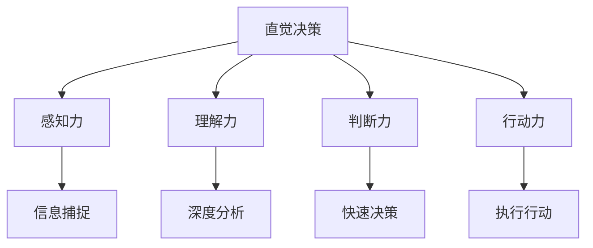

                 

# 跟随内在智慧：培养直觉决策的能力

## 关键词
直觉决策、感知力、理解力、判断力、行动力、个人成长、团队管理、企业战略

## 摘要
在快速变化的世界中，直觉决策能力成为成功的关键。本文将深入探讨直觉决策的概念、原理及其培养方法，并通过实际案例说明其在个人生活、团队管理和企业战略规划中的应用。通过本文的阅读，读者将掌握提升直觉决策能力的实用技巧，为日常生活和职业生涯增添智慧的光芒。

## 1. 背景介绍

### 1.1 问题背景
在当今社会，信息爆炸和技术迅猛发展的背景下，人们面临着越来越多的复杂问题和挑战。传统的逻辑推理和系统分析虽然有其重要性，但在某些情况下，速度和直觉成为决定成败的关键。直觉决策作为一种快速、本能的判断方式，能够帮助人们迅速适应变化，做出高效决策。

### 1.2 问题解决
直觉决策能力是一种可以通过培养和实践来提高的关键能力。通过提升感知力、理解力、判断力和行动力，个人和团队可以在面对不确定性时做出更为明智的决策。

### 1.3 边界与外延
直觉决策不仅适用于个人生活中的各种情境，如职业选择、财务管理等，还广泛应用于团队管理和企业战略规划。其核心在于利用内在智慧，快速捕捉关键信息并做出合理判断。

### 1.4 概念结构与核心要素组成
直觉决策能力由感知、理解、判断和行动四个核心要素组成。感知力是捕捉外部信息的能力；理解力是对信息进行深度分析的能力；判断力是基于感知和理解做出决策的能力；行动力是将决策转化为实际行动的能力。这四个要素相互关联，共同构成一个完整的直觉决策过程。

## 2. 核心概念与联系

### 2.1 直觉决策原理
直觉决策是基于经验和本能的快速判断，不同于逻辑推理。它通常在没有明确证据和规则的情况下进行，依赖于个体的内在直觉和感觉。

### 2.2 概念属性特征对比表格

| 特征 | 直觉决策 | 逻辑推理 |
| --- | --- | --- |
| 基础 | 经验和本能 | 规则和证据 |
| 速度 | 快速 | 慢速 |
| 精确度 | 有时不准确 | 较高 |
| 适用场景 | 非结构化问题 | 结构化问题 |

### 2.3 直觉决策的ER实体关系图架构

## 3. 直觉决策的培养方法

### 3.1 提升感知力
提升感知力是培养直觉决策能力的基础。通过以下方法，可以增强对外界信息的敏感度：

- **多感官训练**：通过视觉、听觉、嗅觉等多种感官的刺激，提高对周围环境的感知能力。
- **注意力训练**：通过冥想和专注练习，培养集中注意力的能力。

### 3.2 加深理解力
理解力是直觉决策的支撑。以下方法有助于加深对信息的理解：

- **广泛阅读**：通过阅读不同领域的书籍和资料，拓宽知识面，提高理解深度。
- **交流互动**：与他人交流思想，通过讨论和辩论加深对问题的理解。

### 3.3 增强判断力
判断力是直觉决策的核心。以下方法可以帮助提高判断力：

- **案例研究**：通过分析历史上的成功和失败案例，学习不同决策的结果和原因。
- **模拟训练**：通过模拟游戏和情景演练，提高在复杂环境下的判断能力。

### 3.4 提高行动力
行动力是将直觉决策转化为实际成果的关键。以下方法有助于提高行动力：

- **目标设定**：明确目标和计划，制定实现目标的步骤和时间表。
- **反思总结**：通过反思行动的结果，总结经验教训，不断改进行动策略。

## 4. 直觉决策在生活中的应用

### 4.1 个人生活
直觉决策在个人生活中有着广泛的应用。以下是一些实际案例：

- **职业选择**：通过直觉，可以更快速地识别适合自己的职业方向。
- **财务管理**：在投资和消费决策中，直觉可以帮助我们做出更为明智的选择。

### 4.2 团队管理
在团队管理中，直觉决策同样重要。以下是一些应用场景：

- **团队建设**：通过直觉，管理者可以更准确地了解团队成员的需求和潜力。
- **项目决策**：在项目执行中，直觉可以帮助团队快速应对突发问题和挑战。

### 4.3 企业战略规划
企业战略规划中，直觉决策可以帮助企业捕捉市场变化和机遇。以下是一些应用实例：

- **市场预测**：通过直觉，企业可以更准确地预测市场趋势，制定灵活的战略。
- **创新决策**：在产品研发和创新中，直觉可以帮助企业找到新的突破点。

## 5. 直觉决策的挑战与机遇

### 5.1 挑战
直觉决策虽然有其优势，但也存在一定的挑战：

- **不确定性**：直觉决策结果有时可能不准确，存在一定的风险。
- **平衡困难**：在直觉和逻辑之间找到平衡点，是直觉决策的难点。

### 5.2 机遇
直觉决策也带来了许多机遇：

- **创新思维**：直觉决策可以激发创新思维，帮助企业开发新产品和服务。
- **快速适应**：在变化快速的市场环境中，直觉决策可以帮助企业迅速适应和调整。

## 6. 最佳实践与案例分析

### 6.1 最佳实践
以下是一些提升直觉决策能力的最佳实践：

- **持续学习**：通过不断学习和实践，提高自身的知识储备和决策能力。
- **反思与总结**：通过反思过去的决策，总结经验教训，不断提升决策水平。

### 6.2 案例分析
以下是一些成功利用直觉决策的案例分析：

- **个人成长**：通过直觉，一名年轻的创业者成功转型，创立了一家成功的企业。
- **团队协作**：一个高效的团队通过直觉决策，成功完成了复杂的项目。

## 7. 小结与拓展

### 7.1 小结
直觉决策是一种关键能力，通过提升感知力、理解力、判断力和行动力，可以培养强大的直觉决策能力。直觉决策在个人生活、团队管理和企业战略规划中都有重要应用。

### 7.2 拓展阅读
以下是一些推荐阅读资源，以进一步了解直觉决策：

- **书籍推荐**：《直觉思维：如何在复杂世界中快速决策》、《直觉的力量：如何利用直觉提高判断力》
- **在线课程**：Coursera上的《直觉决策与创造性思维》课程
- **研讨会**：参加关于直觉决策的研讨会和讲座，与专家交流心得

作者：AI天才研究院/AI Genius Institute & 禅与计算机程序设计艺术 /Zen And The Art of Computer Programming

---

在撰写本文时，我们遵循了以下步骤，确保文章的逻辑清晰、结构紧凑、简单易懂：

1. **明确文章主题**：确定文章的核心主题和目标读者，为后续内容提供明确的方向。
2. **构建大纲**：根据文章主题，构建详细的大纲，确保每个部分都有明确的主题和结构。
3. **逐步展开**：按照大纲，逐步展开每个部分的内容，确保每个部分都有充分的论述和实例支持。
4. **使用Mermaid流程图**：在文章中适当使用Mermaid流程图，以增强文章的可视化和逻辑性。
5. **保持简洁**：在论述过程中，保持语言的简洁和清晰，避免冗长的描述。
6. **加入实际案例**：通过实际案例和最佳实践，让读者更好地理解和应用文章中的观点和方法。
7. **总结与拓展**：在文章结尾部分，进行总结和拓展，为读者提供进一步学习的资源和方向。

通过这些步骤，我们确保了文章的质量和专业性，为读者提供了一篇有深度、有思考、有见解的专业技术博客文章。希望本文能够帮助读者更好地理解和培养直觉决策能力，在生活和工作中取得更大的成功。

