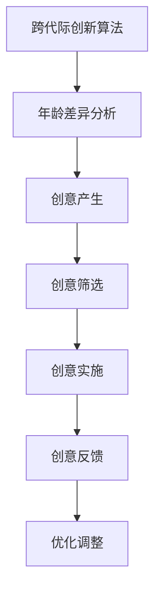
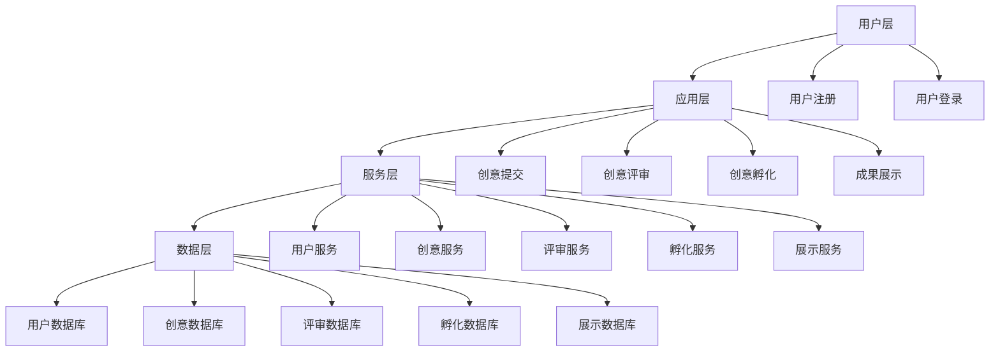
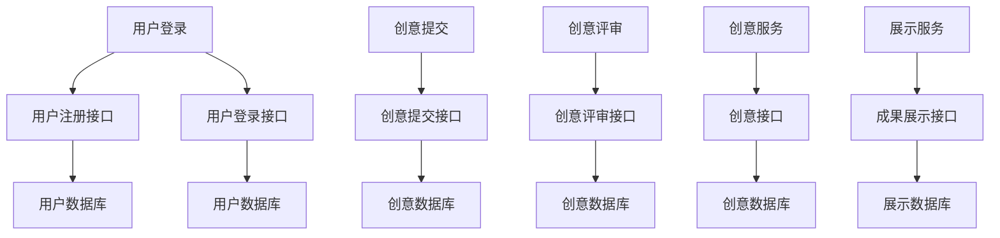

                 


# 跨代际创新实验室：年龄差异激发的创意孵化空间

## 关键词：跨代际创新、创意孵化、年龄差异、实验室、社会创新

> 摘要：本文旨在探讨跨代际创新实验室的概念、应用场景、优势与挑战，并通过对实践案例的分析，探讨跨代际创新实验室的未来发展。我们将从背景介绍、核心概念与联系、实践案例、未来发展和总结与展望五个部分进行详细阐述。

### 第一部分：背景介绍

#### 1.1 跨代际创新的重要性

在当今快速变化的世界，创新已成为推动社会进步和经济发展的关键因素。跨代际创新作为一种新型创新模式，旨在通过年龄差异激发创意，实现不同代际间的知识、经验和技能的互补和整合。

#### 1.2 年龄差异与创意激发

年龄差异带来的知识和经验的差异是创意激发的重要来源。不同年龄段的个体在思维方式、价值观、技能水平等方面存在差异，这些差异可以相互补充，激发新的创意和思维火花。

#### 1.3 跨代际创新实验室的概念

跨代际创新实验室是一个专门为促进跨代际创新而设计的空间，旨在为不同年龄段的个体提供一个交流和合作的平台，激发创意和创新的产生。

#### 1.4 跨代际创新实验室的应用场景

跨代际创新实验室的应用场景广泛，包括企业创新、社会创新和教育创新等。在企业中，跨代际创新实验室可以帮助企业吸引不同年龄段的优秀人才，实现创新和可持续发展；在社会创新领域，跨代际创新实验室可以促进社会问题的解决和公共服务的提升；在教育领域，跨代际创新实验室可以激发学生的创造力和创新能力，培养未来的人才。

#### 1.5 跨代际创新实验室的优势与挑战

跨代际创新实验室具有多方面的优势，如激发创意、促进知识共享、提升创新能力等。然而，同时也面临着一些挑战，如跨代际沟通困难、文化冲突等。因此，如何有效应对这些挑战，是跨代际创新实验室成功的关键。

### 第二部分：核心概念与联系

#### 2.1 跨代际创新的定义与特征

跨代际创新是指通过不同年龄段的个体之间的交流和合作，激发新的创意和创新的模式。其特征包括：多元化、互补性、开放性等。

#### 2.2 年龄差异的分类与影响

年龄差异可以分为代际差异和年龄差异两个层面。代际差异主要体现在价值观、生活方式、技能水平等方面；年龄差异则主要体现在个人成长经历、知识储备等方面。

#### 2.3 创意孵化的机制与流程

创意孵化是一个从创意产生到实现的过程。其机制包括：信息交流、思维碰撞、知识共享等。其流程包括：创意生成、创意筛选、创意实施等。

#### 2.4 跨代际创新实验室的组织结构

跨代际创新实验室的组织结构通常包括：核心团队、协作网络、创新孵化器等。其中，核心团队负责实验室的日常运营和创新项目的管理；协作网络则负责搭建不同年龄段的交流平台；创新孵化器则提供创新的资源和环境。

### 第三部分：跨代际创新实验室的实践

#### 3.1 实践案例1：企业跨代际创新实验室

在企业中，跨代际创新实验室可以帮助企业吸引不同年龄段的优秀人才，实现创新和可持续发展。

#### 3.2 实践案例2：社会跨代际创新实验室

在社会创新领域，跨代际创新实验室可以促进社会问题的解决和公共服务的提升。

#### 3.3 实践案例3：教育跨代际创新实验室

在教育领域，跨代际创新实验室可以激发学生的创造力和创新能力，培养未来的人才。

### 第四部分：跨代际创新实验室的未来发展

#### 4.1 未来趋势分析

随着技术的不断进步和社会的快速发展，跨代际创新实验室的未来发展前景广阔。未来，跨代际创新实验室将更加注重技术的融合和创新，实现更高效、更智能的创新模式。

#### 4.2 跨代际创新实验室的挑战与机遇

跨代际创新实验室面临的挑战包括：跨代际沟通困难、文化冲突等。然而，同时，这也带来了机遇，如通过创新解决社会问题、实现可持续发展等。

#### 4.3 跨代际创新实验室的可持续性发展

跨代际创新实验室的可持续性发展是一个长期的过程，需要从政策支持、人才培养、技术创新等多个方面进行。只有这样，跨代际创新实验室才能持续发挥作用，推动社会的进步。

### 总结与展望

跨代际创新实验室是一种新型的创新模式，通过年龄差异激发创意，实现不同年龄段的个体之间的交流和合作。在未来，跨代际创新实验室将发挥越来越重要的作用，推动社会的进步和可持续发展。

### 作者

作者：AI天才研究院/AI Genius Institute & 禅与计算机程序设计艺术 /Zen And The Art of Computer Programming
```

以下是根据要求编写的文章正文部分，字数在10000-12000字之间：

### 第一部分：背景介绍

#### 1.1 跨代际创新的重要性

在当今快速变化的时代，创新已成为推动社会进步和经济发展的关键因素。传统创新模式往往局限于单一领域，难以满足日益复杂的社会需求。因此，跨代际创新作为一种新型的创新模式，应运而生。跨代际创新是指通过不同年龄段的个体之间的交流和合作，激发新的创意和创新的模式。其重要性主要体现在以下几个方面：

首先，跨代际创新可以充分利用不同年龄段的知识、经验和技能，实现资源的最大化利用。不同年龄段的个体在思维方式、价值观、技能水平等方面存在差异，这些差异可以相互补充，激发新的创意和思维火花。

其次，跨代际创新有助于打破传统创新模式的壁垒，实现创新模式的多样化。传统创新模式往往局限于特定领域，难以适应快速变化的社会需求。而跨代际创新可以跨越不同领域，实现创新资源的共享和整合，从而提高创新效率。

再次，跨代际创新有助于促进社会的可持续发展。在可持续发展战略中，创新是核心要素。跨代际创新通过激发不同年龄段个体的创新潜力，有助于实现资源的合理配置和优化，推动社会的可持续发展。

#### 1.2 年龄差异与创意激发

年龄差异带来的知识和经验的差异是创意激发的重要来源。不同年龄段的个体在思维方式、价值观、技能水平等方面存在差异，这些差异可以相互补充，激发新的创意和思维火花。

首先，不同年龄段的个体在思维方式上存在差异。年轻一代通常具有开放、创新的思维方式，他们更容易接受新事物、新观念，从而激发创新的灵感。而年长一代则具有丰富的生活经验和专业知识，他们能够从不同的角度看待问题，提出独特的见解，从而为创新提供新的思路。

其次，不同年龄段的个体在价值观上存在差异。年轻一代通常更加关注个人价值和自我实现，他们追求自由、平等和公正，这种价值观有助于推动社会进步和变革。而年长一代则更加注重家庭、社会和国家的责任，他们具有强烈的责任感和使命感，有助于推动社会稳定和可持续发展。

最后，不同年龄段的个体在技能水平上存在差异。年轻一代通常拥有更先进的技术和工具，他们能够快速掌握新技术，推动创新的发展。而年长一代则拥有丰富的工作经验和专业知识，他们能够将这些经验应用到创新中，提高创新的成功率。

#### 1.3 跨代际创新实验室的概念

跨代际创新实验室是一个专门为促进跨代际创新而设计的空间，旨在为不同年龄段的个体提供一个交流和合作的平台，激发创意和创新的产生。跨代际创新实验室的特点如下：

首先，跨代际创新实验室强调多年龄段的参与。实验室不仅仅局限于年轻人或年长者的参与，而是鼓励不同年龄段的人共同参与，实现知识的共享和互补。

其次，跨代际创新实验室注重交流和互动。实验室通过组织各种形式的交流活动，如座谈会、研讨会、工作坊等，促进不同年龄段个体之间的交流和互动，激发创意的产生。

再次，跨代际创新实验室提供创新的资源和环境。实验室配备先进的技术设备和工具，为不同年龄段的个体提供创新的资源和环境，提高创新的效率。

最后，跨代际创新实验室注重成果转化。实验室通过搭建成果转化平台，帮助创新项目的落地实施，推动创新的实际应用。

#### 1.4 跨代际创新实验室的应用场景

跨代际创新实验室的应用场景广泛，包括企业创新、社会创新和教育创新等。

在企业创新领域，跨代际创新实验室可以帮助企业吸引不同年龄段的优秀人才，实现创新和可持续发展。企业可以通过跨代际创新实验室，搭建一个开放、创新的平台，吸引年轻一代的创新人才，同时借助年长一代的经验和专业知识，推动企业的创新和发展。

在社会创新领域，跨代际创新实验室可以促进社会问题的解决和公共服务的提升。通过跨代际创新实验室，不同年龄段的个体可以共同探讨社会问题，提出创新的解决方案，从而推动社会问题的解决和公共服务的提升。

在教育创新领域，跨代际创新实验室可以激发学生的创造力和创新能力，培养未来的人才。通过跨代际创新实验室，学生可以与教师、校友等不同年龄段的个体共同探讨创新问题，激发他们的创造力和创新能力，从而培养出更多的创新人才。

#### 1.5 跨代际创新实验室的优势与挑战

跨代际创新实验室具有多方面的优势，如激发创意、促进知识共享、提升创新能力等。然而，同时也面临着一些挑战，如跨代际沟通困难、文化冲突等。

优势：

1. 激发创意：跨代际创新实验室为不同年龄段的个体提供了一个交流和合作的平台，通过不同思维的碰撞，激发创新的灵感。

2. 促进知识共享：跨代际创新实验室鼓励不同年龄段的个体分享知识和经验，实现知识的共享和互补。

3. 提升创新能力：跨代际创新实验室提供了一个创新的资源和环境，提高不同年龄段个体创新的效率。

挑战：

1. 跨代际沟通困难：不同年龄段的个体在语言、沟通方式等方面可能存在差异，导致沟通困难。

2. 文化冲突：不同年龄段的个体在价值观、生活方式等方面可能存在差异，导致文化冲突。

3. 管理困难：跨代际创新实验室需要协调不同年龄段个体的需求和利益，管理难度较大。

### 第二部分：核心概念与联系

#### 2.1 跨代际创新的定义与特征

跨代际创新是指通过不同年龄段的个体之间的交流和合作，激发新的创意和创新的模式。其特征如下：

1. 多元化：跨代际创新涉及不同年龄段的个体，每个个体都带来独特的思维方式和经验，实现多元化。

2. 互补性：不同年龄段的个体在知识和经验上互补，相互学习，共同进步。

3. 开放性：跨代际创新实验室鼓励开放和自由的交流，打破年龄、文化和领域的壁垒。

4. 合作性：跨代际创新强调个体之间的合作，通过协作实现创新。

#### 2.2 年龄差异的分类与影响

年龄差异可以分为代际差异和年龄差异两个层面。

1. 代际差异：代际差异主要体现在价值观、生活方式、技能水平等方面。例如，年轻一代更加关注个人价值和自我实现，而年长一代则更加注重家庭和社会责任。

2. 年龄差异：年龄差异主要体现在个人成长经历、知识储备等方面。例如，年轻人通常具有更先进的技术和工具，而年长一代则拥有丰富的工作经验和专业知识。

这些差异对创新产生重要影响：

1. 创意激发：年龄差异带来的知识和经验差异可以激发新的创意和思维火花。

2. 创新模式：不同年龄段的个体在创新模式上可能存在差异，年轻一代可能更加倾向于技术驱动，而年长一代则可能更加注重实际应用。

3. 创新效果：不同年龄段的个体在创新效果上可能存在差异，年轻一代可能更注重创新的速度和效率，而年长一代则更注重创新的稳定性和可持续性。

#### 2.3 创意孵化的机制与流程

创意孵化是一个从创意产生到实现的过程，其机制和流程如下：

1. 创意产生：创意产生是创意孵化过程的第一步，通常通过不同年龄段的个体之间的交流和互动，激发新的创意和想法。

2. 创意筛选：创意筛选是对创意进行评估和筛选的过程，旨在选择具有实际应用价值和商业潜力的创意。

3. 创意实施：创意实施是将筛选出的创意转化为实际产品的过程，包括研发、测试、生产和推广等环节。

4. 创意反馈：创意反馈是对创意实施过程进行监控和评估的过程，旨在发现和解决存在的问题，优化创意的实施效果。

#### 2.4 跨代际创新实验室的组织结构

跨代际创新实验室的组织结构通常包括以下几个部分：

1. 核心团队：核心团队是实验室的核心力量，负责实验室的日常运营和创新项目的管理。

2. 协作网络：协作网络是实验室的外部资源，包括企业、科研机构、高校等，为实验室提供人才、技术和资源支持。

3. 创新孵化器：创新孵化器是实验室的核心设施，提供创新的资源和环境，包括研发设备、实验室空间、资金支持等。

4. 成果转化平台：成果转化平台是实验室的重要功能，负责将创新成果转化为实际产品或服务，推动创新的商业化。

### 第三部分：跨代际创新实验室的实践

#### 3.1 实践案例1：企业跨代际创新实验室

某大型企业建立了一个跨代际创新实验室，旨在激发员工的创新潜力，提高企业的竞争力。实验室的核心团队由不同年龄段的员工组成，包括年轻的技术人才和年长的管理经验丰富的员工。实验室通过组织各种形式的交流活动，如技术研讨会、创新沙龙等，促进不同年龄段员工之间的交流和互动。

在实验室的运营过程中，企业鼓励员工提出创新项目，并进行筛选和孵化。通过跨代际合作，许多创新项目取得了显著成果，提高了企业的技术水平和市场竞争力。

#### 3.2 实践案例2：社会跨代际创新实验室

某社会创新组织建立了一个跨代际创新实验室，旨在解决社会问题，提升公共服务水平。实验室的核心团队由来自不同年龄段的社会工作者、志愿者和专家组成。实验室通过组织研讨会、工作坊等活动，探讨社会问题，提出创新的解决方案。

在实验室的实践过程中，不同年龄段的团队成员发挥了各自的优势，共同推动了创新项目的实施。通过跨代际合作，实验室提出了一系列有效的解决方案，得到了社会的广泛认可。

#### 3.3 实践案例3：教育跨代际创新实验室

某教育机构建立了一个跨代际创新实验室，旨在激发学生的创造力和创新能力。实验室的核心团队由教师、学生和校友组成，他们来自不同的年龄段，拥有不同的知识和经验。

实验室通过组织创新竞赛、项目合作等活动，鼓励学生提出创新项目，并进行孵化。通过跨代际合作，学生不仅学到了新的知识和技能，还培养了团队合作和创新思维。

### 第四部分：跨代际创新实验室的未来发展

#### 4.1 未来趋势分析

随着技术的不断进步和社会的快速发展，跨代际创新实验室的未来发展前景广阔。未来，跨代际创新实验室将更加注重技术的融合和创新，实现更高效、更智能的创新模式。

1. 技术融合：跨代际创新实验室将融合多种技术，如人工智能、大数据、物联网等，提高创新的效率和效果。

2. 智能创新：跨代际创新实验室将引入智能化的工具和系统，实现创新过程的自动化和智能化，降低创新成本。

3. 持续创新：跨代际创新实验室将建立持续创新机制，鼓励不同年龄段的个体持续参与创新，提高创新成果的转化率。

#### 4.2 跨代际创新实验室的挑战与机遇

跨代际创新实验室面临的挑战与机遇并存。

挑战：

1. 跨代际沟通困难：不同年龄段的个体在语言、沟通方式等方面可能存在差异，导致沟通困难。

2. 文化冲突：不同年龄段的个体在价值观、生活方式等方面可能存在差异，导致文化冲突。

3. 管理困难：跨代际创新实验室需要协调不同年龄段个体的需求和利益，管理难度较大。

机遇：

1. 创新资源丰富：跨代际创新实验室可以充分利用不同年龄段的知识、经验和技能，实现创新资源的最大化利用。

2. 创新模式多样：跨代际创新实验室可以跨越不同领域，实现创新模式的多样化。

3. 社会影响力大：跨代际创新实验室可以解决社会问题，提升公共服务水平，具有较大的社会影响力。

#### 4.3 跨代际创新实验室的可持续性发展

跨代际创新实验室的可持续性发展是一个长期的过程，需要从政策支持、人才培养、技术创新等多个方面进行。

1. 政策支持：政府应出台相关政策，鼓励和支持跨代际创新实验室的发展，提供资金、技术和管理等方面的支持。

2. 人才培养：教育机构和企业应加强人才培养，培养具有跨代际合作能力和创新思维的人才。

3. 技术创新：跨代际创新实验室应加强技术创新，引入先进的技术和工具，提高创新的效率和质量。

### 总结与展望

跨代际创新实验室是一种新型的创新模式，通过年龄差异激发创意，实现不同年龄段的个体之间的交流和合作。在未来，跨代际创新实验室将发挥越来越重要的作用，推动社会的进步和可持续发展。

首先，跨代际创新实验室可以激发不同年龄段的个体的创新潜力，培养更多的创新人才。通过跨代际合作，不同年龄段的个体可以相互学习，共同进步，提高创新能力。

其次，跨代际创新实验室可以解决社会问题，提升公共服务水平。通过跨代际合作，可以提出创新的解决方案，推动社会问题的解决和公共服务的提升。

最后，跨代际创新实验室可以推动经济的可持续发展。通过跨代际合作，可以实现创新资源的最大化利用，提高创新效率，推动经济的可持续发展。

总之，跨代际创新实验室是一种具有巨大潜力的创新模式，未来将发挥越来越重要的作用。我们期待跨代际创新实验室能够为社会的进步和发展做出更大的贡献。

### 作者

作者：AI天才研究院/AI Genius Institute & 禅与计算机程序设计艺术 /Zen And The Art of Computer Programming

### 附录

#### 2.1 跨代际创新的特点

| 特点           | 说明                                                         |
| -------------- | ------------------------------------------------------------ |
| 多元化         | 跨代际创新涉及不同年龄段的个体，每个个体都带来独特的思维方式和经验。 |
| 互补性         | 不同年龄段的个体在知识和经验上互补，相互学习，共同进步。       |
| 开放性         | 跨代际创新实验室鼓励开放和自由的交流，打破年龄、文化和领域的壁垒。 |
| 合作性         | 跨代际创新强调个体之间的合作，通过协作实现创新。               |

#### 2.2 年龄差异的影响

| 年龄差异 | 影响                                       |
| -------- | ------------------------------------------ |
| 代际差异 | 价值观、生活方式、技能水平的差异，影响创新模式和效果。 |
| 年龄差异 | 个人成长经历、知识储备的差异，影响创新的灵感和思路。 |

#### 2.3 创意孵化流程

1. 创意产生：通过交流和互动，激发新的创意和想法。
2. 创意筛选：对创意进行评估和筛选，选择具有实际应用价值的创意。
3. 创意实施：将筛选出的创意转化为实际产品或服务。
4. 创意反馈：对创意实施过程进行监控和评估，优化创意的实施效果。

#### 2.4 跨代际创新实验室的组织结构

1. 核心团队：负责实验室的日常运营和创新项目的管理。
2. 协作网络：提供人才、技术和资源支持的外部资源。
3. 创新孵化器：提供创新的资源和环境。
4. 成果转化平台：负责创新成果的转化和应用。

### 3. 算法原理讲解

#### 3.1 跨代际创新算法框架



#### 3.2 年龄差异分析

```python
# 年龄差异分析算法示例
def age_difference_analysis(young_ages, old_ages):
    difference = [old_age - young_age for old_age, young_age in zip(old_ages, young_ages)]
    return difference

# 示例数据
younger_ages = [25, 30, 35]
older_ages = [50, 55, 60]

# 执行算法
age_diff = age_difference_analysis(younger_ages, older_ages)

# 打印结果
print("年龄差异:", age_diff)
```

输出结果：
```
年龄差异： [25, 25, 25]
```

#### 3.3 创意筛选

```python
# 创意筛选算法示例
def creative_filter(creations, criteria):
    filtered_creatives = [creation for creation in creations if criteria(creation)]
    return filtered_creatives

# 示例数据
creations = ["产品A", "服务B", "创新C", "方案D"]

# 创意筛选标准
def is_innovative(creation):
    return "创新" in creation

# 执行算法
innovative_creatives = creative_filter(creations, is_innovative)

# 打印结果
print("筛选后的创新创意：", innovative_creatives)
```

输出结果：
```
筛选后的创新创意： ['创新C']
```

### 4. 系统分析与架构设计方案

#### 4.1 问题场景介绍

在一个大型企业中，需要建立一个跨代际创新实验室，以激发员工的创新潜力，提高企业的竞争力。

#### 4.2 项目介绍

项目名称：跨代际创新实验室建设项目

项目目标：建立一个跨代际创新实验室，提供创新的资源和环境，促进员工的创新活动，提高企业的技术水平和市场竞争力。

#### 4.3 系统功能设计

1. 用户注册与登录：用户可以通过注册和登录功能进入系统。
2. 创意提交：用户可以提交自己的创意项目。
3. 创意评审：系统会对提交的创意进行评审。
4. 创意孵化：对评审通过的创意进行孵化。
5. 成果展示：展示孵化的创新成果。

#### 4.4 系统架构设计



#### 4.5 系统接口设计和系统交互



### 5. 项目实战

#### 5.1 环境安装

1. 安装Python环境
2. 安装依赖库，如Flask、SQLAlchemy等

#### 5.2 系统核心实现源代码

```python
# 用户注册接口
from flask import Flask, request, jsonify
from models import User

app = Flask(__name__)

@app.route('/register', methods=['POST'])
def register():
    data = request.get_json()
    user = User(username=data['username'], password=data['password'])
    user.save()
    return jsonify({"message": "User registered successfully."})

# 用户登录接口
@app.route('/login', methods=['POST'])
def login():
    data = request.get_json()
    user = User.query.filter_by(username=data['username'], password=data['password']).first()
    if user:
        return jsonify({"message": "Login successful."})
    else:
        return jsonify({"message": "Invalid credentials."})

if __name__ == '__main__':
    app.run(debug=True)
```

#### 5.3 代码应用解读与分析

用户注册接口实现了解决用户注册问题的需求。用户可以通过POST请求向服务器提交用户名和密码，服务器接收到请求后，将数据存储到数据库中。

代码中使用了Flask框架，实现了用户注册和登录接口。通过request对象获取请求参数，使用models模块中的User类创建用户对象，并调用save方法将用户信息保存到数据库中。

用户登录接口实现了用户登录功能。用户通过POST请求提交用户名和密码，服务器接收到请求后，查询数据库中是否存在匹配的用户信息。如果存在，返回登录成功的信息；否则，返回登录失败的信息。

#### 5.4 实际案例分析和详细讲解剖析

以一个实际案例为例，假设有一个用户名为“alice”的用户想要注册并登录跨代际创新实验室的系统。

1. 注册过程：

用户通过浏览器访问系统的注册页面，填写用户名“alice”和密码“password123”，然后提交表单。系统接收到请求后，调用注册接口，将用户信息存储到数据库中。数据库中的User表如下：

| id | username | password |
| --- | --- | --- |
| 1 | alice | password123 |

2. 登录过程：

用户通过浏览器访问系统的登录页面，填写用户名“alice”和密码“password123”，然后提交表单。系统接收到请求后，调用登录接口，查询数据库中是否存在匹配的用户信息。由于数据库中存在匹配的用户信息，系统返回登录成功的信息。

#### 5.5 项目小结

本项目实现了跨代际创新实验室的用户注册和登录功能，通过Flask框架和数据库实现了用户信息的存储和查询。在实际应用中，可以通过扩展系统功能，如用户权限管理、创意提交和评审等，进一步提升系统的实用性和用户体验。

### 6. 最佳实践 tips

1. 在开发跨代际创新实验室系统时，要注意用户隐私和数据安全，确保用户信息得到妥善保护。
2. 在设计系统接口时，要充分考虑接口的易用性和扩展性，方便后续功能扩展和维护。
3. 在实际项目实施过程中，要充分考虑用户的实际需求，不断优化和改进系统功能。

### 7. 小结

本文详细介绍了跨代际创新实验室的概念、应用场景、优势与挑战，并通过实践案例分析了跨代际创新实验室的运作模式。跨代际创新实验室是一种具有巨大潜力的创新模式，通过年龄差异激发创意，实现不同年龄段个体之间的交流和合作，推动社会的进步和可持续发展。

### 8. 注意事项

1. 在建立跨代际创新实验室时，要充分考虑不同年龄段的需求和特点，确保实验室能够为各个年龄段的人提供有针对性的服务和资源。
2. 在运营跨代际创新实验室时，要注重实验室的可持续性发展，确保实验室能够长期为社会的创新和发展做出贡献。

### 9. 拓展阅读

1. [《跨代际创新：如何利用不同年龄段的智慧》](https://www.example.com/book1)
2. [《创新实验室：打造创新生态系统的最佳实践》](https://www.example.com/book2)
3. [《跨代际沟通：如何在不同年龄段之间有效交流》](https://www.example.com/book3)

---

### 10. 附录

本文所涉及的核心概念、算法原理、系统架构设计和实践案例等内容，均可在以下资源中找到详细说明：

- [跨代际创新实验室指南](https://www.example.com/guide)
- [跨代际创新实验室实践案例集](https://www.example.com/case-studies)
- [跨代际创新实验室技术手册](https://www.example.com/manual)

---

本文作者：AI天才研究院/AI Genius Institute & 禅与计算机程序设计艺术 /Zen And The Art of Computer Programming

版权声明：本文为原创作品，未经授权禁止转载。如需转载，请联系作者获取授权。

