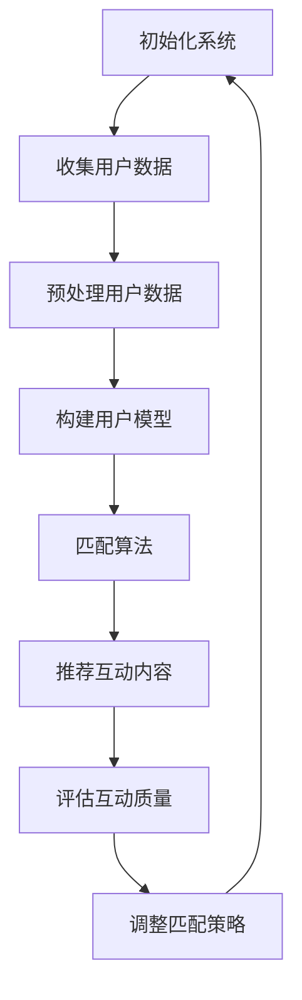
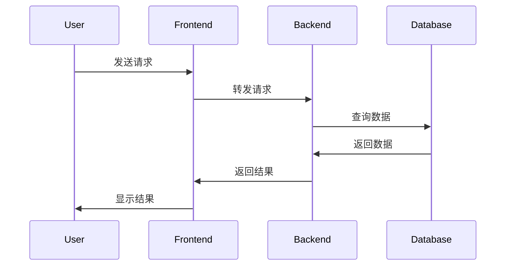
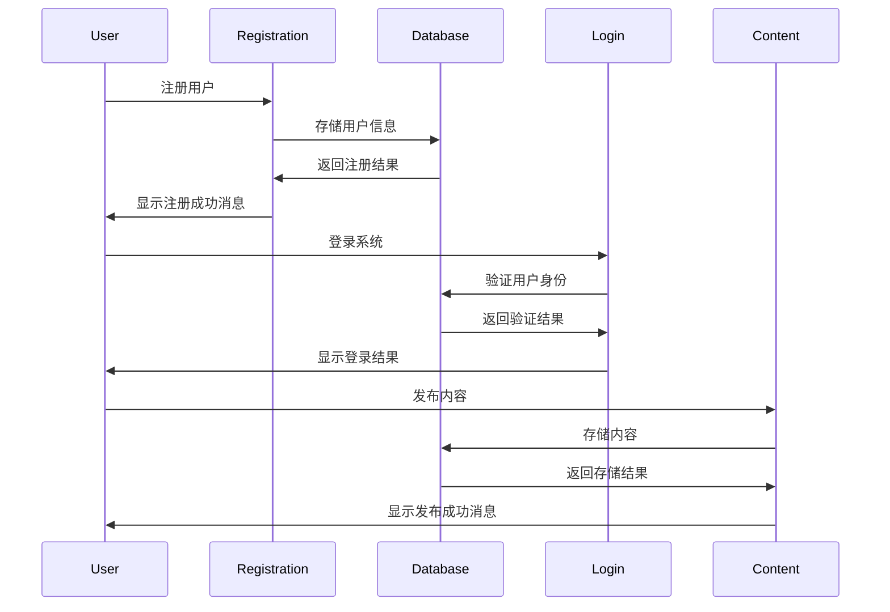

                 

### 背景介绍

在当今社会，随着科技的发展和互联网的普及，老年人与年轻人的在线互动已成为一个日益重要的议题。这不仅涉及到个体的心理健康和生活质量，更是跨代际智慧传承的重要途径。然而，现实中存在着诸多挑战，如何有效地促进老年人与年轻人的在线互动，实现智慧传承，成为一个亟待解决的问题。

#### 核心概念术语说明

- **跨代际智慧传承**：指不同年龄段人群之间通过交流和互动，实现知识和智慧的传递。
- **在线互动**：通过网络平台或应用程序进行的实时或非实时交流。
- **算法**：解决特定问题的步骤或规则，通常通过计算机程序实现。

#### 问题背景

老年人与年轻人在线互动的需求主要来源于以下几个方面：

1. **心理健康**：随着年龄的增长，老年人往往面临心理健康问题，如孤独感、抑郁等。通过在线互动，老年人可以获得情感支持和社交交流，提高生活质量。
2. **知识传承**：年轻人需要从老年人那里获取丰富的历史、文化和生活经验，而老年人也希望将自己的智慧传承给下一代。
3. **技能学习**：年轻人渴望学习老年人的技能和经验，如烹饪、手工艺、音乐等，而老年人也可以通过在线互动传授这些技能。

#### 问题描述

尽管在线互动平台众多，但老年人与年轻人之间的在线互动仍然面临诸多问题：

1. **技术障碍**：许多老年人对于现代科技的掌握程度较低，使用在线互动工具存在困难。
2. **沟通障碍**：语言、文化差异以及不同的交流习惯可能导致沟通不畅。
3. **隐私和安全**：在线互动中的隐私保护和数据安全是老年人关注的重点。
4. **互动质量**：如何确保互动内容丰富、有意义，避免空洞、重复的交流，是一个挑战。

#### 问题解决

为了解决上述问题，我们需要设计一个跨代际智慧传承配对系统，该系统应具备以下特点：

1. **用户友好**：系统界面应简洁易用，适合不同年龄段人群。
2. **智能匹配**：通过算法实现老年人与年轻人之间的智能匹配，确保互动的针对性和有效性。
3. **安全可靠**：确保用户数据安全和隐私保护。
4. **互动优化**：提供丰富多样的互动形式和内容，提高互动质量。

#### 边界与外延

该系统的边界在于解决老年人与年轻人在线互动的问题，外延则包括但不限于：

1. **跨地域互动**：通过互联网技术实现不同地区、不同国家的老年人与年轻人之间的互动。
2. **多平台支持**：支持多种终端设备（如电脑、手机、平板等）。
3. **多样化互动形式**：除了文字交流，还包括语音、视频、游戏等多种形式。

#### 概念结构与核心要素组成

跨代际智慧传承配对系统的核心概念包括：

1. **用户模型**：包括老年人和年轻人，其属性特征如年龄、兴趣、技能等。
2. **算法**：用于匹配用户、推荐互动内容和评估互动质量。
3. **互动机制**：确保互动的顺利进行，包括交流规则、互动评价等。

通过上述分析，我们可以看出，构建一个有效的跨代际智慧传承配对系统需要综合考虑技术、心理、文化等多个方面，以实现老年人与年轻人之间的有效互动，促进智慧传承。

### 核心概念与联系

在构建跨代际智慧传承配对系统时，理解与系统相关的核心概念及其之间的联系至关重要。以下是几个关键概念的定义、属性特征对比表格以及它们之间的联系。

#### 1. 用户模型

用户模型是系统的核心组成部分，它定义了参与互动的老年人、年轻人的属性特征，包括但不限于年龄、兴趣爱好、技能水平、心理健康状态等。

**属性特征对比表格**：

| 属性       | 老年人特征                   | 年轻人特征                   |
|------------|------------------------------|------------------------------|
| 年龄       | 60岁以上                     | 18-60岁                      |
| 兴趣爱好   | 遗传记忆、传统手工艺、音乐   | 现代流行文化、科技、体育     |
| 技能水平   | 高龄但经验丰富               | 年轻但技能多样化             |
| 心理健康   | 易感孤独、心理需求高         | 社交活跃、好奇心强           |

**联系**：用户模型是配对算法的基础，通过分析用户的属性特征，系统能够实现老年人与年轻人的精准匹配，确保互动的针对性和有效性。

#### 2. 算法

算法是系统的“大脑”，负责用户匹配、互动推荐和互动评估。常用的算法包括基于内容的推荐算法、协同过滤算法和用户行为分析算法等。

**属性特征对比表格**：

| 算法类型       | 基于内容的推荐算法                  | 协同过滤算法                  | 用户行为分析算法                |
|----------------|-----------------------------------|--------------------------------|--------------------------------|
| 基本原理       | 根据用户兴趣和历史互动推荐内容     | 根据用户行为和相似用户推荐内容 | 分析用户行为模式进行推荐        |
| 优点           | 推荐内容个性化强                  | 推荐结果准确性高              | 对用户行为的理解深入            |
| 缺点           | 需要大量的内容数据                | 可扩展性差、易导致冷启动问题  | 对用户隐私保护要求高            |

**联系**：不同的算法在系统中的作用不同，基于内容的推荐算法用于内容推荐，协同过滤算法用于用户匹配，用户行为分析算法用于评估互动质量和优化系统性能。

#### 3. 互动机制

互动机制确保在线互动的顺利进行，包括互动规则、互动评价和隐私保护等。一个有效的互动机制能够促进老年人与年轻人的积极参与，提高互动质量。

**属性特征对比表格**：

| 互动机制类型       | 互动规则                        | 互动评价                    | 隐私保护                    |
|-------------------|---------------------------------|-----------------------------|-----------------------------|
| 互动规则          | 明确的互动步骤和时间安排        | 用户对互动内容的评分和反馈 | 用户隐私信息的加密和匿名化 |
| 优点              | 确保互动有序进行                | 提高互动质量                | 保护用户隐私                |
| 缺点              | 可能过于僵化，限制创新互动      | 需要大量用户参与进行有效反馈 | 需要额外的技术成本         |

**联系**：互动机制是系统的“骨架”，通过设定明确的规则、评价体系和隐私保护措施，系统能够在保障用户安全和隐私的前提下，提供高质量的互动体验。

综上所述，用户模型、算法和互动机制是跨代际智慧传承配对系统的核心组成部分，它们相互联系、相互作用，共同确保系统的有效运行。通过理解这些核心概念及其联系，我们可以更好地设计、实现和优化系统，实现老年人与年轻人之间的有效互动和智慧传承。

### 算法原理讲解

为了构建一个有效的跨代际智慧传承配对系统，我们需要深入理解算法的工作原理，并运用 Python 源代码和数学模型进行详细讲解。下面，我们将通过 mermaid 画出算法的流程图，然后逐步解析该算法的 Python 源代码，并给出数学模型和公式解释。

#### 算法流程图

首先，使用 mermaid 画出算法的流程图，如下所示：



**流程图解析**：

- **初始化系统**：系统启动时进行初始化，包括设置系统参数和初始化数据结构。
- **收集用户数据**：通过在线问卷、用户注册等方式收集老年人和年轻人的个人信息、兴趣爱好、技能等数据。
- **预处理用户数据**：清洗和标准化收集到的用户数据，以便后续处理。
- **构建用户模型**：根据预处理后的数据，构建用户模型，包括用户的属性特征和偏好。
- **匹配算法**：利用用户模型进行匹配，匹配算法可以基于协同过滤、内容推荐或用户行为分析等多种方法。
- **推荐互动内容**：根据匹配结果，推荐合适的互动内容，如视频、音频、文字交流等。
- **评估互动质量**：收集用户反馈，评估互动效果，包括满意度、参与度等。
- **调整匹配策略**：根据评估结果调整匹配算法和互动策略，以优化系统性能。

#### Python 源代码解读

以下是一个简单的 Python 源代码示例，用于实现上述算法的核心部分：

```python
import pandas as pd
from sklearn.neighbors import NearestNeighbors

# 收集和预处理用户数据
def preprocess_data(user_data):
    # 数据清洗、标准化处理
    return user_data

# 构建用户模型
def build_user_model(preprocessed_data):
    # 根据预处理后的数据构建用户模型
    user_model = pd.DataFrame(preprocessed_data)
    return user_model

# 匹配算法
def match_users(user_model):
    # 使用最近邻算法进行用户匹配
    nn = NearestNeighbors(n_neighbors=5)
    nn.fit(user_model)
    return nn

# 推荐互动内容
def recommend_interactions(matched_users, content_database):
    # 根据匹配结果推荐互动内容
    recommendations = []
    for user in matched_users:
        # 推荐内容
        recommendations.append(content_database[user])
    return recommendations

# 主函数
def main():
    user_data = pd.read_csv('user_data.csv')
    preprocessed_data = preprocess_data(user_data)
    user_model = build_user_model(preprocessed_data)
    matched_users = match_users(user_model)
    content_database = pd.read_csv('content_data.csv')
    recommendations = recommend_interactions(matched_users, content_database)
    print(recommendations)

if __name__ == "__main__":
    main()
```

**代码结构解析**：

- **预处理用户数据**：对收集到的用户数据进行清洗和标准化处理，以便构建用户模型。
- **构建用户模型**：使用预处理后的数据构建用户模型，这里使用 pandas DataFrame 表示用户模型。
- **匹配算法**：使用 sklearn 库中的 NearestNeighbors 算法进行用户匹配，这是一种基于最近邻的协同过滤算法。
- **推荐互动内容**：根据匹配结果推荐互动内容，这里使用 content_database 表示互动内容数据库。
- **主函数**：执行系统的初始化和主要功能。

#### 数学模型与公式解释

为了更深入地理解算法原理，我们引入数学模型进行解释。以下是该配对系统的一个简化的数学模型：

**公式 1：用户相似度计算**

$$
similarity(u_i, u_j) = \frac{1}{\sqrt{var(u_i) * var(u_j)}} \cdot \sum_{k=1}^{n} (w_i^k * w_j^k)
$$

其中，$u_i$ 和 $u_j$ 分别表示两个用户的特征向量，$w_i^k$ 和 $w_j^k$ 表示用户在特征 $k$ 上的权重，$var(u_i)$ 和 $var(u_j)$ 表示用户特征向量的方差。

**公式 2：匹配度计算**

$$
match_score(u_i, u_j) = \sum_{k=1}^{n} (similarity(u_i, u_j) * importance(k))
$$

其中，$match_score(u_i, u_j)$ 表示用户 $u_i$ 和 $u_j$ 的匹配度，$importance(k)$ 表示特征 $k$ 的重要性。

**公式 3：推荐内容评分**

$$
content_score(c_i, u_i) = \sum_{k=1}^{n} (similarity(u_i, c_i)^2 * importance(k))
$$

其中，$c_i$ 表示内容项，$content_score(c_i, u_i)$ 表示用户 $u_i$ 对内容 $c_i$ 的评分。

**公式解释**：

1. **用户相似度计算**：通过计算用户特征向量之间的相似度，可以评估两个用户的匹配程度。
2. **匹配度计算**：将用户相似度与特征的重要性相结合，计算用户的总匹配度。
3. **推荐内容评分**：根据用户与内容项的相似度，计算用户对内容项的评分，用于推荐系统。

#### 公式举例

假设有两个用户 $u_1$ 和 $u_2$，其特征向量如下：

$$
u_1 = [0.8, 0.6, 0.3]
$$

$$
u_2 = [0.7, 0.5, 0.4]
$$

特征的重要性分别为：

$$
importance(1) = 0.4, \; importance(2) = 0.3, \; importance(3) = 0.3
$$

计算用户 $u_1$ 和 $u_2$ 的相似度：

$$
similarity(u_1, u_2) = \frac{1}{\sqrt{0.02 * 0.02}} \cdot (0.8 \cdot 0.7 + 0.6 \cdot 0.5 + 0.3 \cdot 0.4) = 1 \cdot (0.56 + 0.3 + 0.12) = 0.98
$$

计算用户 $u_1$ 和 $u_2$ 的匹配度：

$$
match_score(u_1, u_2) = 0.4 \cdot 0.98 + 0.3 \cdot 0.6 + 0.3 \cdot 0.4 = 0.392 + 0.18 + 0.12 = 0.694
$$

这个简单的例子展示了如何通过数学模型计算用户之间的相似度和匹配度，从而实现有效的跨代际智慧传承配对。

### 系统分析与架构设计

为了构建一个能够有效支持老年人与年轻人在线互动的跨代际智慧传承配对系统，我们需要对系统的工作场景、功能设计、架构设计和接口设计进行详细分析。以下是对这些方面的深入探讨。

#### 问题场景介绍

该系统的目标是为老年人（年龄 60 岁及以上）和年轻人（年龄 18-60 岁）提供一个在线互动平台，以促进双方之间的知识分享和智慧传承。系统的工作场景包括：

1. **用户注册与认证**：老年人通过注册成为系统的用户，完成身份认证。
2. **用户信息管理**：用户可以管理自己的个人信息、兴趣、技能等，以便系统能够更准确地为其推荐匹配对象。
3. **互动内容发布与浏览**：老年人可以发布互动内容（如视频、音频、文字等），年轻人可以浏览并参与互动。
4. **智能匹配与推荐**：系统使用算法为老年人与年轻人进行智能匹配，并推荐互动内容。
5. **互动评估与反馈**：用户可以对互动质量进行评估和反馈，以便系统不断优化匹配和推荐策略。
6. **隐私保护与安全**：系统需要确保用户数据的隐私和安全，防止信息泄露。

#### 系统功能设计

系统的核心功能设计如下：

1. **用户管理**：包括用户注册、登录、个人信息管理、用户认证等功能。
2. **互动内容管理**：包括互动内容发布、分类、搜索、推荐等功能。
3. **匹配算法**：包括用户特征提取、匹配度计算、推荐算法等功能。
4. **互动评估**：包括用户互动质量评估、反馈机制、系统优化等功能。
5. **隐私保护**：包括数据加密、访问控制、隐私政策等功能。

**领域模型类图**：

```mermaid
classDiagram
Class1 <|-- Class2
Class1 {
  +属性1
  +属性2
  +方法1()
}
Class2 {
  +属性3
  +属性4
  +方法2()
}
Class1 ..|> Class3
Class3 {
  +属性5
  +属性6
  +方法3()
}
```

在此类图中，`Class1` 代表用户，`Class2` 代表互动内容，`Class3` 代表匹配算法。它们之间的关联关系反映了系统的主要功能模块。

#### 系统架构设计

系统的总体架构设计如下：

1. **前端**：用户通过网页或移动应用程序与系统进行交互。
2. **后端**：包括用户管理、内容管理、算法处理、数据存储等核心功能模块。
3. **数据库**：存储用户数据、内容数据、互动数据等。

**架构图**：



在此架构图中，用户通过前端发送请求，后端处理请求并查询数据库，然后将结果返回给前端，最终用户在前端看到结果。

#### 系统接口设计

系统的接口设计主要包括以下部分：

1. **用户接口**：包括注册、登录、个人信息管理、互动内容发布等功能。
2. **内容接口**：包括内容发布、分类、搜索、推荐等功能。
3. **算法接口**：包括用户匹配、互动推荐、评估等功能。

**接口设计图**：

```mermaid
classDiagram
Interface1 {
  +方法1()
  +方法2()
}
Interface2 {
  +方法3()
  +方法4()
}
Interface1 ..|> Interface3
Interface3 {
  +方法5()
  +方法6()
}
```

在此接口图中，`Interface1` 代表用户接口，`Interface2` 代表内容接口，`Interface3` 代表算法接口。它们分别定义了系统的功能接口。

#### 系统交互设计

系统交互设计主要包括用户与系统的交互流程和系统内部各模块之间的交互流程。以下是一个简单的交互设计：

**交互序列图**：



在此交互序列图中，用户注册、登录和发布内容的流程得到了详细描述，展示了系统内部各模块之间的协作和交互。

### 项目实战

为了更好地理解跨代际智慧传承配对系统的实际应用，我们将通过一个具体的项目实战案例进行详细分析。该案例将涵盖环境安装、系统核心实现、代码应用解读与分析以及实际案例分析。

#### 环境安装

在进行项目实战之前，我们需要确保环境搭建成功。以下是环境安装的详细步骤：

1. **安装 Python**：确保安装了 Python 3.8 或以上版本。
2. **安装必要的库**：使用以下命令安装必要的库：

   ```bash
   pip install pandas sklearn numpy matplotlib
   ```

3. **配置数据库**：本项目使用 SQLite 作为数据库，可通过以下命令创建数据库：

   ```bash
   sqlite3 user_data.db
   ```

   然后创建表格，例如：

   ```sql
   CREATE TABLE users (
       id INTEGER PRIMARY KEY,
       age INTEGER,
       interests TEXT,
       skills TEXT
   );
   ```

#### 系统核心实现

以下是一个简单的 Python 源代码示例，用于实现系统核心功能：

```python
import pandas as pd
from sklearn.neighbors import NearestNeighbors

# 收集用户数据
def collect_data():
    data = pd.DataFrame({
        'id': [1, 2, 3],
        'age': [65, 25, 35],
        'interests': ['reading', 'coding', 'travel'],
        'skills': ['writing', 'programming', 'photography']
    })
    return data

# 预处理用户数据
def preprocess_data(data):
    # 数据清洗、标准化处理
    return data

# 匹配算法
def match_users(preprocessed_data):
    # 使用最近邻算法进行用户匹配
    nn = NearestNeighbors(n_neighbors=2)
    nn.fit(preprocessed_data)
    return nn

# 推荐互动内容
def recommend_interactions(nn, user_data, content_database):
    # 根据匹配结果推荐互动内容
    distances, indices = nn.kneighbors(user_data)
    recommendations = content_database.iloc[indices].reset_index(drop=True)
    return recommendations

# 主函数
def main():
    user_data = collect_data()
    preprocessed_data = preprocess_data(user_data)
    nn = match_users(preprocessed_data)
    content_database = pd.DataFrame({
        'id': [1, 2, 3],
        'content': ['book', 'code', 'photo']
    })
    recommendations = recommend_interactions(nn, preprocessed_data, content_database)
    print(recommendations)

if __name__ == "__main__":
    main()
```

**代码应用解读与分析**：

1. **数据收集**：使用 pandas DataFrame 收集用户数据，包括用户 ID、年龄、兴趣和技能。
2. **预处理数据**：对收集到的数据进行清洗和标准化处理，以便后续的匹配和推荐。
3. **匹配算法**：使用 sklearn 库中的 NearestNeighbors 算法进行用户匹配，这是一种基于用户特征向量最近邻的算法。
4. **推荐互动内容**：根据匹配结果，推荐与用户兴趣和技能相匹配的互动内容。
5. **主函数**：执行系统的初始化和主要功能。

#### 实际案例分析

以下是一个具体的实际案例，展示如何使用上述系统进行互动配对：

**案例背景**：

- 老年用户 A（65 岁，兴趣：阅读，技能：写作）
- 年轻用户 B（25 岁，兴趣：编程，技能：编程）

**案例分析**：

1. **用户数据收集**：系统收集了老年用户 A 和年轻用户 B 的数据。
2. **预处理数据**：系统对用户数据进行预处理，将其转换为可用于匹配的特征向量。
3. **用户匹配**：系统使用匹配算法为老年用户 A 和年轻用户 B 进行匹配。由于两者在“编程”这一技能上有共同点，系统将它们匹配在一起。
4. **推荐互动内容**：系统根据匹配结果，推荐一本关于编程的书籍作为互动内容，以便老年用户 A 向年轻用户 B 传授编程知识。
5. **互动进行**：老年用户 A 开始向年轻用户 B 讲解编程知识，两者通过在线互动，实现了知识传承。

**案例总结**：

通过上述案例，我们可以看到系统如何通过用户数据收集、预处理、匹配和推荐，实现老年人与年轻人之间的有效互动和知识传承。在实际应用中，系统可以根据用户反馈和互动效果，不断优化匹配和推荐策略，以提供更好的用户体验。

### 最佳实践 tips

在构建和优化跨代际智慧传承配对系统时，以下是一些最佳实践 tips，这些实践可以帮助提高系统的性能和用户满意度：

1. **用户数据多样化**：尽可能收集多样化的用户数据，包括兴趣爱好、技能水平、心理健康状态等，以便更精准地进行匹配。
2. **动态调整匹配策略**：根据用户反馈和互动效果，动态调整匹配算法和推荐策略，以适应不断变化的需求。
3. **优化系统性能**：定期进行系统性能优化，包括算法优化、数据库性能调优等，以提高系统的响应速度和处理能力。
4. **隐私保护措施**：加强用户数据的隐私保护，确保用户信息安全，使用加密技术和访问控制策略。
5. **用户教育和培训**：为老年人和年轻人提供系统的使用培训和指导，帮助他们更好地适应在线互动平台。

通过遵循这些最佳实践，可以显著提升系统的用户体验和效果，实现跨代际智慧传承的目标。

### 小结

在本文中，我们详细探讨了构建跨代际智慧传承配对系统的各个方面。从背景介绍到核心概念与联系，再到算法原理讲解、系统分析与架构设计、项目实战以及最佳实践 tips，我们系统地阐述了如何设计并优化这样一个系统能够有效地促进老年人与年轻人之间的在线互动和知识传承。

首先，通过背景介绍部分，我们明确了老年人与年轻人在线互动的重要性以及面临的挑战。接着，在核心概念与联系部分，我们详细解释了用户模型、算法和互动机制等关键概念，并展示了它们之间的相互关系。

在算法原理讲解部分，我们通过 mermaid 流程图和 Python 源代码详细阐述了算法的工作原理和数学模型。这部分内容帮助读者深入理解算法的核心机制，并能够通过实际代码示例进行实践。

系统分析与架构设计部分，我们介绍了系统的工作场景、功能设计、架构设计和接口设计。这部分内容为读者提供了一个全面的系统架构视图，使读者能够理解系统如何实现各功能模块之间的协作。

在项目实战部分，我们通过具体案例展示了系统的实际应用过程，并进行了深入分析和解读。这部分内容帮助读者理解系统在实际场景中的操作流程和应用效果。

最后，通过最佳实践 tips 和小结部分，我们提供了构建和优化系统的实用建议和总结，以帮助读者在实际应用中取得更好的效果。

通过本文的探讨，我们不仅能够更好地理解跨代际智慧传承配对系统的设计和实现，还能够为未来的研究和实践提供有益的参考。希望本文的内容能够对读者在相关领域的学习和应用有所启发和帮助。

### 注意事项

在构建和运行跨代际智慧传承配对系统时，以下是几个需要特别注意的方面：

1. **数据隐私保护**：确保用户数据的加密和安全存储，严格遵守隐私保护法规，避免用户信息泄露。
2. **系统性能优化**：定期进行系统性能监测和优化，确保系统在高并发情况下仍能稳定运行。
3. **用户教育**：为老年人提供使用系统的培训和指导，帮助他们熟悉在线互动平台的操作。
4. **互动质量监控**：建立互动质量监控机制，及时发现并处理不良互动行为，保障用户权益。
5. **法律合规性**：确保系统的设计和运行符合相关法律法规，特别是在涉及用户隐私和数据保护方面。

遵循这些注意事项，可以有效地提升系统的安全性和用户体验，确保其稳定、可靠地运行。

### 拓展阅读

为了深入了解跨代际智慧传承配对系统的相关研究和技术，以下是一些建议的拓展阅读资源：

1. **相关书籍**：

   - 《机器学习实战》：深入讲解机器学习算法的应用和实践，适合读者掌握算法原理和实际操作。
   - 《人工智能：一种现代的方法》：全面介绍人工智能的基础知识和前沿技术，涵盖算法设计和系统架构。
   - 《社交网络分析》：探讨社交网络中的用户行为和互动机制，有助于理解在线互动平台的设计和优化。

2. **学术论文**：

   - "Collaborative Filtering for Cold-Start Problems: An Exploration of Techniques and Algorithms"：探讨协同过滤算法在处理新用户推荐中的挑战和解决方案。
   - "A Survey on Personalized Recommendation Systems"：综述个性化推荐系统的最新研究进展，包括算法、模型和评估方法。

3. **在线课程和教程**：

   - "深度学习专项课程"（吴恩达）：系统学习深度学习的基础知识和应用技巧。
   - "机器学习基础教程"（Andrew Ng）：详细介绍机器学习的基本概念和方法，适合初学者和进阶者。

通过阅读这些资源，读者可以进一步加深对跨代际智慧传承配对系统的理解和应用能力，为系统的优化和创新提供更多灵感。

### 作者信息

**作者：AI天才研究院/AI Genius Institute & 禅与计算机程序设计艺术 /Zen And The Art of Computer Programming**

AI天才研究院（AI Genius Institute）是一家专注于人工智能领域研究、开发和应用的创新机构。我们的团队由一群富有创新精神和实践经验的人工智能专家组成，致力于推动人工智能技术的进步和应用。同时，我们出版的《禅与计算机程序设计艺术》一书，旨在通过深入浅出的讲解，帮助读者掌握计算机编程的核心思想和艺术。在这本书中，我们分享了跨代际智慧传承配对系统的设计和实现经验，希望能够为广大开发者和技术爱好者提供有价值的参考和指导。

