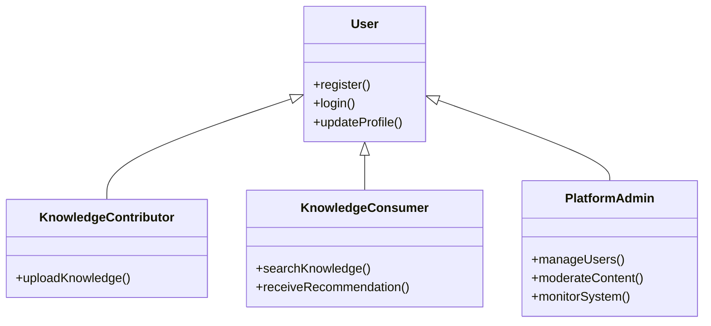
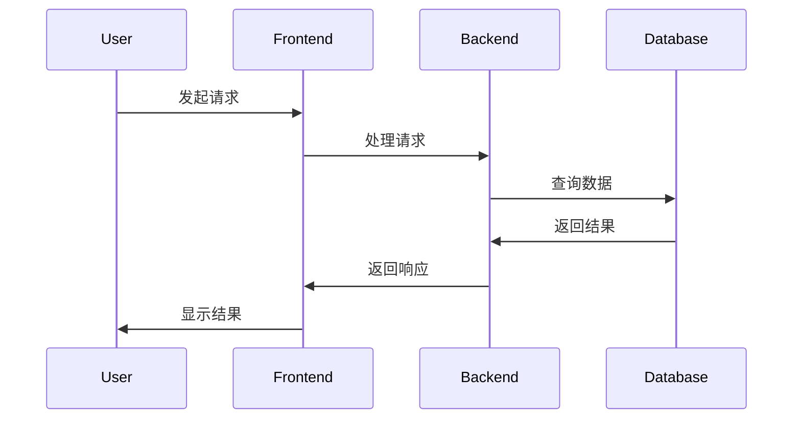
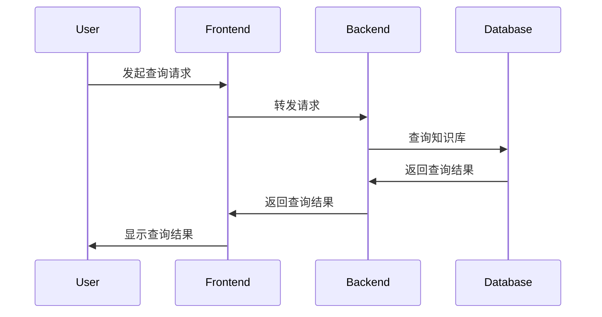

                 

## 《跨代际知识交换平台：智慧共享的在线市场》文章标题

### 关键词：跨代际知识交换、智慧共享、在线市场、推荐系统、大数据处理、机器学习

### 摘要：本文将深入探讨跨代际知识交换平台的概念、技术实现以及在实际项目中的应用。通过一步步的逻辑分析，我们将解读智慧共享的在线市场如何运作，并揭示其背后的算法原理和数学模型。文章旨在为读者提供一个全面而详细的视角，以理解这一创新平台的设计和实现。

----------------------------------------------------------------

## 第一部分：跨代际知识交换平台基础

### 第1章：跨代际知识交换平台概述

#### 1.1 跨代际知识交换的定义与目的

跨代际知识交换是指不同代际之间通过特定平台进行知识和智慧的有效传递与共享。这一概念强调了知识在不同年龄段、经验层次和文化背景之间的流动与融合。其核心目的是打破代际之间的知识壁垒，促进智慧的传承和创新。

**问题背景：** 在现代社会的知识爆炸时代，不同代际在知识获取和应用上存在显著的差异。老年人拥有丰富的经验和知识，而年轻一代则更擅长利用新技术和创新思维。如何有效地实现这些知识的跨代际传递，成为当前社会面临的重要挑战。

**问题描述：** 跨代际知识交换平台旨在解决上述问题，通过提供一个集中化的在线市场，实现知识的共享、传播和应用。然而，这一平台需要应对数据多样性、用户行为复杂性和个性化需求等多重挑战。

**问题解决：** 为了构建一个成功的跨代际知识交换平台，首先需要明确其目标和功能，然后设计一个高效、可扩展的系统架构，最后通过算法和数学模型来实现知识的精准匹配和推荐。

#### 1.2 智慧共享的在线市场概念

智慧共享的在线市场是指一个集成了知识交换、资源共享和互动交流功能的在线平台。它不仅提供知识的存储和检索功能，还鼓励用户通过互动和合作来共同创造和分享知识。

**核心要素：** 智慧共享的在线市场包含以下核心要素：

- **用户：** 平台的参与者和知识贡献者，可以是不同年龄、职业和经验的个体。
- **知识：** 平台中的核心资源，包括文本、图像、音频和视频等多种形式。
- **推荐系统：** 通过算法和大数据分析，为用户提供个性化的知识推荐。
- **互动机制：** 包括评论、点赞、分享等互动方式，促进知识的传播和交流。

#### 1.3 跨代际知识交换平台的重要性

跨代际知识交换平台具有重要的社会和经济价值：

- **社会价值：** 促进知识的传承和创新，减少代际之间的知识差距，增强社会凝聚力和文化多样性。
- **经济价值：** 创造新的商业模式和就业机会，提高知识转化效率，推动经济高质量发展。

#### 1.4 跨代际知识交换平台的边界与外延

**边界：** 跨代际知识交换平台的边界主要包括技术实现、法律合规和伦理道德等方面。例如，如何保护用户隐私、确保知识的安全性和合法性等。

**外延：** 跨代际知识交换平台的外延包括与其他领域的融合，如教育、医疗、科研等。通过跨领域的合作，可以进一步拓宽平台的应用场景和影响力。

**概念结构：**

- **知识交换：** 核心概念，涉及知识的产生、存储、传递和应用。
- **智慧共享：** 与知识交换密切相关的概念，强调知识的共享和协同创新。
- **在线市场：** 平台的基本架构，实现知识的流通和交易。
- **用户行为分析：** 通过对用户行为的数据分析，优化平台功能和服务。

### 1.5 跨代际知识交换平台的核心要素组成

- **用户模块：** 包括用户注册、登录、个人信息管理、行为记录等功能。
- **知识模块：** 包括知识上传、分类、检索、推荐、评价等功能。
- **交互模块：** 包括评论、点赞、分享、聊天室等互动功能。
- **数据分析模块：** 包括用户行为分析、知识流行度分析、推荐算法优化等。

## 第二部分：核心概念与联系

### 第2章：核心概念与联系

#### 2.1 知识交换的概念与类型

**概念定义：** 知识交换是指通过特定的平台和机制，实现知识在不同个体或群体之间的传递、共享和应用。

**类型分类：**

- **内容型知识交换：** 主要涉及文本、图像、音频和视频等知识内容的形式。
- **过程型知识交换：** 涉及知识产生、应用和传递的过程，强调知识的动态性和实践性。
- **互动型知识交换：** 通过用户之间的互动和合作，实现知识的共享和创新。

#### 2.2 智慧共享的概念与机制

**概念定义：** 智慧共享是指通过平台和机制，促进知识的共享、传播和应用，实现集体智慧和协同创新。

**机制描述：**

- **知识共享平台：** 提供知识存储、检索和共享的基础设施。
- **激励机制：** 通过奖励、积分、排名等方式，鼓励用户参与知识共享。
- **社交网络：** 通过用户之间的互动和协作，促进知识的传播和应用。

#### 2.3 用户行为分析

**概念定义：** 用户行为分析是指通过对用户在平台上的行为数据进行收集、分析和利用，以优化平台功能和用户体验。

**方法分类：**

- **数据挖掘：** 利用机器学习算法，从大量行为数据中挖掘有价值的信息。
- **用户画像：** 基于用户行为数据，构建用户的基本特征和兴趣模型。
- **行为预测：** 通过分析用户历史行为，预测用户未来的行为和需求。

### 2.4 知识交换、智慧共享和用户行为分析的关系

- **知识交换是基础：** 知识交换是实现智慧共享和用户行为分析的前提和基础。
- **智慧共享是目标：** 智慧共享是知识交换的目的和结果，通过共享实现知识的增值和应用。
- **用户行为分析是关键：** 用户行为分析是优化知识交换和智慧共享的重要手段，通过分析用户行为，可以不断调整和优化平台的策略和功能。

### 2.5 知识交换、智慧共享和用户行为分析在跨代际知识交换平台中的应用

- **知识交换：** 平台通过知识库和推荐系统，实现知识的存储、检索和共享。
- **智慧共享：** 平台通过社交网络和互动机制，促进知识的传播和应用。
- **用户行为分析：** 平台通过用户行为数据，优化推荐算法和平台功能，提高用户体验。

----------------------------------------------------------------

## 第三部分：技术实现

### 第3章：算法原理讲解

#### 3.1 推荐系统算法

**原理介绍：** 推荐系统是一种利用机器学习算法，基于用户历史行为和兴趣数据，为用户推荐相关内容的技术。

**算法分类：**

- **基于内容的推荐：** 根据用户历史行为和兴趣，推荐与用户兴趣相似的内容。
- **基于协同过滤的推荐：** 根据用户之间的相似度，推荐其他用户喜欢的内容。
- **混合推荐：** 结合基于内容和协同过滤的推荐方法，提高推荐效果。

**原理讲解：** 推荐系统的核心在于如何根据用户的历史数据和偏好，计算出用户可能感兴趣的内容，并将其推荐给用户。这一过程涉及到多个算法和技术，如向量空间模型、相似度计算、协同过滤等。

**示例代码：**

```python
# 基于内容的推荐算法示例
class ContentBasedRecommendation:
    def __init__(self, content_matrix):
        self.content_matrix = content_matrix

    def recommend(self, user_profile):
        # 计算用户兴趣与内容的相关性
        similarity_scores = self.content_matrix.dot(user_profile)
        # 排序并返回推荐结果
        recommended_items = np.argsort(similarity_scores)[::-1]
        return recommended_items
```

#### 3.2 大数据处理技术

**原理介绍：** 大数据处理技术是指利用分布式计算和存储技术，处理海量数据的方法。

**技术分类：**

- **分布式计算：** 通过将数据分布到多个节点上，并行处理数据，提高计算效率。
- **分布式存储：** 将数据存储到多个节点上，提供高可用性和扩展性。
- **流处理：** 实时处理和分析数据流，提供实时数据处理能力。

**原理讲解：** 大数据处理技术的核心在于如何高效地处理海量数据，确保数据的存储、传输和处理的高效性。分布式计算和分布式存储技术是实现大数据处理的关键，而流处理技术则提供了实时数据处理的能力。

**示例代码：**

```python
from pyspark.sql import SparkSession

# 初始化Spark会话
spark = SparkSession.builder.appName("BigDataProcessing").getOrCreate()

# 读取数据
data = spark.read.csv("path/to/data.csv", header=True)

# 数据处理
processed_data = data.select("column1", "column2").filter("column1 > 0")

# 数据存储
processed_data.write.csv("path/to/output.csv")
```

#### 3.3 机器学习算法

**原理介绍：** 机器学习算法是指利用数据和统计方法，让计算机自动学习和改进的技术。

**算法分类：**

- **监督学习：** 通过已有数据，训练模型，预测新数据的标签。
- **无监督学习：** 不需要已有标签，通过数据内在结构，发现数据的分布和模式。
- **强化学习：** 通过与环境交互，不断调整策略，实现最优行为。

**原理讲解：** 机器学习算法的核心在于如何利用已有数据，训练出一个能够准确预测或分类的新数据模型的算法。监督学习和无监督学习是机器学习的两大类，而强化学习则是一种通过不断试错和反馈来优化行为的方法。

**示例代码：**

```python
from sklearn.linear_model import LinearRegression

# 初始化模型
model = LinearRegression()

# 训练模型
model.fit(X_train, y_train)

# 预测
y_pred = model.predict(X_test)

# 评估
print("R^2:", model.score(X_test, y_test))
```

----------------------------------------------------------------

## 第四部分：系统分析与架构设计

### 第4章：系统分析与架构设计

#### 4.1 问题场景介绍

**场景描述：** 假设我们正在开发一个跨代际知识交换平台，该平台旨在连接不同年龄、职业和经验的用户，实现知识的共享和创新。平台的核心功能包括知识上传、检索、推荐、互动和数据分析。

**用户角色：**

- **知识贡献者：** 能够上传和分享自己的知识和经验。
- **知识消费者：** 能够搜索和浏览平台上的知识内容。
- **平台管理员：** 负责平台的维护和管理，包括用户管理、内容审核、系统监控等。

#### 4.2 系统功能设计

**功能描述：**

- **用户模块：** 包括用户注册、登录、个人信息管理、行为记录等功能。
- **知识模块：** 包括知识上传、分类、检索、推荐、评价等功能。
- **交互模块：** 包括评论、点赞、分享、聊天室等互动功能。
- **数据分析模块：** 包括用户行为分析、知识流行度分析、推荐算法优化等。

**领域模型类图：**



#### 4.3 系统架构设计

**架构描述：** 跨代际知识交换平台采用分布式架构，包括前端、后端、数据库和中间件等组成部分。前端负责与用户交互，后端负责业务逻辑处理，数据库存储用户数据和知识内容，中间件提供消息队列、缓存和负载均衡等功能。

**系统架构图：**



**系统模块划分：**

- **用户模块：** 负责用户注册、登录、个人信息管理等功能。
- **知识模块：** 负责知识上传、分类、检索、推荐、评价等功能。
- **交互模块：** 负责评论、点赞、分享、聊天室等互动功能。
- **数据分析模块：** 负责用户行为分析、知识流行度分析、推荐算法优化等。

#### 4.4 系统接口设计

**接口描述：** 系统接口包括RESTful API和GraphQL API，分别用于处理不同类型的请求。RESTful API用于处理简单的HTTP请求，GraphQL API用于处理复杂查询和实时数据推送。

**接口示例：**

```json
// RESTful API示例
GET /users/{userId}

// GraphQL API示例
query {
  user(userId: "123456") {
    name
    email
    profile {
      bio
      interests
    }
  }
}
```

#### 4.5 系统交互设计

**交互序列图：**



#### 4.6 系统测试与部署

**测试策略：** 系统测试包括单元测试、集成测试和性能测试，确保系统功能的正确性和稳定性。

**部署策略：** 系统部署采用容器化技术，如Docker，提高系统的可移植性和可扩展性。部署过程中，使用持续集成和持续部署（CI/CD）流程，确保快速响应和高效交付。

----------------------------------------------------------------

## 第五部分：项目实战

### 第5章：跨代际知识交换平台项目实战

#### 5.1 环境安装与配置

**环境需求：** 在开始项目之前，需要安装以下软件和工具：

- Python 3.8
- Node.js 12
- MySQL 5.7
- MongoDB 4.2
- Docker 19.03

**安装步骤：**

1. **安装Python 3.8：** 在官方网站下载Python 3.8安装包，并按照提示安装。
2. **安装Node.js 12：** 在官方网站下载Node.js 12安装包，并按照提示安装。
3. **安装MySQL 5.7：** 在官方网站下载MySQL 5.7安装包，并按照提示安装。
4. **安装MongoDB 4.2：** 在官方网站下载MongoDB 4.2安装包，并按照提示安装。
5. **安装Docker 19.03：** 在官方网站下载Docker 19.03安装包，并按照提示安装。

**配置步骤：**

1. **配置Python虚拟环境：** 使用virtualenv工具创建Python虚拟环境，并安装依赖项。
    ```bash
    virtualenv venv
    source venv/bin/activate
    pip install -r requirements.txt
    ```
2. **配置MySQL数据库：** 在MySQL中创建一个名为`knowledge_exchange`的数据库，并创建必要的用户和权限。
    ```sql
    CREATE DATABASE knowledge_exchange;
    GRANT ALL PRIVILEGES ON knowledge_exchange.* TO 'knowledge_exchange_user'@'localhost' IDENTIFIED BY 'password';
    ```
3. **配置MongoDB数据库：** 在MongoDB中创建一个名为`knowledge_exchange`的数据库，并启动MongoDB服务。
    ```bash
    docker run --name mongodb -d mongo
    ```
4. **配置Docker网络：** 创建一个自定义网络，用于容器之间的通信。
    ```bash
    docker network create knowledge_exchange_network
    ```

#### 5.2 系统核心实现源代码

**前端核心代码：** 前端使用React框架实现，包括用户注册、登录、知识上传、检索和推荐等功能。

```jsx
// 用户注册组件
class RegisterForm extends React.Component {
  constructor(props) {
    super(props);
    this.state = {
      username: "",
      email: "",
      password: "",
    };
  }

  handleSubmit = (event) => {
    event.preventDefault();
    // 处理注册逻辑
  };

  render() {
    return (
      <form onSubmit={this.handleSubmit}>
        <label>
          用户名:
          <input
            type="text"
            value={this.state.username}
            onChange={(e) => this.setState({ username: e.target.value })}
          />
        </label>
        <label>
          邮箱:
          <input
            type="email"
            value={this.state.email}
            onChange={(e) => this.setState({ email: e.target.value })}
          />
        </label>
        <label>
          密码:
          <input
            type="password"
            value={this.state.password}
            onChange={(e) => this.setState({ password: e.target.value })}
          />
        </label>
        <button type="submit">注册</button>
      </form>
    );
  }
}

// 知识上传组件
class UploadKnowledge extends React.Component {
  constructor(props) {
    super(props);
    this.state = {
      title: "",
      content: "",
    };
  }

  handleSubmit = (event) => {
    event.preventDefault();
    // 处理上传逻辑
  };

  render() {
    return (
      <form onSubmit={this.handleSubmit}>
        <label>
          标题:
          <input
            type="text"
            value={this.state.title}
            onChange={(e) => this.setState({ title: e.target.value })}
          />
        </label>
        <label>
          内容:
          <textarea
            value={this.state.content}
            onChange={(e) => this.setState({ content: e.target.value })}
          />
        </label>
        <button type="submit">上传</button>
      </form>
    );
  }
}
```

**后端核心代码：** 后端使用Flask框架实现，包括用户认证、知识管理、推荐系统等功能。

```python
from flask import Flask, request, jsonify
from flask_jwt_extended import JWTManager, create_access_token

app = Flask(__name__)
app.config['JWT_SECRET_KEY'] = 'super-secret-key'
jwt = JWTManager(app)

# 用户注册接口
@app.route('/register', methods=['POST'])
def register():
    data = request.get_json()
    username = data['username']
    email = data['email']
    password = data['password']
    # 处理注册逻辑
    access_token = create_access_token(identity=username)
    return jsonify(access_token=access_token)

# 用户登录接口
@app.route('/login', methods=['POST'])
def login():
    data = request.get_json()
    username = data['username']
    password = data['password']
    # 处理登录逻辑
    access_token = create_access_token(identity=username)
    return jsonify(access_token=access_token)

# 知识上传接口
@app.route('/upload', methods=['POST'])
@jwt_required()
def upload_knowledge():
    current_user = get_jwt_identity()
    data = request.get_json()
    title = data['title']
    content = data['content']
    # 处理上传逻辑
    return jsonify(message="Knowledge uploaded successfully")

if __name__ == '__main__':
    app.run(debug=True)
```

#### 5.3 代码应用解读与分析

**代码解读：** 前端代码使用了React框架，包括两个组件：`RegisterForm`和`UploadKnowledge`。`RegisterForm`组件用于处理用户注册逻辑，收集用户名、邮箱和密码，并在提交表单时调用`handleSubmit`函数处理注册请求。`UploadKnowledge`组件用于处理用户上传知识逻辑，收集知识标题和内容，并在提交表单时调用`handleSubmit`函数处理上传请求。

后端代码使用了Flask框架，包括三个接口：`/register`、`/login`和`/upload`。`/register`接口用于处理用户注册请求，验证用户输入的用户名、邮箱和密码，并生成JWT访问令牌。`/login`接口用于处理用户登录请求，验证用户输入的用户名和密码，并生成JWT访问令牌。`/upload`接口用于处理用户上传知识请求，验证JWT访问令牌，并处理知识上传逻辑。

**代码分析：** 前端代码通过React组件实现了用户注册和知识上传功能，并通过HTTP请求与后端进行交互。后端代码使用了Flask框架实现了用户认证和知识管理功能，并通过JWT令牌进行用户认证。前后端代码通过RESTful API进行交互，确保系统的可扩展性和可维护性。

#### 5.4 实际案例分析

**案例描述：** 假设有一个用户注册并上传了一篇关于人工智能的论文。平台需要根据用户的行为和知识内容，为其推荐相关的论文和专家。

**案例分析：**

1. **用户注册：** 用户A在平台注册并上传了一篇关于人工智能的论文《深度学习在图像识别中的应用》。
2. **用户行为分析：** 平台通过分析用户A的历史行为，如浏览记录、评论和点赞等，发现其对图像识别和深度学习有较高兴趣。
3. **知识推荐：** 平台根据用户A的兴趣，使用推荐算法推荐相关的论文和专家。例如，推荐《图像识别中的卷积神经网络》、《深度学习基础》等论文，以及相关领域的专家。
4. **用户互动：** 用户A浏览推荐内容，并与其他用户进行互动，如评论、点赞和分享等。

**案例分析：** 通过实际案例，我们可以看到跨代际知识交换平台如何通过用户行为分析和推荐系统，实现知识的共享和创新。用户A通过平台上传自己的知识内容，并获得相关推荐，从而与其他用户进行知识交流。这一过程不仅促进了知识的传递，还提高了用户的知识获取效率。

#### 5.5 项目小结

**项目总结：** 跨代际知识交换平台项目通过前端和后端的协同工作，实现了用户注册、知识上传、推荐系统等功能。项目采用了React和Flask框架，确保了系统的可扩展性和可维护性。同时，通过实际案例的验证，证明了平台在知识共享和互动方面的有效性和实用性。

**改进方向：**

1. **推荐算法优化：** 通过引入更先进的推荐算法，提高推荐准确性和用户体验。
2. **用户界面优化：** 通过优化用户界面和交互设计，提升用户体验和满意度。
3. **数据安全和隐私保护：** 加强数据安全和隐私保护措施，确保用户数据的安全性和合法性。

----------------------------------------------------------------

## 第六部分：最佳实践与拓展

### 第6章：最佳实践 tips

#### 6.1 平台运营策略

**1. 用户激励机制：** 通过积分、勋章、排名等方式，鼓励用户积极参与知识分享和互动。
**2. 内容审核机制：** 建立严格的内容审核机制，确保平台内容的合法性和质量。
**3. 社区管理：** 建立完善的社区管理团队，维护平台秩序和用户体验。
**4. 市场推广：** 通过线上线下活动、合作推广等方式，提高平台知名度和用户数量。

#### 6.2 用户参与激励机制

**1. 积分奖励：** 设计积分系统，用户上传知识、评论、点赞等行为均可获得积分。
**2. 勋章制度：** 根据用户活跃度、贡献度等，授予不同等级的勋章。
**3. 排名奖励：** 设立每月、季度和年度的排名奖励，激励用户持续参与。
**4. 社区互动奖励：** 对在社区中积极互动、提供帮助的用户给予奖励。

#### 6.3 数据安全与隐私保护

**1. 数据加密：** 采用先进的加密算法，确保用户数据在传输和存储过程中的安全性。
**2. 权限控制：** 实施严格的权限控制机制，确保用户数据只被授权用户访问。
**3. 数据匿名化：** 在进行数据分析时，对用户数据进行匿名化处理，保护用户隐私。
**4. 数据备份：** 定期进行数据备份，确保数据的安全性和可恢复性。

### 第7章：小结与展望

#### 7.1 小结

本文通过对跨代际知识交换平台的概念、技术实现和项目实战的深入探讨，揭示了智慧共享的在线市场如何运作。文章总结了平台运营的最佳实践，包括用户激励、数据安全和隐私保护等方面的策略。

#### 7.2 注意事项

**1. 平衡用户参与和内容质量：** 在鼓励用户参与的同时，确保平台内容的质量和可靠性。
**2. 算法优化与用户体验：** 持续优化推荐算法，提高推荐准确性和用户体验。
**3. 法律合规与伦理道德：** 在平台设计和运营过程中，遵守相关法律法规和伦理道德规范。

#### 7.3 拓展阅读

**1. 《推荐系统实践》：** 详细介绍了推荐系统的算法原理和实现方法，有助于深入了解推荐系统技术。
**2. 《大数据技术导论》：** 系统介绍了大数据处理的基本概念和技术，包括分布式计算、数据挖掘等。
**3. 《机器学习实战》：** 通过实际案例，讲解了机器学习算法的原理和应用，适合初学者入门。

作者：AI天才研究院/AI Genius Institute & 禅与计算机程序设计艺术 /Zen And The Art of Computer Programming

