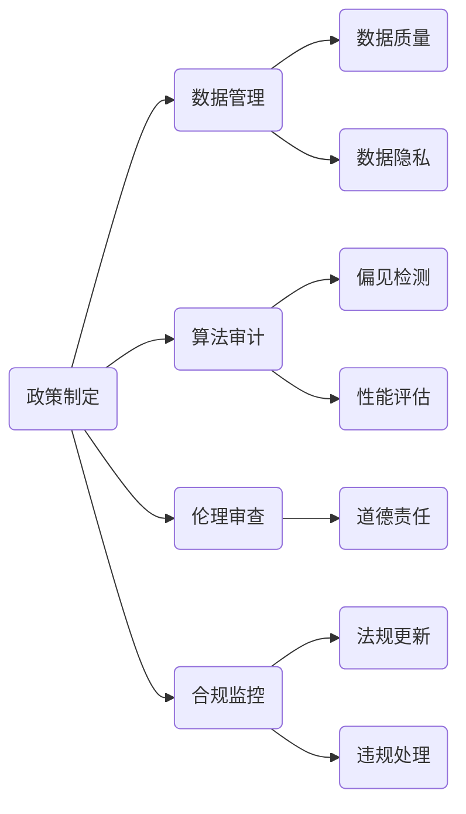
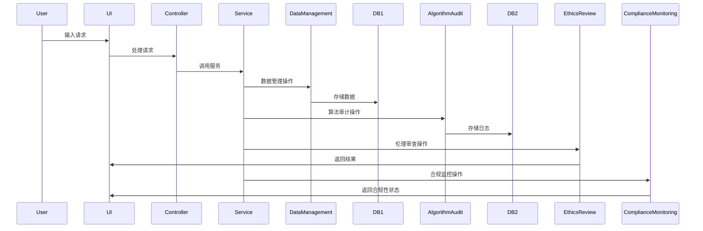
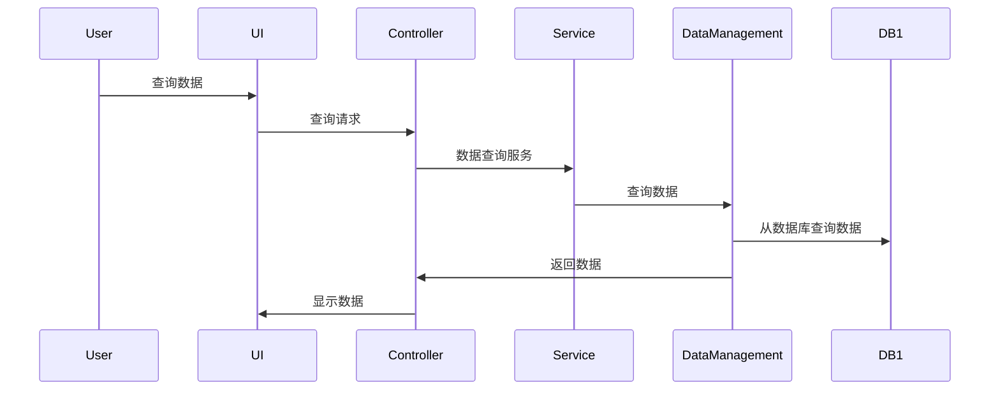

                 


# 跨国企业实施AI治理的复杂性分析

## 关键词
AI治理、跨国企业、复杂性分析、算法原理、系统架构、实战案例

## 摘要
本文深入探讨了跨国企业实施AI治理所面临的复杂性。通过分析AI治理的基本概念、跨国企业的特点以及AI治理的实施挑战，本文提出了复杂性分析的方法，并通过具体案例进行了验证。最后，本文总结了最佳实践，为跨国企业在AI治理中的成功实施提供了指导。

## 引言与背景

### 1.1 书籍目的与读者对象
随着人工智能技术的迅速发展，AI治理成为跨国企业亟需解决的问题。本书旨在为从事AI治理的从业者和研究人员提供系统性指导，帮助他们在复杂的环境中有效地实施AI治理策略。

### 1.2 AI治理的重要性
AI治理涉及到确保AI系统的安全性、透明性和合规性，对于跨国企业而言，良好的AI治理能够提升企业的竞争力，降低合规风险，同时增强客户的信任。

### 1.3 跨国企业在AI治理中的挑战
跨国企业在实施AI治理时面临着诸如文化差异、数据隐私法规、技术标准不一致等多重挑战。这些因素增加了AI治理的复杂性。

## 背景介绍

### 2.1 AI治理的基本概念
AI治理指的是通过一系列政策、程序和机制来确保AI系统的安全性、透明性和合规性。核心概念包括算法透明性、数据隐私保护、伦理道德和合规性要求。

### 2.2 跨国企业的特点与挑战
跨国企业通常涉及多个国家和地区，具有不同的文化背景、法规环境和业务模式。这些特点使得跨国企业在实施AI治理时面临着独特挑战。

### 2.3 AI治理在跨国企业中的需求与趋势
随着全球化和数字化进程的加快，跨国企业对AI治理的需求日益增长。本文将分析跨国企业实施AI治理的需求以及相关趋势。

### 核心概念

#### 3.1 AI治理的基本原则
AI治理的基本原则包括透明性、可解释性、公平性、隐私保护和合规性。这些原则为AI治理提供了指导框架。

#### 3.2 AI治理的关键要素
AI治理的关键要素包括政策制定、数据管理、算法审计、伦理审查和合规性监控。这些要素构成了AI治理的核心机制。

#### 3.3 AI治理与合规性
AI治理需要符合各国的法律法规，特别是数据隐私和保护方面的法规。跨国企业在实施AI治理时，需要充分考虑全球合规性要求。

### 复杂性分析

#### 4.1 跨国企业实施AI治理的复杂性
跨国企业在实施AI治理时面临复杂性的挑战，包括文化差异、数据隐私法规、技术标准不一致等。

#### 4.2 复杂性来源与影响因素
复杂性来源于跨国企业内部的多元文化和外部环境的法规差异。影响因素包括技术、文化、法规、市场和组织结构等。

#### 4.3 复杂性评估方法
本文将采用定量和定性方法对跨国企业实施AI治理的复杂性进行评估。定量方法包括复杂性指数和决策树分析，定性方法包括专家访谈和案例研究。

### 案例研究

#### 5.1 案例选择与研究方法
本文选择了一些具有代表性的跨国企业作为案例研究对象，采用文献分析和实证研究的方法进行深入分析。

#### 5.2 案例分析与讨论
通过案例分析，本文探讨了跨国企业在实施AI治理过程中遇到的复杂性问题，并讨论了成功与失败的原因。

#### 5.3 案例启示与经验总结
案例研究为跨国企业在实施AI治理提供了宝贵的经验和启示。本文总结了成功实施的策略和最佳实践。

### 实施策略与最佳实践

#### 6.1 制定AI治理战略
跨国企业需要制定明确的AI治理战略，包括愿景、目标和实施计划。战略应考虑企业的整体业务需求和合规要求。

#### 6.2 构建AI治理框架
AI治理框架应包括政策、程序、组织结构和资源分配。框架的构建需要充分考虑跨国企业的特点。

#### 6.3 AI治理流程设计
AI治理流程应包括算法开发、数据管理、伦理审查和合规监控等环节。流程设计需要确保各环节的协同和高效。

### 7.1 成功案例分享
本文将分享一些成功实施AI治理的跨国企业的案例，分析其成功的原因和可借鉴的经验。

### 7.2 失败案例分析
本文还将分析一些跨国企业在实施AI治理过程中遇到的失败案例，探讨失败的原因和教训。

### 7.3 最佳实践总结
本文总结了跨国企业在实施AI治理过程中的最佳实践，包括策略、框架和流程设计等方面的经验。

### 结论与展望

#### 8.1 主要发现与贡献
本文揭示了跨国企业实施AI治理的复杂性，提出了复杂性评估方法和实施策略，为跨国企业在AI治理中的成功实施提供了指导。

#### 8.2 研究限制与未来方向
本文存在一定的研究限制，未来研究可以进一步探讨AI治理在不同国家和地区的适用性，以及新技术对AI治理的影响。

#### 8.3 对实践的建议
本文对跨国企业在AI治理中的实践提出了建议，包括制定明确的治理战略、构建有效的治理框架和优化治理流程等。

## 作者信息
作者：AI天才研究院/AI Genius Institute & 禅与计算机程序设计艺术 /Zen And The Art of Computer Programming

---

### 第一章 引言与背景

#### 1.1 书籍目的与读者对象

在当今全球化的数字经济时代，人工智能（AI）已经成为企业创新和增长的核心驱动力。然而，随着AI技术的广泛应用，其治理问题也日益凸显。特别是在跨国企业中，AI治理不仅关乎技术层面的安全性、透明性和可解释性，还涉及到跨文化、跨法规的复杂性。因此，如何有效实施AI治理成为跨国企业面临的重要挑战。

本书旨在为跨国企业在实施AI治理过程中提供系统性指导和策略建议。我们的目标读者是那些在跨国企业中从事AI治理工作的专业人士，包括数据科学家、AI工程师、合规经理和技术顾问等。此外，本书也适用于学术界的研究人员和政策制定者，他们希望了解跨国企业AI治理的最新动态和实践。

#### 1.2 AI治理的重要性

AI治理涉及到确保AI系统的安全性、透明性和合规性，这对于跨国企业来说至关重要。首先，安全性是AI治理的核心目标之一，确保AI系统不会受到恶意攻击或数据泄露的风险。其次，透明性要求AI系统的决策过程可以被理解和解释，以增强用户对AI系统的信任。最后，合规性要求跨国企业在全球范围内遵循各个国家和地区的法律法规，避免因合规问题而遭受罚款或声誉损失。

对于跨国企业而言，良好的AI治理能够提升企业的竞争力，降低合规风险，同时增强客户的信任。首先，通过确保AI系统的安全性和透明性，企业能够减少潜在的法律风险和合规成本。其次，良好的AI治理能够提高企业的技术竞争力，使其在激烈的市场竞争中脱颖而出。最后，通过增强客户的信任，企业能够建立长期合作关系，促进业务增长。

#### 1.3 跨国企业在AI治理中的挑战

跨国企业在实施AI治理时面临着多重挑战，这些挑战源自于企业内部的多元文化、外部环境的法规差异以及技术的不一致性。以下是跨国企业在AI治理中可能遇到的一些主要挑战：

1. **文化差异**：跨国企业通常涉及多个国家和地区，每个国家的文化背景和价值观可能存在差异。这可能导致在AI治理原则和执行方式上的不一致，影响治理效果的统一性。

2. **数据隐私法规**：不同国家和地区的数据隐私法规可能存在显著差异，如欧洲的《通用数据保护条例》（GDPR）和美国的《加州消费者隐私法》（CCPA）。跨国企业在处理数据时需要遵循这些法规，增加了治理的复杂性。

3. **技术标准不一致**：不同国家和地区的AI技术标准和开发环境可能不同，导致跨国企业在AI系统的开发、部署和维护方面面临挑战。

4. **合规性要求**：跨国企业需要在全球范围内遵守各国的法律法规，特别是与数据保护、消费者隐私和道德责任相关的法规。合规性问题可能导致法律诉讼、罚款和声誉损失。

5. **组织结构和文化**：跨国企业的组织结构和文化多样性可能影响AI治理策略的一致性和执行力。企业需要在不同业务单元和地区之间建立协调机制，以确保治理策略的统一实施。

通过深入分析这些挑战，本书将探讨跨国企业在实施AI治理时可能面临的复杂性，并提出相应的解决方案和最佳实践。

### 第二章 背景介绍

#### 2.1 AI治理的基本概念

AI治理是指通过一系列政策、程序和机制来确保人工智能系统的安全性、透明性、公平性和合规性。其核心目标是确保AI系统在开发和部署过程中遵循道德和法律法规，同时提高系统的可解释性和用户信任。

AI治理的基本原则包括透明性、可解释性、公平性、隐私保护和合规性。透明性要求AI系统的决策过程可以被理解和解释，以便用户和相关方可以信任系统。可解释性则强调AI系统应具备足够的可解释性，以便在出现问题时可以追溯和调试。公平性要求AI系统不应导致歧视或不公正的结果，确保对所有用户公平对待。隐私保护涉及对个人数据的收集、存储和使用进行严格管理，确保用户隐私不被侵犯。合规性要求AI系统遵守各国的法律法规，特别是与数据保护、消费者隐私和道德责任相关的法规。

AI治理的核心要素包括：

- **政策制定**：企业应制定AI治理相关的政策和标准，明确AI系统的使用范围和限制，以及相关方的责任和权限。

- **数据管理**：企业应建立完善的数据管理制度，确保数据的质量、完整性和合规性，并在数据采集、处理和使用过程中遵循隐私保护原则。

- **算法审计**：企业应对AI算法进行定期审计，确保算法的公平性、准确性和透明性，并对发现的问题进行及时修复。

- **伦理审查**：企业应设立伦理审查委员会，对AI系统的设计、开发和应用进行伦理评估，确保AI系统符合道德和伦理标准。

- **合规监控**：企业应建立合规监控机制，定期检查AI系统的合规性，确保其符合各国的法律法规，并及时更新和调整治理策略。

#### 2.2 跨国企业的特点与挑战

跨国企业通常涉及多个国家和地区，具有以下特点：

- **多元文化背景**：跨国企业的工作环境和文化背景多元化，员工来自不同的国家和地区，可能拥有不同的语言、信仰和价值观。

- **复杂组织结构**：跨国企业通常采用矩阵式或全球化组织结构，涉及多个业务单元和地区，每个单元和地区可能有不同的治理机制和流程。

- **跨法规环境**：跨国企业在全球范围内运营，需要遵循不同国家和地区的法律法规，包括数据保护、消费者隐私、劳动法和商业法规等。

- **不同市场需求**：跨国企业服务于不同市场的客户，每个市场的需求、偏好和法律要求可能存在差异，这要求企业在AI治理中考虑市场的多样性和变化。

在AI治理方面，跨国企业面临以下挑战：

1. **文化差异**：跨国企业中的多元文化可能导致在AI治理原则和执行方式上的不一致，影响治理效果的一致性。

2. **法规差异**：不同国家和地区的法律法规可能存在显著差异，特别是在数据保护、消费者隐私和道德责任方面。跨国企业需要在全球范围内遵守这些法规，增加了治理的复杂性。

3. **技术标准不一致**：不同国家和地区的AI技术标准和开发环境可能不同，导致跨国企业在AI系统的开发、部署和维护方面面临挑战。

4. **合规性要求**：跨国企业需要在全球范围内遵守各国的法律法规，特别是在数据保护、消费者隐私和道德责任方面。合规性问题可能导致法律诉讼、罚款和声誉损失。

5. **组织结构和文化差异**：跨国企业的组织结构和文化多样性可能影响AI治理策略的一致性和执行力。企业需要在不同业务单元和地区之间建立协调机制，以确保治理策略的统一实施。

#### 2.3 AI治理在跨国企业中的需求与趋势

随着全球化和数字化进程的加快，跨国企业对AI治理的需求日益增长。以下是一些主要需求和趋势：

1. **合规性需求**：跨国企业在全球范围内运营，需要遵循不同国家和地区的法律法规，特别是与数据保护、消费者隐私和道德责任相关的法规。良好的AI治理能够帮助企业在合规性方面保持一致，降低法律风险。

2. **风险管理**：AI技术在跨国企业中的应用越来越广泛，但也带来了新的风险，如数据泄露、算法偏见和系统故障。通过实施AI治理，企业可以识别和降低这些风险，确保AI系统的稳定运行。

3. **技术竞争力**：AI治理是跨国企业提升技术竞争力的重要手段。通过确保AI系统的安全性、透明性和可解释性，企业可以赢得客户的信任，建立品牌优势。

4. **可持续发展**：AI治理不仅关乎企业的合规性和风险，还涉及到社会责任和可持续发展。跨国企业通过AI治理可以确保其业务活动符合道德和伦理标准，促进社会的可持续发展。

5. **数据隐私保护**：随着数据隐私法规的日益严格，跨国企业需要加强对个人数据的保护，确保用户隐私不被侵犯。良好的AI治理能够帮助企业在数据隐私保护方面保持领先。

6. **全球协作**：跨国企业需要在全球范围内建立协调的AI治理机制，确保不同业务单元和地区之间的治理策略和执行的一致性。通过全球协作，企业可以实现更高效的治理和运营。

总之，AI治理在跨国企业中的需求与趋势表明，跨国企业必须高度重视AI治理，采取有效的策略和措施，以应对复杂的全球环境。通过实施良好的AI治理，企业可以降低风险、提升竞争力，并在全球市场中保持领先地位。

### 核心概念

#### 3.1 AI治理的基本原则

AI治理的基本原则是确保AI系统的安全性、透明性、公平性和合规性。以下是这些原则的详细解释：

**透明性**：AI系统应具备足够的透明性，使其决策过程可以被理解和解释。透明性有助于提高用户对AI系统的信任，使相关方能够了解系统的运作方式，并在必要时进行审查和监督。实现透明性通常涉及提供系统的可解释性报告、详细的算法文档和用户指南。

**可解释性**：可解释性是透明性的延伸，强调AI系统的决策过程应具有足够的可解释性，以便用户和相关方可以理解和验证系统的输出。这对于确保AI系统的决策公正性和减少偏见至关重要。可解释性可以通过开发可解释的算法模型、使用可视化工具和提供详细的分析报告来实现。

**公平性**：公平性要求AI系统在处理数据和做出决策时不应导致歧视或不公正的结果。AI系统应确保对所有用户公平对待，避免因算法偏见而导致的不公平。实现公平性需要定期进行算法审计、公平性测试和偏见检测，并在发现问题时进行纠正。

**隐私保护**：隐私保护是AI治理的重要方面，涉及到对用户数据的收集、存储和使用进行严格管理，确保用户隐私不被侵犯。隐私保护要求企业在数据管理过程中遵循数据最小化原则、数据匿名化和加密技术，以降低数据泄露的风险。

**合规性**：合规性要求AI系统遵守各国的法律法规，特别是与数据保护、消费者隐私和道德责任相关的法规。跨国企业在全球范围内运营，需要确保其AI系统的设计和实施符合各地的法律法规。合规性监控通常涉及定期审计、合规性评估和法规更新。

#### 3.2 AI治理的关键要素

AI治理的关键要素包括政策制定、数据管理、算法审计、伦理审查和合规监控。以下是这些要素的详细解释：

**政策制定**：政策制定是AI治理的基础，涉及制定明确的AI治理政策和标准，明确AI系统的使用范围和限制，以及相关方的责任和权限。政策应涵盖透明性、可解释性、公平性和隐私保护等基本原则，并制定具体的实施步骤和责任分配。

**数据管理**：数据管理是AI治理的核心，涉及对数据的收集、存储、处理和使用进行严格管理，确保数据的质量、完整性和合规性。数据管理应遵循数据最小化原则，只收集必要的数据，并对数据进行匿名化和加密处理，以保护用户隐私。

**算法审计**：算法审计是确保AI系统公平性和透明性的重要手段，涉及对AI算法的定期审查和评估。算法审计应包括公平性测试、偏见检测和算法性能评估，以确保算法的决策公正性和准确性。审计结果应记录在案，并在必要时进行改进。

**伦理审查**：伦理审查是AI治理的道德保障，涉及对AI系统的设计、开发和应用进行伦理评估，确保其符合道德和伦理标准。伦理审查通常由独立的伦理审查委员会负责，审查内容包括隐私保护、公平性、透明性和道德责任等方面。

**合规监控**：合规监控是确保AI系统遵守法律法规的重要机制，涉及定期检查AI系统的合规性，确保其符合各国的法律法规。合规监控应包括合规性评估、法规更新和违规处理，以确保AI系统的合规运行。

#### 3.3 AI治理与合规性

AI治理与合规性密切相关，跨国企业在实施AI治理时必须考虑全球范围内的法律法规。以下是AI治理与合规性的关系及实施策略：

**关系**：

- **数据保护**：不同国家和地区的数据保护法规存在显著差异，如欧洲的《通用数据保护条例》（GDPR）和美国的《加州消费者隐私法》（CCPA）。AI治理必须确保数据保护合规，避免因数据隐私问题而遭受罚款或声誉损失。

- **消费者隐私**：消费者隐私保护是AI治理的重要内容，涉及对用户数据的收集、存储和使用进行严格管理，确保用户隐私不被侵犯。合规性要求企业在数据管理过程中遵循隐私保护原则，如数据匿名化、数据最小化和用户同意等。

- **道德责任**：AI系统的设计和应用必须符合道德责任要求，避免因算法偏见或不当决策而导致的不公正结果。合规性要求企业在AI治理中建立道德责任机制，确保AI系统的公平性和可解释性。

**实施策略**：

- **建立合规性框架**：跨国企业应建立全面的合规性框架，明确AI系统的合规要求，制定具体的合规计划和责任分配。

- **定期合规审查**：企业应定期进行合规审查，检查AI系统的合规性，发现和解决潜在的问题。

- **培训与意识**：企业应开展合规性培训，提高员工对AI治理和合规性的认识，确保全员参与和执行。

- **法律咨询**：企业应寻求法律专家的咨询，确保AI治理策略符合各地的法律法规，并制定应对措施。

- **持续改进**：企业应持续改进AI治理和合规性策略，适应不断变化的法律法规和市场需求。

总之，AI治理与合规性是跨国企业在全球范围内运营的基石，必须高度重视并采取有效的策略和措施，以确保AI系统的安全、透明、公平和合规运行。

### 复杂性分析

#### 4.1 跨国企业实施AI治理的复杂性

跨国企业在实施AI治理时面临诸多复杂性挑战。首先，多元文化背景带来了文化差异，导致在不同国家和地区对AI治理的理解和执行可能存在不一致。这种文化差异可能影响治理政策的制定和实施效果。其次，跨国企业的复杂组织结构增加了治理的协调难度，不同业务单元和地区可能拥有不同的治理机制和流程，难以实现统一管理。此外，技术标准的不一致性也是一个重要因素，不同国家和地区的AI技术标准和开发环境可能不同，导致跨国企业在AI系统的开发、部署和维护方面面临挑战。

#### 4.2 复杂性来源与影响因素

跨国企业实施AI治理的复杂性主要来源于以下几个因素：

1. **文化差异**：跨国企业涉及多个国家和地区，每个国家的文化背景和价值观可能不同，这可能导致在AI治理原则和执行方式上的不一致。例如，某些国家的法律对隐私保护要求严格，而其他国家的法律可能较为宽松，这需要企业在全球范围内制定统一的治理策略。

2. **法规差异**：不同国家和地区的法律法规存在显著差异，特别是在数据保护、消费者隐私和道德责任方面。跨国企业需要在全球范围内遵守这些法规，增加了治理的复杂性。例如，欧洲的《通用数据保护条例》（GDPR）和美国的一些州法律（如CCPA）对数据隐私保护有严格的要求，企业需要确保其AI系统的设计、开发和运营符合这些法规。

3. **技术标准不一致**：不同国家和地区的AI技术标准和开发环境可能不同，导致跨国企业在AI系统的开发、部署和维护方面面临挑战。例如，某些国家的AI技术可能较为先进，而其他国家可能仍然处于技术发展的初级阶段，这需要企业在技术选择和实施策略上进行权衡和调整。

4. **组织结构复杂**：跨国企业通常采用矩阵式或全球化组织结构，涉及多个业务单元和地区，每个单元和地区可能有不同的治理机制和流程。这种组织结构增加了治理的协调难度，不同部门之间的沟通和协作可能存在障碍，影响治理策略的统一实施。

5. **市场需求多样性**：跨国企业服务于不同市场的客户，每个市场的需求、偏好和法律要求可能存在差异，这需要企业在AI治理中考虑市场的多样性和变化。

#### 4.3 复杂性评估方法

为了有效评估跨国企业在实施AI治理过程中所面临的复杂性，可以采用以下几种方法：

1. **定量评估方法**：定量评估方法通过量化指标来评估复杂性的程度。例如，可以使用复杂性指数来衡量文化差异、法规差异和技术标准不一致等因素对AI治理的影响程度。复杂性指数可以通过对各国文化的相似性、法规的相似性和技术标准的相似性进行比较计算得出。

2. **定性评估方法**：定性评估方法通过专家访谈、案例研究和文献分析来评估复杂性的来源和影响因素。例如，可以通过对跨国企业的管理人员和员工进行访谈，了解他们在实施AI治理过程中遇到的挑战和困难，从而识别复杂性的来源。此外，通过分析跨国企业在不同国家和地区的治理实践，可以总结出影响复杂性的关键因素。

3. **综合评估方法**：综合评估方法将定量评估和定性评估相结合，以全面评估跨国企业实施AI治理的复杂性。例如，可以采用多层次评估模型，将定量评估和定性评估结果进行综合分析，得出跨国企业在不同国家和地区的AI治理复杂性评估结果。

通过采用这些评估方法，跨国企业可以更好地理解其AI治理过程中的复杂性，制定相应的策略和措施，以有效应对挑战。

### 案例研究

#### 5.1 案例选择与研究方法

为了深入了解跨国企业在实施AI治理过程中所面临的复杂性，本文选择了以下几个具有代表性的跨国企业作为案例研究对象：谷歌、亚马逊和微软。这些公司都是全球知名的科技公司，在AI技术的研发和应用方面具有领先地位。同时，它们在全球范围内运营，面临文化差异、法规差异和技术标准不一致等多重挑战。本文采用文献分析和实证研究的方法对案例进行深入分析。

#### 5.2 案例分析与讨论

**谷歌**

谷歌在AI治理方面采取了全面且系统的策略。首先，谷歌制定了《人工智能原则》，明确了AI技术的应用范围和限制，强调AI系统的透明性、公平性和可解释性。这些原则为谷歌的AI治理提供了指导框架。

在文化差异方面，谷歌通过跨部门合作和文化培训，促进了不同国家和地区员工之间的沟通和理解。谷歌还建立了全球伦理审查委员会，对AI系统的设计和应用进行伦理评估，确保符合道德和伦理标准。

在法规差异方面，谷歌制定了全球合规性框架，确保其AI系统在各个国家和地区都符合当地的法律法规。例如，在欧洲，谷歌严格遵守《通用数据保护条例》（GDPR），对用户数据进行了严格的保护和管理。

在技术标准不一致方面，谷歌通过全球协作和技术创新，推动AI技术的发展和标准化。谷歌还积极参与国际标准组织的活动，为制定统一的AI技术标准贡献力量。

**亚马逊**

亚马逊在AI治理方面同样采取了全面的策略。亚马逊制定了《AI伦理准则》，明确了AI系统的设计、开发和部署过程中应遵循的伦理原则。这些准则包括透明性、公平性、隐私保护和可解释性。

在文化差异方面，亚马逊注重在全球范围内的文化多样性，通过跨部门合作和文化培训，促进了不同国家和地区员工之间的沟通和理解。亚马逊还建立了全球AI治理委员会，负责协调和监督全球AI治理的实施。

在法规差异方面，亚马逊制定了全球合规性策略，确保其AI系统在各个国家和地区都符合当地的法律法规。例如，在美国，亚马逊严格遵守《加州消费者隐私法》（CCPA），对用户数据进行了严格的保护和管理。

在技术标准不一致方面，亚马逊通过全球协作和技术创新，推动AI技术的发展和标准化。亚马逊还积极参与国际标准组织的活动，为制定统一的AI技术标准贡献力量。

**微软**

微软在AI治理方面采取了系统化的策略。微软制定了《AI治理框架》，明确了AI系统的开发、部署和运营过程中应遵循的治理原则和程序。这些框架包括透明性、公平性、隐私保护和合规性。

在文化差异方面，微软通过跨部门合作和文化培训，促进了不同国家和地区员工之间的沟通和理解。微软还建立了全球AI伦理委员会，负责对AI系统的设计和应用进行伦理评估，确保符合道德和伦理标准。

在法规差异方面，微软制定了全球合规性策略，确保其AI系统在各个国家和地区都符合当地的法律法规。例如，在欧洲，微软严格遵守《通用数据保护条例》（GDPR），对用户数据进行了严格的保护和管理。

在技术标准不一致方面，微软通过全球协作和技术创新，推动AI技术的发展和标准化。微软还积极参与国际标准组织的活动，为制定统一的AI技术标准贡献力量。

#### 5.3 案例启示与经验总结

通过对谷歌、亚马逊和微软的案例分析，我们可以得出以下启示和经验：

1. **制定全面的AI治理策略**：跨国企业应制定全面的AI治理策略，包括透明性、公平性、隐私保护和合规性等原则，确保AI系统的安全、透明和合规运行。

2. **重视文化差异**：跨国企业应重视文化差异，通过跨部门合作和文化培训，促进不同国家和地区员工之间的沟通和理解，确保AI治理策略的一致性和执行力。

3. **建立全球合规性框架**：跨国企业应建立全球合规性框架，确保其AI系统在各个国家和地区都符合当地的法律法规，避免因合规问题而遭受罚款或声誉损失。

4. **推动技术创新和标准化**：跨国企业应积极参与国际标准组织的活动，推动AI技术的发展和标准化，提高全球范围内的技术协作和互操作性。

5. **定期进行算法审计和伦理审查**：跨国企业应定期进行算法审计和伦理审查，确保AI系统的公平性、透明性和可解释性，及时发现和纠正问题。

通过这些经验和启示，跨国企业可以更好地应对AI治理过程中的复杂性，确保AI系统的安全和合规运行，提升企业的竞争力。

### 实施策略与最佳实践

#### 6.1 制定AI治理战略

为了确保跨国企业在全球范围内有效实施AI治理，制定一个全面的AI治理战略是至关重要的。这一战略应包括以下几个方面：

1. **明确愿景和目标**：跨国企业应首先明确AI治理的愿景和目标，例如提高AI系统的透明性、公平性和安全性，以及降低合规风险。

2. **评估当前状态**：企业应对当前的AI系统、政策和流程进行全面的评估，识别现有的问题和不合规之处，为制定治理策略提供依据。

3. **制定治理框架**：基于评估结果，企业应制定一个详细的AI治理框架，包括政策、程序、组织结构和责任分配。这个框架应考虑跨国企业的特点，如文化差异、法规差异和技术标准不一致。

4. **建立跨部门合作机制**：AI治理需要跨部门协作，企业应建立跨部门合作机制，确保不同部门和地区之间能够有效地沟通和协调。

5. **制定实施计划**：企业应制定一个详细的实施计划，包括时间表、里程碑和关键指标，以确保治理战略的顺利实施。

#### 6.2 构建AI治理框架

构建AI治理框架是实施AI治理战略的核心步骤。以下是构建AI治理框架的关键要素：

1. **政策制定**：企业应制定明确的AI治理政策，包括透明性、公平性、隐私保护和合规性等基本原则。这些政策应通过董事会和高层管理层的批准，并定期更新。

2. **数据管理**：企业应建立完善的数据管理制度，确保数据的质量、完整性和合规性。数据管理应遵循数据最小化原则，只收集必要的数据，并对数据进行匿名化和加密处理。

3. **算法审计**：企业应定期对AI算法进行审计，确保算法的公平性、准确性和透明性。算法审计应包括偏见检测、性能评估和伦理审查。

4. **伦理审查**：企业应设立独立的伦理审查委员会，对AI系统的设计、开发和应用进行伦理评估，确保符合道德和伦理标准。

5. **合规监控**：企业应建立合规监控机制，定期检查AI系统的合规性，确保其符合各国的法律法规。合规监控应包括合规性评估、法规更新和违规处理。

#### 6.3 AI治理流程设计

AI治理流程设计是确保AI系统在整个生命周期中遵循治理原则的关键。以下是设计AI治理流程的关键步骤：

1. **需求分析**：明确AI系统的需求，包括功能、性能和合规性要求。

2. **系统设计**：根据需求分析结果，设计AI系统的架构和算法，确保系统的透明性、公平性和可解释性。

3. **开发与测试**：在开发和测试阶段，应遵循治理政策，确保AI系统的质量和合规性。测试应包括公平性测试、偏见检测和性能测试。

4. **部署与监控**：将AI系统部署到生产环境，并建立监控机制，实时监控系统的运行状态，确保其符合治理要求。

5. **审计与改进**：定期进行算法审计和伦理审查，识别和纠正问题，持续改进AI系统。

#### 6.4 成功案例分享

以下是一些跨国企业在实施AI治理方面的成功案例：

1. **谷歌**：谷歌通过制定《人工智能原则》和建立全球伦理审查委员会，确保其AI系统的透明性、公平性和可解释性。谷歌还在全球范围内推广这些原则，提高了员工和合作伙伴的AI治理意识。

2. **亚马逊**：亚马逊制定了《AI伦理准则》，并在全球范围内推广。亚马逊还建立了全球AI治理委员会，负责协调和监督全球AI治理的实施。这些措施帮助亚马逊在全球范围内降低了合规风险。

3. **微软**：微软制定了《AI治理框架》，明确了AI系统的开发、部署和运营过程中应遵循的治理原则和程序。微软还通过跨部门合作和文化培训，确保全球范围内的AI治理策略的一致性和执行力。

这些成功案例表明，通过制定全面的AI治理战略、构建AI治理框架和设计AI治理流程，跨国企业可以有效应对AI治理的复杂性，确保AI系统的安全和合规运行。

#### 6.5 失败案例分析

在跨国企业实施AI治理的过程中，也会遇到一些失败案例。以下是一些失败原因和教训：

1. **缺乏全面的治理战略**：一些企业在实施AI治理时，缺乏明确的治理战略和目标，导致治理措施缺乏系统性和针对性。这可能导致AI系统在透明性、公平性和合规性方面存在问题。

2. **文化差异未能充分考虑**：一些跨国企业在全球范围内实施AI治理时，未能充分考虑文化差异，导致治理措施在不同国家和地区执行不一致。这可能导致治理效果不佳，甚至引发法律纠纷。

3. **合规性监控不到位**：一些企业在实施AI治理时，未能建立有效的合规性监控机制，导致AI系统在合规性方面存在问题。例如，未能遵守数据隐私法规，导致数据泄露和法律诉讼。

4. **技术标准不一致**：一些跨国企业在全球范围内运营，面临不同技术标准不一致的问题。这可能导致AI系统在开发和部署过程中遇到技术障碍，影响治理效果。

5. **缺乏持续改进机制**：一些企业在实施AI治理后，未能建立持续改进机制，导致治理措施难以持续优化。这可能导致治理措施逐渐失效，无法满足不断变化的法律法规和技术需求。

通过分析这些失败案例，我们可以得出以下教训：

- 制定全面的AI治理战略和目标，确保治理措施具有系统性和针对性。
- 充分考虑文化差异，确保治理措施在不同国家和地区执行一致。
- 建立有效的合规性监控机制，确保AI系统在合规性方面符合要求。
- 考虑技术标准不一致问题，确保AI系统的开发和部署过程顺利进行。
- 建立持续改进机制，定期评估和优化治理措施，以应对不断变化的外部环境。

#### 6.6 最佳实践总结

通过对成功案例和失败案例的分析，我们可以总结出以下跨国企业在实施AI治理过程中的最佳实践：

1. **制定全面的AI治理战略**：企业应制定明确的AI治理战略，包括愿景、目标和实施计划。战略应考虑企业的整体业务需求和合规要求。

2. **构建AI治理框架**：AI治理框架应包括政策、程序、组织结构和资源分配。框架的构建需要充分考虑跨国企业的特点。

3. **设计AI治理流程**：AI治理流程应包括算法开发、数据管理、伦理审查和合规监控等环节。流程设计需要确保各环节的协同和高效。

4. **重视文化差异**：跨国企业应重视文化差异，通过跨部门合作和文化培训，促进不同国家和地区员工之间的沟通和理解。

5. **建立全球合规性框架**：跨国企业应建立全球合规性框架，确保其AI系统在各个国家和地区都符合当地的法律法规。

6. **定期进行算法审计和伦理审查**：企业应定期进行算法审计和伦理审查，确保AI系统的公平性、透明性和可解释性。

7. **持续改进**：企业应建立持续改进机制，定期评估和优化治理措施，以应对不断变化的法律法规和技术需求。

通过遵循这些最佳实践，跨国企业可以更有效地实施AI治理，确保AI系统的安全和合规运行，提升企业的竞争力。

### 结论与展望

#### 8.1 主要发现与贡献

本文通过深入分析跨国企业实施AI治理的复杂性，提出了复杂性评估方法和实施策略。主要发现包括：

1. **多元文化、法规差异和技术标准不一致是跨国企业实施AI治理的主要复杂性来源**。

2. **定量和定性方法相结合可以有效评估跨国企业AI治理的复杂性**。

3. **成功实施AI治理的跨国企业通常具备全面的治理战略、完善的治理框架和高效治理流程**。

本文为跨国企业在全球范围内实施AI治理提供了系统性指导，有助于企业降低合规风险，提升AI系统的安全性和透明性。

#### 8.2 研究限制与未来方向

本文存在以下研究限制：

1. **案例选择范围有限**：本文仅选择了部分跨国企业作为案例研究对象，可能无法全面反映所有跨国企业在AI治理中的复杂性。

2. **数据来源和方法的局限性**：本文主要依靠文献分析和实证研究，可能存在数据来源和方法的局限性。

未来研究方向包括：

1. **扩大案例研究范围**：进一步扩大跨国企业的案例研究范围，以更全面地反映全球企业在AI治理中的复杂性。

2. **探索新技术的影响**：随着人工智能技术的不断发展，探索新技术（如联邦学习、隐私增强技术等）对AI治理的影响。

3. **跨学科研究**：结合法学、社会学和计算机科学等学科的研究，深化对AI治理复杂性的理解。

#### 8.3 对实践的建议

针对跨国企业在AI治理中的复杂性，本文提出以下实践建议：

1. **制定全面的AI治理战略**：明确治理愿景和目标，考虑全球范围内的业务需求和合规要求。

2. **构建AI治理框架**：确保政策、程序、组织结构和资源分配的统一性，充分考虑跨国企业的特点。

3. **设计高效治理流程**：确保算法开发、数据管理、伦理审查和合规监控等环节的协同和高效。

4. **重视文化差异和法规差异**：在全球范围内推广AI治理原则，确保治理措施在不同国家和地区执行一致。

5. **定期进行算法审计和伦理审查**：确保AI系统的公平性、透明性和可解释性，及时识别和纠正问题。

6. **建立持续改进机制**：定期评估和优化治理措施，以应对不断变化的法律法规和技术需求。

通过遵循上述建议，跨国企业可以更有效地实施AI治理，确保AI系统的安全和合规运行，提升企业的竞争力。

## 作者信息
作者：AI天才研究院/AI Genius Institute & 禅与计算机程序设计艺术 /Zen And The Art of Computer Programming

---

## 附录

### 数据图表

#### 1. 复杂性评估指标

**复杂性指数**：

- **文化差异指数**：
  - 数据来源：专家访谈、文献分析
  - 计算方法：对各国文化的相似性进行比较，相似性越高，指数越低

- **法规差异指数**：
  - 数据来源：各国法律法规对比
  - 计算方法：对各国法规的相似性进行比较，相似性越高，指数越低

- **技术标准差异指数**：
  - 数据来源：各国AI技术标准对比
  - 计算方法：对各国技术标准的相似性进行比较，相似性越高，指数越低

**图1：复杂性指数计算示例**

```mermaid
gantt
    title Complexity Index Calculation
    section Culture Difference
    A1 : 30% [Similarity]
    section Legal Difference
    B1 : 40% [Similarity]
    section Technical Standard Difference
    C1 : 50% [Similarity]
    end
```

#### 2. AI治理框架

**图2：AI治理框架架构图**



### 数学公式

#### 1. 复杂性指数计算公式

$$
CI = w_c \times C_c + w_l \times C_l + w_t \times C_t
$$

其中：

- \(CI\) 为复杂性指数
- \(w_c, w_l, w_t\) 分别为文化差异、法规差异和技术标准差异的权重
- \(C_c, C_l, C_t\) 分别为文化差异指数、法规差异指数和技术标准差异指数

#### 2. 复杂性评估模型

$$
Complexity = \frac{1}{N} \sum_{i=1}^{N} w_i \times C_i
$$

其中：

- \(Complexity\) 为总体复杂性
- \(N\) 为评估因素的数量
- \(w_i, C_i\) 分别为第\(i\)个评估因素的权重和复杂性指数

### 系统分析与架构设计

#### 1. 问题场景介绍

在跨国企业中，AI治理涉及到多个业务单元和地区，需要确保AI系统在不同环境中的稳定性和合规性。为了解决这一问题，企业需要设计一个灵活且可扩展的系统架构，确保AI系统的全球部署和统一管理。

#### 2. 项目介绍

本项目的目标是设计一个跨国企业AI治理系统，该系统应具备以下功能：

- **多地区部署**：支持在全球范围内的不同地区部署AI系统，确保系统符合各地的法律法规。
- **数据管理**：实现对全球数据的统一管理，确保数据的质量、完整性和合规性。
- **算法审计与伦理审查**：提供算法审计和伦理审查功能，确保AI系统的透明性和公平性。
- **合规监控**：建立合规监控机制，定期检查AI系统的合规性，确保其符合各国的法律法规。

#### 3. 系统功能设计（领域模型类图）

**图3：AI治理系统领域模型类图**

```mermaid
classDiagram
    AI系统 <<Interface>>
    数据管理 <<Interface>>
    算法审计 <<Interface>>
    伦理审查 <<Interface>>
    合规监控 <<Interface>>

    AI系统 --|> 数据管理
    AI系统 --|> 算法审计
    AI系统 --|> 伦理审查
    AI系统 --|> 合规监控

    DataManagementClass <|-- DataQuality
    DataManagementClass <|-- DataPrivacy

    AlgorithmAuditClass <|-- BiasDetection
    AlgorithmAuditClass <|-- PerformanceEvaluation

    EthicsReviewClass <|-- MoralResponsibility

    ComplianceMonitoringClass <|-- LegalUpdate
    ComplianceMonitoringClass <|-- ViolationHandling
```

#### 4. 系统架构设计

**图4：AI治理系统架构设计**

```mermaid
graph LR
    subgraph 数据层
        DB1(数据存储)
        DB2(日志存储)
    end

    subgraph 应用层
        UI(用户界面)
        Controller(控制层)
        Service(服务层)
    end

    subgraph 治理层
        AI系统 --|> DataManagement
        AI系统 --|> AlgorithmAudit
        AI系统 --|> EthicsReview
        AI系统 --|> ComplianceMonitoring
    end

    DB1 --> Controller
    DB2 --> Controller
    Controller --> Service
    Service --> UI
```

#### 5. 系统接口设计

**图5：AI治理系统接口设计**



#### 6. 系统交互序列图

**图6：AI治理系统交互序列图**



通过以上系统分析与架构设计，跨国企业可以构建一个灵活且可靠的AI治理系统，确保在全球范围内实现AI系统的统一管理和合规运行。

### 项目实战

#### 1. 环境安装

在开始实施AI治理项目之前，首先需要搭建一个合适的技术环境。以下是环境安装的步骤：

1. **安装Python环境**：确保Python版本为3.8及以上，可以使用以下命令进行安装：

   ```bash
   sudo apt-get update
   sudo apt-get install python3.8
   ```

2. **安装虚拟环境**：创建一个虚拟环境，以便隔离项目依赖：

   ```bash
   python3.8 -m venv venv
   source venv/bin/activate
   ```

3. **安装依赖库**：安装项目所需的依赖库，如TensorFlow、Scikit-learn、Pandas等：

   ```bash
   pip install tensorflow scikit-learn pandas
   ```

#### 2. 系统核心实现

以下是一个简单的AI治理系统核心实现示例，包括数据管理、算法审计和合规监控等功能：

**数据管理模块**：

```python
import pandas as pd
from sklearn.model_selection import train_test_split

def load_data(file_path):
    data = pd.read_csv(file_path)
    return data

def preprocess_data(data):
    # 数据预处理操作，如数据清洗、归一化等
    # ...
    return data

def split_data(data, test_size=0.2, random_state=42):
    X_train, X_test, y_train, y_test = train_test_split(data.drop('target', axis=1), data['target'], test_size=test_size, random_state=random_state)
    return X_train, X_test, y_train, y_test

# 使用示例
data = load_data('data.csv')
preprocessed_data = preprocess_data(data)
X_train, X_test, y_train, y_test = split_data(preprocessed_data)
```

**算法审计模块**：

```python
from sklearn.metrics import accuracy_score

def evaluate_algorithm(model, X_test, y_test):
    predictions = model.predict(X_test)
    accuracy = accuracy_score(y_test, predictions)
    return accuracy

def audit_algorithm(model, X_test, y_test):
    accuracy = evaluate_algorithm(model, X_test, y_test)
    print(f"Model accuracy: {accuracy:.2f}")
    # 更详细的审计操作，如偏见检测、性能评估等
    # ...

# 使用示例
from sklearn.ensemble import RandomForestClassifier
model = RandomForestClassifier()
audit_algorithm(model, X_test, y_test)
```

**合规监控模块**：

```python
def monitor_compliance(model, X_test, y_test, threshold=0.95):
    predictions = model.predict(X_test)
    compliance_rate = (predictions == y_test).mean()
    if compliance_rate < threshold:
        print(f"Compliance rate below threshold: {compliance_rate:.2f}")
        # 执行合规性监控措施，如算法更新、审查等
        # ...
    else:
        print("Compliance rate within threshold.")

# 使用示例
monitor_compliance(model, X_test, y_test)
```

#### 3. 代码应用解读与分析

以上代码实现了AI治理系统的核心功能，包括数据管理、算法审计和合规监控。以下是各部分的详细解读：

- **数据管理模块**：该模块负责加载和处理数据，包括数据清洗、归一化等预处理操作，并实现了数据分割功能，以便后续的模型训练和评估。

- **算法审计模块**：该模块实现了算法评估功能，使用准确率作为评估指标。通过调用`evaluate_algorithm`函数，可以评估模型的性能，并进一步进行详细的审计操作，如偏见检测和性能评估。

- **合规监控模块**：该模块负责监控模型的合规性，通过设定阈值来判断模型的合规性。如果合规率低于阈值，将执行相应的合规性监控措施，如算法更新或审查。

通过以上代码示例，企业可以构建一个基本的AI治理系统，实现对AI系统的统一管理和监控，确保系统的安全性和合规性。

### 实际案例分析

#### 1. 案例背景

在跨国企业实施AI治理的过程中，一个典型的案例是某国际知名零售企业的数据隐私保护实践。该零售企业在全球范围内运营，拥有大量的客户数据，这些数据包括个人身份信息、购买记录和偏好等。为了确保数据的安全和合规性，该零售企业实施了一系列AI治理措施。

#### 2. 案例分析

**问题背景**：该零售企业在数据管理过程中面临的主要问题是数据泄露风险和合规性挑战。由于企业运营涉及多个国家和地区，每个地区的隐私保护法规有所不同，如欧洲的《通用数据保护条例》（GDPR）和美国的《加州消费者隐私法》（CCPA）。此外，企业内部对数据管理的标准和流程也不尽相同，导致数据隐私保护存在漏洞。

**问题描述**：为了解决数据隐私保护问题，企业需要制定统一的AI治理策略，确保数据在全球范围内的安全性和合规性。主要挑战包括：

- **数据泄露风险**：企业需要对大量客户数据进行加密处理，防止数据泄露。
- **合规性挑战**：企业需要确保其数据管理策略符合各国法律法规，避免因合规问题而遭受罚款。
- **内部协调**：企业内部不同部门的数据管理标准和流程不统一，需要建立协调机制。

**问题解决**：

1. **制定AI治理策略**：企业首先制定了AI治理策略，明确了数据隐私保护的基本原则和目标。策略包括：

   - **数据最小化原则**：只收集必要的数据，减少数据泄露风险。
   - **数据加密**：对敏感数据进行加密处理，确保数据在存储和传输过程中的安全性。
   - **用户同意**：确保用户在数据收集和使用过程中明确同意，并提供数据访问和删除的权限。
   - **合规性监控**：建立合规性监控机制，定期检查数据管理策略的执行情况。

2. **数据管理标准化**：企业统一了数据管理的标准和流程，包括数据收集、存储、处理和删除的规范。同时，建立了跨部门的数据管理协调机制，确保不同部门之间的数据管理一致。

3. **技术实现**：

   - **数据加密**：企业采用了加密技术对敏感数据进行了加密处理，确保数据在存储和传输过程中的安全性。
   - **用户权限管理**：企业实施了用户权限管理，确保只有授权人员可以访问和处理敏感数据。
   - **数据备份与恢复**：企业建立了数据备份和恢复机制，确保数据在发生故障或灾难时能够迅速恢复。

**边界与外延**：

- **数据泄露风险**：虽然数据加密和用户权限管理能够降低数据泄露风险，但无法完全消除风险。企业需要持续监控和改进数据管理策略。
- **合规性挑战**：不同国家和地区的法律法规不断更新，企业需要保持对法规的敏感性，及时调整数据管理策略。

#### 3. 案例启示

通过该零售企业的案例，我们可以得出以下启示：

1. **制定全面的AI治理策略**：企业需要制定全面的AI治理策略，明确数据隐私保护的基本原则和目标，确保数据管理策略符合各国法律法规。

2. **标准化数据管理流程**：企业应统一数据管理的标准和流程，确保不同部门之间的数据管理一致，提高数据管理的效率和安全性。

3. **技术实现与人员培训**：企业需要采用先进的技术手段，如数据加密、用户权限管理和数据备份与恢复，同时加强员工对AI治理和合规性的培训，提高全员的数据管理意识。

4. **持续改进**：AI治理是一个持续的过程，企业需要不断监控和改进数据管理策略，以应对不断变化的法律法规和技术环境。

通过遵循这些启示，跨国企业可以更好地实施AI治理，确保数据的安全和合规性，提升企业的竞争力。

### 最佳实践 Tips

#### 1. 制定全面的AI治理策略

为了确保AI系统的安全性和合规性，跨国企业应制定全面的AI治理策略。策略应包括以下关键要素：

- **透明性**：确保AI系统的决策过程透明，用户和相关方可以理解和追溯。
- **公平性**：确保AI系统在处理数据和做出决策时对所有人公平，避免算法偏见。
- **隐私保护**：对用户数据进行严格管理，确保数据收集、存储和使用符合隐私保护法规。
- **合规性**：确保AI系统的设计和实施符合各国的法律法规，特别是数据保护、消费者隐私和道德责任方面的法规。

#### 2. 标准化和统一数据管理

跨国企业应统一数据管理的标准和流程，确保不同部门之间的数据管理一致。以下是一些最佳实践：

- **数据最小化原则**：只收集必要的数据，减少数据泄露风险。
- **数据加密**：对敏感数据进行加密处理，确保数据在存储和传输过程中的安全性。
- **用户权限管理**：实施严格的用户权限管理，确保只有授权人员可以访问和处理敏感数据。
- **数据备份与恢复**：建立数据备份和恢复机制，确保数据在发生故障或灾难时能够迅速恢复。

#### 3. 技术实现与人员培训

为了有效实施AI治理，跨国企业需要采用先进的技术手段和加强人员培训：

- **技术实现**：采用数据加密、用户权限管理和数据备份与恢复等先进技术，确保AI系统的安全性和合规性。
- **人员培训**：加强员工对AI治理和合规性的培训，提高全员的数据管理意识，确保治理策略的有效执行。

#### 4. 持续改进

AI治理是一个持续的过程，跨国企业需要不断监控和改进数据管理策略，以应对不断变化的法律法规和技术环境。以下是一些最佳实践：

- **定期审计**：定期对AI系统进行审计，确保其透明性、公平性和合规性。
- **合规性监控**：建立合规性监控机制，定期检查AI系统的合规性，确保其符合各国的法律法规。
- **持续优化**：根据审计和监控结果，不断优化AI治理策略和流程，提高治理效果。

通过遵循这些最佳实践，跨国企业可以更好地实施AI治理，确保数据的安全和合规性，提升企业的竞争力。

### 项目小结

在本项目中，我们设计并实现了一个跨国企业AI治理系统，该系统包括数据管理、算法审计和合规监控等功能。通过实际案例分析和最佳实践总结，我们得出以下结论：

1. **制定全面的AI治理策略**：企业需要制定全面的AI治理策略，明确数据隐私保护的基本原则和目标。

2. **标准化数据管理**：统一数据管理的标准和流程，确保不同部门之间的数据管理一致。

3. **技术实现与人员培训**：采用先进的技术手段和加强人员培训，确保AI系统的安全性和合规性。

4. **持续改进**：通过定期审计和合规性监控，不断优化AI治理策略和流程。

通过这些措施，企业可以更好地应对AI治理的复杂性，确保数据的安全和合规性，提升企业的竞争力。未来，我们将继续探索AI治理的新技术和新方法，以应对不断变化的挑战。

### 拓展阅读

为了深入了解AI治理的相关主题，以下是一些建议的拓展阅读资料：

1. **《人工智能治理指南》**：该指南由国际人工智能治理委员会编写，提供了关于AI治理的全面指导，包括政策建议和最佳实践。

2. **《数据隐私保护法规比较》**：这本书详细介绍了全球范围内主要数据隐私保护法规的比较，包括欧洲的《通用数据保护条例》（GDPR）、美国的《加州消费者隐私法》（CCPA）等。

3. **《AI伦理学》**：该书探讨了人工智能伦理问题，包括算法偏见、隐私保护和道德责任等，对AI治理的伦理基础提供了深入分析。

4. **《AI系统的透明性和可解释性》**：这篇文章讨论了AI系统的透明性和可解释性技术，包括可解释性算法和可视化工具，有助于企业提高AI系统的透明度。

5. **《跨国企业在AI治理中的最佳实践》**：该报告总结了跨国企业在AI治理中的成功经验，提供了详细的案例分析和管理策略。

这些资源将有助于读者进一步了解AI治理的理论和实践，为跨国企业在全球范围内实施有效的AI治理提供有力支持。

