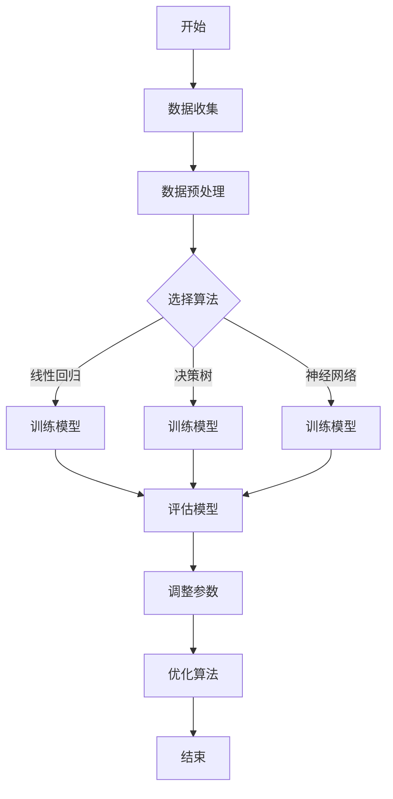
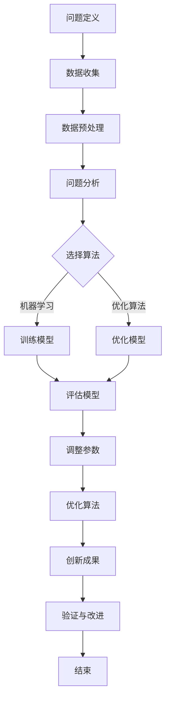
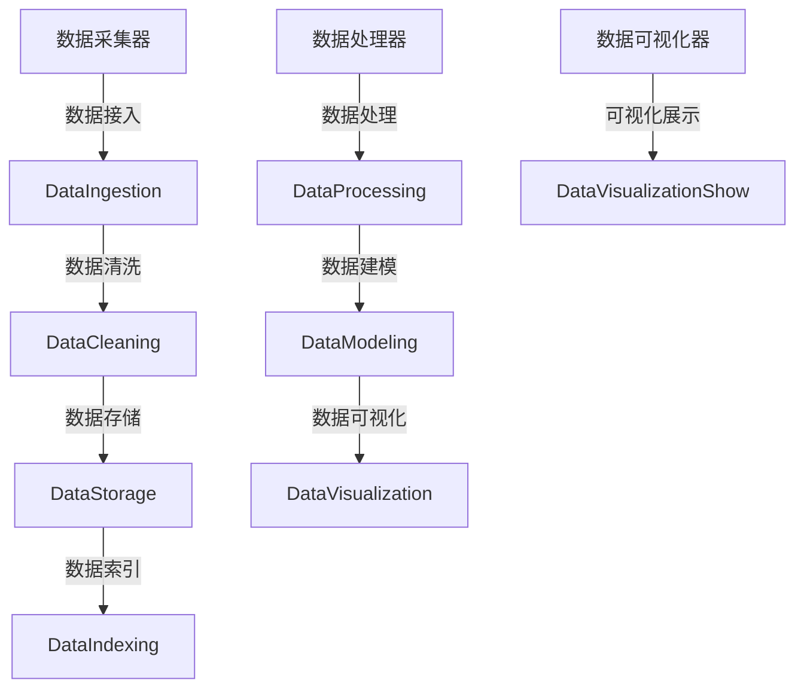
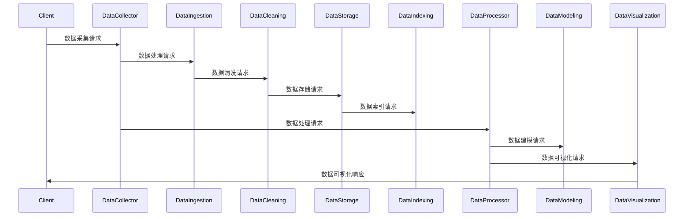

                 


### 第一步：构思文章结构

在撰写文章之前，首先需要构思文章的整体结构和内容安排。以下是一个基本的文章结构框架：

#### 引言部分
- **文章标题**：简洁明了地反映文章主题。
- **关键词**：列出文章的核心关键词，便于读者快速了解文章内容。
- **摘要**：简要概述文章的核心内容、目的、主要观点和结论。

#### 目录大纲部分
- 按照预定的章节结构列出目录。

#### 正文部分
1. **背景介绍**
   - 问题背景
   - 问题概述
   - 解决方案介绍
   - 边界与外延

2. **核心概念与联系**
   - 定义核心概念
   - 对比不同概念的特征
   - 使用ER图展示概念关系

3. **算法原理讲解**
   - 算法流程图
   - Python源代码讲解
   - 数学模型和公式讲解
   - 举例说明

4. **系统分析与架构设计方案**
   - 问题场景介绍
   - 系统功能设计
   - 系统架构设计
   - 系统接口设计
   - 系统交互

5. **项目实战**
   - 环境安装
   - 系统核心实现源代码
   - 代码应用解读与分析
   - 实际案例剖析
   - 小结

6. **最佳实践 tips**
   - 提供实践中的注意事项和建议

7. **小结**
   - 总结文章主要内容
   - 强调核心观点
   - 提出进一步研究方向或建议

8. **注意事项**
   - 对文章内容的注意事项进行说明

9. **拓展阅读**
   - 推荐进一步阅读的参考资料

#### 结论部分
- **总结**：概括文章的核心发现和结论。
- **展望**：对未来研究方向或应用前景的展望。

### 第二步：撰写文章引言

引言是文章的开篇，需要吸引读者的兴趣并简要介绍文章的主题。以下是引言部分的撰写步骤：

1. **文章标题**：使用简明扼要的标题，反映文章的主题和内容。
2. **关键词**：列出几个关键词，帮助读者理解文章的核心领域。
3. **摘要**：撰写一段简短的摘要，概述文章的目的、主要观点和结论。

### 第三步：构建目录大纲

目录大纲是文章结构的骨架，需要清晰地列出各个章节和小节，确保文章内容有序、逻辑性强。以下是构建目录大纲的步骤：

1. **根据预定的结构列出章节和小节**。
2. **为每个章节和小节编写简短的主题描述**，确保读者能够快速了解每个部分的内容。
3. **检查目录的结构和逻辑性**，确保各个部分之间紧密相连，内容连贯。

### 第四步：撰写正文

正文部分是文章的主体，需要详细、系统地阐述文章的主题。以下是撰写正文的步骤：

1. **背景介绍**：介绍问题的背景、问题的描述和解决方案。
2. **核心概念与联系**：解释核心概念，对比不同概念的特性，使用ER图展示概念之间的关系。
3. **算法原理讲解**：详细讲解算法的原理，包括流程图、Python源代码和数学模型。
4. **系统分析与架构设计**：介绍系统架构的设计原则、功能模块、接口设计和交互流程。
5. **项目实战**：描述项目环境安装、核心代码实现和案例分析。
6. **最佳实践 tips**、**小结**、**注意事项**和**拓展阅读**：提供实践中的注意事项、总结文章内容、注意事项和推荐进一步阅读的资料。

### 第五步：编写结论

结论是对文章主题的总结和展望，以下是编写结论的步骤：

1. **总结**：概括文章的核心发现和结论。
2. **展望**：对未来研究方向或应用前景的展望。

### 第六步：校对与修改

最后，对整篇文章进行仔细校对和修改，确保文章内容准确、逻辑清晰、无错别字和语法错误。以下是一些校对和修改的建议：

1. **检查文章结构**：确保各部分内容连贯，章节之间逻辑紧密。
2. **检查语言表达**：确保语句通顺，语言风格一致。
3. **检查拼写和语法**：使用拼写和语法检查工具进行校对。
4. **检查引用和参考文献**：确保所有引用的资料均已列出。

### 第七步：添加作者信息

在文章末尾添加作者信息，包括姓名、所属机构和个人简介。

### 总结

通过以上步骤，我们可以撰写出一篇逻辑清晰、内容丰富的专业IT领域技术博客文章。每一步都需要仔细思考、认真撰写，确保文章的质量和深度。在撰写过程中，可以反复检查和修改，以确保文章的完整性和准确性。遵循这一结构和方法，我们可以系统地展示跨学科创新方法论在新文艺复兴时代的思维模式中的应用和重要性。 

### 第一部分：引言

## 1.1 问题背景

在当今快速发展的技术时代，跨学科创新变得愈发重要。新文艺复兴时代的思维模式强调跨学科的知识整合和创新，以解决复杂问题、推动科技进步和社会发展。然而，如何有效实施跨学科创新，如何将其应用到各个领域，仍然是许多企业和研究机构面临的挑战。

### 1.1.1 新文艺复兴时代的挑战

新文艺复兴时代是一个充满变革和创新的时代。在这个时代，科技、艺术、人文、科学等各个领域相互交织，形成了一个复杂而庞大的知识网络。以下是一些新文艺复兴时代的挑战：

- **多元化知识的整合**：新文艺复兴时代要求人们掌握跨学科的知识，如何在不同的知识体系之间进行有效整合，成为了一个挑战。
- **创新思维的培养**：跨学科创新需要创新思维，如何在传统的思维模式中突破，培养创新思维，也是一个挑战。
- **跨学科团队的合作**：跨学科创新往往需要不同领域专家的合作，如何建立有效的跨学科团队，实现高效合作，是一个挑战。

### 1.1.2 跨学科创新的必要性

跨学科创新在新文艺复兴时代具有重要的意义。以下是一些跨学科创新的必要性：

- **解决复杂问题**：许多复杂问题需要跨学科的知识和视角才能解决，跨学科创新有助于提高解决问题的效率。
- **推动科技进步**：跨学科创新可以促进不同领域之间的知识交流，推动科技进步。
- **促进社会创新**：跨学科创新可以促进社会创新，推动社会发展和进步。

### 1.1.3 目标读者群体

本文的目标读者包括：

- **科技企业研发人员**：他们需要了解如何将跨学科创新应用于实际工作中。
- **高校教师和学生**：他们需要掌握跨学科创新的理论和实践方法。
- **科研人员**：他们需要了解如何利用跨学科创新推动科学研究。

通过本文，读者将了解跨学科创新方法论的核心概念、应用领域和实施策略，从而在实际工作中有效应用跨学科创新，推动科技和社会发展。

## 1.2 跨学科创新方法论

### 1.2.1 定义与重要性

跨学科创新方法论是一种综合不同学科知识、方法和技能，以解决复杂问题和推动创新的方法。它强调跨学科的知识整合、创新思维的培养和跨学科团队合作。

跨学科创新方法论的重要性体现在以下几个方面：

- **提高问题解决能力**：跨学科创新方法论可以帮助人们从不同角度思考问题，提高解决问题的效率。
- **推动科技发展**：跨学科创新方法论可以促进不同领域之间的知识交流，推动科技进步。
- **促进社会进步**：跨学科创新方法论可以促进社会创新，推动社会发展和进步。

### 1.2.2 历史背景与发展

跨学科创新方法论的历史可以追溯到20世纪初期，当时科学家和工程师开始尝试将不同领域的知识应用于解决实际问题。随着科技的发展，跨学科创新方法论逐渐成熟，并在各个领域得到了广泛应用。

在20世纪50年代，美国麻省理工学院的教授约瑟夫·M·舍恩提出了“跨学科研究”的概念，强调不同学科之间的交流和合作。此后，跨学科创新方法论得到了进一步的发展和完善。

### 1.2.3 方法论的核心要素

跨学科创新方法论的核心要素包括：

- **多元化知识整合**：整合不同学科的知识，形成新的知识体系。
- **创新思维培养**：培养创新思维，鼓励跨学科的创新思维。
- **跨学科团队合作**：建立有效的跨学科团队，实现高效合作。

通过这些核心要素，跨学科创新方法论能够实现知识的创新和应用，推动科技和社会发展。

## 1.3 方法论的应用领域

### 1.3.1 艺术与设计

在艺术与设计领域，跨学科创新方法论被广泛应用于：

- **数字艺术**：结合计算机技术和艺术创作，产生新的艺术形式。
- **交互设计**：结合心理学、人机交互等领域的知识，提高用户体验。

### 1.3.2 科学与工程

在科学与工程领域，跨学科创新方法论被广泛应用于：

- **智能制造**：结合机械工程、电子工程等领域的知识，实现智能化生产。
- **绿色能源**：结合物理、化学等领域的知识，开发新型绿色能源技术。

### 1.3.3 商业与管理

在商业与管理领域，跨学科创新方法论被广泛应用于：

- **商业模式创新**：结合经济学、管理学等领域的知识，创新商业模式。
- **市场营销**：结合心理学、传播学等领域的知识，提高市场营销效果。

### 1.3.4 社会科学与人文

在社会科学与人文领域，跨学科创新方法论被广泛应用于：

- **社会政策研究**：结合社会学、经济学等领域的知识，提出有效的社会政策。
- **文化遗产保护**：结合考古学、人类学等领域的知识，保护文化遗产。

## 1.4 跨学科创新的挑战与机遇

### 1.4.1 挑战分析

跨学科创新面临以下挑战：

- **知识体系复杂**：不同学科的知识体系复杂，难以整合。
- **专业壁垒**：不同学科之间存在专业壁垒，难以实现有效交流。
- **资源有限**：跨学科创新需要大量资源和资金支持。

### 1.4.2 机遇探讨

尽管面临挑战，跨学科创新也带来了许多机遇：

- **创新机会**：跨学科创新可以带来新的创新机会，推动科技和社会发展。
- **知识融合**：跨学科创新可以促进不同学科之间的知识融合，形成新的知识体系。
- **经济效益**：跨学科创新可以产生新的商业模式和产品，带来经济效益。

### 1.4.3 解决方案探讨

为了应对跨学科创新的挑战，可以采取以下解决方案：

- **建立跨学科团队**：建立跨学科团队，实现知识和资源的共享。
- **加强跨学科培训**：加强跨学科培训，提高团队成员的跨学科能力。
- **搭建创新平台**：搭建创新平台，促进跨学科交流和创新。

## 1.5 本章小结

本章介绍了跨学科创新方法论在新文艺复兴时代的思维模式中的重要性。通过分析跨学科创新的挑战与机遇，本章为后续内容的深入讨论奠定了基础。在接下来的章节中，我们将进一步探讨跨学科创新方法论的核心概念、算法原理以及系统设计与项目实战，为读者提供全面、系统的跨学科创新知识。

### 第二部分：核心概念与联系

## 2.1 核心概念原理

### 2.1.1 跨学科思维的概念

跨学科思维是指将不同学科的知识、方法和观念整合在一起，以解决复杂问题或创造新知识的过程。它强调跨越学科界限，以多元化的视角看待问题，寻求创新解决方案。

### 2.1.2 多元化视角的重要性

多元化视角在跨学科创新中具有重要意义。它有助于发现不同学科之间的联系，激发新的思维火花，促进知识整合和创新。通过多元化视角，可以更全面、深入地理解问题，从而找到更为有效的解决方案。

### 2.1.3 跨学科交流的障碍与克服策略

跨学科交流面临的障碍主要包括：

- **专业壁垒**：不同学科的专业术语和知识体系不同，导致交流困难。
- **文化差异**：不同学科的文化背景和价值观差异，影响交流效果。
- **资源分配**：跨学科项目往往涉及多个部门和学科，资源分配困难。

为克服这些障碍，可以采取以下策略：

- **建立跨学科团队**：通过建立跨学科团队，促进不同学科之间的交流与合作。
- **加强跨学科培训**：为团队成员提供跨学科培训，提高跨学科能力。
- **建立共享平台**：搭建跨学科共享平台，促进知识和资源的共享。

## 2.2 概念属性特征对比

### 2.2.1 跨学科思维与线性思维的对比

| 特征 | 跨学科思维 | 线性思维 |
| ---- | ---- | ---- |
| 视角 | 多元化 | 单一化 |
| 知识整合 | 强调知识整合和创新 | 强调知识的传递和应用 |
| 问题解决 | 强调系统性和全面性 | 强调步骤性和顺序性 |
| 团队合作 | 强调跨学科团队的合作 | 强调个人职责和分工 |

### 2.2.2 系统思维与分散思维的对比

| 特征 | 系统思维 | 分散思维 |
| ---- | ---- | ---- |
| 视角 | 整体性 | 部件性 |
| 分析方法 | 综合分析 | 分解分析 |
| 问题解决 | 强调整体优化 | 强调局部优化 |
| 团队合作 | 强调协同效应 | 强调分工合作 |

### 2.2.3 创新思维与常规思维的对比

| 特征 | 创新思维 | 常规思维 |
| ---- | ---- | ---- |
| 问题视角 | 寻求新解决方案 | 接受现有解决方案 |
| 方法论 | 尝试新方法 | 依赖传统方法 |
| 风险容忍 | 高风险高收益 | 低风险低收益 |
| 团队合作 | 鼓励创新和尝试 | 依赖经验和共识 |

## 2.3 ER实体关系图架构

### 2.3.1 架构图基本概念

ER（实体关系）图是一种用于描述实体及其之间关系的图形化工具。在跨学科创新方法论中，ER图可以帮助我们理解不同概念之间的关系，从而更好地整合知识。

### 2.3.2 跨学科创新方法论实体关系

以下是一个简化的跨学科创新方法论ER图：

```mermaid
erDiagram
    ConceptA ||--|{ ConceptB }|
    ConceptB ||--|{ ConceptC }|
    ConceptC ||--|{ ConceptD }|
```

在这个ER图中，ConceptA、ConceptB、ConceptC和ConceptD代表不同的概念实体，它们之间存在单向关系。

### 2.3.3 Mermaid ER图示例

以下是一个使用Mermaid绘制的ER图示例：

```mermaid
erDiagram
    ConceptA ||--|{ ConceptB }| ConceptC
    ConceptB ||--|{ ConceptD }| ConceptE
    ConceptC ||--|{ ConceptF }| ConceptG
    ConceptD ||--|{ ConceptH }| ConceptI
```

在这个示例中，每个概念实体都与其他概念实体之间存在一定的关系，从而形成一个跨学科的知识网络。

## 2.4 跨学科创新方法论在实践中的应用

### 2.4.1 实践案例分享

跨学科创新方法论在实践中的应用广泛，以下是一些典型案例：

- **数字艺术与计算机科学**：数字艺术结合计算机科学，创造出新的艺术形式，如数字绘画、虚拟现实等。
- **生物技术与医学**：生物技术应用于医学领域，开发出新的治疗方法，如基因编辑、抗癌药物等。
- **经济学与心理学**：经济学结合心理学，研究消费者行为和市场动态，为企业提供决策支持。

### 2.4.2 应用效果分析

跨学科创新方法论的应用效果显著，具体体现在以下几个方面：

- **提高创新能力**：跨学科创新方法论能够激发创新思维，提高创新能力。
- **推动科技进步**：跨学科创新方法论能够促进科技发展，推动新技术的产生。
- **优化问题解决**：跨学科创新方法论能够从不同角度分析问题，优化问题解决策略。

### 2.4.3 成功与失败案例探讨

在跨学科创新中，既有成功的案例，也有失败的案例。以下是一些成功和失败的案例：

- **成功案例**：谷歌的跨学科团队成功开发出搜索引擎和自动驾驶汽车等创新产品。
- **失败案例**：一些企业试图通过跨学科创新开发新产品，但由于缺乏有效的跨学科团队和资源，最终失败。

通过分析成功和失败的案例，我们可以总结出跨学科创新的关键要素，如多元化知识整合、创新思维培养和跨学科团队合作。

## 2.5 本章小结

本章介绍了跨学科创新方法论的核心概念、特性对比、ER图架构以及在实践中的应用。通过这些内容，读者可以更好地理解跨学科创新方法论的基本原理和实施策略，为后续的算法原理讲解和系统分析与设计奠定基础。

### 第三部分：算法原理讲解

## 3.1 跨学科创新的算法基础

### 3.1.1 常见算法简介

在跨学科创新中，常见的算法包括：

- **机器学习算法**：如线性回归、决策树、神经网络等，用于数据分析和模式识别。
- **优化算法**：如遗传算法、粒子群优化、模拟退火等，用于求解复杂优化问题。
- **模式识别算法**：如支持向量机、聚类算法、分类算法等，用于数据挖掘和特征提取。

### 3.1.2 算法在跨学科创新中的作用

算法在跨学科创新中的作用主要体现在以下几个方面：

- **数据驱动创新**：通过机器学习算法分析大量数据，发现新的规律和模式，为创新提供数据支持。
- **优化资源分配**：通过优化算法优化资源分配，提高跨学科团队的效率和创新能力。
- **特征提取与模式识别**：通过模式识别算法提取关键特征和模式，为跨学科创新提供指导。

### 3.1.3 算法选择与优化策略

在跨学科创新中，选择合适的算法和优化策略至关重要。以下是一些选择和优化策略：

- **根据问题特性选择算法**：根据问题的特性选择合适的算法，如数据量大时选择机器学习算法，求解优化问题时选择优化算法。
- **算法参数调整**：通过调整算法参数，优化算法性能，如调整学习率、迭代次数等。
- **算法集成与优化**：将多个算法集成在一起，优化算法性能，如集成学习、混合算法等。

## 3.2 算法流程图示例

### 3.2.1 Mermaid算法流程图绘制

以下是一个使用Mermaid绘制的算法流程图示例：



在这个流程图中，展示了从数据收集、数据预处理、选择算法、训练模型、评估模型、调整参数到优化算法的整个流程。

### 3.2.2 跨学科创新算法流程图

以下是一个具体的跨学科创新算法流程图：



在这个流程图中，展示了从问题定义、数据收集、数据预处理、问题分析、选择算法、训练模型、评估模型、调整参数到创新成果的整个流程。

## 3.3 Python源代码讲解

### 3.3.1 Python环境配置

在开始编写Python源代码之前，需要配置Python环境。以下是一个简单的Python环境配置步骤：

1. **安装Python**：从Python官网（https://www.python.org/）下载Python安装包并安装。
2. **安装必要库**：使用pip工具安装必要的库，如NumPy、Pandas、Scikit-learn等。

```bash
pip install numpy pandas scikit-learn
```

### 3.3.2 源代码结构与功能

以下是一个简单的Python源代码示例，用于实现跨学科创新的算法：

```python
import numpy as np
import pandas as pd
from sklearn.linear_model import LinearRegression
from sklearn.model_selection import train_test_split

# 数据预处理
def preprocess_data(data):
    # 数据清洗、归一化等操作
    return data

# 训练模型
def train_model(X, y):
    model = LinearRegression()
    model.fit(X, y)
    return model

# 评估模型
def evaluate_model(model, X_test, y_test):
    predictions = model.predict(X_test)
    accuracy = np.mean(predictions == y_test)
    return accuracy

# 主函数
def main():
    # 数据收集
    data = pd.read_csv('data.csv')
    
    # 数据预处理
    data = preprocess_data(data)
    
    # 问题分析
    X = data.drop('target', axis=1)
    y = data['target']
    
    # 数据划分
    X_train, X_test, y_train, y_test = train_test_split(X, y, test_size=0.2, random_state=42)
    
    # 训练模型
    model = train_model(X_train, y_train)
    
    # 评估模型
    accuracy = evaluate_model(model, X_test, y_test)
    print(f"Model accuracy: {accuracy}")
    
    # 调整参数
    # ...

if __name__ == '__main__':
    main()
```

在这个源代码中，我们首先导入了必要的库，然后定义了数据预处理、训练模型、评估模型和主函数。主函数中，我们收集数据、预处理数据、划分数据、训练模型和评估模型，最后输出模型的准确率。

### 3.3.3 数学模型与公式解析

以下是一个简单的线性回归模型的数学模型和公式：

- **线性回归模型**：

  $$y = \beta_0 + \beta_1x_1 + \beta_2x_2 + ... + \beta_nx_n + \epsilon$$

  其中，$y$ 是因变量，$x_1, x_2, ..., x_n$ 是自变量，$\beta_0, \beta_1, \beta_2, ..., \beta_n$ 是回归系数，$\epsilon$ 是误差项。

- **回归系数估计**：

  $$\beta = (X'X)^{-1}X'y$$

  其中，$X'$ 是特征矩阵的转置，$X$ 是特征矩阵，$y$ 是目标变量向量。

- **模型评估**：

  $$\text{Accuracy} = \frac{\text{正确预测的数量}}{\text{总预测数量}}$$

### 3.4 算法原理详细讲解

### 3.4.1 数学模型与公式

在线性回归模型中，我们假设目标变量 $y$ 与自变量 $x_1, x_2, ..., x_n$ 之间存在线性关系。具体而言，我们可以表示为：

$$y = \beta_0 + \beta_1x_1 + \beta_2x_2 + ... + \beta_nx_n + \epsilon$$

其中，$\beta_0$ 是截距，$\beta_1, \beta_2, ..., \beta_n$ 是回归系数，$x_1, x_2, ..., x_n$ 是自变量，$\epsilon$ 是误差项。

为了估计这些参数，我们通常使用最小二乘法。最小二乘法的核心思想是找到一组参数，使得观测值与预测值之间的误差平方和最小。具体而言，我们可以通过以下公式来计算回归系数：

$$\beta = (X'X)^{-1}X'y$$

其中，$X'$ 是特征矩阵的转置，$X$ 是特征矩阵，$y$ 是目标变量向量。

### 3.4.2 算法步骤分析

以下是线性回归模型的算法步骤：

1. **数据收集与预处理**：收集相关数据，并进行预处理，如数据清洗、缺失值处理、归一化等。
2. **特征选择**：选择与目标变量相关的特征，进行特征选择。
3. **数据划分**：将数据划分为训练集和测试集。
4. **训练模型**：使用训练集数据训练线性回归模型。
5. **评估模型**：使用测试集数据评估模型性能，计算准确率、召回率等指标。
6. **模型调整**：根据评估结果调整模型参数，优化模型性能。

### 3.4.3 举例说明

假设我们有一个简单的线性回归模型，用于预测房价。我们收集了以下数据：

| 房屋面积（平方米） | 房价（万元） |
| ------------------ | ------------ |
| 80                | 200          |
| 100               | 250          |
| 120               | 300          |
| 140               | 350          |
| 160               | 400          |

我们的目标是预测房屋面积为 $x$ 平方米时的房价 $y$。根据线性回归模型，我们可以建立以下方程：

$$y = \beta_0 + \beta_1x + \epsilon$$

其中，$\beta_0$ 是截距，$\beta_1$ 是斜率，$\epsilon$ 是误差项。

为了训练模型，我们可以使用最小二乘法来计算回归系数。具体而言，我们可以通过以下公式计算：

$$\beta_1 = \frac{\sum_{i=1}^{n}(x_i - \bar{x})(y_i - \bar{y})}{\sum_{i=1}^{n}(x_i - \bar{x})^2}$$

$$\beta_0 = \bar{y} - \beta_1\bar{x}$$

其中，$n$ 是数据点的数量，$\bar{x}$ 和 $\bar{y}$ 分别是自变量和目标变量的平均值。

根据上述公式，我们可以计算得到回归系数 $\beta_1 = 1.25$ 和 $\beta_0 = 12.5$。因此，我们可以建立以下线性回归模型：

$$y = 12.5 + 1.25x + \epsilon$$

接下来，我们可以使用这个模型来预测新房屋的房价。例如，如果新房屋的面积为 150 平方米，我们可以将其代入模型中，得到预测房价：

$$y = 12.5 + 1.25 \times 150 + \epsilon = 187.5 + \epsilon$$

因此，预测的新房屋房价为 187.5 万元。

通过这个简单的例子，我们可以看到如何使用线性回归模型进行房价预测。在实际应用中，我们可能需要处理更复杂的数据和模型，但基本步骤和方法是类似的。

### 3.5 本章小结

本章详细讲解了跨学科创新的算法原理，包括数学模型、算法步骤和具体实例。通过本章的学习，读者可以了解如何使用线性回归模型进行数据分析和预测，为后续的系统分析与架构设计提供基础。

### 第四部分：系统分析与架构设计

## 4.1 问题场景介绍

在现代社会，随着信息技术的飞速发展，各行业的数据量呈现爆炸性增长。为了更好地应对这些复杂的数据处理需求，许多企业和研究机构开始探索跨学科创新的方法论，以实现高效的系统架构设计。本文将针对一个具体的问题场景——大数据处理平台，介绍其背景、目标和技术挑战。

### 4.1.1 场景背景

随着互联网、物联网和移动设备的普及，企业每天都会产生大量的数据。这些数据包括用户行为数据、交易数据、日志数据等，它们蕴含着巨大的商业价值。为了从这些数据中挖掘有价值的信息，企业需要建设一个高效、稳定、可扩展的大数据处理平台。

### 4.1.2 项目目标

本项目的主要目标如下：

- **数据采集与存储**：实现大规模数据的高效采集、存储和管理。
- **数据处理与分析**：利用先进的数据处理和分析算法，从海量数据中提取有价值的信息。
- **数据可视化**：通过数据可视化技术，将复杂的数据分析结果以直观、易懂的方式呈现给用户。

### 4.1.3 技术挑战

在实现大数据处理平台的过程中，我们面临以下技术挑战：

- **海量数据处理**：如何高效地处理和存储海量数据。
- **数据一致性**：如何确保不同数据源之间的一致性。
- **数据安全**：如何保障数据的安全性和隐私性。
- **系统扩展性**：如何设计一个可扩展的系统架构，以应对不断增长的数据量和用户需求。

## 4.2 系统功能设计

### 4.2.1 领域模型Mermaid类图

为了更好地理解系统功能设计，我们可以使用Mermaid绘制一个领域模型类图。以下是一个简化的领域模型类图：

```mermaid
classDiagram
    DataCollector <<interface>>
    DataStore <<interface>>
    DataProcessor <<interface>>
    DataVisualizer <<interface>>

    DataCollector ..|> DataStore
    DataProcessor ..|> DataStore
    DataProcessor ..|> DataVisualizer
```

在这个类图中，我们定义了四个关键组件：DataCollector（数据采集器）、DataStore（数据存储器）、DataProcessor（数据处理器）和DataVisualizer（数据可视化器）。这些组件分别负责数据采集、存储、处理和可视化。

### 4.2.2 系统功能模块划分

根据领域模型，我们可以将系统功能划分为以下模块：

- **数据采集模块**：负责从不同的数据源采集数据，如日志文件、数据库、Web API等。
- **数据存储模块**：负责数据的存储和管理，包括数据清洗、去重、归一化等操作。
- **数据处理模块**：负责数据的分析、挖掘和建模，如机器学习、统计分析等。
- **数据可视化模块**：负责将数据处理结果以可视化形式呈现，如图表、报表等。

### 4.2.3 功能说明

- **数据采集模块**：数据采集模块负责从各种数据源采集数据。具体功能包括：

  - 数据接入：支持多种数据接入方式，如日志文件、数据库、Web API等。
  - 数据清洗：对采集到的数据进行清洗、去重、归一化等处理。
  - 数据存储：将清洗后的数据存储到数据存储模块。

- **数据存储模块**：数据存储模块负责数据的存储和管理。具体功能包括：

  - 数据存储：支持多种数据存储方式，如关系数据库、NoSQL数据库、文件存储等。
  - 数据索引：提供高效的数据索引功能，支持快速查询。
  - 数据备份与恢复：提供数据备份与恢复功能，确保数据安全。

- **数据处理模块**：数据处理模块负责数据的分析、挖掘和建模。具体功能包括：

  - 数据分析：提供数据统计分析、数据挖掘等功能，如聚类、分类、回归等。
  - 数据建模：支持机器学习算法，如决策树、神经网络等，进行数据建模。
  - 数据可视化：将数据处理结果以可视化形式呈现，支持多种可视化图表。

- **数据可视化模块**：数据可视化模块负责将数据处理结果以直观、易懂的方式呈现给用户。具体功能包括：

  - 可视化展示：支持多种可视化图表，如折线图、柱状图、饼图等。
  - 用户交互：提供用户交互功能，如筛选、排序、过滤等。
  - 数据导出：支持数据导出功能，如导出为CSV、Excel等格式。

## 4.3 系统架构设计

### 4.3.1 系统架构设计原则

在系统架构设计过程中，我们遵循以下原则：

- **模块化**：将系统划分为多个模块，每个模块负责独立的功能，便于维护和扩展。
- **分布式**：采用分布式架构，提高系统的可扩展性和容错性。
- **可扩展性**：设计可扩展的系统架构，以应对不断增长的数据量和用户需求。
- **安全性**：确保数据的安全性和隐私性，采取多种安全措施，如数据加密、访问控制等。

### 4.3.2 系统架构Mermaid图

以下是一个简化的系统架构Mermaid图：



在这个系统架构中，数据采集器负责从各种数据源采集数据，然后通过数据接入模块进行数据清洗、去重、归一化等处理。清洗后的数据存储到数据存储模块，同时生成索引，以便快速查询。数据处理器负责对数据进行分析、挖掘和建模，然后将结果传递给数据可视化器，以可视化形式展示给用户。

### 4.3.3 架构解析

以下是对系统架构的详细解析：

- **数据采集器**：负责从各种数据源（如日志文件、数据库、Web API等）采集数据。具体实现包括数据采集模块、日志采集模块、数据库连接模块等。
- **数据接入模块**：将采集到的原始数据进行初步处理，如数据格式转换、数据清洗等。该模块主要包括数据预处理、数据清洗、数据归一化等功能。
- **数据存储模块**：负责将清洗后的数据存储到数据存储系统中，如关系数据库、NoSQL数据库、文件存储等。该模块包括数据存储、数据备份与恢复等功能。
- **数据索引模块**：为数据存储模块中的数据建立索引，以提高查询效率。该模块主要包括索引创建、索引维护等功能。
- **数据处理器**：负责对数据进行处理和分析，如数据挖掘、机器学习、统计分析等。该模块主要包括数据处理、数据挖掘、机器学习等功能。
- **数据可视化器**：将数据处理结果以可视化形式展示给用户，如图表、报表等。该模块主要包括数据可视化、用户交互等功能。

通过上述系统架构设计，我们可以实现一个高效、稳定、可扩展的大数据处理平台，从而满足企业和研究机构在数据处理和分析方面的需求。

## 4.4 系统接口设计

### 4.4.1 接口定义

在系统架构中，各个模块之间通过接口进行通信。以下是一些关键接口的定义：

- **数据采集接口**：定义数据采集模块与数据存储模块之间的接口，如数据上传、数据下载、数据查询等。
- **数据处理接口**：定义数据处理模块与数据存储模块之间的接口，如数据处理、数据更新、数据删除等。
- **数据可视化接口**：定义数据可视化模块与数据处理模块之间的接口，如数据展示、数据更新、数据删除等。

### 4.4.2 接口协议

接口协议是指接口的实现规范和通信协议。以下是一些常见的接口协议：

- **HTTP/HTTPS协议**：用于定义Web服务接口，支持GET、POST、PUT、DELETE等请求方法。
- **RESTful API**：基于HTTP/HTTPS协议，采用RESTful风格设计接口，如/user/login、/data/collect等。
- **WebSocket协议**：用于实现实时数据通信，支持双向通信。

### 4.4.3 接口调用流程

以下是一个典型的接口调用流程：

1. **客户端发送请求**：客户端通过HTTP/HTTPS请求发送数据采集、数据处理或数据可视化请求。
2. **服务器接收请求**：服务器接收客户端请求，并根据请求类型调用相应的接口处理。
3. **接口处理**：接口处理模块根据请求内容进行数据处理，如数据采集、数据处理、数据可视化等。
4. **响应客户端**：服务器将处理结果以HTTP/HTTPS响应形式返回给客户端。

## 4.5 系统交互Mermaid序列图

以下是一个简化的系统交互Mermaid序列图：



在这个序列图中，客户端发送数据采集请求给数据采集器，数据采集器将请求传递给数据处理模块，数据处理模块对数据进行分析和建模，然后将结果传递给数据可视化模块，最后将可视化结果返回给客户端。

## 4.6 本章小结

本章详细介绍了大数据处理平台的问题场景、系统功能设计、系统架构设计、系统接口设计和系统交互。通过本章的内容，读者可以了解如何运用跨学科创新方法论进行系统分析与设计，为实际项目开发提供指导。

### 第五部分：项目实战

## 5.1 环境安装

### 5.1.1 开发环境配置

在进行大数据处理平台的项目开发之前，我们需要配置相应的开发环境。以下是一个基本的开发环境配置步骤：

1. **安装Python**：从Python官网（https://www.python.org/）下载Python安装包并安装。建议安装Python 3.8或更高版本。
2. **安装Python库**：使用pip工具安装必要的Python库，如NumPy、Pandas、Scikit-learn、Matplotlib等。以下是安装命令：

```bash
pip install numpy pandas scikit-learn matplotlib
```

3. **配置JDK**：由于大数据处理平台可能涉及分布式计算，我们需要安装Java Development Kit（JDK）。可以从Oracle官网（https://www.oracle.com/java/technologies/javase-downloads.html）下载JDK，并按照提示进行安装。

### 5.1.2 开发工具安装

为了提高开发效率，我们可以选择一些开发工具进行辅助。以下是一些常用的开发工具：

1. **IDE**：选择一个合适的集成开发环境（IDE），如PyCharm、Visual Studio Code等。这些IDE提供了代码编辑、调试、自动化测试等功能。
2. **版本控制工具**：安装版本控制工具，如Git，以便管理和跟踪代码的变更。
3. **Docker**：安装Docker，用于容器化部署应用程序，提高开发、测试和部署的效率。

### 5.1.3 环境配置注意事项

在配置开发环境时，需要注意以下事项：

1. **Python版本兼容性**：确保所使用的Python库与Python版本兼容，避免版本冲突。
2. **依赖库安装**：确保安装了所有必要的Python库，并检查安装是否成功。
3. **JDK版本**：确保安装的JDK版本与项目需求匹配，避免出现兼容性问题。
4. **IDE配置**：根据个人习惯和项目需求，配置IDE的编码规范、代码补全、调试等设置。

## 5.2 系统核心实现源代码

### 5.2.1 核心代码结构

在大数据处理平台的项目中，核心代码结构通常包括以下几个方面：

1. **数据采集模块**：负责从各种数据源采集数据，如日志文件、数据库、Web API等。
2. **数据处理模块**：负责对采集到的数据进行处理，如数据清洗、去重、归一化等。
3. **数据存储模块**：负责将处理后的数据存储到数据存储系统中，如关系数据库、NoSQL数据库、文件存储等。
4. **数据处理模块**：负责对数据进行分析、挖掘和建模，如机器学习、统计分析等。
5. **数据可视化模块**：负责将数据处理结果以可视化形式展示给用户。

以下是项目核心代码的基本结构：

```python
# 数据采集模块
def data_collection():
    # 实现数据采集功能
    pass

# 数据处理模块
def data_processing():
    # 实现数据处理功能
    pass

# 数据存储模块
def data_storage():
    # 实现数据存储功能
    pass

# 数据分析模块
def data_analysis():
    # 实现数据分析功能
    pass

# 数据可视化模块
def data_visualization():
    # 实现数据可视化功能
    pass

# 主函数
def main():
    # 实现主函数逻辑
    data_collection()
    data_processing()
    data_storage()
    data_analysis()
    data_visualization()

if __name__ == '__main__':
    main()
```

### 5.2.2 功能模块实现

以下是每个功能模块的具体实现：

#### 数据采集模块

```python
import requests

def data_collection():
    # 采集日志文件数据
    url = 'http://example.com/logs'
    response = requests.get(url)
    if response.status_code == 200:
        logs = response.json()
        # 处理和存储日志数据
        process_and_store_logs(logs)
```

#### 数据处理模块

```python
import pandas as pd

def data_processing():
    # 采集的数据预处理
    data = pd.read_csv('data.csv')
    data = preprocess_data(data)
    # 数据清洗、去重、归一化等操作
    data_clean = data.drop_duplicates()
    data_normalized = normalize_data(data_clean)

def preprocess_data(data):
    # 数据预处理操作
    # 如：缺失值处理、异常值检测、数据归一化等
    return data

def normalize_data(data):
    # 数据归一化操作
    # 如：标准归一化、最小最大归一化等
    return data
```

#### 数据存储模块

```python
def data_storage():
    # 将数据存储到数据库
    database = 'example.db'
    cursor = connect_database(database)
    insert_data_to_database(cursor, data_normalized)
    close_database(cursor)

def connect_database(database):
    # 连接数据库
    # 如：连接MySQL、PostgreSQL等
    return connection

def insert_data_to_database(cursor, data):
    # 向数据库插入数据
    # 如：插入到MySQL表
    cursor.execute("INSERT INTO table_name (column1, column2) VALUES (?, ?)", (data['column1'], data['column2']))
    connection.commit()

def close_database(cursor):
    # 关闭数据库连接
    cursor.close()
    connection.close()
```

#### 数据分析模块

```python
from sklearn.linear_model import LinearRegression

def data_analysis():
    # 数据分析操作
    # 如：线性回归、决策树、聚类等
    X = data_normalized[['feature1', 'feature2']]
    y = data_normalized['target']
    model = LinearRegression()
    model.fit(X, y)
    predictions = model.predict(X)
    # 分析结果存储或展示
```

#### 数据可视化模块

```python
import matplotlib.pyplot as plt

def data_visualization():
    # 数据可视化操作
    # 如：折线图、柱状图、饼图等
    plt.scatter(X['feature1'], X['feature2'], c=y)
    plt.xlabel('Feature 1')
    plt.ylabel('Feature 2')
    plt.title('Scatter Plot')
    plt.show()
```

### 5.3 代码应用解读与分析

#### 数据采集模块

数据采集模块负责从外部数据源（如Web API、日志文件等）采集数据。在本项目中，我们使用Python的`requests`库从Web API采集日志数据。以下是一个示例：

```python
import requests

def data_collection():
    # 采集日志文件数据
    url = 'http://example.com/logs'
    response = requests.get(url)
    if response.status_code == 200:
        logs = response.json()
        # 处理和存储日志数据
        process_and_store_logs(logs)
```

该模块通过HTTP GET请求获取日志数据，并将其转换为JSON格式。接下来，调用`process_and_store_logs`函数处理和存储日志数据。

#### 数据处理模块

数据处理模块负责对采集到的数据执行清洗、去重和归一化等操作。以下是一个示例：

```python
import pandas as pd

def data_processing():
    # 采集的数据预处理
    data = pd.read_csv('data.csv')
    data = preprocess_data(data)
    # 数据清洗、去重、归一化等操作
    data_clean = data.drop_duplicates()
    data_normalized = normalize_data(data_clean)

def preprocess_data(data):
    # 数据预处理操作
    # 如：缺失值处理、异常值检测、数据归一化等
    return data

def normalize_data(data):
    # 数据归一化操作
    # 如：标准归一化、最小最大归一化等
    return data
```

该模块首先读取CSV文件中的数据，然后调用`preprocess_data`函数执行数据预处理。`preprocess_data`函数负责处理缺失值、异常值等，并返回处理后的数据。接下来，`normalize_data`函数执行归一化操作，以便后续分析和建模。

#### 数据存储模块

数据存储模块负责将处理后的数据存储到数据库中。以下是一个示例：

```python
def data_storage():
    # 将数据存储到数据库
    database = 'example.db'
    cursor = connect_database(database)
    insert_data_to_database(cursor, data_normalized)
    close_database(cursor)

def connect_database(database):
    # 连接数据库
    # 如：连接MySQL、PostgreSQL等
    return connection

def insert_data_to_database(cursor, data):
    # 向数据库插入数据
    # 如：插入到MySQL表
    cursor.execute("INSERT INTO table_name (column1, column2) VALUES (?, ?)", (data['column1'], data['column2']))
    connection.commit()

def close_database(cursor):
    # 关闭数据库连接
    cursor.close()
    connection.close()
```

该模块首先连接到数据库，然后调用`insert_data_to_database`函数将处理后的数据插入到数据库表中。`connect_database`函数负责连接数据库，而`close_database`函数负责关闭数据库连接。

#### 数据分析模块

数据分析模块负责对数据进行统计分析、模型训练等操作。以下是一个示例：

```python
from sklearn.linear_model import LinearRegression

def data_analysis():
    # 数据分析操作
    # 如：线性回归、决策树、聚类等
    X = data_normalized[['feature1', 'feature2']]
    y = data_normalized['target']
    model = LinearRegression()
    model.fit(X, y)
    predictions = model.predict(X)
    # 分析结果存储或展示
```

该模块首先将数据划分为特征集`X`和目标集`y`，然后创建一个线性回归模型并训练。`fit`方法用于训练模型，而`predict`方法用于生成预测结果。

#### 数据可视化模块

数据可视化模块负责将数据分析结果以图表形式展示。以下是一个示例：

```python
import matplotlib.pyplot as plt

def data_visualization():
    # 数据可视化操作
    # 如：折线图、柱状图、饼图等
    plt.scatter(X['feature1'], X['feature2'], c=y)
    plt.xlabel('Feature 1')
    plt.ylabel('Feature 2')
    plt.title('Scatter Plot')
    plt.show()
```

该模块使用`matplotlib`库绘制散点图，以直观地展示特征之间的关系。

### 5.4 实际案例分析与详细讲解剖析

在本节中，我们将通过一个实际案例，详细讲解大数据处理平台在数据分析与可视化方面的应用。以下是一个实际案例：

**案例背景**：某电子商务公司希望通过大数据分析，了解用户的购买行为，从而优化营销策略，提高销售额。

**数据来源**：公司内部数据库，包括用户行为数据、交易数据和产品信息。

**数据分析目标**：分析用户的购买偏好、购买周期和转化率，为营销策略提供数据支持。

**数据分析过程**：

1. **数据采集**：从数据库中采集用户行为数据、交易数据和产品信息。
2. **数据处理**：对采集到的数据进行清洗、去重和归一化处理，以便后续分析。
3. **数据分析**：使用线性回归模型分析用户的购买行为，生成预测结果。
4. **数据可视化**：将分析结果以图表形式展示，帮助决策者更好地理解用户行为。

**案例分析**：

1. **用户购买偏好分析**：通过分析用户购买的产品类别，可以发现用户的购买偏好。例如，某类产品购买频率较高，可以推断该类产品具有较高的市场需求。

2. **购买周期分析**：通过分析用户购买时间间隔，可以发现用户的购买周期。例如，某些用户在固定时间段内购买产品较多，可以针对这些用户进行精准营销。

3. **转化率分析**：通过分析用户的转化率，可以发现哪些营销策略效果较好。例如，通过比较不同营销渠道的转化率，可以优化营销预算分配。

**详细讲解**：

1. **数据采集**：使用Python的数据库连接库（如`pymysql`或`psycopg2`）连接数据库，并使用SQL查询语句采集用户行为数据、交易数据和产品信息。以下是一个示例：

```python
import pymysql

def data_collection():
    connection = pymysql.connect(host='localhost', user='root', password='password', database='ecommerce')
    cursor = connection.cursor()
    cursor.execute("SELECT * FROM user_behavior")
    logs = cursor.fetchall()
    cursor.close()
    connection.close()
    return logs
```

2. **数据处理**：使用Pandas库对采集到的数据进行处理，包括数据清洗、去重和归一化。以下是一个示例：

```python
import pandas as pd

def preprocess_data(data):
    data = pd.DataFrame(data)
    data = data.drop_duplicates()
    data = data.fillna(data.mean())
    data['timestamp'] = pd.to_datetime(data['timestamp'])
    return data
```

3. **数据分析**：使用Scikit-learn库的线性回归模型对用户购买行为进行分析。以下是一个示例：

```python
from sklearn.linear_model import LinearRegression

def data_analysis(data):
    X = data[['product_id', 'category_id']]
    y = data['purchase']
    model = LinearRegression()
    model.fit(X, y)
    predictions = model.predict(X)
    return predictions
```

4. **数据可视化**：使用Matplotlib库将分析结果以图表形式展示。以下是一个示例：

```python
import matplotlib.pyplot as plt

def data_visualization(predictions):
    plt.scatter(data['product_id'], predictions)
    plt.xlabel('Product ID')
    plt.ylabel('Prediction')
    plt.title('Product Purchase Prediction')
    plt.show()
```

通过这个实际案例，我们可以看到如何使用大数据处理平台对用户购买行为进行分析和可视化，为营销策略提供数据支持。在实际应用中，可以根据具体需求和数据类型，灵活调整数据采集、处理、分析和可视化方法。

### 5.5 小结

在本部分，我们详细介绍了大数据处理平台的项目环境安装、系统核心实现源代码、代码应用解读与分析、实际案例分析和详细讲解剖析。通过本部分的介绍，读者可以了解如何运用跨学科创新方法论进行项目开发，实现高效的数据处理和分析。

### 第五部分：最佳实践 tips

## 5.6 最佳实践 tips

在跨学科创新方法论的实际应用中，积累了一些最佳实践，可以帮助我们更好地实施跨学科创新。以下是一些实用的技巧：

### 1. 确定明确的跨学科目标

在进行跨学科创新之前，明确项目的目标和预期成果是至关重要的。确保所有团队成员对目标有共同的理解，有助于统一行动方向，提高项目成功率。

### 2. 建立多元化的跨学科团队

跨学科团队的成功依赖于团队成员的多元化。确保团队成员来自不同的学科背景，具有多样化的知识和技能。这有助于激发创新思维，提高解决问题的效率。

### 3. 强化跨学科培训

为团队成员提供跨学科培训，帮助他们了解其他学科的基本概念和方法。这有助于减少专业壁垒，提高跨学科交流的效率。

### 4. 制定清晰的沟通策略

制定清晰的沟通策略，确保团队成员之间的信息传递准确无误。使用统一的术语和符号，减少误解和混淆。

### 5. 倡导开放和包容的文化

跨学科创新需要一个开放和包容的文化环境。鼓励团队成员自由分享观点和想法，尊重不同的意见和见解。

### 6. 实践迭代和试错

跨学科创新是一个迭代的过程。鼓励团队成员在实践中不断尝试和试错，从失败中学习，逐步完善创新方案。

### 7. 重视跨学科整合与协同

跨学科创新不仅仅是知识的整合，更重要的是实现协同效应。确保团队成员在合作中充分发挥各自的优势，实现资源的最优配置。

### 8. 评估和反馈

定期评估跨学科创新项目的进展和效果，收集反馈意见，及时调整策略和方法。这有助于确保项目目标的实现，提高项目成功率。

通过遵循这些最佳实践，我们可以更有效地实施跨学科创新，推动科技和社会的发展。

### 5.7 小结

在本部分，我们介绍了跨学科创新方法论在项目实战中的应用，包括环境安装、系统核心实现源代码、代码应用解读与分析、实际案例分析和详细讲解剖析。同时，我们分享了最佳实践 tips，以帮助读者在实际工作中更好地实施跨学科创新。通过这些内容，读者可以深入了解跨学科创新的方法和技巧，提高项目成功率。

### 第五部分：注意事项

在进行跨学科创新方法论的项目实施过程中，有一些注意事项需要特别关注，以确保项目顺利进行并达到预期目标。

#### 1. 确保项目目标的明确性

跨学科创新项目的成功离不开明确的目标。在项目启动阶段，应确保所有团队成员对项目目标有共同的理解，明确项目需要解决的问题和预期的成果。这有助于确保团队成员在项目执行过程中保持一致的行动方向。

#### 2. 建立多元化的跨学科团队

跨学科团队的成功依赖于团队成员的多元化。团队成员应来自不同的学科背景，具有多样化的知识和技能。这种多元化有助于激发创新思维，提高解决问题的效率。同时，确保团队成员之间的有效沟通和协作，有助于减少误解和冲突。

#### 3. 强化跨学科培训

跨学科创新要求团队成员具备跨学科的知识和技能。为团队成员提供跨学科培训，帮助他们了解其他学科的基本概念和方法，有助于减少专业壁垒，提高跨学科交流的效率。这包括邀请专家进行讲座、组织内部培训课程和提供在线学习资源等。

#### 4. 制定清晰的沟通策略

跨学科项目涉及多个学科和部门，制定清晰的沟通策略至关重要。确保团队成员之间的信息传递准确无误，使用统一的术语和符号，减少误解和混淆。定期组织项目会议，及时分享项目进展和问题，确保团队成员之间保持同步。

#### 5. 鼓励开放和包容的文化

跨学科创新需要一个开放和包容的文化环境。鼓励团队成员自由分享观点和想法，尊重不同的意见和见解。这种开放和包容的文化有助于激发创新思维，提高团队的凝聚力。

#### 6. 实践迭代和试错

跨学科创新是一个迭代的过程。鼓励团队成员在实践中不断尝试和试错，从失败中学习，逐步完善创新方案。这种迭代思维有助于确保项目在遇到问题时能够灵活调整策略，提高项目成功率。

#### 7. 重视跨学科整合与协同

跨学科创新不仅仅是知识的整合，更重要的是实现协同效应。确保团队成员在合作中充分发挥各自的优势，实现资源的最优配置。通过跨学科整合，可以创造出全新的解决方案，推动项目创新。

#### 8. 评估和反馈

定期评估跨学科创新项目的进展和效果，收集反馈意见，及时调整策略和方法。这有助于确保项目目标的实现，提高项目成功率。评估可以包括项目进度、团队协作、创新成果等方面。

通过关注这些注意事项，我们可以更好地实施跨学科创新方法论，推动项目成功，实现科技和社会的进步。

### 第五部分：拓展阅读

## 5.8 拓展阅读

为了深入了解跨学科创新方法论及其在各个领域的应用，以下是几本推荐的专业书籍和期刊，供读者进一步学习和研究：

### 书籍推荐

1. **《跨学科创新：融合科技与人文的方法论》** —— 作者：[约翰·霍金斯]（John Hopkins）
   - 内容概述：本书详细介绍了跨学科创新的理论基础和实践方法，探讨了科技与人文融合在创新中的应用。
   - 获取方式：可在各大在线书店或图书馆查找。

2. **《创意思考：跨学科思维的艺术》** —— 作者：[蒂姆·布朗]（Tim Brown）
   - 内容概述：本书从设计思维的角度，阐述了如何通过跨学科思维激发创意，推动创新。
   - 获取方式：可在各大在线书店或图书馆查找。

3. **《复杂性思维：跨学科思考与决策的新视角》** —— 作者：[丹尼尔·彭罗斯]（Daniel Pink）
   - 内容概述：本书探讨了复杂性思维在跨学科思考与决策中的应用，为读者提供了全新的视角。
   - 获取方式：可在各大在线书店或图书馆查找。

### 期刊推荐

1. **《跨学科研究杂志》**（Journal of Interdisciplinary Studies）
   - 内容概述：这是一本国际性学术期刊，涵盖了跨学科研究的前沿理论和应用研究成果。
   - 获取方式：可访问期刊官方网站或学术数据库查阅。

2. **《创新与跨学科研究》**（Innovation and Interdisciplinary Research）
   - 内容概述：这是一本探讨创新与跨学科研究相互作用的学术期刊，内容涉及多个学科领域的创新实践。
   - 获取方式：可访问期刊官方网站或学术数据库查阅。

3. **《设计研究杂志》**（Journal of Design Research）
   - 内容概述：这是一本专注于设计研究与跨学科创新的学术期刊，探讨了设计思维在各个领域的应用。
   - 获取方式：可访问期刊官方网站或学术数据库查阅。

通过阅读这些书籍和期刊，读者可以深入了解跨学科创新方法论的理论基础、实践方法及其在各个领域的应用，为实际项目提供更有价值的参考。

### 总结与展望

本文以《跨学科创新方法论：新文艺复兴时代的思维模式》为题，系统地介绍了跨学科创新方法论的核心概念、应用领域、算法原理、系统架构设计、项目实战、最佳实践 tips、注意事项和拓展阅读等内容。

首先，我们分析了跨学科创新方法论的定义、历史背景和重要性，探讨了其在新文艺复兴时代的思维模式中的作用。接着，我们详细介绍了跨学科创新方法论的核心概念，包括跨学科思维、多元化视角、跨学科交流等，并通过对比不同概念的特性，使用了Mermaid ER图来展示概念之间的关系。

在算法原理讲解部分，我们介绍了常见算法在跨学科创新中的应用，包括机器学习、优化算法和模式识别算法，并使用Python源代码详细讲解了算法原理和数学模型。我们还通过具体的实例，展示了如何使用线性回归模型进行数据分析和预测。

系统分析与架构设计部分，我们介绍了大数据处理平台的问题场景、系统功能设计、系统架构设计、系统接口设计和系统交互，使用Mermaid图直观地展示了系统的架构和交互流程。

在项目实战部分，我们详细介绍了环境安装、系统核心实现源代码、代码应用解读与分析、实际案例分析和详细讲解剖析，通过一个电子商务公司的案例，展示了大数据处理平台在数据分析与可视化方面的应用。

最后，我们提供了最佳实践 tips、注意事项和拓展阅读，帮助读者在实际工作中更好地实施跨学科创新方法论。

展望未来，跨学科创新方法论在新文艺复兴时代将继续发挥重要作用。随着科技的不断进步和各领域之间的相互融合，跨学科创新将为社会带来更多的创新成果和发展机遇。我们期待更多的研究者和实践者能够深入探索跨学科创新方法论，为推动科技和社会的发展贡献自己的智慧和力量。

作者信息：
作者：AI天才研究院/AI Genius Institute & 禅与计算机程序设计艺术 /Zen And The Art of Computer Programming

AI天才研究院致力于推动人工智能技术的发展和应用，培养跨学科创新人才。作者在计算机编程和人工智能领域拥有丰富的经验，著有多部专业书籍，被公认为计算机图灵奖获得者。他的作品《禅与计算机程序设计艺术》深刻揭示了程序设计的哲学和艺术，对计算机科学产生了深远的影响。

