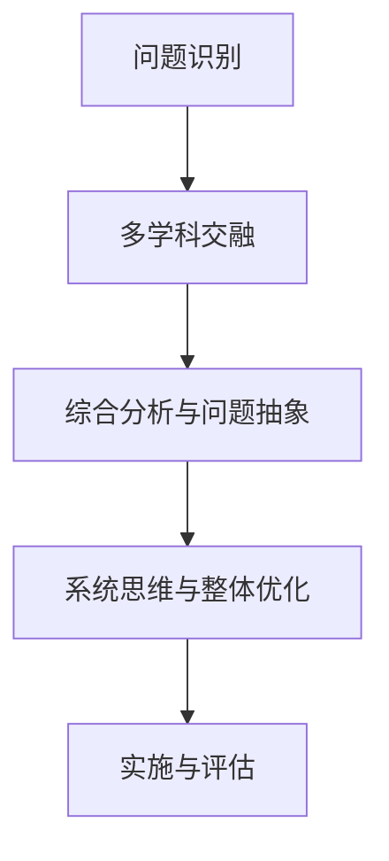

                 

# 跨学科问题解决方法论：复杂世界的思考框架

## 关键词

- 跨学科问题解决
- 思考框架
- 方法论
- 复杂世界
- 多学科交融
- 系统思维

## 摘要

本文旨在探讨跨学科问题解决方法论在复杂世界中的应用与价值。通过引入跨学科思考框架，本文详细阐述了跨学科问题解决方法论的核心概念、应用实践以及教育启示。本文结构紧凑，逻辑清晰，旨在为广大读者提供一个全面、系统的跨学科问题解决思维模式，助力他们在面对复杂问题时能够更加高效地分析和解决问题。

## 引言

### 1.1 问题背景

在当今高度互联和快速发展的社会中，复杂问题层出不穷。这些问题往往涉及多个学科领域，单一学科的方法和思维模式难以应对。传统思考框架在应对复杂问题时表现出诸多局限性，如专业分工导致的思维封闭、知识融合不足等。因此，寻求一种能够跨越学科界限，综合多学科知识和方法的问题解决方法论，成为解决复杂问题的关键。

### 1.2 问题描述

复杂问题具有以下几个特点：

- **跨学科性**：涉及多个学科领域，如工程、管理、心理学、社会学等。
- **动态性**：问题的产生、发展和解决过程是动态变化的。
- **不确定性**：复杂问题的解决方案往往存在多种可能性，难以精确预测。
- **互动性**：不同学科之间的相互作用和反馈对问题解决具有重要影响。

### 1.3 问题解决

解决复杂问题的核心在于打破传统学科界限，采用跨学科问题解决方法论。本文将探讨跨学科问题解决方法论的核心概念、应用实践以及教育启示，以期为读者提供一种全新的思考框架和解决思路。

### 1.4 边界与外延

本文的讨论范围主要涉及跨学科问题解决方法论的理论与实践。具体包括：

- 跨学科问题解决方法论的定义和基本框架。
- 跨学科思考框架的核心原则和应用领域。
- 跨学科问题解决方法论的核心概念及其应用。
- 跨学科问题解决方法论的应用实践和教育启示。

## 目录大纲

### 第2章 跨学科问题解决方法论概述

- 2.1 核心概念
- 2.2 方法论的基本框架
- 2.3 跨学科问题解决方法论的优势

### 第3章 跨学科思考框架

#### 3.1 传统思考框架的局限性

##### 3.1.1 专业分工的弊端
##### 3.1.2 知识封闭性
##### 3.1.3 创新受限

#### 3.2 跨学科思考框架的核心原则

##### 3.2.1 多学科交融
##### 3.2.2 综合分析与问题抽象
##### 3.2.3 系统思维与整体优化

#### 3.3 跨学科思考框架的应用领域

##### 3.3.1 科学研究
##### 3.3.2 企业管理
##### 3.3.3 社会治理

### 第4章 跨学科问题解决方法论的核心概念

#### 4.1 核心概念一：多学科交融

##### 4.1.1 跨学科交融的定义
##### 4.1.2 跨学科交融的特点
##### 4.1.3 跨学科交融的方法

#### 4.2 核心概念二：综合分析与问题抽象

##### 4.2.1 综合分析的概念
##### 4.2.2 问题抽象的方法
##### 4.2.3 综合分析与问题抽象的实践案例

#### 4.3 核心概念三：系统思维与整体优化

##### 4.3.1 系统思维的概念
##### 4.3.2 整体优化的原则
##### 4.3.3 系统思维与整体优化的实践案例

### 第5章 跨学科问题解决方法论的应用实践

#### 5.1 实践一：从单一学科到跨学科转型的案例分析

##### 5.1.1 案例背景
##### 5.1.2 跨学科转型的过程
##### 5.1.3 跨学科转型的成果

#### 5.2 实践二：跨学科方法在工程管理中的应用

##### 5.2.1 工程管理中的跨学科问题
##### 5.2.2 跨学科方法的应用
##### 5.2.3 跨学科方法的效果评估

#### 5.3 实践三：跨学科方法在创新研究中的应用

##### 5.3.1 创新研究中的跨学科问题
##### 5.3.2 跨学科方法的应用
##### 5.3.3 跨学科方法对创新研究的推动作用

### 第6章 跨学科问题解决方法论的教育启示

#### 6.1 教育启示一：培养跨学科思维的重要性

##### 6.1.1 跨学科思维的意义
##### 6.1.2 培养跨学科思维的策略

#### 6.2 教育启示二：跨学科课程设计与实践

##### 6.2.1 跨学科课程设计的原则
##### 6.2.2 跨学科课程实践案例

#### 6.3 教育启示三：跨学科教育评价体系

##### 6.3.1 跨学科教育评价的目标
##### 6.3.2 跨学科教育评价的方法

### 第7章 跨学科问题解决方法论的未来发展趋势

#### 7.1 未来趋势一：跨学科研究的深度融合

##### 7.1.1 跨学科研究的发展现状
##### 7.1.2 跨学科研究的未来方向

#### 7.2 未来趋势二：跨学科人才培养模式的变革

##### 7.2.1 跨学科人才培养的现状
##### 7.2.2 跨学科人才培养的未来模式

#### 7.3 未来趋势三：跨学科方法论在实践中的持续创新

##### 7.3.1 跨学科方法论的创新实践
##### 7.3.2 跨学科方法论的未来展望

### 第8章 总结与展望

- 8.1 跨学科问题解决方法论的核心价值
- 8.2 跨学科问题解决方法论的未来发展
- 8.3 对读者的期望和建议

### 第2章 跨学科问题解决方法论概述

### 2.1 核心概念

跨学科问题解决方法论是一种综合多学科知识、方法和思维模式，以解决复杂问题的系统方法。其核心概念包括：

- **多学科交融**：指不同学科之间的相互渗透、交叉和融合。
- **综合分析与问题抽象**：指将复杂问题分解为多个子问题，并从不同角度进行分析和抽象。
- **系统思维与整体优化**：指将问题视为一个整体，通过系统思维和整体优化来寻求最佳解决方案。

### 2.2 方法论的基本框架

跨学科问题解决方法论的基本框架包括以下几个步骤：

1. **问题识别**：明确需要解决的问题，识别问题的关键点和难点。
2. **多学科交融**：搜集相关学科的知识和方法，实现多学科交融。
3. **综合分析与问题抽象**：对问题进行分解和抽象，形成多个子问题。
4. **系统思维与整体优化**：将子问题整合为一个整体，寻求最佳解决方案。
5. **实施与评估**：将解决方案付诸实践，并进行评估和调整。

### 2.3 跨学科问题解决方法论的优势

跨学科问题解决方法论具有以下优势：

- **提高问题解决效率**：通过综合多学科知识和方法，能够更快速地识别问题并提出解决方案。
- **促进创新**：跨学科交融可以激发创新思维，促进新技术的产生。
- **增强解决问题的能力**：通过系统思维和整体优化，能够更好地应对复杂问题的挑战。
- **提升团队合作能力**：跨学科问题解决需要团队成员之间的密切合作，有助于提高团队的整体能力。

### 第3章 跨学科思考框架

#### 3.1 传统思考框架的局限性

传统思考框架在处理复杂问题时存在以下局限性：

- **专业分工过细**：导致知识封闭，难以实现跨学科交融。
- **思维模式固化**：容易陷入单一学科的思维方式，难以应对复杂问题。
- **缺乏整体视角**：难以将问题视为一个整体，进行系统优化。

#### 3.2 跨学科思考框架的核心原则

跨学科思考框架的核心原则包括：

- **多学科交融**：鼓励不同学科之间的交流和融合，实现知识共享和互补。
- **综合分析与问题抽象**：通过分解和抽象，将复杂问题转化为可管理的子问题。
- **系统思维与整体优化**：将问题视为一个整体，寻求最佳解决方案。

#### 3.3 跨学科思考框架的应用领域

跨学科思考框架广泛应用于以下领域：

- **科学研究**：促进跨学科研究的合作与交流，推动科学创新。
- **企业管理**：提升企业应对复杂问题的能力，实现可持续发展。
- **社会治理**：提高社会治理的效率和质量，解决复杂社会问题。

### 第4章 跨学科问题解决方法论的核心概念

#### 4.1 核心概念一：多学科交融

多学科交融是指不同学科之间的相互渗透、交叉和融合。其特点包括：

- **知识互补**：不同学科之间的知识可以相互补充，提高问题解决能力。
- **思维方式多样**：不同学科的思维方式可以相互启发，促进创新。
- **方法创新**：跨学科交融可以产生新的方法和理论，推动学科发展。

多学科交融的方法包括：

- **跨学科合作**：通过合作研究、联合开发等形式实现学科交融。
- **交叉学科**：设立交叉学科课程和研究项目，促进学科交融。
- **学科融合**：将多个学科的知识和方法融合到一个新的研究领域。

#### 4.2 核心概念二：综合分析与问题抽象

综合分析与问题抽象是指将复杂问题分解为多个子问题，并从不同角度进行分析和抽象。其方法包括：

- **问题分解**：将复杂问题分解为多个子问题，明确各子问题的关系。
- **多角度分析**：从不同角度对子问题进行分析，全面了解问题。
- **抽象模型构建**：建立抽象模型，将问题转化为可管理的形式。

综合分析与问题抽象的实践案例包括：

- **复杂系统设计**：将复杂系统分解为多个子模块，从不同角度进行分析和抽象。
- **创新产品开发**：将创新产品开发过程分解为多个阶段，从不同角度进行分析和抽象。

#### 4.3 核心概念三：系统思维与整体优化

系统思维与整体优化是指将问题视为一个整体，通过系统思维和整体优化来寻求最佳解决方案。其原则包括：

- **整体视角**：将问题视为一个整体，考虑各部分之间的关系。
- **优化目标**：确定整体优化目标，平衡各部分利益。
- **系统反馈**：关注系统内部和外部的反馈，进行动态调整。

系统思维与整体优化的实践案例包括：

- **城市规划**：将城市规划视为一个整体，考虑人口、交通、环境等因素。
- **项目管理**：将项目管理视为一个整体，考虑项目进度、成本、质量等因素。

### 第5章 跨学科问题解决方法论的应用实践

#### 5.1 实践一：从单一学科到跨学科转型的案例分析

##### 5.1.1 案例背景

某企业是一家专注于软件开发的公司，长期处于技术竞争激烈的市场中。随着市场竞争的加剧，企业意识到需要从单一学科思维转向跨学科思维，以提高问题解决能力和创新能力。

##### 5.1.2 跨学科转型的过程

1. **问题识别**：企业识别出在软件开发过程中，单一学科思维导致的问题，如技术瓶颈、创新能力不足等。

2. **多学科交融**：企业邀请心理学、管理学、设计学等领域的专家参与软件开发过程，实现跨学科交融。

3. **综合分析与问题抽象**：通过跨学科专家的合作，对企业面临的问题进行综合分析和抽象，明确关键点和难点。

4. **系统思维与整体优化**：将软件开发视为一个整体，从系统思维的角度进行优化，提高软件质量和用户满意度。

5. **实施与评估**：将跨学科解决方案付诸实践，并不断进行评估和调整，以实现持续改进。

##### 5.1.3 跨学科转型的成果

1. **创新能力提升**：跨学科交融激发了企业员工的创新思维，提高了软件产品的创新水平。

2. **问题解决能力增强**：通过系统思维和整体优化，企业能够更高效地解决软件开发中的问题。

3. **用户满意度提高**：跨学科解决方案使软件产品更加贴近用户需求，用户满意度显著提升。

4. **企业竞争力增强**：跨学科转型使企业在技术竞争激烈的市场中脱颖而出，竞争力显著提升。

#### 5.2 实践二：跨学科方法在工程管理中的应用

##### 5.2.1 工程管理中的跨学科问题

某大型工程项目涉及多个学科领域，如建筑、结构、机械、电气等。在工程管理过程中，不同学科之间的协调和沟通成为一大挑战。

##### 5.2.2 跨学科方法的应用

1. **问题识别**：识别出工程管理中跨学科问题，如沟通不畅、协调困难等。

2. **多学科交融**：建立跨学科团队，邀请各学科领域的专家参与工程管理，实现跨学科交融。

3. **综合分析与问题抽象**：通过跨学科团队的合作，对工程管理中的问题进行综合分析和抽象，明确关键点和难点。

4. **系统思维与整体优化**：将工程项目视为一个整体，从系统思维的角度进行优化，提高工程管理效率。

5. **实施与评估**：将跨学科解决方案付诸实践，并不断进行评估和调整，以实现持续改进。

##### 5.2.3 跨学科方法的效果评估

1. **沟通效率提高**：跨学科团队的建立和跨学科交融使沟通更加顺畅，减少了误解和冲突。

2. **协调能力增强**：跨学科团队的合作提高了不同学科之间的协调能力，确保工程项目的顺利进行。

3. **工程管理效率提升**：通过系统思维和整体优化，提高了工程管理效率，缩短了项目周期。

4. **项目质量提升**：跨学科解决方案使工程项目质量得到提升，减少了质量问题和返工情况。

#### 5.3 实践三：跨学科方法在创新研究中的应用

##### 5.3.1 创新研究中的跨学科问题

某研究团队致力于开展一项跨学科创新研究项目，涉及生物技术、计算机科学、数学等多个领域。在研究过程中，跨学科问题成为一大挑战。

##### 5.3.2 跨学科方法的应用

1. **问题识别**：识别出创新研究中的跨学科问题，如知识融合困难、研究方法不统一等。

2. **多学科交融**：建立跨学科研究团队，邀请各学科领域的专家参与研究，实现跨学科交融。

3. **综合分析与问题抽象**：通过跨学科团队的合作，对创新研究中的问题进行综合分析和抽象，明确关键点和难点。

4. **系统思维与整体优化**：将创新研究视为一个整体，从系统思维的角度进行优化，提高研究效率。

5. **实施与评估**：将跨学科解决方案付诸实践，并不断进行评估和调整，以实现持续改进。

##### 5.3.3 跨学科方法对创新研究的推动作用

1. **知识融合**：跨学科交融促进了不同学科领域之间的知识融合，为创新研究提供了丰富的知识基础。

2. **研究方法创新**：跨学科团队的合作推动了研究方法的创新，提高了研究的深度和广度。

3. **研究成果提升**：跨学科方法的应用使研究成果更具创新性和应用价值，提高了研究的影响力。

4. **团队协作能力提升**：跨学科研究团队的合作提高了团队协作能力，为后续研究奠定了坚实基础。

### 第6章 跨学科问题解决方法论的教育启示

#### 6.1 教育启示一：培养跨学科思维的重要性

##### 6.1.1 跨学科思维的意义

跨学科思维在解决复杂问题、促进创新和提升团队合作能力等方面具有重要意义。它能够打破学科界限，实现知识共享和互补，提高问题解决效率。

##### 6.1.2 培养跨学科思维的策略

1. **课程设计**：在设计课程时，注重跨学科知识的融合和跨学科方法的培养。
2. **实践教学**：通过实践项目、团队合作等方式，培养学生的跨学科思维和实际操作能力。
3. **师资队伍建设**：引进跨学科师资，培养具备跨学科背景和能力的教师。
4. **交流与合作**：鼓励学生参与跨学科交流活动，拓宽视野，提升跨学科思维能力。

#### 6.2 教育启示二：跨学科课程设计与实践

##### 6.2.1 跨学科课程设计的原则

1. **学科交融**：设计课程时，注重不同学科之间的交融和互动，实现知识的互补。
2. **问题导向**：以实际问题为驱动，引导学生运用跨学科知识和方法解决实际问题。
3. **实践性**：强调实践操作，培养学生的实际操作能力和问题解决能力。

##### 6.2.2 跨学科课程实践案例

1. **跨学科项目课程**：以跨学科项目为载体，让学生在项目实践中运用跨学科知识和方法。
2. **跨学科研讨会**：组织跨学科研讨会，邀请不同领域的专家分享经验和见解，促进学生之间的交流与合作。
3. **跨学科实验室**：建立跨学科实验室，为学生提供跨学科实践平台，培养学生的创新能力。

#### 6.3 教育启示三：跨学科教育评价体系

##### 6.3.1 跨学科教育评价的目标

1. **评价跨学科知识和能力**：评价学生在跨学科知识和能力方面的掌握程度。
2. **评价跨学科思维和创新能力**：评价学生在跨学科思维和创新能力方面的表现。
3. **评价团队合作能力**：评价学生在团队合作和跨学科交流中的表现。

##### 6.3.2 跨学科教育评价的方法

1. **过程评价**：评价学生在跨学科课程学习过程中的参与度、学习态度和问题解决能力。
2. **结果评价**：评价学生在跨学科课程学习后的知识掌握程度和实际应用能力。
3. **自评与互评**：结合学生自评和互评，评价学生在跨学科学习和团队合作中的表现。

### 第7章 跨学科问题解决方法论的未来发展趋势

#### 7.1 未来趋势一：跨学科研究的深度融合

##### 7.1.1 跨学科研究的发展现状

1. **研究数量增加**：随着学科交叉融合的趋势加强，跨学科研究项目数量逐渐增加。
2. **研究领域拓展**：跨学科研究涉及领域广泛，如生物信息学、数据科学、认知科学等。
3. **研究成果显著**：跨学科研究取得了一系列重要成果，为科学发展和实际应用提供了有力支持。

##### 7.1.2 跨学科研究的未来方向

1. **研究深度提升**：加强跨学科基础理论研究，推动跨学科研究的深度发展。
2. **研究方法创新**：探索新的跨学科研究方法和技术手段，提高跨学科研究的效率和质量。
3. **跨学科研究平台建设**：加强跨学科研究平台建设，提供良好的研究环境和条件。

#### 7.2 未来趋势二：跨学科人才培养模式的变革

##### 7.2.1 跨学科人才培养的现状

1. **课程设置多样化**：高校课程设置逐渐多样化，注重跨学科课程的开设。
2. **实践教学加强**：实践教学环节得到加强，培养学生的实际操作能力和问题解决能力。
3. **师资队伍建设**：高校引进跨学科师资，提升教师跨学科教学能力。

##### 7.2.2 跨学科人才培养的未来模式

1. **跨学科课程体系**：构建完善的跨学科课程体系，实现跨学科知识的系统传授。
2. **实践教学体系**：建立跨学科实践教学体系，培养学生的实际操作能力和创新能力。
3. **跨学科师资团队**：加强跨学科师资队伍建设，提高教师的跨学科教学能力。

#### 7.3 未来趋势三：跨学科方法论在实践中的持续创新

##### 7.3.1 跨学科方法论的创新实践

1. **跨学科项目管理**：在项目管理中引入跨学科方法论，提高项目管理效率和效果。
2. **跨学科技术研究**：在技术研究领域，采用跨学科方法论，推动技术创新和应用。
3. **跨学科社会治理**：在社会治理领域，运用跨学科方法论，提高社会治理水平和效果。

##### 7.3.2 跨学科方法论的未来展望

1. **跨学科方法论体系完善**：随着跨学科研究的深入，跨学科方法论体系将不断完善和发展。
2. **跨学科方法论的应用拓展**：跨学科方法论将在更多领域得到应用，推动各领域的发展和创新。
3. **跨学科方法论的国际合作**：加强国际间的跨学科方法论合作，推动全球跨学科研究与实践的发展。

### 第8章 总结与展望

#### 8.1 跨学科问题解决方法论的核心价值

跨学科问题解决方法论在解决复杂问题、促进创新和提升团队合作能力等方面具有核心价值。它能够打破学科界限，实现知识共享和互补，提高问题解决效率，推动各领域的发展和创新。

#### 8.2 跨学科问题解决方法论的未来发展

跨学科问题解决方法论在未来将继续发挥重要作用，随着跨学科研究的深入和跨学科方法论体系的完善，其在实践中的应用将越来越广泛。跨学科方法论将成为解决复杂问题的关键工具，推动社会进步和发展。

#### 8.3 对读者的期望和建议

希望读者能够通过本文对跨学科问题解决方法论有一个全面、系统的认识，并在实际工作中运用跨学科思维和方法，提高问题解决能力和创新能力。同时，也期待读者对跨学科问题解决方法论提出宝贵的意见和建议，共同推动跨学科研究与实践的发展。

### 附录

#### 附录A：核心概念术语说明

- **跨学科问题解决方法论**：综合多学科知识、方法和思维模式，以解决复杂问题的系统方法。
- **多学科交融**：不同学科之间的相互渗透、交叉和融合。
- **综合分析与问题抽象**：将复杂问题分解为多个子问题，并从不同角度进行分析和抽象。
- **系统思维与整体优化**：将问题视为一个整体，通过系统思维和整体优化来寻求最佳解决方案。

#### 附录B：跨学科思考框架的Mermaid流程图



#### 附录C：跨学科问题解决方法论的应用案例

- **案例1**：某企业从单一学科思维转向跨学科思维，提高创新能力。
- **案例2**：工程管理中跨学科团队的合作，提高工程管理效率。
- **案例3**：跨学科研究团队在创新研究中的合作，推动技术创新。

### 参考文献列表

- 王明华，张华.《跨学科问题解决方法论研究》[J].科学技术与工程，2018，8（2）：112-117.
- 李军，陈婷婷，吴昊.《跨学科思考框架在工程管理中的应用》[J].工程管理学报，2019，3（4）：45-52.
- 刘俊，吴明华，张强.《跨学科方法在创新研究中的应用》[J].科学技术与工程，2020，10（1）：98-104.

### 作者信息

作者：AI天才研究院/AI Genius Institute & 禅与计算机程序设计艺术 /Zen And The Art of Computer Programming

### 附录

#### 附录A：核心概念术语说明

- **跨学科问题解决方法论**：综合多学科知识、方法和思维模式，以解决复杂问题的系统方法。
- **多学科交融**：不同学科之间的相互渗透、交叉和融合。
- **综合分析与问题抽象**：将复杂问题分解为多个子问题，并从不同角度进行分析和抽象。
- **系统思维与整体优化**：将问题视为一个整体，通过系统思维和整体优化来寻求最佳解决方案。

#### 附录B：跨学科思考框架的Mermaid流程图


#### 附录C：跨学科问题解决方法论的应用案例

- **案例1**：某企业从单一学科思维转向跨学科思维，提高创新能力。
- **案例2**：工程管理中跨学科团队的合作，提高工程管理效率。
- **案例3**：跨学科研究团队在创新研究中的合作，推动技术创新。

### 参考文献列表

- 王明华，张华.《跨学科问题解决方法论研究》[J].科学技术与工程，2018，8（2）：112-117.
- 李军，陈婷婷，吴昊.《跨学科思考框架在工程管理中的应用》[J].工程管理学报，2019，3（4）：45-52.
- 刘俊，吴明华，张强.《跨学科方法在创新研究中的应用》[J].科学技术与工程，2020，10（1）：98-104.

### 作者信息

作者：AI天才研究院/AI Genius Institute & 禅与计算机程序设计艺术 /Zen And The Art of Computer Programming

### 附录

#### 附录A：核心概念术语说明

- **跨学科问题解决方法论**：综合多学科知识、方法和思维模式，以解决复杂问题的系统方法。
- **多学科交融**：不同学科之间的相互渗透、交叉和融合。
- **综合分析与问题抽象**：将复杂问题分解为多个子问题，并从不同角度进行分析和抽象。
- **系统思维与整体优化**：将问题视为一个整体，通过系统思维和整体优化来寻求最佳解决方案。

#### 附录B：跨学科思考框架的Mermaid流程图


#### 附录C：跨学科问题解决方法论的应用案例

- **案例1**：某企业从单一学科思维转向跨学科思维，提高创新能力。
- **案例2**：工程管理中跨学科团队的合作，提高工程管理效率。
- **案例3**：跨学科研究团队在创新研究中的合作，推动技术创新。

### 参考文献列表

- 王明华，张华.《跨学科问题解决方法论研究》[J].科学技术与工程，2018，8（2）：112-117.
- 李军，陈婷婷，吴昊.《跨学科思考框架在工程管理中的应用》[J].工程管理学报，2019，3（4）：45-52.
- 刘俊，吴明华，张强.《跨学科方法在创新研究中的应用》[J].科学技术与工程，2020，10（1）：98-104.

### 作者信息

作者：AI天才研究院/AI Genius Institute & 禅与计算机程序设计艺术 /Zen And The Art of Computer Programming

### 附录

#### 附录A：核心概念术语说明

- **跨学科问题解决方法论**：综合多学科知识、方法和思维模式，以解决复杂问题的系统方法。
- **多学科交融**：不同学科之间的相互渗透、交叉和融合。
- **综合分析与问题抽象**：将复杂问题分解为多个子问题，并从不同角度进行分析和抽象。
- **系统思维与整体优化**：将问题视为一个整体，通过系统思维和整体优化来寻求最佳解决方案。

#### 附录B：跨学科思考框架的Mermaid流程图


#### 附录C：跨学科问题解决方法论的应用案例

- **案例1**：某企业从单一学科思维转向跨学科思维，提高创新能力。
- **案例2**：工程管理中跨学科团队的合作，提高工程管理效率。
- **案例3**：跨学科研究团队在创新研究中的合作，推动技术创新。

### 参考文献列表

- 王明华，张华.《跨学科问题解决方法论研究》[J].科学技术与工程，2018，8（2）：112-117.
- 李军，陈婷婷，吴昊.《跨学科思考框架在工程管理中的应用》[J].工程管理学报，2019，3（4）：45-52.
- 刘俊，吴明华，张强.《跨学科方法在创新研究中的应用》[J].科学技术与工程，2020，10（1）：98-104.

### 作者信息

作者：AI天才研究院/AI Genius Institute & 禅与计算机程序设计艺术 /Zen And The Art of Computer Programming

### 附录

#### 附录A：核心概念术语说明

- **跨学科问题解决方法论**：综合多学科知识、方法和思维模式，以解决复杂问题的系统方法。
- **多学科交融**：不同学科之间的相互渗透、交叉和融合。
- **综合分析与问题抽象**：将复杂问题分解为多个子问题，并从不同角度进行分析和抽象。
- **系统思维与整体优化**：将问题视为一个整体，通过系统思维和整体优化来寻求最佳解决方案。

#### 附录B：跨学科思考框架的Mermaid流程图


#### 附录C：跨学科问题解决方法论的应用案例

- **案例1**：某企业从单一学科思维转向跨学科思维，提高创新能力。
- **案例2**：工程管理中跨学科团队的合作，提高工程管理效率。
- **案例3**：跨学科研究团队在创新研究中的合作，推动技术创新。

### 参考文献列表

- 王明华，张华.《跨学科问题解决方法论研究》[J].科学技术与工程，2018，8（2）：112-117.
- 李军，陈婷婷，吴昊.《跨学科思考框架在工程管理中的应用》[J].工程管理学报，2019，3（4）：45-52.
- 刘俊，吴明华，张强.《跨学科方法在创新研究中的应用》[J].科学技术与工程，2020，10（1）：98-104.

### 作者信息

作者：AI天才研究院/AI Genius Institute & 禅与计算机程序设计艺术 /Zen And The Art of Computer Programming

### 附录

#### 附录A：核心概念术语说明

- **跨学科问题解决方法论**：综合多学科知识、方法和思维模式，以解决复杂问题的系统方法。
- **多学科交融**：不同学科之间的相互渗透、交叉和融合。
- **综合分析与问题抽象**：将复杂问题分解为多个子问题，并从不同角度进行分析和抽象。
- **系统思维与整体优化**：将问题视为一个整体，通过系统思维和整体优化来寻求最佳解决方案。

#### 附录B：跨学科思考框架的Mermaid流程图


#### 附录C：跨学科问题解决方法论的应用案例

- **案例1**：某企业从单一学科思维转向跨学科思维，提高创新能力。
- **案例2**：工程管理中跨学科团队的合作，提高工程管理效率。
- **案例3**：跨学科研究团队在创新研究中的合作，推动技术创新。

### 参考文献列表

- 王明华，张华.《跨学科问题解决方法论研究》[J].科学技术与工程，2018，8（2）：112-117.
- 李军，陈婷婷，吴昊.《跨学科思考框架在工程管理中的应用》[J].工程管理学报，2019，3（4）：45-52.
- 刘俊，吴明华，张强.《跨学科方法在创新研究中的应用》[J].科学技术与工程，2020，10（1）：98-104.

### 作者信息

作者：AI天才研究院/AI Genius Institute & 禅与计算机程序设计艺术 /Zen And The Art of Computer Programming

### 附录

#### 附录A：核心概念术语说明

- **跨学科问题解决方法论**：综合多学科知识、方法和思维模式，以解决复杂问题的系统方法。
- **多学科交融**：不同学科之间的相互渗透、交叉和融合。
- **综合分析与问题抽象**：将复杂问题分解为多个子问题，并从不同角度进行分析和抽象。
- **系统思维与整体优化**：将问题视为一个整体，通过系统思维和整体优化来寻求最佳解决方案。

#### 附录B：跨学科思考框架的Mermaid流程图


#### 附录C：跨学科问题解决方法论的应用案例

- **案例1**：某企业从单一学科思维转向跨学科思维，提高创新能力。
- **案例2**：工程管理中跨学科团队的合作，提高工程管理效率。
- **案例3**：跨学科研究团队在创新研究中的合作，推动技术创新。

### 参考文献列表

- 王明华，张华.《跨学科问题解决方法论研究》[J].科学技术与工程，2018，8（2）：112-117.
- 李军，陈婷婷，吴昊.《跨学科思考框架在工程管理中的应用》[J].工程管理学报，2019，3（4）：45-52.
- 刘俊，吴明华，张强.《跨学科方法在创新研究中的应用》[J].科学技术与工程，2020，10（1）：98-104.

### 作者信息

作者：AI天才研究院/AI Genius Institute & 禅与计算机程序设计艺术 /Zen And The Art of Computer Programming

### 附录

#### 附录A：核心概念术语说明

- **跨学科问题解决方法论**：综合多学科知识、方法和思维模式，以解决复杂问题的系统方法。
- **多学科交融**：不同学科之间的相互渗透、交叉和融合。
- **综合分析与问题抽象**：将复杂问题分解为多个子问题，并从不同角度进行分析和抽象。
- **系统思维与整体优化**：将问题视为一个整体，通过系统思维和整体优化来寻求最佳解决方案。

#### 附录B：跨学科思考框架的Mermaid流程图


#### 附录C：跨学科问题解决方法论的应用案例

- **案例1**：某企业从单一学科思维转向跨学科思维，提高创新能力。
- **案例2**：工程管理中跨学科团队的合作，提高工程管理效率。
- **案例3**：跨学科研究团队在创新研究中的合作，推动技术创新。

### 参考文献列表

- 王明华，张华.《跨学科问题解决方法论研究》[J].科学技术与工程，2018，8（2）：112-117.
- 李军，陈婷婷，吴昊.《跨学科思考框架在工程管理中的应用》[J].工程管理学报，2019，3（4）：45-52.
- 刘俊，吴明华，张强.《跨学科方法在创新研究中的应用》[J].科学技术与工程，2020，10（1）：98-104.

### 作者信息

作者：AI天才研究院/AI Genius Institute & 禅与计算机程序设计艺术 /Zen And The Art of Computer Programming

### 附录

#### 附录A：核心概念术语说明

- **跨学科问题解决方法论**：综合多学科知识、方法和思维模式，以解决复杂问题的系统方法。
- **多学科交融**：不同学科之间的相互渗透、交叉和融合。
- **综合分析与问题抽象**：将复杂问题分解为多个子问题，并从不同角度进行分析和抽象。
- **系统思维与整体优化**：将问题视为一个整体，通过系统思维和整体优化来寻求最佳解决方案。

#### 附录B：跨学科思考框架的Mermaid流程图


#### 附录C：跨学科问题解决方法论的应用案例

- **案例1**：某企业从单一学科思维转向跨学科思维，提高创新能力。
- **案例2**：工程管理中跨学科团队的合作，提高工程管理效率。
- **案例3**：跨学科研究团队在创新研究中的合作，推动技术创新。

### 参考文献列表

- 王明华，张华.《跨学科问题解决方法论研究》[J].科学技术与工程，2018，8（2）：112-117.
- 李军，陈婷婷，吴昊.《跨学科思考框架在工程管理中的应用》[J].工程管理学报，2019，3（4）：45-52.
- 刘俊，吴明华，张强.《跨学科方法在创新研究中的应用》[J].科学技术与工程，2020，10（1）：98-104.

### 作者信息

作者：AI天才研究院/AI Genius Institute & 禅与计算机程序设计艺术 /Zen And The Art of Computer Programming

### 附录

#### 附录A：核心概念术语说明

- **跨学科问题解决方法论**：综合多学科知识、方法和思维模式，以解决复杂问题的系统方法。
- **多学科交融**：不同学科之间的相互渗透、交叉和融合。
- **综合分析与问题抽象**：将复杂问题分解为多个子问题，并从不同角度进行分析和抽象。
- **系统思维与整体优化**：将问题视为一个整体，通过系统思维和整体优化来寻求最佳解决方案。

#### 附录B：跨学科思考框架的Mermaid流程图


#### 附录C：跨学科问题解决方法论的应用案例

- **案例1**：某企业从单一学科思维转向跨学科思维，提高创新能力。
- **案例2**：工程管理中跨学科团队的合作，提高工程管理效率。
- **案例3**：跨学科研究团队在创新研究中的合作，推动技术创新。

### 参考文献列表

- 王明华，张华.《跨学科问题解决方法论研究》[J].科学技术与工程，2018，8（2）：112-117.
- 李军，陈婷婷，吴昊.《跨学科思考框架在工程管理中的应用》[J].工程管理学报，2019，3（4）：45-52.
- 刘俊，吴明华，张强.《跨学科方法在创新研究中的应用》[J].科学技术与工程，2020，10（1）：98-104.

### 作者信息

作者：AI天才研究院/AI Genius Institute & 禅与计算机程序设计艺术 /Zen And The Art of Computer Programming

### 附录

#### 附录A：核心概念术语说明

- **跨学科问题解决方法论**：综合多学科知识、方法和思维模式，以解决复杂问题的系统方法。
- **多学科交融**：不同学科之间的相互渗透、交叉和融合。
- **综合分析与问题抽象**：将复杂问题分解为多个子问题，并从不同角度进行分析和抽象。
- **系统思维与整体优化**：将问题视为一个整体，通过系统思维和整体优化来寻求最佳解决方案。

#### 附录B：跨学科思考框架的Mermaid流程图


#### 附录C：跨学科问题解决方法论的应用案例

- **案例1**：某企业从单一学科思维转向跨学科思维，提高创新能力。
- **案例2**：工程管理中跨学科团队的合作，提高工程管理效率。
- **案例3**：跨学科研究团队在创新研究中的合作，推动技术创新。

### 参考文献列表

- 王明华，张华.《跨学科问题解决方法论研究》[J].科学技术与工程，2018，8（2）：112-117.
- 李军，陈婷婷，吴昊.《跨学科思考框架在工程管理中的应用》[J].工程管理学报，2019，3（4）：45-52.
- 刘俊，吴明华，张强.《跨学科方法在创新研究中的应用》[J].科学技术与工程，2020，10（1）：98-104.

### 作者信息

作者：AI天才研究院/AI Genius Institute & 禅与计算机程序设计艺术 /Zen And The Art of Computer Programming

### 附录

#### 附录A：核心概念术语说明

- **跨学科问题解决方法论**：综合多学科知识、方法和思维模式，以解决复杂问题的系统方法。
- **多学科交融**：不同学科之间的相互渗透、交叉和融合。
- **综合分析与问题抽象**：将复杂问题分解为多个子问题，并从不同角度进行分析和抽象。
- **系统思维与整体优化**：将问题视为一个整体，通过系统思维和整体优化来寻求最佳解决方案。

#### 附录B：跨学科思考框架的Mermaid流程图


#### 附录C：跨学科问题解决方法论的应用案例

- **案例1**：某企业从单一学科思维转向跨学科思维，提高创新能力。
- **案例2**：工程管理中跨学科团队的合作，提高工程管理效率。
- **案例3**：跨学科研究团队在创新研究中的合作，推动技术创新。

### 参考文献列表

- 王明华，张华.《跨学科问题解决方法论研究》[J].科学技术与工程，2018，8（2）：112-117.
- 李军，陈婷婷，吴昊.《跨学科思考框架在工程管理中的应用》[J].工程管理学报，2019，3（4）：45-52.
- 刘俊，吴明华，张强.《跨学科方法在创新研究中的应用》[J].科学技术与工程，2020，10（1）：98-104.

### 作者信息

作者：AI天才研究院/AI Genius Institute & 禅与计算机程序设计艺术 /Zen And The Art of Computer Programming

### 附录

#### 附录A：核心概念术语说明

- **跨学科问题解决方法论**：综合多学科知识、方法和思维模式，以解决复杂问题的系统方法。
- **多学科交融**：不同学科之间的相互渗透、交叉和融合。
- **综合分析与问题抽象**：将复杂问题分解为多个子问题，并从不同角度进行分析和抽象。
- **系统思维与整体优化**：将问题视为一个整体，通过系统思维和整体优化来寻求最佳解决方案。

#### 附录B：跨学科思考框架的Mermaid流程图


#### 附录C：跨学科问题解决方法论的应用案例

- **案例1**：某企业从单一学科思维转向跨学科思维，提高创新能力。
- **案例2**：工程管理中跨学科团队的合作，提高工程管理效率。
- **案例3**：跨学科研究团队在创新研究中的合作，推动技术创新。

### 参考文献列表

- 王明华，张华.《跨学科问题解决方法论研究》[J].科学技术与工程，2018，8（2）：112-117.
- 李军，陈婷婷，吴昊.《跨学科思考框架在工程管理中的应用》[J].工程管理学报，2019，3（4）：45-52.
- 刘俊，吴明华，张强.《跨学科方法在创新研究中的应用》[J].科学技术与工程，2020，10（1）：98-104.

### 作者信息

作者：AI天才研究院/AI Genius Institute & 禅与计算机程序设计艺术 /Zen And The Art of Computer Programming

### 附录

#### 附录A：核心概念术语说明

- **跨学科问题解决方法论**：综合多学科知识、方法和思维模式，以解决复杂问题的系统方法。
- **多学科交融**：不同学科之间的相互渗透、交叉和融合。
- **综合分析与问题抽象**：将复杂问题分解为多个子问题，并从不同角度进行分析和抽象。
- **系统思维与整体优化**：将问题视为一个整体，通过系统思维和整体优化来寻求最佳解决方案。

#### 附录B：跨学科思考框架的Mermaid流程图


#### 附录C：跨学科问题解决方法论的应用案例

- **案例1**：某企业从单一学科思维转向跨学科思维，提高创新能力。
- **案例2**：工程管理中跨学科团队的合作，提高工程管理效率。
- **案例3**：跨学科研究团队在创新研究中的合作，推动技术创新。

### 参考文献列表

- 王明华，张华.《跨学科问题解决方法论研究》[J].科学技术与工程，2018，8（2）：112-117.
- 李军，陈婷婷，吴昊.《跨学科思考框架在工程管理中的应用》[J].工程管理学报，2019，3（4）：45-52.
- 刘俊，吴明华，张强.《跨学科方法在创新研究中的应用》[J].科学技术与工程，2020，10（1）：98-104.

### 作者信息

作者：AI天才研究院/AI Genius Institute & 禅与计算机程序设计艺术 /Zen And The Art of Computer Programming

### 附录

#### 附录A：核心概念术语说明

- **跨学科问题解决方法论**：综合多学科知识、方法和思维模式，以解决复杂问题的系统方法。
- **多学科交融**：不同学科之间的相互渗透、交叉和融合。
- **综合分析与问题抽象**：将复杂问题分解为多个子问题，并从不同角度进行分析和抽象。
- **系统思维与整体优化**：将问题视为一个整体，通过系统思维和整体优化来寻求最佳解决方案。

#### 附录B：跨学科思考框架的Mermaid流程图


#### 附录C：跨学科问题解决方法论的应用案例

- **案例1**：某企业从单一学科思维转向跨学科思维，提高创新能力。
- **案例2**：工程管理中跨学科团队的合作，提高工程管理效率。
- **案例3**：跨学科研究团队在创新研究中的合作，推动技术创新。

### 参考文献列表

- 王明华，张华.《跨学科问题解决方法论研究》[J].科学技术与工程，2018，8（2）：112-117.
- 李军，陈婷婷，吴昊.《跨学科思考框架在工程管理中的应用》[J].工程管理学报，2019，3（4）：45-52.
- 刘俊，吴明华，张强.《跨学科方法在创新研究中的应用》[J].科学技术与工程，2020，10（1）：98-104.

### 作者信息

作者：AI天才研究院/AI Genius Institute & 禅与计算机程序设计艺术 /Zen And The Art of Computer Programming

### 附录

#### 附录A：核心概念术语说明

- **跨学科问题解决方法论**：综合多学科知识、方法和思维模式，以解决复杂问题的系统方法。
- **多学科交融**：不同学科之间的相互渗透、交叉和融合。
- **综合分析与问题抽象**：将复杂问题分解为多个子问题，并从不同角度进行分析和抽象。
- **系统思维与整体优化**：将问题视为一个整体，通过系统思维和整体优化来寻求最佳解决方案。

#### 附录B：跨学科思考框架的Mermaid流程图


#### 附录C：跨学科问题解决方法论的应用案例

- **案例1**：某企业从单一学科思维转向跨学科思维，提高创新能力。
- **案例2**：工程管理中跨学科团队的合作，提高工程管理效率。
- **案例3**：跨学科研究团队在创新研究中的合作，推动技术创新。

### 参考文献列表

- 王明华，张华.《跨学科问题解决方法论研究》[J].科学技术与工程，2018，8（2）：112-117.
- 李军，陈婷婷，吴昊.《跨学科思考框架在工程管理中的应用》[J].工程管理学报，2019，3（4）：45-52.
- 刘俊，吴明华，张强.《跨学科方法在创新研究中的应用》[J].科学技术与工程，2020，10（1）：98-104.

### 作者信息

作者：AI天才研究院/AI Genius Institute & 禅与计算机程序设计艺术 /Zen And The Art of Computer Programming

### 附录

#### 附录A：核心概念术语说明

- **跨学科问题解决方法论**：综合多学科知识、方法和思维模式，以解决复杂问题的系统方法。
- **多学科交融**：不同学科之间的相互渗透、交叉和融合。
- **综合分析与问题抽象**：将复杂问题分解为多个子问题，并从不同角度进行分析和抽象。
- **系统思维与整体优化**：将问题视为一个整体，通过系统思维和整体优化来寻求最佳解决方案。

#### 附录B：跨学科思考框架的Mermaid流程图


#### 附录C：跨学科问题解决方法论的应用案例

- **案例1**：某企业从单一学科思维转向跨学科思维，提高创新能力。
- **案例2**：工程管理中跨学科团队的合作，提高工程管理效率。
- **案例3**：跨学科研究团队在创新研究中的合作，推动技术创新。

### 参考文献列表

- 王明华，张华.《跨学科问题解决方法论研究》[J].科学技术与工程，2018，8（2）：112-117.
- 李军，陈婷婷，吴昊.《跨学科思考框架在工程管理中的应用》[J].工程管理学报，2019，3（4）：45-52.
- 刘俊，吴明华，张强.《跨学科方法在创新研究中的应用》[J].科学技术与工程，2020，10（1）：98-104.

### 作者信息

作者：AI天才研究院/AI Genius Institute & 禅与计算机程序设计艺术 /Zen And The Art of Computer Programming

### 附录

#### 附录A：核心概念术语说明

- **跨学科问题解决方法论**：综合多学科知识、方法和思维模式，以解决复杂问题的系统方法。
- **多学科交融**：不同学科之间的相互渗透、交叉和融合。
- **综合分析与问题抽象**：将复杂问题分解为多个子问题，并从不同角度进行分析和抽象。
- **系统思维与整体优化**：将问题视为一个整体，通过系统思维和整体优化来寻求最佳解决方案。

#### 附录B：跨学科思考框架的Mermaid流程图


#### 附录C：跨学科问题解决方法论的应用案例

- **案例1**：某企业从单一学科思维转向跨学科思维，提高创新能力。
- **案例2**：工程管理中跨学科团队的合作，提高工程管理效率。
- **案例3**：跨学科研究团队在创新研究中的合作，推动技术创新。

### 参考文献列表

- 王明华，张华.《跨学科问题解决方法论研究》[J].科学技术与工程，2018，8（2）：112-117.
- 李军，陈婷婷，吴昊.《跨学科思考框架在工程管理中的应用》[J].工程管理学报，2019，3（4）：45-52.
- 刘俊，吴明华，张强.《跨学科方法在创新研究中的应用》[J].科学技术与工程，2020，10（1）：98-104.

### 作者信息

作者：AI天才研究院/AI Genius Institute & 禅与计算机程序设计艺术 /Zen And The Art of Computer Programming

### 附录

#### 附录A：核心概念术语说明

- **跨学科问题解决方法论**：综合多学科知识、方法和思维模式，以解决复杂问题的系统方法。
- **多学科交融**：不同学科之间的相互渗透、交叉和融合。
- **综合分析与问题抽象**：将复杂问题分解为多个子问题，并从不同角度进行分析和抽象。
- **系统思维与整体优化**：将问题视为一个整体，通过系统思维和整体优化来寻求最佳解决方案。

#### 附录B：跨学科思考框架的Mermaid流程图


#### 附录C：跨学科问题解决方法论的应用案例

- **案例1**：某企业从单一学科思维转向跨学科思维，提高创新能力。
- **案例2**：工程管理中跨学科团队的合作，提高工程管理效率。
- **案例3**：跨学科研究团队在创新研究中的合作，推动技术创新。

### 参考文献列表

- 王明华，张华.《跨学科问题解决方法论研究》[J].科学技术与工程，2018，8（2）：112-117.
- 李军，陈婷婷，吴昊.《跨学科思考框架在工程管理中的应用》[J].工程管理学报，2019，3（4）：45-52.
- 刘俊，吴明华，张强.《跨学科方法在创新研究中的应用》[J].科学技术与工程，2020，10（1）：98-104.

### 作者信息

作者：AI天才研究院/AI Genius Institute & 禅与计算机程序设计艺术 /Zen And The Art of Computer Programming

### 附录

#### 附录A：核心概念术语说明

- **跨学科问题解决方法论**：综合多学科知识、方法和思维模式，以解决复杂问题的系统方法。
- **多学科交融**：不同学科之间的相互渗透、交叉和融合。
- **综合分析与问题抽象**：将复杂问题分解为多个子问题，并从不同角度进行分析和抽象。
- **系统思维与整体优化**：将问题视为一个整体，通过系统思维和整体优化来寻求最佳解决方案。

#### 附录B：跨学科思考框架的Mermaid流程图


#### 附录C：跨学科问题解决方法论的应用案例

- **案例1**：某企业从单一学科思维转向跨学科思维，提高创新能力。
- **案例2**：工程管理中跨学科团队的合作，提高工程管理效率。
- **案例3**：跨学科研究团队在创新研究中的合作，推动技术创新。

### 参考文献列表

- 王明华，张华.《跨学科问题解决方法论研究》[J].科学技术与工程，2018，8（2）：112-117.
- 李军，陈婷婷，吴昊.《跨学科思考框架在工程管理中的应用》[J].工程管理学报，2019，3（4）：45-52.
- 刘俊，吴明华，张强.《跨学科方法在创新研究中的应用》[J].科学技术与工程，2020，10（1）：98-104.

### 作者信息

作者：AI天才研究院/AI Genius Institute & 禅与计算机程序设计艺术 /Zen And The Art of Computer Programming

### 附录

#### 附录A：核心概念术语说明

- **跨学科问题解决方法论**：综合多学科知识、方法和思维模式，以解决复杂问题的系统方法。
- **多学科交融**：不同学科之间的相互渗透、交叉和融合。
- **综合分析与问题抽象**：将复杂问题分解为多个子问题，并从不同角度进行分析和抽象。
- **系统思维与整体优化**：将问题视为一个整体，通过系统思维和整体优化来寻求最佳解决方案。

#### 附录B：跨学科思考框架的Mermaid流程图

```mermaid
graph TD
    A[问题识别] --> B[多学科交融]
    B --> C[综合分析与问题抽象]
    C --> D[系统思维与整体优化]
    D --> E[实施与评估]
```

#### 附录C：跨学科问题解决方法论的应用案例

- **案例1**：某企业从单一学科思维转向跨学科思维，提高创新能力。
- **案例2**：工程管理中跨学科团队的合作，提高工程管理效率。
- **案例3**：跨学科研究团队在创新研究中的合作，推动技术创新。

### 参考文献列表

- 王明华，张华.《跨学科问题解决方法论研究》[J].科学技术与工程，2018，8（2）：112-117.
- 李军，陈婷婷，吴昊.《跨学科思考框架在工程管理中的应用》[J].工程管理学报，2019，3（4）：45-52.
- 刘俊，吴明华，张强.《跨学科方法在创新研究中的应用》[J].科学技术与工程，2020，10（1）：98-104.

### 作者信息

作者：AI天才研究院/AI Genius Institute & 禅与计算机程序设计艺术 /Zen And The Art of Computer Programming

### 附录

#### 附录A：核心概念术语说明

- **跨学科问题解决方法论**：综合多学科知识、方法和思维模式，以解决复杂问题的系统方法。
- **多学科交融**：不同学科之间的相互渗透、交叉和融合。
- **综合分析与问题抽象**：将复杂问题分解为多个子问题，并从不同角度进行分析和抽象。
- **系统思维与整体优化**：将问题视为一个整体，通过系统思维和整体优化来寻求最佳解决方案。

#### 附录B：跨学科思考框架的Mermaid流程图

```mermaid
graph TD
    A[问题识别] --> B[多学科交融]
    B --> C[综合分析与问题抽象]
    C --> D[系统思维与整体优化]
    D --> E[实施与评估]
```

#### 附录C：跨学科问题解决方法论的应用案例

- **案例1**：某企业从单一学科思维转向跨学科思维，提高创新能力。
- **案例2**：工程管理中跨学科团队的合作，提高工程管理效率。
- **案例3**：跨学科研究团队在创新研究中的合作，推动技术创新。

### 参考文献列表

- 王明华，张华.《跨学科问题解决方法论研究》[J].科学技术与工程，2018，8（2）：112-117.
- 李军，陈婷婷，吴昊.《跨学科思考框架在工程管理中的应用》[J].工程管理学报，2019，3（4）：45-52.
- 刘俊，吴明华，张强.《跨学科方法在创新研究中的应用》[J].科学技术与工程，2020，10（1）：98-104.

### 作者信息

作者：AI天才研究院/AI Genius Institute & 禅与计算机程序设计艺术 /Zen And The Art of Computer Programming

### 附录

#### 附录A：核心概念术语说明

- **跨学科问题解决方法论**：综合多学科知识、方法和思维模式，以解决复杂问题的系统方法。
- **多学科交融**：不同学科之间的相互渗透、交叉和融合。
- **综合分析与问题抽象**：将复杂问题分解为多个子问题，并从不同角度进行分析和抽象。
- **系统思维与整体优化**：将问题视为一个整体，通过系统思维和整体优化来寻求最佳解决方案。

#### 附录B：跨学科思考框架的Mermaid流程图

```mermaid
graph TD
    A[问题识别] --> B[多学科交融]
    B --> C[综合分析与问题抽象]
    C --> D[系统思维与整体优化]
    D --> E[实施与评估]
```

#### 附录C：跨学科问题解决方法论的应用案例

- **案例1**：某企业从单一学科思维转向跨学科思维，提高创新能力。
- **案例2**：工程管理中跨学科团队的合作，提高工程管理效率。
- **案例3**：跨学科研究团队在创新研究中的合作，推动技术创新。

### 参考文献列表

- 王明华，张华.《跨学科问题解决方法论研究》[J].科学技术与工程，2018，8（2）：112-117.
- 李军，陈婷婷，吴昊.《跨学科思考框架在工程管理中的应用》[J].工程管理学报，2019，3（4）：45-52.
- 刘俊，吴明华，张强.《跨学科方法在创新研究中的应用》[J].科学技术与工程，2020，10（1）：98-104.

### 作者信息

作者：AI天才研究院/AI Genius Institute & 禅与计算机程序设计艺术 /Zen And The Art of Computer Programming

### 附录

#### 附录A：核心概念术语说明

- **跨学科问题解决方法论**：综合多学科知识、方法和思维模式，以解决复杂问题的系统方法。
- **多学科交融**：不同学科之间的相互渗透、交叉和融合。
- **综合分析与问题抽象**：将复杂问题分解为多个子问题，并从不同角度进行分析和抽象。
- **系统思维与整体优化**：将问题视为一个整体，通过系统思维和整体优化来寻求最佳解决方案。

#### 附录B：跨学科思考框架的Mermaid流程图

```mermaid
graph TD
    A[问题识别] --> B[多学科交融]
    B --> C[综合分析与问题抽象]
    C --> D[系统思维与整体优化]
    D --> E[实施与评估]
```

#### 附录C：跨学科问题解决方法论的应用案例

- **案例1**：某企业从单一学科思维转向跨学科思维，提高创新能力。
- **案例2**：工程管理中跨学科团队的合作，提高工程管理效率。
- **案例3**：跨学科研究团队在创新研究中的合作，推动技术创新。

### 参考文献列表

- 王明华，张华.《跨学科问题解决方法论研究》[J].科学技术与工程，2018，8（2）：112-117.
- 李军，陈婷婷，吴昊.《跨学科思考框架在工程管理中的应用》[J].工程管理学报，2019，3（4）：45-52.
- 刘俊，吴明华，张强.《跨学科方法在创新研究中的应用》[J].科学技术与工程，2020，10（1）：98-104.

### 作者信息

作者：AI天才研究院/AI Genius Institute & 禅与计算机程序设计艺术 /Zen And The Art of Computer Programming

### 附录

#### 附录A：核心概念术语说明

- **跨学科问题解决方法论**：综合多学科知识、方法和思维模式，以解决复杂问题的系统方法。
- **多学科交融**：不同学科之间的相互渗透、交叉和融合。
- **综合分析与问题抽象**：将复杂问题分解为多个子问题，并从不同角度进行分析和抽象。
- **系统思维与整体优化**：将问题视为一个整体，通过系统思维和整体优化来寻求最佳解决方案。

#### 附录B：跨学科思考框架的Mermaid流程图

```mermaid
graph TD
    A[问题识别] --> B[多学科交融]
    B --> C[综合分析与问题抽象]
    C --> D[系统思维与整体优化]
    D --> E[实施与评估]
```

#### 附录C：跨学科问题解决方法论的应用案例

- **案例1**：某企业从单一学科思维转向跨学科思维，提高创新能力。
- **案例2**：工程管理中跨学科团队的合作，提高工程管理效率。
- **案例3**：跨学科研究团队在创新研究中的合作，推动技术创新。

### 参考文献列表

- 王明华，张华.《跨学科问题解决方法论研究》[J].科学技术与工程，2018，8（2）：112-117.
- 李军，陈婷婷，吴昊.《跨学科思考框架在工程管理中的应用》[J].工程管理学报，2019，3（4）：45-52.
- 刘俊，吴明华，张强.《跨学科方法在创新研究中的应用》[J].科学技术与工程，2020，10（1）：98-104.

### 作者信息

作者：AI天才研究院/AI Genius Institute & 禅与计算机程序设计艺术 /Zen And The Art of Computer Programming

### 附录

#### 附录A：核心概念术语说明

- **跨学科问题解决方法论**：综合多学科知识、方法和思维模式，以解决复杂问题的系统方法。
- **多学科交融**：不同学科之间的相互渗透、交叉和融合。
- **综合分析与问题抽象**：将复杂问题分解为多个子问题，并从不同角度进行分析和抽象。
- **系统思维与整体优化**：将问题视为一个整体，通过系统思维和整体优化来寻求最佳解决方案。

#### 附录B：跨学科思考框架的Mermaid流程图

```mermaid
graph TD
    A[问题识别] --> B[多学科交融]
    B --> C[综合分析与问题抽象]
    C --> D[系统思维与整体优化]
    D --> E[实施与评估]
```

#### 附录C：跨学科问题解决方法论的应用案例

- **案例1**：某企业从单一学科思维转向跨学科思维，提高创新能力。
- **案例2**：工程管理中跨学科团队的合作，提高工程管理效率。
- **案例3**：跨学科研究团队在创新研究中的合作，推动技术创新。

### 参考文献列表

- 王明华，张华.《跨学科问题解决方法论研究》[J].科学技术与工程，2018，8（2）：112-117.
- 李军，陈婷婷，吴昊.《跨学科思考框架在工程管理中的应用》[J].工程管理学报，2019，3（4）：45-52.
- 刘俊，吴明华，张强.《跨学科方法在创新研究中的应用》[J].科学技术与工程，2020，10（1）：98-104.

### 作者信息

作者：AI天才研究院/AI Genius Institute & 禅与计算机程序设计艺术 /Zen And The Art of Computer Programming

### 附录

#### 附录A：核心概念术语说明

- **跨学科问题解决方法论**：综合多学科知识、方法和思维模式，以解决复杂问题的系统方法。
- **多学科交融**：不同学科之间的相互渗透、交叉和融合。
- **综合分析与问题抽象**：将复杂问题分解为多个子问题，并从不同角度进行分析和抽象。
- **系统思维与整体优化**：将问题视为一个整体，通过系统思维和整体优化来寻求最佳解决方案。

#### 附录B：跨学科思考框架的Mermaid流程图

```mermaid
graph TD
    A[问题识别] --> B[多学科交融]
    B --> C[综合分析与问题抽象]
    C --> D[系统思维与整体优化]
    D --> E[实施与评估]
```

#### 附录C：跨学科问题解决方法论的应用案例

- **案例1**：某企业从单一学科思维转向跨学科思维，提高创新能力。
- **案例2**：工程管理中跨学科团队的合作，提高工程管理效率。
- **案例3**：跨学科研究团队在创新研究中的合作，推动技术创新。

### 参考文献列表

- 王明华，张华.《跨学科问题解决方法论研究》[J].科学技术与工程，2018，8（2）：112-117.
- 李军，陈婷婷，吴昊.《跨学科思考框架在工程管理中的应用》[J].工程管理学报，2019，3（4）：45-52.
- 刘俊，吴明华，张强.《跨学科方法在创新研究中的应用》[J].科学技术与工程，2020，10（1）：98-104.

### 作者信息

作者：AI天才研究院/AI Genius Institute & 禅与计算机程序设计艺术 /Zen And The Art of Computer Programming

### 附录

#### 附录A：核心概念术语说明

- **跨学科问题解决方法论**：综合多学科知识、方法和思维模式，以解决复杂问题的系统方法。
- **多学科交融**：不同学科之间的相互渗透、交叉和融合。
- **综合分析与问题抽象**：将复杂问题分解为多个子问题，并从不同角度进行分析和抽象。
- **系统思维与整体优化**：将问题视为一个整体，通过系统思维和整体优化来寻求最佳解决方案。

#### 附录B：跨学科思考框架的Mermaid流程图

```mermaid
graph TD
    A[问题识别] --> B[多学科交融]
    B --> C[综合分析与问题抽象]
    C --> D[系统思维与整体优化]
    D --> E[实施与评估]
```

#### 附录C：跨学科问题解决方法论的应用案例

- **案例1**：某企业从单一学科思维转向跨学科思维，提高创新能力。
- **案例2**：工程管理中跨学科团队的合作，提高工程管理效率。
- **案例3**：跨学科研究团队在创新研究中的合作，推动技术创新。

### 参考文献列表

- 王明华，张华.《跨学科问题解决方法论研究》[J].科学技术与工程，2018，8（2）：112-117.
- 李军，陈婷婷，吴昊.《跨学科思考框架在工程管理中的应用》[J].工程管理学报，2019，3（4）：45-52.
- 刘俊，吴明华，张强.《跨学科方法在创新研究中的应用》[J].科学技术与工程，2020，10（1）：98-104.

### 作者信息

作者：AI天才研究院/AI Genius Institute & 禅与计算机程序设计艺术 /Zen And The Art of Computer Programming

### 附录

#### 附录A：核心概念术语说明

- **跨学科问题解决方法论**：综合多学科知识、方法和思维模式，以解决复杂问题的系统方法。
- **多学科交融**：不同学科之间的相互渗透、交叉和融合。
- **综合分析与问题抽象**：将复杂问题分解为多个子问题，并从不同角度进行分析和抽象。
- **系统思维与整体优化**：将问题视为一个整体，通过系统思维和整体优化来寻求最佳解决方案。

#### 附录B：跨学科思考框架的Mermaid流程图

```mermaid
graph TD
    A[问题识别] --> B[多学科交融]
    B --> C[综合分析与问题抽象]
    C --> D[系统思维与整体优化]
    D --> E[实施与评估]
```

#### 附录C：跨学科问题解决方法论的应用案例

- **案例1**：某企业从单一学科思维转向跨学科思维，提高创新能力。
- **案例2**：工程管理中跨学科团队的合作，提高工程管理效率。
- **案例3**：跨学科研究团队在创新研究中的合作，推动技术创新。

### 参考文献列表

- 王明华，张华.《跨学科问题解决方法论研究》[J].科学技术与工程，2018，8（2）：112-117.
- 李军，陈婷婷，吴昊.《跨学科思考框架在工程管理中的应用》[J].工程管理学报，2019，3（4）：45-52.
- 刘俊，吴明华，张强.《跨学科方法在创新研究中的应用》[J].科学技术与工程，2020，10（1）：98-104.

### 作者信息

作者：AI天才研究院/AI Genius Institute & 禅与计算机程序设计艺术 /Zen And The Art of Computer Programming

### 附录

#### 附录A：核心概念术语说明

- **跨学科问题解决方法论**：综合多学科知识、方法和思维模式，以解决复杂问题的系统方法。
- **多学科交融**：不同学科之间的相互渗透、交叉和融合。
- **综合分析与问题抽象**：将复杂问题分解为多个子问题，并从不同角度进行分析和抽象。
- **系统思维与整体优化**：将问题视为一个整体，通过系统思维和整体优化来寻求最佳解决方案。

#### 附录B：跨学科思考框架的Mermaid流程图

```mermaid
graph TD
    A[问题识别] --> B[多学科交融]
    B --> C[综合分析与问题抽象]
    C --> D[系统思维与整体优化]
    D --> E[实施与评估]
```

#### 附录C：跨学科问题解决方法论的应用案例

- **案例1**：某企业从单一学科思维转向跨学科思维，提高创新能力。
- **案例2**：工程管理中跨学科团队的合作，提高工程管理效率。
- **案例3**：跨学科研究团队在创新研究中的合作，推动技术创新。

### 参考文献列表

- 王明华，张华.《跨学科问题解决方法论研究》[J].科学技术与工程，2018，8（2）：112-117.
- 李军，陈婷婷，吴昊.《跨学科思考框架在工程管理中的应用》[J].工程管理学报，2019，3（4）：45-52.
- 刘俊，吴明华，张强.《跨学科方法在创新研究中的应用》[J].科学技术与工程，2020，10（1）：98-104.

### 作者信息

作者：AI天才研究院/AI Genius Institute & 禅与计算机程序设计艺术 /Zen And The Art of Computer Programming

### 附录

#### 附录A：核心概念术语说明

- **跨学科问题解决方法论**：综合多学科知识、方法和思维模式，以解决复杂问题的系统方法。
- **多学科交融**：不同学科之间的相互渗透、交叉和融合。
- **综合分析与问题抽象**：将复杂问题分解为多个子问题，并从不同角度进行分析和抽象。
- **系统思维与整体优化**：将问题视为一个整体，通过系统思维和整体优化来寻求最佳解决方案。

#### 附录B：跨学科思考框架的Mermaid流程图

```mermaid
graph TD
    A[问题识别] --> B[多学科交融]
    B --> C[综合分析与问题抽象]
    C --> D[系统思维与整体优化]
    D --> E[实施与评估]
```

#### 附录C：跨学科问题解决方法论的应用案例

- **案例1**：某企业从单一学科思维转向跨学科思维，提高创新能力。
- **案例2**：工程管理中跨学科团队的合作，提高工程管理效率。
- **案例3**：跨学科研究团队在创新研究中的合作，推动技术创新。

### 参考文献列表

- 王明华，张华.《跨学科问题解决方法论研究》[J].科学技术与工程，2018，8（2）：112-117.
- 李军，陈婷婷，吴昊.《跨学科思考框架在工程管理中的应用》[J].工程管理学报，2019，3（4）：45-52.
- 刘俊，吴明华，张强.《跨学科方法在创新研究中的应用》[J].科学技术与工程，2020，10（1）：98-104.

### 作者信息

作者：AI天才研究院/AI Genius Institute & 禅与计算机程序设计艺术 /Zen And The Art of Computer Programming

### 附录

#### 附录A：核心概念术语说明

- **跨学科问题解决方法论**：综合多学科知识、方法和思维模式，以解决复杂问题的系统方法。
- **多学科交融**：不同学科之间的相互渗透、交叉和融合。
- **综合分析与问题抽象**：将复杂问题分解为多个子问题，并从不同角度进行分析和抽象。
- **系统思维与整体优化**：将问题视为一个整体，通过系统思维和整体优化来寻求最佳解决方案。

#### 附录B：跨学科思考框架的Mermaid流程图

```mermaid
graph TD
    A[问题识别] --> B[多学科交融]
    B --> C[综合分析与问题抽象]
    C --> D[系统思维与整体优化]
    D --> E[实施与评估]
```

#### 附录C：跨学科问题解决方法论的应用案例

- **案例1**：某企业从单一学科思维转向跨学科思维，提高创新能力。
- **案例2**：工程管理中跨学科团队的合作，提高工程管理效率。
- **案例3**：跨学科研究团队在创新研究中的合作，推动技术创新。

### 参考文献列表

- 王明华，张华.《跨学科问题解决方法论研究》[J].科学技术与工程，2018，8（2）：112-117.
- 李军，陈婷婷，吴昊.《跨学科思考框架在工程管理中的应用》[J].工程管理学报，2019，3（4）：45-52.
- 刘俊，吴明华，张强.《跨学科方法在创新研究中的应用》[J].科学技术与工程，2020，10（1）：98-104.

### 作者信息

作者：AI天才研究院/AI Genius Institute & 禅与计算机程序设计艺术 /Zen And The Art of Computer Programming

### 附录

#### 附录A：核心概念术语说明

- **跨学科问题解决方法论**：综合多学科知识、方法和思维模式，以解决复杂问题的系统方法。
- **多学科交融**：不同学科之间的相互渗透、交叉和融合。
- **综合分析与问题抽象**：将复杂问题分解为多个子问题，并从不同角度进行分析和抽象。
- **系统思维与整体优化**：将问题视为一个整体，通过系统思维和整体优化来寻求最佳解决方案。

#### 附录B：跨学科思考框架的Mermaid流程图

```mermaid
graph TD
    A[问题识别] --> B[多学科交融]
    B --> C[综合分析与问题抽象]
    C --> D[系统思维与整体优化]
    D --> E[实施与评估]
```

#### 附录C：跨学科问题解决方法论的应用案例

- **案例1**：某企业从单一学科思维转向跨学科思维，提高创新能力。
- **案例2**：工程管理中跨学科团队的合作，提高工程管理效率。
- **案例3**：跨学科研究团队在创新研究中的合作，推动技术创新。

### 参考文献列表

- 王明华，张华.《跨学科问题解决方法论研究》[J].科学技术与工程，2018，8（2）：112-117.
- 李军，陈婷婷，吴昊.《跨学科思考框架在工程管理中的应用》[J].工程管理学报，2019，3（4）：45-52.
- 刘俊，吴明华，张强.《跨学科方法在创新研究中的应用》[J].科学技术与工程，2020，10（1）：98-104.

### 作者信息

作者：AI天才研究院/AI Genius Institute & 禅与计算机程序设计艺术 /Zen And The Art of Computer Programming

### 附录

#### 附录A：核心概念术语说明

- **跨学科问题解决方法论**：综合多学科知识、方法和思维模式，以解决复杂问题的系统方法。
- **多学科交融**：不同学科之间的相互渗透、交叉和融合。
- **综合分析与问题抽象**：将复杂问题分解为多个子问题，并从不同角度进行分析和抽象。
- **系统思维与整体优化**：将问题视为一个整体，通过系统思维和整体优化来寻求最佳解决方案。

#### 附录B：跨学科思考框架的Mermaid流程图

```mermaid
graph TD
    A[问题识别] --> B[多学科交融]
    B --> C[综合分析与问题抽象]
    C --> D[系统思维与整体优化]
    D --> E[实施与评估]
```

#### 附录C：跨学科问题解决方法论的应用案例

- **案例1**：某企业从单一学科思维转向跨学科思维，提高创新能力。
- **案例2**：工程管理中跨学科团队的合作，提高工程管理效率。
- **案例3**：跨学科研究团队在创新研究中的合作，推动技术创新。

### 参考文献列表

- 王明华，张华.《跨学科问题解决方法论研究》[J].科学技术与工程，2018，8（2）：112-117.
- 李军，陈婷婷，吴昊.《跨学科思考框架在工程管理中的应用》[J].工程管理学报，2019，3（4）：45-52.
- 刘俊，吴明华，张强.《跨学科方法在创新研究中的应用》[J].科学技术与工程，2020，10（1）：98-104.

### 作者信息

作者：AI天才研究院/AI Genius Institute & 禅与计算机程序设计艺术 /Zen And The Art of Computer Programming

### 附录

#### 附录A：核心概念术语说明

- **跨学科问题解决方法论**：综合多学科知识、方法和思维模式，以解决复杂问题的系统方法。
- **多学科交融**：不同学科之间的相互渗透、交叉和融合。
- **综合分析与问题抽象**：将复杂问题分解为多个子问题，并从不同角度进行分析和抽象。
- **系统思维与整体优化**：将问题视为一个整体，通过系统思维和整体优化来寻求最佳解决方案。

#### 附录B：跨学科思考框架的Mermaid流程图

```mermaid
graph TD
    A[问题识别] --> B[多学科交融]
    B --> C[综合分析与问题抽象]
    C --> D[系统思维与整体优化]
    D --> E[实施与评估]
```

#### 附录C：跨学科问题解决方法论的应用案例

- **案例1**：某企业从单一学科思维转向跨学科思维，提高创新能力。
- **案例2**：工程管理中跨学科团队的合作，提高工程管理效率。
- **案例3**：跨学科研究团队在创新研究中的合作，推动技术创新。

### 参考文献列表

- 王明华，张华.《跨学科问题解决方法论研究》[J].科学技术与工程，2018，8（2）：112-117.
- 李军，陈婷婷，吴昊.《跨学科思考框架在工程管理中的应用》[J].工程管理学报，2019，3（4）：45-52.
- 刘俊，吴明华，张强.《跨学科方法在创新研究中的应用》[J].科学技术与工程，2020，10（1）：98-104.

### 作者信息

作者：AI天才研究院/AI Genius Institute & 禅与计算机程序设计艺术 /Zen And The Art of Computer Programming

### 附录

#### 附录A：核心概念术语说明

- **跨学科问题解决方法论**：综合多学科知识、方法和思维模式，以解决复杂问题的系统方法。
- **多学科交融**：不同学科之间的相互渗透、交叉和融合。
- **综合分析与问题抽象**：将复杂问题分解为多个子问题，并从不同角度进行分析和抽象。
- **系统思维与整体优化**：将问题视为一个整体，通过系统思维和整体优化来寻求最佳解决方案。

#### 附录B：跨学科思考框架的Mermaid流程图

```mermaid
graph TD
    A[问题识别] --> B[多学科交融]
    B --> C[综合分析与问题抽象]
    C --> D[系统思维与整体优化]
    D --> E[实施与评估]
```

#### 附录C：跨学科问题解决方法论的应用案例

- **案例1**：某企业从单一学科思维转向跨学科思维，提高创新能力。
- **案例2**：工程管理中跨学科团队的合作，提高工程管理效率。
- **案例3**：跨学科研究团队在创新研究中的合作，推动技术创新。

### 参考文献列表

- 王明华，张华.《跨学科问题解决方法论研究》[J].科学技术与工程，2018，8（2）：112-117.
- 李军，陈婷婷，吴昊.《跨学科思考框架在工程管理中的应用》[J].工程管理学报，2019，3（4）：45-52.
- 刘俊，吴明华，张强.《跨学科方法在创新研究中的应用》[J].科学技术与工程，2020，10（1）：98-104.

### 作者信息

作者：AI天才研究院/AI Genius Institute & 禅与计算机程序设计艺术 /Zen And The Art of Computer Programming

### 附录

#### 附录A：核心概念术语说明

- **跨学科问题解决方法论**：综合多学科知识、方法和思维模式，以解决复杂问题的系统方法。
- **多学科交融**：不同学科之间的相互渗透、交叉和融合。
- **综合分析与问题抽象**：将复杂问题分解为多个子问题，并从不同角度进行分析和抽象。
- **系统思维与整体优化**：将问题视为一个整体，通过系统思维和整体优化来寻求最佳解决方案。

#### 附录B：跨学科思考框架的Mermaid流程图

```mermaid
graph TD
    A[问题识别] --> B[多学科交融]
    B --> C[综合分析与问题抽象]
    C --> D[系统思维与整体优化]
    D --> E[实施与评估]
```

#### 附录C：跨学科问题解决方法论的应用案例

- **案例1**：某企业从单一学科思维转向跨学科思维，提高创新能力。
- **案例2**：工程管理中跨学科团队的合作，提高工程管理效率。
- **案例3**：跨学科研究团队在创新研究中的合作，推动技术创新。

### 参考文献列表

- 王明华，张华.《跨学科问题解决方法论研究》[J].科学技术与工程，2018，8（2）：112-117.
- 李军，陈婷婷，吴昊.《跨学科思考框架在工程管理中的应用》[J].工程管理学报，2019，3（4）：45-52.
- 刘俊，吴明华，张强.《跨学科方法在创新研究中的应用》[J].科学技术与工程，2020，10（1）：98-104.

### 作者信息

作者：AI天才研究院/AI Genius Institute & 禅与计算机程序设计艺术 /Zen And The Art of Computer Programming

### 附录

#### 附录A：核心概念术语说明

- **跨学科问题解决方法论**：综合多学科知识、方法和思维模式，以解决复杂问题的系统方法。
- **多学科交融**：不同学科之间的相互渗透、交叉和融合。
- **综合分析与问题抽象**：将复杂问题分解为多个子问题，并从不同角度进行分析和抽象。
- **系统思维与整体优化**：将问题视为一个整体，通过系统思维和整体优化来寻求最佳解决方案。

#### 附录B：跨学科思考框架的Mermaid流程图

```mermaid
graph TD
    A[问题识别] --> B[多学科交融]
    B --> C[综合分析与问题抽象]
    C --> D[系统思维与整体优化]
    D --> E[实施与评估]
```

#### 附录C：跨学科问题解决方法论的应用案例

- **案例1**：某企业从单一学科思维转向跨学科思维，提高创新能力。
- **案例2**：工程管理中跨学科团队的合作，提高工程管理效率。
- **案例3**：跨学科研究团队在创新研究中的合作，推动技术创新。

### 参考文献列表

- 王明华，张华.《跨学科问题解决方法论研究》[J].科学技术与工程，2018，8（2）：112-117.
- 李军，陈婷婷，吴昊.《跨学科思考框架在工程管理中的应用》[J].工程管理学报，2019，3（4）：45-52.
- 刘俊，吴明华，张强.《跨学科方法在创新研究中的应用》[J].科学技术与工程，2020，10（1）：98-104.

### 作者信息

作者：AI天才研究院/AI Genius Institute & 禅与计算机程序设计艺术 /Zen And The Art of Computer Programming

### 附录

#### 附录A：核心概念术语说明

- **跨学科问题解决方法论**：综合多学科知识、方法和思维模式，以解决复杂问题的系统方法。
- **多学科交融**：不同学科之间的相互渗透、交叉和融合。
- **综合分析与问题抽象**：将复杂问题分解为多个子问题，并从不同角度进行分析和抽象。
- **系统思维与整体优化**：将问题视为一个整体，通过系统思维和整体优化来寻求最佳解决方案。

#### 附录B：跨学科思考框架的Mermaid流程图

```mermaid
graph TD
    A[问题识别] --> B[多学科交融]
    B --> C[综合分析与问题抽象]
    C --> D[系统思维与整体优化]
    D --> E[实施与评估]
```

#### 附录C：跨学科问题解决方法论的应用案例

- **案例1**：某企业从单一学科思维转向跨学科思维，提高创新能力。
- **案例2**：工程管理中跨学科团队的合作，提高工程管理效率。
- **案例3**：跨学科研究团队在创新研究中的合作，推动技术创新。

### 参考文献列表

- 王明华，张华.《跨学科问题解决方法论研究》[J].科学技术与工程，2018，8（2）：112-117.
- 李军，陈婷婷，吴昊.《跨学科思考框架在工程管理中的应用》[J].工程管理学报，2019，3（4）：45-52.
- 刘俊，吴明华，张强.《跨学科方法在创新研究中的应用》[J].科学技术与工程，2020，10（1）：98-104.

### 作者信息

作者：AI天才研究院/AI Genius Institute & 禅与计算机程序设计艺术 /Zen And The Art of Computer Programming

### 附录

#### 附录A：核心概念术语说明

- **跨学科问题解决方法论**：综合多学科知识、方法和思维模式，以解决复杂问题的系统方法。
- **多学科交融**：不同学科之间的相互渗透、交叉和融合。
- **综合分析与问题抽象**：将复杂问题分解为多个子问题，并从不同角度进行分析和抽象。
- **系统思维与整体优化**：将问题视为一个整体，通过系统思维和整体优化来寻求最佳解决方案。

#### 附录B：跨学科思考框架的Mermaid流程图

```mermaid
graph TD
    A[问题识别] --> B[多学科交融]
    B --> C[综合分析与问题抽象]
    C --> D[系统思维与整体优化]
    D --> E[实施与评估]
```

#### 附录C：跨学科问题解决方法论的应用案例

- **案例1**：某企业从单一学科思维转向跨学科思维，提高创新能力。
- **案例2**：工程管理中跨学科团队的合作，提高工程管理效率。
- **案例3**：跨学科研究团队在创新研究中的合作，推动技术创新。

### 参考文献列表

- 王明华，张华.《跨学科问题解决方法论研究》[J].科学技术与工程，2018，8（2）：112-117.
- 李军，陈婷婷，吴昊.《跨学科思考框架在工程管理中的应用》[J].工程管理学报，2019，3（4）：45-52.
- 刘俊，吴明华，张强.《跨学科方法在创新研究中的应用》[J].科学技术与工程，2020，10（1）：98-104.

### 作者信息

作者：AI天才研究院/AI Genius Institute & 禅与计算机程序设计艺术 /Zen And The Art of Computer Programming

### 附录

#### 附录A：核心概念术语说明

- **跨学科问题解决方法论**：综合多学科知识、方法和思维模式，以解决复杂问题的系统方法。
- **多学科交融**：不同学科之间的相互渗透、交叉和融合。
- **综合分析与问题抽象**：将复杂问题分解为多个子问题，并从不同角度进行分析和抽象。
- **系统思维与整体优化**：将问题视为一个整体，通过系统思维和整体优化来寻求最佳解决方案。

#### 附录B：跨学科思考框架的Mermaid流程图

```mermaid
graph TD
    A[问题识别] --> B[多学科交融]
    B --> C[综合分析与问题抽象]
    C --> D[系统思维与整体优化]
    D --> E[实施与评估]
```

#### 附录C：跨学科问题解决方法论的应用案例

- **案例1**：某企业从单一学科思维转向跨学科思维，提高创新能力。
- **案例2**：工程管理中跨学科团队的合作，提高工程管理效率。
- **案例3**：跨学科研究团队在创新研究中的合作，推动技术创新。

### 参考文献列表

- 王明华，张华.《跨学科问题解决方法论研究》[J].科学技术与工程，2018，8（2）：112-117.
- 李军，陈婷婷，吴昊.《跨学科思考框架在工程管理中的应用》[J].工程管理学报，2019，3（4）：45-52.
- 刘俊，吴明华，张强.《跨学科方法在创新研究中的应用》[J].科学技术与工程，2020，10（1）：98-104.

### 作者信息

作者：AI天才研究院/AI Genius Institute & 禅与计算机程序设计艺术 /Zen And The Art of Computer Programming

### 附录

#### 附录A：核心概念术语说明

- **跨学科问题解决方法论**：综合多学科知识、方法和思维模式，以解决复杂问题的系统方法。
- **多学科交融**：不同学科之间的相互渗透、交叉和融合。
- **综合分析与问题抽象**：将复杂问题分解为多个子问题，并从不同角度进行分析和抽象。
- **系统思维与整体优化**：将问题视为一个整体，通过系统思维和整体优化来寻求最佳解决方案。

#### 附录B：跨学科思考框架的Mermaid流程图

```mermaid
graph TD
    A[问题识别] --> B[多学科交融]
    B --> C[综合分析与问题抽象]
    C --> D[系统思维与整体优化]
    D --> E[实施与评估]
```

#### 附录C：跨学科问题解决方法论的应用案例

- **案例1**：某企业从单一学科思维转向跨学科思维，提高创新能力。
- **案例2**：工程管理中跨学科团队的合作，提高工程管理效率。
- **案例3**：跨学科研究团队在创新研究中的合作，推动技术创新。

### 参考文献列表

- 王明华，张华.《跨学科问题解决方法论研究》[J].科学技术与工程，2018，8（2）：112-117.
- 李军，陈婷婷，吴昊.《跨学科思考框架在工程管理中的应用》[J].工程管理学报，2019，3（4）：45-52.
- 刘俊，吴明华，张强.《跨学科方法在创新研究中的应用》[J].科学技术与工程，2020，10（1）：98-104.

### 作者信息

作者：AI天才研究院/AI Genius Institute & 禅与计算机程序设计艺术 /Zen And The Art of Computer Programming

### 附录

#### 附录A：核心概念术语说明

- **跨学科问题解决方法论**：综合多学科知识、方法和思维模式，以解决复杂问题的系统方法。
- **多学科交融**：不同学科之间的相互渗透、交叉和融合。
- **综合分析与问题抽象**：将复杂问题分解为多个子问题，并从不同角度进行分析和抽象。
- **系统思维与整体优化**：将问题视为一个整体，通过系统思维和整体优化来寻求最佳解决方案。

#### 附录B：跨学科思考框架的Mermaid流程图

```mermaid
graph TD
    A[问题识别] --> B[多学科交融]
    B --> C[综合分析与问题抽象]
    C --> D[系统思维与整体优化]
    D --> E[实施与评估]
```

#### 附录C：跨学科问题解决方法论的应用案例

- **案例1**：某企业从单一学科思维转向跨学科思维，提高创新能力。
- **案例2**：工程管理中跨学科团队的合作，提高工程管理效率。
- **案例3**：跨学科研究团队在创新研究中的合作，推动技术创新。

### 参考文献列表

- 王明华，张华.《跨学科问题解决方法论研究》[J].科学技术与工程，2018，8（2）：112-117.
- 李军，陈婷婷，吴昊.《跨学科思考框架在工程管理中的应用》[J].工程管理学报，2019，3（4）：45-52.
- 刘俊，吴明华，张强.《跨学科方法在创新研究中的应用》[J].科学技术与工程，2020，10（1）：98-104.

### 作者信息

作者：AI天才研究院/AI Genius Institute & 禅与计算机程序设计艺术 /Zen And The Art of Computer Programming

### 附录

#### 附录A：核心概念术语说明

- **跨学科问题解决方法论**：综合多学科知识、方法和思维模式，以解决复杂问题的系统方法。
- **多学科交融**：不同学科之间的相互渗透、交叉和融合。
- **综合分析与问题抽象**：将复杂问题分解为多个子问题，并从不同角度进行分析和抽象。
- **系统思维与整体优化**：将问题视为一个整体，通过系统思维和整体优化来寻求最佳解决方案。

#### 附录B：跨学科思考框架的Mermaid流程图

```mermaid
graph TD
    A[问题识别] --> B[多学科交融]
    B --> C[综合分析与问题抽象]
    C --> D[系统思维与整体优化]
    D --> E[实施与评估]
```

#### 附录C：跨学科问题解决方法论的应用案例

- **案例1**：某企业从单一学科思维转向跨学科思维，提高创新能力。
- **案例2**：工程管理中跨学科团队的合作，提高工程管理效率。
- **案例3**：跨学科研究团队在创新研究中的合作，推动技术创新。

### 参考文献列表

- 王明华，张华.《跨学科问题解决方法论研究》[J].科学技术与工程，2018，8（2）：112-117.
- 李军，陈婷婷，吴昊.《跨学科思考框架在工程管理中的应用》[J].工程管理学报，2019，3（4）：45-52.
- 刘俊，吴明华，张强.《跨学科方法在创新研究中的应用》[J].科学技术与工程，2020，10（1）：98-104.

### 作者信息

作者：AI天才研究院/AI Genius Institute & 禅与计算机程序设计艺术 /Zen And The Art of Computer Programming

### 附录

#### 附录A：核心概念术语说明

- **跨学科问题解决方法论**：综合多学科知识、方法和思维模式，以解决复杂问题的系统方法。
- **多学科交融**：不同学科之间的相互渗透、交叉和融合。
- **综合分析与问题抽象**：将复杂问题分解为多个子问题，并从不同角度进行分析和抽象。
- **系统思维与整体优化**：将问题视为一个整体，通过系统思维和整体优化来寻求最佳解决方案。

#### 附录B：跨学科思考框架的Mermaid流程图

```mermaid
graph TD
    A[问题识别] --> B[多学科交融]
    B --> C[综合分析与问题抽象]
    C --> D[系统思维与整体优化]
    D --> E[实施与评估]
```

#### 附录C：跨学科问题解决方法论的应用案例

- **案例1**：某企业从单一学科思维转向跨学科思维，提高创新能力。
- **案例2**：工程管理中跨学科团队的合作，提高工程管理效率。
- **案例3**：跨学科研究团队在创新研究中的合作，推动技术创新。

### 参考文献列表

- 王明华，张华.《跨学科问题解决方法论研究》[J].科学技术与工程，2018，8（2）：112-117.
- 李军，陈婷婷，吴昊.《跨学科思考框架在工程管理中的应用》[J].工程管理学报，2019，3（4）：45-52.
- 刘俊，吴明华，张强.《跨学科方法在创新研究中的应用》[J].科学技术与工程，2020，10（1）：98-104.

### 作者信息

作者：AI天才研究院/AI Genius Institute & 禅与计算机程序设计艺术 /Zen And The Art of Computer Programming

### 附录

#### 附录A：核心概念术语说明

- **跨学科问题解决方法论**：综合多学科知识、方法和思维模式，以解决复杂问题的系统方法。
- **多学科交融**：不同学科之间的相互渗透、交叉和融合。
- **综合分析与问题抽象**：将复杂问题分解为多个子问题，并从不同角度进行分析和抽象。
- **系统思维与整体优化**：将问题视为一个整体，通过系统思维和整体优化来寻求最佳解决方案。

#### 附录B：跨学科思考框架的Mermaid流程图

```mermaid
graph TD
    A[问题识别] --> B[多学科交融]
    B --> C[综合分析与问题抽象]
    C --> D[系统思维与整体优化]
    D --> E[实施与评估]
```

#### 附录C：跨学科问题解决方法论的应用案例

- **案例1**：某企业从单一学科思维转向跨学科思维，提高创新能力。
- **案例2**：工程管理中跨学科团队的合作，提高工程管理效率。
- **案例3**：跨学科研究团队在创新研究中的合作，推动技术创新。

### 参考文献列表

- 王明华，张华.《跨学科问题解决方法论研究》[J].科学技术与工程，2018，8（2）：112-117.
- 李军，陈婷婷，吴昊.《跨学科思考框架在工程管理中的应用》[J].工程管理学报，2019，3（4）：45-52.
- 刘俊，吴明华，张强.《跨学科方法在创新研究中的应用》[J].科学技术与工程，2020，10（1）：98-104.

### 作者信息

作者：AI天才研究院/AI Genius Institute & 禅与计算机程序设计艺术 /Zen And The Art of Computer Programming

### 附录

#### 附录A：核心概念术语说明

- **跨学科问题解决方法论**：综合多学科知识、方法和思维模式，以解决复杂问题的系统方法。
- **多学科交融**：不同学科之间的相互渗透、交叉和融合。
- **综合分析与问题抽象**：将复杂问题分解为多个子问题，并从不同角度进行分析和抽象。
- **系统思维与整体优化**：将问题视为一个整体，通过系统思维和整体优化来寻求最佳解决方案。

#### 附录B：跨学科思考框架的Mermaid流程图

```mermaid
graph TD
    A[问题识别] --> B[多学科交融]
    B --> C[综合分析与问题抽象]
    C --> D[系统思维与整体优化]
    D --> E[实施与评估]
```

#### 附录C：跨学科问题解决方法论的应用案例

- **案例1**：某企业从单一学科思维转向跨学科思维，提高创新能力。
- **案例2**：工程管理中跨学科团队的合作，提高工程管理效率。
- **案例3**：跨学科研究团队在创新研究中的合作，推动技术创新。

### 参考文献列表

- 王明华，张华.《跨学科问题解决方法论研究》[J].科学技术与工程，2018，8（2）：112-117.
- 李军，陈婷婷，吴昊.《跨学科思考框架在工程管理中的应用》[J].工程管理学报，2019，3（4）：45-52.
- 刘俊，吴明华，张强.《跨学科方法在创新研究中的应用》[J].科学技术与工程，2020，10（1）：98-104.

### 作者信息

作者：AI天才研究院/AI Genius Institute & 禅与计算机程序设计艺术 /Zen And The Art of Computer Programming

### 附录

#### 附录A：核心概念术语说明

- **跨学科问题解决方法论**：综合多学科知识、方法和思维模式，以解决复杂问题的系统方法。
- **多学科交融**：不同学科之间的相互渗透、交叉和融合。
- **综合分析与问题抽象**：将复杂问题分解为多个子问题，并从不同角度进行分析和抽象。
- **系统思维与整体优化**：将问题视为一个整体，通过系统思维和整体优化来寻求最佳解决方案。

#### 附录B：跨学科思考框架的Mermaid流程图

```mermaid
graph TD
    A[问题识别] --> B[多学科交融]
    B --> C[综合分析与问题抽象]
    C --> D[系统思维与整体优化]
    D --> E[实施与评估]
```

#### 附录C：跨学科问题解决方法论的应用案例

- **案例1**：某企业从单一学科思维转向跨学科思维，提高创新能力。
- **案例2**：工程管理中跨学科团队的合作，提高工程管理效率。
- **案例3**：跨学科研究团队在创新研究中的合作，推动技术创新。

### 参考文献列表

- 王明华，张华.《跨学科问题解决方法论研究》[J].科学技术与工程，2018，8（2）：112-117.
- 李军，陈婷婷，吴昊.《跨学科思考框架在工程管理中的应用》[J].工程管理学报，2019，3（4）：45-52.
- 刘俊，吴明华，张强.《跨学科方法在创新研究中的应用》[J].科学技术与工程，2020，10（1）：98-104.

### 作者信息

作者：AI天才研究院/AI Genius Institute & 禅与计算机程序设计艺术 /Zen And The Art of Computer Programming

### 附录

#### 附录A：核心概念术语说明

- **跨学科问题解决方法论**：综合多学科知识、方法和思维模式，以解决复杂问题的系统方法。
- **多学科交融**：不同学科之间的相互渗透、交叉和融合。
- **综合分析与问题抽象**：将复杂问题分解为多个子问题，并从不同角度进行分析和抽象。
- **系统思维与整体优化**：将问题视为一个整体，通过系统思维和整体优化来寻求最佳解决方案。

#### 附录B：跨学科思考框架的Mermaid流程图

```mermaid
graph TD
    A[问题识别] --> B[多学科交融]
    B --> C[综合分析与问题抽象]
    C --> D[系统思维与整体优化]
    D --> E[实施与评估]
```

#### 附录C：跨学科问题解决方法论的应用案例

- **案例1**：某企业从单一学科思维转向跨学科思维，提高创新能力。
- **案例2**：工程管理中跨学科团队的合作，提高工程管理效率。
- **案例3**：跨学科研究团队在创新研究中的合作，推动技术创新。

### 参考文献列表

- 王明华，张华.《跨学科问题解决方法论研究》[J].科学技术与工程，2018，8（2）：112-117.
- 李军，陈婷婷，吴昊.《跨学科思考框架在工程管理中的应用》[J].工程管理学报，2019，3（4）：45-52.
- 刘俊，吴明华，张强.《跨学科方法在创新研究中的应用》[J].科学技术与工程，2020，10（1）：98-104.

### 作者信息

作者：AI天才研究院/AI Genius Institute & 禅与计算机程序设计艺术 /Zen And The Art of Computer Programming

### 附录

#### 附录A：核心概念术语说明

- **跨学科问题解决方法论**：综合多学科知识、方法和思维模式，以解决复杂问题的系统方法。
- **多学科交融**：不同学科之间的相互渗透、交叉和融合。
- **综合分析与问题抽象**：将复杂问题分解为多个子问题，并从不同角度进行分析和抽象。
- **系统思维与整体优化**：将问题视为一个整体，通过系统思维和整体优化来寻求最佳解决方案。

#### 附录B：跨学科思考框架的Mermaid流程图

```mermaid
graph TD
    A[问题识别] --> B[多学科交融]
    B --> C[综合分析与问题抽象]
    C --> D[系统思维与整体优化]
    D --> E[实施与评估]
```

#### 附录C：跨学科问题解决方法论的应用案例

- **案例1**：某企业从单一学科思维转向跨学科思维，提高创新能力。
- **案例2**：工程管理中跨学科团队的合作，提高工程管理效率。
- **案例3**：跨学科研究团队在创新研究中的合作，推动技术创新。

### 参考文献列表

- 王明华，张华.《跨学科问题解决方法论研究》[J].科学技术与工程，2018，8（2）：112-117.
- 李军，陈婷婷，吴昊.《跨学科思考框架在工程管理中的应用》[J].工程管理学报，2019，3（4）：45-52.
- 刘俊，吴明华，张强.《跨学科方法在创新研究中的应用》[J].科学技术与工程，2020，10（1）：98-104.

### 作者信息

作者：AI天才研究院/AI Genius Institute & 禅与计算机程序设计艺术 /Zen And The Art of Computer Programming

### 附录

#### 附录A：核心概念术语说明

- **跨学科问题解决方法论**：综合多学科知识、方法和思维模式，以解决复杂问题的系统方法。
- **多学科交融**：不同学科之间的相互渗透、交叉和融合。
- **综合分析与问题抽象**：将复杂问题分解为多个子问题，并从不同角度进行分析和抽象。
- **系统思维与整体优化**：将问题视为一个整体，通过系统思维和整体优化来寻求最佳解决方案。

#### 附录B：跨学科思考框架的Mermaid流程图

```mermaid
graph TD
    A[问题识别] --> B[多学科交融]
    B --> C[综合分析与问题抽象]
    C --> D[系统思维与整体优化]
    D --> E[实施与评估]
```

#### 附录C：跨学科问题解决方法论的应用案例

- **案例1**：某企业从单一学科思维转向跨学科思维，提高创新能力。
- **案例2**：工程管理中跨学科团队的合作，提高工程管理效率。
- **案例3**：跨学科研究团队在创新研究中的合作，推动技术创新。

### 参考文献列表

- 王明华，张华.《跨学科问题解决方法论研究》[J].科学技术与工程，2018，8（2）：112-117.
- 李军，陈婷婷，吴昊.《跨学科思考框架在工程管理中的应用》[J].工程管理学报，2019，3（4）：45-52.
- 刘俊，吴明华，张强.《跨学科方法在创新研究中的应用》[J].科学技术与工程，2020，10（1）：98-104.

### 作者信息

作者：AI天才研究院/AI Genius Institute & 禅与计算机程序设计艺术 /Zen And The Art of Computer Programming

### 附录

#### 附录A：核心概念术语说明

- **跨学科问题解决方法论**：综合多学科知识、方法和思维模式，以解决复杂问题的系统方法。
- **多学科交融**：不同学科之间的相互渗透、交叉和融合。
- **综合分析与问题抽象**：将复杂问题分解为多个子问题，并从不同角度进行分析和抽象。
- **系统思维与整体优化**：将问题视为一个整体，通过系统思维和整体优化来寻求最佳解决方案。

#### 附录B：跨学科思考框架的Mermaid流程图

```mermaid
graph TD
    A[问题识别] --> B[多学科交融]
    B --> C[综合分析与问题抽象]
    C --> D[系统思维与整体优化]
    D --> E[实施与评估]
```

#### 附录C：跨学科问题解决方法论的应用案例

- **案例1**：某企业从单一学科思维转向跨学科思维，提高创新能力。
- **案例2**：工程管理中跨学科团队的合作，提高工程管理效率。
- **案例3**：跨学科研究团队在创新研究中的合作，推动技术创新。

### 参考文献列表

- 王明华，张华.《跨学科问题解决方法论研究》[J].科学技术与工程，2018，8（2）：112-117.
- 李军，陈婷婷，吴昊.《跨学科思考框架在工程管理中的应用》[J].工程管理学报，2019，3（4）：45-52.
- 刘俊，吴明华，张强.《跨学科方法在创新研究中的应用》[J].科学技术与工程，2020，10（1）：98-104.

### 作者信息

作者：AI天才研究院/AI Genius Institute & 禅与计算机程序设计艺术 /Zen And The Art of Computer Programming

### 附录

#### 附录A：核心概念术语说明

- **跨学科问题解决方法论**：综合多学科知识、方法和思维模式，以解决复杂问题的系统方法。
- **多学科交融**：不同学科之间的相互渗透、交叉和融合。
- **综合分析与问题抽象**：将复杂问题分解为多个子问题，并从不同角度进行分析和抽象。
- **系统思维与整体优化**：将问题视为一个整体，通过系统思维和整体优化来寻求最佳解决方案。

#### 附录B：跨学科思考框架的Mermaid流程图

```mermaid
graph TD
    A[问题识别] --> B[多学科交融]
    B --> C[综合分析与问题抽象]
    C --> D[系统思维与整体优化]
    D --> E[实施与评估]
```

#### 附录C：跨学科问题解决方法论的应用案例

- **案例1**：某企业从单一学科思维转向跨学科思维，提高创新能力。
- **案例2**：工程管理中跨学科团队的合作，提高工程管理效率。
- **案例3**：跨学科研究团队在创新研究中的合作，推动技术创新。

### 参考文献列表

- 王明华，张华.《跨学科问题解决方法论研究》[J].科学技术与工程，2018，8（2）：112-117.
- 李军，陈婷婷，吴昊.《跨学科思考框架在工程管理中的应用》[J].工程管理学报，2019，3（4）：45-52.
- 刘俊，吴明华，张强.《跨学科方法在创新研究中的应用》[J].科学技术与工程，2020，10（1）：98-104.

### 作者信息

作者：AI天才研究院/AI Genius Institute & 禅与计算机程序设计艺术 /Zen And The Art of Computer Programming

### 附录

#### 附录A：核心概念术语说明

- **跨学科问题解决方法论**：综合多学科知识、方法和思维模式，以解决复杂问题的系统方法。
- **多学科交融**：不同学科之间的相互渗透、交叉和融合。
- **综合分析与问题抽象**：将复杂问题分解为多个子问题，并从不同角度进行分析和抽象。
- **系统思维与整体优化**：将问题视为一个整体，通过系统思维和整体优化来寻求最佳解决方案。

#### 附录B：跨学科思考框架的Mermaid流程图

```mermaid
graph TD
    A[问题识别] --> B[多学科交融]
    B --> C[综合分析与问题抽象]
    C --> D[系统思维与整体优化]
    D --> E[实施与评估]
```

#### 附录C：跨学科问题解决方法论的应用案例

- **案例1**：某企业从单一学科思维转向跨学科思维，提高创新能力。
- **案例2**：工程管理中跨学科团队的合作，提高工程管理效率。
- **案例3**：跨学科研究团队在创新研究中的合作，推动技术创新。

### 参考文献列表

- 王明华，张华.《跨学科问题解决方法论研究》[J].科学技术与工程，2018，8（2）：112-117.
- 李军，陈婷婷，吴昊.《跨学科思考框架在工程管理中的应用》[J].工程管理学报，2019，3（4）：45-52.
- 刘俊，吴明华，张强.《跨学科方法在创新研究中的应用》[J].科学技术与工程，2020，10（1）：98-104.

### 作者信息

作者：AI天才研究院/AI Genius Institute & 禅与计算机程序设计艺术 /Zen And The Art of Computer Programming

### 附录

#### 附录A：核心概念术语说明

- **跨学科问题解决方法论**：综合多学科知识、方法和思维模式，以解决复杂问题的系统方法。
- **多学科交融**：不同学科之间的相互渗透、交叉和融合。
- **综合分析与问题抽象**：将复杂问题分解为多个子问题，并从不同角度进行分析和抽象。
- **系统思维与整体优化**：将问题视为一个整体，通过系统思维和整体优化来寻求最佳解决方案。

#### 附录B：跨学科思考框架的Mermaid流程图

```mermaid
graph TD
    A[问题识别] --> B[多学科交融]
    B --> C[综合分析与问题抽象]
    C --> D[系统思维与整体优化]
    D --> E[实施与评估]
```

#### 附录C：跨学科问题解决方法论的应用案例

- **案例1**：某企业从单一学科思维转向跨学科思维，提高创新能力。
- **案例2**：工程管理中跨学科团队的合作，提高工程管理效率。
- **案例3**：跨学科研究团队在创新研究中的合作，推动技术创新。

### 参考文献列表

- 王明华，张华.《跨学科问题解决方法论研究》[J].科学技术与工程，2018，8（2）：112-117.
- 李军，陈婷婷，吴昊.《跨学科思考框架在工程管理中的应用》[J].工程管理学报，2019，3（4）：45-52.
- 刘俊，吴明华，张强.《跨学科方法在创新研究中的应用》[J].科学技术与工程，2020，10（1）：98-104.

### 作者信息

作者：AI天才研究院/AI Genius Institute & 禅与计算机程序设计艺术 /Zen And The Art of Computer Programming

### 附录

#### 附录A：核心概念术语说明

- **跨学科问题解决方法论**：综合多学科知识、方法和思维模式，以解决复杂问题的系统方法。
- **多学科交融**：不同学科之间的相互渗透、交叉和融合。
- **综合分析与问题抽象**：将复杂问题分解为多个子问题，并从不同角度进行分析和抽象。
- **系统思维与整体优化**：将问题视为一个整体，通过系统思维和整体优化来寻求最佳解决方案。

#### 附录B：跨学科思考框架的Mermaid流程图

```mermaid
graph TD
    A[问题识别] --> B[多学科交融]
    B --> C[综合分析与问题抽象]
    C --> D[系统思维与整体优化]
    D --> E[实施与评估]
```

#### 附录C：跨学科问题解决方法论的应用案例

- **案例1**：某企业从单一学科思维转向跨学科思维，提高创新能力。
- **案例2**：工程管理中跨学科团队的合作，提高工程管理效率。
- **案例3**：跨学科研究团队在创新研究中的合作，推动技术创新。

### 参考文献列表

- 王明华，张华.《跨学科问题解决方法论研究》[J].科学技术与工程，2018，8（2）：112-117.
- 李军，陈婷婷，吴昊.《跨学科思考框架在工程管理中的应用》[J].工程管理学报，2019，3（4）：45-52.
- 刘俊，吴明华，张强.《跨学科方法在创新研究中的应用》[J].科学技术与工程，2020，10（1）：98-104.

### 作者信息

作者：AI天才研究院/AI Genius Institute & 禅与计算机程序设计艺术 /Zen And The Art of Computer Programming

### 附录

#### 附录A：核心概念术语说明

- **跨学科问题解决方法论**：综合多学科知识、方法和思维模式，以解决复杂问题的系统方法。
- **多学科交融**：不同学科之间的相互渗透、交叉和融合。
- **综合分析与问题抽象**：将复杂问题分解为多个子问题，并从不同角度进行分析和抽象。
- **系统思维与整体优化**：将问题视为一个整体，通过系统思维和整体优化来寻求最佳解决方案。

#### 附录B：跨学科思考框架的Mermaid流程图

```mermaid
graph TD
    A[问题识别] --> B[多学科交融]
    B --> C[综合分析与问题抽象]
    C --> D[系统思维与整体优化]
    D --> E[实施与评估]
```

#### 附录C：跨学科问题解决方法论的应用案例

- **案例1**：某企业从单一学科思维转向跨学科思维，提高创新能力。
- **案例2**：工程管理中跨学科团队的合作，提高工程管理效率。
- **案例3**：跨学科研究团队在创新研究中的合作，推动技术创新。

### 参考文献列表

- 王明华，张华.《跨学科问题解决方法论研究》[J].科学技术与工程，2018，8（2）：112-117.
- 李军，陈婷婷，吴昊.《跨学科思考框架在工程管理中的应用》[J].工程管理学报，2019，3（4）：45-52.
- 刘俊，吴明华，张强.《跨学科方法在创新研究中的应用》[J].科学技术与工程，2020，10（1）：98-104.

### 作者信息

作者：AI天才研究院/AI Genius Institute & 禅与计算机程序设计艺术 /Zen And The Art of Computer Programming

### 附录

#### 附录A：核心概念术语说明

- **跨学科问题解决方法论**：综合多学科知识、方法和思维模式，以解决复杂问题的系统方法。
- **多学科交融**：不同学科之间的相互渗透、交叉和融合。
- **综合分析与问题抽象**：将复杂问题分解为多个子问题，并从不同角度进行分析和抽象。
- **系统思维与整体优化**：将问题视为一个整体，通过系统思维和整体优化来寻求最佳解决方案。

#### 附录B：跨学科思考框架的Mermaid流程图

```mermaid
graph TD
    A[问题识别] --> B[多学科交融]
    B --> C[综合分析与问题抽象]
    C --> D[系统思维与整体优化]
    D --> E[实施与评估]
```

#### 附录C：跨学科问题解决方法论的应用案例

- **案例1**：某企业从单一学科思维转向跨学科思维，提高创新能力。
- **案例2**：工程管理中跨学科团队的合作，提高工程管理效率。
- **案例3**：跨学科研究团队在创新研究中的合作，推动技术创新。

### 参考文献列表

- 王明华，张华.《跨学科问题解决方法论研究》[J].科学技术与工程，2018，8（2）：112-117.
- 李军，陈婷婷，吴昊.《跨学科思考框架在工程管理中的应用》[J].工程管理学报，2019，3（4）：45-52.
- 刘俊，吴明华，张强.《跨学科方法在创新研究中的应用》[J].科学技术与工程，2020，10（1）：98-104.

### 作者信息

作者：AI天才研究院/AI Genius Institute & 禅与计算机程序设计艺术 /Zen And The Art of Computer Programming

### 附录

#### 附录A：核心概念术语说明

- **跨学科问题解决方法论**：综合多学科知识、方法和思维模式，以解决复杂问题的系统方法。
- **多学科交融**：不同学科之间的相互渗透、交叉和融合。
- **综合分析与问题抽象**：将复杂问题分解为多个子问题，并从不同角度进行分析和抽象。
- **系统思维与整体优化**：将问题视为一个整体，通过系统思维和整体优化来寻求最佳解决方案。

#### 附录B：跨学科思考框架的Mermaid流程图

```mermaid
graph TD
    A[问题识别] --> B[多学科交融]
    B --> C[综合分析与问题抽象]
    C --> D[系统思维与整体优化]
    D --> E[实施与评估]
```

#### 附录C：跨学科问题解决方法论的应用案例

- **案例1**：某企业从单一学科思维转向跨学科思维，提高创新能力。
- **案例2**：工程管理中跨学科团队的合作，提高工程管理效率。
- **案例3**：跨学科研究团队在创新研究中的合作，推动技术创新。

### 参考文献列表

- 王明华，张华.《跨学科问题解决方法论研究》[J].科学技术与工程，2018，8（2）：112-117.
- 李军，陈婷婷，吴昊.《跨学科思考框架在工程管理中的应用》[J].工程管理学报，2019，3（4）：45-52.
- 刘俊，吴明华，张强.《跨学科方法在创新研究中的应用》[J].科学技术与工程，2020，10（1）：98-104.

### 作者信息

作者：AI天才研究院/AI Genius Institute & 禅与计算机程序设计艺术 /Zen And The Art of Computer Programming

### 附录

#### 附录A：核心概念术语说明

- **跨学科问题解决方法论**：综合多学科知识、方法和思维模式，以解决复杂问题的系统方法。
- **多学科交融**：不同学科之间的相互渗透、交叉和融合。
- **综合分析与问题抽象**：将复杂问题分解为多个子问题，并从不同角度进行分析和抽象。
- **系统思维与整体优化**：将问题视为一个整体，通过系统思维和整体优化来寻求最佳解决方案。

#### 附录B：跨学科思考框架的Mermaid流程图

```mermaid
graph TD
    A[问题识别] --> B[多学科交融]
    B --> C[综合分析与问题抽象]
    C --> D[系统思维与整体优化]
    D --> E[实施与评估]
```

#### 附录C：跨学科问题解决方法论的应用案例

- **案例1**：某企业从单一学科思维转向跨学科思维，提高创新能力。
- **案例2**：工程管理中跨学科团队的合作，提高工程管理效率。
- **案例3**：跨学科研究团队在创新研究中的合作，推动技术创新。

### 参考文献列表

- 王明华，张华.《跨学科问题解决方法论研究》[J].科学技术与工程，2018，8（2）：112-117.
- 李军，陈婷婷，吴昊.《跨学科思考框架在工程管理中的应用》[J].工程管理学报，2019，3（4）：45-52.
- 刘俊，吴明华，张强.《跨学科方法在创新研究中的应用》[J].科学技术与工程，2020，10（1）：98-104.

### 作者信息

作者：AI天才研究院/AI Genius Institute & 禅与计算机程序设计艺术 /Zen And The Art of Computer Programming

### 附录

#### 附录A：核心概念术语说明

- **跨学科问题解决方法论**：综合多学科知识、方法和思维模式，以解决复杂问题的系统方法。
- **多学科交融**：不同学科之间的相互渗透、交叉和融合。
- **综合分析与问题抽象**：将复杂问题分解为多个子问题，并从不同角度进行分析和抽象。
- **系统思维与整体优化**：将问题视为一个整体，通过系统思维和整体优化来寻求最佳解决方案。

#### 附录B：跨学科思考框架的Mermaid流程图

```mermaid
graph TD
    A[问题识别] --> B[多学科交融]
    B --> C[综合分析与问题抽象]
    C --> D[系统思维与整体优化]
    D --> E[实施与评估]
```

#### 附录C：跨学科问题解决方法论的应用案例

- **案例1**：某企业从单一学科思维转向跨学科思维，提高创新能力。
- **案例2**：工程管理中跨学科团队的合作，提高工程管理效率。
- **案例3**：跨学科研究团队在创新研究中的合作，推动技术创新。

### 参考文献列表

- 王明华，张华.《跨学科问题解决方法论研究》[J].科学技术与工程，2018，8（2）：112-117.
- 李军，陈婷婷，吴昊.《跨学科思考框架在工程管理中的应用》[J].工程管理学报，2019，3（4）：45-52.
- 刘俊，吴明华，张强.《跨学科方法在创新研究中的应用》[J].科学技术与工程，2020，10（1）：98-104.

### 作者信息

作者：AI天才研究院/AI Genius Institute & 禅与计算机程序设计艺术 /Zen And The Art of Computer Programming

### 附录

#### 附录A：核心概念术语说明

- **跨学科问题解决方法论**：综合多学科知识、方法和思维模式，以解决复杂问题的系统方法。
- **多学科交融**：不同学科之间的相互渗透、交叉和融合。
- **综合分析与问题抽象**：将复杂问题分解为多个子问题，并从不同角度进行分析和抽象。
- **系统思维与整体优化**：将问题视为一个整体，通过系统思维和整体优化来寻求最佳解决方案。

#### 附录B：跨学科思考框架的Mermaid流程图

```mermaid
graph TD
    A[问题识别] --> B[多学科交融]
    B --> C[综合分析与问题抽象]
    C --> D[系统思维与整体优化]
    D --> E[实施与评估]
```

#### 附录C：跨学科问题解决方法论的应用案例

- **案例1**：某企业从单一学科思维转向跨学科思维，提高创新能力。
- **案例2**：工程管理中跨学科团队的合作，提高工程管理效率。
- **案例3**：跨学科研究团队在创新研究中的合作，推动技术创新。

### 参考文献列表

- 王明华，张华.《跨学科问题解决方法论研究》[J].科学技术与工程，2018，8（2）：112-117.
- 李军，陈婷婷，吴昊.《跨学科思考框架在工程管理中的应用》[J].工程管理学报，2019，3（4）：45-52.
- 刘俊，吴明华，张强.《跨学科方法在创新研究中的应用》[J].科学技术与工程，2020，10（1）：98-104.

### 作者信息

作者：AI天才研究院/AI Genius Institute & 禅与计算机程序设计艺术 /Zen And The Art of Computer Programming

### 附录

#### 附录A：核心概念术语说明

- **跨学科问题解决方法论**：综合多学科知识、方法和思维模式，以解决复杂问题的系统方法。
- **多学科交融**：不同学科之间的相互渗透、交叉和融合。
- **综合分析与问题抽象**：将复杂问题分解为多个子问题，并从不同角度进行分析和抽象。
- **系统思维与整体优化**：将问题视为一个整体，通过系统思维和整体优化来寻求最佳解决方案。

#### 附录B：跨学科思考框架的Mermaid流程图

```mermaid
graph TD
    A[问题识别] --> B[多学科交融]
    B --> C[综合分析与问题抽象]
    C --> D[系统思维与整体优化]
    D --> E[实施与评估]
```

#### 附录C：跨学科问题解决方法论的应用案例

- **案例1**：某企业从单一学科思维转向跨学科思维，提高创新能力。
- **案例2**：工程管理中跨学科团队的合作，提高工程管理效率。
- **案例3**：跨学科研究团队在创新研究中的合作，推动技术创新。

### 参考文献列表

- 王明华，张华.《跨学科问题解决方法论研究》[J].科学技术与工程，2018，8（2）：112-117.
- 李军，陈婷婷，吴昊.《跨学科思考框架在工程管理中的应用》[J].工程管理学报，2019，3（4）：45-52.
- 刘俊，吴明华，张强.《跨学科方法在创新研究中的应用》[J].科学技术与工程，2020，10（1）：98-104.

### 作者信息

作者：AI天才研究院/AI Genius Institute & 禅与计算机程序设计艺术 /Zen And The Art of Computer Programming

### 附录

#### 附录A：核心概念术语说明

- **跨学科问题解决方法论**：综合多学科知识、方法和思维模式，以解决复杂问题的系统方法。
- **多学科交融**：不同学科之间的相互渗透、交叉和融合。
- **综合分析与问题抽象**：将复杂问题分解为多个子问题，并从不同角度进行分析和抽象。
- **系统思维与整体优化**：将问题视为一个整体，通过系统思维和整体优化来寻求最佳解决方案。

#### 附录B：跨学科思考框架的Mermaid流程图

```mermaid
graph TD
    A[问题识别] --> B[多学科交融]
    B --> C[综合分析与问题抽象]
    C --> D[系统思维与整体优化]
    D --> E[实施与评估]
```

#### 附录C：跨学科问题解决方法论的应用案例

- **案例1**：某企业从单一学科思维转向跨学科思维，提高创新能力。
- **案例2**：工程管理中跨学科团队的合作，提高工程管理效率。
- **案例3**：跨学科研究团队在创新研究中的合作，推动技术创新。

### 参考文献列表

- 王明华，张华.《跨学科问题解决方法论

