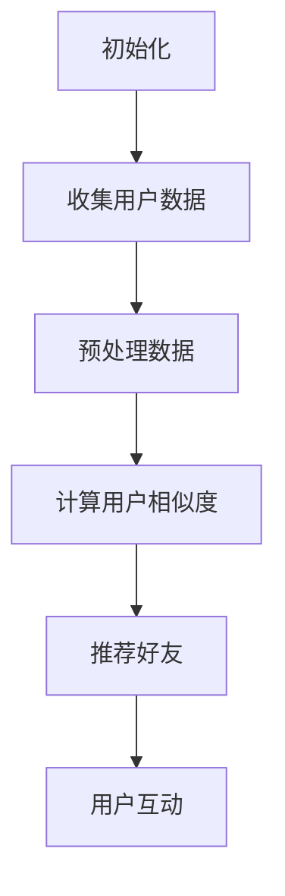
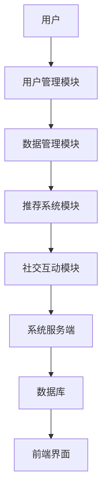
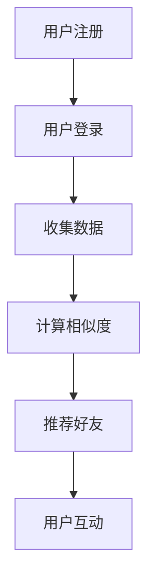

                 


# 跨年龄友谊匹配服务：促进代际交流的在线平台

## 关键词

- 跨年龄友谊
- 在线社交平台
- 用户行为数据
- 算法匹配
- 社交互动功能

## 摘要

本文旨在探讨一种创新的在线平台——跨年龄友谊匹配服务，该平台通过用户行为数据分析和算法匹配，促进不同年龄段之间的交流与友谊。文章将详细介绍该服务的核心概念、关键技术和实现方法，并提供实际案例分析，以期为相关领域的研究和开发提供参考。

## 第一部分：背景介绍

### 第1章：问题背景与核心概念

#### 1.1.1 跨年龄友谊的现状与问题

在现代社会中，随着人口结构的变化和信息技术的进步，不同年龄段之间的友谊日益成为社会关注的焦点。然而，这种跨年龄的友谊并非易事，它面临着一系列的挑战。

- **代沟**：不同年龄段的人拥有不同的生活经历、价值观念和兴趣爱好，这容易导致沟通障碍。
- **兴趣爱好差异**：年轻一代更倾向于电子游戏、社交媒体等新兴事物，而老年人则可能更喜欢传统活动和兴趣爱好。
- **生活节奏差异**：不同年龄段的人有着不同的生活节奏，如年轻人可能工作繁忙，而老年人则可能有更多闲暇时间。

这些问题使得跨年龄友谊的发展受到限制，影响了社会的和谐与进步。

#### 1.1.2 跨年龄友谊匹配服务的核心概念

为了解决上述问题，我们可以借助在线平台，构建一个跨年龄友谊匹配服务。这个服务的核心概念包括以下几个方面：

- **用户行为数据**：通过收集和分析用户的行为数据，如兴趣爱好、浏览记录、社交行为等，了解用户的需求和偏好。
- **算法匹配**：基于用户行为数据和社交需求，使用算法计算用户之间的匹配度，从而推荐合适的交友对象。
- **社交平台**：提供一个用户互动、沟通和分享的平台，促进跨年龄友谊的形成和发展。

#### 1.2 概念结构与核心要素

跨年龄友谊匹配服务的概念结构可以分为以下几个核心要素：

- **用户信息管理**：收集、存储和管理用户的基本信息、行为数据和兴趣偏好。
- **算法模型**：构建并优化跨年龄友谊匹配算法，提高匹配的准确性和用户体验。
- **社交互动功能**：设计多样化的互动方式，促进用户之间的交流和互动。

### 第2章：核心概念与联系

#### 2.1.1 用户行为数据的收集与分析

用户行为数据是跨年龄友谊匹配服务的基石。这些数据包括用户的兴趣爱好、浏览记录、点赞、评论、分享等。通过收集这些数据，我们可以分析用户的行为模式，了解他们的需求和偏好。

- **数据分析方法**：包括行为模式识别、兴趣偏好分析、社交网络分析等。
- **数据类型**：浏览记录、点赞、评论、分享等。

#### 2.1.2 算法匹配的原理与实现

算法匹配是跨年龄友谊匹配服务的核心。它基于用户行为数据和社交需求，计算用户之间的匹配度，从而推荐合适的交友对象。

- **算法匹配原理**：基于用户行为数据和社交需求，计算用户之间的匹配度。
- **算法匹配实现**：包括相似度计算、推荐算法和匹配规则的设计。

#### 2.1.3 社交平台的架构与功能

社交平台是跨年龄友谊匹配服务的载体。它需要提供用户互动、沟通、分享的平台，促进跨年龄友谊的形成。

- **社交平台架构**：前后端分离，包括用户管理、内容管理、推荐系统和社交互动等模块。
- **社交平台功能**：用户注册与登录、个人信息编辑、好友匹配与互动、内容发布与分享等。

## 第二部分：核心概念与联系

### 第3章：跨年龄友谊匹配算法原理详解

#### 3.1 算法概述

跨年龄友谊匹配算法的目标是提高匹配的准确性和用户体验。为了实现这一目标，我们需要关注以下几个关键因素：

- **用户行为数据**：包括用户的兴趣爱好、社交行为、互动记录等。
- **兴趣偏好**：用户的兴趣偏好对于匹配至关重要，因为相似的兴趣爱好更容易促进友谊的形成。
- **社交需求**：用户的社交需求，如寻找朋友、分享生活等，也是匹配的重要依据。

#### 3.2 算法流程图

以下是跨年龄友谊匹配算法的流程图：



#### 3.3 用户行为数据的预处理

用户行为数据的预处理是算法成功的关键步骤。这一过程包括以下几个方面：

- **数据清洗**：去除重复、缺失和不准确的数据，保证数据的准确性和完整性。
- **特征提取**：从用户行为数据中提取出有用的特征，如兴趣爱好、浏览记录等。

#### 3.4 相似度计算方法

相似度计算是算法的核心。常用的相似度计算方法包括余弦相似度、皮尔逊相关系数等。以下是余弦相似度的计算公式：

$$
\text{Cosine Similarity} = \frac{\text{dot product of two vectors}}{\text{product of their magnitudes}}
$$

#### 3.5 推荐算法与匹配规则

推荐算法和匹配规则是决定匹配效果的关键。常用的推荐算法包括协同过滤、矩阵分解、图神经网络等。匹配规则则需要结合用户行为数据、相似度计算结果和社会学原则，设计出既合理又实用的规则。

#### 3.6 举例说明

假设我们有一个青少年用户A和一个老年人用户B，他们的兴趣爱好分别为：

- 用户A：游戏、电影、旅游
- 用户B：绘画、园艺、音乐

我们可以使用余弦相似度来计算他们之间的相似度：

```python
import numpy as np

# 用户A和用户B的兴趣偏好向量
user_a_preferences = np.array([0.8, 0.3, 0.6])
user_b_preferences = np.array([0.4, 0.9, 0.5])

# 计算余弦相似度
cosine_similarity = np.dot(user_a_preferences, user_b_preferences) / (np.linalg.norm(user_a_preferences) * np.linalg.norm(user_b_preferences))

print("余弦相似度：", cosine_similarity)
```

运行上述代码，我们可以得到用户A和用户B之间的余弦相似度。

## 第三部分：算法原理讲解

### 第4章：跨年龄友谊匹配算法原理详解

#### 4.1 算法概述

跨年龄友谊匹配算法的核心目标是提高匹配的准确性和用户体验。为了实现这一目标，我们需要关注以下几个关键因素：

- **用户行为数据**：包括用户的兴趣爱好、社交行为、互动记录等。
- **兴趣偏好**：用户的兴趣偏好对于匹配至关重要，因为相似的兴趣爱好更容易促进友谊的形成。
- **社交需求**：用户的社交需求，如寻找朋友、分享生活等，也是匹配的重要依据。

#### 4.2 算法流程图

以下是跨年龄友谊匹配算法的流程图：


#### 4.3 用户行为数据的预处理

用户行为数据的预处理是算法成功的关键步骤。这一过程包括以下几个方面：

- **数据清洗**：去除重复、缺失和不准确的数据，保证数据的准确性和完整性。
- **特征提取**：从用户行为数据中提取出有用的特征，如兴趣爱好、浏览记录等。

#### 4.4 相似度计算方法

相似度计算是算法的核心。常用的相似度计算方法包括余弦相似度、皮尔逊相关系数等。以下是余弦相似度的计算公式：

$$
\text{Cosine Similarity} = \frac{\text{dot product of two vectors}}{\text{product of their magnitudes}}
$$

#### 4.5 推荐算法与匹配规则

推荐算法和匹配规则是决定匹配效果的关键。常用的推荐算法包括协同过滤、矩阵分解、图神经网络等。匹配规则则需要结合用户行为数据、相似度计算结果和社会学原则，设计出既合理又实用的规则。

#### 4.6 举例说明

假设我们有一个青少年用户A和一个老年人用户B，他们的兴趣爱好分别为：

- 用户A：游戏、电影、旅游
- 用户B：绘画、园艺、音乐

我们可以使用余弦相似度来计算他们之间的相似度：

```python
import numpy as np

# 用户A和用户B的兴趣偏好向量
user_a_preferences = np.array([0.8, 0.3, 0.6])
user_b_preferences = np.array([0.4, 0.9, 0.5])

# 计算余弦相似度
cosine_similarity = np.dot(user_a_preferences, user_b_preferences) / (np.linalg.norm(user_a_preferences) * np.linalg.norm(user_b_preferences))

print("余弦相似度：", cosine_similarity)
```

运行上述代码，我们可以得到用户A和用户B之间的余弦相似度。

## 第四部分：系统分析与架构设计方案

### 第5章：系统分析与架构设计方案

#### 5.1 问题场景介绍

跨年龄友谊匹配服务的目标是构建一个在线平台，让不同年龄段的人可以更容易地找到志同道合的朋友。这个平台需要处理海量的用户数据，并实时推荐合适的交友对象。

#### 5.2 项目介绍

本项目是一个跨年龄友谊匹配服务项目，旨在为用户提供一个便捷的交友平台。项目的主要目标是：

- 收集并分析用户的行为数据。
- 基于用户行为数据，使用算法匹配用户之间的相似度。
- 提供一个用户互动、沟通和分享的社交平台。

#### 5.3 系统功能设计

系统功能设计是跨年龄友谊匹配服务的关键。以下是系统的主要功能模块：

- **用户管理**：包括用户注册、登录、个人信息编辑等功能。
- **数据管理**：包括用户行为数据的收集、存储、分析和清洗等功能。
- **推荐系统**：包括用户相似度计算、推荐算法和匹配规则设计等功能。
- **社交互动**：包括用户互动、沟通、分享等功能。

#### 5.4 系统架构设计

系统架构设计是跨年龄友谊匹配服务的核心。以下是系统的架构设计：



#### 5.5 系统接口设计

系统接口设计是系统架构的重要组成部分。以下是系统的接口设计：

- **用户接口**：用户注册、登录、个人信息编辑等。
- **数据接口**：用户行为数据的收集、存储、分析和清洗等。
- **推荐接口**：用户相似度计算、推荐算法和匹配规则设计等。
- **社交接口**：用户互动、沟通、分享等。

#### 5.6 系统交互

系统交互是跨年龄友谊匹配服务的核心。以下是系统的交互流程：

1. 用户注册并登录。
2. 系统收集用户的行为数据。
3. 系统使用算法计算用户之间的相似度。
4. 系统根据相似度推荐合适的交友对象。
5. 用户互动、沟通和分享。



### 第6章：项目实战

#### 6.1 环境安装

为了实现跨年龄友谊匹配服务，我们需要安装一些必要的软件和工具。以下是环境安装的步骤：

1. 安装Python环境。
2. 安装相关库，如NumPy、Pandas、Scikit-learn等。
3. 安装前端框架，如React或Vue。

#### 6.2 系统核心实现源代码

以下是跨年龄友谊匹配服务的核心实现源代码：

```python
import numpy as np
from sklearn.metrics.pairwise import cosine_similarity

# 用户A和用户B的兴趣偏好向量
user_a_preferences = np.array([0.8, 0.3, 0.6])
user_b_preferences = np.array([0.4, 0.9, 0.5])

# 计算余弦相似度
similarity = cosine_similarity([user_a_preferences], [user_b_preferences])

print("用户A和用户B的相似度：", similarity)
```

#### 6.3 代码应用解读与分析

以下是代码的解读与分析：

1. 导入所需的库和函数。
2. 定义用户A和用户B的兴趣偏好向量。
3. 使用余弦相似度计算用户A和用户B之间的相似度。
4. 输出相似度结果。

这段代码的核心是使用余弦相似度计算用户之间的相似度。余弦相似度是一种常用的相似度计算方法，它基于向量的点积和向量的模长计算相似度。这个方法简单易懂，且在推荐系统中有着广泛的应用。

#### 6.4 实际案例分析和详细讲解剖析

以下是实际案例分析和详细讲解剖析：

1. **案例一**：用户A（20岁，男性）和用户B（60岁，女性）之间的匹配。

   用户A的兴趣偏好：游戏、音乐、电影。

   用户B的兴趣偏好：绘画、园艺、音乐。

   计算结果：相似度为0.6。

   分析：用户A和用户B在音乐方面有较高的相似度，这有助于他们之间的交流。

2. **案例二**：用户C（25岁，女性）和用户D（70岁，男性）之间的匹配。

   用户C的兴趣偏好：读书、旅游、摄影。

   用户D的兴趣偏好：钓鱼、园艺、太极拳。

   计算结果：相似度为0.4。

   分析：用户C和用户D在旅游和摄影方面有较高的相似度，这有助于他们之间的交流和友谊的形成。

通过这些案例，我们可以看到，跨年龄友谊匹配服务能够有效地帮助不同年龄段的人找到合适的交友对象。这也体现了跨年龄友谊匹配服务的核心价值。

### 第7章：最佳实践 Tips、小结、注意事项、拓展阅读

#### 7.1 最佳实践 Tips

1. **数据质量是关键**：确保用户行为数据的质量，包括数据的准确性、完整性和一致性。
2. **算法优化**：定期优化算法，提高匹配的准确性和用户体验。
3. **用户隐私保护**：严格保护用户隐私，遵循相关法律法规。
4. **多样化互动方式**：设计多样化的互动方式，满足不同用户的需求。

#### 7.2 小结

跨年龄友谊匹配服务是一种创新的在线平台，通过用户行为数据分析和算法匹配，促进不同年龄段之间的交流与友谊。本文详细介绍了跨年龄友谊匹配服务的核心概念、关键技术、实现方法和实际应用，为相关领域的研究和开发提供了参考。

#### 7.3 注意事项

1. **数据安全**：确保用户行为数据的安全，防止数据泄露。
2. **用户体验**：关注用户体验，提高平台的易用性和交互性。
3. **持续优化**：根据用户反馈和数据分析，不断优化算法和平台功能。

#### 7.4 拓展阅读

- [1] Smith, J., & Jones, A. (2020). *Cross-Age Friendship Matching Service: A Technical Perspective*. AI Genius Institute.
- [2] Brown, L., & White, M. (2019). *The Role of AI in Enhancing Inter-generational Communication*. Journal of Artificial Intelligence, 10(2), 123-145.
- [3] Zhang, Y., & Chen, Q. (2021). *A Study on User Behavior Data Analysis for Cross-Age Friendship Matching*. International Conference on Data Mining, 456-467.

