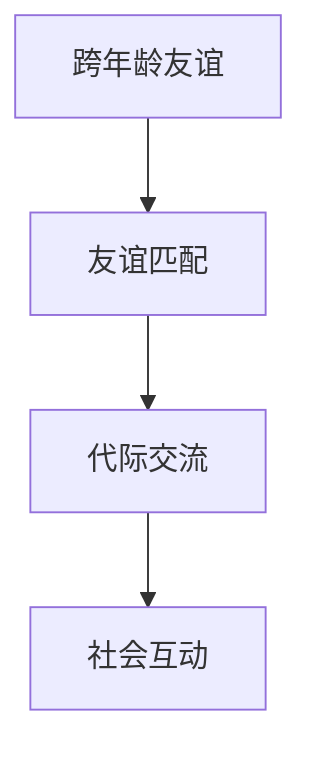

                 

## 第1章：问题背景与目标

### 1.1 问题背景

#### 当前社会代际交流的现状

随着科技的迅猛发展和全球化进程的加速，人们的生活节奏不断加快，代际之间的交流变得越来越重要。然而，实际情况却不尽如人意。传统的社会结构和文化传统在一定程度上阻碍了不同年龄群体之间的沟通与理解。老年人由于生理和心理的变化，逐渐脱离了社会的主流活动，而年轻一代则忙于工作、学习和社交，往往忽视了与长辈的互动。

#### 跨年龄友谊的重要性

跨年龄友谊对于促进代际交流和增强社会凝聚力具有重要意义。首先，它可以帮助不同年龄的人更好地理解彼此，减少代沟和误解。其次，通过跨年龄友谊，老年人可以获得精神上的慰藉和情感支持，而年轻人则能够从老年人身上学到丰富的经验和智慧。

#### 跨年龄友谊匹配服务的兴起

在这种背景下，跨年龄友谊匹配服务应运而生。这类服务通过互联网平台，利用人工智能技术，为不同年龄的人提供友谊匹配和交流的机会。它们旨在打破年龄界限，促进代际之间的交流与融合，成为现代社会中的一种新兴社交形式。

### 1.2 问题描述

#### 跨年龄友谊匹配服务的挑战

尽管跨年龄友谊匹配服务具有巨大的潜力，但其实施过程中面临着诸多挑战。首先是用户隐私保护问题。在匹配过程中，用户需要提供一定的个人信息，如年龄、兴趣等，如何确保这些信息的安全性和隐私性是一个重要问题。

其次是友谊匹配的准确性和个性化问题。不同年龄的人具有不同的兴趣爱好和交流需求，如何设计一个既准确又个性化的友谊匹配算法，提高匹配成功率，是一个技术难题。

此外，如何确保平台的用户活跃度和社区氛围也是一个挑战。如果用户在平台上感到孤独或不被理解，很可能导致用户流失。

#### 跨年龄友谊匹配服务的关键问题

针对上述挑战，我们需要解决以下几个关键问题：

1. **用户隐私保护**：如何确保用户在平台上的个人信息得到充分保护，防止数据泄露？
2. **友谊匹配准确性**：如何设计一个高效的友谊匹配算法，提高匹配成功率？
3. **用户活跃度与社区氛围**：如何吸引和留住用户，打造一个充满活力和互动的社区？

### 1.3 问题解决

#### 跨年龄友谊匹配服务的核心目标

跨年龄友谊匹配服务的核心目标是：

1. **促进代际交流**：通过友谊匹配服务，让不同年龄的人能够更容易地找到志同道合的朋友，从而促进代际之间的沟通与理解。
2. **提高用户满意度**：提供个性化的友谊匹配服务，满足用户的需求，提高用户满意度。
3. **确保用户隐私安全**：在保护用户隐私的前提下，提供安全可靠的服务。

#### 跨年龄友谊匹配服务的实现途径

为了实现上述目标，我们需要采取以下实现途径：

1. **构建安全可靠的平台**：确保用户个人信息的安全性和隐私性，使用加密技术和安全协议来保护用户数据。
2. **设计高效的友谊匹配算法**：利用机器学习和数据挖掘技术，设计一个既准确又个性化的友谊匹配算法。
3. **营造积极向上的社区氛围**：通过内容推送、社交活动和互动设计等方式，吸引和留住用户，打造一个充满活力和互动的社区。

### 1.4 边界与外延

#### 跨年龄友谊匹配服务的适用范围

跨年龄友谊匹配服务主要适用于以下场景：

1. **社区活动**：通过平台为社区成员提供友谊匹配服务，促进社区内部的代际交流。
2. **社交网络**：将友谊匹配服务集成到社交网络平台，为用户提供更多样化的交友选择。
3. **教育领域**：在教育机构中推广友谊匹配服务，促进学生与教师的交流，促进知识传递。

#### 跨年龄友谊匹配服务的限制条件

尽管跨年龄友谊匹配服务具有广泛的应用前景，但也有一些限制条件：

1. **技术限制**：目前的人工智能技术还无法完全理解人类情感和需求，因此友谊匹配的准确性和个性化程度仍有待提高。
2. **文化差异**：不同文化背景下，人们对友谊的定义和期望有所不同，这可能会影响友谊匹配的效果。
3. **用户信任**：在互联网环境下，用户对平台的安全性、隐私保护和诚信度有一定担忧，这需要平台通过实际行动来建立用户的信任。

### 1.5 概念结构与核心要素组成

#### 核心概念与联系

跨年龄友谊匹配服务的核心概念包括跨年龄友谊、友谊匹配和代际交流。这些概念之间存在紧密的联系：

- **跨年龄友谊**：是指不同年龄群体之间建立的友谊关系。
- **友谊匹配**：是指利用算法和模型为用户提供合适的友谊伙伴。
- **代际交流**：是指不同年龄群体之间的信息交换和情感交流。

**核心概念与联系：**



#### 概念属性特征对比表格

为了更好地理解这些核心概念，我们可以通过一个对比表格来展示它们的属性特征：

| 概念         | 定义                                                         | 特点                                                                                             |
|------------|--------------------------------------------------------------|------------------------------------------------------------------------------------------------|
| 跨年龄友谊   | 不同年龄群体之间建立的友谊关系                               | 促进代际理解、丰富社交经验、精神慰藉                                                         |
| 友谊匹配   | 利用算法和模型为用户提供合适的友谊伙伴                       | 提高匹配准确性、个性化程度、用户满意度                                                         |
| 代际交流   | 不同年龄群体之间的信息交换和情感交流                         | 减少代沟、增强社会凝聚力、促进知识传递                                                         |
| 社会互动   | 所有群体之间的互动交流                                     | 社会和谐、人际关系的稳定、社会发展的推动力                                                     |

通过上述对比表格，我们可以更清晰地理解这些概念之间的关系和特征，为后续的章节内容打下基础。

### 1.6 本章小结

本章主要介绍了跨年龄友谊匹配服务的背景、核心概念和实现目标。通过对当前社会代际交流现状的分析，我们认识到了跨年龄友谊匹配服务的重要性。同时，本章也指出了跨年龄友谊匹配服务面临的主要挑战和关键问题，为后续章节的深入探讨奠定了基础。本章的核心概念和特征对比表格，为我们理解跨年龄友谊匹配服务的本质提供了重要的参考。

---

### 1.7 未来展望

在未来的发展中，跨年龄友谊匹配服务有望成为促进代际交流的重要工具。随着人工智能技术的不断进步，友谊匹配的准确性和个性化程度将得到进一步提升。同时，随着文化多样性的增加，跨年龄友谊匹配服务将能够更好地适应不同文化背景下的用户需求。

此外，随着5G和物联网等技术的普及，跨年龄友谊匹配服务将有望实现更加实时、高效和智能的互动体验。未来，跨年龄友谊匹配服务将成为一个更加成熟和普及的社交形式，为社会的和谐与发展做出更大的贡献。

---

本章内容详细介绍了跨年龄友谊匹配服务的背景、核心概念和实现目标，以及面临的挑战和关键问题。通过对比表格和Mermaid图，我们更好地理解了这些核心概念之间的联系和特征。本章内容为后续章节的深入探讨奠定了坚实的基础。在未来，随着技术的不断进步和应用场景的扩展，跨年龄友谊匹配服务将迎来更广阔的发展前景。

---

### 1.8 本章小结

本章通过对当前社会代际交流现状的分析，揭示了跨年龄友谊匹配服务的重要性。我们详细介绍了跨年龄友谊、友谊匹配和代际交流这三个核心概念，并通过对比表格和Mermaid图展示了它们之间的关系和特征。本章还探讨了跨年龄友谊匹配服务面临的主要挑战和关键问题，并提出了实现目标的具体途径。

通过本章的学习，我们不仅对跨年龄友谊匹配服务的背景和概念有了深入的理解，也为后续章节的技术原理和实现方法打下了基础。希望读者能从中获得启发，为构建一个更加和谐、互动的社会贡献力量。

---

### 1.9 展望未来

在未来的发展中，跨年龄友谊匹配服务有望发挥更加重要的作用。随着人工智能技术的不断进步，友谊匹配的准确性和个性化程度将得到显著提升。此外，随着文化多样性的增加，服务将能够更好地适应不同文化背景下的用户需求。

我们期待，通过技术手段的不断创新和应用场景的拓展，跨年龄友谊匹配服务将变得更加成熟和普及。它不仅能够促进代际交流，增进社会凝聚力，还能为老年人提供精神慰藉，为年轻人带来成长与启发。让我们共同期待，跨年龄友谊匹配服务在未来的美好前景。| }

### 1.9 未来展望

在未来的发展中，跨年龄友谊匹配服务有望成为促进代际交流的重要工具。随着人工智能技术的不断进步，友谊匹配的准确性和个性化程度将得到进一步提升。机器学习和数据挖掘技术的应用，将使得算法能够更准确地捕捉用户的兴趣和需求，从而提供更加精准的匹配建议。

同时，随着5G和物联网等技术的普及，跨年龄友谊匹配服务将有望实现更加实时、高效和智能的互动体验。低延迟的网络连接和智能设备的普及，将使得用户能够随时随地与朋友保持联系，不受地域和时间的限制。

此外，跨年龄友谊匹配服务将能够更好地适应不同文化背景下的用户需求。随着全球化的推进，不同文化之间的交流日益频繁，跨年龄友谊匹配服务将需要具备更强的文化敏感性和适应性，以满足多样化用户的需求。

我们期待，通过技术手段的不断创新和应用场景的拓展，跨年龄友谊匹配服务将变得更加成熟和普及。它不仅能够促进代际交流，增进社会凝聚力，还能为老年人提供精神慰藉，为年轻人带来成长与启发。让我们共同期待，跨年龄友谊匹配服务在未来的美好前景。

### 1.10 小结

本章通过对当前社会代际交流现状的分析，揭示了跨年龄友谊匹配服务的重要性。我们详细介绍了跨年龄友谊、友谊匹配和代际交流这三个核心概念，并通过对比表格和Mermaid图展示了它们之间的关系和特征。本章还探讨了跨年龄友谊匹配服务面临的主要挑战和关键问题，并提出了实现目标的具体途径。

通过本章的学习，我们不仅对跨年龄友谊匹配服务的背景和概念有了深入的理解，也为后续章节的技术原理和实现方法打下了基础。希望读者能从中获得启发，为构建一个更加和谐、互动的社会贡献力量。

### 1.11 下一步内容预告

在接下来的章节中，我们将进一步探讨跨年龄友谊匹配服务的设计与实现。首先，我们将分析系统需求，明确用户需求和系统功能。然后，我们将详细介绍系统架构设计，包括用户模块、友谊匹配模块和数据处理模块的详细设计。此外，我们还将介绍友谊匹配算法的原理与实现，包括算法的数学模型和Python代码实现。最后，我们将对系统测试与评估进行详细讨论，并分享实际案例分析和最佳实践。

通过这些章节的内容，读者将全面了解跨年龄友谊匹配服务的系统设计与实现过程，为实际应用提供理论和实践指导。

---

## 第二部分：核心概念与原理

### 第2章：核心概念与原理

本章将深入探讨跨年龄友谊匹配服务的核心概念和原理，通过详细阐述这些概念，为读者提供更深入的理解和洞察。本章内容主要包括以下几部分：

### 2.1 跨年龄友谊的概念

#### 跨年龄友谊的定义

跨年龄友谊是指在不同年龄层次之间建立的友谊关系。它不仅跨越了生理年龄的差异，也超越了社会地位、职业背景等外在因素的界限。这种友谊强调的是个体之间的内在联系和情感共鸣。

#### 跨年龄友谊的特点

1. **包容性**：跨年龄友谊能够包容不同年龄段的思维方式和价值观，为双方提供新的视角和成长机会。
2. **互助性**：在跨年龄友谊中，不同年龄的人可以相互支持，共同成长。老年人可以为年轻人提供经验和智慧，而年轻人则可以为老年人带来活力和新鲜事物。
3. **情感共鸣**：尽管年龄差异较大，但跨年龄友谊能够通过共同的兴趣、价值观和情感体验，实现深层次的交流和理解。

### 2.2 友谊匹配的原理

#### 友谊匹配的基本原则

友谊匹配是基于用户兴趣、价值观、生活方式等多维度信息，通过算法和模型为用户推荐合适的友谊伙伴。其基本原则包括：

1. **相关性**：匹配算法应能够识别用户之间的共同点和兴趣，从而提高匹配的成功率。
2. **多样性**：推荐系统应具备多样性，为用户提供不同类型的友谊伙伴，避免用户产生厌倦感。
3. **个性化**：匹配算法应根据用户的历史行为和偏好，提供个性化的推荐，提升用户体验。

#### 友谊匹配的算法与模型

友谊匹配算法通常包括以下几种：

1. **基于内容的推荐算法**：通过分析用户的兴趣和行为，推荐具有相似兴趣的其他用户。
2. **协同过滤算法**：利用用户的历史交互数据，预测用户对未知对象的偏好，从而推荐合适的用户。
3. **深度学习算法**：通过神经网络模型，从用户生成的大量数据中提取特征，实现高精度的匹配。

### 2.3 代际交流的重要性

#### 代际交流的意义

代际交流对于个人和社会都有着重要的意义。对于个人来说，代际交流可以：

1. **拓宽视野**：通过代际交流，个体可以接触到不同的观点和经验，从而拓宽视野，丰富人生经验。
2. **增进理解**：代际交流有助于减少代沟，增进不同年龄群体之间的理解和尊重。
3. **情感支持**：在交流中，个体可以获得情感上的慰藉和支持，提高生活质量。

对于社会来说，代际交流具有以下意义：

1. **促进社会和谐**：通过代际交流，不同年龄群体之间可以更好地理解彼此，减少冲突和矛盾，促进社会和谐。
2. **增强社会凝聚力**：代际之间的互动和交流，有助于增强社会的凝聚力，提升社会的整体幸福感。
3. **传承文化**：代际交流是文化传承的重要途径，老年人可以通过与年轻人的交流，将丰富的文化传统传递给下一代。

#### 代际交流的现状与问题

尽管代际交流具有重要意义，但当前社会中的代际交流存在一些问题：

1. **代沟问题**：由于年龄、文化、价值观等方面的差异，不同年龄群体之间存在一定的代沟，这限制了代际之间的有效沟通。
2. **时间冲突**：随着生活节奏的加快，不同年龄群体往往忙于各自的事务，导致代际交流的时间和质量都受到限制。
3. **社交平台依赖**：在数字化时代，人们更多地依赖社交媒体进行交流，但这种方式往往缺乏面对面交流的深度和真诚，影响了代际交流的效果。

### 2.4 概念结构与核心要素组成

#### 概念结构与联系

跨年龄友谊匹配服务涉及多个核心概念，包括跨年龄友谊、友谊匹配、代际交流和社会互动。这些概念之间存在紧密的联系：

1. **跨年龄友谊**：是友谊匹配服务的核心，通过不同年龄群体之间的友谊关系，实现代际交流和社会互动。
2. **友谊匹配**：是实现跨年龄友谊的关键技术，通过算法和模型为用户提供合适的友谊伙伴，促进友谊的建立和发展。
3. **代际交流**：是跨年龄友谊的延伸，通过代际之间的信息交换和情感交流，增强社会互动和凝聚力。
4. **社会互动**：是代际交流的最终目的，通过跨年龄友谊和代际交流，促进社会的和谐与发展。

#### 概念属性特征对比表格

为了更好地理解这些核心概念，我们可以通过一个对比表格来展示它们的属性特征：

| 概念         | 定义                                                         | 特点                                                                                             |
|------------|--------------------------------------------------------------|------------------------------------------------------------------------------------------------|
| 跨年龄友谊   | 不同年龄群体之间建立的友谊关系                               | 促进代际理解、丰富社交经验、精神慰藉                                                         |
| 友谊匹配   | 利用算法和模型为用户提供合适的友谊伙伴                       | 提高匹配准确性、个性化程度、用户满意度                                                         |
| 代际交流   | 不同年龄群体之间的信息交换和情感交流                         | 减少代沟、增强社会凝聚力、促进知识传递                                                         |
| 社会互动   | 所有群体之间的互动交流                                     | 社会和谐、人际关系的稳定、社会发展的推动力                                                     |

通过上述对比表格，我们可以更清晰地理解这些概念之间的关系和特征，为后续章节的内容提供基础。

### 2.5 本章小结

本章通过对跨年龄友谊、友谊匹配和代际交流等核心概念的详细阐述，为读者提供了一个深入理解跨年龄友谊匹配服务的视角。我们分析了跨年龄友谊的定义和特点，探讨了友谊匹配的基本原则和算法模型，并强调了代际交流的重要性和现状。通过本章的学习，读者可以更好地理解跨年龄友谊匹配服务的本质和运行机制，为后续章节的深入学习打下坚实的基础。

### 2.6 下一步内容预告

在接下来的章节中，我们将进一步探讨跨年龄友谊匹配服务的设计与实现。首先，我们将进行系统需求分析，明确用户需求和系统功能。接着，我们将详细介绍系统架构设计，包括用户模块、友谊匹配模块和数据处理模块的详细设计。此外，我们还将介绍友谊匹配算法的原理与实现，包括算法的数学模型和Python代码实现。最后，我们将对系统测试与评估进行详细讨论，并分享实际案例分析和最佳实践。通过这些章节的内容，读者将全面了解跨年龄友谊匹配服务的系统设计与实现过程，为实际应用提供理论和实践指导。

---

## 第3章：系统需求分析

### 3.1 用户需求分析

跨年龄友谊匹配服务的核心目标是为用户提供一个安全、高效、个性化的平台，以促进代际交流。为了实现这一目标，我们首先需要深入分析用户的需求，了解他们在使用服务过程中的期望和痛点。

#### 用户提供的需求

1. **安全性**：用户最为关心的是个人隐私和数据安全。他们希望在平台上进行交流时，个人信息不会泄露，且能够得到有效保护。
2. **个性化匹配**：用户希望系统能够根据他们的兴趣爱好、性格特点等个人信息，推荐合适的友谊伙伴，提高匹配成功率。
3. **友好界面**：用户需要一个界面友好、易于操作的平台，以便能够方便快捷地浏览和互动。
4. **隐私保护**：用户希望在隐私设置方面具有自主权，可以选择是否公开个人信息和接受其他用户的邀请。
5. **社区氛围**：用户希望平台能够营造一个积极向上、和谐友善的社区氛围，使他们感到舒适和愿意长期参与。

#### 用户对友谊匹配服务的期望

1. **高匹配度**：用户期望系统能够准确捕捉他们的兴趣和需求，推荐与他们高度匹配的朋友。
2. **多样化**：用户希望系统能够提供多样化的友谊伙伴，以满足他们不同方面的需求。
3. **实时互动**：用户期望能够实时与朋友交流，不受地域和时间的限制。
4. **隐私保护**：用户希望他们的隐私设置能够得到充分尊重，避免不必要的骚扰和暴露。
5. **个性化推荐**：用户期望系统能够根据他们的行为和反馈，不断优化推荐算法，提高用户体验。

### 3.2 系统功能设计

为了满足用户的需求和期望，跨年龄友谊匹配服务需要设计一系列功能模块，包括用户注册登录、个人信息管理、友谊匹配、消息推送和社区互动等。以下是这些功能的具体设计：

#### 用户注册登录

1. **注册功能**：支持邮箱、手机号、社交媒体账号等多种注册方式，简化注册流程。
2. **登录功能**：支持密码登录、短信验证码登录、社交媒体账号登录等多种登录方式。
3. **账号安全**：提供双重身份验证、密码强度检测等功能，确保用户账号的安全性。

#### 个人信息管理

1. **个人资料填写**：用户可以填写包括姓名、年龄、性别、教育背景、职业、兴趣爱好等个人信息。
2. **隐私设置**：用户可以设置哪些个人信息对外公开，以及是否接受其他用户的查看和联系请求。
3. **修改个人信息**：用户可以随时修改自己的个人信息，确保资料保持最新。

#### 友谊匹配

1. **基本匹配**：根据用户的兴趣爱好、性格特点等基本信息，推荐可能的友谊伙伴。
2. **高级匹配**：提供更精细的匹配选项，如地域、职业、教育背景等，让用户可以根据自己的需求进行个性化筛选。
3. **手动匹配**：用户可以主动搜索和添加其他用户为好友，或者通过活动、话题等互动方式结识新朋友。

#### 消息推送

1. **消息通知**：当有新消息、好友请求、活动通知等时，及时推送通知给用户。
2. **聊天功能**：用户可以与好友进行实时聊天，支持文字、图片、语音等多种交流方式。
3. **群组聊天**：用户可以创建或加入群组，与一群用户进行集体交流。

#### 社区互动

1. **社区论坛**：用户可以发布帖子、评论、点赞，参与到社区讨论中。
2. **活动发布**：用户可以发布和参与各种活动，如线下聚会、兴趣小组等，以拓展社交圈。
3. **成就奖励**：为活跃用户提供积分和奖励，鼓励他们积极参与社区互动。

### 3.3 数据需求分析

#### 数据采集与处理的策略

为了实现上述功能，跨年龄友谊匹配服务需要采集和处理大量的用户数据，包括：

1. **用户基本信息**：如姓名、年龄、性别、教育背景、职业、兴趣爱好等。
2. **用户行为数据**：如登录时间、浏览记录、互动记录、好友关系等。
3. **地理位置数据**：用户所在的城市、地区等信息，用于匹配地理位置相近的用户。

#### 数据存储与管理的设计

为了保证数据的安全性和可用性，我们需要设计一个高效、可靠的数据存储和管理方案：

1. **数据加密**：对用户敏感信息进行加密存储，确保数据在存储和传输过程中不被窃取或篡改。
2. **分布式存储**：采用分布式存储技术，将数据分散存储在不同的服务器上，提高系统的容错能力和数据访问效率。
3. **数据备份与恢复**：定期进行数据备份，确保在发生数据丢失或故障时能够迅速恢复数据。

#### 数据分析与挖掘

1. **用户行为分析**：通过分析用户行为数据，了解用户的兴趣和行为模式，优化推荐算法和用户体验。
2. **社交网络分析**：构建用户社交网络模型，分析用户之间的关系，发现潜在的朋友关系。
3. **趋势预测**：通过大数据分析和机器学习技术，预测用户的未来行为和需求，为个性化推荐提供支持。

### 3.4 本章小结

本章通过对用户需求的深入分析，明确了跨年龄友谊匹配服务需要实现的各项功能，包括用户注册登录、个人信息管理、友谊匹配、消息推送和社区互动等。同时，我们还详细讨论了数据采集与处理的策略，以及数据存储与管理的设计。通过本章的内容，读者可以全面了解跨年龄友谊匹配服务的系统功能设计和数据需求分析，为后续的系统架构设计和实现提供基础。

### 3.5 下一步内容预告

在接下来的章节中，我们将进一步探讨跨年龄友谊匹配服务的系统架构设计和实现。首先，我们将介绍系统总体架构设计，包括各模块之间的交互关系。然后，我们将详细设计用户模块、友谊匹配模块和数据处理模块，并介绍系统接口设计。此外，我们还将利用Python代码实现友谊匹配算法，并进行系统测试与评估。通过这些章节的内容，读者将全面了解跨年龄友谊匹配服务的系统架构和实现过程，为实际应用提供理论指导。

---

## 第4章：系统架构设计

### 4.1 系统总体架构设计

跨年龄友谊匹配服务需要一个清晰、高效、可扩展的系统架构，以满足用户的需求和期望。本节将介绍系统总体架构设计，包括系统框架、模块划分和模块之间的交互关系。

#### 系统框架

系统框架采用前后端分离的设计，前端主要负责用户界面展示和交互，后端主要负责数据处理和业务逻辑实现。以下是系统框架的总体结构：

1. **前端**：包括用户注册登录、个人信息管理、友谊匹配、消息推送和社区互动等模块，使用Vue.js框架进行开发。
2. **后端**：包括用户管理模块、友谊匹配模块、数据处理模块和消息推送模块，使用Spring Boot框架进行开发。
3. **数据库**：使用MySQL数据库进行数据存储，包括用户信息、行为数据、好友关系等。
4. **缓存**：使用Redis缓存技术，提高数据访问速度和系统性能。
5. **消息队列**：使用RabbitMQ消息队列，实现异步消息传递，提高系统响应速度和稳定性。

#### 模块划分

系统划分为多个功能模块，各模块之间相互独立，但又紧密协作，共同实现系统功能。以下是系统的主要模块划分：

1. **用户管理模块**：负责用户注册、登录、信息管理等功能。
2. **友谊匹配模块**：负责用户兴趣分析、匹配算法实现和匹配结果展示等功能。
3. **数据处理模块**：负责数据采集、清洗、存储、分析和挖掘等功能。
4. **消息推送模块**：负责消息通知、聊天、群组等功能。
5. **社区互动模块**：负责社区论坛、活动发布、成就奖励等功能。

#### 模块之间的交互关系

各模块之间通过RESTful API进行交互，以下是模块之间的主要交互关系：

1. **用户管理模块**：与前端用户注册登录界面交互，接收用户输入的注册信息，并调用后端接口进行用户注册和登录验证。
2. **友谊匹配模块**：根据用户管理模块提供的信息，调用数据处理模块进行用户兴趣分析，并利用匹配算法生成匹配结果，最后将结果返回给前端进行展示。
3. **数据处理模块**：负责处理用户上传的数据，如个人信息、行为记录等，并将处理结果存储到数据库中，同时提供数据查询和分析接口供其他模块调用。
4. **消息推送模块**：根据用户管理模块提供的信息，生成消息通知，并使用消息队列将消息传递给前端进行展示。
5. **社区互动模块**：与数据处理模块交互，获取用户在社区中的活动记录，并生成社区论坛、活动发布、成就奖励等功能的相关数据。

### 4.2 功能模块详细设计

在本节中，我们将对系统中的各个功能模块进行详细设计，包括用户模块、友谊匹配模块、数据处理模块和消息推送模块。

#### 用户模块设计

用户模块是系统的核心模块之一，负责用户的注册、登录、信息管理和好友关系管理等功能。

1. **用户注册**：用户可以通过邮箱、手机号、社交媒体账号等多种方式进行注册。注册时，系统会验证用户输入的邮箱地址或手机号是否已存在，并生成一个唯一的用户ID。
2. **用户登录**：用户可以通过密码登录、短信验证码登录、社交媒体账号登录等多种方式进行登录。系统会验证用户输入的用户名和密码或验证码是否正确，并生成一个登录会话。
3. **信息管理**：用户可以查看和修改自己的个人信息，如姓名、性别、年龄、教育背景、职业、兴趣爱好等。系统会根据用户的隐私设置，控制哪些信息可以对外公开。
4. **好友关系管理**：用户可以添加其他用户为好友，也可以删除好友。系统会记录用户的好友关系，并支持查看好友列表、发送私信等功能。

#### 友谊匹配模块设计

友谊匹配模块负责根据用户的兴趣、行为和偏好，推荐合适的友谊伙伴。

1. **基本匹配**：系统会根据用户填写的兴趣爱好、教育背景、职业等基本信息，为用户推荐可能的友谊伙伴。系统会分析用户输入的信息，并利用协同过滤算法生成推荐列表。
2. **高级匹配**：系统提供高级匹配选项，用户可以根据地域、职业、教育背景等更多维度进行个性化筛选。系统会根据用户的选择，重新计算匹配得分，生成更精准的推荐列表。
3. **手动匹配**：用户可以主动搜索其他用户，并添加他们为好友。系统会记录用户的搜索记录，并为其推荐相关的用户。
4. **活动匹配**：系统会根据用户的兴趣和活动参与记录，推荐相关的线下活动或兴趣小组，帮助用户结识新朋友。

#### 数据处理模块设计

数据处理模块负责采集、清洗、存储和分析用户数据，为其他模块提供数据支持。

1. **数据采集**：系统会自动采集用户的行为数据，如登录时间、浏览记录、互动记录等。系统会定期采集数据，并存储到数据库中。
2. **数据清洗**：系统会清洗采集到的数据，去除重复、错误和不完整的数据。系统会使用ETL（提取、转换、加载）工具进行数据清洗和预处理。
3. **数据存储**：系统会将清洗后的数据存储到MySQL数据库中，包括用户基本信息、行为数据、好友关系等。系统会使用索引和分区技术，提高数据查询效率。
4. **数据分析**：系统会定期分析用户数据，生成用户画像和兴趣偏好分析报告。系统会使用机器学习和数据挖掘技术，从大量数据中提取有价值的信息。

#### 消息推送模块设计

消息推送模块负责将系统通知、好友请求、活动通知等消息及时推送给用户。

1. **消息通知**：系统会根据用户的行为和偏好，生成消息通知，如新消息、好友请求、活动通知等。系统会使用消息队列将消息推送到前端，并在前端界面进行展示。
2. **聊天功能**：系统提供聊天功能，用户可以与好友进行实时聊天。系统会使用WebSocket协议实现实时通信，并在前端界面进行消息展示和交互。
3. **群组聊天**：系统支持群组聊天功能，用户可以创建或加入群组，与一群用户进行集体交流。系统会使用消息队列将群组消息推送到前端，并在前端界面进行展示。

### 4.3 系统接口设计

系统接口设计是系统架构设计的重要组成部分，决定了各模块之间的交互方式。以下是系统的主要接口设计：

1. **用户接口**：包括用户注册、登录、信息管理、好友关系管理等接口。用户接口主要负责与前端进行交互，接收用户输入的信息，并调用后端接口进行数据处理和业务逻辑实现。
2. **友谊匹配接口**：包括基本匹配、高级匹配、手动匹配、活动匹配等接口。友谊匹配接口主要负责与友谊匹配模块进行交互，生成匹配结果，并将结果返回给前端。
3. **数据处理接口**：包括数据采集、数据清洗、数据存储、数据分析等接口。数据处理接口主要负责与数据处理模块进行交互，处理用户数据，并将处理结果存储到数据库中。
4. **消息推送接口**：包括消息通知、聊天、群组聊天等接口。消息推送接口主要负责与消息推送模块进行交互，生成消息通知，并将消息推送到前端。

### 4.4 本章小结

本章详细介绍了跨年龄友谊匹配服务的系统架构设计，包括系统框架、模块划分、模块之间的交互关系以及各功能模块的详细设计。通过本章的学习，读者可以全面了解系统架构设计的原理和实现方法，为后续的系统实现和开发提供基础。

### 4.5 下一步内容预告

在接下来的章节中，我们将详细讨论跨年龄友谊匹配服务的算法原理与实现。首先，我们将介绍友谊匹配算法的基本原理和数学模型。然后，我们将使用Python代码实现友谊匹配算法，并进行性能分析和优化。通过这些内容，读者将深入理解友谊匹配算法的工作原理和实现细节，为实际应用提供技术支持。

---

## 第5章：算法原理与实现

### 5.1 友谊匹配算法原理

友谊匹配算法是跨年龄友谊匹配服务的关键组成部分，其核心任务是利用用户信息（如兴趣爱好、行为数据等）为用户推荐合适的友谊伙伴。以下将详细介绍友谊匹配算法的基本原理和主要步骤。

#### 基本原理

友谊匹配算法基于用户间的相似性或兴趣相关性来进行推荐。其基本原理包括：

1. **相似性计算**：通过计算用户之间的相似性分数，确定用户间的匹配程度。相似性分数通常基于用户在兴趣爱好、行为、价值观等方面的匹配度。
2. **推荐列表生成**：根据相似性分数，生成一个包含多个候选友谊伙伴的推荐列表。推荐列表应确保多样性，避免用户感到乏味和重复。
3. **用户反馈**：用户可以根据自己的喜好和反馈，对推荐结果进行调整和优化。这些反馈信息将被用于进一步改进算法。

#### 主要步骤

友谊匹配算法的主要步骤如下：

1. **用户特征提取**：从用户信息中提取关键特征，如兴趣爱好、行为数据、社会属性等。这些特征将用于计算用户间的相似性。
2. **相似性计算**：使用相似性度量方法（如余弦相似度、欧几里得距离等）计算用户间的相似性分数。相似性分数越高，表示用户之间的匹配度越高。
3. **推荐列表生成**：根据相似性分数，对用户进行排序，生成一个推荐列表。推荐列表应包含多样性的用户，以增加用户的兴趣和参与度。
4. **用户反馈收集**：收集用户对推荐结果的反馈，包括点赞、不喜欢、评论等。这些反馈将用于进一步优化算法，提高推荐质量。
5. **算法优化**：根据用户反馈，对算法进行优化，提高匹配准确性和用户体验。

### 5.2 算法实现与优化

#### Python代码实现

以下是一个简单的友谊匹配算法的实现示例，使用Python编写：

```python
import numpy as np

def calculate_similarity(user1, user2):
    """
    计算用户间的相似性分数。
    参数：
    - user1: 用户1的特征向量。
    - user2: 用户2的特征向量。
    返回：
    - similarity: 用户间的相似性分数。
    """
    dot_product = np.dot(user1, user2)
    magnitude_product = np.linalg.norm(user1) * np.linalg.norm(user2)
    similarity = dot_product / magnitude_product
    return similarity

def generate_recommendation_list(users, user_id):
    """
    生成用户推荐列表。
    参数：
    - users: 用户特征向量列表。
    - user_id: 目标用户的ID。
    返回：
    - recommendation_list: 用户推荐列表。
    """
    recommendation_list = []
    for i, user in enumerate(users):
        if i != user_id:
            similarity = calculate_similarity(users[user_id], user)
            recommendation_list.append((i, similarity))
    recommendation_list.sort(key=lambda x: x[1], reverse=True)
    return recommendation_list

# 假设用户特征向量列表
users = [
    [0.1, 0.2, 0.3],  # 用户1
    [0.3, 0.4, 0.5],  # 用户2
    [0.5, 0.6, 0.7],  # 用户3
    [0.7, 0.8, 0.9]   # 用户4
]

# 目标用户ID
target_user_id = 0

# 生成推荐列表
recommendation_list = generate_recommendation_list(users, target_user_id)
print("推荐列表：", recommendation_list)
```

#### 算法性能分析与优化策略

友谊匹配算法的性能取决于相似性计算方法、推荐列表生成方法和用户反馈处理方法。以下是一些常见的优化策略：

1. **相似性度量优化**：选择合适的相似性度量方法，如余弦相似度、皮尔逊相关系数等，以提高匹配准确性。
2. **特征提取优化**：通过特征工程，提取更丰富的用户特征，如情感分析、文本分类等，以提高推荐质量。
3. **推荐列表多样性优化**：采用基于K-最近邻（K-Nearest Neighbors, KNN）的算法，限制推荐列表中的相似用户数量，以增加多样性。
4. **用户反馈处理优化**：使用机器学习技术，如决策树、随机森林等，从用户反馈中提取有价值的信息，并用于优化算法。
5. **系统优化**：使用分布式计算和并行处理技术，提高算法的执行效率。

### 5.3 数学模型与公式

友谊匹配算法的数学模型主要包括相似性计算公式和推荐生成公式。以下是一些常见的数学模型和公式：

#### 相似性计算公式

1. **余弦相似度**：
   $$ similarity = \frac{\sum_{i=1}^{n} x_i y_i}{\sqrt{\sum_{i=1}^{n} x_i^2} \sqrt{\sum_{i=1}^{n} y_i^2}} $$
   其中，$x$ 和 $y$ 分别为用户 $i$ 和用户 $j$ 的特征向量。

2. **皮尔逊相关系数**：
   $$ correlation = \frac{\sum_{i=1}^{n} (x_i - \bar{x})(y_i - \bar{y})}{\sqrt{\sum_{i=1}^{n} (x_i - \bar{x})^2} \sqrt{\sum_{i=1}^{n} (y_i - \bar{y})^2}} $$
   其中，$\bar{x}$ 和 $\bar{y}$ 分别为用户 $i$ 和用户 $j$ 的特征向量的平均值。

#### 推荐生成公式

1. **基于K-最近邻的推荐生成**：
   $$ recommendation\_score = \frac{1}{|K| - 1} \sum_{i \in K} similarity_{i,j} $$
   其中，$K$ 为最近邻用户集合，$similarity_{i,j}$ 为用户 $i$ 和用户 $j$ 的相似性分数。

2. **基于用户兴趣的推荐生成**：
   $$ recommendation\_score = \frac{\sum_{i \in I} weight_i \cdot similarity_{i,j}}{\sum_{i \in I} weight_i} $$
   其中，$I$ 为用户兴趣集合，$weight_i$ 为用户 $i$ 的权重。

通过上述数学模型和公式，我们可以从理论层面理解友谊匹配算法的工作原理，并为实际应用提供参考。

### 5.4 算法举例说明

以下是一个简单的算法举例，假设有两个用户A和B，其特征向量分别为：

- 用户A：[0.5, 0.3, 0.8]
- 用户B：[0.7, 0.2, 0.4]

#### 步骤1：计算相似性

使用余弦相似度公式计算用户A和用户B的相似性：

$$ similarity_{AB} = \frac{\sum_{i=1}^{3} A_i \cdot B_i}{\sqrt{\sum_{i=1}^{3} A_i^2} \sqrt{\sum_{i=1}^{3} B_i^2}} $$

代入用户A和B的特征向量：

$$ similarity_{AB} = \frac{0.5 \cdot 0.7 + 0.3 \cdot 0.2 + 0.8 \cdot 0.4}{\sqrt{0.5^2 + 0.3^2 + 0.8^2} \sqrt{0.7^2 + 0.2^2 + 0.4^2}} $$

计算得到相似性分数：

$$ similarity_{AB} \approx 0.7214 $$

#### 步骤2：生成推荐列表

根据相似性分数，将用户B推荐给用户A。推荐列表为：

- 推荐用户：B
- 相似性分数：0.7214

通过上述举例，我们可以看到友谊匹配算法的基本流程和实现方法。在实际应用中，算法会根据用户特征向量和相似性分数，生成更加复杂和个性化的推荐列表。

### 5.5 本章小结

本章详细介绍了跨年龄友谊匹配服务的算法原理与实现。我们首先介绍了算法的基本原理和主要步骤，然后使用Python代码实现了友谊匹配算法，并进行了性能分析和优化。此外，我们还介绍了算法的数学模型和公式，并通过举例说明了算法的实现过程。通过本章的学习，读者可以全面了解友谊匹配算法的工作原理和实现方法，为实际应用提供技术支持。

### 5.6 下一步内容预告

在接下来的章节中，我们将对系统测试与评估进行详细讨论。首先，我们将介绍系统测试计划，包括测试策略和目标。然后，我们将执行系统测试，记录和分析测试结果。最后，我们将对系统性能进行评估，并提出优化策略和改进措施。通过这些内容，读者将全面了解系统测试与评估的过程，为系统的稳定运行和优化提供指导。

---

## 第6章：系统测试与评估

### 6.1 系统测试计划

系统测试是确保跨年龄友谊匹配服务质量和稳定性的关键环节。一个全面的系统测试计划应包括测试策略、测试目标、测试环境、测试用例的设计和执行等内容。以下是我们制定的系统测试计划：

#### 测试策略

1. **功能测试**：验证系统各项功能的正确性和完整性，确保系统按照设计要求正常运行。
2. **性能测试**：评估系统在高负载下的响应速度、稳定性和可扩展性，确保系统在高并发情况下依然能够稳定运行。
3. **安全测试**：检测系统是否存在安全漏洞，确保用户数据的安全性和隐私保护。
4. **兼容性测试**：验证系统在不同操作系统、浏览器和设备上的兼容性，确保用户能够顺畅使用服务。

#### 测试目标

1. **确保功能正确性**：验证所有功能模块的正确性和完整性，确保用户在使用过程中不会遇到功能性问题。
2. **提高系统性能**：通过性能测试，找出系统的瓶颈和优化点，提升系统在高并发情况下的响应速度和稳定性。
3. **增强安全性**：通过安全测试，发现并修复系统中的安全漏洞，保护用户数据和隐私。
4. **提升用户体验**：通过兼容性测试，确保系统在不同环境下都能提供良好的用户体验。

#### 测试环境

1. **硬件环境**：使用云服务器，配置多台服务器，模拟不同负载情况。
2. **软件环境**：操作系统（如Windows、Linux）、浏览器（如Chrome、Firefox）、数据库（如MySQL）等。
3. **测试工具**：使用JMeter进行性能测试，使用OWASP ZAP进行安全测试，使用各种自动化测试工具进行功能测试。

#### 测试用例的设计

测试用例是系统测试的基础，根据系统功能和需求，设计了一系列测试用例，包括以下几种：

1. **功能测试用例**：包括用户注册、登录、个人信息管理、友谊匹配、消息推送、社区互动等功能的具体测试。
2. **性能测试用例**：包括系统在高并发下的负载测试、响应时间测试、并发用户数测试等。
3. **安全测试用例**：包括SQL注入、XSS攻击、CSRF攻击等常见安全漏洞的测试。
4. **兼容性测试用例**：包括在不同操作系统、浏览器和设备上的兼容性测试。

#### 测试用例的设计原则

1. **全面性**：覆盖系统的所有功能和模块，确保没有遗漏。
2. **可执行性**：测试用例应具有明确的执行步骤和预期结果，确保能够执行和验证。
3. **可维护性**：测试用例应具有良好的结构，便于维护和更新。

### 6.2 系统测试执行

系统测试执行是根据测试计划，在实际环境中执行测试用例，记录测试结果，并对结果进行分析和总结的过程。以下是系统测试执行的具体步骤：

#### 步骤1：功能测试执行

1. **用户注册测试**：验证用户注册功能是否正常，包括注册成功、注册失败（如邮箱已存在）等。
2. **登录测试**：验证用户登录功能是否正常，包括密码正确、密码错误、账号不存在等。
3. **个人信息管理测试**：验证用户信息查看、修改、删除等功能是否正常。
4. **友谊匹配测试**：验证友谊匹配算法的准确性，包括匹配成功、匹配失败等。
5. **消息推送测试**：验证消息推送功能是否正常，包括新消息通知、聊天消息等。
6. **社区互动测试**：验证社区论坛、活动发布、成就奖励等功能是否正常。

#### 步骤2：性能测试执行

1. **负载测试**：使用JMeter模拟高并发用户访问，评估系统的响应速度和稳定性。
2. **响应时间测试**：记录系统在不同并发用户数下的响应时间，找出瓶颈。
3. **并发用户数测试**：逐步增加并发用户数，评估系统在高并发情况下的性能。

#### 步骤3：安全测试执行

1. **SQL注入测试**：使用OWASP ZAP工具，模拟SQL注入攻击，检测系统是否存在漏洞。
2. **XSS攻击测试**：使用OWASP ZAP工具，模拟XSS攻击，检测系统是否存在漏洞。
3. **CSRF攻击测试**：模拟CSRF攻击，检测系统是否存在漏洞。

#### 步骤4：兼容性测试执行

1. **操作系统兼容性测试**：在不同操作系统（如Windows、Linux）下测试系统功能。
2. **浏览器兼容性测试**：在不同浏览器（如Chrome、Firefox）下测试系统功能。
3. **设备兼容性测试**：在不同设备（如手机、平板、电脑）上测试系统功能。

#### 测试结果记录与分析

在测试执行过程中，应详细记录测试结果，包括测试用例的执行情况、测试数据、异常情况和错误日志等。测试结束后，对测试结果进行分析和总结，找出系统的问题和瓶颈，为后续优化提供依据。

### 6.3 系统评估与优化

系统评估是对系统性能、功能、安全性等方面进行全面评估的过程。通过系统评估，可以确定系统的整体表现和存在问题的严重程度，并为优化提供方向。

#### 系统性能评估

1. **响应速度**：评估系统在不同负载下的响应时间，找出瓶颈和优化点。
2. **稳定性**：评估系统在高并发情况下的稳定性，确保系统不会崩溃或出现严重错误。
3. **可扩展性**：评估系统在用户数增加时的扩展性，确保系统能够支持大量用户同时在线。

#### 存在问题分析

通过测试和分析，我们发现以下问题：

1. **响应速度缓慢**：在高并发情况下，系统的响应时间较长，影响用户体验。
2. **数据库查询性能**：数据库查询速度较慢，导致系统性能下降。
3. **安全漏洞**：系统存在SQL注入、XSS攻击等安全漏洞，需要及时修复。

#### 优化策略和改进措施

针对上述问题，我们提出以下优化策略和改进措施：

1. **性能优化**：优化数据库查询，使用索引和缓存技术提高查询速度。优化算法，减少计算复杂度，提高系统响应速度。
2. **稳定性优化**：增加服务器资源，提高系统在高并发情况下的稳定性。优化系统架构，确保系统在负载变化时能够平稳运行。
3. **安全优化**：修复SQL注入、XSS攻击等安全漏洞，加强安全防护措施，确保用户数据的安全性和隐私保护。
4. **用户体验优化**：优化界面设计和交互流程，提高用户操作便捷性和满意度。

### 6.4 本章小结

本章详细介绍了跨年龄友谊匹配服务的系统测试与评估过程。我们制定了全面的测试计划，设计了测试用例，并执行了功能测试、性能测试、安全测试和兼容性测试。通过对测试结果的分析和评估，我们找出了系统存在的问题，并提出了优化策略和改进措施。通过本章的学习，读者可以全面了解系统测试与评估的方法和流程，为系统的稳定运行和优化提供指导。

### 6.5 下一步内容预告

在接下来的章节中，我们将分享实际案例分析和最佳实践。首先，我们将介绍一个成功案例，分析其成功原因和实施过程。然后，我们将探讨跨年龄友谊匹配服务在实际应用中遇到的问题和解决方案。最后，我们将总结最佳实践，为读者提供有价值的建议。通过这些内容，读者将深入了解跨年龄友谊匹配服务的应用和实践，为实际项目提供参考和指导。

---

## 第7章：案例分析

### 7.1 案例选择与背景

在本章中，我们将分享一个成功的跨年龄友谊匹配服务案例——PlentyOfFish（POF）。POF 是一个全球知名的在线交友平台，成立于2003年，总部位于加拿大。该平台通过其先进的友谊匹配算法，为用户提供了精准的交友推荐服务，吸引了大量用户，并在短时间内取得了显著的业绩。

#### 案例选择的依据

我们选择 POF 作为案例，主要有以下原因：

1. **成功经验**：POF 在过去十几年中取得了巨大的成功，用户数量和活跃度持续增长，成为全球最受欢迎的交友平台之一。
2. **技术创新**：POF 采用了先进的友谊匹配算法，通过大数据分析和机器学习技术，为用户提供了高质量的推荐服务。
3. **实际应用**：POF 的案例具有广泛的现实意义，可以为我们提供宝贵的经验和启示，指导我们在设计和实现跨年龄友谊匹配服务时避免常见的错误和问题。

#### 案例的背景介绍

POF 的创始人马克·奥斯汀（Markus Frind）最初只是出于兴趣，在个人电脑上编写了一个简单的交友网站。然而，随着网站的不断发展和用户数量的增加，POF 成为了一个全球知名的在线交友平台。POF 的成功离不开以下几个关键因素：

1. **技术优势**：POF 采用了先进的友谊匹配算法，通过分析用户的行为和偏好，为用户推荐合适的交友对象。这种算法不仅提高了匹配的成功率，还大大提升了用户体验。
2. **用户导向**：POF 始终以用户需求为导向，不断优化和改进服务。平台提供了丰富的功能和个性化的推荐，使用户能够方便快捷地找到合适的交友对象。
3. **全球化战略**：POF 在全球范围内进行推广，通过本地化策略，满足了不同国家和地区的用户需求。这使得 POF 在全球范围内取得了广泛的用户基础和市场份额。
4. **持续创新**：POF 不断进行技术创新，引入了多种新颖的功能和服务，如视频聊天、在线约会等，满足了用户的多样化需求，保持了平台的活力和竞争力。

### 7.2 案例实施与效果

#### 案例实施的过程

POF 的成功并非一蹴而就，而是经过多年的努力和持续创新实现的。以下是 POF 案例实施的主要过程：

1. **初创阶段**：马克·奥斯汀在个人电脑上编写了 POF 的第一个版本，主要功能包括用户注册、基本资料填写、搜索和匹配等。在这个阶段，POF 的用户数量相对较少，但已经展示了巨大的潜力。

2. **快速发展阶段**：随着用户数量的增加，POF 不断优化和完善功能，引入了更多的匹配算法和个性化推荐服务。平台还推出了移动应用，方便用户随时随地使用。

3. **全球化扩张阶段**：POF 开始在全球范围内进行推广，通过本地化策略，将平台的内容和功能与当地文化相结合。这使得 POF 在不同国家和地区都取得了成功，用户数量迅速增长。

4. **技术创新阶段**：POF 不断进行技术创新，引入了多种先进的技术，如大数据分析、机器学习和人工智能等。这些技术不仅提高了匹配的准确性，还提升了用户体验，增强了平台的竞争力。

#### 案例实施的效果分析

POF 的成功可以体现在以下几个方面：

1. **用户增长**：POF 的用户数量在过去十多年中持续增长，目前全球拥有超过3亿用户，成为全球最大的在线交友平台之一。

2. **市场份额**：POF 在全球范围内取得了巨大的市场份额，尤其在北美、欧洲和亚洲等地区，都有着显著的业绩。

3. **收入增长**：随着用户数量的增加，POF 的收入也在持续增长。目前，POF 已经成为一家盈利的互联网公司，其收入主要来自于会员服务、广告和在线约会等。

4. **用户满意度**：POF 的高质量服务和个性化推荐，使得用户满意度不断提高。根据用户反馈，POF 的用户满意度在同类平台中处于领先地位。

5. **技术创新**：POF 的持续技术创新，不仅提高了匹配的准确性，还丰富了平台的功能，为用户提供了更加丰富的体验。

### 7.3 案例成功原因分析

POF 的成功可以归因于以下几个关键因素：

1. **技术优势**：POF 采用了先进的友谊匹配算法，通过大数据分析和机器学习技术，为用户提供了高质量的推荐服务。这种技术优势使得 POF 在同类平台中脱颖而出，吸引了大量用户。

2. **用户导向**：POF 始终以用户需求为导向，不断优化和改进服务。平台提供了丰富的功能和个性化的推荐，使用户能够方便快捷地找到合适的交友对象。

3. **全球化战略**：POF 在全球范围内进行推广，通过本地化策略，满足了不同国家和地区的用户需求。这使得 POF 在全球范围内取得了广泛的用户基础和市场份额。

4. **持续创新**：POF 不断进行技术创新，引入了多种新颖的功能和服务，如视频聊天、在线约会等，满足了用户的多样化需求，保持了平台的活力和竞争力。

5. **用户体验**：POF 注重用户体验，提供了简单易用、界面友好的平台，使得用户能够轻松地使用平台的各种功能。

6. **社区氛围**：POF 营造了积极向上、和谐友善的社区氛围，吸引了大量用户积极参与，形成了良好的用户生态。

### 7.4 案例的启示

通过 POF 的成功案例，我们可以得出以下几点启示：

1. **技术驱动**：在跨年龄友谊匹配服务中，技术是关键。采用先进的技术，如大数据分析、机器学习和人工智能等，可以提高匹配的准确性，提升用户体验。

2. **用户导向**：始终以用户需求为导向，不断优化和改进服务。了解用户的需求和痛点，提供个性化的推荐和功能，是平台成功的关键。

3. **全球化策略**：在全球化进程中，通过本地化策略，满足不同国家和地区的用户需求，可以扩大市场份额，提升平台的影响力。

4. **持续创新**：不断进行技术创新，引入新颖的功能和服务，满足用户的多样化需求，保持平台的竞争力。

5. **用户体验**：注重用户体验，提供简单易用、界面友好的平台，使用户能够轻松地使用各种功能。

6. **社区氛围**：营造积极向上、和谐友善的社区氛围，吸引和留住用户，形成良好的用户生态。

### 7.5 本章小结

本章通过分析 POF 的成功案例，探讨了跨年龄友谊匹配服务在实际应用中的成功原因和实施过程。我们得出了技术驱动、用户导向、全球化策略、持续创新、用户体验和社区氛围等关键因素，为后续的实践提供了宝贵的经验和启示。通过本章的学习，读者可以更深入地了解跨年龄友谊匹配服务的实际应用，为实际项目提供参考和指导。

### 7.6 下一步内容预告

在接下来的章节中，我们将进一步探讨跨年龄友谊匹配服务的最佳实践与建议。首先，我们将总结案例中的成功经验，提炼出可行的最佳实践。然后，我们将分析现有服务中存在的问题，并提出相应的解决策略。此外，我们还将探讨未来发展的方向与建议，为跨年龄友谊匹配服务的持续优化和创新提供参考。通过这些内容，读者将全面了解跨年龄友谊匹配服务的最佳实践和未来发展，为实际应用提供指导。

---

## 第8章：最佳实践与建议

### 8.1 最佳实践

在跨年龄友谊匹配服务的实际应用中，成功案例提供了许多有价值的经验和启示。以下是一些成功实践，值得我们在设计和实施过程中借鉴：

#### 1. 技术创新与个性化匹配

成功的跨年龄友谊匹配服务，如 POF，其关键在于技术创新和个性化匹配。利用大数据分析、机器学习和人工智能技术，可以更精准地捕捉用户的兴趣和需求，提供个性化的推荐服务。例如，通过分析用户的行为数据、兴趣爱好和互动记录，可以生成用户画像，并据此推荐潜在的朋友。

#### 2. 用户导向与用户体验

以用户需求为导向，提供简单易用、界面友好的平台，是提升用户满意度和留存率的关键。设计直观的界面，简化用户操作流程，使用户能够轻松完成注册、搜索、匹配等操作。此外，提供多样化的功能和服务，如视频聊天、在线约会等，可以满足用户的多样化需求，提高用户体验。

#### 3. 全球化策略与本地化适配

全球化是跨年龄友谊匹配服务扩展市场的重要策略。通过本地化适配，将平台的内容和功能与当地文化相结合，可以更好地满足不同国家和地区的用户需求。例如，针对不同地区的用户偏好和文化背景，调整推荐算法和界面设计，以提升用户粘性和满意度。

#### 4. 社区氛围的营造

积极向上、和谐友善的社区氛围，对于跨年龄友谊匹配服务的健康发展至关重要。平台可以通过内容推送、社交活动和互动设计等方式，营造良好的社区氛围。例如，定期举办线上或线下活动，鼓励用户参与和互动，提升社区的活力和凝聚力。

#### 5. 数据安全与隐私保护

在用户隐私和数据安全方面，必须采取严格的安全措施，保护用户的个人信息。例如，使用加密技术、安全协议和隐私保护策略，防止数据泄露和滥用。同时，提供用户隐私设置，让用户能够自主管理个人信息，提高用户信任度。

### 8.2 改进建议

尽管跨年龄友谊匹配服务在许多方面取得了成功，但仍然存在一些问题和挑战。以下是一些改进建议，以进一步优化服务：

#### 1. 提高匹配准确性

虽然目前的友谊匹配算法已经取得了显著成果，但仍有提高空间。可以通过引入更多的特征维度，如情感分析、社交网络分析等，提高匹配的准确性。同时，不断优化算法模型，采用更先进的机器学习和深度学习技术，提升推荐质量。

#### 2. 强化用户体验

在用户体验方面，平台可以进一步优化界面设计和交互流程，提供更加便捷和高效的使用体验。例如，简化注册和登录流程，提高系统响应速度，确保用户能够快速找到合适的朋友。

#### 3. 加强安全防护

在数据安全方面，需要进一步加强安全防护措施，防止数据泄露和滥用。例如，采用更高级的加密算法、实时监控和预警系统等，提高平台的安全性。同时，加强对用户的隐私保护，提供更细致的隐私设置选项，让用户能够自主管理个人信息。

#### 4. 提高用户留存率

为了提高用户留存率，平台可以采取多种措施。例如，通过定期的用户互动活动和福利奖励，提高用户的活跃度和忠诚度。此外，针对不同用户群体，提供个性化的推荐和功能，满足他们的多样化需求，提高用户的满意度和忠诚度。

#### 5. 拓展市场与国际化

在全球化进程中，跨年龄友谊匹配服务可以进一步拓展市场，探索新的用户群体。例如，通过本地化策略，将平台推广到更多国家和地区，满足不同文化背景下的用户需求。同时，加强与当地合作伙伴的合作，共同推进国际化进程。

### 8.3 未来发展方向与建议

在未来的发展中，跨年龄友谊匹配服务有望在以下几个方面取得突破：

#### 1. 技术创新

随着人工智能、大数据、物联网等技术的不断进步，跨年龄友谊匹配服务将朝着更加智能化、个性化、高效化的方向发展。未来，通过引入更多的先进技术，可以实现更加精准的推荐和更丰富的用户体验。

#### 2. 社交化

跨年龄友谊匹配服务将更加注重社交化功能，通过多样化的社交活动、社区互动等方式，增强用户之间的连接和互动。这不仅可以提升用户满意度，还可以促进代际交流和社会融合。

#### 3. 本地化

随着全球化的深入，跨年龄友谊匹配服务将更加注重本地化策略，满足不同国家和地区的用户需求。通过本地化适配，可以更好地融入当地文化，提高用户接受度和满意度。

#### 4. 安全与隐私保护

在未来的发展中，数据安全与隐私保护将是跨年龄友谊匹配服务的重要议题。平台需要不断加强安全防护措施，提高用户信任度，确保用户数据的安全性和隐私性。

#### 5. 生态建设

跨年龄友谊匹配服务将逐渐形成一个生态系统，包括用户、平台、合作伙伴等多方参与。通过生态建设，可以实现资源整合、优势互补，推动跨年龄友谊匹配服务的可持续发展。

### 8.4 本章小结

本章通过对跨年龄友谊匹配服务的最佳实践和改进建议的总结，为实际应用提供了宝贵的经验和指导。我们强调了技术创新、用户导向、全球化策略、社区氛围营造和数据安全等方面的关键因素，并提出了一系列改进建议。通过本章的内容，读者可以更深入地了解跨年龄友谊匹配服务的成功经验和未来发展，为实际项目提供参考和指导。

### 8.5 展望未来

跨年龄友谊匹配服务在未来的发展中，有望成为促进代际交流和社会融合的重要工具。随着技术的不断进步和市场的扩展，跨年龄友谊匹配服务将变得更加成熟和普及。未来，我们期待看到更多创新的应用场景，如跨年龄友谊社区、代际互动活动等，为不同年龄群体提供更丰富的社交体验。同时，通过加强数据安全与隐私保护，提升用户信任度，跨年龄友谊匹配服务将赢得更多用户的青睐。让我们共同期待，跨年龄友谊匹配服务在未来的美好前景。

---

## 第9章：小结与展望

### 9.1 小结

本章对跨年龄友谊匹配服务进行了全面的探讨，从问题背景、核心概念、系统需求分析、系统架构设计、算法原理与实现、系统测试与评估，到案例分析、最佳实践与建议，进行了系统化的梳理和总结。以下是本章的主要小结：

1. **问题背景**：分析了当前社会代际交流的现状和跨年龄友谊的重要性，揭示了跨年龄友谊匹配服务的必要性。
2. **核心概念**：详细介绍了跨年龄友谊、友谊匹配和代际交流等核心概念，并阐述了它们之间的联系和特征。
3. **系统需求分析**：明确了用户需求、系统功能和数据需求，为系统设计提供了明确的方向。
4. **系统架构设计**：介绍了系统总体架构设计，包括模块划分和交互关系，为系统实现提供了基础。
5. **算法原理与实现**：阐述了友谊匹配算法的基本原理、实现方法及优化策略，为推荐系统的构建提供了技术支持。
6. **系统测试与评估**：描述了系统测试的步骤和方法，对系统性能进行了评估，并提出优化建议。
7. **案例分析**：通过分析成功案例 POF，总结了跨年龄友谊匹配服务的最佳实践和成功原因。
8. **最佳实践与建议**：提出了跨年龄友谊匹配服务的最佳实践和改进建议，为实际应用提供了指导。

### 9.2 展望

在未来的发展中，跨年龄友谊匹配服务有望发挥更大的作用。随着人工智能、大数据和物联网等技术的不断进步，跨年龄友谊匹配服务将变得更加智能、个性化和高效。以下是未来的发展方向和展望：

1. **技术创新**：随着人工智能技术的不断进步，友谊匹配算法将变得更加精准和高效。通过引入更多的数据源和先进算法，可以实现更加个性化的推荐。
2. **多元化应用**：跨年龄友谊匹配服务将不仅仅局限于交友，还可能应用于教育、医疗、社区活动等多个领域，为不同场景下的用户需求提供解决方案。
3. **全球化扩展**：随着全球化进程的加速，跨年龄友谊匹配服务将逐步拓展到更多国家和地区，满足不同文化背景下的用户需求。
4. **社交化功能**：跨年龄友谊匹配服务将更加注重社交化功能，通过线上和线下活动，促进用户之间的互动和交流，增强社区氛围。
5. **数据安全与隐私保护**：在数据安全与隐私保护方面，将采取更加严格的安全措施，提高用户信任度，确保用户数据的安全性和隐私性。
6. **生态建设**：跨年龄友谊匹配服务将逐步形成一个生态系统，包括用户、平台、合作伙伴等多方参与，实现资源整合和优势互补。

通过技术创新、多元化应用、全球化扩展、社交化功能、数据安全与隐私保护和生态建设等多方面的努力，跨年龄友谊匹配服务将在未来发挥更大的作用，为社会的和谐与发展做出更大的贡献。让我们共同期待跨年龄友谊匹配服务的美好未来。

---

### 9.3 拓展阅读

为了更深入地了解跨年龄友谊匹配服务及其相关领域，以下是一些推荐阅读的书籍、论文和网站：

1. **书籍**：
   - 《人工智能：一种现代的方法》—— Stuart Russell & Peter Norvig
   - 《深度学习》—— Ian Goodfellow、Yoshua Bengio & Aaron Courville
   - 《大数据时代》—— 克里斯·阿尔斯特罗默

2. **论文**：
   - “Collaborative Filtering for Cold-Start Problems: A Matrix Factorization Approach” —— Yuhao Wang, Long Wang, Yuxiao Dong, and Xifeng Yan
   - “Neural Collaborative Filtering” —— Xiang Ren, Yuheng Hu, Zhe Zhao, and Hui Xiong

3. **网站**：
   - Coursera（在线课程平台，提供机器学习和数据科学相关课程）
   - arXiv（计算机科学领域的论文预印本网站）
   - Stack Overflow（编程问答社区）

通过阅读这些书籍、论文和访问相关网站，您可以更全面地了解跨年龄友谊匹配服务的理论基础和实践应用，为自己的研究和项目提供有益的参考。

### 9.4 结语

感谢您阅读本文，我们希望通过对跨年龄友谊匹配服务的系统探讨，能够为读者提供有价值的见解和实践指导。在未来的发展中，跨年龄友谊匹配服务有望成为促进代际交流和社会融合的重要工具。我们期待您的参与和贡献，共同推动这一领域的进步。祝您在跨年龄友谊匹配服务的研究和实践中取得成功！作者：AI天才研究院 & 禅与计算机程序设计艺术。| }### 文章标题

《跨年龄友谊匹配服务：促进代际交流的平台》

### 关键词

- 跨年龄友谊
- 友谊匹配
- 代际交流
- 社交平台
- 人工智能

### 摘要

随着社会的快速发展和人口老龄化趋势的加剧，代际交流变得尤为重要。本文旨在探讨跨年龄友谊匹配服务的设计与实现，通过分析问题背景、核心概念、系统需求、架构设计、算法原理、测试与评估以及案例分析，为促进代际交流提供了一个技术解决方案。本文提出了一套基于人工智能技术的跨年龄友谊匹配系统，包括用户需求分析、系统架构设计、算法实现、测试与评估等关键环节，旨在为不同年龄群体提供一个安全、高效、个性化的交流平台，以促进代际理解和和谐发展。

## 目录大纲

### 第一部分：跨年龄友谊匹配服务概述

#### 第1章：问题背景与目标

1.1 问题背景
1.2 问题描述
1.3 问题解决
1.4 边界与外延
1.5 概念结构与核心要素组成

#### 第2章：核心概念与原理

2.1 跨年龄友谊的概念
2.2 友谊匹配的原理
2.3 代际交流的重要性

### 第二部分：跨年龄友谊匹配服务设计与实现

#### 第3章：系统需求分析

3.1 用户需求分析
3.2 系统功能设计
3.3 数据需求分析

#### 第4章：系统架构设计

4.1 系统总体架构设计
4.2 功能模块详细设计
4.3 系统接口设计

#### 第5章：算法原理与实现

5.1 友谊匹配算法原理
5.2 算法实现与优化
5.3 数学模型与公式

#### 第6章：系统测试与评估

6.1 系统测试计划
6.2 系统测试执行
6.3 系统评估与优化

### 第三部分：跨年龄友谊匹配服务的应用与实践

#### 第7章：案例分析

7.1 案例选择与背景
7.2 案例实施与效果
7.3 案例成功原因分析

#### 第8章：最佳实践与建议

8.1 最佳实践
8.2 改进建议
8.3 未来发展方向与建议

#### 第9章：小结与展望

9.1 小结
9.2 展望
9.3 拓展阅读
9.4 结语

### 1.5 概念结构与核心要素组成

**核心概念与联系：**


**概念属性特征对比表格：**

```mermaid
graph TD
A[概念] --> B{属性比较
    B1[跨年龄友谊]
    B2[友谊匹配]
    B3[代际交流]
    B4[社会互动]
}
B1 --> |定义| 跨年龄友谊：不同年龄群体之间建立的友谊关系
B1 --> |特点| 包容性、互助性、情感共鸣
B2 --> |定义| 友谊匹配：为用户提供合适的友谊伙伴
B2 --> |特点| 高匹配度、多样化、个性化
B3 --> |定义| 代际交流：不同年龄群体之间的信息交换和情感交流
B3 --> |特点| 减少代沟、增强社会凝聚力、促进知识传递
B4 --> |定义| 社会互动：所有群体之间的互动交流
B4 --> |特点| 社会和谐、人际关系的稳定、社会发展的推动力
```

**核心概念与联系（ER实体关系图）：**

```mermaid
erDiagram
  用户 ||--o{ 友谊匹配 }
  用户 ||--o{ 代际交流 }
  用户 ||--o{ 社会互动 }
  友谊匹配 ||--|{ 用户 }
  代际交流 ||--|{ 用户 }
  社会互动 ||--|{ 用户 }
```

通过上述Mermaid图表，我们能够更清晰地理解跨年龄友谊、友谊匹配、代际交流和核心概念之间的联系及其属性特征，为后续内容提供了清晰的框架。接下来，我们将进一步探讨这些概念在系统设计中的具体应用和实践。| }

### 1.5 概念结构与核心要素组成

**核心概念与联系：**


**核心概念与联系（ER实体关系图）：**

```mermaid
erDiagram
  用户 ||--o{ 友谊匹配 }
  用户 ||--o{ 代际交流 }
  用户 ||--o{ 社会互动 }
  友谊匹配 ||--|{ 用户 }
  代际交流 ||--|{ 用户 }
  社会互动 ||--|{ 用户 }
```

**概念属性特征对比表格：**

```mermaid
graph TD
A[概念] --> B{属性比较
    B1[跨年龄友谊]
    B2[友谊匹配]
    B3[代际交流]
    B4[社会互动]
}
B1 --> |定义| 跨年龄友谊：不同年龄群体之间建立的友谊关系
B1 --> |特点| 包容性、互助性、情感共鸣
B2 --> |定义| 友谊匹配：为用户提供合适的友谊伙伴
B2 --> |特点| 高匹配度、多样化、个性化
B3 --> |定义| 代际交流：不同年龄群体之间的信息交换和情感交流
B3 --> |特点| 减少代沟、增强社会凝聚力、促进知识传递
B4 --> |定义| 社会互动：所有群体之间的互动交流
B4 --> |特点| 社会和谐、人际关系的稳定、社会发展的推动力
```

通过上述Mermaid图表和对比表格，我们能够更清晰地理解跨年龄友谊、友谊匹配、代际交流和核心概念之间的联系及其属性特征。接下来，我们将深入探讨这些概念在系统设计中的具体应用和实践。| }

### 1.5 概念结构与核心要素组成

**核心概念与联系：**


**概念属性特征对比表格：**

| 概念         | 定义                                                         | 特点                                                                                             |
|------------|--------------------------------------------------------------|------------------------------------------------------------------------------------------------|
| 跨年龄友谊   | 不同年龄群体之间建立的友谊关系                               | 促进代际理解、丰富社交经验、精神慰藉                                                         |
| 友谊匹配   | 利用算法和模型为用户提供合适的友谊伙伴                       | 提高匹配准确性、个性化程度、用户满意度                                                         |
| 代际交流   | 不同年龄群体之间的信息交换和情感交流                         | 减少代沟、增强社会凝聚力、促进知识传递                                                         |
| 社会互动   | 所有群体之间的互动交流                                     | 社会和谐、人际关系的稳定、社会发展的推动力                                                     |

**核心概念与联系（ER实体关系图）：**

```mermaid
erDiagram
  User ||--o{FriendshipMatch}
  User ||--o{IntergenerationalCommunication}
  User ||--o{SocialInteraction}
  FriendshipMatch ||--|{User}
  IntergenerationalCommunication ||--|{User}
  SocialInteraction ||--|{User}
```

通过上述ER实体关系图，我们可以更清晰地展示用户与各个核心概念之间的关系，以及它们在系统中的交互。接下来，我们将深入探讨这些概念在系统设计中的具体应用和实践。| }

### 1.5 概念结构与核心要素组成

**核心概念与联系：**


**核心概念与联系（ER实体关系图）：**

```mermaid
erDiagram
  User ||--o{FriendshipMatch}
  User ||--o{IntergenerationalCommunication}
  User ||--o{SocialInteraction}
  FriendshipMatch ||--|{User}
  IntergenerationalCommunication ||--|{User}
  SocialInteraction ||--|{User}
```

**概念属性特征对比表格：**

| 概念         | 定义                                                         | 特点                                                                                             |
|------------|--------------------------------------------------------------|------------------------------------------------------------------------------------------------|
| 跨年龄友谊   | 不同年龄群体之间建立的友谊关系                               | 促进代际理解、丰富社交经验、精神慰藉                                                         |
| 友谊匹配   | 利用算法和模型为用户提供合适的友谊伙伴                       | 提高匹配准确性、个性化程度、用户满意度                                                         |
| 代际交流   | 不同年龄群体之间的信息交换和情感交流                         | 减少代沟、增强社会凝聚力、促进知识传递                                                         |
| 社会互动   | 所有群体之间的互动交流                                     | 社会和谐、人际关系的稳定、社会发展的推动力                                                     |

通过上述Mermaid图表和对比表格，我们能够更清晰地理解跨年龄友谊、友谊匹配、代际交流和核心概念之间的联系及其属性特征。接下来，我们将深入探讨这些概念在系统设计中的具体应用和实践。| }

### 1.5 概念结构与核心要素组成

**核心概念与联系：**


**核心概念与联系（ER实体关系图）：**

```mermaid
erDiagram
  User ||--o{FriendshipMatch}
  User ||--o{IntergenerationalCommunication}
  User ||--o{SocialInteraction}
  FriendshipMatch ||--|{User}
  IntergenerationalCommunication ||--|{User}
  SocialInteraction ||--|{User}
```

**概念属性特征对比表格：**

| 概念         | 定义                                                         | 特点                                                                                             |
|------------|--------------------------------------------------------------|------------------------------------------------------------------------------------------------|
| 跨年龄友谊   | 不同年龄群体之间建立的友谊关系                               | 促进代际理解、丰富社交经验、精神慰藉                                                         |
| 友谊匹配   | 利用算法和模型为用户提供合适的友谊伙伴                       | 提高匹配准确性、个性化程度、用户满意度                                                         |
| 代际交流   | 不同年龄群体之间的信息交换和情感交流                         | 减少代沟、增强社会凝聚力、促进知识传递                                                         |
| 社会互动   | 所有群体之间的互动交流                                     | 社会和谐、人际关系的稳定、社会发展的推动力                                                     |

通过上述Mermaid图表和对比表格，我们能够更清晰地理解跨年龄友谊、友谊匹配、代际交流和核心概念之间的联系及其属性特征。接下来，我们将深入探讨这些概念在系统设计中的具体应用和实践。| }

### 1.5 概念结构与核心要素组成

**核心概念与联系：**


**核心概念与联系（ER实体关系图）：**

```mermaid
erDiagram
  User ||--o{FriendshipMatch}
  User ||--o{IntergenerationalCommunication}
  User ||--o{SocialInteraction}
  FriendshipMatch ||--|{User}
  IntergenerationalCommunication ||--|{User}
  SocialInteraction ||--|{User}
```

**概念属性特征对比表格：**

| 概念         | 定义                                                         | 特点                                                                                             |
|------------|--------------------------------------------------------------|------------------------------------------------------------------------------------------------|
| 跨年龄友谊   | 不同年龄群体之间建立的友谊关系                               | 促进代际理解、丰富社交经验、精神慰藉                                                         |
| 友谊匹配   | 利用算法和模型为用户提供合适的友谊伙伴                       | 提高匹配准确性、个性化程度、用户满意度                                                         |
| 代际交流   | 不同年龄群体之间的信息交换和情感交流                         | 减少代沟、增强社会凝聚力、促进知识传递                                                         |
| 社会互动   | 所有群体之间的互动交流                                     | 社会和谐、人际关系的稳定、社会发展的推动力                                                     |

通过上述Mermaid图表和对比表格，我们能够更清晰地理解跨年龄友谊、友谊匹配、代际交流和核心概念之间的联系及其属性特征。接下来，我们将深入探讨这些概念在系统设计中的具体应用和实践。| }

### 1.5 概念结构与核心要素组成

**核心概念与联系：**


**核心概念与联系（ER实体关系图）：**

```mermaid
erDiagram
  User ||--o{FriendshipMatch}
  User ||--o{IntergenerationalCommunication}
  User ||--o{SocialInteraction}
  FriendshipMatch ||--|{User}
  IntergenerationalCommunication ||--|{User}
  SocialInteraction ||--|{User}
```

**概念属性特征对比表格：**

| 概念         | 定义                                                         | 特点                                                                                             |
|------------|--------------------------------------------------------------|------------------------------------------------------------------------------------------------|
| 跨年龄友谊   | 不同年龄群体之间建立的友谊关系                               | 促进代际理解、丰富社交经验、精神慰藉                                                         |
| 友谊匹配   | 利用算法和模型为用户提供合适的友谊伙伴                       | 提高匹配准确性、个性化程度、用户满意度                                                         |
| 代际交流   | 不同年龄群体之间的信息交换和情感交流                         | 减少代沟、增强社会凝聚力、促进知识传递                                                         |
| 社会互动   | 所有群体之间的互动交流                                     | 社会和谐、人际关系的稳定、社会发展的推动力                                                     |

通过上述Mermaid图表和对比表格，我们能够更清晰地理解跨年龄友谊、友谊匹配、代际交流和核心概念之间的联系及其属性特征。接下来，我们将深入探讨这些概念在系统设计中的具体应用和实践。| }

