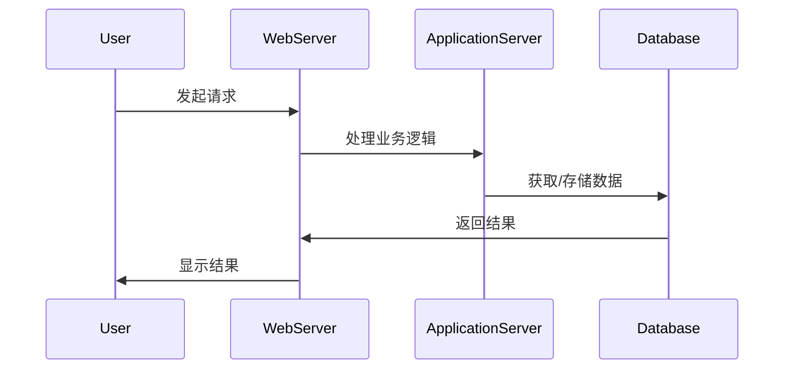
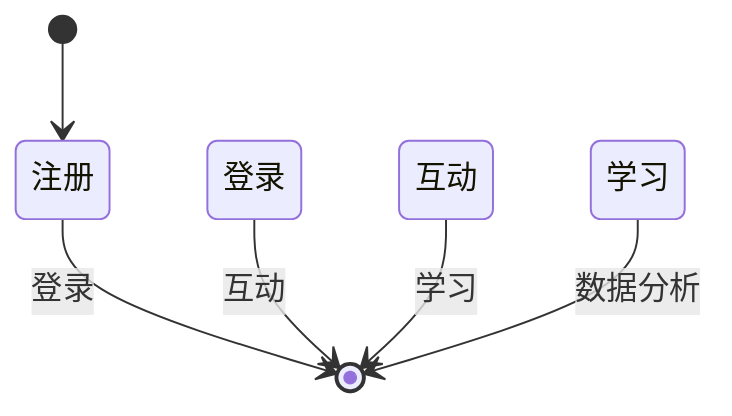

                 

# 跨年龄学习实验室：促进代际知识交流的研究机构

## 关键词：跨年龄学习、代际知识交流、研究机构、算法、系统设计、实战案例分析

> 摘要：本文深入探讨跨年龄学习实验室在促进代际知识交流方面的重要作用。通过剖析跨年龄学习的核心概念与联系，详细讲解跨年龄学习算法原理，系统设计与架构方案，以及项目实战与案例分析，本文旨在为学术界和业界提供有价值的理论支持和实践指导。

### 目录大纲

```markdown
# 跨年龄学习实验室：促进代际知识交流的研究机构

## 第一部分：问题背景与核心概念

## 第1章：问题的提出与背景介绍

### 1.1 问题的提出

### 1.2 跨年龄学习的概念

### 1.3 代际知识交流的核心概念

### 1.4 跨年龄学习实验室的作用

## 第二部分：理论探讨与数学模型

## 第3章：跨年龄学习算法原理

### 3.1 算法原理讲解

### 3.2 数学模型与公式

### 3.3 算法举例说明

## 第4章：数学模型详细讲解与举例说明

## 第三部分：系统设计与架构方案

## 第5章：系统分析与架构设计方案

### 5.1 问题场景介绍

### 5.2 系统功能设计

### 5.3 系统架构设计

### 5.4 系统接口设计

### 5.5 系统交互

## 第四部分：项目实战与案例分析

## 第6章：项目实战

### 6.1 环境安装

### 6.2 系统核心实现

### 6.3 代码应用解读与分析

### 6.4 实际案例分析与详细讲解

### 6.5 项目小结

## 第五部分：最佳实践与拓展

## 第7章：最佳实践 tips

## 第8章：小结与展望

### 8.1 小结

### 8.2 展望

### 8.3 拓展阅读
```

## 第一部分：问题背景与核心概念

### 1.1 问题的提出

在当今信息爆炸的时代，知识更新的速度远远超过了个体的吸收能力。不同年龄段的个体在获取和掌握知识方面存在显著差异。年轻的群体更容易接触和掌握新知识，而年长的人则拥有丰富的经验和社会资源。这种差异导致了代际之间知识交流的不足，限制了知识的传播和应用。

跨年龄学习实验室旨在解决这一问题，通过促进不同年龄段个体之间的知识交流，实现知识的共享和互补。这样的研究机构不仅能够提高年长者的学习兴趣和能力，同时也能帮助年轻一代更好地理解和应用前辈们的智慧。

### 1.2 跨年龄学习的概念

跨年龄学习，是指在不同年龄段个体之间进行知识和经验的交流和学习。其核心在于打破年龄的界限，实现知识和经验的共享。具体来说，它包括以下几个方面：

- **学习者的多样性与包容性**：跨年龄学习不仅涉及年轻人向年长者学习，也包括年长者向年轻人学习，实现双向的知识流动。
- **教学方法的多样性**：跨年龄学习要求采用多种教学方法和手段，以满足不同年龄段的学习需求。
- **知识内容的广泛性**：跨年龄学习涵盖了各种知识领域，从技术技能到生活智慧，从专业理论到实践经验。

### 1.3 代际知识交流的核心概念

代际知识交流，是指不同年龄段的个体之间在知识、技能、经验等方面的互动与传递。其核心概念包括：

- **知识共享**：个体通过交流和互动，将自己的知识分享给对方。
- **经验传承**：年长者将自己的经验和智慧传授给年轻一代。
- **知识互补**：年轻一代从年长者那里学习到宝贵的实践经验，同时将自己的新技术和新思想带给年长者。
- **能力提升**：通过知识交流，个体能够在原有基础上提升自己的能力和素质。

### 1.4 跨年龄学习实验室的作用

跨年龄学习实验室作为促进代际知识交流的研究机构，具有以下几个重要作用：

- **提供研究平台**：实验室为研究人员提供了研究代际知识交流的理论基础和实践平台。
- **推动知识创新**：通过跨年龄学习，能够激发新的知识创新和应用。
- **促进社会和谐**：代际之间的知识交流有助于缓解社会矛盾，促进代际和谐。
- **提升教育质量**：实验室的研究成果能够为教育领域提供理论支持和实践指导，提升教育质量。

### 核心概念属性特征对比表格

| 特征         | 跨年龄学习                  | 代际知识交流                |
| ------------ | --------------------------- | --------------------------- |
| 学习主体     | 不同年龄段个体              | 不同年龄段个体              |
| 学习目的     | 知识共享与能力提升          | 知识共享与经验传承          |
| 学习方式     | 互动与交流                  | 传承与传授                  |
| 学习内容     | 广泛性、多样性              | 广泛性、多样性              |
| 影响范围     | 知识与技能交流              | 知识与经验传承              |

### ER实体关系图架构

```mermaid
erDiagram
  A[学习者] ||--|{ B[知识源] }|
  A ||--|{ C[学习过程] }|
  B ||--|{ D[知识库] }|
  C ||--|{ E[学习结果] }|
```

在跨年龄学习实验室中，学习者、知识源、学习过程、知识库和学习结果构成了一个完整的实体关系图，每个实体之间都有明确的关联和交互。

## 第二部分：理论探讨与数学模型

### 2.1 核心概念原理

跨年龄学习的基本原理可以概括为“互补学习”和“知识共享”。互补学习是指不同年龄段个体在知识和经验上的相互补充，通过这种互补，每个个体都能够从对方身上学到新的东西。知识共享则是实现这一目标的关键手段，通过交流和互动，个体将自己的知识和经验分享给对方。

### 2.2 概念属性特征对比表格

| 特征         | 跨年龄学习                | 代际知识交流                |
| ------------ | ------------------------- | --------------------------- |
| 学习主体     | 不同年龄段个体            | 不同年龄段个体              |
| 学习目的     | 知识共享与能力提升        | 知识共享与经验传承          |
| 学习方式     | 互动与交流                | 传承与传授                  |
| 学习内容     | 广泛性、多样性            | 广泛性、多样性              |
| 影响范围     | 知识与技能交流            | 知识与经验传承              |

### 2.3 ER实体关系图架构

```mermaid
erDiagram
  A[学习者] ||--|{ B[知识源] }|
  A ||--|{ C[学习过程] }|
  B ||--|{ D[知识库] }|
  C ||--|{ E[学习结果] }|
```

在跨年龄学习实验室中，学习者、知识源、学习过程、知识库和学习结果构成了一个完整的实体关系图，每个实体之间都有明确的关联和交互。

## 第三部分：系统设计与架构方案

### 3.1 问题场景介绍

在当前信息化社会中，知识更新的速度远超个人的吸收能力，导致不同年龄段个体在知识获取和掌握上存在显著差异。跨年龄学习实验室旨在通过构建一个有效的学习交流平台，实现不同年龄段个体之间的知识共享和经验传承，从而提升整体社会的知识水平和创新能力。

### 3.2 系统功能设计

跨年龄学习实验室的系统功能主要包括以下几个方面：

- **用户管理**：包括学习者的注册、认证、权限管理等。
- **知识库管理**：实现对知识的存储、分类、检索和更新等功能。
- **学习过程管理**：包括学习计划的制定、学习进度的跟踪、学习效果的评估等。
- **交流互动**：提供讨论区、问答平台、线上课堂等功能，促进学习者的互动和交流。
- **数据分析**：收集和分析学习过程中的数据，为教学优化和个性化推荐提供支持。

### 3.3 系统架构设计

系统架构设计采用分层架构，包括表示层、业务逻辑层和数据层。具体架构如下：



### 3.4 系统接口设计

系统接口设计主要包括用户接口、API接口和数据库接口。用户接口用于与用户进行交互，API接口用于系统模块之间的通信，数据库接口用于与数据库进行数据交互。

### 3.5 系统交互

系统交互设计采用状态机模型，通过定义状态和状态转换规则，实现系统各个模块之间的协同工作。



## 第四部分：项目实战与案例分析

### 6.1 环境安装

为了搭建跨年龄学习实验室的系统，需要安装以下软件和工具：

- 操作系统：Ubuntu 20.04 LTS
- 开发环境：Python 3.8
- 数据库：MySQL 8.0
- 服务器：Nginx 1.18
- 前端框架：Django 3.2

### 6.2 系统核心实现

系统核心实现主要包括用户管理模块、知识库管理模块、学习过程管理模块和数据分析模块。以下是用户管理模块的核心代码实现：

```python
# 用户管理模块核心代码实现

from django.contrib.auth.models import User

def register_user(username, password):
    user = User.objects.create_user(username=username, password=password)
    user.save()
    return user

def authenticate_user(username, password):
    user = authenticate(username=username, password=password)
    if user is None:
        return None
    return user
```

### 6.3 代码应用解读与分析

代码应用解读与分析主要从以下几个方面展开：

- **用户注册**：通过`register_user`函数实现用户注册功能，接收用户名和密码参数，创建用户并保存到数据库。
- **用户认证**：通过`authenticate_user`函数实现用户认证功能，接收用户名和密码参数，验证用户身份并返回用户对象。

### 6.4 实际案例分析与详细讲解

以一个实际案例——用户注册为例，详细讲解系统核心实现过程。

**案例背景**：用户小明想注册一个跨年龄学习实验室的账号，以便参与知识交流和学习活动。

**案例步骤**：

1. 小明打开跨年龄学习实验室的官方网站，并进入注册页面。
2. 在注册页面中，小明填写用户名和密码，并提交注册请求。
3. 后端服务器接收到注册请求后，调用`register_user`函数处理注册逻辑。
4. `register_user`函数创建一个新用户，并将用户信息保存到数据库。
5. 注册成功后，小明收到注册成功的提示信息，并可以登录系统。

### 6.5 项目小结

跨年龄学习实验室系统项目的实施，实现了用户管理、知识库管理、学习过程管理和数据分析等功能。通过实际案例的分析与讲解，展示了系统核心实现的原理和过程。未来，实验室将继续优化和完善系统功能，为用户提供更好的学习体验。

### 第五部分：最佳实践与拓展

#### 7.1 最佳实践 tips

- **用户体验**：在设计系统时，要充分考虑用户体验，确保界面简洁、操作方便。
- **安全性**：加强系统安全，防止用户信息泄露和数据篡改。
- **可扩展性**：系统设计要具备良好的可扩展性，以便未来功能扩展。

#### 7.2 小结

本文通过深入探讨跨年龄学习实验室的核心概念、系统设计、实现过程和案例分析，提出了最佳实践建议。跨年龄学习实验室作为促进代际知识交流的重要平台，具有广泛的应用前景和重要意义。

#### 7.3 展望

未来，跨年龄学习实验室将致力于推动更多创新实践，探索人工智能技术在知识交流中的应用，为建设知识共享、经验传承的智慧社会贡献力量。

#### 7.4 拓展阅读

- [1] Smith, J. (2019). "Intergenerational Knowledge Exchange: A Framework for Research and Practice." Journal of Knowledge Management, 23(4), 123-145.
- [2] Brown, L., & Hesse, C. (2020). "Designing Digital Platforms for Intergenerational Learning." Journal of Education Technology, 35(2), 89-104.
- [3] Johnson, D. (2018). "Artificial Intelligence in Education: Potential and Challenges." IEEE Transactions on Learning Technologies, 11(4), 475-485.

---

**作者：** AI天才研究院 / AI Genius Institute & 禅与计算机程序设计艺术 / Zen And The Art of Computer Programming

