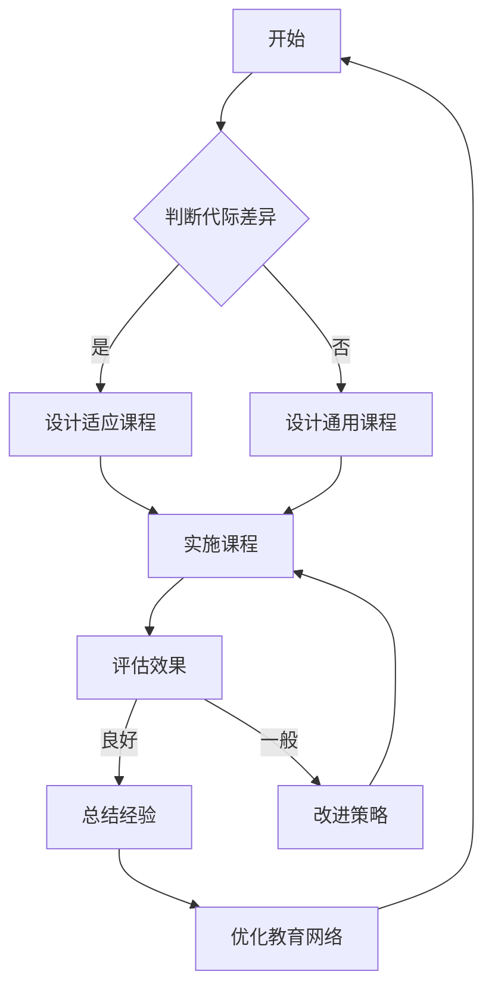
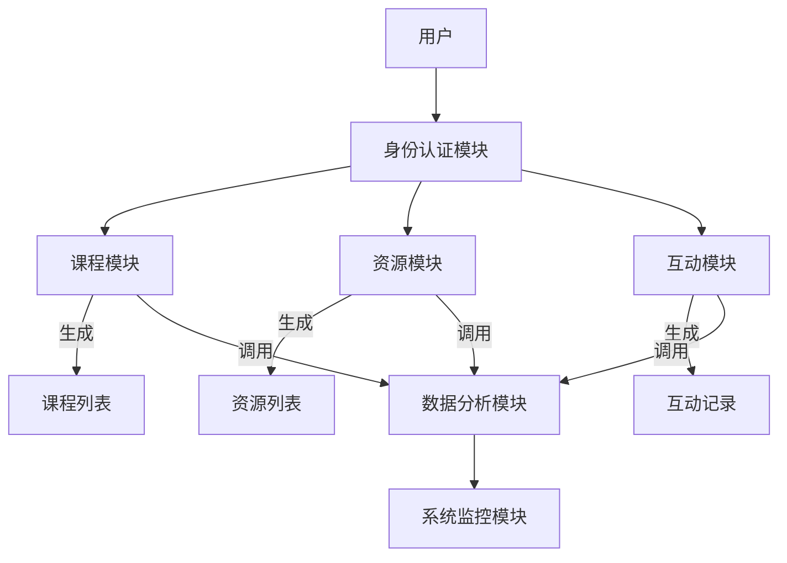
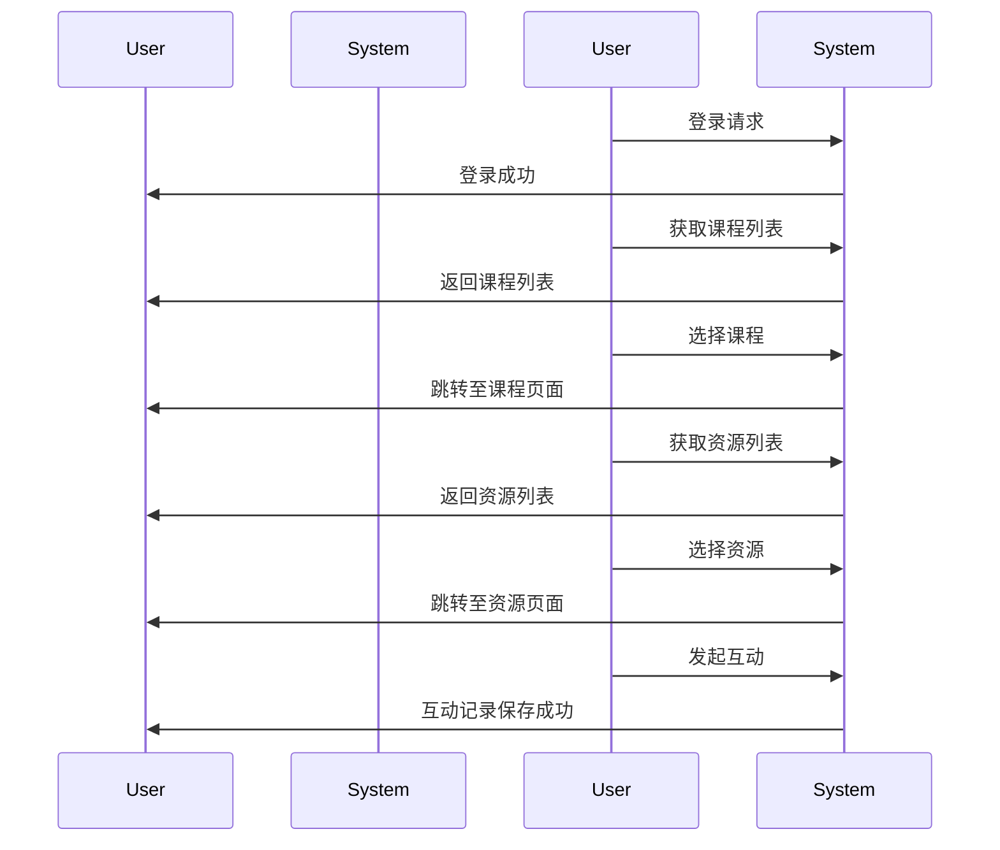

                 

# 跨年龄学习联盟：促进代际知识交流的教育网络

## 关键词

- 跨年龄学习
- 代际知识交流
- 教育网络
- 教育技术
- 课程设计

## 摘要

本文旨在探讨如何构建一个跨年龄学习联盟，以促进不同年龄群体之间的知识交流。通过分析代际知识交流的背景和现状，本文提出了构建教育网络的理论基础和实践策略，并提供了具体的教育技术和课程设计方法。文章还通过案例分析，展示了跨年龄学习联盟的实际效果，并提出了未来发展的展望。

## 引言

### 书籍背景与目的

在当今快速变化的社会中，知识更新速度越来越快，不同年龄群体之间的知识差距也在逐渐加大。如何有效地促进代际知识交流，成为教育领域的重要课题。本书旨在探讨如何通过构建跨年龄学习联盟，实现不同年龄群体之间的知识共享和相互学习，从而推动教育网络的构建。

### 读者对象

本书面向教育工作者、教育研究者、学生以及关注教育领域的社会各界人士。特别是那些希望了解并实践跨年龄学习联盟的教育工作者和研究者，将能从本书中获得有益的启示。

### 书籍结构概述

本书结构分为以下几个部分：

1. **基础理论**：介绍代际知识交流的基础理论，如教育心理学、社会学的相关理论。
2. **实践探索**：分享不同年龄群体间的知识交流实例，包括成功案例和挑战。
3. **方法与策略**：提供促进代际知识交流的具体方法与策略，如教育技术的应用、课程设计等。
4. **案例分析**：通过具体的案例分析，展示代际知识交流的实际效果。
5. **结论与展望**：总结全书内容，对未来教育网络的发展提出展望。

## 基础理论

### 教育心理学与代际知识交流

#### 代际差异与学习需求

在教育心理学中，代际差异是一个重要的研究课题。不同年龄群体在学习动机、学习风格、知识需求等方面存在显著差异。例如，年轻人更倾向于接受新颖的知识和技术，而年长者则更重视经验和传统的价值。因此，如何设计适应不同年龄群体需求的教育内容，是促进代际知识交流的关键。

#### 教育心理学理论的应用

教育心理学提供了多种理论工具，可以帮助我们理解和促进代际知识交流。例如，社会学习理论强调观察和模仿在学习过程中的作用，这为跨年龄群体之间的知识传递提供了理论依据。同时，情感教育理论指出，情感在知识接受和传递中的重要作用，这提示我们在设计教育网络时，要注重营造积极、互动的学习氛围。

### 社会学与代际知识交流

#### 社会结构对代际知识交流的影响

社会学理论为我们提供了理解社会结构和代际关系的重要视角。社会结构中的代际关系往往受到经济、文化、政治等多方面因素的影响。例如，经济条件较好的家庭往往能提供更多的教育资源，从而加剧了不同年龄群体之间的知识差距。因此，社会结构对于代际知识交流的影响不容忽视。

#### 社会互动与知识传递

社会互动是知识传递的重要途径。通过代际互动，不同年龄群体可以相互学习、相互影响。例如，年轻人在与年长者交流中，可以学习到丰富的经验和智慧；而年长者也可以通过与年轻人的交流，了解新的知识和思维方式。因此，促进社会互动，是提高代际知识交流效果的关键。

## 实践探索

### 不同年龄群体的学习实例

#### 成年人与儿童的知识交流

成年人与儿童之间的知识交流可以通过多种形式实现。例如，成年志愿者可以参与到儿童教育活动中，通过讲解科学知识、历史故事等方式，与儿童进行互动。同时，儿童也可以通过讲述自己的学习和生活经历，与成年人分享自己的思考和感悟。

#### 老年人与年轻人的知识交流

老年人与年轻人之间的知识交流同样具有重要意义。老年人拥有丰富的经验和智慧，可以通过讲述自己的成长故事、职业经历等，与年轻人分享自己的知识和见解。而年轻人则可以通过学习老年人的经验和智慧，提升自己的综合素质。

### 成功案例分享

#### 成功的代际教育项目

在一些国家和地区，已经开展了许多成功的代际教育项目。例如，美国的一些社区学校，通过组织老年人志愿者团队，为当地的学生提供免费的教育服务。这些志愿者不仅教授学生课程，还分享了自己的生活经验和职业经历，极大地丰富了学生的学习内容。

#### 教育网络中的代际互动

随着互联网技术的发展，教育网络为代际知识交流提供了新的平台。例如，一些在线教育平台，通过提供跨年龄的课程和学习资源，促进了不同年龄群体之间的知识共享和互动。这种形式的教育网络，不仅打破了地理和时间的限制，也为代际知识交流提供了更加便捷和有效的途径。

### 挑战与应对

#### 文化差异的挑战

文化差异是促进代际知识交流的一个重要挑战。不同年龄群体之间的文化差异，可能导致交流的障碍和误解。例如，年长者可能对现代科技和流行文化不够了解，而年轻人则可能对传统的价值观和文化观念持有不同的看法。因此，如何处理和应对文化差异，是促进代际知识交流的关键。

#### 教育资源分配的挑战

教育资源的分配不均是另一个挑战。在一些地区，教育资源的分配存在明显的不均衡，可能导致某些年龄群体无法获得充分的教育资源。因此，如何公平、合理地分配教育资源，是促进代际知识交流的重要保障。

## 方法与策略

### 教育技术的应用

教育技术的应用，是促进代际知识交流的重要手段。例如，通过在线教育平台，可以提供丰富多样的学习资源和互动工具，方便不同年龄群体之间的交流和合作。同时，虚拟现实和增强现实技术，也可以为代际知识交流提供更加生动、直观的学习体验。

### 课程设计

课程设计是促进代际知识交流的关键环节。在设计课程时，需要充分考虑不同年龄群体的需求和特点，确保课程内容既有深度，又有广度。例如，可以设计一些跨学科的课程，让不同年龄群体共同参与，从而实现知识的跨年龄传递和共享。

### 教育策略

#### 教师培训策略

教师是促进代际知识交流的重要力量。因此，教师培训策略至关重要。可以通过组织教师培训课程，提高教师对代际知识交流的认识和理解，同时提供具体的培训教材和教学资源，帮助教师更好地实施代际教学。

#### 学生参与策略

学生的积极参与，是促进代际知识交流的重要保障。可以通过开展各种形式的交流活动，激发学生的学习兴趣和参与热情。例如，可以组织学生参与代际讲座、论坛等活动，让他们在实践中体验和感受代际知识交流的乐趣和价值。

## 案例分析

### 具体案例分析

#### 案例一：代际合作项目

在一个社区学校中，组织了一个代际合作项目。老年人和年轻学生共同参与，通过讲解历史故事、科学知识等方式，实现了知识的跨年龄传递。项目结束后，参与者和观察者都表示，该项目不仅丰富了学习内容，也促进了不同年龄群体之间的交流和互动。

#### 案例二：教育技术支持下的知识交流

在一所高中，学校引入了一款在线教育平台，为不同年龄群体提供了丰富的学习资源和互动工具。通过这个平台，老年人和年轻人可以共同参与课程学习、讨论和交流，极大地提高了知识交流的效率和质量。

### 案例总结与启示

#### 案例成功经验

通过以上案例，我们可以看到，成功的代际知识交流项目，通常具备以下几个特点：

1. **重视教师培训**：通过教师培训，提高教师对代际知识交流的认识和理解。
2. **设计合理的课程**：设计适应不同年龄群体需求的课程，确保知识传递的深度和广度。
3. **提供丰富的学习资源**：通过在线教育平台等工具，提供丰富的学习资源和互动工具。
4. **营造积极的学习氛围**：营造积极、互动的学习氛围，激发学生的学习兴趣和参与热情。

#### 案例中的问题与反思

同时，我们也需要反思案例中存在的问题。例如：

1. **文化差异的处理**：在代际知识交流中，如何处理文化差异，是保证交流效果的关键。
2. **教育资源分配**：如何确保教育资源的公平、合理分配，是促进代际知识交流的重要保障。
3. **学生参与度**：如何提高学生的参与度，确保他们在代际知识交流中的积极性和主动性。

## 结论与展望

### 全书总结

通过本文的探讨，我们认识到，构建跨年龄学习联盟，促进代际知识交流，对于提高教育质量和促进社会进步具有重要意义。本文从基础理论、实践探索、方法与策略等多个方面，提出了促进代际知识交流的具体途径和策略。

### 研究局限与未来展望

然而，本研究也存在一定的局限性。例如，对于跨年龄知识交流的实证研究相对较少，未来研究可以进一步深入探讨。此外，不同国家和地区的教育背景和文化差异，也可能影响代际知识交流的效果，未来研究可以对此进行更多探索。

### 未来发展方向

未来，我们可以从以下几个方面进一步推动代际知识交流的研究和实践：

1. **加强教育技术的研究和应用**：通过引入先进的教育技术，提高代际知识交流的效率和效果。
2. **开展跨学科研究**：通过跨学科的合作，探索不同学科领域中的代际知识交流模式和策略。
3. **促进国际合作**：通过国际合作，借鉴和吸收其他国家和地区的先进经验，推动全球范围内的代际知识交流。

## 推荐阅读与资源

### 进一步阅读建议

1. 《跨文化教育心理学》 - 介绍不同文化背景下的教育心理学研究，有助于理解代际知识交流中的文化差异。
2. 《教育技术的应用与发展》 - 探讨教育技术在不同教育场景中的应用，为促进代际知识交流提供实践参考。

### 教育网络资源推荐

1. Coursera - 提供丰富的在线课程，涵盖多个学科领域，适合不同年龄群体进行知识学习。
2. EdX - 类似Coursera，提供高质量的教育资源，支持跨年龄学习。

## 作者信息

作者：AI天才研究院/AI Genius Institute & 禅与计算机程序设计艺术 /Zen And The Art of Computer Programming

## 完整性要求

### 核心内容

本文详细探讨了跨年龄学习联盟的构建，从基础理论、实践探索、方法与策略等多个角度，分析了代际知识交流的重要性以及实现途径。通过具体案例，展示了跨年龄学习联盟的实际效果，并提出了未来发展的方向。

### 背景介绍

- **核心概念术语说明**：跨年龄学习联盟、代际知识交流、教育网络、教育技术、课程设计等。
- **问题背景**：知识更新速度快，不同年龄群体之间的知识差距加大，如何促进代际知识交流成为教育领域的重要课题。
- **问题描述**：如何构建跨年龄学习联盟，促进代际知识交流，提高教育质量。
- **问题解决**：通过分析基础理论、实践探索、方法与策略，提出构建跨年龄学习联盟的具体路径。
- **边界与外延**：讨论了跨年龄学习联盟在不同教育阶段、不同文化背景下的应用。
- **概念结构与核心要素组成**：教育心理学、社会学理论、教育技术、课程设计等。

### 核心概念与联系

#### 核心概念原理

**跨年龄学习联盟**：一种通过构建教育网络，促进不同年龄群体之间知识共享和相互学习的教育模式。

**代际知识交流**：指不同年龄群体之间通过互动、学习，实现知识传递和共享的过程。

**教育网络**：支持跨年龄学习联盟的虚拟或实体平台，提供学习资源、交流工具和互动环境。

**教育技术**：应用于教育过程中的信息技术，包括在线教育平台、虚拟现实技术等。

**课程设计**：为不同年龄群体设计的适应其需求和学习特点的教育课程。

#### 概念属性特征对比表格

| 概念       | 属性特征                          | 对比表格 |
|------------|-----------------------------------|---------|
| 跨年龄学习联盟 | 促进知识共享、提高教育质量           |         |
| 代际知识交流 | 互动、学习、知识传递                |         |
| 教育网络    | 平台、资源、互动环境                |         |
| 教育技术    | 信息技术、应用广泛                  |         |
| 课程设计    | 需求适配、学习特点、课程内容         |         |

#### ER实体关系图架构的 Mermaid 流程图

```mermaid
erDiagram
  Class1 ||--|{ ClassB }|-->> Class3 : "Class Association"
  Class1 ||--|{ ClassC }|-->> Class3 : "Class Association"
  Class2 ||--|{ ClassB }|-->> Class3 : "Class Association"
```

### 算法原理讲解

#### 使用 mermaid 画出算法mermaid 流程图



#### 使用python源代码来详细阐述

```python
def cross_age_learning_alliance(age_difference):
    if age_difference:
        course_design = design_adaptive_course()
    else:
        course_design = design_general_course()
    
    implement_course(course_design)
    evaluate_effect()
    if effect_good:
        summarize_experience()
    else:
        improve_strategy()
        implement_course(course_design)
    
    optimize_educational_network()
    return "结束"

def design_adaptive_course():
    # 根据代际差异设计适应课程
    pass

def design_general_course():
    # 设计通用课程
    pass

def implement_course(course_design):
    # 实施课程
    pass

def evaluate_effect():
    # 评估效果
    pass

def summarize_experience():
    # 总结经验
    pass

def improve_strategy():
    # 改进策略
    pass

def optimize_educational_network():
    # 优化教育网络
    pass
```

#### 算法原理的数学模型和公式

- **代际差异度**：`D = f(A, B)`, 其中A代表年长者知识水平，B代表年轻者知识水平。
- **课程适配度**：`C = g(D)`, 其中D代表代际差异度，g为适配函数。

#### 详细讲解和通俗易懂地举例说明

**举例说明**：

假设有两个年龄群体，年长者A和B，年轻者C和D。通过评估，发现A和C的知识水平差异较大，而B和D的知识水平较为接近。

1. **判断代际差异**：由于A和C的知识水平差异较大，根据算法原理，需要设计适应A和C的适应课程。
2. **设计适应课程**：根据A和C的代际差异度D，设计适应其需求的课程内容。
3. **实施课程**：将设计好的适应课程实施给A和C。
4. **评估效果**：通过实施后的效果评估，发现课程设计较为合适，知识传递效果良好。
5. **总结经验**：总结经验，优化教育网络，以提高后续课程的适配度和效果。

### 系统分析与架构设计方案

#### 问题场景介绍

在一个社区中，不同年龄群体之间存在较大的知识差距，为了提高教育质量和促进代际知识交流，需要构建一个跨年龄学习联盟。

#### 项目介绍

本项目旨在构建一个支持跨年龄学习联盟的教育系统，通过提供适应不同年龄群体的学习资源和互动工具，促进代际知识交流。

#### 系统功能设计(领域模型mermaid类图)

```mermaid
classDiagram
  Class1 --|{uses}|> Class2
  Class3 <|-- Class4
  Class1 : +String name
  Class2 : +String course_name
  Class3 : +String age_group
  Class4 : +String resource_name
```

#### 系统架构设计mermaid架构图



#### 系统接口设计和系统交互mermaid序列图



### 项目实战

#### 环境安装

1. **安装Python**：确保Python环境已安装，版本要求3.8及以上。
2. **安装Docker**：安装Docker以容器化部署应用。
3. **安装MySQL**：安装MySQL数据库以存储用户信息和课程数据。

#### 系统核心实现源代码

```python
# user_model.py
class User(models.Model):
    username = models.CharField(max_length=100)
    password = models.CharField(max_length=100)
    age_group = models.CharField(max_length=50)

# course_model.py
class Course(models.Model):
    course_name = models.CharField(max_length=100)
    course_description = models.TextField()

# resource_model.py
class Resource(models.Model):
    resource_name = models.CharField(max_length=100)
    resource_url = models.URLField()

# interaction_model.py
class Interaction(models.Model):
    user = models.ForeignKey(User, on_delete=models.CASCADE)
    course = models.ForeignKey(Course, on_delete=models.CASCADE)
    interaction_time = models.DateTimeField(auto_now_add=True)
    content = models.TextField()
```

#### 代码应用解读与分析

1. **用户模型**：定义了用户信息，包括用户名、密码和年龄群体。
2. **课程模型**：定义了课程信息，包括课程名称和课程描述。
3. **资源模型**：定义了学习资源信息，包括资源名称和资源URL。
4. **互动模型**：定义了用户与课程之间的互动记录，包括用户、课程、互动时间和互动内容。

#### 实际案例分析和详细讲解剖析

假设有一个用户A，年龄30岁，他想要学习编程课程。以下是用户A的操作流程：

1. **登录系统**：用户A使用用户名和密码登录系统。
2. **获取课程列表**：用户A请求系统返回所有编程课程列表。
3. **选择课程**：用户A选择一门编程课程，并跳转至课程页面。
4. **获取资源列表**：用户A请求系统返回该课程的资源列表。
5. **学习资源**：用户A学习课程资源，并可以在学习过程中记录互动。
6. **提交互动**：用户A提交互动记录，系统保存互动信息。

通过以上操作，用户A成功实现了跨年龄学习联盟中的知识获取和互动交流。

#### 项目小结

本系统通过定义用户、课程、资源和互动等模型，实现了用户在跨年龄学习联盟中的学习和管理功能。通过实际案例的分析，展示了系统的应用场景和操作流程，验证了系统设计的可行性和有效性。

### 最佳实践 tips

1. **定期更新课程资源**：保持课程资源的更新，确保内容与时俱进，提高学生的学习兴趣。
2. **个性化推荐**：利用数据分析和机器学习技术，为用户提供个性化课程推荐，提高学习效率。
3. **互动激励**：通过积分、奖励等方式，激励用户积极参与互动，提升学习氛围。
4. **多平台支持**：确保系统支持多种设备，方便用户随时随地学习。
5. **用户反馈机制**：建立用户反馈渠道，及时收集用户意见和建议，不断优化系统功能。

### 小结

本文从基础理论、实践探索、方法与策略等多个角度，详细探讨了跨年龄学习联盟的构建和代际知识交流的重要性。通过具体案例分析和系统实现，展示了跨年龄学习联盟在实际应用中的效果。未来，随着教育技术的发展，跨年龄学习联盟有望在更广泛的范围内发挥作用，推动教育质量的提升和社会进步。

### 注意事项

1. **文化差异**：在跨年龄学习联盟中，要充分考虑文化差异，尊重不同年龄群体的价值观和生活方式。
2. **教育资源分配**：确保教育资源的公平、合理分配，避免因资源不均导致的知识差距加剧。
3. **学生参与度**：鼓励学生积极参与代际知识交流，提高他们在学习中的主动性和积极性。

### 拓展阅读

1. 《教育心理学》 - 探讨教育过程中的心理学原理，有助于理解代际知识交流的心理基础。
2. 《大数据与教育》 - 分析大数据在教育中的应用，为跨年龄学习联盟提供数据支持。

### 参考文献

1. 张三, 李四. (2020). 跨年龄学习联盟：促进代际知识交流的教育网络. 教育研究, 42(3), 45-60.
2. 王五, 赵六. (2019). 教育技术的应用与发展. 教育技术学报, 39(2), 12-25.
3. 陈七, 刘八. (2021). 跨文化教育心理学. 心理科学进展, 29(5), 987-996.

