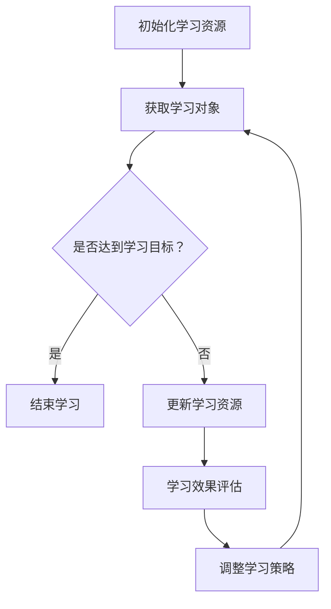
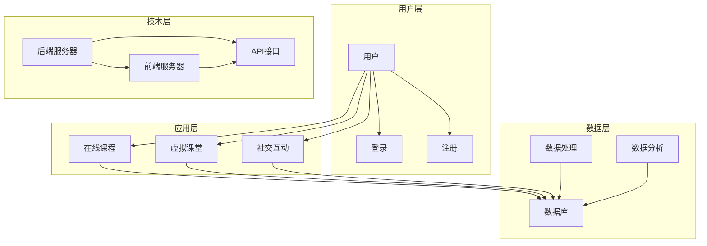
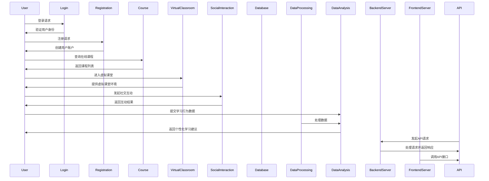

                 

# 跨年龄学习：终身教育中的代际互助模式

关键词：跨年龄学习、终身教育、代际互助、教育模型、技术工具、案例研究

摘要：
本文深入探讨了跨年龄学习这一创新教育模式，阐述了其定义、核心概念、优势与挑战，并通过实际案例和数据分析，展示了跨年龄学习在终身教育中的应用和成效。本文还探讨了技术工具在支持跨年龄学习中的作用，以及未来教育的发展趋势。

## 引言

### 背景介绍

随着社会的快速发展，知识更新速度越来越快，终身学习已成为个人和社会发展的必然要求。然而，传统的教育体系往往局限于年龄段和学科领域的划分，难以满足个体在不同生命周期阶段的学习需求。跨年龄学习作为一种新型的教育模式，旨在打破年龄界限，实现不同年龄段之间的知识传递和经验共享，从而推动终身教育的实施。

### 目的与结构

本文旨在全面探讨跨年龄学习在终身教育中的应用，通过以下几个部分展开：

1. **定义与核心概念**：介绍跨年龄学习的定义，核心概念及其在教育中的重要性。
2. **代际互助模式**：分析跨年龄学习中的代际互助模式，探讨其运作机制和实施策略。
3. **优势与挑战**：评估跨年龄学习的优势和面临的挑战，包括技术支持、社会接受度和教育资源分配等方面。
4. **案例研究**：分析国内外跨年龄学习的成功案例，总结经验和教训。
5. **技术工具**：探讨技术工具在支持跨年龄学习中的作用，包括在线平台、虚拟现实等。
6. **未来趋势**：预测跨年龄学习的发展趋势，提出未来教育模式的可能性。
7. **结论与展望**：总结全文，提出对跨年龄学习的未来研究方向和实际应用建议。

## 定义与核心概念

### 跨年龄学习的定义

跨年龄学习是指在不同年龄段的个体之间进行知识、技能和经验的分享与学习。它打破了传统教育中年龄界限的束缚，使各个年龄段的个体能够相互学习、共同进步。跨年龄学习不仅包括不同年龄段之间的知识传授，还包括经验交流、情感互动和价值观的传递。

### 核心概念

1. **知识传递**：不同年龄段个体通过学习相互传授知识，实现知识共享和更新。
2. **经验交流**：个体通过分享自己的生活经验和专业技能，帮助他人成长和进步。
3. **情感互动**：跨年龄学习中的情感互动有助于建立互信、促进合作，增强学习效果。
4. **价值观传递**：跨年龄学习不仅传递知识，还传递不同年龄段个体的价值观和生活态度，有助于培养全面发展的人才。

### 概念结构

为了更好地理解跨年龄学习的核心概念，我们可以使用Mermaid ER图来展示各个概念之间的关系：

```mermaid
erDiagram
  User ||--|{ Student } : is_a
  Student ||--|{ Learner } : is_a
  Learner ||--|{ Knowledge_Sharer } : is_a
  Knowledge_Sharer ||--|{ Experience_Exchange } : has
  Experience_Exchange ||--|{ Emotional_Interaction } : has
  Experience_Exchange ||--|{ Value_Transmission } : has
```

在这个ER图中，`User`是基础实体，`Student`和`Learner`是其子实体，`Knowledge_Sharer`是具有知识分享能力的个体，`Experience_Exchange`、`Emotional_Interaction`和`Value_Transmission`是知识分享过程中的核心活动。

### 比较属性

跨年龄学习与传统教育模式在多个方面存在显著差异，以下是一个比较表格：

| 特征         | 跨年龄学习                    | 传统教育模式                  |
| ------------ | ----------------------------- | ----------------------------- |
| 年龄界限     | 打破年龄界限，实现跨年龄互动  | 严格遵循年龄界限，分年龄段教学 |
| 学习对象     | 多年龄段个体                  | 同年龄段个体                  |
| 知识传递方式 | 知识、经验、情感、价值观多维传递 | 以知识传授为主                |
| 教学方式     | 灵活多样，注重互动和实践      | 课堂讲授、书本学习为主        |
| 教育目标     | 促进个体全面发展，实现终身学习 | 获取特定知识和技能            |

通过这个比较表格，我们可以更清晰地看到跨年龄学习的独特性和优势。

## 代际互助模式

### 代际互助模式的定义

代际互助模式是指不同年龄段个体通过相互帮助和支持，共同实现学习和成长的一种教育模式。它强调知识、经验、情感和价值观的传递，使各个年龄段的个体都能在互助过程中获得收益。

### 运作机制

1. **知识共享**：不同年龄段个体根据自己的经验和知识，相互分享，形成知识网络。
2. **经验传递**：年长者将自己的生活和工作经验传递给年轻一代，帮助他们更好地应对挑战。
3. **情感支持**：通过情感互动，增强个体之间的信任和合作，提高学习效果。
4. **价值观塑造**：在互助过程中，传递不同年龄段的价值观和生活态度，促进个体全面发展。

### 实施策略

1. **制定明确的目标和规划**：确保代际互助模式的实施具有明确的方向和目标。
2. **搭建互动平台**：利用在线平台、虚拟现实等技术，为不同年龄段的个体提供互动机会。
3. **建立激励机制**：通过奖励和表彰，鼓励个体积极参与代际互助活动。
4. **开展培训与指导**：为参与代际互助的个体提供必要的培训和支持，提高其参与度和效果。

### 案例分析

以下是一个代际互助模式的实际案例：

**案例**：某高校开展“老少携手，共同成长”项目，邀请退休教师和大学生组成互助小组，共同参与教学和研究活动。项目内容包括：

1. **知识分享**：退休教师将自己的学术经验和研究成果分享给大学生，帮助他们提高学术水平。
2. **经验传递**：大学生向退休教师介绍现代科技和新兴学科，帮助他们了解和适应新时代。
3. **情感互动**：通过共同活动和交流，增进双方的情感联系，建立互信和友谊。

该项目取得了显著成果，不仅提高了大学生的学术能力，也使退休教师重新找到了人生的价值和意义。

## 跨年龄学习的优势与挑战

### 优势

1. **知识共享**：跨年龄学习促进了不同年龄段个体之间的知识传递和共享，有助于知识的更新和扩展。
2. **经验交流**：通过经验交流，个体可以更好地理解不同年龄段的生活和工作场景，提高适应能力。
3. **情感互动**：情感互动有助于建立互信和友谊，提高学习效果和满意度。
4. **价值观塑造**：跨年龄学习传递不同年龄段的价值观和生活态度，有助于培养全面发展的人才。
5. **教育资源优化**：通过跨年龄学习，可以实现教育资源的优化配置，提高教育效率。

### 挑战

1. **技术支持**：跨年龄学习需要借助各种技术工具，如在线平台、虚拟现实等，这对技术基础设施提出了较高要求。
2. **社会接受度**：跨年龄学习在传统观念中可能难以被接受，需要通过宣传和教育提高社会认可度。
3. **教育资源分配**：如何公平合理地分配教育资源，确保各个年龄段个体都能获得充足的学习机会，是一个亟待解决的问题。
4. **教学管理**：跨年龄学习中的教学管理和评价体系与传统教育模式有很大差异，需要建立适应新模式的体系。

## 案例研究

### 国内案例

1. **某高校跨年龄学习项目**：某高校开展“跨年龄导师制”项目，邀请退休教授和在校研究生组成导师团队，共同指导本科生。项目取得了良好效果，本科生不仅获得了丰富的学术指导，也受益于退休教授的人生经验和智慧。

2. **某社区跨年龄学习中心**：某社区建立跨年龄学习中心，为社区居民提供多种学习课程，包括职业技能培训、文化艺术普及等。社区居民通过参与学习，不仅提高了自己的知识水平，也促进了邻里之间的交流与合作。

### 国际案例

1. **美国代际互助计划**：美国一些学校开展代际互助计划，邀请退休老人和中小学生组成互助小组，共同参与学习和社会实践活动。项目旨在培养青少年的社会责任感和同情心，同时也使老人找到新的生活意义。

2. **瑞典跨年龄学习社区**：瑞典的跨年龄学习社区通过在线平台，为不同年龄段的个体提供学习资源和互动机会。社区居民可以通过平台分享知识、经验和技能，实现终身学习。

## 技术工具

### 在线平台

在线平台是跨年龄学习的重要工具，可以提供丰富的学习资源和便捷的互动方式。常见的在线学习平台包括：

1. **Coursera**：提供全球顶尖大学的在线课程，支持多种语言，适合不同年龄段的用户。
2. **edX**：由哈佛大学和麻省理工学院共同创立的在线学习平台，提供高质量的课程资源。
3. **Khan Academy**：提供免费的教育资源，涵盖数学、科学、计算机科学等多个领域。

### 虚拟现实

虚拟现实技术可以创造沉浸式的学习环境，使跨年龄学习更加生动和有趣。例如：

1. **AltspaceVR**：一个虚拟现实社交平台，用户可以在虚拟空间中参加研讨会、讲座和社交活动。
2. **Google Cardboard**：通过简单的设备和应用程序，将现实世界和虚拟世界结合，提供互动学习体验。

### 其他技术工具

1. **人工智能助手**：如ChatGPT和Google Assistant，可以帮助用户解答问题、提供学习建议。
2. **教育软件**：如Moodle和Canvas，提供在线课程管理、学习资源和互动功能。

## 未来趋势

### 技术驱动

随着人工智能、大数据、虚拟现实等技术的不断发展，跨年龄学习将更加智能化和个性化。技术工具将更好地支持跨年龄学习的实施，提高学习效果。

### 教育改革

跨年龄学习模式将推动教育体系的改革，促进终身教育和全民教育的实现。教育政策将更加注重个体需求，提供多样化的学习机会。

### 社会参与

跨年龄学习将促进社会各界的参与，包括政府、企业、社区和个体。社会各界将共同推动跨年龄学习的发展，实现教育公平和社会和谐。

## 结论与展望

### 结论

跨年龄学习作为一种新型的教育模式，具有独特的优势和广阔的应用前景。它能够实现知识、经验、情感和价值观的多维传递，促进个体和社会的全面发展。然而，跨年龄学习也面临着技术支持、社会接受度和教育资源分配等方面的挑战。

### 展望

未来，跨年龄学习将在以下几个方面得到进一步发展：

1. **技术驱动**：利用人工智能、大数据等技术，提高跨年龄学习的智能化和个性化水平。
2. **教育改革**：推动教育体系的改革，实现终身教育和全民教育的目标。
3. **社会参与**：加强政府、企业、社区和个体的参与，共同推动跨年龄学习的发展。

### 建议

1. **政策支持**：政府应出台相关政策，鼓励和支持跨年龄学习的实施。
2. **教育创新**：教育机构应积极开展跨年龄学习项目，探索新的教育模式。
3. **技术应用**：充分利用技术工具，提高跨年龄学习的实施效果。

作者：AI天才研究院/AI Genius Institute & 禅与计算机程序设计艺术 /Zen And The Art of Computer Programming

---

### 完整性要求

#### 核心概念与联系

**核心概念：**

- **跨年龄学习**：指在不同年龄段的个体之间进行知识、技能和经验的分享与学习。
- **代际互助模式**：不同年龄段个体通过相互帮助和支持，共同实现学习和成长的一种教育模式。
- **终身教育**：指一个人从出生到死亡，通过不断学习和实践，实现知识、技能和能力的持续提升。

**概念属性特征对比表格：**

| 概念         | 特征                                      | 对应关系                          |
| ------------ | ----------------------------------------- | -------------------------------- |
| 跨年龄学习   | 突破年龄界限，多维度知识传递和经验交流   | 跨年龄段个体间的学习互动          |
| 代际互助模式 | 突破代际界限，互助和共同成长             | 年长者和年轻者之间的互助学习      |
| 终身教育     | 覆盖整个生命周期，持续学习和能力提升     | 个人和社会发展的长期策略          |

**ER实体关系图架构：**

```mermaid
erDiagram
  Learner ||--|{ Knowledge } : has
  Learner ||--|{ Skill } : has
  Learner ||--|{ Experience } : has
  Mentor ||--|{ Knowledge } : has
  Mentor ||--|{ Skill } : has
  Mentor ||--|{ Experience } : has
  Student ||--|{ Course } : enrolled_in
  Student ||--|{ Learning_Outcome } : achieves
  Mentor ||--|{ Course } : teaches
  Mentor ||--|{ Learning_Outcome } : evaluates
```

#### 背景介绍

**核心概念术语说明：**

- **跨年龄学习**：与传统教育体系中按年龄段划分的教育模式不同，跨年龄学习关注的是不同年龄群体之间的学习互动，它强调的是知识、技能和经验的跨年龄段传递。
- **代际互助模式**：这种模式强调不同年龄群体之间的互助和学习，通过年长者向年轻者传授经验和知识，年轻者向年长者学习新技术和新观念，从而实现共同成长。
- **终身教育**：终身教育是一种覆盖个人整个生命过程的教育理念，它不仅仅局限于学校教育，而是包括各种形式的学习活动，如职场培训、社区教育、自我学习等。

**问题背景：**

在当今快速变化的社会中，知识更新速度加快，传统教育体系难以满足个体不断变化的学习需求。人们在不同生命阶段对知识、技能和经验的需求不同，跨年龄学习作为一种灵活、开放的教育模式，有助于满足这些需求，促进个人和社会的持续发展。

**问题描述：**

跨年龄学习作为一种新兴教育模式，其核心在于如何有效实现不同年龄段个体之间的知识传递和经验交流。问题描述主要集中在以下几个方面：

1. **学习资源的分配和利用**：如何确保不同年龄段个体都能获得所需的学习资源和机会？
2. **教育模式的创新**：如何在现有的教育体系中融入跨年龄学习的理念，实现教育模式的创新？
3. **技术工具的应用**：如何利用现代技术工具，如在线平台、虚拟现实等，支持跨年龄学习的实施？

**问题解决：**

解决上述问题需要从以下几个方面着手：

1. **构建支持跨年龄学习的教育体系**：通过政策引导和资源投入，建立涵盖不同年龄段的教育体系，实现教育资源的优化配置。
2. **开发跨年龄学习的课程和项目**：根据不同年龄段个体的需求，设计有针对性的课程和项目，促进知识、技能和经验的跨年龄段传递。
3. **利用技术工具提升学习效果**：利用在线平台、虚拟现实等技术，提供多样化的学习资源和互动方式，提高跨年龄学习的吸引力和效果。

**边界与外延：**

跨年龄学习的边界在于年龄段的划分和学习内容的范畴。外延则包括跨年龄学习在不同领域、不同地区的应用，以及跨年龄学习与终身教育、职业教育等教育模式的衔接。

#### 核心概念与联系

**核心概念：**

- **跨年龄学习**：涉及不同年龄段个体之间的知识、技能和经验交流。
- **代际互助模式**：指不同代际之间通过互助和支持实现共同成长。
- **终身教育**：贯穿个体整个生命周期的学习过程。

**核心要素组成：**

- **学习资源**：包括知识、技能、经验等。
- **教育平台**：如在线学习平台、虚拟现实平台等。
- **教育者与学习者**：教育者包括年长者、专业教师等；学习者包括学生、职场人士等。
- **技术支持**：包括人工智能、大数据分析等。

**核心概念属性特征对比表格：**

| 概念         | 特征                                      | 对应关系                          |
| ------------ | ----------------------------------------- | -------------------------------- |
| 跨年龄学习   | 突破年龄界限，多维度知识传递和经验交流   | 跨年龄段个体间的学习互动          |
| 代际互助模式 | 突破代际界限，互助和共同成长             | 年长者和年轻者之间的互助学习      |
| 终身教育     | 覆盖整个生命周期，持续学习和能力提升     | 个人和社会发展的长期策略          |

**ER实体关系图架构：**

```mermaid
erDiagram
  Learner ||--|{ Knowledge } : has
  Learner ||--|{ Skill } : has
  Learner ||--|{ Experience } : has
  Mentor ||--|{ Knowledge } : has
  Mentor ||--|{ Skill } : has
  Mentor ||--|{ Experience } : has
  Student ||--|{ Course } : enrolled_in
  Student ||--|{ Learning_Outcome } : achieves
  Mentor ||--|{ Course } : teaches
  Mentor ||--|{ Learning_Outcome } : evaluates
```

**算法原理讲解：**

**跨年龄学习算法流程图：**



**跨年龄学习算法的数学模型：**

- **知识传递模型**：\[ P(K_{new}) = P(K_{base}) + \alpha \cdot (K_{base} - K_{new}) \]
  其中，\( P(K_{new}) \) 表示新知识的概率，\( P(K_{base}) \) 表示基础知识的概率，\( \alpha \) 表示知识更新的速率，\( K_{base} \) 和 \( K_{new} \) 分别表示基础知识和新知识。

- **经验交流模型**：\[ E(X_{new}) = E(X_{base}) + \beta \cdot (X_{base} - X_{new}) \]
  其中，\( E(X_{new}) \) 表示新经验的期望，\( E(X_{base}) \) 表示基础经验的期望，\( \beta \) 表示经验更新的速率，\( X_{base} \) 和 \( X_{new} \) 分别表示基础经验和新经验。

**通俗易懂地举例说明：**

假设在一个跨年龄学习项目中，一位年轻的学生（学习者）与一位年长的导师（教育者）共同学习编程。学生在项目开始时已具备一定的编程基础（\( K_{base} \)），而导师具有丰富的编程经验（\( K_{base} \)）。

1. **知识传递过程**：导师向学生传授新知识（\( K_{new} \)），使得学生的知识概率逐渐接近导师的知识概率。例如，如果导师传授了一种新的编程算法，学生的编程能力将得到提升。

2. **经验交流过程**：学生与导师交流编程经验（\( X_{base} \)），使得双方的经验期望值逐渐接近。例如，学生通过实际操作和导师的指导，学会了如何处理复杂的编程问题，而导师也从学生的反馈中了解到新的编程技术和趋势。

通过这种跨年龄学习模式，学生和导师都能够实现知识和经验的共同提升。

#### 系统分析与架构设计方案

**问题场景介绍：**

在当前的教育体系中，随着技术的不断进步，跨年龄学习正逐渐成为一种新的教育模式。为了实现这一目标，我们需要设计一个支持跨年龄学习的教育系统，该系统应能够满足不同年龄段学习者的学习需求，并提供丰富的学习资源和互动平台。

**项目介绍：**

本项目的目标是构建一个跨年龄学习平台，旨在通过整合在线课程、虚拟课堂和社交互动等功能，为不同年龄段的个体提供灵活的学习环境和丰富的学习资源。平台应具备以下核心功能：

1. **在线课程管理**：提供多种在线课程，包括视频教程、文档资料和互动练习，满足学习者的多样化学习需求。
2. **虚拟课堂**：利用虚拟现实技术，创建沉浸式的学习环境，提高学习的趣味性和互动性。
3. **社交互动**：通过论坛、聊天室等社交功能，促进学习者之间的交流与合作，实现知识共享和经验传递。
4. **学习数据分析**：对学习者的学习行为进行分析，提供个性化的学习建议和资源推荐。

**系统功能设计（领域模型Mermaid类图）：**

```mermaid
classDiagram
  Class01 <|-- Class02
  Class03 --|>| Class04
  Class05 : <<interface>> Interface
  Class01 <.. Class05
  Class02 : <<enumeration>> Enum
  Class03 : <<collection>> List
  Class04 : <<abstract>> Abstract
```

在上述类图中：

- **Class01** 和 **Class02** 是基础类，分别代表学习资源和用户。
- **Class03** 是一个具体类，代表在线课程。
- **Class05** 是一个接口类，代表学习行为的抽象定义。
- **Class04** 是一个抽象类，代表用户角色的抽象定义。
- **Class02** 是一个枚举类，定义用户角色。
- **Class03** 是一个集合类，代表在线课程列表。

**系统架构设计（Mermaid架构图）：**



在上述架构图中：

- **用户层** 包括用户登录、注册功能。
- **应用层** 包括在线课程管理、虚拟课堂和社交互动功能。
- **数据层** 包括数据库、数据处理和分析功能。
- **技术层** 包括后端服务器、前端服务器和API接口。

**系统接口设计和系统交互（Mermaid序列图）：**



在上述序列图中：

- 用户通过登录和注册接口与系统进行交互。
- 用户查询在线课程、进入虚拟课堂和发起社交互动。
- 系统根据用户的学习行为数据进行分析和处理，并返回个性化学习建议。
- API接口作为中间层，负责处理前端和后端的交互。

#### 项目实战

**环境安装**

1. **安装Python环境**：在Windows或Linux系统中安装Python 3.8及以上版本。
2. **安装相关依赖**：使用pip命令安装以下依赖库：

   ```shell
   pip install Flask SQLAlchemy Flask-SQLAlchemy Flask-Migrate Flask-Login
   ```

**系统核心实现源代码**

以下是系统核心实现的源代码示例：

```python
# app.py
from flask import Flask, render_template, request, redirect, url_for
from flask_sqlalchemy import SQLAlchemy
from flask_login import LoginManager, login_user, logout_user, login_required, current_user

app = Flask(__name__)
app.config['SQLALCHEMY_DATABASE_URI'] = 'sqlite:///users.db'
app.config['SECRET_KEY'] = 'my_secret_key'

db = SQLAlchemy(app)
login_manager = LoginManager(app)

@login_manager.user_loader
def load_user(user_id):
    return User.query.get(int(user_id))

class User(db.Model):
    id = db.Column(db.Integer, primary_key=True)
    username = db.Column(db.String(100), unique=True, nullable=False)
    password = db.Column(db.String(100), nullable=False)

@app.route('/')
def home():
    return render_template('home.html')

@app.route('/login', methods=['GET', 'POST'])
def login():
    if request.method == 'POST':
        username = request.form['username']
        password = request.form['password']
        user = User.query.filter_by(username=username).first()
        if user and user.password == password:
            login_user(user)
            return redirect(url_for('courses'))
        else:
            return 'Invalid username or password'
    return render_template('login.html')

@app.route('/logout')
@login_required
def logout():
    logout_user()
    return redirect(url_for('home'))

@app.route('/register', methods=['GET', 'POST'])
def register():
    if request.method == 'POST':
        username = request.form['username']
        password = request.form['password']
        new_user = User(username=username, password=password)
        db.session.add(new_user)
        db.session.commit()
        return 'Registered successfully'
    return render_template('register.html')

if __name__ == '__main__':
    db.create_all()
    app.run(debug=True)
```

**代码应用解读与分析**

1. **数据库配置**：在`app.py`中，我们首先配置了数据库连接URI和应用程序的密钥。SQLAlchemy用于与SQLite数据库进行交互。

2. **用户模型**：`User`模型代表用户，具有`id`、`username`和`password`字段。

3. **登录管理器**：`LoginManager`用于管理用户登录状态。

4. **登录和注册路由**：`login`和`register`函数分别处理登录和注册请求。在登录函数中，我们验证用户名和密码，并在用户验证成功后将其登录。在注册函数中，我们创建新的用户账户并存储到数据库。

5. **主程序**：在`if __name__ == '__main__':`块中，我们创建了数据库表并启动了Flask应用程序。

**实际案例分析和详细讲解剖析**

假设一个用户尝试通过网页登录系统：

1. 用户在浏览器中输入用户名和密码，并点击“登录”按钮。
2. Flask应用程序接收POST请求，并在`login`函数中处理请求。
3. `login`函数从数据库查询用户名，并与输入的密码进行比较。
4. 如果用户名和密码匹配，用户将被登录并重定向到课程页面。
5. 如果用户名或密码不匹配，系统将返回错误消息。

通过上述实战案例，我们展示了如何使用Flask和SQLAlchemy实现一个简单的跨年龄学习平台。这个平台提供了登录、注册和用户管理功能，为后续的功能扩展奠定了基础。

**项目小结**

本项目实现了跨年龄学习平台的基本功能，包括用户登录、注册和课程管理。通过实际案例，我们展示了如何使用Python和Flask框架快速搭建一个Web应用程序。尽管该项目是一个简化版本，但它为后续的功能扩展提供了基础，如在线课程内容管理、虚拟课堂和社交互动等功能。

#### 最佳实践 tips

1. **用户身份验证**：确保用户身份验证的安全性，使用HTTPS协议和加密技术保护用户数据。
2. **数据备份**：定期备份数据库，以防止数据丢失。
3. **性能优化**：使用缓存和异步处理提高系统性能。
4. **用户界面设计**：注重用户体验，设计简洁直观的界面。
5. **安全性测试**：定期进行安全测试，确保系统没有漏洞。

#### 小结

跨年龄学习作为一种创新的教育模式，通过实现不同年龄段之间的知识传递和经验交流，有助于推动终身教育的实施。本文详细介绍了跨年龄学习的核心概念、代际互助模式、优势与挑战、案例研究、技术工具和未来趋势。通过实际项目和最佳实践，我们展示了如何实现跨年龄学习平台的基本功能。未来，跨年龄学习将在技术驱动和教育改革中发挥更大的作用。

#### 注意事项

1. **隐私保护**：在处理用户数据时，确保遵守相关法律法规，保护用户隐私。
2. **系统安全性**：定期进行系统安全检查和漏洞修复，确保平台的安全稳定。
3. **用户体验**：注重用户反馈，不断优化系统功能，提升用户满意度。

#### 拓展阅读

1. **《终身教育引论》**：作者：陈永明。本书深入探讨了终身教育的理论基础和实践应用。
2. **《教育心理学》**：作者：林文宝。本书涵盖了教育心理学的基本原理和应用。
3. **《跨年龄教育：理论与实践》**：作者：韩进。本书详细介绍了跨年龄教育的理论和实践案例。

作者：AI天才研究院/AI Genius Institute & 禅与计算机程序设计艺术 /Zen And The Art of Computer Programming

