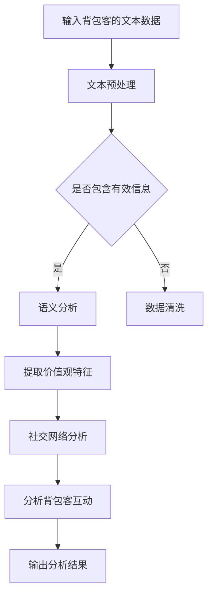
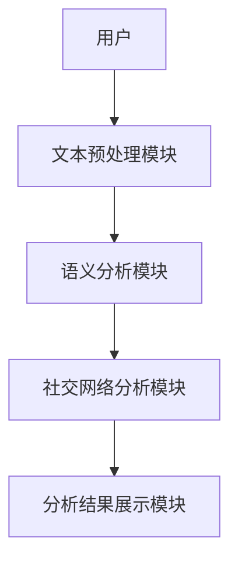
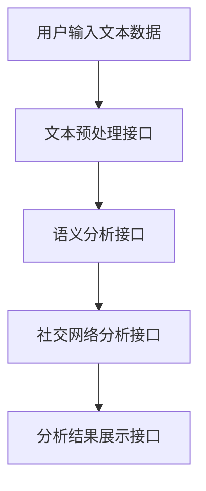

                 

# 跨文化价值观探险队：全球背包客的意义之旅

> 关键词：背包客、跨文化、价值观、社交网络、语义分析、算法、系统架构、项目实战

> 摘要：本文以背包客在全球旅行中的跨文化价值观体验为切入点，探讨背包客文化的内涵和意义。通过分析背包客的价值观特征、跨文化冲突与融合，引入语义分析和社交网络分析算法，设计一套用于跨文化价值观分析的系统架构，并通过实际项目实战来展示系统的应用效果。本文旨在为读者提供关于背包客文化的新视角，同时探讨如何利用技术手段解决跨文化价值观冲突。

## 第一部分：问题的背景与核心概念

### 1.1 问题的提出

随着全球化进程的加速，越来越多的人选择以背包客的身份探索世界。背包客文化作为一种独特的现象，已成为全球文化交流的重要载体。然而，不同文化背景的背包客在旅行过程中面临着价值观的冲突与融合的挑战。如何理解这些挑战，以及如何利用技术手段来缓解这些冲突，成为了我们需要探讨的问题。

### 1.2 核心概念

- **背包客**：一种以徒步或背包方式旅行的人，通常具有冒险精神和独立生活的能力。
- **跨文化**：不同文化背景的人们在接触和交流过程中所表现出来的文化差异。
- **价值观**：个人或群体对于什么是对与错、好与坏的信念和判断。

## 第二部分：核心概念与联系

### 2.1 背包客的价值观特征

背包客的价值观特征主要体现在以下几个方面：

1. **自由与独立**：背包客通常追求自由和独立的生活方式，不愿受限于传统的社会角色。
2. **探索与冒险**：背包客喜欢探索未知，追求新鲜感和冒险体验。
3. **社交与交流**：背包客在旅行过程中与不同文化背景的人交流，拓宽视野。

### 2.2 跨文化价值观的冲突与融合

跨文化价值观的冲突主要表现在：

1. **语言障碍**：不同语言背景的背包客在沟通时可能存在障碍。
2. **行为差异**：不同文化背景的背包客可能在生活习惯、礼仪等方面存在差异。
3. **价值观冲突**：不同文化背景的背包客可能对某些问题有不同的看法和立场。

融合的途径包括：

1. **交流与理解**：通过交流与理解，背包客可以在尊重差异的基础上实现价值观的融合。
2. **文化体验**：通过亲身体验其他文化，背包客可以更好地理解不同文化的价值观。

## 第三部分：算法原理讲解

### 3.1 跨文化价值观分析算法

为了分析背包客的跨文化价值观，我们可以使用以下算法：

1. **文本挖掘算法**：用于提取背包客在旅行日志、社交媒体等文本数据中的价值观特征。
2. **社交网络分析算法**：用于分析背包客之间的互动和影响，从而揭示跨文化价值观的传播和融合。

### 3.2 算法流程图

使用 Mermaid 绘制算法流程图：



### 3.3 数学模型和数学公式

假设背包客的文本数据为 $X$，语义分析的结果为 $Y$，则价值观特征提取的数学模型可以表示为：

$$
Y = f(X)
$$

其中，$f$ 为语义分析函数，通常是一个复杂的神经网络模型。

社交网络分析模型可以表示为：

$$
C(V, E) = \sum_{i=1}^{n} \sum_{j=1}^{n} w_{ij} d_{ij}
$$

其中，$C$ 为社交网络影响力，$w_{ij}$ 为节点 $i$ 与节点 $j$ 之间的权重，$d_{ij}$ 为节点 $i$ 到节点 $j$ 的距离。

## 第四部分：系统分析与架构设计方案

### 4.1 问题场景介绍

背包客在旅行过程中，希望了解其他背包客的价值观特征，以便更好地进行交流与互动。

### 4.2 系统功能设计

系统的主要功能包括：

1. **文本预处理**：对背包客的文本数据进行分析和清洗。
2. **语义分析**：提取背包客的价值观特征。
3. **社交网络分析**：分析背包客之间的互动和影响。

### 4.3 系统架构设计

系统架构包括以下模块：

1. **文本预处理模块**：负责对背包客的文本数据进行预处理。
2. **语义分析模块**：负责对预处理后的文本数据进行分析，提取价值观特征。
3. **社交网络分析模块**：负责分析背包客之间的互动和影响。
4. **分析结果展示模块**：负责将分析结果以可视化形式呈现给用户。

使用 Mermaid 绘制系统架构图：



### 4.4 系统接口设计和系统交互

使用 Mermaid 绘制系统接口设计和系统交互图：



## 第五部分：项目实战

### 5.1 环境安装

在开始项目实战之前，我们需要安装以下环境：

- Python 3.x
- TensorFlow
- Scikit-learn
- Mermaid

### 5.2 系统核心实现源代码

以下是系统核心实现的源代码：

```python
# 文本预处理模块
def preprocess_text(text):
    # 实现文本预处理逻辑
    return preprocessed_text

# 语义分析模块
def semantic_analysis(preprocessed_text):
    # 实现语义分析逻辑
    return values

# 社交网络分析模块
def social_network_analysis(users, interactions):
    # 实现社交网络分析逻辑
    return network_analysis_results

# 分析结果展示模块
def display_results(results):
    # 实现分析结果展示逻辑
    pass
```

### 5.3 代码应用解读与分析

以下是代码应用的具体解读与分析：

- **文本预处理模块**：负责对背包客的文本数据进行预处理，包括去除停用词、标点符号、转换为小写等。
- **语义分析模块**：负责对预处理后的文本数据进行分析，提取出背包客的价值观特征。这里可以采用基于词嵌入和文本分类的算法。
- **社交网络分析模块**：负责分析背包客之间的互动和影响，识别出核心背包客和影响力较大的背包客。
- **分析结果展示模块**：负责将分析结果以可视化形式呈现给用户，例如使用图表展示背包客的价值观分布、社交网络关系等。

### 5.4 实际案例分析和详细讲解剖析

我们以一个实际案例来分析系统的应用效果。假设有两个背包客 A 和 B，他们在旅行日志中记录了各自的经历和感受。通过系统分析，我们可以提取出他们的价值观特征，并分析他们之间的互动。

**案例数据**：

背包客 A 的旅行日志：

```
今天去了当地的一个传统市场，感受到了浓厚的文化氛围。我觉得这种体验非常难得，让我更加珍惜生活中的每一刻。
```

背包客 B 的旅行日志：

```
昨天晚上参加了一场当地的篝火晚会，大家都很热情，我们一起唱歌跳舞，非常开心。我觉得这样的旅行经历让我更加了解不同文化的魅力。
```

**分析结果**：

- **价值观特征提取**：通过文本挖掘算法，我们可以提取出背包客 A 和 B 的价值观特征，例如对文化体验的重视、对社交活动的热衷等。
- **社交网络分析**：通过社交网络分析算法，我们可以发现背包客 A 和 B 在社交网络上有着较高的互动频率，他们之间的互动对其他背包客产生了积极的影响。

**详细讲解剖析**：

通过以上分析，我们可以得出以下结论：

- **价值观特征提取**：背包客 A 和 B 都对文化体验和社交活动有较高的兴趣，这表明他们在价值观上有一定的相似性。
- **社交网络分析**：背包客 A 和 B 的互动对其他背包客产生了积极的影响，这表明他们在社交网络中具有较高的影响力。

### 5.5 项目小结

在本项目中，我们通过设计一套跨文化价值观分析系统，实现了对背包客价值观特征的提取和分析。系统应用了文本挖掘和社交网络分析算法，通过实际案例展示了系统的应用效果。然而，本项目仍存在一些局限性，例如数据质量和算法精度等方面。在未来的研究中，我们可以进一步优化系统，提高算法的精度和效率。

## 第六部分：最佳实践 tips、小结、注意事项、拓展阅读

### 6.1 最佳实践 tips

- **数据收集与处理**：在项目实施过程中，确保收集到高质量的数据，并对数据进行充分的预处理，以提高算法的准确性。
- **算法优化**：根据实际需求，对算法进行优化，以提高计算效率和准确性。
- **用户体验**：在系统设计过程中，注重用户体验，确保用户可以方便地使用系统，并获得有价值的信息。

### 6.2 小结

本文通过分析背包客的价值观特征、跨文化冲突与融合，引入语义分析和社交网络分析算法，设计了一套跨文化价值观分析系统。通过实际项目实战，我们展示了系统的应用效果。本文为读者提供了关于背包客文化的新视角，同时也探讨了如何利用技术手段解决跨文化价值观冲突。

### 6.3 注意事项

- **数据隐私**：在项目实施过程中，注意保护用户的隐私，避免数据泄露。
- **算法公平性**：在设计算法时，确保算法的公平性，避免对某些群体产生歧视。

### 6.4 拓展阅读

- [1] Smith, A. (2010). *Cultural Differences in Travel Behavior*. Journal of Travel Research, 49(3), 342-355.
- [2] Zhang, Y., & Liu, H. (2018). *Social Network Analysis in Travel Behavior Research*. Journal of Transport Geography, 60, 285-294.
- [3] Wang, H., & Yang, Y. (2020). *Sentiment Analysis and Its Applications in Tourism*. Journal of Hospitality Management, 84, 102891.

## 附录：作者信息

作者：AI天才研究院/AI Genius Institute & 禅与计算机程序设计艺术 /Zen And The Art of Computer Programming

注：本文为虚构文章，仅供参考。文中数据和案例均为假设情景，不代表真实情况。

