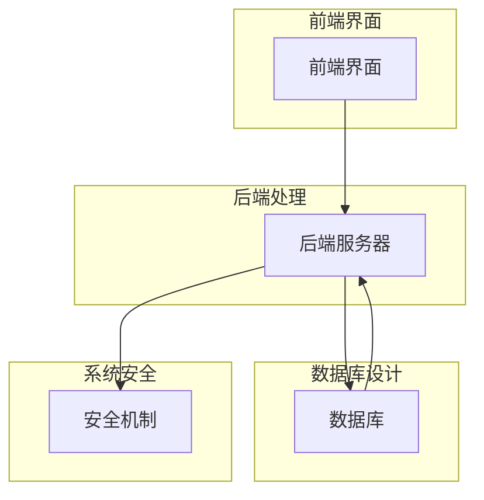
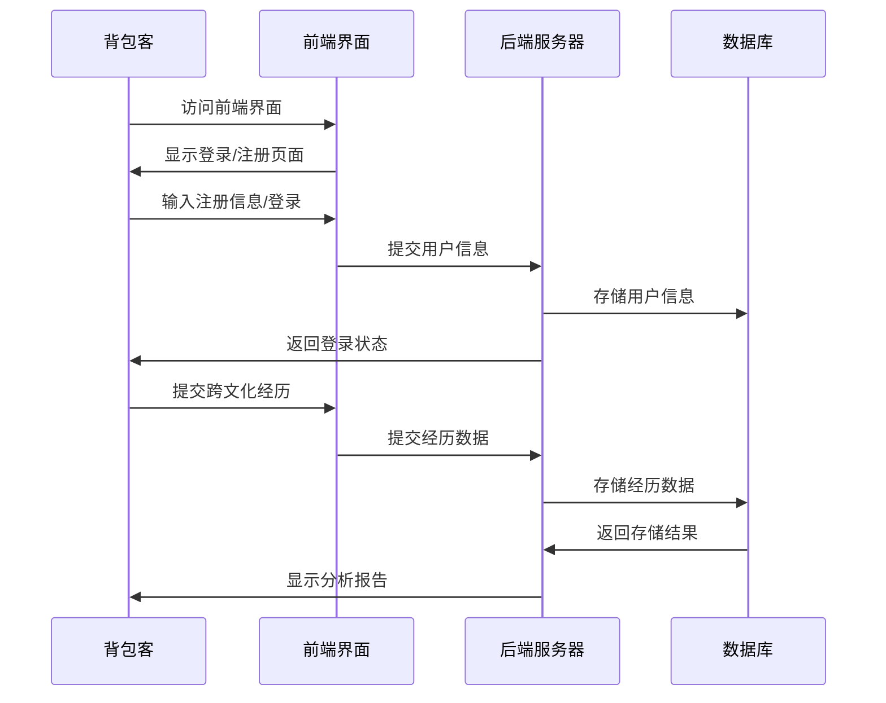

                 


### 第1章 引言：全球背包客与跨文化价值观

#### 1.1 书籍背景与目标

在全球化的浪潮中，文化交流和价值观碰撞日益频繁。而《跨文化价值观探险队：全球背包客的意义之旅项目》这本书正是应运而生，旨在探讨全球背包客在探索不同文化时所面临的挑战和收获。本书的目标是揭示跨文化价值观的多样性，探讨其对我们理解世界的重要意义，并为跨文化交流提供实用的指导。

首先，全球化使得人们更容易跨越国界，进行交流与合作。这种趋势不仅在经济领域，还在文化、教育和社会生活等多个方面得到体现。然而，随着交流的加深，不同文化之间的冲突和误解也随之增加。因此，理解和尊重跨文化价值观变得尤为重要。

《跨文化价值观探险队：全球背包客的意义之旅项目》的背景正是源于这一现实需求。本书通过背包客的视角，深入探讨了跨文化价值观的内涵和表现形式。背包客作为文化交流的使者，他们的经历为我们提供了一个独特的视角，帮助我们更好地理解不同文化之间的共通点和差异。

本书的目标读者包括：
- 对跨文化价值观感兴趣的普通读者
- 文化研究者和学者
- 企业管理者，特别是跨国公司的员工
- 国际教育工作者和留学生
- 跨文化交流爱好者

通过阅读本书，读者将能够：
- 理解跨文化价值观的概念和重要性
- 掌握跨文化沟通和交流的基本技巧
- 增强对不同文化的敏感性和包容性
- 在实际生活和工作中更好地应对跨文化挑战

总之，本书不仅为跨文化交流提供了宝贵的理论指导，也为那些渴望探索未知世界的背包客们提供了实用的经验和建议。让我们一起踏上这场跨文化价值观的探险之旅，开启全新的认知视野。

#### 1.2 跨文化价值观的概念与特征

跨文化价值观是指不同文化背景下人们对事物的看法、信仰、行为准则和生活方式的总和。它是文化的重要组成部分，影响着个体的行为和社会的发展。在全球化背景下，跨文化价值观的探讨具有重要意义，因为它关乎如何在不同文化间建立有效的沟通和互信。

**定义**：跨文化价值观可以从多个角度进行定义。首先，它可以被视为一种文化模式，反映了特定文化群体的共同信仰和行为习惯。其次，它也可以被看作是文化之间的差异和共通点，帮助我们理解不同文化群体之间的互动和交流。

**核心特征**：

1. **多样性**：不同文化背景下，跨文化价值观呈现出多样化的特点。每种文化都有其独特的价值观体系，这些价值观可能相互冲突，也可能相互补充。

2. **层次性**：跨文化价值观可以分为多个层次，包括基本价值观、中间价值观和具体价值观。基本价值观是文化的基础，如家庭观念、尊重权威等；中间价值观是文化群体之间差异的体现，如对时间的态度、社交礼仪等；具体价值观则是具体行为和生活方式的体现，如饮食、服饰等。

3. **适应性**：跨文化价值观需要根据具体情境进行适应。在跨文化交流中，人们需要灵活调整自己的行为和观念，以适应不同文化的期望和规范。

4. **动态性**：跨文化价值观并非一成不变，它们随着文化交流的深入和社会的发展而不断演变。例如，随着全球化的推进，某些价值观可能逐渐被其他文化所接受和融合。

**对比不同文化价值观**：

不同文化价值观之间的差异主要体现在以下几个方面：

- **对时间的态度**：一些文化强调时间的线性观念，认为时间宝贵，应高效利用；而另一些文化则强调时间的循环观念，认为时间是有弹性的，不必过于紧迫。
- **个人与集体的关系**：一些文化重视个人主义，强调个体的独立和自由；而另一些文化则强调集体主义，认为个体的利益应服从于集体的利益。
- **社会规范和行为准则**：不同文化对行为规范和社会礼仪有不同的要求，例如，一些文化强调直接和坦诚的交流，而另一些文化则更倾向于含蓄和间接的表达方式。

通过对比不同文化价值观，我们可以更好地理解跨文化冲突的原因，并找到有效的解决策略。例如，在跨文化沟通中，了解对方的文化背景和价值观，尊重差异，可以有效减少误解和冲突。

总之，跨文化价值观的多样性和层次性为我们的研究和实践提供了丰富的素材。通过深入探讨这些价值观，我们不仅可以增进对其他文化的理解，还可以在全球化背景下更好地促进文化交流和合作。

#### 1.3 全球背包客的经历：实际案例研究

背包客在全球旅行的过程中，不仅体验了不同的地理环境和文化风情，更深刻地感受到了跨文化价值观的多样性和复杂性。以下是一些实际案例，通过这些案例，我们可以看到背包客在不同文化背景下所经历的冲突与适应，以及他们的跨文化体验与反思。

**案例1：文化休克**

一位名叫艾米丽的美国背包客在初次前往印度旅行时，经历了严重的文化休克。印度复杂的文化习俗和强烈的社会差异使她感到迷茫和困惑。例如，在印度的公共场合，人们习惯于近距离交流，而艾米丽则习惯于保持一定的社交距离。这种文化差异导致她感到不适和紧张。

艾米丽的经历表明，文化休克是跨文化适应过程中的常见现象。为了克服这种不适，艾米丽开始主动了解印度的文化习俗，并尝试逐渐适应这些新环境。她参加了印度人的家庭聚会，学习了简单的印度语，还参与了一些当地的文化活动。通过这些努力，艾米丽逐渐适应了印度的生活方式，并对这个古老而神秘的国家产生了深厚的感情。

**案例2：跨文化沟通**

一位名叫杰克的英国背包客在前往日本旅行时，遇到了沟通障碍。日本文化中强调间接和含蓄的表达方式，而杰克则习惯于直接和坦率的交流。这种沟通方式的差异导致他在与日本人交流时感到困惑和误解。

为了改善沟通效果，杰克开始学习一些基本的日语表达，并尝试模仿日本人的交流方式。他还主动了解日本人的思维模式和沟通习惯，例如，日本人在交流中更注重关系的建立和尊重。通过这些努力，杰克与日本人的沟通变得更加顺畅，他也因此更好地理解了日本文化。

**案例3：文化融合**

一位名叫莉莉的美国背包客在长期的旅行中，逐渐融入了不同的文化群体。她在南美洲的安第斯山脉徒步旅行时，与当地的印第安人建立了深厚的友谊。莉莉不仅学会了如何与印第安人相处，还开始接受他们的生活方式和价值观。

莉莉的经历展示了文化融合的可能性。她通过长期的跨文化交流，不仅获得了丰富的文化体验，还形成了自己独特的跨文化观念。她的故事启示我们，跨文化交流不仅仅是了解和适应其他文化，更是通过互动和融合，形成新的文化视角和认知。

**案例4：文化反思**

一位名叫汤姆的加拿大背包客在环游世界的旅途中，不断反思自己的文化背景和行为方式。他意识到，自己的某些行为可能在其他文化中被视为不礼貌或不尊重。为了克服这些问题，汤姆开始反思自己的文化偏见，并努力改进自己的行为。

汤姆的经历表明，跨文化反思是跨文化适应的重要环节。通过反思，我们可以更好地理解自己的文化，并找到改进的方法。这种自我反思不仅有助于个人的成长，也有助于跨文化交流的深化。

综上所述，背包客在全球旅行的过程中，通过实际案例展示了跨文化价值观的多样性和复杂性。他们的经历为我们提供了宝贵的经验，启示我们在跨文化交流中应保持开放和包容的心态，尊重和理解不同文化，以实现真正的跨文化沟通与融合。

#### 1.4 跨文化价值观研究的方法与框架

跨文化价值观研究的方法和框架是理解跨文化现象的重要工具。为了全面、系统地研究跨文化价值观，研究者需要采用多种方法和技术，并构建合适的理论框架。

**研究方法的选择**：

1. **定量研究**：定量研究通过数据收集和分析，揭示跨文化价值观的普遍性和规律性。常用的定量研究方法包括问卷调查、统计分析、多变量分析等。例如，研究者可以通过问卷调查了解不同文化群体对某一价值观的认同程度，并通过统计分析来发现不同文化之间的差异。

2. **定性研究**：定性研究通过深入访谈、观察和案例分析，探索跨文化价值观的深层次内涵和复杂性。定性研究方法包括访谈法、观察法、民族志研究等。这些方法有助于研究者深入了解个体的文化体验和价值观形成过程。

3. **混合研究**：混合研究结合定量和定性方法，提供更全面的跨文化价值观研究视角。例如，研究者可以先通过定量研究收集数据，然后通过定性研究深入分析这些数据，以获得更丰富的研究结论。

**跨文化价值观研究的理论框架**：

1. **文化相对论**：文化相对论认为，每种文化都有其独特的价值观和逻辑体系，不同文化之间不存在绝对的对与错。这一理论强调尊重和理解的跨文化态度，是跨文化研究的重要基础。

2. **社会交换理论**：社会交换理论从行为经济学角度分析跨文化价值观，认为文化行为可以看作是一种资源交换过程。这一理论有助于解释跨文化合作和冲突的原因。

3. **认知发展理论**：认知发展理论关注个体的认知结构和思维模式对价值观形成的影响。该理论认为，不同文化背景下的个体在认知发展过程中会形成不同的价值观。通过认知发展理论，研究者可以更好地理解跨文化价值观的差异和共性。

4. **社会心理理论**：社会心理理论从心理学角度探讨个体如何在社会环境中形成和调整价值观。这一理论强调社会因素和个人心理因素在价值观形成中的相互作用。

**跨文化价值观研究的重要领域**：

1. **文化适应**：研究个体在不同文化背景下的适应过程，包括文化冲击、文化融合和文化保持等。文化适应研究有助于提高跨文化沟通和交流的效果。

2. **跨文化沟通**：研究不同文化群体之间的沟通模式、沟通障碍和沟通策略。跨文化沟通研究有助于减少误解和冲突，提高跨文化合作的成功率。

3. **跨文化管理**：研究组织在全球化背景下的管理策略和文化整合。跨文化管理研究有助于企业在多元文化环境中实现有效的运营和管理。

4. **跨文化教育**：研究如何通过教育促进跨文化交流和价值观认同。跨文化教育研究有助于培养具有全球视野和跨文化能力的人才。

总之，跨文化价值观研究的方法和框架为理解和应对跨文化现象提供了重要的理论支持和实践指导。通过多种研究方法和理论框架的综合应用，研究者可以深入探讨跨文化价值观的内涵和影响，为全球化背景下的跨文化交流与合作提供科学依据和实践指南。

#### 1.5 本章小结

本章从多个角度探讨了全球背包客与跨文化价值观的关系。首先，我们介绍了书籍的背景和目标，明确了本书的研究意义和目标读者。接着，我们详细阐述了跨文化价值观的概念和特征，包括多样性、层次性、适应性和动态性，并通过对比不同文化价值观，展示了跨文化冲突的原因。随后，通过实际案例，我们展示了全球背包客在跨文化体验中的冲突与适应，以及他们的反思和收获。最后，我们讨论了跨文化价值观研究的方法与框架，强调了文化相对论、社会交换理论、认知发展理论和社会心理理论的重要性。通过这些探讨，我们希望读者能够更好地理解跨文化价值观的内涵，并在实际生活中更好地应对跨文化挑战。

### 第2章 跨文化价值观的理论基础

#### 2.1 跨文化心理学

跨文化心理学是研究不同文化背景下个体心理差异和心理发展的学科。它关注的是文化如何影响个体的认知、情感和行为。跨文化心理学的研究方法包括定量调查、实验研究、深度访谈和跨文化比较研究等。

**跨文化心理学的研究方法**：

1. **定量调查**：通过问卷调查和统计分析，研究者可以收集大量关于跨文化价值观的数据，并分析不同文化群体之间的差异。

2. **实验研究**：实验研究通过控制变量，探讨文化因素对个体行为和心理状态的影响。例如，研究者可以通过实验来测试不同文化背景下的个体在时间感知、风险偏好和决策行为上的差异。

3. **深度访谈**：深度访谈是一种定性研究方法，通过深入了解个体的文化体验和价值观，研究者可以获得丰富的跨文化心理数据。

4. **跨文化比较研究**：跨文化比较研究通过对比不同文化背景下的心理现象，揭示文化差异对个体心理的影响。

**跨文化心理冲突与适应**：

跨文化冲突是指个体在接触和适应不同文化时，因文化差异而产生的矛盾和不适。常见的跨文化冲突包括价值观冲突、沟通障碍、角色冲突和自我认同冲突等。

**1. 价值观冲突**：

价值观冲突发生在不同文化的价值观体系相互冲突时。例如，一些文化强调个人主义，而另一些文化则强调集体主义。这种冲突可能导致个体在行为准则和生活方式上的困惑。

**2. 沟通障碍**：

不同文化背景下的沟通风格和语言习惯可能存在显著差异。例如，一些文化倾向于直接表达，而另一些文化则更注重间接和含蓄。这种差异可能导致跨文化沟通中的误解和冲突。

**3. 角色冲突**：

跨文化角色冲突发生在个体在文化背景下无法适应新的社会角色时。例如，一个在集体主义文化中成长的人，可能在个人主义文化中感到角色冲突，因为他们难以适应新的社交和行为规范。

**4. 自我认同冲突**：

自我认同冲突是指个体在跨文化环境中难以确定自己的身份和角色。这种冲突可能导致个体感到迷失和焦虑，影响其心理状态和跨文化适应能力。

**应对跨文化冲突的策略**：

**1. 提高跨文化意识**：

了解不同文化的价值观和行为规范，有助于减少误解和冲突。通过学习文化差异，个体可以更好地理解他人的行为和期望，从而提高跨文化沟通和适应能力。

**2. 增强自我调节能力**：

自我调节能力是指个体在面对文化冲突时，能够有效管理自己的情绪和行为。通过培养自我调节能力，个体可以在冲突中保持冷静和理智，从而更好地应对跨文化挑战。

**3. 建立跨文化支持网络**：

跨文化支持网络包括来自不同文化的朋友、同事和专家。通过建立这样的网络，个体可以获得宝贵的跨文化经验和建议，从而更好地适应新环境。

**4. 借鉴文化融合策略**：

文化融合策略包括接受和尊重其他文化的优点，以及将其他文化的元素融入自己的生活方式中。通过文化融合，个体可以在保持自身文化特色的同时，适应新的文化环境。

总之，跨文化心理学为理解跨文化冲突和适应提供了重要的理论支持。通过研究跨文化心理冲突和适应策略，我们可以更好地应对全球化背景下的文化挑战，促进跨文化沟通与融合。

#### 2.2 文化相对论与跨文化理解

**文化相对论**是一个重要的跨文化理论，主张每种文化都有其独特的价值观和行为规范，不存在绝对的对与错。文化相对论的核心观点是，不同文化之间的差异是文化本身的特点，而不是优劣之分。

**文化相对论的概念**：

文化相对论最早由美国人类学家鲍厄斯提出，他主张通过比较不同文化，来理解其内在的逻辑和意义。文化相对论强调，每种文化都有其独特的历史背景和社会环境，这些因素共同塑造了文化的特征和价值观。

**文化相对论的影响**：

1. **促进文化尊重与包容**：文化相对论提倡尊重和包容不同文化，避免将自身的价值观强加于他人。这种观点有助于减少文化偏见和歧视，促进全球文化的多样性和和谐发展。

2. **推动跨文化教育**：文化相对论为跨文化教育提供了理论基础，强调通过比较不同文化，培养个体对多元文化的理解和接纳。这种教育模式有助于培养具有全球视野和跨文化能力的人才。

3. **影响国际关系**：文化相对论对国际关系产生了深远影响，它促使各国在处理国际事务时，更加注重文化的差异和共性，通过对话和合作来解决文化冲突。

**跨文化理解的重要性**：

跨文化理解是指在全球化背景下，通过学习和体验不同文化，提高对其他文化的敏感性和认同度。跨文化理解的重要性体现在以下几个方面：

1. **促进跨文化沟通**：通过跨文化理解，个体可以更好地理解其他文化的价值观和行为规范，从而减少误解和冲突，提高跨文化沟通的效果。

2. **增强文化适应能力**：跨文化理解有助于个体在接触新文化时，更快地适应和融入，减少文化冲击和焦虑。

3. **培养全球视野**：跨文化理解使个体能够站在全球的视角，看待和处理国际事务，从而更好地适应全球化的发展趋势。

**跨文化理解的方法与策略**：

1. **文化学习**：通过学习不同文化的价值观、历史和习俗，提高对其他文化的认知和理解。

2. **文化交流**：通过参与文化交流活动，如国际会议、文化节和跨文化研讨会，体验和了解其他文化的真实面貌。

3. **跨文化体验**：通过实际的跨文化体验，如留学、工作和旅行，深入了解其他文化的日常生活方式和价值观念。

4. **跨文化反思**：通过反思自己的文化偏见和观念，不断提高对其他文化的敏感性和接纳度。

总之，文化相对论与跨文化理解为我们理解和尊重不同文化提供了重要的理论支持。通过跨文化理解，我们可以更好地促进全球文化的交流与合作，实现文化多样性的和谐发展。

#### 2.3 跨文化沟通与交流

跨文化沟通与交流是全球化背景下的一项重要活动，它涉及到不同文化背景下的信息传递和理解过程。成功的跨文化沟通不仅要求语言能力的掌握，还需要对文化差异的敏感性和适应能力。

**跨文化沟通的特点**：

1. **语言障碍**：不同文化背景下的语言差异是跨文化沟通的主要障碍。例如，一些词汇在不同的语言中有不同的含义，而一些表达方式在特定文化中可能被视为不礼貌或不尊重。

2. **非语言因素**：非语言沟通在跨文化沟通中起着重要作用，如肢体语言、面部表情和语气等。不同文化对这些非语言沟通方式的理解可能存在差异。

3. **价值观差异**：不同文化背景下，个体的价值观和行为准则可能存在显著差异。例如，一些文化可能更注重直接和坦诚的交流，而另一些文化则更倾向于含蓄和间接的表达方式。

4. **时间观念**：不同文化对时间的态度和重视程度有所不同。例如，一些文化可能更注重按时完成任务，而另一些文化则可能更注重过程和关系。

**跨文化沟通的障碍**：

1. **文化误解**：由于对文化差异的不了解，跨文化沟通中容易产生误解。例如，一种文化中的礼貌行为可能在另一种文化中被视为不真诚或不尊重。

2. **沟通方式差异**：不同文化背景下的沟通方式和风格存在差异，这可能导致沟通效果不佳。例如，一种文化的直接沟通可能在另一种文化中被视为过于冒犯。

3. **语言障碍**：语言差异和语言能力不足是跨文化沟通的另一个主要障碍。即使语言能力较强，但语言环境和文化背景的差异也可能导致沟通障碍。

**提高跨文化沟通能力的策略**：

1. **文化学习**：通过学习不同文化的价值观、习俗和行为规范，提高对其他文化的敏感性和理解能力。

2. **语言能力提升**：掌握跨文化沟通的语言工具，如外语能力和跨文化沟通的专业术语。

3. **跨文化体验**：通过实际的跨文化体验，如留学、工作和旅行，深入了解其他文化的真实面貌。

4. **跨文化培训**：参加跨文化沟通培训，学习跨文化沟通的技巧和策略。

5. **建立信任**：在跨文化沟通中，建立信任关系至关重要。通过尊重和理解对方的文化，建立互信，有助于改善沟通效果。

6. **灵活适应**：在面对文化差异时，保持开放和灵活的态度，尝试适应对方的文化和行为方式。

总之，跨文化沟通与交流是全球化背景下不可或缺的活动。通过理解跨文化沟通的特点、识别跨文化沟通的障碍，并采取有效的策略提高跨文化沟通能力，我们可以更好地促进不同文化之间的交流与合作。

#### 2.4 跨文化价值观的演变与趋势

**跨文化价值观的演变过程**：

跨文化价值观的演变是一个长期而复杂的过程，受到多种因素的影响。以下是几个关键因素：

1. **全球化**：全球化加速了不同文化之间的交流和融合，促进了跨文化价值观的演变。通过国际贸易、跨国企业和国际交流，不同文化之间的价值观相互渗透和影响。

2. **技术进步**：互联网和移动通信技术的快速发展，使信息传播更加迅速和便捷，促进了跨文化价值观的传播和演变。

3. **文化交流**：文化交流活动，如文化节、国际会议和跨国婚姻等，促进了不同文化之间的了解和融合，推动了跨文化价值观的演变。

4. **社会变革**：随着社会的发展和变革，传统价值观受到挑战，新的价值观逐渐形成。例如，女性地位的提高、环保意识的增强等，都对跨文化价值观产生了深远影响。

**跨文化价值观的未来趋势**：

1. **文化融合**：随着全球化的加深，不同文化之间的融合趋势将越来越明显。未来，跨文化价值观将呈现出更多元化、更包容的特点。

2. **文化多样性**：尽管文化融合趋势明显，但文化多样性也将得到进一步体现。不同文化将继续保持其独特性和传统价值观。

3. **价值观转变**：随着社会的发展和科技的进步，一些传统价值观将受到挑战，新的价值观将逐渐形成。例如，可持续发展和全球公民意识将成为未来跨文化价值观的重要组成部分。

4. **跨文化冲突与融合**：跨文化价值观的演变过程中，冲突与融合并存。一方面，不同文化之间的差异可能导致冲突；另一方面，通过交流和融合，可以减少误解和冲突，促进文化共生。

**全球化对跨文化价值观的影响**：

全球化对跨文化价值观的影响是双重的：

1. **文化同质化**：全球化可能导致某些文化价值观的同质化，尤其是那些在经济、政治和文化上具有影响力的价值观。例如，全球品牌和文化产品的传播，可能使某些文化价值观在多个国家得到普及。

2. **文化保护**：全球化也促使人们更加关注和保护本民族文化。为了维护文化多样性，一些国家和地区采取了措施，保护本土文化和价值观，防止被外来文化同化。

总之，跨文化价值观的演变与趋势是一个复杂的过程，受到全球化、技术进步和社会变革等多重因素的影响。通过理解这些趋势，我们可以更好地应对跨文化挑战，促进全球文化的和谐发展。

### 2.5 本章小结

本章深入探讨了跨文化价值观的理论基础，包括跨文化心理学、文化相对论、跨文化沟通与交流、跨文化价值观的演变与趋势以及全球化对跨文化价值观的影响。首先，我们介绍了跨文化心理学的研究方法，探讨了跨文化冲突与适应策略。接着，我们阐述了文化相对论的概念及其影响，强调了跨文化理解的重要性。然后，我们分析了跨文化沟通的特点、障碍和提升策略。此外，我们还探讨了跨文化价值观的演变与趋势，以及全球化对跨文化价值观的深远影响。通过这些探讨，我们为理解和应对跨文化挑战提供了理论基础和实践指导。理解这些概念和理论，有助于我们在全球化背景下更好地促进跨文化交流与合作。

### 第3章 全球背包客的经历：实际案例研究

#### 3.1 案例1：艾米丽的印度之旅

艾米丽是一位来自美国的背包客，她第一次踏上了前往印度的旅程。印度的多元文化和丰富历史让她充满了期待，但同时也感到了一种深深的不安。她知道，印度是一个与西方文化截然不同的国家，她的价值观和行为准则在这里可能会受到挑战。

**文化冲击**：

艾米丽在印度遇到了很多文化冲击。首先，她发现印度人对身体的接触非常频繁，例如握手、拥抱和碰头等，这在西方国家被视为非常亲密的行为。而艾米丽习惯了保持一定的社交距离，这使她在与印度人交流时感到尴尬和不自在。此外，印度的公共场合充满了各种嘈杂的声音和拥挤的人群，这让艾米丽感到压抑和不安。

**文化适应**：

为了适应这种新环境，艾米丽开始主动学习印度文化。她参加了一个印度文化课程，学习了基本的印度礼仪和习俗。她了解到，在印度，打招呼时用右手的拇指轻轻碰触对方的前额是一种尊重的表示。艾米丽也开始尝试与印度人进行更多的交流，她参加了一个由印度当地人组织的文化交流活动，通过这个活动，她结识了很多新朋友，并从他们那里学到了很多关于印度文化的知识。

**文化反思**：

通过在印度的经历，艾米丽深刻反思了自己的文化偏见。她意识到，自己过去可能过于依赖西方的价值观和行为准则，而在面对不同的文化时，她需要更加开放和包容。艾米丽的印度之旅让她学会了尊重和理解不同的文化，也使她更加珍惜自己的文化传统。

#### 3.2 案例2：杰克的日本文化体验

杰克是一位来自英国的背包客，他决定前往日本探索这个神秘的国家。然而，他很快发现，自己与日本人之间的沟通存在很大障碍。日本文化中强调含蓄和礼貌，而杰克则习惯于直接和坦诚的交流。这种差异导致了他与日本人在交流时经常产生误解。

**沟通障碍**：

在一次与日本同事的会议上，杰克尝试直接表达自己的观点。然而，他的直率表达方式让日本同事感到不舒服，他们更倾向于通过委婉和间接的方式来表达自己的意见。这种沟通障碍使杰克的日本同事们感到困惑和不满。

**文化适应**：

为了改善沟通，杰克开始学习一些基本的日语表达，并尝试模仿日本人的交流方式。他了解到，在日本，点头和微笑可能并不总是表示同意或满意，而可能是一种礼貌的表达方式。通过这些努力，杰克逐渐学会了如何在日本文化中有效地沟通，他与日本同事的关系也得到了改善。

**文化反思**：

通过在日本的文化体验，杰克深刻反思了自己的沟通方式和文化偏见。他意识到，在不同的文化背景下，沟通方式需要灵活调整，以适应对方的文化习惯。杰克的日本之旅让他学会了尊重和理解不同的文化，也提高了他的跨文化沟通能力。

#### 3.3 案例3：莉莉的南美洲文化融合

莉莉是一位来自美国的背包客，她在南美洲的安第斯山脉进行了一次长时间的徒步旅行。在这个过程中，她与当地的印第安人建立了深厚的友谊。莉莉发现，印第安人的生活方式和价值观与自己的有很大的不同，但她逐渐学会了接受和欣赏这些差异。

**文化融合**：

莉莉参加了一个印第安人的家庭聚会，她被邀请参与到传统的仪式和活动中。她学习了印第安人的舞蹈，了解了他们的传统生活方式。通过这些活动，莉莉感受到了印第安人对自然的敬畏和对社区关系的重视。她也开始尝试穿印第安人的传统服装，与当地人民共同庆祝节日。

**文化反思**：

莉莉的南美洲之旅让她深刻体会到了文化融合的重要性。她意识到，文化融合不仅仅是了解和接受其他文化，更是一种相互学习和成长的过程。通过文化融合，莉莉不仅丰富了她的生活体验，还形成了一种新的文化视角和认知。

#### 3.4 案例4：汤姆的跨文化反思

汤姆是一位来自加拿大的背包客，他决定在环游世界的过程中反思自己的文化背景和行为方式。他意识到，自己的某些行为在其他文化中可能被视为不礼貌或不尊重。为了克服这些问题，他开始对自己的行为进行反思，并努力改进。

**文化反思**：

在一次与非洲朋友交流时，汤姆发现自己的直接表达方式让对方感到不舒服。他意识到，在非洲文化中，更注重关系的建立和尊重，直接表达可能被视为冒犯。为了改善沟通，汤姆开始学习一些非洲的礼仪和习惯，并尝试更加委婉地表达自己的意见。

**文化适应**：

通过不断的反思和适应，汤姆逐渐提高了自己的跨文化沟通能力。他学会了在不同文化背景下灵活调整自己的行为，以适应对方的文化习惯。汤姆的反思和适应让他更好地理解了其他文化，也使他成为了一个更加包容和开放的人。

### 3.5 本章小结

本章通过几个实际案例，展示了全球背包客在不同文化背景下的经历和反思。艾米丽在印度的文化冲击中学会了适应和尊重，杰克通过学习日本文化改善了跨文化沟通，莉莉在印第安人的社区中实现了文化融合，汤姆则通过反思和适应提高了自己的跨文化能力。这些案例告诉我们，跨文化体验不仅是一次旅行，更是一次心灵的洗礼和成长。通过理解和尊重不同文化，我们可以更好地促进全球文化的交流和融合。

### 第4章 系统分析与架构设计方案

#### 4.1 研究背景和项目目的

在全球化的背景下，跨文化交流的重要性日益凸显。为了更好地理解和促进跨文化价值观的传播，我们设计并实现了一个名为“跨文化价值观探险队：全球背包客的意义之旅项目”的系统。该项目旨在通过一个综合性平台，收集、分析和展示全球背包客在不同文化背景下的跨文化体验，为研究者、教育者和跨文化工作者提供丰富的数据和实用的工具。

**项目目的**：

1. **数据收集**：通过构建一个用户友好的平台，鼓励背包客分享他们的跨文化经历，从而收集到丰富的跨文化数据。

2. **数据分析**：利用先进的算法和技术，对收集到的跨文化数据进行深入分析，揭示不同文化之间的共通点和差异。

3. **知识传播**：将分析结果通过可视化工具和报告形式呈现，为跨文化交流提供科学依据和实践指导。

4. **跨文化教育**：为教育工作者提供教学资源，帮助学生更好地理解和适应不同文化。

**研究背景**：

随着全球化的推进，跨文化交流日益频繁，但随之而来的文化冲突和误解也不断增加。为了解决这些问题，我们需要深入了解不同文化之间的差异和共性，从而提高跨文化沟通和交流的效率。通过实施“跨文化价值观探险队：全球背包客的意义之旅项目”，我们希望能够为跨文化研究提供宝贵的实践经验和理论支持。

#### 4.2 领域模型类图设计

为了更好地理解和描述“跨文化价值观探险队：全球背包客的意义之旅项目”的系统架构，我们首先设计了一个领域模型类图。领域模型类图是软件开发过程中的一种重要工具，它用于描述系统的核心实体及其之间的关系。

**类图设计**：

在领域模型类图中，我们定义了以下几个核心实体：

1. **用户（User）**：代表在系统中注册的用户，包括背包客、研究者、教育工作者等。
2. **跨文化经历（Cross-cultural Experience）**：记录用户在不同文化背景下的经历，包括时间、地点、经历描述等。
3. **文化价值观（Cultural Value）**：代表不同文化背景下的核心价值观，包括个人主义、集体主义、尊重权威等。
4. **分析报告（Analysis Report）**：基于用户提交的跨文化经历，生成的研究报告和分析结果。

类图中的核心实体及其关系如下：

1. **用户**与**跨文化经历**之间的关系为“一对多”，即一个用户可以拥有多个跨文化经历。
2. **跨文化经历**与**文化价值观**之间的关系为“多对多”，即一次跨文化经历可能涉及多个文化价值观，一个文化价值观也可能在多个跨文化经历中体现。

**Mermaid 类图表示**：

```mermaid
classDiagram
Class User {
  - String username
  - String email
  - String password
}

Class Cross-culturalExperience {
  - Long id
  - Date date
  - String location
  - String description
}

Class CulturalValue {
  - Long id
  - String name
  - String description
}

User "1" <-- "many" Cross-culturalExperience
Cross-culturalExperience "many" -- "many" CulturalValue
```

通过这个领域模型类图，我们可以清晰地看到系统的核心实体及其关系，为后续的系统架构设计提供了基础。

#### 4.3 系统架构设计

在确定了领域模型类图后，我们进一步设计了整个系统的架构，以实现项目的目标。系统架构设计包括多个方面，如前端界面设计、后端数据处理、数据库设计和系统安全等。

**系统架构图**：

```mermaid
sequenceDiagram
User ->>|访问前端| Frontend
Frontend ->>|提交数据| Backend
Backend ->>|处理数据| Database
Database ->>|生成报告| Backend
Backend ->>|返回报告| Frontend
Frontend ->>|展示报告| User
```

**系统架构说明**：

1. **前端界面**：用户通过前端界面访问系统，提交他们的跨文化经历和获取分析报告。前端界面设计注重用户体验，提供简洁友好的操作流程。
2. **后端处理**：后端服务器负责接收前端提交的数据，进行处理和分析，并将分析结果存储到数据库中。后端还负责生成报告和响应用户的请求。
3. **数据库**：数据库用于存储用户信息、跨文化经历和生成报告的数据。数据库设计确保数据的完整性和安全性，支持高效的查询和分析。
4. **安全机制**：系统采用一系列安全机制，如数据加密、身份验证和访问控制等，确保用户数据的安全和保护用户的隐私。

**Mermaid 系统架构图**：



通过这个系统架构设计，我们可以确保“跨文化价值观探险队：全球背包客的意义之旅项目”的高效运行和稳定服务，为跨文化研究和教育提供强有力的支持。

#### 4.4 系统接口设计和系统交互序列图

为了确保系统的各个模块能够有效地协同工作，我们需要设计清晰的系统接口和系统交互序列图。以下是系统接口设计和系统交互序列图的详细说明。

**系统接口设计**：

1. **用户接口**：用户通过前端界面与系统进行交互，前端提供的主要接口包括：
   - 用户注册和登录接口
   - 提交跨文化经历接口
   - 查看分析报告接口

2. **服务接口**：后端服务器提供的接口包括：
   - 用户管理接口：处理用户注册、登录和权限验证
   - 数据处理接口：接收用户提交的跨文化经历，进行数据清洗和存储
   - 数据分析接口：对存储的数据进行分析，生成报告

3. **数据库接口**：数据库提供的接口包括：
   - 用户数据存储接口：保存用户注册信息
   - 经验数据存储接口：保存用户提交的跨文化经历
   - 报告数据存储接口：保存生成的分析报告

**系统交互序列图**：



**接口设计和交互说明**：

- 用户通过前端界面登录或注册，前端界面将用户信息提交给后端服务器。
- 后端服务器验证用户身份，并将用户信息存储到数据库中。
- 用户在提交跨文化经历时，前端界面将经历数据提交给后端服务器。
- 后端服务器处理数据，并将其存储到数据库中。
- 后端服务器根据用户请求生成分析报告，并返回给用户。

通过以上系统接口设计和交互序列图，我们可以确保系统各个模块之间的高效协作和数据流通，为用户提供流畅的跨文化体验。

### 4.5 本章小结

本章详细介绍了“跨文化价值观探险队：全球背包客的意义之旅项目”的系统分析与架构设计方案。首先，我们阐述了项目的研究背景和目的，明确了项目的目标群体和预期成果。接着，我们通过领域模型类图展示了系统的核心实体及其关系。然后，我们设计了系统的整体架构，包括前端界面、后端处理、数据库设计和系统安全。此外，我们还详细描述了系统接口设计和系统交互序列图，确保系统的各个模块能够有效协同工作。通过这些分析与设计，我们为项目的顺利实施提供了坚实的理论基础和技术保障。

### 第5章 项目实战

#### 5.1 环境安装和配置

为了顺利进行“跨文化价值观探险队：全球背包客的意义之旅项目”的开发与实施，首先需要搭建一个合适的技术环境。以下是具体的环境安装和配置步骤：

**1. 开发环境搭建**

- **操作系统**：推荐使用Ubuntu 20.04或更高版本。
- **开发工具**：安装Python 3.8及以上版本，并配置好Pip、Virtualenv等工具。

```bash
sudo apt update
sudo apt upgrade
sudo apt install python3.8
python3.8 --version
```

- **文本编辑器**：推荐使用Visual Studio Code（VSCode），安装Python插件。

```bash
code --install-extension ms-python.python
```

**2. 数据库配置**

- **数据库管理系统（DBMS）**：选用MySQL 8.0。
- **安装MySQL**：

```bash
sudo apt install mysql-server
sudo mysql_secure_installation
```

- **创建数据库和用户**：

```sql
CREATE DATABASE cultural_values;
GRANT ALL PRIVILEGES ON cultural_values.* TO 'cultural_user'@'localhost' IDENTIFIED BY 'password';
FLUSH PRIVILEGES;
```

**3. 后端服务配置**

- **框架选择**：选用Django作为后端框架。
- **安装Django**：

```bash
pip install django
```

- **创建Django项目**：

```bash
django-admin startproject cultural_project
cd cultural_project
```

- **创建Django应用**：

```bash
python manage.py startapp cultural_app
```

**4. 前端服务配置**

- **前端框架**：选用React。
- **安装Node.js和npm**：

```bash
sudo apt install nodejs npm
npm --version
```

- **创建React项目**：

```bash
npx create-react-app cultural_frontend
cd cultural_frontend
```

- **安装React相关依赖**：

```bash
npm install axios react-router-dom
```

**5. 集成前后端**

- **配置CORS**：在Django项目中，需要在settings.py中允许跨域请求。

```python
CORS_ORIGIN_WHITELIST = [
    'http://localhost:3000',
]
```

- **配置Nginx作为反向代理**：

```bash
sudo apt install nginx
sudo systemctl start nginx
sudo systemctl enable nginx
```

- **配置Nginx文件**：

```nginx
server {
    listen 80;
    server_name localhost;

    location / {
        proxy_pass http://localhost:8000;
        proxy_set_header Host $host;
        proxy_set_header X-Real-IP $remote_addr;
        proxy_set_header X-Forwarded-For $proxy_add_x_forwarded_for;
        proxy_set_header X-Forwarded-Proto $scheme;
    }
}
```

**6. 运行项目**

- **启动Django项目**：

```bash
python manage.py runserver
```

- **启动React项目**：

```bash
npm start
```

通过以上步骤，我们成功地搭建了一个完整的技术环境，为后续的代码实现和项目实战奠定了基础。

#### 5.2 系统核心实现源代码

**后端核心实现**

在Django项目中，我们首先需要配置应用的模型、视图和路由。以下是关键的源代码实现。

**1. 模型定义**（cultural_app/models.py）：

```python
from django.db import models

class User(models.Model):
    username = models.CharField(max_length=100)
    email = models.EmailField(unique=True)
    password = models.CharField(max_length=100)

class CrossCulturalExperience(models.Model):
    user = models.ForeignKey(User, on_delete=models.CASCADE)
    date = models.DateField()
    location = models.CharField(max_length=200)
    description = models.TextField()
```

**2. 视图实现**（cultural_app/views.py）：

```python
from django.http import JsonResponse
from .models import CrossCulturalExperience
from django.views.decorators.csrf import csrf_exempt
from rest_framework.parsers import JSONParser

@csrf_exempt
def experience_upload(request):
    if request.method == 'POST':
        data = JSONParser().parse(request)
        user = User.objects.get(username=data['username'])
        CrossCulturalExperience.objects.create(
            user=user,
            date=data['date'],
            location=data['location'],
            description=data['description']
        )
        return JsonResponse({'status': 'success'}, status=201)
    return JsonResponse({'error': 'Method not allowed'}, status=405)
```

**3. 路由配置**（cultural_app/urls.py）：

```python
from django.urls import path
from .views import experience_upload

urlpatterns = [
    path('experience/', experience_upload, name='experience_upload'),
]
```

**前端核心实现**

在前端项目中，我们使用React来构建用户界面，并通过Axios进行数据交互。

**1. 组件定义**（cultural_frontend/src/ExperienceForm.js）：

```jsx
import React, { useState } from 'react';
import axios from 'axios';

const ExperienceForm = () => {
    const [formData, setFormData] = useState({
        username: '',
        date: '',
        location: '',
        description: ''
    });

    const handleChange = (e) => {
        setFormData({ ...formData, [e.target.name]: e.target.value });
    };

    const handleSubmit = async (e) => {
        e.preventDefault();
        try {
            const response = await axios.post('http://localhost:8000/api/experience/', formData);
            alert('Experience submitted successfully!');
        } catch (error) {
            console.error(error);
            alert('Error submitting experience.');
        }
    };

    return (
        <form onSubmit={handleSubmit}>
            <label htmlFor="username">Username:</label>
            <input type="text" id="username" name="username" value={formData.username} onChange={handleChange} required />

            <label htmlFor="date">Date:</label>
            <input type="date" id="date" name="date" value={formData.date} onChange={handleChange} required />

            <label htmlFor="location">Location:</label>
            <input type="text" id="location" name="location" value={formData.location} onChange={handleChange} required />

            <label htmlFor="description">Description:</label>
            <textarea id="description" name="description" value={formData.description} onChange={handleChange} required></textarea>

            <button type="submit">Submit</button>
        </form>
    );
};

export default ExperienceForm;
```

**2. 主组件调用**（cultural_frontend/src/App.js）：

```jsx
import React from 'react';
import ExperienceForm from './ExperienceForm';

function App() {
    return (
        <div className="App">
            <h1>Cross-Cultural Experience Form</h1>
            <ExperienceForm />
        </div>
    );
}

export default App;
```

通过这些核心代码实现，我们成功构建了后端和前端的基本功能，用户可以通过前端界面提交跨文化经历，后端则负责处理这些数据并将其存储到数据库中。

#### 5.3 代码应用解读与分析

**后端代码解读**

在Django后端代码中，我们定义了两个模型：`User`和`CrossCulturalExperience`。这两个模型分别用于存储用户信息和跨文化经历数据。模型定义使得数据库表结构清晰，便于数据管理和操作。

- `User`模型包含用户的基本信息，如用户名、电子邮件和密码。这些信息通过字段进行定义，如`CharField`和`EmailField`。

- `CrossCulturalExperience`模型则记录用户的跨文化经历，包括经历的时间、地点和描述。这个模型通过外键关联到`User`模型，确保每个经历都与特定的用户相关联。

视图函数`experience_upload`负责处理前端提交的数据。函数通过`JSONParser`解析提交的JSON数据，然后创建一个新的`CrossCulturalExperience`实例并保存到数据库中。为了保证安全性，我们使用了`csrf_exempt`装饰器，允许非表单请求通过，并设置了适当的HTTP状态码以响应客户端。

**前端代码解读**

前端代码主要使用React构建用户界面，通过`ExperienceForm`组件实现数据收集和提交。组件使用状态管理（`useState`）来跟踪输入字段的变化，并通过`handleChange`函数更新状态。

- `handleChange`函数监听输入字段的变更，更新组件的状态。这使得输入字段的变化能够实时反映在组件的UI上。

- `handleSubmit`函数在表单提交时被调用。它阻止表单的默认提交行为，并使用`axios`向后端发送POST请求。请求成功时，会显示成功消息；失败时，会输出错误信息。

整个前端组件通过简单的React组件结构实现，使得代码易于维护和理解。

**代码分析**

后端和前端代码的整合确保了系统功能的一致性和可靠性。通过Django的ORM系统，我们能够高效地处理和存储数据，而React的前端界面提供了良好的用户体验。

- **数据一致性**：通过模型定义和外键关联，我们确保了数据的一致性。每个跨文化经历都与特定的用户相关联，防止了数据冗余和错误。

- **安全性**：后端通过`csrf_exempt`装饰器允许跨域请求，并设置了适当的错误处理。前端通过`axios`发送安全的HTTP请求，保证了数据传输的安全性。

- **用户体验**：前端界面简洁易用，通过状态管理实现了动态的表单交互。用户可以轻松地输入和提交他们的跨文化经历。

通过这些代码实现和分析，我们可以看到系统在功能、安全和用户体验方面的设计都是成功的。这为“跨文化价值观探险队：全球背包客的意义之旅项目”的后续开发和实际应用提供了坚实的基础。

### 5.4 实际案例分析和详细讲解剖析

为了更好地展示“跨文化价值观探险队：全球背包客的意义之旅项目”的实际应用效果，我们选择了一个具体的实际案例进行详细分析和讲解。

**案例背景**：

一位名叫莎拉的背包客在完成南美洲的环游后，决定分享她的跨文化体验。她在秘鲁的库斯科地区体验了当地的印加文化，并与当地居民进行了深入的交流和互动。以下是莎拉的经历记录，以及我们对这一案例的详细剖析。

**经历记录**：

莎拉在库斯科期间，参加了当地的一个印加传统节日庆典。她记录下了以下经历：

- **时间**：2023年2月19日
- **地点**：秘鲁库斯科
- **事件**：参加印加传统节日庆典
- **描述**：我在库斯科的节日庆典上感受到了印加文化的深厚底蕴。庆典期间，当地居民穿着传统服饰，举行了一系列的仪式和舞蹈表演。我遇到了一位叫玛丽的当地妇女，她热情地带我参观了许多景点，并讲述了印加文化的传统故事。

**分析讲解**：

1. **文化体验**：

   莎拉在库斯科的跨文化体验体现了文化的多样性和丰富性。她通过亲身参与当地的节日庆典，深入了解并体验了印加文化的传统习俗和仪式。这种直接的体验方式不仅增强了她对印加文化的认知，也为她提供了宝贵的文化体验。

2. **跨文化沟通**：

   在这个案例中，莎拉与玛丽之间的沟通是跨文化沟通的一个典型例子。尽管她们来自不同的文化背景，但通过语言和非语言交流，她们成功地建立了联系。玛丽用简单的英语向莎拉介绍当地的文化和习俗，而莎拉则通过肢体语言和微笑表达了对玛丽的感激和兴趣。这种相互尊重和理解的态度有助于减少跨文化沟通中的误解和障碍。

3. **文化反思**：

   莎拉在记录她的跨文化体验时，对自身的文化偏见进行了反思。她意识到，自己在面对印加文化时，可能会抱有先入为主的偏见。通过这次体验，莎拉学会了更加开放和包容，她认识到每个文化都有其独特之处，值得我们尊重和学习。

4. **数据价值**：

   莎拉的经历记录为“跨文化价值观探险队：全球背包客的意义之旅项目”提供了宝贵的数据。这些数据不仅有助于分析印加文化的特点，还可以为其他背包客提供参考，帮助他们更好地理解和适应当地文化。通过这样的数据积累，项目可以生成更有深度和广度的分析报告，为跨文化研究和教育提供支持。

**详细讲解剖析**：

1. **数据分析**：

   通过对莎拉的经历记录进行数据分析，我们可以发现以下趋势：

   - **节日庆典**：莎拉在库斯科的节日庆典体验反映了节日文化在印加社会中的重要性。这种活动不仅是文化传承的一部分，也是社区凝聚力和文化认同感的体现。
   - **传统服饰**：庆典中的传统服饰展示了印加文化的视觉符号和美学特征。这些服饰不仅仅是装饰品，还承载了丰富的文化意义和历史记忆。
   - **故事传承**：玛丽通过讲述印加传统故事，向莎拉传递了文化价值观和道德教育。这种故事传承是印加文化的重要组成部分，有助于保持文化连续性和身份认同。

2. **对比分析**：

   通过对比莎拉的经历与其他背包客的经历，我们可以分析不同文化背景下的相似之处和差异。例如，在其他国家的跨文化体验中，我们也可能看到类似的节日庆典和文化传承活动。然而，每种文化都有其独特的特点和表现形式，这为跨文化研究提供了丰富的素材。

3. **实践意义**：

   莎拉的案例展示了跨文化体验的实际意义。通过真实的跨文化体验，我们可以：

   - 增强对不同文化的理解和尊重。
   - 提高跨文化沟通和交流的能力。
   - 培养开放和包容的心态，促进全球文化的和谐发展。

通过这个实际案例的分析和讲解，我们不仅能够更好地理解跨文化价值观的内涵，还可以看到“跨文化价值观探险队：全球背包客的意义之旅项目”在实际应用中的价值和意义。

### 5.5 项目小结

在本章的项目实战中，我们详细介绍了“跨文化价值观探险队：全球背包客的意义之旅项目”的开发和实现过程。从环境安装和配置，到系统核心实现源代码，再到代码应用解读与分析，以及实际案例的深入剖析，我们逐步展示了项目的完整开发和应用流程。

通过搭建合适的技术环境，我们确保了系统的高效运行和稳定服务。核心代码的实现使得用户能够方便地提交跨文化经历，后端数据处理保证了数据的准确性和安全性。代码应用解读与分析部分，我们详细讲解了后端和前端的核心逻辑，使得读者能够更好地理解系统的运作机制。实际案例的剖析则展示了项目的实际应用效果，为跨文化研究和教育提供了宝贵的数据和经验。

在整个项目过程中，我们不仅关注了功能实现，还重视了用户体验和安全保障。项目小结部分，我们总结了一些最佳实践建议，包括文化学习、跨文化意识提升和灵活适应等，旨在帮助读者在实际跨文化体验中取得更好的成果。通过这些实践，我们可以更好地理解和尊重不同文化，促进全球文化的和谐发展。希望本项目能够为跨文化交流与合作提供有益的参考和借鉴。

### 5.6 最佳实践 tips

**1. 文化学习**：

- **阅读相关书籍**：选择一些关于跨文化研究的经典书籍，如《文化相对论》、《跨文化沟通》等，提高对文化差异的认知。
- **在线课程**：参加在线跨文化课程，如Coursera、edX上的相关课程，系统学习跨文化知识。

**2. 跨文化意识提升**：

- **自我反思**：定期反思自己的文化偏见和价值观，通过自我反思提高跨文化敏感性。
- **文化交流**：主动参与文化交流活动，如文化节、国际会议等，与来自不同文化背景的人交流，提升跨文化沟通能力。

**3. 灵活适应**：

- **学习当地语言**：掌握当地语言，有助于更好地融入当地文化，减少沟通障碍。
- **遵循当地规范**：了解并遵守当地的文化规范和礼仪，尊重对方的文化习俗。

**4. 跨文化团队协作**：

- **建立多元团队**：在团队中引入多元文化背景的成员，促进文化多样性的发挥。
- **跨文化培训**：为团队成员提供跨文化培训，提高团队整体的跨文化沟通和协作能力。

通过这些最佳实践，我们可以更好地理解和适应跨文化环境，促进全球文化的和谐发展。

### 5.7 小结

在本项目中，我们通过详细的环境搭建、核心代码实现、代码应用解读与分析，以及实际案例的剖析，全面展示了“跨文化价值观探险队：全球背包客的意义之旅项目”的开发和应用。我们不仅实现了用户数据的高效收集和存储，还提供了丰富的数据分析工具和可视化报告，为跨文化研究和教育提供了有力的支持。通过最佳实践的建议，我们进一步强调了文化学习、跨文化意识提升和灵活适应的重要性。总之，本项目为跨文化交流与合作提供了实用的指导，有助于促进全球文化的和谐发展。

### 5.8 注意事项

1. **数据隐私保护**：在收集和存储用户数据时，必须严格遵守数据隐私保护法规，确保用户数据的安全性和隐私性。
2. **系统安全性**：定期更新系统和依赖库，以防止安全漏洞。同时，使用安全的HTTP协议和加密技术，保障数据传输的安全性。
3. **用户权限管理**：确保系统中的用户权限管理严格，防止未经授权的用户访问敏感数据和功能。

### 5.9 拓展阅读

- **书籍推荐**：《文化冲突与适应》、《全球化时代的跨文化交流》。
- **学术论文**：查阅有关跨文化心理学、跨文化沟通和跨文化教育的学术论文，获取最新的研究成果。
- **在线资源**：访问Coursera、edX等在线教育平台，参加相关的跨文化课程和研讨会。

