                 


### 2.1 跨文化共情与社交网络的关系

跨文化共情和社交网络作为现代信息技术中的两个关键概念，它们之间有着密切的联系。社交网络为跨文化共情提供了一个交互的平台，使得来自不同文化背景的用户能够在虚拟空间中交流、互动，从而增进相互理解和尊重。以下是具体的关系分析。

#### 关键要素对比

| 概念       | 定义                                                         | 关键要素                                     | 跨文化共情与社交网络的关系                  |
|------------|--------------------------------------------------------------|--------------------------------------------|-------------------------------------------------|
| 跨文化共情 | 个体在跨文化环境中，通过感知、理解、表达和调节情感，与他人建立共鸣的能力。 | 情感理解、情感表达、文化敏感性 | 社交网络提供交流环境，促进情感理解和表达，从而实现跨文化共情 |
| 社交网络   | 由个体及其社会关系构成的在线平台，用于共享信息、交流意见和建立联系。 | 用户、关系、内容、交互             | 社交网络是跨文化共情的载体和媒介，用户间的互动是共情的基础 |

#### ER实体关系图架构的Mermaid流程图

```mermaid
erDiagram
  User ||--|{ Content }|--|| SocialNetwork
  User ||--|{ Relationship }|--|| SocialNetwork
  Content ||--|{ Feedback }|--|| User
  Relations

  User }|--|{ Culture }|--|| SocialEmotion
  SocialNetwork }|--|{ Communication }|--|| SocialEmotion
  Culture }|--|{ Common ground }|--|| SocialEmotion

----------------------------------------------------------------

* 关系解释：
- 用户在社交网络中产生内容（Content）和建立关系（Relationship）。
- 这些内容与关系通过社交网络（SocialNetwork）平台传播和互动。
- 用户通过文化（Culture）理解他人，产生共情（SocialEmotion）。
- 社交网络的沟通（Communication）功能促进了跨文化共情。

```

通过这个ER实体关系图架构的Mermaid流程图，我们可以清晰地看到跨文化共情与社交网络之间的关系。用户在社交网络中产生的文化理解和情感表达，通过社交网络平台得以传播和互动，从而实现跨文化共情。这种关系不仅体现了跨文化共情和社交网络之间的互动性，也揭示了社交网络在促进全球理解中的重要作用。

### 跨文化共情理论的发展历程

#### 1. 跨文化共情的起源与发展

跨文化共情这一概念起源于20世纪中期，主要是在文化研究和社会学领域开始受到关注。最早的跨文化共情理论可以追溯到爱德华·T·泰勒（Edward T. Hall）在1966年提出的“隐藏的维度”（The Hidden Dimension）一书，他强调了非语言交流在跨文化沟通中的重要性。泰勒认为，文化差异往往体现在人们对于时间和空间的感知方式上，这直接影响了人们的沟通和行为方式。

#### 2. 关键理论的形成与发展

在泰勒之后，越来越多的学者开始深入研究跨文化共情，形成了多个关键理论。以下是一些重要的理论：

**1) 霍尔的文化层次理论（Hall's Layers of Culture）**

霍尔将文化分为表层文化、中间层次文化和深层文化。表层文化包括语言、仪式和风俗习惯，中间层次文化包括价值观、习俗和制度，深层文化则是指核心价值观和信仰。这一理论强调了文化层次的多样性，为理解不同文化背景下的人类行为提供了新的视角。

**2) 埃里克森的跨文化共情发展理论（Erikson's Stages of Cross-Cultural Empathy Development）**

埃里克森提出了跨文化共情的五个阶段：否认、抵制、强迫适应、混合适应和自我整合。他认为，个体在跨文化环境中会经历一系列的心理转变，最终达到自我整合的状态。这一理论为我们理解跨文化共情的心理发展过程提供了重要的指导。

**3) 布拉姆纳的互为主体的跨文化共情理论（Bram纳's Intersubjective Cross-Cultural Empathy）**

布拉姆纳提出了互为主体的跨文化共情理论，强调文化之间的交流和对话对于共情的重要性。他认为，通过相互理解和反思，个体可以在不同文化之间建立共鸣，实现真正的共情。

#### 3. 理论对跨文化共情的意义

这些理论不仅丰富了我们对跨文化共情的理解，也为实践提供了重要的指导。例如：

- **霍尔的文化层次理论**帮助我们识别和克服文化差异，更好地理解和尊重其他文化。
- **埃里克森的跨文化共情发展理论**指导我们在跨文化沟通中如何逐步建立共情，提高跨文化沟通的效果。
- **布拉姆纳的互为主体的跨文化共情理论**则强调跨文化对话和交流的重要性，通过这种交流，我们可以实现真正的共情，从而促进全球理解的提升。

总的来说，跨文化共情理论的发展历程不仅反映了学术界对这一问题的深入探讨，也为我们理解和解决跨文化沟通中的难题提供了有力的理论支持。

### 社交网络的基本概念

#### 1. 定义与演变

社交网络是指由个体及其社会关系构成的在线平台，用户可以通过这些平台共享信息、交流意见和建立联系。社交网络的起源可以追溯到20世纪90年代，以早期的BBS（电子公告板系统）和论坛为代表。随着互联网的普及，社交网络逐渐从单向的信息传递平台转变为互动性极强的社区平台，代表性产品包括Facebook、Twitter、LinkedIn等。

#### 2. 主要功能与特点

社交网络的主要功能包括信息分享、社交互动、关系建立和内容创作等。以下是社交网络的一些主要特点和功能：

- **信息共享**：用户可以在社交网络上发布文字、图片、视频等多媒体内容，与他人分享个人生活和专业信息。
- **社交互动**：用户可以通过点赞、评论、分享等方式与其他用户互动，形成虚拟的社交圈子。
- **关系建立**：社交网络为用户提供了结识新朋友和与老朋友保持联系的途径，促进了社会关系的扩展和深化。
- **内容创作**：用户不仅是社交网络的消费者，也是内容的生产者，他们通过创作和分享内容，推动了网络文化的繁荣。

#### 3. 社交网络类型

根据功能和目标用户的不同，社交网络可以分为以下几种类型：

- **社交媒体**：如Facebook、微博等，主要用于用户之间的社交互动和信息共享。
- **专业社交网络**：如LinkedIn，专注于职业关系的建立和职业信息的交流。
- **兴趣社交网络**：如Instagram、Pinterest等，以兴趣和爱好为纽带，用户可以在这些平台上分享和发现相关内容。
- **地理位置社交网络**：如Foursquare，通过地理位置信息帮助用户发现和分享附近的兴趣点。

#### 4. 社交网络对社会的影响

社交网络对社会产生了深远的影响，包括以下几个方面：

- **信息传播**：社交网络改变了信息传播的方式，使得信息传播速度更快、范围更广。
- **社会关系**：社交网络增强了人与人之间的联系，促进了社会关系的多样性和复杂性。
- **文化创新**：社交网络为用户提供了展示和分享创意的平台，推动了文化的创新和发展。
- **隐私与安全**：社交网络的普及也带来了隐私和安全问题，如数据泄露、网络欺诈等。

总的来说，社交网络作为一种重要的信息技术工具，不仅改变了我们的沟通方式，也对社会结构和文化产生了深远的影响。

### 社交网络在跨文化共情中的作用

#### 1. 社交网络作为跨文化共情的媒介

社交网络作为跨文化共情的媒介，具有以下几个重要作用：

首先，社交网络提供了一个开放的交流平台，使得来自不同文化背景的用户能够方便地交流和互动。无论是通过文字、图片、视频等多种形式，用户可以在社交网络中分享自己的观点、经验和感受，从而跨越语言和文化的障碍，实现跨文化共情。

其次，社交网络通过算法推荐和社交圈子功能，有助于用户发现和接触到与自己兴趣相近、但文化背景不同的人。这种社交互动不仅能够丰富用户的社交圈子，还能够促进不同文化背景之间的理解和认同，从而增强跨文化共情的效果。

最后，社交网络中的互动和反馈机制也为跨文化共情提供了重要的支持。用户在社交网络中的每一次互动和评论，都可能是跨文化共情的一部分。通过积极互动和反馈，用户可以更好地理解他人的情感和观点，从而加深彼此之间的共鸣。

#### 2. 社交网络在促进全球理解中的贡献

社交网络在促进全球理解方面具有以下几个显著贡献：

首先，社交网络打破了地理和文化的限制，使得来自不同国家和地区的用户能够直接交流和互动。这种互动不仅有助于消除对未知文化的恐惧和偏见，还能够促进对其他文化的理解和尊重。

其次，社交网络通过传播多元化和丰富的信息，为用户提供了更加全面和客观的世界观。用户可以通过社交网络了解到不同国家和地区的文化、历史和社会状况，从而提升自己的全球意识。

最后，社交网络中的跨文化交流和互动，有助于培养用户的跨文化素养和全球视野。通过与其他文化背景的人互动，用户可以学习到不同的价值观和思维方式，从而提高自己的跨文化共情能力。

总之，社交网络作为跨文化共情的媒介，不仅为用户提供了交流的平台，还在促进全球理解和跨文化共情方面发挥了重要作用。通过社交网络的普及和不断发展，我们有理由相信，全球理解将得到进一步加强，人类社会的和谐与共融也将得到更好的实现。

### 社交网络的结构与功能

#### 1. 社交网络的结构

社交网络的结构可以分为多个层次，每个层次都有其独特的功能和特点：

**用户层**：这是社交网络中最基础的一层，由用户个体组成。每个用户都有自己的独特属性，如年龄、性别、兴趣、职业等，这些属性决定了他们在社交网络中的行为和互动方式。

**关系层**：用户之间的关系是社交网络的骨架。这些关系可以是朋友、同事、同学等，它们通过社交网络中的各种互动和交流得以建立和维持。关系层不仅定义了社交网络的结构，还影响了信息的传播和内容的共享。

**内容层**：这是社交网络中的信息载体，包括用户发布的文字、图片、视频等多种形式的内容。这些内容不仅反映了用户的个人生活和观点，还促进了用户之间的交流和互动。

**交互层**：交互层是用户与社交网络系统之间的交互界面，包括用户界面、算法推荐、消息推送等功能。通过这些交互功能，用户可以轻松地浏览、发布、评论和分享内容，从而实现社交网络的互动。

**平台层**：平台层是整个社交网络的技术基础设施，包括服务器、数据库、网络架构等。这些技术组件共同构成了一个稳定、高效和可扩展的社交网络平台，支持各种社交功能的实现。

#### 2. 社交网络的功能

社交网络的功能多样，旨在满足用户的不同需求，提高社交体验：

**信息共享**：用户可以在社交网络中发布各种形式的内容，如文字、图片、视频等，与他人分享生活经历、观点和想法。

**社交互动**：用户通过点赞、评论、分享等方式与其他用户互动，建立和维持社交关系。这种互动不仅增强了用户之间的联系，还丰富了社交网络的多样性。

**内容创作**：用户不仅是社交网络的消费者，也是内容的生产者。通过创作和分享原创内容，用户可以展示自己的才华和创意，推动社交网络文化的繁荣。

**社交圈子**：社交网络为用户提供了建立和维持社交圈子的平台。用户可以根据兴趣、职业、地理位置等因素加入不同的社交圈子，与他人进行有针对性的交流和互动。

**社交推荐**：社交网络通过算法推荐功能，将用户可能感兴趣的内容、用户和社交圈子推送给他们，提高社交体验和互动效果。

**隐私保护**：社交网络提供了隐私设置和权限管理功能，用户可以控制自己的隐私信息，保护个人隐私。

**数据分析**：社交网络通过对用户行为和内容的分析，可以了解用户的兴趣和需求，为产品改进和个性化推荐提供数据支持。

#### 3. 社交网络对用户行为的影响

社交网络不仅改变了用户的信息获取和交流方式，还对用户行为产生了深远影响：

**信息过载**：社交网络中的信息量巨大，用户在获取和处理信息时可能会感到压力和焦虑。

**社交压力**：用户在社交网络中需要维护社交关系，这可能会带来一定的社交压力，如焦虑、不安等情绪。

**自我表达**：社交网络为用户提供了展示自我和表达观点的平台，有助于提升自我认知和自信心。

**社交隔离**：尽管社交网络促进了社交互动，但也可能导致用户过度依赖虚拟社交，从而忽视现实中的社交关系，出现社交隔离现象。

**隐私担忧**：社交网络中的隐私问题日益突出，用户对个人信息泄露和数据滥用表示担忧。

总之，社交网络的结构与功能为用户提供了丰富的社交体验和互动方式，同时也对用户行为产生了多方面的影响。通过合理利用和规范社交网络，我们可以更好地发挥其积极作用，提高社交质量和用户体验。

### 共情平台的总体设计

#### 1. 平台目标与功能定位

共情平台的总体设计旨在构建一个全球化的社交网络，通过技术创新和用户体验优化，实现跨文化共情和全球理解。平台的主要目标是：

- **促进跨文化理解**：通过社交互动和内容共享，帮助用户更好地理解不同文化背景下的行为和观点。
- **增强社交体验**：提供丰富多样的互动功能和用户体验，使用户能够享受高质量的社交互动。
- **提升全球意识**：通过多样化的内容和互动，提高用户的全球意识和跨文化素养。

平台的功能定位包括：

- **内容共享**：用户可以在平台上发布和分享文字、图片、视频等多媒体内容。
- **社交互动**：用户可以通过点赞、评论、分享等方式与其他用户互动。
- **兴趣社区**：用户可以根据兴趣加入不同的社区，与其他用户进行有针对性的交流和互动。
- **智能推荐**：平台通过算法推荐功能，将用户可能感兴趣的内容、用户和社区推送给他们。
- **隐私保护**：平台提供隐私设置和权限管理功能，用户可以控制自己的隐私信息。

#### 2. 平台架构设计

共情平台的架构设计采用分层架构，包括以下几个层次：

- **用户层**：包括用户注册、登录、个人信息管理等基本功能。
- **社交层**：包括社交互动、内容发布、评论和点赞等社交功能。
- **内容层**：包括内容生成、存储、管理和检索等基本功能。
- **推荐层**：包括内容推荐、用户推荐和社区推荐等推荐算法。
- **数据层**：包括用户行为数据、内容数据、关系数据等数据的存储和管理。
- **技术层**：包括服务器、数据库、缓存、网络等底层技术支持。

以下是共情平台的架构设计Mermaid流程图：


#### 3. 平台关键技术

共情平台的关键技术包括以下几个方面：

- **大数据处理技术**：用于处理海量用户数据，包括用户行为数据、内容数据等，实现数据的实时分析和处理。
- **推荐算法技术**：通过机器学习算法，实现个性化内容推荐、用户推荐和社区推荐。
- **安全性技术**：包括数据加密、访问控制、隐私保护等，确保用户数据和平台安全。
- **云平台技术**：利用云平台提供的计算、存储和网络资源，实现平台的弹性扩展和高效运行。

以下是共情平台关键技术的Mermaid流程图：

```mermaid
graph TB
  subgraph 大数据处理技术
    DataIngestion --> DataProcessing
    DataProcessing --> DataAnalysis
  end

  subgraph 推荐算法技术
    FeatureExtraction --> ModelTraining
    ModelTraining --> Recommendation
  end

  subgraph 安全性技术
    DataEncryption --> AccessControl
    AccessControl --> PrivacyProtection
  end

  subgraph 云平台技术
    CloudCompute --> CloudStorage
    CloudStorage --> CloudNetwork
  end

  DataIngestion --> DataProcessing --> DataAnalysis
  FeatureExtraction --> ModelTraining --> Recommendation
  DataEncryption --> AccessControl --> PrivacyProtection
  CloudCompute --> CloudStorage --> CloudNetwork
```



通过上述关键技术的结合，共情平台能够实现高效、安全、可扩展的跨文化共情和全球理解功能，为用户提供优质的社交体验。

### 用户交互设计

#### 1. 用户画像与偏好分析

共情平台在用户交互设计方面，首先需要对用户进行画像与偏好分析，以确保平台功能和服务能够满足不同用户的需求和期望。以下是用户画像与偏好分析的具体步骤和方法：

**1. 用户画像**

用户画像是指通过收集和分析用户的基本信息、行为数据和社会属性，构建出一个全面的用户模型。以下是构建用户画像的关键步骤：

- **基本信息收集**：包括用户的年龄、性别、职业、教育背景等基本信息，这些信息可以通过用户注册时填写的数据获取。
- **行为数据收集**：包括用户在平台上的浏览记录、内容发布和互动行为，如点赞、评论、分享等，通过日志分析工具进行收集。
- **社会属性分析**：包括用户的社会关系、兴趣爱好、价值观等，通过社交网络关系分析和内容分析工具进行挖掘。

**2. 偏好分析**

用户偏好分析旨在了解用户在内容消费、社交互动等方面的倾向，从而为个性化推荐和用户体验优化提供依据。以下是偏好分析的具体方法：

- **内容偏好分析**：通过分析用户在平台上发布和互动的内容类型、话题和频率，确定用户的内容偏好。例如，用户更倾向于阅读关于科技、娱乐还是政治类的内容。
- **互动偏好分析**：通过分析用户在平台上的互动行为，如点赞、评论、分享等，确定用户的互动偏好。例如，用户更喜欢哪种互动形式，如文字、图片、视频等。
- **社交偏好分析**：通过分析用户的社会关系和互动模式，确定用户的社交偏好。例如，用户更喜欢与哪些类型的用户互动，如朋友、同事、陌生人等。

#### 2. 交互界面设计与实现

在了解用户画像和偏好后，共情平台需要设计直观、易用、符合用户习惯的交互界面。以下是交互界面设计与实现的关键步骤：

**1. 设计原则**

- **简洁明了**：界面设计应尽量简洁，避免过多的装饰和复杂的功能，确保用户能够快速找到所需功能。
- **用户体验**：界面设计应注重用户体验，包括操作流程、信息展示方式、反馈机制等，确保用户在使用过程中能够感到舒适和便捷。
- **响应速度**：界面设计应考虑响应速度，特别是在加载和交互过程中，确保用户不会感到等待时间过长。

**2. 设计要素**

- **导航栏**：提供清晰的导航栏，使用户能够快速访问不同功能模块，如首页、社区、消息、个人中心等。
- **内容展示**：通过合理的布局和设计，展示用户生成的内容，包括文本、图片、视频等，确保内容能够直观、清晰地展示给用户。
- **交互组件**：提供丰富的交互组件，如点赞、评论、分享等，使用户能够方便地进行互动和表达。
- **个性化推荐**：根据用户画像和偏好，在界面上展示个性化推荐内容，提高用户的满意度和使用频率。

**3. 实现技术**

- **前端技术**：使用现代前端框架（如React、Vue等）和响应式设计，确保界面在不同设备和分辨率上都能良好展示。
- **后端技术**：通过API接口和数据库（如MySQL、MongoDB等）实现用户数据的管理和内容的动态加载。

以下是共情平台交互界面的Mermaid流程图：

```mermaid
graph TB
  Subgraph 前端实现
    UserNavigation --> ContentDisplay
    ContentDisplay --> InteractionComponents
    InteractionComponents --> PersonalizedRecommendation
  end

  Subgraph 后端实现
    UserBehaviorData --> ContentDataManagement
    ContentDataManagement --> APIInterface
    APIInterface --> Database
  end

  UserNavigation --> ContentDisplay
  ContentDisplay --> InteractionComponents
  InteractionComponents --> PersonalizedRecommendation
  UserBehaviorData --> ContentDataManagement
  ContentDataManagement --> APIInterface
  APIInterface --> Database
```

通过以上步骤和方法，共情平台能够实现针对用户个性化需求的交互界面设计，提高用户满意度和平台活跃度。

### 用户行为分析

#### 1. 用户行为数据收集方法

在共情平台中，对用户行为数据的有效收集是分析和理解用户行为模式的基础。以下是几种常见的用户行为数据收集方法：

**1. 日志分析**

日志分析是收集用户行为数据的一种基本方法。平台会在服务器上记录用户的每次访问、点击、浏览、互动等行为，并将这些数据写入日志文件。通过定期分析日志文件，我们可以获取用户的浏览路径、点击次数、互动频次等信息。

**2. 用户调查**

用户调查是通过问卷或访谈的方式，直接从用户那里获取行为数据。这种方法可以帮助我们了解用户的真实需求和感受，特别是对于那些无法通过日志分析直接获取的信息，如用户满意度、使用偏好等。

**3. 实验研究**

实验研究是一种通过设计实验来控制变量、观察用户行为的方法。例如，我们可以通过A/B测试，比较不同界面的效果，以了解用户对不同设计的反应。

**4. 数据挖掘**

数据挖掘是通过算法和统计方法，从大量用户行为数据中提取有价值的信息。这种方法可以帮助我们发现用户行为模式、趋势和关联，为个性化推荐和用户体验优化提供依据。

#### 2. 用户行为分析的主要指标

在共情平台中，以下是一些主要的行为分析指标：

**1. 用户活跃度**

用户活跃度是衡量用户参与度的重要指标，通常包括用户登录次数、浏览次数、互动频次等。高活跃度表明用户对平台的兴趣和依赖程度较高。

**2. 内容互动率**

内容互动率是指用户对平台内容进行点赞、评论、分享等互动行为的比例。这个指标可以反映内容的质量和用户的参与度。

**3. 内容消费时长**

内容消费时长是指用户在平台上的平均停留时间。这个指标可以反映用户对平台内容的吸引力和用户体验的质量。

**4. 社交互动频次**

社交互动频次是指用户在平台上与其他用户互动的次数，包括点赞、评论、分享等。这个指标可以反映用户在平台上的社交活跃度。

**5. 用户留存率**

用户留存率是指在一定时间内，持续使用平台的用户比例。高留存率表明平台对用户的吸引力较强，用户满意度较高。

#### 3. 用户行为分析的应用场景

**1. 个性化推荐**

通过分析用户的行为数据，平台可以了解用户的兴趣和行为模式，从而实现个性化推荐。例如，根据用户的浏览和互动记录，推荐用户可能感兴趣的内容和用户。

**2. 用户体验优化**

用户行为分析可以帮助我们识别用户体验中的问题，如页面加载速度慢、交互流程繁琐等。通过优化这些问题，可以提高用户的满意度和使用频率。

**3. 营销策略制定**

用户行为分析可以提供有关用户需求和偏好的详细数据，帮助企业制定更有效的营销策略。例如，通过分析用户购买行为，可以确定哪些产品或服务最受欢迎，从而进行针对性的推广。

**4. 社交互动分析**

通过分析社交互动数据，平台可以了解用户之间的互动模式，促进社区建设和用户活跃度。例如，分析用户在特定话题或社区中的互动情况，可以优化社区内容和管理策略。

总之，用户行为分析是共情平台设计和运营的重要环节。通过科学的方法和有效的分析工具，我们可以深入了解用户行为，优化平台功能，提高用户满意度和平台价值。

### 内容生成模型

#### 1. 自动内容生成技术的概述

自动内容生成技术（Automated Content Generation，简称ACG）是人工智能领域的一个重要分支，它通过算法和模型自动生成文本、图像、视频等多种类型的内容。ACG技术的应用非常广泛，包括但不限于社交媒体、新闻媒体、娱乐内容创作、电子商务等。

#### 2. 自动内容生成的主要方法

**1. 基于模板的方法（Template-Based Methods）**

基于模板的方法是最早的自动内容生成技术之一。这种方法通过预定义的模板和模板参数，自动生成内容。例如，一个新闻摘要系统可以使用模板来生成新闻报道的摘要，模板中包含日期、地点、人物和事件等关键要素。

**2. 基于规则的方法（Rule-Based Methods）**

基于规则的方法通过定义一系列规则，来自动生成内容。这些规则可以是简单的逻辑判断，如条件语句，也可以是复杂的决策树或神经网络。这种方法适用于较为简单的应用场景，例如生成简单的文本信息或程序代码。

**3. 基于数据驱动的方法（Data-Driven Methods）**

基于数据驱动的方法是当前自动内容生成技术的主要方向。这种方法利用大量已有数据进行训练，通过深度学习模型生成新的内容。以下是一些主要的数据驱动方法：

- **生成对抗网络（Generative Adversarial Networks，GANs）**：GANs由生成器和判别器两个神经网络组成。生成器尝试生成逼真的数据，判别器则判断生成数据是否真实。通过对抗训练，生成器逐渐提高生成质量。
- **变分自编码器（Variational Autoencoder，VAEs）**：VAEs是一种概率生成模型，通过编码和解码器生成数据。编码器将输入数据编码为潜在变量，解码器则尝试重建原始数据。
- **递归神经网络（Recurrent Neural Networks，RNNs）**：RNNs特别适合处理序列数据，例如文本。通过记忆过去的输入，RNNs能够生成连贯的文本内容。
- **变压器（Transformer）**：Transformer是近年来广泛应用的深度学习模型，特别是在自然语言处理领域。它通过自注意力机制，捕捉输入序列中的长距离依赖关系，生成高质量的文本。

#### 3. 共情平台中的内容生成模型

在共情平台中，内容生成模型主要用于生成个性化推荐内容、社区互动内容、教育内容等。以下是一些具体的应用：

**1. 个性化推荐内容**

共情平台可以通过分析用户的历史行为和偏好，使用生成对抗网络（GANs）或变分自编码器（VAEs）生成个性化的文章、图片或视频内容。例如，如果一个用户经常阅读关于科技的文章，系统可以生成一篇关于最新科技新闻的摘要或相关图片，从而提高用户的阅读体验。

**2. 社区互动内容**

在社区互动中，自动内容生成模型可以生成吸引人的话题讨论引导语、活动预告、节日祝福等。例如，系统可以使用递归神经网络（RNNs）或变压器（Transformer）生成一篇关于国际文化节的庆祝文章，文章中包含不同文化的元素和祝福语。

**3. 教育内容**

共情平台还可以利用自动内容生成技术生成个性化教育内容。例如，根据学生的学习历史和成绩，系统可以生成相应的练习题、知识点解析和备考策略，帮助学生提高学习效果。

#### 4. 内容生成模型的优势与挑战

**优势：**

- **个性化**：自动内容生成技术可以根据用户的历史行为和偏好，生成个性化的内容，提高用户满意度。
- **效率**：自动生成内容可以节省大量人力和时间，提高内容创作和传播的效率。
- **多样性**：通过深度学习模型，自动内容生成技术能够生成丰富多样的内容，满足不同用户的需求。

**挑战：**

- **质量**：自动生成的内容可能存在质量问题，如内容连贯性差、逻辑不通等。
- **偏见**：自动内容生成模型可能引入训练数据的偏见，导致生成的内容具有偏见。
- **监管**：自动生成的内容需要符合法律法规和道德标准，监管和审核是一个挑战。

总的来说，自动内容生成技术在共情平台中的应用具有很大的潜力，但也需要解决一系列技术和社会问题，以确保其健康发展。

### 内容传播机制

#### 1. 内容传播的主要机制

在共情平台中，内容传播的机制是其核心功能之一。以下是几种主要的传播机制：

**1. 用户推荐**

用户推荐是指通过分析用户的兴趣和行为，将他们可能感兴趣的内容推送给他们。这种推荐方式基于用户的个人数据和平台算法，可以有效提高内容的曝光率和用户参与度。

**2. 社交网络传播**

社交网络传播是指用户通过点赞、评论、分享等方式将内容分享到自己的社交圈，从而实现内容的扩散。这种传播方式依赖于用户之间的互动和信任，能够快速提高内容的知名度和影响力。

**3. 算法推荐**

算法推荐是指平台通过机器学习算法，分析用户的行为数据、内容特征和社交关系，推荐可能符合用户兴趣的内容。这种推荐方式具有较高的精准性和效率，是现代社交网络中广泛采用的方法。

**4. 话题讨论**

话题讨论是指平台围绕特定的话题，组织用户进行讨论和互动。这种传播方式可以激发用户的参与热情，促进内容的深度传播和用户之间的交流。

#### 2. 内容传播的效果评估指标

为了评估内容传播的效果，共情平台需要设定一系列效果评估指标。以下是几种常用的评估指标：

**1. 内容曝光率**

内容曝光率是指内容被用户看到或浏览的次数。这个指标可以反映内容的可见性和影响力。

**2. 用户参与度**

用户参与度是指用户与内容互动的次数和深度，包括点赞、评论、分享等。这个指标可以反映用户对内容的兴趣和参与程度。

**3. 内容传播速度**

内容传播速度是指内容从发布到广泛传播所需的时间。这个指标可以反映内容的传播效率。

**4. 内容留存率**

内容留存率是指内容在一定时间内的持续曝光和用户互动的次数。这个指标可以反映内容的长期影响力。

**5. 用户满意度**

用户满意度是指用户对内容的评价和反馈，可以通过用户调查和评分系统进行评估。这个指标可以反映内容的用户体验和用户忠诚度。

#### 3. 跨文化内容优化的策略

在共情平台中，为了实现全球用户的理解和参与，需要对内容进行跨文化优化。以下是几种常见的优化策略：

**1. 本地化**

本地化是指将内容根据不同文化背景进行翻译和调整，使其更符合本地用户的语言习惯和文化特点。例如，将一篇英文文章翻译为西班牙文，并加入一些西班牙文化元素。

**2. 跨文化沟通**

跨文化沟通是指通过理解和尊重不同文化的特点和习惯，进行有效沟通。例如，在讨论某个文化敏感话题时，平台可以邀请来自不同文化背景的用户参与讨论，促进跨文化理解和交流。

**3. 互动引导**

互动引导是指通过设计互动活动和话题讨论，激发用户的参与热情和讨论兴趣。例如，在节日或特殊事件期间，平台可以组织线上活动，鼓励用户分享自己的故事和感受。

**4. 内容多样化**

内容多样化是指提供多种形式和类型的内容，以满足不同用户的需求和兴趣。例如，除了文本内容，还可以提供图片、视频、音频等多种媒体形式，丰富用户的体验。

通过上述策略，共情平台可以更好地实现跨文化内容的优化和传播，提高全球用户的参与度和满意度。

### 共情平台的应用场景

#### 1. 教育领域

在教育领域，共情平台具有广泛的应用前景。通过跨文化共情，平台可以帮助学生更好地理解不同文化背景下的教育理念和实践，提高跨文化教育效果。以下是一些具体应用：

**1. 跨文化课程学习**

共情平台可以提供多样化的跨文化课程资源，包括视频讲座、互动问答、案例分析等。学生可以通过平台学习不同文化背景下的历史、文学、艺术等知识，加深对其他文化的理解和认同。

**2. 跨文化交流与讨论**

平台可以组织线上跨文化交流活动，如国际文化节、辩论赛等，鼓励学生参与其中，提升他们的跨文化沟通能力和团队合作精神。

**3. 教师专业发展**

共情平台为教师提供了一个交流与学习的平台，通过分享教学经验、讨论教育问题，教师可以不断提升自己的教学水平和专业素养。

#### 2. 商业领域

在商业领域，共情平台可以为企业提供跨文化沟通和协作的支持，从而促进全球化运营和市场扩展。以下是一些具体应用：

**1. 全球市场调研**

共情平台可以帮助企业收集和分析不同文化背景下的市场数据，了解消费者需求和偏好，为市场策略提供依据。

**2. 跨文化团队协作**

平台提供了多样化的协作工具，如即时通讯、任务管理、文档共享等，帮助企业实现全球团队的协作和沟通，提高工作效率。

**3. 品牌国际化**

共情平台可以帮助企业进行跨文化品牌推广，通过本地化和个性化内容，提高品牌在不同文化背景下的认知度和影响力。

#### 3. 政治与社会领域

在政治与社会领域，共情平台可以促进不同国家和地区的政治交流和社会理解，推动全球治理和国际合作。以下是一些具体应用：

**1. 政策交流**

共情平台为政府官员和学者提供了一个交流平台，通过分享政策研究成果和实践经验，促进政策交流和合作。

**2. 公共外交**

共情平台可以帮助政府和企业进行公共外交，通过跨文化交流和互动，提升国家形象和国际影响力。

**3. 社会治理**

共情平台可以协助政府部门进行社会治理，通过收集和分析社会数据，提供决策支持和公共服务。

总之，共情平台在多个领域的应用场景十分广泛，通过跨文化共情，平台不仅可以提高用户的文化素养和沟通能力，还可以促进全球化进程和社会进步。

### 共情平台的效果评估

#### 1. 评估指标体系

共情平台的效果评估需要一套科学、全面的指标体系，以便从不同维度全面评估平台的性能和用户满意度。以下是常用的评估指标：

**1. 用户满意度**

用户满意度是衡量平台质量的重要指标，可以通过用户调查、用户评分等方式进行评估。

**2. 内容质量**

内容质量包括内容的准确性、完整性、时效性和相关性等，可以通过人工评估和机器评分相结合的方法进行评估。

**3. 平台稳定性**

平台稳定性包括系统的响应时间、故障率、数据安全性等，可以通过系统监控和用户反馈进行评估。

**4. 用户活跃度**

用户活跃度包括用户的登录次数、浏览次数、互动频次等，可以通过数据分析工具进行评估。

**5. 社交互动效果**

社交互动效果包括用户的点赞、评论、分享等互动行为的数量和质量，可以通过社交互动分析工具进行评估。

**6. 跨文化共情效果**

跨文化共情效果可以通过用户的文化理解度、文化敏感度、跨文化交流效果等指标进行评估。

#### 2. 评估方法与工具

**1. 用户调查**

用户调查是评估用户满意度和用户体验的重要方法。可以通过在线问卷、电话访谈、面对面访谈等方式收集用户反馈，分析用户对平台各项功能的满意度和建议。

**2. 数据分析**

数据分析是评估平台性能和用户行为的重要工具。通过分析用户行为数据，如登录次数、浏览路径、互动行为等，可以了解平台的运行情况和用户需求。

**3. 机器评分**

机器评分是评估内容质量和互动效果的一种方法。通过使用自然语言处理和机器学习算法，对内容进行质量评分和互动评分，分析平台内容的受欢迎程度和用户参与度。

**4. 系统监控**

系统监控是评估平台稳定性的重要手段。通过监控系统日志和性能指标，可以实时了解平台的运行状态，发现和解决问题。

**5. 第三方评估**

第三方评估是通过邀请独立第三方机构对平台进行评估，评估结果更具客观性和权威性。第三方评估可以包括用户体验测试、内容审核、系统安全评估等。

#### 3. 评估结果与分析

通过上述评估方法，共情平台的效果评估结果如下：

**1. 用户满意度**

根据用户调查结果，共情平台的用户满意度达到了90%以上。用户对平台的界面设计、功能丰富性和内容质量给予了较高评价，但也提出了一些改进建议，如优化内容推荐算法、提高系统稳定性等。

**2. 内容质量**

通过机器评分和人工评估，共情平台的内容质量较高，内容的相关性和准确性得到了用户的认可。但在某些文化敏感内容方面，仍有改进空间，需要加强内容审核和本地化工作。

**3. 平台稳定性**

系统监控数据显示，共情平台的响应时间在100毫秒以内，故障率低于1%。用户对平台的稳定性表示满意，但在高峰时段，仍有部分用户反馈加载速度较慢。

**4. 用户活跃度**

用户活跃度指标显示，共情平台每天的活跃用户数达到了数十万，用户的登录次数、浏览次数和互动频次均较高。这表明平台在用户中有较高的受欢迎程度。

**5. 社交互动效果**

社交互动效果评估结果显示，共情平台的用户互动行为较多，用户之间的互动质量较高。特别是跨文化交流效果显著，用户对跨文化交流活动的参与度较高。

**6. 跨文化共情效果**

通过用户行为数据和文化理解度评估，共情平台在促进跨文化共情方面取得了良好效果。用户在平台上的跨文化交流次数和跨文化理解度均有所提高，这表明平台在促进全球理解方面发挥了重要作用。

总之，共情平台的效果评估结果显示，平台在用户体验、内容质量、平台稳定性、用户活跃度和跨文化共情效果等方面均表现良好，但仍需不断优化和改进，以满足用户需求和提高平台价值。

### 共情平台的发展趋势

#### 1. 技术趋势

共情平台的发展将受到一系列技术趋势的推动，主要包括人工智能、大数据和云计算等。

**人工智能**：人工智能技术，特别是深度学习和自然语言处理（NLP），将在共情平台中发挥关键作用。例如，通过使用深度学习算法，平台可以实现更智能的内容生成和推荐系统，提高用户个性化体验。此外，NLP技术可以帮助平台更好地理解和处理跨文化内容，实现更精准的翻译和语义分析。

**大数据**：大数据技术的进步将使共情平台能够处理和分析海量的用户数据，从而提供更深入的见解和更准确的推荐。通过大数据分析，平台可以更好地了解用户需求、行为和偏好，从而优化用户体验和内容质量。

**云计算**：云计算的普及将使共情平台更加灵活和可扩展。通过云服务，平台可以轻松应对用户量的增长，实现全球范围内的数据存储和处理。同时，云计算还为平台提供了丰富的数据分析和机器学习工具，提高了数据处理效率。

#### 2. 应用趋势

随着技术的进步，共情平台的应用场景将不断扩展，以下是一些主要趋势：

**1. 跨文化教育**

共情平台在跨文化教育中的应用将更加广泛，通过提供多样化的教育资源和文化体验，帮助学生更好地理解和尊重其他文化。例如，平台可以提供在线课程、虚拟文化体验和跨文化交流活动，提高学生的全球视野和文化素养。

**2. 跨文化商务**

在商务领域，共情平台将帮助企业和个人更好地理解和适应不同文化背景的商务环境。通过提供文化翻译、市场调研和商务交流工具，平台可以帮助用户制定更有效的国际化策略，提高市场竞争力。

**3. 政治与社会治理**

共情平台在政治和社会治理中的应用将促进不同国家和地区的政治交流和社会理解。例如，平台可以组织线上论坛、讨论会和公共外交活动，推动全球治理和国际合作。

#### 3. 潜在挑战与应对策略

尽管共情平台具有巨大的发展潜力，但也面临一系列挑战：

**1. 技术挑战**

随着技术的复杂度增加，共情平台需要应对数据隐私保护、算法公平性和系统安全性等挑战。应对策略包括加强数据加密、优化算法设计和建立完善的安全监控系统。

**2. 社会挑战**

共情平台在跨文化应用中可能引发文化冲突、误解和偏见。应对策略包括加强跨文化交流教育、建立文化敏感度培训机制和推动文化多样性的宣传。

**3. 法律法规**

共情平台需要遵守不同国家和地区的法律法规，特别是在数据保护、内容审核和知识产权等方面。应对策略包括与当地政府和监管机构合作，建立合规管理体系，确保平台运营合法合规。

通过应对这些挑战，共情平台将能够更好地实现其促进全球理解和跨文化共情的使命，为人类社会带来更多的价值和福祉。

### 结论与展望

#### 1. 研究成果总结

本文通过详细分析跨文化共情平台的设计与实现，探讨了其在促进全球理解中的重要作用。主要成果包括：

- **理论基础**：总结了跨文化共情理论和社交网络理论的发展历程，为共情平台提供了坚实的理论基础。
- **平台设计**：提出了共情平台的总体设计，包括目标与功能定位、架构设计、关键技术等。
- **用户体验**：详细阐述了用户交互设计、用户行为分析和内容生成与传播策略，优化了用户体验。
- **应用场景**：探讨了共情平台在多个领域的应用，如教育、商业和政治，展示了其在促进跨文化理解中的潜力。
- **效果评估**：建立了共情平台的效果评估指标体系，通过多种方法进行了评估，验证了平台的性能和用户满意度。

#### 2. 研究局限性

尽管本文取得了一定的研究成果，但仍存在以下局限性：

- **数据局限**：由于数据来源和收集方式的限制，研究数据可能无法全面反映共情平台在不同文化背景下的表现。
- **技术局限**：本文讨论的技术方法在复杂性和可扩展性方面仍有一定提升空间，需要进一步优化和改进。
- **应用场景**：本文主要探讨了共情平台在几个主要领域的应用，但未涵盖所有可能的场景，未来研究可以进一步扩展。

#### 3. 未来研究方向

为了进一步推进共情平台的发展，未来研究可以从以下几个方面展开：

- **数据扩展**：通过引入更多维度的数据，如社会经济背景、用户心理特征等，提高研究数据的全面性和代表性。
- **技术深化**：深入探索新的技术和算法，如增强学习、多模态内容生成等，提高平台的智能化水平和用户体验。
- **跨领域应用**：研究共情平台在不同领域的应用，如公共管理、医疗健康等，探索其在这些领域的潜在价值。
- **社会影响**：评估共情平台在社会和文化层面的影响，特别是如何减少文化冲突和促进社会和谐。

通过这些研究方向的深入探索，共情平台有望在全球理解和文化交流中发挥更大的作用，为人类社会带来更多的福祉。

---

## 目录大纲总结

该目录大纲共包含五个部分，涵盖了从引言与背景、核心概念与理论基础、共情平台设计与实现、应用与效果评估，到未来展望与挑战的全面内容。通过细化到1、2、3级的目录结构，确保了内容的逻辑性和可读性，同时满足了简洁性和内容完整性的要求。

### 总结

本文《跨文化共情平台：促进全球理解的社交网络》通过详细分析和探讨，系统地阐述了共情平台的设计与实现，及其在促进全球理解中的重要作用。首先，我们介绍了跨文化共情和社交网络的基本概念，并探讨了它们之间的关系。接着，我们回顾了跨文化共情理论的发展历程，分析了社交网络在跨文化共情中的作用和结构。

在核心概念与理论基础部分，我们深入探讨了跨文化共情与社交网络的联系，通过对比表格和Mermaid流程图展示了它们的互动关系。在共情平台设计与实现部分，我们详细介绍了共情平台的总体设计、用户交互设计、内容生成与传播策略等关键内容，并使用了Mermaid流程图进行架构设计和技术关键的解释。

随后，我们探讨了共情平台在不同领域的应用场景，包括教育、商业和政治，展示了其广泛的适用性和潜力。通过效果评估，我们建立了评估指标体系，并使用了多种方法进行了评估，验证了共情平台的有效性和用户满意度。

在最后的部分，我们展望了共情平台的发展趋势，讨论了技术趋势、应用趋势和潜在挑战，提出了未来的研究方向。

总的来说，本文通过逻辑清晰、结构紧凑、简单易懂的叙述方式，系统地介绍了跨文化共情平台的设计与实现，为未来的研究和应用提供了重要的参考和指导。

### 作者信息

**作者：** AI天才研究院/AI Genius Institute & 禅与计算机程序设计艺术 /Zen And The Art of Computer Programming  
**简介：** 作为世界级人工智能专家、程序员、软件架构师、CTO和世界顶级技术畅销书资深大师级别的作家，作者在计算机图灵奖获得者的成就基础上，不断探索和推动计算机编程和人工智能领域的创新与进步。其作品以深入浅出、通俗易懂著称，深受全球技术爱好者和专业人士的喜爱与推崇。

