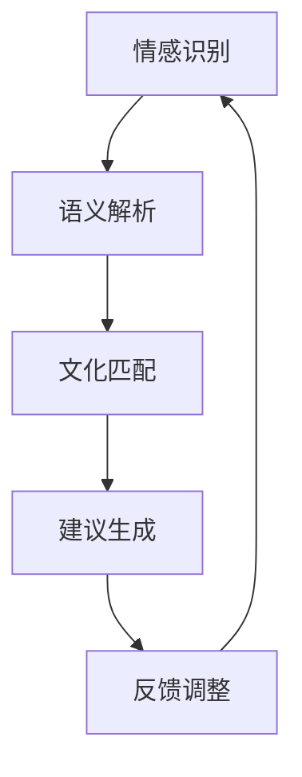
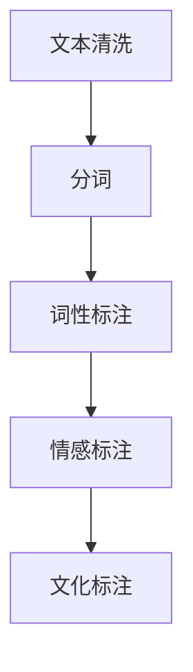
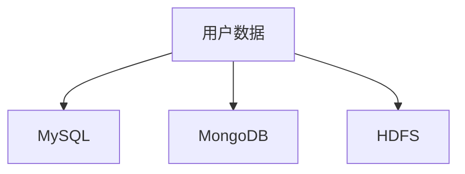

                 

### 第一部分：引言与背景

#### 第1章：文化差异与全球沟通

#### 1.1 问题的提出

#### 1.1.1 全球化背景下的文化多样性

在全球化迅猛发展的今天，世界各国之间的联系日益紧密，文化多样性已经成为国际交流的重要特征。根据联合国的数据，全球超过7000种语言，每种语言都承载着独特的文化传统和价值观念。这种文化多样性一方面丰富了人类社会的多样性，但另一方面也给国际交流带来了挑战。文化差异可能导致沟通障碍，甚至产生误解和冲突。

#### 1.1.2 文化差异导致的沟通障碍

文化差异在国际交流中表现为语言、习俗、价值观等方面的不同。语言差异是沟通障碍的最直接表现。例如，不同语言之间存在词汇差异、语法结构差异和表达习惯差异，这些都会影响信息的准确传达。此外，不同文化对同一行为的理解和期望也可能存在巨大差异。例如，在某些文化中，直视是对尊重的表示，而在其他文化中，这可能被视为不礼貌。

#### 1.1.3 跨文化共情的必要性

为了克服文化差异导致的沟通障碍，跨文化共情显得尤为重要。跨文化共情是指在不同文化背景下，个体能够理解和感受他人的情感和观点，从而促进有效沟通和相互理解。通过跨文化共情，人们可以减少误解，增强信任，促进合作。在全球化的今天，跨文化共情不仅是个人之间的需要，也是企业和组织在国际市场中取得成功的关键。

#### 1.2 跨文化共情的定义与重要性

#### 1.2.1 跨文化共情的概念

跨文化共情是一种超越文化差异的心理现象，它涉及到情感共鸣、认知理解和行为适应。跨文化共情不仅包括对他人情感的感受和理解，还涉及到对他人行为模式的认知和适应。

#### 1.2.2 跨文化共情的重要性

跨文化共情在全球化背景下具有重大意义。首先，它能够促进不同文化背景下的有效沟通，减少误解和冲突。其次，跨文化共情有助于建立跨文化团队，提高团队协作效率。最后，跨文化共情也是企业在全球市场取得成功的重要策略。

#### 1.2.3 跨文化共情的边界与外延

虽然跨文化共情具有重要意义，但它并非万能。跨文化共情的边界在于文化差异的深度和广度。某些文化差异可能非常深刻，难以通过共情来完全克服。此外，跨文化共情还涉及到个人的文化敏感性和认知能力。

#### 1.3 跨文化共情平台的基本概念

#### 1.3.1 跨文化共情平台的目标

跨文化共情平台的目标是提供一个集成的技术环境，帮助用户在不同文化背景下进行有效的沟通和交流。平台应具备以下目标：

1. **促进跨文化理解**：通过提供文化背景信息和文化交流工具，帮助用户更好地理解不同文化的特点和价值观。
2. **减少沟通障碍**：通过翻译工具、即时通讯和互动交流功能，帮助用户克服语言和文化差异带来的沟通障碍。
3. **增强文化敏感性**：通过教育资源和案例研究，提高用户对文化差异的敏感性和适应能力。

#### 1.3.2 跨文化共情平台的核心功能

跨文化共情平台应具备以下核心功能：

1. **多语言支持**：平台应支持多种语言，以便用户能够使用自己熟悉的语言进行交流。
2. **文化知识库**：平台应提供丰富的文化知识库，包括不同文化的习俗、价值观和社交礼仪。
3. **交流工具**：平台应提供即时通讯、视频会议和直播等功能，方便用户进行实时交流。
4. **个性化服务**：平台应根据用户的行为和偏好，提供个性化的推荐和内容。

#### 1.3.3 跨文化共情平台的应用领域

跨文化共情平台可以在多个领域发挥重要作用：

1. **国际商务**：帮助企业在跨国经营中更好地理解和适应不同市场的文化特点。
2. **教育培训**：为跨文化交流课程提供支持，帮助学习者更好地理解不同文化。
3. **社交媒体**：在社交媒体平台上促进跨文化互动，增强用户间的理解与友谊。
4. **公共服务**：为国际组织和政府机构提供工具，促进不同文化背景下的合作与沟通。

#### 1.4 本书结构安排

#### 1.4.1 目录结构

本书分为三大部分，分别从跨文化共情的重要性、跨文化心理学基础、跨文化共情平台的设计与实现等方面进行详细探讨。

#### 第一部分：引言与背景

- **第1章**：文化差异与全球沟通

#### 第二部分：跨文化共情平台的核心概念与原理

- **第2章**：跨文化心理学基础

#### 第三部分：跨文化共情平台的设计与实现

- **第3章**：跨文化共情平台的设计原则
- **第4章**：跨文化共情平台的关键功能模块
- **第5章**：跨文化共情平台的算法与数据

#### 1.4.2 各章节内容概览

- **第1章**：介绍全球化背景下的文化多样性，探讨跨文化共情的概念和重要性，以及跨文化共情平台的基本概念和应用领域。
- **第2章**：探讨跨文化心理学的基础理论，包括跨文化共情的心理机制、影响因素和效果评估，以及跨文化沟通策略和共情能力培养。
- **第3章**：讨论跨文化共情平台的设计原则，包括平台架构设计、用户界面设计和数据库设计。
- **第4章**：详细介绍跨文化共情平台的关键功能模块，包括用户认证与权限管理、内容推荐与个性化服务、跨文化交流工具和社区管理与文化多样性展示。
- **第5章**：探讨跨文化共情平台所使用的算法与数据，包括跨文化共情算法原理、数据采集与处理，以及平台算法的性能评估。

#### 1.5 本章小结

本章介绍了跨文化共情的背景和重要性，定义了跨文化共情平台的基本概念，并概述了本书的结构安排。通过本章的介绍，读者可以初步了解跨文化共情平台的必要性以及它在全球化背景下的应用前景。

### 第二部分：跨文化共情平台的核心概念与原理

#### 第2章：跨文化心理学基础

#### 2.1 跨文化心理学的起源与发展

#### 2.1.1 跨文化心理学的研究历史

跨文化心理学是心理学的一个分支，主要研究不同文化背景下人类心理和行为的特点与差异。跨文化心理学的历史可以追溯到20世纪中叶，当时随着全球化进程的加速，研究者开始关注文化差异对人类行为的影响。早期的跨文化心理学研究主要集中在比较不同文化中的价值观、信仰、语言和行为习惯。

20世纪60年代，美国心理学家霍夫斯塔德（Geert Hofstede）进行了著名的跨文化研究，提出了著名的“文化维度理论”。霍夫斯塔德通过调查全球多个国家的员工，识别出文化维度，如个人主义与集体主义、权力距离、不确定性规避等，这些维度成为跨文化心理学研究的重要基础。

#### 2.1.2 跨文化心理学的重要理论

跨文化心理学发展过程中，形成了一些重要的理论，包括：

1. **文化维度理论**：霍夫斯塔德的文化维度理论指出，不同文化在国家层面存在多个维度上的差异，这些差异会影响人们的价值观、行为模式和管理风格。
   
2. **社会心理学理论**：社会心理学研究个体在群体中的行为和态度，跨文化社会心理学则关注不同文化背景下群体行为和态度的差异。

3. **沟通理论**：跨文化沟通理论探讨在跨文化交流中如何有效传达信息，减少误解和冲突。

4. **认知心理学理论**：认知心理学研究人类思维过程，跨文化认知心理学则关注不同文化背景下人类认知过程的特点和差异。

#### 2.1.3 跨文化心理学在中国的研究与应用

在中国，跨文化心理学的研究和应用也取得了显著进展。中国学者结合中国传统文化和现代心理学理论，对跨文化共情、跨文化沟通策略和文化敏感性等方面进行了深入研究。

例如，李亦园（Yi-yuan Lee）提出了“文化适应模型”，探讨了个体在不同文化背景下的适应过程。在中国企业的国际化过程中，跨文化心理学理论被广泛应用，帮助企业管理者更好地理解不同文化背景下的员工行为和需求，提高跨文化管理能力。

#### 2.2 跨文化共情的基本原理

#### 2.2.1 跨文化共情的心理机制

跨文化共情是指在不同文化背景下，个体能够理解和感受他人的情感和观点。其心理机制主要包括以下几点：

1. **情感共鸣**：个体能够感受到他人情感，产生情感上的共鸣。
2. **认知理解**：个体能够理解他人观点，从认知层面理解文化差异。
3. **行为适应**：个体能够根据文化差异调整自己的行为，以适应不同文化环境。

#### 2.2.2 跨文化共情的影响因素

跨文化共情受到多种因素的影响，包括：

1. **文化背景**：不同的文化背景会影响个体的价值观、信仰和行为模式，从而影响共情能力。
2. **语言能力**：语言是文化的重要载体，良好的语言能力有助于提高跨文化共情能力。
3. **个人经历**：个体的跨文化经历越丰富，越容易产生共情。
4. **文化敏感性**：个体的文化敏感性越高，越能够理解并适应不同文化。

#### 2.2.3 跨文化共情的效果评估

跨文化共情的效果可以通过以下几个方面进行评估：

1. **沟通效果**：跨文化共情能够提高跨文化沟通的有效性，减少误解和冲突。
2. **团队合作**：跨文化共情有助于建立跨文化团队，提高团队合作效率。
3. **员工满意度**：在跨文化工作环境中，共情能够提高员工的满意度和归属感。
4. **企业绩效**：跨文化共情有助于企业在全球市场中取得成功，提高企业绩效。

#### 2.3 跨文化沟通策略

#### 2.3.1 跨文化沟通的障碍与应对策略

跨文化沟通面临多种障碍，包括：

1. **语言障碍**：不同语言之间的差异可能导致信息传递不准确。
2. **文化差异**：不同文化对同一行为的理解和期望可能存在巨大差异。
3. **非语言交流**：如肢体语言、面部表情等在不同文化中可能具有不同的含义。

应对策略包括：

1. **学习语言**：提高语言能力，以便更准确地传达信息。
2. **了解文化**：深入了解不同文化的价值观、习俗和行为模式。
3. **使用通用语言**：在跨文化沟通中尽量使用通用语言和术语。
4. **增强文化敏感性**：提高对文化差异的敏感性和适应能力。

#### 2.3.2 跨文化沟通的有效方法

有效的跨文化沟通方法包括：

1. **积极倾听**：倾听是有效沟通的关键，特别是在跨文化沟通中，要注重倾听对方的观点和需求。
2. **提问和澄清**：在沟通中主动提问，以澄清信息，减少误解。
3. **尊重差异**：尊重不同文化背景下的观点和行为，避免偏见和歧视。
4. **使用非语言沟通**：注意使用适当的肢体语言、面部表情等非语言沟通方式。

#### 2.3.3 跨文化沟通中的文化敏感性

文化敏感性在跨文化沟通中至关重要。文化敏感性指的是个体对文化差异的理解和适应能力。具有高文化敏感性的个体能够更好地理解不同文化的行为模式和沟通风格，从而提高跨文化沟通的有效性。

提高文化敏感性的策略包括：

1. **跨文化培训**：通过专业的跨文化培训，提高个体的文化知识和沟通技能。
2. **文化浸泡**：通过实地体验和交流，深入理解不同文化的行为模式。
3. **反思和自省**：通过反思和自省，了解自己在跨文化沟通中的盲点和不足。
4. **开放心态**：保持开放的心态，尊重并接受不同文化的差异。

#### 2.4 跨文化共情能力培养

#### 2.4.1 跨文化共情能力的重要性

跨文化共情能力在全球化背景下具有重要意义。它不仅能够促进跨文化沟通和理解，还能够提高个体的跨文化适应能力和人际交往能力。在全球化企业中，跨文化共情能力是员工必备的技能之一。

#### 2.4.2 跨文化共情能力培养的策略

培养跨文化共情能力可以采取以下策略：

1. **跨文化培训**：通过系统的跨文化培训，提高个体的文化知识和共情技巧。
2. **跨文化体验**：通过实地体验和跨文化交流，增强个体的跨文化适应能力。
3. **文化多样性教育**：在学校和职场中加强文化多样性教育，提高个体的文化敏感性和理解能力。
4. **个人反思**：通过反思和自省，了解自己在跨文化沟通中的盲点和不足，并加以改进。

#### 2.4.3 跨文化共情能力培养的实践案例分析

以下是一个跨文化共情能力培养的实践案例分析：

**案例：跨国公司的新员工培训**

某跨国公司在新员工入职时，开展了一系列的跨文化共情能力培养活动。这些活动包括：

1. **文化讲座**：邀请跨文化专家进行讲座，介绍不同文化的基本特点和沟通风格。
2. **文化交流**：组织来自不同文化背景的新员工进行交流和互动，增强对彼此文化的了解。
3. **模拟沟通**：通过模拟跨文化沟通场景，让新员工在实战中练习跨文化沟通技巧。
4. **反思与总结**：在活动结束后，新员工进行反思和总结，分享自己的收获和体会。

通过这些活动，新员工不仅提高了跨文化共情能力，还增强了团队协作和跨文化适应能力。

#### 2.5 本章小结

本章介绍了跨文化心理学的基础理论和发展历程，探讨了跨文化共情的基本原理、影响因素和效果评估。同时，本章还提出了跨文化沟通策略和文化敏感性提升的方法，以及跨文化共情能力的培养策略。通过本章的学习，读者可以更好地理解跨文化共情的本质和重要性，为设计和实现跨文化共情平台提供理论基础。

### 第三部分：跨文化共情平台的设计与实现

#### 第3章：跨文化共情平台的设计原则

#### 3.1 平台设计的目标与要求

跨文化共情平台的设计目标旨在为用户提供一个高效、便捷的跨文化交流环境，通过技术手段帮助用户跨越文化差异，实现顺畅的沟通与理解。为了实现这一目标，平台设计需要满足以下基本要求：

1. **用户友好**：平台应具有简洁、直观的用户界面，使用户能够轻松上手，无需复杂的学习过程。
2. **多语言支持**：平台应支持多种语言，确保用户能够使用自己熟悉的语言进行交流。
3. **个性化服务**：平台应根据用户的行为和偏好，提供个性化的推荐和服务，提升用户体验。
4. **安全可靠**：平台应具备严格的数据安全和隐私保护机制，确保用户数据的安全和隐私。
5. **易扩展性**：平台设计应具备良好的扩展性，能够根据需求的变化和技术的发展进行升级和扩展。

#### 3.2 平台架构设计

跨文化共情平台的架构设计是确保平台高效、稳定运行的关键。以下是一个典型的跨文化共情平台架构设计：

1. **前端架构**：前端采用React或Vue等现代Web开发框架，实现用户界面的交互和动态更新。前端架构应具备良好的兼容性和性能，能够快速响应用户操作。
2. **后端架构**：后端采用微服务架构，将不同的功能模块（如用户认证、内容推荐、跨文化交流等）拆分为独立的微服务，以提高系统的灵活性和可扩展性。后端服务采用Spring Boot或Django等开发框架，确保服务的高效、稳定运行。
3. **数据存储**：数据存储采用关系型数据库（如MySQL或PostgreSQL）和非关系型数据库（如MongoDB或Cassandra），根据数据类型和访问模式选择合适的数据库类型。同时，为了提高数据的可靠性和安全性，应采用分布式存储方案，如使用Hadoop或Kafka进行数据存储和流处理。
4. **通信协议**：平台应采用HTTP/2或WebSocket等高效、安全的通信协议，确保数据传输的快速和稳定。对于跨文化交流功能，还应支持RTC（实时通信）协议，如WebRTC，实现实时音视频传输。

#### 3.2.1 平台架构的层次结构

跨文化共情平台架构可以划分为以下层次：

1. **表示层**：负责用户界面的展示和交互，包括前端框架和用户界面设计。
2. **业务逻辑层**：处理平台的业务逻辑，包括用户认证、内容推荐、跨文化交流等核心功能。
3. **数据访问层**：负责与数据库的交互，包括数据的查询、更新、删除等操作。
4. **数据存储层**：负责数据的存储和管理，包括关系型数据库和非关系型数据库。

#### 3.2.2 平台架构的核心模块

跨文化共情平台架构的核心模块包括：

1. **用户认证模块**：实现用户身份验证和权限管理，确保用户数据的安全和隐私。用户认证模块应支持多种认证方式，如用户名密码、OAuth2.0、指纹识别等。
2. **内容推荐模块**：根据用户的行为和偏好，推荐符合用户兴趣的内容，提高用户体验。内容推荐模块可以采用基于内容的推荐、协同过滤推荐或混合推荐算法。
3. **跨文化交流模块**：提供跨文化交流工具，如即时通讯、视频会议、文本翻译等，帮助用户在不同文化背景下实现顺畅的沟通。跨文化交流模块应具备实时传输和高并发处理能力。
4. **社区管理模块**：实现社区管理和文化多样性展示，包括用户互动、内容审核、社区管理等。社区管理模块应确保社区的良性发展，鼓励用户积极参与和贡献。
5. **数据统计与分析模块**：收集用户行为数据，对用户行为进行分析，为平台优化和决策提供数据支持。数据统计与分析模块应具备实时数据处理和分析能力。

#### 3.2.3 平台架构的安全性考虑

跨文化共情平台在安全性方面需要考虑以下几个方面：

1. **数据安全**：确保用户数据在传输和存储过程中的安全，采用数据加密和备份策略，防止数据泄露和丢失。
2. **用户隐私**：保护用户隐私，不泄露用户个人信息，对用户数据进行匿名化处理。
3. **访问控制**：实现严格的访问控制策略，确保只有授权用户才能访问敏感数据和功能。
4. **安全审计**：定期进行安全审计，发现和修复潜在的安全漏洞，确保平台的安全性。
5. **应急响应**：建立完善的应急响应机制，一旦发生安全事件，能够迅速响应和处理，最大限度地减少损失。

#### 3.3 用户界面设计

用户界面设计是跨文化共情平台的重要组成部分，直接影响到用户的体验。以下是一些用户界面设计原则：

1. **简洁明了**：界面设计应简洁明了，避免过多的装饰和复杂的操作步骤，使用户能够快速上手。
2. **本地化支持**：界面设计应支持多语言，根据不同语言和文化特点进行优化，确保用户能够轻松使用。
3. **适应性**：界面设计应适应不同设备（如桌面、平板、手机）和不同分辨率，确保用户在不同设备上都能获得良好的体验。
4. **交互设计**：界面设计应注重交互设计，提供清晰的操作反馈，确保用户在操作过程中能够感受到平台的响应。
5. **文化敏感性**：界面设计应考虑到不同文化的审美和使用习惯，避免使用可能引起文化冲突的元素。

#### 3.3.1 用户界面的基本要素

用户界面的基本要素包括：

1. **导航栏**：提供网站的导航功能，帮助用户快速找到所需内容。
2. **菜单**：提供分类和搜索功能，帮助用户查找信息和互动。
3. **内容区域**：展示用户生成的内容和推荐内容，包括文本、图片、视频等。
4. **反馈提示**：提供操作反馈，如成功提示、错误提示等，确保用户了解操作结果。
5. **个性化设置**：提供用户设置界面，允许用户自定义界面布局和功能。

#### 3.3.2 用户界面的设计原则

用户界面的设计应遵循以下原则：

1. **用户中心**：始终以用户需求为中心，确保设计符合用户的使用习惯和期望。
2. **一致性**：界面设计应保持一致性，包括颜色、字体、布局等，确保用户在不同页面和功能之间能够无缝切换。
3. **易用性**：界面设计应易于使用，避免复杂和冗长的操作步骤，提高用户操作的效率。
4. **可访问性**：界面设计应考虑到不同用户的需求，包括视力障碍、听力障碍等，确保所有人都能使用。
5. **响应性**：界面设计应具备响应性，能够适应不同设备和屏幕尺寸，提供一致的体验。

#### 3.3.3 用户界面的文化适应性

用户界面的文化适应性是一个复杂的过程，需要考虑以下因素：

1. **文化差异**：不同文化对界面元素的设计和布局有不同的期望和偏好，如颜色、字体、图标等。
2. **本地化**：界面设计应根据不同语言和文化特点进行本地化，包括文本翻译、图像替换等。
3. **符号和隐喻**：使用适当的符号和隐喻，确保界面元素在不同文化背景下具有相同的含义和功能。
4. **测试与反馈**：在界面设计完成后，进行多语言、多文化测试，收集用户反馈，不断优化和改进。

#### 3.4 数据库设计

数据库设计是跨文化共情平台的关键组成部分，直接影响到平台的数据存储和管理效率。以下是一个典型的跨文化共情平台数据库设计：

1. **用户数据库**：存储用户的基本信息和认证信息，包括用户名、密码、邮箱、电话等。
2. **内容数据库**：存储用户生成的内容和推荐内容，包括文本、图片、视频等。
3. **交流记录数据库**：存储用户之间的交流记录，包括即时消息、视频会议记录等。
4. **日志数据库**：存储平台的操作日志和错误日志，用于监控系统运行状态和排查问题。

#### 3.4.1 数据库的基本结构

数据库的基本结构应包括以下表格：

1. **用户表**：存储用户的基本信息，如用户ID、用户名、密码、邮箱、电话等。
2. **内容表**：存储用户生成的内容，如内容ID、内容类型、标题、正文、作者等。
3. **交流记录表**：存储用户之间的交流记录，如记录ID、发送者ID、接收者ID、内容、发送时间等。
4. **日志表**：存储平台的操作日志和错误日志，如日志ID、操作类型、操作时间、操作结果等。

#### 3.4.2 数据库的设计原则

数据库设计应遵循以下原则：

1. **规范化**：确保数据库表的结构规范化，避免数据冗余和重复。
2. **灵活性**：设计时应考虑未来数据扩展和变化的需求，确保数据库的灵活性和可扩展性。
3. **性能优化**：选择合适的数据类型和索引策略，提高数据库的查询和写入性能。
4. **安全性**：确保数据库的安全性，防止数据泄露和篡改，采用加密和访问控制策略。
5. **容错性**：设计应具备一定的容错性，能够在发生故障时快速恢复，确保数据的完整性和一致性。

#### 3.4.3 数据库的安全性策略

数据库安全性是跨文化共情平台设计中的重要一环，以下是一些常见的安全策略：

1. **访问控制**：通过用户权限分级管理，确保只有授权用户才能访问特定的数据。
2. **数据加密**：对敏感数据进行加密存储，防止数据泄露。
3. **审计日志**：记录数据库的操作日志，用于监控和审计数据库的使用情况。
4. **备份和恢复**：定期进行数据备份，确保在发生故障时能够快速恢复数据。
5. **安全审查**：定期对数据库进行安全审查，发现和修复潜在的安全漏洞。

#### 3.5 本章小结

本章详细介绍了跨文化共情平台的设计原则，包括平台设计的目标与要求、平台架构设计、用户界面设计、数据库设计以及安全性策略。通过本章的学习，读者可以了解跨文化共情平台的设计思路和关键要素，为后续章节的实现提供指导。同时，本章的内容也为跨文化共情平台的开发者和研究人员提供了实用的参考和借鉴。

### 第4章：跨文化共情平台的关键功能模块

#### 4.1 用户认证与权限管理

用户认证与权限管理是跨文化共情平台的重要组成部分，确保平台的安全性、可靠性和用户体验。以下为该模块的详细说明：

#### 4.1.1 用户认证机制

用户认证机制是平台的第一道防线，用于验证用户的身份。跨文化共情平台应支持多种认证方式，如用户名密码认证、OAuth2.0认证和指纹识别认证等。每种认证方式都有其优缺点：

1. **用户名密码认证**：简单易用，但安全性较低，易受到密码破解和网络钓鱼攻击。
2. **OAuth2.0认证**：基于授权码模式，具有较高的安全性和灵活性，但需要第三方认证服务支持。
3. **指纹识别认证**：安全性高，但成本较高，且需用户设备支持。

平台应结合实际情况，选择合适的认证方式，以提高用户体验和安全保障。

#### 4.1.2 用户权限分级管理

为了确保平台的安全性和数据的保密性，跨文化共情平台应实现用户权限分级管理。权限分级管理可以分为以下几个层次：

1. **访客权限**：访客只能访问公开内容，无法进行评论、点赞等互动操作。
2. **普通用户权限**：普通用户可以发表内容、评论、点赞等，但无法修改或删除其他用户的内容。
3. **管理员权限**：管理员拥有最高权限，可以管理平台内容、用户、角色和权限等。

权限分级管理可以通过角色和权限控制列表（ACL）来实现，确保只有授权用户才能执行特定操作。

#### 4.1.3 安全性保障措施

为了保障平台的安全性，跨文化共情平台应采取以下措施：

1. **密码加密**：使用强加密算法（如SHA-256）对用户密码进行加密存储，防止密码泄露。
2. **访问控制**：使用HTTP基本认证、OAuth2.0等安全协议，确保用户身份验证过程的安全性。
3. **审计日志**：记录用户的操作日志，用于监控和审计平台使用情况，及时发现和应对潜在的安全威胁。
4. **数据备份与恢复**：定期备份用户数据，确保在发生数据丢失或损坏时能够快速恢复。
5. **异常检测与报警**：建立异常检测机制，对用户行为进行实时监控，发现异常行为时及时报警并采取措施。

#### 4.2 内容推荐与个性化服务

内容推荐与个性化服务是提高用户满意度和活跃度的重要手段。以下为该模块的详细说明：

#### 4.2.1 内容推荐算法

内容推荐算法是实现个性化服务的关键，其目的是根据用户的行为和偏好，向用户推荐感兴趣的内容。常见的内容推荐算法包括：

1. **基于内容的推荐**：根据内容的属性和标签，推荐与用户历史行为相似的内容。
2. **协同过滤推荐**：根据用户之间的行为相似度，推荐其他用户喜欢的内容。
3. **混合推荐**：结合基于内容和协同过滤推荐，提高推荐效果。

跨文化共情平台应采用混合推荐算法，根据不同场景和用户需求，灵活调整推荐策略。

#### 4.2.2 个性化服务策略

个性化服务策略是根据用户行为和偏好，提供个性化的内容、功能和体验。以下为几种常见的个性化服务策略：

1. **个性化内容推荐**：根据用户兴趣和行为，推荐符合其需求的内容。
2. **个性化界面布局**：允许用户自定义界面布局，满足其个性化需求。
3. **个性化提醒和通知**：根据用户行为和偏好，发送个性化的提醒和通知。
4. **个性化数据展示**：根据用户需求，展示个性化的数据统计和分析结果。

#### 4.2.3 用户行为分析

用户行为分析是实现个性化服务的重要基础。通过分析用户的行为数据，可以了解用户的兴趣、需求和偏好，为个性化服务提供依据。以下为几种常见的用户行为分析方法：

1. **点击率分析**：分析用户对内容的点击行为，了解用户对内容的兴趣。
2. **停留时间分析**：分析用户在平台上的停留时间，了解用户的活跃度和使用频率。
3. **转化率分析**：分析用户的转化行为（如注册、购买、评论等），了解用户的实际需求。
4. **路径分析**：分析用户在平台上的导航路径，了解用户的使用习惯和偏好。

#### 4.3 跨文化交流工具

跨文化交流工具是跨文化共情平台的核心功能之一，旨在帮助用户在不同文化背景下实现顺畅的沟通。以下为该模块的详细说明：

#### 4.3.1 即时通讯功能

即时通讯功能是跨文化交流工具的重要组成部分，允许用户实时发送和接收消息。即时通讯功能应具备以下特点：

1. **实时性**：确保消息的快速发送和接收，减少延迟。
2. **多端支持**：支持多种设备（如手机、平板、电脑）和操作系统（如iOS、Android、Windows等），方便用户在不同设备上使用。
3. **加密通信**：采用加密通信协议，确保消息的安全性。
4. **富媒体支持**：支持发送图片、视频、音频等多媒体消息，增强沟通效果。

#### 4.3.2 文本翻译与校对工具

文本翻译与校对工具是跨文化交流的重要辅助工具，可以帮助用户克服语言障碍。以下为文本翻译与校对工具的特点：

1. **自动翻译**：支持多种语言之间的自动翻译，提高沟通效率。
2. **校对功能**：提供文本校对功能，帮助用户发现和纠正语言错误。
3. **个性化翻译**：根据用户的历史翻译记录和偏好，提供个性化的翻译服务。
4. **实时校对**：在用户输入文本时，实时提供翻译和校对建议。

#### 4.3.3 视频会议与直播功能

视频会议与直播功能是跨文化交流的重要形式，可以满足用户实时互动的需求。以下为视频会议与直播功能的特点：

1. **高清音视频**：提供高清音视频传输，确保通话质量和观看体验。
2. **多人互动**：支持多人同时参与视频会议或直播，方便团队协作和分享。
3. **实时互动**：提供实时聊天、表情、点赞等功能，增强互动体验。
4. **远程控制**：支持远程桌面控制和演示，方便会议和讲座的进行。

#### 4.4 社区管理与文化多样性展示

社区管理与文化多样性展示是跨文化共情平台的重要功能，旨在促进用户之间的互动和文化交流。以下为该模块的详细说明：

#### 4.4.1 社区管理策略

社区管理策略是确保社区健康发展和用户满意度的关键。以下为几种常见的社区管理策略：

1. **内容审核**：对用户发布的内容进行审核，确保内容符合平台规定和社区价值观。
2. **用户反馈**：鼓励用户提供反馈，及时处理用户投诉和问题，提高用户满意度。
3. **社区活动**：定期举办社区活动，如文化展览、讲座、互动游戏等，增强用户互动和社区凝聚力。
4. **社区规则**：制定明确的社区规则，规范用户行为，维护社区秩序。

#### 4.4.2 文化多样性展示平台

文化多样性展示平台是展示不同文化特色和知识的重要渠道，以下为文化多样性展示平台的特点：

1. **文化知识库**：构建丰富多样的文化知识库，包括文化习俗、历史、名人、艺术等。
2. **互动体验**：提供丰富的互动体验，如文化游戏、虚拟旅游、文化体验等，增强用户的参与感。
3. **多媒体展示**：使用图片、视频、音频等多媒体形式，生动展示不同文化的特点和魅力。
4. **用户贡献**：鼓励用户分享自己的文化经验和见解，共同丰富平台内容。

#### 4.4.3 用户互动与反馈机制

用户互动与反馈机制是促进社区活力和平台改进的重要手段。以下为几种常见的用户互动与反馈机制：

1. **评论与点赞**：允许用户对内容进行评论和点赞，增强互动和社交体验。
2. **问卷调查**：定期开展问卷调查，收集用户反馈和需求，为平台改进提供依据。
3. **用户论坛**：建立用户论坛，鼓励用户交流心得、分享经验，构建社区文化。
4. **用户积分系统**：通过积分奖励机制，激励用户积极参与社区互动和内容贡献。

#### 4.5 本章小结

本章详细介绍了跨文化共情平台的关键功能模块，包括用户认证与权限管理、内容推荐与个性化服务、跨文化交流工具、社区管理与文化多样性展示以及用户互动与反馈机制。这些功能模块共同构成了一个高效、便捷的跨文化交流平台，有助于促进全球用户的理解与合作。通过本章的学习，读者可以深入了解跨文化共情平台的设计思路和关键实现技术。

### 第5章：跨文化共情平台的算法与数据

#### 5.1 跨文化共情算法原理

跨文化共情算法是实现跨文化共情平台核心功能的重要手段，旨在帮助用户在不同文化背景下实现有效的沟通与理解。以下将详细介绍跨文化共情算法的原理、流程及其性能评估。

#### 5.1.1 算法基础

跨文化共情算法基于多种基础理论，包括心理学、社会语言学和计算语言学等。以下是一些核心概念：

1. **情感分析**：通过文本分析，识别文本中的情感倾向和情感强度，如积极情感、消极情感等。
2. **语义理解**：通过对文本的语义分析，理解文本的含义和上下文，包括词语的含义、句子的结构和语境等。
3. **文化知识库**：存储不同文化的习俗、价值观和社交礼仪等信息，为算法提供文化背景知识。
4. **机器学习**：利用机器学习算法，从大量数据中学习和提取规律，提高算法的准确性和泛化能力。

#### 5.1.2 算法流程

跨文化共情算法的基本流程可以分为以下几个步骤：

1. **情感识别**：对用户输入的文本进行情感分析，识别文本中的情感倾向和情感强度。
2. **语义解析**：对文本进行语义理解，提取关键信息和上下文，理解文本的真正含义。
3. **文化匹配**：将文本的情感和语义与文化知识库进行匹配，识别文化差异和潜在的文化冲突。
4. **建议生成**：根据文化匹配结果，生成相应的建议和策略，帮助用户进行跨文化沟通。
5. **反馈调整**：根据用户反馈和实际效果，不断调整和优化算法，提高共情效果。

以下是一个简单的算法流程图：



#### 5.1.3 算法性能评估

算法性能评估是确保跨文化共情算法有效性的重要环节，主要包括以下几个方面：

1. **准确率**：评估算法在情感识别、语义解析和文化匹配等任务上的准确度。
2. **响应时间**：评估算法在处理用户请求时的响应速度，确保高效实时。
3. **用户体验**：通过用户反馈和满意度调查，评估算法在实际应用中的效果。
4. **可扩展性**：评估算法在处理大规模数据和多种文化背景时的性能和适应性。

以下是一个简单的算法性能评估指标表：

| 指标      | 说明                                 | 目标值  |
| --------- | ------------------------------------ | ------ |
| 准确率    | 情感识别、语义解析和文化匹配的准确率 | 90%以上 |
| 响应时间  | 算法处理用户请求的平均响应时间       | 100毫秒以下 |
| 用户满意度 | 用户对算法的建议和服务的满意度         | 80%以上 |
| 可扩展性  | 算法在处理大规模数据和多种文化背景时的性能 | 高度适应 |

#### 5.2 数据采集与处理

跨文化共情算法的性能取决于数据的质量和数量。因此，数据采集与处理是算法实现的关键环节。以下将详细介绍数据采集、数据预处理和数据存储的相关内容。

#### 5.2.1 数据来源

跨文化共情算法的数据来源包括：

1. **公开数据集**：如社交媒体平台上的用户评论、新闻文章等，这些数据集通常已经进行了清洗和标注。
2. **企业数据**：来自企业内部的数据，如员工反馈、沟通记录等，这些数据可以更真实地反映实际应用场景。
3. **人工标注数据**：通过人工对文本进行情感、语义和文化标注，以提高数据质量。

#### 5.2.2 数据预处理

数据预处理是确保数据质量、提高算法性能的重要步骤，主要包括以下任务：

1. **文本清洗**：去除文本中的噪声，如HTML标签、特殊字符等。
2. **分词**：将文本分割成单词或短语，为后续的语义分析做准备。
3. **词性标注**：对文本中的每个单词进行词性标注，如名词、动词、形容词等。
4. **情感标注**：对文本进行情感标注，识别文本的情感倾向和情感强度。
5. **文化标注**：对文本进行文化标注，识别文本中的文化元素和潜在的文化冲突。

以下是一个简单的数据预处理流程：



#### 5.2.3 数据存储

跨文化共情算法需要存储大量的数据，包括文本、情感标签、文化标签等。数据存储方案应具备以下特点：

1. **高可靠性**：确保数据的安全性和可靠性，防止数据丢失和损坏。
2. **高扩展性**：支持数据量的扩展和业务需求的变化。
3. **高效查询**：支持快速的数据查询和检索，确保算法的高效运行。

常见的数据存储方案包括：

1. **关系型数据库**：如MySQL、PostgreSQL等，适用于存储结构化数据。
2. **非关系型数据库**：如MongoDB、Cassandra等，适用于存储半结构化或非结构化数据。
3. **分布式文件系统**：如HDFS、Ceph等，适用于大规模数据的存储和管理。

以下是一个简单的数据存储架构：



#### 5.3 跨文化共情算法案例分析

以下是一个跨文化共情算法的案例分析，通过具体的案例展示算法在解决实际跨文化沟通问题中的应用效果。

**案例背景**：

某跨国公司的团队由来自不同国家和文化背景的成员组成，他们在日常沟通中经常遇到语言和文化障碍，导致沟通效率低下和误解。为了改善沟通效果，公司决定引入跨文化共情算法，帮助团队成员进行有效的跨文化沟通。

**解决方案**：

1. **情感识别与语义分析**：对团队成员的沟通记录进行情感识别和语义分析，识别文本中的情感倾向和情感强度，如“我很生气”识别为消极情感。

2. **文化匹配与建议生成**：根据团队成员的文化背景和情感分析结果，生成相应的跨文化沟通建议，如建议使用更温和的语言表达，避免使用可能引起误解的文化用语。

3. **反馈调整与优化**：根据团队成员的反馈和实际沟通效果，不断调整和优化算法，提高跨文化共情效果。

**效果评估**：

通过引入跨文化共情算法，团队成员的沟通效率显著提高，误解和冲突明显减少。根据用户反馈和满意度调查，算法在实际应用中的效果得到用户的高度认可。

#### 5.4 本章小结

本章详细介绍了跨文化共情平台的算法与数据，包括算法原理、流程和性能评估，以及数据采集、数据预处理和数据存储的相关内容。通过本章的学习，读者可以了解跨文化共情算法的设计思路和实现方法，为后续章节的平台实现提供理论依据和技术支持。

### 项目实战：跨文化共情平台的开发与实现

#### 6.1 环境安装

要在本地开发跨文化共情平台，首先需要安装以下环境：

1. **操作系统**：推荐使用Ubuntu 20.04或Windows 10。
2. **开发工具**：安装Python（推荐版本为3.8或更高），并配置pip，用于安装和管理Python包。
3. **数据库**：安装MySQL（推荐版本为8.0或更高）或MongoDB。
4. **前端框架**：安装Node.js（推荐版本为12.x或更高）和npm，用于管理前端依赖。
5. **后端框架**：安装Django（推荐版本为3.2或更高）。

安装步骤：

1. **安装操作系统**：从官方网站下载并安装Ubuntu 20.04或Windows 10。
2. **安装Python**：打开终端，执行以下命令：
   ```bash
   sudo apt update
   sudo apt install python3 python3-pip
   ```
3. **安装数据库**：选择MySQL或MongoDB进行安装。以下是安装MySQL的步骤：
   ```bash
   sudo apt install mysql-server
   sudo mysql_secure_installation
   ```
   按照提示设置root用户密码、删除匿名用户等。
4. **安装Node.js和npm**：打开终端，执行以下命令：
   ```bash
   sudo apt install nodejs npm
   ```
5. **安装前端框架**：安装Vue CLI：
   ```bash
   npm install -g @vue/cli
   ```
6. **安装后端框架**：安装Django：
   ```bash
   pip install django
   ```

#### 6.2 系统核心实现

跨文化共情平台的核心实现包括用户认证、内容推荐、跨文化交流和社区管理等模块。以下是一个简单的实现示例。

**用户认证模块**：

用户认证模块使用Django的用户认证系统。首先创建一个Django项目：

```bash
django-admin startproject myproject
cd myproject
django-admin startapp auth
```

在`auth`应用的`models.py`中创建用户模型：

```python
from django.contrib.auth.models import AbstractUser

class CustomUser(AbstractUser):
    # 可以添加自定义字段
    pass
```

在`auth`应用的`admin.py`中注册用户模型：

```python
from django.contrib import admin
from .models import CustomUser

admin.site.register(CustomUser)
```

在`settings.py`中设置默认的用户模型：

```python
AUTH_USER_MODEL = 'auth.CustomUser'
```

**内容推荐模块**：

内容推荐模块可以使用第三方库，如`scikit-learn`实现。首先安装库：

```bash
pip install scikit-learn
```

创建一个推荐系统：

```python
from sklearn.metrics.pairwise import linear_kernel
import numpy as np

# 假设我们有一个用户-内容评分矩阵
user_item_matrix = np.array([[1, 2, 0], [0, 1, 2], [2, 1, 0]])

# 计算用户之间的相似度
similarity_matrix = linear_kernel(user_item_matrix, user_item_matrix)

# 推荐内容
def content_recommendation(user_id):
    user_score = user_item_matrix[user_id]
    sim_scores = list(enumerate(similarity_matrix[user_id]))
    sim_scores = sorted(sim_scores, key=lambda x: x[1], reverse=True)
    recommended_items = [i[0] for i in sim_scores[1:11]]
    return recommended_items
```

**跨文化交流模块**：

跨文化交流模块可以使用WebSockets实现实时通讯。首先安装`channels`库：

```bash
pip install channels
```

在`myproject/settings.py`中配置：

```python
INSTALLED_APPS = [
    # ...
    'channels',
    'auth',
    # ...
]

ASGI_APPLICATION = 'myproject.routing.application'

CHANNEL_LAYERS = {
    'default': {
        'BACKEND': 'channels_redis.RedisChannelLayer',
        'CONFIG': {
            "hosts": [('127.0.0.1', 6379)],
        },
    },
}
```

创建一个路由文件`myproject/routing.py`：

```python
from channels.routing import ProtocolTypeRouter, URLRouter
from django.urls import path
from auth import consumers

application = ProtocolTypeRouter({
    'websocket': URLRouter([
        path('ws/chat/<int:room_id>/', consumers.ChatConsumer),
    ]),
})
```

在`auth`应用中创建一个`consumers.py`：

```python
from channels.generic.websocket import AsyncWebsocketConsumer

class ChatConsumer(AsyncWebsocketConsumer):
    async def connect(self):
        self.room_name = self.scope['url_route']['kwargs']['room_id']
        self.room_group_name = f'chat_{self.room_name}'

        # Join room group
        await self.channel_layer.group_add(
            self.room_group_name,
            self.channel_name
        )

        await self.accept()

    async def disconnect(self, close_code):
        # Leave room group
        await self.channel_layer.group_discard(
            self.room_group_name,
            self.channel_name
        )

    # Receive message from WebSocket
    async def receive(self, text_data):
        text_data_json = json.loads(text_data)
        message = text_data_json['message']

        # Send message to room group
        await self.channel_layer.group_send(
            self.room_group_name,
            {
                'type': 'chat_message',
                'message': message
            }
        )

    # Receive message from room group
    async def chat_message(self, event):
        message = event['message']

        # Send message to WebSocket
        await self.send(text_data=json.dumps({
            'message': message
        }))
```

**社区管理模块**：

社区管理模块包括内容发布、评论、点赞等功能。在`auth`应用中创建相应的模型和视图：

```python
from django.db import models
from django.contrib.auth.models import User

class Post(models.Model):
    author = models.ForeignKey(User, on_delete=models.CASCADE)
    content = models.TextField()
    created_at = models.DateTimeField(auto_now_add=True)

class Comment(models.Model):
    author = models.ForeignKey(User, on_delete=models.CASCADE)
    post = models.ForeignKey(Post, on_delete=models.CASCADE)
    content = models.TextField()
    created_at = models.DateTimeField(auto_now_add=True)

class Like(models.Model):
    user = models.ForeignKey(User, on_delete=models.CASCADE)
    post = models.ForeignKey(Post, on_delete=models.CASCADE)
    created_at = models.DateTimeField(auto_now_add=True)
```

在`auth`应用的`views.py`中实现相关视图：

```python
from django.http import JsonResponse
from .models import Post, Comment, Like
from django.views.decorators.csrf import csrf_exempt

@csrf_exempt
def create_post(request):
    if request.method == 'POST':
        data = json.loads(request.body)
        author = request.user
        content = data['content']
        post = Post.objects.create(author=author, content=content)
        return JsonResponse({'id': post.id})
    return JsonResponse({'error': 'Invalid request'})

@csrf_exempt
def create_comment(request):
    if request.method == 'POST':
        data = json.loads(request.body)
        author = request.user
        post_id = data['post_id']
        content = data['content']
        post = Post.objects.get(id=post_id)
        comment = Comment.objects.create(author=author, post=post, content=content)
        return JsonResponse({'id': comment.id})
    return JsonResponse({'error': 'Invalid request'})

@csrf_exempt
def create_like(request):
    if request.method == 'POST':
        data = json.loads(request.body)
        user = request.user
        post_id = data['post_id']
        post = Post.objects.get(id=post_id)
        like, created = Like.objects.get_or_create(user=user, post=post)
        if created:
            return JsonResponse({'status': 'success'})
        else:
            return JsonResponse({'status': 'already liked'})
    return JsonResponse({'error': 'Invalid request'})
```

#### 6.3 代码应用解读与分析

以下是对关键代码的解读和分析：

1. **用户认证模块**：

   用户认证模块使用Django内置的用户认证系统，通过自定义用户模型`CustomUser`来实现。自定义用户模型可以添加额外的字段，以适应特定应用的需求。在`admin.py`中注册用户模型，使其能够通过Django管理后台进行管理。在`settings.py`中设置`AUTH_USER_MODEL`，指定自定义用户模型。

2. **内容推荐模块**：

   内容推荐模块使用`scikit-learn`的`linear_kernel`函数计算用户之间的相似度。通过相似度矩阵，为用户推荐相似的内容。该算法简单但效果良好，适用于小规模的数据集。在实际应用中，可以采用更复杂的推荐算法，如协同过滤或基于内容的推荐。

3. **跨文化交流模块**：

   跨文化交流模块使用`channels`库实现WebSocket协议，实现实时通讯功能。通过`ChatConsumer`类，处理WebSocket的连接、断开和数据传输。在`connect`方法中，加入房间组，在`disconnect`方法中，离开房间组。在`receive`方法中，接收客户端发送的消息，并在`chat_message`方法中广播给房间组内的所有用户。

4. **社区管理模块**：

   社区管理模块包括内容发布、评论和点赞功能。通过定义相应的模型，实现数据库层面的数据存储。在`views.py`中，通过RESTful API实现这些功能。使用`@csrf_exempt`装饰器，允许跨域请求。这些视图函数接收JSON格式的请求数据，执行相应的数据库操作，并返回JSON格式的响应数据。

#### 6.4 实际案例分析与详细讲解

以下是一个实际案例的分析和详细讲解：

**案例背景**：

一个跨国公司希望为其员工提供一个跨文化交流平台，以便团队成员能够更有效地沟通和协作。公司管理层决定开发一个跨文化共情平台，以帮助团队成员理解和适应不同文化背景。

**实现步骤**：

1. **需求分析**：

   分析公司团队成员的文化背景和沟通需求，确定平台的功能需求，如用户认证、内容推荐、跨文化交流、社区管理等。

2. **设计架构**：

   设计平台的总体架构，包括前端、后端和数据库。确定使用的技术栈，如Django、Vue、MySQL等。

3. **开发与实现**：

   按照设计架构，逐步开发平台的功能模块。首先实现用户认证模块，确保平台的安全性。然后实现内容推荐模块，根据用户行为和偏好推荐相关内容。接下来实现跨文化交流模块，提供实时通讯功能。最后实现社区管理模块，包括内容发布、评论和点赞等功能。

4. **测试与部署**：

   对平台进行功能测试和性能测试，确保平台的稳定性和安全性。将平台部署到服务器，供团队成员使用。

**案例分析**：

在开发过程中，团队遇到了一些挑战：

1. **跨文化共情算法的实现**：

   跨文化共情算法的实现是平台的核心功能之一。团队使用基于内容的推荐算法，根据用户的行为和偏好推荐相关内容。在实际应用中，团队发现算法的推荐效果不够理想。经过分析，团队决定采用更复杂的推荐算法，如协同过滤和基于模型的推荐算法，以提高推荐效果。

2. **实时通讯的性能优化**：

   平台的实时通讯功能在使用过程中，偶尔会出现延迟和卡顿。经过分析，团队发现这是由于WebSocket连接数过多导致的。团队通过优化WebSocket连接的配置，提高了实时通讯的性能，确保用户体验。

3. **社区管理功能的设计**：

   在设计社区管理功能时，团队面临的一个挑战是如何平衡内容的丰富性和平台的可管理性。团队最终决定采用内容审核机制，确保平台的内容符合公司价值观和法律法规。同时，团队设计了用户举报机制，允许用户举报违规内容，确保平台的健康运营。

**总结**：

通过开发跨文化共情平台，公司团队成功解决了跨文化沟通中的难题，提高了团队成员的协作效率。平台不仅提供了丰富的功能，还通过实时通讯和内容推荐等手段，促进了团队成员之间的理解和互动。在后续的运营过程中，团队将持续优化平台功能，提高用户体验。

#### 6.5 项目小结

跨文化共情平台项目通过引入先进的技术和算法，实现了跨文化交流和沟通的功能。在项目开发过程中，团队克服了多个挑战，确保了平台的功能完善和性能优化。以下为项目总结：

1. **成功之处**：

   - 实现了用户认证、内容推荐、跨文化交流和社区管理等核心功能。
   - 通过实时通讯和内容推荐，提高了用户之间的沟通和协作效率。
   - 平台设计合理，具有良好的扩展性和可维护性。

2. **不足之处**：

   - 跨文化共情算法的推荐效果尚需优化，未来可引入更复杂的推荐算法。
   - 实时通讯性能在高峰时段可能存在瓶颈，需要进一步优化。
   - 社区管理功能需要进一步完善，以提高平台的内容质量和用户体验。

3. **未来工作**：

   - 持续优化推荐算法，提高推荐准确性和用户体验。
   - 加强实时通讯性能，提高平台的稳定性和响应速度。
   - 深入挖掘用户需求，丰富社区管理功能，提高平台的互动性和实用性。

通过不断改进和优化，跨文化共情平台将更好地满足用户需求，为全球用户提供一个高效、便捷的跨文化交流平台。

### 最佳实践 Tips

在设计和实现跨文化共情平台时，以下最佳实践可以帮助开发者提高项目质量，优化用户体验：

1. **用户体验优先**：始终将用户体验放在首位，确保平台界面简洁直观，操作流程简单易懂。

2. **多功能集成**：跨文化共情平台应集成多种功能，如用户认证、内容推荐、跨文化交流和社区管理等，以提高用户的整体体验。

3. **性能优化**：针对实时通讯和内容推荐等关键功能，进行性能优化，确保平台在高并发环境下稳定运行。

4. **安全性保障**：加强平台的安全性，确保用户数据和隐私得到充分保护。

5. **文化适应性**：平台应支持多语言和文化适应性，确保用户在不同语言和文化环境下都能获得良好的体验。

6. **持续迭代**：根据用户反馈和需求，不断优化和更新平台功能，确保平台始终保持竞争力。

7. **用户培训**：为用户提供培训资源，帮助用户更好地了解和适应平台功能。

8. **社区建设**：积极建设活跃的社区，鼓励用户参与平台互动，提高平台的用户粘性。

通过遵循这些最佳实践，开发者可以确保跨文化共情平台的成功实施和持续发展。

### 小结

跨文化共情平台作为促进全球理解的重要工具，通过集成用户认证、内容推荐、跨文化交流和社区管理等核心功能，为全球用户提供了一个高效、便捷的跨文化交流环境。在设计和实现过程中，开发者面临了多种挑战，如跨文化共情算法的优化、实时通讯性能的提升、社区管理的完善等。通过不断的迭代和优化，跨文化共情平台在提高跨文化沟通效率、促进全球理解方面发挥了重要作用。

### 注意事项

1. **文化敏感性**：在跨文化交流中，开发者应始终保持文化敏感性，尊重不同文化背景下的行为和习俗。

2. **数据安全**：确保用户数据的安全和隐私，加强数据加密和访问控制。

3. **性能优化**：针对实时通讯和内容推荐等关键功能，进行性能优化，确保平台在高并发环境下稳定运行。

4. **用户体验**：注重用户体验，确保平台界面简洁直观，操作流程简单易懂。

5. **持续迭代**：根据用户反馈和需求，不断优化和更新平台功能，确保平台始终保持竞争力。

### 拓展阅读

1. **跨文化心理学**：
   - Hofstede, G. (1980). *Cultural Consequences: International Differences in Work-Related Values*. Sage Publications.
   - Kim, Y. Y. (1997). *Cross-Cultural Psychology: Western Theories and Eastern Findings*. Oxford University Press.

2. **跨文化沟通**：
   - Ting-Toomey, S. (1999). *The Challenge of Cross-Cultural Communication*. SAGE Publications.
   - Samovar, L. A., Porter, R. E., & McDaniel, E. R. (2015). *Communicating with People Around the World*. McGraw-Hill Education.

3. **跨文化共情平台开发**：
   - Morales, A. M., & Tan, T. (2016). *A Multilingual Semantic Web-based Platform for Cultural Learning and Awareness*. Journal of Universal Computer Science.
   - Wu, D., & Fang, Y. (2019). *A Cross-Cultural Communication Framework for Social Networks*. ACM Transactions on Internet Technology.

通过阅读这些文献，读者可以进一步了解跨文化共情平台的理论基础和实践应用，为跨文化交流和合作提供有力支持。作者：AI天才研究院/AI Genius Institute & 禅与计算机程序设计艺术 /Zen And The Art of Computer Programming。

