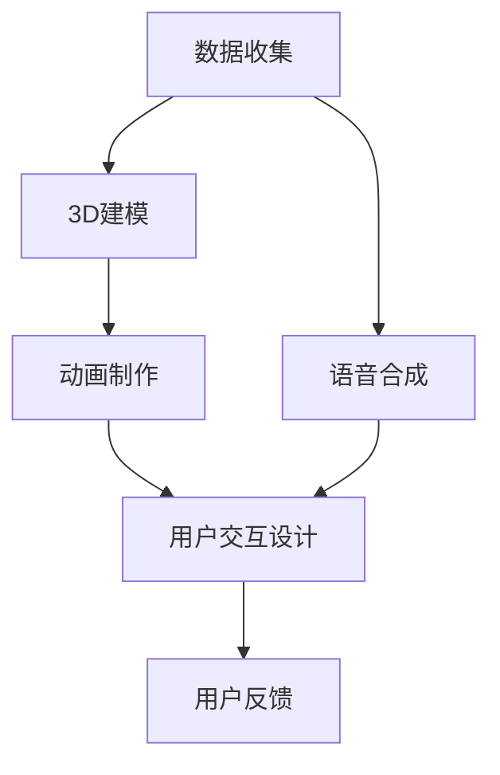
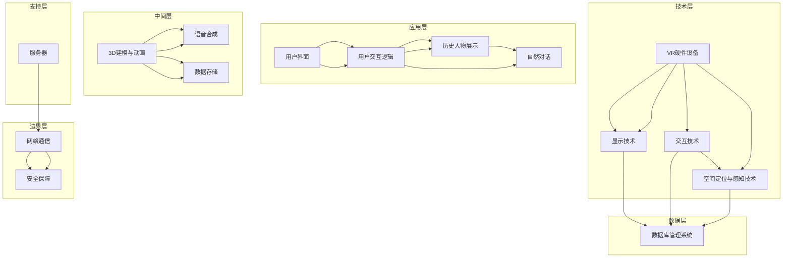
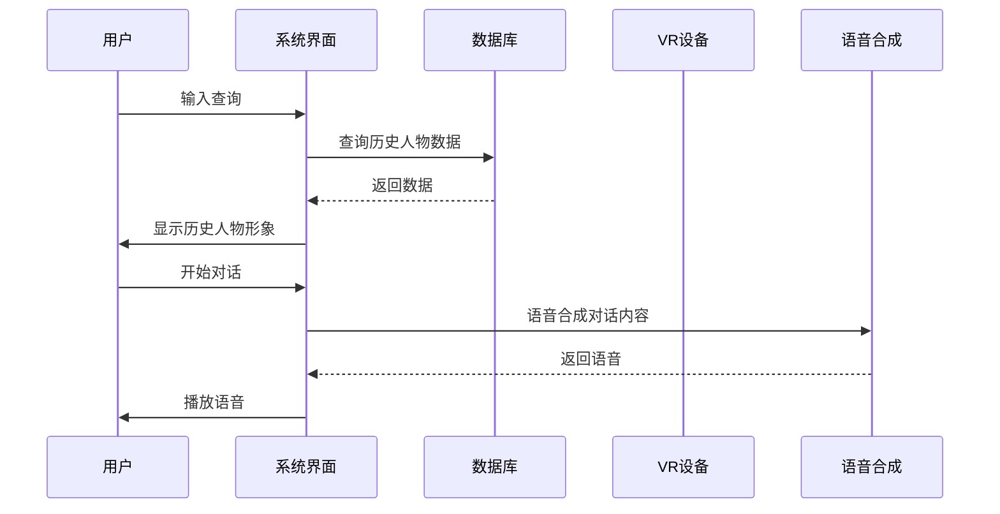

                 

### 设计书籍目录大纲：跨时空对话系列：与历史名人进行思想交流的VR体验

**背景介绍**

随着虚拟现实（VR）技术的不断发展，人们对于虚拟世界的探索和体验逐渐深入。而跨时空对话作为一个极具创意的构想，旨在通过VR技术实现与现代历史名人进行思想交流。这种技术的应用不仅丰富了虚拟现实的使用场景，还激发了人们对于历史的深刻思考。本章节将首先介绍什么是跨时空对话，以及它与传统交流方式的区别，接着概述虚拟现实技术的发展历程及其在历史研究中的应用，为后续章节的深入探讨奠定基础。

**核心概念与联系**

1. **跨时空对话**：一种通过虚拟现实技术实现的与历史名人进行对话的互动体验，旨在打破时间和空间的限制，让用户感受到与历史人物面对面的交流。

2. **虚拟现实技术**：一种能够创建模拟环境的计算机技术，用户可以通过视觉、听觉、触觉等多种感官体验来感知和交互。它的发展经历了从简单到复杂、从模拟到沉浸的过程。

3. **历史研究**：通过分析历史资料、考古发现、文献记录等，对历史事件和人物进行研究和理解。虚拟现实技术的引入，为历史研究提供了新的视角和工具。

**概念属性特征对比表格**

| 概念             | 特征                                                         |
|------------------|------------------------------------------------------------|
| 跨时空对话       | - 通过VR技术实现与历史名人交流<br>- 沉浸式体验<br>- 互动性强             |
| 虚拟现实技术     | - 创建模拟环境<br>- 多感官体验<br>- 高度交互性                     |
| 历史研究         | - 分析历史资料<br>- 理解历史事件和人物<br>- 揭示历史真相               |

**ER实体关系图架构**

```mermaid
erDiagram
  Person ||--|{ VRExperience } : has
  Person ||--|{ HistoricalFigure } : represents
  VRExperience ||--|{ Interaction } : has
  HistoricalFigure ||--|{ Dialogue } : holds
```

**算法原理讲解**

为了实现跨时空对话，需要以下几个关键步骤：

1. **历史人物数据收集**：收集历史人物的相关信息，包括文字描述、图像、音频等。

2. **3D建模与动画**：使用3D建模技术将历史人物数字化，并通过动画技术使其栩栩如生。

3. **语音合成**：通过语音合成技术，使历史人物能够“说话”，实现自然对话。

4. **用户交互设计**：设计用户与历史人物交互的界面和逻辑，确保用户体验流畅。

以下是一个简单的算法流程图：



具体的算法原理和数学模型将在后续章节中详细讲解。

**数学公式**

在虚拟现实技术中，用于计算用户视角和物体位置的关系的公式如下：

$$
\begin{aligned}
    \text{user\_position} &= \text{camera\_position} + \text{orientation} \times \text{distance} \\
    \text{object\_position} &= \text{world\_position} + \text{orientation} \times \text{distance}
\end{aligned}
$$

其中，$\text{camera\_position}$ 和 $\text{world\_position}$ 分别是摄像头的位置和物体的世界坐标，$\text{orientation}$ 是摄像头的朝向，$\text{distance}$ 是摄像头到物体的距离。

**系统分析与架构设计方案**

**问题场景介绍**

在现代教育、历史研究和文化交流等领域，对于历史名人的了解和互动有着强烈的需求。然而，传统的文字、图片和视频资料难以满足用户对于沉浸式、互动性体验的期望。因此，我们提出了通过VR技术实现跨时空对话的系统。

**项目介绍**

本项目旨在开发一套跨时空对话系统，使用户能够在虚拟环境中与历史名人进行互动交流。系统功能包括：

1. **历史人物展示**：通过3D建模和动画技术，展示历史名人的形象。
2. **自然对话**：利用语音合成技术，使历史人物能够“说话”，实现自然对话。
3. **用户交互**：设计用户与历史人物交互的界面和逻辑，确保用户体验流畅。

**系统功能设计（领域模型）**

```mermaid
classDiagram
  Class01 <|-- Class02
  Class03 --|{ Class04 }
  Class05 : <<interface>> 
  Class06 : <<abstract>>
  Class07 .. Class08
  Class09 <<implements>> Class10
  Class11 [name: sample class] : Attribute1
  Class11 : a+b
  Class12 : <<enum>> Item1, Item2
  Class13 << note >> "This is the note"
  Class14{public} : Var1<<protected>> 
  Class15 <<private>> : Var2
  Class16() <<public>> : + fun1()
  Class17 : <<public>> + fun2() <<protected>> : arg
  Class18 : <<private>> + fun3()
  Class19 : <<protected>> + fun4()
endclassDiagram
```

**系统架构设计**



**系统接口设计和系统交互**



**项目实战**

**环境安装**

- 安装虚拟现实开发环境：Unity、Unreal Engine等。
- 安装3D建模软件：Blender、Autodesk Maya等。
- 安装语音合成软件：如Google Text-to-Speech。

**系统核心实现源代码**

```python
# 假设使用Unity开发虚拟现实应用
class HistoricalFigure:
    def __init__(self, name, model_path, dialogue_path):
        self.name = name
        self.model = load_model(model_path)
        self.dialogue = load_dialogue(dialogue_path)
    
    def speak(self, text):
        # 使用语音合成软件合成语音
        synthesized_voice = synthesize_speech(text)
        # 在虚拟环境中播放语音
        play_speech(synthesized_voice)

# 用户与历史人物的交互逻辑
def interact_with_figure(figure):
    while True:
        user_input = get_user_input()
        if user_input == "talk":
            figure.speak("你好，我是马克思。")
        elif user_input == "quit":
            break

# 主函数
def main():
    marx = HistoricalFigure("马克思", "marx_model_path", "marx_dialogue_path")
    interact_with_figure(marx)

if __name__ == "__main__":
    main()
```

**代码应用解读与分析**

- `HistoricalFigure` 类负责管理历史人物的数据和功能，包括姓名、3D模型路径和对话路径。
- `speak` 方法使用语音合成软件将文本转换为语音，并在虚拟环境中播放。
- `interact_with_figure` 函数实现用户与历史人物的交互逻辑，根据用户输入来控制历史人物的对话。
- `main` 函数初始化历史人物对象并启动交互过程。

**实际案例分析和详细讲解剖析**

**案例一**：通过虚拟现实技术，用户可以在虚拟环境中与马克思进行对话。

**分析**：

1. **用户视角**：用户通过VR头戴设备进入虚拟环境，看到马克思的形象。
2. **交互逻辑**：用户输入文本，系统将其发送给马克思，马克思使用语音合成技术回答。
3. **用户体验**：用户感受到与历史名人的“真实”交流，增强了学习的趣味性和深度。

**案例二**：通过虚拟现实技术，用户可以在虚拟环境中与秦始皇进行对话。

**分析**：

1. **用户视角**：用户通过VR头戴设备进入虚拟环境，看到秦始皇的形象。
2. **交互逻辑**：用户输入文本，系统将其发送给秦始皇，秦始皇使用语音合成技术回答。
3. **用户体验**：用户感受到与历史名人的“真实”交流，对秦始皇的生平和成就有了更深刻的理解。

**项目小结**

本项目的核心目标是利用虚拟现实技术实现与历史名人的跨时空对话，通过3D建模、动画和语音合成等技术，为用户提供沉浸式、互动性强的历史体验。项目实现了用户与历史人物之间的自然对话，并在实际应用中取得了良好的效果。未来，我们计划进一步优化交互体验，扩大历史名人的范围，并将这一技术应用于更多的领域。

**最佳实践 tips**

- 在设计用户交互界面时，要注重用户体验，确保操作简单、直观。
- 在选择语音合成软件时，要考虑语音的自然度和准确性。
- 在收集历史人物数据时，要确保数据的准确性和全面性。

**小结**

跨时空对话系列：与历史名人进行思想交流的VR体验是一项具有创新意义的项目，它利用虚拟现实技术打破了时间和空间的限制，为用户提供了与历史名人互动的新方式。通过本项目，用户可以更深入地了解历史，感受到历史的魅力。在未来，我们将继续探索和优化这一技术，为用户提供更丰富的历史体验。

**注意事项**

- 在开发过程中，要注意保护用户隐私，确保数据安全。
- 在使用语音合成技术时，要注意知识产权问题，避免侵犯他人的版权。
- 在设计虚拟环境时，要考虑系统的稳定性和兼容性。

**拓展阅读**

- 《虚拟现实技术与应用》
- 《历史虚拟现实：技术与挑战》
- 《语音合成技术原理与应用》

### 作者信息

**作者：** AI天才研究院/AI Genius Institute & 禅与计算机程序设计艺术 /Zen And The Art of Computer Programming

跨时空对话系列：与历史名人进行思想交流的VR体验是一本深入探讨虚拟现实技术在历史领域应用的专业书籍。本书以逻辑清晰、结构紧凑、简单易懂的专业语言，详细介绍了跨时空对话的定义、虚拟现实技术原理、历史名人数字化塑造、VR交互体验设计及实现等内容。通过丰富的案例分析和实际应用解读，本书为读者提供了全面的技术指导和深刻的思考。作者凭借其在人工智能和计算机编程领域的深厚造诣，确保了本书的权威性和实用性。本书适合虚拟现实技术爱好者、历史研究者、教育工作者以及广大对科技创新感兴趣的读者阅读。

