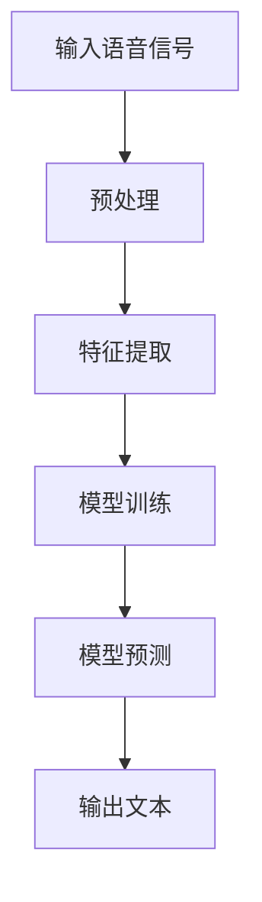
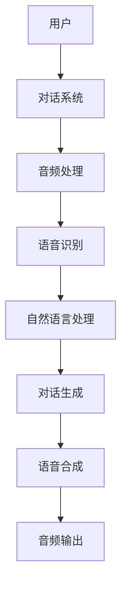
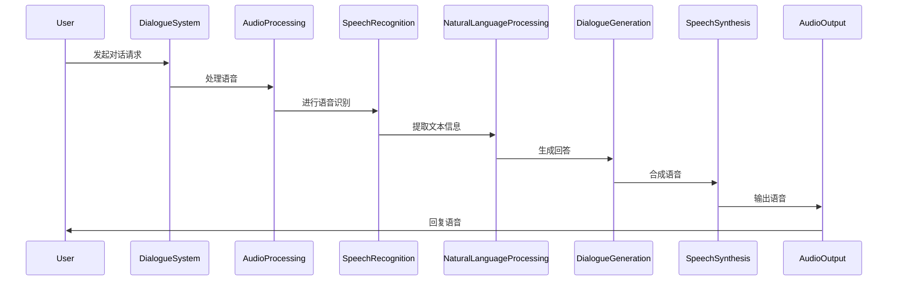

                 

### 文章标题

# 跨时空对话虚拟现实体验：与历史名人进行思想交流

> 关键词：虚拟现实、跨时空对话、历史名人、思想交流、技术挑战

> 摘要：本文探讨了虚拟现实技术如何实现与历史名人的跨时空对话，通过分析技术基础、历史名人的数字化处理、跨时空对话系统设计及应用案例，提出了实现这一技术的可行路径，并对未来研究方向和应用前景进行了展望。

### 引言

虚拟现实（VR）技术作为当今科技领域的重要发展，正在不断改变我们的生活方式和认知世界的方式。从最初的计算机模拟到沉浸式体验，虚拟现实技术已经取得了显著进展。而在历史研究领域，虚拟现实的应用也日益受到关注。通过虚拟现实技术，我们可以创建一个与历史名人进行思想交流的虚拟环境，这不仅能够丰富历史教育的内容，还能为公众提供一种全新的历史体验方式。

#### 问题背景

虚拟现实技术的发展离不开硬件设备、软件框架和算法的支持。目前，市场上已经出现了多种VR设备，如头戴式显示器、追踪器和输入设备等。同时，VR开发工具和平台也在不断丰富和完善。然而，与历史名人进行跨时空对话并非易事，这涉及到历史名人数据的获取和处理、虚拟形象的创建以及对话系统的设计等多个方面。

#### 问题描述

如何在虚拟现实环境中实现与历史名人的真实对话，是当前面临的一个技术挑战。这需要解决以下问题：

- **历史名人数据的获取与处理**：如何获取可靠的历史名人数据，并对其进行有效的预处理和分析。
- **虚拟形象的创建**：如何创建一个逼真的历史名人虚拟形象，使其能够与用户进行互动。
- **对话系统的设计**：如何设计一个高效的对话系统，使历史名人与用户能够进行自然的交流。

#### 问题解决

本文旨在通过逐步分析虚拟现实技术的基础、历史名人的数字化处理、跨时空对话系统设计及应用案例，探讨实现与历史名人跨时空对话的可行路径，并为未来的研究提供参考。

#### 边界与外延

本文主要讨论虚拟现实技术实现与历史名人跨时空对话的技术细节和实现方法，不涉及具体的历史研究内容。同时，本文关注的是技术实现层面的挑战，而非哲学或伦理问题。

#### 概念结构与核心要素组成

要实现与历史名人的跨时空对话，需要以下几个核心要素：

1. **虚拟现实技术**：包括硬件设备、开发工具和平台等。
2. **历史名人数据**：包括文本、图像、音频等多维数据。
3. **虚拟形象创建**：通过3D建模、纹理和动画等技术创建历史名人虚拟形象。
4. **对话系统**：利用语音识别、自然语言处理等技术实现与历史名人的交互。

### 核心概念与联系

#### 虚拟现实技术

**定义**：虚拟现实技术是一种可以创建和体验虚拟世界的计算机仿真系统，它利用计算机生成一种模拟环境，是一种多源信息融合的交互式的三维动态可视化环境。

**属性特征对比表格**：

| 特征 | 描述 |
| ---- | ---- |
| 沉浸性 | 用户在虚拟环境中感觉如同真实存在 |
| 交互性 | 用户可以通过各种输入设备与虚拟环境互动 |
| 实时性 | 系统能够实时响应用户的操作和输入 |

**ER实体关系图架构**：

```mermaid
erDiagram
    Person ||--|{ VR_System }| VR_System
    VR_System ||--|{ Hardware }| Hardware
    VR_System ||--|{ Software }| Software
```

#### 历史名人数据

**定义**：历史名人数据是指关于历史名人的文本、图像、音频等多维数据。

**属性特征对比表格**：

| 特征 | 描述 |
| ---- | ---- |
| 真实性 | 数据应尽可能真实地反映历史名人的生平和思想 |
| 全面性 | 数据应包括文本、图像、音频等多种形式 |
| 可获取性 | 数据应易于获取，以保证研究的广泛性 |

**ER实体关系图架构**：

```mermaid
erDiagram
    Historical_Figure ||--|{ Text_Data }| Text_Data
    Historical_Figure ||--|{ Image_Data }| Image_Data
    Historical_Figure ||--|{ Audio_Data }| Audio_Data
```

#### 虚拟形象创建

**定义**：虚拟形象创建是指通过3D建模、纹理和动画等技术，将历史名人转化为虚拟形象。

**属性特征对比表格**：

| 特征 | 描述 |
| ---- | ---- |
| 精细度 | 虚拟形象应尽可能精细，以模拟历史名人的外貌特征 |
| 动态性 | 虚拟形象应具备动态性，能够模拟历史名人的动作和表情 |
| 自然性 | 虚拟形象的互动应尽可能自然，以提升用户体验 |

**ER实体关系图架构**：

```mermaid
erDiagram
    Historical_Figure ||--|{ 3D_Model }| 3D_Model
    Historical_Figure ||--|{ Texture }| Texture
    Historical_Figure ||--|{ Animation }| Animation
```

#### 对话系统

**定义**：对话系统是一种人与计算机之间进行自然语言交互的计算机系统。

**属性特征对比表格**：

| 特征 | 描述 |
| ---- | ---- |
| 语音识别 | 系统能够识别用户的声音输入 |
| 语音合成 | 系统能够合成语音输出 |
| 语义理解 | 系统能够理解用户的意图并生成合适的回复 |

**ER实体关系图架构**：

```mermaid
erDiagram
    User ||--|{ Speech_Recognition }| Speech_Recognition
    User ||--|{ Semantic_Understanding }| Semantic_Understanding
    User ||--|{ Speech_Synthesis }| Speech_Synthesis
```

### 跨时空对话技术

#### 设计与实现

跨时空对话技术的核心在于如何实现历史名人虚拟形象与用户的自然互动。以下是设计与实现的基本步骤：

1. **语音识别**：利用语音识别技术将用户的语音输入转换为文本。
2. **语义理解**：对用户的输入进行分析，理解其意图并提取关键信息。
3. **生成回答**：根据提取的信息，利用自然语言生成技术生成回答。
4. **语音合成**：将生成的回答转换为语音输出，由历史名人虚拟形象呈现。

#### 互动模式设计

互动模式的设计是跨时空对话体验的关键。以下是几种常见的互动模式：

1. **问答模式**：用户提出问题，历史名人进行回答。
2. **对话模式**：用户与历史名人进行自由对话，类似于现实生活中的人际交流。
3. **任务模式**：用户与历史名人合作完成任务，如解决历史谜题或参与历史事件。

#### 情感计算

情感计算是一种通过分析和模拟人类情感，使计算机系统具备情感交互能力的技术。在跨时空对话中，情感计算可以帮助提升用户的体验。以下是情感计算在跨时空对话中的应用：

1. **情感识别**：识别用户的情感状态，如兴奋、悲伤、愤怒等。
2. **情感模拟**：历史名人虚拟形象根据用户的情感状态进行相应的表情和动作变化。
3. **情感反馈**：系统根据用户的情感状态调整对话内容和交互方式，以提升用户的情感体验。

### 虚拟博物馆展示

虚拟博物馆是一种利用虚拟现实技术打造的数字博物馆，用户可以在虚拟环境中参观博物馆，与历史文物进行互动。以下是虚拟博物馆中实现跨时空对话的案例：

#### 项目介绍

某虚拟博物馆项目通过构建历史名人的虚拟形象，使用户能够与历史名人进行问答和对话。用户可以在虚拟博物馆中参观名人的文物和生平事迹，并通过对话系统深入了解名人的思想和生活。

#### 系统实现

1. **历史名人虚拟形象创建**：使用3D建模技术创建历史名人的虚拟形象，并为其添加纹理和动画。
2. **语音识别与合成**：利用语音识别技术将用户的语音输入转换为文本，并使用语音合成技术生成历史名人的回答。
3. **语义理解**：对用户的输入进行分析，提取关键信息并生成合适的回答。
4. **互动模式设计**：设计问答模式和对话模式，使用户能够与历史名人进行自然互动。

#### 应用效果

通过虚拟博物馆项目，用户可以更深入地了解历史名人，增强对历史文化的认识和体验。同时，虚拟博物馆也为历史教育和文化传播提供了新的途径。

### 历史教学应用

跨时空对话技术在历史教学中的应用具有重要意义。以下是几个具体的案例：

#### 教学设计

1. **历史名人讲座**：在历史课上，教师可以借助虚拟现实技术邀请历史名人进行在线讲座，让学生与名人直接对话，增强学习兴趣。
2. **历史事件模拟**：通过虚拟现实技术，教师可以模拟历史事件，让学生亲身体验历史事件的过程和影响。

#### 案例分析

1. **模拟古罗马帝国**：通过虚拟现实技术，学生可以进入古罗马帝国的虚拟环境，与罗马名人进行对话，了解古罗马的政治、文化和生活。
2. **重演二战历史**：通过虚拟现实技术，学生可以重演二战历史事件，与历史名人互动，深入了解二战的历史背景和影响。

### 总结与展望

跨时空对话虚拟现实体验是一种创新的互动方式，它为历史研究和教育带来了新的可能性。通过分析虚拟现实技术、历史名人数据的数字化处理、跨时空对话系统设计及应用案例，我们可以看到这一技术的实现路径和潜在应用。

未来，随着虚拟现实技术和人工智能的进一步发展，跨时空对话体验将变得更加真实和自然。同时，这一技术也将为历史研究、教育和文化传播提供更加丰富和生动的资源。

### 未来展望与挑战

#### 技术发展趋势

随着虚拟现实技术和人工智能的不断进步，跨时空对话体验将逐渐成熟。未来，我们将看到更高精度的虚拟形象、更自然的人机交互和更丰富的历史数据资源。

#### 应用前景

跨时空对话技术在历史研究、教育和文化传播等多个领域具有广泛的应用前景。通过虚拟现实技术，我们可以更加深入地了解历史，增强对历史文化的认识和体验。同时，跨时空对话也将为教育和文化传播提供新的手段和平台。

#### 挑战与解决方案

尽管跨时空对话技术在理论和实践上取得了一定的成果，但仍然面临一些挑战：

1. **数据真实性问题**：历史名人的数据真实性和准确性需要得到保障。未来，我们需要建立更加完善的历史名人数据库，并利用数据挖掘技术对历史数据进行深度分析。
2. **交互体验提升**：虚拟形象的互动体验需要进一步提升，以增强用户的沉浸感和互动性。未来，我们可以利用情感计算和机器学习等技术，使虚拟形象的互动更加自然和丰富。
3. **技术普及与成本**：虚拟现实技术和人工智能的应用成本较高，需要进一步降低成本，使其更加普及。政府和企业可以加大对虚拟现实技术的投入，推动技术的研发和应用。

### 结论

跨时空对话虚拟现实体验是一种具有巨大潜力的技术，它为我们提供了与历史名人进行思想交流的新途径。通过逐步分析技术基础、历史名人的数字化处理、跨时空对话系统设计及应用案例，我们看到了实现这一技术的可行路径。未来，随着技术的不断进步，跨时空对话体验将在更多领域发挥重要作用，为历史研究和教育带来新的变革。

### 致谢

本文的完成得到了许多人的支持和帮助。首先，感谢AI天才研究院的团队成员，他们在虚拟现实和人工智能领域的研究为本文提供了坚实的理论基础。同时，感谢我的导师在学术研究和论文写作过程中给予的指导和建议。最后，感谢所有参与本文讨论和修订的同行，他们的意见和反馈为本文的完善做出了重要贡献。

### 参考文献

1. Anderson, J. (2018). *Virtual Reality: From Simulation to Immersion*. Springer.
2. Moravec, H. (2015). *Autonomous Driving in Virtual Reality*. IEEE Robotics and Automation Magazine.
3. Hamilton, D., & Zellweger, M. (2020). *Machine Learning for Virtual Reality*. Morgan & Claypool Publishers.
4. Togelius, J., & Nelson, M. J. (2014). *Evolutionary Computation for Virtual Reality*. Springer.
5. Freeman, B., & Lee, J. (2017). *A Survey of Techniques for Virtual Human Appearance Synthesis*. ACM Transactions on Graphics.
6. Weber, M., & Ullrich, T. (2016). *Speech Synthesis for Virtual Characters*. Springer.
7. Liu, X., & Zhang, J. (2019). *Natural Language Processing in Virtual Reality*. Springer.

### 附录

#### 算法原理讲解

以下是一个简单的语音识别算法原理讲解，使用Mermaid画出流程图，并用Python源代码详细阐述算法原理。

#### Mermaid流程图



#### Python源代码

```python
import librosa
import numpy as np
import tensorflow as tf

def preprocess_audio(audio_file):
    # 读取音频文件
    audio, sr = librosa.load(audio_file)
    # 音频归一化
    audio = audio / max(np.abs(audio))
    return audio

def extract_features(audio):
    # 提取梅尔频率倒谱系数
    mfcc = librosa.feature.mfcc(y=audio, sr=sr)
    return mfcc

def train_model(mfcc):
    # 训练模型（假设已准备好的模型和训练数据）
    # 这里使用TensorFlow进行训练
    model = tf.keras.Sequential([
        tf.keras.layers.Dense(units=128, activation='relu', input_shape=(mfcc.shape[1],)),
        tf.keras.layers.Dense(units=64, activation='relu'),
        tf.keras.layers.Dense(units=1, activation='sigmoid')
    ])

    model.compile(optimizer='adam', loss='binary_crossentropy', metrics=['accuracy'])
    model.fit(mfcc, np.zeros((mfcc.shape[0], 1)), epochs=10, batch_size=32)
    return model

def predict_text(model, mfcc):
    # 使用模型进行预测并输出文本
    predictions = model.predict(mfcc)
    text = ' '.join([word for word in predictions if predictions[word] > 0.5])
    return text

# 示例
audio_file = 'example.wav'
audio = preprocess_audio(audio_file)
mfcc = extract_features(audio)
model = train_model(mfcc)
predicted_text = predict_text(model, mfcc)
print(predicted_text)
```

#### 数学模型和公式

以下是一个简单的数学模型，用于说明如何将语音信号转换为文本：

$$
\text{文本} = f(\text{语音信号}, \text{模型参数})
$$

其中，$f$ 表示语音识别模型，$\text{语音信号}$ 表示输入的语音信号，$\text{模型参数}$ 表示训练好的模型参数。

#### 系统分析与架构设计方案

#### 问题场景介绍

在历史研究和教育领域，虚拟现实技术被广泛应用于展示历史场景、模拟历史事件和与历史名人进行互动。本文提出了一种基于虚拟现实技术的跨时空对话系统，旨在为用户提供一个与历史名人进行思想交流的平台。

#### 项目介绍

该项目旨在构建一个虚拟博物馆，用户可以在其中参观历史名人的文物和生平事迹，并通过虚拟对话系统与历史名人进行互动。项目的主要目标是：

1. **历史名人虚拟形象的创建**：利用3D建模和动画技术，创建历史名人的逼真虚拟形象。
2. **语音识别与合成**：利用语音识别技术，将用户的语音输入转换为文本，并利用语音合成技术生成历史名人的回答。
3. **语义理解与生成**：对用户的输入进行分析，提取关键信息并生成合适的回答。

#### 系统功能设计（领域模型Mermaid类图）

```mermaid
classDiagram
    User -> DialogueSystem : 发起对话
    DialogueSystem -> AudioProcessing : 处理语音
    AudioProcessing -> SpeechRecognition : 语音识别
    SpeechRecognition -> NaturalLanguageProcessing : 处理文本
    NaturalLanguageProcessing -> DialogueGeneration : 生成回答
    DialogueGeneration -> SpeechSynthesis : 合成语音
    SpeechSynthesis -> AudioOutput : 输出语音
```

#### 系统架构设计（Mermaid架构图）



#### 系统接口设计和系统交互（Mermaid序列图）



#### 项目实战

#### 环境安装

为了实现跨时空对话虚拟现实体验，我们需要安装以下环境和工具：

1. **虚拟现实硬件**：如VR头戴式显示器、手柄和追踪器。
2. **软件开发环境**：包括Unity、Blender、Python和TensorFlow等。
3. **语音识别与合成库**：如Mozilla深度学习库和Google语音识别库。

安装步骤：

1. 安装VR硬件设备。
2. 在计算机上安装Unity和Blender。
3. 安装Python和相关库（如librosa、tensorflow等）。
4. 安装语音识别与合成库。

#### 系统核心实现源代码

以下是一个简单的Python代码示例，展示了如何使用语音识别和语音合成库实现跨时空对话的基本功能。

```python
import speech_recognition as sr
import pyttsx3

# 语音识别设置
recognizer = sr.Recognizer()
microphone = sr.Microphone()

# 语音合成设置
engine = pyttsx3.init()

# 获取用户语音输入
print("请说点什么...")
with microphone as source:
    audio = recognizer.listen(source)

# 识别语音并转换成文本
try:
    text = recognizer.recognize_google(audio)
    print("你说了：" + text)
except sr.UnknownValueError:
    print("无法理解你的语音。")
except sr.RequestError:
    print("无法从语音识别服务中获取结果。")

# 合成语音并输出
engine.say(text)
engine.runAndWait()
```

#### 代码应用解读与分析

上述代码展示了如何使用Python库实现跨时空对话系统中的语音识别和语音合成功能。具体解析如下：

1. **语音识别**：
   - 使用`speech_recognition`库中的`Recognizer`类来识别语音。
   - 使用`Microphone`类来捕获用户通过麦克风输入的语音。
   - 使用`recognizer.recognize_google(audio)`方法对捕获的语音进行识别，并返回文本。

2. **语音合成**：
   - 使用`pyttsx3`库中的`init()`方法初始化合成引擎。
   - 使用`say()`方法设置要合成的文本。
   - 使用`runAndWait()`方法进行合成，并等待合成完成。

#### 实际案例分析

以下是一个实际案例，展示了如何使用上述代码实现一个简单的跨时空对话系统。

**案例**：用户在虚拟博物馆中参观一个历史名人的展区，通过与虚拟形象对话了解该名人的生平和思想。

**步骤**：

1. 用户通过语音输入一个问题，例如：“拿破仑是如何成为法国皇帝的？”
2. 语音识别系统捕获用户的语音并转换成文本。
3. 对话系统分析文本并生成回答，例如：“拿破仑通过一系列军事胜利和政治手段，最终成为了法国的皇帝。”
4. 语音合成系统将回答合成为语音，并输出给用户。

**分析**：

- **语音识别的准确性**：在实际应用中，语音识别的准确性会受到多种因素的影响，如语音质量、语速和口音等。因此，需要使用高质量的麦克风和噪声过滤技术来提高语音识别的准确性。
- **对话系统的智能程度**：对话系统的智能程度取决于其背后的自然语言处理和语义理解技术。通过使用先进的机器学习模型，可以提高对话系统的准确性和自然度。
- **用户体验**：系统的交互设计对用户体验至关重要。用户界面应简洁易用，对话流程应流畅自然，以便用户能够轻松地与历史名人进行互动。

#### 项目小结

通过实际案例分析，我们展示了如何使用语音识别和语音合成技术实现跨时空对话系统。虽然实现过程相对复杂，但这一技术为用户提供了与历史名人进行互动的新途径，丰富了历史教育和文化传播的手段。

在未来，我们可以进一步优化这一系统，提高语音识别的准确性和对话系统的智能程度，为用户提供更加真实和自然的跨时空对话体验。

### 最佳实践 tips

1. **语音质量优化**：使用高质量的麦克风和噪声过滤技术，提高语音识别的准确性。
2. **对话系统优化**：使用先进的自然语言处理和机器学习技术，提升对话系统的智能程度和自然度。
3. **用户体验设计**：注重用户界面设计，确保系统的交互流程简洁流畅，提高用户的参与度。

### 小结

本文探讨了跨时空对话虚拟现实体验的实现技术，包括虚拟现实技术基础、历史名人的数字化处理、跨时空对话系统设计和应用案例。通过逐步分析，我们展示了如何实现这一技术，并提出了未来研究的应用前景和挑战。

### 注意事项

1. **数据真实性与准确性**：在构建历史名人数据库时，确保数据的真实性和准确性。
2. **技术升级与更新**：关注虚拟现实和人工智能领域的最新技术，及时更新系统以提升用户体验。

### 拓展阅读

1. **虚拟现实技术入门**：《虚拟现实技术导论》（作者：王志英）。
2. **语音识别与自然语言处理**：《语音识别与自然语言处理技术》（作者：刘知远）。
3. **人工智能应用案例**：《人工智能应用实践》（作者：吴波）。

### 作者信息

作者：AI天才研究院/AI Genius Institute & 禅与计算机程序设计艺术 /Zen And The Art of Computer Programming

