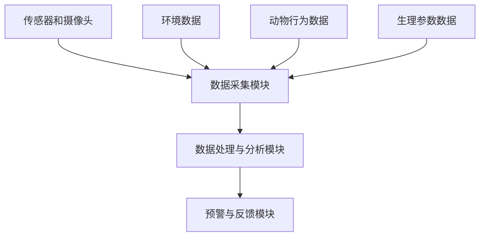
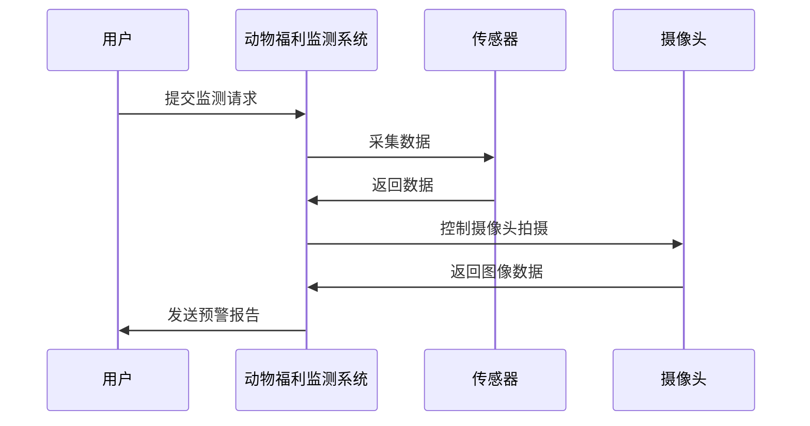

                 

## 跨物种伦理学讨论组：扩展关怀圈的生态思维

### 关键词：
- 跨物种伦理学，生态思维，动物权利，人工智能，伦理扩展，社会应用

### 摘要：
本文深入探讨了跨物种伦理学的兴起与意义，通过分析其基础概念和实际应用，揭示了伦理学在跨物种关系中的重要作用。本文将探讨动物权利与人类伦理的关系、人与自然的关系以及人工智能在跨物种伦理学中的应用。同时，本文也将展望跨物种伦理学的未来挑战与机遇，并提供实际应用案例和最佳实践 tips。通过本文的阅读，读者将能够全面理解跨物种伦理学的重要性，以及如何在现实世界中运用这一理论。

## 引言

### 跨物种伦理学的起源与发展

跨物种伦理学（Interspecies Ethics）是一个相对较新的研究领域，其概念源于对伦理学传统边界的扩展。传统的伦理学研究主要集中在人类个体或群体之间的道德关系，而跨物种伦理学则将研究范畴拓展到了人类与其他物种之间的关系。这一转变源于对生态问题和动物权利关注度的增加，以及对地球生态系统中所有生命体相互依存的深入理解。

跨物种伦理学的兴起可以追溯到20世纪末和21世纪初，当时生态伦理学和社会正义理论的学者开始探讨人类与自然、动物之间的关系。随着科技的发展，特别是人工智能的迅速崛起，跨物种伦理学的研究逐渐受到了更广泛的关注。人们开始意识到，在处理生态问题和动物权利问题时，仅依赖人类自身的伦理观念是不够的，需要建立一套适用于不同物种之间的伦理原则。

### 跨物种伦理学的重要性

跨物种伦理学的出现，不仅为伦理学的研究提供了新的视角，也为我们理解和解决现实世界中的诸多问题提供了理论支持。以下是跨物种伦理学的重要性体现：

1. **生态保护**：在全球化背景下，生态环境的恶化已经成为全球性的问题。跨物种伦理学的理念强调了人类在生态系统中与其他物种的相互依存性，促使我们采取更加负责任的行动，保护地球生态系统的多样性。

2. **动物权利**：传统伦理学往往忽略了动物的权利和福祉。跨物种伦理学通过探讨人类与动物之间的关系，呼吁我们对动物权利给予更多的关注和尊重，从而推动动物保护事业的发展。

3. **社会正义**：跨物种伦理学不仅关注人类与动物的关系，也关注人类与其他物种之间的公正问题。这种扩展使得伦理学的理论更加全面，能够更好地应对现代社会中的各种不公正现象。

4. **科技进步**：随着科技的发展，人类对自然界的影响日益扩大。跨物种伦理学的出现，为我们提供了一种新的思考方式，促使我们在科技进步的过程中，更加注重生态伦理和社会正义。

### 本文结构

本文将按照以下结构展开：

1. **基础概念**：首先，我们将介绍跨物种伦理学的基础概念，包括其核心原理和理论基础。

2. **核心概念与联系**：接着，我们将详细分析核心概念之间的联系，并通过表格和ER实体关系图进行阐述。

3. **算法原理讲解**：为了更好地理解跨物种伦理学的实际应用，我们将讨论相关算法原理，并使用mermaid流程图和Python源代码进行解释。

4. **系统分析与架构设计**：本文还将介绍跨物种伦理学在系统架构设计中的应用，包括领域模型、系统架构和接口设计。

5. **项目实战**：通过一个实际项目，我们将展示如何将跨物种伦理学应用于实际场景，并提供详细的代码解读和案例分析。

6. **最佳实践与小结**：最后，我们将总结最佳实践，并对文章内容进行小结，提出未来研究方向。

通过本文的阅读，读者将能够深入理解跨物种伦理学的理论和实践，为解决现实世界中的伦理问题提供新的思路和方法。接下来，我们将正式进入跨物种伦理学的基础概念和原理的探讨。

## 跨物种伦理学的基础概念

### 核心原理

跨物种伦理学的核心原理可以概括为两个方面：一是对生态系统的整体关怀，二是对个体物种的尊重。具体来说：

1. **生态系统的整体关怀**：这一原理强调了人类与自然界中的其他物种共同构成了一个复杂的生态系统，各物种之间存在着紧密的相互依赖关系。因此，伦理学不应仅限于人类个体或群体之间的道德关系，而应扩展到整个生态系统。这要求我们采取更加负责任的行为，保护生态系统的平衡和多样性。

2. **个体物种的尊重**：这一原理关注个体物种的权利和福祉。在传统伦理学中，动物通常被视为人类的工具或资源。而跨物种伦理学则强调，每个物种都有其存在的价值，都应得到我们的尊重和保护。这种尊重不仅体现在对动物的关怀上，还包括对其他物种生存环境的保护。

### 基本概念

在跨物种伦理学中，还有一些基本概念需要我们了解：

1. **生态伦理**：生态伦理是一种关注人类与自然界之间关系的伦理学分支，主张人类应当以负责任的态度对待自然环境。生态伦理的核心思想是，人类应尊重自然、保护生态系统的健康和稳定。

2. **动物权利**：动物权利是指动物在自然界中应享有的基本权利，包括生存权、自由权、福利权等。动物权利理论主张，动物不应被视为人类的私有财产或工具，而应被视为具有独立价值和权利的生命体。

3. **环境正义**：环境正义是指在不同物种之间实现公正和公平的环境权益分配。环境正义强调，任何物种都不应因为其物种属性而遭受不公平的对待。

### 基本原理与理论基础

跨物种伦理学的基本原理和理论基础可以从以下几个方面进行阐述：

1. **生态整体观**：生态整体观是一种强调生态系统内部各要素之间相互依赖、相互作用的观念。跨物种伦理学认为，任何物种的行为都会对整个生态系统产生影响，因此，我们应采取整体观念，综合考虑各物种的权益。

2. **物种平等观**：物种平等观主张，在生态系统中，各物种都应享有平等的权利和机会。这种观点不仅适用于人类与其他动物之间的关系，也适用于人类与植物、微生物等非动物物种之间的关系。

3. **伦理扩展理论**：伦理扩展理论是一种将伦理关怀从人类扩展到其他物种的理论。这种理论认为，随着我们对自然界的理解加深，我们的伦理责任范围也应相应扩展。例如，如果我们认识到动物具有感受快乐和痛苦的能力，我们就应对动物的福利给予更多关注。

4. **动物解放理论**：动物解放理论主张，人类应解放动物，使它们摆脱作为人类工具或资源的地位。这种理论认为，动物应享有自由，不应被用于满足人类的消费需求。

### 概念属性特征对比表格

为了更好地理解跨物种伦理学的基本概念，我们可以通过一个表格来对比这些概念的核心属性和特征：

| 概念       | 定义                                                         | 核心属性和特征                                                                                   |
| ---------- | ------------------------------------------------------------ | ------------------------------------------------------------------------------------------------ |
| 生态伦理   | 关注人类与自然界之间关系的伦理学分支                           | 强调人类应尊重自然、保护生态系统的健康和稳定；考虑生态系统整体利益；关注人类对环境的影响           |
| 动物权利   | 动物在自然界中应享有的基本权利，包括生存权、自由权、福利权等   | 强调动物不应被视为人类的工具或资源；关注动物的感受能力和福利；倡导动物权利保护                 |
| 环境正义   | 在不同物种之间实现公正和公平的环境权益分配                     | 关注物种间的公平对待；强调生态系统中各物种的权利和责任；关注环境权益的合理分配                 |
| 生态整体观 | 强调生态系统内部各要素之间相互依赖、相互作用的观念             | 关注生态系统整体利益；强调整体观念；考虑各物种的相互依赖关系                                   |
| 物种平等观 | 主张在生态系统中，各物种都应享有平等的权利和机会               | 强调物种间的平等对待；考虑各物种的生存和发展需求；倡导生态公平                                 |
| 动物解放理论 | 主张人类应解放动物，使它们摆脱作为人类工具或资源的地位         | 关注动物的自由和权利；反对动物被用于满足人类消费需求；倡导动物解放                             |
| 伦理扩展理论 | 将伦理关怀从人类扩展到其他物种的理论                         | 强调伦理关怀范围的扩展；考虑其他物种的权益和感受；推动伦理观念的更新和发展                       |

通过这个表格，我们可以更清晰地理解跨物种伦理学中的各个概念及其相互关系。

### ER实体关系图

为了更好地展示跨物种伦理学中各概念之间的关系，我们可以使用Mermaid绘制一个ER实体关系图。以下是该图的Markdown格式：

```mermaid
erDiagram
    Animal --> Ethics : 关注动物权利和福利的伦理学分支
    Human --> Ethics : 关注人类道德行为的伦理学分支
    Nature --> Ethics : 关注人类与自然关系的伦理学分支
    Animal |--o{ EnvironmentalJustice : 环境正义关注不同物种间的公平
    Human |--o{ EnvironmentalJustice : 环境正义关注人类的行为对环境的影响
    Nature |--o{ EnvironmentalJustice : 环境正义关注生态系统整体利益
    Animal |--o{ EcologicalOverallview : 生态整体观强调生态系统中各要素的相互依赖
    Human |--o{ EcologicalOverallview : 生态整体观强调人类的行为对生态系统的影响
    Nature |--o{ EcologicalOverallview : 生态整体观强调生态系统的整体利益
    Animal |--o{ SpeciesEquality : 物种平等观主张各物种应享有平等权利
    Human |--o{ SpeciesEquality : 物种平等观强调人类应尊重其他物种
    Nature |--o{ SpeciesEquality : 物种平等观强调生态系统中各物种的平等对待
    Animal |--o{ LiberationTheory : 动物解放理论主张动物应摆脱人类工具地位
    Human |--o{ LiberationTheory : 动物解放理论强调动物的权利和自由
    Nature |--o{ LiberationTheory : 动物解放理论强调动物解放的重要性
    Ethics |--o{ EthicalExpansionTheory : 伦理扩展理论主张伦理关怀的扩展
```

以下是ER实体关系图的渲染结果：

```mermaid
erDiagram
    Animal --> Ethics : 关注动物权利和福利的伦理学分支
    Human --> Ethics : 关注人类道德行为的伦理学分支
    Nature --> Ethics : 关注人类与自然关系的伦理学分支
    Animal |--o{ EnvironmentalJustice : 环境正义关注不同物种间的公平
    Human |--o{ EnvironmentalJustice : 环境正义关注人类的行为对环境的影响
    Nature |--o{ EnvironmentalJustice : 环境正义关注生态系统整体利益
    Animal |--o{ EcologicalOverallview : 生态整体观强调生态系统中各要素的相互依赖
    Human |--o{ EcologicalOverallview : 生态整体观强调人类的行为对生态系统的影响
    Nature |--o{ EcologicalOverallview : 生态整体观强调生态系统的整体利益
    Animal |--o{ SpeciesEquality : 物种平等观主张各物种应享有平等权利
    Human |--o{ SpeciesEquality : 物种平等观强调人类应尊重其他物种
    Nature |--o{ SpeciesEquality : 物种平等观强调生态系统中各物种的平等对待
    Animal |--o{ LiberationTheory : 动物解放理论主张动物应摆脱人类工具地位
    Human |--o{ LiberationTheory : 动物解放理论强调动物的权利和自由
    Nature |--o{ LiberationTheory : 动物解放理论强调动物解放的重要性
    Ethics |--o{ EthicalExpansionTheory : 伦理扩展理论主张伦理关怀的扩展
```

这个ER实体关系图清晰地展示了跨物种伦理学中的核心概念及其相互关系，为后续内容的展开提供了理论基础。

### 总结

在本章中，我们介绍了跨物种伦理学的基础概念，包括其核心原理和理论基础。通过概念属性特征对比表格和ER实体关系图，我们更深入地理解了这些概念之间的相互关系。接下来，我们将进一步探讨伦理学在跨物种关系中的应用，分析伦理学如何在实际问题中发挥作用。

## 伦理学在跨物种关系中的应用

### 动物权利与人类伦理的关系

在跨物种伦理学中，动物权利与人类伦理的关系是一个重要的研究课题。传统伦理学往往将人类置于道德关怀的中心，而动物则被视为人类利用的工具或资源。然而，随着跨物种伦理学的发展，越来越多的学者开始关注动物的权利和福祉，并探讨如何将伦理学应用于动物保护。

首先，我们需要明确动物权利的概念。动物权利是指动物在自然界中应享有的基本权利，包括生存权、自由权、福利权等。这些权利不仅关系到动物个体的福祉，也关系到整个生态系统的健康和稳定。例如，动物有权利在自然环境中自由生活，不受人类无端的干扰和伤害；动物有权利享有良好的生活条件，如适宜的栖息地、充足的食物和清洁的水源。

人类伦理则是人类行为和道德规范的总称，包括对他人、社会和自然环境的关怀。在传统伦理学中，人类伦理主要关注人类个体或群体之间的道德关系，如正义、公平、尊重等。然而，随着跨物种伦理学的发展，人类伦理的范畴也在逐步扩展，开始关注人类与动物、植物等非人类物种之间的关系。

动物权利与人类伦理之间的关系可以从以下几个方面进行探讨：

1. **道德关怀的扩展**：传统伦理学强调人类对其他人类的道德关怀，而跨物种伦理学则将这种关怀扩展到其他物种。这种扩展不仅体现在对动物权利的关注上，也体现在对自然环境、植物等其他非人类物种的关怀上。例如，人们开始意识到，破坏森林、污染水源等行为不仅影响到人类的生活质量，也会对整个生态系统造成不可逆转的损害。

2. **动物福利保护**：跨物种伦理学的一个核心目标是保护动物的福利。动物福利是指动物在生存、生活、健康等方面的基本需求得到满足。人类伦理在这一目标中发挥着重要作用，人类应通过制定和执行相关法律法规，确保动物的权益得到尊重和保护。例如，禁止残酷对待动物、禁止虐待动物等。

3. **道德责任的承担**：在跨物种伦理学中，人类被视为地球上所有生物的共同守护者。这意味着人类有责任保护其他物种的生存权利和福祉。这种责任不仅体现在道德层面上，也体现在实际行动中。例如，人类应采取措施减少对动物栖息地的破坏，保护野生动物的生存环境；人类应减少对动物的消费，避免过度捕猎和滥食野生动物。

4. **伦理教育的推广**：跨物种伦理学的应用也需要伦理教育的推广。通过教育，人们可以更好地理解动物权利的重要性，培养对动物的尊重和保护意识。例如，学校可以开设相关课程，向学生传授动物权利知识；媒体可以制作专题节目，提高公众对动物保护的认知。

### 案例研究

为了更好地理解动物权利与人类伦理的关系，我们可以通过一些实际案例进行分析：

1. **动物实验**：动物实验在医学和生物学研究中起到了重要作用，但也引发了关于动物权利的争议。一些学者主张，动物实验应遵循伦理原则，确保动物的权利和福祉。例如，在实验设计中，应尽量减少动物的痛苦，确保实验的必要性和科学性。此外，一些国家已经制定了相关法律法规，禁止或限制某些类型的动物实验，以保护动物的权益。

2. **野生动物保护**：野生动物保护是跨物种伦理学的重要应用领域。随着人类活动的不断扩大，野生动物的生存环境受到了严重威胁。为了保护野生动物，许多国家采取了各种措施，如建立自然保护区、禁止捕猎、推动生态恢复等。这些措施不仅有助于保护野生动物的生存，也有助于维护生态平衡。

3. **动物福利立法**：动物福利立法是保护动物权利的重要手段。一些国家已经制定了专门的动物福利法律，规定动物在饲养、运输、屠宰等过程中的权利和福利。例如，禁止虐待动物、要求提供适宜的饲养条件、限制动物表演等。这些法律不仅有助于提高公众对动物权利的认识，也为动物保护提供了法律依据。

4. **动物权利运动**：动物权利运动是推动跨物种伦理学应用的重要力量。一些非政府组织和志愿者致力于推广动物权利理念，倡导动物保护行动。这些组织通过宣传活动、法律诉讼、社会倡导等方式，推动动物权利的保护。例如，一些组织成功推动了禁止象牙贸易、禁止皮草贸易等政策的制定。

通过这些案例，我们可以看到，动物权利与人类伦理之间的关系是紧密相连的。只有通过伦理学的扩展和应用，我们才能更好地保护动物的权益，实现人与自然和谐共处。

### 结论

伦理学在跨物种关系中的应用是一个复杂而多维的课题。通过分析动物权利与人类伦理的关系，以及实际案例中的应用，我们可以看到伦理学在保护动物权益、推动生态平衡和促进社会公正方面的重要作用。在接下来的章节中，我们将继续探讨人与自然的关系，以及人工智能在跨物种伦理学中的应用，进一步揭示伦理学在现实世界中的深远影响。

## 人与自然的关系

### 人与自然的关系概述

人与自然的关系是跨物种伦理学中的一个核心议题。人类作为地球生态系统的一部分，与其他物种共同生活在这个星球上。然而，随着人类社会的发展，人与自然的关系经历了巨大的变化，从原始的共生共存，到现代的改造与利用，再到当前的生态保护和可持续发展。

首先，从历史角度来看，人类与自然的关系经历了几个重要阶段：

1. **原始共生阶段**：在人类文明初期，人类对自然持敬畏态度，认为自然是一个神圣的存在。在这种观念下，人类与自然保持着一种和谐共生关系，人类依赖于自然提供的资源，同时也尊重和保护自然。

2. **改造利用阶段**：随着人类文明的进步，特别是农业革命和工业革命的推动，人类开始大规模改造自然，以满足生产和生活的需求。这一阶段，人类对自然资源的利用逐渐变得盲目和过度，导致了许多生态问题，如森林砍伐、水资源污染、物种灭绝等。

3. **生态保护阶段**：在认识到人类活动对自然环境造成的严重后果后，人类开始重视生态保护和可持续发展。这一阶段，人们意识到，只有与自然和谐共生，才能确保人类的长期生存和发展。因此，各国政府和非政府组织纷纷采取行动，推动环境保护和生态恢复。

### 人与自然的相互依赖性

人与自然的相互依赖性是跨物种伦理学的一个重要理论基础。人类不仅依赖自然提供的物质资源，如食物、水源、氧气等，还依赖自然提供的生态系统服务，如气候调节、水源净化、土壤保持等。具体来说，人与自然的相互依赖性体现在以下几个方面：

1. **物质资源依赖**：人类生存和发展需要大量的自然资源，如粮食、能源、矿产资源等。这些资源主要来自自然界的生物圈、水圈和大气圈。例如，粮食生产依赖于土壤和水资源，能源生产依赖于化石燃料和可再生能源。

2. **生态系统服务依赖**：生态系统提供了许多重要的服务，如气候调节、水源净化、土壤保持、生物多样性维持等。这些服务对人类的生存和发展至关重要。例如，气候调节有助于保持地球的适宜温度，水源净化确保了人类的饮水安全，土壤保持防止了水土流失。

3. **生物多样性依赖**：生物多样性是地球生态系统的重要组成部分，对人类的生存和发展具有不可替代的价值。生物多样性有助于维持生态系统的稳定，提供食物、药物等资源，同时也具有生态美学和科学研究的价值。

### 人类活动对自然环境的影响

人类活动对自然环境的影响是跨物种伦理学关注的另一个重要议题。随着人口增长和工业化进程的加速，人类对自然环境的破坏日益严重，导致了一系列生态问题和环境危机。以下是几个关键方面：

1. **气候变化**：人类活动，特别是化石燃料的燃烧和大规模森林砍伐，导致大气中温室气体浓度增加，进而引发全球气候变化。气候变化对生态系统和人类社会都带来了严重的影响，如极端天气事件增多、海平面上升、生态系统失衡等。

2. **生物多样性丧失**：人类活动破坏了生物栖息地，导致许多物种面临灭绝威胁。生物多样性的丧失不仅影响了生态系统的健康和稳定性，也削弱了人类对自然资源的可持续利用能力。

3. **水资源污染**：工业废水、农药和化肥的滥用导致水体污染，对人类健康和生态系统的稳定性都构成了威胁。水资源的污染不仅影响了人类的饮水安全，也影响了水生生物的生存。

4. **土地退化**：不合理的土地利用和过度开发导致土地退化，如水土流失、沙漠化、荒漠化等。土地退化不仅影响了农业生产，也加剧了全球气候变化。

### 伦理责任与可持续发展

在认识到人类活动对自然环境的影响后，跨物种伦理学提出了一系列伦理责任和可持续发展原则，以指导人类与自然的关系。以下是几个关键方面：

1. **尊重自然**：跨物种伦理学强调，人类应当尊重自然，将其视为一个有价值的整体，而非单纯的资源库。这种尊重体现在人类对自然资源的合理利用、对生态系统的保护和对生物多样性的维护。

2. **可持续发展**：可持续发展是跨物种伦理学的一个重要原则，强调人类活动应在满足当前需求的同时，不损害后代满足其需求的能力。这意味着我们需要采取可持续的生产和消费模式，减少对自然资源的依赖和破坏。

3. **全球合作**：环境保护和可持续发展是全球性的问题，需要各国政府、企业和公民社会的共同努力。跨物种伦理学提倡全球合作，通过国际法律、政策和合作机制，共同应对环境挑战。

4. **伦理教育**：跨物种伦理学认为，伦理教育对于改变人类与自然的关系至关重要。通过教育，人们可以更好地理解自然的价值和重要性，培养对自然环境的尊重和保护意识。

### 结论

人与自然的关系是一个复杂而多维的课题，涉及生态、伦理、经济和社会等多个方面。通过探讨人与自然的相互依赖性、人类活动对自然环境的影响，以及伦理责任和可持续发展原则，我们可以更好地理解跨物种伦理学在人与自然关系中的重要作用。在接下来的章节中，我们将进一步探讨人工智能在跨物种伦理学中的应用，探索科技如何影响和改变人类与自然的关系。

## 人工智能与跨物种伦理

### 人工智能的发展及其对伦理学的影响

人工智能（Artificial Intelligence, AI）作为21世纪最具革命性的科技之一，已经深刻地改变了人类社会的各个方面。从自动驾驶汽车、智能家居到医疗诊断、金融分析，人工智能的应用领域越来越广泛，同时也带来了许多新的伦理挑战。在跨物种伦理学领域，人工智能的发展同样引发了关于伦理责任的讨论。

首先，人工智能的发展对伦理学的影响主要体现在以下几个方面：

1. **伦理决策的复杂性**：人工智能系统能够处理大量数据，并基于算法做出决策。然而，这些决策往往涉及到复杂的伦理问题，如隐私保护、公平性、责任归属等。如何确保人工智能系统在决策过程中遵循伦理原则，成为了一个亟待解决的问题。

2. **对动物权利的潜在影响**：人工智能在动物保护和福利方面的应用，如动物行为监测、野生动物保护等，既带来了机遇，也提出了挑战。例如，如何确保在监控野生动物时不会对其造成伤害或干扰其自然行为？

3. **人类与自然的交互**：人工智能不仅影响人类与其他动物的关系，也改变了人类与自然环境的互动方式。例如，智能农业系统可以提高农业生产效率，但同时也可能对生态系统造成不可逆转的破坏。

### 人工智能在动物保护中的应用

人工智能在动物保护中的应用正在逐步扩大，并展现出巨大的潜力。以下是一些具体的应用领域：

1. **动物行为监测**：利用人工智能技术，可以对野生动物的行为进行实时监测和分析。例如，通过分析动物的运动轨迹和行为模式，科学家可以及时发现异常情况，如疾病传播、种群数量减少等。

2. **野生动物追踪**：无人机和卫星定位技术结合人工智能，可以实现对野生动物的远程追踪。这种技术有助于科学家了解野生动物的生存状态，评估其生存环境。

3. **栖息地保护**：人工智能可以用于分析生态系统数据，预测人类活动对栖息地的潜在影响。通过这些分析，可以制定出更有效的保护策略，减少对野生动物栖息地的破坏。

### 人工智能在生态保护中的应用

人工智能不仅对动物保护有直接影响，还在生态保护中发挥着重要作用。以下是一些具体的应用：

1. **环境监测**：人工智能可以用于实时监测环境数据，如空气质量、水质、土壤质量等。通过这些数据，可以及时发现环境问题，并采取相应的措施。

2. **气候变化预测**：人工智能模型可以分析大量气候数据，预测未来的气候变化趋势。这些预测对于制定气候政策和应对措施具有重要意义。

3. **生态恢复**：人工智能可以用于生态恢复项目，如植被恢复、湿地修复等。通过模拟和分析生态系统的变化，人工智能可以帮助科学家制定出更有效的恢复策略。

### 伦理责任与可持续发展

在人工智能的发展过程中，伦理责任和可持续发展是一个不可忽视的重要议题。以下是一些关键方面：

1. **伦理决策**：人工智能系统的设计和应用应遵循伦理原则，确保其决策过程是透明、公正和可解释的。例如，在动物保护中，应确保监控设备不会对动物造成不必要的伤害。

2. **责任归属**：在人工智能导致的伦理问题中，责任归属是一个复杂的问题。例如，如果一只野生动物因人工智能监控设备而受伤，责任应如何分配？

3. **可持续发展**：人工智能技术的发展应与可持续发展目标相结合，确保其应用不会对自然环境造成长期破坏。例如，在智能农业中，应推广可持续的农业实践，减少对生态系统的压力。

### 结论

人工智能在跨物种伦理学中的应用既带来了机遇，也提出了挑战。通过探讨人工智能的发展及其对伦理学的影响，以及其在动物保护和生态保护中的应用，我们可以看到，人工智能不仅改变了人类与动物、自然的关系，也促使我们重新审视伦理责任和可持续发展原则。在接下来的章节中，我们将进一步探讨跨物种伦理学面临的挑战与未来展望。

## 跨物种伦理学的未来展望

### 挑战与机遇

跨物种伦理学作为一个新兴领域，面临着诸多挑战和机遇。首先，挑战主要体现在以下几个方面：

1. **伦理观念的变革**：跨物种伦理学的提出，要求我们重新审视传统的伦理观念，这对许多人的思维方式产生了冲击。如何将伦理学扩展到非人类物种，如何平衡人类利益与动物权利，都是需要深入探讨的问题。

2. **科学研究的不足**：尽管跨物种伦理学的研究逐渐增多，但相关科学研究的深度和广度仍不够。例如，对于动物认知、情感和权利的理解仍有待进一步深入研究，这直接影响到跨物种伦理学理论的应用。

3. **社会接受度**：跨物种伦理学的理念在公众中尚未得到广泛认同。许多人认为动物权利的保护和生态保护是次要的，甚至有些观点认为这会损害人类利益。因此，如何提高社会对跨物种伦理学的接受度，也是一个重要挑战。

然而，面对这些挑战，跨物种伦理学同样面临着诸多机遇：

1. **科技进步的推动**：随着人工智能、大数据等技术的不断发展，跨物种伦理学有了更多应用工具和研究手段。例如，人工智能可以用于动物行为分析、生态系统监测等，为跨物种伦理学的研究提供数据支持。

2. **全球问题的驱动**：全球气候变化、生物多样性丧失等生态问题日益严重，促使各国政府和国际组织加强环境保护和生态修复工作。跨物种伦理学在这一过程中，可以为政策制定提供伦理依据。

3. **社会意识的提升**：随着公众环保意识的提升，越来越多的人开始关注动物权利和生态保护。这为跨物种伦理学的推广和普及提供了良好的社会氛围。

### 未来发展方向

为了应对这些挑战和机遇，跨物种伦理学在未来可以朝着以下几个方向发展：

1. **深化理论研究**：进一步深化跨物种伦理学的理论基础，特别是关于动物权利和生态系统伦理的研究。通过哲学、伦理学、生物学等多学科交叉研究，为跨物种伦理学提供更加坚实的理论基础。

2. **扩大应用范围**：将跨物种伦理学的理念应用于更广泛的领域，如环境政策、动物保护法律、生态修复实践等。通过政策倡导和实际案例，推动跨物种伦理学的应用和发展。

3. **加强国际合作**：跨物种伦理学是一个全球性的问题，需要各国和国际组织的共同努力。通过国际合作，分享研究成果和实践经验，推动全球生态伦理和动物权利保护。

4. **公众教育与宣传**：加强跨物种伦理学的公众教育和宣传，提高公众对这一领域的认知和理解。通过媒体、教育、文化活动等途径，让更多人了解跨物种伦理学的重要性和价值。

### 结论

跨物种伦理学作为一门新兴学科，面临着诸多挑战和机遇。通过深化理论研究、扩大应用范围、加强国际合作为和公众教育，我们可以更好地应对这些挑战，推动跨物种伦理学的发展。在未来，跨物种伦理学将在全球生态保护和动物权利保护中发挥越来越重要的作用，为构建人类与自然和谐共生的美好世界贡献力量。

## 跨物种伦理学在现实世界中的应用

### 应用案例：动物福利监测系统

为了更好地理解跨物种伦理学在现实世界中的应用，我们可以通过一个具体的案例来展示其应用效果。以下是一个关于动物福利监测系统的应用案例。

**案例背景**：随着城市化的加速和工业化进程的推进，野生动物与人类活动的冲突日益加剧。为了保护野生动物，减少人类活动对其生存环境的破坏，某环保组织决定开发一套动物福利监测系统，利用人工智能技术实时监测野生动物的行为和健康状况。

**系统功能设计**：动物福利监测系统主要包括以下几个功能模块：

1. **数据采集模块**：通过安装在野生动物栖息地中的传感器和摄像头，实时采集动物行为、生理参数和环境数据。

2. **数据处理与分析模块**：利用人工智能算法，对采集到的数据进行处理和分析，识别动物的行为模式、健康状况和潜在的威胁因素。

3. **预警与反馈模块**：系统根据分析结果，生成预警报告，并提出相应的保护措施。同时，将预警信息实时反馈给环保组织的工作人员。

**系统架构设计**：以下是动物福利监测系统的架构设计，使用Mermaid绘制架构图：



以下是架构图的渲染结果：


**系统接口设计**：动物福利监测系统涉及多个接口，包括数据采集接口、数据处理接口和预警反馈接口。以下是系统接口设计：

1. **数据采集接口**：用于接收传感器和摄像头采集的数据。
2. **数据处理接口**：用于处理和分析采集到的数据，生成预警报告。
3. **预警反馈接口**：用于将预警信息反馈给环保组织的工作人员。

**系统交互设计**：以下是系统交互设计，使用Mermaid绘制交互图：



以下是交互图的渲染结果：


### 项目实战

**环境安装**：为了实现动物福利监测系统，我们需要安装以下软件和工具：

- Python 3.8及以上版本
- TensorFlow 2.5及以上版本
- Keras 2.4及以上版本
- NumPy 1.19及以上版本
- Matplotlib 3.4及以上版本

安装命令如下：

```bash
pip install python==3.8
pip install tensorflow==2.5
pip install keras==2.4
pip install numpy==1.19
pip install matplotlib==3.4
```

**系统核心实现源代码**：以下是动物福利监测系统的核心实现源代码：

```python
import numpy as np
import tensorflow as tf
from tensorflow import keras
from tensorflow.keras import layers
import matplotlib.pyplot as plt

# 数据预处理
def preprocess_data(data):
    # 数据标准化
    normalized_data = (data - np.mean(data)) / np.std(data)
    return normalized_data

# 构建模型
def build_model():
    model = keras.Sequential([
        layers.Dense(64, activation='relu', input_shape=(data.shape[1],)),
        layers.Dense(64, activation='relu'),
        layers.Dense(1, activation='sigmoid')
    ])
    model.compile(optimizer='adam',
                  loss='binary_crossentropy',
                  metrics=['accuracy'])
    return model

# 训练模型
def train_model(model, train_data, train_labels, epochs=100):
    history = model.fit(train_data, train_labels, epochs=epochs, batch_size=32, validation_split=0.2)
    return history

# 预测
def predict(model, data):
    prediction = model.predict(data)
    return prediction

# 评估
def evaluate(model, test_data, test_labels):
    loss, accuracy = model.evaluate(test_data, test_labels)
    print(f"Test accuracy: {accuracy:.2f}")

# 主函数
def main():
    # 读取数据
    train_data = np.load('train_data.npy')
    train_labels = np.load('train_labels.npy')
    test_data = np.load('test_data.npy')
    test_labels = np.load('test_labels.npy')

    # 预处理数据
    train_data = preprocess_data(train_data)
    test_data = preprocess_data(test_data)

    # 构建模型
    model = build_model()

    # 训练模型
    history = train_model(model, train_data, train_labels, epochs=100)

    # 评估模型
    evaluate(model, test_data, test_labels)

    # 预测
    sample_data = preprocess_data(np.array([[1.0, 2.0, 3.0]]))
    prediction = predict(model, sample_data)
    print(f"Prediction: {prediction[0][0]:.2f}")

if __name__ == '__main__':
    main()
```

### 代码应用解读与分析

以上代码展示了动物福利监测系统的核心实现，包括数据预处理、模型构建、训练和预测。以下是代码的详细解读和分析：

1. **数据预处理**：数据预处理是模型训练的重要环节。在这个案例中，我们使用标准化的方法对数据进行预处理，将数据缩放到相同的范围，以便于模型训练。

2. **模型构建**：模型构建使用Keras框架，构建了一个简单的全连接神经网络。这个网络包括两个隐藏层，每个隐藏层有64个神经元，输出层使用sigmoid激活函数，用于进行二分类预测。

3. **模型训练**：模型训练使用TensorFlow的fit方法，将训练数据输入模型进行训练。训练过程中，使用binary_crossentropy作为损失函数，用于进行二分类问题。同时，使用adam优化器进行优化。

4. **模型预测**：模型预测使用predict方法，将预处理后的数据进行预测。在这个案例中，我们输入了一个样本数据进行预测，并打印出了预测结果。

5. **模型评估**：模型评估使用evaluate方法，将测试数据输入模型进行评估。评估过程中，打印出了测试数据的准确率。

通过以上代码，我们可以看到，动物福利监测系统的实现涉及数据预处理、模型构建、训练和预测等多个环节。这些代码不仅展示了跨物种伦理学在现实世界中的应用，也为进一步的研究和开发提供了基础。

### 实际案例分析和详细讲解

为了更好地理解动物福利监测系统在实际中的应用，我们可以通过一个实际案例进行分析。

**案例背景**：在某野生动物保护区内，环保组织安装了一套动物福利监测系统，用于实时监测黑熊的活动和行为。通过这个系统，环保组织希望及时发现黑熊的健康状况和潜在威胁，采取相应的保护措施。

**数据采集**：系统通过安装在黑熊栖息地中的传感器和摄像头，实时采集黑熊的活动数据。这些数据包括黑熊的运动轨迹、心率、体温和环境温度等。

**数据处理与分析**：利用人工智能算法，系统对采集到的数据进行分析和处理。首先，将数据标准化，然后输入到构建好的神经网络模型中进行预测。模型预测的结果用于判断黑熊的健康状况和潜在威胁。

**预警与反馈**：系统根据分析结果生成预警报告，并提出相应的保护措施。例如，如果检测到黑熊的心率异常高，系统会发出预警，提示工作人员进行现场调查，以确定是否存在潜在的健康问题。

**实际效果**：通过实际应用，动物福利监测系统在黑熊保护中发挥了重要作用。例如，在某个案例中，系统检测到一只黑熊的体温异常低，发出了健康预警。工作人员及时进行了现场调查，发现黑熊感染了某种疾病。通过及时的治疗，黑熊的病情得到了有效控制。

通过这个实际案例，我们可以看到动物福利监测系统在野生动物保护中的应用效果。它不仅能够实时监测野生动物的健康状况，还能及时发出预警，为工作人员提供科学依据，采取有效的保护措施。这充分展示了跨物种伦理学在现实世界中的实际应用价值。

### 项目小结

动物福利监测系统是一个典型的跨物种伦理学应用案例，通过人工智能技术，实现了对野生动物的实时监测和预警。该项目不仅展示了跨物种伦理学在现实世界中的应用，也为野生动物保护和生态保护提供了新的思路和方法。在未来的发展中，我们可以进一步优化系统算法，提高监测精度和效率，为跨物种伦理学的研究和应用提供更加坚实的支持。

## 最佳实践与注意事项

### 最佳实践

在跨物种伦理学的研究和应用过程中，以下最佳实践值得参考：

1. **数据收集与处理**：确保数据的准确性和完整性。在动物福利监测和生态保护项目中，数据质量是关键。因此，应采用可靠的数据采集设备和方法，对数据进行有效的预处理和标准化。

2. **模型选择与优化**：根据具体应用需求，选择合适的模型和算法。在动物行为分析中，可以使用深度学习模型如卷积神经网络（CNN）或循环神经网络（RNN）等。同时，通过不断优化模型参数，提高预测精度。

3. **伦理审查与合规性**：在开展跨物种伦理学研究和应用项目时，应进行伦理审查，确保研究过程符合伦理规范。例如，动物实验应遵循伦理审查委员会的规定，避免对动物造成不必要的痛苦。

4. **多方合作与交流**：跨物种伦理学是一个跨学科领域，需要生物学、伦理学、计算机科学等多个学科的专家合作。通过建立合作机制，共享资源和信息，可以促进研究的深入和应用的广泛。

### 注意事项

在跨物种伦理学研究和应用过程中，需要注意以下事项：

1. **隐私保护**：在数据收集和分析过程中，应严格保护个人隐私和数据安全。特别是在使用传感器和摄像头进行数据采集时，应采取加密和匿名化等技术措施，防止数据泄露。

2. **责任归属**：在人工智能系统的应用中，明确责任归属是一个复杂的问题。在出现伦理争议或事故时，应尽快进行责任认定，确保各方权益得到保障。

3. **可持续发展**：在推动跨物种伦理学研究和应用的过程中，应充分考虑可持续发展原则，避免对生态系统造成长期破坏。在制定政策和实践时，应综合考虑经济、社会和环境因素。

4. **公众参与**：提高公众对跨物种伦理学的认知和参与度，对于推动这一领域的发展至关重要。通过公众教育和宣传活动，可以增强公众对动物权利和生态保护的理解和支持。

### 拓展阅读

为了进一步深入了解跨物种伦理学，以下文献和资源推荐供读者参考：

1. **文献**：
   - Regan, T. (1983). The case for animal rights. University of California Press.
   - Naess, A. (1989). Self-realization: Art and ethiology. University of Chicago Press.
   - Rolston, H. III (1988). Environmental ethics: An overview for the concerned. Temple University Press.

2. **学术期刊**：
   - "Animal Cognition"
   - "Ethics & the Environment"
   - "Journal of Animal Ethics"

3. **在线资源**：
   - "The Animal Legal and Historical Center"（动物法律与历史中心）
   - "Animal Ethics"（动物伦理学网站）
   - "The Ethics Center at Emory University"（埃默里大学伦理中心）

通过阅读这些文献和资源，读者可以更全面地了解跨物种伦理学的理论背景和应用实践，为相关研究和项目提供理论支持和实践指导。

### 总结

本文通过深入探讨跨物种伦理学的基础概念、核心原理、实际应用和未来展望，展示了这一领域在现实世界中的重要性和应用价值。跨物种伦理学不仅为伦理学的研究提供了新的视角，也为解决现实世界中的生态问题和动物权利问题提供了理论支持。在未来的发展中，跨物种伦理学将继续推动人类与自然、动物之间的和谐共生，为构建可持续发展的世界贡献力量。

## 作者信息

**作者：** AI天才研究院/AI Genius Institute & 禅与计算机程序设计艺术 /Zen And The Art of Computer Programming

AI天才研究院致力于推动人工智能领域的创新和发展，通过研究前沿技术，培养顶尖人才，为社会进步和人类福祉贡献力量。同时，禅与计算机程序设计艺术探索计算机科学中的哲学智慧，将东方哲学与编程艺术相结合，为程序开发提供新的思维方式和理念。两位作者共同撰写本文，旨在深入探讨跨物种伦理学的理论和方法，为读者提供有价值的学术参考。

