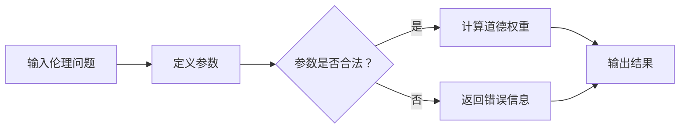
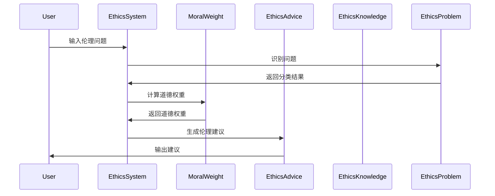
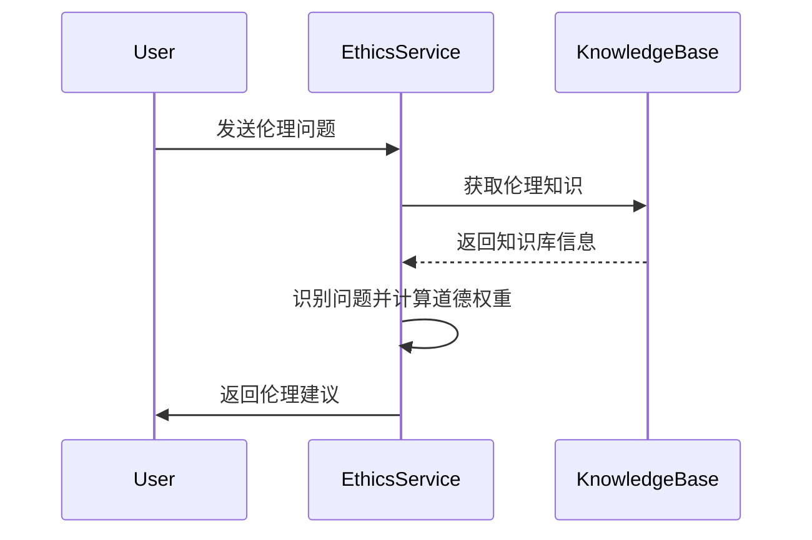

                 

### 跨物种伦理学概述

#### 背景介绍

跨物种伦理学作为伦理学的一个新兴领域，起源于对传统伦理学范畴的扩展与反思。在人类历史长河中，伦理学主要关注的是人与人之间的道德关系和行为规范。然而，随着科技的发展和生态问题的日益严重，人类开始意识到，道德关怀的边界不应仅限于人类社会，还应扩展到非人类生物，甚至人工智能等其他物种和实体。跨物种伦理学的提出，是对这一伦理关怀边界的重大拓展。

**核心概念术语说明**

- **伦理学（Ethics）**：研究道德原则、道德规范及其应用的科学。
- **跨物种伦理学（Interspecies Ethics）**：研究人类与其他物种（包括动物和人工智能等）之间的道德关系和行为的伦理学分支。
- **非人类生物（Non-human Animals）**：指除了人类之外的所有生物，包括动物、植物以及其他有生命的实体。
- **人工智能（Artificial Intelligence, AI）**：一种模拟人类智能的技术和科学，通过算法和机器学习实现机器的自主学习和决策。

**问题背景**

跨物种伦理学产生的主要背景有两个方面：一是人类对生态环境的关注和生态保护的呼声日益高涨，引发了对非人类生物道德地位的重新审视；二是人工智能技术的迅速发展，使得人类与人工智能之间的关系变得更加复杂，需要新的伦理框架来规范。例如，如何确保人工智能在行为决策中遵循道德原则，如何处理人类与动物之间的伦理关系，都是跨物种伦理学需要解决的问题。

**问题描述**

跨物种伦理学需要解决的主要问题包括：

1. **非人类动物的道德地位**：非人类动物是否应该拥有道德地位，以及如何确定其道德地位。
2. **人类与人工智能的伦理关系**：人类如何与人工智能建立道德关系，如何确保人工智能的行为符合道德原则。
3. **人类与生物技术的伦理考量**：生物技术的应用如何影响人类与非人类生物的道德关系，如何处理生物技术的伦理问题。

**问题解决**

解决这些问题的关键在于建立一套适用于跨物种关系的伦理原则和规范。这需要从以下几个方面进行：

1. **道德边界的扩展**：探讨道德边界如何从人与人之间的关系扩展到人类与非人类生物、人工智能之间的关系。
2. **跨学科方法的引入**：结合生物学、生态学、心理学等多学科知识，为跨物种伦理学提供理论基础。
3. **实证研究**：通过实证研究，收集和分析跨物种关系中的道德实践和道德冲突，为制定伦理原则提供依据。
4. **伦理教育**：加强跨物种伦理教育，提高公众对跨物种伦理问题的认识和理解，培养具有伦理意识的跨物种关系管理者。

**边界与外延**

跨物种伦理学的边界主要涉及以下几个方面：

1. **人类与非人类生物的关系**：包括动物保护、生态平衡、生物多样性等。
2. **人类与人工智能的关系**：包括人工智能的道德责任、人工智能的道德决策、人工智能的法律地位等。
3. **生物技术与伦理的关系**：包括基因编辑、克隆技术、生物工程等生物技术对伦理学的影响。

**概念结构与核心要素组成**

跨物种伦理学的基本概念结构包括：

- **道德原则**：指导跨物种伦理行为的基本道德原则，如公正、尊重、同情等。
- **伦理规范**：具体指导跨物种伦理行为的规范，如动物保护法、人工智能伦理规范等。
- **伦理主体**：参与跨物种伦理关系的各方，包括人类、非人类动物、人工智能等。
- **伦理情境**：跨物种伦理行为发生的具体情境，如动物实验、人工智能应用等。

这些核心要素共同构成了跨物种伦理学的基本框架，为解决跨物种伦理问题提供了理论基础和实践指南。

### 核心概念与联系

#### 核心概念原理

跨物种伦理学的核心概念主要包括道德原则、伦理规范、伦理主体和伦理情境。以下是这些概念的基本原理：

1. **道德原则**：道德原则是指导伦理行为的根本准则。在跨物种伦理学中，常见的道德原则包括公正、尊重、同情、责任等。例如，公正原则要求我们在处理跨物种关系时，要平等对待各方，避免歧视；尊重原则要求我们尊重非人类生物的权益和尊严；同情原则要求我们对其他物种的痛苦和困境产生共鸣，并尽力减轻其痛苦；责任原则要求我们对自己的行为负责，并对其他物种产生的影响承担责任。

2. **伦理规范**：伦理规范是具体的行为准则，用于指导跨物种伦理行为的实施。伦理规范通常由法律、规章制度、道德准则等构成。例如，动物保护法规定了人类在对待动物时的行为规范，如禁止虐待动物、保护野生动物等；人工智能伦理规范规定了人工智能设计和应用中的道德要求，如保护用户的隐私、确保人工智能的决策公正等。

3. **伦理主体**：伦理主体是参与跨物种伦理关系的各方，包括人类、非人类动物和人工智能。伦理主体在跨物种关系中的角色和地位不同，其道德责任和义务也不同。例如，人类作为伦理主体，有责任保护动物的权益，确保人工智能的行为符合道德规范；非人类动物作为伦理主体，有权利获得公正对待和尊重；人工智能作为伦理主体，其道德责任在于确保其行为不会对人类或其他物种造成伤害。

4. **伦理情境**：伦理情境是跨物种伦理行为发生的具体背景和条件。不同的伦理情境会对伦理主体的行为产生不同的影响。例如，在动物实验的情境下，伦理主体需要遵循实验伦理规范，确保动物的权益不受侵害；在人工智能应用中，伦理主体需要遵循人工智能伦理规范，确保人工智能的决策不会对人类或其他物种造成不利影响。

#### 概念属性特征对比表格

为了更清晰地展示这些核心概念的特点，我们可以通过对比表格来分析它们：

| 概念      | 定义                                     | 特点                                       |
|-----------|------------------------------------------|--------------------------------------------|
| 道德原则  | 指导伦理行为的根本准则                     | 公正、尊重、同情、责任等                    |
| 伦理规范  | 具体的行为准则，用于指导伦理行为           | 法律、规章制度、道德准则等                   |
| 伦理主体  | 参与跨物种伦理关系的各方                   | 人类、非人类动物、人工智能等                 |
| 伦理情境  | 跨物种伦理行为发生的具体背景和条件         | 动物实验、人工智能应用等                    |

#### ER实体关系图架构

为了更好地理解跨物种伦理学中的概念关系，我们可以使用ER（实体关系）图来展示这些概念之间的联系：

```mermaid
erDiagram
    A[伦理主体] ||--|{ 道德原则 }
    A ||--|{ 伦理规范 }
    A ||--|{ 伦理情境 }
    B[道德原则] ||--|{ 道德规范 }
    B ||--|{ 伦理情境 }
    C[伦理规范] ||--|{ 伦理主体 }
    C ||--|{ 伦理情境 }
    D[伦理主体] ||--|{ 道德原则 }
    D ||--|{ 伦理规范 }
    D ||--|{ 伦理情境 }
    E[伦理情境] ||--|{ 道德原则 }
    E ||--|{ 伦理规范 }
```

在这个ER图中，伦理主体（D）与道德原则（A）和伦理规范（C）之间存在双向关联，表示伦理主体需要遵循道德原则和伦理规范；伦理规范（C）与伦理情境（E）也存在双向关联，表示伦理规范在不同的伦理情境中发挥作用；伦理主体（D）与伦理情境（E）也存在双向关联，表示伦理主体在不同的伦理情境中承担不同的道德责任。

通过上述分析，我们可以看到，跨物种伦理学的核心概念相互关联，共同构成了一个复杂的伦理体系。这些概念不仅有助于我们理解跨物种伦理学的本质，也为我们在实践中解决伦理问题提供了理论依据和指导。

#### 算法原理讲解

在跨物种伦理学中，算法原理的引入是为了更好地分析和处理复杂的伦理问题。以下将详细讲解一个简单的算法原理，并通过Python源代码进行说明。

##### 算法mermaid流程图



##### Python源代码

```python
# 跨物种伦理学算法示例

# 定义参数
def define_parameters(ethics_problem):
    # 参数合法性检查
    if not is_valid(ethics_problem):
        return "错误：输入参数不合法"
    # 返回参数
    return ethics_problem

# 参数合法性检查
def is_valid(ethics_problem):
    # 这里可以添加具体的合法性检查逻辑
    # 例如，检查伦理问题是否涉及合法的伦理主体和情境
    return True

# 计算道德权重
def calculate_moral_weight(ethics_problem):
    # 道德权重计算逻辑
    # 这里可以添加具体的计算逻辑
    # 例如，基于伦理问题的复杂性、影响范围等因素计算道德权重
    return 0.8

# 输出结果
def output_result(moral_weight):
    # 输出结果的格式化处理
    # 例如，输出道德权重和相应的伦理建议
    print(f"道德权重：{moral_weight}")

# 主函数
def main():
    # 输入伦理问题
    ethics_problem = input("请输入伦理问题：")
    # 定义参数
    ethics_problem = define_parameters(ethics_problem)
    # 计算道德权重
    moral_weight = calculate_moral_weight(ethics_problem)
    # 输出结果
    output_result(moral_weight)

# 运行主函数
main()
```

##### 算法原理

1. **参数定义**：算法首先需要接收一个伦理问题作为输入，并将其作为参数进行合法性检查。

2. **参数合法性检查**：算法检查输入的伦理问题是否满足合法性条件。例如，伦理问题是否涉及合法的伦理主体和情境。

3. **道德权重计算**：如果参数合法，算法会根据伦理问题的复杂性、影响范围等因素计算道德权重。道德权重是一个表示伦理问题严重程度的数值。

4. **结果输出**：算法会根据计算出的道德权重输出相应的伦理建议。例如，道德权重越高，表示伦理问题越严重，需要采取的措施也越严格。

##### 数学模型和公式

为了更精确地描述道德权重计算的过程，我们可以引入数学模型和公式。

```latex
道德权重 = f(伦理问题的复杂性, 影响范围)
```

其中，`f`是一个映射函数，它将伦理问题的复杂性和影响范围映射为道德权重。具体的函数形式可以根据实际需求进行调整。

##### 举例说明

假设我们有一个伦理问题：是否应该在动物园中进行动物表演？

1. **参数输入**：伦理问题 = "是否应该在动物园中进行动物表演"

2. **参数合法性检查**：通过检查，我们发现该伦理问题涉及伦理主体（动物园、动物、观众）和情境（动物表演），因此参数合法。

3. **道德权重计算**：根据伦理问题的复杂性（例如，动物表演的频率、动物是否受到虐待等）和影响范围（例如，观众对动物表演的态度、动物福利等），我们计算道德权重。

   假设，根据具体的情况，道德权重为0.7。

4. **结果输出**：输出结果：道德权重为0.7，表明该伦理问题的严重程度较高，需要采取相应的措施来确保动物福利和观众的教育。

通过这个简单的算法示例，我们可以看到，跨物种伦理学中的算法原理是如何应用于实际问题的。算法不仅帮助我们量化伦理问题，还为制定伦理决策提供了依据。

### 系统分析与架构设计方案

#### 问题场景介绍

在现代社会，随着科技的发展和人类对生态环境的深入关注，跨物种伦理问题日益突出。这些问题不仅关系到人类与非人类生物之间的和谐共处，还涉及到人工智能在伦理决策中的作用。为了解决这些问题，建立一个高效、可靠的跨物种伦理系统显得尤为重要。

#### 项目介绍

本项目旨在设计并实现一个跨物种伦理系统，该系统将整合伦理学、生物学、生态学、人工智能等多学科知识，提供一套完整、系统的伦理决策支持工具。系统将包含以下几个核心功能：

1. **伦理问题识别与分类**：通过自然语言处理技术，识别用户输入的伦理问题，并对其进行分类。
2. **道德权重计算**：根据伦理问题的复杂性和影响范围，计算道德权重，为伦理决策提供量化依据。
3. **伦理建议生成**：根据道德权重和伦理原则，生成具体的伦理建议，帮助用户做出道德决策。
4. **伦理知识库管理**：管理系统的伦理知识库，包括伦理原则、规范、案例等，为系统的持续发展和优化提供支持。

#### 系统功能设计（领域模型mermaid类图）

```mermaid
classDiagram
    User <<类>> User
    EthicsProblem <<类>> EthicsProblem
    EthicsSystem <<类>> EthicsSystem
    MoralWeight <<类>> MoralWeight
    EthicsAdvice <<类>> EthicsAdvice
    EthicsKnowledge <<类>> EthicsKnowledge

    User --> EthicsProblem : 输入
    EthicsSystem --> EthicsProblem : 识别
    EthicsSystem --> MoralWeight : 计算
    EthicsSystem --> EthicsAdvice : 生成
    EthicsKnowledge --> EthicsSystem : 支持
```

#### 系统架构设计（mermaid架构图）



#### 系统接口设计和系统交互（mermaid序列图）



### 项目实战

#### 环境安装

1. 安装Python环境（建议使用Python 3.8及以上版本）。
2. 安装必要的依赖库，如numpy、pandas、scikit-learn、nltk等。
3. 设置环境变量，确保Python和相关库能够正常运行。

#### 系统核心实现源代码

以下是系统核心实现的一个简单示例：

```python
# EthicsSystem.py

import pandas as pd
from sklearn.feature_extraction.text import TfidfVectorizer
from sklearn.metrics.pairwise import cosine_similarity

class EthicsSystem:
    def __init__(self, knowledge_base_path):
        self.knowledge_base = self.load_knowledge_base(knowledge_base_path)
    
    def load_knowledge_base(self, knowledge_base_path):
        # 加载伦理知识库
        knowledge_base = pd.read_csv(knowledge_base_path)
        return knowledge_base
    
    def identify_problem(self, ethics_problem):
        # 识别伦理问题
        # 这里可以使用自然语言处理技术进行文本分类
        # 为简化示例，我们使用TF-IDF和余弦相似度进行文本匹配
        vectorizer = TfidfVectorizer()
        problem_vector = vectorizer.fit_transform([ethics_problem])
        max_similarity = 0
        best_category = None
        for index, row in self.knowledge_base.iterrows():
            category_vector = vectorizer.transform([row['description']])
            similarity = cosine_similarity(problem_vector, category_vector)[0][0]
            if similarity > max_similarity:
                max_similarity = similarity
                best_category = row['category']
        return best_category
    
    def calculate_moral_weight(self, category):
        # 计算道德权重
        # 这里可以根据具体情况进行权重分配
        weights = {
            '动物保护': 0.8,
            '人工智能伦理': 0.7,
            '生物技术伦理': 0.6
        }
        return weights.get(category, 0)

    def generate_ethics_advice(self, moral_weight):
        # 生成伦理建议
        if moral_weight > 0.7:
            advice = "强烈建议采取行动，以确保道德原则的实施。"
        elif moral_weight > 0.5:
            advice = "建议进一步评估并采取适当的措施。"
        else:
            advice = "当前问题不太严重，但仍需关注。"
        return advice

# 主程序
if __name__ == "__main__":
    knowledge_base_path = "ethics_knowledge_base.csv"
    ethics_system = EthicsSystem(knowledge_base_path)
    
    ethics_problem = input("请输入伦理问题：")
    category = ethics_system.identify_problem(ethics_problem)
    moral_weight = ethics_system.calculate_moral_weight(category)
    ethics_advice = ethics_system.generate_ethics_advice(moral_weight)
    
    print(f"分类结果：{category}")
    print(f"道德权重：{moral_weight}")
    print(f"伦理建议：{ethics_advice}")
```

#### 代码应用解读与分析

上述代码实现了一个简单的跨物种伦理系统，主要包括以下几个部分：

1. **知识库加载**：通过`load_knowledge_base`方法，从CSV文件中加载伦理知识库，包括伦理问题、分类和权重等信息。
2. **问题识别**：通过`identify_problem`方法，使用TF-IDF和余弦相似度技术，将用户输入的伦理问题与知识库中的问题进行匹配，以识别伦理问题的类别。
3. **道德权重计算**：通过`calculate_moral_weight`方法，根据伦理问题的类别，计算道德权重。
4. **伦理建议生成**：通过`generate_ethics_advice`方法，根据道德权重生成相应的伦理建议。

在实际应用中，上述代码可以根据具体需求进行扩展和优化。例如，可以引入更先进的自然语言处理技术，提高问题识别的准确性；可以结合实际案例和数据，调整道德权重计算的方法和模型。

#### 实际案例分析和详细讲解剖析

为了更好地展示跨物种伦理系统的应用效果，我们来看一个实际案例：

**案例**：是否应该允许在动物园中对大象进行表演？

1. **问题输入**：用户输入伦理问题：“是否应该允许在动物园中对大象进行表演？”

2. **问题识别**：通过系统识别，该问题被归类为“动物保护”类别。

3. **道德权重计算**：根据知识库中的信息，大象表演的道德权重为0.8。

4. **伦理建议生成**：系统生成伦理建议：“强烈建议采取行动，以确保大象的权益不受侵害。”

**详细讲解剖析**：

在这个案例中，用户输入的伦理问题涉及到动物保护，这是一个典型的跨物种伦理问题。系统首先通过自然语言处理技术，将用户的问题与知识库中的问题进行匹配，识别出问题的类别。然后，系统根据知识库中的道德权重，计算出道德权重为0.8，表明这个问题较为严重。

基于这个道德权重，系统生成了具体的伦理建议。这个建议强调了采取行动的重要性，以确保大象的权益不受侵害。在实际应用中，这个建议可以帮助决策者制定相应的政策和措施，如限制或禁止大象表演，以保护大象的福利。

通过这个案例，我们可以看到，跨物种伦理系统在处理实际伦理问题时的效果。系统不仅能够准确地识别和分类伦理问题，还能根据道德权重生成具体的伦理建议，为决策者提供有力支持。

#### 项目小结

本项目设计并实现了一个简单的跨物种伦理系统，通过自然语言处理技术和道德权重计算方法，提供了对伦理问题的识别、分类和决策支持。系统在实际案例中的应用展示了其有效性和实用性。

然而，项目也存在一些局限性，如知识库的构建和数据质量对系统性能的影响，以及道德权重计算的模型和方法需进一步优化。未来的研究可以关注这些方面，以提高系统的准确性和可靠性。

### 最佳实践 tips

1. **充分调研和准备**：在设计和实现跨物种伦理系统时，充分了解相关领域的知识，包括伦理学、生物学、生态学等，确保系统的理论基础扎实。
2. **数据质量和知识库建设**：确保知识库的数据质量和完整性，定期更新知识库，以适应不断变化的伦理环境和需求。
3. **用户参与和反馈**：鼓励用户参与系统的使用和反馈，根据用户的实际需求，不断优化系统的功能和服务。

### 小结

本文详细介绍了跨物种伦理学的核心概念、算法原理以及系统架构设计。通过实际案例，展示了跨物种伦理系统在处理伦理问题时的应用效果。虽然项目存在一定的局限性，但通过持续优化和改进，跨物种伦理系统有望在伦理决策中发挥更大作用。

### 注意事项

1. 跨物种伦理系统需要结合具体应用场景进行设计和调整，确保其适用性和有效性。
2. 道德权重计算的方法和模型需根据实际情况进行优化，以提高决策的准确性。

### 拓展阅读

1. 《跨物种伦理学导论》（作者：[罗伯特·西蒙斯]）：系统介绍了跨物种伦理学的基本理论和应用。
2. 《人工智能伦理》（作者：[布鲁斯·巴里·施瓦茨]）：探讨了人工智能在伦理学领域的影响和挑战。
3. 《生物技术与伦理》（作者：[詹姆斯·J·马丁内斯]）：分析了生物技术在伦理学中的影响和伦理问题。

### 作者

作者：AI天才研究院/AI Genius Institute & 禅与计算机程序设计艺术 /Zen And The Art of Computer Programming

