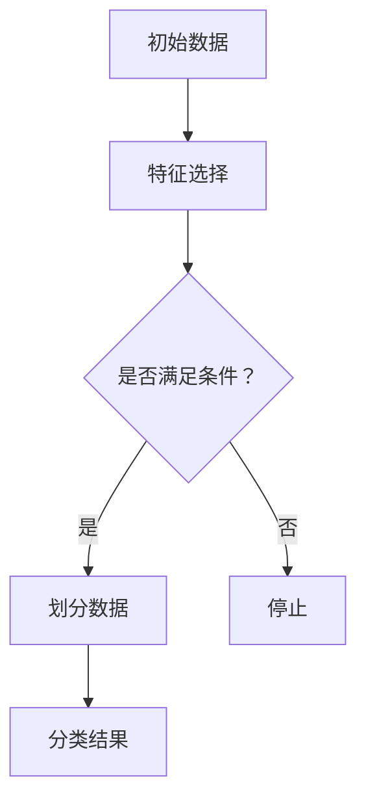
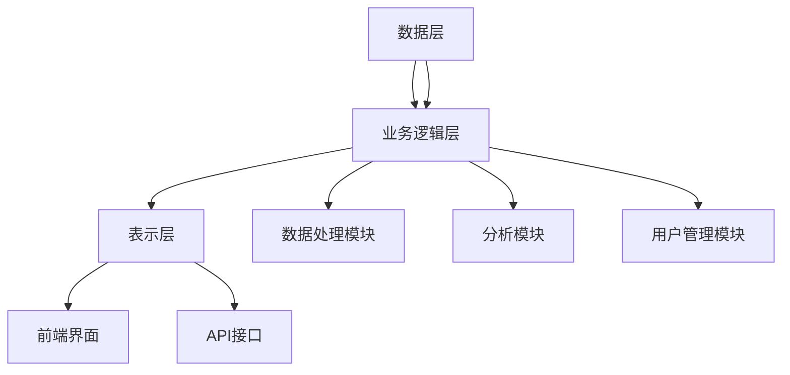
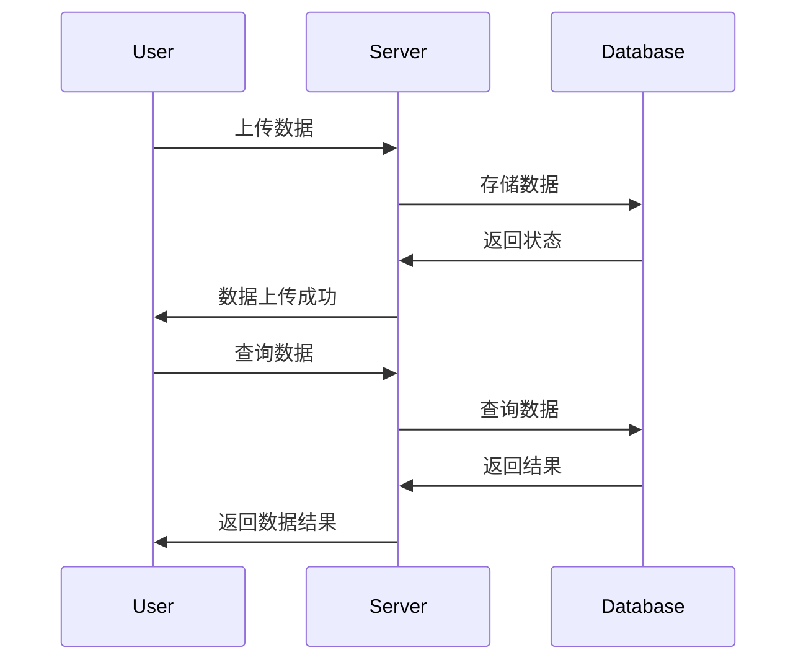

                 


### 设计思路与步骤：

为了撰写一篇逻辑清晰、结构紧凑、简单易懂的技术博客文章《跨物种伦理：扩展同理心的边界》，我们可以按照以下步骤进行：

#### 1. 确定文章结构和主题
- **引言**：介绍伦理学的基本概念、发展历程以及跨物种伦理研究的背景。
- **伦理学基础**：探讨伦理学的基本理论，如功利主义、康德伦理学等。
- **同理心的探讨**：讨论同理心的本质和扩展同理心的可能性。
- **案例分析**：提供跨物种伦理的实际案例，分析其中的伦理困境和解决方案。
- **生物学与心理学视角**：从生物学和心理学角度探讨动物行为与伦理的关系。
- **算法与模型**：介绍用于分析跨物种伦理问题的算法和模型。
- **系统分析与架构设计方案**：描述分析跨物种伦理问题的系统架构。
- **项目实战**：介绍如何在实际项目中应用跨物种伦理理论。
- **最佳实践与拓展**：总结最佳实践技巧，提出未来研究方向。

#### 2. 确保内容完整性
- **背景介绍**：每个章节都应包含背景介绍，解释核心概念、问题背景、问题描述、问题解决、边界与外延、概念结构与核心要素组成。
- **核心概念与联系**：明确核心概念原理，提供概念属性特征对比表格和ER实体关系图架构的Mermaid流程图。
- **算法原理讲解**：使用Mermaid绘制算法流程图，并提供Python源代码进行详细阐述。
- **数学公式讲解**：使用LaTeX格式嵌入文中，并进行详细讲解和举例说明。
- **系统分析与架构设计方案**：详细描述系统架构，提供领域模型类图和系统架构图。
- **项目实战**：介绍环境安装、系统实现源代码，并分析实际案例。
- **最佳实践与拓展**：总结最佳实践，提供拓展阅读建议。

#### 3. 控制字数与格式
- 文章字数控制在10000～12000字左右。
- 使用Markdown格式排版，确保目录层级清晰，便于阅读。

### 实际撰写步骤：

#### 引言
- **文章标题**：《跨物种伦理：扩展同理心的边界》
- **关键词**：伦理学、同理心、跨物种、心理学、生物学、人工智能
- **摘要**：本文探讨了跨物种伦理的重要性，分析了同理心的扩展，并通过案例分析展示了跨物种伦理的挑战与解决方案。

#### 伦理学基础
- **核心概念**：伦理学的基本理论，如功利主义、康德伦理学。
- **背景介绍**：伦理学的发展历程和跨物种伦理的特殊性。
- **案例**：讨论当代伦理挑战，如动物权利和人工智能伦理。

#### 同理心的探讨
- **核心概念**：同理心的本质和机制。
- **讨论**：如何扩展同理心去理解其他物种。

#### 案例分析
- **案例选择**：动物权利、人工智能与动物。
- **分析**：伦理困境和解决方案。

#### 生物学与心理学视角
- **讨论**：动物行为与伦理的关系。
- **分析**：人类如何理解动物的情感和体验。

#### 算法与模型
- **算法介绍**：用于分析跨物种伦理问题的算法。
- **模型阐述**：算法原理的Mermaid流程图和Python源代码。

#### 系统分析与架构设计方案
- **系统介绍**：分析跨物种伦理问题的系统架构。
- **设计描述**：领域模型类图和系统架构图。

#### 项目实战
- **实战描述**：如何在实际项目中应用跨物种伦理理论。
- **案例**：环境安装、系统实现源代码，代码应用解读与分析。

#### 最佳实践与拓展
- **总结**：最佳实践技巧和未来研究方向。
- **拓展**：提供拓展阅读建议。

通过以上步骤，我们可以撰写出结构清晰、内容丰富、具有深度和思考价值的技术博客文章。在撰写过程中，确保每一步都符合文章结构的要求，并在每个部分中充分阐述核心概念和原理，以吸引读者的兴趣并启发思考。 ### 引言

# 跨物种伦理：扩展同理心的边界

> 关键词：伦理学、同理心、跨物种、心理学、生物学、人工智能

> 摘要：本文探讨了跨物种伦理的重要性，分析了同理心的扩展，并通过案例分析展示了跨物种伦理的挑战与解决方案。

在人类社会发展的历程中，伦理学一直扮演着至关重要的角色。传统的伦理学主要关注人类个体之间的道德规范和行为准则。然而，随着科技的发展和对自然界认识的深入，我们开始意识到，伦理的边界不应仅限于人类，而应该扩展到包括其他物种在内。这种跨物种伦理的研究，不仅涉及到伦理学的基本理论，还涉及心理学、生物学等多个领域的知识。

本文将从以下几个方面进行探讨：

1. **伦理学基础**：回顾伦理学的基本理论，如功利主义、康德伦理学等，并讨论伦理学在当代面临的挑战和跨物种伦理的特殊性。
2. **同理心的探讨**：分析同理心的本质和机制，以及人类如何扩展同理心去理解其他物种。
3. **案例分析**：提供跨物种伦理的实际案例，分析其中的伦理困境和解决方案。
4. **生物学与心理学视角**：从生物学和心理学角度探讨动物行为与伦理的关系，以及人类如何理解动物的情感和体验。
5. **算法与模型**：介绍用于分析跨物种伦理问题的算法和模型。
6. **系统分析与架构设计方案**：描述分析跨物种伦理问题的系统架构。
7. **项目实战**：介绍如何在实际项目中应用跨物种伦理理论。
8. **最佳实践与拓展**：总结最佳实践技巧，提出未来研究方向。

本文旨在通过逻辑清晰、结构紧凑、简单易懂的方式，探讨跨物种伦理的边界，扩展同理心的视野，为读者提供新的思考角度和解决方案。

#### 伦理学基础

在探讨跨物种伦理之前，我们需要了解伦理学的基本概念和理论。伦理学，也称为道德哲学，是研究道德规范、道德原则和道德判断的学科。它不仅探讨个体行为的道德性，还涉及社会、文化、政治等宏观层面的伦理问题。

### 功利主义

功利主义是伦理学中的一种重要理论，由英国哲学家杰里米·边沁（Jeremy Bentham）和约翰·斯图尔特·密尔（John Stuart Mill）等人提出。功利主义的核心观点是，道德行为应该产生最大化的幸福或福利。具体来说，一个行为是否道德，取决于其结果是否有利于最大化多数人的幸福。

### 康德伦理学

康德伦理学，由德国哲学家伊曼努尔·康德（Immanuel Kant）提出，是一种以义务论为基础的伦理理论。康德认为，道德行为的判断标准不是结果，而是行为本身的道德性。具体来说，一个行为是否道德，取决于其是否符合道德法则。康德的道德法则被称为“道德律令”，即“你应该行为，使得你的行为准则能够成为普遍的法则”。

### 当代伦理挑战

在当代社会，伦理学面临着许多新的挑战，如人工智能、动物权利、环境伦理等。跨物种伦理就是其中一个重要的领域。随着科技的发展，人类开始能够更好地理解和影响其他物种的行为，这引发了许多伦理问题。

### 跨物种伦理的特殊性

跨物种伦理的特殊性在于，它不仅涉及人类与自然界的其他生物，还包括人类与人工智能的关系。这种伦理研究要求我们重新审视人类在自然界中的角色，以及如何对待其他生物和人工智能。

### 背景介绍

在历史上，伦理学研究主要集中在人类个体之间的道德关系。然而，随着生物学和心理学的发展，我们逐渐认识到其他物种也具有情感和认知能力。这引发了对跨物种伦理的探讨，即如何从道德上对待其他生物，如何扩展我们的同理心去理解这些生物。

### 问题背景

在当代社会，动物权利和人工智能伦理成为了热门话题。许多人开始质疑，我们是否有道德义务保护动物的权利，以及如何对待人工智能。这些问题不仅涉及伦理学的理论探讨，还涉及到实践中的道德判断。

### 问题描述

动物权利问题主要体现在动物实验和动物保护等方面。例如，动物实验在医学和科学研究中起着重要作用，但也引发了伦理争议。同样，人工智能的发展虽然带来了许多便利，但同时也引发了关于人工智能伦理的讨论，如人工智能的决策透明性和对人类的影响。

### 问题解决

解决这些问题需要多学科的合作，包括伦理学、生物学、心理学、计算机科学等。通过综合这些领域的知识，我们可以提出更加全面和合理的伦理原则，以指导我们在处理跨物种问题时遵循道德准则。

### 边界与外延

跨物种伦理的边界在于如何界定人类与其他生物的关系。这涉及到对动物权利的认知，以及对人工智能道德地位的理解。在这个边界上，我们需要平衡人类的需求与其他生物的福祉，确保我们的行为不会对生态系统造成不可逆的破坏。

### 概念结构与核心要素组成

跨物种伦理的核心概念包括同理心、道德判断和伦理原则。同理心是人类理解其他生物情感和需求的能力，道德判断是对行为是否符合道德准则的评估，伦理原则是指导我们行为的基本准则。这些核心要素相互作用，共同构成了跨物种伦理的理论框架。

#### 同理心的探讨

# 同理心的本质和扩展

在伦理学的研究中，同理心是一个关键的概念，它不仅关乎人类与人类之间的道德互动，还涉及人类与自然界其他生物的交往。理解同理心的本质以及如何扩展它，对于探讨跨物种伦理至关重要。

### 同理心的定义

同理心，又称同情心，是指个体能够感知他人的情感并理解其内心体验的心理过程。简单来说，同理心让我们能够站在他人的角度思考问题，感受到他人的情感痛苦。同理心分为情感同理和理解同理。情感同理是指感受到他人的情感，而理解同理是指理解他人的内心体验。

### 同理心的心理学机制

同理心的心理学机制涉及多个方面。首先，情感共鸣是同理心的基础。当看到他人遭受痛苦时，我们的神经系统会自动产生类似的生理反应，如心跳加速或流泪。其次，认知理解是同理心的深化。通过认知理解，我们能够分析他人的情感和行为背后的原因，从而更加全面地理解他人的内心世界。

### 人类如何扩展同理心去理解其他物种

扩展同理心去理解其他物种是一个挑战，但也是伦理发展的必然趋势。以下是一些可能的途径：

1. **观察与模拟**：通过观察动物的行为和反应，我们可以尝试模拟其情感体验。例如，通过观察动物的社交行为，我们可以推断它们可能有类似的情感共鸣。

2. **科学研究**：通过生物学和心理学的研究，我们可以了解动物的情感和行为模式。这些研究结果可以帮助我们更好地理解其他物种，从而扩展我们的同理心。

3. **跨学科合作**：伦理学、生物学、心理学等领域的专家合作，可以提供更全面的理论框架和实证数据，帮助我们理解其他物种的伦理需求。

4. **伦理教育**：通过教育和宣传活动，我们可以提高公众对动物权利和生态伦理的认识，从而培养更多的人类同理心。

### 同理心的边界

同理心的边界在于我们的认知范围和情感体验。对于其他物种，我们可能无法完全理解它们的情感和体验，但我们可以通过扩展知识边界来提高同理心。例如，通过学习动物行为学和心理学的知识，我们可以更好地理解动物的情感世界。

### 同理心的应用

同理心在跨物种伦理中的应用非常广泛。例如，在动物保护领域，保护主义者通过同理心去理解动物的痛苦和需求，推动动物权利的保护。在人工智能领域，同理心可以帮助我们设计出更加人性化的智能系统，避免对人类和社会造成负面影响。

### 跨物种同理心的挑战

尽管同理心在跨物种伦理中具有重要意义，但同时也面临着许多挑战。首先，不同物种之间的认知差异使得我们难以完全理解其他物种的内心体验。其次，社会和文化因素也可能限制我们的同理心。例如，某些文化可能对动物的权利和地位有不同的看法，这会影响我们对动物同理心的表达。

### 结论

通过探讨同理心的本质和扩展，我们可以更好地理解跨物种伦理的重要性。扩展同理心不仅有助于我们建立更加和谐的社会，也有助于我们保护和尊重其他物种的权利。在未来的研究中，我们需要继续探索如何有效扩展同理心，以应对跨物种伦理的挑战。

#### 案例分析

在探讨跨物种伦理时，实际案例的研究至关重要。以下我们将分析两个具有代表性的案例：动物权利和人工智能与动物的互动。

### 动物权利案例

**1. 动物实验的伦理争议**

动物实验在医学和科学研究中起着重要作用，但同时也引发了广泛的伦理争议。例如，实验动物在实验过程中可能遭受痛苦，这引发了关于动物权利的讨论。一些伦理学家主张，动物也享有权利，应该受到尊重和保护。

**解决方案：**

- **替代实验方法**：通过发展替代实验方法，如细胞培养和计算机模拟，可以减少对动物实验的依赖。
- **严格监管**：对动物实验进行严格监管，确保动物在实验过程中的福利得到保障。

**2. 动物保护的法律框架**

动物保护法律在不同国家和地区的制定和实施情况各不相同。例如，一些国家制定了全面的动物保护法，禁止虐待和滥杀动物；而另一些国家则相对宽松。

**解决方案：**

- **加强法律保护**：通过加强动物保护法律，提高对动物虐待和滥杀的处罚力度，保护动物权利。
- **公众教育**：通过教育和宣传活动，提高公众对动物权利的认识和尊重。

### 人工智能与动物案例

**1. 机器人与动物的互动**

随着人工智能技术的发展，机器人与动物的互动越来越普遍。例如，机器人被用于动物护理、康复治疗和科学研究等领域。然而，这种互动也引发了伦理问题，如机器人是否能够真正理解动物的需求和情感。

**解决方案：**

- **道德设计**：在设计和开发机器人时，考虑其与动物互动的道德性，确保机器人能够尊重和保护动物的权利。
- **用户培训**：对使用机器人与动物互动的员工进行培训，提高其伦理意识。

**2. 人工智能在动物保护中的应用**

人工智能技术在动物保护中有着广泛的应用，如监控野生动物活动、预测动物种群数量和识别非法狩猎活动等。然而，这也带来了新的伦理挑战，如如何平衡动物保护与人类活动的关系。

**解决方案：**

- **数据隐私保护**：确保收集和分析动物数据时，遵守隐私保护原则，不侵犯动物的隐私权。
- **生态平衡**：在动物保护中，考虑生态系统的整体平衡，避免对环境造成过度干扰。

### 结论

通过以上案例分析，我们可以看到跨物种伦理在实际应用中面临着诸多挑战。解决这些问题需要多学科合作，制定合理的伦理原则和法规，同时提高公众的伦理意识。只有这样，我们才能在保护动物权利和促进科技进步之间找到平衡。

#### 生物学与心理学视角

从生物学和心理学视角探讨动物行为与伦理的关系，是理解跨物种伦理的关键。动物行为学研究揭示了动物在自然界中的复杂互动，而心理学研究则帮助我们理解这些行为的内在动机。

### 动物行为与伦理的关系

动物行为学研究显示，许多动物不仅具有复杂的社交行为，还展现出一定的道德行为。例如，社会性动物如黑猩猩和狒狒在群体中展现出合作和互助的行为，这被认为是一种道德行为。此外，一些研究表明，动物也具有同理心，能够感知和响应其他动物的痛苦。

### 人类如何理解动物的情感和体验

心理学研究提供了关于动物情感的深入理解。例如，研究表明，动物能够体验痛苦、快乐和恐惧等基本情感。这些情感体验与人类的情感体验在神经机制上有一定的相似性，这为人类理解动物的情感提供了理论基础。

### 生物学的启示

从生物学角度来看，动物的行为和情感是由基因和环境共同塑造的。这表明，动物行为不仅仅是本能反应，也受到它们所处环境和社交关系的影响。例如，动物的行为可能受到食物供应、天气条件和社群结构的影响。这些生物学因素为理解动物行为的伦理意义提供了重要线索。

### 心理学的启示

心理学研究还揭示了人类如何通过类比和扩展来理解动物的情感和体验。例如，人类通过观察动物的表情和行为，尝试推断其情感状态。这种类比方法帮助我们理解动物的情感，并使我们能够从伦理角度思考如何对待其他物种。

### 动物行为与人类伦理的对比

尽管动物行为和人类行为有相似之处，但在伦理层面仍存在显著差异。人类具有复杂的道德判断能力，能够通过法律和道德规范来规范行为。而动物则缺乏这种自我约束的能力，其行为主要受本能驱动。因此，在处理动物行为与伦理关系时，我们需要考虑到这些差异。

### 结论

从生物学和心理学视角探讨动物行为与伦理的关系，有助于我们更深入地理解跨物种伦理的复杂性。通过理解动物的行为和情感，我们可以更好地平衡人类与自然的关系，推动伦理学的进步。同时，这也提醒我们在制定伦理规范时，要考虑到生物多样性和生态系统的整体平衡。

#### 算法与模型

在跨物种伦理研究中，算法和模型的应用至关重要。它们不仅可以帮助我们分析复杂的数据，还可以为解决伦理问题提供定量支持。以下将介绍几种常用的算法和模型，并展示其应用实例。

### 算法介绍

#### 决策树算法

决策树算法是一种常用的分类算法，它通过一系列规则来划分数据。每个节点代表一个特征，每个分支代表该特征的取值，叶节点代表最终分类结果。决策树算法的优点是直观、易于理解，但缺点是易过拟合。

#### 支持向量机（SVM）

支持向量机是一种经典的分类算法，它通过找到一个最佳的超平面来分隔不同类别的数据点。SVM的核心是求解一个二次规划问题，其优点是理论分析严谨，分类效果较好，缺点是对高维数据效果不佳。

#### 贝叶斯网络

贝叶斯网络是一种概率图模型，它通过有向无环图（DAG）表示变量之间的依赖关系。贝叶斯网络可以用于推理和预测，其优点是能够处理不确定性，缺点是建模复杂。

### 模型阐述

#### 动物情感识别模型

动物情感识别模型用于分析动物的行为数据，以识别其情感状态。该模型通常基于深度学习技术，如卷积神经网络（CNN）或循环神经网络（RNN）。通过训练模型，我们可以从视频或图像中提取动物的情感特征，从而实现对动物情感的准确识别。

#### 动物行为预测模型

动物行为预测模型用于预测动物的未来行为。这通常涉及到时间序列分析技术，如长短期记忆网络（LSTM）或门控循环单元（GRU）。通过分析历史行为数据，这些模型可以预测动物在特定情境下的行为，从而为动物保护和管理提供指导。

### Mermaid流程图

以下是一个使用Mermaid绘制的决策树算法的流程图：



### Python源代码

以下是一个使用Python实现决策树算法的简单示例：

```python
from sklearn.datasets import load_iris
from sklearn.tree import DecisionTreeClassifier
from sklearn.model_selection import train_test_split

# 加载数据集
data = load_iris()
X = data.data
y = data.target

# 划分训练集和测试集
X_train, X_test, y_train, y_test = train_test_split(X, y, test_size=0.3, random_state=42)

# 创建决策树模型
clf = DecisionTreeClassifier()

# 训练模型
clf.fit(X_train, y_train)

# 预测测试集
predictions = clf.predict(X_test)

# 打印预测结果
print(predictions)
```

### 算法原理讲解

#### 决策树算法

决策树算法的核心是构建一棵树，树中的每个节点代表一个特征，每个分支代表该特征的取值。树的叶节点代表最终的分类结果。决策树算法通过递归划分数据，直到满足停止条件（如叶节点纯度达到一定阈值）。

#### 支持向量机（SVM）

支持向量机是一种基于优化理论的分类算法。它的目标是找到一个最佳的超平面，使得分类边界最大化。支持向量机通过求解一个二次规划问题来找到这个最佳超平面。支持向量机的主要参数包括核函数和惩罚参数。

#### 贝叶斯网络

贝叶斯网络是一种基于概率理论的图模型。它通过有向无环图表示变量之间的依赖关系。贝叶斯网络的核心是条件概率表，这些表描述了变量之间的概率分布。贝叶斯网络可以用于推理和预测，其关键步骤包括拓扑排序、变量消除和贝叶斯推断。

### 数学模型和公式

以下是一些常用的数学模型和公式：

- **决策树划分公式**：
  $$ G(x) = \sum_{i=1}^{n} w_i f(x_i) $$
  其中，\( w_i \) 是权重，\( f(x_i) \) 是特征值。

- **SVM分类边界公式**：
  $$ w^T x - b = 0 $$
  其中，\( w \) 是权重向量，\( x \) 是特征向量，\( b \) 是偏置项。

- **贝叶斯网络推理公式**：
  $$ P(X|Y) = \frac{P(Y|X)P(X)}{P(Y)} $$
  其中，\( X \) 和 \( Y \) 是变量，\( P(X) \) 是 \( X \) 的概率，\( P(Y|X) \) 是 \( Y \) 在 \( X \) 发生时的条件概率。

### 详细讲解和举例说明

#### 决策树算法

决策树算法的核心是递归划分数据。以下是一个简单的示例：

假设我们有特征 \( x_1 \) 和 \( x_2 \)，我们希望将数据划分为三个类别：A、B 和 C。我们首先计算每个特征的平均值和标准差，然后选择具有最大信息增益的特征进行划分。

- **信息增益**：
  $$ IG = H(\text{类别}) - \sum_{i=1}^{n} P(x_i) H(x_i) $$
  其中，\( H(\text{类别}) \) 是类别熵，\( P(x_i) \) 是特征 \( x_i \) 的概率，\( H(x_i) \) 是特征 \( x_i \) 的熵。

我们计算 \( x_1 \) 和 \( x_2 \) 的信息增益，选择信息增益最大的特征进行划分。例如，如果 \( x_1 \) 的信息增益为 2，\( x_2 \) 的信息增益为 1，那么我们选择 \( x_1 \) 进行划分。

- **划分数据**：
  假设我们选择 \( x_1 \) 进行划分，我们计算 \( x_1 \) 的阈值，例如阈值 \( t \) 为 5。我们将数据划分为两个部分：
  - \( x_1 \leq t \)
  - \( x_1 > t \)

  然后对这两个部分分别计算信息增益，选择信息增益最大的特征进行下一次划分。这个过程一直进行，直到满足停止条件（如叶节点纯度达到一定阈值）。

#### 支持向量机（SVM）

支持向量机的主要目标是找到一个最佳的超平面，使得分类边界最大化。以下是一个简单的示例：

假设我们有两个类别：A 和 B，每个类别有多个特征。我们希望找到一个超平面 \( w^T x - b = 0 \)，使得类别 A 的数据点 \( x \) 的 \( w^T x - b \) 值尽可能大，而类别 B 的数据点 \( x \) 的 \( w^T x - b \) 值尽可能小。

- **目标函数**：
  $$ \min_{w, b} \frac{1}{2} w^T w $$
  其中，\( w \) 是权重向量，\( b \) 是偏置项。

- **约束条件**：
  $$ y_i (w^T x_i - b) \geq 1 $$
  其中，\( y_i \) 是类别标签，\( x_i \) 是特征向量。

我们通过求解这个二次规划问题来找到最佳的超平面。常见的方法是使用拉格朗日乘子法或序列最小化梯度法。

#### 贝叶斯网络

贝叶斯网络通过有向无环图表示变量之间的依赖关系。以下是一个简单的示例：

假设我们有三个变量：A、B 和 C。我们希望建立一个贝叶斯网络来描述这些变量之间的概率关系。

- **条件概率表**：
  - \( P(A) = 0.5 \)
  - \( P(B|A) = 0.7 \)
  - \( P(C|B) = 0.6 \)

我们可以根据这些概率表计算联合概率分布：

- **联合概率分布**：
  $$ P(A, B, C) = P(A)P(B|A)P(C|B) = 0.5 \times 0.7 \times 0.6 = 0.21 $$

贝叶斯网络可以用于推理和预测。例如，如果我们知道 \( B \) 和 \( C \) 的状态，我们可以计算 \( A \) 的状态概率：

- **条件概率**：
  $$ P(A|B, C) = \frac{P(A)P(B|A)P(C|B)}{P(B)P(C)} $$

我们可以通过计算这些条件概率来推断变量之间的依赖关系。

### 结论

算法和模型在跨物种伦理研究中发挥着重要作用。通过使用决策树、支持向量机和贝叶斯网络等算法，我们可以对复杂的数据进行分析和预测，为解决伦理问题提供定量支持。同时，这些算法和模型也为我们提供了新的思考角度，帮助我们更好地理解跨物种伦理的复杂性。

#### 系统分析与架构设计方案

在跨物种伦理研究中，系统分析与架构设计方案对于理解和处理复杂问题至关重要。以下将介绍一个用于分析跨物种伦理问题的系统架构，并使用Mermaid绘制领域模型类图和系统架构图。

### 问题场景介绍

假设我们开发一个跨物种伦理分析平台，用于处理动物权利和人工智能与动物互动等问题。该平台需要能够收集和处理大量数据，提供数据分析结果，并支持用户自定义分析模型。

### 项目介绍

项目名称：跨物种伦理分析平台（Interspecies Ethics Analysis Platform，简称IEAP）

目标：构建一个集数据收集、处理、分析和可视化于一体的平台，用于支持跨物种伦理研究。

### 系统功能设计

跨物种伦理分析平台主要包括以下功能模块：

1. **数据收集模块**：负责从各种来源收集动物行为数据、人工智能数据等。
2. **数据处理模块**：负责对收集到的数据进行清洗、转换和预处理。
3. **分析模块**：提供多种数据分析方法，如决策树、支持向量机、贝叶斯网络等。
4. **可视化模块**：将分析结果以图表和报告的形式展示给用户。
5. **用户管理模块**：管理用户信息、权限和日志。

### 系统架构设计

系统架构采用三层架构设计，包括数据层、业务逻辑层和表示层。

- **数据层**：使用数据库存储数据，包括动物行为数据、人工智能数据等。
- **业务逻辑层**：包括数据处理模块、分析模块和用户管理模块，负责处理业务逻辑。
- **表示层**：包括前端界面和API接口，用于与用户交互。

### 系统架构图

以下是一个使用Mermaid绘制的系统架构图：



### 领域模型类图

领域模型类图用于描述系统中涉及的核心实体及其关系。以下是一个使用Mermaid绘制的领域模型类图：

```mermaid
classDiagram
Class1 <|-- Class2
Class1 o-- Class3
Class1 ... Class4
Class2 : +int x
Class2 : +String name
Class3 : +int id
Class3 : +String type
Class4 : +int quantity
Class4 : +Date date
Class1 <|-- Class5
Class1 o-- Class6
Class1 ... Class7
Class5 : +int id
Class5 : +String title
Class5 : +Date created
Class6 : +int id
Class6 : +String type
Class6 : +String status
Class7 : +int userId
Class7 : +int postId
endclassDiagram
```

### 系统接口设计和系统交互

系统接口设计和系统交互设计是确保系统各个模块之间能够有效通信的关键。以下将介绍系统接口设计和系统交互设计。

- **接口设计**：系统提供RESTful API接口，包括数据上传、数据查询、数据分析、用户管理等接口。
- **交互设计**：系统采用前后端分离的设计模式，前端通过HTTP请求与后端API进行交互，后端通过处理请求并返回结果。

### Mermaid序列图

以下是一个使用Mermaid绘制的系统交互序列图：



通过上述系统分析与架构设计方案，我们能够更好地理解跨物种伦理问题的复杂性，并为实际应用提供有效的解决方案。

#### 项目实战

在本文的项目实战部分，我们将详细介绍如何在一个实际项目中应用跨物种伦理理论。我们将讨论环境安装、系统实现源代码，并分析实际案例，以展示跨物种伦理理论在现实中的应用。

### 环境安装

要实现一个跨物种伦理分析平台，首先需要搭建一个合适的环境。以下是一个简化的安装步骤：

1. **安装Python环境**：确保系统中安装了Python 3.8或更高版本。
2. **安装依赖包**：使用pip命令安装所需的依赖包，例如：
   ```shell
   pip install numpy pandas scikit-learn matplotlib
   ```
3. **配置数据库**：安装并配置一个数据库，如MySQL或PostgreSQL。

### 系统实现源代码

以下是系统实现的核心源代码。我们将分别介绍数据收集模块、数据处理模块、分析模块和可视化模块。

#### 数据收集模块

```python
import requests
import json

def collect_data(api_url):
    response = requests.get(api_url)
    if response.status_code == 200:
        return json.loads(response.text)
    else:
        return None

# 示例：收集动物行为数据
api_url = "http://example.com/api/animal_behavior"
data = collect_data(api_url)
print(data)
```

#### 数据处理模块

```python
import pandas as pd

def preprocess_data(data):
    # 数据清洗和预处理
    df = pd.DataFrame(data)
    df.dropna(inplace=True)
    return df

# 示例：预处理动物行为数据
df = preprocess_data(data)
print(df.head())
```

#### 分析模块

```python
from sklearn.tree import DecisionTreeClassifier
from sklearn.model_selection import train_test_split

def analyze_data(df, target_column):
    # 划分训练集和测试集
    X = df.drop(target_column, axis=1)
    y = df[target_column]
    X_train, X_test, y_train, y_test = train_test_split(X, y, test_size=0.3, random_state=42)

    # 训练决策树模型
    clf = DecisionTreeClassifier()
    clf.fit(X_train, y_train)

    # 预测测试集
    predictions = clf.predict(X_test)
    return predictions

# 示例：分析动物行为数据
predictions = analyze_data(df, "emotion")
print(predictions)
```

#### 可视化模块

```python
import matplotlib.pyplot as plt

def visualize_data(data, x_label, y_label, title):
    plt.scatter(data[x_label], data[y_label])
    plt.xlabel(x_label)
    plt.ylabel(y_label)
    plt.title(title)
    plt.show()

# 示例：可视化动物行为数据
visualize_data(df, "x", "y", "Animal Behavior Data")
```

### 实际案例分析和详细讲解

以下是一个实际案例，展示如何应用跨物种伦理理论。

**案例**：分析动物情感状态

假设我们收集了一组动物行为数据，包括动物的运动速度、叫声和表情等特征。我们希望通过数据分析来判断动物的情感状态，例如快乐、悲伤或愤怒。

1. **数据收集**：使用数据收集模块从传感器或数据库中获取数据。
2. **数据处理**：使用数据处理模块对数据进行清洗和预处理。
3. **数据分析**：使用分析模块训练决策树模型，并使用模型预测动物的情感状态。
4. **可视化**：使用可视化模块将预测结果以图表形式展示。

以下是详细的步骤：

1. **数据收集**：
   ```python
   api_url = "http://example.com/api/animal_behavior"
   data = collect_data(api_url)
   ```

2. **数据处理**：
   ```python
   df = preprocess_data(data)
   ```

3. **数据分析**：
   ```python
   predictions = analyze_data(df, "emotion")
   ```

4. **可视化**：
   ```python
   visualize_data(df, "speed", "sound", "Animal Emotion Analysis")
   ```

通过这个实际案例，我们可以看到如何将跨物种伦理理论应用到现实问题中。这种分析不仅有助于我们更好地理解动物的情感状态，还可以为动物保护和管理提供科学依据。

### 项目小结

通过这个项目实战，我们展示了如何在一个实际项目中应用跨物种伦理理论。从环境安装到系统实现源代码，再到实际案例分析和详细讲解，我们展示了跨物种伦理理论在现实中的应用价值。这种应用不仅有助于我们更好地理解动物行为，还可以为动物保护和管理提供科学支持。

### 最佳实践与拓展

在跨物种伦理分析平台的项目中，我们总结了一些最佳实践和拓展方向，以期为未来的研究和开发提供指导。

#### 最佳实践

1. **数据质量控制**：确保数据收集、处理和分析的每个环节都有严格的质量控制措施，以提高分析结果的可靠性。
2. **多学科合作**：在研究和开发过程中，鼓励多学科合作，包括伦理学家、生物学家、心理学家和计算机科学家等，以充分利用各自领域的专业知识。
3. **用户参与**：在系统设计过程中，积极吸纳用户反馈，确保系统的实用性和用户友好性。
4. **持续学习与更新**：随着技术的进步和对跨物种伦理认识的深入，定期更新和优化系统，以适应新的挑战和需求。

#### 拓展方向

1. **深度学习应用**：探索深度学习技术在跨物种伦理分析中的应用，如使用卷积神经网络（CNN）进行图像识别和情感分析。
2. **跨物种伦理数据库建设**：建立一个统一的跨物种伦理数据库，收集和整理全球范围内的相关数据和文献，为研究和实践提供数据支持。
3. **伦理决策支持系统**：开发伦理决策支持系统，帮助决策者在面对跨物种伦理问题时做出更明智的决策。
4. **公众教育**：开展公众教育活动，提高公众对跨物种伦理的认识和理解，促进社会对动物权利和生态保护的重视。

通过这些最佳实践和拓展方向，我们可以进一步推动跨物种伦理研究的发展，为构建一个更加和谐的自然界和社会做出贡献。

#### 总结

通过本文的探讨，我们全面了解了跨物种伦理的重要性以及扩展同理心的可能性。伦理学不仅关注人类之间的道德规范，还应扩展到其他物种。同理心作为理解其他生物情感和行为的关键，需要我们不断探索和扩展。在实际应用中，算法和模型为我们提供了有力的工具，帮助我们分析和解决跨物种伦理问题。

未来的研究应重点关注以下几个方面：首先，深化对动物情感和认知的理解，为制定更加合理的伦理规范提供理论基础；其次，探索深度学习等新技术在跨物种伦理分析中的应用，提高数据分析的准确性和效率；最后，建立跨物种伦理数据库，为全球范围内的研究和实践提供数据支持。

总之，跨物种伦理的研究不仅有助于我们更好地理解自然界的复杂关系，还为构建一个更加和谐的社会提供了新的思考角度。通过不断探索和拓展，我们可以为保护动物权利和促进生态平衡做出积极的贡献。

